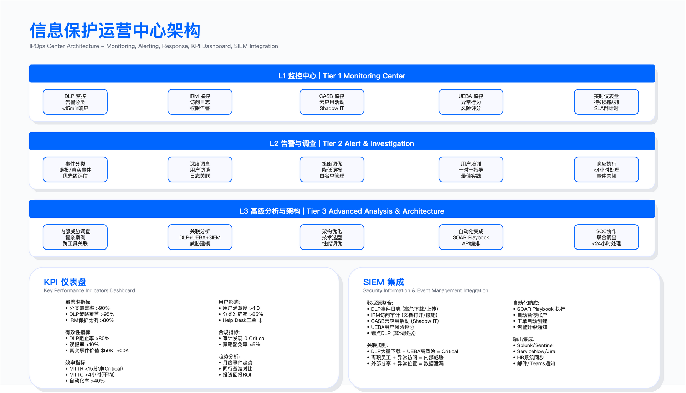
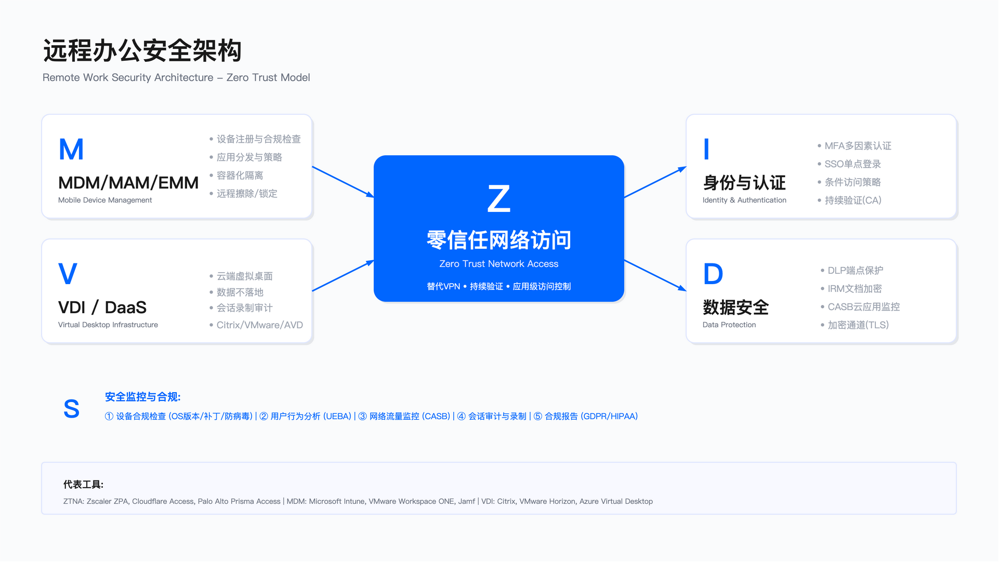

# 10.9 实战案例

## 概述

本节通过四个典型案例展示信息保护体系从规划到落地的完整实践。案例涵盖金融行业 DLP 部署、科技公司源代码保护、制造业知识产权管理，以及远程办公安全转型，呈现不同业务场景下的技术选型、实施路径与经验教训。

案例内容基于实际项目经验整理，公司名称与具体数据均为化名或示例口径，用于说明实施逻辑与决策权衡，不构成对任何具体企业的描述。

---

## 10.9.1 案例一：金融机构 DLP 体系建设

### 背景与驱动因素

某全球性银行（化名 Global Bank）面临多重合规压力：GDPR 生效带来的数据保护要求、金融监管（PCI DSS、SOX）的审计义务，以及此前发生的客户数据泄漏事件。该银行决定在全球范围内部署企业级 DLP 系统。

项目启动时的现状评估显示：数据分散在多个业务系统中，仅有邮件网关的基础过滤能力，无法提供数据访问的完整审计轨迹，且过去曾发生过未被检出的员工数据窃取事件。

### 实施分阶段路径

**第一阶段：现状发现与规划**

项目团队首先完成数据流映射，识别业务系统中的敏感数据分布（客户 PII、交易数据、内幕信息等），并评估现有控制的差距。在供应商选型时，综合考虑产品成熟度、多渠道覆盖能力（网络、端点、云），以及与现有基础设施的集成难度。

**第二阶段：试点验证**

选择财富管理部门作为试点范围，部署网络 DLP（邮件网关与 Web 代理集成）和端点 DLP（覆盖高风险岗位）。试点阶段采用审计模式运行，收集实际业务数据用于策略调优。

试点期间遇到的主要问题包括：初期误报率过高导致用户投诉、端点 Agent 对设备性能的影响，以及 SSL 解密所需的 PKI 证书部署带来的 IT 阻力。应对策略是先以审计模式运行收集数据，再逐步迭代调优阈值，同时建立误报模式白名单。

**第三阶段：全球推广**

在试点问题修复后，按地域分批推广。推广过程中需处理各地区的差异化要求：部分地区因政府监管要求需部署本地网关、部分地区需与工会签署数据保护协议、部分地区的监管机构要求定期提交审计报告。

DLP 策略从初期的基础策略逐步演进，按业务单元和地域定制扩展。策略设计遵循分级响应原则：低敏数据仅审计记录，高敏数据触发阻止或审批流程。

**第四阶段：运营优化**

建立 DLP 运营团队（IPOps），与 SOC 集成实现全天候监控。运营优化措施包括：重复误报自动加入白名单、使用机器学习辅助文档分类，以及与 SOAR 平台集成实现自动化响应。

### 适用边界

本案例的实施路径适用于：具有多地域运营且面临多法规合规要求的大型金融机构；数据分散在多个系统且缺乏统一监控能力的组织；已发生数据泄漏事件或面临监管审计压力的场景。

不适用于：数据量较小且业务系统单一的小型机构（可采用轻量级方案）；无跨境业务且仅需满足单一法规的场景（可简化区域定制流程）。

### 实施约束与权衡

DLP 项目的主要约束包括：性能影响方面，端点 Agent 的 CPU 占用需控制在可接受范围，否则影响用户接受度；隐私争议方面，SSL 解密可能引发隐私担忧，最终采取仅解密外发流量的折中方案；跨国合规方面，各国劳动法和隐私法差异大，需针对不同地区调整监控策略和用户告知方式；成本管控方面，区域定制和咨询费用可能导致预算超支，建议预留缓冲。

### 常见误区

常见误区包括：低估变更管理投入——DLP 项目的技术部署相对直接，但用户沟通、培训和流程变更往往被低估，导致上线初期 Help Desk 工单激增；一次性策略思维——将 DLP 策略视为上线即完成的交付物，忽略持续调优的必要性，实际上策略需要根据业务变化和误报反馈持续迭代；全量覆盖优先——试图一次覆盖所有数据类型，导致策略复杂度失控，应优先覆盖高价值数据（如客户 PII），再逐步扩展。

### 验证方法

验证方法包括：策略有效性测试——使用包含已知敏感数据的测试文件验证检测规则，覆盖常见绕过场景（加密压缩、图片嵌入等）；误报率跟踪——建立误报率统计机制，设定阈值（如低于某个百分比）作为策略成熟度指标；合规审计验证——通过内部或外部审计验证 DLP 系统能否满足监管报告要求。

### 运行关注指标

| 指标名称 | 触发条件/阈值表达 |
|---------|-----------------|
| DLP 事件量 | 月度事件数与环比变化 |
| 误报率 | 假阳性占比，需持续下降 |
| 策略覆盖率 | 已纳入 DLP 监控的数据渠道占比 |
| 用户满意度 | 定期调研，关注上线前后对比 |

### 经验总结

审计模式试运行可避免上线初期的业务影响；分阶段部署允许在全面推广前修复试点问题；用户培训和沟通的投入应与技术部署并重；DLP 系统的价值证明需与业务目标对齐（如帮助通过监管审计）。

---

## 10.9.2 案例二：科技公司源代码保护

### 背景与触发事件

某 AI 芯片领域的科技公司（化名 TechUnicorn）曾发生核心工程师离职跳槽至竞争对手，并窃取神经网络加速器设计代码的事件。该事件导致公司的研发投入和技术领先优势受损。事件的检测与响应经历如下：工程师提出辞职后，HR 按标准流程通知安全团队；DLP 系统检测到异常行为——单日 Git clone 大量代码仓库；调查确认工程师将整个设计库下载到外置硬盘；公司立即终止雇佣、收回设备并启动法律诉讼；最终通过法律途径获得赔偿并阻止被窃代码的使用。

### 根因分析

事件暴露了多层面的控制缺失：

技术层面：Git 服务器缺乏 DLP 监控，大量 clone 操作未触发告警；USB 端口未限制，外置存储设备可自由使用；离职前员工的访问权限未收紧；代码缺乏水印或指纹机制，难以追踪来源。

流程层面：缺乏离职风险评估流程；竞业协议的约束力不足；知识产权保护培训不到位。

### 补救措施设计

Git 安全加固

访问控制从“所有工程师可访问所有仓库”调整为最小权限原则（仅授予相关项目的访问权限）。部署 Git 活动监控，设置阈值告警（如单日下载量超过设定值、非工作时间操作等），并对离职员工标记实现自动限制访问。要求所有 commit 必须 GPG 签名，服务器拒绝未签名提交。

端点控制

禁止 USB 存储设备（经 IT 审批的例外除外），使用端点安全工具强制执行。部署屏幕动态水印（包含用户名和时间戳），用于拍照或截屏场景的追踪。源代码禁止打印，通过 DLP 检测代码特征并阻止。

离职风险管理程序

员工提交辞职当日触发以下动作：UEBA 系统标记为高风险、Git 访问降级为只读（禁止 clone）、禁用 USB 和打印权限、启动实时监控（EDR 与 DLP 联动）。离职面谈由 HR、安全和法务共同参与，强调 IP 义务。离职后持续监控公开代码仓库（检测代码相似性）、竞争对手产品（检测专利侵权）等。

法律加固

雇佣合同强化 IP 归属条款、延长竞业禁止期限、增加违约金条款。入职和年度培训强调知识产权义务，定期抽查（代码审查、设备检查），对违规行为零容忍（刑事报案与民事诉讼并行）。

### 适用边界

本案例的控制措施适用于：拥有高价值源代码或设计文档的科技公司；存在竞争对手挖角风险的行业；对知识产权保护有明确法律诉讼需求的场景。

不适用于：代码本身为开源性质的项目；员工流动性极高且岗位无核心 IP 接触的场景。

### 常见误区

常见误区包括：信任优先于验证——开放的工程师文化容易形成“默认信任”的习惯，忽略对高风险行为的技术监控，安全文化应转向“验证后信任”；离职控制滞后——仅在离职当日收回权限，忽略离职前的风险窗口期，应在员工提交辞职时立即启动访问限制和监控强化；技术控制孤立——仅部署技术手段（DLP、EDR）而忽略流程（离职程序）和法律（NDA、竞业协议）的配合。

### 验证方法

验证方法包括：异常检测有效性——模拟大量 clone 操作验证告警是否触发，测试覆盖工作时间和非工作时间场景；USB 阻止测试——使用测试设备验证 USB 存储设备是否被有效阻止；水印追溯测试——模拟截屏场景验证水印是否清晰可识别；离职流程演练——定期演练离职风险管理程序，验证各部门协作的时效性。

### 运行关注指标

| 指标名称 | 触发条件/阈值表达 |
|---------|-----------------|
| Git 异常告警数 | 超过阈值的 clone/pull 操作数量 |
| 阻止的窃取企图 | 经调查确认的真实窃取企图次数 |
| 误报率 | 异常告警中的假阳性占比 |
| IP 泄漏事件 | 确认的知识产权外泄事件（目标为零） |

### 经验总结

预防优于检测——离职前的访问限制比离职后的响应更有效；技术、流程、法律三层防御需协同设计；工程师需要理解 IP 保护的价值（而非单纯的监控），通过案例教育促进文化转变；IP 保护的投入相对于潜在损失而言具有显著的投资回报。

---

## 10.9.3 案例三：制造业知识产权保护

### 背景与业务需求

某工业机器人制造商（化名 Precision Manufacturing）的核心 IP 资产包括：3D CAD 设计文件、生产工艺文档、供应商规格书、测试数据等。公司业务需要与全球供应商共享部分设计信息，但此前曾发生设计图纸被竞争对手抄袭的情况。

核心挑战在于：如何在必要的信息共享与防止过度泄漏之间取得平衡。

### 解决方案设计

信息分类体系

建立四级分类标准：公开级（产品宣传册、展会资料）、供应商共享级（供应商需要的具体零件图）、内部级（完整装配图、工艺参数）、核心 IP 级（核心算法、专利设计、成本模型）。

CAD 文件的 IRM 保护

针对工程设计文件部署 IRM 系统，实现以下控制：供应商仅能查看（禁止打印、截图）、动态水印（包含公司名称和查看者身份）、自动过期（项目结束后设定时间内失效）、远程撤销（供应商合作终止时撤销访问权限）。

工作流程设计为：工程师在创建 CAD 文件时标记分类级别，系统自动应用对应的 IRM 策略，通过专用 Portal 分享（而非邮件附件），供应商需认证后方可打开，所有查看操作记录审计日志。

虚拟数据室（VDR）

针对新产品导入（NPI）等需要深度协作的场景，部署虚拟数据室解决方案。VDR 提供细粒度权限（不同供应商看到不同文件）、防截屏技术、打印水印、时间限制、完整审计日志等功能。

供应商 NDA 程序

标准化 NDA 模板经法务批准，包含保密期限、禁止逆向工程和复制、项目结束后资料返还或销毁、分包商同等义务等条款。执行层面包括年度供应商审计（抽查一定比例）、违规处理（终止合作、赔偿、行业黑名单）。

### 实际事件与响应

在实施保护体系后，公司发现某供应商向第三方转售设计图。检测方式为：拆解竞争对手产品时发现相同设计（包括故意设置的缺陷标记），IRM 审计日志显示该供应商查看过相关图纸，竞争对手产品文档中包含该供应商的水印。

响应措施包括：立即撤销该供应商的所有 IRM 访问权限、启动法律诉讼、切换至备用供应商（B 计划）。最终通过庭外和解获得赔偿，并将该供应商永久列入黑名单。

此事件证明了 IRM 水印在法律诉讼中的关键证据价值。

### 适用边界

本方案适用于：需要与外部供应商共享设计文档的制造业企业；对知识产权有明确保护需求和法律追溯能力要求的场景；使用 CAD 等专业软件且 IRM 工具支持该格式的环境。

不适用于：供应商协作仅限于标准化零件且无定制设计的场景；缺乏 IRM 格式支持或供应商技术能力不足以使用 IRM 客户端的情况。

### 常见误区

常见误区包括：NDA 签署即完成——仅依赖法律文件而缺乏技术控制，NDA 在泄漏发生后才能发挥作用，无法预防；VDR 仅用于并购场景——忽略 VDR 在日常供应链协作中的价值，导致敏感文档通过邮件等不安全渠道分享；备用供应商计划缺失——未准备 B 计划，在需要终止与违规供应商合作时面临业务中断风险。

### 验证方法

验证方法包括：IRM 控制测试——验证供应商账户是否确实无法打印、截图、转发受保护文档；水印可追溯性测试——模拟泄漏场景，验证水印是否能准确识别泄漏源；权限撤销测试——测试撤销操作后，供应商是否立即无法访问已下载的文档；NDA 合规审计——抽查供应商的文档管理实践是否符合 NDA 条款。

### 运行关注指标

| 指标名称 | 触发条件/阈值表达 |
|---------|-----------------|
| IP 泄漏事件 | 确认的设计文档外泄事件数（目标为零） |
| NDA 签署率 | 所有活跃供应商的 NDA 签署覆盖率 |
| VDR 访问审计异常 | 异常访问模式的检出数量 |
| 供应商审计发现 | 年度审计中的违规发现数量 |

### 经验总结

IRM 技术控制与法律协议需配合使用，前者提供预防和证据，后者提供追诉依据；供应商管理需建立分级机制，核心 IP 仅与经过严格审查的供应商共享；备用供应商计划是供应链韧性的必要组成部分；故意设置的“缺陷标记”可作为抄袭检测的技术手段。

---

## 10.9.4 案例四：远程办公安全转型

### 背景与危机响应

某咨询公司（化名 Professional Services Firm）在突发公共卫生事件期间需要在短时间内实现全员远程办公。初期面临的挑战包括：VPN 容量不足、BYOD 设备激增、家庭网络环境风险，以及客户数据保护要求。

危机响应阶段的问题：

紧急扩容 VPN 后仍经常断线，员工开始绕过 VPN 直接访问云应用。大量个人设备未纳入管理（无 MDM/DLP），员工自行使用文件传输服务形成影子 IT。家庭网络环境（IoT 设备、共享 WiFi）带来额外风险。

初期发生的安全事件包括：客户机密文档通过个人邮箱外发（DLP 未覆盖）、视频会议安全配置不当、员工设备在家中被盗且无远程擦除能力。

### 稳定化阶段措施

VPN 替代方案：ZTNA

用零信任网络访问（ZTNA）替代传统 VPN。ZTNA 的优势包括：性能改善（直连应用而非回传数据中心）、最小权限（仅授权访问特定应用而非整个网络）、云原生架构（无容量限制）、用户体验（客户端自动连接）。

成本虽有所增加，但性能和安全性的提升被认为具有相应价值。

BYOD 管理：MAM 优先

选择移动应用管理（MAM）而非移动设备管理（MDM），原因是 MAM 仅管理企业应用和数据，对员工个人隐私的侵入性较低，有助于提高采用率。

MAM 策略包括：企业应用（邮件、协作工具、云存储）受保护、企业数据容器化（禁止复制到个人应用）、设备合规检查（操作系统更新、PIN 设置、未越狱）、离职时仅删除企业数据。

采用用户自助注册方式，配合视频教程和 Help Desk 支持，在较短时间内实现高采用率。

云 DLP 扩展

部署 CASB（云访问安全代理）覆盖 SaaS 应用，策略包括：客户数据外发阻止、文件分享链接需设置密码和过期时间、敏感会议录像自动加密。CASB 同时发现了大量员工自行使用的影子 IT 应用。

### 优化阶段措施

协作工具加固

视频会议工具的安全配置包括：强制密码和等候室、禁止录制到本地（仅允许云端）、敏感会议启用端到端加密、会议 ID 随机生成。协作平台启用 DLP 策略覆盖聊天和文件共享。为客户文档交换建立专用 Portal（IRM 保护）。

端点安全

部署 EDR 覆盖公司设备和 BYOD 设备，实现恶意软件检测（家庭网络感染的设备尤其重要）和自动隔离响应。

用户培训

开展家庭网络安全培训（必修），内容包括：路由器默认密码修改、工作设备使用独立网络、公共 WiFi 场景使用 ZTNA、物理安全（锁屏、设备放置）。

### 长期混合办公模式

公共卫生事件后保留混合办公模式。安全架构从传统的边界安全（防火墙 + VPN）转向零信任架构（身份 + 设备 + 应用层）。

技术栈演进为：身份层（SSO + MFA）、网络层（ZTNA + SWG）、端点层（EDR + MAM）、数据层（DLP + IRM）、监控层（SIEM + UEBA）。

### 适用边界

本方案适用于：需要支持大规模远程或混合办公的企业；员工使用个人设备（BYOD）且对隐私敏感的场景；依赖 SaaS 应用且存在影子 IT 风险的环境。

不适用于：业务性质要求员工必须在物理安全环境内工作的场景（如涉密单位）；网络基础设施不支持 ZTNA 架构的环境。

### 常见误区

常见误区包括：VPN 扩容即解决问题——仅增加 VPN 容量而不解决架构问题，员工仍会因性能问题绕过 VPN，形成安全盲区；MDM 优先于 MAM——对 BYOD 设备强制部署 MDM 导致员工抵触，实际采用率低，MAM 通过尊重个人隐私获得更高接受度；忽略影子 IT——CASB 部署仅覆盖公司采购的 SaaS 服务，忽略员工自行使用的应用，导致数据泄露盲区；技术先于培训——部署大量安全工具但用户不理解使用方式和目的，导致绕过或误用。

### 验证方法

验证方法包括：ZTNA 访问控制测试——验证未授权应用是否确实无法通过 ZTNA 访问；MAM 数据隔离测试——验证企业数据是否无法复制到个人应用；CASB 影子 IT 发现——审查 CASB 发现的影子 IT 列表，评估风险并制定处置策略；钓鱼演练——定期开展钓鱼测试，验证培训效果。

### 运行关注指标

| 指标名称 | 触发条件/阈值表达 |
|---------|-----------------|
| 数据泄露事件 | 确认的数据泄露事件数 |
| DLP 事件量 | 月度事件数及趋势 |
| 钓鱼测试成功率 | 员工点击钓鱼链接的比例（应持续下降） |
| 设备合规率 | 符合安全策略的设备占比 |
| ZTNA 覆盖率 | 通过 ZTNA 访问应用的流量占比 |

### 经验总结

零信任架构在性能和安全性上优于传统 VPN，但需要架构层面的重新设计；MAM 通过尊重隐私获得用户接受度，比强制性 MDM 更适合 BYOD 场景；CASB 的价值不仅在于 DLP，还在于发现和管理影子 IT；技术部署与用户培训需同步推进；危机驱动的转型虽然被动，但可借机推动本应进行的架构升级。

---

## 跨案例经验提炼

### 共性成功因素

四个案例均体现了以下成功要素：

高层支持与业务对齐：信息保护项目需要安全团队与业务领导共同推动，项目目标需与业务价值（合规通过、风险降低、效率提升）对齐。

分阶段实施：采用试点验证后再全面推广的模式，在可控范围内发现和修复问题，避免大规模上线失败。

用户参与：技术控制的有效性取决于用户接受度，培训和沟通的投入应与技术部署并重。培训内容应帮助用户理解“为什么”而非仅告知“做什么”。

持续迭代：策略和配置非一次性交付物，需要根据误报反馈、业务变化和威胁演进持续优化。

### 共性常见误区

低估变更管理：技术部署相对容易，但组织变更（流程调整、用户习惯改变、部门协作）往往被低估。

一次性部署思维：试图在项目阶段完成所有工作，忽略持续运营和优化的资源需求。

用户体验忽视：过度安全导致用户绕过控制，反而形成更大的安全盲区；需在安全与可用性之间寻找平衡点。

指标缺失：没有建立 KPI 体系，无法量化证明项目价值，也无法识别需要优化的领域。

### 行业模式差异

不同行业的信息保护侧重点存在差异：金融行业以合规驱动为主，投入较高，成熟度普遍较高；科技行业以知识产权保护为核心，离职风险管理是关键场景；制造业需平衡供应链协作需求与 IP 保护；专业服务行业（咨询、法律等）以客户数据保护为核心，远程办公是常见场景。

### 技术演进趋势

从案例的时间线可以观察到技术架构的演进：从边界安全（防火墙、VPN、邮件网关 DLP）向云 DLP、CASB、BYOD MAM 演进，进一步向零信任架构（ZTNA、SASE）和 AI 辅助 DLP 演进。

这一演进反映了工作模式（远程/混合办公）、IT 架构（云原生）和威胁形态的变化。

---

## 导航

**[← 上一节：10.8 信息保护运营](./10.8_information_protection_operations.md)** | **[返回章节目录](./README.md)** | **[下一节：第十一章 安全运营中心（SOC） →](../../part_04_security_operations_defense_capabilities/chapter_11_security_operations/11.0_executive_summary.md)**

---

**© 2025 AI-ESA Project. Licensed under CC BY-NC-SA 4.0**

