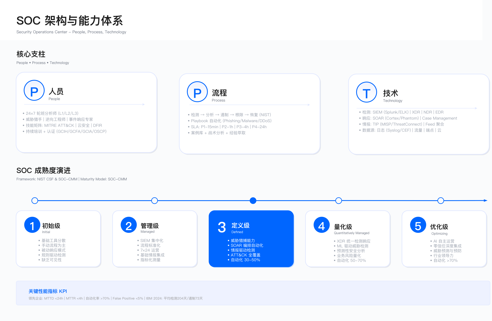

# 11.0 执行摘要

2024 年 7 月，一次安全软件更新导致全球数百万台 Windows 系统同时崩溃。航空公司停飞、医院业务中断、银行服务受阻。这一事件暴露了安全运营中心（SOC）面临的根本困境：企业投入大量资源建设威胁检测体系，却难以识别来自可信供应链的系统性风险。

这不是孤例。2020 年，某供应链攻击[^1]通过软件更新渠道植入后门，从初次植入到被发现历时数月，期间攻击者已渗透多个政府部门与企业网络。被攻陷的受害者自身也是顶级网络安全公司，拥有成熟的 SOC 团队与检测能力。

[^1]: 指 SolarWinds 供应链攻击事件（2020 年 12 月披露），出于出版规范进行脱敏处理。详见 CISA Alert AA20-352A。

2023 年，某文件传输软件[^2]的零日漏洞在披露后 48 小时内被大规模利用，攻陷全球数千家机构。受害企业的共同特征是：SOC 监控覆盖了网络边界、终端系统与云平台，却未将第三方文件传输工具纳入资产清单，缺乏相应的日志接入与告警规则。

[^2]: 指 MOVEit Transfer 漏洞利用事件（CVE-2023-34362），出于出版规范进行脱敏处理。

## SOC 建设的三个核心困境

### 1. 检测覆盖的结构性盲区

传统 SOC 架构以"边界防御 + 终端保护"为中心，在网络流量与主机日志监控上已形成成熟能力。但企业攻击面已发生根本变化。

**攻击面扩展带来的挑战**

- SaaS 应用采用激增，但多数未纳入 SOC 统一监控体系
- 云原生环境（容器、Kubernetes）引入新的攻击向量，传统 SIEM 难以解析云控制平面日志
- 软件供应链依赖复杂（直接与间接依赖数以百计），多数企业缺乏软件物料清单（SBOM）可见性
- IoT 与 OT 设备规模庞大，工控协议日志格式与传统 IT 系统差异显著

**适用边界**

上述盲区的存在受限于以下条件：

- 日志接入成本：云服务与 SaaS 应用的日志导出通常需额外付费
- 协议兼容性：OT / IoT 设备采用非标准协议，SIEM 需定制解析器
- 组织可见性：影子 IT 与未经批准的云服务使用，IT 部门无法感知其存在

**常见误区**

- 认为部署了 SIEM 等同于建立了全面监控，忽视日志源覆盖度评估
- 只关注"已知资产"的监控，未建立资产发现与动态清单更新机制
- 将监控盲区归因于"工具能力不足"，而非系统化的攻击面管理问题

**验证方法**

- 基于 MITRE ATT&CK 框架，评估检测覆盖度（Data Sources Coverage）
- 定期执行红队演练，测试盲区是否可被利用
- 通过资产发现工具（主动扫描 + 被动流量分析），对比资产清单完整性

**运行指标**

- 日志源覆盖率：已接入日志的资产数 / 总资产数
- 检测覆盖度：可检测的 ATT&CK 技术数 / 企业相关技术总数
- 盲区修复周期：从发现监控盲区到完成日志接入的平均时间

### 2. 从检测到响应的决策困境

即使 SOC 检测到异常告警，团队也常陷入"犹豫 → 观望 → 错过响应窗口"的循环。

**典型案例：检测能力充足但响应失败**

2013 年，某零售企业[^3]的 SOC 使用商业威胁检测系统发现门店终端的恶意软件活动，系统生成高危告警。但 SOC 团队未采取隔离措施，最终攻击者在系统中驻留数周，窃取大量支付卡数据。

[^3]: 指 Target 数据泄露事件（2013 年 11-12 月），出于出版规范进行脱敏处理。详见 US Senate Commerce Committee Report，2014。

**响应失败的根本原因**

1. **误报经验主义**：该企业的威胁检测系统每周产生大量高危告警，但历史验证显示绝大多数为误报。分析师基于经验判断，认为本次告警也是误报，未深入分析。
2. **业务理解不足**：SOC 团队对门店终端的正常运维模式缺乏了解，无法判断告警中的异常进程行为是恶意活动还是合法维护操作。
3. **响应权限模糊**：告警发生在业务高峰期，SOC 团队不确定是否有权限隔离终端（可能导致收银中断），且无法快速联系业务主管完成决策。

**关键约束**

- 业务连续性压力：隔离或阻断操作可能导致业务中断，需权衡安全风险与业务损失
- 决策时间窗口：高级威胁的响应窗口通常在小时级，跨部门沟通成本可能超过此时限
- 误报容忍度：过度激进的响应会因频繁误报导致业务抱怨，损害 SOC 可信度

**常见误区**

- 认为"检测即响应"，未建立明确的响应决策流程与授权机制
- 将所有告警一视同仁，未根据资产重要性与威胁置信度建立分级响应策略
- 依赖人工判断每个告警，未通过 Playbook 标准化常见场景的响应动作

**验证方法**

- 定期演练：模拟高危告警场景，测试从检测到响应的完整流程与决策时效
- Playbook 覆盖度检查：统计常见告警类型中已有标准响应流程的比例
- 误操作复盘：分析因响应不当导致业务影响的案例，识别决策流程缺陷

**运行指标**

- 平均响应时间（MTTR）：从告警确认到威胁遏制的平均时长
- 响应决策延迟：从告警生成到 SOC 团队做出响应决策的时间
- Playbook 自动化率：可自动执行响应动作的告警类型占比

### 3. 战略价值的认知鸿沟

多数企业将 SOC 视为"成本中心"——必须建设但不产生直接收入的部门。这导致资源投入不足与价值衡量失焦。

**资源配置困境**

- 分析师负载过高，单人监控资产数量远超合理范围
- 预算偏向工具采购，运营投入（人员培训、流程优化）占比低
- 人员流失率高，职业发展路径不清晰导致难以留住人才
- 自动化编排平台因预算限制无法部署，人工处理效率低下

**指标失焦问题**

- 用"告警数量""规则覆盖率"等虚荣指标衡量 SOC 价值，而非"避免的损失""响应时效提升"等结果指标
- 为满足合规要求而建设 SOC，导致只关注"是否部署 SIEM"而非"检测能力是否有效"
- SOC 团队为达成"好看的 KPI"，增加告警规则数量，反而加剧误报与分析师疲劳

**关键约束**

- 安全价值量化困难：避免的损失难以准确计算，ROI 论证缺乏说服力
- 业务理解差距：高层管理者对 SOC 运作机制缺乏认知，难以评估其战略重要性
- 预算周期错配：SOC 能力建设需长期投入，但企业预算审批通常以年度为周期

**常见误区**

- 认为"购买工具 = 建设能力"，忽视人员、流程与持续优化的重要性
- 将 SOC 定位为"IT 部门的技术支撑"，未与业务风险管理、合规治理等战略目标对齐
- 只在发生重大安全事件后才重视 SOC 投入，缺乏前瞻性规划

**验证方法**

- 成熟度评估：使用行业标准成熟度模型评估能力现状
- 业务影响分析：计算假设遭受攻击时的潜在业务损失，论证 SOC 投资价值
- 对标研究：与同行业、同规模企业的 SOC 投入与能力水平对比

**运行指标**

- SOC 投入占安全预算比例：运营成本 / 总安全支出
- 人员配置比：SOC 分析师数量 / 监控资产数量
- 能力成熟度得分：基于标准模型的年度评估结果

---

## 本章目标：构建有效的安全运营体系

本章展示如何构建有效的 SOC——不是通过购买更多工具，而是通过系统化的能力建设。

### 战略层面：重新定义 SOC 使命

**从"监控中心"到"风险决策平台"（11.1）** 

- 将 SOC 定位为支持业务连续性、量化风险暴露、驱动安全投资决策的战略部门
- 明确 SOC 服务目录：威胁检测、事件响应、威胁情报、漏洞管理、合规支撑
- 建立与业务目标对齐的价值衡量框架

**组织模型选择（11.1.2）** 

- 集中式 SOC：统一管理，标准化流程，适用于单一地域或业务线相对简单的企业
- 分布式 SOC：贴近业务，响应灵活，适用于多地域、多业务单元的大型企业
- 混合式 SOC：结合两者优势，全球 SOC 负责战略与标准，区域 SOC 负责本地响应
- 权衡因素：成本、响应时效、文化融合、技术债务

**成熟度演进路径（11.1.3）** 

- Level 1（初始级）：被动响应，依赖人工，无标准流程
- Level 2（可重复级）：建立基本流程，部署 SIEM，开始日志集中管理
- Level 3（已定义级）：标准化 Playbook，威胁情报集成，初步自动化
- Level 4（已管理级）：指标驱动优化，SOAR 广泛应用，主动威胁狩猎
- Level 5（优化级）：预测性防御，AI 驱动检测，持续演进

**适用边界**：成熟度演进通常需 18-36 个月，受限于组织文化、预算周期与人才储备。

### 架构层面：构建覆盖现代攻击面的检测体系

**SIEM / SOAR / XDR 平台选型（11.2）** 

- 评估维度：日志处理能力、查询性能、集成开放性、成本结构
- 常见陷阱："SIEM 成本失控"——未做好日志源优先级规划，盲目接入所有日志导致存储与计算成本激增
- 决策点：自建 vs 商业方案，本地部署 vs 云服务，单一厂商 vs 最佳组合
- 约束：需评估内部运维能力，避免选择超出团队技术栈的复杂方案

**日志管理与数据湖（11.2.5）** 

- 设计目标：支持日均大规模日志处理，实现秒级查询响应
- 成本权衡：热存储（高性能、高成本）vs 冷存储（低成本、查询慢）
- 保留策略：安全日志 vs 审计日志 vs 合规日志，不同保留周期要求
- 验证：通过压力测试确认系统在峰值负载下的性能表现

**云原生检测扩展（11.2.6）** 

- 覆盖范围：云安全态势管理（CSPM）、云工作负载保护（CWPP）、云访问安全代理（CASB）
- 多云挑战：AWS、Azure、GCP、阿里云的日志格式与 API 差异，需统一归一化
- 常见误区：认为云服务商的原生安全工具足够，忽视跨云统一监控需求

### 工程层面：从规则堆砌到精准检测

**检测用例开发（11.3.1）** 

- 基于威胁情报：将外部 IOC 与内部日志关联，识别已知攻击者活动
- 基于行为基线：通过 UEBA 建立正常行为模型，检测偏离基线的异常
- 基于 ATT&CK 映射：确保检测覆盖企业相关的攻击技术（Tactics & Techniques）
- 验证方法：使用 Atomic Red Team 等工具模拟攻击，测试检测用例有效性

**威胁狩猎方法论（11.3.3）** 

- 假设驱动：基于威胁情报与攻击趋势，提出"攻击者可能已渗透"的假设
- 数据源选择：确定验证假设所需的日志与数据源
- 查询与分析：编写检索查询，寻找支持或否定假设的证据
- 闭环改进：将狩猎发现转化为持久化检测规则

**误报优化策略（11.3.5）** 

- 误报根因：规则过于宽泛、基线不准确、上下文信息缺失
- 优化路径：增加关联条件、引入白名单、调整阈值、丰富告警上下文
- 约束：需平衡误报率与漏报率，过度优化可能导致真实威胁被过滤

### 运营层面：建立可持续的响应能力

**事件响应生命周期（11.4）** 

- 准备：建立响应团队、制定 Playbook、准备取证工具
- 检测与分析：告警分类、优先级排序、初步研判
- 遏制、根除与恢复：隔离受影响系统、清除恶意代码、恢复业务
- 事后活动：复盘总结、更新检测规则、改进流程
- 约束：需在"快速遏制"与"完整取证"之间权衡，过早清除可能破坏证据

**SOAR 自动化边界（11.4.4）** 

- 适合自动化：L1 告警分类、IOC 查询、威胁情报富化、常规隔离操作
- 需人工决策：涉及业务中断的阻断操作、复杂攻击的分析研判、高管沟通
- 常见误区：过度自动化导致"假性安全感"，自动化流程未经充分测试即上线
- 验证：定期演练自动化响应流程，确认在各种场景下的正确性

**威胁情报运营（11.5）** 

- 情报来源：开源（公开 IOC）、商业（APT 情报）、行业共享（ISAC）、内部（狩猎发现）
- 情报处理：去重、验证、优先级排序、上下文丰富
- 应用闭环：IOC 阻断 → TTP 分析 → 检测用例开发 → 能力验证
- 约束：需过滤低价值情报，避免"IOC 洪水"导致性能下降与误报增加

### 指标层面：数据驱动的持续改进

**关键指标定义（11.8.2）** 

- MTTD（平均检测时间）：从攻击发生到 SOC 检测到异常的时间
- MTTR（平均响应时间）：从检测确认到威胁遏制的时间
- MTTA（平均确认时间）：从告警生成到分析师确认的时间
- 改进路径：通过自动化、流程优化、技能提升系统性缩短上述指标

**避免虚荣指标陷阱（11.8.5）** 

- 规则数量↑但检出率↓：盲目增加规则导致误报激增，真实威胁淹没在噪声中
- 自动化率↑但误封禁↑：自动化流程缺乏充分验证，导致业务系统被误隔离
- 告警处理量↑但价值产出↓：分析师疲于应对低价值告警，缺乏时间进行深度分析
- 验证：定期审查指标与业务目标的对齐性，避免为 KPI 而 KPI

**高管报告策略（11.8.6）** 

- 翻译技术术语：将"检测到的 ATT&CK 技术"转化为"避免的业务损失"
- 风险量化：使用业务语言描述威胁影响
- 趋势呈现：展示 SOC 能力成长轨迹，而非单次事件细节
- 约束：高管关注结果而非过程，需聚焦业务影响与投资回报

---

## 本章结构导航

本章共 9 个小节，涵盖 SOC 的战略、架构、工程、运营全生命周期。

| 小节 | 核心主题 | 关键输出 |
|------|----------|----------|
| 11.1 战略与组织 | SOC 使命、组织模型、成熟度评估 | 组织架构方案、成熟度路线图 |
| 11.2 架构设计 | SIEM / SOAR / XDR 平台、数据湖、云扩展 | 技术架构设计、平台选型决策 |
| 11.3 检测工程 | 检测用例开发、威胁狩猎、ATT&CK 应用 | 检测规则库、狩猎手册 |
| 11.4 事件响应 | 响应生命周期、SOAR 自动化、War Room | 响应 Playbook、自动化流程 |
| 11.5 威胁情报 | 情报来源、IOC / IOA 管理、TIP 平台 | 情报处理流程、集成方案 |
| 11.6 安全监控 | 7 × 24 运营、告警分级、误报处理 | 运营手册、分级标准 |
| 11.7 漏洞管理 | CVSS / EPSS 评分、补丁管理、虚拟补丁 | 漏洞处置流程、优先级矩阵 |
| 11.8 指标与报告 | KPI / KRI 体系、MTTD / MTTR 优化、高管报告 | 指标仪表板、报告模板 |
| 11.9 实战案例 | 完整 SOC 建设案例、失败教训 | 可复制的实施路径 |

---

## 关键成功要素

基于行业实践与失败教训，有效 SOC 建设的八个关键要素：

1. **高层支持**：获得 CEO / 董事会的战略认可与持续资源承诺，而非仅 CISO 层面的支持
2. **使命对齐**：将 SOC 目标与业务目标深度绑定（如"保障业务连续性"），而非仅满足合规要求
3. **人才投资**：建立清晰的职业发展路径（L1 → L2 → L3 → 威胁狩猎专家），降低流失率
4. **流程标准化**：开发覆盖常见场景的 Playbook，避免每次事件都重新发明轮子
5. **持续优化**：建立基于 MTTD / MTTR / 误报率的数据驱动改进机制，而非一次性项目
6. **跨部门协作**：与 IT 运维、DevOps、业务部门、法务、公关建立预定义协作流程
7. **威胁情报**：从"堆砌 IOC"转向"基于 TTPs 的情报驱动检测"
8. **自动化边界**：识别哪些场景适合自动化（L1 分类），哪些需人工判断（业务权衡）

**失败 SOC 的常见特征**

- 将 SOC 视为"购买工具就能解决的问题"，忽视人员与流程建设
- 过度依赖外包 MSSP，内部团队缺乏响应能力与上下文理解
- 检测规则从未调优，误报率持续处于高位导致分析师麻木
- 事件响应没有 Playbook，每次都临时决策延误处置时机
- SIEM 部署后日志源覆盖不足，存在大量监控盲区
- 缺乏与业务的沟通机制，响应决策因审批流程延迟
- 没有定期演练（红蓝紫团队），检测能力未经实战验证

---

## 导航

**[← 返回章节目录](./README.md)** | **[返回章节目录](./README.md)** | **[下一节：11.1 战略与组织 →](./11.1-soc-strategy-organization.md)**

---

**© 2025 AI-ESA Project. Licensed under CC BY-NC-SA 4.0**
