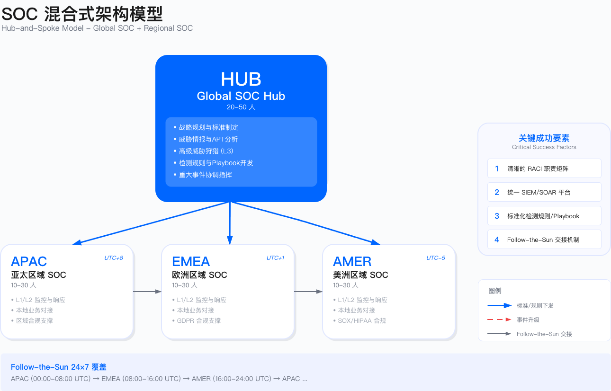

# 11.1 SOC 战略与组织

安全运营中心（Security Operations Center，SOC）的战略定位决定了其能否真正发挥防御价值。SOC 战略定位的核心困境在于：如何平衡"保护业务"与"支持业务"。过度保守导致业务阻塞——每个可疑行为都触发阻断，正常业务流程被频繁中断；过度激进则可能错失威胁——为了减少误报而提高告警阈值，真实攻击被淹没在噪音中。

这一困境的本质是风险容忍度与运营成本的权衡。SOC 不是孤立的技术部门，而是企业风险管理体系的执行层。其战略定位必须与企业整体安全战略对齐，既不能脱离业务实际追求理想化的"零风险"，也不能因成本压力而牺牲基本防护能力。

本节基于 Target 等公开案例，展示组织模型选择、成熟度演进与全球运营的关键权衡。这些案例揭示了一个核心教训：SOC 失效往往不是技术能力不足，而是组织设计、决策权限与业务理解的缺陷。

---

## 11.1.1 SOC 使命与目标

### 从"监控中心"到"风险决策平台"的演进

传统 SOC 的定位是"技术监控部门"——部署 SIEM、编写检测规则、处理告警队列。这种定位在威胁环境相对简单的时代或许足够，但在现代攻击复杂度与业务数字化程度大幅提升的背景下，已经无法满足企业安全需求。

Target 2013 数据泄露事件清晰地暴露了这一定位的根本缺陷。美国参议院调查报告指出：SOC 不缺检测能力，缺的是响应决策能力。FireEye 告警确实检测到了恶意软件，但 SOC 团队陷入决策瘫痪——"这是误报吗？""能隔离 POS 终端吗？""谁来承担业务中断责任？"

决策瘫痪的根源在于：SOC 分析师具备识别威胁的技术能力，但缺乏做出业务决策的权限与信息。隔离一台 POS 终端可能导致该门店无法收款，在感恩节购物高峰期，这意味着直接的营收损失。分析师面临两难选择：隔离可能是"过度反应"导致业务中断，不隔离可能是"疏忽"导致数据泄露。缺乏预定义的决策框架时，"等待确认"成为最安全的职业选择——但却是最危险的安全选择。

这暴露了传统 SOC 使命定义的根本问题：将 SOC 定位为"技术监控部门"，而非"风险决策平台"。有效的 SOC 必须具备三项核心能力：检测威胁的技术能力、评估业务影响的分析能力、以及在不确定性中做出决策的授权与框架。

有效的 SOC 使命应包含三个层次，每个层次对应不同的能力要求与价值交付：

**1. 战术层（tactical）：检测与响应**

战术层是 SOC 的基础能力，聚焦于威胁的识别与处置。其核心职责包括：7×24 小时监控企业资产，检测已知和未知威胁；快速遏制、根除与恢复，将业务中断时间降至最低；以及维护检测规则库与响应剧本的有效性。

战术层的衡量指标通常包括 MTTD（平均检测时间）与 MTTR（平均响应时间）。基线目标示例：MTTD < 24 小时，MTTR（P1）< 4 小时。这些数值需根据组织实际能力、资产关键性与风险容忍度设定，而非简单套用行业基准。一个拥有成熟 EDR 部署的组织可能将 MTTD 目标设为小时级，而刚起步的 SOC 可能需要先从天级目标开始逐步优化。

**2. 战略层（strategic）：风险量化与决策支持**

战略层将 SOC 从"告警处理"提升至"风险管理"。其核心职责是：将威胁情报转化为风险评估，支持安全投资优先级决策；为业务连续性规划（BCP）提供威胁场景分析，识别哪些威胁会导致何种业务中断；支持董事会级别的风险报告，用业务语言（而非技术术语）解释安全态势。

战略层能力的缺失是许多 SOC 被边缘化的根源。当 SOC 只能汇报"本月处理了 5000 条告警"，而无法回答"我们面临的最大风险是什么"时，其价值无法被业务领导层理解，预算与资源争取也会陷入被动。

**3. 价值层（value）：业务赋能**

价值层是 SOC 从"成本中心"向"业务伙伴"转型的关键。其核心职责包括：支持新业务上线的安全评估与监控覆盖，使安全成为业务加速器而非阻碍；为客户或合作伙伴提供安全态势证明（SOC 2、ISO 27001 认证），将安全能力转化为竞争优势；通过降低保险保费、避免合规罚款创造可量化价值。

**反面案例**：某金融科技公司[^1] SOC 将使命定义为"处理所有安全告警"，这一看似合理的目标导致了系统性失败：

[^1]: 基于行业调研汇总的脱敏案例，非特指单一企业。

L1 分析师每天处理大量告警，其中误报占比过高。在"清空队列"的压力下，分析师不得不快速决策，将大量中危告警直接关闭未分析。一起 APT 攻击的告警被当成"常规恶意软件"处理，攻击者驻留时间远超行业平均水平。

这一案例的教训是："处理告警"不是使命，"避免业务损失"才是。当使命被错误定义时，团队会优化错误的指标——追求告警处理数量而非检测质量，追求队列清空速度而非威胁识别准确性

### 战略目标设计

SOC 的战略目标应该是 SMART（具体、可测量、可达成、相关、有时限）的。以下表格展示典型目标维度与衡量指标。

| 目标维度 | 示例目标 | 衡量指标 |
|---------|---------|---------|
| 检测能力 | 在指定时间窗口内检测到关键威胁 | MTTD（平均检测时间）|
| 响应效率 | 在规定时间内遏制 P1 级事件 | MTTR（平均响应时间）|
| 覆盖范围 | 覆盖企业相关的 MITRE ATT&CK 技术 | ATT&CK 覆盖率 |
| 自动化率 | 提升告警自动化处置比例 | 自动化处置比例 |
| 业务影响 | 减少因安全事件导致的业务中断时间 | 业务中断时长 |
| 成本效益 | 安全投资产生正向回报 | ROI 或 ROSI |

上表展示了 SOC 战略目标的常见维度。具体数值需根据组织规模、行业特点与现有能力水平设定，避免脱离实际。

**适用边界**

- 适用于已有基础 SIEM 平台与日志聚合能力的环境
- 不适用于缺乏日志规范、资产盘点未完成的环境（需先补基础）
- 适用于 L1/L2 人员配备已到位的场景

**关键约束**

- 成本约束：提升自动化率需投资 SOAR 平台，需评估 ROI
- 组织能力约束：响应 SLA 依赖跨部门协同，需预定义响应权限矩阵
- 合规约束：日志留存、响应证据链需符合 ISO 27001、SOC 2 要求

**人员配置约束（参考值）**

以下为行业实践中的参考配置比例，实际需根据告警量、自动化程度与业务复杂度调整：

| 角色 | 配置参考 | 说明 |
|------|---------|------|
| L1 分析师 : 监控资产 | 1:2000-5000 | 高自动化环境可接近上限，低自动化环境需接近下限 |
| L2 分析师 : L1 分析师 | 1:3-5 | L2 承担深度分析与升级处理 |
| L3 专家 : L2 分析师 | 1:5-8 | L3 专注威胁狩猎与复杂事件 |
| 7×24 单岗位覆盖 | 5.2 FTE/岗位 | 含休假、培训、离职冗余（内部口径） |

**告警疲劳阈值（内部口径）**

- 单人单班次有效处理告警量：80-120 条（含初步分诊与记录）
- 超过此阈值时误判率显著上升，需引入自动化或增加人员
- 夜班准确率相比白班下降约 15-25%，需通过流程补偿（降低自主决策权限、强制升级阈值下调）

### 价值主张

SOC 需向不同利益相关者清晰传达价值。

**对董事会/高管**

- 降低重大安全事件风险，保护企业声誉
- 满足监管合规要求，避免罚款与诉讼
- 支持业务增长与数字化转型
- 量化的投资回报（避免损失、节省成本）

**对业务部门**

- 保护业务连续性，减少安全事件对业务的影响
- 支持新业务上线的安全保障
- 提供安全咨询与威胁情报支持
- 快速响应与处置安全事件

**对 IT/技术团队**

- 提供统一的安全监控与事件响应能力
- 协助漏洞管理与安全加固
- 提供威胁情报与安全建议
- 协同处置安全事件

**对客户/合作伙伴**

- 保护客户数据与隐私
- 维护服务可用性与可靠性
- 透明的安全态势与快速的事件响应
- 满足客户的安全与合规要求

### 核心原则

SOC 运营应遵循以下核心原则：

1. **业务驱动**：安全运营须理解与支持业务目标，而非简单的"禁止"
2. **数据驱动**：基于数据与指标进行决策、优化与改进
3. **自动化优先**：优先考虑自动化，释放人力处理高价值任务
4. **持续改进**：建立反馈循环，持续优化检测、响应与流程
5. **协同合作**：与 IT、业务、法务、公关等部门紧密协作
6. **人才为本**：投资人才培养，建立学习型组织
7. **威胁情报驱动**：基于威胁情报指导检测与响应优先级
8. **合规融入**：将合规要求融入日常运营流程

---

## 11.1.2 SOC 组织模型：Target 案例的启示

### 集中式 SOC 的隐藏陷阱

Target 采用集中式 SOC，总部位于明尼苏达州 Minneapolis，监控全美门店的 IT 与 POS 系统。表面上这是"成本最优"的方案——单一团队、统一流程、集中专家资源。但 2013 年 11 月的数据泄露暴露了集中式模型在"总部-分支"复杂场景中的缺陷。

**Target 案例复盘**（数据来源：US Senate Commerce Committee Report，2014）

时间线：

- 11 月 15 日：攻击者通过供应商 VPN 凭证入侵，开始在网络中横向移动
- 11 月 30 日：FireEye 检测到门店 POS 终端的恶意软件（Trojan.POSWDS），生成高危告警
- 12 月 2 日：SOC 分析师查看告警，但未采取行动
- 12 月 12 日：美国国防部网络安全团队通报 Target 疑似数据泄露
- 12 月 15 日：Target 确认泄露，开始响应
- 最终：大量信用卡信息与客户记录被窃（据公开报道）

**关键失误分析**

**1. 业务场景理解不足**

集中式 SOC 团队位于总部，与门店运营团队物理与组织上都分离。当 FireEye 告警显示"POS 进程被注入恶意代码"时，分析师无法判断：

- 这是恶意行为，还是门店 IT 部门的正常更新？
- POS 系统的正常运维模式是什么？（门店没有标准化的变更记录）
- 哪些进程行为是合法的，哪些是异常的？

教训：集中式 SOC 适用于技术栈统一的环境（如纯云业务），但对"总部数据中心 + 多门店 POS"这种异构环境，业务理解不足是重大短板。

**2. 响应权限不明确**

告警发生在感恩节购物季（11 月至 12 月），门店销售高峰。SOC 团队面临决策困境：

- 是否有权限"隔离 POS 终端"？（可能导致收款中断）
- 谁来批准这个决策？门店经理？区域 VP？CIO？
- 如何联系有决策权的人？（感恩节假期，高管不在岗）

参议院报告指出：SOC 的响应手册（runbook）中，没有定义"业务高峰期如何权衡安全响应与业务连续性"。最终，分析师选择"观望"——这是最安全的职业决策，但却是最危险的安全决策。

教训：集中式 SOC 需要预定义的响应权限矩阵，包括"紧急情况下谁有权限停业务"。没有这个机制，分析师会因惧怕"误判导致业务中断"而不敢行动。

**3. 时区与沟通链路问题**

攻击发生在门店营业时间（美东时间下午），但这对 Minneapolis SOC 是工作时间末尾，人员疲惫。更关键的是：

- SOC 团队需要联系门店 IT、POS 供应商、支付处理商
- 但这些实体分散在不同时区，沟通链路长
- 感恩节假期进一步延长了响应时间

教训：集中式 SOC 在跨时区协调时，沟通延迟可能使黄金响应窗口失效。

### 集中式 SOC 的适用条件

基于 Target 与其他案例，集中式 SOC 能有效运作需满足以下条件。

**技术层面**

- 技术栈统一：单一云环境（纯 AWS/Azure），而非"数据中心 + 门店 + 云"混合
- 业务模式一致：电商平台、SaaS 服务，而非多个独立运营的门店
- 日志标准化：所有资产使用统一日志格式

**组织层面**

- 地理集中：主要业务在单一时区（±3 小时），或已建立 follow-the-sun 模式
- 决策链路短：SOC 可直接联系业务 owner
- 响应权限明确：有预定义的 runbook，包括"紧急情况下的业务中断权限"

**合规层面**

- 数据可跨境：无 GDPR、中国数安法等"数据不出境"要求
- 监管统一：无需应对多国监管机构的不同要求

**反例**

- 跨国零售企业（Target 模式）：总部 SOC 监控多门店，业务场景复杂
- 欧盟跨国企业：单一 SOC 收集所有欧盟国家日志，可能违反数据传输限制
- 中国区 + 全球：中国业务日志传输到海外 SOC，可能违反《数据安全法》第 31 条

### 分布式 SOC 的成本困境

与集中式相反，某全球制造企业[^2]采用完全分布式 SOC：美国、欧洲、中国各自独立建设。表面上"本地化"很好，但运营后发现：

[^2]: 基于行业调研汇总的脱敏案例，非特指单一企业。

**成本问题**

- 三个 SOC 各自采购 SIEM/SOAR/TIP，工具成本倍增
- 专家资源分散：每个 SOC 都需要"全栈"能力（检测、响应、威胁情报），但单个 SOC 规模不足以支撑专家团队
- 重复培训：相同的培训课程重复多次

**协同失效**

- 一起跨区域 APT 攻击，美国 SOC 发现初始入侵，但攻击者横向移动到欧洲，两个 SOC 没有情报共享机制，各自独立分析
- 中国 SOC 开发的检测规则（针对本地威胁），无法同步到其他 SOC
- 全局态势感知缺失：CEO 问"我们全球安全态势如何？"，三个 SOC 给出三个不同的答案

教训：分布式 SOC 适用于"收购整合后的多品牌运营"（如 PE 公司投资组合），但对于"单一品牌的全球业务"，成本与协同问题通常大于收益。

### SOC 组织模型对比

在选择 SOC 组织模型时，需综合评估组织规模、行业特征、预算与合规要求。以下表格提供四种典型模型的结构化对比，帮助决策者快速定位适合的模型。

| 模型 | 适用组织规模 | 行业特征 | 预算门槛（参考） | 核心优势 | 核心约束 | 不适用场景 |
|------|-------------|---------|----------------|---------|---------|-----------|
| **集中式** | 中小型企业、单一业务线 | 技术栈统一、业务模式单一（如纯 SaaS、单一云环境） | 较低（单一团队、统一平台） | 成本最优、流程标准化、专家资源集中 | 业务理解不足、时区覆盖受限、响应权限不明确 | 跨国零售、多时区运营、异构环境（数据中心 + 门店 + 云） |
| **分布式** | 多品牌集团、PE 投资组合 | 各业务单元独立运营、技术栈差异大 | 高（多个团队、多套平台） | 本地化响应快、业务理解深、合规自主 | 成本倍增、协同失效、全局态势感知缺失 | 单一品牌全球业务、预算受限组织 |
| **混合式** | 大型跨国企业、全球化业务 | 核心业务全球化、区域合规差异大（如 GDPR、中国数安法） | 中高（Hub 投入 + 区域投入） | 兼顾全局标准与本地灵活、成本可控 | 职责划分复杂、交接协调成本、需统一平台 | 业务高度集中于单一区域、小型组织 |
| **MSSP 托管** | 中小型企业、安全团队初建阶段 | 核心业务非 IT、安全人才招聘困难 | 按服务付费（OpEx 模式） | 快速获得能力、无需自建团队、弹性扩展 | 环境熟悉度低、响应深度受限、数据出境合规 | 核心业务对安全响应时效要求极高、高度定制化检测需求 |

**选型决策树**

1. **业务是否跨多时区？** 是 → 考虑 Follow-the-Sun（混合式）；否 → 考虑集中式
2. **是否有多个独立运营的业务单元？** 是 → 考虑分布式或混合式；否 → 考虑集中式
3. **是否有充足预算与安全人才？** 是 → 自建；否 → 考虑 MSSP 托管或混合托管
4. **是否有严格的数据出境限制？** 是 → 需评估区域 SOC 或本地 MSSP；否 → 可考虑全球统一平台

### 混合式 SOC：常见实践

多数成熟企业采用混合式（hub-and-spoke）模型。

**架构**

- Global SOC Hub（参考配置 20-50 人）：战略、标准、高级检测（威胁狩猎、APT 分析）、威胁情报
- Regional SOC（参考配置每个 10-30 人）：L1/L2 监控、初步响应、本地业务对接、本地合规

具体人员配置需根据组织规模、业务复杂度与预算确定。

**关键成功要素**

1. 清晰的 RACI 矩阵：谁负责 L1 告警？谁负责 P1 事件？谁负责合规报告？
2. 统一平台：所有区域使用相同 SIEM/SOAR，避免"平台割裂"
3. 标准化流程：检测规则、playbook 由 Global Hub 制定，Regional SOC 执行
4. Follow-the-Sun 交接：亚太 → 欧洲 → 美洲，确保 24×7 覆盖（详见 11.1.3）

**常见误区**

- 认为混合式模型可"兼得两者优势"，忽视协调成本
- Global Hub 与 Regional SOC 职责边界模糊，导致责任真空
- 统一平台后未同步统一流程，各区域仍各自为政

**验证方法**

- 通过跨区域红队演练，测试协同响应能力
- 定期审查 RACI 矩阵执行情况，识别责任真空
- 跟踪跨区域事件的 MTTR，评估协同效率

### 混合式 SOC 的职责划分（RACI）

混合式 SOC 最大的挑战是：职责不清导致的责任真空或重复工作。一起 P1 事件发生时，Regional SOC 认为应该由 Global Hub 处理，Global Hub 认为应该由 Regional SOC 先响应，结果两边都在等对方行动。

RACI 矩阵示例：

| 活动 | Global SOC | Regional SOC | Business BP | IT/Engineering |
|-----|------------|--------------|-------------|----------------|
| 战略与政策制定 | R/A | C | C | I |
| 平台选型与架构 | R/A | C | I | C |
| 检测规则开发 | R/A | C | C | I |
| L1 告警监控 | C | R/A | I | I |
| L2 告警分析 | C | R/A | I | I |
| L3 高级分析 | R/A | C | C | C |
| 威胁情报运营 | R/A | C | I | I |
| 威胁狩猎 | R/A | C | C | I |
| P1/P2 事件响应 | R/A | C | C | C |
| P3/P4 事件响应 | C | R/A | C | C |
| 事件通报 | A | R | C | I |
| 合规报告 | A | C | I | I |
| 本地业务对接 | I | C | R/A | C |
| 漏洞管理 | C | C | I | R/A |
| 补丁管理 | I | C | I | R/A |

上表定义了混合式 SOC 中各角色的职责分工。R=Responsible（执行），A=Accountable（负责），C=Consulted（咨询），I=Informed（知情）。实际应用中需根据组织架构调整。

---

## 11.1.3 全球 SOC vs. 区域 SOC

### Follow-the-Sun 24×7 运营模式

对于全球化企业，follow-the-sun（追阳）模式是实现 24×7 运营的常见实践。

**核心理念**

- 利用地理时区差异，确保任何时刻都有主值班团队
- 标准化的交接流程，确保连续性
- 统一的平台与流程，确保一致性

**典型三区域部署**

| 区域 | 覆盖时区 | 主值班时间（UTC） | 覆盖范围 |
|-----|---------|------------------|---------|
| APAC SOC | UTC+8 ~ UTC+10 | 00:00 - 08:00 | 亚太、澳洲、中国 |
| EMEA SOC | UTC+0 ~ UTC+2 | 08:00 - 16:00 | 欧洲、中东、非洲 |
| Americas SOC | UTC-5 ~ UTC-8 | 16:00 - 00:00 | 北美、南美 |

### 交接机制（handover）

标准化交接包（handover pack）内容：

**1. 进行中的事件**

- 事件 ID、级别、状态
- 当前处理人与下一步行动
- 时间线与关键发现
- 升级建议

**2. 告警趋势**

- 过去 8 小时的告警量趋势
- 高频告警类型
- 异常或新型告警

**3. 平台与工具状态**

- SIEM/SOAR 健康状态
- 数据源状态（正常/异常）
- 正在进行的维护活动

**4. 威胁情报更新**

- 新的威胁情报
- 紧急 IOC 更新
- 行业威胁预警

**5. 其他注意事项**

- 计划中的变更
- VIP 请求或特殊关注
- 资源问题或升级

**交接工具**

- 协作平台：Confluence、SharePoint、Notion
- 实时通信：Slack、Microsoft Teams、钉钉
- 工单系统：Jira、ServiceNow、XSOAR Case Management
- 视频会议：Zoom、Teams、Google Meet

### 区域 SOC 职责划分

**Global SOC Hub 职责**

1. 战略与治理
   - 制定全球安全运营战略与政策
   - 定义服务目录与 SLA
   - 建立指标体系与报告机制
   - 向董事会/CISO 报告

2. 平台与工具
   - 平台选型与架构设计
   - 统一部署与配置管理
   - 集成与自动化开发
   - 平台性能与容量规划

3. 检测与情报
   - 威胁建模与检测用例开发
   - 威胁情报收集、分析与分发
   - 威胁狩猎计划与执行
   - 检测覆盖度评估

4. 高级能力
   - L3 高级威胁分析
   - 跨区域事件协调
   - 重大事件响应指挥
   - 红蓝紫队联动

5. 知识与培训
   - 开发 Playbook 与 Runbook
   - 提供培训与能力建设
   - 知识库管理
   - 认证与演练

**Regional SOC 职责**

1. 监控与分析
   - 7×24 小时告警监控（主值班时段）
   - L1/L2 告警分析与处置
   - 初步事件调查
   - 升级到全球 SOC 或 L3

2. 本地响应
   - P3/P4 事件响应
   - 协助 P1/P2 事件响应
   - 本地取证与证据收集
   - 本地沟通与协调

3. 业务对接
   - 理解本地业务与应用
   - 支持本地业务安全需求
   - 本地安全咨询
   - 本地演练与培训

4. 合规支持
   - 理解与执行本地法规要求
   - 本地日志与数据合规
   - 本地监管报告
   - 审计支持

5. 反馈与改进
   - 反馈检测规则调优需求
   - 贡献本地威胁情报
   - 参与 Playbook 改进
   - 本地化需求与挑战

### 协同机制

**定期会议**

| 会议 | 频率 | 参与者 | 目的 |
|-----|------|--------|------|
| 交接会 | 每 8 小时 | 值班团队 | 交接进行中的工作 |
| 每日站会 | 每日 | 区域团队 | 同步当天工作与问题 |
| 周同步会 | 每周 | 全球 + 区域负责人 | 回顾指标、事件与改进 |
| 月度运营回顾 | 每月 | 全球 + 区域团队 | 深入分析与优化 |
| 季度战略会 | 每季度 | 高管 + 全球团队 | 战略对齐与规划 |

**沟通渠道**

1. 紧急沟通（P1/P2 事件）
   - 专用通信频道（如 Slack #incident-response）
   - 视频会议（War Room）
   - 移动电话或短信

2. 日常沟通
   - 协作平台（Slack、Teams）
   - 工单系统（Jira、ServiceNow）
   - 邮件列表

3. 知识共享
   - Wiki（Confluence、SharePoint）
   - 案例库
   - 培训平台

**技术集成**

- 统一 SIEM：所有区域共享同一 SIEM 平台，实现数据与规则统一
- 统一 SOAR：跨区域共享 playbook 与自动化
- 统一 TIP：全局威胁情报共享与分发
- 统一数据湖：跨区域数据分析与调查
- 统一案例管理：跨区域事件可见性与协同

### 适用边界

- 适用于跨多时区（≥3 个时区差）运营的全球化企业
- 不适用于业务高度集中于单一区域的组织，此时集中式 SOC 更经济
- Follow-the-Sun 模式需要至少 3 个区域 SOC 才能实现真正的 24×7 覆盖

### 关键约束

- **人员成本**：每增加一个区域 SOC，最低配置需 5-8 FTE（含管理、L1/L2）
- **交接损耗**：即使有标准化交接流程，跨区域交接仍存在信息损耗，复杂事件交接延迟约 15-30 分钟
- **数据合规**：跨境日志传输需遵守 GDPR、中国《数据安全法》等要求，可能限制全球统一 SIEM 的可行性
- **协同工具**：需统一的协同平台（SIEM/SOAR/工单系统），否则跨区域可见性受损

### 常见误区

1. **认为 Follow-the-Sun 可完全替代夜班**：夜间仍需值班人员处理突发 P1 事件的本地化响应，Follow-the-Sun 仅减少而非消除夜班需求
2. **低估交接流程的复杂度**：交接不仅是"告知进展"，还需传递上下文、决策依据与待办事项，标准化交接流程需持续优化

### 验证方法

- **交接质量审计**：抽查跨区域交接的事件，评估信息完整性与响应连续性
- **跨区域演练**：模拟跨时区 P1 事件，测试交接机制与协同响应能力
- **MTTR 对比**：对比跨区域事件与单区域事件的 MTTR，识别协同效率问题

### 运行指标

| 指标 | 定义 | 触发条件 |
|-----|-----|---------|
| 交接完成率 | 按时完成交接 / 应交接次数 | <95% 需优化交接流程 |
| 交接信息完整度 | 交接包含全部必要字段 / 总交接数 | <90% 需强化交接模板 |
| 跨区域事件 MTTR | 跨区域事件的平均响应时间 | 较单区域 MTTR 高 >50% 需改进协同 |
| 区域覆盖时段 | 各区域实际主值班时段覆盖 | 出现覆盖空白需调整排班 |

---

## 11.1.4 SOC 成熟度模型

### SOC-CMM 框架概述

SOC-CMM（Security Operations Center - Capability Maturity Model）是由 Rob van Os 开发的 SOC 能力成熟度评估框架，已成为业界广泛采用的评估标准。该框架通过 **5 个评估域** 和 **6 个成熟度级别**（Level 0-5）系统评估 SOC 能力。

> **参考资源**：SOC-CMM 官方网站（soc-cmm.com）提供免费的自评估工具与详细文档。

### 五个评估域

SOC-CMM 将 SOC 能力划分为五个核心域，每个域包含多个评估要素：

| 评估域 | 英文 | 核心内容 | 关键评估要素 |
|--------|------|----------|--------------|
| **业务** | Business | SOC 与业务的对齐程度 | 治理结构、战略规划、预算管理、利益相关者管理、合规对齐、服务目录定义 |
| **人员** | People | 团队能力与组织 | 组织架构、角色定义、技能矩阵、培训计划、职业发展、知识管理、轮班管理 |
| **流程** | Process | 运营流程成熟度 | 事件管理、变更管理、问题管理、持续改进、文档管理、SLA 管理 |
| **技术** | Technology | 工具与平台能力 | SIEM/SOAR/TIP 部署、日志管理、自动化水平、工具集成、平台运维 |
| **服务** | Services | SOC 交付的服务能力 | 监控、检测、响应、威胁狩猎、威胁情报、漏洞管理、取证分析 |

### 六个成熟度级别

SOC-CMM 采用 0-5 共六个成熟度级别（在 CMMI 基础上增加了 Level 0）：

| 级别 | 名称 | 特征描述 | 典型状态 |
|------|------|----------|----------|
| **Level 0** | 不存在（Non-existent） | 能力极度临时或不完整，无法保证交付 | 无 SOC 或仅有临时响应 |
| **Level 1** | 初始（Initial） | 能力以临时方式交付，依赖个人经验 | 基础监控已建立，但流程不一致，工具分散 |
| **Level 2** | 已管理（Managed） | 能力已文档化并一致性交付 | SIEM 部署，基本 Playbook，团队分工明确 |
| **Level 3** | 已定义（Defined） | 基于交付质量和时效的反馈进行管理 | SOAR 自动化，威胁情报运营，L1/L2/L3 分级 |
| **Level 4** | 量化管理（Quantitatively Managed） | 系统性测量交付的质量、数量与时效 | XDR/ML 检测，业务风险量化，指标驱动决策 |
| **Level 5** | 优化（Optimizing） | 持续优化与改进 | AI 驱动运营，预测防御，持续改进循环 |

### 成熟度评估矩阵

以下矩阵展示各域在不同成熟度级别的典型特征：

| 评估域 | Level 0 | Level 1 | Level 2 | Level 3 | Level 4 | Level 5 |
|--------|---------|---------|---------|---------|---------|---------|
| **业务** | 无治理 | 临时汇报 | 定期汇报、基本 SLA | 战略对齐、服务目录 | 业务价值量化 | 持续战略优化 |
| **人员** | 无专职 | 兼职或临时 | 专职团队、基本分工 | 技能矩阵、培训体系 | 专家梯队、量化考核 | 知识传承、行业领先 |
| **流程** | 无流程 | 临时响应 | 基本 SOP、文档化 | 标准化、质量反馈 | 数据驱动、量化管理 | 持续改进、自优化 |
| **技术** | 无工具 | 基础日志 | SIEM 部署 | SIEM+SOAR+TIP | XDR+ML | AI 自主运营 |
| **服务** | 无服务 | 被动响应 | 7×24 监控 | 主动狩猎、情报运营 | 预测防御、量化交付 | 业务赋能、持续优化 |

### 评估方法

SOC-CMM 提供多种评估方式：

1. **自评估**：使用官方 Excel 工具，团队内部评估各域成熟度
2. **同行评审**：邀请其他 SOC 或安全团队进行交叉评估
3. **第三方认证**：通过认证机构进行正式审计与认证
4. **红队验证**：通过红队演练验证实际检测与响应能力

**评估频率建议**
- 全面评估：每年 1 次
- 重点域评估：每季度 1 次
- 改进跟踪：每月回顾

### 典型演进路径

| 阶段 | 目标级别 | 参考周期 | 重点投入 |
|------|----------|----------|----------|
| 初建期 | Level 0 → Level 1 | 3-6 个月 | 建立基础监控、组建团队、接入核心日志 |
| 规范期 | Level 1 → Level 2 | 6-12 个月 | 部署 SIEM、建立流程、文档化、定义 SLA |
| 成熟期 | Level 2 → Level 3 | 12-18 个月 | 引入 SOAR、威胁情报、标准化流程、质量反馈 |
| 量化期 | Level 3 → Level 4 | 18-24 个月 | 指标体系、ML 检测、业务价值量化 |
| 优化期 | Level 4 → Level 5 | 持续 | AI 驱动、持续改进循环、行业领先 |

上述周期为参考值，实际演进时间受组织规模、预算投入、人才储备等因素影响。

### SOC-CMM 与 NIST CSF 2.0 映射

SOC-CMM 工具内置了与 NIST Cybersecurity Framework（CSF）的映射关系。NIST CSF 2.0 包含 6 个核心功能（Govern、Identify、Protect、Detect、Respond、Recover），SOC 运营主要覆盖其中的 Detect 和 Respond 功能，同时与其他功能存在交集。

| NIST CSF 2.0 功能 | SOC-CMM 对应域 | SOC 职责范围 |
|------------------|---------------|-------------|
| **Govern（治理）** | Business | SOC 治理结构、预算管理、利益相关者管理 |
| **Identify（识别）** | Business, Services | 资产可见性、风险评估支持、威胁情报 |
| **Protect（保护）** | Technology | 安全工具运维、日志采集配置（非主要职责） |
| **Detect（检测）** | Technology, Services, Process | **核心职责**：监控、告警、威胁狩猎、检测工程 |
| **Respond（响应）** | Services, Process, People | **核心职责**：事件响应、遏制、根除、取证 |
| **Recover（恢复）** | Services | 事件后恢复支持、复盘改进（协同职责） |

**NIST CSF 2.0 Detect 功能与 SOC 能力对照**

| CSF 类别 | 说明 | SOC 能力要求 | SOC-CMM 评估要素 |
|---------|------|-------------|-----------------|
| DE.CM（持续监控） | 监控网络、人员、设备、外部服务以发现异常事件 | 7×24 安全监控、日志分析、网络流量分析 | Services: Monitoring, Technology: SIEM |
| DE.AE（异常事件分析） | 分析潜在异常事件、关联多源信息、评估影响范围 | 告警分析、行为分析、关联分析、事件定级 | Services: Detection, Technology: UEBA, Process: Triage |

**NIST CSF 2.0 Respond 功能与 SOC 能力对照**

| CSF 类别 | 说明 | SOC 能力要求 | SOC-CMM 评估要素 |
|---------|------|-------------|-----------------|
| RS.MA（事件管理） | 执行响应计划、分诊验证、分类优先级 | 事件分类、优先级排序、升级流程 | Process: Incident Management |
| RS.AN（事件分析） | 调查分析、确定根因、理解攻击范围 | 调查取证、根因分析、IOC 提取 | Services: Forensics, People: L2/L3 Analysts |
| RS.CO（事件沟通） | 内部通报、外部报告、信息共享 | 内部通报、监管报告、危机沟通 | Business: Stakeholder Management |
| RS.MI（事件缓解） | 遏制事件、根除威胁、业务恢复 | 遏制、隔离、临时修复、恢复验证 | Services: Incident Response |

> **实践建议**：组织可同时使用 SOC-CMM 评估 SOC 能力成熟度，并通过 NIST CSF 评估整体网络安全态势。两个框架互补，SOC-CMM 聚焦运营能力深度，NIST CSF 覆盖安全能力广度。

### 适用边界

- 适用于希望系统性评估与提升 SOC 能力的组织，无论规模大小
- 初建 SOC 可用于识别优先建设领域，成熟 SOC 可用于识别改进方向
- 评估结果可用于向管理层汇报能力现状、申请预算、制定路线图

### 关键约束

- **评估资源**：首次全面评估需要 3-5 人天，后续年度评估约 2-3 人天
- **评估客观性**：自评估存在主观偏差风险，建议结合第三方评审或红队验证
- **演进周期**：每个级别的跨越通常需要 6-18 个月，受预算、人才与管理支持影响
- **避免唯分数论**：成熟度级别是能力快照，持续改进比追求高分更重要

### 常见误区

1. **追求快速升级而跳过基础建设**：Level 2 的流程文档化是 Level 3 质量管理的前提，跳级会导致能力空心化
2. **将评估作为一次性项目**：评估应纳入年度运营周期，持续跟踪改进效果
3. **仅关注技术域而忽视业务与人员域**：技术工具部署容易，但业务对齐与人员能力建设往往是更大瓶颈

### 验证方法

- **红队验证**：通过红队演练验证实际检测与响应能力是否与评估级别匹配
- **历史事件回顾**：分析过去一年重大事件的响应表现，验证流程成熟度
- **同行对标**：与同行业、同规模组织对比评估结果，识别差距

### 运行指标

| 指标 | 定义 | 触发条件 |
|-----|-----|---------|
| 年度评估完成率 | 实际完成评估域数 / 计划评估域数 | <100% 需纳入强制运营计划 |
| 改进计划执行率 | 已完成改进项 / 计划改进项 | <70% 需评估资源分配或计划合理性 |
| 成熟度变化 | 年度成熟度级别变化 | 下降需立即分析原因 |
| 红队验证通过率 | 红队演练中被检出的攻击 / 总攻击数 | 与评估级别严重不符需重新评估 |

---

## 11.1.5 SOC 服务目录

### 服务目录设计

服务目录定义了 SOC 提供的服务、服务范围、SLA 与交付物，是 SOC 与业务、IT 等部门的"合同"。

#### 核心服务类别

**1. 监控与告警响应（monitoring & alerting）** 

| 服务项 | 说明 | SLA 示例 | 交付物 |
|--------|------|-----|--------|
| 7×24 安全监控 | 持续监控安全事件与告警 | 可用性目标 | 告警工单、监控报告 |
| L1 告警分析 | 初步告警分类与处置 | 按优先级分级响应 | 分析记录、处置建议 |
| L2 深度分析 | 深入调查与关联分析 | 按优先级分级响应 | 调查报告、IOC、建议 |
| L3 高级分析 | 高级威胁分析与专家支持 | 按优先级分级响应 | 专家分析报告、响应策略 |

**2. 威胁情报（threat intelligence）** 

| 服务项 | 说明 | SLA 示例 | 交付物 |
|--------|------|-----|--------|
| 威胁情报收集 | 收集开源、商业与行业情报 | 持续更新 | 情报数据库 |
| IOC 管理与分发 | 管理与分发威胁指标 | 新 IOC 及时分发 | IOC 列表、自动化规则 |
| 威胁情报报告 | 定期威胁情报分析报告 | 周报、月报 | 情报周报、月报 |
| 威胁预警 | 针对性威胁预警与建议 | 按紧急程度分级 | 预警通知、防护建议 |

**3. 事件响应（incident response）** 

| 服务项 | 说明 | SLA 示例 | 交付物 |
|--------|------|-----|--------|
| 事件响应 | 调查、遏制、根除与恢复 | 按优先级启动响应 | 事件报告、时间线、根因分析 |
| 数字取证 | 证据收集与分析 | 按需或按计划 | 取证报告、证据包 |
| 危机管理 | 重大事件的危机管理支持 | P1 立即启动 War Room | 危机沟通、高管报告 |
| 事件后分析 | 事件复盘与改进建议 | 事件关闭后规定时间内 | 复盘报告、改进建议 |

**4. 威胁狩猎（threat hunting）** 

| 服务项 | 说明 | SLA 示例 | 交付物 |
|--------|------|-----|--------|
| 主动威胁狩猎 | 基于假设的威胁搜寻 | 定期执行 | 狩猎报告、发现与建议 |
| 假设驱动狩猎 | 基于威胁情报的针对性狩猎 | 高危情报后及时启动 | 狩猎结果、检测改进 |
| 异常行为调查 | 调查异常的用户或实体行为 | 按需启动 | 调查报告、风险评估 |

**5. 漏洞管理（vulnerability management）** 

| 服务项 | 说明 | SLA 示例 | 交付物 |
|--------|------|-----|--------|
| 漏洞扫描协调 | 协调与支持漏洞扫描活动 | 按计划执行 | 扫描报告、风险评估 |
| 漏洞情报 | 提供漏洞威胁情报 | 实时更新 | 漏洞情报、优先级建议 |
| 漏洞响应 | 紧急漏洞的临时防护 | 按紧急程度分级 | 临时防护方案、虚拟补丁 |

**6. 安全平台运维（platform operations）** 

| 服务项 | 说明 | SLA 示例 | 交付物 |
|--------|------|-----|--------|
| SIEM 运维 | SIEM 平台维护与优化 | 可用性目标 | 健康报告、容量规划 |
| SOAR 运维 | SOAR 平台与 Playbook 管理 | 可用性目标 | Playbook 库、执行报告 |
| 数据源管理 | 日志源接入与质量管理 | 新源接入周期 | 数据源清单、质量报告 |
| 规则管理 | 检测规则开发与优化 | 按开发周期 | 规则库、覆盖度报告 |

**7. 合规与报告（compliance & reporting）** 

| 服务项 | 说明 | SLA 示例 | 交付物 |
|--------|------|-----|--------|
| 合规支持 | 支持安全审计与合规检查 | 按审计计划 | 证据包、合规报告 |
| 运营报告 | 定期 SOC 运营报告 | 周报、月报、季报 | 运营报告、指标仪表板 |
| 高管报告 | 面向高管的安全态势报告 | 季度 | 高管摘要、风险评估 |
| 监管报告 | 向监管机构的报告 | 按监管要求 | 监管报告、通报材料 |

**8. 咨询与培训（consulting & training）** 

| 服务项 | 说明 | SLA 示例 | 交付物 |
|--------|------|-----|--------|
| 安全咨询 | 提供安全架构与运营咨询 | 按需响应 | 咨询建议、方案设计 |
| 演练组织 | 组织与支持安全演练 | 定期演练 | 演练方案、复盘报告 |
| 安全培训 | 提供安全意识与技能培训 | 按培训计划 | 培训材料、培训记录 |

### SLA 设计原则

**1. 基于事件优先级**

事件优先级应基于业务影响与紧急程度。

| 优先级 | 定义 | 业务影响 | 响应要求 |
|--------|------|----------|---------|
| **P1 (Critical)** | 重大安全事件，影响核心业务或大量用户 | 业务中断或严重影响 | 最高优先级响应 |
| **P2 (High)** | 高风险事件，可能影响业务或数据 | 潜在业务影响 | 高优先级响应 |
| **P3 (Medium)** | 中等风险事件，有限影响 | 有限影响 | 标准响应 |
| **P4 (Low)** | 低风险事件，信息性质 | 无直接影响 | 计划内处理 |

**2. 基于服务类型**

不同服务类型应有不同的 SLA：

- 实时服务（监控、告警）：分钟级 SLA
- 按需服务（事件响应、威胁狩猎）：小时级 SLA
- 计划服务（报告、扫描）：天/周/月级 SLA
- 咨询服务：工作日级 SLA

**3. SLA 测量与报告**

- 可用性 SLA：`(总时间 - 停机时间) / 总时间 × 100%`
- 响应 SLA：`事件创建时间 → 首次响应时间`
- 解决 SLA：`事件创建时间 → 事件关闭时间`
- 合规率：`符合 SLA 的事件数 / 总事件数 × 100%`

### 服务改进机制

**1. 服务回顾**

- 每月回顾 SLA 达成情况
- 分析未达标的根因
- 制定改进计划

**2. 客户反馈**

- 服务完成后的满意度调查
- 定期与业务/IT 团队的沟通会
- 年度服务回顾

**3. 持续优化**

- 基于指标数据优化 SLA
- 基于反馈调整服务内容
- 新服务的试点与推广

### 适用边界

- 适用于已建立基础 SOC 能力（Level 1+）、希望规范化服务交付的组织
- 服务目录应随 SOC 能力演进逐步扩展，初期聚焦核心服务（监控、告警响应）
- 服务目录需与业务、IT 团队协商确认，而非 SOC 单方面定义

### 关键约束

- **能力匹配**：服务目录应与 SOC 实际能力匹配，承诺超出能力的 SLA 会损害信任
- **资源平衡**：SLA 承诺需考虑资源约束，过于激进的 SLA 导致团队持续超负荷
- **优先级冲突**：多个业务同时有 P1 事件时，需预定义优先级决策规则
- **SLA 惩罚机制**：内部 SLA 通常无惩罚条款，需通过运营指标与管理机制保障执行

### 常见误区

1. **照搬 MSSP 的服务目录**：外部 MSSP 的服务目录针对标准化客户，内部 SOC 需根据业务特点定制
2. **SLA 设定过于激进**：P1 事件 5 分钟响应听起来很好，但如果实际达成率 <80% 反而损害信任
3. **服务目录发布后不再更新**：业务变化、能力提升后服务目录应同步更新，建议每年至少修订一次

### 验证方法

- **SLA 达成率统计**：按服务类型、优先级统计 SLA 达成率，识别薄弱环节
- **客户满意度调查**：定期收集业务/IT 团队对 SOC 服务的满意度反馈
- **服务使用率分析**：统计各服务的使用频率，识别低使用率服务（可能需优化或下线）

### 运行指标

| 指标 | 定义 | 触发条件 |
|-----|-----|---------|
| 整体 SLA 达成率 | 符合 SLA 的事件 / 总事件 | <90% 需分析原因并改进 |
| P1 SLA 达成率 | P1 事件符合 SLA / P1 事件总数 | <95% 需立即改进 |
| 客户满意度 | 满意度调查平均分 | <3.5/5 需收集反馈并改进 |
| 服务目录覆盖率 | 实际提供服务 / 服务目录服务 | <80% 需评估能力或调整目录 |

---

## 11.1.6 实施建议

### 建立 SOC 的关键步骤

**阶段 1：战略规划（1-2 个月）** 

1. 定义 SOC 使命、目标与范围
2. 获得高层支持与预算批准
3. 选择组织模型
4. 设计服务目录与 SLA
5. 制定路线图

**阶段 2：基础建设（3-6 个月）** 

1. 组建核心团队
2. 选择与部署 SIEM 平台
3. 接入核心日志源
4. 开发基础检测规则
5. 建立事件响应流程
6. 开始 7×24 监控

**阶段 3：能力扩展（6-12 个月）** 

1. 扩展日志源覆盖
2. 部署 SOAR 平台
3. 建立威胁情报能力
4. 实施 L1/L2/L3 分级
5. 优化检测规则
6. 建立 Playbook 库

**阶段 4：持续改进（12 个月 +）** 

1. 实施威胁狩猎
2. 部署 UEBA/ML 检测
3. 扩展自动化覆盖
4. 优化运营指标
5. 提升成熟度等级

### 常见挑战与应对

**挑战 1：预算有限**

- 应对：采用阶段性建设，优先核心能力
- 应对：选择开源工具（如 Elastic、MISP）
- 应对：考虑托管 SOC 服务（MSSP）

**挑战 2：人才短缺**

- 应对：建立培养计划，从 L1 培养到 L3
- 应对：通过自动化降低对高级人才的依赖
- 应对：与安全厂商或 MSSP 合作

**挑战 3：业务支持不足**

- 应对：展示 SOC 的业务价值
- 应对：建立业务 BP 角色，深入业务
- 应对：用数据与案例证明 ROI

**挑战 4：工具复杂度**

- 应对：制定工具标准化与集成路线图
- 应对：优先 SIEM 与 SOAR 集成
- 应对：逐步淘汰重复或低效工具

**挑战 5：告警疲劳**

- 应对：从一开始就关注规则质量而非数量
- 应对：建立规则调优与误报处理机制
- 应对：应用机器学习进行告警聚合

### 关键成功要素

1. **高层承诺**：获得 CISO/CIO 的明确支持与持续投资
2. **清晰愿景**：明确 SOC 的使命、目标与价值主张
3. **合适模型**：选择适合企业规模与特点的组织模型
4. **人才优先**：投资人才招募与培养
5. **流程先行**：先建立流程，再引入工具
6. **小步快跑**：采用敏捷方法，快速迭代
7. **数据驱动**：建立指标体系，持续测量与改进
8. **跨部门协作**：与 IT、业务、法务等紧密协作
9. **持续改进**：建立反馈循环，持续优化
10. **文化建设**：培养学习型组织与团队文化

### 适用边界

- 适用于正在规划或初建 SOC 的组织，为 0 到 1 建设提供路线图
- 已有 SOC 的组织可用于审视现有实践的完整性，识别改进方向
- 建设周期与资源投入需根据组织规模、预算与人才储备调整

### 关键约束

- **预算周期**：SOC 建设是多年投资，需纳入年度预算规划，避免"一锤子买卖"
- **人才获取**：安全人才市场竞争激烈，招聘周期通常长于预期
- **变更管理**：引入新流程需业务团队配合，变更阻力可能延长实施周期
- **期望管理**：SOC 建设初期能力有限，需管理高层对"立竿见影"的期望

### 常见误区

1. **先买工具再建团队**：工具需要人员运营，团队能力不足时工具投资难以产生价值
2. **低估流程建设的复杂度**：流程文档化、培训、执行监督需要持续投入，而非一次性工作
3. **追求大而全的初始设计**：初建 SOC 应聚焦核心能力（监控、告警响应），逐步扩展

### 验证方法

- **里程碑检查**：按阶段检查建设进度与交付物完成情况
- **能力验证**：通过红队演练验证已建成能力的实际效果
- **用户反馈**：收集业务/IT 团队对 SOC 服务的初期反馈

### 运行指标

| 指标 | 定义 | 触发条件 |
|-----|-----|---------|
| 建设进度达成率 | 实际完成里程碑 / 计划里程碑 | <80% 需分析原因并调整计划 |
| 人员到岗率 | 实际到岗人员 / 计划人员 | <70% 需调整招聘策略或考虑 MSSP |
| 核心能力上线率 | 已上线核心服务 / 计划核心服务 | <100% 需优先补齐 |
| 初期告警处置能力 | 日均处置告警数 | 低于预期需评估流程或人员效率 |

---

## 小结

本节介绍了 SOC 战略与组织的核心要素：

1. **使命与目标**：SOC 必须与企业战略与业务目标对齐，明确价值主张
2. **组织模型**：根据企业规模与特点选择集中式、分布式或混合式模型
3. **全球运营**：通过 follow-the-sun 模式实现 24×7 全球运营
4. **成熟度模型**：使用 SOC-CMM 六级成熟度模型评估现状与指导演进
5. **服务目录**：明确定义服务范围、SLA 与交付物

下一节（11.2）将深入探讨 SOC 架构设计，包括 SIEM、SOAR、威胁情报平台等技术架构。

## 参考资料

1. SOC-CMM Official Website: https://www.soc-cmm.com/
2. Rob van Os, "SOC-CMM: Measuring Capability Maturity in Security Operations Centers", 2016
3. NIST Cybersecurity Framework 2.0: https://www.nist.gov/cyberframework
4. US Senate Commerce Committee, "A 'Kill Chain' Analysis of the 2013 Target Data Breach", 2014
5. SANS Institute, "Building a World-Class Security Operations Center: A Roadmap", 2015
6. Gartner, "How to Plan, Design, Operate and Evolve a SOC", 2023

---

## 导航

**[← 上一节：11.0 执行摘要](./11.0_executive_summary.md)** | **[返回章节目录](./README.md)** | **[下一节：11.2 架构设计 →](./11.2-soc-architecture-design.md)**

---

**© 2025 AI-ESA Project. Licensed under CC BY-NC-SA 4.0**