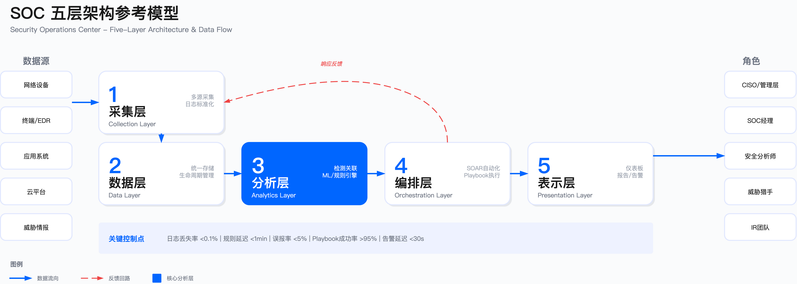
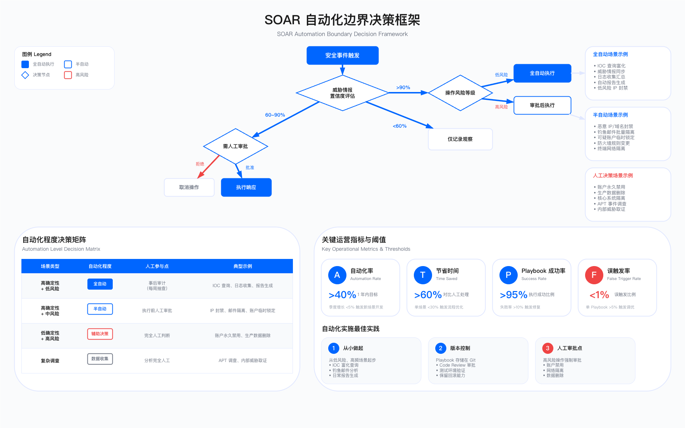

# 11.2 SOC 架构设计
SOC 技术架构是支撑安全运营能力的基础设施。架构设计质量直接决定了检测覆盖范围、响应速度、自动化水平和运营成本。本节从架构原则、核心平台选型、集成方案和数据治理四个维度展开，聚焦工程决策点与约束条件。

---

## 11.2.1 SOC 技术架构设计原则

### 分层设计与控制点

SOC 架构采用五层分离设计，每层承担明确的控制职责：

采集层：从数据源收集原始事件，关键控制点包括采集完整性（日志丢失率 <0.1%）、时间同步（NTP 误差 <1s）、传输加密（TLS 1.3）。常见误区：Agent 版本碎片化导致解析失败、高峰期网络拥塞导致丢包。

数据层：统一存储与生命周期管理。控制点：存储分层策略（热/温/冷）、数据保留期（满足 PCI DSS/SOX/GDPR 等合规要求，通常 1-7 年）、备份与恢复能力（RPO <1h, RTO <4h）。约束：存储成本与查询性能权衡——实时查询需要 SSD/内存，长期归档可用对象存储。

分析层：实时关联与批处理分析。控制点：规则引擎延迟（<1min）、检测覆盖度（MITRE ATT&CK 技术覆盖率）、误报率（<5%）。约束：实时分析消耗大量计算资源，需根据事件优先级分配资源——Critical 告警实时处理，Low 告警可异步批处理。

编排层：自动化工作流与案例管理。控制点：Playbook 执行成功率（>95%）、人工审批点设置（高风险操作需人工确认）、审计日志完整性。约束：过度自动化可能导致误操作扩大影响，建议从低风险场景（IOC 查询、日志收集）起步，逐步扩展至高风险操作（账户禁用、网络隔离）。

表示层：仪表板、报告与告警界面。控制点：告警通知延迟（<30s）、仪表板刷新频率（Critical 事件实时刷新）、多租户权限隔离（RBAC）。


*图：SOC 五层架构与数据流。采集层从多源收集事件，数据层统一存储，分析层执行检测与关联，编排层自动化响应，表示层面向不同角色呈现*

### 架构决策权衡

| 决策维度 | 选项 | 适用场景 | 主要约束 |
|---------|------|---------|---------|
| 部署模式 | 云原生 | 中小企业、快速扩展、SaaS 工具为主 | 数据主权合规（中国/俄罗斯/欧盟）、云厂商锁定 |
| | 本地部署 | 高合规要求、敏感数据不出境 | 硬件采购周期（3-6 个月）、扩容成本高 |
| | 混合架构 | 敏感数据本地、分析能力云端 | 网络延迟影响实时性、双环境运维复杂度 |
| 数据保留 | 热数据 30 天 + 温数据 1 年 + 冷数据 7 年 | 金融、医疗行业（SOX/HIPAA） | 存储成本随数据量线性增长 |
| | 热数据 90 天 + 温数据 6 个月 | 互联网行业 | 长周期事件调查受限 |
| 集成方式 | API 优先 | 结构化数据、双向交互（SOAR 调用 EDR） | 需工具支持 RESTful API，开发成本高 |
| | Syslog/CEF | 网络设备、传统系统 | 非结构化日志需解析，数据丢失无反馈 |
| | Agent | 终端、应用服务器 | Agent 版本管理成本，性能影响（CPU <5%） |

验证方法：
- 部署模式验证：通过数据分类清单确认是否有不可出境数据，评估合规成本（如欧盟 GDPR 数据本地化）
- 数据保留验证：列出所有适用的监管要求（PCI DSS/HIPAA/SOX），取最长保留期，核算 3 年存储总成本
- 集成方式验证：统计工具支持的接口类型，优先选择 API 集成率 >70% 的组合

常见误区：
1. 过度追求单一平台：试图用一个 SIEM 解决所有问题，导致工具能力不匹配——应采用"工具组合+标准化集成"策略
2. 忽视数据质量：大量采集低价值日志（如 Debug 级别应用日志），占用大部分存储但产生极少有效告警——建议在采集层过滤低价值数据
3. 自动化无审批：所有 Playbook 全自动执行，发生误封禁生产 IP 导致业务中断——高风险操作必须保留人工审批点

### 运行指标与阈值

*注：以下阈值为行业推荐值，综合 SANS SOC Survey、NIST SP 800-61、CIS Controls 等实践经验制定，企业需根据实际环境调整。*

| 指标类别 | 指标名称 | 计算公式 | 目标阈值（推荐值） | 触发条件（示例） |
|---------|---------|---------|-----------------|--------------|
| 数据采集 | 日志丢失率 | (预期事件数 - 实际接收数) / 预期事件数 | <0.1% | 单源 1h 内丢失率 >1% 触发告警 |
| | 采集延迟 | 事件接收时间 - 事件生成时间 | <5min(P95) | P95 延迟 >10min 触发告警 |
| 检测性能 | 规则执行延迟 | 事件产生到告警生成的时间差 | <1min(Critical) | Critical 告警延迟 >5min 触发升级 |
| | 误报率 | 误报告警数 / 总告警数 | <5% | 单一规则误报率 >20% 触发调优 |
| 平台可用性 | SIEM 可用性 | 正常运行时间 / 总时间 | >99.5% | 连续故障 >1h 触发灾备切换 |
| | 查询响应时间 | 典型查询的执行时间 | <10s(90 天内数据) | P95 响应时间 >30s 触发性能优化 |
| 自动化 | Playbook 成功率 | 成功执行次数 / 总执行次数 | >95% | 单一 Playbook 失败率 >10% 触发审查 |

---

## 11.2.2 SIEM 平台选型与部署

### SIEM 核心能力与控制点

SIEM 平台的核心职责是将分散的安全事件关联为可操作的威胁情报。关键控制点：

1. 日志规范化（normalization）：将不同格式日志转换为统一字段。验证方法：检查是否支持 CEF/LEEF/ECS 标准，测试自定义解析器开发成本（人天）
2. 实时关联引擎：基于规则/统计/ML 模型检测威胁。约束：复杂关联规则（跨越 >5 个数据源、时间窗口 >1h）会导致资源消耗指数增长，需评估性能影响
3. 威胁检测覆盖：内置检测用例数量与质量。验证方法：要求厂商提供 MITRE ATT&CK 覆盖矩阵，统计 Technique 覆盖率（目标 >60%）
4. 调查分析能力：搜索语言灵活性、可视化能力。约束：分析师学习成本，SPL（Splunk）/KQL（Sentinel）需 2-4 周培训期

### 主流 SIEM 平台对比

*注：以下评估综合厂商公开文档、企业用户调研反馈及编写小组实践经验，评级为相对对比而非绝对评分。*

**Splunk Enterprise Security**

适用边界：日志量 >1TB/天、预算充足、需要高度定制化、已有 Splunk 投资的中大型企业。

关键约束：成本按数据量授权（ingest-based），超量费用高昂，需严格控制采集范围；SPL 语言灵活但复杂，新分析师需数周培训；Indexer Cluster 扩容周期长或云实例成本增幅明显。

验证方法：统计所有数据源的日均日志量并预留增长空间，计算 3 年 TCO；POC 测试检测用例准确性、查询性能（90 天数据查询目标 <10s）、仪表板响应时间。

常见误区：采集所有日志而未区分价值，导致成本失控；直接使用默认内容库而不根据环境调优，误报率偏高。

**Microsoft Sentinel**

适用边界：Microsoft 365/Azure 环境为主、云优先策略、预算灵活（按实际消费付费）的中小企业。

关键约束：数据必须存储在 Azure Log Analytics Workspace，不支持本地部署；KQL 查询语言与 SPL 不同，团队需重新培训；部分高级能力（如 UEBA）需额外授权。

验证方法：使用 Azure Pricing Calculator 估算日志摄入与数据保留成本；验证非 Microsoft 工具的 Data Connector 可用性与数据延迟。

常见误区：低估非 Azure 数据源的集成复杂度；未配置 Commitment Tier 导致按量计费成本超预期。

**IBM QRadar**

适用边界：重视网络流量分析（NetFlow/IPFIX）、预算适中、IBM 生态客户的中大型企业。

关键约束：界面相对传统，自定义能力不如 Splunk，分析师接受度需评估；社区资源相比 Splunk 较少，自定义开发需更多内部投入。

验证方法：测试 NetFlow/IPFIX 数据解析准确性与关联规则性能；评估现有 IBM 产品（QRadar SOAR、X-Force）的集成深度。

常见误区：高估网络流量分析在威胁检测中的权重而忽视端点日志；低估界面学习成本对团队效率的影响。

**Google Chronicle**

适用边界：超大规模数据（PB 级）、威胁情报驱动（内置 VirusTotal/Mandiant）、Google Cloud 客户。

关键约束：检测规则基于 YARA-L，灵活性不如 SPL/KQL，复杂场景需适应；第三方集成相比 Splunk/Sentinel 较少，需评估现有工具支持度。

验证方法：测试 PB 级数据查询性能与威胁情报匹配准确性；评估非 GCP 数据源的接入方案与延迟。

常见误区：高估内置威胁情报的覆盖范围而放弃其他情报源；低估 YARA-L 规则开发的学习成本。

**Elastic Security**

适用边界：预算受限、技术团队强（能自主开发）、已有 ELK 投资的中小企业。

关键约束：检测规则需大量自定义，初期投入高；需自建 Elasticsearch 集群并维护（高可用、备份、性能调优）。

验证方法：评估团队 Elasticsearch 运维能力与检测规则开发资源；测试集群在目标日志量下的查询性能与稳定性。

常见误区：低估开源方案的隐性运维成本；将 ELK 日志分析能力等同于成熟 SIEM 的检测能力。

### SIEM 选型决策矩阵

以下矩阵从六个维度对主流 SIEM 平台进行横向对比，供初步筛选参考。维度选择依据：产品历史反映平台稳定性与检测规则库积累；部署模式决定数据主权合规可行性；TCO 影响长期预算规划；学习成本关系团队采纳周期；生态集成数量决定工具链整合效率；适用规模需匹配企业日志量增长预期。

*注：TCO 成本区间为参考估算，基于典型企业场景（500-2000 人规模、日志量 100GB-10TB/天），实际成本需根据数据量、保留期、并发用户数等因素调整。*

| 维度 | Splunk ES | IBM QRadar | MS Sentinel | Google Chronicle | Elastic Security |
|------|-----------|------------|-------------|------------------|------------------|
| 产品历史 | 2003 年创立，SIEM 领域积累深 | 2007 年收购 Q1 Labs，网络流量分析见长 | 2019 年发布，迭代速度快 | 2019 年发布，背靠 VirusTotal/Mandiant | 2019 年推出安全方案，基于 ELK 生态 |
| 部署模式 | 本地/云/混合 | 本地/云 | 仅云（Azure） | 仅云（GCP） | 本地/云/混合 |
| TCO（3 年参考） | 高（50-200 万美元） | 中（30-100 万美元） | 中（按量付费） | 中（简化定价） | 低（开源基础） |
| 学习成本 | 高（SPL 4-6 周） | 中（2-4 周） | 中（KQL 2-4 周） | 中（YARA-L） | 高（需开发能力） |
| 生态集成 | 丰富（官方称 2800+ 应用） | 中等（官方称 700+ 集成） | 丰富（Azure 原生生态） | 中等（Google 生态） | 中等（需自开发补充） |
| 适用规模 | 中大型企业 | 中大型企业 | 中小型企业 | 大型企业（PB 级） | 中小型企业 |

矩阵仅作初筛依据，单一维度的领先不能替代整体适配性评估。最终选型需通过 POC 验证实际表现，建议周期 30 天，使用真实生产数据。

**POC 验证要点**：
1. 检测准确性：用历史安全事件（已知攻击）测试检出率与误报率
2. 查询性能：用典型调查场景（跨 90 天数据）测试响应时间
3. 集成成本：统计现有工具集成开发工时（API/Agent/Syslog）
4. 运维复杂度：评估日常维护任务（规则调优/告警处理/平台升级）所需人力

### SIEM 中的机器学习检测

现代 SIEM 集成 ML 能力用于检测基于行为的异常，弥补规则检测的盲区。适用场景：内部威胁（异常数据访问）、账户入侵（异常登录模式）、未知攻击（0day 利用）。

关键约束：
1. 训练数据质量：需至少 30 天干净基线数据（排除已知攻击期间的数据），否则模型会学习到异常行为作为"正常"
2. 误报控制：初期阈值设置保守（如置信度 >90% 才告警），通过 A/B 测试逐步优化——过激进会导致告警疲劳
3. 可解释性：分析师需理解告警原因，黑盒模型难以调优——建议选择提供特征重要性解释的工具（如 Splunk MLTK）

异常检测示例（Splunk SPL）：
```spl
| from datamodel:"Authentication"."Authentication"
| where Authentication.action="success"
| stats count by Authentication.user, date_hour
| eventstats avg(count) as avg_count, stdev(count) as stdev_count by Authentication.user
| eval z_score=(count - avg_count) / stdev_count
| where z_score > 3
| table _time, Authentication.user, count, avg_count, z_score
```
验证方法：用已知异常登录事件（如账户入侵案例）验证检出率，调整 z_score 阈值使误报率 <5%。

UEBA 用例与验证：
- 异常登录地点：检测用户从未登录过的国家/地区。验证：模拟从异常 IP 登录，确认 15min 内产生告警
- 异常数据访问：检测访问量/访问文件类型偏离基线。验证：模拟批量下载敏感文件，确认 30min 内产生告警
- 权限提升：检测异常的特权操作（如普通用户执行管理员命令）。验证：模拟权限提升攻击（如 Mimikatz），确认检出

常见误区：
- 盲目启用所有 ML 检测：未评估业务场景适用性，产生大量低质量告警，建议从 3-5 个高价值场景试点（异常登录/数据外泄/特权滥用）
- 忽视模型维护：训练后不更新模型，业务变化（如新应用上线、组织架构调整）导致误报激增，建议每月重新训练基线

---

## 11.2.3 SOAR 平台选型与自动化

### SOAR 核心能力与约束

SOAR 平台通过自动化减少重复性人工操作，缩短响应时间（MTTR）。关键控制点：

1. Playbook 可靠性：执行成功率需 >95%，失败时有清晰错误日志与回滚机制
2. 集成广度：需覆盖企业 80% 以上的安全工具（SIEM/EDR/防火墙/云 API/工单系统）
3. 人工审批点：高风险操作（账户禁用/IP 封禁/网络隔离）需强制人工确认，防止误操作扩大影响
4. 审计完整性：所有自动化操作需记录完整日志（操作人/时间/参数/结果），满足合规要求

关键约束：
- 工具依赖：SOAR 依赖集成工具的 API 稳定性，API 变更会导致 Playbook 失败，需与厂商确认 API 版本策略（向后兼容性）
- 复杂度管理：Playbook 数量 >50 后维护成本急剧上升，需建立分类、版本控制、定期审查机制
- 技能要求：开发 Playbook 需既懂安全又懂自动化（Python/API），人才稀缺，建议采用低代码平台降低门槛

### 主流 SOAR 平台对比

Palo Alto Cortex XSOAR

适用边界：大型企业、复杂集成需求（>20 个工具）、需要全面 SOAR 能力、预算充足（年成本参考区间 20-80 万美元，依授权规模而定）。

关键约束：
- 学习成本：Playbook 开发需掌握 Python + XSOAR 框架，新手需 2-3 个月培训
- 运维成本：6000+ 集成意味着需持续跟踪 API 变更，团队需配备专职 SOAR 工程师（1-2 人）

Splunk SOAR（Phantom）

适用边界：Splunk ES 用户、需要与 Splunk 深度集成、中大型企业。

约束：相对 Splunk ES 是独立授权，需额外采购成本。

Swimlane

适用边界：中型企业、需要快速实施（1-2 个月）、低代码偏好、技术团队有限。

约束：集成数量不如 XSOAR（约 300+），需确认覆盖企业核心工具。

Tines

适用边界：中小型企业、快速原型验证、工程文化强的团队（能用 API 自行集成）。

约束：案例管理能力较弱，需配合其他工单系统（Jira/ServiceNow）使用。

### 高价值自动化场景与验证

钓鱼邮件响应 Playbook

步骤：用户报告 → 提取元数据（发件人/链接/附件） → 查询威胁情报（VirusTotal/AlienVault OTX） → 沙箱分析附件（Cuckoo/Any.Run） → 检查其他受害者（查询邮件网关） → 隔离所有邮件（O365/Gmail API） → 封禁发件人 → 更新 IOC 数据库 → 创建事件工单 → 通知 SOC

验证方法：
1. 准确性：用 10 个已知钓鱼邮件测试，确认检出率 100%、误报率 0%
2. 性能：从报告到隔离邮件的时间 <10min（手工需 30-60min）
3. 可靠性：连续运行 30 天，成功率 >95%（失败时有清晰错误日志）

恶意 IP 自动封禁 Playbook

决策逻辑：
- 威胁情报置信度 >90% → 自动封禁（防火墙/WAF/CDN）
- 置信度 60-90% → 人工审批后封禁
- 置信度 <60% → 仅记录观察，不封禁

验证方法：模拟不同置信度场景，确认决策逻辑正确；监控误封禁率（目标 <0.1%，即 1000 次封禁中 <1 次误封）。

账户异常响应 Playbook

分级响应：
- Critical（登录自高风险国家+访问敏感数据） → 立即禁用账户 + 撤销 Token + 通知安全团队
- High（异常登录时间+异常设备） → 强制 MFA + 密码重置 + 通知用户
- Medium（单一异常指标） → 通知用户和管理员，不主动阻断

验证方法：用红队模拟账户入侵（如凭证填充攻击），确认 Critical 级别 5min 内禁用账户。

### SOAR 实施常见实践

1. 起步策略：从小做起，快速迭代

推荐起步场景（低风险、高频、ROI 明确）：
- IOC 富化查询（查询威胁情报/WHOIS/DNS）
- 钓鱼邮件自动化分析
- 日常报告生成（周/月安全报告自动汇总）

避免起步场景：高风险操作（账户禁用/网络隔离），复杂调查（需人工判断的取证分析）。

2. 治理机制：版本控制+审批流程

- Playbook 源代码存储在 Git，每次变更需 Code Review（至少 1 人审批）
- 测试环境验证（模拟生产数据测试 10 次，成功率 >90% 才发布）
- 变更窗口：生产 Playbook 变更仅在非业务高峰期（如周末）执行
- 回滚计划：保留上一版本 Playbook，1h 内可快速回滚

3. 自动化程度决策矩阵

| 场景类型 | 自动化程度 | 人工参与点 | 示例 |
|---------|-----------|-----------|------|
| 高确定性+低风险 | 全自动 | 事后审计（每周抽查） | IOC 查询、日志收集、报告生成 |
| 高确定性+中风险 | 半自动 | 执行前人工审批 | IP 封禁、邮件隔离 |
| 低确定性+高风险 | 辅助决策 | 完全人工判断 | 账户禁用、数据删除 |
| 复杂调查 | 数据收集自动 | 分析人工 | APT 调查、内部威胁取证 |



*图 11-6：SOAR 自动化边界决策框架——基于威胁情报置信度和操作风险等级的自动化程度决策树*

4. 关键指标与优化触发

| 指标 | 计算公式 | 目标值 | 优化触发条件 |
|------|---------|-------|-------------|
| 自动化率 | 自动化处置事件数 / 总事件数 | >40%（1 年内） | 季度增长 <5% 触发新场景开发 |
| 节省时间 | 人工平均耗时 - 自动化平均耗时 | >60% | 单场景节省 <30% 触发流程优化 |
| Playbook 成功率 | 成功执行次数 / 总执行次数 | >95% | 单 Playbook 失败率 >10% 触发修复 |
| 误触发率 | 误触发次数 / 总触发次数 | <1% | 单 Playbook 误触发 >5% 触发规则调优 |

> **参考说明**：上述目标值基于已具备 SOAR 平台且运营 6 个月以上的 SOC 团队经验。具体阈值应根据以下因素调整：
> 1. **成熟度基线**：初期部署阶段（0-6 月）可将自动化率目标降至 20%，逐步提升
> 2. **场景复杂度**：高风险场景（账户禁用、网络隔离）的成功率要求应更严格（>99%）
> 3. **团队规模**：小型 SOC（<5 人）应优先提升节省时间指标，而非追求自动化覆盖率

---

## 11.2.4 威胁情报平台与情报运营

### 威胁情报平台核心能力

TIP 的职责是将多源异构的威胁情报转化为可执行的控制动作（阻断/告警/优先级调整）。关键控制点：

1. 情报标准化：统一转换为 STIX 2.1/OpenIOC 格式，确保不同来源情报可关联
2. 情报评分：根据来源可信度、时效性、上下文关联性计算置信度（0-100），过滤低质量情报
3. 自动分发：根据 IOC 类型自动分发至消费端（IP→防火墙，Hash→EDR，Domain→DNS 过滤）
4. 生命周期管理：定期淘汰过期情报（如 90 天未命中的 IOC），避免误报

关键约束：
- 情报质量：开源情报（OTX/Abuse.ch）误报率相对较高，需配合多源验证
- 分发延迟：从情报平台到防火墙/EDR 的分发链路需 <5min，否则攻击已得逞
- 覆盖范围：商业情报（Mandiant/Recorded Future）成本高（年费参考区间 10-50 万美元，依覆盖范围与服务级别而定），需评估 ROI，建议优先覆盖 APT 威胁情报，补充开源情报覆盖常规威胁

### 威胁情报架构与集成

MISP 与 SIEM 集成示例：

验证方法：
1. 时效性测试：MISP 新增 IOC 后，5min 内在 SIEM 中可查询到
2. 准确性测试：用 10 个已知恶意 IP 测试，确认 100% 匹配到威胁情报
3. 性能测试：10 万级 IOC 库，SIEM 查询性能无明显下降（<10s）

情报生命周期管理：

收集 → 处理（标准化/去重/富化） → 分析（关联/评分/优先级） → 分发（SIEM/防火墙/EDR） → 应用（检测/响应/狩猎） → 反馈（命中率/准确性/时效性） → 优化

关键指标：
- 情报命中率：命中次数 / 总 IOC 数（目标 >5%，低于 1% 说明情报质量差）
- 情报时效性：从情报发布到企业消费的平均时间（目标 <1h）
- 误报率：误报次数 / 总命中次数（目标 <2%）

---

## 11.2.5 日志管理与安全数据湖

### 分层存储策略

*注：以下成本基于 AWS 美东区域（us-east-1）2025 Q1 公开定价估算，包含存储+计算+传输成本，实际成本因地域、用量、承诺折扣而异。*

热数据（30-90 天）：SIEM 实时存储，高性能 SSD，支持复杂关联查询。存储对象：认证日志、EDR 告警、防火墙事件、特权操作、云审计。成本参考：约 500-1000 美元/TB/月（AWS S3 Standard + 计算）。

温数据（1 年）：数据湖中期存储，标准存储，支持批处理分析。存储对象：历史告警、应用日志、网络流量（采样）。成本参考：约 50-100 美元/TB/月（AWS S3 Standard）。

冷数据（2-7 年）：归档长期存储，对象存储（S3 Glacier），仅满足合规要求，检索延迟高（小时级）。存储对象：合规归档日志。成本参考：约 1-5 美元/TB/月（AWS S3 Glacier Deep Archive）。

验证方法：
- 成本测算：统计日志量（GB/天），计算 3 年总成本（热+温+冷），对比预算
- 检索测试：从冷存储检索 90 天前数据，确认时间 <4h（满足事件调查 SLA）
- 数据完整性：定期抽查归档数据（每季度），确认无损坏

常见误区：
- 所有数据热存储：未区分访问频率，导致存储成本过高，建议仅保留 30-90 天热数据，历史数据迁移至温/冷存储
- 无数据保留策略：无限期保留所有日志，违反 GDPR"存储最小化"原则，需制定数据保留策略（如认证日志 1 年后删除用户名，仅保留统计信息）

### 数据质量管理

日志完整性监控：
- 每小时统计各数据源日志量，与基线（过去 30 天平均值）对比
- 偏差 >30% 触发告警（可能日志收集故障或数据源异常）
- 验证方法：模拟日志收集故障（停止 Agent），确认 10min 内收到告警

日志时效性监控：
- 计算日志生成时间与接收时间差值（基于时间戳字段）
- P95 延迟 >5min 触发告警
- 验证方法：模拟网络延迟（限速至 1Mbps），确认延迟告警触发

数据脱敏：
- 敏感字段（邮箱/电话/IP）在采集时脱敏（哈希用户名部分，保留域名；保留 IP 子网，哈希主机部分）
- 验证方法：审查 SIEM 中存储的原始日志，确认无明文 PII（个人身份信息）

---

## 11.2.6 SOC 工具集成架构

### 集成模式选择

SIEM 中心化集成：适用于数据源 <50 个、告警量 <10 万/天、SIEM 性能充足的场景。优势：集中数据平台，简化数据流。约束：SIEM 成为单点故障，需高可用设计（双活/主备）。

SOAR 中心化集成：适用于工具 >20 个、自动化需求高、需要灵活编排的场景。优势：工具解耦，灵活编排。约束：需管理多个 API 连接，复杂度高。

数据湖中心化集成：适用于数据量 >10TB/天、需支持多种分析场景（威胁狩猎/ML 训练/合规报告）的场景。优势：成本效益，支持多场景。约束：实时性较差，需配合 SIEM 做实时检测。

### 集成可靠性设计

API 重试机制：
- 网络/服务临时故障时自动重试，指数退避（1s → 2s → 4s → 8s）
- 最大重试 3 次，失败后记录错误日志并告警运维团队
- 验证方法：模拟 API 服务故障（返回 500 错误），确认自动重试并最终成功

集成健康监控：
- 每 5min 检查所有集成端点健康状态（HTTP 200）
- 连续 3 次失败触发告警，连续故障 >1h 触发高优先级事件
- 验证方法：模拟集成服务下线（防火墙封禁端口），确认 15min 内收到告警

错误日志与审计：
- 所有集成操作（API 调用/Webhook 接收）记录完整日志（时间/参数/响应/耗时）
- 日志保留 90 天，满足审计要求
- 验证方法：审查日志格式，确认包含必要字段（符合 ECS 标准）

---

## 小结

SOC 架构设计的核心是在功能、性能、成本三者间找到平衡点，关键决策包括：

1. 架构原则：分层设计明确控制点，数据驱动需配合质量治理，自动化优先需保留人工审批点，可扩展性需评估 3 年增长空间
2. SIEM 选型：需根据企业规模（日志量/预算/团队技能）选择，POC 测试验证检测准确性/查询性能/集成成本
3. SOAR 实施：从低风险高频场景起步，建立治理机制（版本控制/审批流程），监控自动化率/成功率/误触发率
4. 威胁情报：多源聚合需配合质量评分，自动分发需验证时效性（<5min），生命周期管理淘汰低命中率情报
5. 数据治理：分层存储平衡成本与性能，数据质量监控防止采集故障，脱敏策略满足隐私合规
6. 工具集成：选择适合的集成模式（SIEM/SOAR/数据湖中心），设计重试机制与健康监控，记录完整审计日志

下一节（11.3）将深入威胁检测工程，包括检测用例开发、威胁狩猎、MITRE ATT&CK 映射与检测覆盖度评估。

## 参考资料

1. Splunk Enterprise Security: https://www.splunk.com/en_us/products/enterprise-security.html
2. Microsoft Sentinel Documentation: https://learn.microsoft.com/en-us/azure/sentinel/
3. Elastic Security: https://www.elastic.co/security
4. Palo Alto XSOAR: https://www.paloaltonetworks.com/cortex/xsoar
5. MISP - Open Source Threat Intelligence Platform: https://www.misp-project.org/
6. OpenCTI: https://www.opencti.io/
7. Apache Kafka for Log Streaming: https://kafka.apache.org/
8. IBM QRadar: https://www.ibm.com/products/qradar-siem
9. Google Chronicle: https://chronicle.security/

---

## 导航

**[← 上一节：11.1 战略与组织](./11.1-soc-strategy-organization.md)** | **[返回章节目录](./README.md)** | **[下一节：11.3 威胁检测工程 →](./11.3-threat-detection-engineering.md)**

---

**© 2025 AI-ESA Project. Licensed under CC BY-NC-SA 4.0**

