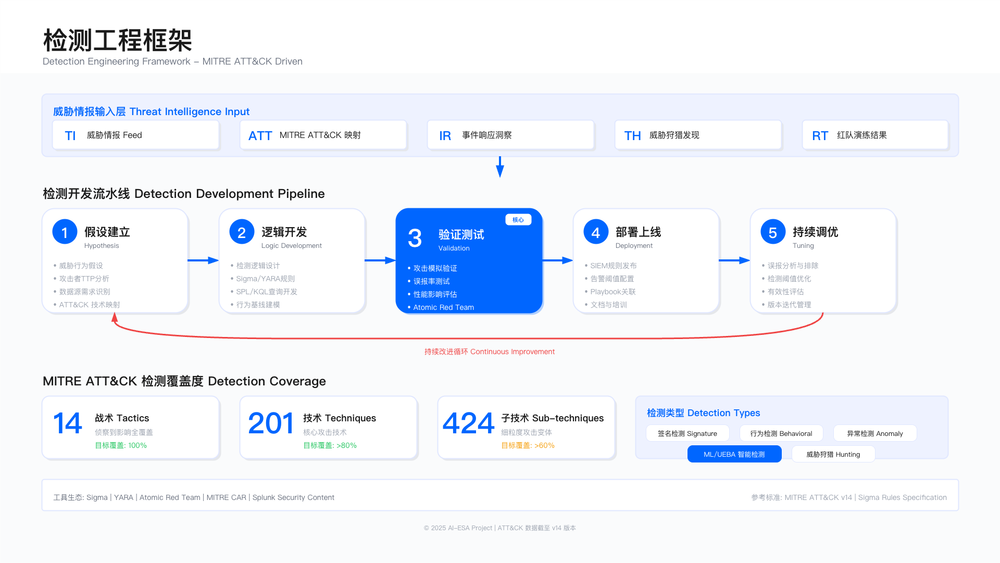

# 11.3 威胁检测工程

2020 年 12 月，FireEye 披露自身被入侵——作为全球顶级网络安全厂商，拥有完整的 SOC 与威胁检测能力，却未能检测到 SolarWinds 供应链攻击。回溯分析显示，攻击者从 3 月开始活动，驻留 287 天未被发现（FireEye 公开声明，2020 年 12 月 8 日）。

问题不在于缺少检测规则。FireEye 运行着数千条检测规则，覆盖 MITRE ATT&CK 框架中的多数技术。核心困境在于：检测规则聚焦"已知攻击模式"，而 SolarWinds 攻击使用的是可信软件的合法行为。Orion 软件本身需要访问域控制器、读取配置、执行 PowerShell——这些都是正常运维行为，传统基于特征的检测规则无法区分恶意与合法。

本节基于 SolarWinds、MOVEit 等公开披露案例，展示检测用例开发、威胁狩猎与覆盖度评估的工程方法——不是理想化流程，而是真实环境中的约束、权衡与失败教训。



---

## 11.3.1 从 SolarWinds 事件看检测用例开发

### 传统检测为何失效

SolarWinds SUNBURST 后门的 TTP 分析（来源：CISA Alert AA20-352A，FireEye 技术分析报告）：

**攻击路径**：

1. **初始植入**（T1195.002: Supply Chain Compromise）

   - 攻击者入侵 SolarWinds 开发环境，在 Orion 软件更新中植入 SUNBURST 后门
   - 约 18000 家企业下载了受感染更新（2020 年 3 月 - 6 月）
2. **持久化**（T1543.003: Windows Service）

   - SUNBURST 作为 `SolarWinds.Orion.Core.BusinessLayer.dll` 的一部分，随 Orion 服务启动
   - 检测失效原因：DLL 具有合法数字签名（SolarWinds 官方证书），运行于受信任进程中
3. **C2 通信**（T1071.001: Web Protocols）

   - 使用域生成算法（DGA）生成 C2 域名，伪装成 Orion 的合法 API 调用
   - HTTP 请求头伪装为正常的 Orion 遥测数据
   - 检测失效原因：流量模式与正常 Orion 通信高度相似，传统网络检测规则无法区分
4. **凭证窃取**（T1003.001: LSASS Memory）

   - 使用 WMI 与 PowerShell 读取域控凭证
   - 检测失效原因：Orion 本身需要域管理员权限，PowerShell 执行属于正常运维行为
5. **横向移动**（T1021.001: RDP, T1021.006: WinRM）

   - 使用窃取的凭证通过 RDP/WinRM 横向移动
   - 检测失效原因：使用合法凭证，无暴力破解特征

**传统检测规则失效的根本原因**：

- 签名检测：SUNBURST 具有合法数字签名
- 进程行为检测：运行于受信任进程（Orion 服务）中
- 网络流量检测：C2 流量伪装为合法 API 调用
- 凭证使用检测：使用真实的域管理员凭证

### CISA 应急响应与检测用例转化

2020 年 12 月 13 日，FireEye 公开 SolarWinds 事件。12 月 17 日，CISA 发布应急指令 ED 21-01，要求所有联邦机构立即采取检测与响应措施。

#### 检测用例 1：SUNBURST 后门行为检测

**威胁假设**：攻击者通过 SUNBURST 后门，使用 DGA 生成 C2 域名，并通过 HTTP 进行通信。

**数据源要求**：

- DNS 查询日志（完整 FQDN）
- HTTP 代理日志或防火墙日志
- Orion 服务器的进程执行日志（Sysmon Event ID 1）

**检测逻辑**（基于 FireEye 与 Microsoft 联合分析报告）：

**DGA 域名特征检测**

SUNBURST 使用特定算法生成 C2 域名，特征包括：

- 子域名长度 15 - 18 字符
- 子域名使用特定字符集（a-z0-9）
- 顶级域名为：`.tk`、`.ml`、`.ga`、`.cf`、`.gq`、`avsvmcloud.com`

**Splunk 检测规则**：

```spl
index=dns
| rex field=query "(?<subdomain>[^.]+)\.(?<domain>.+)"
| where len(subdomain) >= 15 AND len(subdomain) <= 18
| where match(domain, "(avsvmcloud\.com|\.tk|\.ml|\.ga|\.cf|\.gq)$")
| where match(subdomain, "^[a-z0-9]+$")
| stats count dc(query) as unique_domains by src_ip, domain
| where unique_domains > 5 AND count > 10
```

**KQL 检测规则**（Microsoft Sentinel）：

```kusto
DnsEvents
| where TimeGenerated > ago(24h)
| extend subdomain = split(Name, ".")[0]
| extend domain = strcat_array(array_slice(split(Name, "."), 1, -1), ".")
| where strlen(subdomain) between (15 .. 18)
| where domain endswith "avsvmcloud.com" or
        domain endswith ".tk" or
        domain endswith ".ml" or
        domain endswith ".ga"
| where subdomain matches regex "^[a-z0-9]+$"
| summarize
    QueryCount = count(),
    UniqueDomains = dcount(Name)
    by Computer, domain, bin(TimeGenerated, 1h)
| where UniqueDomains > 5 and QueryCount > 10
```

**已知误报场景**：

- CDN 服务的 DGA 域名（如 Akamai）
- 某些广告网络使用类似域名模式
- 白名单策略：维护已知合法 DGA 服务的域名列表

**响应行动**（基于 CISA ED 21-01）：

1. **立即**：隔离受影响的 Orion 服务器（断网不关机，保留内存）
2. **4 小时内**：收集内存 dump 与磁盘镜像供取证
3. **24 小时内**：重置所有特权账号凭证（域管理员、企业管理员）
4. **72 小时内**：威胁狩猎横向移动痕迹

**测试与验证**：

- 使用 MITRE ATT&CK Evaluations 数据集（包含 SolarWinds 模拟数据）
- 红队使用 Cobalt Strike 模拟 SUNBURST C2 行为
- 需要真实 Orion 环境进行误报测试

#### 检测用例 2：异常 Azure AD 认证（云横向移动）

**威胁假设**：攻击者窃取本地凭证后，使用 Azure AD Connect 横向移动至云环境。

**背景**：SolarWinds 案例中，攻击者窃取本地域凭证后，发现某些企业使用 Azure AD Connect 同步，通过同步账号访问 Microsoft 365，窃取邮件与云资源。

**数据源要求**：

- Azure AD Sign-in Logs
- Microsoft 365 Audit Logs
- Conditional Access Policy logs

**检测逻辑**（基于 Microsoft 检测指南）：

```kusto
SigninLogs
| where TimeGenerated > ago(24h)
| where ResultType == "0"  // 成功登录
| where UserPrincipalName contains "sync_" or AppDisplayName contains "Azure AD Connect"
| extend
    GeoDistance = geo_distance_2points(
        toreal(LocationDetails.geoCoordinates.longitude),
        toreal(LocationDetails.geoCoordinates.latitude),
        toreal(prev(LocationDetails.geoCoordinates.longitude)),
        toreal(prev(LocationDetails.geoCoordinates.latitude))
    )
| where GeoDistance > 500  // 异常地理位置（>500km）
| project
    TimeGenerated,
    UserPrincipalName,
    IPAddress,
    Location,
    DeviceDetail.operatingSystem,
    UserAgent,
    AppDisplayName
```

**关键检测点**：

1. **首次使用的 User-Agent**：同步账号通常使用固定 User-Agent（AAD Connect 服务）
2. **异常地理位置**：同步服务器位置固定，突然从其他国家登录异常
3. **登录时间异常**：同步服务通常在固定时间执行（如每小时）

**响应行动**：

1. 禁用同步账号
2. 强制所有云账号 MFA 重新认证
3. 审计过去 30 天的邮件导出操作（MailItemsAccessed 事件）

### 检测用例开发的关键教训

基于 SolarWinds 案例，有效检测用例开发的五个原则：

**1. 从威胁情报到检测逻辑的转化**

不是简单"收集 IOC"（C2 域名列表），而是理解攻击者的 TTP（战术、技术、程序）。

- 错误做法：将 CISA 发布的 C2 域名列表加入黑名单
  - 问题：攻击者可随时更换域名
- 正确做法：理解 DGA 算法，检测 DGA 模式
  - 收益：可检测新的 C2 域名，甚至其他使用 DGA 的恶意软件

**2. 数据源覆盖评估**

SolarWinds 案例中，许多企业发现自身未采集 SolarWinds 服务器的日志。

**数据源检查清单**：

```yaml
检测用例: SUNBURST DGA检测
数据源需求:
  1. DNS查询日志:
     - 是否采集? 是
     - 是否包含完整FQDN? 是
     - 日志留存期? 90 天（CISA 建议 18 个月）
     - 查询性能? <5 秒

  2. Orion服务器日志:
     - 是否安装Sysmon? 否（缺失）
     - 是否采集进程执行日志? 否
     - 补救措施: 立即部署Sysmon配置

  3. Azure AD日志:
     - 是否订阅Premium P1? 是
     - 日志留存期? 30 天（默认）
     - 是否导出至SIEM? 否（缺失）
```

在开发检测规则前，先确认数据源就绪。否则规则仅为纸上谈兵。

**3. 误报与漏报的权衡**

SolarWinds 检测面临两难：

- 提高敏感度（降低阈值）→ 误报暴增 → 分析师疲劳 → 真实告警被忽略
- 降低敏感度（提高阈值）→ 漏报增加 → 攻击未被检测

**实战策略**：

- **P1/P2 级规则**：宁可误报，不可漏报（如"SUNBURST DGA 检测"）
- **P3/P4 级规则**：控制误报率 < 10%（如"Azure AD 异常登录"）
- **灰度发布**：新规则先"仅记录"不产生告警，观察 1 周误报率后再上线

**4. 性能影响评估**

某企业部署 SolarWinds 检测规则后，Splunk 查询超时：

**问题分析**：

```spl
# 原始规则（性能差）
index=dns
| rex field=query "(?<subdomain>[^.]+)\.(?<domain>.+)"
| where len(subdomain) >= 15  # 对每条DNS记录执行字符串长度计算
```

**优化后**：

```spl
# 优化规则（增加过滤条件）
index=dns
  (query="*.avsvmcloud.com" OR query="*.tk" OR query="*.ml")  # 先过滤域名
| rex field=query "(?<subdomain>[^.]+)\.(?<domain>.+)"
| where len(subdomain) >= 15  # 仅对匹配域名计算长度
```

性能提升：查询时间从 45 秒降至 3 秒。

在规则设计阶段即考虑性能，使用索引字段过滤，减少计算量。

**5. 持续维护与废弃**

检测规则需要持续维护和更新（基于内部运营经验总结）：

- 攻击技术演进（如 SUNBURST 变种）
- 环境变化（如 Orion 软件升级，日志格式改变）
- 误报优化（新发现的合法行为需加入白名单）

**规则生命周期管理**：

```yaml
检测用例: SUNBURST DGA检测
版本: v1.2
更新历史:
  - 2020-12-17 v1.0：初始版本（基于 CISA 指南）
  - 2021-02-10 v1.1：增加 Akamai CDN 白名单（误报优化）
  - 2021-06-15 v1.2：支持新的 C2 域名后缀（.io、.xyz）

维护计划:
  - 每季度审查: 误报率、触发频率、业务影响
  - 每半年红队测试: 验证检测有效性
  - 废弃条件: 连续 6 个月未触发 AND 威胁过时
```

某企业在 2022 年废弃了"检测 WannaCry 勒索软件"规则，因为：

- SMBv1 协议已全面禁用
- 连续 18 个月未触发
- 维护成本（每季度误报调优）大于收益

### 检测用例开发标准流程

**Step 1：威胁建模**

识别需要检测的威胁：

- 来自威胁情报（APT 组织使用的新技术）
- 来自事件响应（上次攻击使用的技术）
- 来自红队演练（成功绕过的攻击路径）
- 来自 MITRE ATT&CK 覆盖度评估（未覆盖的技术）

**Step 2：数据源确认**

确认检测所需数据源是否可用：

- 是否已采集相关日志
- 日志字段是否完整
- 日志留存期是否足够
- 查询性能是否满足实时检测

**Step 3：检测逻辑设计**

基于 Sigma 格式编写检测规则：

```yaml
title: 可疑LSASS内存访问
id: a18e0862-127b-4d8b-8a9a-1f80d28dd5a6
status: production
description: 检测进程访问LSASS内存
author: Detection Team
date: 2025/01/21
modified: 2025/01/21
tags:
    - attack.credential_access
    - attack.t1003.001
logsource:
    product: windows
    service: sysmon
    definition: 'Sysmon EventID 10'
detection:
    selection:
        EventID: 10
        TargetImage|endswith: '\\lsass.exe'
        GrantedAccess|contains:
            - '0x1010'
            - '0x1410'
            - '0x147a'
    filter:
        SourceImage|startswith:
            - 'C:\\Windows\\System32\\'
            - 'C:\\Program Files\\Windows Defender\\'
    condition: selection and not filter
falsepositives:
    - 安全工具
    - 备份软件
level: high
```

**Step 4：测试方法**

1. **单元测试**：使用历史数据验证规则
2. **红队测试**：由红队执行攻击技术
3. **紫队验证**：红蓝协同验证检测效果
4. **误报测试**：在生产环境观察误报率

**Step 5：部署与监控**

- 先在测试环境验证
- 采用灰度发布（先小范围）
- 监控告警量与误报率
- 收集分析师反馈

**Step 6：持续优化**

检测规则优化流程：

```python
def optimize_detection_rule(rule_id):
    metrics = get_rule_metrics(rule_id, days=30)

    # 分析误报
    if metrics['false_positive_rate'] > 0.1:
        false_positives = get_false_positives(rule_id, days=7)
        exclusions = identify_common_patterns(false_positives)
        update_rule_exclusions(rule_id, exclusions)

    # 分析覆盖度
    if metrics['true_positive_count'] == 0:
        # 规则可能过于严格或攻击未发生
        review_rule_logic(rule_id)

    # 性能优化
    if metrics['execution_time'] > 60:
        optimize_query(rule_id)

    return metrics
```

### 检测策略分层

**Pyramid of Pain 视角**

```
        ^  难度与价值
        |
        |    TTPs（战术技术）         <-- 最难改变，最高价值
        |    Tools（工具）
        |    Network/Host Artifacts
        |    Domain Names
        |    IP Addresses
        |    Hash Values              <-- 最易改变，最低价值
        |
        +-------------------------------->
```

投资检测 TTPs 与 Tools，而非仅依赖 IOC。

**检测成熟度模型**

| 级别    | 检测类型   | 示例                 | 效果         |
| ------- | ---------- | -------------------- | ------------ |
| Level 5 | 预测性检测 | 基于威胁情报预测攻击 | 攻击前检测   |
| Level 4 | 行为检测   | 异常行为、TTP 检测   | 检测未知攻击 |
| Level 3 | 关联检测   | 多事件关联、攻击链   | 检测复杂攻击 |
| Level 2 | 基于签名   | IOC、规则检测        | 检测已知威胁 |
| Level 1 | 被动监控   | 日志收集、基础告警   | 事后发现     |

目标是从 Level 2 向 Level 4 演进。

---

## 11.3.2 威胁狩猎（Threat Hunting）

### 定义与价值

威胁狩猎是主动、迭代的过程，通过假设驱动的搜索，在环境中寻找未被自动检测的威胁。

**与自动检测的区别**：

| 维度       | 自动检测     | 威胁狩猎             |
| ---------- | ------------ | -------------------- |
| 触发方式   | 规则触发     | 假设驱动             |
| 时效性     | 实时         | 周期性/按需          |
| 范围       | 已知威胁模式 | 未知威胁、高级威胁   |
| 分析师角色 | 响应告警     | 主动搜索             |
| 输出       | 告警         | 威胁报告、新检测规则 |

### 威胁狩猎流程

**Step 1：假设生成**

假设来源：

- **威胁情报**："APT 组织 X 最近使用技术 Y，我们环境中是否存在？"
- **ATT&CK 覆盖**："我们对 T1055（进程注入）的检测覆盖如何？"
- **异常发现**："为什么这个用户夜间访问大量敏感文件？"
- **事件经验**："上次攻击使用了技术 Z，可能还有残留？"
- **红队反馈**："红队绕过了我们的检测，如何主动发现？"

**Step 2：数据收集**

确定需要的数据源：

- 终端日志（Sysmon、EDR）
- 网络流量（DNS、Proxy、Firewall）
- 身份日志（AD、SSO）
- 云审计日志
- 应用日志

**Step 3：数据分析**

使用工具与技术：

- SIEM 查询（SPL、KQL）
- 数据湖分析（Spark、SQL）
- 可视化（时间线、图分析）
- 统计分析（异常检测、聚类）
- 机器学习

**Step 4：威胁识别**

识别潜在威胁指标：

- 异常行为
- 可疑的命令执行
- 未授权的网络连接
- 权限异常使用

**Step 5：响应与改进**

- 如发现真实威胁 → 启动事件响应
- 创建新的检测规则
- 更新威胁情报
- 文档化狩猎过程

### 威胁狩猎示例

**案例 1：狩猎 Living off the Land 攻击**

假设：攻击者使用合法 Windows 工具（如 PowerShell、WMIC）进行攻击。

```kql
// 狩猎可疑PowerShell使用
SecurityEvent
| where EventID == 4688  // 进程创建
| where Process endswith "powershell.exe"
| where CommandLine contains_any (
    "-enc",  // 编码命令
    "-nop",  // 无配置文件
    "-w hidden",  // 隐藏窗口
    "DownloadString",
    "IEX",  // Invoke-Expression
    "Net.WebClient"
)
| extend Timestamp, Computer, Account, CommandLine
| summarize Count=count(), Computers=make_set(Computer)
    by CommandLine, Account
| where Count > 1  // 多次执行
| sort by Count desc
```

**案例 2：狩猎横向移动**

假设：攻击者在内网进行横向移动，使用 SMB、RDP、WinRM。

```spl
# Splunk查询横向移动
index=windows EventCode=4624
| where Logon_Type IN (3, 10)  # 网络登录
| stats dc(ComputerName) as unique_hosts, values(ComputerName) as hosts
    by Account_Name, src_ip
| where unique_hosts > 5  # 同一账号登录 >5 台主机
| table Account_Name, src_ip, unique_hosts, hosts
```

**案例 3：狩猎数据窃取**

假设：内部人员或被入侵账户进行大量数据下载。

```python
import pandas as pd

# 加载文件访问日志
df = pd.read_csv('file_access_logs.csv')

# 计算每个用户基线
baseline = df.groupby('user')['files_accessed'].mean()
std = df.groupby('user')['files_accessed'].std()

# 检测异常（>3 个标准差）
df['z_score'] = df.apply(
    lambda row: (row['files_accessed'] - baseline[row['user']]) /
                 std[row['user']], axis=1
)

anomalies = df[df['z_score'] > 3]
print(anomalies[['user', 'date', 'files_accessed', 'z_score']])
```

### 威胁狩猎组织

**狩猎团队结构**：

- **Hunt Lead**：定义假设、协调团队
- **Data Analyst**：数据查询与分析
- **Threat Intel Analyst**：提供情报支持
- **Detection Engineer**：创建新检测规则

**狩猎频率**：

- **持续狩猎**：每周固定时间
- **情报驱动**：新威胁情报触发
- **事件驱动**：重大事件后
- **覆盖驱动**：定期评估 ATT&CK 覆盖

**狩猎指标**：

- 狩猎任务完成率
- 发现的真实威胁数量
- 生成的新检测规则数量
- 覆盖的 ATT&CK 技术数量

---

## 11.3.3 机器学习检测

→ *详见 [14.3 AI for SecOps](../../part_05_ai_driven_security_innovation/chapter_14_ai_for_security/14.3_ai_for_secops.md) 中 S1 场景（SOC 告警分诊与优先级排序）与 S4 场景（威胁狩猎辅助），了解 AI/ML 如何增强威胁检测的深度技术方案*

### ML 检测用例

**用例 1：异常登录检测**

```python
from sklearn.ensemble import IsolationForest
import pandas as pd

# 训练模型识别异常登录
def train_login_anomaly_model(historical_logins):
    features = extract_features(historical_logins)
    # Features: hour, day_of_week, country, device_type, success_rate

    model = IsolationForest(contamination=0.01, random_state=42)
    model.fit(features)

    return model

def detect_anomalous_login(login_event, model):
    features = extract_features([login_event])
    anomaly_score = model.decision_function(features)[0]

    if anomaly_score < -0.5:  # 阈值
        return {
            'is_anomaly': True,
            'score': anomaly_score,
            'reason': identify_anomaly_reason(login_event, model)
        }
    return {'is_anomaly': False}
```

**用例 2：UEBA（用户与实体行为分析）**

UEBA 通过建立用户与实体的行为基线，检测偏离基线的异常行为。

**UEBA 分析维度**：

| 维度 | 异常检测示例                    |
| ---- | ------------------------------- |
| 时间 | 非工作时间登录、访问频率突增    |
| 地理 | 从异常国家登录、不可能旅行      |
| 资源 | 访问从未访问的资源、权限外资源  |
| 数量 | 下载/上传量异常、文件访问量激增 |
| 行为 | 使用异常工具、异常命令序列      |
| 对等 | 行为与同组用户显著不同          |

**Microsoft Sentinel UEBA 配置**：

```kql
// UEBA - 检测不可能旅行
let timeframe = 7d;
let threshold = 500;  // km/hour
SigninLogs
| where TimeGenerated > ago(timeframe)
| where ResultType == 0
| project TimeGenerated, UserPrincipalName, Location, IPAddress
| order by UserPrincipalName, TimeGenerated asc
| serialize
| extend PrevLocation = prev(Location, 1), PrevTime = prev(TimeGenerated, 1)
| extend TimeDiff = datetime_diff('hour', TimeGenerated, PrevTime)
| extend Distance = geo_distance_2points(
    extract_location(Location).Latitude,
    extract_location(Location).Longitude,
    extract_location(PrevLocation).Latitude,
    extract_location(PrevLocation).Longitude
)
| extend Speed = Distance / TimeDiff
| where Speed > threshold
| project TimeGenerated, UserPrincipalName, Location, PrevLocation,
          Distance, Speed, IPAddress
```

**用例 3：网络流量异常检测**

```python
import tensorflow as tf
from tensorflow import keras

# LSTM 模型检测 DGA（域名生成算法）
def build_dga_detection_model():
    model = keras.Sequential([
        keras.layers.Embedding(input_dim=128, output_dim=64),
        keras.layers.LSTM(64, return_sequences=True),
        keras.layers.LSTM(32),
        keras.layers.Dense(16, activation='relu'),
        keras.layers.Dense(1, activation='sigmoid')
    ])

    model.compile(
        optimizer='adam',
        loss='binary_crossentropy',
        metrics=['accuracy']
    )

    return model

def is_dga_domain(domain, model):
    features = encode_domain(domain)
    probability = model.predict(features)[0][0]
    return probability > 0.8  # 阈值
```

### ML 检测常见实践

**1. 特征工程**

有效特征是 ML 成功的关键：

```python
import pandas as pd
from datetime import datetime

# 为登录事件提取特征
def extract_login_features(login_event):
    return {
        # 时间特征
        'hour': login_event.timestamp.hour,
        'day_of_week': login_event.timestamp.dayofweek,
        'is_business_hours': 9 <= login_event.timestamp.hour <= 17,

        # 地理特征
        'country': login_event.country,
        'city': login_event.city,
        'is_common_location': login_event.country in user_common_locations,

        # 设备特征
        'device_type': login_event.device_type,
        'os': login_event.os,
        'browser': login_event.browser,
        'is_common_device': login_event.device_id in user_devices,

        # 行为特征
        'failed_attempts_last_hour': get_recent_failures(user, '1h'),
        'login_frequency_today': get_login_count(user, 'today'),

        # 上下文特征
        'is_vpn': login_event.is_vpn,
        'is_tor': login_event.is_tor,
        'risk_score': get_ip_risk_score(login_event.ip)
    }
```

**2. 模型选择**

| 场景     | 推荐算法                        | 原因             |
| -------- | ------------------------------- | ---------------- |
| 异常检测 | Isolation Forest, One-Class SVM | 无需标注数据     |
| 分类检测 | Random Forest, XGBoost          | 准确性高、可解释 |
| 序列检测 | LSTM, GRU                       | 捕捉时间序列模式 |
| 聚类分析 | K-Means, DBSCAN                 | 发现未知攻击模式 |

**3. 训练数据质量**

- **标注数据**：需要高质量的正负样本
- **数据平衡**：处理类别不平衡（攻击样本少）
- **特征归一化**：标准化特征范围
- **时间窗口**：确保训练数据代表性（避免过时）

**4. 模型部署与监控**

```python
class MLDetectionModel:
    def __init__(self, model_path):
        self.model = self.load_model(model_path)
        self.feature_extractor = FeatureExtractor()

    def predict(self, event):
        features = self.feature_extractor.extract(event)
        prediction = self.model.predict([features])[0]

        return {
            'is_malicious': prediction['class'] == 1,
            'confidence': prediction['probability'],
            'features': features,
            'model_version': self.model.version
        }

    def monitor_performance(self, predictions, ground_truth):
        # 监控模型性能指标
        metrics = {
            'accuracy': accuracy_score(ground_truth, predictions),
            'precision': precision_score(ground_truth, predictions),
            'recall': recall_score(ground_truth, predictions),
            'f1': f1_score(ground_truth, predictions)
        }

        # 如果性能下降，触发重训练
        if metrics['f1'] < 0.8:
            trigger_model_retraining()

        return metrics
```

**5. 可解释性**

ML 检测结果需要可解释：

```python
import shap

# 使用SHAP解释模型预测
def explain_prediction(model, features):
    explainer = shap.TreeExplainer(model)
    shap_values = explainer.shap_values(features)

    explanation = {
        'top_features': get_top_contributing_features(shap_values),
        'feature_importance': dict(zip(feature_names, shap_values[0])),
        'baseline': explainer.expected_value
    }

    return explanation

# 为分析师展示
def show_explanation_to_analyst(alert, explanation):
    message = f"Alert triggered because:\n"
    for feature, importance in explanation['top_features']:
        message += f"- {feature}: {importance:.2f}\n"
    return message
```

---

## 11.3.4 MITRE ATT&CK 框架应用

### ATT&CK 框架结构

MITRE ATT&CK 是描述攻击者战术（Tactics）、技术（Techniques）与流程（Procedures）的知识库。

**14 个战术（Tactics）**：

```
初始访问 → 执行 → 持久化 → 权限提升 → 防御规避 → 凭证访问 →
发现 → 横向移动 → 收集 → 命令与控制 → 数据窃取 → 影响
```

**应用场景**：

1. **威胁建模**：识别可能的攻击路径
2. **检测覆盖评估**：评估检测规则覆盖了哪些技术
3. **威胁情报映射**：将情报映射至 ATT&CK
4. **红蓝对抗**：红队使用技术，蓝队检测
5. **差距分析**：识别检测盲点

### ATT&CK 检测覆盖评估

**方法 1：ATT&CK Navigator**

使用 MITRE ATT&CK Navigator 可视化覆盖度：

```json
{
  "name": "SOC Detection Coverage",
  "versions": {
    "attack": "14",
    "navigator": "4.9",
    "layer": "4.5"
  },
  "domain": "enterprise-attack",
  "description": "Current detection coverage",
  "techniques": [
    {
      "techniqueID": "T1003",
      "color": "#00ff00",
      "comment": "Fully covered with EDR + SIEM rules",
      "enabled": true,
      "score": 3
    },
    {
      "techniqueID": "T1055",
      "color": "#ffff00",
      "comment": "Partially covered, needs improvement",
      "enabled": true,
      "score": 2
    },
    {
      "techniqueID": "T1071",
      "color": "#ff0000",
      "comment": "No coverage, high priority",
      "enabled": true,
      "score": 0
    }
  ]
}
```

**方法 2：检测规则映射**

为每个检测规则标注 ATT&CK 技术：

```yaml
- rule_id: DUC-001
  name: LSASS Memory Access
  mitre_attack:
    - tactic: TA0006
      tactic_name: Credential Access
      technique: T1003.001
      technique_name: OS Credential Dumping - LSASS Memory
  coverage_score: 3  # 1=low, 2=medium, 3=high

- rule_id: DUC-002
  name: PowerShell Encoded Command
  mitre_attack:
    - tactic: TA0002
      tactic_name: Execution
      technique: T1059.001
      technique_name: PowerShell
    - tactic: TA0005
      tactic_name: Defense Evasion
      technique: T1027
      technique_name: Obfuscated Files or Information
  coverage_score: 2
```

**方法 3：自动化覆盖度评估**

```python
import json

def assess_attack_coverage(detection_rules, attack_techniques):
    coverage = {}

    for tactic in attack_techniques['tactics']:
        tactic_id = tactic['id']
        techniques = tactic['techniques']

        covered = 0
        total = len(techniques)

        for technique in techniques:
            tech_id = technique['id']
            # 检查是否有检测规则覆盖
            if is_technique_covered(tech_id, detection_rules):
                covered += 1
                coverage[tech_id] = get_coverage_score(tech_id, detection_rules)
            else:
                coverage[tech_id] = 0

        coverage[tactic_id] = {
            'covered': covered,
            'total': total,
            'percentage': covered / total * 100
        }

    return coverage

def generate_coverage_report(coverage):
    report = "=== ATT&CK Detection Coverage Report ===\n\n"

    for tactic_id, stats in coverage.items():
        if 'percentage' in stats:
            report += f"{tactic_id}: {stats['covered']}/{stats['total']} "
            report += f"({stats['percentage']:.1f}%)\n"

    # 识别覆盖缺口
    gaps = [tech for tech, score in coverage.items()
            if isinstance(score, int) and score == 0]

    report += f"\n=== Coverage Gaps ({len(gaps)} techniques) ===\n"
    for tech in gaps[:10]:  # Top 10
        report += f"- {tech}: {get_technique_name(tech)}\n"

    return report
```

**覆盖度目标**：

- **关键战术覆盖** ≥ 80%（如凭证访问、横向移动）
- **整体覆盖** ≥ 60%
- **高频技术覆盖** = 100%（如 T1003、T1055、T1059）

### ATT&CK 驱动的威胁狩猎

```python
hunting_plan = [
    {
        'technique': 'T1003.001',  # LSASS Memory
        'hunt_query': 'EventCode=10 TargetImage="*lsass.exe"',
        'frequency': 'weekly',
        'priority': 'high'
    },
    {
        'technique': 'T1055',  # Process Injection
        'hunt_query': 'EventCode=8 OR EventCode=10',
        'frequency': 'bi-weekly',
        'priority': 'high'
    },
    {
        'technique': 'T1021.002',  # SMB/Windows Admin Shares
        'hunt_query': 'EventCode=5140 ShareName="\\\\*\\C$"',
        'frequency': 'monthly',
        'priority': 'medium'
    }
]

def execute_hunting_plan(plan):
    for hunt in plan:
        results = run_hunt_query(hunt['hunt_query'])
        if results:
            create_hunting_report(hunt['technique'], results)
```

---

## 11.3.5 检测覆盖度评估

### 评估维度

**1. 数据源覆盖**

评估是否收集了必要的数据源：

| 数据源             | 优先级 | 覆盖状态 | 缺口             |
| ------------------ | ------ | -------- | ---------------- |
| Windows Event Logs | 高     | 100%     | -                |
| Sysmon             | 高     | 95%      | 部分服务器未部署 |
| EDR Telemetry      | 高     | 90%      | 部分终端未覆盖   |
| Firewall Logs      | 高     | 100%     | -                |
| DNS Logs           | 高     | 60%      | 仅覆盖部分区域   |
| Proxy Logs         | 中     | 80%      | -                |
| Cloud Audit Logs   | 高     | 70%      | 部分云账户未配置 |
| Network Flow       | 中     | 50%      | 仅核心网段       |

**2. ATT&CK 技术覆盖**

```python
def calculate_attack_coverage():
    total_techniques = 193  # Enterprise ATT&CK v14
    covered_techniques = count_covered_techniques()

    coverage_by_tactic = {}
    for tactic in MITRE_TACTICS:
        tactic_techniques = get_techniques_by_tactic(tactic)
        covered = count_covered(tactic_techniques)
        coverage_by_tactic[tactic] = covered / len(tactic_techniques)

    return {
        'overall': covered_techniques / total_techniques,
        'by_tactic': coverage_by_tactic,
        'high_priority_coverage': calculate_priority_coverage()
    }
```

**3. 检测质量评估**

| 指标   | 定义                        | 目标   | 示例口径         |
| ------ | --------------------------- | ------ | ---------------- |
| 准确率 | 真阳性 /（真阳性 + 假阳性） | > 90%   | 根据内部历史数据 |
| 召回率 | 真阳性 /（真阳性 + 假阴性） | > 85%   | 根据红队测试结果 |
| 误报率 | 假阳性 / 总告警             | < 5%    | 根据分析师反馈   |
| MTTD   | 平均检测时间                | < 15min | 根据事件响应日志 |

**4. 持续改进**

评估覆盖度 → 识别缺口 → 优先级排序 → 制定改进计划 → 实施改进 → 验证效果 → 重新评估

---

## 小结

本节介绍威胁检测工程的核心内容：

1. **检测用例开发**：标准化开发流程、模板与实践经验
2. **威胁狩猎**：主动搜寻威胁的方法论与实战案例
3. **机器学习检测**：UEBA、异常检测与 ML 模型应用
4. **MITRE ATT&CK**：框架应用与覆盖度评估
5. **检测覆盖度评估**：多维度评估与持续改进

下一节（11.4）将深入探讨事件响应流程与实践方法。

## 参考资料

1. MITRE ATT&CK Framework: https://attack.mitre.org/
2. Sqrrl, "The ThreatHunting Project"
3. Cyber Analytics Repository (CAR): https://car.mitre.org/
4. Sigma HQ: https://github.com/SigmaHQ/sigma
5. Splunk Security Content: https://research.splunk.com/

---

## 导航

**[← 上一节：11.2 架构设计](./11.2-soc-architecture-design.md)** | **[返回章节目录](./README.md)** | **[下一节：11.4 事件响应 →](./11.4-incident-response.md)**

---

**© 2025 AI-ESA Project. Licensed under CC BY-NC-SA 4.0**
