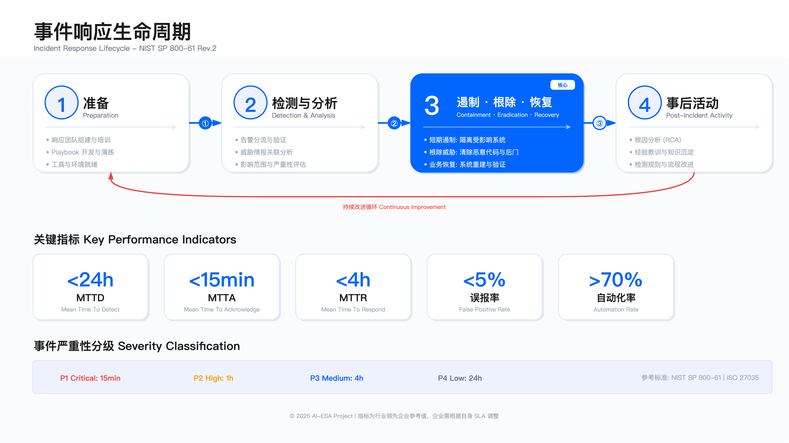
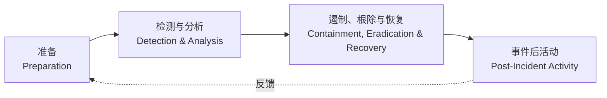
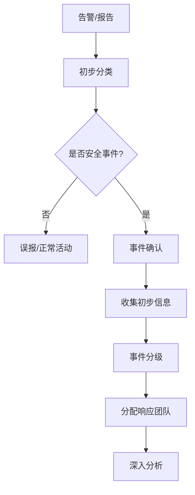
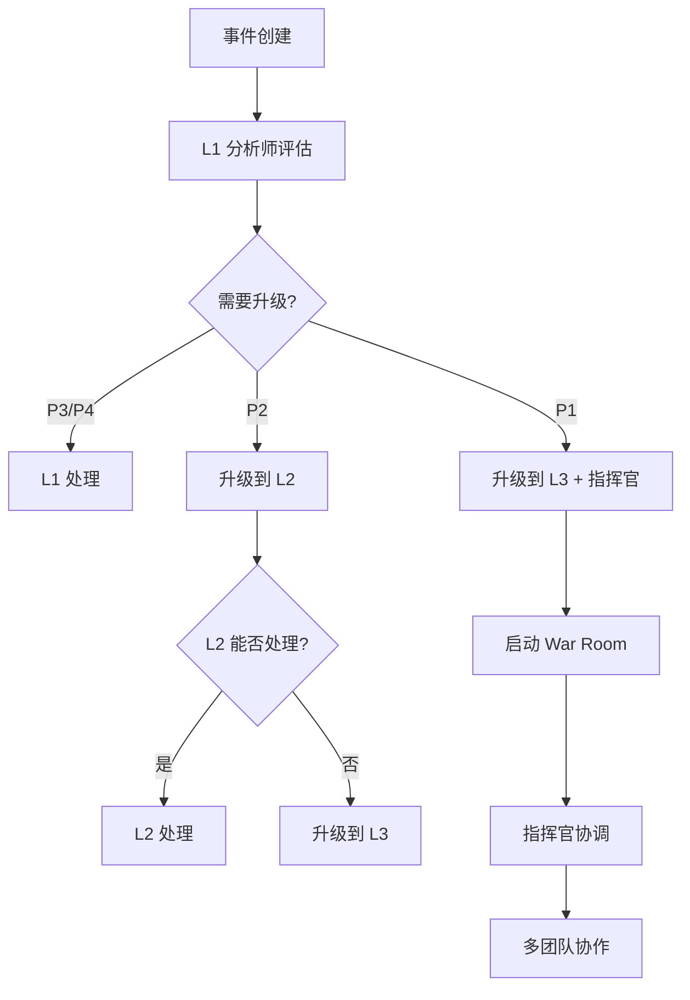

# 11.4 事件响应（IR）

事件响应是 SOC 的核心能力。本节基于 NIST SP 800-61 标准，介绍完整的事件响应生命周期、事件分级体系、playbook 开发、SOAR 自动化响应、战时指挥室运作和事件后分析。



---

## 11.4.1 事件响应生命周期

### NIST SP 800-61 框架

NIST SP 800-61 Rev. 2 定义了事件响应的四阶段循环模型。该模型将响应过程分解为可操作的阶段，每个阶段有明确的输入、输出和验收标准。



### 阶段 1: 准备（Preparation）

准备阶段的目标是在事件发生前建立响应能力。该阶段的验收标准包括：响应团队已组建且角色清晰、响应流程已文档化且经过演练、工具和通信渠道已就绪。

适用边界：适用于所有规模企业，但团队配置和工具选型应根据组织规模、业务复杂度和风险承受能力调整。初创企业可采用"虚拟团队 + 外部服务"模式，大型企业需建立全职 CSIRT。

关键活动：

1. 组建事件响应团队（CSIRT）
   - 事件响应指挥官（Incident Commander）：决策权、资源调配、对外沟通
   - 技术分析师（Technical Analyst）：日志分析、威胁识别、IOC 提取
   - 取证专家（Forensic Analyst）：证据保全、根因分析、攻击路径重建
   - 沟通协调员（Communications Coordinator）：内外部通知、状态更新、监管报告
   - 法务/合规代表：法律风险评估、监管通知判定、合规证据收集

2. 制定响应政策和流程
   - 事件响应政策：明确触发条件、升级路径、审批权限
   - 事件分级标准：基于业务影响和紧急程度的二维矩阵
   - 升级矩阵：不同级别事件的通知对象、响应时限、决策层级
   - 沟通计划：内部（员工、管理层）和外部（客户、监管、媒体）的通知模板与时机
   - 法律和合规要求：监管报告时限（如 GDPR 72 小时）、证据链保管要求

3. 准备工具和资源
   - 事件响应工具包：取证工具（FTK、EnCase）、内存分析（Volatility）、网络抓包（Wireshark）
   - 取证工具和沙箱：隔离分析环境、恶意软件沙箱（Cuckoo、Any.run）
   - 通信渠道：专用 War Room（物理或虚拟）、加密通信工具（Signal、Wickr）
   - 事件响应 playbook：针对常见威胁（勒索软件、数据泄露、DDoS）的标准化流程
   - 联系人清单：内部团队（IT、业务、法务）、外部资源（执法机关、律师、保险公司）

4. 培训和演练
   - 定期桌面演练（Tabletop Exercise）：每季度，模拟场景讨论，验证流程完整性
   - 实战演练（Full-Scale Exercise）：每半年，真实环境模拟，测试响应时间与协同效率
   - 红蓝对抗演练：每年，模拟 APT 攻击，评估检测与响应能力
   - 技能培训和认证：GCIH、GCFA、CISM 等认证；技术培训（取证、逆向）

关键约束：

- 成本约束：全职 CSIRT 需要持续投入（人员、工具、培训）。中小企业可考虑混合模式：核心团队 + 按需外部专家。
- 响应时限：准备不足会导致事件发生时的混乱与延误。演练频率应与组织风险等级匹配。
- 跨时区协调：全球企业需考虑 24×7 覆盖，通常需要 3 个时区的团队或 Follow-the-Sun 模式。

常见误区：

1. 误区：认为"买了工具就能响应"。工具只是手段，未经演练的流程在压力下会失效。
2. 误区：只培训安全团队。业务部门（HR、PR、法务）的协同能力同样关键，尤其在重大事件中。
3. 误区：playbook 一次编写永久有效。攻击手法持续演进，playbook 需定期基于新威胁和事件经验更新。

验证方法：

- 桌面演练：检验流程完整性，记录决策点耗时与卡点
- 模拟演练：测量响应时间（从通知到首次行动），检查工具就绪状态
- 审计检查：法务/合规部门审核通知流程、监管报告模板的合规性

运行指标：

- 演练频率：桌面演练 ≥ 4 次/年，实战演练 ≥ 2 次/年
- 工具就绪率：月度检查，工具可用性 > 95%，许可证在有效期内
- 联系人准确率：季度验证，联系人信息更新及时性 > 90%

### 阶段 2: 检测与分析（Detection & Analysis）

检测与分析阶段的目标是快速识别安全事件，完成初步分类和影响评估。该阶段的挑战是在大量告警中筛选真实威胁，避免漏报和误报。

适用边界：适用于已部署检测能力（SIEM、EDR、IDS）的组织。对于检测覆盖不足的环境，需先补齐基础监控再优化分析流程。

检测来源：

- SIEM/XDR 告警：关联分析后的高置信度事件
- IDS/IPS 告警：网络层攻击特征匹配
- EDR/AV 告警：终端恶意软件、异常进程、横向移动
- 威胁情报匹配：IOC（IP、域名、文件哈希）命中
- 用户报告：钓鱼邮件举报、账号异常、可疑行为
- 第三方通知：安全厂商、执法机关、行业共享平台

分析流程：



初步分析清单：

- 事件类型：恶意软件、钓鱼、数据泄露、账号入侵、内部威胁、DDoS（分类影响后续 playbook 选择）
- 影响范围：受影响系统数量、用户数量、数据类型与敏感度
- 业务影响：服务中断时长、交易影响金额、客户影响规模、声誉影响评估
- IOC 提取：攻击者 IP、C2 域名、文件哈希、注册表键值、进程名称
- 时间线：首次告警时间、攻击可能开始时间、最后活动时间（估算攻击窗口）
- 攻击者 TTP：基于 MITRE ATT&CK 映射战术（如初始访问、持久化、横向移动）

关键约束：

- 误报成本：过度敏感的规则导致告警疲劳，分析师效率下降。需持续调优检测规则。
- 分析时限：P1 事件需在 15 分钟内完成初步分析，延误会错过遏制窗口。
- 证据保全：分析过程中需避免破坏证据（如不直接登录受感染主机），影响后续取证。

常见误区：

1. 误区：所有告警都立即深入调查。应先基于分级标准判断优先级，避免在低价值告警上浪费资源。
2. 误区：仅依赖自动化工具输出。自动化工具可能漏报零日攻击或误判正常行为，需人工审核关键决策点。
3. 误区：忽略时间线分析。攻击者可能在系统中潜伏数周，仅分析当前状态会遗漏初始入侵点。

验证方法：

- 回放分析：对已知事件进行回溯分析，检验检测规则是否能触发
- 红队测试：模拟攻击，测量检测时延和分类准确性
- 误报率审计：定期抽查告警样本，计算误报率并调优规则

运行指标：

- 检测时延（MTTD）：从攻击发生到告警触发的时间，P1 目标 < 15 分钟
- 分类准确率：正确分类事件的比例，目标 > 90%
- 误报率：误报告警占总告警的比例，目标降至 < 10%

### 阶段 3: 遏制、根除与恢复

该阶段的目标是阻止威胁扩散、彻底清除威胁、恢复正常运营。阶段划分为遏制、根除、恢复三个子步骤，每个步骤有明确的验收条件。

适用边界：适用于已确认的安全事件。对于高度复杂的攻击（如 APT），可能需要多轮迭代才能完全根除。

**遏制（Containment）** 

遏制的目标是快速阻止威胁扩散，降低损害。遏制措施需在损害控制与业务连续性之间平衡。

短期遏制（立即行动，优先阻止扩散）：

- 隔离受感染主机：网络隔离（断网但保持电源，以保留内存证据）
- 封禁恶意 IP/域名：防火墙、DNS 黑洞、CDN 规则
- 禁用被入侵账户：AD 账户禁用、撤销 OAuth 令牌、强制密码重置
- 断开网络连接：关键情况下隔离网络段，防止横向移动

长期遏制（持续防护，为根除争取时间）：

- 部署临时防护规则：WAF 规则、IPS 签名、EDR 策略
- 加强监控：提高日志级别、部署额外监控点、实时告警
- 部署蜜罐/诱饵：监控攻击者行为、收集 TTP
- 应用临时补丁：虚拟补丁（WAF/IPS 规则）代替生产补丁，降低业务中断

关键约束：

- 业务影响：过度遏制（如隔离生产系统）会造成业务中断，需与业务部门沟通权衡。
- 时间窗口：遏制不及时会导致数据外泄、横向移动、权限提升，损失扩大。
- 取证完整性：遏制操作（如关机、网络断开）可能破坏易失性证据（内存、网络连接），需在操作前采集。

**根除（Eradication）** 

根除的目标是从环境中彻底清除威胁。不彻底的根除会导致威胁重新激活。

- 移除恶意软件和后门：EDR 清除、手动删除、镜像重建
- 删除未授权账户：清理影子账户、删除后门用户、撤销持久化机制
- 修复被利用的漏洞：应用补丁、配置加固、关闭不必要服务
- 重置被盗凭证：强制密码重置、撤销 API 密钥、重新颁发证书
- 重建受损系统：从干净镜像重建，避免依赖可能被篡改的备份

关键约束：

- 完整性验证：需验证所有攻击路径均已清除，避免遗留后门导致二次感染。
- 业务停机时间：重建系统需要停机，需协调业务窗口或采用蓝绿部署降低影响。

**恢复（Recovery）** 

恢复的目标是恢复正常业务运营，并确保系统安全。恢复过程需逐步验证，避免仓促恢复导致二次感染。

- 验证系统干净：扫描检查、行为监控、日志分析，确认无残留威胁
- 逐步恢复服务：从非生产环境开始，逐步恢复生产系统
- 增强监控：恢复后 72 小时内保持高强度监控，及时发现复发迹象
- 验证业务功能：功能测试、性能测试、数据完整性验证
- 沟通恢复状态：通知业务部门、客户、监管机构服务恢复情况

关键约束：

- 验证不足：未充分验证就恢复服务可能导致攻击者卷土重来，需要更长的恢复时间。
- 监控盲点：恢复后需持续监控，攻击者可能在初期遏制后潜伏，待恢复后重新激活。

常见误区：

1. 误区：快速遏制但根除不彻底。仅隔离受感染主机而未清除攻击者在其他系统的立足点，导致横向移动继续。
2. 误区：过度依赖自动化工具清除。自动化工具可能无法检测高级持久化机制，需人工验证。
3. 误区：恢复后立即解除监控。攻击者可能在系统中植入多个后门，需在恢复后保持警惕。

验证方法：

- 证据验证：取证分析确认所有恶意文件、进程、账户已清除
- 红队测试：恢复后进行渗透测试，验证攻击路径已修复
- 业务验证：业务部门确认功能正常、数据完整

运行指标：

- 遏制时间（MTTR - Respond）：从开始响应到威胁遏制，P1 目标 < 2 小时
- 恢复时间（MTTR - Recover）：从威胁遏制到系统完全恢复，P1 目标 < 4 小时
- 二次感染率：恢复后 30 天内同一威胁重现的比例，目标 < 5%

### 阶段 4: 事件后活动

事件后活动的目标是从事件中学习，持续改进响应能力。该阶段是生命周期闭环的关键，确保经验转化为改进措施。

适用边界：所有 P1-P3 事件均需进行事件后分析，P4 事件可选择性进行。分析深度与事件影响成正比。

**事件复盘（Post-Incident Review）** 

复盘应在事件关闭后 5-7 个工作日内进行，避免时间过长导致记忆模糊、证据丢失。

1. 时间线回顾：完整事件时间线，从初始入侵到完全恢复，标注关键决策点
2. 根因分析：攻击如何发生（漏洞、配置错误、社工）？为什么未被阻止（检测盲点、响应延误）？
3. 响应评估：响应是否及时有效？哪些环节顺利？哪些环节出现延误或混乱？
4. 经验教训：学到了什么新的攻击手法？发现了哪些流程缺陷？
5. 改进措施：需要改进什么（检测规则、响应流程、工具能力、人员培训）？
6. 知识分享：文档化事件分析报告，分享给安全团队、业务部门、管理层

改进行动：

- 更新检测规则：基于新 IOC 和 TTP 更新 SIEM 规则、EDR 策略、IDS 签名
- 改进响应流程：修订 playbook，明确模糊的决策点，优化流程瓶颈
- 加强防护措施：修复被利用的漏洞，加固配置，实施补偿控制
- 培训和演练：针对发现的能力缺口组织培训，更新演练场景
- 技术债务修复：优先修复在事件中暴露的系统弱点（如未打补丁、弱密码）

关键约束：

- 时间投入：复盘需要多团队参与，协调会议时间可能困难，但必须优先进行。
- 责任归咎：复盘应聚焦系统性改进而非个人责任，避免因归咎导致信息隐藏。

常见误区：

1. 误区：事件解决就结束，不做复盘。错失学习机会，同类事件会重复发生。
2. 误区：复盘流于形式，改进措施无人跟进。应明确责任人、截止日期，纳入绩效考核。
3. 误区：仅安全团队参与复盘。业务部门、IT 部门的参与能揭示更多系统性问题。

验证方法：

- 改进措施跟踪：建立跟踪表，定期审查改进措施执行进度
- 演练验证：在下次演练中测试改进措施是否有效
- 指标对比：对比改进前后的 MTTD、MTTR，评估效果

运行指标：

- 复盘完成率：P1-P3 事件的复盘完成率，目标 100%
- 改进措施执行率：复盘后 30 天内改进措施的完成率，目标 > 80%
- 知识库更新率：事件分析报告归档到知识库的比例，目标 100%

---

## 11.4.2 事件分级与优先级

### 事件分级标准

事件分级决定了响应的紧急程度和资源投入。分级标准应基于业务影响和紧急程度两个维度，明确每个级别的响应时间和处置流程。

该分级体系基于 NIST SP 800-61 和 ISO/IEC 27035 标准，结合企业实际业务场景制定。实施时应根据组织规模、业务特点、监管要求调整。

| 级别 | 严重程度 | 业务影响 | 响应时间 | 示例 |
| --------------------- | -------- | ---------------------- | -------------- | -------------------------------------------- |
| P1 Critical | 严重 | 业务中断或重大数据泄露 | 15 分钟（MTTA） | 勒索软件爆发、核心系统被攻陷、大规模数据泄露 |
| P2 High | 高 | 显著影响或潜在严重后果 | 30 分钟（MTTA） | 重要系统被入侵、敏感数据暴露、APT 活动 |
| P3 Medium | 中 | 有限影响 | 2 小时（MTTA） | 单一主机感染、钓鱼邮件成功、权限滥用 |
| P4 Low | 低 | 最小或无影响 | 8 小时（MTTA） | 扫描活动、策略违规、可疑但未确认 |

分级依据：

- 业务影响：服务中断时长、影响用户数、数据泄露规模、财务损失、声誉影响
- 紧急程度：攻击扩散速度、数据外泄风险、监管报告要求、媒体曝光可能性
- 技术复杂度：攻击手法复杂度、根除难度、恢复时间预估

关键约束：

- 分级争议：不同团队对影响的判断可能不一致，需明确分级决策者（通常是 Incident Commander）。
- 动态调整：事件可能随调查深入而升级或降级，需建立重新分级机制。

常见误区：

1. 误区：所有事件都定为 P1。过度升级导致资源浪费、团队疲劳，真正的紧急事件反而延误。
2. 误区：分级后不再调整。攻击范围扩大或发现更严重影响时应及时重新分级。

验证方法：

- 历史事件审查：抽查历史事件分级是否合理，是否有误分级导致延误
- 演练测试：在演练中测试分级决策的速度和准确性

#### 时间指标计算说明

时间指标是衡量响应效率的核心。以下指标定义基于行业标准实践，企业应根据自身 SLA 调整目标值。

事件响应时间线（Incident Response Timeline）：

```
攻击发生 ─→ 告警触发 ─→ 分析师确认 ─→ 开始响应 ─→ 威胁遏制 ─→ 系统恢复
   T0         T1           T2            T3           T4          T5

   |<─ MTTD ─>|
              |<─ MTTA ─>|
                         |<─ MTTR (Respond) ─>|
                                              |<─ MTTR (Recover) ─>|
```

关键指标定义：

| 指标 | 全称 | 计算方式 | P1 目标 | P2 目标 | P3 目标 |
| ------------------------ | ------------------------ | ---------------------------------- | ------- | ------- | ------- |
| MTTD | Mean Time To Detect | T1 - T0（攻击发生 → 告警触发） | < 15min | < 1h | < 4h |
| MTTA | Mean Time To Acknowledge | T2 - T1（告警触发 → 分析师确认） | < 15min | < 30min | < 2h |
| MTTR (Respond) | Mean Time To Respond | T4 - T3（开始响应 → 威胁遏制） | < 2h | < 4h | < 24h |
| MTTR (Recover) | Mean Time To Recover | T5 - T4（威胁遏制 → 系统完全恢复） | < 4h | < 8h | < 48h |

示例计算：

```
场景：P1 勒索软件事件
- 02:00  攻击者获得初始访问（T0）
- 02:12  EDR 触发异常加密告警（T1）→ MTTD = 12min ✓
- 02:18  SOC 分析师确认勒索软件（T2）→ MTTA = 6min ✓
- 02:20  启动应急响应（T3）
- 03:45  隔离受感染主机，停止加密（T4）→ MTTR (Respond) = 85min ✓
- 06:30  从备份恢复系统并验证（T5）→ MTTR (Recover) = 165min ✓
```

SLA 合规性判断：

- 达标：MTTA < 15min，MTTR (Respond) < 2h
- 警告：MTTA 15-20min（需优化检测规则或增加人员覆盖）
- 违约：MTTR (Respond) > 2h（需启动 RCA 根因分析，识别瓶颈）

关键约束：

- 检测盲点：T0 时刻（攻击实际发生时间）通常只能在事后通过取证分析估算，实时 MTTD 依赖检测覆盖度。
- 人力覆盖：MTTA 受人员覆盖影响，7×24 覆盖需要多时区团队或夜班安排。
- 业务窗口：恢复时间受业务窗口限制，关键系统可能需等待维护窗口，影响 MTTR。

常见误区：

1. 误区：只关注单一指标。仅优化 MTTA 而忽略 MTTD 会导致快速响应但发现太晚；仅优化 MTTD 而忽略 MTTR 会导致发现快但处置慢。
2. 误区：所有事件用同一目标值。应根据事件级别设置差异化目标，避免低级别事件占用过多资源。

验证方法：

- 自动化时间戳记录：SIEM/SOAR 自动记录每个阶段时间戳，减少人工误差
- 定期审计：每月审计时间指标，识别超标事件并分析原因
- 趋势分析：对比月度/季度趋势，评估改进措施效果

运行指标：

- SLA 达标率：每月达标事件占总事件的比例，目标 P1 > 90%，P2 > 85%，P3 > 80%
- 平均响应时间：月度平均 MTTR，用于趋势分析和基准对比
- 超标事件分析：每月分析超标事件的根因（人员不足、工具故障、流程缺陷）

### 事件分类

事件分类用于统计分析、资源规划和能力建设。分类体系应与检测规则、playbook 库对应，实现从检测到响应的自动化关联。

按攻击类型：

- 恶意软件（Malware）：病毒、蠕虫、木马、勒索软件、挖矿软件
- 钓鱼/社会工程（Phishing/Social Engineering）：钓鱼邮件、钓鱼网站、电话诈骗、假冒高管
- Web 应用攻击（Web Application Attack）：SQL 注入、XSS、CSRF、文件上传漏洞
- 暴力破解（Brute Force）：密码喷洒、凭证填充、SSH/RDP 暴力破解
- 拒绝服务（DoS/DDoS）：网络层 DDoS、应用层 DDoS、资源耗尽
- 内部威胁（Insider Threat）：数据窃取、权限滥用、恶意破坏
- 数据泄露（Data Breach）：数据外泄、数据库泄露、云存储暴露
- 账户入侵（Account Compromise）：账户接管（ATO）、会话劫持、令牌窃取
- APT 攻击（Advanced Persistent Threat）：长期潜伏、定向攻击、多阶段攻击

按 MITRE ATT&CK 战术：

- 初始访问（Initial Access）：钓鱼、漏洞利用、供应链攻击
- 执行（Execution）：恶意脚本、命令执行、用户执行
- 持久化（Persistence）：计划任务、启动项、后门账户
- 权限提升（Privilege Escalation）：漏洞利用、令牌窃取、UAC 绕过

关键约束：

- 分类粒度：过细的分类增加维护成本，过粗的分类降低分析价值。建议采用两级分类（类型 + 子类型）。
- 多重分类：一个事件可能涉及多个类型（如钓鱼导致恶意软件感染），需支持多标签。

常见误区：

1. 误区：分类与 playbook 不对应。分类应直接关联到响应流程，避免分类后仍需人工判断。
2. 误区：分类一次后不再调整。随调查深入，初步分类可能不准确，应支持重新分类。

验证方法：

- 分类准确性审计：每月抽查事件样本，检验分类是否准确
- playbook 匹配率：统计事件分类后 playbook 的自动匹配成功率

运行指标：

- 分类覆盖率：有明确分类的事件占总事件的比例，目标 > 95%
- 分类一致性：多名分析师对同一事件分类的一致性，目标 > 90%

### 升级机制

升级机制确保事件在合适的层级得到处理，避免低级别分析师处理超出能力的事件，或高级别分析师浪费在简单事件上。



升级触发条件：

- 级别触发：P1 事件自动升级至 L3 + Incident Commander；P2 事件升级至 L2
- 能力触发：当前层级无法处理（如需取证、逆向、法律判断）
- 时间触发：超过 SLA 时限仍未解决，自动升级
- 影响扩大：事件影响范围扩大，超出初始分级

升级流程：

1. L1 分析师判断需升级，在工单系统标记升级原因
2. 系统自动通知上级分析师和 Incident Commander
3. 上级分析师在 15 分钟内响应，接手或重新分配
4. 升级后 L1 分析师协助提供上下文，但决策权转移

关键约束：

- 升级延误：L1 分析师可能因担心被认为能力不足而延迟升级，需建立"鼓励升级"文化。
- 反复降级：L2/L3 将事件降回 L1 会打击士气，应明确升级标准避免误升级。

常见误区：

1. 误区：升级等同于批评。应将升级视为正常流程，鼓励及时升级而非死扛。
2. 误区：升级后原分析师完全脱离。升级后 L1 仍应协助，提供初步分析结果，避免重复工作。

验证方法：

- 升级合理性审计：每月抽查升级事件，检验升级是否必要且及时
- 升级时延统计：测量从升级触发到上级响应的时间，目标 <15 分钟

运行指标：

- 升级率：升级事件占总事件的比例，用于评估 L1 能力和分级准确性
- 升级及时性：升级触发到上级响应的时间，目标 < 15 分钟
- 升级准确性：升级后确认需要上级处理的比例，目标 > 85%

---

## 11.4.3 事件响应 playbook

### playbook 结构

playbook 是标准化的响应流程文档，定义了针对特定威胁的详细操作步骤。良好的 playbook 应包括触发条件、角色分工、操作步骤、决策点、沟通要求和验收标准。

以下是基于实际生产环境经验的勒索软件响应 playbook 示例。实施时应根据组织的工具栈、人员配置、监管要求调整。

```
playbook_id: PB-001
name: Ransomware Response Playbook
version: 2.0
last_updated: 2025-10-21
owner: IR Team

trigger:
  - Ransomware detection by EDR
  - Ransom note discovered
  - Mass file encryption detected

severity: P1 - Critical

roles:
  - incident_commander
  - technical_analyst
  - forensic_analyst
  - communications_lead
  - legal_counsel

阶段s:
  - 阶段: Immediate Response (0-15 min)
    steps:
      - step: 1
        action: Activate incident response team
        owner: On-call SOC
        automation: SOAR auto-notification

      - step: 2
        action: Isolate affected systems
        owner: Technical Analyst
        automation: EDR network isolation
        details: |
          - Identify all affected hosts
          - Isolate from network (keep power on)
          - Document isolation time

      - step: 3
        action: Identify ransomware variant
        owner: Malware Analyst
        tools: [VirusTotal, ID-Ransomware, sandbox]

      - step: 4
        action: Assess scope
        owner: Incident Commander
        questions:
          - How many systems affected?
          - What data is encrypted?
          - Is backup affected?

  - 阶段: Containment (15 min - 1 hour)
    steps:
      - step: 5
        action: Disable compromised accounts
        owner: Identity Team
        automation: IAM account disable

      - step: 6
        action: Block C2 communication
        owner: Network Team
        automation: Firewall rule deployment

      - step: 7
        action: Secure backups
        owner: Backup Team
        details: |
          - Verify backup integrity
          - Isolate backup systems
          - Prepare for restoration

  - 阶段: Eradication & Recovery (1 hour+)
    steps:
      - step: 8
        action: Remove ransomware
        owner: Technical Team
        methods:
          - Reimage affected systems (preferred)
          - Use decryption tools (if available)

      - step: 9
        action: Restore from backup
        owner: Backup Team
        verification:
          - Verify data integrity
          - Scan restored systems
          - Test functionality

      - step: 10
        action: Implement additional protections
        owner: Security Team
        actions:
          - Deploy additional EDR rules
          - Enhance email filtering
          - Educate users

communications:
  internal:
    - Notify executives within 30 min
    - Update stakeholders every 2 hours
    - Send all-hands if P1

  external:
    - Coordinate with legal on disclosure
    - Prepare customer communication
    - Engage PR if needed

documentation:
  - Maintain incident timeline
  - Collect all IOCs
  - Document all actions
  - Preserve evidence

post_incident:
  - Conduct post-mortem within 7 days
  - Update detection rules
  - Review and update this playbook
  - Share lessons learned

references:
  - NIST SP 800-61
  - CISA Ransomware Guide
  - Internal IR procedures
```

### playbook 开发常见实践

1. 基于真实场景：从历史事件（内部事件或公开披露案例）和演练经验开发，确保流程可操作。避免纸上谈兵式的理论流程。
2. 清晰的步骤：每个步骤应明确责任人、操作指令、工具使用、预期结果。避免模糊指令如"检查系统"，应具体为"运行 EDR 扫描，检查进程列表中是否有异常"。
3. 自动化集成：标注哪些步骤可自动化（如账号禁用、网络隔离、IOC 封禁），并通过 SOAR 实现。自动化步骤应有人工审批点，避免误操作。
4. 灵活性：提供决策点和替代路径。例如，"如果备份被加密，则执行路径 B：联系勒索软件解密专家"。playbook 是指导而非死板流程。
5. 持续更新：每次事件后 review playbook，补充新发现的步骤、工具、决策点。playbook 版本化管理，记录变更历史。

关键约束：

- 维护成本：playbook 需持续更新，但人力有限。优先维护高频和高影响事件的 playbook。
- 工具依赖：playbook 中引用的工具应确保可用，避免因工具故障导致流程中断。
- 合规要求：某些操作（如数据销毁、监管报告）需遵循法律流程，playbook 应包含合规检查点。

常见误区：

1. 误区：playbook 越详细越好。过度详细导致执行者机械执行，忽略实际情况变化。应平衡详细性与灵活性。
2. 误区：只有安全团队编写 playbook。应与业务、IT、法务协作编写，确保流程可行且符合业务需求。
3. 误区：编写后束之高阁。playbook 应定期演练，发现问题及时修订。

验证方法：

- 桌面演练：逐步执行 playbook，检验每个步骤是否清晰可行
- 实战演练：在隔离环境模拟真实攻击，测试 playbook 执行效率
- 事后审计：事件结束后对比实际操作与 playbook，识别偏差

运行指标：

- playbook 覆盖率：有 playbook 的事件类型占总事件类型的比例，目标 > 80% 高频事件
- playbook 执行率：实际按 playbook 执行的事件占可执行事件的比例，目标 > 90%
- playbook 更新频率：每个 playbook 的年度更新次数，目标至少 1 次/年

---

## 11.4.4 SOAR 自动化响应

### 自动化响应场景

SOAR (Security Orchestration, Automation and Response) 通过自动化编排减少人工干预，提升响应速度和一致性。以下场景展示了典型的自动化响应逻辑。

→ *详见 [14.3 AI for SecOps](../../part_05_ai_driven_security_innovation/chapter_14_ai_for_security/14.3_ai_for_secops.md) 中 S3 场景（安全事件响应编排），了解 AI 如何增强 SOAR 的 Playbook 生成、决策建议与自动化编排能力*

**场景 1：恶意软件响应**

该场景展示了从检测到遏制的全自动化流程。适用于高置信度的恶意软件检测（如已知文件哈希匹配）。对于未知威胁，应加入人工审批点。

```
# SOAR Playbook: Malware Response
@playbook(trigger="malware_detected")
def malware_response_playbook(alert):
    # Step 1: Gather context
    endpoint = get_endpoint_details(alert.hostname)
    file_hash = alert.file_hash

    # Step 2: Enrich with threat intelligence
    ti_result = query_threat_intelligence(file_hash)

    if ti_result.is_malicious:
        # Step 3: Isolate endpoint
        isolation_result = isolate_endpoint(alert.hostname)

        # Step 4: Kill malicious process
        kill_process_result = terminate_process(
            alert.hostname,
            alert.process_id
        )

        # Step 5: Quarantine file
        quarantine_result = quarantine_file(
            alert.hostname,
            alert.file_path
        )

        # Step 6: Scan for other infections
        scan_result = full_scan_endpoint(alert.hostname)

        # Step 7: Create incident ticket
        incident = create_incident_ticket({
            'title': f'Malware detected on {alert.hostname}',
            'severity': 'high',
            'details': {
                'file_hash': file_hash,
                'ti_verdict': ti_result.verdict,
                'isolation': isolation_result,
                'remediation': quarantine_result
            }
        })

        # Step 8: Notify SOC team
        notify_soc_team(incident)

        return {
            'status': 'automated_response_complete',
            'incident_id': incident.id
        }
    else:
        # Low confidence, require human review
        return {'status': 'requires_analyst_review'}
```

**场景 2：账户入侵响应**

该场景展示了账户入侵的快速遏制流程。账户禁用、会话撤销、密码重置等操作均可自动化，但需记录所有操作以供审计。

```
@playbook(trigger="account_compromise")
def account_compromise_playbook(alert):
    user = alert.user_principal_name

    # Step 1: Disable account
    disable_result = disable_user_account(user)

    # Step 2: Revoke all active sessions
    revoke_result = revoke_all_sessions(user)

    # Step 3: Reset password (if safe)
    if not alert.indicators.password_spray:
        reset_result = force_password_reset(user)

    # Step 4: Revoke OAuth tokens
    revoke_oauth_tokens(user)

    # Step 5: Hunt for lateral movement
    hunt_result = hunt_lateral_movement(user, timerange='7d')

    # Step 6: Notify user and manager
    notify_user_and_manager(user, alert)

    # Step 7: Create incident
    incident = create_incident_ticket({
        'title': f'Account compromise: {user}',
        'severity': 'high',
        'actions_taken': {
            'account_disabled': disable_result,
            'sessions_revoked': revoke_result,
            'hunting_results': hunt_result
        }
    })

    return incident
```

### 自动化决策点

自动化程度应基于风险和确定性平衡。以下决策框架帮助判断何时自动化、何时需要人工干预。

完全自动化（Full Automation）：

- 低风险、高确定性：已知威胁（IOC 匹配）、标准化操作（账号禁用）、可逆操作（网络隔离）
- 已验证的误报处理：经过大量验证的误报规则自动关闭，减少分析师负担
- 标准化的遏制操作：网络隔离、进程终止、文件隔离等低风险操作
- 数据收集和富化：威胁情报查询、日志聚合、资产上下文收集

半自动化（Semi-Automation）：

- 自动执行，但需人工批准：高风险操作（如生产系统隔离）执行前需分析师确认
- 中等风险操作：可能影响业务但可快速回滚的操作（如防火墙规则变更）
- 跨境数据访问：涉及跨境数据传输的取证操作需合规审批
- 影响生产系统：对生产系统的重启、补丁、配置变更需业务部门批准

人工处理（Manual）：

- 高风险决策：支付赎金、数据销毁、监管报告等不可逆或法律敏感操作
- 复杂调查：需要深度分析、关联多个事件、推理攻击意图的场景
- 法律/合规敏感：涉及法律证据、监管报告、客户通知的决策
- 创新/未知场景：零日攻击、新型 TTP、未见过的攻击手法需人工分析

关键约束：

- 误操作风险：自动化隔离可能误伤正常系统，需要回滚机制和审计日志。
- 合规要求：某些操作（如跨境数据访问、用户账号禁用）需遵循合规流程，不能完全自动化。
- 工具可靠性：自动化依赖工具 API 可用性，工具故障会导致自动化失败，需降级到人工流程。

常见误区：

1. 误区：自动化越多越好。过度自动化可能导致误操作，应优先自动化高频、低风险任务。
2. 误区：自动化后不再监控。自动化流程可能因工具变更、API 升级而失效，需持续监控执行成功率。
3. 误区：人工审批点设置过多。过多审批点降低自动化效率，应仅在关键决策点设置。

验证方法：

- 沙箱测试：在隔离环境测试自动化流程，验证逻辑正确性和误操作风险
- 影子模式：自动化流程先运行但不实际执行，由分析师审查结果，验证准确性
- 定期审计：每月审计自动化操作日志，检查误操作和失败案例

运行指标：

- 自动化成功率：自动化流程成功执行的比例，目标 > 95%
- 误操作率：自动化导致误操作的比例，目标 < 1%
- 人工干预率：半自动化流程需要人工干预的比例，用于评估自动化信心度

### SOAR 实施指标

SOAR 实施效果应通过量化指标评估。以下指标帮助证明 SOAR 投资回报率。

| 指标 | 定义 | 目标 |
| ------------------------- | --------------------------------- | ------------- |
| 自动化率 | 自动化处置事件 / 总事件 | > 40% |
| 时间节省 | (人工耗时 - 自动化耗时) × 事件数 | > 1000 小时/年 |
| MTTR 改善 | 自动化后 MTTR vs 自动化前 | -50% |
| playbook 成功率 | 成功执行 / 总执行 | > 95% |

指标说明：

- 自动化率：衡量 SOAR 覆盖范围。40% 是合理起点，成熟组织可达 60-70%。
- 时间节省：量化 SOAR 的 ROI。例如，每个自动化事件节省 30 分钟，1000 事件/月节省 500 小时/月。
- MTTR 改善：自动化最直接的价值是提升响应速度。50% 改善是保守目标，简单场景可达 80%。
- playbook 成功率：衡量 playbook 质量和环境稳定性。低于 90% 需排查 playbook 逻辑或工具可靠性问题。

关键约束：

- 数据可得性：计算时间节省需要人工流程的基线数据，需提前记录。
- 成本投入：SOAR 平台、集成开发、维护成本较高，ROI 需要较长时间体现。

常见误区：

1. 误区：只看自动化率，不看质量。低质量的自动化（如高误操作率）反而增加工作量。
2. 误区：忽略维护成本。playbook 需持续维护，工具 API 变更需及时适配，否则成功率会下降。

验证方法：

- 对比分析：对比自动化前后同类事件的处理时间、人力投入、错误率
- 趋势分析：按月统计自动化率、MTTR 等指标，评估改进趋势
- 成本分析：计算 SOAR 平台成本 vs 节省的人力成本，评估 ROI

运行指标：

- 月度自动化事件数：每月通过 SOAR 自动化处理的事件数量
- playbook 执行失败分析：每月分析失败原因（工具故障、逻辑错误、环境变化），推动改进

---

## 11.4.5 战时指挥室（War Room）

### War Room 触发条件

War Room 是应对重大安全事件的协调机制。触发条件应明确且无歧义，避免过度或不足。

- P1 级别事件（业务中断或重大数据泄露）
- 跨区域/跨业务影响（影响多个业务单元或地理区域）
- 监管报告要求（需向监管机构报告的事件）
- 媒体/公众关注（已或可能引发媒体报道、客户投诉）
- 持续时间 > 4 小时（长时间未解决的事件，需升级协调）

关键约束：

- 激活成本：War Room 需要多团队高管参与，激活成本高，不应滥用。
- 疲劳风险：频繁激活会导致团队疲劳，应严格控制触发条件。

常见误区：

1. 误区：所有 P1 事件都启动 War Room。部分 P1 事件（如单一系统故障）可能不需要 War Room，应根据影响范围判断。
2. 误区：War Room 启动后不设结束条件。应明确何时解散 War Room，避免无限期占用资源。

验证方法：

- 事后审查：评估 War Room 是否必要，是否有效加速事件解决
- 触发条件审计：每季度审查触发条件，根据实际经验调整

### War Room 组织

War Room 的组织结构应明确角色和职责，避免多头指挥和责任模糊。

核心团队：

- 事件指挥官（Incident Commander）：统一指挥、最终决策、资源调配。应由经验丰富的安全负责人担任，具备技术背景和沟通能力。
- 技术负责人（Technical Lead）：技术调查和修复。协调 SOC、IT、开发团队的技术行动。
- 沟通协调员（Communications Lead）：内外部沟通。负责高管简报、客户通知、监管报告、媒体应对。
- 记录员（Scribe）：记录所有决策和行动。维护事件时间线、会议纪要、行动日志，为事后分析提供依据。

支持团队：

- IT/工程团队：系统修复、补丁部署、配置变更
- 安全分析师：威胁分析、IOC 提取、攻击路径重建
- 法务/合规：法律风险评估、监管通知判定、合规证据收集
- PR/公共事务：媒体应对、客户沟通、声誉管理
- 业务代表：业务影响评估、恢复优先级判断、用户沟通
- 高管（必要时）：重大决策（如支付赎金、公开披露）需 CEO/CFO/法务总监批准

关键约束：

- 角色冲突：Incident Commander 需有明确决策权，避免高管越级干预导致指挥混乱。
- 人员可用性：War Room 可能在非工作时间启动，需确保关键角色有备份。

常见误区：

1. 误区：人越多越好。War Room 应精简，只包含必要角色，避免沟通混乱。
2. 误区：没有明确指挥官。多头指挥会导致决策延误和冲突，必须有唯一指挥官。

验证方法：

- 演练测试：在演练中测试 War Room 组织，评估角色清晰度和协同效率
- 事后调查：事件后调查 War Room 成员对角色和流程的满意度

### War Room 运作

War Room 的运作需要物理或虚拟空间、协作工具、明确的沟通节奏和决策机制。

物理/虚拟 War Room：

- 专用会议室或视频会议：确保稳定通信，避免干扰
- 实时协作工具（Slack、Teams）：快速沟通、状态更新、文件共享
- 共享文档（时间线、行动清单）：Google Docs、Confluence 等，所有成员可见和编辑
- 状态仪表板：实时显示受影响系统、恢复进度、关键指标

沟通节奏：

- 每 30 分钟内部状态更新：Incident Commander 汇总进展、下步计划、阻塞点
- 每 2 小时高管简报：Communications Lead 向 CEO/CFO 汇报，使用统一模板
- 关键决策实时沟通：重大决策（如系统关闭、赎金支付）需立即通知高管并获批准

决策机制：

- 事件指挥官拥有最终决策权：日常操作决策（如隔离系统、禁用账户）由 Incident Commander 决定，无需逐级审批
- 重大决策（如系统关闭）需高管批准：影响业务连续性、财务损失 >100 万、监管报告等需 CEO/CFO 批准
- 所有决策记录并解释原因：Scribe 记录决策时间、决策者、决策内容、理由，为事后审计和复盘提供依据

关键约束：

- 沟通过载：频繁更新会打断技术团队工作，应平衡沟通频率与执行效率。
- 时区挑战：全球事件可能涉及多时区团队，需合理安排会议时间或采用异步沟通。

常见误区：

1. 误区：沟通工具过多。应统一使用一个主要工具（如 Slack），避免信息分散在多个平台。
2. 误区：决策不记录。口头决策容易遗忘或误解，所有决策必须书面记录。
3. 误区：高管过度干预技术细节。高管应关注业务影响和战略决策，技术细节交给技术团队。

验证方法：

- 演练评估：在演练中测试沟通工具、节奏、决策流程，收集参与者反馈
- 事后审计：事件后审查沟通记录、决策日志，评估流程是否顺畅

运行指标：

- 决策时延：从决策点出现到决策做出的时间，目标 < 30 分钟
- 沟通覆盖率：关键利益相关者是否及时获得信息，目标 100%
- War Room 持续时间：从启动到解散的总时长，用于评估事件复杂度和响应效率

### 状态报告模板

状态报告是 War Room 期间的关键沟通工具，用于向高管和利益相关者通报进展。报告应简洁、结构化、聚焦关键信息。

```markdown
## Incident Status Report
**Time**: 2025-10-21 14:30 UTC
**Report #**: 5
**Incident ID**: INC-20251021-001

### Executive Summary
Ransomware incident affecting 50 servers in APAC region.
Services impacted: Customer portal (partial outage).
Current status: Containment in progress.

### Current Status
- **Affected Systems**: 50 servers (10 critical, 40 non-critical)
- **Services Impact**: Customer portal 30% capacity
- **Data at Risk**: No evidence of data exfiltration yet
- **Attacker Access**: Contained, no active C2 communication

### Actions Taken (since last report)
1. Isolated all 50 affected servers
2. Blocked C2 domains at firewall
3. Disabled 3 compromised accounts
4. Secured backup systems
5. Forensic analysis in progress

### Next Steps (next 2 hours)
1. Complete forensic analysis
2. Begin restoration from backup
3. Deploy additional monitoring
4. Prepare customer communication

### Resources Needed
- Additional forensic analyst (requested)
- Legal review for disclosure (in progress)

### Estimated Resolution
- Containment: Complete
- Eradication: In progress (ETA: 4 hours)
- Recovery: Planned (ETA: 8 hours)

### Communication
- Executives: Briefed at 14:00
- Customers: Draft notification prepared
- Regulators: Monitoring for notification requirement
```

报告要素：

- Executive Summary：一句话概括事件性质、影响、当前状态，供高管快速了解
- Current Status：受影响系统、业务影响、数据风险、攻击者状态，量化描述
- Actions Taken：自上次报告以来完成的操作，展示进展
- Next Steps：未来 2 小时计划，给出时间预期
- Resources Needed：需要的额外资源（人员、工具、审批），明确请求
- Estimated Resolution：预估完成时间，管理预期
- Communication：已通知和待通知的对象，确保沟通覆盖

关键约束：

- 时效性：报告应定时发布（如每 2 小时），即使无重大进展也应更新，避免信息真空。
- 准确性：预估时间应保守，避免多次延期导致信任度下降。

常见误区：

1. 误区：报告过于技术化。高管关注业务影响和解决时间，不关注技术细节。应用业务语言描述。
2. 误区：隐瞒坏消息。应如实报告坏消息（如恢复延期、数据泄露），并说明应对措施。
3. 误区：报告不一致。多个报告来源（技术团队、PR）应统一口径，避免信息混乱。

验证方法：

- 模板演练：在演练中使用模板，收集高管反馈，优化格式和内容
- 事后评估：事件后询问高管报告是否及时、清晰、有用

运行指标：

- 报告准时率：按时发布报告的比例，目标 100%
- 预估准确性：实际完成时间与预估时间的偏差，目标 ± 30%

---

## 11.4.6 事件后分析（Post-Incident Review）

### 复盘会议议程

事件后分析的目标是系统性学习，而非追究个人责任。会议应在事件关闭后 5-7 天内进行，确保记忆清晰、证据完整。

参与者：

- 事件响应团队（Incident Commander、技术分析师、取证专家）
- 相关技术团队（SOC、IT、开发、网络）
- 管理层（安全负责人、IT 负责人、业务负责人）
- 相关业务部门（受影响业务的代表）

议程（2 小时）：

1. 事件回顾（30 分钟）
   - 完整时间线：从初始入侵到完全恢复，标注关键节点
   - 攻击路径：攻击者如何进入、横向移动、权限提升、数据外泄
   - 影响评估：业务影响（停机时间、交易损失）、数据影响（泄露规模、敏感度）、声誉影响

2. 响应评估（30 分钟）
   - 什么做得好？快速检测、有效遏制、良好沟通等亮点
   - 什么可以改进？延误环节、流程缺陷、工具不足
   - 响应是否及时？对比 SLA，分析超标原因
   - 工具和流程是否有效？playbook 是否实用，工具是否可靠

3. 根因分析（30 分钟）
   - 如何发生？漏洞、配置错误、社工、供应链
   - 为什么未被阻止？检测盲点、防护措施失效、流程缺陷
   - 防御措施为何失效？技术失效（如 AV 未更新）、流程失效（如补丁延误）、人员失效（如点击钓鱼）
   - 系统性问题？是否反映更深层问题（如安全文化、资源不足、技术债务）

4. 改进措施（30 分钟）
   - 技术改进：检测规则更新、防护措施加固、响应工具优化
   - 流程改进：playbook 更新、沟通流程优化、决策机制调整
   - 人员改进：培训计划、演练场景、人员配备
   - 分配责任人和截止日期：每项改进措施明确责任人和完成日期，纳入跟踪

关键约束：

- 无责文化：复盘应聚焦系统性问题，而非个人责任。追责会导致信息隐藏，不利于学习。
- 时间窗口：复盘应尽快进行，但需给团队缓冲时间（避免疲劳），通常 5-7 天较合适。

常见误区：

1. 误区：复盘变成批斗会。应明确"no blame"原则，聚焦流程和系统改进。
2. 误区：只讨论问题，不讨论亮点。应平衡讨论做得好和需改进的地方，提升士气。
3. 误区：改进措施无人跟进。应明确责任人、截止日期，纳入项目管理工具跟踪。

验证方法：

- 参与者反馈：会后收集参与者反馈，评估会议是否有价值
- 改进措施执行跟踪：定期审查改进措施进度，确保落实

运行指标：

- 复盘完成率：P1-P3 事件的复盘完成率，目标 100%
- 改进措施执行率：30 天内改进措施的完成率，目标 > 80%

### 事件报告模板

事件报告是正式的书面文档，用于归档、合规、知识分享。报告应客观、详细、可供审计。

```markdown
# Post-Incident Report: INC-20251021-001

## Executive Summary
On October 21, 2025, we detected and responded to a ransomware
incident affecting 50 servers in the APAC region……

## Incident Timeline
| Time (UTC) | Event |
|------------|-------|
| 2025-10-21 10:15 | Initial EDR alert: suspicious encryption activity |
| 2025-10-21 10:18 | SOC analyst confirmed ransomware |
| 2025-10-21 10:20 | Incident declared, War Room activated |
| 2025-10-21 10:30 | 50 servers isolated |
| ... | ... |
| 2025-10-21 22:00 | Services fully restored |

## Root Cause Analysis
**Initial Access**: Phishing email with malicious attachment
**Vulnerability**: User clicked and executed macro
**Lateral Movement**: Exploited unpatched SMB vulnerability
**Impact**: Ransomware deployed via compromised admin account

**Why not prevented?**
1. Email filtering did not catch phishing email (new technique)
2. User awareness training insufficient
3. Patch management delayed (SMB vulnerability known for 30 days)
4. Privileged account lacked MFA

## Impact Assessment
- **Systems Affected**: 50 servers (20% of APAC infrastructure)
- **Business Impact**: Customer portal 6-hour partial outage
- **Data Impact**: No data loss, no evidence of exfiltration
- **Financial Impact**: Estimated $500K (downtime + recovery)
- **Reputation Impact**: Limited (contained before public awareness)

## Response Effectiveness
**What went well:**
- Quick detection (5 minutes from alert to confirmation)
- Fast isolation (10 minutes from confirmation)
- War Room activated promptly
- Good communication with stakeholders
- Backups were intact and restore successful

**What needs improvement:**
- Initial phishing email not detected
- Lateral movement detection delayed
- Patch management process too slow
- Forensic analysis took longer than expected
- Customer communication could be faster

## Lessons Learned
1. Email security needs enhancement
2. User awareness training requires improvement
3. Patch management SLA needs tightening
4. MFA enforcement for all privileged accounts
5. Forensic capability needs strengthening

## Corrective Actions
| # | Action | Owner | Due Date | Status |
|---|--------|-------|----------|--------|
| 1 | Deploy advanced email security (DMARC + sandbox) | Email Team | 2025-11-01 | In Progress |
| 2 | Conduct refreshed phishing awareness campaign | Security Awareness | 2025-10-31 | Planned |
| 3 | Accelerate patch management (Critical: 7d, High: 14d) | Patch Team | 2025-11-15 | In Progress |
| 4 | Enforce MFA for all admin accounts | IAM Team | 2025-10-25 | In Progress |
| 5 | Acquire additional forensic tools and training | IR Team | 2025-11-30 | Planned |
| 6 | Update ransomware detection rules | Detection Team | 2025-10-23 | Complete |
| 7 | Update ransomware response playbook | IR Team | 2025-10-25 | In Progress |

## Recommendations
1. Consider cyber insurance review
2. Evaluate endpoint protection platform upgrade
3. Implement network segmentation improvements
4. Enhance backup testing frequency

## Appendices
- A: Complete incident timeline
- B: IOCs and TTPs
- C: Forensic analysis report
- D: Communication logs
```

报告要素：

- Executive Summary：高层概括，供高管和审计使用
- Incident Timeline：完整时间线，标注所有关键事件和决策点
- Root Cause Analysis：攻击路径和根本原因，回答"如何发生"和"为何未被阻止"
- Impact Assessment：量化业务、数据、财务、声誉影响
- Response Effectiveness：客观评估响应表现，平衡亮点和不足
- Lessons Learned：从事件中学到的经验，供未来参考
- Corrective Actions：具体改进措施、责任人、截止日期、跟踪状态
- Recommendations：长期改进建议，可能超出事件响应范围
- Appendices：详细技术分析、IOC 列表、日志、通信记录，供深入审查

关键约束：

- 合规要求：某些行业（金融、医疗）要求事件报告归档保存 5-7 年，需符合格式要求。
- 敏感信息：报告可能包含敏感信息（如漏洞细节、客户数据），需控制访问权限。

常见误区：

1. 误区：报告写完就束之高阁。应将报告归档到知识库，供团队学习和新员工培训使用。
2. 误区：过度粉饰。应客观描述问题，不隐瞒失误，才能真正改进。
3. 误区：只写技术细节。应平衡技术和业务视角，满足不同受众需求。

验证方法：

- 合规审查：法务/合规部门审查报告是否满足监管要求
- 技术审查：技术团队审查技术分析的准确性和完整性
- 知识库归档：确认报告已归档并可被搜索和访问

运行指标：

- 报告完成率：P1-P3 事件的报告完成率，目标 100%
- 报告完成时效：事件关闭后多久完成报告，目标 < 14 天
- 知识库归档率：报告归档到知识库的比例，目标 100%

---

## 小结

事件响应是 SOC 能力的综合体现，从准备、检测、遏制到恢复、复盘，形成完整的能力闭环。

本节基于 NIST SP 800-61 标准，结合生产环境实践经验，阐述了事件响应的完整框架：

1. 事件响应生命周期：准备、检测与分析、遏制/根除/恢复、事件后活动四阶段，明确每阶段的目标、活动、约束、验证方法和运行指标。
2. 事件分级：基于业务影响和紧急程度的二维分级体系，定义响应时间和升级机制，确保资源优先分配给高影响事件。
3. playbook 开发：标准化的响应流程文档，明确步骤、角色、工具、决策点，通过演练持续验证和改进。
4. SOAR 自动化：通过自动化编排提升响应速度和一致性，平衡自动化程度与风险控制，量化自动化效果。
5. War Room 运作：应对重大事件的协调机制，明确触发条件、组织结构、沟通节奏、决策机制，通过状态报告确保信息透明。
6. 事件后分析：从事件中系统性学习，通过复盘会议识别系统性问题，制定改进措施并跟踪执行，形成持续改进循环。

实施事件响应能力时，需注意以下关键点：

- 准备是基础：响应能力建立在充分准备之上，团队、流程、工具、演练缺一不可。
- 速度与准确性平衡：快速响应很重要，但误操作的代价更高，关键决策点需人工审批。
- 自动化是手段：自动化提升效率，但不能替代人的判断，复杂场景仍需人工分析。
- 复盘是关键：没有复盘的事件响应是浪费学习机会，改进措施需跟踪执行。
- 指标驱动改进：通过 MTTD、MTTR、自动化率等指标量化能力，持续优化。

下一节（11.5）将深入探讨威胁情报运营，介绍如何通过威胁情报增强检测和响应能力。

## 参考资料

1. NIST SP 800-61 Rev. 2, "Computer Security Incident Handling Guide"
2. SANS Institute, "Incident Handler's Handbook"
3. ISO/IEC 27035, "Information Security Incident Management"
4. FIRST, "CVSS v3.1 Specification Document"

---

## 导航

**[← 上一节：11.3 威胁检测工程](./11.3-threat-detection-engineering.md)** | **[返回章节目录](./README.md)** | **[下一节：11.5 威胁情报运营 →](./11.5-threat-intelligence-operations.md)**

---

**© 2025 AI-ESA Project. Licensed under CC BY-NC-SA 4.0**

