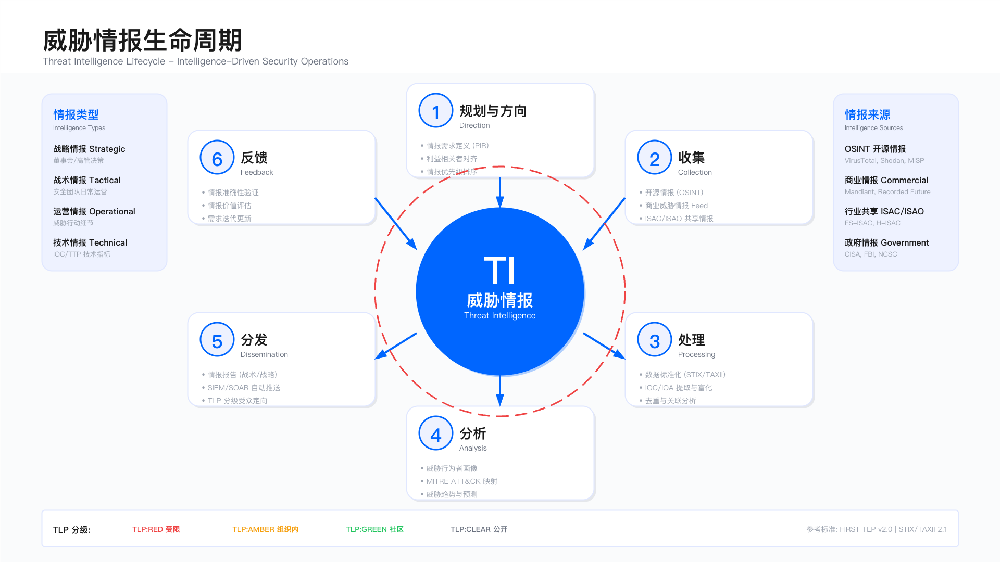
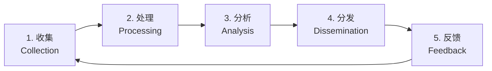
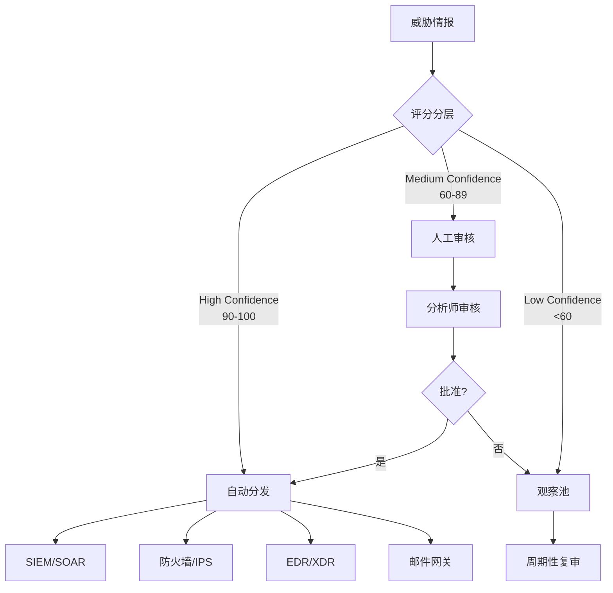
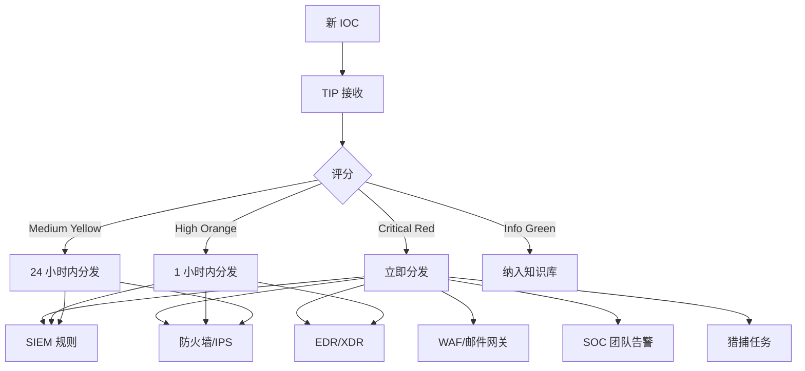

# 11.5 威胁情报运营

威胁情报是安全运营中心的关键资产，其价值在于将分散的威胁数据转化为可操作的检测、响应与决策依据。本节介绍威胁情报运营的完整实践，包括多源情报整合、IOC/IOA 管理、情报自动化、分析报告，以及情报驱动的检测和响应机制。



---

## 11.5.1 威胁情报来源

威胁情报来源的选择，是许多安全团队在情报运营初期容易陷入的困境。行业中常见的问题是"情报采购决策与实际消化能力脱节"：安全团队在厂商演示中被商业情报的丰富性和专业性所吸引，签订了高额订阅合同，但上线后发现——团队没有足够人力消化这些情报，大量战略分析报告无人阅读，IOC 推送到 SIEM 后与本地环境产生大量误报，最终情报平台变成"已读不回"的数据仓库。

更隐蔽的问题是"情报来源同质化"。许多商业情报厂商共享底层数据源（同一批安全研究员的博客、同一个暗网论坛的爬虫），导致高价购买的"独家情报"与免费开源情报高度重合。而真正有价值的"内部情报"——来自自身事件响应、红队演练、蜜罐捕获的威胁数据——往往散落在各个事件报告中，未被系统化提取和复用。

### 情报来源分类

威胁情报来源可分为四类，各有其适用场景与局限性。选择情报源时需权衡成本、时效性、可信度与内部消化能力。

1. 开源情报（OSINT）

| 来源 | 类型 | 示例 | 适用场景 |
|------|------|------|---------|
| **社区平台** | IOC、报告 | OTX, MalwareBazaar, URLhaus | 快速补充基础 IOC 库 |
| **安全厂商博客** | 分析报告 | Mandiant, CrowdStrike, Palo Alto Unit 42 | 了解 APT 战役与 TTP |
| **CVE 数据库** | 漏洞信息 | NVD, CVE, Exploit-DB | 漏洞情报与补丁决策 |
| **社交媒体** | 实时威胁 | Twitter #threatintel, Reddit r/netsec | 实时威胁预警 |
| **学术研究** | 新技术 | arXiv, IEEE, ACM | 了解前沿攻击技术 |

**约束条件**：开源情报质量参差不齐，误报率可能较高，需建立评分与验证机制，避免直接自动化分发至生产环境。

2. 商业情报

| 厂商 | 特点 | 适用场景 |
|------|------|----------|
| **Mandiant** | APT 情报深度分析 | 针对高级威胁的防护 |
| **Recorded Future** | 实时情报、AI 驱动 | 实时威胁感知与预测 |
| **CrowdStrike** | 端点威胁情报 | EDR 集成与端点防护 |
| **Flashpoint** | 暗网情报 | 数据泄露监控与地下黑产跟踪 |
| **Digital Shadows** | 数字风险情报 | 品牌保护与外部风险监控 |

**成本约束**：商业情报通常按订阅收费，需评估 ROI，建议先通过试用验证命中率与误报率，再决定是否采购。

3. 行业共享

- **ISAC（Information Sharing and Analysis Centers）**：行业特定情报共享，如 FS-ISAC（金融）、H-ISAC（医疗）、E-ISAC（能源）
- **FIRST（Forum of Incident Response and Security Teams）**：全球事件响应团队联盟

**参与门槛**：通常需企业具备一定成熟度，能够向社区贡献情报，单向获取情报而不共享，长期参与价值有限。

4. 内部情报

- 事件响应发现的 IOC
- 红队演练产生的 TTP
- 蜜罐/蜜网捕获的威胁
- 自研沙箱分析结果
- 客户/合作伙伴反馈

**可信度最高**：内部情报直接来自真实攻击，误报率低、相关性强，但需建立情报提取与标准化流程，否则散落在事件报告中无法复用。

---

## 11.5.2 威胁情报生命周期

威胁情报运营的核心挑战不在于"如何获取更多情报"，而在于"如何将情报转化为可操作的防御行动"。行业中常见的困境是"情报堆积但不流动"：情报团队每天从多个来源收集大量威胁数据，但这些数据在 TIP（威胁情报平台）中静静躺着，未能有效推送到检测平台，未能指导狩猎行动，更未能反馈给决策层影响安全投资。

生命周期管理的本质是建立"情报价值链"：从原始数据到可操作情报，再到检测规则和响应行动，每个环节都需要明确的转化机制和质量标准。缺乏任何一个环节，情报运营都会陷入"有情报无行动"或"有行动无闭环"的困境。

威胁情报运营遵循"收集 → 处理 → 分析 → 分发 → 反馈"的闭环流程。每个阶段均需明确输入、输出与验收标准。



### 阶段 1：收集（Collection）

**目标**：从多个渠道自动化采集威胁情报，确保覆盖主流情报源。

**自动化收集框架示例**：

```python
# 多源威胁情报收集框架
class ThreatIntelCollector:
 def __init__(self):
 self.sources = {
 'otx': AlienVaultOTX(api_key=OTX_KEY),
 'virustotal': VirusTotal(api_key=VT_KEY),
 'abuseipdb': AbuseIPDB(api_key=ABUSE_KEY),
 'malwarebazaar': MalwareBazaar(),
 'misp': MISPClient(url=MISP_URL, key=MISP_KEY)
 }

 def collect_iocs(self, timeframe='24h'):
 all_iocs = []

 for source_name, source in self.sources.items():
 try:
 iocs = source.get_recent_iocs(timeframe)
 for ioc in iocs:
 ioc['source'] = source_name
 ioc['collected_at'] = datetime.now()
 all_iocs.extend(iocs)
 except Exception as e:
 log.error(f"Failed to collect from {source_name}: {e}")

 return all_iocs
```

**常见误区**：
- 误区 1：只关注开源情报，忽略内部情报价值。内部情报虽然量小，但针对性强，应优先提取与复用。
- 误区 2：未设置采集频率上限，导致 API 调用超限或数据重复。建议设置每日采集上限与去重逻辑。

### 阶段 2：处理（Processing）

**目标**：将原始情报标准化、去重、验证与富化，形成可消费的情报产品。

**标准化与去重逻辑**：

```python
def process_threat_intelligence(raw_iocs):
 """标准化和去重威胁情报"""

 # 1. 标准化格式（转换为 STIX 2.1）
 normalized = []
 for ioc in raw_iocs:
 stix_ioc = convert_to_stix(ioc)
 normalized.append(stix_ioc)

 # 2. 去重
 deduped = deduplicate_iocs(normalized, key=['value', 'type'])

 # 3. 验证
 validated = []
 for ioc in deduped:
 if validate_ioc(ioc):
 validated.append(ioc)

 # 4. 富化
 enriched = []
 for ioc in validated:
 enriched_ioc = enrich_ioc(ioc)
 enriched.append(enriched_ioc)

 return enriched

def enrich_ioc(ioc):
 """富化威胁情报"""
 if ioc['type'] == 'ipv4-addr':
 # GeoIP 富化
 ioc['geo'] = geoip_lookup(ioc['value'])
 # WHOIS 富化
 ioc['whois'] = whois_lookup(ioc['value'])
 # 信誉评分
 ioc['reputation'] = reputation_check(ioc['value'])

 elif ioc['type'] == 'domain-name':
 # DNS 解析
 ioc['resolved_ips'] = dns_resolve(ioc['value'])
 # WHOIS 富化
 ioc['whois'] = whois_lookup(ioc['value'])

 elif ioc['type'] == 'file':
 # VirusTotal 查询
 ioc['vt_result'] = virustotal_lookup(ioc['value'])

 return ioc
```

**验证方法**：处理后的情报应满足：
- 格式符合 STIX 2.1 标准
- 去重率应在预期范围（例如，多源采集去重率通常 30%-50%）
- 富化字段覆盖率达标（例如，IP 地址 GeoIP 覆盖率 >95%）

### 阶段 3：分析（Analysis）

**目标**：对情报进行评分、关联分析，判断其可靠性、相关性与紧急度。

**情报评分模型**：

```python
def score_threat_intelligence(ioc):
 """
 综合评分模型
 - 可靠性（Reliability）：1-5
 - 相关性（Relevance）：1-5
 - 紧急度（Urgency）：1-5
 """
 score = {
 'reliability': assess_reliability(ioc),
 'relevance': assess_relevance(ioc),
 'urgency': assess_urgency(ioc),
 'confidence': 0
 }

 # 综合评分（0-100）
 score['confidence'] = (
 score['reliability'] * 0.3 +
 score['relevance'] * 0.4 +
 score['urgency'] * 0.3
 ) * 20

 return score

def assess_reliability(ioc):
 """评估情报来源可靠性"""
 source_scores = {
 'mandiant': 5,
 'crowdstrike': 5,
 'recorded_future': 5,
 'misp_community': 4,
 'otx': 3,
 'internal': 5
 }
 return source_scores.get(ioc['source'], 2)

def assess_relevance(ioc):
 """评估与组织的相关性"""
 score = 3 # 默认中等相关

 # 地理相关性
 if ioc.get('geo', {}).get('country') in OUR_OPERATING_COUNTRIES:
 score += 1

 # 行业相关性
 if ioc.get('industry') == OUR_INDUSTRY:
 score += 1

 # 技术栈相关性
 if ioc.get('technology') in OUR_TECH_STACK:
 score += 1

 return min(score, 5)

def assess_urgency(ioc):
 """评估紧急度"""
 # 活跃攻击
 if ioc.get('active_campaign'):
 return 5

 # 近期发现（7 天内）
 if days_since(ioc['first_seen']) < 7:
 return 4

 # 中等时效
 if days_since(ioc['first_seen']) < 30:
 return 3

 return 2
```

**权衡点**：
- 可靠性权重过高，可能错过新兴威胁（新情报源评分低）
- 相关性权重过高，可能忽略跨行业通用威胁
- 紧急度权重过高，可能导致频繁调整策略

建议根据组织威胁模型调整权重，并定期回顾评分模型有效性。

### 阶段 4：分发（Dissemination）

**目标**：将高质量情报自动化分发至检测平台，同时避免低质量情报污染生产环境。

**分层分发策略**：



**分发规则示例**：
- **自动分发（90-100 分）**：直接推送至 SIEM、防火墙、EDR 等平台，无需人工审核
- **人工审核（60-89 分）**：推送至 TIP 待审核队列，由分析师判断是否分发
- **观察池（<60 分）**：存入低优先级队列，每月复审一次，若有新证据则重新评分

**验证方法**：
- 监控自动分发情报的命中率（有效告警数/分发 IOC 数）
- 追踪人工审核的批准率与处理时长
- 定期抽查观察池情报，评估是否有遗漏的高价值情报

### 阶段 5：反馈（Feedback）

**目标**：评估情报有效性，优化情报源选择与评分模型。

**情报效果评估指标**：

| 指标 | 定义 | 计算方法 | 目标值 |
|------|------|----------|--------|
| **命中率** | 情报触发有效告警的比例 | 有效告警数 / 情报下发数 | >5% |
| **准确率** | 情报触发真阳性的比例 | 真阳性 / (真阳性 + 假阳性) | >80% |
| **覆盖率** | 检测到的攻击中使用了情报的比例 | 情报驱动检测数 / 总检测数 | >30% |
| **时效性** | 情报从发布到使用的时间 | 平均（检测时间 - 情报发布时间） | <24h |

> **参考说明**：上述目标值为已建立 TIP 平台且运营超过 6 个月的企业参考基线。调整因素包括：
> 1. **情报源结构**：商业情报占比高时，准确率目标可提升至 >90%，以开源情报为主时，可调低至 >70%
> 2. **业务场景**：金融/关基行业对时效性要求更高（<4h），一般企业 <24h 可接受
> 3. **团队规模**：小型团队（<3 人）应优先保障命中率与准确率，覆盖率目标可适当降低

**常见误区**：
- 误区 1：只关注命中率，忽略误报率。高命中率但误报率同样高，会导致告警疲劳。
- 误区 2：未建立反馈闭环，情报源评分长期不更新。建议每月复审情报源有效性，淘汰低效来源。

---

## 11.5.3 IOC/IOA 管理

IOC（入侵指标）与 IOA（攻击指标）的管理是威胁情报落地的关键环节，但这一领域在行业中存在根本性的认知偏差。许多 SOC 团队将 IOC 管理简化为"收集更多 IP、域名、哈希"，导致 IOC 库规模持续膨胀，但检测效果反而下降——因为过时 IOC 产生误报、低质量 IOC 淹没高价值情报、IOC 库与检测规则不同步导致遗漏。

更深层的问题是"IOC 依赖症"：安全团队过度依赖 IOC 匹配，忽视了攻击者可以轻易更换 IP、域名、文件哈希。真正有价值的是 IOA——攻击者的行为模式和战术，这些比具体指标更难改变，但也更难检测。从"指标驱动"向"行为驱动"的转型，是威胁情报成熟度提升的关键跨越。

### IOC vs IOA

| 维度 | IOC（入侵指标） | IOA（攻击指标） |
|------|----------------|----------------|
| **定义** | 已发生入侵的痕迹 | 正在进行的攻击行为 |
| **示例** | 恶意 IP、文件哈希、域名 | 异常进程注入、异常网络连接 |
| **检测时机** | 事后（攻击已发生） | 事中（攻击正在进行） |
| **防御效果** | 阻止已知威胁 | 阻止未知威胁 |
| **时效性** | 易过时 | 相对持久 |

**适用边界**：
- IOC 适用于快速阻断已知威胁，但对变种攻击失效
- IOA 适用于检测攻击行为模式，但需更复杂的规则逻辑与更低的误报容忍度

建议优先建立 IOC 库（成本低、见效快），再逐步扩展 IOA 检测能力。

### IOC 管理流程

```python
class IOCManager:
 def __init__(self, tip_client, siem_client):
 self.tip = tip_client
 self.siem = siem_client

 def ingest_ioc(self, ioc):
 """接收并处理 IOC"""

 # 1. 验证格式
 if not self.validate_ioc(ioc):
 raise ValueError("Invalid IOC format")

 # 2. 去重检查
 if self.tip.exists(ioc['value']):
 return self.tip.update(ioc)

 # 3. 富化
 enriched_ioc = self.enrich(ioc)

 # 4. 评分
 enriched_ioc['score'] = self.score(enriched_ioc)

 # 5. 存储到 TIP
 stored_ioc = self.tip.store(enriched_ioc)

 # 6. 分发到检测平台
 if enriched_ioc['score'] >= 70:
 self.distribute(stored_ioc)

 return stored_ioc

 def distribute(self, ioc):
 """分发 IOC 到各个平台"""

 # SIEM 检测规则
 self.siem.add_threat_list(ioc)

 # 防火墙封禁（仅高置信度 IP）
 if ioc['type'] == 'ip' and ioc['score'] >= 90:
 self.firewall.block_ip(ioc['value'])

 # EDR 告警
 if ioc['type'] == 'file':
 self.edr.add_ioc(ioc)

 def expire_ioc(self, ioc_id):
 """IOC 过期处理"""

 ioc = self.tip.get(ioc_id)

 # 检查是否有近期匹配
 recent_hits = self.siem.search_ioc_hits(
 ioc['value'],
 timerange='30d'
 )

 if recent_hits:
 # 延长有效期
 ioc['valid_until'] = extend_validity(ioc, days=90)
 self.tip.update(ioc)
 else:
 # 移除失效 IOC
 self.siem.remove_threat_list(ioc)
 self.tip.archive(ioc)
```

**验证方法**：
- 定期检查 TIP 中 IOC 总量与有效 IOC 比例
- 监控各平台 IOC 同步延迟（目标 <5 分钟）
- 验证过期 IOC 清理机制是否正常运行

**运行指标**：
- IOC 有效期中位数（建议 30-90 天）
- IOC 去重率（建议 >40%）
- IOC 分发至检测平台的成功率（目标 >99%）

### IOC 自动化分发

分发策略需基于 IOC 评分与类型，区分"立即阻断"与"仅监控"两种模式。



**约束条件**：
- **防火墙封禁仅用于高置信度 IP**：误封可能影响业务，需设置白名单机制
- **邮件网关阻断需人工复核**：避免拦截正常业务邮件
- **SIEM 规则自动化需设置规则总量上限**：过多规则影响查询性能

---

## 11.5.4 威胁情报自动化

威胁情报自动化是提升情报运营效率的关键，但行业中常见的困境是"自动化带来新的问题"。许多团队在部署自动化后发现：TIP 自动推送的 IOC 在 SIEM 中产生大量误报，分析师不得不花费更多时间处理这些"自动化制造的噪音"；自动化关联引擎将低置信度情报与告警关联，导致告警严重级别被错误提升，影响优先级判断。

自动化的核心价值是"释放人力处理高价值任务"，而非"用机器替代人的判断"。有效的自动化策略需要分层：高置信度情报自动分发、中置信度情报人工审核、低置信度情报仅作参考。缺乏分层机制的"全自动化"往往带来比手工操作更大的运营负担。

### 自动化关联引擎

**目标**：将 SIEM 告警与威胁情报实时关联，自动识别已知威胁并提升告警严重级别。

```python
class ThreatIntelCorrelationEngine:
 """威胁情报自动化关联引擎"""

 def correlate_alert_with_intel(self, alert):
 """将告警与威胁情报关联"""

 correlations = []

 # 提取可关联的字段
 indicators = self.extract_indicators(alert)

 for indicator in indicators:
 # 查询 TIP
 intel_matches = self.tip.query(
 indicator_type=indicator['type'],
 indicator_value=indicator['value']
 )

 for intel in intel_matches:
 correlation = {
 'alert_id': alert['id'],
 'intel_id': intel['id'],
 'indicator': indicator,
 'intel_details': intel,
 'correlation_score': self.calculate_correlation_score(
 alert, intel
 )
 }
 correlations.append(correlation)

 # 关联多个情报，构建威胁上下文
 if correlations:
 threat_context = self.build_threat_context(correlations)
 self.enrich_alert(alert, threat_context)

 return correlations

 def build_threat_context(self, correlations):
 """构建威胁上下文"""

 # 识别威胁行为者
 threat_actors = set()
 # 识别攻击战役
 campaigns = set()
 # 识别 TTP
 ttps = set()

 for corr in correlations:
 intel = corr['intel_details']
 if 'threat_actor' in intel:
 threat_actors.add(intel['threat_actor'])
 if 'campaign' in intel:
 campaigns.add(intel['campaign'])
 if 'mitre_attack' in intel:
 ttps.update(intel['mitre_attack'])

 context = {
 'threat_actors': list(threat_actors),
 'campaigns': list(campaigns),
 'ttps': list(ttps),
 'severity_adjustment': self.calculate_severity_adjustment(
 threat_actors, campaigns
 )
 }

 return context

 def calculate_severity_adjustment(self, threat_actors, campaigns):
 """基于威胁行为者和战役调整严重程度"""

 # APT 组织 -> 提升严重程度
 high_profile_actors = ['APT28', 'APT29', 'Lazarus', 'FIN7']
 if any(actor in high_profile_actors for actor in threat_actors):
 return +2 # 提升 2 级

 # 活跃战役 -> 提升严重程度
 active_campaigns = self.get_active_campaigns()
 if any(campaign in active_campaigns for campaign in campaigns):
 return +1

 return 0
```

**验证方法**：
- 抽查关联结果准确性（告警是否确实与情报匹配）
- 监控关联引擎性能（关联延迟应<1 秒）
- 评估严重级别调整的合理性（调整后的告警优先级是否符合实际威胁）

### 威胁情报富化

富化操作将原始 IOC 扩展为包含上下文、关联关系、战术映射与预测信息的结构化情报。

```python
def enrich_threat_intelligence(ioc):
 """多维度富化威胁情报"""

 enriched = ioc.copy()

 # 1. 上下文富化
 enriched['context'] = {
 'geo': get_geo_info(ioc),
 'asn': get_asn_info(ioc),
 'reputation': get_reputation(ioc),
 'historical_activity': get_historical_activity(ioc)
 }

 # 2. 关联富化
 enriched['relationships'] = {
 'related_iocs': find_related_iocs(ioc),
 'threat_actor': identify_threat_actor(ioc),
 'campaign': identify_campaign(ioc),
 'malware_family': identify_malware(ioc)
 }

 # 3. 战术富化（MITRE ATT&CK）
 enriched['mitre_attack'] = map_to_attack_framework(ioc)

 # 4. 预测富化
 enriched['predictions'] = {
 'likely_targets': predict_targets(ioc),
 'attack_probability': predict_attack_probability(ioc),
 'recommended_actions': recommend_actions(ioc)
 }

 return enriched
```

**约束条件**：
- 富化操作需设置超时（建议每个 IOC 富化 <5 秒），避免阻塞情报处理流程
- 预测类富化依赖历史数据质量，新建 SOC 可能缺乏足够数据支撑预测

---

## 11.5.5 威胁情报分析与报告

威胁情报的最终价值体现在"影响决策"——无论是分析师的检测决策、响应团队的处置决策，还是管理层的安全投资决策。但行业中常见的困境是"报告写了没人看"：情报团队投入大量精力撰写详细的威胁分析报告，但技术报告对业务高管来说太复杂，战略报告对分析师来说太抽象，最终报告束之高阁，情报团队的价值无法被组织感知。

情报报告的核心挑战是"受众适配"：同一份威胁情报，需要翻译成三种语言——给 CISO 讲业务风险与投资建议，给 SOC 经理讲检测策略与资源分配，给分析师讲具体 IOC 与响应动作。单一格式的"万能报告"往往谁也不满意。

### 情报分析框架

威胁情报分析需面向不同受众，分为战略、战术、操作三个层级。

**战略情报（Strategic Intelligence）**：
- **目标受众**：CISO、高管、董事会
- **时间跨度**：长期（6-12 个月）
- **内容**：行业威胁趋势、监管变化、投资建议

**战术情报（Tactical Intelligence）**：
- **目标受众**：SOC 经理、检测工程师
- **时间跨度**：中期（1-3 个月）
- **内容**：攻击战役、TTP、检测策略

**操作情报（Operational Intelligence）**：
- **目标受众**：SOC 分析师、事件响应团队
- **时间跨度**：短期（实时-7 天）
- **内容**：IOC、活跃威胁、响应建议

### 威胁情报报告模板

**每日威胁简报**：

```markdown
# 威胁情报日报
**日期**：2025-10-21
**编制**：威胁情报团队

## 执行摘要
- 新增高危 IOC 15 个（IP: 8，Domain: 5，Hash: 2）
- 新活跃战役：Operation ShadowStrike（针对金融行业）
- 重要漏洞：Apache Struts RCE（CVE-2025-XXXX），已有在野利用

## 高危威胁

### 1. Operation ShadowStrike
- **威胁行为者**：APT-X（疑似国家支持）
- **目标行业**：金融服务、支付
- **TTP**：
  - 初始访问：钓鱼邮件（财务主题）
  - 持久化：计划任务 + 注册表 Run 键
  - C2：HTTPS 隐蔽信道
- **IOC**：见附件 A
- **建议行动**：
  - 加强邮件安全过滤
  - 监控计划任务创建
  - 封禁已知 C2 域名

### 2. Apache Struts RCE（CVE-2025-XXXX）
- **CVSS 评分**：9.8（Critical）
- **影响范围**：Apache Struts 2.5.0 - 2.5.30
- **在野利用**：是（PoC 公开，已观察到扫描活动）
- **我方影响**：3 个面向互联网的应用（已识别）
- **建议行动**：
  - 48 小时内完成补丁或虚拟补丁
  - 临时防护：WAF 规则已部署
  - 增强监控：已添加检测规则

## 新增 IOC（高置信度）

| 类型 | 值 | 威胁 | 来源 | 行动 |
|------|-----|------|------|------|
| IP | 192.0.2.100 | APT-X C2 | Mandiant | 已封禁 |
| Domain | evil.example.com | Phishing | Internal | 已封禁 |
| Hash | abc123... | Backdoor | VirusTotal | 已更新 EDR |

## 行业动态
- 金融 ISAC 发布针对税务季钓鱼攻击的警告
- CISA 发布关键基础设施防护指南更新

## 今日行动
- 分发 15 个新 IOC 到 SIEM/防火墙
- 更新钓鱼检测规则
- 进行 Apache Struts 漏洞专项狩猎（预计今日完成）

## 明日计划
- 发布 Operation ShadowStrike 深度分析报告
- 组织 Apache Struts 响应复盘会议
```

**月度威胁情报报告**：

```markdown
# 月度威胁情报报告
**月份**：2025 年 10 月
**编制**：威胁情报团队

## 执行摘要
本月威胁态势整体升高，观察到针对金融行业的 APT 活动增加，勒索软件攻击持续活跃。我方检测并阻止了 12 起重大威胁事件。

### 关键发现
- APT 针对金融行业攻击增加
- 新型钓鱼技术绕过传统邮件过滤
- 供应链攻击成为主要威胁向量
- 云基础设施成为攻击重点

## 威胁统计

### 威胁类型分布
- 钓鱼攻击：45%
- 恶意软件：30%
- 漏洞利用：15%
- 内部威胁：5%
- 其他：5%

### 情报来源贡献
- 商业情报：40%（Mandiant，Recorded Future）
- 开源情报：35%（OTX，MalwareBazaar）
- 行业共享：15%（FS-ISAC）
- 内部发现：10%

### 情报效果
- 情报命中率：68%（目标 ≥70%）
- 平均检测提前量：18 小时
- 阻止攻击数量：23 起
- 误报率：3%（目标 <5%）

## 重点威胁分析

### 1. APT-X 持续威胁
- 活跃度：持续高位
- 针对行业：金融、支付
- 攻击阶段：侦察、初始访问
- 我方防护状态：有效检测和阻止

### 2. 勒索软件趋势
- 观察到 5 个新勒索软件变种
- 双重勒索（加密 + 数据泄露）成为主流
- 针对供应链的攻击增加
- 我方防护状态：备份完整，恢复测试通过

## 行动与改进

### 本月完成
- 新增检测规则 25 条
- 更新 Playbook 8 个
- 完成 2 次威胁狩猎（发现 1 个潜在威胁）
- 参与 FS-ISAC 情报共享（贡献 3 个 IOC）

### 下月计划
- 加强供应链威胁检测
- 部署新一代钓鱼检测技术
- 开展云安全威胁狩猎
- 与红队联合演练 APT-X TTP

## 建议

### 短期（1-3 个月）
1. 加强邮件安全技术（DMARC，sandbox）
2. 实施供应链风险评估
3. 增强云安全监控

### 长期（6-12 个月）
1. 建立威胁情报共享能力
2. 部署欺骗技术（Deception）
3. 实施零信任架构

## 附录
- A：本月 IOC 清单
- B：详细威胁分析报告
- C：检测覆盖度矩阵
```

**报告编写注意事项**：
- 避免堆砌技术术语，高管报告需转化为业务影响描述
- 定量指标需提供对比基准（环比、同比或目标值）
- 建议行动需明确责任人、时间节点与验收标准

---

## 小结

本节介绍了威胁情报运营的完整实践框架：

1. **情报来源**：开源、商业、行业共享、内部情报的整合策略，需根据成本与质量权衡选择
2. **情报生命周期**：收集、处理、分析、分发、反馈的全流程管理，每个阶段需明确验收标准
3. **IOC/IOA 管理**：自动化管理与分发机制，需建立评分模型与过期清理机制
4. **情报自动化**：自动化关联、富化和分发，需设置性能与质量监控指标
5. **情报分析与报告**：战略、战术、操作三层情报产品，需面向不同受众提供可操作建议

威胁情报运营的核心价值在于将被动防御转化为主动防御，但需避免"情报采集了但不用"或"分发了大量误报导致告警疲劳"两个极端。建议从小规模高质量情报源开始，逐步扩展覆盖范围，并持续通过反馈机制优化情报质量。

下一节（11.6）将介绍安全监控运营的完整实践。

## 参考资料

1. MITRE ATT&CK - https://attack.mitre.org/
2. STIX/TAXII Standards - https://oasis-open.github.io/cti-documentation/
3. FIRST TLP (Traffic Light Protocol) - https://www.first.org/tlp/
4. NIST SP 800-150: Guide to Cyber Threat Information Sharing

---

## 导航

**[← 上一节：11.4 事件响应](./11.4-incident-response.md)** | **[返回章节目录](./README.md)** | **[下一节：11.6 安全监控 →](./11.6-security-monitoring.md)**

---

**© 2025 AI-ESA Project. Licensed under CC BY-NC-SA 4.0**

