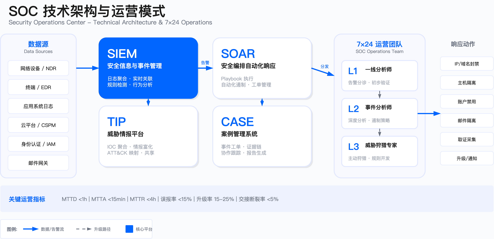

# 11.6 安全监控

安全监控是 SOC 持续运转的核心能力，负责通过自动化检测、人工分析和主动狩猎机制，从海量日志、告警与行为数据中发现、验证并升级威胁事件。本节阐述如何构建从 7×24 运营模式、告警分级处置、智能聚合、误报管理到覆盖度评估的完整监控能力闭环，确保威胁在侦测窗口内被发现并准确传递至响应流程。

---

## 11.6.1 7×24 监控运营模式

SOC 监控运营模式的选择，是许多安全团队在能力建设初期容易忽视的战略决策。行业中常见的困境是：安全团队在业务快速全球化后才发现，原本为单一时区设计的监控体系无法覆盖海外业务——凌晨两点发生的云环境入侵，要等到第二天早上才被本地分析师发现，此时攻击者已完成横向移动并建立持久化据点。

更隐蔽的问题是"纸面上的 7×24"：安排了夜班值守，但夜班分析师的判断准确率显著下降，高严重性告警被误判为误报而延迟升级。这种"有人值守但无效监控"的状态比明确的监控空白更危险——它创造了一种虚假的安全感，同时攻击者恰恰利用非工作时段发起攻击以规避检测。

### 运营模型选择

企业级 SOC 监控需覆盖全球业务运营时区。选择何种运营模型取决于业务分布、资产价值与预算约束三个核心因素，而非追求理论上的最优方案。

**集中式单点守夜**（centralized on-duty）由单个 SOC 承担全天候监控，适用于业务集中于单一或相邻时区且告警量可控的组织。此模式的核心约束在于分析师夜间疲劳导致的判断准确率下降与响应延迟。实践中，夜班分析师的误判率通常高于白班（内部复盘口径），需通过流程补偿机制（如降低夜间自主决策权限、强制升级阈值下调）缓解。

**Follow-the-Sun 接力模式**设置 2-3 个地理分散 SOC（如亚太、欧洲、美洲），按时区交接监控职责。此模式适用于全球化企业或高价值资产跨地域部署的场景。主要约束为交接流程标准化成本与上下文传递风险——交接断裂是导致跨时区事件处置失败的首要原因。

**混合模式**在核心业务时段采用本地 SOC，非核心时段由托管服务（MSSP）或其他区域 SOC 接管。此模式适用于预算受限、非核心时段告警量较低的组织。核心约束为外部团队对内部环境的熟悉度与信任边界划定。

### 7×24 监控模式对比

| 模式 | 适用场景 | 人员配置参考 | 核心优势 | 核心约束 | 不适用场景 |
|------|---------|-------------|---------|---------|-----------|
| **集中单点守夜** | 业务集中于单一时区、告警量可控（<500 条/日） | 单 SOC，含夜班人员 | 成本最低、管理简单 | 夜班疲劳导致准确率下降 15-25%（内部口径）、响应延迟 | 全球化业务、高价值资产跨时区部署 |
| **Follow-the-Sun** | 全球业务、高价值资产分布于多时区 | 2-3 个地理分散 SOC，各 10-30 人 | 全天候无夜班疲劳、响应时效稳定 | 交接标准化成本高、上下文传递风险 | 预算受限、业务集中于单一区域 |
| **混合托管** | 预算受限、非核心时段告警量低 | 核心时段自建，非核心时段 MSSP | 成本可控、弹性扩展 | MSSP 对环境熟悉度低、信任边界划定复杂 | 对响应深度要求高、高度定制化检测需求 |

**监控模式选型决策**

1. **业务是否覆盖多时区？** 是 → Follow-the-Sun；否 → 集中单点或混合托管
2. **夜间告警量是否显著？** 是 → 需专职夜班或 Follow-the-Sun；否 → 可考虑混合托管
3. **安全团队人才储备是否充足？** 是 → 自建；否 → 混合托管或完全托管
4. **告警处理是否需要深度业务上下文？** 是 → 自建为主；否 → 可引入 MSSP

**量化约束（内部口径）**

- 单人单班次有效告警处理量：80-120 条（含初步分诊与记录），超过此阈值误判率显著上升
- 夜班认知损耗：准确率相比白班下降约 15-25%，需通过流程补偿
- Follow-the-Sun 交接成功率目标：>95%，低于此值需复盘交接流程
- 交接窗口建议时长：30-60 分钟重叠

*图 11-6-1：SOC 监控架构示意图，展示 SIEM、SOAR、威胁情报平台等核心组件与 7×24 监控的数据流路径*

### 交接机制设计

Follow-the-Sun 模式的失败常因交接断裂导致。有效的交接机制需覆盖三个核心要素：

**标准化交接内容**包括当前活跃事件（事件 ID、分类、当前处置阶段、待验证假设）、已调整的检测规则（生效时间、调整原因、预期回滚时间）、以及威胁情报更新（新增 IOC、失效指标）。这些信息必须以结构化形式记录在工单系统中，而非依赖口头或即时通讯传递。

**交接窗口设计**建议 30-60 分钟重叠时段，由双方分析师共同参与。重叠时段的核心目的是传递重大事件的处置决策点与未完成假设验证，避免接班团队从零开始重复分析。

**接班验证机制**要求接班团队在交接完成后短时间内验证 SIEM 告警队列状态、关键仪表盘数据源健康度与待处理工单数量。发现异常（如数据摄取中断、告警积压超阈值）应立即升级至 SOC 管理层。

### 常见误区

**依赖个人记忆完成交接**是最常见的失败模式。夜间处置的细节在长时间后遗忘率显著上升（内部复盘口径），必须使用标准化工单字段记录决策点，而非依赖分析师在交接会议中的口头复述。

**交接时段停止新告警处理**会导致响应真空窗口。交接窗口内仍需保持监控能力，可由夜班团队负责新告警初步响应，早班团队完成工单更新与后续处置。

**未验证工具链健康状态**会导致隐性故障跨时区传递。交接前应检查 SIEM 数据摄取延迟、SOAR playbook 运行失败数、威胁情报同步时间戳等关键健康指标。

### 验证方法

交接机制的有效性需通过以下方式验证：

通过**红队测试**在交接窗口前后释放已知 TTP（如横向移动、凭证窃取），检验告警是否被双方团队捕获并准确传递至工单。此测试可识别交接流程中的信息丢失与响应延迟问题。

通过**交接质量评分**建立评分卡（包含信息完整性、响应连续性、工具验证完成度），由接班 L2 分析师在交接完成后评分。低于预设阈值时触发管理层介入与流程复盘。

### 运行指标

| 指标 | 定义 | 阈值参考（内部口径） |
|------|------|----------------------|
| 交接断裂率 | 跨时区事件中出现信息缺失导致重复分析或处置决策未同步的比例 | <5% |
| 交接延迟 | 接班团队接手第一个告警的时间间隔（从交接窗口结束计起） | <10 分钟 |

---

## 11.6.2 告警分级与处置（L1/L2/L3）

告警分级与处置流程是 SOC 人员效能的关键杠杆，但许多组织的分级机制存在两种极端缺陷。

一种是"升级恐惧症"：L1 分析师因担心误判而过度升级，将大量低风险告警推给 L2，导致 L2 淹没在噪音中而无法专注于真正需要深度分析的事件。这种模式下，L2 成为实质上的"高级 L1"，威胁狩猎与规则优化等高价值工作被挤压。

另一种是"升级抑制"：L1 分析师因流程约束（如每次升级需写详细报告）或文化因素（如升级被视为"无能"的表现）而过度谨慎，将本应升级的复杂事件自行处置，导致响应延迟或遏制不彻底。这种模式下，多阶段攻击常因 L1 仅处置了初始告警而未识别完整攻击链，攻击者得以在未被检测的阶段继续推进。

分级机制的核心挑战不在于定义层级，而在于设计清晰的升级触发条件与流程激励——让该升级的告警快速升级，让不该升级的告警高效处置。

### 分级模型与职责边界

SOC 通常采用三级分析模型。各层级的职责边界划分直接影响响应效率与人力资源配置，划分过于模糊会导致升级混乱，划分过于僵化则会延误响应。

**L1（一线分析师）** 负责初步验证告警真实性、执行标准化 playbook（如隔离主机、封禁 IP）、收集初步证据。其适用边界为已有明确检测规则与响应步骤的常见威胁（如已知恶意域名匹配、弱口令登录尝试）。当告警涉及深度取证需求、需要业务上下文判断、或需要跨系统关联分析时，应升级至 L2。

**L2（事件分析师）** 负责深度分析攻击手法、确定影响范围（横向移动路径、数据访问范围）、制定遏制策略、与业务团队协调。其适用边界为需要日志深度关联、需要理解业务逻辑（如区分正常数据导出与数据窃取）、需要跨工具查询（EDR、SIEM、云平台日志）的场景。

**L3（威胁狩猎专家）** 负责主动狩猎未知威胁、开发新检测规则、分析 APT 战术演进、支持红队演练。其适用边界为无明确告警但存在异常模式、需要逆向工程恶意样本、需要对抗性思维推演攻击路径的场景。

### 升级触发条件

升级决策需基于明确的触发条件，避免主观判断导致的延迟或过度升级。

**L1 升级至 L2** 应满足以下条件之一：在技术复杂度层面，涉及多阶段攻击（如钓鱼邮件触发、内网横向移动、数据外带），涉及未知工具或 0day 利用，或涉及云环境权限滥用（如 IAM 角色提权）。在业务影响层面，涉及核心业务系统（如支付平台、客户数据库）、敏感数据访问（如 PII、财务数据）、或高价值资产（如代码仓库、密钥管理系统）。在时间约束层面，L1 在 SLA 时限内无法完成验证或遏制，或告警在队列中反复出现但无法定位根因。

**L2 升级至 L3** 应满足以下条件之一：在对抗性指标层面，攻击者展示出反检测能力（如清除日志、禁用 EDR），使用定制化工具或变种技术，或利用合法工具实施攻击（living off the land）。在组织级威胁层面，怀疑 APT 组织或定向攻击，或发现供应链投毒、内部威胁迹象。

### 常见误区

**认为 L1 不具备技术判断权**是常见的流程设计缺陷。L1 必须有权在确认已知 IOC 匹配时立即执行隔离动作，而非等待 L2 批准。延迟隔离窗口会给攻击者提供横向移动的时间窗口（内部演练口径）。

**要求所有告警必须经过 L1** 会导致高风险资产的响应延迟。针对域控制器、密钥管理系统等高价值资产的告警可配置为直接路由至 L2，避免 L1 经验不足导致的误判。

**将 L3 定位为仅处理复杂事件**会导致检测能力与一线实践脱节。L3 应定期参与 L1/L2 告警复盘（内部建议口径为每月部分时间），识别检测规则盲点并持续优化。

### 验证方法

分级机制的有效性需通过实战检验：

**分级准确性测试**由红队释放已分级的攻击场景（如已知恶意域名触发 L1、多阶段攻击触发 L2、定制化 RAT 触发 L3），验证告警是否路由至正确层级，记录误判率与升级延迟。

**SLA 达标率审计**定期抽查告警样本，验证处置时间是否在分级 SLA 内。超时事件需记录根因（工具故障、人员不足、流程缺陷）以驱动改进。

### 分级响应 SLA 参考

不同层级的响应时限需根据告警严重性与资产关键性设定。以下为参考框架（内部口径），实际需结合组织能力调整：

| 告警级别 | L1 响应时限 | L2 响应时限 | 升级触发条件 |
|---------|------------|------------|-------------|
| **P1（Critical）** | 15 分钟内开始处理 | 30 分钟内接手 | 涉及核心业务系统、数据外泄迹象、APT 指标匹配 |
| **P2（High）** | 30 分钟内开始处理 | 2 小时内接手 | 涉及敏感数据、多阶段攻击链、已知漏洞利用 |
| **P3（Medium）** | 2 小时内开始处理 | 8 小时内接手 | 单点异常、低置信度告警、需进一步验证 |
| **P4（Low）** | 工作日内处理 | 按需升级 | 信息类告警、合规审计、趋势分析 |

**SLA 设计原则**

- 时限需可执行：设定过于激进的 SLA（如 P1 5 分钟响应）在资源不足时会导致 SLA 达标率崩塌，反而失去指标意义
- 分级需明确：模糊的告警级别（如"高或中"）会导致处理优先级混乱，每个告警只能有一个级别
- 升级路径需预定义：L1 超时未处理应自动升级至 L2，避免告警在队列中积压

### 运行指标

| 指标 | 定义 | 参考范围（内部口径） |
|------|------|----------------------|
| 升级率 | L1 → L2 升级比例 | 15%-25%。过低可能表示 L1 误判为低风险，过高可能表示 L1 能力不足或检测规则误报率高 |
| 误升级率 | 升级至 L2 后被判定为误报的比例 | <10%。超标需优化 L1 培训或检测规则 |
| SLA 达标率 | 在规定时限内开始处理的告警比例 | >90% 为健康，<80% 需立即干预 |
| 平均处理时长 | 从告警生成到处置完成的平均时间 | 按级别分别统计，识别瓶颈环节 |

---

## 11.6.3 智能告警聚合与优先级排序

告警过载是现代 SOC 面临的结构性困境，其根源不仅是告警数量庞大，更在于告警之间的关系未被有效建模。

行业常见的问题模式是：一次针对关键数据库的攻击活动触发了数十条告警——网络层的异常连接告警、主机层的可疑进程告警、应用层的 SQL 注入告警——每条告警被分别路由给不同分析师，各自按 playbook 执行隔离或封禁动作。表面上看，告警都被"处理"了，但没有人意识到这是一次协调的攻击活动，没有人追溯攻击者的完整路径，也没有人评估是否已完成数据外泄。

更隐蔽的问题是优先级排序的失效：基于固定权重的排序算法（如 CVSS 分数 + 资产标签）无法适应动态威胁环境。当某个 APT 组织正在针对特定行业发起定向攻击时，匹配该组织 TTP 的低分告警可能比不匹配的高分告警更值得优先处理——但固定算法无法做出这种判断。

智能告警聚合的目标不是减少告警数量，而是将"告警集合"转化为"可分析的事件"，让分析师能够理解攻击的完整图景而非处理碎片化的信号。

### 聚合需求背景

现代 SOC 面临的告警量级与分析师处理能力之间存在结构性矛盾。中型至大型企业的日告警量通常远超分析师有效处理能力（内部口径）。未经聚合的原始告警队列会导致分析师陷入"告警疲劳"，真实威胁淹没在噪音中。

### 聚合策略

告警聚合的核心目标是将多个相关告警合并为单一可分析事件，同时保留原始告警的时间序列与细节信息。

**基于 IOC 聚合**将指向同一攻击者基础设施的多个告警聚合为单一事件，例如同一 C2 域名的多个连接尝试、同一恶意 IP 的多次扫描。此策略的前提是 IOC 情报准确，否则会导致无关告警被误聚合。

**基于攻击链聚合**将符合 MITRE ATT&CK 同一战术序列的告警聚合，例如"初始访问"阶段的钓鱼邮件告警与"执行"阶段的恶意宏告警、"持久化"阶段的注册表修改告警。此策略需要 SIEM 具备攻击链关联能力或与 XDR 平台集成。

**基于资产聚合**将针对同一高价值资产的多类型告警聚合，例如针对数据库服务器的登录失败告警、SQL 注入告警与数据外带告警。此策略依赖准确的资产清单与分类标签。

**基于时间窗口聚合**将时间窗口内的重复告警去重，例如防火墙短时间内触发大量同一 IP 封禁告警可聚合为单条。时间窗口设置需权衡去重效果与时间序列信息保留。

### 优先级排序因子

优先级排序算法需综合多个维度，单一维度排序无法反映真实风险。

**威胁严重性**基于 MITRE ATT&CK 战术阶段（后期战术如"数据外带"高于"侦察"）、漏洞 CVSS 评分、攻击成功率（已确认利用高于尝试）综合评估。

**资产关键性**基于资产分类标签（核心业务系统、高敏感数据存储、基础设施组件如 AD），建议引入业务影响评分（BIA）作为权重因子。

**威胁情报匹配度**评估告警是否匹配威胁情报平台中的已知 APT 组织 TTP、行业定向攻击活动、近期披露的活跃漏洞。

**上下文异常度**基于 UEBA 行为基线（如管理员在非工作时间登录、数据库查询量异常突增）、地理位置异常（如从未访问过的地理区域登录）评估。

### 常见误区

**完全依赖自动化聚合**忽视了业务上下文的重要性。自动化算法无法理解业务场景（如某次"异常大量数据下载"实为合规审计团队的合法操作）。需保留人工审核机制，允许分析师标记误聚合并反馈至规则引擎形成闭环。

**聚合窗口设置过长**会导致真实攻击的多个阶段被合并，丢失时间序列关系。时间窗口建议控制在较短范围内（内部口径为 5-15 分钟），并确保保留原始告警时间戳以支持回溯分析。

**优先级算法固定不变**无法适应动态威胁环境。优先级应支持动态调整机制，例如某资产在近期红队演练中被判定为高风险路径节点时，临时提升其告警优先级。

### 验证方法

**聚合准确性测试**由红队释放单一攻击活动（如从钓鱼到横向移动的完整链路），验证 SIEM 是否将相关告警聚合为单一事件。记录聚合遗漏率与误聚合率（不同攻击活动被错误合并）。

**优先级排序有效性验证**统计一段时间内真实威胁事件在排序队列中的位置分布。有效的排序算法应使大部分真实威胁告警出现在队列前部（帕累托原则）。

### 运行指标

| 指标 | 定义 | 参考范围（内部口径） |
|------|------|----------------------|
| 聚合率 | 聚合后告警数 / 原始告警数 | 1:5 至 1:20。过低表示聚合规则不足，过高可能过度聚合掩盖威胁 |
| 分析师工作负载 | 每位分析师日均处理聚合后告警数 | 20-40 个（含深度分析）为合理范围，超过此范围进入疲劳区 |

### AI 增强的智能告警聚合

传统基于规则的告警聚合存在固有局限：规则需要人工定义与维护，难以适应攻击模式演变，无法识别跨类型告警之间的隐性关联。AI 技术可从三个层面增强告警聚合能力。

**机器学习聚类**使用无监督学习算法（如 DBSCAN、HDBSCAN、层次聚类）对告警进行自动分组，无需预定义规则。算法基于告警特征（源 IP、目标资产、时间序列、ATT&CK 战术）计算相似度，将高相似度告警自动归入同一事件。其优势在于能够发现人工规则难以覆盖的隐性模式。

技术实现的关键要点包括：特征工程需将告警字段转换为向量表示，包括类别特征的 one-hot 编码、数值特征的标准化、时间特征的周期编码；相似度计算可使用余弦相似度或欧氏距离，对于时间序列告警可采用 DTW（动态时间规整）处理时间偏移；聚类参数调优通过轮廓系数或 Calinski-Harabasz 指数评估聚类质量。

**图神经网络关联**将告警建模为图结构，节点为告警，边为关联关系（如相同源 IP、相同目标资产、时间窗口内触发）。GNN 通过消息传递机制学习节点之间的关联强度，自动识别属于同一攻击活动的告警簇。其典型应用场景包括攻击链识别（将分散在不同时间、不同检测工具的告警关联为完整攻击链）与多源告警融合（将 SIEM、EDR、NDR、云安全平台的告警关联处理）。

**LLM 上下文推理**利用大语言模型理解告警文本描述，结合威胁情报和历史事件知识，推理告警之间的语义关联。例如，LLM 可以识别"异常 PowerShell 执行"与"Mimikatz 凭证转储"告警虽然类型不同，但属于典型的凭证窃取攻击链。

LLM 应用的关键约束包括：Prompt 设计需提供告警摘要、资产上下文、威胁情报匹配结果；响应延迟控制需注意 LLM 推理延迟高于规则和 ML 模型，应仅对 ML 置信度较低的告警触发 LLM 分析；置信度阈值设置需确保低置信度结果仍需人工确认。

**AI 聚合验证方法**包括：A/B 测试并行运行规则聚合与 AI 聚合进行效果对比；红队验证释放多阶段攻击活动验证关联能力；分析师反馈收集接受率和修正率持续优化模型。

**AI 聚合运行指标**包括 AI 聚合采纳率（分析师接受 AI 聚合结果而无需拆分或合并的比例）与攻击链识别完整性（AI 聚合识别出的攻击阶段数 / 红队释放的总阶段数）。

AI 在 SOC 告警分诊中的完整技术架构与实现案例，详见 [14.3 AI for SecOps：安全运营智能化](../../part_05_ai_driven_security_innovation/chapter_14_ai_for_security/14.3_ai_for_secops.md)。

---

## 11.6.4 误报处理与规则调优

误报是消耗 SOC 分析师精力的首要因素，也是导致"告警疲劳"后真实威胁被忽视的根本原因。但误报管理的行业痛点不在于误报本身，而在于误报处理的组织方式。

许多 SOC 的误报处理呈现"救火式"特征：分析师发现某条告警是误报后，在工单中标记为"误报"并关闭，但不会触发任何规则调优动作。一周后，相同的误报再次出现，再次被标记、再次关闭。这种模式下，分析师的工作大量消耗在重复判定同一类误报上，而检测规则永远不会改进。

另一种常见问题是"调优恐惧"：安全团队担心调优后可能产生漏报，因此宁可维持高误报率也不敢调整规则。这种过度保守导致告警队列持续膨胀，分析师对所有告警都"草草处理"，反而增加了漏报风险。

有效的误报管理需要建立从"误报识别"到"根因分析"再到"规则调优"的闭环机制，而非将误报处理视为一次性的告警关闭动作。

### 误报根因分类

误报的根因可归纳为四类，针对不同根因需采取不同的调优策略。

**检测规则过于宽泛**是最常见的误报来源。例如"短时间内登录失败超过一定次数"未排除合法用户忘记密码场景，"PowerShell 执行"未区分管理员运维与攻击者横向移动。此类误报需通过增加上下文条件或白名单收窄检测范围。

**缺乏上下文信息**导致合法行为被误判。例如"异地登录"未关联 VPN 日志而误报员工出差场景，"数据库大量查询"未关联业务发布窗口。此类误报需通过关联多数据源丰富上下文。

**基线漂移**导致正常变化被判定为异常。例如业务高峰期流量突增被判定为 DDoS，新员工入职导致"新设备接入"告警激增。此类误报需建立动态基线或配置业务日历。

**工具误判**导致合法工具被标记为恶意。例如防病毒软件将渗透测试工具、系统管理工具标记为恶意软件。此类误报需在工具层面配置排除策略。

### 调优流程

规则调优需遵循结构化流程，避免随意修改导致漏报风险。

**误报分类与统计**定期统计误报告警的触发规则、资产类型、时间分布，识别误报率最高的规则集合。

**根因分析**抽查高误报规则的多个误报实例，记录共性特征（如时间段、用户组、业务流程），为调优策略提供依据。

**规则优化**可采用以下策略组合：添加白名单（排除特定用户组、IP 范围、进程路径）、调整阈值（需同步评估风险容忍度）、增加上下文关联条件、调整时间窗口。

**灰度验证**调整后的规则先在测试环境或小范围资产上运行一段时间，监控误报率与漏报率变化。灰度期间需特别关注是否产生新的漏报。

**正式发布与监控**全量发布后持续监控，定期复核误报率与检测有效性（如红队演练中的捕获率）。

### 常见误区

**直接关闭高误报规则**是危险的做法。某规则即使误报率较高，也可能捕获了关键威胁。应先分析真实告警特征，提炼为新规则后再关闭旧规则，确保检测能力不降级。

**调优仅由 SOC 团队完成**忽视了业务上下文的重要性。合法的批量操作、季节性流量变化等业务信息必须由业务团队提供。建议建立 SOC 与业务安全团队的联合调优机制。

**无限期保留已调优规则**会导致规则腐化。业务环境变化（如新系统上线、架构调整）会导致规则失效或重新产生误报。建议定期复核所有规则的有效性。

### 验证方法

**误报率测量**在调优前后各抽取一定数量告警，由 L2 分析师盲测判定真实威胁与误报数量，计算误报率变化以验证调优效果。

**漏报风险评估**在调优后进行红队演练，验证调整后的规则是否仍能捕获已知 TTP，记录漏报事件数量与 TTP 类型。

### 运行指标

| 指标 | 定义 | 参考阈值（内部口径） |
|------|------|----------------------|
| 误报率 | 误报告警数 / 总告警数 | 初期 <30%，成熟期 <15%。高于阈值需启动专项调优计划 |
| 规则调优周期 | 从识别高误报规则到完成调优发布的平均时长 | <2 周为合理，超过 1 个月表示流程阻塞或资源不足 |

---

## 11.6.5 监控覆盖度评估

监控覆盖度是 SOC 能力的基础指标，但"覆盖"的定义在实践中常被误解。行业中广泛存在的问题是"覆盖度幻觉"：安全团队统计出高覆盖率（如"MITRE ATT&CK 战术覆盖率达 90%"），但这个数字仅反映"有规则"，不反映"规则有效"。

典型的覆盖度陷阱包括：检测规则存在但从未触发过告警（可能是规则逻辑错误或数据源缺失），规则覆盖了某技术但仅适用于特定工具（如只检测 Mimikatz 但不检测 LaZagne），规则在测试环境有效但在生产环境因日志格式差异而失效。

另一个常见问题是覆盖度评估的"快照化"：安全团队在某个时间点完成覆盖度评估后，将其作为静态资产存档。但业务环境持续变化（新系统上线、云迁移、架构重构），攻击技术持续演进（新变种、新工具），覆盖度评估在几个月后就与实际状态脱节。

有效的覆盖度管理需要从"统计规则数量"转向"验证检测能力"，从"一次性评估"转向"持续监控"。

### 覆盖度维度

监控有效性需从多个维度评估，单一维度的高覆盖率不代表整体监控能力完善。

**覆盖度评估矩阵**

| 维度 | 测量方法 | 目标参考（内部口径） | 盲点风险 |
|------|---------|---------------------|---------|
| 数据源覆盖 | 已接入日志源 / 应接入日志源 | >95% 核心资产 | 未接入资产无法检测任何威胁 |
| 资产覆盖 | 已监控资产 / 资产清单总数 | 100% 高价值资产 | 盲点资产可能成为攻击跳板 |
| ATT&CK 战术覆盖 | 已覆盖技术数 / 相关技术总数 | >80% 相关战术 | 特定攻击阶段无检测能力 |
| 时间覆盖 | 日志保留时长 | 热存储 90 天，归档 1-7 年 | 无法回溯分析长期潜伏攻击 |
| 检测规则有效性 | 近期触发真实威胁的规则比例 | >30% 规则在 90 天内触发过真实告警 | 冗余规则消耗资源但无价值 |

**数据源覆盖度**衡量已接入 SIEM 的日志源与应接入日志源总数的比例。应接入日志源需覆盖 MITRE ATT&CK 矩阵中与企业相关的战术。例如云环境需覆盖 CloudTrail、Kubernetes Audit Log、IAM 策略变更日志等关键数据源。

**资产覆盖度**衡量已纳入监控的资产与资产清单总数的比例。需细分为终端（EDR 部署率）、服务器（日志代理安装率）、网络设备（流量镜像/NetFlow 覆盖率）、云资源（CSPM 扫描覆盖率）等类型分别统计。

**威胁战术覆盖度**基于 MITRE ATT&CK 框架，评估每个战术阶段的检测规则数量与质量。可使用 ATT&CK Navigator 可视化覆盖度热力图，直观展示盲点分布。

**时间覆盖度**衡量日志保留时长是否满足威胁狩猎需求与合规要求。在线存储需支持威胁狩猎回溯分析，归档存储需满足合规审计要求（如 GDPR、PCI DSS 等监管要求）。

### 覆盖度评估方法

**MITRE ATT&CK 映射**列出企业环境中可能发生的战术，为每个战术下的技术（如 T1566 钓鱼、T1078 凭证滥用）标注检测规则状态（已覆盖/部分覆盖/未覆盖），计算总体覆盖率。此方法的价值在于提供结构化的盲点识别框架。

**红队演练验证**设计覆盖 ATT&CK 常见技术的攻击场景（如凭证窃取 → 横向移动 → 数据外带），执行后统计被 SOC 检测到的阶段数与总阶段数的比例。此方法可验证理论覆盖度与实际检测能力的差距。

**日志盲点扫描**使用自动化工具（如 osquery、Wazuh）扫描环境中未安装日志代理的资产、未配置审计的服务、未启用流量监控的网络段。此方法可发现资产清单与实际监控之间的偏差。

### 常见误区

**将覆盖度等同于规则数量**是常见的认知偏差。大量低质量规则（误报率高、检测逻辑模糊）的实际价值低于少量精准规则。需引入"有效覆盖度"指标，即规则在一定时间内至少触发过真实威胁。

**仅关注技术覆盖而忽略资产覆盖**会导致虚假安全感。某技术虽有检测规则但未部署至关键资产（如数据库服务器未安装 EDR），该资产的实际覆盖度为零。

**静态评估不持续更新**会导致覆盖度与实际环境脱节。业务系统上线、新攻击技术披露、基础设施架构变更均会改变覆盖度要求。建议定期重新评估。

### 验证方法

**ATT&CK 覆盖度热力图**使用工具（如 DeTT&CT、ATT&CK Navigator）生成热力图，直观展示哪些战术/技术已覆盖、哪些存在盲点。定期更新并向管理层汇报。

**盲点修复验证**针对识别出的盲点（如未覆盖的 ATT&CK 技术），开发新检测规则或部署新数据源后，通过红队模拟验证是否成功检测。

### 运行指标

| 指标 | 定义 | 参考阈值（内部口径） |
|------|------|----------------------|
| ATT&CK 战术覆盖率 | 已覆盖战术数 / 核心战术数 | 成熟 SOC 建议较高覆盖率 |
| 高价值资产监控率 | 核心业务系统、敏感数据存储的监控覆盖率 | 应为 100%，任何盲点均为高风险 |
| 检测规则有效性比例 | 近期内至少触发过真实威胁的规则数 / 总规则数 | 低于一定比例需清理冗余规则 |

---

## 11.6.6 监控关键指标（MTTD/MTTR/MTTA）

MTTD、MTTA、MTTR 是度量 SOC 效能的核心指标，但这些指标在实践中常被误用或误读。

行业常见的第一个问题是"指标游戏"：为了让指标看起来更好，安全团队可能调整测量口径（如将"开始处理"定义为"分配工单"而非"实际分析"），或选择性统计（如排除"复杂事件"以降低 MTTR）。这种优化指标而非优化能力的做法，最终导致管理层基于失真的数据做出错误决策。

第二个问题是"平均值陷阱"：MTTD 平均值为 2 小时看起来不错，但可能掩盖了这样的分布——大多数告警在 30 分钟内被检测，但有少量攻击活动在数天甚至数周后才被发现。这些长尾事件恰恰是最危险的 APT 或内部威胁，平均值完全无法反映这一风险。

第三个问题是"指标孤立"：仅关注 MTTD/MTTR 而不关联业务影响，可能导致资源错配——将大量精力投入优化低风险告警的响应速度，而忽视高风险资产的检测覆盖度。指标必须与资产关键性、威胁严重性结合分析才有意义。

### 指标定义

SOC 监控效能通过三个核心时间指标衡量。

**MTTD（mean time to detect，平均检测时间）** 衡量从攻击发生到 SOC 生成告警的平均时长，反映检测能力的时效性。此指标的关键约束在于攻击发生时间难以精确确定，需依赖取证回溯或红队演练验证。

**MTTA（mean time to acknowledge，平均确认时间）** 衡量从告警生成到分析师开始处理的平均时长，反映告警队列管理与人员响应速度。此指标受告警量、人员配置、轮班模式直接影响。

**MTTR（mean time to respond，平均响应时间）** 衡量从告警生成到完成遏制/修复的平均时长，反映整体事件处置效率。需注意区分遏制完成时间（威胁已隔离）与修复完成时间（根因已修复、系统已恢复），两者可分别测量。

### 测量方法

**MTTD 测量**需在日志中识别攻击活动的真实开始时间（如恶意邮件送达时间、漏洞利用首次尝试时间），对比告警生成时间。由于回溯真实攻击时间需依赖取证分析，建议通过红队演练（已知攻击时间点）进行验证。

**MTTA 测量**基于 SIEM 中告警生成时间戳与分析师在工单系统中标记"开始处理"的时间戳之差。需注意排除非工作时间告警（除非采用 7×24 模式），否则会导致指标失真。

**MTTR 测量**基于告警生成时间与工单系统中标记"事件关闭"的时间戳之差。建议分别测量遏制时间与修复时间，因为两者的优化策略不同。

### 目标阈值设定

阈值需基于企业风险容忍度与资源约束设定，不同资产类型、不同严重性等级应有差异化目标。关键资产的指标要求应严于一般资产，高严重性事件的响应时限应短于低严重性事件。

具体阈值需结合行业基准与组织实际情况确定。初期可设定较宽松目标，随能力成熟逐步收紧。

### 优化策略

**缩短 MTTD** 需从检测能力与检测时效两方面入手。部署行为检测（UEBA）与威胁狩猎能力可主动发现未触发规则的威胁。优化检测规则逻辑，减少依赖离线批处理的检测（改为实时流式检测）。引入威胁情报实时关联，缩短从 IOC 披露到检测生效的窗口。

**缩短 MTTA** 需优化告警队列管理与分发机制。实施告警优先级排序确保高风险告警在队列顶部。配置告警自动分发规则，将特定类型告警直接路由至专项团队（如云安全团队、业务安全团队）。引入 SOAR 自动化响应，将无需人工判断的遏制动作（如封禁 IP、隔离主机）自动执行。

**缩短 MTTR** 需优化响应流程与工具集成。开发标准化 playbook 减少分析师决策时间。预集成响应工具（EDR、防火墙、IAM）至 SOAR 实现一键遏制。建立战时指挥室（war room）机制，重大事件时集结跨职能团队同步决策。

### 指标优化策略对比

| 指标 | 优化手段 | 投入级别 | 预期效果 | 适用边界 |
|------|---------|---------|---------|---------|
| **MTTD** | 实时流式检测（替代批处理） | 中 | 缩短检测延迟从小时级到分钟级 | 日志量大、对时效敏感的环境 |
| **MTTD** | UEBA 行为基线 | 高 | 发现规则无法覆盖的异常行为 | 内部威胁风险高、有历史行为数据 |
| **MTTD** | 威胁情报实时关联 | 中 | IOC 生效时间从天级缩短到小时级 | 有威胁情报订阅、SIEM 支持实时关联 |
| **MTTA** | 告警优先级智能排序 | 低 | 高风险告警处理优先，减少队列等待 | 告警量大、分析师资源有限 |
| **MTTA** | SOAR 自动化响应 | 高 | 无需人工判断的告警自动处置 | 告警处置逻辑明确、可预定义规则 |
| **MTTR** | 标准化 Playbook | 低 | 减少分析师决策时间 | 常见告警类型、有成熟处置流程 |
| **MTTR** | 工具集成（一键遏制） | 中 | 缩短遏制动作执行时间 | SOAR 已部署、响应工具支持 API |
| **MTTR** | War Room 机制 | 低 | 跨团队协同效率提升 | P1/P2 重大事件、需多方决策 |

### 常见误区

**追求极致的指标数值**忽视了投入产出比。将指标从一个水平优化至更高水平可能需要成倍的投入（部署 EDR、UEBA、专职威胁狩猎团队），需评估投资回报率。建议基于资产关键性分级设定目标。

**忽略指标分布**会被平均值掩盖的离群值误导。平均值看似良好但可能存在大量超时事件。需同时监控 P50（中位数）、P90、P99 分位数，识别长尾问题。

**指标优化不持续**会导致初期改进后指标回升。人员流失、规则失效、业务变化都会影响指标。需建立持续监控与定期复盘机制。

### 验证方法

**红队演练验证**在已知时间点释放攻击（记录为 T0），测量 SOC 生成告警时间（T1）、分析师开始处理时间（T2）、完成遏制时间（T3），由此计算各项指标。此方法可获得精确的指标数据。

**历史事件回溯**抽取一段时间内的真实威胁事件（排除误报），回溯攻击时间线并计算指标。识别指标异常事件（如 MTTR 超过 P90 的事件），分析根因（工具故障、人员不足、流程断裂）。

### 运行指标

除 MTTD/MTTA/MTTR 外，建议监控以下衍生指标：

| 指标 | 定义 | 参考阈值（内部口径） |
|------|------|----------------------|
| 检测覆盖窗口 | 从攻击开始到被检测的最大时长（P99 分位数） | 避免攻击者长期潜伏 |
| 遏制成功率 | 首次遏制动作成功阻止威胁扩散的比例 | 较低时需优化 playbook 或工具集成 |

---

## 11.6.7 监控能力闭环与持续改进

SOC 能力建设的终极挑战不是部署工具或配置规则，而是建立持续改进的闭环机制。行业中大量 SOC 陷入"救火循环"：每天处理告警、响应事件，但从不回头分析为什么某些攻击未被检测、为什么某些响应延迟过长、为什么某些规则持续产生误报。

这种"只处理不改进"的模式有其组织根源：分析师的 KPI 是"处理了多少告警"而非"改进了多少规则"，事件响应团队的压力是"尽快关闭工单"而非"彻底分析根因"，管理层关注的是"本月没有重大事件"而非"检测能力是否提升"。

闭环机制的核心价值在于将每一次事件——无论成功检测还是漏报——转化为组织学习的机会。成功检测的事件需要分析"为什么这次检测到了，是规则设计合理还是攻击者犯了错"；漏报事件需要分析"盲点在哪里，是数据源缺失、规则逻辑缺陷还是攻击者使用了新技术"。

### 闭环模型

监控能力需形成完整闭环，否则会陷入"检测到威胁但不改进"的被动循环。闭环包含五个阶段：监控阶段持续采集日志、告警与行为数据；检测阶段通过规则、机器学习、威胁狩猎发现威胁；响应阶段执行遏制、根除、恢复动作；复盘阶段进行事件后分析，识别检测盲点、响应延迟根因、流程缺陷；优化阶段更新检测规则、调整告警阈值、补充数据源、优化 playbook。

闭环的关键在于复盘结论必须转化为可执行的改进措施，且改进措施必须被跟踪至完成。

### 复盘机制

每起重大事件（高严重性或影响核心业务）需在事件关闭后及时完成复盘。

**时间线重建**需还原攻击者每个操作的时间点、使用的工具、访问的资产、窃取的数据。这是后续分析的基础。

**检测有效性评估**需分析哪些阶段被 SOC 检测到、哪些阶段未检测（盲点）、检测延迟是否在 SLA 内。此分析识别检测能力的薄弱环节。

**响应有效性评估**需分析遏制动作是否及时、是否成功阻止横向移动或数据外带、是否存在误操作（如误隔离正常业务系统）。此分析识别响应流程的改进点。

**根因分析**需识别盲点根因（数据源缺失、规则逻辑缺陷、威胁情报滞后）与延迟根因（人员不足、工具故障、流程阻塞）。此分析确保改进措施针对根因而非表象。

**改进措施**需列出具体行动项（如开发新检测规则、部署新数据源、优化 playbook）、责任人、完成时限。措施需具体可执行、可验收。

### 常见误区

**复盘仅关注失败事件**会错过优化机会。成功遏制的事件同样需要复盘，识别流程中的低效环节（如虽然成功但 MTTR 超过目标）。

**复盘结论无人执行**是最常见的闭环断裂点。改进措施需纳入项目管理流程，分配责任人并设置截止日期。定期复盘会议需回顾上期改进措施的完成进度。

**复盘信息未共享**会导致组织学习失败。复盘报告应在 SOC 内部共享（提升团队能力）、与红队共享（红队据此调整 TTP 演练盲点）、与 GRC 团队共享（识别合规风险）。

### 验证方法

**改进措施有效性验证**在改进措施实施后，通过红队释放相同 TTP 验证盲点是否修复，记录检测成功率变化。

**闭环周期测量**统计从事件关闭到改进措施全部实施完成的平均时长。周期过长表示闭环存在阻塞。

### 运行指标

| 指标 | 定义 | 参考阈值（内部口径） |
|------|------|----------------------|
| 改进措施完成率 | 已实施改进措施数 / 计划改进措施总数 | 较低时需升级至管理层介入 |
| 检测盲点修复率 | 本季度修复的 ATT&CK 技术盲点数 / 识别出的盲点总数 | 持续跟踪趋势 |

---

## 本节小结

安全监控是 SOC 的核心能力，其有效性取决于运营模式设计（7×24 覆盖与交接机制）、告警处理效率（分级处置与智能聚合）、误报管理（持续调优）、覆盖度保障（MITRE ATT&CK 映射）以及关键指标优化（MTTD/MTTA/MTTR）。监控能力需形成持续改进闭环，通过事件复盘识别盲点、通过红队演练验证有效性、通过自动化降低人力依赖。企业应基于业务风险容忍度与资源约束，分阶段构建从基础监控到威胁狩猎、从人工处置到 SOAR 自动化的能力演进路径。

**关键行动项**

1. **运营模式选型**：根据业务时区分布与预算选择集中式、Follow-the-Sun 或混合托管模式
2. **告警分级落地**：建立 L1/L2/L3 职责边界与 SLA 框架，避免责任真空
3. **智能聚合部署**：基于 IOC、攻击链、资产维度实施告警聚合，降低分析师工作负载
4. **误报治理机制**：建立规则调优闭环，定期清理低效规则
5. **覆盖度可视化**：使用 ATT&CK Navigator 识别检测盲点，指导规则开发优先级
6. **指标持续监控**：建立 MTTD/MTTA/MTTR 仪表板，按资产分级设定差异化目标

---

## 导航

**[← 上一节：11.5 威胁情报运营](./11.5-threat-intelligence-operations.md)** | **[返回章节目录](./README.md)** | **[下一节：11.7 漏洞管理 →](./11.7-vulnerability-management.md)**

---

**© 2025 AI-ESA Project. Licensed under CC BY-NC-SA 4.0**
