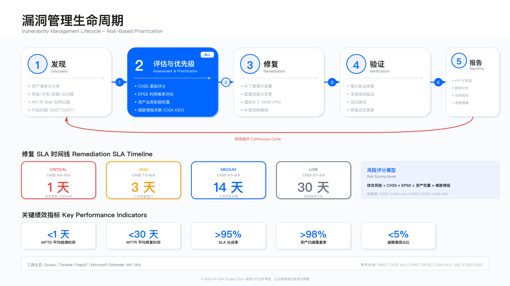

# 11.7 漏洞管理



## 概述

漏洞管理是安全运营中心的持续性工作，负责从资产发现、漏洞扫描、风险评估到补丁修复的完整闭环。有效的漏洞管理不是追求零漏洞（这在复杂环境中不现实），而是确保高风险漏洞在合理时间窗口内得到修复或缓解，使攻击者无法利用已知弱点在系统中立足。

漏洞管理的核心挑战在于：扫描工具每天产生数千个发现，但安全团队和业务团队的修复资源有限。如果不加区分地要求修复所有漏洞，会造成业务中断、团队疲劳和优先级错位。因此，基于风险的优先级排序（Risk-Based Vulnerability Management，RBVM）成为现代漏洞管理的核心方法。

本节从漏洞管理生命周期出发，阐述扫描与评估、优先级排序、补丁管理和虚拟补丁策略，重点讲解如何将 CVSS、EPSS、威胁情报和资产关键性整合为可执行的修复决策。

## 漏洞管理生命周期

漏洞管理不是一次性扫描任务，而是持续循环的运营流程，包含以下阶段：

**资产发现与清点**。在修复漏洞之前，必须知道哪些资产存在。资产发现包括主机、容器、云实例、网络设备和 SaaS 应用。资产清单需要包含业务属性（如所属业务线、数据分类、合规要求）和技术属性（操作系统版本、运行服务、网络位置）。

适用边界：资产发现适用于有明确网络边界或云租户边界的环境。对于频繁变化的容器集群或无服务器函数，传统资产清单工具会滞后，需要结合 Kubernetes API 或云原生工具实时获取资产状态。

常见误区：认为资产清单只需在项目初期建立一次。实际上，资产会因业务扩张、DevOps 自动化部署、影子 IT 而不断变化。如果资产清单与实际环境不同步，扫描覆盖率会下降，盲点资产可能成为攻击入口。

验证方法：每月抽查 10% 的业务系统，对比资产清单与实际在线资产（通过网络扫描或云 API 查询），检查遗漏率。如果遗漏率超过 5%，说明资产发现流程需要改进。

**漏洞扫描与发现**。扫描分为主动扫描（Agent-based 或 Network-based）和被动监测（流量分析、日志关联）。主动扫描覆盖操作系统、中间件、应用和开放服务，被动监测通过观察网络流量或端点日志推断潜在漏洞。

扫描频率取决于资产变更速度和风险承受度。对于互联网暴露的资产，每周扫描是常见做法；对于内部开发环境，每月扫描可能已足够。容器镜像在 CI/CD 流水线中应每次构建时扫描，而不是等部署后再扫描。

关键约束：扫描会产生网络流量和主机负载，对生产环境需要限速或选择低峰时段。某些老旧系统（如工控设备）可能因扫描探测而崩溃，需要使用被动监测或人工审查代替主动扫描。

常见误区：认为扫描频率越高越安全。实际上，过度扫描会产生重复告警、消耗修复团队精力、影响业务稳定性。扫描频率应与修复能力匹配：如果团队每月只能修复 100 个漏洞，每天扫描的意义不大。

**漏洞评估与分类**。扫描工具输出的原始结果包含大量噪音（误报、低危漏洞、已知例外）。评估阶段需要确认漏洞是否真实存在、是否可被利用、影响哪些业务。

分类维度包括：严重性（Critical/High/Medium/Low）、可利用性（是否有公开 PoC）、资产暴露面（互联网暴露、内网隔离、生产、测试）、业务影响（核心业务、支撑系统、开发环境）。

常见误区：完全依赖 CVSS 评分决定优先级。CVSS 评分反映漏洞的技术特性（如攻击复杂度、权限要求），但不考虑特定环境的上下文。例如，一个 CVSS 9.8 的 RCE 漏洞如果存在于完全隔离的测试环境中，其实际风险可能低于一个 CVSS 7.5 的漏洞存在于互联网暴露的生产系统中。

验证方法：每季度抽查 20 个已修复漏洞和 20 个未修复漏洞，回顾优先级决策是否合理。如果发现高优先级漏洞实际不可利用（如需要物理接触或已被其他控制措施阻断），说明评估逻辑需要调整。

**修复与缓解**。修复方式包括打补丁、升级版本、配置加固、隔离风险资产或应用虚拟补丁。补丁是最直接的修复方式，但并非所有系统都能立即打补丁（如关键业务系统需要变更窗口、老旧系统无补丁可用）。

缓解措施包括：网络层隔离（将易受攻击资产移到隔离网段）、WAF 规则（阻断已知攻击模式）、禁用易受攻击功能（如关闭不必要的服务端口）、增强监控（对无法立即修复的资产加强日志审计和异常检测）。

关键约束：补丁部署需要业务团队配合（变更窗口、回归测试）。安全团队无法单方面决定何时重启生产系统或升级数据库版本。修复 SLA 需要与业务团队协商，而非单方面强制执行。

常见误区：认为安全团队应对漏洞修复负全责。实际上，漏洞修复涉及业务系统变更，责任主体是业务系统所有者或 DevOps 团队。安全团队的角色是发现漏洞、评估风险、提供修复建议和技术支持，并跟踪修复进度，而非替代业务团队执行修复。

运行指标：修复 SLA 达标率（Critical 7 天内、High 30 天内、Medium 90 天内）。如果达标率低于 80%，需要分析原因：是评估不准确（优先级过高）、修复流程阻塞（缺乏变更窗口）还是资源不足（业务团队人手不够）。

**验证与复测**。修复完成后需要验证漏洞是否真正消除。验证方式包括重新扫描、手工测试或检查配置变更记录。对于高危漏洞，应由安全团队或第三方进行独立验证，而非仅依赖业务团队的自我确认。

常见误区：认为补丁部署后漏洞一定消失。实际上，补丁可能因回退、配置错误或部署不完整而失效。例如，集群环境中只有部分节点应用了补丁、负载均衡器未更新健康检查导致新节点未启用。

验证方法：对于 Critical 和 High 级别漏洞，修复后 48 小时内重新扫描确认。如果扫描仍报告漏洞存在，需要与业务团队确认修复措施是否正确执行。

**持续监控与闭环**。漏洞管理不是"修复一次就结束"，而是持续监控新漏洞披露、跟踪修复进度、评估残留风险的闭环流程。新漏洞通过 CVE 公告、威胁情报、供应商通知等渠道不断出现，需要每日检查是否影响现有资产。

运行指标：新漏洞响应时间（从 CVE 发布到完成影响评估的时间）。对于高关注度漏洞（如 Log4Shell、Heartbleed），目标是 24 小时内完成影响评估并发布内部通报。

## 漏洞扫描与评估

漏洞扫描覆盖多个技术域，每个域有不同的扫描工具、扫描方式和评估逻辑。

**网络漏洞扫描**。扫描器（如 Nessus、Qualys、Rapid7 InsightVM）通过发送探测包识别开放端口、服务版本和已知漏洞。扫描结果包括操作系统漏洞、应用漏洞、配置错误（如弱密码、未加密协议）。

适用边界：网络扫描适用于有固定 IP 地址的资产。对于频繁变化 IP 的容器或使用 NAT 的云实例，需要配合 Agent 或云 API 获取准确资产信息。网络扫描无法发现应用层逻辑漏洞（如 SQL 注入、XSS），需要结合 DAST 工具。

关键约束：扫描器需要网络可达性。如果目标资产位于隔离网段或使用严格防火墙策略，需要在目标网段部署扫描器或配置扫描白名单。扫描频率受网络带宽和目标系统承载能力限制，对于大规模环境（数万台主机），全量扫描可能需要数天完成。

**主机漏洞扫描（Agent-based）**。在目标主机上部署 Agent（如 Qualys Cloud Agent、Tenable Nessus Agent），Agent 定期收集本地软件清单、补丁状态和配置，上报到中央平台进行漏洞匹配。

优势：Agent 可以获取比网络扫描更准确的信息（如已安装补丁列表、运行进程、本地用户），减少误报。Agent 不受网络拓扑限制，适用于移动办公设备或云环境。

关键约束：Agent 需要在所有主机上安装和维护，增加管理复杂度。某些受限环境（如工控系统、嵌入式设备）无法安装 Agent。Agent 需要消耗主机资源（CPU、内存、网络）并定期回传数据，对于资源受限环境需要限制 Agent 运行时段。

**容器与镜像扫描**。容器镜像扫描在 CI/CD 流水线中进行，工具（如 Trivy、Anchore、Aqua Security）分析镜像层，识别操作系统包、应用依赖和已知漏洞。运行时扫描检查实际运行容器的配置和行为。

常见误区：认为镜像扫描一次就够了。实际上，镜像构建后可能有新 CVE 披露，或者镜像中的依赖库被发现漏洞。应对已发布镜像定期重新扫描（如每周），而非仅在构建时扫描。

验证方法：在 CI/CD 门禁中设置漏洞阈值（如禁止包含 Critical 漏洞的镜像进入生产），每月统计被拒绝镜像的数量和原因，检查门禁是否有效。

**云资产扫描与配置评估**。云环境中的漏洞不仅来自虚拟机，还来自配置错误（如公开 S3 桶、过宽 IAM 策略、未启用加密）。云安全态势管理工具（CSPM，如 Prisma Cloud、Wiz、Orca Security）通过 API 读取云资源配置，对照 CIS Benchmark 或合规框架检查配置风险。

适用边界：CSPM 适用于云原生资源（IaaS、PaaS、SaaS）。对于自建数据中心或混合云环境，需要结合传统扫描器。CSPM 依赖云 API 权限，需要为扫描工具分配只读角色，避免过度授权。

常见误区：认为云平台自带的安全工具（如 AWS Security Hub、Azure Security Center）足够完整。实际上，云厂商工具主要覆盖自家平台，多云环境需要统一的 CSPM 工具，避免盲点。

**应用漏洞扫描（DAST 与 IAST）**。动态应用安全测试（DAST）通过模拟攻击请求识别 Web 应用漏洞（如 SQL 注入、XSS、SSRF）。交互式应用安全测试（IAST）在应用运行时插桩，监控代码执行路径和数据流，识别逻辑漏洞。

DAST 适用于黑盒测试（无需源代码），但覆盖率受限于爬虫能力和测试用例设计。IAST 需要在测试环境部署，无法直接用于生产（因为插桩会影响性能）。

关键约束：DAST 扫描会产生大量请求，可能触发 WAF 或 DDoS 防护。需要将扫描 IP 加入白名单，或在专用测试环境进行扫描。DAST 无法发现授权后的漏洞（如越权访问），需要配置认证凭证或与业务团队协作提供测试账号。

## 基于风险的优先级排序

扫描工具输出的漏洞数量远超团队修复能力。优先级排序的目标是：将有限的修复资源投入到最可能被攻击、影响最大的漏洞上。

**CVSS 评分的局限与使用**。通用漏洞评分系统（CVSS）为每个 CVE 分配 0-10 的评分，反映攻击向量、复杂度、权限要求和影响范围。CVSS 提供标准化评估，但不考虑特定环境的上下文。

使用原则：CVSS 作为初始筛选条件（如优先处理 CVSS >= 7.0 的漏洞），但不作为唯一决策依据。需要结合资产暴露面、威胁情报和业务影响调整优先级。

常见误区：认为所有 CVSS 9.0+ 的漏洞都必须立即修复。实际上，某些高 CVSS 评分的漏洞可能因攻击条件苛刻（如需要本地访问、需要特定配置）或资产隔离（如测试环境、离线系统）而实际风险较低。

**EPSS 可利用性预测**。漏洞利用预测评分系统（Exploit Prediction Scoring System，EPSS）使用机器学习模型预测漏洞在未来 30 天内被利用的概率。EPSS 基于历史数据（公开 Exploit 数量、威胁情报报告、扫描活动）计算 0-100% 的概率。

使用原则：EPSS >= 10% 的漏洞应优先修复，即使 CVSS 评分不高。EPSS < 1% 且 CVSS < 7.0 的漏洞可以降低优先级。

数据来源：EPSS 评分由 FIRST 组织维护，可通过 API 查询（https://api.first.org/data/）。集成到漏洞管理平台时，每周更新 EPSS 数据，因为评分会随着新 Exploit 披露而变化。

**威胁情报关联**。威胁情报提供漏洞在野利用的证据（如 APT 组织使用特定 CVE、勒索软件利用某漏洞传播）。关联方式包括：从威胁情报平台（TIP）获取活跃利用的 CVE 列表、监控安全厂商通报、订阅 CISA KEV（Known Exploited Vulnerabilities）目录。

使用原则：出现在 CISA KEV 或内部威胁情报中的漏洞，无论 CVSS 评分如何，都应标记为 Critical 并在 48 小时内完成影响评估。

常见误区：认为威胁情报只适用于 APT 防御。实际上，大规模自动化攻击（如僵尸网络、加密货币挖矿）同样会快速利用已披露漏洞，威胁情报可以帮助识别这些活跃威胁。

**资产关键性评估**。资产关键性决定漏洞影响的业务范围。评估维度包括：资产暴露面（互联网暴露、内网、隔离网段）、数据敏感性（存储客户数据、支付信息、知识产权）、业务依赖性（核心业务、支撑系统、开发环境）、合规要求（PCI DSS、HIPAA、GDPR）。

分类方法：将资产分为 Tier 1（关键业务系统）、Tier 2（重要支撑系统）、Tier 3（一般系统）。Tier 1 资产的 High 级别漏洞优先级高于 Tier 3 资产的 Critical 级别漏洞。

验证方法：每年与业务团队确认资产分类。如果业务架构发生变化（如某系统从辅助系统升级为核心业务），需要更新资产分类，避免优先级决策失真。

**综合评分模型示例**。某企业使用如下公式计算漏洞风险评分（Risk Score）：

```text
Risk Score = (CVSS × 0.3) + (EPSS × 100 × 0.2) + (Asset Tier × 3) + (Threat Intel Boost)
```

其中：
- CVSS 权重 30%，取值 0-10
- EPSS 权重 20%，取值 0-100（需要乘以 100 转换为与 CVSS 相同量级）
- Asset Tier 权重，Tier 1=9、Tier 2=6、Tier 3=3
- Threat Intel Boost：如果出现在威胁情报中，加 10 分

示例计算：
- 一个 CVSS 8.0、EPSS 15%、位于 Tier 1 资产、未出现在威胁情报的漏洞：Risk Score = (8 × 0.3) + (15 × 0.2) + 9 = 2.4 + 3 + 9 = 14.4
- 一个 CVSS 6.0、EPSS 50%、位于 Tier 2 资产、出现在 CISA KEV 的漏洞：Risk Score = (6 × 0.3) + (50 × 0.2) + 6 + 10 = 1.8 + 10 + 6 + 10 = 27.8

该模型将威胁情报和高 EPSS 漏洞优先级提升到最高。

关键约束：评分模型需要根据企业风险偏好调整权重。金融机构可能提高合规要求权重，互联网公司可能提高暴露面权重。模型应每年回顾，根据历史攻击事件和修复效果调整。

### AI 增强的漏洞优先级排序

传统基于规则的评分模型（如上述加权公式）存在局限：权重需要人工调整，难以捕捉复杂的非线性关系（如某些漏洞组合的风险远高于单独存在），无法从历史数据中学习哪些漏洞最终被攻击者利用。AI 技术可从以下维度增强漏洞优先级排序：

**机器学习预测模型**。使用监督学习算法（如 XGBoost、随机森林、神经网络）预测漏洞被利用的概率。模型输入包括漏洞静态特征（CVSS 各维度评分、CWE 类型、发布时间）、动态特征（EPSS、威胁情报匹配、暗网讨论热度）和上下文特征（资产暴露面、业务关键性、补偿控制状态）。模型输出为 0-1 的风险概率，用于排序。

训练数据构建：
- 正样本：历史上被攻击者实际利用的漏洞（来源于 CISA KEV、内部事件复盘、威胁情报报告）。
- 负样本：存在但未被利用的漏洞（需注意负样本可能只是"尚未被利用"而非"不会被利用"，需要设置时间窗口，如超过 1 年未被利用视为负样本）。
- 特征工程：将分类变量（如 CWE 类型）进行嵌入编码，将时间变量（如漏洞年龄）进行分桶处理。

模型评估指标：
- Precision@K：排名前 K 的漏洞中，实际被利用的比例；目标：P@100 ≥ 60%。
- Recall@K：实际被利用的漏洞中，排名进入前 K 的比例；目标：R@100 ≥ 80%。
- NDCG（归一化折损累计增益）：评估排序质量，考虑位置加权；目标 ≥ 0.75。

**知识图谱关联分析**。构建漏洞知识图谱，节点包括 CVE、CWE、CPE（受影响产品）、攻击组织、恶意软件家族、攻击技术（MITRE ATT&CK），边表示关联关系（如"CVE-2021-44228 被 APT41 利用"、"CVE-2021-44228 关联 T1059 Command and Scripting Interpreter"）。

知识图谱应用：
- 攻击路径推理：识别某漏洞被利用后可能触达的后续攻击阶段，评估整体攻击链风险。
- 关联漏洞识别：当某 CVE 被标记为活跃利用时，自动提升同一 CWE 类型或同一产品的其他 CVE 优先级。
- 历史模式匹配：识别与历史高危漏洞（如 EternalBlue、Log4Shell）特征相似的新漏洞。

**LLM 辅助漏洞情报分析**。大语言模型可以处理非结构化漏洞情报（如安全厂商博客、推文、论坛讨论），提取关键信息（是否有 PoC 发布、是否有在野利用报告、攻击复杂度评估），辅助优先级决策。

应用场景：
- 漏洞描述理解：解析 CVE 描述中的技术细节，判断漏洞是否影响企业环境（如"仅影响 Windows Server 2008"在企业已淘汰该版本时可降低优先级）。
- 威胁情报摘要：将多源威胁情报（英文报告、安全博客、社交媒体）汇总为结构化摘要，供分析师快速决策。
- 修复建议生成：基于漏洞类型和资产环境，生成针对性的修复或缓解建议。

**AI 优先级排序的验证方法**。
- 回测分析：使用历史数据（如过去 2 年的漏洞和攻击事件），验证 AI 模型是否能在漏洞披露早期识别出后续被利用的高危漏洞。
- 红队验证：红队根据 AI 排名靠后的漏洞尝试攻击，验证是否存在"AI 遗漏的高危漏洞"。
- 业务反馈：跟踪 AI 高优先级漏洞的修复情况，统计修复后攻击面是否显著降低。

**运行指标（AI 优先级）**。
- AI 推荐采纳率：业务团队接受 AI 推荐的修复优先级的比例；目标 ≥ 80%。
- 高危漏洞识别提前量：AI 模型识别高危漏洞的时间早于传统 CVSS 方法的天数；目标 ≥ 7 天。
- 修复资源优化率：相同修复资源下，AI 优先级排序覆盖的实际风险比例 vs 传统方法；目标提升 ≥ 30%。

> **深度阅读**：AI 在漏洞治理中的完整技术架构与场景实现，详见 [14.3 AI for SecOps：安全运营智能化](../../part_05_ai_driven_security_innovation/chapter_14_ai_for_security/14.3_ai_for_secops.md) 中的 S5 场景（漏洞优先级智能排序），该章节提供上下文感知风险评分模型的详细设计。

## 补丁管理

补丁管理是漏洞修复的主要手段，但补丁部署涉及变更管理、兼容性测试和业务中断风险。

**补丁发布与评估**。操作系统和应用厂商定期发布补丁（如 Microsoft Patch Tuesday、Oracle Critical Patch Update）。补丁评估包括：读取厂商公告（修复了哪些 CVE、是否有已知兼容性问题）、检查内部环境影响范围（哪些资产需要打补丁）、评估修复优先级（是否涉及高危漏洞或在野利用）。

适用边界：补丁管理适用于有厂商支持的软件。对于已停止维护的系统（如 Windows Server 2008、CentOS 7）或开源软件，需要考虑升级到支持版本或应用虚拟补丁。

常见误区：认为补丁发布后应立即部署。实际上，某些补丁可能引入新问题（如破坏应用兼容性、导致系统崩溃）。应先在测试环境验证，再逐步推广到生产。对于关键业务系统，可以等待补丁发布 1-2 周后（观察社区反馈）再部署。

**补丁测试与验证**。测试流程包括：在测试环境部署补丁、运行回归测试（功能测试、性能测试）、检查应用兼容性、确认补丁是否成功修复漏洞（通过重新扫描或手工验证）。

关键约束：测试环境需要与生产环境一致（操作系统版本、应用配置、依赖库）。如果测试环境与生产环境差异较大，测试结果不可靠。某些企业缺乏完整测试环境，导致补丁直接在生产验证，增加风险。

验证方法：每季度抽查 10 个已部署补丁的系统，检查补丁是否实际生效（通过扫描或查看补丁安装记录）。如果发现补丁未生效（如回退、未重启服务），说明部署流程存在问题。

**补丁部署与回退**。部署方式包括：自动化工具（如 WSUS、SCCM、Ansible）批量推送补丁、逐步灰度（先部署 10% 资产观察，再扩大范围）、计划变更窗口（在业务低峰期部署并重启）。

回退机制：在部署前创建快照或备份，如果补丁导致问题（如系统无法启动、应用崩溃），可以快速回退到补丁前状态。回退决策需要在变更窗口内做出（如部署后 2 小时内观察），避免问题扩散。

常见误区：认为自动化补丁部署可以完全无人值守。实际上，自动化部署需要监控和异常处理机制。例如，某台服务器因补丁冲突无法启动，自动化工具应能检测到并触发告警，而非继续推送到其他服务器。

运行指标：补丁部署成功率（部署后系统正常运行的比例）。如果成功率低于 95%，需要分析失败原因（是补丁本身问题、环境兼容性问题还是部署流程问题）。

**补丁合规与审计**。某些合规框架（如 PCI DSS）要求高危漏洞在 30 天内修复。审计需要提供补丁部署记录（何时部署、部署到哪些资产、是否验证成功）和例外管理记录（哪些资产未打补丁、原因、采取了哪些补偿控制）。

常见误区：认为所有资产都必须打补丁才能通过审计。实际上，审计关注的是风险是否得到控制。如果某资产无法打补丁（如业务依赖老版本软件），可以通过网络隔离、WAF 防护、增强监控等补偿控制降低风险，并在例外管理中记录。

## 虚拟补丁与补偿控制

虚拟补丁（Virtual Patching）是在无法立即打补丁时的临时防护措施，通过在网络或主机层阻断已知攻击模式，降低漏洞被利用的风险。

**虚拟补丁的实现方式**。常见方式包括：WAF 规则（阻断针对特定漏洞的 HTTP 请求模式，如 Log4j JNDI 注入）、IPS 签名（在网络层检测并阻断攻击流量）、主机防护（如 RASP 在应用运行时拦截可疑调用）。

适用场景：系统无法立即打补丁（如关键业务系统需要变更窗口、老旧系统无可用补丁）、补丁验证需要时间（如需要数周回归测试）、0-day 漏洞披露但补丁尚未发布。

关键约束：虚拟补丁只能防御已知攻击模式，无法防御变种攻击或绕过技术。虚拟补丁可能产生误报（阻断正常业务请求），需要在测试环境验证规则，再应用到生产。虚拟补丁不是永久方案，应在补丁可用后尽快部署真正补丁。

常见误区：认为虚拟补丁可以替代真实补丁。实际上，虚拟补丁只是临时防护，攻击者可能通过混淆、编码或其他向量绕过规则。长期依赖虚拟补丁会累积技术债务。

验证方法：对虚拟补丁进行红队测试，尝试绕过规则（如使用不同编码方式、变换攻击载荷）。如果规则可以轻易绕过，说明规则需要加强或必须尽快部署真实补丁。

**网络隔离与访问控制**。对于无法修复的资产，可以通过网络隔离降低暴露面。例如，将易受攻击的系统移到隔离 VLAN，仅允许特定 IP 访问；或者在防火墙上限制入站端口，禁用不必要服务。

适用场景：遗留系统（如老旧数据库、工控设备）无法打补丁且无虚拟补丁可用、高危漏洞但业务暂时无法接受停机修复、临时上线的系统（如短期营销活动）等待后续下线。

关键约束：网络隔离需要与业务团队确认访问需求，避免阻断正常业务。隔离策略需要定期审查，避免因业务变化导致隔离失效（如新业务需要访问隔离资产但防火墙规则未更新）。

**增强监控与检测**。对于无法立即修复的高危漏洞，可以增强监控，确保攻击尝试被及时发现。监控手段包括：在 SIEM 中创建检测规则（如检测 Log4j 漏洞的 JNDI 请求）、在 EDR 中监控可疑进程行为、在 WAF 中启用学习模式记录异常请求。

适用场景：补丁部署需要较长时间（如需要业务团队数周测试）、0-day 漏洞刚披露但攻击尚未大规模扩散、资产业务价值高但修复窗口有限。

运行指标：监控规则触发频率与误报率。如果规则每天触发数百次但全是误报，说明规则过于宽泛，需要调优。如果规则从未触发，需要验证规则是否有效（如通过红队测试触发规则）。

## 漏洞管理与 SOC 集成

漏洞管理不是独立运营，而是与 SOC 其他能力（威胁检测、事件响应、威胁情报）深度集成的闭环流程。

**漏洞数据导入 SIEM**。将漏洞扫描结果导入 SIEM，与安全事件关联。例如，如果某主机存在未修复的 RCE 漏洞，且 EDR 检测到该主机出现可疑进程，SIEM 可以自动提升告警优先级。

集成方式：通过 API 从漏洞管理平台（如 Qualys、Tenable）提取漏洞数据，标准化为 SIEM 可识别的格式（如 CEF、STIX），定期（如每日）更新 SIEM 资产上下文数据库。

验证方法：每月抽查 10 个安全告警，检查 SIEM 是否正确关联了漏洞信息。如果告警未关联漏洞（导致优先级评估不准确），说明集成流程存在问题。

**威胁情报驱动的漏洞优先级**。当威胁情报报告某 CVE 被 APT 组织利用时，自动提升该 CVE 在内部环境的优先级。例如，将该 CVE 相关的所有资产标记为 Critical，并触发紧急修复流程。

集成方式：从威胁情报平台获取活跃利用的 CVE 列表，与漏洞管理平台的 CVE 数据匹配，自动更新优先级标签，并通过 SOAR 触发工作流（如发送通知、创建 Jira 任务、升级到安全负责人）。

**漏洞修复触发响应流程**。某些高危漏洞（如 0-day）需要立即响应，不能等待常规补丁周期。响应流程包括：威胁狩猎（检查是否已被攻击）、隔离受影响资产、部署虚拟补丁、通知业务团队紧急变更。

集成方式：在漏洞管理平台中设置触发器，当检测到 CVSS >= 9.0 且 EPSS >= 50% 的新漏洞时，自动创建 SOAR Playbook，执行影响评估、资产隔离、虚拟补丁部署和通知流程。

运行指标：高危漏洞响应时间（从漏洞发现到完成影响评估的时间）。目标：Critical 级别漏洞 24 小时内完成评估，48 小时内部署缓解措施。

## 常见误区与验证方法总结

**误区 1：追求零漏洞**。认为漏洞管理的目标是消除所有漏洞。实际上，在复杂环境中零漏洞不现实（新漏洞不断披露、业务系统不断变化）。目标应是将高风险漏洞控制在可接受水平，而非追求完美。

验证方法：每季度统计漏洞总量、高危漏洞数量和修复率。如果团队花费大量时间修复 Low 级别漏洞而忽略 Critical 漏洞，说明优先级决策失效。

**误区 2：完全依赖自动化工具**。认为部署扫描器后漏洞管理就能自动运转。实际上，工具输出需要人工评估（确认误报、分析业务影响）、优先级排序需要结合业务上下文、修复需要与业务团队协作。

验证方法：每月抽查 20 个扫描结果，检查误报率和漏报率。如果误报率超过 30%，说明扫描配置需要调优或人工复核流程需要加强。

**误区 3：安全团队对修复负全责**。认为漏洞修复是安全团队的工作。实际上，安全团队负责发现和评估漏洞，修复责任在业务系统所有者或 DevOps 团队。安全团队的角色是提供技术支持、跟踪修复进度和升级未修复风险。

验证方法：检查修复 SLA 达标率。如果长期低于 80%，需要与业务团队沟通，明确责任分工，或调整 SLA 到可执行水平。

**误区 4：忽略虚拟补丁的局限性**。认为虚拟补丁可以长期替代真实补丁。实际上，虚拟补丁只能防御已知模式，攻击者可能绕过。长期依赖虚拟补丁会累积技术债务。

验证方法：每季度统计虚拟补丁使用时长。如果某虚拟补丁已运行超过 6 个月，需要评估是否必须部署真实补丁或升级到支持版本。

## 运行指标与持续改进

以下指标为参考目标值，企业应根据自身风险偏好、修复能力和业务约束调整具体数值。指标的价值在于建立可测量的改进基准，而非追求绝对达标。

**修复 SLA 达标率**。定义不同严重性漏洞的修复时间窗口（如 Critical 7 天、High 30 天、Medium 90 天），统计实际修复时间是否符合 SLA。

计算方法：达标率 = (在 SLA 内修复的漏洞数量) / (应修复漏洞总数) × 100%

参考目标：达标率 >= 85%。如果达标率低于 85%，需要分析原因（修复流程阻塞、资源不足、优先级评估不准确）并调整。

**高危漏洞暴露时间**。从漏洞发现到修复完成的平均时间（Mean Time to Remediate，MTTR）。暴露时间越长，被攻击风险越高。

计算方法：MTTR = Σ(修复完成时间 - 发现时间) / 修复漏洞总数

参考目标：Critical 漏洞 MTTR <= 7 天，High 漏洞 MTTR <= 30 天。

**新漏洞响应时间**。从 CVE 公开发布到完成内部影响评估的时间。对于高关注度漏洞（如 CISA KEV、威胁情报报告的在野利用），需要快速响应。

参考目标：高关注度漏洞 24 小时内完成影响评估，48 小时内部署缓解措施或确认不受影响。

**扫描覆盖率**。定期扫描的资产占总资产的比例。覆盖率低意味着存在盲点资产。

计算方法：覆盖率 = (定期扫描资产数量) / (资产清单总数) × 100%

参考目标：覆盖率 >= 95%。如果覆盖率低于 95%，需要检查未覆盖资产的原因（如网络不可达、Agent 安装失败、影子 IT）。

**误报率与漏报率**。误报率反映扫描结果的准确性，漏报率反映扫描工具的有效性。

计算方法：误报率 = (误报数量) / (扫描报告总数) × 100%；漏报率需要通过渗透测试或红队演练验证，检查扫描器未发现的漏洞比例。

参考目标：误报率 <= 20%，漏报率 <= 10%。如果误报率过高，需要调优扫描规则或加强人工复核；如果漏报率过高，需要补充扫描工具或调整扫描配置。

**持续改进机制**。每季度召开漏洞管理回顾会议，分析指标趋势、修复阻塞点和流程改进机会。改进措施包括：调整优先级评分模型、优化补丁测试流程、加强与业务团队的协作机制、引入新工具提升自动化水平。

---

## 导航

**[← 上一节：11.6 安全监控](./11.6-security-monitoring.md)** | **[返回章节目录](./README.md)** | **[下一节：11.8 指标与报告 →](./11.8-soc-metrics-reporting.md)**

---

**© 2025 AI-ESA Project. Licensed under CC BY-NC-SA 4.0**

