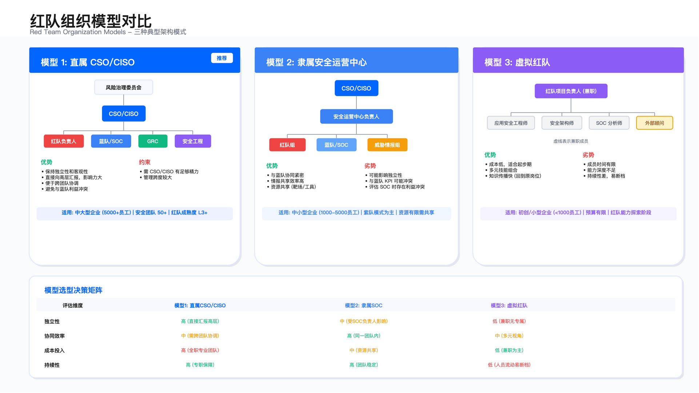
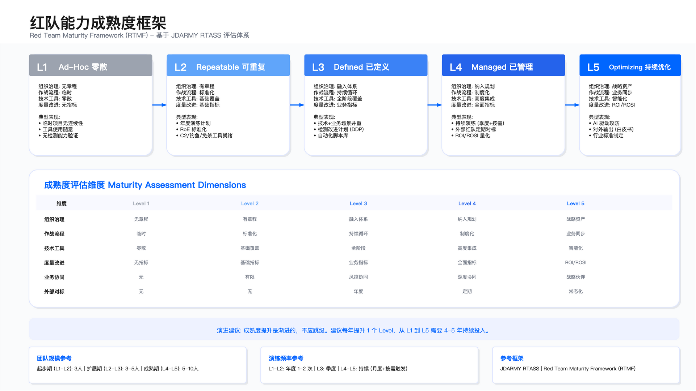

# 12.1 红队战略与组织

红队在企业安全体系中承担攻击模拟职责，但其战略定位往往陷入两个极端：一端被视为"制造额外麻烦的部门"，演练发现的问题被业务视为增加工作负担，修复建议被推迟或忽略；另一端被降格为"合规证据生成工具"，演练仅为满足 PCI DSS 11.3 或 ISO 27001 等合规要求，频率固定（年度一次），不考虑业务变化，报告成为归档材料而非改进起点。这两个极端都偏离了红队的核心价值：在真实攻击者到来之前，通过模拟其战术暴露系统性盲区。本节系统阐述如何避免这些陷阱，建立有效的红队战略与组织，使其与企业安全战略对齐，服务于风险管理和业务连续性目标。

## 法律与合规基础

所有红队活动必须在合法框架内执行。必须获得 CSO/CISO、法务及风险治理委员会的书面授权，所有操作须在交战规则（RoE，Rules of Engagement）框架内执行。涉及生产环境、跨境数据需额外审批。严格遵守《网络安全法》《数据安全法》《个人信息保护法》及适用国际法规。红队战略必须与企业安全战略、业务战略一致，演练活动服务于风险管理和业务连续性目标。红队能力建设纳入年度安全规划和预算，演练成果向管理层和业务团队透明传递。

## 12.1.1 红队使命的现实约束

红队在企业安全体系中的使命定位受到三个现实约束的制约，理解这些约束是建立有效红队组织的前提。

### 约束 1：成本与价值的平衡

组建内部红队或采购外部服务存在显著成本投入。以下为行业参考口径（具体成本因地域、规模、技术栈而异，需根据实际情况测算）：5 人核心团队年度成本约 50 万至 100 万美元（包含人力、工具、基础设施），外部红队服务每次 full scope 演练约 10 万至 30 万美元，BAS 平台订阅约 5 万至 30 万美元/年。与渗透测试不同，红队的价值不是"发现了多少漏洞"，而是"提升了多少检测能力"，这种价值难以直接量化为 ROI，在 CFO 预算审批中构成挑战。

Target 2013 年数据泄露案例展示了这一挑战：Target 在攻击前已部署 FireEye 恶意软件检测系统，该系统在 11 月 30 日检测到 Trojan.POSWDS 并生成告警，但 SOC 团队因"疑似误报"未响应，导致 4000 万信用卡信息泄露。如果 Target 在攻击前进行过红队演练，模拟 POS 系统恶意软件部署场景，SOC 团队可能建立对该类告警的敏感性。但这种"预防性价值"难以在预算审批中量化。

价值证明的关键约束：红队价值在于提升检测能力，而非发现漏洞数量，这种价值需要通过 MTTD（平均检测时间）改进、检测覆盖度提升等运行指标体现，而非传统的漏洞数量/严重性指标。

适用边界：红队投入适用于已具备基础检测能力且需要验证整体防御有效性的企业；对于尚未完成基础建设的组织，投入渗透测试或漏洞评估性价比更高。

常见误区：

- 用漏洞发现数量衡量红队价值，导致红队偏离检测能力验证的核心使命
- 在缺乏基础日志/EDR 的环境中启动红队演练，演练无法验证检测（因为没有可验证的对象）

验证方法：

- 对比演练前后的 MTTD/MTTR（平均响应时间）数据
- 统计演练触发的检测覆盖率（ATT&CK 热力图）
- 记录因演练新增的检测规则数量/质量

运行指标：

- 演练触发告警数/告警质量（信噪比）
- 检测盲区数量与修复进度
- SOC 响应决策准确率（误报/漏报）

### 约束 2：检测能力的前置条件

红队演练的前提是企业已具备基础检测能力。如果连基础日志（如 Sysmon、EDR）都未部署，红队演练无法验证检测，因为根本没有可验证的对象。Colonial Pipeline 2021 年攻击案例反映了这一问题：攻击者通过已泄露的 VPN 密码进入网络，该 VPN 账户未启用 MFA。从技术角度这是"低级错误"，但反映了更深层问题：基础控制缺失。在这种情况下，红队演练价值有限，企业需先完成基础建设（MFA、网络分段、日志采集），再通过红队验证这些控制是否有效。

前置条件清单（基于 MITRE ATT&CK 数据源要求）：

- Windows 日志：Sysmon 部署（进程创建、网络连接、文件创建）
- EDR 覆盖：关键资产全覆盖，非关键资产高覆盖（建议 >80%）
- 网络流量：东西向流量可见性（镜像/Tap）
- 身份日志：Azure AD/Okta 登录日志保留 >90 天
- SIEM 集成：日志统一采集、检测规则 >100 条

适用边界：红队演练适用于已满足上述前置条件的组织；对于未满足条件的组织，应优先完成基础建设，可先采用漏洞评估或渗透测试识别配置缺陷。

关键约束：

- 需要演练环境与生产环境的日志配置一致，否则验证结果无参考价值
- 检测覆盖度验证依赖 SOC 团队的配合（告警是否被看到/是否被响应）

常见误区：

- 仅验证工具是否"能检测"（工具告警），而忽略 SOC 是否"实际检测"（告警被看到且响应）
- 用静态扫描工具报告代替真实攻击操作，导致无法验证动态检测能力

验证方法：

- 演练中每个操作需记录：是否触发告警/告警级别/SOC 响应时间/决策准确性
- 对比演练操作与 ATT&CK 矩阵，生成覆盖度热力图
- 对未检测的操作进行根因分析（无日志/无规则/规则未触发/告警未响应）

运行指标：

- ATT&CK 覆盖率（检测到的 Techniques 数量/演练使用的 Techniques 总数）
- 检测盲区数量（未检测的 Techniques）
- 告警信噪比（有效告警数/总告警数）

### 约束 3：合规驱动与真实风险的错位

PCI DSS 11.3 要求每年进行渗透测试，但并未强制要求红队演练。这导致许多企业将"满足 PCI DSS"作为终点，而非将红队作为持续改进的起点。SolarWinds 2020 年供应链攻陷展示了这一错位：攻击者植入的 SUNBURST 后门由 SolarWinds 官方证书签名（绕过应用白名单），使用合法 Orion 进程启动（绕过 EDR），C2 通信伪装成正常 API 调用（绕过网络监控）。传统渗透测试不会覆盖"可信软件的恶意行为"，因为这不在测试范围内。但红队演练可模拟"供应商账号被控"、"CI/CD 投毒"等供应链攻击场景，暴露企业在供应链可见性上的盲区。然而，此类场景演练需获得高层授权（CSO/CISO），因涉及生产环境风险，许多企业因"不想惊扰业务"而放弃。

适用边界：合规驱动的渗透测试适用于满足基线要求；红队演练适用于需要覆盖合规范围外真实风险场景（供应链、业务逻辑攻击、APT 模拟）的组织。

关键约束：

- 高风险演练场景（涉及生产环境/供应链）需要高层授权和严格的风险控制机制
- 合规框架通常滞后于真实攻击技术，依赖合规要求可能遗漏新兴威胁

常见误区：

- 将合规测试等同于红队演练，导致测试范围局限于合规框架（如 PCI DSS 仅覆盖支付环境）
- 忽略合规框架外的真实攻击场景（供应链投毒、业务逻辑攻击）

验证方法：

- 对比合规要求范围与企业真实攻击面（供应链、业务逻辑、第三方 SaaS）
- 设计覆盖合规范围外风险的演练场景（需高层授权）
- 记录合规测试未发现但红队演练暴露的盲区

运行指标：

- 合规范围外发现的风险数量
- 演练覆盖的攻击场景类型（供应链/业务逻辑/APT 模拟）
- 高层授权高风险演练的审批周期

## 12.1.2 红队价值定位

红队通过全链路对抗验证安全建设成效，为纵深防御与业务连续性提供清晰可量化的价值。明确红队价值定位是获得高层支持、协调跨部门资源、证明投资回报的前提。

### 六维价值框架

红队价值可从以下六个维度向管理层和业务团队呈现：

| 维度 | 价值描述 | 典型产出 | 受益方 |
|-----|---------|---------|-------|
| **攻防视角深挖潜在风险** | 以模拟真实对手的视角检验安全体系，通过可复现的攻击路径、影响范围和补偿成本客观呈现安全建设成效 | 攻击链分析报告、盲区清单、风险量化评估 | 安全团队、GRC |
| **验证纵深防御效果** | 结合紫队循环与 Kill Chain 能力体系，持续验证检测、响应、补偿控制是否有效，促成"识别-预防-检测-响应-恢复"多层防线的闭环 | ATT&CK 覆盖度热力图、MTTD/MTTR 改进数据、DDP | SOC、蓝队 |
| **强化业务安全防护** | 与业务风控紧密协同，快速落地补偿策略和流程优化，将对抗洞察转化为反欺诈、反爬、反刷量等业务防护能力 | 业务攻防演练报告、资损预防量化、风控策略建议 | 业务风控、BISO |
| **合规与审计背书** | 输出可追溯的演练证据、指标与整改台账，为监管抽检、客户审计、并购尽调等场景提供可信的安全控制证明 | 合规演练报告、证据档案、审计支撑材料 | GRC、法务、审计 |
| **明晰安全投资回报** | 依托红队指标（发现率、闭环效率、风险降低幅度等）与 ROI/ROSI、安全债务模型，客观呈现安全投入的防御增益与业务价值 | ROI 分析报告、资损阻断金额、预算申请支撑 | CFO、管理层 |
| **安全与业务协同网络** | 链接蓝队、业务、安全工程、外部红队与行业社区，构建面向全公司的攻防知识网络与能力复用平台 | 知识库、培训体系、行业对标报告 | 全安全组织 |

### 价值呈现的关键原则

**用业务语言翻译技术发现**：向管理层汇报时，将技术发现翻译为业务影响。例如，"发现 AD 域控存在 DCSync 漏洞"应翻译为"攻击者可在 15 分钟内获取全域管理员权限，影响 5000+ 员工账号和 200+ 生产系统"。

**量化风险与投资回报**：建立可量化的价值指标体系，包括：
- 避免损失金额：基于演练发现推算的潜在资损
- 检测能力提升：ATT&CK 覆盖率变化、MTTD/MTTR 改进
- 整改效率：P0/P1 按期修复率、闭环周期

**与业务目标对齐**：红队演练场景应与企业业务节奏对齐（如大促前验证风控策略、支付系统上线前安全评估），确保演练成果直接支撑业务决策。

**持续价值输出**：红队价值不是一次性的，而是通过持续演练→整改→验证的循环，形成安全能力的螺旋上升。年度成熟度评估可量化这种持续改进。

### 价值定位的常见误区

| 误区 | 正确理解 |
|-----|---------|
| 以漏洞数量衡量红队价值 | 红队价值在于检测能力验证和整体防御提升，而非发现漏洞数量 |
| 红队只负责"攻"，不管"防" | 红队价值的最终体现是推动蓝队检测改进和业务风控优化 |
| 红队是独立的技术团队 | 红队是安全体系的一部分，需与蓝队、业务、GRC 协同 |
| 演练结束即价值交付完成 | 价值交付包括演练、报告、整改推动、复测验证的完整闭环 |

## 12.1.3 红队的核心职责边界

基于上述约束，红队职责应聚焦于三个维度，避免泛化为漏洞扫描或一般性渗透测试。

### 职责 1：验证检测覆盖度

红队的首要职责是回答"我们能检测到哪些攻击技术"。基于 MITRE ATT&CK 框架选择 TTP（Tactics, Techniques, and Procedures），在授权范围内执行真实攻击操作，记录每个操作是否被检测、告警质量、响应时间。输出 ATT&CK 覆盖度热力图（14 个 Tactics × 200+ Techniques）、检测盲区清单（未检测的 TTP + 根因分析）、检测改进计划（Detection Development Plan）。

根据行业参考数据，即使顶级 EDR 厂商，对 ATT&CK 战术的检测覆盖率也存在显著差距。这一观察不作为企业目标值（每个企业的检测能力依赖其技术栈/配置），而是说明检测盲区的普遍性，即使采购顶级 EDR 也无法实现 100% 覆盖。

适用边界：适用于已部署 SIEM/EDR/网络监控的组织；对于缺乏基础检测能力的组织，应优先完成检测工具部署。

关键约束：

- 需要演练环境与生产环境的日志配置一致，否则验证结果无参考价值
- 检测覆盖度验证依赖 SOC 团队的配合（告警是否被看到/是否被响应）

常见误区：

- 仅验证工具是否"能检测"（工具告警），而忽略 SOC 是否"实际检测"（告警被看到且响应）
- 用静态扫描工具报告代替真实攻击操作，导致无法验证动态检测能力

验证方法：

- 演练中每个操作需记录：是否触发告警/告警级别/SOC 响应时间/决策准确性
- 对比演练操作与 ATT&CK 矩阵，生成覆盖度热力图
- 对未检测的操作进行根因分析（无日志/无规则/规则未触发/告警未响应）

运行指标：

- ATT&CK 覆盖率（检测到的 Techniques 数量/演练使用的 Techniques 总数）
- 检测盲区数量（未检测的 Techniques）
- 告警信噪比（有效告警数/总告警数）

### 职责 2：验证响应有效性

红队的第二职责是回答"检测到攻击后，我们能否及时响应"。模拟攻击场景（如勒索软件部署），观察 SOC 团队的响应流程（告警分类、升级、遏制），记录响应时间、决策点、协调效率。输出响应时间分析（MTTD vs MTTR）、决策失败点识别（如 Target 案例中的"误报判断"）、Playbook 优化建议（如勒索软件响应 SOP）。

根据行业参考数据，企业检测和响应时间存在显著改进空间。这一观察不作为企业目标值，而是说明响应时间的行业挑战，强调响应有效性验证的必要性。

适用边界：适用于已建立 SOC 且具备基础响应流程的组织；对于尚无 SOC 的组织，应优先建立响应流程。

关键约束：

- 响应验证需 SOC 团队配合（演练中不提前告知 SOC，避免影响验证真实性）
- 生产环境演练需严格控制爆炸半径，避免实际业务中断

常见误区：

- 仅验证检测（是否告警），而忽略响应（告警后的决策/遏制/恢复）
- 演练前告知 SOC，导致 SOC 提前准备，验证结果失真

验证方法：

- 记录从攻击发生到检测告警的时间（MTTD）
- 记录从告警到遏制操作的时间（MTTR）
- 记录响应过程中的决策点（是否误判为误报/是否升级/遏制措施是否有效）

运行指标：

- MTTD（平均检测时间，从攻击发生到告警生成）
- MTTR（平均响应时间，从告警到遏制完成）
- 决策准确率（正确决策数/总决策数）

### 职责 3：验证业务影响

红队的第三职责是回答"如果攻击成功，业务会受到多大影响"。模拟攻击目标（如核心支付系统被攻陷），评估业务中断范围（影响多少订单/用户），量化潜在损失（数据泄露导致的合规罚款）。输出业务影响评估报告（BIA - Business Impact Analysis）、关键资产清单（Crown Jewels）、风险接受决策支持（Accept/Mitigate/Transfer）。

Colonial Pipeline 2021 年攻击导致美国东海岸燃油供应中断 5 天，造成显著业务损失。这一案例不作为量化模型，而是说明业务影响评估可为安全投资提供决策依据。

适用边界：适用于需要向管理层/董事会量化安全风险的组织；对于技术团队内部改进，可专注于检测/响应验证。

关键约束：

- 业务影响评估需业务团队配合（提供订单量/用户量/收入数据）
- 量化损失需合理假设（不编造数字，基于已知业务指标推导）

常见误区：

- 业务影响评估编造数字，导致管理层不信任
- 忽略业务影响，仅提供技术报告，导致管理层无法理解风险

验证方法：

- 与业务团队确认关键资产（如支付系统/订单系统/用户数据库）
- 模拟攻击成功场景，评估业务中断范围（影响订单数/用户数）
- 基于业务数据推导潜在损失（如每小时订单量 × 中断时长 × 平均订单金额）

运行指标：

- 关键资产被攻陷的业务影响范围（订单数/用户数/收入）
- 潜在合规罚款（基于 GDPR/PIPL 等法规）
- 恢复时间目标（RTO）与实际恢复时间的差距

## 12.1.4 合规与审计需求

红队演练在合规框架中的定位是增强传统合规测试，而非替代。以下列举主要合规框架对红队的要求或增强价值。

### PCI DSS 11.3: Penetration Testing

PCI DSS 要求每年至少进行一次渗透测试，在重大基础设施或应用变更后进行测试，测试需包含网络层和应用层。红队的增强价值在于：PCI DSS 要求的"渗透测试"通常聚焦于技术漏洞，而红队演练可验证"攻击者获得初始访问后能走多远"，这对支付系统尤为关键。例如，渗透测试可能发现 Web 应用 SQL 注入，但红队演练可验证：攻击者利用 SQL 注入进入内网后，能否横向移动到支付数据库/能否绕过数据库审计/能否外带信用卡数据。

适用边界：PCI DSS 强制要求适用于处理支付卡数据的组织；红队增强适用于需要验证支付环境纵深防御的组织。

### ISO 27001: A.12.6 Technical Vulnerability Management

ISO 27001 要求及时获取技术漏洞信息，评估组织面临的技术漏洞风险，采取适当措施应对相关风险。红队的增强价值在于：ISO 27001 关注"已知漏洞"，红队演练可暴露"未知组合风险"（多个低危漏洞的链式利用）。例如，漏洞扫描可能发现 3 个"低危"漏洞（SMB 未加密/LLMNR 未禁用/域用户密码弱），但红队演练可证明：攻击者可链式利用这 3 个漏洞实现域管提权。

适用边界：ISO 27001 适用于所有组织的基线风险管理；红队增强适用于需要识别组合风险的成熟组织。

### NIST CSF: DE.DP-5 Detection Process Testing

NIST CSF 要求检测流程应定期测试。红队演练是验证检测流程有效性的最佳方法，可直接测试检测工具/规则/流程的实战表现。

适用边界：适用于所有需要验证检测能力的组织。

### TIBER-EU: Threat Intelligence-based Ethical Red Teaming

欧洲央行框架要求基于威胁情报设计演练场景，模拟真实 APT 的 TTP，聚焦关键金融基础设施。适用对象为欧洲金融机构（银行、支付机构、证券交易所）。

适用边界：TIBER-EU 强制要求适用于欧洲关键金融机构；其方法论可参考用于其他行业的 APT 模拟演练。

## 12.1.5 Red Team vs. Penetration Testing vs. Vulnerability Assessment

红队演练、渗透测试、漏洞评估在目标、范围、方法、成本、适用阶段上存在本质差异。理解这些差异是选择合适安全测试方法的前提。选择哪种方法取决于企业安全成熟度、预算、目标（合规/风险管理/能力验证）。以下表格从多个维度对比三种方法，为实施决策提供依据：

| 维度     | 漏洞评估（VA） | 渗透测试（PT）   | 红队演练（RT）                   |
| -------- | -------------- | ---------------- | -------------------------------- |
| 目标     | 发现已知漏洞   | 验证漏洞可利用性 | 模拟真实攻击者，验证整体防御能力 |
| 范围     | 单一系统/资产  | 特定目标系统     | 全企业范围（技术+业务+人员）     |
| 方法     | 自动化扫描为主 | 手工渗透+工具    | 多阶段攻击链，模拟真实 TTP       |
| 时间     | 数天           | 1-4 周           | 数周至数月（持续）               |
| 隐蔽性   | 无隐蔽要求     | 有限隐蔽         | 高度隐蔽，避免检测               |
| 防御测试 | 不涉及         | 有限测试         | 全面测试检测与响应能力           |
| 业务场景 | 不涉及         | 有限涉及         | 深度涉及业务逻辑攻击             |
| 协同性   | 独立执行       | 独立执行         | 与蓝队、业务协同（紫队循环）     |
| 成果     | 漏洞列表       | 渗透报告+PoC     | 综合评估报告+检测改进+战略洞察   |
| 频率     | 季度/月度      | 半年/季度        | 持续/年度                        |
| 成本     | 低             | 中               | 高                               |
| 适用阶段 | 初期           | 中期             | 成熟期                           |

三种方法并非互斥，而是互补。企业可根据成熟度阶段组合使用。

### 漏洞评估（Vulnerability Assessment）

漏洞评估适用于快速识别已知漏洞和配置错误，满足合规要求（如 PCI DSS 季度扫描），资产上线前基线检查，补丁管理验证。典型工具包括 Nessus、Qualys、Rapid7 InsightVM、OpenVAS、Nuclei、云原生扫描器（Prisma Cloud、Wiz）。价值定位在于低成本、高覆盖、快速执行，适合常规安全卫生检查，但不验证漏洞可利用性和业务影响。

适用边界：适用于所有组织的基线风险管理；不适用于需要验证漏洞可利用性或检测能力的场景。

关键约束：扫描可能产生大量误报，需人工复核；扫描可能触发防御系统告警或影响脆弱系统稳定性。

### 渗透测试（Penetration Testing）

渗透测试适用于验证关键系统的安全性，应用上线前的安全测试，合规要求（如 PCI DSS 11.3），第三方独立评估。典型工具包括 Burp Suite、OWASP ZAP、Metasploit、Cobalt Strike、Kali Linux 工具集。价值定位在于验证漏洞可利用性和业务影响，提供攻击路径和修复建议，但不涉及检测响应能力验证。

适用边界：适用于已完成漏洞评估且需要验证关键漏洞可利用性的组织；不适用于需要验证检测响应能力的场景。

关键约束：测试范围通常限定于特定系统/应用，不覆盖全企业攻击面；测试方法可能对生产环境产生风险，需严格控制。

### 红队演练（Red Team Exercise）

红队演练适用于验证整体安全防御能力，测试检测与响应能力，模拟真实 APT/黑灰产攻击，业务安全场景验证（大促、支付、供应链），合规审计背书（TIBER-EU, CBEST）。典型工具包括 C2 平台（Cobalt Strike、Mythic、Sliver）、OSINT 工具（Shodan、Maltego）、社工工具（GoPhish、King Phisher）、自动化编排（MITRE CALDERA、Atomic Red Team）。价值定位在于全链路验证（技术+业务+人员），检测响应能力提升（紫队循环），战略洞察与投资决策支持，业务价值直接体现。

适用边界：适用于已具备基础检测能力（SIEM/EDR/日志）且需要验证整体防御有效性的成熟组织；不适用于尚未完成基础建设的初创组织。

关键约束：

- 需要高层授权和严格的 RoE，避免超范围操作
- 演练成本高，需要专业团队和持续投入
- 演练可能对生产环境产生风险，需严格控制爆炸半径

### 演进路径

企业安全测试能力的成熟度演进遵循以下路径：

Level 1（起步期）：以漏洞评估为主，建立安全基线，识别已知漏洞和配置错误。

Level 2（发展期）：增加渗透测试，验证关键系统的漏洞可利用性，提供修复优先级。

Level 3（成长期）：启动红队演练，验证检测响应能力，识别系统性盲区。

Level 4（成熟期）：持续红队演练，与业务深度协同（大促/支付/供应链场景），建立紫队循环。

Level 5（卓越期）：红队能力成为战略资产，对外支持（子公司、合作伙伴、行业交流），持续改进文化。

这一演进路径不是线性的，企业可根据自身情况在不同阶段组合使用多种方法。例如，成熟期企业仍需定期进行漏洞评估（合规要求）和渗透测试（新系统上线前验证），同时开展红队演练（整体防御验证）。

## 12.1.6 红队组织模型

红队的组织模型直接影响其独立性、协同效率和战略影响力。以下三种模型适用于不同规模和成熟度的组织。

### 模型 1：直属 CSO/CISO（推荐）

红队负责人直接向 CSO/CISO 汇报，与蓝队/SOC 负责人、GRC 负责人、安全工程负责人平级。风险治理委员会监督 CSO/CISO，红队通过红队负责人向委员会汇报重大发现。

优势：

- 保持独立性和客观性，避免与被测试对象（蓝队/业务）的利益冲突
- 直接向高层汇报，影响力大，推动整改的能力强
- 便于跨团队协调和资源调度（需要业务/蓝队/GRC 配合时，CSO/CISO 可协调）
- 避免与蓝队/SOC 利益冲突（如果隶属 SOC，可能影响对 SOC 的客观评估）

适用场景：

- 中大型企业（员工 5000+ 或安全团队 50+）
- 红队能力成熟（Level 3+）
- 需要独立的安全验证和审计

关键约束：需要 CSO/CISO 有足够精力管理红队，否则可能导致红队与其他团队协调不畅。

### 模型 2：隶属安全运营中心

红队组、蓝队/SOC、威胁情报组同时向安全运营中心负责人汇报，安全运营中心负责人向 CSO/CISO 汇报。

优势：

- 与蓝队/SOC 协同紧密，演练发现可快速转化为检测改进
- 情报共享效率高（红队使用的 TTP 可直接反馈给威胁情报组）
- 资源共享（如靶场、工具、基础设施）

劣势：

- 可能影响独立性（红队评估 SOC 时存在利益冲突）
- 与蓝队 KPI 可能冲突（蓝队目标是降低告警，红队目标是测试告警有效性）

适用场景：

- 中小型企业（员工 1000-5000）
- 红队与蓝队协同为主要目标（紫队模式）
- 资源有限需要共享

关键约束：需要明确红队与蓝队的 KPI 边界，避免利益冲突影响客观性。

### 模型 3：虚拟红队（跨职能团队）

红队项目负责人（兼职），从应用安全工程师、安全架构师、SOC 分析师、外部顾问中抽调成员兼职组成红队。

优势：

- 成本低，适合起步期（无需全职人员）
- 多元技能组合（应用安全+架构+SOC+外部视角）
- 知识传播快（兼职成员回到原岗位后，可将红队视角带入日常工作）

劣势：

- 成员时间有限，演练频率和深度受限
- 能力深度不足（兼职成员难以投入时间钻研深度攻击技术）
- 持续性差（成员流动可能导致红队能力断档）

适用场景：

- 初创期或小型企业（员工 <1000）
- 预算有限
- 红队能力探索阶段（尚未决定是否组建全职红队）

关键约束：需要确保兼职成员有足够时间投入（建议每周至少 20% 时间），否则红队能力难以积累。



*图 12-4：红队组织模型对比——直属 CSO、隶属 SOC、虚拟红队三种模式的适用场景与优劣势*

### Roles and Responsibilities（角色与职责）

红队核心角色包括红队负责人、红队技术专家、威胁情报分析师、红队工程师、紫队协调人、裁判/监督组。人员配置依赖企业规模/演练频率/成熟度，以下表格提供通用基线：

| 角色           | 职责                                                                         | 技能要求                                                                                 | 人员配置         |
| -------------- | ---------------------------------------------------------------------------- | ---------------------------------------------------------------------------------------- | ---------------- |
| 红队负责人     | 制定战略与年度计划、批准演练与 RoE、协调资源与跨团队合作、向 CSO/CISO 汇报   | 10+ 年安全经验、攻防技术深度、战略规划能力、沟通协调能力                                 | 1 人             |
| 红队技术专家   | 执行攻击链、编写工具与脚本、撰写技术报告、维护 C2 基础设施                   | 渗透测试认证（OSCP/OSEP）、编程能力（Python/C#/Go）、多技术栈（Web/云/AD）、免杀与反检测 | 2-5 人（按阶段） |
| 威胁情报分析师 | 收集威胁情报、构建攻击场景、跟踪威胁演员、情报驱动演练规划                   | CTI 分析能力、MITRE ATT&CK 熟练、行业情报理解、数据分析能力                              | 1 人（可兼职）   |
| 红队工程师     | 搭建 C2 基础设施、开发自动化工具、维护靶场环境、工具平台运维                 | DevOps/SRE 经验、云平台熟练（AWS/Azure/GCP）、IaC（Terraform/Ansible）、网络与系统管理   | 1 人（可兼职）   |
| 紫队协调人     | 将红队 TTP 转化为检测、制定检测改进计划（DDP）、验证检测规则、知识转移与培训 | 检测工程经验、SIEM/SOAR 熟练、攻防双向理解、沟通协调能力                                 | 1 人（可兼职）   |
| 裁判/监督组    | 审核 RoE、监控演练过程、控制风险、紧急中止决策                               | 安全运营经验、风险管理能力、业务理解、决策能力                                           | 1-2 人（演练期） |

起步期可采用虚拟红队（兼职），扩展期组建 3-5 人核心团队，成熟期建立 5-10 人专业团队。

人员配置建议（按成熟度）：

| 阶段   | 时间     | 团队规模 | 人员配置                                                    | 关键角色             |
| ------ | -------- | -------- | ----------------------------------------------------------- | -------------------- |
| 起步期 | 0-12 月  | 3 人     | 负责人 1、多技能攻防 2                                      | 多面手，技术广度优先 |
| 扩展期 | 12-24 月 | 3-5 人   | 负责人 1、攻防专家 2-3、工程/紫队兼职 1                     | 技术深度，场景多样化 |
| 成熟期 | 24+ 月   | 5-10 人  | 负责人 1、攻防专家 3-5、工程师 1、情报/紫队 1、外部顾问若干 | 专业分工，对外输出   |

### 预算与资源规划

红队建设需要持续的资源投入，合理的预算规划是确保红队能力持续发展的基础。以下框架帮助组织规划红队预算。

**预算构成模型：**

```
红队年度预算 = 人员成本 + 工具采购 + 外部服务 + 培训发展 + 基础设施
             = 人员薪酬×1.2（含福利）+ 年度工具预算 + 外部评估费用 + 人均培训预算×人数 + 靶场/C2成本
```

**按成熟度阶段的预算参考：**

| 阶段 | 团队规模 | 人员成本（年） | 工具采购（年） | 外部服务（年） | 培训发展（年） | 基础设施（年） | 总预算参考 |
|-----|---------|--------------|--------------|--------------|--------------|--------------|-----------|
| 起步期 | 3 人 | 150-200 万 | 20-50 万 | 30-50 万 | 15-30 万 | 10-20 万 | 225-350 万 |
| 扩展期 | 5 人 | 300-400 万 | 50-100 万 | 50-100 万 | 30-50 万 | 20-40 万 | 450-690 万 |
| 成熟期 | 8+ 人 | 500-800 万 | 100-200 万 | 100-150 万 | 50-80 万 | 40-60 万 | 790-1290 万 |

*注：以上为人民币参考值，具体成本因地域、行业、技术栈而异，需根据实际情况调整。*

**预算分配原则：**

1. 人员优先：人员成本通常占总预算的 50-60%，优秀的红队成员是核心资产
2. 工具与服务平衡：自研工具降低长期成本，外部服务提供第三方视角
3. 培训持续投入：每人每年 3-5 万培训预算，保持技术前沿性
4. 基础设施弹性：靶场环境可采用云资源按需使用，降低固定成本

**预算审批要点：**

- 向 CFO 汇报时，将红队投入与潜在损失避免（风险量化）关联
- 引用行业案例（如 Target 数据泄露损失、Colonial Pipeline 赎金支付）说明预防性投入的价值
- 建立红队 ROI 指标（检测覆盖度提升、MTTD 改进、漏洞修复率）支持预算申请

### 人才全周期管理框架（选-育-用-留）

红队人才是稀缺资源，建立系统化的人才全周期管理框架是维持红队能力的关键。采用"选-育-用-留"四阶段模型，确保人才从招募到离职的全生命周期管理。

| 环节 | 重点内容 | 具体措施 |
|-----|---------|---------|
| **选（甄选与准入）** | 能力画像 | 技术深度（渗透测试、漏洞挖掘、AD 域渗透、Web 攻防、逆向工程、云原生攻防、容器攻防、安全开发）、业务洞察（支付、风控、营销）、软技能（沟通表达、逻辑思维、项目管理）、情绪管理、抗压能力、商业诚信 |
| | 准入校验 | 实名认证背景调查、信用与司法记录核查；关键岗位需 2 年无重大违规记录 |
| | 保密与道德约束 | 签署保密协议、道德守则、利益冲突声明；违约即触发合规问责 |
| | 权限与监督 | 高敏权限 Just-in-Time 授权 + 双人审批；裁判/监督组定期审查操作日志；合规/内部审计半年复核权限与证据留存 |
| **育（培养与发展）** | 发展路径 | 技术专家序列参考 OffSec 认证（OSCP → OSEP/OSWE/OSED → OSCE3 → OSEE）对应内部准高级/资深/专家等任职资格标准；业务能力通过内部学习营与实战沉淀；横向安全知识通过 SOC 课程、CISSP 等补齐；领导力依托公司学习发展体系培养 |
| | 能力建设 | 常态化 CTF、红队靶场实战、外部红队共训；法规与组织红线周期性宣导 |
| | 轮岗机制 | 与 SOC/安全应急响应/应用安全/安全 BP/业务安全等岗位轮岗，强化纵深防御链路理解 |
| | Kill Chain 技能基线 | 以洛克希德·马丁杀伤链（侦察、武器化/投递、利用与安装、命令控制、横向移动、行动达成）建立攻防技能清单，覆盖杀软对抗、隐匿通信、后渗透运营 |
| | 业务攻防技能基线 | 对批量注册、刷量、反爬、薅羊毛等风险建立攻防能力清单，涵盖业务流程洞察、风控策略设计、数据分析与即时补偿控制执行 |
| **用（任用与激励）** | 绩效激励 | 针对重大风险发现、闭环推进、创新工具设专项激励，与业务共建成果挂钩 |
| | 任务分配 | 根据能力谱系与业务优先级分配项目，兼顾深耕与场景轮换 |
| | 权责边界 | 红队聚焦验证与技术支持；业务风控负责策略制定/落地；SOC 负责检测响应，避免职责重叠 |
| **留（留任与传承）** | 职业发展 | 技术与管理双晋升通道，配套"红队专家/攻防之星"荣誉体系，季度在安全中心内公开表彰；支持专利、论文、技术博客、社区演讲等成果转化，并提供行业峰会（如 Black Hat、DEF CON、TCC 等）参会与分享名额 |
| | 文化与福利 | 建立红队荣誉墙、内网专题报道与高管点赞机制，设置专项奖励基金、技术装备/实验室资源池；提供外部培训、攻防认证、导师制度、黑客马拉松、CTF、技术分享日等活动 |
| | 离职与继任 | 建立人才继任计划；离职完成权限回收、知识交接与保密要求 |

**技能矩阵（按经验分级）：**

| 能力维度 | 初级（0-2年） | 中级（2-5年） | 高级（5+年） |
|---------|-------------|-------------|-------------|
| 渗透技术 | Web 渗透、内网基础 | AD 攻防、云安全、免杀 | 0day 研究、APT 模拟 |
| 编程能力 | Python 脚本 | C#/Go 工具开发 | 自研 C2/Implant |
| 业务理解 | 了解业务流程 | 识别业务风险 | 设计业务攻击场景 |
| 情报能力 | 使用 CTI 平台 | 分析威胁情报 | 构建威胁模型 |
| 沟通协调 | 技术报告撰写 | 管理层汇报 | 跨部门协调 |

**职业发展双通道：**

- 技术专家路线：初级攻防工程师 → 高级攻防专家 → 首席红队专家 → 红队技术总监
- 管理路线：红队成员 → 红队组长 → 红队负责人 → 攻防安全总监

**文化、纪律与利益冲突管理：**

- 纪律准则：签署保密协议，明确禁止未经授权的攻击行为、数据滥用；所有演练需裁判/监督组批准；每半年开展一次法规与纪律宣贯
- 职业操守：全体红队成员须遵守《网络安全法》《数据安全法》《个人信息保护法》及适用国际法规，签署职业道德与合规承诺书
- 利益冲突：针对参与敏感业务或第三方合作项目时，执行利益冲突评估，必要时更换操作人员
- 奖惩机制：建立正向激励（年度攻防专项奖、创新奖励）与负向约束（触碰红线即暂停授权、进入合规审查）
- 离职控制：离职前完成权限回收清单、数据/工具核查与退出访谈，关键岗位须接受离职后保密要求

### Governance Structure（治理结构）

红队治理结构是确保演练活动合规、可控、有效的组织保障。完善的治理结构包括决策层、管理层、执行层三个层级。

**三层治理架构：**

| 层级 | 角色 | 职责 | 决策权限 |
|-----|-----|-----|---------|
| 决策层 | 风险治理委员会 | 战略规划、重大决策、资源分配 | 年度计划审批、高风险演练授权、预算批准 |
| 管理层 | CSO/CISO + 红队负责人 | 日常管理、执行监督、跨部门协调 | 演练计划审批、RoE 批准、整改督办 |
| 执行层 | 红队成员 + 裁判组 | 演练执行、风险控制、报告输出 | 操作决策、紧急中止 |

**风险治理委员会组成：**

| 角色 | 职责 | 参会频率 |
|-----|-----|---------|
| CSO/CISO（主席） | 主持会议、最终决策 | 全部会议 |
| 攻防负责人（红队） | 汇报计划与成效、提出资源需求 | 全部会议 |
| SOC 负责人（蓝队） | 反馈检测改进进展、协调响应资源 | 全部会议 |
| GRC 负责人 | 审核合规性、评估风险可接受性 | 全部会议 |
| BISO/GSBP（业务安全） | 协调业务参与、反馈业务影响 | 涉及业务演练时 |
| 业务风控负责人 | 反馈风控策略效果、提供业务数据 | 涉及业务演练时 |
| 法务代表 | 审核法律合规性、审批 RoE | 涉及高风险演练时 |
| 外部顾问（可选） | 提供独立评估、行业对标 | 年度评估时 |

**决策与审批流程：**

演练审批分级机制：

| 演练类型 | 风险等级 | 审批层级 | 审批周期 |
|---------|---------|---------|---------|
| 紫队协作（测试环境） | 低 | 红队负责人 | 1-3 天 |
| 假定突破（内网） | 中 | CSO/CISO | 3-5 天 |
| 全方位演练（生产环境） | 高 | 风险治理委员会 | 1-2 周 |
| 高管定向攻击 | 高 | CSO/CISO + 法务 + 高管本人 | 1-2 周 |
| 供应链/第三方演练 | 极高 | 风险治理委员会 + 法务 | 2-4 周 |

紧急决策机制：

- 触发条件：业务指标异常、系统故障、数据泄露风险
- 决策时限：5 分钟内（裁判组初判）→ 30 分钟内（CSO/CISO确认）
- 升级路径：裁判组 → 红队负责人 → CSO/CISO → 风险治理委员会
- 记录要求：所有紧急决策需在 24 小时内形成书面记录

**执行汇报链路：**

```
风险治理委员会
    ↓ 战略指导
CSO/CISO
    ↓ 授权与监督
红队负责人 ←→ 裁判/监督组（审批与监控）
    ↓ 任务分配
红队成员
    ↓ 演练执行
紫队复盘
    ↓                    ↓
蓝队/SOC（检测改进）    业务风控（策略优化）
    ↓                    ↓
能力提升反馈 ──────────→ 红队负责人
    ↓
季度汇报 → CSO/CISO → 风险治理委员会
```

**会议节奏与议程：**

| 会议类型 | 频率 | 参与者 | 核心议程 |
|---------|-----|-------|---------|
| 年度规划会 | 每年 Q4 | 全体委员 | 年度成效复盘、下年计划审议、预算审批 |
| 半年度复盘 | Q2、Q4 | 全体委员 | 半年成效评估、计划调整、重大问题决策 |
| 季度评审 | 每季度 | CSO/CISO + 红蓝队负责人 | 演练进展、指标达成、整改进度 |
| 月度同步 | 每月 | 红队负责人 + 裁判组 | 计划执行、风险识别、资源协调 |
| 紧急会议 | 按需 | 相关方 | 重大风险决策、紧急中止评估 |

**汇报频率：**

- 实时：重大风险发现（24 小时内向 CSO/CISO 和风险治理委员会）
- 周度：演练期间进展汇报（向裁判/监督组）
- 月度：指标看板更新（向 CSO/CISO）
- 季度：全面复盘报告（向风险治理委员会）
- 年度：年度成效与下年规划（向管理层和董事会）

**治理有效性验证：**

- 年度治理审计：评估决策流程执行情况、审批时效、记录完整性
- 演练后评估：每次演练后评估治理机制是否有效支撑演练执行
- 改进闭环：将治理问题纳入改进计划，持续优化决策流程

## 12.1.7 红队能力成熟度框架

红队能力成熟度模型帮助组织评估当前能力水平，规划改进路径。基于 Red Team Maturity Framework (RTMF) 和 JDARMY RTASS，从组织治理、作战流程、技术工具、度量改进四个维度评估红队能力。

### Level 1: Ad-Hoc（零散）

特征：零散的渗透测试活动，缺乏章程、职责与基线，无标准化流程和工具，缺少与蓝队/业务协同，无体系化指标。

典型表现：临时项目无连续性，工具使用随意，报告质量不一致，无检测能力验证，业务价值难以量化。

建设重点：建立红队章程和 RoE，定义角色与职责，选择基础工具栈，制定基本流程。

关键约束：此阶段组织通常尚未建立基础检测能力，建议优先完成日志/SIEM/EDR 部署，再启动红队建设。

### Level 2: Repeatable（可重复）

特征：建立红队章程与治理结构，标准化演练流程，基础工具栈覆盖 kill chain，引入发现率、闭环率等指标，开始与蓝队协同。

典型表现：年度演练计划，RoE 标准化，C2、钓鱼、免杀工具就绪，演练复盘流程，季度指标汇报。

建设重点：完善工具平台，建立紫队循环，引入 MITRE ATT&CK，建立知识库。

关键约束：此阶段红队与蓝队协同刚起步，需明确紫队协调人角色，避免演练发现无法转化为检测改进。

### Level 3: Defined（已定义）

特征：红队融入安全体系，持续紫队循环，工具平台覆盖 kill chain 全阶段，结合业务场景演练，建立成熟度评估。

典型表现：技术+业务场景并重，检测改进计划（DDP），自动化脚本库，业务风控协同，使用 RTASS 评分。

建设重点：业务攻防能力，自动化编排，外部红队对标，资损量化。

关键约束：此阶段需业务团队深度参与（提供业务数据/参与复盘），需 BISO/GSBP 协调业务资源。

### Level 4: Managed（已管理）

特征：红队纳入安全与业务规划，演练制度化（基础设施+业务+供应链），工具平台高度集成，支持合规审计和并购尽调，指标体系覆盖技术与业务。

典型表现：持续演练（季度+按需），外部红队定期对标，自研+商业工具协同，情报驱动演练，ROI/ROSI 量化。

建设重点：持续验证机制，BAS 平台集成，对外支持（子公司、合作伙伴），行业影响力。

关键约束：此阶段红队能力成为战略资产，需向管理层/董事会定期汇报，量化 ROI 成为关键。

### Level 5: Optimizing（持续优化）

特征：红队纳入公司安全战略目标，演练与业务迭代同步，工具平台智能化（AI 辅助），外部对标与行业联盟常态化，对外输出（白皮书、开源工具）。

典型表现：红队能力成为战略资产，持续改进文化，行业领先实践，对外培训与咨询，品牌影响力。

建设重点：AI 驱动攻防，数字孪生/仿真，行业标准制定，人才生态建设。

关键约束：此阶段红队能力溢出企业边界，需平衡内部服务与外部输出，避免影响内部演练质量。

### Maturity Assessment（成熟度评估）

基于 Red Team Maturity Framework（RTMF）与 JDARMY RTASS 框架，从"组织治理、作战流程、技术工具、度量改进"四个核心维度刻画红队能力等级。以下详细矩阵为每个级别提供具体评估标准：

**5级×4维度详细评估矩阵：**

| 级别 | 组织治理（RTMF） | 作战流程与协同（RTASS） | 技术工具与 Kill Chain 覆盖（RTASS） | 度量改进与业务联动 |
|-----|-----------------|----------------------|-----------------------------------|------------------|
| **Level 1**<br>零散 | 零散渗透测试，缺乏章程、职责与基线 | 临时活动，缺少 RoE、紧急中止机制、复盘流程 | 工具零散，Kill Chain 能力覆盖不足 | 无体系化指标，结果难以量化，缺少与业务协同 |
| **Level 2**<br>可重复 | 建立红队章程、风险治理委员会、角色分工 | 标准化演练流程、审批、复盘，形成攻防生命周期 | 搭建 C2、BAS、钓鱼、免杀、隐匿通信等工具，实现 Kill Chain 基础覆盖 | 引入发现率、闭环率等指标，识别重点风险场景纳入剧本池 |
| **Level 3**<br>已定义 | 红队融入安全体系，与蓝队/业务风控协同 | 持续紫队循环，复盘采用 5 Whys；对高风险演练建立故障/应急联动流程 | 工具平台覆盖 Kill Chain 全阶段并支持多业务场景复现，业务攻防脚本纳入演练 | 建立 RTASS 评分雷达图，结合业务风险指标（资损、策略覆盖等）开展季度评估 |
| **Level 4**<br>已管理 | 红队纳入安全与业务规划，参与合规、并购尽调等关键活动 | 演练制度化，覆盖基础设施、业务、供应链等场景；支持监管、客户审计；引入外部红队对标 | 工具平台实现自研与商业工具协同，自动化执行、回归与攻击链扩散；与情报、SOAR、业务数据平台联动 | 指标体系覆盖技术、业务、防欺诈等维度，量化演练对业务与资损的影响，驱动纵深防御迭代 |
| **Level 5**<br>持续优化 | 红队纳入公司安全战略目标，具备对外赋能和行业影响力 | 演练与业务迭代同步，结合仿真/数字孪生实现连续评估；外部对标与行业攻防联盟常态化 | 工具平台支持自动化攻防编排、智能策略生成与安全产品反哺；Kill Chain 全流程高度自动化 | 综合使用 RTMF/RTASS 指标与 ROI/ROSI、安全债务模型呈现投入产出，形成年度成熟度报告与对外案例 |

**简化速查矩阵：**

| 维度     | Level 1 | Level 2  | Level 3  | Level 4  | Level 5  |
| -------- | ------- | -------- | -------- | -------- | -------- |
| 组织治理 | 无章程  | 有章程   | 融入体系 | 纳入规划 | 战略资产 |
| 作战流程 | 临时    | 标准化   | 持续循环 | 制度化   | 业务同步 |
| 技术工具 | 零散    | 基础覆盖 | 全阶段   | 高度集成 | 智能化   |
| 度量改进 | 无指标  | 基础指标 | 业务指标 | 全面指标 | ROI/ROSI |
| 业务协同 | 无      | 有限     | 风控协同 | 深度协同 | 战略伙伴 |
| 外部对标 | 无      | 无       | 年度     | 定期     | 常态化   |
| 知识积累 | 无      | 文档     | 知识库   | 平台化   | 对外输出 |

> **建议**：以 RTMF 的"红队成熟度雷达图"作为年度能力建设路径图，同时使用 RTASS 评分表（含 Kill Chain、检测响应、业务协同等指标）记录每次演练结果，持续呈现安全能力进展与差距。



*图 12-3：红队能力成熟度框架（RTMF）——从 Level 1 零散到 Level 5 持续优化的演进路径*

成熟度演进是渐进的，不应跳级，建议每年提升 1 个 Level。

评估方法：自评问卷（部分示例）：

1. 组织治理：是否有正式的红队章程？是否有风险治理委员会？CSO/CISO 是否直接参与红队战略？是否有明确的汇报链路？
2. 作战流程：是否有标准化的 RoE？是否有演练 SOP？是否有紧急中止机制？是否有紫队复盘流程？
3. 技术工具：是否有 C2 平台？是否覆盖 kill chain 全阶段？是否有自动化脚本库？是否有靶场环境？
4. 度量改进：是否有发现率指标？是否有 MTTD/MTTR 指标？是否量化业务价值（资损预防）？是否计算 ROI？
5. 业务协同：是否有 BISO/GSBP 协同？是否有业务场景演练？是否有风控策略闭环？是否定期与业务复盘？

评分方法：每个问题：是 = 1 分，否 = 0 分。总分映射到 Level：0-20% Level 1，21-40% Level 2，41-60% Level 3，61-80% Level 4，81-100% Level 5。

### 三年建设路径

基于成熟度框架，以下提供红队能力三年建设的阶段性里程碑，帮助企业规划红队建设的投资节奏和能力演进目标。

| 阶段/年度 | 时间范围 | 核心目标 | 关键行动 | 成功标志 |
|---------|---------|---------|---------|---------|
| **第一年：基础建设** | 0-12 个月 | 对齐企业安全治理与检测体系，建立红队治理与平台基线 | • 完成红队章程、CSO/CISO 授权、任职资格标准、OKR 制定、治理委员会<br>• 将红队纳入集团安全战略与风险管理机制<br>• 梳理关键业务风险并映射演练场景<br>• 使用 RTMF/RTASS 完成首次成熟度评估<br>• 搭建 C2/BAS/钓鱼/免杀/隐匿通信/靶场平台<br>• 执行不少于 3 次全链路演练并完成紫队复盘 | • 章程与流程正式生效<br>• 输出 RTMF/RTASS 基线报告及年度红队运营计划<br>• 关键防线审批、紧急中止机制、故障联动机制落地<br>• RTASS 技术维度评分达到 L1-L2 |
| **第二年：业务协同** | 13-24 个月 | 与检测、响应、业务风控等安全建设项目协同，共建纵深防御 | • 建立检测基线、DDP 与攻防知识库<br>• 持续紫队循环，引入 5 Whys 根因分析<br>• 每季度滚动威胁剧本池<br>• 扩展至供应链、支付、跨境等场景<br>• 在 SOAR/工单平台打通"红队→蓝队/业务→风控"闭环<br>• 开展专项业务攻防演练 | • RTASS "流程/协同"维度评分达到 L2-L3<br>• 检测覆盖率较基线提升 ≥30%，整改按期率 ≥90%<br>• 关键业务指标（爬虫拦截率、批量注册识别率、资损预防率等）稳定达标<br>• 形成跨团队演练与制度改进案例集 |
| **第三年：对外输出** | 25-36 个月 | 与业务中台、安全产品及外部监管要求协同，形成可复制体系 | • 组织年度外部红队对标（RTASS、行业合作），完成复测<br>• 将红队能力嵌入产品/业务上线评估、合规审计与并购尽调<br>• 输出年度成熟度白皮书与对外案例<br>• 将 RTMF 雷达图、RTASS 指标纳入安全战略目标<br>• 规划下一周期的能力提升路线 | • 外部 RTASS 对标通过率 ≥90%<br>• 发布年度成熟度评估与对外案例集<br>• 业务满意度 ≥85%<br>• 形成下一轮能力建设路线<br>• 红队建设与实践可对外部或子公司复制 |

**建设路径的关键成功要素：**

1. **高层支持与清晰授权**：在年度业务与安全战略规划阶段将红队战略一并纳入，确保 CSO/CISO、风险治理委员会及业务线达成共识并提供资源背书
2. **场景与业务共创**：演练输入来自业务威胁画像，红队成果可直接推动业务补偿控制与流程优化
3. **流程与指标闭环**：紫队循环、5 Whys 根因分析、整改追踪平台确保"发现-处置-验证-复现"全流程闭环
4. **平台化与自动化能力**：Kill Chain 技能、自动化脚本、BAS 能力、SOAR 流程打通检测、响应、业务策略，缩短验证周期
5. **人才与文化建设**：选育用留与职业操守并行，保持攻防团队的战斗力与稳定性

**主要风险提示：**

| 风险类型 | 风险描述 | 缓解措施 |
|---------|---------|---------|
| 演练越界或系统失控 | 红队操作未遵循 RoE、紧急中止机制与沙盒隔离导致生产事故 | 严格 RoE 审批、裁判/监督组全程监控、分阶段授权 |
| 整改缺乏闭环 | 演练发现未形成复盘、责任分配与追踪，造成业务团队抵触 | 建立整改追踪平台、明确责任人与截止时间、定期复盘 |
| 监管与合规未覆盖 | 跨境数据、隐私、关键基础设施等场景未提前评估合规要求 | 演练立项阶段纳入法务/GRC 评审、多法域合规审查 |
| 运营压力与人才流失 | 红队/紫队长期处于高强度演练与补偿节奏 | 合理规划演练频率、建立人才继任计划、关注团队健康 |
| 数据口径不一致 | 演练与整改数据未统一口径或自动化采集 | 建立统一指标定义、自动化数据采集、定期校准 |

## 12.1.8 红队服务目录

红队服务目录定义了红队可提供的标准化服务，帮助业务/蓝队/管理层理解红队能力边界，按需选择合适的服务类型。

### 核心服务（详述）

以下四类服务覆盖红队演练的主要场景，企业可根据安全成熟度和演练目标选择。

**1. 全方位红队演练（Full-Scope Red Team Exercise）**

模拟真实攻击者，从外部侦察到最终目标达成的全链路演练，涵盖技术、业务、人员和物理安全。交付完整攻击链记录、技术/管理层报告、紫队复盘与检测改进计划。适用于年度安全验证、合规审计背书（TIBER-EU、CBEST）、重大系统上线前评估。周期 4-8 周，需 3-5 人，必须获得 CSO/CISO 授权。

**2. 假定突破演练（Assumed Breach Exercise）**

假定攻击者已突破外部防线，重点验证内网检测、横向移动防御和关键资产保护能力。交付内网渗透路径分析、检测盲区识别、检测规则优化建议。适用于 AD 域安全评估、零信任架构验证、SOC 能力验证。周期 2-4 周，需 2-3 人，对生产环境影响风险较高需严格控制操作范围。

**3. 业务攻防演练（Business Logic Red Teaming）**

针对业务场景（大促、支付、供应链、营销）的攻防演练，模拟黑灰产、欺诈团伙的攻击手法。交付业务逻辑漏洞分析、资损风险量化、风控策略建议。适用于大促前安全验证、支付链路安全评估、反欺诈策略验证。周期 1-3 周，需 2-4 人（含业务 BP），必须业务团队深度参与。

**4. 紫队协作演练（Purple Team Exercise）**

红蓝公开协作，验证检测规则、响应流程和 SOAR 剧本的有效性。交付检测覆盖度评估、MTTD/MTTR 测量、检测规则优化建议。适用于 SOC 能力提升、检测工程优化、新工具上线验证。周期 1-2 周，需 2-4 人（红+蓝），注意因蓝队已知演练安排不适用于验证 SOC 真实响应能力。

### 补充服务（概览）

| 服务类型                 | 目标                                   | 周期   | 关键约束                     |
| ------------------------ | -------------------------------------- | ------ | ---------------------------- |
| **供应链攻击模拟** | 验证开源依赖、CI/CD、第三方 SaaS 安全  | 2-4 周 | 涉及 CI/CD 环境需严格审批    |
| **高管定向攻击**   | 验证 VIP 保护、钓鱼防御、安全意识      | 1-2 周 | 需高管知情同意、法务审批     |
| **桌面推演**       | 验证流程、职责、协调机制（无技术操作） | 1-3 天 | 不验证技术控制有效性         |
| **持续安全验证**   | 基于 BAS 平台的自动化检测规则验证      | 持续   | BAS 无法模拟复杂业务逻辑攻击 |

### 服务水平协议

| 服务类型   | 启动时间 | 完成时间 | 报告交付 |
| ---------- | -------- | -------- | -------- |
| 全方位演练 | 2 周     | 4-8 周   | +1 周    |
| 假定突破   | 1 周     | 2-4 周   | +5 天    |
| 业务攻防   | 3 天     | 1-3 周   | +3 天    |
| 紫队协作   | 3 天     | 1-2 周   | +3 天    |

启动时间包括 RoE 审批/资源协调，完成时间为演练执行时长，报告交付为演练结束后的报告编写时间。

质量标准：技术准确性 ≥95%，业务语言清晰度 ≥90%，修复建议可操作性 ≥85%，按时交付 ≥95%。复测窗口为演练后 30-60 天，答疑响应 ≤24 小时。

## Summary（本节小结）

本节系统阐述了红队战略与组织的核心要素。

关键要点：

1. 红队使命受到成本平衡、检测能力前置条件、合规与风险错位三大约束，理解这些约束是建立有效红队的前提。
2. 红队职责聚焦于验证检测覆盖度、响应有效性、业务影响三个维度，避免泛化为漏洞扫描。
3. 红队演练在 PCI DSS、ISO 27001、NIST CSF、TIBER-EU 等合规框架中的定位是增强传统合规测试，而非替代。
4. 红队与渗透测试、漏洞评估在目标、范围、方法、成本、适用阶段上存在本质差异，企业应根据成熟度选择合适方法。
5. 红队组织模型建议直属 CSO/CISO，保持独立性；核心角色包括负责人、技术专家、情报分析师、工程师、紫队协调人、裁判/监督组。
6. 红队能力成熟度从 Level 1（零散）到 Level 5（持续优化），企业应基于自评问卷明确当前阶段和改进方向。
7. 红队服务目录包括 8 类标准化服务，从全方位演练到持续验证，满足不同场景需求。

实施建议：

1. 基于现实约束评估红队建设前置条件（基础日志、EDR、SIEM 等是否就绪）。
2. 根据企业规模和成熟度选择合适的组织模型（直属 CSO/隶属 SOC/虚拟红队）和服务类型。
3. 进行成熟度自评，明确当前 Level 和下一阶段改进重点。
4. 建立治理结构（风险治理委员会/汇报链路），确保授权、监督和协调机制。
5. 将红队价值翻译为业务语言（MTTD 改进/检测覆盖度提升/资损预防），向管理层证明投资合理性。

下一步：12.2 节将深入探讨红队方法论（kill chain、ATT&CK、TTP），12.3 节将详细介绍红队工具与技术栈，12.4 节将指导如何设计和执行红队演练。

---

## 参考资料

1. Red Team Maturity Framework (RTMF)
2. JDARMY RTASS v0.4.0 - 红蓝对抗评分框架
3. MITRE ATT&CK Framework
4. NIST SP 800-115: Technical Guide to Information Security Testing
5. TIBER-EU: Threat Intelligence-Based Ethical Red Teaming
6. CBEST: Threat Intelligence-Led Assessments (Bank of England)
7. PCI DSS 11.3: Penetration Testing Requirements
8. ISO/IEC 27001: Information Security Management

---

## 导航

**[← 上一节：12.0 执行摘要](./12.0_executive_summary.md)** | **[返回章节目录](./README.md)** | **[下一节：12.2 方法论 →](./12.2-methodology.md)**

---

**© 2025 AI-ESA Project. Licensed under CC BY-NC-SA 4.0**
