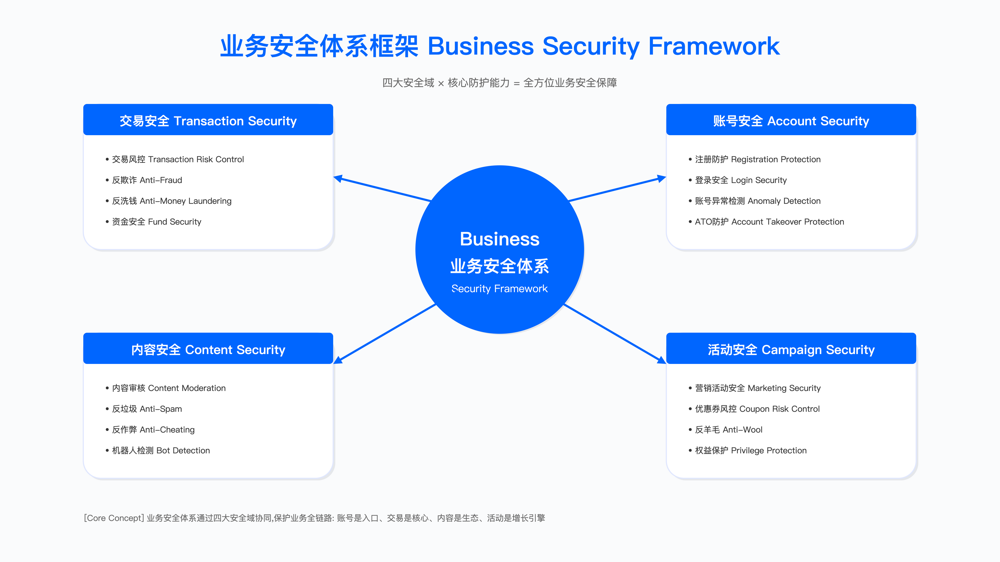
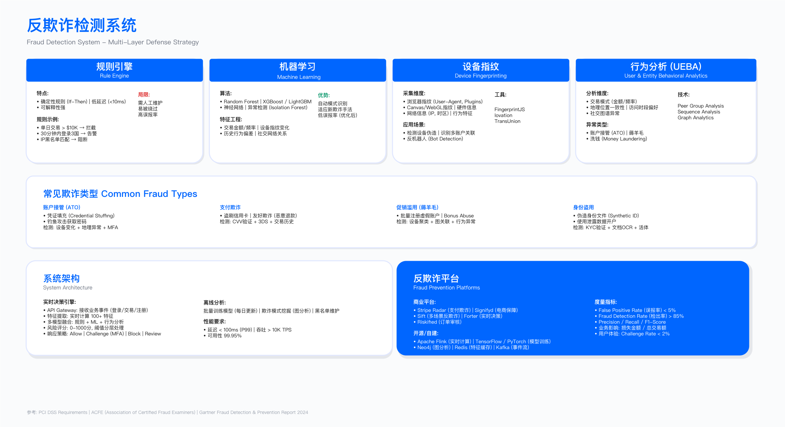

# 13.1 业务安全体系概览

## 决策约束：误拦成本与黑产损失的权衡

业务安全的核心矛盾在于风险控制与用户体验之间的张力。在某电商平台大促前的风控策略评审中，三个部门代表了典型的利益冲突：

业务负责人的关注点是 GMV 影响。误拦导致的订单损失直接计入业务损失，即使这些订单中部分可能是真实欺诈，但在财务核算上仍然被视为收入缺口。

风控负责人需要对抗有组织的黑灰产团伙。这类团伙通过设备指纹伪装、行为模拟、分布式账号等手段绕过检测，单纯放宽策略会导致损失扩大。

客服负责人承担误拦带来的投诉处理成本。正常用户被拦截后的申诉流程，需要增加客服人力、延长响应时间，间接影响用户满意度。

典型的决策框架包含三个方案维度：

- 严格风控方案：设定较低风险阈值，预期误拦率上升但黑产拦截效果提升
- 适度放宽方案：提高风险阈值降低误拦，但黑产可能利用更宽松的窗口
- 分层策略方案：根据用户分层（如 VIP 用户、新用户、活动高峰期）动态调整阈值

最终采用的方案通常是分层策略，但其有效性依赖于：
- 用户分层模型的准确性（VIP 用户标签、历史信用评分）
- 人工介入的响应速度（高峰期能否及时处理边缘案例）
- 实时监控能力（能否在黑产攻击开始后数小时内调整策略）



*图：业务安全体系框架，展示账号安全、交易风控、内容审核、活动防护四大支柱及其控制点*

## 定位约束：业务安全的组织困境

业务安全在企业中的尴尬处境源于其跨职能特性。不同于技术安全有明确的漏洞修复标准，业务安全的成功标准是灰度的：

与业务方的约束：
- 风控策略影响转化率，但转化率下降不一定由风控导致（也可能是产品体验、价格竞争等因素）
- 业务方期望风控"仅拦截黑产"，但黑产行为与正常用户行为在统计上存在重叠区域
- 大促等关键时期，业务方倾向于放宽风控以保证 GMV，但这正是黑产集中攻击的窗口期

与技术方的约束：
- 规则引擎需要低延迟（通常要求 P99 < 100ms），但复杂规则（如图关系查询）难以满足
- 机器学习模型需要大量特征工程，但特征计算本身增加系统复杂度和延迟
- 风控系统需要 7×24 小时高可用，但频繁的策略变更增加稳定性风险

与合规方的约束：
- 设备指纹、行为追踪等技术可能涉及用户隐私，需获得用户同意或在隐私政策中明确
- 风控模型使用的用户画像（如地理位置、消费习惯）可能被视为敏感数据处理
- 跨境电商场景下，不同国家对风控数据的留存和传输有不同要求（如 GDPR、PIPL）

### 业务安全与技术安全的本质差异

| 维度 | 技术安全 | 业务安全 |
|------|----------|----------|
| 目标对象 | 系统漏洞、配置缺陷 | 业务逻辑滥用、经济利益驱动行为 |
| 对抗特征 | 攻击者寻找漏洞利用点 | 黑产寻找成本收益比最优的滥用路径 |
| 防御方式 | 修复漏洞后相对稳定 | 对抗持续演化，黑产会快速适应新规则 |
| 成功标准 | 漏洞修复率、渗透测试通过率 | 损失率与误拦率的平衡点 |
| 验证方法 | 安全扫描、渗透测试 | A/B 测试、人工抽样、用户投诉率 |

关键约束：技术安全团队转型做业务安全时的主要障碍在于思维模式切换。技术漏洞有明确的 CVE 编号、CVSS 评分、修复方案，而业务安全面对的是灰度风险：同一行为在不同上下文中的风险等级不同（如新用户首单大额消费 vs. 老用户日常购买）。

某团队曾招聘渗透测试专家负责业务安全，其在首月提交了大量有效的应用安全漏洞，但对业务逻辑理解不足。当黑产利用"正常用户行为模拟"（如正常浏览商品、加入购物车、完成支付流程，但目标是薅取优惠券）绕过所有技术防护时，传统的漏洞挖掘思路无法应对。转型的关键在于理解攻击者的经济动机：黑产的成本结构（接码平台费用、设备成本、人力成本）与收益模型（优惠券变现、虚假流量售卖）。

## 组织困境：谁为误拦买单

### 决策博弈中的利益分配

在某次大促前的风控策略调整中，各方的核心诉求反映了组织内的利益冲突：

| 角色 | 核心诉求 | 关注指标 | 典型立场 |
|------|----------|----------|----------|
| 业务负责人 | GMV 最大化 | 订单转化率、误拦导致的订单损失 | 倾向于放宽风控策略 |
| 风控负责人 | 损失可控 | 黑产损失金额、风险事件数量 | 倾向于收紧策略 |
| 客服负责人 | 投诉量最小化 | 客服工单量、用户满意度 | 中立偏反对收紧（因误拦增加投诉） |
| CTO | 系统稳定性 | 系统可用性、延迟、变更风险 | 关注策略变更对系统的影响 |

常见误区：
1. 风控团队强推策略，结果被业务方抵制，最终策略无法上线
2. 风控团队完全妥协，导致黑产损失大幅上升，事后被追责
3. 缺乏量化数据支撑，决策基于主观判断，事后难以复盘

可行的决策机制：
1. 数据量化：将各方案的预期损失（黑产损失、GMV 损失、客服成本）量化，提供决策依据
2. 责任共担协议：明确各方承担的成本（如业务方承担部分误拦导致的 GMV 损失，风控方承担超出预期的黑产损失）
3. 联合指挥部：大促期间建立跨部门联合指挥机制，根据实时数据动态调整策略

某平台采用的责任共担机制包含：
- 业务方承诺：将一定比例的误拦 GMV 损失记为风控成本，不计入业务 KPI
- 风控方承诺：如果误拦率超过约定阈值，需补偿业务方部分 GMV 损失
- 客服方承诺：提前扩充人力应对大促期间的投诉增加
- 技术方承诺：提供专项技术支持，保障策略变更的稳定性

这一机制的核心是让各方在决策中有"皮肤在游戏中"（skin in the game），而非仅从自身 KPI 出发。

## 冷启动陷阱：无数据场景的建模约束

### 冷启动期的核心矛盾

新业务或新平台在上线前通常要求部署风控系统，但此时面临的约束包括：
- 无历史交易数据，无法训练监督学习模型
- 无黑产样本，不知道应该拦截哪些行为模式
- 无正常用户基线，无法评估误拦率的合理范围

某跨境电商平台在冷启动期尝试的方案及其约束：

| 方案 | 实施成本 | 主要约束 | 效果评估 |
|------|---------|----------|----------|
| 采购黑名单 | 服务费用约数十万/年 | 黑名单覆盖率有限，黑产会使用新设备、新 IP | 仅覆盖已知黑产，对新型攻击无效 |
| 借鉴同行规则 | 人力成本 | 业务差异导致规则不适用（如客单价、用户行为路径不同） | 误拦率高，需要大量调优 |
| 接入第三方风控 | 服务费用约数百万/年 | 成本高，且无法针对业务特性定制 | 效果依赖第三方数据质量 |
| 宽松策略观察 | 接受黑产损失 | 需要管理层同意接受一定损失以积累数据 | 可积累真实样本，但损失需可控 |

组合拳方案（某平台实际采用）：
1. 第 1-2 个月：采购基础黑名单和设备指纹服务，同时允许一定程度的黑产攻击以积累样本（需控制损失在可接受范围）
2. 第 3 个月：基于积累的黑产样本和正常用户样本，训练初版逻辑回归模型（AUC 可能不理想但可用）
3. 第 4-5 个月：持续迭代规则和模型，通过 A/B 测试验证效果
4. 第 6 个月：模型基本稳定，开始引入更复杂的模型（如 XGBoost、图神经网络）

关键约束：
- 冷启动期必须接受适度损失，这需要提前与管理层沟通预期
- 样本积累速度取决于业务量，低频业务（如 B2B 交易）冷启动期会更长
- 初期误拦率会较高，需要建立快速申诉和人工审核机制

验证方法：
- 定期人工抽样复核拦截样本，确认黑产识别准确性
- 监控用户投诉率和申诉成功率，评估误拦情况
- 设定每月损失率上限，超过阈值需要调整策略

## 技术军备竞赛：黑产对抗的演进速度

### 攻防演进的时间窗口压缩

某电商平台在不同时期的攻防对抗展示了技术军备竞赛的演进：

| 时期 | 黑产主要手法 | 防御措施 | 黑产破解时间窗口 | 防御响应时间要求 |
|------|-------------|----------|-----------------|-----------------|
| 2015-2017 | 手动操作、简单脚本 | IP 限制、手机号验证 | 数天至数周 | 数周内更新规则 |
| 2017-2019 | 自动化脚本、打码平台 | 验证码、设备指纹 | 数天 | 数天内部署新检测 |
| 2019-2021 | 众包分布式、设备群控 | 行为分析、关系图谱 | 24 小时内 | 3 天内更新模型 |
| 2021-2023 | AI 生成仿真行为 | 深度学习异常检测 | 12 小时内 | 1 天内紧急策略 |
| 2023-现在 | LLM 辅助、多模态伪造 | 多模态检测、实时对抗 | 数小时 | 2 小时内（接近极限） |

趋势约束：黑产破解时间从"周"级别缩短到"小时"级别，意味着：
1. 风控团队必须建立 7×24 小时值班机制（非口号，需要凌晨响应）
2. 策略发布流程必须极简化（从申请→审批→上线需在 2 小时内完成）
3. 自动化程度必须极高（人工操作无法满足响应速度要求）

真实约束案例：某平台在大促凌晨检测到新型黑产攻击，需要紧急更新模型，但面临以下时间约束：
- 模型训练：1 小时（需要重新训练或在线学习）
- 模型审核：30 分钟（合规要求，确保模型不引入偏见或隐私问题）
- 模型上线：30 分钟（灰度发布、验证、全量）

改进措施：
1. 紧急策略通道：高风险场景下，先上线规则拦截（5 分钟生效），再等模型上线
2. 在线学习：模型可以小批量实时更新，无需完整重训练
3. 自动化 A/B 测试：新策略自动灰度→评估→全量，无需人工审批（但需要设置自动回滚机制）

运行指标：
- 检测到攻击后的首次响应时间（目标：< 30 分钟）
- 策略上线后的拦截率提升（目标：> 50% 增量拦截）
- 误拦率变化（目标：不增加或增幅 < 10%）

## 业务安全的四大支柱：工程约束与验证

### 支柱 1：账号安全——二八法则与边际效应

某平台分析了过去三年拦截的百万级恶意账号，发现帕累托法则在账号安全中显著：

| 拦截策略 | 拦截占比（估算） | 误拦率（估算） | 实施成本 | 边际成本 |
|---------|---------------|-------------|---------|---------|
| 设备指纹黑名单 | 约 40-50% | 低 | 低（第三方服务） | 低 |
| IP 风险评分 | 约 20-30% | 中等偏低 | 低（第三方服务） | 低 |
| 注册行为异常 | 约 10-20% | 中等 | 中（需数据分析团队） | 中 |
| 手机号黑产库 | 约 5-15% | 低 | 中（采购+维护） | 中 |
| 深度学习模型 | 约 5-10% | 较高 | 高（算法团队+GPU） | 高 |

关键约束：
- 前 4 项"简单策略"可能覆盖大部分恶意账号，但深度学习模型成本最高且贡献最小
- 这并非意味着深度学习模型无用，而是应在前面策略不够用时才考虑（边际收益递减）

适用边界：
- 中小平台（日注册量 < 10 万）：前 3 项策略足够，无需投入深度学习
- 大型平台（日注册量 > 100 万）：前 4 项策略可能已到瓶颈，需要深度学习捕捉复杂模式

实施建议（分阶段）：
1. 第一阶段（3 个月）：设备指纹+IP 风险评分
2. 第二阶段（6 个月）：注册行为分析+手机号库
3. 第三阶段（12 个月）：深度学习模型（仅在前面策略无法满足时）

验证方法：
- 每个策略单独 A/B 测试，评估增量拦截率和增量误拦率
- 人工抽样复核拦截账号，确认黑产识别准确性
- 监控正常用户的注册成功率（确保策略未过度影响）

### 支柱 2：交易安全——总体成本优化

某支付平台的风控策略调整展示了误拦成本远高于黑产损失的典型场景：

决策约束：业务方要求将欺诈率从 0.8% 降至 0.5% 以下，风控方评估了激进收紧策略的总体影响：

假设年交易额为基准值，当前欺诈率 0.8%、误拦率 0.3%：
- 欺诈损失：占交易额的 0.8%
- 误拦正常交易导致的 GMV 损失：占交易额的 0.3%
- 客服成本、用户流失（CLV 损失）：额外成本

激进方案 A：收紧策略，预期欺诈率降至 0.4%，但误拦率可能升至 0.8%：
- 欺诈损失减少：从 0.8% 降至 0.4%（减少 0.4%）
- 误拦损失增加：从 0.3% 升至 0.8%（增加 0.5%）
- 客服成本、用户流失增加：进一步增加成本

结论：虽然欺诈率降低了，但总体损失（欺诈损失+误拦损失+客服成本+用户流失）反而增加。

最终采用的分层方案：
- 风险分 > 95：直接拦截（预期覆盖高置信度欺诈，误拦率极低）
- 风险分 85-95：人工审核（平衡拦截率与误拦率）
- 风险分 70-85：增强验证（如短信验证、人脸识别，不直接拦截）
- 风险分 < 70：直接放行

验证方法：
- A/B 测试不同阈值方案，监控总体成本（欺诈+误拦+客服）
- 人工审核样本的复核，评估人工审核准确性
- 用户申诉成功率，评估误拦情况

运行指标：
- 欺诈率（目标：< 0.5%，但不追求过低以免误拦激增）
- 误拦率（目标：< 0.3%）
- 总体成本（欺诈+误拦+客服+用户流失，目标：低于当前基线）



*图：欺诈检测系统架构，展示实时决策引擎、规则引擎、机器学习模型及人工审核的协同*

### 支柱 3：内容安全——误判容忍度与申诉机制

某社交平台的内容审核系统数据展示了机器审核的约束：

| 审核方式 | 日处理量 | 准确率（估算） | 成本 | 适用场景 |
|---------|---------|-------------|------|---------|
| 纯机器审核 | 百万级 | 约 80-90% | 低 | 文本、明确违规（如色情、暴力） |
| 机器初筛+人工 | 十万级 | 约 90-95% | 中 | 图片、视频 |
| 纯人工审核 | 万级 | 约 95-98% | 高 | 敏感内容、申诉复核 |

关键约束：机器审核准确率难以达到 100%，剩余的误判如何处理？

某平台尝试的方案对比：

方案 1：提高机器准确率（目标 95%）：
- 投入：新增算法团队，增加模型复杂度
- 结果：经过 6 个月优化，准确率从 85% 提升至 88%
- ROI 评估：投入产出比不理想（边际收益递减）

方案 2：接受误判，建立高效申诉机制：
- 投入：客服团队扩充，建立快速申诉流程
- 结果：用户满意度提升（关键在于申诉响应时间，而非零误判）
- ROI 评估：投入产出比正向

关键洞察：用户不期待平台"零误判"，他们期待的是"误判后能快速纠正"。将申诉响应时间从 2 天缩短至 2 小时，用户满意度显著提升。

验证方法：
- 申诉成功率（目标：> 80%，表明大部分申诉确实是误判）
- 申诉响应时间（目标：< 2 小时）
- 用户满意度调研（针对申诉用户的满意度）

### 支柱 4：活动安全——成本收益对抗

某电商平台 618 活动的羊毛党攻击展示了成本收益对抗的典型案例：

活动规则：新用户注册送 50 元无门槛优惠券

预期与实际对比：
- 预期：吸引一定量新用户，成本可控，带来 GMV 增长
- 实际：涌入大量"新用户"，其中多数是羊毛党，优惠券核销超预算数倍，真实 GMV 低于预期

羊毛党成本结构分析：
- 手机号验证：接码平台成本约 0.1 元/个
- 设备指纹：云手机群控成本约 50 元/设备（可重复使用）
- IP 限制：住宅代理 IP 池成本约 0.5 元/IP
- 行为分析：雇佣真人众包成本约 5 元/单

羊毛党总成本：约 6 元/单
羊毛党收益：50 元优惠券
净利润：约 44 元/单（收益远高于成本）

反击策略的演进：

第一版（失败）：单纯提高技术门槛
- 措施：增加图形验证码、设备指纹限制
- 结果：打码平台破解、群控模拟器绕过，无效

第二版（部分成功）：降低羊毛收益
- 措施：优惠券改为"满 100 减 50"（需凑单）、限制品类
- 结果：羊毛党凑单成本增加、变现难度增加，羊毛党数量减少约 60%

第三版（基本成功）：提高羊毛成本
- 措施：新用户需完成多个"任务"才能领券（浏览商品、加入购物车、关注店铺）、任务需间隔时间（总计约 10 分钟）、优惠券延迟生效（7 天后可用）
- 结果：羊毛党单账号操作成本从 6 元提升至约 15 元，利润下降至约 35 元，部分羊毛党放弃

关键约束：
- 技术对抗是军备竞赛，黑产会持续升级工具（如自动化浏览、模拟点击）
- 降低羊毛收益或提高羊毛成本，比单纯技术对抗更有效
- 最优策略：让羊毛成本接近收益（利润空间压缩至黑产不愿投入）

验证方法：
- 监控新用户注册后的行为路径（正常用户 vs. 羊毛党的行为差异）
- 优惠券核销率和实际 GMV 转化率（羊毛党核销但不产生真实 GMV）
- 成本监控：优惠券成本、防护成本、误拦导致的用户流失

## 组织架构：集中式与分布式的权衡

### 模式演进中的约束

模式 1：集中式（某平台 2018-2020 年）

组织结构：成立独立的"业务安全部"，集中管理所有风控能力

约束：
- 响应速度慢：业务方提需求→风控排期→数周后上线（无法满足业务快速迭代需求）
- 业务理解不足：风控团队不理解业务细节，策略误拦率高
- 业务方抵触：觉得风控"不接地气"，矛盾激化

失败案例：某次大促前，业务方提出放宽限制需求，风控团队以风险过大为由拒绝。大促当天误拦导致业务方损失大量 GMV，业务方直接向 CEO 投诉。

模式 2：分布式（某平台 2020-2021 年）

组织调整：拆分风控团队，每个业务线配备专职风控人员

约束：
- 重复建设：每个业务线都建自己的风控平台（规则引擎、模型平台重复建设）
- 工具碎片化：不同业务线使用不同的规则引擎和模型框架
- 成本高：设备指纹等服务各自采购，年成本显著增加
- 能力参差：有的业务线风控能力强，有的很弱
- 情报不共享：某业务线发现的新型黑产手法，未及时通知其他业务线

失败案例：社交业务线发现新型黑产手法，但未及时通知电商业务线，导致电商也被攻击，损失大量资金。

模式 3：混合式（某平台 2021 年至今）

组织调整：建立"风控中台+BISO"模式
- 风控中台：提供统一的规则引擎、模型平台、设备指纹、数据平台（避免重复建设）
- BISO（业务安全伙伴）：深入各业务线，定制化策略（贴近业务需求）

效果：
- 避免重复建设，基础能力成本降低约 40%
- BISO 机制让风控更贴近业务，误拦率显著降低
- 跨业务线威胁情报共享，响应速度提升

新问题：
- BISO 的汇报线模糊（向业务方汇报还是风控中台？）
- BISO 容易被业务方"绑架"，过度妥协风险要求
- 中台团队觉得自己"不被业务重视"

解决方案：
1. 明确汇报线：BISO 的考核由风控中台和业务方共同决定（双线汇报）
2. 设置红线：某些风控策略（如反洗钱、合规要求）不可妥协，BISO 无权放宽
3. 定期轮岗：BISO 每 2 年轮换业务线，避免过度本地化

适用边界：
- 中小企业（业务线 < 3 个）：集中式可能更高效
- 大型企业（业务线 > 5 个）：混合式更适合，但需要明确的治理机制

### 行业企业组织架构对比案例

以下是不同规模与业务类型企业的业务安全组织架构对比，供参考选型：

> **数据来源说明**：以下案例基于公开行业报告、企业安全团队分享会议、以及作者对多家企业的调研访谈整理而成。企业名称已做匿名化处理（A-F 代号），具体数字为近似值或区间估算，反映行业典型情况而非精确统计。不同企业的实际情况可能因业务规模、行业特性、发展阶段等因素有所差异。

| 企业类型 | 组织模式 | 团队规模 | 汇报线 | 核心优势 | 主要挑战 |
|---------|---------|---------|--------|---------|---------|
| 头部电商 A | 混合式（中台+BISO） | 200+ 人 | 双线汇报 | 能力复用、业务贴合 | BISO 归属模糊、协调成本高 |
| 头部电商 B | 集中式（风控部） | 150+ 人 | CRO | 统一标准、资源集中 | 业务响应慢、容易脱节 |
| 金融科技 C | 分布式（事业部制） | 各 BU 15-30 人 | 各 BU 负责人 | 业务理解深、响应快 | 重复建设、标准不一 |
| 社交平台 D | 集中式+嵌入式 | 100+ 人 | CSO | 统一能力、灵活部署 | 人员调配复杂 |
| 跨境电商 E | 外包+核心团队 | 核心 20 人 | COO | 成本可控、灵活 | 能力积累慢、依赖供应商 |
| 游戏公司 F | 项目制 | 按项目配置 | 项目负责人 | 高度定制、灵活 | 经验难以复用 |

**头部电商 A 案例（混合式）**：

组织架构：
- 风控中台（80 人）：规则引擎、模型平台、设备指纹、数据平台
- BISO 团队（120 人）：分布在电商、支付、物流、社交等业务线，每线 20-30 人
- 汇报机制：BISO 双线汇报（虚线向业务负责人，实线向风控中台负责人）

效果与挑战：
- 优势：基础能力年成本节省约 40%，策略响应时间从 2 周缩短至 3 天
- 挑战：BISO 考核标准争议（业务方希望以误拦率为主，中台希望以拦截率为主）
- 解决方案：联合 KPI 机制，拦截率与误拦率各占 50% 权重

**金融科技 C 案例（分布式）**：

组织架构：
- 各事业部独立风控团队：信贷 BU（30 人）、支付 BU（25 人）、理财 BU（15 人）
- 无统一中台，各 BU 自建规则引擎和模型平台
- 汇报机制：直接向各 BU 负责人汇报

效果与挑战：
- 优势：对业务理解深入，策略与业务高度适配
- 挑战：三套规则引擎年维护成本约增加 60%，黑产情报不共享导致跨 BU 攻击
- 改进措施（进行中）：建立轻量级情报共享机制，统一设备指纹服务

**跨境电商 E 案例（外包+核心团队）**：

组织架构：
- 核心团队（20 人）：策略制定、供应商管理、复杂案例处理
- 外包团队（按量付费）：第三方风控服务、人工审核
- 汇报机制：向 COO 汇报

效果与挑战：
- 优势：初期投入低，快速启动（3 个月内上线）
- 挑战：核心能力积累慢，对供应商依赖度高
- 适用阶段：初创期或快速扩张期，待业务稳定后逐步自建

**组织模式选择决策树**：

```
业务线数量 ≤ 3？
├── 是 → 集中式（统一管理，效率高）
└── 否 → 业务线差异大吗？
    ├── 是 → 混合式（中台+BISO）
    └── 否 → 分布式或集中式均可
        └── 成本敏感？
            ├── 是 → 集中式（避免重复建设）
            └── 否 → 分布式（业务响应更快）
```

**组织转型路径建议**：

| 当前状态 | 目标状态 | 转型周期 | 关键动作 |
|---------|---------|---------|---------|
| 无专职团队 | 集中式 | 6-12 个月 | 招聘核心团队、接入第三方服务 |
| 集中式 | 混合式 | 12-18 个月 | 建立中台能力、培养 BISO 人才 |
| 分布式 | 混合式 | 18-24 个月 | 统一基础平台、明确 BISO 职责 |
| 外包依赖 | 自建团队 | 12-24 个月 | 渐进式自建、平滑过渡 |

## 团队能力：业务理解比算法能力更稀缺

某平台 2020 年招聘复盘展示了不同背景人才的实际表现：

| 候选人背景 | 预期 | 6 个月后实际表现 | 核心约束 |
|-----------|------|----------------|---------|
| 名校 ML 博士 | 高 | 模型设计优秀，但特征工程依赖他人，业务理解不足 | 缺乏业务直觉，难以设计有效特征 |
| BAT 高级开发 | 高 | 规则引擎、实时计算设计优秀，但缺乏业务直觉 | 技术能力强，但不懂黑产手法 |
| 电商运营转风控 | 中 | 最懂黑产，能快速识别新型攻击，与业务沟通无障碍 | 技术能力需培养 |
| 前黑产从业者 | 未知 | 对黑产手法了如指掌，是团队的"黑产顾问" | 需要合规审查 |

关键洞察：业务理解和黑产研究能力远比算法能力更稀缺。算法能力可以通过培训和工具弥补，但业务直觉需要长期积累。

招聘策略调整：
1. 算法岗：不要求顶会论文，但要求快速理解业务（给真实案例，1 周内提出可行方案）
2. 策略岗：优先考虑有运营/产品/黑产背景的人
3. 开发岗：必须有高并发、实时计算经验
4. 最稀缺：懂业务+懂技术+懂黑产的"三栖人才"（通常需要高薪挖掘）

验证方法：
- 面试环节：给真实业务案例，评估候选人的业务理解能力
- 试用期：3 个月内是否能独立设计策略并上线
- 长期评估：策略的拦截率、误拦率、被黑产绕过的频率

## 从 0 到 1 的实施路径：阶段性约束

### 第一阶段（0-6 个月）：快速止血

初始状态：新成立的业务安全团队，团队规模小（如 3 人），无任何系统

第 1 个月：快速接入第三方服务：
- 任务：接入设备指纹服务（选择接入速度快、文档完善的供应商）
- 成本：年费约数十万
- 效果：可拦截已知黑产设备，但对新设备无效
- 约束：误拦率可能较高（约 3%），需要业务方理解和支持

第 2 个月：建立基础规则：
- 任务：编写基础规则（IP 黑名单、频率限制、异常行为检测）
- 技术选型：初期可用脚本（Python/JavaScript），无需规则引擎（快速上线）
- 效果：拦截率提升，误拦率下降
- 约束：规则写死在代码里，修改需要发布代码（响应慢）

第 3 个月：搭建规则引擎：
- 技术选型：开源规则引擎（如 Drools，文档多、学习成本低）
- 迁移工作：将现有规则迁移到规则引擎
- 效果：策略发布时间从数天缩短至数小时
- 约束：开源规则引擎性能可能不够（如 P99 延迟 > 100ms），需要优化

第 4 个月：优化性能：
- 方案：引入缓存（如 Redis）减少规则引擎查询延迟
- 效果：延迟降低
- 约束：缓存更新延迟可能导致黑产绕过（缓存一致性问题）

第 5-6 个月：建立监控和反馈：
- 任务：搭建监控大盘（如 Grafana）、对接告警（如钉钉、PagerDuty）
- 效果：实时看到拦截率、误拦率、风险事件
- 里程碑：6 个月后，欺诈损失率从高水平降至中等水平，误拦率约 1%

第一阶段约束：
- 技术债务严重（如规则引擎性能问题、缓存架构不合理）
- 团队人力紧张，7×24 值班压力大
- 但可快速见效，为后续投入争取支持

### 第二阶段（6-12 个月）：建立模型

第 7 个月：数据准备：
- 约束：训练模型需要标注样本，但初期无标注数据
- 方案：用现有规则拦截的样本作为"正例"，随机抽取放行样本作为"负例"
- 验证：人工复核样本，确认标注准确率 > 90%
- 成本：外包标注或内部人工标注

第 8 个月：特征工程：
- 约束：不知道应该使用哪些特征（用户特征、设备特征、行为特征、交易特征）
- 方案：列出所有可能特征（如 200 个），用特征重要性筛选（如保留 50 个）
- 关键发现：某些特征（如设备关联账号数、注册到首次交易时间）对模型贡献最大

第 9-10 个月：模型训练与 A/B 测试：
- 模型选型：逻辑回归（基线，可解释性强）→ XGBoost（提升效果）
- A/B 测试：灰度 10% 流量 2 周，监控拦截率、误拦率、系统延迟
- 决策：如果拦截率提升且误拦率不增加，全量上线

第 11-12 个月：持续迭代：
- 模型更新频率：每周或每月重训练（自动化）
- 特征迭代：新增特征、淘汰无效特征
- 效果：模型 AUC 逐步提升，欺诈损失率下降

第二阶段约束：
- 模型需要持续维护，自动化程度不够会增加人力负担
- 黑产开始针对模型进行对抗（如试探模型边界）

### 第三阶段（12-18 个月）：体系化

第 13-14 个月：图神经网络（可选）：
- 业务需求：检测团伙欺诈（多个账号共享设备/IP/地址）
- 技术方案：构建关系图谱（如 Neo4j）、训练 GNN 模型（如 GraphSAGE）
- 效果：可识别团伙账号
- 约束：GNN 推理延迟高（如 500ms），无法用于实时决策（可用于离线批处理）

第 15-16 个月：实时特征平台：
- 约束：特征计算分散在各处，维护困难
- 技术方案：用流处理框架（如 Flink）统一计算实时特征，存储在高速数据库（如 Redis/Aerospike）
- 效果：特征计算延迟降低，特征复用率提升

第 17-18 个月：全链路风控：
- 事前：黑名单预防、风险预警
- 事中：实时拦截、分级处理
- 事后：损失追回、黑产打击（与执法部门合作）

第三阶段约束：
- 体系化能力建设完成，但团队规模扩大，成本上升
- 黑产对抗进入新阶段（如 AI 生成内容），需要持续演进

## 效果评估：指标设计的约束

### 指标设计中的常见陷阱

| 指标 | 理想定义 | 现实约束 | 实际做法 |
|------|---------|---------|---------|
| 欺诈损失率 | 欺诈损失/总 GMV | 分母可以"做大"来降低比率，掩盖绝对损失 | 同时看绝对值和比率，设置红线（如绝对损失超过阈值必须解释） |
| 拦截率 | 拦截欺诈订单数/总欺诈订单数 | 无法精确知道"总欺诈订单数"（只能估计） | 用人工抽样校准，承认统计误差 |
| 误拦率 | 误拦正常订单/总正常订单 | 部分用户被误拦后不会投诉，误拦被低估 | 用客服投诉+人工回访双重验证 |
| ROI | (损失减少-成本)/成本 | "损失减少"是假设值，无法验证 | 保守估计，向上汇报时说明假设前提 |

真实案例：某季度风控汇报的两个版本：

对外汇报版本（给 CEO 的）：
- 欺诈损失率：从 0.8% 降至 0.5%，下降 37.5%
- 拦截金额：累计数千万
- ROI：约 10:1

内部复盘版本（团队自我评估）：
- 欺诈损失率：从 0.8% 降至 0.5%，但 GMV 增长了 50%（分母变大，绝对损失未必大幅下降）
- 拦截金额：包含一定比例的误拦，实际拦截的欺诈金额需要扣除误拦部分
- ROI：基于假设计算（假设无风控时损失会达到某高值，实际可能没那么高）

原则：
- 对外汇报：适度包装，但不撒谎（数据可验证）
- 对内复盘：实事求是，承认局限性（便于改进）

### A/B 测试：最诚实的评估方法

标准 A/B 测试流程：

实验配置：
- 实验名称：新欺诈模型 vX.X
- 基线组（A）：当前模型
- 实验组（B）：新模型
- 流量分配：50% vs. 50%（按用户 ID 哈希，确保同一用户始终在同一组）
- 评估指标：
  - 主要指标：欺诈损失率、误拦率
  - 次要指标：客服投诉量、用户转化率
  - 护栏指标：系统可用性、P99 延迟（不能因新模型导致系统不稳定）
- 实验时长：14 天（包含 2 个周末，覆盖不同流量模式）
- 最小样本量：需达到统计显著性要求

决策规则：
- 全量上线：欺诈损失率降低 > 10% 且误拦率不增加
- 继续优化：效果不显著
- 回滚：误拦率增加 > 20% 或护栏指标超限

实际案例：某新模型 A/B 测试结果（14 天）

| 指标 | 基线组 | 实验组 | 差异 | 统计显著性 |
|------|--------|--------|------|-----------|
| 欺诈损失率 | 0.52% | 0.48% | -7.7% | 显著 |
| 误拦率 | 0.61% | 0.58% | -4.9% | 接近显著 |
| 客服投诉 | 基准值 | 略下降 | -1.7% | 不显著 |
| P99 延迟 | 45ms | 52ms | +15.6% | 显著 |

决策讨论：
- 欺诈损失率降低，但 P99 延迟增加 15.6%（从 45ms 到 52ms）
- 延迟增加可能影响用户体验（虽然仍在可接受范围，但趋势不好）
- 最终决策：暂缓全量上线，先优化延迟问题，2 周后重新测试

关键教训：
- A/B 测试不是"走形式"，要真正用数据决策
- 护栏指标（延迟、可用性）同样重要，不能只看主要指标
- 有时候"不上线"也是正确的决策（避免引入新问题）

## 常见挑战：误判检测与跨部门协作

### 挑战：误拦率被低估

约束：如何知道真实的误拦率？

方法 1：客服投诉（被动，严重滞后）：
- 仅有约 30% 被误拦用户会投诉（多数用户会直接放弃）
- 投诉到处理平均延迟数天
- 结果：误拦率被严重低估

方法 2：人工抽样（主动，但成本高）：
- 每天随机抽取一定量拦截订单
- 人工复核是否误拦
- 成本：需要人工审核团队

方法 3：用户召回率（间接指标）：
- 观察被拦用户的后续行为：真实用户可能尝试申诉/联系客服，黑产通常直接放弃
- 局限性：部分真实用户也会直接放弃（尤其是首次购买用户）

综合方案：

| 风险等级 | 处理方式 | 误拦检测方法 | 响应时间要求 |
|---------|---------|-------------|-------------|
| 高风险（>90 分） | 直接拦截 | 100% 人工抽样复核 | 2 小时内 |
| 中风险（70-90 分） | 人工审核 | 审核员复核+用户申诉 | 30 分钟内 |
| 低风险（50-70 分） | 增强验证（不直接拦截） | 用户完成验证率监控 | 实时 |
| 正常（<50 分） | 直接放行 | 事后抽样（约 1%） | 1 天内 |

效果：
- 真实误拦率得到更准确估计（之前被低估）
- 误拦发现时效缩短
- 用户满意度提升

### 挑战：跨部门协作中的利益冲突

典型矛盾：

| 部门 | 核心诉求 | 与风控的冲突 |
|------|---------|------------|
| 业务方 | GMV 最大化 | 风控策略影响转化率 |
| 客服方 | 投诉量最小化 | 误拦导致投诉激增 |
| 技术方 | 系统稳定性 | 风控策略导致系统复杂度和延迟增加 |
| 法务方 | 合规零风险 | 风控策略可能涉及隐私问题（如设备指纹、行为追踪） |

真实冲突案例：大促前夕风控团队发现新型黑产，建议收紧策略：
- 业务方：强烈反对（大促期间不能影响用户体验）
- 客服方：中立（但要求提前扩充人力应对投诉）
- 技术方：担忧（新策略可能影响稳定性，大促期间禁止变更）
- 法务方：要求法务评审（新策略涉及用户行为分析）

可行的协作机制：

第 1 步：数据量化，利益可视化

将各方案的预期影响量化：
- 不收紧：黑产损失预估值、GMV 不受影响
- 完全收紧：黑产损失减少预估值、GMV 损失（误拦导致）
- 分层收紧：黑产损失中等、GMV 损失较小

第 2 步：责任共担协议

协议内容：
1. 业务方承诺：承担部分误拦导致的 GMV 损失（不计入业务 KPI）
2. 风控方承诺：如果误拦超出约定阈值，需补偿业务方
3. 客服方承诺：提前扩充人力应对投诉
4. 技术方承诺：提供专项支持，保障策略稳定上线

第 3 步：建立联合指挥部

大促期间：
- 跨部门联合值班（业务、风控、客服、技术）
- 每 2 小时同步数据，根据实际情况动态调整
- 异常情况 30 分钟内联合决策

关键教训：
- 跨部门协作的本质是利益协调，而非技术问题
- 用数据量化利弊，让各方理性决策
- 责任共担让各方都有"皮肤在游戏中"
- 联合指挥部让决策更快速、更灵活

## 常见误区与澄清

**误区一：技术防护越强越好**

许多团队认为增加更多技术检测手段（如复杂的深度学习模型、多层验证流程）就能更好地对抗黑产。实际上，过度的技术防护会显著提升正常用户的使用摩擦，导致误拦率上升。业务安全的核心是风险与体验的平衡，而非单纯追求高拦截率。有效的策略是分层处理：对高风险用户实施强验证，对低风险用户尽量无感通过。

**误区二：算法团队是业务安全的核心**

从招聘实践来看，业务理解能力和黑产研究能力比算法能力更稀缺。算法可以通过工具和框架快速实现，但对黑产攻击模式的理解、对业务流程的熟悉需要长期积累。优秀的业务安全团队需要算法工程师、策略分析师、业务专家的组合，而非纯算法导向。

**误区三：规则引擎已过时，应全面转向机器学习**

规则引擎和机器学习模型各有优势：规则引擎响应速度快（毫秒级）、可解释性强、便于合规审查；机器学习模型擅长处理复杂模式、自动适应变化。实践中，规则引擎通常覆盖大部分场景（黑名单、频率限制、合规规则），机器学习模型作为补充处理边界模糊的案例。完全依赖机器学习会丧失可解释性和快速响应能力。

**误区四：A/B 测试只是走形式**

A/B 测试是评估风控策略效果的最可靠方法，但许多团队将其视为上线前的"流程合规"而非真正的决策工具。有效的 A/B 测试需要明确的评估指标、足够的样本量、合理的实验周期，并且要严格按照数据结果决策，而非预设结论。护栏指标（如系统延迟、可用性）同样重要，不能只看主要业务指标。

**误区五：ROI 计算可以精确量化**

业务安全的 ROI 计算基于假设："如果没有风控系统，损失会是多少"。这一假设无法验证，因此 ROI 数字本质上是估算值。对外汇报时可以适度包装（但数据需可验证），对内复盘时应实事求是，承认计算的局限性。过度追求 ROI 数字的"好看"可能导致决策偏差。

## 本节小结：业务安全的核心约束

基于实践经验，业务安全的核心约束包括：

1. 误拦成本约束：误拦成本往往高于黑产损失，需要平衡拦截率与误拦率
2. 业务理解约束：业务理解比算法能力更重要，团队需要懂业务的人才
3. 冷启动约束：冷启动期必须接受适度损失以积累数据
4. 二八法则约束：约 80-90% 的效果来自少数简单策略，复杂模型是边际收益
5. 模型衰减约束：模型会衰减，必须建立持续监控和更新机制
6. 误拦检测约束：真实误拦率往往被低估，需要主动检测而非被动等投诉
7. 跨部门协作约束：利益协调比技术难度更高，需要责任共担机制
8. 成本收益对抗：与黑产的对抗是成本收益博弈，让羊毛成本接近收益是有效策略
9. ROI 约束：需要用数据证明价值，但 ROI 计算基于假设，需要承认局限性
10. 响应速度约束：黑产破解时间缩短至小时级，风控响应必须极快

适用边界：
- 本节内容主要适用于有一定规模的互联网业务（日活 > 10 万或 GMV > 千万级）
- 小型企业可先采用第三方风控服务，待业务规模增长后再自建
- B2B 业务与 C2C 业务的风控策略有显著差异，需要根据业务特性调整

验证方法：
- 定期 A/B 测试评估策略效果
- 人工抽样复核拦截样本
- 监控用户投诉率和申诉成功率
- 建立 ROI 模型，评估投入产出比

运行指标：
- 欺诈损失率（目标：根据业务可接受范围设定）
- 误拦率（目标：< 1%）
- 拦截率（目标：> 80% 已知欺诈）
- 响应速度（检测到攻击后首次响应时间 < 30 分钟）
- 客服投诉率（目标：不因风控策略导致投诉激增）

---

## 导航

**[← 上一节：13.0 执行摘要](./13.0_executive_summary.md)** | **[返回章节目录](./README.md)** | **[下一节：13.2 账号安全 →](./13.2_account_security.md)**

---

**© 2025 AI-ESA Project. Licensed under CC BY-NC-SA 4.0**

