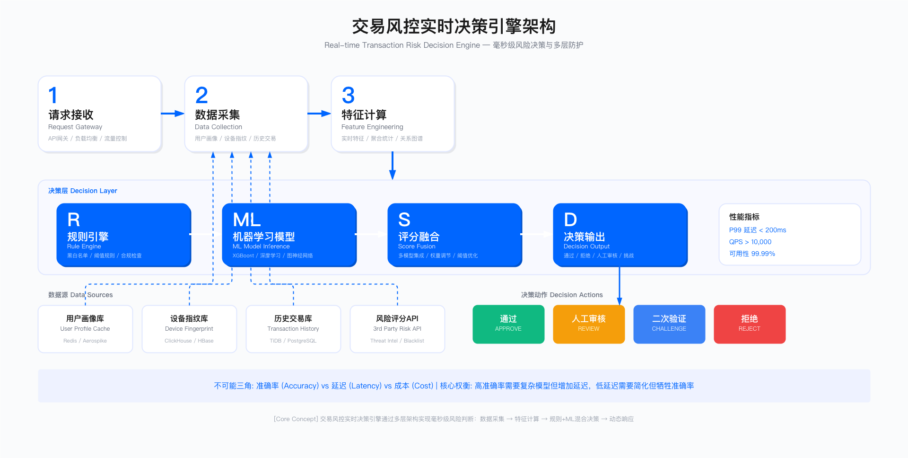

# 13.3 交易风控与反欺诈

## 交易风控的核心困境

交易风控系统需要在毫秒级内对交易请求做出放行或拦截决策，同时平衡三个相互冲突的目标：高准确率（减少欺诈损失）、低延迟（不影响用户体验）与可控成本。这三者构成了风控系统设计的核心约束，也是大多数风控系统失败的根本原因。

### 不可能三角：准确率、延迟与成本

任何实时风控系统都面临相同的权衡困境。提高准确率通常需要更复杂的特征计算和模型推理，这会增加延迟；降低延迟可以使用简单规则，但会牺牲准确率；同时，高性能基础设施会显著增加成本。

从业务视角看，高峰期的系统表现与日常测试结果往往存在显著差距。在流量激增时，数据库查询延迟上升、缓存命中率下降、CPU 竞争加剧，这些因素叠加后，原本设计为 100ms 的决策延迟可能膨胀至 200-300ms，超过用户耐受阈值，直接导致支付成功率下降。

**适用边界**：实时交易风控适用于日活跃交易量在万级以上的平台，这类平台面临明确的欺诈损失与用户体验压力，投入风控系统具有正向 ROI。对于低频交易场景（如 B2B 采购）或对延迟不敏感的后台审核流程，复杂的实时风控系统可能成本过高，使用异步审核或人工抽查更为经济。

**关键约束**：实时决策场景通常要求 P99 延迟低于 200ms，否则会影响支付成功率。高并发下的特征计算、模型推理与数据存储成本线性增长，需要权衡精度与资源投入。误拦率每提高 1 个百分点，可能导致大量正常用户流失。此外，风控系统的建设与运营需要跨职能团队（算法、工程、业务、运营）协作，组织能力不足是常见的落地障碍。



*图：交易风控实时决策引擎架构，展示从请求接收、数据采集、特征计算到规则引擎与ML模型混合决策的完整流程*

### 实时决策引擎的架构设计

典型的实时风控决策引擎包含以下核心环节：请求接收、数据采集、特征计算、规则引擎判断、机器学习模型推理、决策输出。每个环节的延迟累加后，构成端到端的决策时间。

数据采集阶段通常需要从多个数据源（用户画像缓存、设备指纹库、历史交易记录、第三方风险评分 API）获取上下文信息。在高并发场景下，数据库与缓存的查询延迟会从个位数毫秒上升至数十毫秒，这是 P99 延迟超标的主要原因之一。

特征计算阶段需要对原始数据进行聚合与转换，生成供模型使用的特征。常见的特征包括：用户最近 N 天的交易统计、设备关联账号数量、IP 地址风险评分等。复杂特征（如图谱关系、序列行为）的计算成本较高，需要权衡特征价值与计算开销。

规则引擎与模型推理采用混合决策架构。规则引擎处理明确的黑白名单逻辑与合规要求，响应快且可解释性强；机器学习模型处理复杂的模式识别任务，准确率更高但推理时间较长。两者结合可以在延迟与准确率之间取得平衡。

**验证方法**：风控策略上线前需要经过多层验证。离线测试在历史数据上评估模型 AUC、准确率、召回率，但需注意离线指标与线上表现存在差距。小流量 A/B 测试在 5-10% 的真实流量上验证新策略，监控误拦率、漏放率与延迟变化。压力测试模拟高峰期流量，评估系统在极端 QPS 下的 P99 延迟与资源消耗。红队测试由攻击模拟团队尝试绕过风控策略，发现规则盲区。

**运行指标**：风控系统的运行指标分为三类。性能指标包括 P50/P99 延迟、QPS 处理能力与系统可用性。准确性指标包括误拦率（FPR）、漏放率（FNR）与模型 AUC。业务指标包括欺诈损失金额占交易额比例与用户投诉率。

### 常见误区

误区一：过度依赖离线测试结果。离线测试中的 AUC 可能高达 0.90-0.95，但上线后由于数据分布漂移、特征泄漏或对抗性攻击，实际效果可能下降至 0.70-0.80。必须在真实流量上进行 A/B 测试，并持续监控线上指标。

误区二：忽略高峰期性能表现。日常测试环境的 QPS 往往远低于业务高峰期，导致延迟评估严重失真。在大促、节假日等场景下，系统负载可能是平时的 10-100 倍，必须提前进行压力测试并准备降级预案。

误区三：误拦成本被低估。拦截一笔欺诈交易可以避免数百至数千元损失，但误拦一笔正常交易会导致用户流失、投诉与补偿成本。在业务增长期，误拦成本往往高于欺诈损失，需要动态调整风控阈值。

误区四：特征泄漏未被识别。训练数据中包含未来信息（如使用交易完成后的拒付标签、人工审核结果等）会导致模型在离线测试中表现优异，但上线后完全失效。必须严格检查特征的时间依赖性，确保特征在预测时刻可获得。

误区五：对抗性攻击准备不足。黑产团伙会通过 A/B 测试等方式探测风控策略边界，并针对性地调整攻击手段。风控模型需要频繁更新（周级别），并引入随机性与多样性以增加攻击成本。

---

## 特征工程：从理论到生产可用

特征工程是风控模型效果的决定性因素。设计优质特征需要对业务逻辑、用户行为与黑产手法的深刻理解，同时必须考虑特征的计算成本、稳定性与对抗性。

### 特征设计的核心原则

业务可解释性：每个特征都应该能用业务语言解释其与欺诈行为的关联。例如，"设备关联账号数"反映了设备复用的异常行为，"账号年龄"反映了新注册账号的高风险特征。可解释性不仅有助于模型调试，也是向业务方与监管机构证明决策合理性的基础。

计算成本可控：特征计算不应占用过多的决策延迟与存储资源。需要优先选择低成本特征（如账号年龄、交易金额），对于高成本特征（如多跳图谱关系、长时间窗口聚合）需要进行离线预计算或仅在高风险请求中使用。

对抗性稳定：特征应尽量难以被黑产团伙伪造或规避。例如，基于设备指纹、行为序列的特征比单纯依赖 IP 地址更难被绕过。同时，需要定期更新特征，避免黑产摸清规律后批量绕过。

时间稳定性：特征的分布不应随时间发生剧烈变化。疫情、大促等特殊时期可能导致用户行为模式改变，需要建立特征监控机制，及时发现分布漂移并重新训练模型。

### 生产环境的特征分类

用户画像特征：账号注册时长、历史交易次数、平均交易金额、信用评分等。这类特征计算成本低，可从用户画像缓存中快速获取，适合作为基础特征。

设备与网络特征：设备指纹、设备关联账号数、IP 地址风险评分、地理位置异常等。设备指纹需要客户端 SDK 采集，IP 风险评分通常依赖第三方数据。这类特征对机器注册、撞库攻击有较强识别能力。

交易行为特征：交易金额、交易时间、收货地址变更、浏览到下单时长等。需要注意时间窗口的选择：过短的窗口（如最近 1 小时）会受到流量波动影响，过长的窗口（如最近 30 天）会延迟对新攻击的响应。

关系图谱特征：用户-设备-IP-地址的关联关系、资金流转路径等。图谱特征对团伙欺诈识别效果显著，但计算成本高，通常用于离线分析或高风险场景的二次决策。

### 特征泄漏的识别与规避

特征泄漏是模型上线失败的最常见原因。以下是典型的泄漏场景：

未来信息泄漏：在训练时使用了预测时刻之后的数据。例如，使用交易完成后 30 天内是否发生拒付作为标签，但特征中包含"交易状态"字段（已发货 / 已签收），这些状态在预测时刻尚未产生。

人工审核结果泄漏：将人工审核标记（已审核 / 未审核）作为特征，但审核本身就是基于风险判断，与标签强相关。这会导致模型学习到"被审核 = 高风险"的虚假模式，而非真正的欺诈特征。

样本选择偏差：训练数据仅包含已拦截的交易，未拦截的交易中可能存在大量未被发现的欺诈案例。这会导致模型低估某些攻击模式的风险。应定期对放行样本进行人工抽检与标注。

**规避方法**：防止特征泄漏需要多重保障。首先，严格的时间切分——训练集与测试集按时间顺序分割，测试集必须晚于训练集。其次，特征可用性检查——对每个特征标注其在预测时刻的可用状态，禁止使用未来特征。最后，离线-在线一致性测试——在线上环境记录特征实际值，与离线训练数据对比，发现不一致。

### 特征分布漂移的监控与应对

特征分布会因用户行为变化、业务策略调整、黑产手法演进而发生漂移。需要建立特征监控体系：

统计分布监控：定期（每日或每周）计算特征的均值、方差、分位数，与历史基线对比。显著偏离（如超过 3 个标准差）应触发告警。

模型性能监控：监控线上模型的 AUC、准确率、召回率等指标。性能下降超过阈值（如 AUC 下降 5%）应触发模型重训练流程。

对抗性漂移检测：黑产会针对性地调整攻击手法以规避检测。需要结合威胁情报与人工分析，识别新型攻击模式，并快速更新特征与规则。

**应对策略**：应对特征漂移需要自动化机制。自动化重训练每周或每两周使用最新数据重训练模型，保持对最新模式的敏感性。在线学习引入增量学习机制，使模型能够持续从新数据中学习，但需防止对抗样本污染。特征衰减权重对历史数据应用时间衰减，使模型更关注近期模式。

---

## 机器学习模型的工程化落地

机器学习模型在风控场景中的应用需要解决离线训练与在线推理的一致性、模型可解释性、快速迭代能力等工程化挑战。

### 离线训练与在线推理的差距

离线测试环境与生产环境存在多方面差异，导致模型效果失真：

数据分布差异：训练数据通常是历史数据，但线上数据的分布可能因季节性、营销活动、黑产策略变化而显著不同。需要尽可能使用近期数据训练，并在测试集中模拟线上流量特征。

特征一致性问题：离线训练时使用批处理计算特征，线上推理时使用实时计算，两者的实现逻辑可能不一致（如聚合窗口定义、缺失值填充策略）。必须建立特征平台，统一离线与在线的特征计算逻辑。

延迟与资源约束：离线训练可以使用大规模集群与复杂模型，但线上推理受限于毫秒级延迟要求与单机资源。需要进行模型压缩（如剪枝、量化）或使用轻量级模型（如逻辑回归、浅层 XGBoost）。

### 模型选型与权衡

不同模型在准确率、推理速度、可解释性上各有优劣：

逻辑回归：推理速度最快（微秒级），完全可解释（每个特征的权重系数），但对非线性关系拟合能力弱。适合作为基线模型或对可解释性要求极高的场景。

树模型（XGBoost / LightGBM）：在表格数据上表现优异，对缺失值鲁棒，推理速度较快（毫秒级）。可以通过 SHAP 值提供一定的可解释性。是风控场景的主流选择。

深度学习：对序列数据、图数据、多模态数据有更强的表征能力，但推理延迟高（数十毫秒至百毫秒），可解释性差，训练成本高。通常用于离线分析或二次决策，较少直接用于实时决策。

图神经网络（GNN）：对团伙欺诈、关系欺诈有独特优势，但图数据构建与查询开销大，推理延迟高。适合离线挖掘团伙，或在高风险请求中作为二次校验。

### 模型迭代与 A/B 测试

风控模型需要持续迭代以应对数据漂移与对抗性攻击。典型的迭代流程包括：

离线评估：在留出的测试集上评估新模型的 AUC、准确率、召回率。设定准入门槛（如 AUC 不低于当前模型，或提升超过特定阈值）。

小流量灰度：在 5-10% 的线上流量上部署新模型，监控关键指标（误拦率、漏放率、延迟）。如果指标异常（如误拦率上升超过阈值），自动回滚至旧模型。

人工审核卡点：在全量上线前，需要人工审核灰度期的样本分布、决策日志，确认新模型没有引入系统性偏差或逻辑错误。

全量上线与监控：全量上线后，持续监控模型性能与业务指标，建立自动告警机制。同时记录决策日志，用于后续模型迭代的训练数据。

**验收标准**：
- 离线测试：新模型 AUC 不低于旧模型，或提升超过预设阈值（如 0.02）
- 小流量测试：误拦率、漏放率、P99 延迟均未显著劣化（劣化幅度小于 10%）
- 人工审核：抽查灰度样本，确认决策逻辑符合业务预期

---

## 图神经网络（GNN）在团伙欺诈识别中的应用

图神经网络通过建模用户-设备-IP-地址等实体间的关联关系，能够识别传统模型难以发现的团伙欺诈模式。但 GNN 的工程化落地面临数据构建、计算成本与实时性等挑战。

### 图数据的构建与维护

节点定义：用户、设备、IP 地址、收货地址、支付账户等实体作为图的节点。每个节点有自身的属性特征（如用户的注册时长、设备的首次出现时间）。

边定义：实体间的关联关系作为图的边。例如，用户与设备之间的登录关系、用户与 IP 之间的访问关系、用户与地址之间的收货关系。边可以有权重（如关联次数）与时间戳。

图规模控制：完整的用户关系图可能包含数亿节点与数十亿边，存储与查询成本极高。需要进行裁剪：仅保留活跃节点（如最近 30 天有交易行为）、限制边的跳数（如仅保留 2 跳关系）、定期删除过期数据。

**图数据库选型**：图数据库的选择需要权衡成熟度、性能与运维成本。Neo4j 成熟度高、文档丰富，但并发性能受限，难以支撑高 QPS 的实时查询。JanusGraph 支持高并发与分布式部署，但运维复杂，学习曲线陡峭。自研图存储可定制化，但开发周期长，需要投入较多工程资源。在实践中，需要根据团队能力与业务规模选择合适的方案。

### GNN 模型的训练与推理

训练流程：从图数据库中抽取子图样本，为每个节点生成标签（正常 / 欺诈）。通过 GNN 模型学习节点的嵌入表示，并基于嵌入进行分类。常用的 GNN 架构包括 GraphSAGE（采样邻居节点，避免全图计算）、GAT（基于注意力机制聚合邻居信息）。

推理挑战：实时决策场景需要在毫秒级内完成推理，但 GNN 需要查询多跳邻居并进行图卷积计算，延迟较高。常见的优化方法包括预计算嵌入（离线为所有活跃节点计算嵌入向量，在线推理时直接查询，避免实时图卷积）、限制邻居采样数量（仅采样固定数量的邻居如每跳 10 个，牺牲部分准确率换取推理速度）、异步推理（对于低风险请求直接放行，仅对高风险请求进行 GNN 推理，结果用于事后审核）。

### GNN 的适用场景与 ROI 评估

**适用场景**：GNN 在团伙欺诈识别中具有独特优势，能够发现多个账号共享设备、IP 或地址形成的紧密关联网络。资金链路追踪通过多层转账关系识别洗钱行为。异常关系检测可发现不符合常规的关联模式，如大量新账号关联同一设备。

**不适用场景**：单笔交易的实时决策场景中，GNN 推理延迟高，难以满足毫秒级响应要求。孤立节点的风险评估中，GNN 依赖节点间的关联关系，对孤立节点效果有限。

**ROI 考量**：GNN 的开发与运维成本（包括图数据库、模型训练、人力投入）较高。需要评估其带来的欺诈损失减少是否能够覆盖成本。在实践中，GNN 更适合作为离线分析工具，用于定期挖掘团伙并加入黑名单，而非直接用于实时决策。

---

## 反洗钱（AML）合规要求与实施挑战

反洗钱（AML）是金融与支付行业的强制性合规要求，但其规则的复杂性与人工审核的高成本给企业带来显著负担。

### AML 合规的核心要求

大额交易报告：单笔或 24 小时内累计超过特定金额（各国标准不同，如 5 万元人民币、1 万美元）的交易需要向监管机构报送。需要建立自动化上报系统，确保报送的及时性与完整性。

可疑交易监测：建立规则引擎，覆盖快进快出、频繁小额、异常跨境汇款、虚拟货币交易等可疑场景。触发规则的交易需要进入人工审核流程，并根据审核结果决定是否上报。

客户尽职调查（KYC）：对客户进行身份核验、风险分级，高风险客户（如政治公众人物 PEP、来自高风险国家的客户）需要进行强化尽职调查。

交易记录保存：所有交易记录与客户资料需要保存至少 5 年，用于应对监管审计与执法调查。对于高交易量平台，数据存储成本显著。

### 可疑交易监测规则的设计困境

监管机构要求覆盖多种可疑交易场景，但实际应用中面临误报率高与漏报风险并存的困境：

规则过严导致误报：例如，"单日小额转账超过 20 笔"规则会将正常的小商贩、代购业务误判为可疑。需要增加白名单（已认证的商户）或调高阈值（如 50 笔），但这又可能漏掉真实的洗钱行为。

规则过松导致漏报：黑产会针对性地规避规则，如将大额拆分为多个小额、使用多个账号分散交易。需要增加聚合规则（如 24 小时内累计金额）或引入关联账号识别，但这会增加计算复杂度。

人工审核压力：每日触发规则的可疑交易可能达到数百至数千笔，但真实可疑率往往低于 5%。大部分审核工作是"无用功"，但出于合规要求无法省略。需要大规模审核团队，人力成本高昂。

### AML 可疑交易监测规则示例

以下是生产环境中常见的 AML 规则引擎实现示例，涵盖快进快出、频繁小额、大额拆分等典型场景：

```python
class AMLRuleEngine:
    """
    反洗钱可疑交易监测规则引擎
    规则设计原则：符合 FATF 建议与央行反洗钱指引
    """

    def __init__(self, config):
        self.config = config
        self.redis_client = redis.Redis(host='cache-server')
        self.alert_queue = AlertQueue()

    def evaluate_transaction(self, transaction, user_profile):
        """
        评估单笔交易是否触发 AML 规则
        返回：触发的规则列表与风险等级
        """
        triggered_rules = []

        # 规则 1：大额交易报告（强制上报）
        if self.check_large_transaction(transaction):
            triggered_rules.append({
                'rule_id': 'AML_LARGE_TX',
                'risk_level': 'REPORT_REQUIRED',
                'action': 'AUTO_REPORT',
                'reason': f"单笔交易金额超过报告阈值"
            })

        # 规则 2：24 小时累计大额（强制上报）
        if self.check_cumulative_large(transaction, user_profile):
            triggered_rules.append({
                'rule_id': 'AML_CUMULATIVE_LARGE',
                'risk_level': 'REPORT_REQUIRED',
                'action': 'AUTO_REPORT',
                'reason': f"24 小时内累计交易金额超过报告阈值"
            })

        # 规则 3：快进快出（可疑交易）
        if self.check_rapid_in_out(transaction, user_profile):
            triggered_rules.append({
                'rule_id': 'AML_RAPID_INOUT',
                'risk_level': 'SUSPICIOUS',
                'action': 'MANUAL_REVIEW',
                'reason': "短时间内发生大额入金后快速转出"
            })

        # 规则 4：频繁小额交易（可疑交易）
        if self.check_frequent_small_tx(transaction, user_profile):
            triggered_rules.append({
                'rule_id': 'AML_FREQUENT_SMALL',
                'risk_level': 'SUSPICIOUS',
                'action': 'MANUAL_REVIEW',
                'reason': "频繁小额交易，疑似规避大额报告"
            })

        # 规则 5：大额拆分检测（可疑交易）
        if self.check_structuring(transaction, user_profile):
            triggered_rules.append({
                'rule_id': 'AML_STRUCTURING',
                'risk_level': 'HIGH_SUSPICIOUS',
                'action': 'MANUAL_REVIEW',
                'reason': "多笔接近报告阈值的交易，疑似拆分"
            })

        # 规则 6：异常时间交易（可疑交易）
        if self.check_unusual_time(transaction, user_profile):
            triggered_rules.append({
                'rule_id': 'AML_UNUSUAL_TIME',
                'risk_level': 'LOW_SUSPICIOUS',
                'action': 'FLAG_FOR_REVIEW',
                'reason': "交易时间与用户历史习惯显著不符"
            })

        # 规则 7：高风险地区关联（可疑交易）
        if self.check_high_risk_jurisdiction(transaction):
            triggered_rules.append({
                'rule_id': 'AML_HIGH_RISK_JURISDICTION',
                'risk_level': 'HIGH_SUSPICIOUS',
                'action': 'MANUAL_REVIEW',
                'reason': "交易涉及高风险国家/地区"
            })

        return triggered_rules

    def check_large_transaction(self, transaction):
        """
        规则 1：大额交易检测
        阈值：参照各国监管要求设定（如中国 5 万元、美国 1 万美元）
        """
        threshold = self.config.get('large_tx_threshold', 50000)
        return transaction['amount'] >= threshold

    def check_cumulative_large(self, transaction, user_profile):
        """
        规则 2：24 小时累计大额检测
        防止通过拆分交易规避大额报告
        """
        threshold = self.config.get('cumulative_threshold', 50000)

        # 获取 24 小时内累计金额
        cache_key = f"aml:cumulative:{user_profile['user_id']}"
        cumulative = float(self.redis_client.get(cache_key) or 0)
        new_cumulative = cumulative + transaction['amount']

        # 更新累计金额（设置 24 小时过期）
        self.redis_client.setex(cache_key, 86400, new_cumulative)

        return new_cumulative >= threshold

    def check_rapid_in_out(self, transaction, user_profile):
        """
        规则 3：快进快出检测
        入金后短时间内大部分转出，典型洗钱行为
        """
        if transaction['type'] != 'TRANSFER_OUT':
            return False

        # 检查最近入金时间
        recent_deposits = user_profile.get('recent_deposits', [])
        if not recent_deposits:
            return False

        # 最近一笔大额入金在 24 小时内
        latest_deposit = recent_deposits[-1]
        time_diff = transaction['timestamp'] - latest_deposit['timestamp']

        # 24 小时内入金后转出超过入金的 80%
        if (time_diff < 86400 and
            transaction['amount'] >= latest_deposit['amount'] * 0.8 and
            latest_deposit['amount'] >= self.config.get('rapid_threshold', 10000)):
            return True

        return False

    def check_frequent_small_tx(self, transaction, user_profile):
        """
        规则 4：频繁小额交易检测
        短时间内大量小额交易，可能是规避监控或洗钱
        """
        # 获取 24 小时内交易次数
        tx_count_24h = user_profile.get('tx_count_24h', 0)
        avg_amount_24h = user_profile.get('avg_amount_24h', 0)

        # 24 小时内超过 20 笔交易，且平均金额较小
        small_tx_threshold = self.config.get('small_tx_threshold', 1000)
        frequent_threshold = self.config.get('frequent_tx_count', 20)

        return (tx_count_24h >= frequent_threshold and
                avg_amount_24h < small_tx_threshold)

    def check_structuring(self, transaction, user_profile):
        """
        规则 5：大额拆分检测（Structuring）
        多笔接近报告阈值的交易，疑似故意规避大额报告
        """
        threshold = self.config.get('large_tx_threshold', 50000)
        structuring_range = (threshold * 0.7, threshold * 0.99)

        # 获取 7 天内的交易记录
        recent_transactions = user_profile.get('transactions_7d', [])

        # 统计接近阈值的交易
        near_threshold_count = sum(
            1 for tx in recent_transactions
            if structuring_range[0] <= tx['amount'] < structuring_range[1]
        )

        # 7 天内 3 笔以上接近阈值的交易，触发规则
        return near_threshold_count >= 3

    def check_unusual_time(self, transaction, user_profile):
        """
        规则 6：异常时间交易检测
        交易时间与用户历史习惯显著不符
        """
        tx_hour = datetime.fromtimestamp(transaction['timestamp']).hour
        usual_hours = user_profile.get('usual_trading_hours', list(range(8, 22)))

        # 凌晨交易且金额较大
        unusual_hours = [0, 1, 2, 3, 4, 5]
        amount_threshold = self.config.get('unusual_time_amount', 5000)

        return (tx_hour in unusual_hours and
                tx_hour not in usual_hours and
                transaction['amount'] >= amount_threshold)

    def check_high_risk_jurisdiction(self, transaction):
        """
        规则 7：高风险地区检测
        参照 FATF 高风险国家/地区名单
        """
        high_risk_countries = self.config.get('high_risk_countries', [
            'AF', 'MM', 'KP', 'IR', 'SY', 'YE'  # 示例：阿富汗、缅甸、朝鲜、伊朗、叙利亚、也门
        ])

        # 检查交易对手或 IP 来源地区
        counterparty_country = transaction.get('counterparty_country', '')
        ip_country = transaction.get('ip_country', '')

        return (counterparty_country in high_risk_countries or
                ip_country in high_risk_countries)
```

**规则触发阈值参考**：以下阈值基于监管规定与行业实践，部分参数需根据业务特点调整：

| 规则类型 | 阈值参数 | 典型值 | 调整依据 |
|---------|---------|--------|---------|
| 大额交易报告 | 单笔金额 | ≥5 万元（中国） | 央行规定 |
| 24 小时累计 | 累计金额 | ≥5 万元 | 央行规定 |
| 快进快出 | 时间窗口 | 24 小时内 | 行业实践 |
| 快进快出 | 转出比例 | ≥80% 入金 | 可调整 |
| 频繁小额 | 交易次数 | ≥20 笔/日 | 业务特点 |
| 大额拆分 | 接近阈值范围 | 70%-99% | FATF 建议 |
| 大额拆分 | 时间窗口 | 7 天 | 可调整 |
| 高风险地区 | 国家名单 | FATF 名单 | 定期更新 |

表中"央行规定"类阈值为强制性要求，不可调整；"行业实践"与"可调整"类阈值需根据实际误报率与漏报率反馈进行优化。

**运行指标与触发阈值**：AML 规则的运行效果需要持续监控，以下指标用于评估规则质量并指导调整：

| 指标 | 计算方法 | 目标值 | 触发阈值 | 触发动作 |
|------|---------|--------|---------|---------|
| 规则误报率 | 人工审核后确认非可疑占比 | <95% | >98% | 规则阈值过严，需调松 |
| 可疑交易上报率 | 审核后上报占触发规则总数 | >5% | <2% | 规则阈值过松，需调紧 |
| 人工审核积压 | 待审核队列长度 | <100 笔 | >500 笔 | 增加审核人力或调整规则 |
| 规则覆盖率 | 已覆盖场景占 FATF 建议 | >80% | <60% | 补充规则场景 |

上述目标值基于持牌金融机构的 AML 合规要求。调整因素包括业务类型（支付机构误报率容忍度高于银行）、监管区域（香港、新加坡对上报率要求更严格）、以及交易规模（高频交易平台需更高自动化率）。

### AML 的成本结构与业务影响

人工审核团队：根据交易量与规则复杂度，审核团队规模可能从数人至数十人不等。人均年成本包括薪酬、培训、管理开销。

系统开发与维护：包括规则引擎、监测平台、上报接口、数据存储等。初期开发成本与后续维护成本均需考虑。

数据存储：5 年的交易记录存储，对于高频交易平台，存储容量可达 TB 至 PB 级别。

合规审计与咨询：需要定期接受外部审计，确保 AML 体系符合监管要求。审计费用与咨询费用每年可达数十万至数百万元。

罚款风险准备金：不合规可能导致监管处罚、牌照吊销等后果。企业需要预留风险准备金，并将合规风险纳入董事会议题。

AML 合规是纯成本投入，没有直接收益，但不合规的代价更高。企业需要在合规要求与业务效率之间寻找平衡，通过自动化、规则优化与人工智能辅助审核等手段降低成本。

---

## 交易风控的实战经验总结

### 核心原则

业务理解优先于算法优化。最有效的风控策略往往来自对业务逻辑与黑产手法的深刻理解，而非单纯的算法创新。算法工程师需要与业务方、风控运营团队紧密协作，将业务洞察转化为特征与规则。

快速迭代胜过完美方案。黑产手法变化快，风控策略必须频繁更新。与其花费数月开发复杂模型，不如先上线简单规则，通过快速迭代逐步优化。

误拦成本不可忽视。在业务增长期，误拦正常用户导致的流失与投诉成本可能高于欺诈损失。需要动态调整风控阈值，在风险与体验之间取得平衡。

人机协同是长期模式。完全依赖规则会导致复杂场景误报高，完全依赖模型会失去可解释性与业务信任。规则引擎处理明确逻辑，模型处理复杂模式，人工审核处理边界情况，三者协同是现实可行的方案。

### 常见误区

过度依赖离线测试：离线 AUC 高但线上效果差，通常因数据分布漂移、特征泄漏或对抗性攻击。必须在真实流量上 A/B 测试。

忽略高峰期性能：日常测试环境 QPS 远低于业务高峰期，导致延迟评估失真。必须进行压力测试并准备降级预案。

特征泄漏未识别：训练数据包含未来信息，导致模型离线效果好、线上完全失效。必须严格检查特征的时间依赖性。

模型更新频率不足：模型需要每周或每两周更新以应对黑产演进，每月更新已经无法满足对抗需求。

GNN 的 ROI 被高估：GNN 在团伙挖掘上有价值，但实时决策场景的 ROI 往往为负。需要客观评估成本与收益。

### 关键成功要素

数据质量：高质量的标注数据是模型效果的基础。需要建立标注团队，确保样本标签准确且正负样本比例合理。

特征平台：统一离线与在线的特征计算逻辑，避免一致性问题。支持特征复用，降低重复开发成本。

自动化流程：从数据获取、模型训练、离线评估、灰度上线到监控告警，尽可能自动化，减少人工干预。

监控与告警：建立全链路监控，覆盖特征分布、模型性能、业务指标。异常情况自动告警，并具备自动回滚能力。

跨团队协作：风控涉及算法、工程、业务、运营、合规等多个团队，需要建立清晰的沟通机制与责任边界。

---

## 导航

**[← 上一节：13.2 账号安全](./13.2_account_security.md)** | **[返回章节目录](./README.md)** | **[下一节：13.4 内容安全 →](./13.4_content_security.md)**

---

**© 2025 AI-ESA Project. Licensed under CC BY-NC-SA 4.0**

