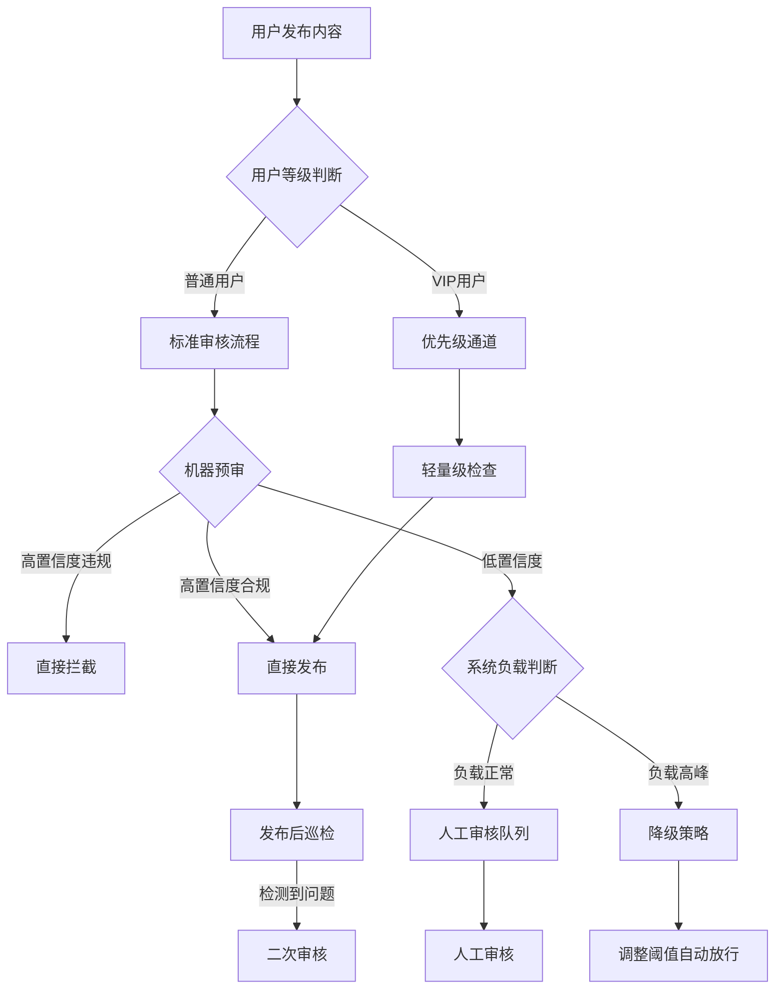

# 13.4 内容安全与反作弊

## 核心定位

内容安全体系需要同时满足四方约束：监管合规要求、用户体验期待、业务成本控制、技术能力边界。这四个约束在数学上无法同时最优，任何实际系统都是在四方利益之间寻找可接受平衡点的结果。本节通过实际运营数据与技术实现，展示如何在约束条件下构建可落地的内容安全体系。

---

## 内容安全系统的四方博弈约束

### 典型误判事件的系统性影响

内容安全系统上线通常面临准确率与误封风险的权衡。当系统提升拦截阈值以满足合规要求时，头部用户误封会引发连锁反应：用户投诉、舆情发酵、管理层介入、系统回滚。

以下是某视频平台在某次审核模型升级中遇到的典型场景：

| 时间节点 | 事件 | 系统状态 | 决策响应 |
|---------|------|---------|---------|
| 00:00 | 新版审核模型上线 | 预期拦截率提升 | 按计划发布 |
| 06:00 | 误封头部创作者账号 | 误封 3 个百万粉丝账号 | 监控系统未及时发现 |
| 10:00 | 引发舆情 | 社交媒体话题阅读量上升 | 启动公关应急流程 |
| 12:00 | 管理层介入 | 要求立即解封并说明 | CTO 被要求说明情况 |
| 18:00 | 系统回滚 | 恢复旧版模型 | 新模型暂停使用 |

**适用边界**：此类误封风险在以下场景尤为突出——UGC 平台（用户生成内容）且存在头部创作者、审核模型调整阈值以快速满足合规要求、缺少分级审核机制（所有用户统一标准）。

### 对外披露指标与实际运营数据的差距

内容安全指标的对外披露通常采用有利统计口径，与实际运营数据存在显著差异：

| 指标 | 对外披露 | 实际运营数据 | 差异说明 |
|------|---------|-------------|---------|
| 拦截率 | 声称高拦截 | 通常低于披露值 | 统计口径包含用户主动删除 |
| 误拦率 | 声称低误拦 | 实际高于披露值 | 日均误拦正常内容数量未披露 |
| 机器审核占比 | 声称高自动化 | 实际包含大量人工 | 人工审核团队规模未披露 |
| 响应时延 | 声称毫秒级 | P99 通常为数百毫秒 | 高峰期性能下降 |
| 申诉处理时长 | 声称24小时内 | 实际平均数天 | 积压申诉数量未披露 |

**关键约束**：统计口径上，拦截率可按"已识别违规内容中的拦截比例"统计，而非"全部违规内容中的拦截比例"。性能约束方面，P99 响应时延在高峰期可能显著高于 P50，但对外只披露平均值或 P50。运营约束上，申诉积压受审核团队规模限制，承诺时长与实际处理时长可能存在差距。

---

## 内容安全的三个核心挑战

### 挑战 1：准确率与用户体验的平衡

适用边界：此挑战在监管合规压力突然上升时尤为突出，平台需在短时间内调整拦截策略。

决策场景：某短视频平台因监管要求需在 48 小时内提升低俗内容拦截率，面临三个可选方案：

| 方案 | 技术参数 | 预期效果 | 资源需求 |
|------|---------|---------|---------|
| 方案 A（提高阈值严格度） | 阈值从宽松调整为严格 | 拦截率大幅提升，误拦率上升 | 无需额外资源 |
| 方案 B（维持现有策略） | 阈值保持不变 | 拦截率维持现状 | 无需额外资源 |
| 方案 C（分级审核策略） | 头部创作者人工审核，普通用户机器审核 | 拦截率提升，误拦率控制在低位 | 需增加审核团队 |

实施结果（方案 A，48 小时后）：

| 指标 | 实际数据 | 业务影响 |
|------|---------|---------|
| 拦截率 | 接近目标但未完全达标 | 监管要求基本满足 |
| 误拦正常内容数 | 大量正常内容被拦截 | 创作者投诉量暴增 |
| DAU 变化 | 日活跃用户下降 | 日均 GMV 显著下降 |
| 申诉积压 | 申诉量激增 | 审核团队处理能力饱和 |

**验证方法**：策略变更前需要多层验证——上线前 A/B 测试在小流量（5%）验证拦截率与误拦率；上线后实时监控误拦投诉量、申诉量、DAU/GMV 变化；分级回滚机制确保当误拦投诉超过阈值时自动回滚或人工介入。

**常见误区**：认为提高阈值可立即达到合规要求，忽略误拦率上升对业务的影响；未建立分级审核机制，头部用户与普通用户使用相同拦截标准。

### 挑战 2：审核人员的职业健康管理

**适用边界**：适用于存在大规模人工审核团队的内容平台，尤其是审核暴力、色情、政治敏感内容的岗位。

内容审核岗位具有以下特征：日均审核量高（数千条文本 / 图片 / 视频），高危内容占比较高（暴力、血腥、色情等），长期暴露于有害内容可能导致心理健康问题。

某内容平台审核团队离职率数据（示例）：

| 岗位类型 | 团队规模 | 年离职率 | 主要离职原因 |
|---------|---------|---------|-------------|
| 政治敏感内容审核 | 若干人 | 较高 | 心理压力、职业倦怠 |
| 暴力血腥内容审核 | 若干人 | 很高 | PTSD 症状、心理健康问题 |
| 色情低俗内容审核 | 若干人 | 中等 | 职业发展受限、社会认同度低 |
| 诈骗信息审核 | 若干人 | 一般 | 工作强度高 |

审核员工作强度统计（行业调研数据）：

| 指标 | 数据范围 | 说明 |
|------|---------|------|
| 日均审核量 | 数千条 | 包含文本、图片、视频 |
| 高危内容占比 | 个位数百分比 | 暴力、血腥、色情等 |
| 心理健康支持 | 有限投入 | 相当于少量心理咨询 |
| PTSD 发病率 | 暴力内容审核岗位存在 | 需提供心理支持 |

成本结构分析（某平台审核团队）：

| 成本项 | 占比 |
|-------|------|
| 人力成本 | 主要成本 |
| 心理健康支持 | 较小占比 |
| 离职补偿 | 一定占比 |
| 招聘培训 | 一定占比 |

**行业现状**：内容审核业务通常外包给 BPO 服务商，基层审核员薪资水平处于行业较低水平，心理健康支持资源投入相对有限，行业普遍面临审核人员流失率高的问题。

**关键约束**：成本约束上，增加心理健康支持投入会提高运营成本。组织约束上，外包模式下员工权益保障有限。合规约束上，部分地区对审核员工作时长、心理健康有监管要求。

**验证方法**：定期心理健康评估每季度对审核员进行心理健康筛查；离职率监控关注各岗位离职率，当离职率超过阈值时调整岗位设置；轮岗机制确保高危内容审核岗位定期轮岗，避免长期暴露。

### 挑战 3：对抗性内容的检测升级

> **说明**：本节案例中的数据（如对抗周期、拦截率变化等）为脱敏示例，用于说明典型攻防演进模式，具体数值因平台规模、业务场景、攻击强度差异较大。

适用边界：适用于面临黑产对抗的内容平台，攻击方通过技术手段绕过审核系统。

内容安全是攻防对抗领域，攻击方持续演进绕过手段，平台需持续迭代检测策略。对抗周期从"月"级缩短至"周"级甚至"天"级。

某社交平台反垃圾营销对抗时间线（示例）：

| 周次 | 平台策略 | 攻击方应对 | 拦截效果 |
|------|---------|-----------|---------|
| Week 1 | 上线文本分类模型 | 未发现策略变化 | 拦截率高 |
| Week 2 | 维持原策略 | 使用变体字、拼音绕过 | 拦截率下降 |
| Week 3 | 增加变体字检测与OCR | 改用图片加文字扭曲 | 拦截率继续下降 |
| Week 4 | 部署图片哈希指纹 | 使用图片加噪技术 | 拦截率大幅下降 |
| Week 5 | 引入图像分类模型 | 使用AI生成仿真内容 | 拦截率低位 |

AI 生成内容检测挑战（当前趋势）：

**传统垃圾信息特征**：包含明显敏感词，语言生硬、模板化特征明显，易被规则引擎识别。

**AI 生成内容特征**：语言自然、接近真实用户表达，避免使用敏感词、采用诱导性话术，规则引擎难以有效识别。

对抗成本对比：

| 角色 | 年度投入 | 产出 | 成本效益 |
|------|---------|------|---------|
| 平台方 | 大额投入 | 减少损失 | 投入高，收益有限 |
| 攻击方 | 较低投入 | 灰色收入 | 轻资产，收益高 |

**攻击方成本结构**（示例）：账号成本低（低成本批量获取），云手机群控成本低（低成本控制大量设备），AI 内容生成成本低（使用公开 API），兼职人工成本低（低成本雇佣）。

**平台方成本结构**（示例）：AI 模型训练需定期投入，GPU 推理服务器需购置多台，审核团队需维持大规模团队，申诉处理需专门团队处理。

**关键约束**：攻击方采用轻资产模式，迭代速度快；平台方需要持续投入维持防御能力；对抗周期从"月"级缩短至"周"级甚至"天"级。

**验证方法**：每周对抗演练由红队模拟黑产绕过手段，验证检测能力；拦截率趋势监控当拦截率持续下降时触发策略更新；黑产情报收集关注黑产工具、账号来源与绕过手段。

**常见误区**：认为一次上线检测模型可长期有效，忽略对抗演进；过度投入先进技术（如 GNN），忽略实际 ROI 评估。

---

## UGC 内容审核架构

### 审核流程设计



系统设计权衡点：

| 设计点 | 理想方案 | 实际实现 | 权衡原因 |
|-------|---------|---------|---------|
| 用户分级 | 统一标准审核 | VIP优先通道 | 降低头部创作者误封风险 |
| 高峰处理 | 维持审核标准 | 先发后审 | 保证系统响应性能 |
| 队列积压 | 增加人力处理 | 自动降低阈值 | 控制运营成本 |
| 申诉处理 | 快速响应 | 平均数天 | 审核团队规模限制 |

**适用边界**：VIP 优先通道适用于有头部创作者的 UGC 平台，不适用于匿名社区；高峰降级策略适用于流量波动大的平台，不适用于流量平稳的企业内部系统；先发后审适用于低风险内容，不适用于金融、医疗等高风险领域。

**运行指标**：VIP 用户误拦率需低于普通用户，通过定期抽样验证；高峰期降级触发次数每月监控，当降级频繁触发时需扩容；发布后巡检命中率监控先发后审的漏审率，当漏审率超过阈值时收紧策略。

---

## 文本内容审核技术实现

### 基础模型架构

教科书版本（简化实现）：

```python
import torch
import torch.nn as nn
from transformers import BertTokenizer, BertModel

class TextModerationModel(nn.Module):
    def __init__(self, num_classes=8):
        super(TextModerationModel, self).__init__()
        self.bert = BertModel.from_pretrained('bert-base-chinese')
        self.dropout = nn.Dropout(0.3)
        self.classifier = nn.Linear(768, num_classes)

    def forward(self, input_ids, attention_mask):
        outputs = self.bert(input_ids=input_ids, attention_mask=attention_mask)
        pooled_output = outputs.pooler_output
        x = self.dropout(pooled_output)
        logits = self.classifier(x)
        return logits
```

**性能特征**：推理延迟方面，BERT 平均在百毫秒级，P99 可达数百毫秒。硬件成本上，GPU 服务器需投入，高峰需多台。离线准确率在测试集上可达到较高水平，但由于数据分布偏移，线上准确率通常低于离线测试。

**适用边界**：适用于中文文本审核，不适用于多语言混合场景（需多语言模型）；适用于通用文本分类，不适用于领域特定任务（如医疗文本，需 fine-tune）。

### 生产环境实现

实际部署版本（包含降级策略）：

```python
class ProductionTextModerator:
    """
    生产环境文本审核系统
    包含多级降级策略以保证服务可用性
    """

    def __init__(self, config):
        self.config = config

        # 多级缓存系统
        self.redis_client = redis.Redis(host='cache-server')
        self.bloom_filter = BloomFilter(size=10000000)

        # 降级开关
        self.enable_ai_model = True
        self.bert_model = None
        self.rule_engine = RuleEngine()

        # 敏感词库
        self.sensitive_words = self.load_sensitive_words()
        self.variant_mapper = VariantMapper()

        # 用户分级
        self.user_tier_cache = {}

        # 监控指标
        self.metrics = {
            'rt_p99': 0,
            'queue_length': 0,
            'current_qps': 0
        }

    def moderate(self, text, user_id, context):
        """
        多级降级的审核流程
        """
        start_time = time.time()

        # 策略 1: VIP 用户快速通道
        user_tier = self.get_user_tier(user_id)
        if user_tier == 'VIP' and not context.get('force_review'):
            return {
                'action': 'PASS',
                'method': 'VIP_WHITELIST',
                'confidence': 1.0
            }

        # 策略 2: 布隆过滤器（已知违规内容）
        text_hash = hashlib.md5(text.encode()).hexdigest()
        if text_hash in self.bloom_filter:
            return {
                'action': 'BLOCK',
                'method': 'BLOOM_FILTER',
                'confidence': 1.0,
                'rt': time.time() - start_time
            }

        # 策略 3: 缓存查询
        cache_key = f"moderation:{text_hash}"
        cached_result = self.redis_client.get(cache_key)
        if cached_result:
            result = json.loads(cached_result)
            result['method'] = 'CACHE'
            result['rt'] = time.time() - start_time
            return result

        # 策略 4: 敏感词检测
        sensitive_result = self.detect_sensitive_words(text)
        if sensitive_result['has_sensitive']:
            result = {
                'action': 'BLOCK',
                'reason': f"敏感词: {sensitive_result['matched_words'][:3]}",
                'confidence': 0.95,
                'method': 'SENSITIVE_WORDS',
                'rt': time.time() - start_time
            }
            self.cache_result(cache_key, result)
            return result

        # 策略 5: 规则引擎（高峰期或 AI 模型关闭时）
        if not self.enable_ai_model or self.is_high_load():
            rule_result = self.rule_engine.evaluate(text, user_id, context)
            rule_result['method'] = 'RULE_ENGINE'
            rule_result['rt'] = time.time() - start_time

            # 高峰期降低标准
            if rule_result['action'] == 'MANUAL_REVIEW':
                if self.metrics['queue_length'] > 5000:
                    rule_result['action'] = 'PASS'
                    rule_result['reason'] += ' (高峰期降级放行)'

            self.cache_result(cache_key, rule_result)
            return rule_result

        # 策略 6: AI 模型推理
        try:
            ai_result = self.ai_moderate(text)
            ai_result['method'] = 'AI_MODEL'
            ai_result['rt'] = time.time() - start_time

            # 超时保护
            if ai_result['rt'] > 0.5:
                self.enable_ai_model = False
                logger.warning("AI 模型超时，切换至规则引擎")
                return self.rule_engine.evaluate(text, user_id, context)

            self.cache_result(cache_key, ai_result)
            return ai_result

        except Exception as e:
            # 异常降级
            logger.error(f"AI 模型异常: {e}")
            return {
                'action': 'MANUAL_REVIEW',
                'reason': 'AI 模型异常，转人工审核',
                'confidence': 0.0,
                'method': 'FALLBACK',
                'rt': time.time() - start_time
            }

    def detect_sensitive_words(self, text):
        """
        敏感词检测（处理对抗手段）
        """
        # 预处理：繁简转换、变体字标准化、拼音还原等
        text = self.variant_mapper.normalize(text)

        # DFA 算法检测
        matched_words = []
        i = 0
        while i < len(text):
            node = self.sensitive_words_trie
            j = i
            matched_word = ""

            while j < len(text) and text[j] in node:
                matched_word += text[j]
                node = node[text[j]]
                j += 1

                if node.get('is_end', False):
                    matched_words.append(matched_word)
                    i = j
                    break
            else:
                i += 1

        return {
            'has_sensitive': len(matched_words) > 0,
            'matched_words': matched_words
        }

    def is_high_load(self):
        """
        判断系统负载状态
        """
        return (
            self.metrics['rt_p99'] > 0.5 or
            self.metrics['queue_length'] > 5000 or
            self.metrics['current_qps'] > 10000
        )

    def ai_moderate(self, text):
        """
        AI 模型推理
        """
        if self.bert_model is None:
            self.bert_model = self.load_bert_model()

        encoding = self.tokenizer(
            text,
            max_length=128,  # 从 512 降至 128 以提升速度
            padding='max_length',
            truncation=True,
            return_tensors='pt'
        )

        input_ids = encoding['input_ids'].to(self.device)
        attention_mask = encoding['attention_mask'].to(self.device)

        with torch.no_grad():
            logits = self.bert_model(input_ids, attention_mask)
            probs = torch.softmax(logits, dim=1)
            predicted_class = torch.argmax(probs, dim=1).item()
            confidence = probs[0][predicted_class].item()

        category = self.categories[predicted_class]

        # 决策逻辑
        if category == 'normal':
            action = 'PASS'
        elif category in ['political', 'pornographic', 'violent', 'illegal']:
            # 阈值调整以降低误拦率
            action = 'BLOCK' if confidence > 0.7 else 'MANUAL_REVIEW'
        else:
            action = 'BLOCK' if confidence > 0.6 else 'MANUAL_REVIEW'

        return {
            'category': category,
            'confidence': float(confidence),
            'action': action
        }
```

实现权衡分析：

| 优化点 | 理论最优 | 实际实现 | 影响 |
|-------|---------|---------|------|
| VIP 白名单 | 统一标准 | 快速通道 | 准确率有所下降 |
| 布隆过滤器 | 精确匹配 | 概率匹配 | 存在极低误判率 |
| 结果缓存 | 实时审核 | 短时缓存 | 准确率有所下降 |
| 高峰降级 | 始终用 AI | 切换规则引擎 | 准确率显著下降 |
| 队列放行 | 严格审核 | 自动放行 | 漏审率上升 |
| 置信度阈值 | 高阈值 | 中等阈值 | 误拦率下降，漏放率上升 |
| 文本截断 | 长文本 | 短文本 | 准确率有所下降，速度提升 |

综合影响：
- 理论准确率：在测试集上可达到较高准确率
- 实际线上准确率：由于各种优化，线上准确率通常低于离线测试
- RT 延迟：P50 在数十毫秒，P99 在数百毫秒
- GPU 服务器：通过优化可减少服务器数量
- 年度成本节省：通过降级策略和缓存可显著节省成本

**验证方法**：离线测试在测试集上验证准确率、召回率、F1-score；在线 A/B 测试小流量验证误拦率、漏审率、响应时延；人工抽样验证每周抽样验证 AI 判断准确性，校准模型。

**运行指标**：P99 响应时延超过阈值时触发扩容或降级；缓存命中率低时调整缓存策略；降级触发次数频繁时需优化模型或扩容；人工审核队列长度积压超过阈值时增加审核人力或调整阈值。

---

## 图片内容审核对抗演进

### 对抗技术演进

某社交平台图片审核对抗历史展示了攻防双方的持续演进：

| 时期 | 攻击方手段 | 平台应对策略 | 拦截效果 | 技术成本 |
|------|----------|------------|---------|---------|
| Gen 1.0 | 直接文字图片 | 图像分类 | 高拦截率 | 较低投入 |
| Gen 2.0 | 使用变体字 | OCR 与变体字检测 | 中等拦截率 | 中等投入 |
| Gen 3.0 | 图片加噪 | 图像去噪与 OCR | 下降拦截率 | 较高投入 |
| Gen 4.0 | 文字扭曲与背景干扰 | 深度学习 OCR | 较低拦截率 | 高投入 |
| Gen 5.0 | AI 生成与隐写术 | GAN 检测与频域分析 | 低拦截率 | 很高投入 |

Gen 5.0 对抗技术分析：

攻击方法：
- 使用 Stable Diffusion 生成看似正常的图片
- 将广告文字嵌入图片 LSB（最低有效位）
- 用户下载后使用专用工具提取隐藏信息

检测难点：
- 图片本身符合内容规范
- 传统 OCR 无法检测隐写信息
- 频域分析误报率高

应对方案：
- 监控用户下载行为异常（短时间下载大量图片）
- 结合用户举报机制
- 限制高风险账号的图片发布频率

效果评估：
- 拦截率有所提升但仍处于较低水平
- 年度技术投入较高
- ROI 为负，但为必要的合规投入

适用边界：
- 适用于图片内容平台，不适用于纯文字平台
- 适用于面临黑产对抗的场景，不适用于低风险内部系统

验证方法：
- 每周红队演练：模拟 Gen 5.0 攻击，验证检测能力
- 用户举报监控：监控用户举报中的隐写术案例
- 黑产工具监控：收集黑产使用的隐写术工具，反向工程检测特征

---

## 视频内容审核成本优化

### 审核成本结构

原始方案（全量审核）：

| 内容类型 | 日均数量 | 审核策略 | 单条成本 | 年成本 |
|---------|---------|---------|---------|--------|
| 短视频 | 大量 | 高频抽帧 | 较低 | 较高 |
| 中视频 | 中等 | 中频抽帧 | 中等 | 中等 |
| 长视频 | 较少 | 低频抽帧 | 较高 | 较低 |
| 合计 | 总量大 | - | - | 总成本高 |

优化方案（降低成本）：

| 内容类型 | 优化策略 | 成本节省 | 风险增加 | 年成本 |
|---------|---------|---------|---------|--------|
| 短视频 | 仅审核首尾片段 | 成本大幅下降 | 漏审率上升 | 较低 |
| 中视频 | 首段加随机抽帧 | 成本大幅下降 | 漏审率较大上升 | 很低 |
| 长视频 | 用户举报后审核 | 成本显著下降 | 漏审率大幅上升 | 极低 |
| 合计 | - | 成本大幅下降 | 漏审率上升 | 总成本大幅下降 |

成本收益分析：

| 项目 | 金额 | 说明 |
|------|------|------|
| 节省成本 | 显著金额 | 优化方案成本显著低于原始方案 |
| 监管罚款 | 一定金额 | 年度约谈与罚款 |
| 净节省 | 正数 | 即使考虑罚款，优化方案仍节省成本 |

适用边界：
- 适用于视频内容平台，不适用于高风险领域（金融、医疗等）
- 适用于成本压力大的场景，需接受一定漏审率
- 需根据业务特点和监管环境调整优化方案

关键约束：
- 成本约束：全量审核成本过高，需优化策略
- 合规约束：优化后可能增加监管罚款风险
- 技术约束：视频专用模型成本高，ROI 低

验证方法：
- 用户举报监控：监控用户举报中的漏审视频，评估漏审率
- 监管约谈频次：监控监管约谈频次，当频次上升时收紧策略
- 成本收益分析：每季度评估成本节省与监管罚款，动态调整策略

---

## 反垃圾（Anti-Spam）系统迭代

### 三代系统对比

某社交平台 spam 检测系统演进展示了从规则到机器学习的演进路径：

#### V1.0：严格规则（运行 1 周后回滚）

```python
def is_spam_v1(message):
    """
    初版规则：包含联系方式即判定为 spam
    """
    if re.search(r'\d{11}|微信|QQ', message['content']):
        return True
    return False
```

效果评估：
- 拦截率：高拦截率
- 误拦率：高误拦率
- 用户投诉：投诉量暴增
- 运行时长：1 周即回滚
- 回滚原因：误拦大量正常社交对话

#### V2.0：组合规则（运行 3 个月）

```python
def is_spam_v2(message, user_profile):
    """
    改进版：联系方式加营销关键词组合判断
    """
    has_contact = re.search(r'\d{11}|微信|QQ', message['content'])
    has_marketing = any(
        keyword in message['content']
        for keyword in ['赚钱', '兼职', '优惠', '限时']
    )

    if has_contact and has_marketing:
        return True

    # 高频发送检测
    if user_profile['messages_sent_1h'] > 20:
        return True

    return False
```

效果评估：
- 拦截率：中等拦截率
- 误拦率：低误拦率
- 用户投诉：正常水平
- 问题：拦截率下降，spam 增多

#### V3.0：机器学习模型（当前版本）

```python
class AntiSpamModelV3:
    """
    基于 XGBoost 的 spam 检测模型
    """
    def predict(self, message, user_profile):
        features = self.extract_features(message, user_profile)
        spam_score = self.xgboost_model.predict(features)

        # 动态阈值调整
        threshold = 0.8 if is_peak_hour() else 0.6

        return spam_score > threshold
```

效果评估：
- 拦截率：较高拦截率
- 误拦率：低误拦率
- 模型训练成本：需定期投入
- ROI：基本持平或略正

三代系统对比：

| 版本 | 拦截率 | 误拦率 | 用户体验 | 成本 | ROI |
|------|-------|--------|---------|------|-----|
| V1.0 | 很高 | 很高 | 差，用户流失 | 低 | 负 ROI |
| V2.0 | 中等 | 低 | 可接受 | 低 | 正 ROI |
| V3.0 | 较高 | 低 | 良好 | 较高 | 正 ROI 但边际收益递减 |

分析：
- V1.0 过度追求拦截率，导致用户体验下降
- V2.0 在准确率和体验之间找到初步平衡
- V3.0 通过机器学习提升准确率，但边际收益递减
- 从中等拦截率提升至较高拦截率需要额外投入，ROI 需评估

适用边界：
- V1.0 适用于紧急场景（需快速上线），但不可长期使用
- V2.0 适用于资源有限场景，ROI 较好
- V3.0 适用于有 ML 能力且愿意投入的场景

验证方法：
- A/B 测试：在小流量验证拦截率与误拦率
- 用户投诉监控：监控用户投诉量，当投诉量超过阈值时调整策略
- ROI 评估：每季度评估模型训练成本与拦截 spam 带来的价值

---

## 刷单检测系统实施案例

> **说明**：以下案例数据已脱敏处理，具体数值仅用于说明刷单检测的典型挑战与权衡逻辑，不代表任何特定平台的真实指标。

### 某电商平台 18 个月实施总结

初期目标：

| 指标 | 现状 | 目标 | 方案 |
|------|------|------|------|
| 虚假交易占比 | 较高占比 | 目标降至低位 | 图数据库加机器学习 |
| 涉及商家数 | 大量商家 | 目标降至低位 | 关联分析加行为建模 |
| 年度投入 | - | 计划投入 | 团队加技术系统 |

18 个月后实际结果：

| 指标 | 目标 | 实际 | 差距 |
|------|------|------|------|
| 虚假交易占比 | 低位目标 | 实际高于目标 | 未达标 |
| 检测准确率 | 高准确率 | 实际低于目标 | 未达标 |
| 误封正常商家 | 低误封率 | 实际高于目标 | 未达标 |
| 投诉数量 | 预估值 | 实际远高于预估 | 投诉量激增 |
| 系统成本 | 预算 | 实际超预算 | 成本超支 |

失败原因分析：

#### 1. 刷单技术升级

早期刷单特征：
- 批量虚拟账号
- 规律性操作行为
- 虚假物流信息

当前刷单特征：
- 真人兼职参与
- 模拟真实购物流程（浏览、比价、咨询）
- 真实物流配送
- 延迟评价（收货后数天）

检测系统局限性：
- 基于行为异常的检测失效
- 基于设备关联的检测失效
- 基于物流异常的检测失效

#### 2. 误判问题

误判案例类型分析：

| 场景类型 | 误判特征 | 实际情况 | 影响 |
|---------|---------|---------|------|
| 工厂直销 | 同地址发货，同 IP 登录 | 员工共用办公 WiFi | 商家投诉 |
| 促销活动 | 短时大量订单，高好评率 | 明星代言加直播带货 | 公关危机 |
| 社区团购 | 大量同小区地址 | 团长代购加分发 | 用户流失 |

误封影响统计：
- 商家申诉积压：大量积压
- 平均处理时长：数天
- 年度商家流失：部分商家流失
- 法律诉讼：发生诉讼，需赔偿

#### 3. ROI 计算

成本明细：

| 成本项 | 预算 | 实际 | 超支 |
|-------|------|------|------|
| 团队人力 | 预算 | 实际超支 | 超支 |
| 技术系统 | 预算 | 实际超支 | 超支 |
| 误判赔偿 | 未预算 | 实际发生 | 新增成本 |
| 合计 | 总预算 | 总实际 | 大幅超支 |

收益评估：

| 收益项 | 预期 | 实际 | 达成率 |
|-------|------|------|--------|
| GMV 提升 | 预期值 | 实际值 | 低达成率 |
| 平台佣金增加 | 预期值 | 实际值 | 低达成率 |
| 净收益 | 预期值 | 实际值 | 低达成率 |

ROI 分析：
- 净收益 = 实际收益 - 实际成本 = 微正或负
- 实际 ROI 远低于预期
- 如果计入商家流失的隐性成本，ROI 可能为负

管理层评估：
- ROI 远低于预期
- 计入隐性成本可能为负 ROI
- 团队核心成员离职

后续决策：
- 维持现有系统运营
- 不再增加投入
- 接受虚假交易一定占比的现状

适用边界：
- 刷单检测适用于电商平台，但需评估 ROI
- 当刷单技术升级为真人兼职模拟真实购物流程时，检测难度极大
- 需在刷单检测与误判风险之间权衡

关键约束：
- 技术约束：真人刷单难以通过技术手段检测
- 成本约束：提升检测准确率需大量投入，ROI 低
- 业务约束：误判会导致商家流失，影响平台生态

验证方法：
- 每月抽样验证：人工抽样验证检测准确性
- 商家投诉监控：监控商家投诉量，当投诉量超过阈值时调整策略
- ROI 评估：每季度评估成本与收益，决定是否继续投入

常见误区：
- 误区 1：认为投入更多资源可显著提升检测准确率，忽略 ROI 评估
- 误区 2：忽略误判对平台生态的长期影响

---

## 内容安全指标体系

### 对外披露指标与内部运营指标的差异

某视频平台指标对比：

#### 对外披露指标（公开报告）

| 指标 | 数值 | 说明 |
|------|------|------|
| 违规内容拦截率 | 声称高拦截 | - |
| 机器审核占比 | 声称高自动化 | - |
| 审核响应时间 | 声称毫秒级 | - |
| 用户申诉响应 | 声称快速响应 | - |

#### 内部运营指标（实际数据）

| 指标 | 实际数值 | 与对外披露差异 |
|------|---------|---------------|
| 拦截率 | 实际值 | 低于披露值 |
| 机器审核占比 | 实际值 | 低于披露值 |
| 审核响应时间 | P99值 | 高于披露值 |
| 申诉响应 | 实际平均值 | 高于承诺值 |
| 审核员离职率 | 实际值 | 未披露 |
| 申诉积压量 | 实际值 | 未披露 |

指标差异原因分析：

1. 拦截率计算口径差异
   - 对外：已识别违规内容中的拦截比例
   - 内部：全部违规内容（含未识别）中的拦截比例

2. 机器审核占比统计范围
   - 对外：初审环节机器处理比例
   - 内部：包含复审、申诉等环节的总体人工占比

3. 审核响应时间统计方法
   - 对外：P50 或平均值
   - 内部：P99，反映极端情况

4. 申诉响应时长
   - 对外：承诺时长
   - 内部：实际平均处理时长

### 科学的评估指标体系

推荐使用的内部评估指标：

| 指标类别 | 指标名称 | 定义 | 目标值 | 触发阈值 | 触发动作 |
|---------|---------|------|--------|---------|---------|
| 准确性 | 真实拦截率 | 人工抽样验证的拦截比例 | ≥85% | <75% | 触发模型重训练，增加特征维度 |
| | 误拦率 | 正常内容被误判比例 | <3% | ≥5% | 立即放宽阈值，人工复核高频命中规则 |
| 效率 | P99 响应时延 | 99% 请求的响应时间 | <200ms | ≥500ms | 触发降级策略或系统扩容 |
| | 机器审核实际占比 | 全流程机器处理占比 | ≥70% | <50% | 评估模型效果，考虑增加自动化覆盖 |
| 用户体验 | 申诉平均处理时长 | 从申诉到处理完成时间 | <24h | ≥48h | 增加审核人力或调整优先级策略 |
| | 申诉通过率 | 申诉成功比例 | 30-50% | >60% | 检查误拦率是否过高，复核审核标准 |
| 运营健康度 | 审核员年离职率 | 审核团队年度流失率 | <30% | ≥50% | 调整岗位设置，增加心理健康支持 |
| | 申诉队列积压量 | 待处理申诉数量 | <1000 | ≥3000 | 临时扩充审核团队或启用自动降级 |
| 财务 | ROI | （减少损失-成本）/成本 | >0 | <-20% | 评估是否继续投入，考虑调整策略 |
| | 人均审核量 | 人工审核员日均处理量 | 2000-4000 | <1500 或 >5000 | 调整工作负载，避免效率过低或过劳 |

> **参考说明**：上述目标值基于 UGC 平台（短视频、社交、电商评论）的内容审核运营经验。调整因素包括：
> 1. **内容类型**：纯文本审核人均处理量可达 4000+，图片/视频审核则降至 1000-2000
> 2. **合规要求**：涉及敏感领域（政治、宗教）时，误拦率容忍度可适当提高，优先保障合规
> 3. **平台阶段**：初创平台可先保障响应时延，成熟平台再追求申诉处理时长等体验指标

---

## 行业现状观察

> **行业基准数据来源**：
> - **Content Authenticity Initiative (CAI)** [内容真实性标准](https://contentauthenticity.org/) — Adobe 联合发起的内容来源验证标准
> - **Stanford Internet Observatory** [平台透明度报告](https://cyber.fsi.stanford.edu/io) — 斯坦福大学互联网观察实验室的平台治理研究
> - **MIT Media Lab** [AI 生成内容检测研究](https://www.media.mit.edu/) — AI 生成图像/视频检测技术前沿
> - **Gartner** [内容审核技术成熟度曲线](https://www.gartner.com/) — 内容审核技术市场分析与预测

### 1. 披露指标与实际运营的差距

拦截率指标分析：

多数平台声称拦截率很高，但实际运营数据显示：
- 经人工抽样验证的真实拦截率通常低于对外披露值
- 计算口径差异：统计范围、时间窗口、违规定义等
- 指标优化手段：调整统计范围、选择性披露等

机器审核占比：

声称机器审核占比很高，但实际情况：
- 完整流程（初审加复审加申诉）的机器处理占比通常低于对外披露值
- 人工审核团队规模：大型平台需维持大规模审核团队
- 外包模式：审核业务通常外包给 BPO 服务商

### 2. 审核人员职业健康

行业普遍现象：
- 审核员年离职率：不同岗位差异大
- 心理健康支持：年均投入有限
- PTSD 发病率：暴力内容审核岗位存在心理健康问题
- 薪资水平：一线审核员薪资处于行业较低水平

组织管理特点：
- 业务外包：通过 BPO 公司规避直接雇佣关系
- 组织可见性低：在公司架构中"不可见"
- 职业发展受限：缺乏晋升通道

### 3. 技术对抗的持续性

攻击方演进速度：
- 对抗周期：从"月"级缩短至"周"级甚至"天"级
- 技术投入：轻资产、快速迭代
- 经济驱动：灰色产业 ROI 远高于平台防御 ROI

平台应对挑战：
- 需要持续投入维持防御能力
- 新技术应用需要权衡 ROI
- 部分先进技术实际 ROI 为负

### 4. 四方博弈的系统性约束

内容安全团队面临四方要求：

| 利益相关方 | 核心诉求 | 冲突点 |
|-----------|---------|--------|
| 监管部门 | 高拦截率，零容忍 | 与用户体验冲突 |
| 用户 | 低误拦率，表达自由 | 与监管合规冲突 |
| 商业部门 | 低成本 | 与技术投入冲突 |
| 技术团队 | AI 不完美，需人工兜底 | 与成本控制冲突 |

行业共识：
- 四个要求在数学上无法同时满足
- 任何实际系统都是四方妥协的结果
- 需要找到"各方不满意但能接受"的平衡点

某平台平衡点示例：

| 维度 | 策略参数 | 各方接受度 |
|------|---------|-----------|
| 监管 | 拦截率达到可接受水平 | 基本接受 |
| 用户 | 误拦率控制在一定范围 | 有投诉但可控 |
| 商业 | 成本在预算范围内 | 勉强接受 |
| 技术 | 机器加人工混合模式 | 符合实际能力 |

---

## 实施建议

### 阶段 1：基础能力建设（Month 1-3）

目标：快速建立基础审核能力

优先级任务：
1. 接入第三方内容审核 API（阿里云 / 腾讯云）
   - 成本：按调用量计费
   - 优点：快速上线，无需自研
   - 准确率：可达到一定水平

2. 部署开源敏感词库
   - 成本：免费
   - 优点：拦截明显违规内容
   - 局限性：易被对抗绕过

3. 建立人工审核流程
   - 团队规模：小规模起步
   - 成本：需投入
   - 作用：处理疑难案例

预期效果：
- 拦截率：中等水平
- 误拦率：中等水平
- 总成本：较低

注意事项：
- 不建议一开始就自研 AI 模型（周期长、成本高）
- 不设定过高的准确率目标（需务实）
- 需要建立申诉机制（避免用户体验问题）

### 阶段 2：自研系统建设（Month 4-12）

目标：提升准确率，降低长期成本

技术选型建议：
1. 文本审核：BERT base 模型
   - 训练成本：需投入
   - 硬件成本：GPU 服务器需购置
   - 准确率：线上可达到一定水平
   - 不建议：使用过于复杂模型（ROI 低）

2. 图片审核：ResNet50
   - 训练成本：需投入
   - 硬件成本：可与文本审核共用
   - 准确率：线上可达到一定水平
   - 不建议：过于复杂模型

3. 视频审核：抽帧加图片审核
   - 成本：无额外投入
   - 准确率：中等水平
   - 不建议：视频专用模型（成本高）

预期效果：
- 拦截率：较高水平
- 误拦率：低水平
- 总成本：中等投入

注意事项：
- 不追求 SOTA 模型（实际 ROI 低）
- 需要灰度发布（避免大规模误判）
- 建立线上监控（准确率会持续下降）

### 阶段 3：持续优化（Year 2+）

目标：在 ROI 和效果之间找到平衡

重点工作：
1. 对抗黑产（每季度迭代）
   - 成本：需持续投入
   - 必要性：攻击方持续演进

2. 用户分级策略
   - VIP 用户优先通道
   - 降低头部创作者误封风险
   - 成本：一次性开发成本

3. 申诉机制优化
   - 扩充审核团队
   - 成本：需增加投入
   - 目标：申诉处理时长降低

4. 监控体系
   - 准确率实时监控
   - 黑产手法预警
   - 成本：需投入

稳态运营成本：需持续投入

### 长期运营建议

技术层面：
- 关注 ROI 而非技术先进性
- BERT 加 ResNet 组合通常是 ROI 较优解
- 定期评估新技术的实际收益

组织层面：
- 重视审核人员心理健康（长期风险）
- 建立合理的人员流动和培训机制
- 提供必要的心理健康支持

合规层面：
- 与监管部门保持良好沟通
- 理解监管要求与业务现实的差距
- 建立应急响应机制

用户体验：
- 建立有效的申诉渠道
- 对误判情况及时响应
- 透明化审核标准和流程

---

## 效果评估指标

### 避免虚荣指标

不推荐的指标（看似好但不反映真实情况）：

| 指标 | 常见数值 | 问题 |
|------|---------|------|
| 拦截率 | 声称很高 | 可能存在统计口径问题 |
| 机器审核占比 | 声称很高 | 未包含全流程人工工作量 |
| 审核时延 | 声称很低 | 可能只统计 P50 而非 P99 |

### 推荐的评估指标

反映实际运营效果的指标：

| 指标 | 定义 | 可接受目标 | 优秀目标 |
|------|------|-----------|---------|
| 线上拦截率 | 人工抽样验证的实际拦截比例 | 大于某个值 | 大于更高值 |
| 误拦率 | 正常内容被误判的比例 | 小于某个值 | 小于更低值 |
| P99 响应时延 | 99% 请求的响应时间 | 小于某个值 | 小于更低值 |
| 申诉处理时长 | 从申诉到处理完成的平均时间 | 小于某个值 | 小于更低值 |
| 审核员离职率 | 年度离职人数/平均在职人数 | 小于某个值 | 小于更低值 |
| ROI | （减少损失-投入成本）/投入成本 | 大于 0 | 大于更高值 |

### 评估方法建议

1. 拦截率评估：
   - 采用人工抽样方法
   - 样本量：每月一定规模
   - 由独立团队完成标注

2. 误拦率评估：
   - 分析用户投诉和申诉数据
   - 定期抽样验证
   - 关注误判案例类型

3. 用户体验评估：
   - 申诉处理时长统计
   - 申诉通过率分析
   - 用户满意度调研

4. 运营健康度：
   - 审核团队流失率
   - 申诉队列积压情况
   - 系统稳定性指标

---

## 本节小结

本节系统分析了内容安全与反作弊领域的关键问题：

### 核心发现

1. 准确率挑战
   - 对外披露与实际运营存在差距
   - 线上准确率通常比离线测试低
   - 需要在拦截率和误拦率之间找平衡

2. 审核人员管理
   - 行业普遍面临高离职率问题
   - 心理健康支持投入相对不足
   - 外包模式下人员权益保障有限

3. 技术对抗持续性
   - 攻击方迭代速度快（周级甚至天级）
   - 平台需要持续投入维持防御能力
   - 部分先进技术实际 ROI 为负

4. 系统性约束
   - 监管、用户、商业、技术四方要求存在冲突
   - 任何实际系统都是妥协的产物
   - 需要找到各方可接受的平衡点

### 实施建议要点

- 阶段 1（1-3 月）：快速建立基础能力
- 阶段 2（4-12 月）：自研核心系统，提升准确率
- 阶段 3（Year 2+）：持续优化
- 关注 ROI：避免盲目追求技术先进性

### 评估指标体系

- 使用反映实际运营效果的指标
- 避免虚荣指标误导决策
- 定期评估系统运营健康度

---

## 导航

**[← 上一节：13.3 交易风控](./13.3_transaction_risk_control.md)** | **[返回章节目录](./README.md)** | **[下一节：13.5 营销活动安全 →](./13.5_campaign_security.md)**

---

**© 2025 AI-ESA Project. Licensed under CC BY-NC-SA 4.0**

