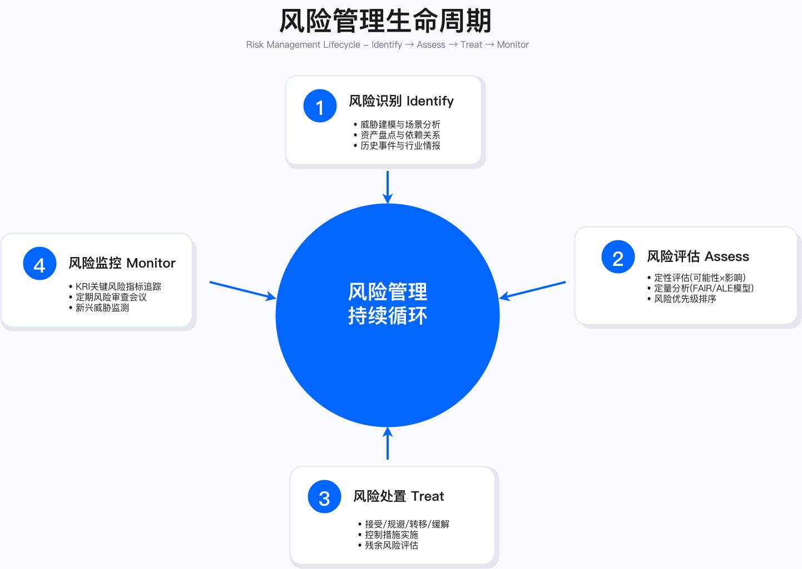

# 2.2　风险管理体系

> Risk Management System: From Identification to Quantification

---

> 本节导读：风险管理的核心工程难题有两个——如何把"感觉上很危险"翻译成 CFO 能看懂的财务数字，以及如何让监控机制在日常运营中真正运转而不流于形式。本节围绕这两个难题展开：2.2.1 覆盖识别→评估→处置→监控四阶段；2.2.2 聚焦风险偏好的量化传导；2.2.3 阐述第三方风险全生命周期；2.2.4 解析云、AI、跨境数据三类新兴风险。

风险管理的核心问题不是"是否存在风险"，而是"哪些风险值得投资控制、投资多少、如何验证控制有效"。

---

## 2.2.1 风险管理生命周期

### 风险管理四阶段模型

风险管理是一个持续循环的过程，包含识别、评估、处置、监控四个阶段。这一划分与两套主流标准可直接对齐，落地时建议照搬标准术语以省去与审计、内控团队的对齐成本：ISO 31000:2018 的风险管理过程为"沟通与协商—范围/环境/准则确立—风险评估（识别、分析、评价）—风险应对—监视与评审—记录与报告"[1]；NIST SP 800-30 Rev. 1 则把风险评估拆为"准备—实施—沟通结果—维护"四步，并给出威胁源、威胁事件、脆弱性、影响的分类表可直接取用[2]。实践中常见的失败模式是：风险识别依赖个人经验而非系统方法，风险评估因标准不统一导致跨部门结果无法比较，风险处置受制于预算博弈而非 ROI 分析，风险监控流于形式缺乏触发机制。这四个失败点并非孤立，它们往往互为因果——识别不系统导致评估口径不齐，评估不统一又让处置沦为部门间的话语权争夺，而这一切最终使监控无从校准。"统一度量语言"正是打通四阶段的第一块基石，而非形式主义。

跨职能风险度量标准冲突

企业风险识别过程中，各职能部门使用不同的风险度量标准，导致无法比较和决策优先级。这是风险管理失效的常见根因。

许多组织在引入量化方法之前，根本没有意识到"无法比较"本身就是问题所在——他们以为只要各部门都尽职上报风险，管理层自然能作出决断。下表展示了典型的跨部门度量冲突，四个部门是企业风险讨论中最常见的参与方，各自使用的度量体系反映了其职能视角的局限性。

| 职能部门 | 风险度量标准 | 典型论据 | 决策困境 |
|---------|------------|---------|---------|
| 业务部门 | 市场份额/收入影响 | "竞争对手抢市场是最大风险" | 无法与技术风险对比（单位不同） |
| CISO/安全 | 安全事件次数/严重程度 | "过去一段时间有若干次数据泄露未遂" | 未转化为财务影响，CFO 无法决策 |
| CTO/技术 | 系统可用性（Uptime） | "系统宕机造成业务损失" | 未考虑发生频率，无法与其他风险对比 |
| 法务/合规 | 罚款金额/诉讼成本 | "GDPR 罚款可达年收入一定比例" | 未考虑违规概率，可能过度夸大风险 |

最右列的"决策困境"揭示了每种度量各自缺失的那一半信息：安全部门有严重程度却没有财务折算，技术部门有影响却没有频率，法务部门有罚款上限却没有违约概率——每一方都只掌握了风险方程的一个因子，谁也无法独立算出可比较的答案。上述冲突的根本原因在于各部门缺乏统一的风险度量语言。解决方案是将所有风险转化为年度预期损失（ALE），使不同类型的风险具备可比性。

统一使用财务语言量化风险

ALE 之所以能充当"通用货币"，在于它同时纳入了频率与损失两个维度——正好补齐了上表中各部门缺失的另一半信息。以下为 ALE 量化的示例框架。表中数值仅为示意，实际应用时必须基于企业历史事件记录与行业基准进行校准。

| 风险类型 | LEF（年度频率） | LM（单次损失） | ALE（年度预期损失） | 量化依据说明 |
|---------|--------------|------------|---------------------|---------|
| 数据泄露 | 示例值 | 示例口径 | 示例口径 | 需基于企业历史事件记录与行业报告校准 |
| 系统宕机 | 示例值 | 示例口径 | 示例口径 | 需基于历史故障率与业务影响分析校准 |
| 合规罚款 | 示例值 | 示例口径 | 示例口径 | 需基于行业违规率统计校准 |
| 市场竞争 | 不适用 | 不适用 | 无法直接量化 | 战略风险，需单独评估 |

表中"市场竞争"一行标注"无法直接量化"，说明财务语言并非万能。战略风险这类难以拆解成频率×损失的因素，强行套用 ALE 反而会制造虚假的精确感——这也是量化落地时最容易踩的坑。统一财务语言后，风险优先级排序具备客观依据，资源配置决策可基于 ROI 分析进行。这一转化是风险管理从"定性讨论"走向"定量决策"的关键步骤。



*图：风险管理四阶段生命周期——识别、评估、处置、监控的循环迭代*

### 阶段1：风险识别（Identify）

#### 1.1 风险分类维度

建立统一的风险分类体系是风险识别的前提。分类体系应覆盖企业面临的主要风险域，避免遗漏。分类的意义不仅是"归档"，更在于它决定了后续谁来负责、用什么方法评估、以什么频率复审——一个没有分类骨架的风险清单，很快会退化成一份无人认领的杂物堆。以下八类风险涵盖企业安全风险管理的核心领域，从战略到运营、从内部到外部形成完整覆盖。

| 风险类别 | 说明 | 示例 |
|---------|------|------|
| 战略风险 | 影响业务目标实现的外部/内部因素 | 市场竞争加剧、技术路线选择错误、监管政策变化 |
| 运营风险 | 日常业务流程中的风险 | 系统宕机、供应链中断、关键人员流失 |
| 财务风险 | 财务损失或报表风险 | 欺诈、资金链断裂、汇率波动 |
| 合规/法律风险 | 违反法规或合同的风险 | 监管处罚、诉讼、合同违约 |
| 信息安全风险 | 机密性/完整性/可用性受损 | 数据泄露、勒索软件、DDoS 攻击 |
| 数据隐私风险 | 个人信息处理不当 | 未经授权的数据收集、跨境传输违规 |
| 第三方风险 | 供应商/合作伙伴引入的风险 | 供应商数据泄露、服务中断、财务破产 |
| 新兴风险 | 新技术/新业务模式带来的风险 | AI 偏见、云配置错误、加密货币监管 |

这八类之间存在刻意的交叉：一次供应商数据泄露既是"第三方风险"也是"信息安全风险"。分类体系允许重叠，因为现实中的风险本就多面，重要的是确保没有风险落在所有类别之外的盲区。上述分类适用于大中型企业的综合风险管理场景。初创企业或单一业务线企业可根据实际情况简化分类，但至少应保留信息安全风险、合规风险、第三方风险三个核心类别——这三类是几乎所有数字化业务都无法回避的最小风险面。

#### 1.2 风险识别方法

识别方法的选择往往被低估——很多团队默认"开个会头脑风暴一下"就算识别过了，结果系统性风险和技术细节大量遗漏。真正的问题在于没有方法是万能的，每种方法都在时间成本、参与门槛、产出深度之间做了不同取舍。不同方法适用于不同场景，选择时需考虑时间成本、参与人员和产出质量的权衡。

| 方法 | 适用场景 | 优点 | 局限 |
|------|---------|------|------|
| SWOT 分析 | 战略规划、新业务评估 | 结构化、易于沟通 | 定性为主，难以量化 |
| 头脑风暴 | 快速识别、团队共识 | 激发创意、全员参与 | 可能遗漏系统性风险 |
| 问卷调查 | 大范围风险扫描 | 覆盖面广、数据化 | 回答质量依赖问卷设计 |
| 历史事件分析 | 复盘过往事件 | 基于真实数据 | 无法预测新风险 |
| 威胁建模（STRIDE） | 系统/应用安全 | 系统化、可重复 | 需要技术深度 |
| What-If 分析 | 极端场景规划 | 挑战假设、发现盲区 | 耗时较长 |
| Bow-Tie 分析 | 关键风险深度分析 | 可视化因果关系 | 复杂风险需要多个 Bow-Tie |

每种方法的局限，恰好指向了应该用哪种方法来补位：历史事件分析看不到新风险，就用 What-If 补极端场景；头脑风暴会遗漏系统性风险，就用 STRIDE 做结构化深挖。关键权衡在于：快速方法（如头脑风暴）适合初期风险发现，但需后续结构化方法（如 STRIDE）进行深度分析。单一方法难以覆盖所有风险类型，建议组合使用。

常见误区

1. 仅依赖历史事件分析，忽略新兴威胁和零日漏洞场景——历史数据反映过去，无法预测未发生的攻击向量
2. 头脑风暴缺乏结构化引导，结果发散且难以收敛——需要预先设定风险分类框架作为引导
3. 问卷设计过于通用，无法捕捉业务特有风险——建议在通用问卷基础上增加业务定制问题

使用 STRIDE 识别支付系统风险示例

场景：电商平台准备上线新的支付系统。支付链路同时承载身份、金额、日志、可用性、权限等多重敏感属性，几乎覆盖了 STRIDE 的每一类威胁。STRIDE 模型从六个威胁类别系统化识别风险，确保不遗漏主要攻击面。每个威胁类别对应不同的安全属性失效，这也是 STRIDE 的设计初衷——帮助工程师在设计阶段而非运行阶段发现问题。

| 威胁类型 | 风险场景 | 潜在影响 | 可能性判断依据 |
|---------|---------|------|--------|
| Spoofing（身份欺骗） | 攻击者伪造用户身份发起支付 | 财务损失、用户投诉 | 取决于认证机制强度 |
| Tampering（数据篡改） | 支付金额被中间人篡改 | 财务损失、监管处罚 | 取决于传输加密与完整性校验 |
| Repudiation（抵赖） | 用户否认发起交易 | 法律纠纷、客服成本 | 取决于交易日志完整性 |
| Information Disclosure（信息泄露） | 信用卡号/CVV 泄露 | PCI DSS 违规、品牌损害 | 取决于存储加密与访问控制 |
| Denial of Service（拒绝服务） | DDoS 攻击导致支付不可用 | 收入损失、用户流失 | 取决于 DDoS 防护能力 |
| Elevation of Privilege（权限提升） | 内部人员提权盗取支付数据 | 财务损失、监管处罚 | 取决于权限管理与监控 |

表中"可能性判断依据"一列把每类威胁的发生概率显式挂钩到某项具体控制的强度上。这正是 STRIDE 从"列威胁"走向"可评估"的关键——识别出的每一条风险都自带一个可以去测量的抓手，而不是停留在"有可能被攻击"的空泛判断。输出：风险登记册条目，供后续评估阶段使用。每个识别出的风险应包含：风险 ID、风险描述、潜在影响、初步可能性判断、风险责任人。

#### 1.3 风险触发机制

许多组织把风险识别默认成一年一次的规划动作，这正是监控失效的隐性源头——现实中的风险不会等年度会议才出现。因此识别必须从"日历驱动"转向"事件驱动"。风险识别不应仅在年度规划时进行，需建立事件驱动的触发机制。

| 触发事件 | 说明 | 建议频率 |
|---------|------|------|
| 年度规划 | 每年制定业务战略时同步进行风险扫描 | 年度 |
| 重大业务变更 | 新产品上线、进入新市场、收购兼并 | 按需 |
| 监管要求 | 监管检查、认证审计（ISO 27001/SOC 2） | 按需 |
| 重大事件 | 数据泄露、系统宕机、安全事件 | 按需 |
| 内部审计发现 | 内审发现高风险问题 | 按需 |
| 外部情报 | 行业重大安全事件、新漏洞披露 | 持续 |

注意表中大多数触发事件的频率是"按需"而非固定周期——这正是事件驱动机制的精髓：它把识别的时机交给业务和威胁环境的变化，而不是交给日历。验证方法：检查风险登记册更新时间戳，确认是否在上述触发事件发生后及时更新。这条验证方法之所以有效，是因为时间戳是最难造假的客观证据——如果一次重大业务变更后登记册纹丝未动，就说明触发机制只存在于纸面上。

### 阶段2：风险评估（Assess）

#### 2.1 定性评估：风险矩阵法

风险矩阵是最常用的定性评估工具，通过影响程度和可能性两个维度对风险进行分级。之所以从定性矩阵讲起，是因为它是绝大多数组织风险评估的起点：它不需要精确数据，几个人对着矩阵就能快速把一批风险排出高低。其价值在于快速筛选和优先级排序，适用于风险数量较多、需要快速决策的场景。

5×5 风险矩阵

5×5 矩阵横轴为可能性、纵轴为影响，两者相乘落入不同的风险等级区间。采用 5×5 而非 3×3 或 10×10，是分级粒度与决策成本之间的折中——格子太少无法区分优先级，太多则让评估人纠结于相邻格的边界，反而降低效率。

```
影响程度 (Impact)
  │
5 │  M   H   H   VH  VH
  │
4 │  M   M   H   H   VH
  │
3 │  L   M   M   H   H
  │
2 │  L   L   M   M   H
  │
1 │  VL  L   L   M   M
  │
  └─────────────────────→ 可能性 (Likelihood)
     1   2   3   4   5

图例：
VL = Very Low（极低风险，分数 1-4）
L  = Low（低风险，分数 5-9）
M  = Medium（中等风险，分数 10-14）
H  = High（高风险，分数 15-19）
VH = Very High（极高风险，分数 20-25）
```

该矩阵并非对称：高影响（第 5 行）即便可能性只有中等，也会迅速攀升到 H 甚至 VH，而高可能性但低影响的风险仍停留在 L/M。这种偏向"影响优先"的布局是刻意的——它反映了风险管理宁可高估罕见巨灾、也不愿忽视潜在致命风险的保守立场。

评分标准示例

矩阵本身只是骨架，真正决定评估质量的是评分标准——同一个"影响 5"，对初创公司和跨国集团意味着完全不同的量级。以下标准需根据企业实际情况校准，不同行业、不同业务规模对"高影响"的定义差异较大。

| 级别 | 可能性（Likelihood） | 影响程度（Impact） |
|------|---------------------|------------------|
| 5 - 几乎确定 | 年发生概率高 | 业务停摆超过一周或重大监管处罚 |
| 4 - 很可能 | 年发生概率中高 | 业务停摆数天 |
| 3 - 可能 | 年发生概率中等 | 业务停摆 1-3 天 |
| 2 - 不太可能 | 年发生概率较低 | 业务停摆不足 1 天 |
| 1 - 罕见 | 年发生概率极低 | 无明显业务影响 |

这张表用"业务停摆时长"来锚定影响级别，是一个务实的选择：停摆时间是跨部门都能直观理解、且相对客观可测的标尺，比抽象的"严重/一般"更难被主观拉扯。这也是为什么下面的常见误区会反复强调"校准"——没有校准的标准，等级定义就形同虚设。

固有风险与残余风险

评估不能只看风险"天生"有多大，还必须看现有控制把它压低了多少——这就是固有风险与残余风险的区别，也是决策真正依据的那个数字。

```
固有风险（Inherent Risk）= 未实施任何控制措施时的风险水平
                           │
                           ▼
                    实施控制措施（Controls）
                           │
                           ▼
残余风险（Residual Risk）= 实施控制措施后的剩余风险

决策逻辑：
- 如果残余风险 ≤ 风险偏好，则接受（Accept）
- 如果残余风险 > 风险偏好，则需进一步缓解（Mitigate）或升级
```

这段决策逻辑是整个风险管理体系的枢纽：它把"要不要接受一个风险"简化为一次残余风险与风险偏好的比较。后文的处置决策树、风险接受审批机制，本质上都是在把这两行 if 逻辑展开成可执行的组织流程。适用边界：定性评估适用于快速筛选和优先级排序，但对于需要投资决策的高风险项，建议结合定量评估以支撑财务论证。

常见误区

1. 评分标准未校准，不同评估人对同一风险打分差异过大——需建立评分校准会议机制
2. 仅评估固有风险，忽略现有控制措施的效果——残余风险才是决策依据
3. 风险矩阵分级过细或过粗，难以支撑决策——5×5 矩阵是较为平衡的选择

验证方法：定期进行评分一致性测试，由多名评估人对同一批风险独立打分，计算偏差率。偏差率过高则需重新校准评分标准。这一验证之所以关键，是因为定性评估最大的软肋就是主观性——偏差率就是给这份主观性装上的"测量仪表"，让原本看不见的评分漂移变得可量化、可纠正。

#### 2.2 定量评估：FAIR 模型

当定性矩阵无法回答 CFO"这个风险到底值多少钱、值不值得投入 X 预算去防"时，就需要定量模型登场。FAIR（Factor Analysis of Information Risk）是目前较为成熟的风险量化框架，将风险分解为可估算的因子。需要说明的是 FAIR 的标准化身份：它并非某家机构的私有方法，其分解体系已由 The Open Group 发布为两份正式标准——《Risk Taxonomy (O-RT)》定义术语与分解树[3]，《Risk Analysis (O-RA)》规定分析流程[4]，合称 Open FAIR。写风险报告时引用标准编号而非"FAIR 方法"，可以避免各方对术语定义各执一词。其核心价值在于将模糊的"高风险"转化为可决策的财务数字——对 CFO 不讲"风险很大"，只讲"年度预期损失区间在 X 到 Y 之间"。

FAIR 模型公式

FAIR 的整套方法建立在下面这组分解公式之上。它的设计哲学是：越难直接估计的量（比如"这个系统一年会损失多少钱"），就越要拆成更容易估计的小量（频率、脆弱性、单次损失）分别去问，再重新组合。

```
风险（Risk）= 损失事件频率（LEF）× 损失幅度（LM）

损失事件频率（LEF）= 威胁事件频率（TEF）× 脆弱性（Vulnerability, 0-1）

损失幅度（LM）= 主要损失（Primary Loss）+ 次要损失（Secondary Loss）
```

理解这三行公式的关键是那个 0 到 1 的脆弱性因子：它把"攻击者来敲门"和"攻击者真的攻破"两件事分开了。同样频繁的威胁事件，在防护到位（脆弱性趋近 0）和门户大开（脆弱性趋近 1）的系统上，损失事件频率会相差几个数量级——这正是安全投资能改变的那个变量。

FAIR 分解树（下图据 The Open Group Risk Taxonomy (O-RT) 标准改绘，非原图复制；FAIR 为 FAIR Institute 商标）

公式是抽象的，下面这棵分解树把它展开成一张可以逐个填数的清单。它的价值不在于树本身多复杂，而在于它把一个笼统的大问题切成了若干个团队真的答得上来的小问题。

```
                      风险（Risk）
                          │
           ┌──────────────┴──────────────┐
    损失事件频率（LEF）              损失幅度（LM）
           │                              │
    ┌──────┴──────┐              ┌────────┴────────┐
威胁事件频率  脆弱性      主要损失              次要损失
  (TEF)     (Vuln)    (Primary Loss)     (Secondary Loss)
    │          │            │                    │
    │          │      ┌─────┴─────┐        ┌─────┴──────┐
    │          │   响应成本  替换成本    罚款  诉讼  品牌损害
```

这棵分解树的价值在于：它迫使评估团队对每个叶子节点单独讨论，而不是让"高风险"这个标签掩盖所有不确定性。当法务和安全对"品牌损害"的估算差了 10 倍时，分歧是透明的，可以讨论；如果用定性矩阵，这种分歧通常被掩盖。换句话说，分解树把争论从"这个风险高不高"这种无解的宏观辩论，下沉到"品牌损害到底该估多少"这种有边界、可举证的具体问题上——争论本身反而成了估算变准的过程。

FAIR 量化步骤

第1步：估算威胁事件频率（TEF）

TEF 回答的是"一年里会有多少次攻击尝试指向这个资产"，它与防护强弱无关，只与攻击者有多想、多能、以及资产有多暴露有关。下表列出的三个参数正对应这三个维度。

| 参数 | 说明 | 数据来源 |
|------|------|---------|
| 威胁行为者能力 | 攻击者技术水平 | 威胁情报、历史事件 |
| 威胁行为者动机 | 攻击者攻击意图 | 行业特性、资产价值分析 |
| 外部接触频率 | 系统暴露程度 | 流量日志、扫描日志 |

在数据来源上，能力和动机偏向外部情报与资产价值推断，唯有外部接触频率能从自家流量与扫描日志中直接观测。由此引出一个务实的做法——先用最可观测的暴露程度锚定 TEF 的量级，再用情报去调整。TEF 估算建议使用区间估计而非单点估计，例如：最小值、最可能值、最大值。这种三点估计可用于后续 Monte Carlo 模拟。之所以坚持区间而非单点，是因为承认"我不确定"比假装精确更诚实，也为后续模拟保留了表达不确定性的空间。

第2步：估算脆弱性（Vulnerability）

TEF 之后要估的是脆弱性——同样一次攻击尝试，能不能真的得手。脆弱性 = 控制强度（Control Strength）的反面。需评估现有控制措施的有效性。这个"反面"关系正是安全投资的着力点：所有控制措施的意义，都是把脆弱性这个 0 到 1 的数字往 0 推。

| 控制措施 | 有效性评估方法 |
|---------|-----------|
| 多因素认证（MFA） | 评估覆盖率、绕过场景、用户采用率 |
| WAF | 评估规则覆盖率、绕过率、日志完整性 |
| 数据库加密 | 评估加密范围、密钥管理、访问控制 |
| SIEM 监控 | 评估检测覆盖率、响应时效、告警准确率 |

每种控制的"有效性"都由覆盖率、绕过率、采用率等分数刻画，不是布尔值（装了/没装）。这解释了生产环境里最常见的一个坑——以为部署了 MFA 就万事大吉，却忽略了 30% 未覆盖的旧账户、被社工绕过的场景，真实脆弱性远高于账面。综合脆弱性计算：将各控制措施的有效性相乘得到综合防护率，脆弱性 = 1 - 综合防护率。相乘而非相加，隐含了一个假设：控制是层层串联的防线，任何一层的短板都会拉低整体防护——这也是"纵深防御"在数学上的体现。

第3步：估算损失幅度（LM）

前两步算的是"多久出一次事"，第三步要算"每次出事赔多少"。损失幅度最容易被低估的地方，就是那些不直接出现在事件响应账单上的次要损失。

| 损失类型 | 估算维度 |
|---------|--------|
| 主要损失 | 事件响应成本、系统恢复成本 |
| 次要损失 | 监管罚款、诉讼赔偿、品牌损害 |

主要损失通常有账可查（人力、设备、恢复工时），估起来相对踏实；难点全在次要损失——罚款、诉讼、品牌这三项既滞后又难量化，却往往是主要损失的数倍。这正是 FAIR 坚持把两类损失分列的原因：一旦合并，次要损失就容易被"看得见"的主要损失掩盖而系统性遗漏。建议使用三点估计（最小值、最可能值、最大值）以反映不确定性。

Monte Carlo 模拟

有了每个参数的三点区间估计，问题就变成：怎么把一堆"区间"组合成一个"风险有多高"的完整答案？直接用最可能值相乘会丢掉全部不确定性信息，而这部分信息才是决策者最需要知道的。Monte Carlo 模拟就是为此而生。定性风险评估在董事会预算决策中的常见问题：无法回答"风险有多高"（缺乏财务量化）、无法回答"概率是多少"（仅给单点估计）、无法支撑投资决策（缺乏 ROI 分析）。

Monte Carlo 模拟通过随机抽样多次迭代，生成风险的概率分布：

1. 从各参数的分布中随机抽取值
2. 计算单次风险值
3. 重复多次迭代（建议 10,000-50,000 次，迭代次数越多结果越稳定，但计算时间线性增加；可通过观察连续两次运行结果的差异是否小于 5% 来判断迭代次数是否充足）
4. 统计得到风险分布

这套流程的精髓在于第 1、2 步的循环：每一次迭代都相当于"模拟经历一遍这一年"，成千上万次之后，那些参数的不确定性就自然汇聚成一条概率分布曲线，而不再是一个孤零零的点估计。第 3 步给出的收敛判据（连续两次运行差异小于 5%）是实操中判断"跑够了没有"的朴素方法，避免了盲目追求迭代次数造成的算力浪费。输出示例（数值需根据实际模拟结果）：
- ALE 中位数：表示一半情况下损失低于此值
- ALE 90% 分位数：表示有 10% 概率损失超过此值
- ALE 99% 分位数：表示有 1% 概率损失超过此值（尾部风险）

之所以要同时汇报中位数和 90/99 分位数，是因为风险决策的关键往往不在"平均会损失多少"，而在"最坏情况能坏到什么程度"——那条长尾（99% 分位）才是决定要不要买保险、要不要一票否决的依据。这样将"高风险"转化为概率分布曲线，为财务决策提供定量依据。

验证方法

1. 参数估计校准：定期回顾历史事件，校正 TEF 和 LM 估计，检验预测与实际偏差
2. 模型有效性检验：比较预测结果与实际发生情况，计算预测准确率
3. 敏感性分析：识别对结果影响最大的参数，优先校准这些参数

这三条验证方法暗含一个重要提醒：FAIR 的输出精确到分位数，极易给人"科学、可信"的错觉，但模型的准确性完全取决于输入参数的质量。敏感性分析尤其值得强调——与其平均用力去校准所有参数，不如先找出那个"牵一发动全身"的主导参数集中打磨，这是有限校准资源下的最优策略。关键约束：FAIR 模型需要充足的历史数据支撑参数估计。数据不足时，应采用专家判断法并明确标注不确定性区间。

参数估计数据来源

参数从哪来，是 FAIR 落地时最现实的门槛。下表把每类参数对应的权威数据源列出来，其价值在于它同时标注了每个来源的使用边界——外部报告能提供起点，但不能直接当答案。

| 参数类型 | 推荐数据来源 | 使用说明 |
|---------|------------|---------|
| 威胁事件频率（TEF） | Verizon DBIR 年度报告[6]、ENISA 威胁态势报告、企业内部安全事件记录 | DBIR 提供按行业分类的事件与泄露统计，可作为初始估计基准；注意其样本来自参与方贡献的案例，非全域普查 |
| 脆弱性（Vulnerability） | 渗透测试报告、红队评估结果、控制有效性测试数据 | 优先使用内部测试数据，外部数据仅作参考 |
| 单次损失（SLE） | IBM 与 Ponemon Institute 合作发布的《Cost of a Data Breach Report》年度版、企业历史事件复盘[7] | 注意报告中的成本构成是否与企业情况匹配；报告给出的是均值，长尾事件远高于均值 |
| 监管罚款 | 各国监管机构公开处罚案例、法规条文规定的罚款上限 | GDPR 罚款案例可参考 GDPR Enforcement Tracker[8] |

贯穿这张表的一条主线是"内部优先、外部参考"：脆弱性一行明确要求优先用自家渗透测试数据，因为外部报告反映的是行业平均，而脆弱性又是最"因企而异"的——别人的 WAF 覆盖率说明不了你的。数据来源使用注意事项：
1. 行业报告数据通常为全球或区域汇总，需根据企业规模、地理位置、业务特性进行调整
2. 报告中的中位数比均值更适合作为基准估计，因为安全事件损失分布通常呈长尾特征
3. 内部历史数据优先级高于外部报告，但需考虑样本量是否充足
4. 参数估计应采用区间而非单点值，明确标注不确定性范围

第 2 条注意事项值得特别留意：它在告诉你为什么不能拿报告里的"平均损失"当基准——长尾分布下，均值会被极少数巨额事件严重拉高，用中位数才不会系统性高估。这个细节正是把外部数据"用对"和"用错"的分水岭。

#### 2.3 定量评估：ALE 模型（简化版）

FAIR 虽然严谨，但它的分解树和 Monte Carlo 模拟对数据和时间都有不小要求。当只需要对单一风险做个快速估算、或数据尚不足以支撑完整 FAIR 时，ALE 这个简化模型就足够用了。ALE（Annual Loss Expectancy）是更简化的量化方法，适用于快速估算：

```
ALE = SLE × ARO

SLE（Single Loss Expectancy）= 单次事件的预期损失
ARO（Annual Rate of Occurrence）= 年度发生率
```

对比 FAIR 会发现，ALE 本质上是把 FAIR 里的分解树全部"折叠"掉了——它不追问脆弱性、不区分主次损失，只保留最顶层的"单次损失×年发生率"。这种简化换来了速度，代价则是丢失了控制措施如何影响风险的中间环节，这也决定了它的适用场景。

示例框架：勒索软件风险量化

用勒索软件做示例，是因为它的损失构成足够典型——既有看得见的赎金，也有容易被漏算的恢复、业务中断和品牌损害。下表提示了 SLE 估算时不该遗漏的分项。

| 参数 | 估算方法 |
|------|-----|
| SLE | 赎金 + 恢复成本 + 业务损失 + 品牌损害（需基于企业实际情况估算） |
| ARO | 基于行业数据和企业历史记录估算 |
| ALE | SLE × ARO |

SLE 那一行把四类损失并列写出来是有教学意图的：现实中太多人一提勒索软件就只想到赎金，而恢复成本和业务中断往往才是大头。这也呼应了后面常见误区里"遗漏间接损失"这一条。

决策分析框架

算出 ALE 只是手段，真正的目的是支撑"要不要投钱、投多少"的决策。下面这个框架把 ALE 接入到 ROI 计算里，展示了量化数字如何直接转译成投资语言。

```
当前ALE = X

方案A：实施某控制措施（成本Y/年）
- 预期降低脆弱性：从A% → B%
- 新ALE = Z
- ROI = (X - Z - Y) / Y

方案B：购买网络保险（保费W/年，保额M）
- ALE仍为X，但转移部分尾部风险
- 适合风险转移策略
```

对比方案 A 和方案 B 的一个关键差异：方案 A 通过降低脆弱性真正减少了 ALE（X→Z），而方案 B 的 ALE 保持不变，它改变的是谁来承担尾部损失。这正是"缓解"与"转移"两种处置策略在财务模型上的分野——一个改变风险本身，一个只改变风险的承担方，读懂这一点就理解了后文四大处置策略的经济逻辑。适用边界：ALE 模型适用于单一风险场景的快速估算。复杂场景（多因素交互、多控制措施组合）建议使用 FAIR 模型。

常见误区

1. SLE 估算遗漏间接损失（品牌损害、客户流失）——间接损失往往超过直接损失
2. ARO 估算缺乏数据支撑，过于主观——应参考行业基准数据
3. 未考虑控制措施之间的关联性——某些控制措施可能重叠或互斥

第 3 条误区正是 ALE 简化模型的固有短板：因为它折叠掉了控制这一层，就天然看不见多个控制之间的重叠或互斥。这也再次印证了适用边界的判断——控制组合一复杂，就该切换回 FAIR。

### 阶段3：风险处置（Treat）

#### 3.1 风险处置四策略

评估回答了"风险有多大"，处置要回答"那我们怎么办"。答案无非四种，但选哪一种绝非拍脑袋，而是风险级别、控制成本、组织风险偏好三者的综合权衡。四种处置策略的选择取决于风险级别、控制成本、组织风险偏好的综合权衡。

| 策略 | 说明 | 适用场景 | 示例 |
|------|------|---------|------|
| 缓解（Mitigate） | 实施控制措施降低风险 | 成本可控、技术可行 | 部署 WAF、MFA、加密 |
| 接受（Accept） | 接受残余风险 | 风险在偏好内、缓解成本过高 | 接受低影响的老旧系统风险 |
| 转移（Transfer） | 将风险转移给第三方 | 可保险、可外包 | 购买网络保险、使用云服务商 |
| 规避（Avoid） | 停止引发风险的活动 | 风险不可接受且无法缓解 | 退出高风险市场、停用漏洞系统 |

四策略之间隐含优先级阶梯：缓解是默认首选，接受和转移是缓解不划算时的替代，规避则是所有手段都失效后的最后退路。关键权衡：缓解是最常用策略，但需计算 ROI。接受需要正式审批流程。转移不消除风险，仅分担财务后果。规避是最后手段，通常意味着业务机会损失。特别要记住"转移不消除风险"这句——买了保险不等于风险没了，事故照样发生，只是账单换人付，这是实践中最常见的认知误区。

#### 3.2 风险处置决策树

四策略讲清了各自的适用场景，但真到一个具体风险面前，该按什么顺序去套用？下面这棵决策树把选择过程固化成可执行的判断流程，核心是先问"能不能接受"，不能接受再依次问"能不能缓解/转移/规避"。

```
                  风险评估完成
                      │
        ┌─────────────┼─────────────┐
        │                           │
  残余风险 ≤ 风险偏好？          残余风险 > 风险偏好
        │                           │
       YES                         NO
        │                           │
    ┌───▼───┐                  进一步处置
    │接受风险│                       │
    └───────┘          ┌─────────────┼─────────────┐
                       │             │             │
                   可缓解？       可转移？       可规避？
                       │             │             │
                      YES           YES            YES
                       │             │             │
                   实施控制      购买保险/外包   停止活动
                       │             │             │
                   复评残余风险   复评残余风险   风险消除
```

这棵树的第一个分叉直接复用了 2.1 节那两行"残余风险 vs 风险偏好"的决策逻辑——可见前面埋下的枢纽在这里开花结果。另一处要看的是三条处置路径的末端：缓解和转移都要求"复评残余风险"再次回到决策起点，形成闭环；唯有规避直达"风险消除"。这个差异提醒实践者：缓解和转移都不是一劳永逸，做完还得回头验证风险是否真的降到了偏好之内。

#### 3.3 风险接受与升级机制

在四策略里，"接受"是最危险的一个——它意味着组织主动选择带着风险运营，一旦出事，"当初谁批准接受的"就成了责任焦点。因此接受必须有严格的审批和复评机制，不能由单个人随口决定。

风险接受标准

下表的设计逻辑是"风险越高，审批层级越高、复评越频繁、补偿控制要求越硬"——用组织的注意力资源去匹配风险的严重程度。以下标准定义了不同风险级别的审批权限和复评周期。目的是确保高风险项获得足够层级的决策关注，同时避免低风险项消耗过多管理资源。

| 风险级别 | 残余风险评分 | 审批权限 | 复评周期 | 补偿控制要求 |
|---------|------------|---------|---------|------------|
| 极高（VH） | 20-25 | 董事会风险委员会 | 禁止接受，必须缓解 | - |
| 高（H） | 15-19 | CRO + CISO | 30 天 | 必须有补偿控制 |
| 中（M） | 10-14 | CISO / 业务 VP | 90 天 | 推荐有补偿控制 |
| 低（L） | 5-9 | 部门负责人 | 180 天 | 可选 |
| 极低（VL） | 1-4 | 无需审批 | 年度 | 无 |

该表第一行"极高"的处理方式是"禁止接受，必须缓解"——对最严重的风险，组织根本不给"接受"这个选项。这是一条硬性红线，防止有人用"高层签字"的方式给致命风险开绿灯。复评周期从 30 天一路放宽到年度，与风险级别严格反向挂钩，体现了注意力资源按风险分配的原则。

风险接受流程

标准表定义了"谁能批、多久复评"，但一次风险接受从申请到落地还需要一条完整的流程链。下面这条流程把责任、评估、审批、复评四个环节串联起来，确保接受决策有据可查、有人负责。

```
业务部门提交风险接受申请
    │
    ├─ 填写《风险接受申请表》
    ├─ 说明业务理由
    ├─ 提出补偿控制措施（如适用）
    │
    ▼
风险团队评估
    │
    ├─ 验证风险评分
    ├─ 评估补偿控制有效性
    ├─ 提出建议
    │
    ▼
审批流程（根据风险级别）
    │
    ├─ 低/中风险：CISO审批
    ├─ 高风险：CRO + CISO审批
    ├─ 极高风险：拒绝接受
    │
    ▼
记录到风险登记册
    │
    ├─ 记录接受决策
    ├─ 设置复评提醒
    ├─ 监控补偿控制执行
    │
    ▼
定期复评（30/90/180 天）
```

这条流程的两个设计要点值得点出：一是发起权在业务部门而审批权在风险与安全侧，形成了"谁想接受谁申请、独立第三方来把关"的制衡；二是流程并不在审批通过后结束，而是以"设置复评提醒"收尾并回到定期复评——这正是防止"接受一次就永远不管"的机制保障。

还有一条理由与合规无关，只有在事故之后才显现：**平时的风险接受记录，在危机中是证据**。重大事件的董事会问询里最难回答的一个问题是"这件事为什么会发生，我们此前是否知道这个风险"。如果该风险曾进入登记册、有具名的接受人与接受日期，主动摆出这份记录是治理成熟的表现；如果它此前被驳回过预算申请而组织在事后调查中才被翻出来，性质完全不同。董事会简报模板里为此专设了一节"风险登记参照"，见 [16.6.4](../../第05部分_身份网络与业务连续性/第16章_业务连续性与灾难恢复/16.6_危机管理与战时指挥.md)。这也反过来说明为什么申请表里的"接受人"一栏必须具名到人，而不能写成部门。

遗留核心系统的风险接受决策框架

前面的通用流程适用于大多数风险接受，但有一类场景棘手到需要单独一套框架——遗留核心系统。遗留系统风险接受是实践中的常见难题，涉及技术债务与业务依赖的冲突。这里之所以需要独立的决策框架，是因为"立即修复"和"永久接受"都不可行，需要在两者之间找到有时间边界的中间路径。

场景特征

要理解遗留系统为何棘手，先看它同时具备的三个特征——每一个单独看都不致命，叠加起来却构成了死结。

| 系统特征 | 典型表现 | 决策困境 |
|---------|---------|---------|
| 遗留技术栈 | EOL 技术、存在已知漏洞、无官方补丁 | 审计要求修复，但业务无法接受停机 |
| 业务依赖度 | 核心系统、高交易量 | 任何停机都造成业务中断 |
| 系统复杂度 | 多系统集成、代码量大、文档缺失 | 替换周期长，无法快速完成 |

这张表的三行构成了一个典型的"锁死"结构：技术栈告诉你必须修，业务依赖告诉你不能停，系统复杂度告诉你短期换不掉。三者叠加，任何单一策略都行不通——这正是必须引入"有时间边界的中间路径"的根源所在。

风险委员会典型冲突点

死结落到会议室里，就表现为各角色基于自身立场的对峙。下表把这种对峙显式化，帮助读者预判决策会上会卡在哪里。

| 角色 | 关注点 | 决策困境 |
|------|---------|---------|
| 审计/CISO | 漏洞严重性、合规要求 | "高风险"定性评估无法量化业务影响 |
| CTO/技术 | 系统复杂度、开发工期 | 替换周期与业务节奏冲突 |
| 业务VP | 收入影响、客户体验 | 业务损失可能远超替换投资 |
| CFO | ROI、风险量化 | 需要量化数据支撑决策 |

把这张冲突表和本节开头的"跨职能度量冲突"对照着读，会发现问题的本质完全相同——各方仍在用不同语言（合规、工期、收入、ROI）各说各话。而最后一行 CFO 的诉求"需要量化数据"直接指向了破局钥匙：只有把定性的"高风险"翻译成 FAIR 财务数字，这场僵局才有共同的谈判基础。

FAIR 量化分析框架

于是决策框架的核心，就是用 FAIR 给"如果不替换会怎样"算一笔账。未替换场景的风险量化需评估以下要素：

| FAIR 要素 | 估算方法 |
|---------|---------|
| TEF（威胁事件频率） | 基于行业基准和威胁情报估算 |
| Vulnerability（脆弱性） | 评估漏洞公开程度、攻击工具可得性 |
| LEF（损失事件频率） | TEF × Vulnerability |
| Primary Loss（直接损失） | 罚款 + 事件响应 + 客户流失 |
| Secondary Loss（间接损失） | 品牌损害 + 业务中断 |
| 当前控制有效性 | 评估现有补偿控制效果 |
| 残余风险 ALE | 固有风险 ALE × (1 - 控制有效性) |

这张表是 2.2 节 FAIR 公式在具体场景中的落地演练，其中脆弱性一行有其特殊性：对遗留系统而言，脆弱性由"漏洞公开程度、攻击工具可得性"决定——这两点会随时间恶化，公开越久、工具越现成，脆弱性越接近 1。这解释了为什么遗留风险不能"永久接受"：不作为的情况下，残余风险 ALE 会随时间自然上升。最后一行的残余风险公式则把补偿控制的价值直接量化了出来，为下一步的控制方案设计提供了衡量标尺。

补偿控制方案设计原则

既然立即替换不可行、永久接受又不安全，中间路径的答案就是补偿控制——用一组临时但有效的措施把残余风险压到可接受区间，为替换争取时间。当立即替换不可行时，通过补偿控制降低残余风险：

| 补偿控制类型 | 目标效果 |
|------------|---------|
| 增强型 WAF（虚拟补丁） | 阻断已知 CVE 利用，降低 LEF |
| 24/7 SIEM 监控 + 威胁猎捕 | 缩短入侵检测时间，降低 LM |
| 数据库访问白名单 + 列级加密 | 降低数据泄露损失 |
| 定期渗透测试 | 持续验证控制有效性 |

"目标效果"列与 FAIR 因子显式对应：WAF 打的是 LEF（少发生），SIEM 打的是 LM（发生了也少损失），加密打的是数据泄露那一块损失。这种"每个控制都精确瞄准某个 FAIR 因子"的设计，正是量化风险管理相较于粗放堆砌安全产品的高明之处——每一分钱花在了降低哪个变量上，一目了然。而最后一行的渗透测试不直接降风险，它的作用是持续验证前三行是否真的有效，构成了补偿控制的自检闭环。

正式风险接受流程要素

补偿控制把风险压下来了，但接受这一决策本身还需要一套正式的治理要素来"锁死"，防止它随着人员变动或时间推移而失控。下表五要素，每一条都是针对遗留系统风险接受的某个失控风险量身定制的。

| 流程要素 | 内容 | 目的 |
|---------|------|------|
| 联合审批 | CISO + 业务 VP + CTO 三方签字 | 确保技术/业务/安全共同承担责任 |
| 董事会通报 | CEO 书面汇报风险接受决策 | 董事会知情并认可 |
| 复评周期 | 定期风险委员会复审 | 检查补偿控制有效性 |
| 最终期限 | 明确系统替换完成时间 | 避免永久接受 |
| 触发条件 | 如实际发生安全事件，立即重评 | 动态调整 |

这五要素中，"最终期限"和"触发条件"是整套框架的灵魂——前者用一个明确的日期堵死了"无限期拖延"的后门，后者用事件驱动的重评机制应对了"情况突变"。二者共同确保了这是一次"有边界的接受"而非"变相的永久放弃"，正好呼应了本框架开头强调的"有时间边界的中间路径"。而三方联合审批则用责任绑定的方式，杜绝了任何单一部门私自消化风险的可能。

验证方法

1. 每月审计补偿控制执行情况——检查控制措施是否按计划运行
2. 每季度进行控制有效性测试（红队测试、控制自评）——验证控制是否真正有效
3. 监控 KRI 指标（WAF 阻断次数、SOC 告警响应时间）——及时发现控制失效迹象

这三条验证方法在频率和深度上形成梯度：每月审计看"有没有在跑"，每季度测试看"跑得有没有用"，而 KRI 监控则是不间断的实时哨兵。三者层层递进，覆盖了从"执行"到"有效"再到"实时预警"的完整验证链，缺一不可——只审计执行而不测试有效性，很可能守着一堆形同虚设的控制而不自知。

关键决策原则

1. 风险接受需要财务量化支撑——避免"定性高风险"vs"业务损失"的无效争论
2. 补偿控制必须可量化效果——否则无法判断残余风险是否可接受
3. 明确期限 + 触发条件——避免风险接受变成永久接受
4. 三方联合审批 + 董事会知情——确保决策透明，责任清晰

### 阶段4：风险监控（Monitor）

#### 4.1 关键风险指标（KRI）

处置做完不等于风险管理结束——控制会退化、环境会变化、新风险会冒头。监控阶段要解决的核心问题是：如何在风险恶化成事故之前就察觉苗头。这正是 KRI 与传统绩效指标的分野。KRI（Key Risk Indicator）是领先指标，用于预警风险趋势变化。与 KPI 不同，KRI 关注的是风险是否在恶化，而非目标是否达成。

KRI 与 KPI 的区别

厘清 KRI 和 KPI 的区别至关重要，因为混淆二者会导致监控体系"事后诸葛亮"——只在损失发生后才有反应。下表从目的、方向、示例三个角度把这条界线画清楚。

| 维度 | KRI（关键风险指标） | KPI（关键绩效指标） |
|------|-------------------|-------------------|
| 目的 | 预警风险恶化 | 衡量目标达成 |
| 方向 | 领先指标（Leading） | 滞后指标（Lagging） |
| 示例 | 高危漏洞数量增加、员工流失率上升 | 事件响应时间、漏洞修复率 |

理解这张表的钥匙在"方向"一行的领先与滞后之别：KPI 的"事件响应时间"只有等事件发生了才有得测——它是回头看的成绩单；而 KRI 的"高危漏洞数量增加"是在事件发生前就在攀升的预警灯。监控体系如果只堆满了 KPI，就等于只装了后视镜却没有前挡风玻璃。

KRI 设计框架

明白了 KRI 该是领先指标，接下来的实操难点是：具体设哪些指标、阈值定在哪里。下表给出一组典型 KRI，更重要的是示范了阈值设定的通用方法。以下框架列出了典型 KRI 及其阈值设置逻辑。阈值设定采用"基准线 + 偏差倍数"方法：首先基于历史数据计算基准线（如过去 12 个月的均值或中位数），然后根据风险偏好设定偏差倍数。

| 风险类别 | KRI 示例 | 黄色预警阈值 | 红色告警阈值 | 监测频率 |
|---------|---------|----------------|----------------|---------|
| 数据泄露 | 高危漏洞未修复天数 | 超过 SLA 的 1.5 倍 | 超过 SLA 的 2 倍 | 周 |
| 可用性 | 关键系统可用性 | 低于 SLA 目标 0.5% | 低于 SLA 目标 1% | 实时 |
| 合规 | 未完成合规项数量 | 超过计划的 20% | 超过计划的 50% | 月 |
| 第三方 | 高风险供应商占比 | 超过总数的 10% | 超过总数的 20% | 季度 |
| 内部威胁 | 异常数据下载次数 | 超过基准线 2 个标准差 | 超过基准线 3 个标准差 | 日 |
| 钓鱼攻击 | 钓鱼邮件点击率 | 超过行业基准 | 超过上次演练结果的 2 倍 | 演练后 |

该表有两点设计值得关注。其一，每个 KRI 都设了黄红双阈值而非单一开关——黄色是"该关注了"，红色是"必须行动了"，这个缓冲区避免了非黑即白的告警把人逼到麻木。其二，监测频率与风险变化速度精确匹配：可用性用"实时"，内部威胁的异常下载用"日"，而第三方供应商这类变化缓慢的用"季度"。频率定错的代价很直接——对慢变量高频监测是浪费，对快变量低频监测则等于失明。

阈值校准方法

阈值定得好不好，直接决定 KRI 是"预警灯"还是"扰民的假警报"。太松了漏报、太紧了误报，二者都会让人最终无视告警。下面这套五步法就是在灵敏度与误报率之间寻找平衡点的操作指南。阈值设定需平衡灵敏度与误报率，推荐采用以下步骤：

1. 建立基准线：收集至少 6-12 个月的历史数据，计算均值、标准差、分位数
2. 设定初始阈值：黄色预警通常设为均值 +1.5 至 2 个标准差，红色告警设为均值 +2 至 3 个标准差
3. 回测验证：用历史数据检验阈值是否能在已知事件前触发预警
4. 迭代调整：根据误报率和漏报率调整，目标是误报率控制在可接受范围内（如每月不超过 2-3 次误报）
5. 定期复审：每季度或半年复审阈值，适应业务变化

这套流程的精髓在第 3 步"回测验证"：它用历史上真实发生过的事件当"考卷"，去检验拟定的阈值能不能在事件爆发前亮灯。如果一个阈值连过去的事故都预警不出来，那它对未来更无价值。而第 5 步定期复审则提醒读者，阈值不是一次设定终身有效——业务规模、正常波动区间都会随时间漂移，去年合适的基准线今年可能已经过时。

验证方法

1. KRI 有效性回顾：检验 KRI 是否能提前预警风险事件——事后分析：事件发生前 KRI 是否曾触发告警
2. 阈值校准：根据历史数据调整阈值——避免过多误报（降低关注度）或漏报（失去预警价值）
3. 覆盖度检查：确保主要风险类别都有对应 KRI——无 KRI 覆盖的风险域是监控盲区

第 3 条"覆盖度检查"点出了一个容易被忽视的系统性风险：监控体系最危险的漏洞不是某个 KRI 不准，而是某个风险域根本没有任何 KRI 盯着。有指标的地方至少能校准，而完全无人监测的盲区，出事之前你连它在恶化都不会知道。

#### 4.2 风险仪表盘

KRI 是给运营层用的实时哨兵，而董事会和高管需要的是另一种视图——浓缩后的整体风险态势和趋势，而非几百个指标。风险仪表盘就是把海量监控数据翻译成决策者能在几分钟内看懂的战略视图。风险仪表盘是向高管和董事会呈现风险态势的核心工具。设计原则是：信息密度适中、重点突出、支持决策。

董事会级风险仪表盘要素

下面这个仪表盘布局示意，展示的是"董事会关心什么"的信息优先级，与美观无关。它之所以选中这几块内容进入最高层视图，背后有明确的取舍逻辑。

```
┌─────────────────────────────────────────────────────┐
│           企业风险仪表盘 - [时间周期]              │
├─────────────────────────────────────────────────────┤
│                                                     │
│  风险热力图（Top N风险）        风险趋势          │
│  ┌───────────────────┐           ┌──────────────┐ │
│  │ 数据泄露           │           │   ↗风险上升  │ │
│  │ 云配置错误         │           │   →风险稳定  │ │
│  │ 第三方风险         │           │   ↘风险下降  │ │
│  │ 合规风险           │           └──────────────┘ │
│  └───────────────────┘                             │
│                                                     │
│  关键指标                        风险事件          │
│  • 高风险项数量（vs上期）       • 新增事件数      │
│  • ALE总计（vs上期）            • 已关闭事件数    │
│  • 合规项完成率（vs上期）       • 进行中事件数    │
│                                                     │
│  预算执行                        行动计划          │
│  • 已用/总预算                  • 待审批项目      │
│  • 下期预算                                        │
└─────────────────────────────────────────────────────┘
```

这个布局藏着两条设计原则。第一，几乎每个关键指标后面都跟着"vs 上期"——因为董事会真正关心的是趋势和方向，不是绝对数字：ALE 总计从多少变到多少，比它此刻是多少更能驱动决策。第二，仪表盘刻意把"风险热力图"（现状）、"风险趋势"（走向）、"预算执行"（投入）、"行动计划"（下一步）四象限并置，让决策者一眼就能把"风险有多严重—在往哪走—钱花得如何—接下来做什么"这条决策链条串起来。这正是"信息密度适中、支持决策"原则的具体落地。

运行指标

- 仪表盘更新频率：月度或季度（根据企业风险变化速度）
- 数据采集完整性：各风险域数据是否按时提交
- 管理层关注度：仪表盘查阅频率、决策响应率

这三个运行指标里，"管理层关注度"最容易被忽略却最能说明问题：一个精美但没人看、看了也不据此决策的仪表盘，等于没有。查阅频率和决策响应率这两个数字，实际是在监控"监控工具本身有没有发挥作用"——这是对治理有效性的元层面度量。

#### 4.3 风险监控自动化

随着监控指标和数据源增多，纯人工监控很快会力不从心。自动化是自然的演进方向，但它并非万能钥匙——用错地方反而会制造新的盲目。这一小节的重点是划清自动化的适用边界，不为它鼓吹。在风险监控领域，自动化技术可以提升效率，但需注意其适用边界和局限性。

| 场景 | 传统方式 | 自动化增强方式 | 适用边界 |
|------|---------|-----------|------|
| 漏洞优先级 | CVSS 评分 | 结合资产重要性、威胁情报、利用概率分析 | 需持续校准模型，避免过度依赖 |
| 异常检测 | 基于规则的告警 | ML 模型识别异常行为模式 | 需要充足的历史数据训练 |
| 风险预测 | 历史趋势分析 | 时间序列预测模型 | 预测准确性受数据质量影响 |
| 控制测试 | 定期手工抽样 | 自动化持续控制监测（CCM） | 需要系统集成支持 |

这张表刻意用"传统方式—自动化增强方式—适用边界"三列并排，传递了一个克制的态度：自动化是对传统方式的"增强"而非"替换"。"适用边界"一列尤其关键——每种自动化都有前置条件：ML 异常检测要有充足历史数据，时间序列预测吃数据质量，CCM 要有系统集成。忽视这些前提硬上自动化，得到的往往是看似先进、实则不可靠的输出。

常见误区

1. 过度依赖自动化结果，忽略人工复核——自动化是辅助而非替代
2. 模型未定期校准，准确性下降——ML 模型需要持续训练
3. 自动化覆盖面不足，遗漏关键风险——高价值资产仍需人工评估

这三条误区共同指向一个中心判断：自动化处理的是"量"，人工把守的是"关键"。它能高效扫过海量低价值资产，但对那些真正致命的高价值资产，人工评估这道关口不能省——这也正是上表"适用边界"列反复强调"避免过度依赖"的原因。

---

## 2.2.2 风险偏好与容忍度（Risk Appetite）

### 概念界定

前面反复出现"残余风险 ≤ 风险偏好则接受"这条判据，但"风险偏好"到底是什么、由谁定、怎么落到具体数字上，一直悬而未决。本节就来补上这块拼图——它是整个决策链条的最上游标尺。

风险偏好（Risk Appetite）：企业愿意接受的风险总量，用于指导风险决策。它反映了企业在追求业务目标时愿意承担的风险水平。这一环节在标准里有明确落点，可作为文件模板的依据：ISO 31000:2018 要求组织在建立框架时确立"风险准则"（risk criteria）[1]；NIST CSF 2.0 于 2024 年新增的 GOVERN 职能把它写成独立子类别 GV.RM-02——"风险偏好与风险容忍度声明须被建立、传达并维护"[5]。

风险容忍度（Risk Tolerance）：在风险偏好基础上，针对特定风险类别设定的可接受阈值。它将抽象的风险偏好转化为具体、可度量的边界。

两者的关系：风险偏好是战略层面的方向指引，风险容忍度是战术层面的操作边界。理解这对概念的分工很重要——偏好回答"我们大体上是保守还是激进"，容忍度回答"具体到数据泄露这一类，红线画在哪个数字上"。前者给方向，后者给刻度，缺了容忍度，偏好就只是一句无法执行的口号。

### 风险偏好声明要素

风险偏好如果只停留在董事会的口头共识，就无法向下传导。因此它必须落成一份正式的、董事会批准的书面声明，把"我们愿意冒什么险、绝不冒什么险"结构化地写清楚。风险偏好声明应由董事会批准，并定期复审。核心要素包括：

总体原则

1. 零容忍原则：明确企业绝对不能接受的风险类型
   - 重大监管违规
   - 大规模客户数据泄露
   - 欺诈/腐败/洗钱

2. 低风险偏好：需要严格控制的风险领域
   - 关键系统可用性
   - 高危漏洞修复时效
   - 第三方重大安全事件

3. 中等风险偏好：可以适度接受的风险领域
   - 新技术试点
   - 新兴市场拓展
   - 创新业务模式

4. 定量阈值：将风险偏好转化为可度量的指标
   - 年度风险总暴露上限
   - 单一风险事件损失上限
   - 网络保险覆盖下限

这四层原则的排列本身就是一份"风险光谱"：从绝不触碰的零容忍红线，经严格控制的低偏好区，到鼓励试错的中等偏好区，最后用第 4 项定量阈值把前三档抽象表述钉死成可度量的数字。特别要注意零容忍那一档为何选中"洗钱、大规模数据泄露"这类——它们的共同点是一旦触碰就可能带来生存级的后果（吊销牌照、刑事责任），这类风险不存在"划算的接受"，所以直接从选项里划掉。

### 风险偏好矩阵

总体原则给出了定性方向，但真正能指导日常决策的是把每一类风险都配上具体阈值、监控指标和升级触发条件的矩阵。下表就是把上面的四层原则逐类风险展开成可执行的操作表。下表展示了不同风险类别的偏好设定框架。定量阈值的设定逻辑基于企业财务承受能力：通常以年度净利润或营业收入的一定比例作为风险暴露上限。

| 风险类别 | 风险偏好 | 定量阈值（计算逻辑） | 监控指标 | 升级触发条件 |
|---------|---------|---------|---------|---------|
| 监管合规 | 零容忍 | 重大违规 = 0 | 监管函数量、罚款金额 | 任何监管处罚 |
| 数据泄露 | 极低 | ALE ≤ 年度净利润的 0.5%-1% | 高危漏洞数、数据访问异常 | ALE 超过阈值或实际泄露 |
| 系统可用性 | 低 | 可用性 ≥99.9%（或企业 SLA） | 关键系统 SLA、MTTR | 连续 2 个周期低于目标 |
| 第三方风险 | 中 | 高风险供应商 ≤ 关键供应商总数的 15% | 供应商安全评分、事件数 | 关键供应商发生重大事件 |
| 创新风险 | 中-高 | 单个试点损失 ≤ 年度创新预算的 20% | 试点成功率、ROI | 连续 3 个试点失败 |

该表每一行的四列构成一个闭环：偏好定基调、定量阈值划红线、监控指标提供观测手段、升级触发条件规定越线后该敲响谁的门。以"数据泄露"行为例——极低偏好对应"ALE ≤ 净利润 0.5%-1%"的硬边界，由高危漏洞数持续监测，一旦 ALE 越线就升级。这一整行正是前几节 ALE 量化、KRI 监控、升级机制在一个具体风险类别上的合流。"创新风险"被设为中-高偏好——风险偏好不是越低越好，对创新领域刻意保留较高容忍度，本身就是一种战略选择。

定量阈值设定方法

矩阵里"净利润的 0.5%-1%""创新预算的 20%"这些数字不是拍脑袋定的，背后有一套从财务承受能力反推的方法。理解这套方法，才能把它迁移到自己企业的实际数字上。风险偏好的定量化需要将抽象的"低/中/高"转化为可度量的财务边界：

1. 确定财务基准：选择年度净利润、营业收入或自由现金流作为基准
2. 分配风险预算：将总风险暴露上限（如净利润的 3%-5%）分配到各风险类别
3. 设定单一事件上限：通常为总风险预算的 10%-20%，避免单一事件耗尽风险容量
4. 考虑保险覆盖：扣除网络保险可覆盖的部分后，计算净风险暴露
5. 董事会批准：定量阈值需经董事会风险委员会批准，确保与战略目标一致

这套方法的逻辑与个人理财中的"预算分配"如出一辙：先定总盘子（第 1-2 步的总风险预算），再确保没有单一项目能一口气吃光整个预算（第 3 步的单一事件上限）。第 3 步尤其体现了组合思维——即便总预算充足，也要防止某个黑天鹅事件独自耗尽全部风险容量，这是分散化在风险管理上的应用。第 4 步扣除保险覆盖后再算净暴露，则呼应了前文"转移"策略：保险不消除风险，但它确实改变了企业需要自己扛的那部分暴露。

### 风险偏好传导机制

定好了企业级的风险偏好，还有最后一公里问题：董事会那句"总 ALE 不超过某阈值"如何变成每条业务线、每个 KRI 上的具体约束？下面这张传导图展示的就是风险偏好自上而下的层层分解。

```
董事会风险偏好声明
    │
    ├─ 企业级风险偏好：ALE 总计 ≤ 企业阈值
    │
    ▼
业务线风险配额分配
    │
    ├─ 业务线 A：ALE ≤ 分配配额
    ├─ 业务线 B：ALE ≤ 分配配额
    └─ 业务线 C：ALE ≤ 分配配额
    │
    ▼
具体风险指标（KRI）
    │
    ├─ 业务线 A：具体 KRI 指标
    ├─ 业务线 B：具体 KRI 指标
    └─ ...
```

这张传导图的价值在于它闭合了整个风险管理体系的顶层与底层：董事会的战略偏好经过"企业级总额→业务线配额→具体 KRI"三级分解，最终落到运营一线可以实时监测的指标上。反过来看，这也是一条自下而上的问责路径——某条 KRI 触发告警，可以顺着链条追溯到它挤占了哪条业务线的配额、进而影响了企业级总暴露是否逼近董事会红线。至此，从 2.2.1 的 KRI 监控到本节的偏好传导，整个体系的上下游才真正贯通。验证方法：

1. 风险偏好与实际风险暴露的对比分析——偏差过大说明偏好设定不合理或控制失效
2. 业务线配额执行情况跟踪——识别超配额的业务线
3. KRI 阈值触发后的响应有效性——触发后是否有实际行动

第 1 条验证方法点出了一个微妙的双向诊断：偏好与实际暴露长期偏差过大，既可能是控制没做好（实际风险失控），也可能是偏好本身脱离现实（红线画得太理想化）。判断到底是哪一种，正是风险治理成熟度的体现——不成熟的组织只会一味压实际风险，成熟的组织懂得反思偏好本身是否合理。

---

## 2.2.3 第三方风险管理（TPRM）

### 第三方风险的重要性

前面讨论的风险大多假设"风险在企业边界之内"，但现代企业的安全边界早已被供应链撕开——你的安全，越来越取决于那些你无法直接控制的第三方。供应链和第三方服务已成为企业安全的重要风险来源。历史上多起重大安全事件源于第三方：供应商凭证被盗导致客户数据泄露、软件更新被植入后门影响下游企业、第三方软件漏洞导致大规模数据泄露。这些事件表明，企业安全边界已扩展到第三方生态。这三类事件的共性值得记住——它们都是"别人家的问题变成你家的灾难"，而且往往绕过了你自己所有的安全投入。这正是 TPRM 需要独立成体系的根本原因：你无法用管内部的方式去管一个你没有管理权的外部实体。

### TPRM 生命周期

管理无法直接控制的对象，靠的是流程而非技术。TPRM 把与第三方的关系拆成从进场到退场的五个阶段，每个阶段都是一次施加影响、降低风险的机会窗口。第三方风险管理包含五个阶段：识别与分类、尽职调查、合同谈判、持续监控、退出管理。每个阶段都有明确的目标和产出物。这五阶段与风险跟着供应商关系走的时间轴严格对应——进场前靠尽调把关、进场时靠合同约束、在场中靠监控盯防、离场时靠退出管理善后，形成对供应商全生命周期的覆盖。

### 阶段1：识别与分类

第三方分类维度

TPRM 的第一步不是把所有供应商一视同仁地严管——那样成本高得无法承受。真正务实的做法是先分类，把有限的尽调资源精准投向真正危险的少数。分类的目的是确定尽调深度和监控频率，避免"一刀切"导致资源浪费或高风险遗漏。

| 维度 | 分类标准 | 风险等级判断 |
|------|---------|---------|
| 数据访问 | 是否处理客户 PII/PCI/PHI？ | 是=高风险，否=低风险 |
| 业务关键性 | 中断后业务停摆时间？ | 长时间=高风险 |
| 财务规模 | 年度合同金额？ | 金额大=高风险 |
| 监管相关性 | 是否涉及监管要求？ | 是=高风险 |

这四个维度的排序暗含轻重：数据访问被放在首位，因为它直接关系到数据泄露这一最常见也最严重的第三方风险——一个能碰你客户 PII 的小供应商，其风险可能远超一个合同金额巨大却接触不到敏感数据的大供应商。这提醒读者，别被"财务规模"带偏，数据访问权限才是第三方风险的头号信号。

第三方风险分级

四个维度打出的分数，最终要收敛成一个可操作的分级标签，直接决定这家供应商该走多深的尽调、多勤的复审。下面的 Tier 分级就是把维度评估翻译成资源投入档位。

| 级别 | 标准 | 尽调深度 | 审查频率 | 示例 |
|------|------|---------|---------|------|
| Tier 1（关键） | 满足任意高风险条件 | 完整尽调 + 现场审计 | 年度 | 云服务商、支付网关、核心 SaaS |
| Tier 2（重要） | 中等风险 | 问卷 + 证书验证 | 2 年 | 客服外包、营销工具、HR 系统 |
| Tier 3（一般） | 低风险 | 简化问卷 | 3 年 | 办公用品、活动服务、咨询 |

Tier 1 判定规则"满足任意高风险条件"采用"或"逻辑而非"与"逻辑：只要四个维度里踩中任何一条高风险，就直接进最高档。这种就高不就低的设计是刻意的保守，宁可对个别供应商过度尽调，也不放过任何一个高危入口。相应地，尽调深度和审查频率随 Tier 递减（现场审计→问卷→简化问卷，年度→2 年→3 年），把最重的资源留给最危险的少数，这正是分类思想的价值兑现。

### 阶段2：尽职调查（Due Diligence）

尽调清单（Tier 1 供应商）

分类完成后，对 Tier 1 这类关键供应商就要动真格做深度尽调。尽调的本质是在建立信任关系前，先系统性地核实对方的安全能力是否名副其实。以下清单针对 Tier 1 供应商设计，涵盖安全能力评估的主要维度。评分权重需根据业务重要性和数据敏感度设定。

| 类别 | 尽调项 | 证据要求 | 评分权重（设定逻辑） |
|------|--------|---------|---------|
| 认证与合规 | ISO 27001/SOC 2/PCI DSS 等 | 证书复印件 | 需根据业务重要性设定 |
| 安全能力 | 漏洞管理、事件响应、加密、访问控制 | 安全政策文档 | 需根据数据敏感度设定 |
| 数据保护 | 数据分类、加密、备份、DLP | 数据处理协议（DPA） | 需根据数据类型设定 |
| 业务连续性 | 灾难恢复计划、RTO/RPO | BCP 文档 + 演练记录 | 需根据业务关键性设定 |
| 财务稳定性 | 财务报表、信用评级 | 审计报告 | 需根据合同规模设定 |

这张清单的设计要点在"证据要求"这一列——它把尽调从"供应商说自己很安全"升级为"拿证据来证明"。特别值得留意"业务连续性"一行要求的不只是 BCP 文档，还要"演练记录"：一份从未演练过的灾难恢复计划和没有计划几乎同样危险，演练记录才是它真正可用的证据。这条对应了实践中最常见的坑——很多供应商有漂亮的纸面制度，却从未真正跑通过。而每行末列都强调权重"需根据…设定"，则是在提醒：尽调不是一套固定评分卡，必须按你与这家供应商的具体关系（数据多敏感、业务多依赖）动态调权。

标准化问卷

尽调若每家都从零设计问卷，既低效又无法横向比较。行业已经沉淀出标准化问卷来解决这个问题。行业标准问卷可提高尽调效率和可比性：
- SIG（Standardized Information Gathering）：由 Shared Assessments 提供，覆盖 18 个风险域
- CAIQ（Consensus Assessments Initiative Questionnaire）：由 CSA 提供，专注云安全

选用标准问卷的隐性好处是可比性——当所有供应商回答的是同一套问题，你才能横向对比谁的安全成熟度更高，而不是面对一堆各说各话、无法对齐的自述材料。SIG 覆盖面广、CAIQ 专攻云安全，二者的分工也提示读者：可按供应商类型选择更贴合的问卷模板。

### 阶段3：合同谈判

必备安全条款

尽调评估的是供应商现有的安全能力，但能力会变、承诺会淡忘——唯有写进合同的条款才具备法律约束力。合同谈判是把安全要求从"期望"固化为"义务"的关键环节。

| 条款 | 说明 | 要点 |
|------|------|---------|
| 数据处理协议（DPA） | 明确数据处理目的、范围、期限 | 限制数据用途 |
| 审计权利 | 保留审计供应商安全控制的权利 | 明确审计频率和配合要求 |
| 事件通知 | 明确安全事件通知时限 | 规定通知时限和内容要求 |
| 数据驻留 | 明确数据存储地理位置 | 符合数据本地化要求 |
| 数据删除 | 合同终止后数据销毁要求 | 规定删除时限和销毁证明 |
| 责任限制 | 明确赔偿责任上限 | 平衡风险转移 |
| 保险要求 | 要求供应商购买网络保险 | 明确保额和受益人 |
| SCC/BCR | 跨境数据传输合规 | GDPR 等法规要求 |

这张条款清单里，"事件通知"和"审计权利"是实践中最容易被供应商淡化、却最不该让步的两条。事件通知时限决定了供应商出事后你有多快能启动自己的应急响应——通知拖一天，你的暴露就多一天；审计权利则是你在合同存续期唯一能主动核实（而非被动听信）供应商安全状况的抓手，一旦谈判时放弃，后续监控就失去了强制力。这两条把 TPRM 从进场时的一次性尽调，延伸成了贯穿合作全程的持续约束。

### 阶段4：持续监控

监控维度

合同签订、供应商进场后，风险管理进入最漫长也最容易松懈的阶段。供应商的安全状况不是静态的——证书会过期、评分会下滑、财务会恶化。持续监控就是要在这些变化演变成事故前捕捉到它们。

| 维度 | 监控方法 | 频率 |
|------|---------|------|
| 安全评分 | 外部威胁情报平台 | 周 |
| 证书有效性 | 自动化证书检查 | 月 |
| 安全事件 | 监控供应商公开披露 | 实时 |
| 财务健康 | 信用评级监测 | 季度 |
| 合规状态 | 问卷更新 + 证书复审 | 年度（Tier 1）/ 2 年（Tier 2） |

这张表的频率设计再次遵循了"变化越快、监测越勤"的原则：安全事件用"实时"（因为一旦爆发就是分秒必争），而财务健康这类缓慢演变的用"季度"。值得特别关注"财务健康"这一维度——它常被安全团队忽视，却是第三方风险里一颗隐形炸弹：供应商一旦财务破产，服务中断、数据托管失控、支持团队解散等连锁风险会瞬间引爆，这远非任何技术控制所能防范。这也呼应了 2.2.1 分类维度里把"财务破产"列为第三方风险示例的用意。

供应商风险仪表盘要素

和企业级风险一样，第三方风险也需要一个聚合视图，让管理者一眼掌握整个供应商组合的健康度，而不是淹没在单个供应商的细节里。下面的仪表盘就是这样一张第三方风险全景图。

```
┌─────────────────────────────────────────┐
│      第三方风险仪表盘 - [时间周期]       │
├─────────────────────────────────────────┤
│                                         │
│  供应商总数：N                          │
│  ├─ Tier 1（关键）：X个               │
│  ├─ Tier 2（重要）：Y个               │
│  └─ Tier 3（一般）：Z个               │
│                                         │
│  风险分布                               │
│  ├─ 高风险：需关注                    │
│  ├─ 中风险                             │
│  └─ 低风险                             │
│                                         │
│  待处理事项                             │
│  ├─ 证书即将到期                      │
│  ├─ 安全评分下降                      │
│  └─ 年度审查逾期                      │
└─────────────────────────────────────────┘
```

这个仪表盘的三段式结构对应了三个层层深入的管理问题：Tier 分布回答"我的供应商组合结构如何、关键供应商有多少"；风险分布回答"其中有多少已经亮起红灯"；待处理事项则把风险落到"现在该动手做什么"的行动清单上。尤其是最后的"待处理事项"直接对接前面持续监控的产出——证书到期、评分下降正是监控维度捕捉到的信号，在此汇聚成待办，实现了从"发现"到"处置"的闭环。

### 阶段5：退出管理

供应商退出检查清单

供应商关系的终点往往是风险管理最被忽视的一环——大家忙着上线新供应商，却很少认真"送走"旧供应商。而退出环节正是数据残留、权限遗留等风险集中爆发的时刻。下面这份检查清单就是为了确保退出干净、不留后患。

- 数据返还/删除确认（获取删除证明）
- 访问权限撤销（IAM 账号删除、VPN 关闭）
- 合同终止确认（法务签字）
- 知识产权归还（代码、文档）
- 最终对账（财务结算）
- 经验教训总结（更新供应商参考清单）

这份清单里最关键、也最容易走过场的是前两项。"数据删除确认"特意强调要"获取删除证明"而非仅凭口头承诺——因为你无法验证的删除等于没删除，一份签署的删除证明是你日后合规举证的唯一凭据。"访问权限撤销"则是许多组织的历史欠账重灾区：离场供应商的僵尸账号、未关闭的 VPN 通道，往往在数月后成为攻击者的入口。这两项一旦省略，退出就只是形式上的结束，风险其实还挂在系统里。

验证方法

1. 数据删除证明的完整性检查——确认删除范围覆盖所有数据副本
2. 访问权限撤销的技术验证——通过扫描确认账号已失效
3. 退出流程完成时效跟踪——避免退出流程悬而未决

第 1 条特别强调"覆盖所有数据副本"，是因为现实中数据往往散落在主库、备份、日志、缓存等多处——只删主库而漏掉备份，是删除承诺最常见的破绽。第 2 条要求"技术验证"而非信任对方回复，则呼应了退出清单强调删除证明的同一逻辑：涉及安全的收尾动作，必须用技术手段实地核实，而不能停留在纸面确认。

---

## 2.2.4 新兴风险治理

### 云风险（Cloud Risk）

共享责任模型（Shared Responsibility Model）

云计算把大量基础设施安全外包给了云厂商，但这恰恰埋下了一个认知陷阱：企业容易误以为"上了云就等于安全了"。搞清楚哪块责任归谁，是云安全的第一课，也是事故最集中的地方。共享责任模型是云安全的基础概念，明确了云服务商与客户各自的安全责任边界。理解这条边界至关重要：很多云安全事故的根源不是云平台本身被攻破，而是客户误以为某块责任属于云厂商、实际上由自己承担。

```
┌──────────────────────────────────────┐
│          客户负责（Customer）        │  ← 应用安全、数据加密、IAM
├──────────────────────────────────────┤
│         云服务商负责（CSP）          │  ← 物理安全、虚拟化、网络
└──────────────────────────────────────┘

IaaS：客户责任最大（操作系统 + 以上全部由客户负责）
PaaS：共享责任（操作系统由 CSP 负责，应用由客户负责）
SaaS：客户责任最小（仅数据分类与访问控制由客户负责）
```

该模型底部三行随服务模式滑动的责任边界清晰可见：从 IaaS 到 SaaS，客户承担的责任逐层缩小，但有一块无论如何都甩不掉——数据分类与访问控制始终在客户这一侧。即便用了最"省心"的 SaaS，一次错误配置的访问权限仍然由客户自己负全责。生产环境里绝大多数所谓"云泄露"，正是发生在这条边界的客户侧：一个设成公开的存储桶、一组过度授权的 IAM 角色，云厂商的安全能力再强也救不了。

云风险关键控制

厘清了责任边界，接下来就是针对客户侧那几类典型云风险配备对应的控制工具。下表把常见云风险与其专门的控制手段一一对应起来。

| 风险 | 控制措施 | 工具类型 |
|------|---------|------|
| 配置错误 | CSPM 持续扫描 | Cloud Security Posture Management |
| 过度权限 | CIEM 最小权限管理 | Cloud Infrastructure Entitlement Management |
| 数据泄露 | 加密（传输 + 静态）、DLP、CASB | 数据保护工具 |
| 影子 IT | CASB 发现未授权 SaaS | Cloud Access Security Broker |
| 可用性 | 多区域部署、自动备份、灾难恢复演练 | 业务连续性工具 |

这张表把抽象的"云安全"拆成了五类具体风险，并各自锚定了一类成熟工具品类（CSPM/CIEM/CASB）。其中前两行——"配置错误"和"过度权限"正是上面责任模型里最典型的客户侧失误，它们分别由 CSPM 和 CIEM 专门应对。这不是巧合：工具品类的诞生，往往就是为了系统性地堵住责任边界客户侧那些反复出事的漏洞。适用边界：上述控制措施适用于采用公有云或混合云架构的企业。私有云环境需根据实际情况调整，但核心原则（如配置管理、权限控制）仍然适用。

### AI 风险（AI Risk）

AI 风险分类

AI 是最新也最难治理的风险来源之一，因为它的风险形态（偏见、幻觉、对抗攻击）与传统 IT 风险很不一样，且监管框架仍在快速成型。下表参照 EU AI Act 的分级思路，把 AI 风险归纳为六类，并给出对应控制与法规条款索引。以下分类参考 EU AI Act（Regulation (EU) 2024/1689）的风险分级框架。该法规于 2024 年 8 月 1 日生效，将 AI 系统按风险等级分为禁止类、高风险类、有限风险类和最小风险类四级[9]。

关于适用时间需要提醒：法规本身生效不等于全部条款立即适用。禁止类实践与 AI 素养义务自 2025-02-02 起适用，GPAI 模型义务自 2025-08-02 起适用，主体规则自 2026-08-02 起适用；而经「AI Omnibus」简化提案（2026-07-27 生效）调整后，附件 III 敏感领域的高风险用例推迟至 **2027-12-02**、附件 I 嵌入受管制产品的高风险系统推迟至 **2028-08-02**[9]。引用 AI Act 时间表时务必核对当期版本——这是近两年变动最频繁的合规时间线之一。另一条常与之配合使用的自愿性框架是 NIST AI Risk Management Framework (AI RMF 1.0)，其 GOVERN/MAP/MEASURE/MANAGE 四职能可直接嵌进本节的风险管理生命周期[10]。

| 风险类别 | 说明 | 示例 | 控制措施 | EU AI Act 相关条款 |
|---------|------|------|---------|---------|
| 偏见与歧视 | 训练数据偏见导致不公平决策 | 招聘 AI、信贷 AI 决策偏差 | 数据多样性审查、公平性测试、人工复核 | Art. 10（数据治理）、Art. 15（准确性） |
| 隐私泄露 | 模型记忆训练数据 | 模型输出训练数据中的 PII | 数据脱敏、差分隐私、模型审计 | Art. 10（与 GDPR 协调） |
| 对抗攻击 | 恶意输入欺骗模型 | 图像分类器被对抗样本欺骗 | 鲁棒性训练、输入验证、异常检测 | Art. 15（鲁棒性要求） |
| 解释性不足 | 无法解释决策依据 | 信贷拒绝但无法解释原因 | 可解释 AI（XAI）、决策日志 | Art. 13（透明度）、Art. 14（人工监督） |
| 供应链风险 | 第三方模型/数据集被污染 | 开源模型包含后门 | 模型溯源、沙箱测试 | Art. 25（供应链责任） |
| 合规风险 | 违反 AI 监管法规 | EU AI Act、各国 AI 法规 | 合规评估、风险分级、透明度报告 | Art. 9（风险管理）、Art. 17（质量管理） |

"控制措施"列与"法规条款"列相互呼应：几乎每类 AI 风险都同时有工程手段和法规依据两条腿。以"偏见与歧视"为例，它既要靠公平性测试这类技术控制，又直接对应 EU AI Act 的数据治理条款——AI 风险治理要技术与合规两条腿合流，单靠哪一头都不成。"供应链风险"一行则把前面 2.2.3 讲的第三方风险延伸到了 AI 模型和数据集——一个带后门的开源模型，本质上就是 AI 时代的供应链投毒。

EU AI Act 核心要求概览（适用于高风险 AI 系统）：
- Art. 9 风险管理：建立、实施、记录和维护风险管理体系
- Art. 10 数据治理：训练、验证和测试数据集需满足质量标准
- Art. 13 透明度：确保 AI 系统运作对用户足够透明
- Art. 14 人工监督：设计允许人工有效监督的机制
- Art. 15 准确性与鲁棒性：达到适当的准确性、鲁棒性和网络安全水平

这五条概览与上表相互印证：Art. 9 的"风险管理"其实是把本节前面讲的整套风险管理方法论（识别—评估—处置—监控）以法规形式强制到了 AI 系统上。这从一个侧面印证了本章的核心论点：AI 治理不需要另起炉灶，而应纳入既有的风险管理框架。

AI 治理框架

正是基于"不另起炉灶"的判断，AI 的治理组织不应独立于现有安全治理体系之外。AI 安全治理应纳入现有安全风险管理委员会体系，而非单独设立 AI 治理委员会，以避免治理碎片化和重复建设。

```
┌─────────────────────────────────────────────────────┐
│  安全风险管理委员会（AI安全专题）                   │
│  (CISO/GRC Lead/CRO/DPO/法务/AI负责人)              │
└────────────┬────────────────────────────────────────┘
             │
      ┌──────┴──────┐
      │             │
  AI风险评估   AI伦理审查
      │             │
      ▼             ▼
  风险分级      伦理原则
      │             │
      └──────┬──────┘
             ▼
      控制措施实施
      │
      ├─ 数据治理
      ├─ 模型监控
      ├─ 可解释性
      └─ 持续审计
```

上表六类风险的"控制措施"一列在本章只到方向为止，它们各自的工程落点在第18章：模型与数据集的溯源、签名与入库扫描见 18.2，训练侧的差分隐私与被遗忘权的等效措施见 18.5，三大合规框架（NIST AI RMF / ISO 42001 / EU AI Act）怎么选、按什么节奏建见 [18.6 AI 治理与合规落地](../../第06部分_AI驱动的安全创新/第18章_AI系统安全/18.6_AI治理与合规落地.md)。本节负责的是把 AI 风险登记进企业统一的风险登记册并按同一套矩阵定级，不为它另建一本册子。

这张治理图有两处设计值得点出。其一，顶层刻意是"安全风险管理委员会（AI 安全专题）"而非独立的"AI 委员会"——多出的 AI 负责人、DPO 只是在既有委员会里增设席位和专题，而非另立山头，这正是"避免治理碎片化"主张的组织落地；这个专题在例会上占多长时间、增设哪些席位、决策与升级怎么走，见 [18.1 AI 安全治理框架](../../第06部分_AI驱动的安全创新/第18章_AI系统安全/18.1_AI安全治理框架.md)。其二，图中把"AI 风险评估"和"AI 伦理审查"设为并行双轨后再汇入控制措施，反映了 AI 治理相较传统 IT 风险的独特之处：技术风险和伦理风险必须并重，光做完技术风险分级而漏了伦理审查（如公平性、可解释性），治理就是残缺的。

常见误区

1. 仅关注模型性能，忽略安全和合规风险——模型准确性不等于模型安全性
2. 缺乏 AI 资产清单，不清楚企业内 AI 应用全貌——无法管理看不见的风险
3. AI 伦理原则停留在口号层面，缺乏落地机制——需转化为可检查的控制点

第 2 条误区尤其值得警惕，它与前面 TPRM 的"覆盖度检查"、KRI 的"监控盲区"是同一个道理的不同变体：管理的前提是可见，看不见的 AI 应用（员工私自接入的外部大模型、业务线自行开发的小工具）构成了最危险的一类盲区。而第 3 条则解释了上面治理图为何要把伦理审查画成一条独立轨道并最终落到"控制措施实施"——伦理原则只有转化为可检查的控制点，才不至于沦为墙上的标语。

### 跨境数据风险（Cross-Border Data Risk）

全球数据本地化要求概览

数据一旦跨越国界，就同时落入多个司法管辖区的监管之下，而各国的数据主权要求差异巨大且时有冲突。这使得跨境数据成为合规风险里最复杂的一类。下表横向对比了几个主要法域的本地化要求与跨境传输机制，帮助读者快速建立全局图景。

| 国家/地区 | 主要法规 | 数据本地化要求 | 跨境传输机制 |
|---------|------|---------------|-------------|
| 中国 | PIPL、数据安全法 | 关基运营者 + 重要数据必须境内存储 | 安全评估、标准合同、认证 |
| 俄罗斯 | Law 242-FZ | 俄公民个人数据必须境内存储 | 仅认证机制 |
| 印度 | DPDP Act | 敏感数据必须境内存储 | 标准合同 |
| 欧盟 | GDPR | 无强制本地化要求 | SCC、BCR、充分性认定、TIA |
| 美国 | 无联邦统一法规 | 无强制本地化（部分行业除外） | - |

该对比表揭示了两种截然不同的监管哲学：中国、俄罗斯、印度走的是"数据本地化"路线——某些数据必须留在境内；而欧盟走的是"传输机制"路线——不强制本地化，但要求跨境传输必须走 SCC/BCR 等合规通道。这两种思路对企业架构的影响完全不同：前者可能要求在当地部署独立的数据存储，后者则要求建立一套合规的传输审批机制。跨国企业的痛点正在于此——必须同时满足这些互不兼容的要求，无法用一套方案通吃。

跨境数据传输风险控制

面对如此复杂的法域拼图，企业需要一套系统化的控制流程，而不是逐国拍脑袋应对。下面四步——从摸清数据流向到选定法律机制再到技术兜底——构成了跨境数据合规的标准动作。

1. 数据地图（Data Mapping）
   - 识别所有跨境数据流
   - 标注数据类型（PII/敏感/一般）
   - 记录源国家 → 目的国家

2. 传输影响评估（TIA - Transfer Impact Assessment）
   - 评估目的国法律环境
   - 评估接收方安全能力
   - 评估补充措施需求

3. 法律机制选择

   | 机制 | 适用场景 | 优点 | 局限 |
   |------|---------|------|------|
   | SCC | EU → 非充分性国家 | 标准化、易执行 | 需 TIA、接收方承诺 |
   | BCR | 跨国集团内部传输 | 一次批准、长期有效 | 申请复杂、耗时 |
   | 充分性认定 | EU → 充分性国家 | 无需额外机制 | 仅适用少数国家 |
   | 标准合同 | 中国 → 境外 | 官方认可 | 需备案 |

4. 技术控制
   - 加密传输（TLS 1.3）
   - 数据最小化（仅传输必要字段）
   - 假名化/脱敏
   - 访问审计

这四步的排序体现了严谨的合规逻辑，不能颠倒：第 1 步数据地图是一切的基础——你连数据流向哪里、是什么类型都不清楚，后面的评估和机制选择就无从谈起，这也是实践中最常被跳过、却最致命的一步。第 3 步的法律机制选择取决于适用场景：SCC、BCR、充分性认定各有其触发条件，选错机制等于合规无效。而第 4 步技术控制的定位很关键——它是法律机制之外的补充兜底，即便走通了合规通道，加密、最小化、脱敏这些技术手段仍能在数据真的被截获时提供最后一道防线，二者是"法律合规"与"技术防护"的双保险，缺一不可。

验证方法

1. 数据地图完整性审计——确认所有跨境数据流已识别
2. TIA 文档合规性检查——确认评估覆盖所有必要维度
3. 技术控制有效性测试——验证加密和访问控制配置正确

这三条验证方法正好一一对应上面控制流程的三个层次：审计数据地图查的是"底数清不清"，检查 TIA 查的是"评估全不全"，测试技术控制查的是"防护实不实"。其中数据地图完整性被列为首要验证，再次呼应了前面的判断——跨境数据合规最大的风险是压根不知道有一条跨境数据流存在，而非某个机制选错。

---

## 本节要点

风险管理生命周期：识别（建立分类体系、选择识别方法、设定触发机制）→ 评估（定性矩阵快速筛选 + 定量 FAIR/ALE 支撑决策）→ 处置（缓解/接受/转移/规避四策略，基于 ROI 选择）→ 监控（KRI 预警、风险仪表盘呈现、自动化增强）

风险量化方法：
- FAIR 模型：风险 = LEF × LM，适用于复杂场景的详细分析，需要参数估计和 Monte Carlo 模拟
- ALE 模型：ALE = SLE × ARO，适用于快速估算，简单但可能遗漏关联因素

第三方风险管理（TPRM）：分类（Tier 1/2/3 确定尽调深度）→ 尽调（问卷 + 证书 + 现场审计）→ 合同（DPA + 审计权 + 事件通知）→ 监控（安全评分 + 证书有效性）→ 退出（数据删除 + 权限撤销）

新兴风险：
- 云风险：理解共享责任模型边界，部署 CSPM/CIEM/CASB 工具
- AI 风险：纳入现有 GRC 体系，建立 AI 资产清单，关注偏见/隐私/对抗攻击
- 跨境数据：建立数据地图，完成 TIA 评估，选择合规传输机制

---

## 参考文献

| # | 来源 | 标题 | 日期 | 链接 |
| --- | --- | --- | --- | --- |
| [1] | ISO | ISO 31000:2018 Risk management — Guidelines：风险管理过程与「风险准则」的确立 | 2018-02 | <https://www.iso.org/standard/65694.html> |
| [2] | NIST | SP 800-30 Rev. 1《Guide for Conducting Risk Assessments》：准备—实施—沟通—维护四步法及威胁源/事件/脆弱性/影响分类表 | 2012-09 | <https://csrc.nist.gov/pubs/sp/800/30/r1/final> |
| [3] | The Open Group | Risk Taxonomy (O-RT) Standard, Version 3.0.1：风险 = LEF × LM；LEF = TEF × 脆弱性；脆弱性 = 威胁能力 vs. 抵抗强度 | 现行版本 | <https://pubs.opengroup.org/security/o-rt/> |
| [4] | The Open Group | Risk Analysis (O-RA) Standard, Version 2.0.1：Open FAIR 风险分析流程 | 现行版本 | <https://pubs.opengroup.org/security/o-ra/> |
| [5] | NIST | NIST CSWP 29《The NIST Cybersecurity Framework (CSF) 2.0》，子类别 GV.RM-02：风险偏好与容忍度声明须建立、传达并维护 | 2024-02-26 | <https://nvlpubs.nist.gov/nistpubs/CSWP/NIST.CSWP.29.pdf> |
| [6] | Verizon | Data Breach Investigations Report (DBIR)：年度事件与泄露统计，按行业分类 | 年度更新 | <https://www.verizon.com/business/resources/reports/dbir/> |
| [7] | IBM Security & Ponemon Institute | Cost of a Data Breach Report：按行业与地区分层的单次泄露成本均值 | 年度更新 | <https://www.ibm.com/reports/data-breach> |
| [8] | CMS.Law | GDPR Enforcement Tracker：欧盟各成员国 GDPR 处罚案例数据库 | 持续更新 | <https://www.enforcementtracker.com/> |
| [9] | European Commission | AI Act（Regulation (EU) 2024/1689）：四级风险分类；分阶段适用日（2025-02-02 禁止类、2025-08-02 GPAI、2026-08-02 主体规则；经 2026-07-27 生效的 AI Omnibus 调整后，附件 III 高风险延至 2027-12-02、附件 I 延至 2028-08-02） | 持续更新 | <https://digital-strategy.ec.europa.eu/en/policies/regulatory-framework-ai> |
| [10] | NIST | AI Risk Management Framework (AI RMF 1.0)，NIST AI 100-1：GOVERN / MAP / MEASURE / MANAGE 四职能 | 2023-01-26 | <https://www.nist.gov/itl/ai-risk-management-framework> |

---

## 导航

[← 上一节：2.1 GRC 治理框架](./2.1_GRC治理框架.md) | [返回章节目录](./README.md) | [下一节：2.3 合规管理框架 →](./2.3_合规管理框架.md)

---

© 2025-2026 AISecOps Project. Licensed under CC BY-NC-SA 4.0
