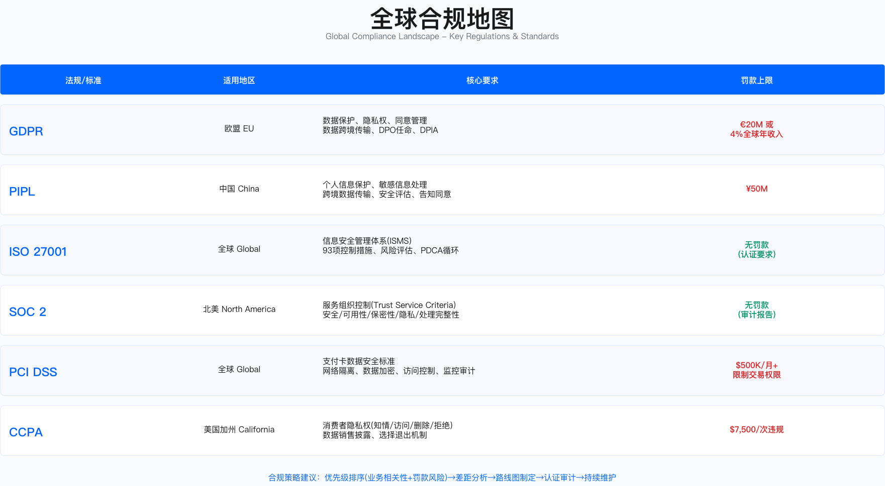

# 2.3　合规管理框架

> Compliance Management Framework: Navigating Global Regulations

---

> 本节导读：合规不是"通过审计那一刻"，而是持续保持可审计状态的能力。本节从三个维度展开：2.3.1 构建全球合规认知地图——法规分类、GDPR/PIPL/CCPA 差异、法规冲突的决策框架、ISO 27001 与 SOC 2 的选择逻辑；2.3.2 介绍合规差距分析的五步法，把"我们离合规有多远"转化为可执行的整改计划；2.3.3 聚焦跨区域合规策略与自动化实施。GRC 平台选型可参考 2.5.1，政策体系设计见 2.4.1。

---

## 2.3.1 全球合规框架体系

合规管理的核心挑战在于：企业面临的监管要求呈多层次、跨地域分布，且不同法规之间存在重叠甚至冲突。建立统一的分类认知框架，是有效分配资源的前提。

### 合规框架分类

合规框架按监管性质可分为四类，其强制性程度和违规后果差异显著。

| 类别 | 说明 | 示例 | 强制性 |
|------|------|------|-------|
| 法律法规 | 政府颁布，强制执行 | GDPR、PIPL、SOX、HIPAA | 强制 |
| 行业标准 | 行业协会制定，准强制 | PCI DSS、SWIFT CSP | 准强制（不合规无法开展业务） |
| 认证框架 | 自愿认证，客户要求 | ISO 27001、SOC 2 | 自愿（但客户/市场要求） |
| 最佳实践 | 行业指南，参考性 | NIST CSF、CIS Controls | 自愿 |

这一分类的实际意义在于资源配置优先级：法律法规违规可能导致行政处罚甚至刑事责任，行业标准违规影响业务准入，认证框架影响客户信任，最佳实践则主要用于能力对标。企业应根据业务场景和风险偏好确定优先级排序，而不是平均分配精力。



*图：全球主要合规框架分布——按地域和行业领域的二维分类*

### 隐私与数据保护法规对比

跨国企业面临的典型困境是：同一份用户数据在不同司法管辖区需遵守不同法规，而这些法规的要求可能相互冲突。理解差异是冲突处理的前提。

GDPR、PIPL、CCPA 核心差异

| 维度 | GDPR（欧盟） | PIPL（中国） | CCPA（加州） |
|------|------------|------------|-------------|
| 生效时间 | 2018 年 5 月 | 2021 年 11 月 | 2020 年 1 月（2023 年 CPRA 增强） |
| 适用范围 | 处理 EU 居民数据的全球企业 | 处理中国境内个人信息的企业 | 处理 CA 居民数据的企业（年收入门槛适用） |
| 处理合法性 | 6 种法律基础（同意/合同/法定义务/生命利益/公共利益/合法利益） | 7 种法律基础（类似 GDPR，但无"合法利益"） | 无明确合法性要求，侧重披露与选择退出 |
| 同意要求 | 明确、具体、自由、知情 | 同 GDPR，但更严格（单独同意敏感数据） | 16 岁以下需父母同意 |
| 数据主体权利 | 8 项（知情/访问/更正/删除/限制/携带/反对/自动化决策） | 7 项（类似 GDPR，无"携带权"） | 4 项（知情/删除/选择退出/不歧视） |
| 跨境传输 | 充分性认定/SCC/BCR/TIA | 安全评估/标准合同/认证 | 无明确跨境限制 |
| DPO 要求 | 公共机构/大规模处理/敏感数据必须设立 | 处理敏感数据达到规定数量需设立 | 无强制要求 |
| 罚款上限 | 第 83 条第 5 款：€20M 或全球年营业额 4%，**取较高者**（一般违规为 €10M 或 2%，取较高者）[1] | 第 66 条：情节严重的处 5000 万元以下**或者**上一年度营业额 5% 以下——法条用"或者"，**未规定取较高者**；另可责令暂停/终止服务、吊销许可、对直接责任人处 10 万至 100 万元并可禁业[2] | 第 1798.155 条：每次违规 ≤ $2,500；**故意违规或涉及明知未满 16 岁消费者个人信息的违规**每次 ≤ $7,500[3] |
| 通报时限 | 72 小时内向监管机构报告（第 33 条）[1] | PIPL 第 57 条要求"立即采取补救措施并通知"，未设小时数；具体时限见《网络数据安全管理条例》（2025-01-01 施行）——危害国家安全或公共利益的事件须 24 小时内报告[4] | 无联邦统一时限，各州泄露通知法各自规定 |

适用边界：上述对比适用于需要同时在多个司法管辖区运营的企业。单一市场运营的企业可简化为单一法规合规，但仍需关注数据跨境流动场景。

三大法规的核心冲突点集中在数据本地化、跨境传输机制、删除权与保留义务的平衡。技术实现上需支持数据分类存储和差异化生命周期管理——这一点在下文法规冲突处理框架中具体展开。

→ *GDPR/PIPL/CCPA 的完整实施指南与技术落地方案详见 [第9章：隐私合规](../../第03部分_数据安全与隐私/第09章_隐私合规/)*

### 法规冲突处理框架

法规冲突是跨国合规中最难处理的实操问题，"任何单边合规都导致另一边违法"的困局在金融、电商等跨境业务中频繁出现。以 GDPR 删除权与中国反洗钱法保留义务的冲突为例，演示系统化决策框架。

冲突场景分析

| 冲突维度 | GDPR 要求 | 中国法律要求 | 冲突根源 |
|---------|---------|-------------|---------|
| 法律依据 | GDPR 第 17 条"被遗忘权"：用户有权要求删除个人数据[1] | 《反洗钱法》（2024 年修订，2025-01-01 施行）**第 34 条**：客户身份资料自业务关系结束后、客户交易信息自交易结束后，**应当至少保存十年**[5] | 删除义务与保留义务直接冲突 |
| 适用对象 | 欧盟居民（无论国籍），处理 EU 居民数据的全球企业 | 中国境内金融交易，涉及跨境支付的电商平台 | 同一用户同时受两地法律保护 |
| 违规后果 | 罚款最高 €20M 或全球年营业额 4%（取较高者）[1] | 按 2024 年修订的《反洗钱法》第 52-55 条分档：未建立内控体系或未履行客户尽调、记录保存、大额/可疑交易报告义务的，情节严重处 20 万至 200 万元；为身份不明客户开户、伪造记录、故意规避义务等情节严重的处 50 万至 500 万元；因违规导致洗钱后果的处 50 万至 1000 万元，涉案金额 1000 万元以上的按涉案金额 20%-200% 处罚，并可责令停业、吊销许可，另有刑事责任[5] | 任何单边合规都导致另一边违法 |
| 技术约束 | 需要跨系统删除（订单/支付/CRM/营销），数据关联复杂 | 需保留完整交易链（订单→支付→结算），数据不可篡改 | 全局数据库架构无法同时满足删除和保留 |

决策路径：为什么必须找例外条款

单边合规方案均存在重大风险：完全删除满足 GDPR 但违反反洗钱法；完全保留满足反洗钱法但违反 GDPR。打破这一困局的关键在于 GDPR 本身预留了例外出口——第 17 条第 3 款 b 项规定："为遵守欧盟或成员国法律规定的法律义务，或为执行公共利益任务所必需的处理，可以拒绝删除请求。"这为折中方案提供了法律基础。

这一例外条款的适用前提是：保留的数据必须是"法律义务明确要求"的最小集合，不能以"合法义务"为由扩大保留范围。

实施框架

| 实施步骤 | 核心内容 | 法律依据 | 技术实现 |
|---------|---------|---------|---------|
| 数据分类 | 区分营销数据（可删除）与财务数据（必须保留） | GDPR 第 5 条"数据最小化原则" | 数据库标签分类 |
| 立即删除 | 浏览历史、购物车、营销偏好、设备指纹、Cookie | GDPR 第 17 条删除义务 | 自动化脚本，跨系统级联删除 |
| 保留最小必要数据 | 交易记录（订单号/金额/时间/商品类别），支付信息（脱敏），KYC 信息 | 《反洗钱法》（2024 修订）第 34 条[5] + GDPR 第 17 条第 3 款 b 项例外[1] | 数据脱敏，仅保留监管所需字段 |
| 法律依据告知 | 向用户发送详细回复：已删除内容+保留内容+法律依据+保留期限+投诉渠道 | GDPR 第 12 条"透明沟通义务" | 自动生成多语言邮件模板 |
| 双边监管备案 | 向相关监管机构提交合规报告 | GDPR 第 30 条"处理活动记录" + PIPL 第 25 条"安全评估" | 合规管理平台自动生成监管报告 |

常见误区

1. 忽视例外条款：直接拒绝删除请求而不援引法律依据，导致 GDPR 投诉
2. 过度保留数据：以合规为由保留非必要数据，违反数据最小化原则
3. 缺乏透明沟通：未向用户说明保留原因和期限，增加投诉风险
4. 单边决策：未与两地监管机构沟通，事后被动应对

验证方法

- 法律合规性审查：外部律师出具法律意见书，确认例外条款适用性
- 数据分类测试：抽样验证数据分类准确性，确保营销数据与财务数据分离
- DSR 流程测试：模拟用户删除请求，验证响应时效和内容完整性
- 审计追溯：验证删除和保留操作的日志记录完整性

运行指标

- DSR 响应时效：从收到请求到完成处理的天数（目标：≤ PIPL 要求的时限）
- 数据分类准确率：营销数据与财务数据分类正确率
- 删除完整性：级联删除覆盖系统数
- 投诉率：因删除处理引发的监管投诉数量

### 统一隐私合规框架设计

基于上述分析，跨国企业应采用"以最严标准为基准，叠加本地化差异"的设计思路。这种架构的优势在于：维护一套基础机制，而不是 N 套平行机制——减少重复建设，降低因版本分叉导致的合规漏洞。

```
设计思路：以 GDPR 为基准（最严格），叠加 PIPL/CCPA 差异

统一框架：
├─ 隐私政策（Privacy Policy）
│   ├─ 全球版（GDPR 标准）
│   ├─ 中国版（增加 PIPL 特定条款：出境备案、敏感数据单独同意）
│   └─ 加州版（增加 CCPA 披露：Do Not Sell、数据类别）
│
├─ 数据主体权利（DSR）流程
│   ├─ 统一 DSR 门户（支持 8 项权利）
│   ├─ 中国特殊流程（人工审核、国内数据优先）
│   └─ 响应时限：统一采用最严格要求
│
├─ 跨境传输
│   ├─ 欧盟 → 中国：SCC + 中国标准合同
│   ├─ 中国 → 欧盟：安全评估 + SCC + TIA
│   └─ 美国内部：遵循最小化原则
│
└─ 事件响应
    ├─ 统一响应剧本
    ├─ 通报时限：采用最严格要求
    └─ 多语言模板
```

### 信息安全认证对比

认证选择是合规策略的高频决策，其核心是理解两类主流认证的本质差异：ISO 27001 评估的是管理体系（ISMS）的建立和运行，SOC 2 评估的是特定期间内控制的实际运行效果。这一差异直接影响认证准备方式和客户接受度。

还有一类认证正在进入选型视野：ISO/IEC 42001 是目前可供第三方认证的 AI 管理体系（AIMS）标准，与 ISO 27001 同属管理体系族、可共用一套内审与管理评审机制，因此已有 ISMS 的组织做增量认证比从零建体系省得多。它与 NIST AI RMF（自愿性框架、只给职能不给控制清单）和 EU AI Act（强制法规、按风险等级分档）三者的定位差异、选择决策树、认证成本构成与路线图，见 [18.6 AI 治理与合规落地](../../第06部分_AI驱动的安全创新/第18章_AI系统安全/18.6_AI治理与合规落地.md)。

ISO 27001 与 SOC 2 对比

| 维度 | ISO 27001 | SOC 2 Type II |
|------|-----------|--------------|
| 发布机构 | ISO/IEC 国际标准组织 | AICPA（美国注册会计师协会） |
| 适用地区 | 全球 | 主要北美，全球认可度提升 |
| 认证周期 | 3 年一个周期；首次认证后第一次监督审计不得晚于认证决定日起 12 个月，此后除再认证年度外每个日历年至少一次（ISO/IEC 17021-1 第 9 章）[8] | 年度审计（需连续，观察期不可中断） |
| 控制框架 | 4 主题域 93 控制项（ISO/IEC 27001:2022；2013 版为 14 域 114 控制）[6] | 5 类信任服务标准（Trust Services Criteria）——AICPA 自 2017 版起已把"原则（principles）"改称"类别（categories）"，写正式文件时宜用后者[7] |
| 审计范围 | 整个 ISMS（信息安全管理体系） | 可选择 TSC 原则组合 |
| 审计结果 | 通过/不通过（证书） | 审计报告（含例外） |
| 公开性 | 证书可公开展示 | 报告需签 NDA 后提供（Type II） |
| 成本区间 | 含咨询费用，因企业规模和范围差异较大 | 因审计师和范围差异较大 |
| 周期 | 首次认证 6-12 个月 | 6-9 个月（需先运行 3-12 个月） |

SOC 2 五大信任服务原则

SOC 2 的灵活性体现在原则组合的可选性上——Security 是必选项，其余四项根据业务场景选择。这种设计允许 SaaS 企业聚焦客户最关心的维度，而不是一次性承担全部合规负担。

```
SOC 2 五大原则：

1. Security（安全性）- 必选
   ├─ 访问控制
   ├─ 逻辑物理安全
   └─ 系统监控

2. Availability（可用性）- 可选
   ├─ SLA 达标
   ├─ 灾难恢复
   └─ 容量管理

3. Processing Integrity（处理完整性）- 可选
   ├─ 系统处理准确完整
   ├─ 错误处理
   └─ 数据验证

4. Confidentiality（机密性）- 可选
   ├─ 数据加密
   ├─ 密钥管理
   └─ 数据生命周期

5. Privacy（隐私）- 可选
   ├─ 隐私通知
   ├─ 数据主体权利
   └─ 披露管理
```

选择决策

认证选择取决于目标市场和客户要求：欧洲市场客户更认可 ISO 体系，北美 SaaS 客户通常要求 SOC 2 Type II，全球化企业多采用双认证策略。金融支付场景需叠加 PCI DSS，上市公司需满足 SOX 要求。两个认证之间存在控制映射，双认证的边际成本低于两次独立建设。

### 支付与金融合规

PCI DSS 4.0 核心要求

PCI DSS（Payment Card Industry Data Security Standard）是支付卡行业的强制性安全标准。4.0 版本于 2024 年生效，引入了若干重要变更。理解其 12 大要求与 6 个目标的组织方式，有助于把握合规重点而不是陷入逐条核查的细节。

12 大要求按"保护什么→如何保护→如何验证"的逻辑分为三层：网络安全（Req 1-2）是前置基础；持卡人数据保护（Req 3-4）是核心目标；访问控制、监控、漏洞管理（Req 5-11）是持续运营机制；政策体系（Req 12）贯穿全程。

```
12 大要求（Grouped into 6 Goals）：

Goal 1: Build and Maintain a Secure Network
├─ Req 1: 安装和维护防火墙配置
└─ Req 2: 不使用供应商默认密码

Goal 2: Protect Cardholder Data
├─ Req 3: 保护存储的持卡人数据（加密/令牌化）
└─ Req 4: 加密传输中的持卡人数据（TLS 1.2+）

Goal 3: Maintain a Vulnerability Management Program
├─ Req 5: 使用并定期更新反病毒软件
└─ Req 6: 开发和维护安全系统和应用程序（SDL）

Goal 4: Implement Strong Access Control Measures
├─ Req 7: 限制对持卡人数据的访问（最小权限）
├─ Req 8: 为系统组件分配唯一 ID（MFA）
└─ Req 9: 限制对持卡人数据的物理访问

Goal 5: Regularly Monitor and Test Networks
├─ Req 10: 跟踪和监控所有对网络资源和持卡人数据的访问
└─ Req 11: 定期测试安全系统和流程（渗透测试/漏扫）

Goal 6: Maintain an Information Security Policy
└─ Req 12: 维护解决信息安全的政策
```

PCI DSS 4.0 主要变更

4.0 版本的核心变化方向是"从规定性要求转向基于风险的灵活控制"。定制化方法（Customized Approach）的引入允许成熟企业设计等效控制，但代价是必须充分证明等效控制的有效性——这对成熟度较低的组织反而增加了负担。

| 新增要求 | 说明 | 影响评估 |
|---------|------|---------|
| 多因素认证（MFA）扩展 | 所有访问持卡人数据环境（CDE）的用户必须使用 MFA | 需扩展 MFA 部署范围 |
| 密码学敏捷性 | 定期评估加密算法强度，制定升级计划 | 需建立密码学资产清单 |
| 定制化方法（Customized Approach） | 允许企业设计等效控制措施（需证明有效性） | 高成熟度企业可利用灵活性 |
| 自动化日志审查 | 使用自动化工具（SIEM）监测异常 | 需投资 SIEM 能力 |
| 容器安全 | 明确容器化环境的安全要求 | 使用容器编排平台的企业需额外控制 |

PCI DSS 合规等级

合规等级按年交易量划分，决定评估要求和成本投入：

| 等级 | 年交易量（Visa/MC） | 评估要求 |
|------|------------------|---------|
| Level 1 | > 600 万笔/年 | QSA 年度现场审计 + 季度 ASV 扫描 |
| Level 2 | 100 万 - 600 万笔/年 | SAQ + 季度 ASV 扫描 |
| Level 3 | 2 万 - 100 万笔/年（e-commerce） | SAQ + 季度 ASV 扫描 |
| Level 4 | < 2 万笔/年 | SAQ + 年度 ASV 扫描 |

### 上市公司合规

SOX（Sarbanes-Oxley Act）核心要求

SOX 法案适用于美国上市公司及其子公司，核心是第 404 条款关于内部控制的要求。404 条款的本质是要求管理层对内部控制的有效性承担明确的法律责任——这一点与 ISO 27001 的"建立体系"导向有本质区别。

```
SOX 404 要求：

1. 管理层职责（404a）
   ├─ 建立并维护内部控制框架
   ├─ 评估内部控制有效性
   └─ 年度内控报告

2. 审计师鉴证（404b）
   ├─ 外部审计师审计内控有效性
   ├─ 发表独立意见
   └─ 识别重大缺陷（Material Weakness）

内部控制框架（通常使用 COSO）：
├─ 控制环境（Control Environment）
├─ 风险评估（Risk Assessment）
├─ 控制活动（Control Activities）
├─ 信息与沟通（Information & Communication）
└─ 监控（Monitoring）
```

IT 一般控制（ITGC）与应用控制

ITGC 是 SOX IT 合规的基础层，覆盖支撑 IT 环境的横向控制；应用控制是业务逻辑层，针对特定系统的纵向控制。两类控制相互依赖——ITGC 失效会直接影响应用控制的可信度。

| 类型 | 说明 | 示例 |
|------|------|------|
| ITGC | 支撑 IT 环境的基础控制 | 访问控制、变更管理、备份恢复、职责分离 |
| 应用控制 | 针对特定应用的业务逻辑控制 | ERP 系统的采购审批工作流、财务系统的自动对账 |

SOX 合规时间表（IPO 企业）

IPO 前 12-18 个月应启动 SOX 准备工作，按阶段推进：启动阶段完成项目章程和范围界定；规划阶段完成流程梳理和控制设计；执行阶段实施控制并采集证据；测试阶段完成管理层测试和外部审计。IPO 后第一年可豁免 404b（仅需管理层评估），第二年起需完整的审计师鉴证。

---

## 2.3.2 合规差距分析

差距分析（Gap Assessment）是合规项目的起点。它解决的问题不是"我们合规吗"，而是"距离合规还差什么、差距有多大、该先补哪个"——这三个问题的答案共同构成整改计划的输入。

### 五步法流程


### 步骤 1：范围界定

范围界定决定了后续评估的边界和资源投入。这一步常被低估——范围定错，后续所有工作都会偏移。界定过程通常通过工作坊形式完成，参与方包括合规负责人、CISO/信息安全团队、法务/DPO、IT 负责人、业务代表、财务（如涉及 SOX）。

输出物包括：合规范围声明（Scope Statement）、业务流程清单、系统清单、数据流图、地理位置清单（跨境数据）。

范围界定示例：ISO 27001

| 维度 | 范围定义 | 排除项 |
|------|---------|-------|
| 组织范围 | 全球总部 + 研发中心 + 数据中心 | 区域销售办公室（人数较少） |
| 业务流程 | 产品开发、运营、客户支持 | 行政/HR 流程 |
| 系统 | 生产环境、办公网络、云基础设施 | 测试/开发环境 |
| 数据 | 客户数据、支付数据、员工数据 | 营销数据（非敏感） |
| 物理位置 | 主要办公场所、数据中心、云区域 | 共享办公空间 |

常见误区

1. 范围过宽：将非核心业务纳入范围，增加认证成本和周期
2. 范围过窄：遗漏关键系统或数据流，导致认证价值打折
3. 边界模糊：范围声明不清晰，审计时产生歧义

### 步骤 2：现状评估

评估方法选择

没有单一方法能覆盖所有控制类型。选择的核心原则是：政策类控制适合文档审查，技术类控制需要技术测试，流程类控制需要访谈和观察相结合。

| 方法 | 适用场景 | 优点 | 缺点 |
|------|---------|------|------|
| 问卷调查 | 初步评估、大范围扫描 | 快速、标准化 | 依赖填写质量 |
| 文档审查 | 评估政策、流程、证据 | 客观、可追溯 | 耗时 |
| 访谈 | 深度了解流程、控制执行 | 信息丰富 | 主观、耗时 |
| 现场观察 | 验证物理控制、操作规范 | 直观、真实 | 无法大规模 |
| 技术测试 | 验证技术控制有效性 | 精确 | 需专业技能 |

控制评估评分标准

评分标准的设计目的是将主观判断转化为可比较的数值——不同评估人、不同时间点的评估结果才能纵向对比。

| 评分 | 说明 | 定义 | 差距程度 |
|------|------|------|---------|
| 5 - 优化 | 控制持续优化，数据驱动 | 自动化监控+定期优化 | 无差距 |
| 4 - 管理 | 控制有效，有监控机制 | 定期监测+有效性评估 | 轻微差距 |
| 3 - 已定义 | 控制已实施，流程文档化 | 有政策+有执行+有证据 | 中等差距 |
| 2 - 可重复 | 控制部分实施，不完整 | 有政策但执行不一致 | 较大差距 |
| 1 - 初始 | 控制未实施或临时性 | 无政策或无执行 | 重大差距 |
| 0 - 不适用 | 控制不适用于本组织 | - | - |

### 步骤 3：差距识别

差距识别需要将标准要求与当前状态逐项对照，明确差距描述、差距等级和业务影响。描述质量决定整改计划的可执行性——"漏洞管理不达标"是无效描述，"高危漏洞修复时效超过 SLA 的 1.8 倍"才能直接转化为行动项。

差距分析矩阵示例

| 控制项 | 标准要求 | 当前状态 | 差距描述 | 差距等级 | 影响 |
|--------|---------|---------|---------|---------|------|
| 资产清单 | 维护完整资产清单（硬件/软件/数据） | 有硬件清单，但软件清单不完整，无数据资产清单 | 缺少软件资产清单和数据资产清单 | 高 | 无法评估资产风险，审计不通过 |
| 漏洞管理 | 定期扫描+高危漏洞及时修复 | 每月扫描，但高危漏洞修复时效不达标 | 修复时效不达标 | 中 | 增加被攻击风险，审计发现 |
| 访问权限复审 | 用户访问权限定期复审（季度） | 仅年度复审 | 复审频率不足 | 低 | 可能存在权限蔓延，风险可控 |

差距等级定义

```
高差距（High Gap）：
- 控制完全缺失
- 或涉及高风险领域（如加密、访问控制）
→ 审计不通过，需优先整改

中差距（Medium Gap）：
- 控制部分实施但不完整
→ 审计可能有条件通过，需计划整改

低差距（Low Gap）：
- 控制基本有效但有改进空间
→ 审计可通过，持续改进
```

### 步骤 4：优先级排序

优先级排序的目标是在有限资源约束下，最大化审计通过率和风险降低效果。单纯按差距等级排序会忽视整改难度和审计关键性，导致资源投入错位。

优先级评分模型

```
优先级得分 = 风险评分 × 0.4 + 整改难度 × 0.3 + 审计关键性 × 0.3

风险评分（1-5分）：
- 5分：涉及高风险（数据泄露、可用性）
- 3分：涉及中风险
- 1分：涉及低风险

整改难度（1-5分，分数越低越容易）：
- 1分：简单（更新文档、调整配置）
- 3分：中等（采购工具、流程变更）
- 5分：复杂（系统重构、组织变革）

审计关键性（1-5分）：
- 5分：必审项（核心控制）
- 3分：抽样项
- 1分：选审项
```

这里的权重设置（风险 0.4、难度 0.3、审计 0.3）是一种参考分配，实际项目中应根据认证截止日期与风险管理目标的相对权重调整——时间紧迫时可增加审计关键性权重，长期规划时可增加风险评分权重。

优先级排序示例

| 控制项 | 风险 | 难度 | 审计 | 得分 | 优先级 |
|--------|------|------|------|------|--------|
| 数据加密（传输+静态） | 5 | 3 | 5 | 4.3 | P0 |
| 资产清单（数据资产） | 4 | 4 | 5 | 4.3 | P0 |
| MFA 部署（生产环境） | 5 | 2 | 5 | 4.2 | P0 |
| 漏洞修复时效 | 4 | 2 | 4 | 3.4 | P1 |
| 访问权限复审频率 | 3 | 1 | 3 | 2.4 | P2 |

### 步骤 5：整改计划

整改计划需要明确目标状态、行动项、责任人、截止日期和资源需求。计划的有效性取决于行动项的粒度——"部署 MFA"是无效行动项，"完成生产环境 Okta MFA 配置并推送强制策略"才能跟踪。

整改计划模板

| 项目 | 差距描述 | 目标状态 | 行动项 | 责任人 | 截止日期 | 状态 |
|------|---------|---------|--------|--------|---------|------|
| 数据加密 | 数据库未加密 | 所有生产数据库启用 TDE | 1. 评估性能影响 2. 制定部署方案 3. 生产部署 4. 验证 | DBA 负责人 | 第 2 周 | 进行中 |
| MFA 部署 | 生产环境无 MFA | 所有生产访问强制 MFA | 1. 选型 MFA 方案 2. POC 测试 3. 全员部署 4. 策略强制 | IAM 负责人 | 第 2 周 | 已完成 |

整改跟踪机制

整改跟踪应建立分级汇报机制：P0 项目采用每日站会跟踪，P0/P1 项目采用周报汇报，所有项目采用月度 GRC 委员会汇报（2.6.1 中的三层会议体系提供了具体的会议设计参考）。审计前两周应进行预审和证据准备检查。

验证方法

- 证据完整性检查：验证每个控制项的证据文档齐全
- 控制有效性测试：抽样测试控制执行情况
- 模拟审计：邀请外部或内部审计进行预审
- 差距关闭确认：逐项确认差距整改完成

运行指标

- 整改完成率：已完成整改项/总整改项
- 按时完成率：按截止日期完成的整改项比例
- 差距关闭周期：从识别到关闭的平均天数
- 审计发现数量：正式审计中的不符合项数量

---

## 2.3.3 合规项目管理

### 项目生命周期

合规认证项目通常遵循六阶段模型。这个模型的关键点不在于阶段划分本身，而在于每个阶段的退出条件——跳过"差距分析"直接进入"控制实施"，是合规项目返工率居高不下的主要原因之一。

```
1. 启动（Initiation）
   ├─ 项目章程
   ├─ 范围界定
   └─ 团队组建

2. 规划（Planning）
   ├─ 差距分析
   ├─ 整改计划
   └─ 资源分配

3. 执行（Execution）
   ├─ 控制实施
   ├─ 证据采集
   └─ 培训

4. 测试（Testing）
   ├─ 管理层测试
   ├─ 预审（Pre-audit）
   └─ 整改

5. 认证（Certification）
   ├─ 正式审计
   ├─ 发现整改
   └─ 获证

6. 维护（Maintenance）
   ├─ 持续监控
   ├─ 年度监督审计
   └─ 持续改进
```

### ISO 27001 项目时间表

ISO 27001 认证项目周期因企业规模和现有基础差异较大，以下为参考时间表：

| 阶段 | 关键活动 | 交付物 | 里程碑 |
|------|---------|--------|--------|
| 启动 | 项目启动会、范围界定、选择认证机构 | 项目章程、范围声明 | 项目批准 |
| 规划 | 差距分析、风险评估、制定整改计划 | 差距报告、项目计划 | 计划批准 |
| ISMS 建设 | 制定政策/流程、风险处置、控制实施 | 4 个主题域（组织/人员/物理/技术）93 项控制的政策/流程文档（ISO 27001:2022） | ISMS 文档完成 |
| 执行 | 控制运行、培训、证据采集 | 运行证据 | 控制运行满足最低要求 |
| 内审 | 内部审计、管理评审 | 内审报告、管理评审纪要 | 内审完成 |
| Stage 1 审计 | 认证机构文档审查 | 文档审查报告、整改清单 | Stage 1 通过 |
| 整改 | 整改 Stage 1 发现 | 整改证据 | 整改关闭 |
| Stage 2 审计 | 认证机构现场审计 | 审计报告、不符合项清单 | Stage 2 完成 |
| 整改&获证 | 整改不符合项、颁发证书 | 整改证据、ISO 27001 证书 | 获证 |

### SOC 2 Type II 项目时间表

SOC 2 Type II 的特殊性在于需要连续的控制运行证据（通常 6-12 个月）。这意味着时间表本身是不可压缩的——无论准备多充分，审计期开始前必须有足够的控制运行历史。许多企业低估了这一点，导致项目延期。

```
阶段 1: 准备期
├─ 就绪评估（Readiness Assessment）
│   └─ 输出：差距报告、整改计划
├─ 控制设计与实施
│   └─ 输出：控制矩阵、政策文档
└─ 试运行
    └─ 输出：初步运行证据

阶段 2: 审计期
├─ 审计观察期（需连续 6-12 个月）
│   ├─ 证据采集（自动化+人工）
│   ├─ 季度自评
│   └─ 预审（Pre-audit）
└─ 正式审计
    ├─ 审计师现场/远程审计
    ├─ 发现整改
    └─ 输出：SOC 2 Type II 报告

阶段 3: 维护期
├─ 年度重审
├─ 控制变更管理
└─ 持续监控
```

关键约束

1. 审计观察期不能缩短：SOC 2 Type II 必须有足够的控制运行证据
2. 证据的连续性：不能有证据断档（如日志丢失）
3. 审计师选择：应选择有行业经验的审计师

### 项目成功要素

高层支持：CEO/CFO/CISO 明确支持，定期参与评审。缺乏高层支持的项目容易在资源分配和跨部门协调上遇阻。

专职团队：配备专职项目经理和合规工程师。兼职模式容易导致进度延误。

跨职能协作：打破部门墙，建立安全/IT/法务/业务的协作机制。

外部专家：首次认证建议聘请咨询公司加速，降低返工风险。

工具投资：使用 GRC 平台（2.5.1）管理控制/证据/任务，提升效率和可追溯性。

培训文化：全员培训而非仅合规团队，确保控制执行的一致性。

风险优先：优先解决高风险差距，而非追求完美覆盖。

自动化：尽可能自动化证据采集，减少人工采证的工作量和错误率。

持续改进：获证后持续优化，而非将认证视为一次性项目。

---

## 2.3.4 跨区域合规策略

### 中国与欧美合规差异

理解监管风格差异是跨区域合规策略设计的前提，直接影响团队配置、沟通方式和技术架构选择。

| 维度 | 中国 | 欧盟 | 美国 |
|------|------|------|------|
| 监管风格 | 强监管、事前审批 | 强监管、事后问责 | 行业自律+联邦/州法律拼图 |
| 数据本地化 | 关基+重要数据必须境内 | 无本地化要求 | 无联邦要求（部分州/行业有要求） |
| 跨境审批 | 需安全评估/标准合同/认证 | SCC/BCR/充分性认定 | 一般无限制（CLOUD Act 例外） |
| 监管机构 | 网信办、工信部、公安部（多头监管） | EDPB、各国 DPA | FTC、SEC、州总检察长（分散） |
| 企业责任 | 平台责任重（电商法、内容审查） | 平台责任（DSA/DMA） | 行业自律为主 |

### 跨区域合规架构

中心辐射模型（Hub-Spoke）

这一架构的设计逻辑是：统一框架与工具集中在全球合规中心（CoE），降低重复建设成本；本地化执行由区域团队承担，确保监管沟通和合规细节的准确性。两层之间的接口是关键——标准化接口越清晰，框架落地的一致性越高。

```
            ┌──────────────────┐
            │   全球合规中心    │
            │  (Global CoE)    │
            │                  │
            │  - 统一框架      │
            │  - 工具平台      │
            │  - 培训支持      │
            └────────┬─────────┘
                     │
     ┌───────────────┼───────────────┐
     │               │               │
┌────▼────┐    ┌────▼────┐    ┌───▼─────┐
│ 中国团队 │    │ 欧盟团队 │    │ 美国团队 │
│         │    │         │    │         │
│ - PIPL  │    │ - GDPR  │    │ - CCPA  │
│ - 网安法 │    │ - NIS2  │    │ - SOX   │
│ - 关基  │    │ - DSA   │    │ - HIPAA │
└─────────┘    └─────────┘    └─────────┘
     │               │               │
 本地监管沟通    本地监管沟通    本地监管沟通
```

### 统一合规框架设计原则

以最严标准为基准：GDPR 是当前最严格的隐私法规之一，以其为基准设计全球统一框架，再叠加本地化差异，可以降低维护多套体系的复杂度。

分层设计

```
Layer 1: 全球统一框架（Global Baseline）
├─ 核心原则、政策、流程
└─ 适用全球所有地区

Layer 2: 区域特定要求（Regional Requirements）
├─ 中国：PIPL 特殊要求（出境备案、敏感数据单独同意）
├─ 欧盟：GDPR 特殊要求（DPO 强制、TIA）
└─ 美国：CCPA 特殊要求（Do Not Sell、CCPA 披露）

Layer 3: 行业特定要求（Industry Requirements）
├─ 金融：PCI DSS、AML
├─ 医疗：HIPAA
└─ 上市：SOX
```

技术架构支持

```
数据架构：
├─ 中国数据中心
│   └─ 存储中国用户数据（满足本地化要求）
├─ 欧盟数据中心
│   └─ 存储欧盟用户数据（满足 GDPR 就近原则）
├─ 美国数据中心
│   └─ 存储美国用户数据
└─ 全球数据目录（Data Catalog）
    └─ 统一数据地图、数据血缘、跨境流动记录
```

### 跨境数据传输合规方案

以跨国电商企业为例，说明跨境数据传输的合规方案设计：

场景：总部美国（研发+数据分析），运营中心中国（客户数据）、欧盟（客户数据），数据流动中国 ↔ 美国、欧盟 ↔ 美国。

| 数据流 | 法规要求 | 合规机制 | 技术措施 |
|--------|---------|---------|---------|
| 中国 → 美国 | PIPL：需安全评估或标准合同 | 签署标准合同+备案 | 数据脱敏、加密传输、访问审计 |
| 欧盟 → 美国 | GDPR：需 SCC+TIA | 签署 SCC 2021 Module 2，完成 TIA | 最小化传输、假名化、访问日志 |
| 美国 → 中国 | 中国入境：需合法性评估 | 评估传输必要性 | 仅传输必要数据、加密存储 |
| 美国 → 欧盟 | GDPR：需 SCC+TIA | 签署 SCC 2021 Module 2 | 同上 |

TIA（Transfer Impact Assessment）要素

TIA 的设计初衷是填补 Schrems II 判决留下的"合同措施不足以保护数据免受目的国政府访问"的法律漏洞。它要求评估方真正分析接收国的法律环境，而不是简单签署 SCC 后视为合规。核心要素包括：

1. 传输基本信息：数据输出方、接收方、数据类型、传输目的、传输频率、数据量
2. 接收国法律环境评估：隐私法律框架、政府监控法律、执法机构数据访问权限
3. 风险评估：识别高/中/低风险，明确风险来源
4. 补充措施：技术措施（假名化、加密）、合同措施（SCC、政府请求通知条款）、组织措施（访问审批、日志监控）
5. 结论与批准：残余风险评估、批准人签字、复审日期

常见误区

1. TIA 形式化：将 TIA 视为文档合规而非实质性风险评估
2. 补充措施不充分：仅依赖合同措施而忽视技术措施
3. 缺乏定期复审：法律环境变化后未更新 TIA

---

## 2.3.5 合规自动化

### 自动化的价值定位

合规自动化解决的核心问题是：随着控制项数量增长，人工采证和测试的边际成本线性上升，而自动化采集的边际成本趋近于零。这一规律决定了：控制项越多、审计频率越高，自动化的 ROI 越显著。

传统方式与自动化方式对比

| 维度 | 传统方式 | 自动化方式 | 改善方向 |
|------|---------|-----------|---------|
| 证据采集 | 手工截图+文档 | API 自动拉取 | 效率和准确性 |
| 控制测试 | 定期人工抽样 | 持续自动化测试（CCM） | 覆盖率和时效性 |
| 合规报告 | 周期性人工汇总 | 实时仪表盘 | 可见性 |
| 政策分发 | 邮件+人工签收 | 自动推送+电子签名 | 签收率和可追溯性 |
| 变更审批 | 邮件+会议 | 工作流自动化 | 审批周期 |

### 合规自动化工具分类

工具选择需要匹配企业规模和合规成熟度，而不是追求功能最全。初创企业和中小型 SaaS 用 Vanta/Drata 可以快速启动 SOC 2，但这类工具的深度集成能力和多框架支持不如企业级 GRC 平台。两类工具的定位差异比品牌差异更重要（平台比较详见 2.5.1）。

| 类别 | 代表工具 | 适用场景 |
|------|---------|---------|
| 合规自动化平台 | Vanta、Drata、Secureframe | SOC 2/ISO 27001 自动化 |
| GRC 平台 | ServiceNow IRM、RSA Archer | 企业级 GRC 管理 |
| 隐私管理 | OneTrust、TrustArc、BigID | GDPR/PIPL 合规 |
| 云安全合规 | Wiz、Orca、Prisma Cloud | 云配置合规（CSPM） |
| 数据发现 | BigID、Varonis、Microsoft Purview | 数据分类+发现 |
| 政策管理 | PolicyTech、MetricStream | 政策生命周期管理 |

关键约束

1. 工具能力边界：自动化工具可以采集证据、监测控制状态，但无法替代人工判断（如政策解读、风险决策）
2. 集成复杂度：与现有系统（IAM、SIEM、CMDB）的集成需要投入
3. 持续维护：工具需要随系统变更更新配置

### 自动化实施要点

证据采集自动化：通过 API 连接云平台、身份管理系统、代码仓库、工单系统等，自动拉取配置快照、访问日志、变更记录。这是自动化投资回报最直接的领域——以往需要数周人工整理的审计包，可以缩短到按需生成。

控制监测自动化：实时监测控制状态（如 MFA 启用率、日志留存、加密配置），异常时自动告警。持续控制监测（CCM）将传统"点式抽检"升级为"持续检测"，审计发现问题的时间窗口从月度/季度缩短至小时级。

任务管理自动化：差距识别后自动生成整改任务，分配责任人，跟踪进度。

报告生成自动化：自动生成合规仪表盘和审计包，支持审计师直接访问平台查看证据。

验证方法

- 覆盖率验证：验证自动化采集覆盖的系统/控制项比例
- 准确性验证：抽样对比自动采集与手工采集的结果一致性
- 时效性验证：验证自动化采集的数据新鲜度

运行指标

- 自动化覆盖率：自动采集的控制项/总控制项
- 证据采集时效：从控制执行到证据可用的时间
- 异常检测响应时间：从异常发生到告警的时间
- 人工介入率：需要人工处理的证据采集比例

---

## 本节要点

合规管理的本质是"持续保持可审计状态"，而非"通过一次审计"。

全球合规框架体系：理解法律法规、行业标准、认证框架、最佳实践的分类和优先级；掌握 GDPR/PIPL/CCPA 的核心差异和法规冲突处理方法（援引例外条款 + 数据分类 + 透明沟通）；了解 ISO 27001、SOC 2、PCI DSS、SOX 的要求和选择逻辑。

合规差距分析：五步法（范围界定→现状评估→差距识别→优先级排序→整改计划）将"距离合规有多远"转化为可执行计划；差距描述的精确性决定整改行动的可操作性；优先级评分模型平衡风险、难度、审计三个维度。

合规项目管理：六阶段生命周期的退出条件比阶段划分更重要；SOC 2 Type II 的观察期不可压缩，需提前规划；双认证（ISO 27001 + SOC 2）的边际成本低于两次独立建设。

跨区域合规策略：中心辐射模型 + 分层设计（全球基准 + 区域差异 + 行业要求）；以 GDPR 为最严标准构建全球统一框架；TIA 是跨境传输合规的实质性要求，不能流于形式。

合规自动化：自动化 ROI 随控制项数量和审计频率增长；工具选择匹配企业规模而非追求功能最全；CCM 将点式抽检升级为持续检测。

---

## 参考文献

| # | 来源 | 标题 | 日期 | 链接 |
| --- | --- | --- | --- | --- |
| [1] | EUR-Lex | Regulation (EU) 2016/679 (GDPR)：第 17 条删除权及第 3 款 b 项法律义务例外；第 33 条 72 小时通报；第 83 条第 4、5 款两级罚则（均为"取较高者"） | 2016-04-27 | <https://eur-lex.europa.eu/eli/reg/2016/679/oj> |
| [2] | 中央网络安全和信息化委员会办公室 | 《中华人民共和国个人信息保护法》第 57 条（事件通知）、第 66 条（罚则：情节严重处 5000 万元以下**或者**上一年度营业额 5% 以下，法条未规定取较高者） | 2021-08-20 | <https://www.cac.gov.cn/2021-08/20/c_1631050028355286.htm> |
| [3] | 加州立法信息官网（leginfo.legislature.ca.gov） | California Civil Code § 1798.155（CCPA/CPRA 民事罚则）：每次违规 ≤ $2,500；故意违规或涉及明知未满 16 岁消费者个人信息的违规每次 ≤ $7,500 | 现行版本 | <https://leginfo.legislature.ca.gov/faces/codes_displaySection.xhtml?lawCode=CIV&sectionNum=1798.155> |
| [4] | 中华人民共和国国务院（第 790 号令） | 《网络数据安全管理条例》：危害国家安全或公共利益的数据安全事件须 24 小时内报告；自 2025-01-01 施行 | 2024-09-30 公布 | <https://www.cac.gov.cn/2024-09/30/c_1729384452307680.htm> |
| [5] | 最高人民检察院（法律全文） | 《中华人民共和国反洗钱法》（2024 年修订，2025-01-01 施行）：第 34 条客户身份资料与交易信息**至少保存十年**；第 52-55 条金融机构违规罚则分档 | 2024-11-08 通过 | <https://www.spp.gov.cn/spp/fl/202411/t20241109_671653.shtml> |
| [6] | ISO/IEC | ISO/IEC 27001:2022：附录 A 共 93 项控制，分组织/人员/物理/技术四主题（2013 版为 14 域 114 项） | 2022-10-25 | <https://www.iso.org/standard/27001> |
| [7] | AICPA | Trust Services Criteria：Security（必选）、Availability、Processing Integrity、Confidentiality、Privacy 五类；2017 版起由 "principles" 改称 "categories" | 现行版本 | <https://www.aicpa-cima.com/topic/audit-assurance/audit-and-assurance-greater-than-soc-2> |
| [8] | ISO/IEC | ISO/IEC 17021-1:2015 第 9 章：三年认证周期与监督审计频率要求 | 2015-06 | <https://www.iso.org/standard/61651.html> |

---

## 导航

[← 上一节：2.2 风险管理体系](./2.2_风险管理体系.md) | [返回章节目录](./README.md) | [下一节：2.4 政策与标准体系 →](./2.4_政策与标准体系.md)

---

© 2025-2026 AISecOps Project. Licensed under CC BY-NC-SA 4.0
