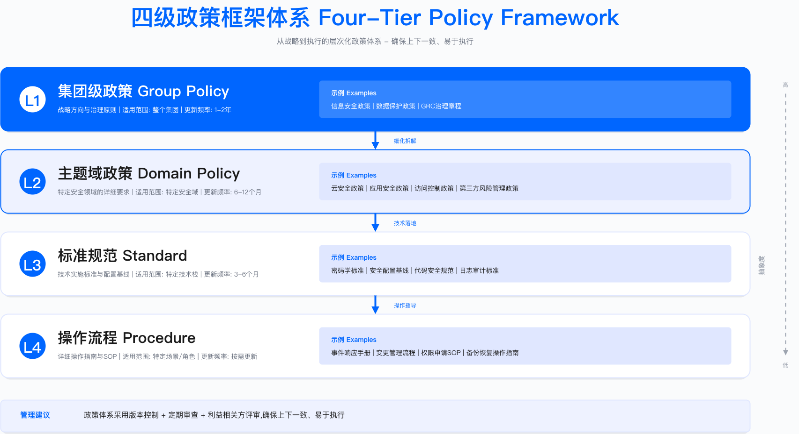
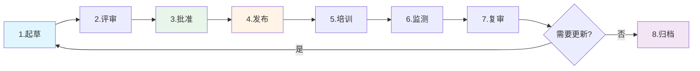

# 2.4　政策与标准体系

政策体系是 GRC 落地的骨架结构。缺乏层次清晰的政策框架，组织将面临多源政策冲突、执行标准不一、审计证据碎片化等问题。本节从四级政策框架设计出发，阐述统一控制库的构建方法、政策生命周期管理机制，以及政策自动化的工程实现路径。

> 本节导读：本节回答四个递进问题——"政策为什么乱"（2.4.1 多源冲突的根因）、"结构怎么设计"（四级金字塔与批准权限分层）、"控制怎么复用"（2.4.2 统一控制库实现一控多用）、"政策怎么活下去"（2.4.3 生命周期管理）和"合规如何持续"（2.4.4 Policy-as-Code 工程化）。政策落地后的平台支撑见 2.5.1，GRC 委员会中政策审批的会议机制见 2.6.1。

---

## 2.4.1 四级政策框架

### 多源政策冲突的常见表现

政策碎片化是中大型组织的常见问题。以密码管理为例，当安全部、IT 部、人力资源部、业务部门各自发布相关要求时，员工面临的不是"遵守什么"，而是"遵守哪一个"的困境。

| 政策来源 | 密码要求 | 更换周期 | 发布权限 | 冲突点 |
|---------|---------|---------|---------|--------|
| 安全部《密码管理政策》 | 12 位 + 复杂度（大小写 + 数字 + 特殊字符） | 90 天强制更换 | CISO 批准 | 要求最严格 |
| IT 部《系统访问标准》 | 8 位即可 | 180 天更换 | CIO 批准 | 要求最宽松 |
| 人力部《员工手册》 | "定期更换"（无具体要求） | 未明确 | CHRO 批准 | 要求模糊 |
| 业务部《客户数据保护指南》 | "参考行业标准"（无具体要求） | 未明确 | 业务 VP 批准 | 不可执行 |

上表展示的是典型的政策碎片化状态。四个部门对同一事项的要求存在实质性冲突，且均具有各自的发布权限，缺乏统一的优先级规则。员工面对这种冲突会产生可预期的理性反应。

需要提醒的是：表中"要求最严格"指的是**在这场冲突中相对最严**，不等于技术上正确——"大小写 + 数字 + 特殊字符"与"90 天强制更换"恰恰是 NIST SP 800-63B-4 明令禁止的两条（详见本节 Level 3 的密码标准示例与其中的说明[1]）。这也说明多源冲突的真正代价不止于"员工不知道听谁的"，还在于最响亮的那个声音未必是对的。

常见问题分类

| 失败类型 | 根本原因 | 员工行为模式 | 安全后果 |
|---------|---------|-------------|---------|
| "向下竞争"行为 | 多个政策冲突，无优先级规则 | 选择最宽松标准执行 | 密码强度不足，易被暴力破解 |
| "选择性遵守" | 不同部门各自发布政策，缺乏协调 | 遵守对自己最方便的政策 | 安全与业务部门要求被绕过 |
| "政策虚无主义" | 政策太多且矛盾，员工放弃遵守 | "反正都做不到，索性都不做" | 全面不合规，审计大量发现 |
| "审批权限混乱" | 多部门都有发布权限，无统一决策机制 | 不知道该听谁的，等待上级明确指示 | 政策落地停滞，风险持续暴露 |

适用边界：上述问题主要出现在 200 人以上、具有多个职能部门的组织。小型组织由于决策链条短、政策数量少，通常不会出现严重的多源冲突。

关键约束：政策体系重构涉及跨部门权限调整，需要高管层（CEO/COO）明确授权；组织政治阻力往往大于技术难度。

### 四级政策金字塔

解决多源冲突的核心方案是建立层次分明的四级政策框架，明确每一层的批准权限、有效期和优先级规则。

四级结构的设计逻辑是：越靠近顶层越稳定（变化频率低，范围宽），越靠近底层越具体（变化频率高，操作性强）。这样上层文件不需要频繁修订，下层文件可以快速迭代，同时通过"上级优先"规则保持全局一致性。

```
        ┌─────────────────┐
        │  Level 1: 策略  │  ← 董事会/CEO 批准
        │   (Strategy)    │     3-5 年有效期
        │  "安全优先"     │     3-5 页（原则性）
        └────────┬────────┘
                 │
        ┌────────▼────────┐
        │  Level 2: 政策  │  ← CISO/CRO 批准
        │   (Policy)      │     2-3 年有效期
        │  "密码必须复杂" │     10-20 页（What）
        └────────┬────────┘
                 │
        ┌────────▼────────┐
        │  Level 3: 标准  │  ← 部门负责人批准
        │  (Standard)     │     1-2 年有效期
        │  "12位+复杂度"  │     20-50 页（How）
        └────────┬────────┘
                 │
        ┌────────▼────────┐
        │  Level 4: 指南  │  ← 技术负责人批准
        │  (Guideline)    │     年度更新
        │  "1Password工具"│     50-100 页（操作手册）
        └─────────────────┘
```



*图：GRC 四级政策框架——策略、政策、标准、指南的层级结构与批准权限*

层级职责划分

- Level 1（策略）：CEO 定方向，全公司统一原则，回答"为什么要做"
- Level 2（政策）：CISO 定要求，明确"必须做什么"，具有强制性
- Level 3（标准）：部门定细节，可量化、可审计，回答"做到什么程度"
- Level 4（指南）：团队定操作，手把手教怎么做，可选但推荐

冲突解决原则：发生冲突时，遵循"上级文件优先"——策略 > 政策 > 标准 > 指南。下级文件不得与上级文件冲突；若存在冲突，以上级文件为准。

常见误区

1. 层级混淆：将操作指南写成政策文档，导致政策过于具体、更新频繁、难以通过高层审批
2. 跳级发布：业务部门直接发布"标准"而未对齐上级"政策"，导致标准缺乏法律效力或与公司政策冲突
3. 批准权限下放过度：所有层级均由 CISO 审批，导致 CISO 成为瓶颈，政策更新周期过长

### Level 1：策略（Strategy）

策略是组织级别的原则性声明，定义 GRC 愿景与方向。策略文档通常由董事会或 CEO 批准，有效期 3-5 年，篇幅控制在 3-5 页。篇幅限制是为了保证策略停在原则层面、不下探到操作层面——一旦策略文档超过 10 页，通常意味着它已经越界进入了政策或标准的领域。

下面这份模板的每一个章节都对应策略层的一个刻意约束。它的结构由"愿景—核心原则—适用范围—违规后果—批准签字"五块构成，恰好覆盖了一份策略要回答的全部问题——方向是什么、遵循哪些不可动摇的原则、约束谁、违反了怎么办、谁为它背书。策略层刻意不写任何"多少位密码""多少天更换"这类数字，因为这些属于标准层；策略只提供上层原则供下层文件对齐。

策略文档结构示例

```markdown
# 信息安全策略
**版本**：v1.0 | **批准人**：CEO | **生效日期**：2025年1月1日

## 愿景
通过信息安全能力支撑业务可持续增长，成为客户信赖的合作伙伴。

## 核心原则

1. **安全与业务平衡**
   - 安全是业务推动力，而非阻碍
   - 安全投资与业务风险相匹配

2. **全员安全责任**
   - 安全是每个人的责任
   - 业务部门是安全第一责任人

3. **数据驱动决策**
   - 使用量化方法评估风险
   - 基于数据优化资源配置

4. **持续改进**
   - 定期安全回顾
   - 定期外部审计

5. **合规先行**
   - 满足所有适用法规（如 GDPR/PIPL/SOX）
   - 获取必要的行业认证（如 ISO 27001/SOC 2）

## 适用范围
全球所有员工、承包商、第三方合作伙伴

## 违规后果
违反本策略将导致纪律处分，包括但不限于警告、降职、解雇、法律追责。

---
批准签字：[CEO 姓名] [日期]
```

这份模板的"原则"写法有一个关键特征：五条原则中的每一条都是价值判断而非操作规范（"安全是业务推动力，而非阻碍""业务部门是安全第一责任人"）。这类表述之所以放在策略层，是因为它们几乎不会随技术或法规变化而失效——正是这种稳定性支撑了 3-5 年的长有效期。落地时最常见的坑是把"合规先行"这类原则误写成"必须满足 GDPR 第 X 条"的具体条款：一旦法规修订，整份需要 CEO 重新签批的策略文档就得跟着改，这正是四级框架要极力避免的高层文件频繁翻修。

验证方法：策略有效性可通过以下方式检验——（1）员工访谈抽样，验证是否知晓核心原则；（2）检查下级政策是否与策略原则对齐；（3）审计发现是否存在与策略冲突的操作行为。

### Level 2：政策（Policy）

政策是针对特定主题的详细要求，定义"必须做什么"（What），由 CISO/CRO 批准，有效期 2-3 年。政策与策略的本质区别在于：策略说"为什么"，政策说"什么是必须的"——但政策不说"怎么做"，那是标准和指南的职责。

政策类别示例

| 类别 | 政策示例 | 目的 |
|------|---------|------|
| 信息安全 | 访问控制政策、加密政策、网络安全政策 | 保护机密性、完整性、可用性 |
| 隐私 | 隐私政策、数据处理政策、跨境传输政策 | 满足 GDPR/PIPL |
| 风险管理 | 风险管理政策、第三方风险政策 | 识别与控制风险 |
| 合规 | 合规管理政策、举报人保护政策 | 满足法规要求 |
| 运营 | 变更管理政策、事件响应政策、备份政策 | 确保业务连续性 |
| 人力资源 | 员工安全责任政策、离职流程政策 | 管理内部威胁 |

政策模板结构

下面这份政策模板与前面的策略模板形成对照。策略模板只有五块、追求极简，而政策模板扩展到九节，多出来的部分正是政策层承担的额外职责：明确的适用范围（人员/系统/地区三个维度）、角色职责表、用 MUST/SHOULD/MAY 分级的政策声明、例外处理流程、合规监测方式，以及修订历史和多级批准。其中第 4 节"政策声明"是核心——MUST/SHOULD/MAY 的分级借用了 RFC 的规范用词，目的是让每一条要求的强制程度不留歧义，避免出现前文密码案例中"定期更换"那种无法执行的模糊表述。第 5 节"例外处理"同样关键：政策若不预留合规的例外通道，遗留系统等无法满足要求的场景就会被迫"选择性遵守"，反而架空整套政策。

```markdown
# [政策名称]

## 1. 目的（Purpose）
说明为什么需要这个政策

## 2. 适用范围（Scope）
- 适用人员：全体员工/特定角色
- 适用系统：生产环境/所有系统
- 适用地区：全球/特定区域

## 3. 角色与职责（Roles & Responsibilities）
| 角色 | 职责 |
|------|------|
| CISO | 批准政策，监督执行 |
| 业务负责人 | 确保团队遵守 |
| 员工 | 阅读并遵守政策 |

## 4. 政策声明（Policy Statement）
### 4.1 核心要求
- 必须（MUST）：强制要求
- 应当（SHOULD）：推荐要求
- 可以（MAY）：可选要求

### 4.2 具体规定
[详细要求]

## 5. 例外处理（Exceptions）
例外申请流程、审批权限、复评周期

## 6. 合规性（Compliance）
- 监测方式：自动化扫描/审计抽样
- 违规后果：警告/纪律处分
- 申诉流程：联系合规团队

## 7. 相关文档（Related Documents）
- 上级策略：信息安全策略
- 相关政策：访问控制政策、加密标准
- 支撑指南：密码管理指南

## 8. 修订历史（Revision History）
| 版本 | 日期 | 修订人 | 修订内容 |
|------|------|--------|---------|
| v1.0 | 2025-01-01 | 张三 | 初版发布 |

## 9. 批准（Approval）
- 起草人：[姓名] [日期]
- 审核人：法务/DPO [日期]
- 批准人：CISO [日期]
```

### Level 3：标准（Standard）

标准是技术规范，定义"如何做"（How）的强制要求，由部门负责人批准，有效期 1-2 年。标准必须可量化、可审计——"遵循最小权限原则"是政策层面的要求，"生产系统账号不得拥有超过其工作职责所需的权限，且须每 90 天进行权限复审"才是标准层面的表述。

下面这份密码标准示例正是把政策层的"密码必须复杂"落到可执行的具体数字，其中有两处设计尤为关键。其一是要求表按系统类型分级：生产、办公、测试/开发三档的长度与验证强度逐级放宽。这种分级是为了让安全强度与资产价值匹配，谈不上妥协——对生产系统施加与测试环境相同的严苛要求，只会激励开发者用共享账号或明文记录来规避。其二是 MFA 方法按优先级排序，并把 SMS 明确标注为"仅在其他方法不可用时"，这一排序把"是否用 MFA"和"用哪种 MFA"两个决策分开，防止团队用最弱的 SMS 应付了事却自认合规。

**先说一处必须避开的陷阱。** 很多组织的密码标准至今仍写着"大小写 + 数字 + 特殊字符"和"90 天强制更换"——这两条已被 NIST 明确禁止。NIST SP 800-63B-4（2025 年 8 月定稿）第 3.1.1.2 节的规范性要求是[1]：

- "Verifiers and CSPs **SHALL NOT** impose other composition rules (e.g., requiring mixtures of different character types) for passwords."（不得强制字符类型混合）
- "Verifiers and CSPs **SHALL NOT** require subscribers to change passwords periodically. However, verifiers **SHALL** force a change if there is evidence that the authenticator has been compromised."（不得要求定期更换；仅在有失陷证据时强制重置）

理由是实证的：强制复杂度与定期更换会把用户推向可预测的变形（Passw0rd! → Passw0rd@），实际熵值不升反降。NIST 用来替代它们的是三条硬要求：单因素口令**最短 15 位**（SHALL）、最大长度至少支持 64 位（SHOULD）、新设或修改口令时**必须与已泄露/常用口令黑名单比对**（SHALL）。同节还禁止存储可被未认证者读取的口令提示，以及用密保问题（KBA）作为口令找回手段。下面的示例标准按这套现行要求编写：

密码标准示例

```markdown
# 密码与认证标准
**版本**：v3.0 | **批准人**：CISO
**基准**：NIST SP 800-63B-4 §3.1.1.2

## 1. 密码要求

| 系统类型 | 最小长度 | 组成规则 | 更换要求 | 泄露口令黑名单 |
|---------|---------|--------|--------|---------|
| 生产系统 | 15 位（单因素时）／12 位 + 强制 MFA | 不强制字符类型混合；接受全部可打印 ASCII 与空格，最大长度≥64 | 不设定期更换；有失陷证据时强制重置 | 必须（设置与修改时均比对） |
| 办公系统 | 15 位 | 同上 | 同上 | 必须 |
| 测试/开发 | 12 位 | 同上 | 同上 | 建议 |

> 注：不再设"历史限制 N 次"与"有效期 N 天"——两者都是定期更换制度的配套，取消定期更换后即无意义。取而代之的是持续的泄露口令比对。

## 2. 多因素认证（MFA）要求

**强制 MFA 场景**：
- 所有生产系统访问
- VPN 接入
- 特权账号（root/admin）
- 远程访问
- 客户数据访问

**MFA 方法（按优先级）**：
1. 硬件令牌（YubiKey）——推荐
2. TOTP 应用（Google Authenticator/Authy）
3. 推送通知（Okta/Duo）
4. SMS（仅在其他方法不可用时）

## 3. 例外情况

**遗留系统例外**：
- 审批人：CISO
- 补偿控制：网络隔离 + 额外审计
- 复评周期：90 天
- 最终期限：需明确迁移计划

## 4. 监测与审计

**自动化监测**（每日）：
- 泄露口令黑名单比对（含已在用口令的回溯比对）
- MFA 启用率监测
- 失陷证据触发的强制重置执行情况

**审计抽样**（季度）：
- 抽样账号验证合规性
- 例外使用情况审查
```

这份标准里"例外情况"和"监测与审计"两节看似次要，却正是标准区别于纸面规定的地方。例外一节为遗留系统预留了带补偿控制（网络隔离 + 额外审计）和复评周期的合规通道，避免"无法满足即被绕过"；监测一节则把每一条要求都绑定到可自动化的检查动作（泄露口令比对、MFA 启用率），确保标准写下来之后有对应的验证手段，而不是停留在文档里无人核对。落地时的常见坑是只写要求表、不写监测方式，结果标准发布后无人知道合规率究竟是多少。

还有一个组织层面的坑：不少企业的等保测评、内部审计模板或老旧的堡垒机产品仍以"是否设置了密码有效期"为得分项，与 NIST 现行要求直接冲突。遇到这种情况应当在标准中显式记录该冲突与所采信的依据（本节示例即注明基准为 SP 800-63B-4），并在例外/偏离登记中留痕，而不是为了过一次检查就把定期更换加回来——两套要求反复横跳，受害的是用户口令的实际强度。

运行指标：密码标准执行后应持续监测以下指标——密码合规率（目标阈值由组织自定）、MFA 覆盖率、密码重置请求量趋势、例外申请数量及处理时效。

### Level 4：指南（Guideline）

指南是操作手册，提供最佳实践与详细步骤，属于推荐性文档而非强制要求。指南的核心价值在于将抽象标准转化为可执行的操作步骤——标准告诉员工"做什么"，指南帮助员工"做到"。

当标准仅写"应遵循最小权限原则"而不提供具体操作步骤时，执行团队面临的是"知道要做什么，但不知道怎么做"的困境。这一"知行落差"往往出现在审计发现中。

抽象标准导致的执行问题

| 审计发现类别 | 典型缺陷 | 失败根源 |
|------------|---------|---------|
| 身份管理缺陷 | 根账号无 MFA，大量用户拥有过高权限 | 标准只写"应遵循最小权限原则"，无具体操作步骤 |
| 数据保护缺陷 | 生产环境存储未启用加密 | 标准只写"应启用数据加密"，无技术实现指南 |
| 日志监控缺陷 | CloudTrail/VPC Flow Logs 未启用 | 标准只写"应保留审计日志"，无配置模板 |
| 网络隔离缺陷 | Security Group 开放 0.0.0.0/0 | 标准只写"应限制网络访问"，无分级规则 |

从抽象标准到可执行指南的改进方向

| 设计要素 | Level 3 标准（不足） | Level 4 指南（改进） |
|---------|---------------------|---------------------|
| 可执行性 | "应遵循最小权限原则" | 详细操作步骤 + 控制台截图 + CLI 命令 + IaC 模板 |
| 分级管理 | 所有要求一刀切 | 强制基线 + 推荐实践 + 可选增强 |
| 自动化集成 | 人工检查清单 | 安全配置封装为可复用模块 |
| 持续更新 | 年度更新 | 季度复审，及时纳入新攻击手法 |

指南分级体系

| 级别 | 典型要求 | 执行目标 | 技术实现 |
|-----|---------|---------|---------|
| 强制基线（Baseline） | 根账号 MFA、生产环境数据加密、网络隔离 | 全部执行，自动化阻断不合规部署 | Terraform 验证钩子 |
| 推荐最佳实践（Best Practice） | CloudTrail 日志保留、资源标签规范、备份策略 | 高比例执行，纳入合规评分 | Terraform Module 默认配置 |
| 可选增强（Enhancement） | GuardDuty 威胁检测、Config 自动修复 | 按业务风险和预算选择 | 独立 Module，按需启用 |

关键实施要点

- 指南必须是"操作手册"，而非"建议文档"
- 必须包含清晰的步骤、示例代码、验证方法
- 与 IaC 工具深度集成，降低人工成本
- 分级管理（强制/推荐/可选），避免一刀切影响灵活性

云安全配置的具体实现可参见 5.9 多云治理。

---

## 2.4.2 统一控制库（Control Library）

### 控制库的价值定位

在多框架合规场景下（ISO 27001、SOC 2、PCI DSS 等），组织通常面临以下问题：

- 不同合规框架存在重复控制要求
- 每次审计重复准备相同证据
- 控制与风险的映射关系不清晰

统一控制库的核心价值是实现"一控多用"——将分散在各框架中的控制要求抽象为统一的控制项，建立控制与多框架的映射关系，避免重复建设。这一设计在双认证（ISO 27001 + SOC 2 Type II）场景中效果最为明显：两套框架的核心控制有大量重叠，通过统一控制库可以共用一套证据采集机制。

适用边界：控制库适用于需要同时满足两个及以上合规框架的组织。单一框架场景下，控制库的投入产出比较低。

关键约束：控制库的建设与维护需要专职人员；映射关系需持续更新以跟踪框架版本变化。

### 控制库结构

下面这张树状结构图是控制库"一控多用"能力的数据基础，核心在于三层的分工。控制域（Access Control、Data Protection 等）是粗粒度的归类，方便按主题检索；控制项是真正的复用单元，它把一条控制的全部元数据——ID、类型、频率、责任人、证据类型、测试方法——集中在一处，最关键的是末尾的"框架映射"字段，正是它让同一个控制项（如 AC-001）一次定义、映射到 ISO 27001、SOC 2、PCI DSS、NIST CSF 多个框架的对应条款；控制证据层则把控制与实际的数据源（Okta 审批日志）和采集/保留策略绑定。整条价值链自底向上成立：一份证据支撑一个控制项，一个控制项满足多个框架要求，这就是重复审计得以避免的机理。

```
控制库（Control Library）
├─ 控制域（Control Domain）
│  ├─ 访问控制（Access Control）
│  ├─ 数据保护（Data Protection）
│  ├─ 网络安全（Network Security）
│  └─ ...
│
├─ 控制项（Control）
│  ├─ 控制 ID：AC-001
│  ├─ 控制名称：用户访问审批
│  ├─ 控制描述：所有用户访问请求必须经过审批
│  ├─ 控制类型：预防性（Preventive）
│  ├─ 控制频率：每次（Per Event）
│  ├─ 自动化程度：部分自动（Semi-Automated）
│  ├─ 责任人：IAM 团队
│  ├─ 证据类型：审批记录、访问日志
│  ├─ 测试方法：抽样访问请求
│  └─ 框架映射：
│     ├─ ISO 27001: A.5.15（2022 版；对应 2013 版 A.9.2.1）
│     ├─ SOC 2: CC6.1
│     ├─ PCI DSS: 7.1
│     └─ NIST CSF: PR.AC-4
│
└─ 控制证据（Evidence）
   ├─ 证据源：Okta 审批日志
   ├─ 采集频率：实时
   └─ 保留期限：按法规要求
```

### 控制映射矩阵

下表展示了典型控制项与多框架的映射关系，覆盖访问控制、数据保护、业务连续性、事件响应等核心域，这些控制项在主流框架中均有对应要求。

下表 ISO 27001 列采用 2022 版 Annex A 编号（括注对应的 2013 版旧编号，便于存量体系对照）[2]。

**PCI DSS 列请注意版本**：该列沿用 v3.2.1 时代的条款号，而 PCI DSS 当期版本为 v4.0.1（v4.0 已于 2024-12-31 退役）[3]，v4.x 对条款体系做了大范围重编号——例如传输加密要求从 v3.2.1 的 4.1 移到了 4.2.x，介质与备份相关要求在 9.x 下的位置也有调整。控制库落地时**必须按 v4.0.1 原文逐条重新映射**，不能直接沿用旧编号；这也正是控制库需要记录"映射所依据的框架版本"这一字段的原因——框架改版时才知道哪些映射需要重做。

| 控制 ID | 控制名称 | ISO 27001:2022（2013 版） | SOC 2 | PCI DSS | GDPR | 责任人 |
|--------|---------|-----------|-------|---------|------|--------|
| AC-001 | 用户访问审批 | A.5.15（A.9.2.1） | CC6.1 | Req 7.1 | Art.32 | IAM 团队 |
| AC-002 | 定期访问复审 | A.5.18（A.9.2.5） | CC6.2 | Req 7.2 | Art.32 | IAM 团队 |
| DP-001 | 数据传输加密 | A.8.24（A.13.1.1） | CC6.7 | Req 4.1 | Art.32 | 网络团队 |
| DP-002 | 数据静态加密 | A.8.24（A.10.1.1） | CC6.1 | Req 3.5.1 | Art.32 | 存储团队 |
| BC-001 | 备份与恢复 | A.8.13（A.12.3.1） | A1.2 | Req 9.5 | - | 运维团队 |
| IR-001 | 事件响应计划 | A.5.24（A.16.1.1） | CC7.3 | Req 12.10 | Art.33 | SOC 团队 |

从映射关系可见，核心安全控制在多个框架中存在高度重叠。通过统一控制库，组织可减少重复的控制设计与证据采集工作。权衡点在于控制库的抽象层级——过于抽象则失去操作指导性，过于具体则丧失复用价值。

三维映射关系

```
      风险（Risk）
         │
         │
    控制（Control） ─────── 法规（Regulation）

示例：
风险：数据泄露
  ↓
控制：DP-001（数据传输加密）
  ↓
法规：GDPR Art.32、ISO 27001:2022 A.8.24（2013 版 A.13.1.1）、PCI DSS Req 4.1
```

这张三维图的意义在于：控制库不只是"合规清单"，而是连接风险管理与合规管理的桥梁（见 2.2.1 风险管理生命周期中的风险处置阶段）。控制效果需从两个维度验证：一是法规要求是否满足（审计视角），二是风险是否实际降低（风险视角）。

验证方法：控制库有效性可通过以下方式检验——（1）审计准备时间是否缩短；（2）控制缺口是否能被快速识别；（3）新框架引入时映射工作量是否降低。

---

## 2.4.3 政策生命周期管理

### 政策生命周期（Policy Lifecycle）

政策并非一次性产出物，而是需要持续管理的资产。"发布即完成"是政策管理最常见的反模式——政策发布后无培训、无监测、无复审，两年后审计员发现政策早已与实际操作脱节，而所有人还以为合规状态良好。

完整的政策生命周期包含八个阶段：

下面这张流程图把八个阶段串成一条带回路的链，其关键是那个决策菱形"需要更新？"——它决定了政策管理是闭环还是断链。走到"复审"节点后，若判定需要更新，流程回到"起草"重新循环，政策因此得以跟随法规和业务演进；只有确认无需更新时才进入"归档"终态。前文点名的"发布即完成"反模式，本质上就是在"4.发布"之后直接停手、跳过了培训、监测、复审这后半程——图中被跳过的正是让政策保持有效的那几个阶段。



### 各阶段操作要点

#### 1. 起草（Drafting）

起草检查清单
- 使用标准模板
- 明确目的与范围
- 定义角色与职责
- 咨询利益相关方

协作工具选择：Google Docs（实时协作）、Confluence（知识管理）、GitHub（版本控制，适用技术标准）。

#### 2. 评审（Review）

评审矩阵应根据政策类型确定必要的评审方。评审的实质价值不在于走流程，而在于让不同角色在政策发布前暴露可行性问题——法务发现合规风险，技术团队发现实施障碍，业务代表发现操作不可行性。这些问题在评审阶段发现的成本，远低于执行后返工的成本。

| 评审类型 | 评审人 | 关注点 | 时限（参考） |
|---------|--------|--------|-------------|
| 法务评审 | 法务部 | 合规性、法律风险 | 5 个工作日 |
| 隐私评审 | DPO | GDPR/PIPL 合规 | 3 个工作日 |
| 技术评审 | 架构师/技术负责人 | 可行性、成本 | 5 个工作日 |
| 业务评审 | 业务 VP/BISO | 业务影响、可操作性 | 3 个工作日 |

#### 3. 批准（Approval）

审批权限应与政策层级对应：

| 政策级别 | 审批人 | 审批方式 |
|---------|--------|---------|
| Level 1（策略） | 董事会/CEO | 董事会会议表决 |
| Level 2（政策） | CISO/CRO | 电子签名 |
| Level 3（标准） | 部门负责人 | 工作流审批 |
| Level 4（指南） | 技术负责人 | 邮件确认 |

#### 4. 发布（Publication）

发布渠道应确保覆盖所有适用人员：政策门户（内网）、邮件通知、即时通讯工具推送、新员工入职材料。

发布通知模板

下面这份通知模板看似只是一封邮件，但它的结构对应着发布阶段的三个刚性要求。其中有三块内容不可或缺：一是"主要变更"清单，让已知旧版的员工能快速定位差异，而不必重读整份政策；二是"请在指定期限内完成"的三个动作——阅读、培训、签收——把发布从"我通知了"升级为"你确认了"，这是后续能追踪培训完成率和签收率的前提；三是明确的联系人邮箱，为例外和疑问预留了反馈通道。发布阶段最常见的坑是只发政策链接、不附培训与签收要求，结果无法证明员工是否真正知晓，审计时的签收记录也就无从谈起。

```
主题：【重要】新版《数据加密政策》发布通知

各位同事，

新版《数据加密政策》（v2.0）已于 2025 年 1 月 15 日正式生效。

主要变更：
1. 强制要求所有生产数据库启用 TDE 加密
2. 新增云存储加密要求（S3/Blob Storage）
3. 更新密钥管理流程

请在指定期限内完成以下操作：
1. 阅读新版政策：[链接]
2. 完成在线培训：[链接]
3. 电子签收确认：[链接]

如有疑问，请联系安全团队：security@company.com

---
信息安全部
2025 年 1 月 15 日
```

#### 5. 培训（Training）

| 方式 | 适用场景 | 优点 | 缺点 |
|------|---------|------|------|
| 在线课程 | 全员政策 | 可追踪、可重复 | 参与度低 |
| 现场培训 | 关键政策、技术标准 | 互动性强 | 成本高 |
| 微课 | 政策更新 | 快速、易消化 | 深度不足 |
| 情景模拟 | 事件响应、隐私政策 | 实战性强 | 准备耗时 |

培训跟踪指标：培训完成率 = 已完成人数 / 应完成人数。逾期提醒机制应分级设置（如 T+7 天邮件提醒、T+14 天经理提醒、T+21 天升级处理）。

#### 6. 监测（Monitoring）

| 政策类型 | 监测方式 | 频率 | 工具 |
|---------|---------|------|------|
| 技术政策 | 自动化扫描 | 实时/每日 | CSPM, SIEM, 自动化脚本 |
| 流程政策 | 证据抽样 | 季度 | GRC 平台 |
| 培训政策 | 完成率跟踪 | 月度 | LMS（学习管理系统） |

#### 7. 复审（Review）

复审触发条件

1. 定期复审（政策有效期到期）
2. 法规变更（GDPR 更新、新法规生效）
3. 重大事件（数据泄露、审计发现）
4. 业务变更（新产品、新市场）
5. 技术变革（云迁移、AI 应用）

复审检查清单
- 政策内容是否仍然适用？
- 是否有新的法规要求？
- 是否有新的技术方案？
- 控制措施是否有效？
- 员工是否理解并遵守？

### 政策生命周期常见问题

以技术政策（如数据库加密 TDE）落地为例，缺乏完整生命周期管理的政策往往会经历以下问题：

| 阶段 | 常见问题 | 根本原因 | 改进方向 |
|-----|---------|---------|---------|
| 起草 | 未征求技术团队意见，实施周期脱离实际 | 政策被视为"安全部门拍脑袋" | 跨职能工作坊，从"告知"到"共创" |
| 评审 | 跳过技术/业务评审，直接发布 | 评审流于形式 | 强制评审节点，明确否决权 |
| 批准 | CISO 单方面签署，技术团队不认同 | 缺乏跨部门背书 | CTO+CISO 联合签署 |
| 发布 | 群发邮件，无配套指南 | 从"要求"缺失"指导" | 政策 + 指南 + 培训组合发布 |
| 培训 | 无培训，"发布即完成" | 员工不知道怎么做 | 配套培训，覆盖技能缺口 |
| 监测 | 无监测，"放羊" | 无反馈机制 | 自动化监测 + 进度看板 |

常见误区

1. "发布即完成"心态：认为政策发布后执行是业务部门的事，缺乏后续跟踪
2. 培训投资不足：政策复杂但培训简陋，员工缺乏执行能力
3. 监测缺失：无法度量执行率，无法识别执行障碍

验证方法：政策生命周期管理有效性可通过以下指标检验——政策执行率、培训完成率、审计发现数量趋势、政策更新周期是否符合预期。

---

## 2.4.4 政策自动化

### 政策门户（Policy Portal）

政策门户是政策集中管理的技术平台。没有统一门户时，政策散落在邮件附件、网盘文件夹、Wiki 页面等多个位置，员工找到的很可能是过期版本——这种情况在审计时会制造额外风险。

下表列出的八项功能并非平铺的工具清单，而是对应了前面生命周期各阶段的技术承接点：集中存储和版本控制解决"哪个是有效版本"的发布难题，阅读跟踪和签收管理是培训、签收阶段能被度量的基础，到期提醒则把复审阶段的触发从"靠人记得"变成"系统自动催办"。换言之，门户的价值不在于某一项功能本身，而在于它把散落在邮件和网盘里的手工流程收拢到一个有权限、有留痕、有提醒的平台上。

| 功能 | 说明 | 实现工具 |
|------|------|---------|
| 集中存储 | 所有政策统一管理 | SharePoint, Confluence, PolicyTech |
| 版本控制 | 跟踪历史版本 | Git, 内置版本控制 |
| 搜索 | 全文搜索、标签搜索 | Elasticsearch |
| 访问控制 | 基于角色的访问权限 | RBAC |
| 阅读跟踪 | 记录谁读了哪些政策 | 自研/GRC 平台 |
| 签收管理 | 电子签名确认 | DocuSign, Adobe Sign |
| 培训集成 | 链接在线培训课程 | LMS 集成 |
| 到期提醒 | 自动提醒政策复审 | 工作流引擎 |

### 自动化政策合规检查

人工检查模式的局限性

人工检查的根本局限不是精度，而是频率——每季度抽查意味着违规行为可能在 89 天内完全不受约束。自动化检查的价值是将"每季度点式发现"升级为"实时持续监测"。

| 局限维度 | 典型表现 | 根本原因 |
|---------|---------|---------|
| 检查覆盖率低 | 季度人工抽查覆盖率有限 | 人力成本限制，无法全量检查 |
| 发现严重滞后 | 违规行为在季度检查时才被发现 | 检查周期长，中间窗口期无监控 |
| 无强制执行机制 | 发现违规仅发邮件提醒，响应率低 | 缺乏自动化执行能力 |
| 数据分散难聚合 | 密码状态、MFA、权限分布在不同系统 | 系统割裂，人工关联成本高 |

适用边界：自动化检查适用于可量化、可代码化的技术政策（如密码策略、MFA 策略、加密策略）。流程性政策（如审批流程）的自动化程度取决于流程是否已在系统中固化。

关键约束：自动化检查需要与身份系统、配置管理系统的 API 集成；初期开发投入较高，适合控制项数量多、检查频率高的场景。

### Policy-as-Code 架构

将政策翻译为可执行的代码规则，是实现自动化检查的核心方法。Policy-as-Code 的本质是：把"政策文档里的文字要求"转化为"可被计算机执行的判断逻辑"——这样合规检查就从"人工解读政策并手动核查"变成了"系统自动执行并报告结果"。

四层架构模型

#### 第 1 层：数据采集层

自动化合规检查的前提是实时、准确的数据。这一层解决的问题是：从身份系统、网络设备、云平台等数据源持续获取当前状态，供规则引擎判断。采集频率的选择权衡是：频率越高，数据越实时，但系统负载和 API 成本也越高。

下表把这个权衡具体化了，"采集频率"与"数据源"两列的对应关系清晰呈现了取舍逻辑：身份系统采用每日全量，因为密码更新时间、MFA 状态这类字段变化慢，日粒度足以支撑合规判断；而 VPN/跳板机和 SIEM 采用实时或每小时，因为异常登录、访问行为具有时效性，滞后采集就失去了检测意义。这正是"频率匹配变化速率"的实际应用——并非所有数据源都要追求实时，把慢变数据也拉成实时只会徒增 API 成本。

| 数据源 | 采集频率 | 关键字段 | 集成方式 |
|-------|---------|---------|---------|
| 身份系统（Okta/AD） | 每日全量 | 用户 ID、密码更新时间、MFA 状态、账号状态 | API 集成 |
| VPN/跳板机 | 实时/每小时 | 用户 ID、访问目标、访问时间、源 IP | 日志采集 |
| SIEM | 实时 | 异常登录事件、多次失败尝试 | API 集成 |

#### 第 2 层：规则引擎层

这是 Policy-as-Code 的核心。规则引擎将政策文档中的文字要求翻译成可执行的判断逻辑。下面的 Python 示例展示了如何将"密码超过 90 天必须重置"和"生产环境必须启用 MFA"这两条政策要求转化为代码。

注意这段代码的关键设计选择：使用分级违规（一档/二档/三档）而非二元判断（合规/不合规）。这一设计的动机是：对于接近超期的账号给予提前预警（一档/二档），避免突然冻结对用户造成的冲击；只有真正超期或高风险才触发强制动作（三档）。

```python
# 阈值配置化：政策变更时只改配置，无需改动业务代码（见下文"常见坑"）
# 区间约定：闭下界、开上界——[30,60)=一档，[60,90)=二档，[90,∞)=三档
POLICY_THRESHOLDS = {
    "password_remind_days": 30,    # 一档：达到即提醒
    "password_warn_days": 60,      # 二档：达到即警告（抄送经理）
    "password_enforce_days": 90,   # 三档：达到即冻结
}

# 高影响动作（如冻结账号）默认干跑，需显式审批后才真正执行，
# 呼应第 3 层"误触发直接中断业务"的告诫
def enforce(action, dry_run=True, approved=False):
    if action.startswith("freeze") and not approved:
        return {"executed": False, "reason": "freeze 类动作需人工审批", "action": action}
    if dry_run:
        return {"executed": False, "reason": "dry_run", "action": action}
    return {"executed": True, "action": action}

# 示例：密码政策规则
def check_password_compliance(user, cfg=POLICY_THRESHOLDS):
    password_age = (today - user.password_last_changed).days
    if password_age >= cfg["password_enforce_days"]:
        return {"compliant": False, "level": "ENFORCE", "action": "freeze_account"}
    elif password_age >= cfg["password_warn_days"]:
        return {"compliant": False, "level": "WARN", "action": "warn_manager"}
    elif password_age >= cfg["password_remind_days"]:
        return {"compliant": False, "level": "REMIND", "action": "email_reminder"}
    return {"compliant": True}

# 示例：MFA 政策规则
def check_mfa_compliance(user):
    if user.has_production_access and not user.mfa_enabled:
        return {"compliant": False, "level": "ENFORCE", "action": "freeze_prod_access"}
    return {"compliant": True}
```

这两个函数是规则层的最小单元。注意三处刻意的设计：阈值全部来自 `POLICY_THRESHOLDS` 配置而非硬编码字面量（践行本节反对硬编码的告诫）；边界统一采用"闭下界、开上界"的 `>=` 比较，与下文一档/二档/三档分级表逐行对齐，消除"我还在宽限期内"的边界争辩空间；`freeze` 类高影响动作经 `enforce` 默认干跑并强制审批，避免误触发直接冻结业务账号。实际生产中，规则库会包含数十到数百个此类函数，覆盖密码、MFA、权限、加密、日志保留等各类政策要求。每个函数对应一条政策要求，便于政策变更时精准定位和修改对应规则。

规则版本控制的必要性：规则存储在 Git 仓库，每次政策更新通过 PR 审批后自动生效。这一机制确保了两点：一是规则变更有审批记录（可审计），二是新规则在生效前必须通过代码审查（降低误配置风险）。

#### 第 3 层：自动化执行层

规则引擎输出判断结果后，执行层负责将判断转化为实际动作。执行层的设计难点在于：自动化动作的影响范围广，误触发会直接影响业务——冻结了不该冻结的账号，用户无法访问系统，业务随即中断。

分级响应机制的设计动机：设置一档→二档→三档的渐进式响应，而非直接跳到冻结，是为了在"安全合规"与"业务连续性"之间建立缓冲期。60 天的预警给用户足够时间自主修复，避免被动冻结。

| 违规级别 | 触发条件 | 自动化动作 | 恢复条件 |
|---------|---------|-----------|---------|
| 一档（提醒） | 密码超期 30–59 天（[30,60)） | 发邮件提醒用户 | 用户自行更新密码 |
| 二档（警告） | 密码超期 60–89 天（[60,90)） | 邮件 + 抄送经理 + 告警通知 | 用户更新密码或经理审批豁免 |
| 三档（强制） | 密码超期 ≥90 天 | 自动冻结账号（干跑 + 人工审批后执行） | 重置密码后自动解冻 |
| 三档（强制） | 生产环境无 MFA | 立即冻结生产权限 | 启用 MFA 后恢复权限 |

生产环境常见坑

1. 直接强制而无缓冲：跳过一档/二档直接冻结账号，影响业务连续性
2. 仅生成报告无执行：自动化检查发现违规但依赖人工跟进，执行率低
3. 规则硬编码：政策阈值写死在代码中（如把 90 天写成字面数字），政策变更时需要开发介入修改代码。正确做法是将阈值提取为配置项，政策变更只需修改配置，无需改动业务代码

#### 第 4 层：可视化与闭环层

数据采集、规则判断、自动执行之后，可视化层解决的是"管理层如何感知合规状态"的问题。不同受众需要不同粒度的视图：安全团队需要每日操作数据，CISO 需要月度趋势，董事会需要季度战略视图。

| 报告类型 | 受众 | 频率 | 关键指标 |
|---------|-----|------|---------|
| 日报 | 安全团队 | 每日 | 新增违规数、修复数、当前违规总数 |
| 月度仪表盘 | CISO/CRO | 每月 | 合规率、覆盖率、平均修复时间 |
| 季度高管报告 | CEO/董事会 | 每季度 | 合规趋势、重大违规事件、改进措施 |

运行指标：政策自动化上线后应持续监测——检查覆盖率、违规发现到修复的平均时间、自动化执行成功率、误报率（合规用户被误判为违规）。

验证方法：自动化检查有效性可通过以下方式检验——（1）对比人工检查与自动化检查的发现差异；（2）验证三档（强制）动作是否按预期触发；（3）检查审计准备时间是否缩短。

政策自动化工具的具体实现可参见 4.6 技术选型与决策。

---

## 本节要点

政策与标准体系是 GRC 落地的结构性基础，四个层面相互依赖：

四级政策框架（2.4.1）：策略→政策→标准→指南的层级划分，解决多源政策冲突；"上级优先"规则提供统一的冲突解决机制；批准权限与层级匹配，避免 CISO 成为瓶颈。

统一控制库（2.4.2）：实现"一控多用"，降低多框架合规的重复投入；控制项连接风险管理（降低风险）与合规管理（满足法规）两个视角；映射关系需持续维护以跟踪框架版本变化。

政策生命周期管理（2.4.3）：完整的八阶段生命周期——起草→评审→批准→发布→培训→监测→复审→归档；"发布即完成"是最常见的失败模式；培训和监测阶段的投入决定政策能否真正落地。

政策自动化（2.4.4）：Policy-as-Code 的四层架构——数据采集→规则引擎→自动执行→可视化；分级响应（一档/二档/三档）在安全合规与业务连续性之间建立缓冲；规则存储在 Git，政策变更通过 PR 审批，确保可审计性。

政策体系建设的核心权衡在于：过于宽松则无法约束行为，过于严格则影响业务效率。需要在合规要求、业务需求、执行能力之间寻找平衡点，并通过持续的监测与反馈不断优化。

---

## 参考文献

| # | 来源 | 标题 | 日期 | 链接 |
| --- | --- | --- | --- | --- |
| [1] | NIST | SP 800-63B-4《Digital Identity Guidelines: Authentication and Authenticator Management》第 3.1.1.2 节：单因素口令最短 15 位（SHALL）；**不得**强制字符类型混合、**不得**要求定期更换（均为 SHALL NOT）；须与泄露/常用口令黑名单比对（SHALL） | 2025-08-26 | <https://pages.nist.gov/800-63-4/sp800-63b.html> |
| [2] | ISO/IEC | ISO/IEC 27001:2022：附录 A 共 93 项控制，编号与 2013 版（14 域 114 项）不通用 | 2022-10-25 | <https://www.iso.org/standard/27001> |
| [3] | PCI Security Standards Council | PCI DSS v4.0.1（当期版本；v4.0 于 2024-12-31 退役）：v4.x 相对 v3.2.1 大范围重编号 | 2024-06-11 | <https://blog.pcisecuritystandards.org/just-published-pci-dss-v4-0-1> |

---

## 导航

[← 上一节：2.3 合规管理框架](./2.3_合规管理框架.md) | [返回章节目录](./README.md) | [下一节：2.5 GRC 平台与工具 →](./2.5_GRC平台与工具.md)

---

© 2025-2026 AISecOps Project. Licensed under CC BY-NC-SA 4.0
