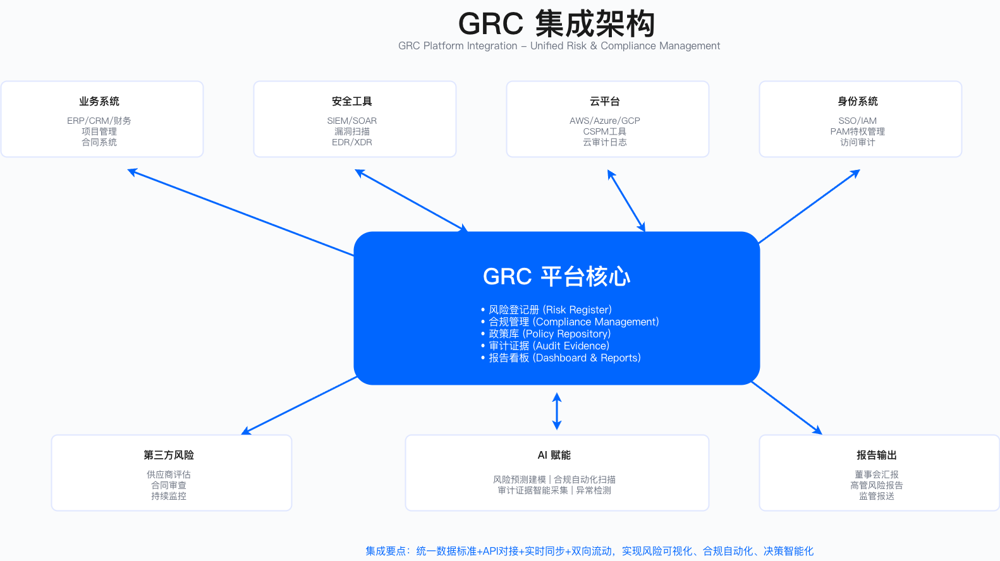

# 2.5　GRC 平台与工具

GRC 平台的选型与实施是企业规模化治理能力的技术支撑。本节从选型决策、工具分类、实施路径与集成架构四个层面，阐述如何将 GRC 管理从依赖人工的分散状态，转变为平台化、可追溯、可审计的运营模式。

> 本节导读：2.5.1 首先解剖选型失败的典型模式——大多数失败发生在采购决策时，而非实施时；然后给出基于成熟度的选型框架和主流平台特征对比。2.5.2 梳理 GRC 工具生态的四层分类，帮助识别适合自身阶段的工具组合。2.5.3 介绍五阶段实施路径，2.5.4 说明集成架构设计原则，2.5.5 阐述 AI 驱动的合规自动化——从周期性审计转向持续控制监控，以及 AI 在此承担的工作与边界。政策体系是本节工具所管理的核心对象，见 2.4.1；GRC 委员会报告通过本节平台输出，见 2.6.1。

---

## 2.5.1 GRC 平台选型

### 选型失败的常见模式

在讨论选型之前，先明确一个易被忽略的前提：GRC 作为一个整合概念并非厂商发明的营销词，其定义与能力模型出自开放合规与道德工作组（OCEG）的《GRC Capability Model》（业内称"红皮书"，当期版本 3.5，其中含概念、能力与术语表三部分）[3]。用这份中立的能力清单先划定"我需要平台支撑哪几项能力"，再去对照厂商功能表，比反过来做要有效得多——多数选型失败的根源不是功能缺失，而是一开始就没想清楚要解决哪一类问题。

GRC 平台选型失败，多数栽在选型决策忽视了企业自身的匹配度上，与产品能力无关。失败路径通常遵循以下五个阶段——每个阶段的错误决策都会放大前一阶段的代价。

阶段一：选型决策脱离实际。企业仅依据行业分析报告的品牌排名做决策，未评估自身规模、成熟度与技术栈的匹配程度。大型 GRC 平台通常为超大规模企业设计，中型企业（如 1500-2500 人规模）使用时往往面临功能过剩、配置复杂的困境。

阶段二：成本估算严重不足。采购时仅考虑许可费用，未将实施费、定制开发费、年度维护费及内部人力成本纳入总拥有成本（TCO）计算。实际 TCO 往往远超初始预算。

阶段三：跳过概念验证（POC）。仅通过厂商演示环境做决策，未让实际使用团队进行 2-4 周的试用验证。演示环境与真实工作流之间存在显著差距，用户体验问题在正式上线后才暴露。

阶段四：定制需求失控。厂商承诺"开箱即用"，但企业特定的工作流、字段、报表需求需要大量定制开发。每项定制都产生额外费用，总定制成本可能接近甚至超过原始合同金额。

阶段五：支持服务不足。中型企业在厂商客户优先级排序中处于劣势，实施顾问支持时间有限，问题响应慢，团队逐渐放弃平台，回归电子表格与工单系统。

适用边界：上述问题主要发生在中型企业（500-3000 人规模）选择为超大型企业设计的重型平台时。小型企业选择轻量级 SaaS 工具、超大型企业选择与其 ERP 深度集成的套件时，问题类型有所不同。

常见误区
- 认为"行业领导者"等同于"适合本企业"——品牌领先与企业匹配度是两个独立维度
- 认为 POC 可以省略以节省时间——POC 投入的 2-4 周可以避免后续 12 个月以上的返工

### 基于成熟度的选型框架

选型的核心逻辑是：工具的成熟度应与组织的 GRC 成熟度相匹配。用 Level 1 成熟度的团队去运营为 Level 4 设计的重型平台，结果往往是平台成了"昂贵的文档库"——所有功能都开通了，但只用到了 10%。

| 企业规模 | GRC 成熟度 | 推荐工具类别 | 核心考量 |
|---------|---------|------------|---------|
| 500 人以下 | Level 1-2 | 合规自动化 SaaS | 开箱即用能力、快速上线周期、低定制需求 |
| 500-2000 人 | Level 2-3 | 企业级 GRC 平台（易用性优先） | 与现有 IT 系统集成、用户体验、可扩展性 |
| 2000-5000 人 | Level 3-4 | 专业 GRC 平台（功能全面） | 高度可定制、需专职 GRC 工程师团队支持 |
| 5000 人以上 | Level 4 | 企业级 GRC 套件 | 与 ERP 深度集成、全球多语言支持、复杂审批流 |

这张表的正确用法是：先确定组织当前的 GRC 成熟度（参考 2.1.2 成熟度模型），再查对应推荐类别，而不是直接跳到最贵或最知名的选项。成熟度评估结果是选型的输入，不是结果。

关键约束
- 成本约束：TCO 需覆盖许可费、实施费、定制费、年维护费及内部人力成本，三年 TCO 是比较基准
- 组织能力约束：重型平台需要专职 GRC 工程师团队（通常 3-5 人），轻量级 SaaS 可由现有合规团队兼顾
- 集成约束：需评估与现有 ITSM、身份管理、云平台的集成难度与 API 成熟度

验证方法
- POC 阶段测试 3-5 个核心工作流（如风险评估流程、合规证据采集、审计发现跟踪）
- 邀请跨职能用户（安全、合规、审计、IT）参与试用并收集结构化反馈
- 要求厂商提供同规模企业的参考客户并进行实地调研

运行指标
- 平台使用率（日活跃用户/授权用户），触发阈值待企业自定义（如低于某比例需启动调查）
- 证据自动采集覆盖率（自动采集项/总证据项）
- 用户满意度评分（如季度 NPS 调研）

### 主流 GRC 平台特征对比

**下表的"差异化优势"与"主要局限"是作者基于选型与实施经历形成的定性判断，非引自分析机构报告，也未经厂商确认；"适用规模"为作者的经验区间（示例口径，非厂商官方定位）。** GRC 平台的功能边界与厂商归属变动频繁——例如 Archer 已于 2020 年从 RSA 独立，2023 年再被 Cinven 收购，现行品牌为 "Archer" 而非 "RSA Archer"[1]——具体价格与周期因企业规模、定制需求、实施范围差异很大，选型须以厂商正式报价、当期独立评测与自有场景的 POC 为准。

| 维度 | ServiceNow IRM | Archer（原 RSA Archer） | MetricStream | OneTrust |
|------|---------------|------------|--------------|----------|
| 核心定位 | 企业级 IT 运营 + GRC | 专业 GRC 平台 | 企业级 GRC | 隐私 + GRC |
| 差异化优势 | 与 ITSM/SecOps 原生集成 | GRC 功能模块最全面 | 高度可定制 | 隐私合规能力领先 |
| 主要局限 | GRC 功能相对较新 | 用户界面老旧 | 实施周期长 | 非隐私 GRC 功能较弱 |
| 适用规模 | 500 人以上 | 1000 人以上 | 2000 人以上 | 200 人以上 |

表中"差异化优势"说明的是"什么场景下用这个平台最合理"，"主要局限"说明的是"什么场景应该避开"。选型要找的是最匹配业务场景和现有技术栈的平台，不是最强的平台。

选型评估维度建议（权重需根据企业优先级调整）
- 功能完整性：是否覆盖风险、合规、审计、第三方管理等核心模块
- 易用性：用户界面是否符合团队使用习惯，学习曲线是否可接受
- 集成能力：与现有技术栈（ITSM、IAM、云平台、协作工具）的集成成熟度
- TCO：三年总拥有成本，含所有显性与隐性费用
- 厂商支持：实施顾问质量、SLA 承诺、同规模客户支持案例

---

## 2.5.2 GRC 工具分类

GRC 工具生态按功能定位可分为四个层次，各层工具相互独立但需要数据流通。分层结构的意义在于明确每一层解决什么问题——据此在评估新工具时，能快速判断它属于哪一层、与已有工具是否重叠。

治理层工具
- 政策管理：如 PolicyTech、MetricStream 政策模块——用于政策文档的版本管理、审批工作流、阅读确认追踪
- GRC 平台：如 ServiceNow IRM、RSA Archer——提供风险、合规、审计的统一管理界面
- 董事会门户：如 Diligent、Nasdaq Boardvantage——面向董事会成员的安全信息呈现与文档共享

风险管理层工具
- 风险量化：如 RiskLens（基于 FAIR 方法论，见 2.2.1）——将风险转化为货币化损失期望值
- 第三方风险：如 Prevalent、ProcessUnity——供应商安全评估、问卷发放与响应追踪（支持 2.2.3 TPRM 生命周期）
- 外部风险评分：如 BitSight、SecurityScorecard——基于公开数据的外部安全态势评分

合规层工具
- 合规自动化：如 Vanta、Drata、Secureframe、RegScale——自动采集证据、映射控制框架、简化审计准备；此类工具正从周期性证据采集转向持续控制监控与合规自动化（见 2.5.5）
- 隐私管理：如 OneTrust、TrustArc、BigID——GDPR/PIPL 合规、数据主体权利请求处理、同意管理（对应 2.3.1 隐私合规要求）
- 数据发现：如 BigID、Varonis、Microsoft Purview——个人数据与敏感数据的自动发现与分类

运营层工具
- 漏洞管理：如 Qualys、Tenable、Rapid7——漏洞扫描、优先级排序、修复跟踪
- SIEM：如 Splunk、Elastic、Microsoft Sentinel——安全日志聚合与关联分析
- CSPM：如 Wiz、Orca、Prisma Cloud——云配置安全态势持续监控（对应 2.2.4 云风险控制）

工具选择约束
- 避免工具孤岛：单点工具需评估与核心 GRC 平台的数据对接能力
- 避免功能重叠：同一功能不宜由多个工具重复覆盖，造成数据不一致与维护负担
- 考虑数据主权：SaaS 工具需确认数据存储位置是否符合合规要求

### 典型工具深度说明

ServiceNow IRM

ServiceNow IRM 的核心价值在于与 ServiceNow ITSM、ITOM、SecOps 的原生集成，使 GRC 数据能够与 IT 运营数据打通。其主要模块包括：
- Risk Management：风险识别、评估、处置、监控的全生命周期管理
- Policy & Compliance：政策管理、合规项目管理、差距分析
- Vendor Risk：第三方风险管理（TPRM），支持供应商尽调与持续监控
- Audit Management：审计计划、执行、发现管理
- Business Continuity：业务连续性与灾难恢复管理

适用场景：已部署 ServiceNow 作为 IT 服务管理平台的企业，希望在统一平台上扩展 GRC 能力。
局限：对于未使用 ServiceNow 生态的企业，集成价值有限；GRC 模块相对其核心 ITSM 产品成熟度稍逊。

Vanta/Drata 类合规自动化工具

此类工具的核心能力是自动化证据采集与合规框架映射，适用于首次进行 SOC 2、ISO 27001 等认证的中小型企业。典型能力包括：
- 连接云平台（AWS/GCP/Azure）、身份系统（Okta）、代码仓库（GitHub）等，自动拉取配置与日志作为合规证据
- 内置 SOC 2、ISO 27001、HIPAA 等框架的控制映射，自动生成合规状态仪表盘
- 提供审计师协作界面，简化审计沟通

从 2025 年起，这类工具的产品重心已从"周期性证据采集"转向持续控制监控与更进一步的合规自动化：控制状态不再是审计季度手动核对，而是由平台高频地自动测试并在偏离时告警。这一转变改变了它们在 GRC 工具栈中的定位，详见 2.5.5。

适用场景：500 人以下的 SaaS/科技公司，首次认证场景，云原生技术栈。
局限：对复杂组织结构、多法人实体、定制化控制框架的支持有限；不适用于需要深度风险量化与高管报告的成熟 GRC 场景。

OneTrust

OneTrust 在隐私合规领域功能最为完整，核心模块包括：
- Privacy Management：GDPR/PIPL/CCPA 合规管理
- Data Discovery：自动发现个人信息数据
- Consent Management：用户同意管理与偏好中心
- DSR Automation：数据主体权利请求（访问、删除、更正）的自动化处理
- Cookie Compliance：网站 Cookie 合规管理

适用场景：隐私合规为首要优先级的企业（电商、营销科技、跨国企业）。
局限：非隐私领域的 GRC 功能（如 IT 风险管理、安全运营整合）相对较弱。

---

## 2.5.3 平台实施路径

GRC 平台实施通常分为五个阶段，每个阶段有明确的交付物与决策门禁。实施失败最常见的原因不是技术问题，而是阶段边界模糊——规划没完成就进入设计，设计没稳定就开始开发，导致后期需求频繁变更。

阶段一：规划（4-6 周）
- 需求分析：明确 GRC 平台需要解决的核心问题与优先级
- 范围界定：确定首期实施的模块与流程（建议从 1-2 个核心模块起步）
- 选型决策：完成 POC 与厂商评估
- 项目启动：组建项目团队，明确角色与职责

阶段二：设计（6-8 周）
- 流程设计：将现有 GRC 流程映射到平台功能，识别需定制的环节
- 数据模型：定义风险分类、控制分类、资产分类等核心数据结构
- 集成设计：规划与 IAM、ITSM、云平台等系统的数据对接方式
- 测试计划：制定用户验收测试（UAT）的场景与验收标准

阶段三：开发与配置（8-12 周）
- 平台配置：按设计完成平台功能配置
- 集成开发：完成 API 对接与数据同步
- 数据迁移：将历史数据（如风险登记册、政策文档）迁移至平台
- 测试执行：完成功能测试与 UAT

阶段四：上线（2-4 周）
- 用户培训：全员基础培训与管理员深度培训
- 试点上线：选择 1-2 个业务单元或流程先行上线
- 全面推广：基于试点反馈调整后推广至全组织
- 支持机制：建立问题反馈与快速响应渠道

阶段五：持续优化
- 用户反馈收集与分析
- 功能迭代与自动化扩展
- 定期评估平台价值与 ROI

### 实施成功要素

| 要素 | 关键实践 | 常见问题 |
|------|---------|---------|
| 高层支持 | CISO/CRO 担任项目 Sponsor，定期主持项目评审 | 项目由中层推动，缺乏资源协调权，跨部门配合受阻 |
| 专职团队 | 项目经理全职投入，配备 2-3 名专职工程师 | 兼职模式，项目优先级低于日常工作 |
| 敏捷交付 | 2 周 Sprint 迭代，快速交付可用功能 | 瀑布式长周期交付，需求冻结，上线时已与业务脱节 |
| 用户参与 | 招募跨职能种子用户，每周收集反馈 | 闭门开发，上线后用户抵触 |
| 数据质量 | 迁移前进行数据清洗，去除重复与过时数据 | 直接迁移脏数据，导致平台数据不可信 |
| 培训体系 | 分层培训（全员基础培训 + 管理员深度培训） | 培训走形式，用户不会用或用错 |

验证方法
- 每个 Sprint 结束时进行演示评审（Demo Review），确认交付物符合预期
- UAT 阶段由实际业务用户执行测试用例，记录通过率与缺陷
- 上线后 2-4 周进行用户满意度调研

运行指标
- 项目进度偏差（实际 vs 计划）
- Sprint 交付完成率
- UAT 缺陷密度
- 上线后用户满意度评分

---

## 2.5.4 平台集成架构

GRC 平台的价值很大程度上取决于其与周边系统的集成深度。孤立运行的 GRC 平台需要大量人工录入，难以保证数据时效性与准确性。集成的本质是将"人工传递信息"改为"系统自动同步数据"——审计员不再需要等待安全团队手动整理证据包，平台直接从源系统实时拉取。

*图：GRC 平台集成架构——数据从身份管理、云平台、开发工具、协作系统流入 GRC 平台，输出合规报告与风险仪表盘*

### 典型集成架构

以 ServiceNow IRM 为例，典型集成架构包括以下数据流。每条集成路径都有一个明确的"为什么"——如果说不清楚某个集成的业务价值，就不要优先做它。

身份管理系统（IAM）集成
- 从 Okta/Azure AD 拉取用户身份数据、MFA 启用状态、访问权限
- 自动生成 IAM 相关合规证据（如"所有特权账号启用 MFA"的证明）
- 检测离职用户账号是否及时删除

这是优先级最高的集成之一，因为身份类控制在几乎所有合规框架中都是必审项，且数据量大、人工采集耗时。

云基础设施集成
- 从 AWS/GCP/Azure 拉取云配置数据
- 自动检测不合规配置（如公开的 S3 存储桶、过度授权的 IAM 策略）
- 生成云安全态势报告作为审计证据

对于云原生企业，这一集成可以替代大量人工的配置检查工作，同时实现持续监控而非点式审查。

开发工具集成
- 从 GitHub/GitLab 拉取代码审查记录、分支保护配置、漏洞扫描结果
- 生成 SDL 流程合规证据

协作工具集成
- 与 Jira 对接，追踪风险处置任务、漏洞修复进度
- 与 Lark/Slack/Teams 对接，自动发送合规提醒与告警

### 集成价值分析

以下为集成带来的效率提升示例（具体节省时间因企业规模与流程复杂度而异）：

| 集成系统 | 自动采集的证据类型 | 替代的人工工作 |
|---------|------------------|---------------|
| IAM 系统 | MFA 启用率、访问日志、离职账号处理记录 | 手工导出报告、截图、整理 |
| 云平台 | 加密配置状态、公开资源检测、IAM 权限分析 | 人工检查控制台、记录配置状态 |
| 代码仓库 | 代码审查记录、分支保护状态、依赖漏洞扫描 | 手工收集提交记录与审查证据 |
| 工单系统 | 变更审批记录、漏洞修复跟踪、事件响应记录 | 手工导出工单、整理时间线 |

关键约束
- API 成熟度：部分系统的 API 能力有限，需评估可获取数据的完整性
- 数据同步频率：实时同步 vs 定期同步需权衡系统负载与数据时效性
- 权限管理：GRC 平台需要对源系统的读取权限，需遵循最小权限原则

常见误区
- 追求"全部集成"——应优先集成对合规证据价值最高的系统，避免过度工程化
- 忽视数据质量——源系统数据质量差时，集成只会放大问题，不会改善数据质量

验证方法
- 对比集成前后同一审计周期的证据准备时间
- 检查自动采集的证据是否被审计师认可
- 验证数据同步的准确性（抽样对比源系统与 GRC 平台数据）

运行指标
- 证据自动采集成功率
- 数据同步延迟（从源系统变更到 GRC 平台更新的时间差）
- 审计证据完整性（审计所需证据中自动获取的比例）

---

## 2.5.5 AI 驱动的合规自动化

前面几节把 GRC 平台当作一个数据管道来看：证据从源系统流入，报告从平台流出，中间是配置好的规则。这套模式的隐含假设是，合规状态在两次审计之间基本不变，因此周期性核对就够了。但云环境不是这样运转的——一个 IAM 策略的改动、一个新开的存储桶、一次误配置的安全组，都可能在任意时刻让某项控制失效，而下一次审计可能是三个月甚至一年之后。这段窗口里的合规状态，传统模式看不见。持续控制监控（Continuous Control Monitoring，CCM）要解决的就是这段盲区，而 2025 年前后合规自动化平台引入的 AI 能力，则是让 CCM 从"高频跑测试"进一步走向"自动理解控制、自动生成映射、自动起草证据说明"。

### 从周期性审计到持续控制监控

传统合规工作的节奏是审计驱动的：认证到期前几周，合规团队集中采集证据、整理截图、填写控制清单，通过后归档，直到下一个周期再重复。这个模式的问题不在于工作量，而在于它测量的是"审计那一刻的合规状态"，而非"全年的合规状态"。

CCM 把这个逻辑反过来：控制不是被周期性核对，而是被持续地自动测试。平台以远高于审计周期的频率连接源系统、执行测试、比对预期状态，一旦某项控制偏离就实时告警。Vanta 公开称其平台每小时可运行 1200 项以上的自动化测试（厂商称，非独立基准）——这个量级下，"合规"不再是一个季度性的快照，而是一条持续更新的状态曲线。

两种模式的差异可以这样对照：

| 维度 | 周期性审计模式 | 持续控制监控（CCM） |
|------|--------------|-------------------|
| 测试频率 | 审计周期驱动（季度/年度） | 高频自动执行（小时/天级） |
| 状态可见性 | 审计时点快照 | 持续状态曲线 |
| 偏离发现 | 下一次审计时暴露 | 偏离时实时告警 |
| 证据来源 | 人工截图、导出、整理 | 平台从源系统自动采集 |
| 人力投入 | 审计前集中投入 | 分摊到日常，异常时介入 |

需要说清楚的是，CCM 本身不是 AI——它是自动化 API 采集加规则引擎的工程能力，其思想渊源也早于当下的 AI 浪潮：NIST 早在 2011 年 9 月发布的 SP 800-137《Information Security Continuous Monitoring (ISCM) for Federal Information Systems and Organizations》中就要求组织建立持续监控战略，以获得"对组织资产的可见性、对威胁与脆弱性的感知，以及对已部署安全控制有效性的可见性"，并按风险容忍度确定每项控制的监控与评估频率[2]。AI 进入这个环节，是在规则难以穷举、控制语义需要理解、证据需要自然语言解释的地方。

### AI 在合规自动化中承担的工作

2025 年下半年起，Vanta、Drata、RegScale 等平台陆续把产品叙事转向 agentic 合规自动化，即用 AI 代理来承担此前需要合规工程师手工完成的判断性工作。落到具体能力上，主要有几类。

控制到框架的自动映射。一项内部控制往往要同时满足 SOC 2、ISO 27001、PCI DSS 等多个框架的对应条款，人工维护这张映射表既费力又容易随框架版本更新而过时。AI 可以读取控制描述与框架条款文本，给出候选映射并标注置信度，把合规工程师的工作从"从零建映射"变成"审核并修正机器给出的映射"。

证据的语义匹配与说明起草。传统 CCM 能采集到原始配置，但"这段配置为什么满足某条控制"仍需人来写。AI 可以根据采集到的证据自动起草控制满足性说明，供审计沟通使用——本质上是把结构化数据翻译成审计师能读的合规叙述。

合规问答与差距解释。面对"我们是否满足 EU AI Act 的某项要求"这类问题，AI 可以基于平台内的控制状态和框架条款给出初步回答与差距列表。Vanta 已上线 EU AI Act 合规模块，把这类新兴监管框架纳入其自动化覆盖范围（产品模块，可陈述）。

合规即代码。RegScale 走的是另一条路线，主打 OSCAL-native 的 compliance-as-code——用 OSCAL（NIST 的开放安全控制评估语言）这类机器可读格式来描述控制、系统安全计划与评估结果，使合规配置像基础设施代码一样可版本化、可差异比对、可在流水线中校验。这条路线的价值在于，它让合规状态从文档变成可被程序消费的结构化对象，AI 与自动化工具都能直接在其上操作。

### AI 能做什么，不能做什么

把这些能力放到生产里，会很快撞上它的边界。以下几类问题在部署 AI 合规自动化时反复出现，值得在选型和落地阶段就想清楚。

自动测试覆盖不了所有控制。能被自动测试的控制，前提是它有可通过 API 读取的、可判定的状态——MFA 是否开启、存储桶是否公开、日志是否留存，这些都能测。但大量控制是流程性或判断性的：安全意识培训是否有效、供应商尽调结论是否合理、事件响应决策是否得当，这些没有可采集的机器状态，仍然依赖人工评估。把 CCM 覆盖率误当成合规完整度，是常见的认知偏差。

误报会消耗信任。高频自动测试的代价是高频告警，其中相当比例是误报——源系统 API 返回延迟、临时的配置变更窗口、测试规则本身的边界情况，都会触发不代表真实风险的告警。告警若不经调优，团队很快会对其麻木，反而漏掉真正的偏离。CCM 上线后的头几个月，测试规则的降噪与阈值校准往往比覆盖更多控制更重要。

合规判断仍需人审。AI 生成的框架映射、证据说明、差距解释，本质是概率性输出，可能把不相关的证据映射到某条控制，或对满足性给出过度自信的表述。审计场景对准确性要求很高，机器输出应当作为草稿由合规人员审核后采用，而非直接提交审计师。可用性的边界在于：AI 降低了起草成本，但没有转移合规判断的责任。

### 生产常见坑

- 把 CCM 覆盖率当合规完整度：仪表盘显示"98% 控制通过"，但那 98% 只是可自动测试的子集，流程性控制根本不在分母里，管理层容易被这个数字误导。
- 告警未调优就全量上线：默认规则直接开到生产，第一周几百条告警淹没团队，真实偏离被误报淹没，最终大家关掉通知。
- 直接采用 AI 起草的证据说明：未经审核就提交审计师，一旦被发现映射错误或表述夸大，会损害整个证据包的可信度。
- 用自动化替代而非辅助合规团队：把 AI 能力当成裁人的理由，结果是无人有能力审核机器输出、处理误报、判断边界情况，自动化反而失控。

### 行业锚点与投入产出

在效率收益上，行业与顾问口径普遍给出的数字是：引入合规自动化与 CCM 后，审计准备工作量可降低约 50%–70%，等效于节省约 1–2 个全职人力（FTE）。需要强调，这些数字是顾问口径与厂商宣称，取决于企业原有流程的成熟度、云化程度与框架数量，不应当作客观基准来做预算承诺；对一个证据本就规范、框架单一的团队，收益会显著低于这个区间。

真正稳健的评估方式，是把自动化前后同一审计周期的实际证据准备工时做对比，而不是照搬厂商案例里的百分比。收益来自两处：一是自动采集替代了手工截图与导出，二是持续监控把"审计前集中返工"摊平成了"日常小步维护"。前者是可测量的直接节省，后者是难以量化但更实质的风险降低。

关键约束
- 可测试性约束：只有具备可通过 API 读取的可判定状态的控制才能纳入自动测试，流程性与判断性控制仍需人工评估
- 数据源约束：AI 映射与证据说明的质量上限，取决于源系统采集数据的完整性与准确性，脏数据会被放大
- 责任约束：AI 输出为草稿，合规判断责任不随自动化转移，审计提交前须经人工审核

验证方法
- 对比自动化前后同一审计周期的证据准备工时，用实测工时替代厂商宣称的百分比
- 抽样核对 AI 生成的控制映射与证据说明，统计需人工修正的比例
- 统计告警中的误报率，作为测试规则调优的输入

运行指标
- 控制自动测试覆盖率（可自动测试的控制数/控制总数），并单独标注不可自动测试的控制占比
- 告警误报率（误报告警数/总告警数）
- AI 起草证据的人工修正率（被修改的说明数/AI 起草总数）
- 偏离到告警的时延（控制偏离发生到平台告警的时间差）

---

## 本节要点

GRC 平台选型（2.5.1）：工具的成熟度应与组织 GRC 成熟度匹配；POC 验证是降低选型风险的关键环节；TCO 计算需覆盖许可费、实施费、定制费、年维护费及内部人力成本，三年 TCO 是比较基准。

工具分类（2.5.2）：治理层、风险层、合规层、运营层四层结构；工具选择需避免孤岛化与功能重叠，确保数据可在层间流通；选工具的逻辑是"先明确问题，再找工具"，而非"先看什么工具流行"。

实施路径（2.5.3）：五阶段（规划→设计→开发→上线→优化）配合敏捷交付；高层支持、专职团队与用户参与是成功的关键要素；建议首期聚焦 1-2 个核心模块，避免大爆炸式上线。

集成架构（2.5.4）：集成的本质是将"人工传递信息"改为"系统自动同步数据"；优先集成对合规证据价值最高的系统（IAM、云平台）；集成不能改善源系统数据质量，数据治理需独立推进。

AI 合规自动化（2.5.5）：核心转变是从周期性审计到持续控制监控（CCM），控制被高频自动测试而非季度核对；AI 承担控制到框架的映射、证据说明起草、合规问答等判断性工作；边界同样明确——流程性与判断性控制无法自动测试、误报需持续调优、AI 输出为草稿须经人审；效率收益（审计准备工作量降约 50%–70%、等效节省 1–2 个 FTE）为厂商与顾问口径，应以实测工时验证而非直接套用。

---

## 参考文献

| # | 来源 | 标题 | 日期 | 链接 |
| --- | --- | --- | --- | --- |
| [1] | Cinven / Clearlake Capital | Clearlake and STG Complete Sale of Archer to Cinven：Archer 已于 2020 年从 RSA 独立，2023 年被 Cinven 收购，现行品牌为 "Archer" | 2023-07 | <https://www.prnewswire.com/news-releases/clearlake-and-stg-complete-sale-of-archer-to-cinven-301872635.html> |
| [2] | NIST | SP 800-137《Information Security Continuous Monitoring (ISCM) for Federal Information Systems and Organizations》：持续监控战略、监控与评估频率的确定 | 2011-09-30 | <https://csrc.nist.gov/pubs/sp/800/137/final> |
| [3] | OCEG | GRC Capability Model™（"红皮书"）：GRC 一词的定义来源与能力模型，当期版本 3.5 | 现行版本 3.5 | <https://www.oceg.org/grc-capability-model-red-book/> |

> 本节的平台特征对比、适用规模区间与实施经验判断均为作者实践口径，已在相应位置标注；2.5.5 引用的效率数字（审计准备工作量降约 50%–70%、等效 1–2 个 FTE）为厂商与顾问口径，原文已注明，不应作为预算承诺依据。

---

## 导航

[← 上一节：2.4 政策与标准体系](./2.4_政策与标准体系.md) | [返回章节目录](./README.md) | [下一节：2.6 治理例会与报告 →](./2.6_治理例会与报告体系.md)

---

© 2025-2026 AISecOps Project. Licensed under CC BY-NC-SA 4.0
