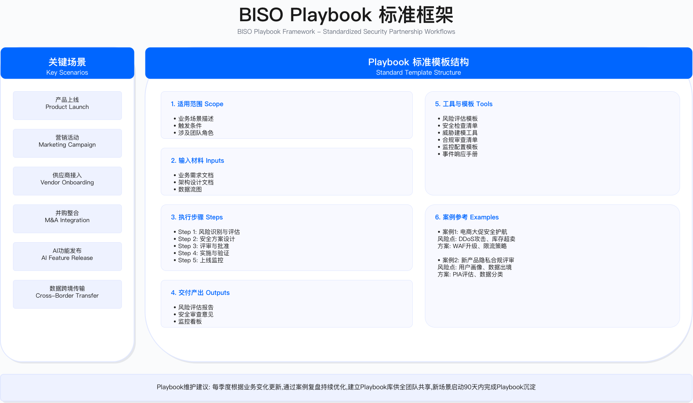

# 3.0　执行摘要

> 章名说明：本章的"业务安全伙伴（BISO, Business Information Security Officer）"是一种**组织角色与协作模式**——安全团队派驻到业务线、进入业务的决策现场。它与第13章的"业务风控与反欺诈"**不是同一个概念**：那一章讲的是账号、交易、内容、营销四条线上对抗黑灰产的风控技术。两者在 13.1 的"风控中台 + BISO"模式中有交集，但本章讨论的是角色定位、协作机制与能力成长，不涉及风控算法与对抗工程。

本章阐述业务安全伙伴（BISO）模式的战略价值、组织设计与实践框架，目标是将安全职能从"技术执行部门"转型为"业务使能角色"，建立业务与安全协同工作的伙伴关系。

---

## BISO 模式的背景与问题

业务安全伙伴（Business Information Security Officer，BISO）角色的出现，源于企业在数字化进程中面临的一个核心矛盾：安全团队与业务部门之间存在目标、节奏与语言的系统性隔阂。

这种隔阂体现在三个层面。目标差异：业务部门追求快速上线与市场响应，安全团队关注风险控制与合规底线，两者的优先级排序往往冲突。节奏错配：当安全评审流程需要数周时间，而业务要求快速迭代时，安全流程容易被绕过或形式化执行。语言不通：安全团队习惯用技术术语（如 CVE 编号、CVSS 评分）沟通，业务部门则关注收入影响与客户体验，双方难以建立有效对话。

三个结构性变化使这种隔阂的代价持续上升。业务流程对数字系统的依赖程度不断加深，安全中断与业务中断的边界逐渐模糊。云原生架构、微服务体系与 API 经济使技术栈复杂度上升，安全评估的范围与难度相应增加。合规压力同步增长，金融、医疗、支付、云服务等领域的监管要求不断细化，客户对供应商的安全审查也趋于严格。

BISO 的设计回应恰好针对这些隔阂：通过在业务部门与安全中心之间建立专职桥梁角色，让懂业务目标的人去做安全判断，让懂安全的人去理解业务约束，在两个世界之间建立持续的翻译机制。

---

## GSBP 与 BISO 的职责边界

实践中最常见的困惑是 GSBP（Global Security Business Partner）与 BISO 的职责划分。这不是简单的初级-高级关系，而是两种不同维度的角色分工。

GSBP 是战术执行者，定位于日常运营支撑层面。作为业务方的单一安全接口，承接安全策略并将其本地化，支持需求受理、风险评估、上线放行等日常工作。决策权限停留在标准场景审批与需求优先级建议层面。

BISO 是战略协调者，提升至治理层面。代表业务单元参与企业安全治理委员会，拥有业务安全决策参与权——风险接受签字、安全投资建议、参与董事会风险委员会汇报。BISO 需要深度理解业务战略与财务模型，技术上能够独立进行威胁建模与架构评审。

两种角色的关键区别体现在一个判断标准上：GSBP 让业务"找得到人、办得了事"，BISO 让高层"看得清风险、做得了决策"。

适用边界：GSBP 模式适用于业务相对单一、安全需求标准化程度高的组织；BISO 模式适用于业务复杂度高、安全与业务需要深度协同的场景。两种角色可以共存，但职责边界必须清晰，业务方不能不知道该找谁。

常见误区：一是将 BISO 简单定义为"高级 GSBP"，忽视战略参与与决策权限的本质差异；二是设立 BISO 但不赋予实际决策权，导致角色空心化；三是让技术专家直接担任 BISO，忽视业务理解与沟通能力的门槛要求。

---

## 组织架构选择

BISO 组织架构设计需要在响应速度、策略一致性、资源利用效率三个维度之间取得平衡。没有一种模型天然优于其他——选择取决于企业的具体约束条件。

集中式模型将 BISO/GSBP 集中在安全中心，远程服务各业务线。资源利用效率高、策略一致性强，但响应速度受限于沟通成本，难以深入了解各业务线特性。适用于业务线较少、业务复杂度相对较低的组织。

嵌入式模型将 BISO 直接派驻到业务部门。响应速度快、业务理解深，但资源重复投入、各业务线安全标准可能出现偏差。适用于业务独立性强、安全需求差异大的组织。

混合式模型结合两者优势：建立中央卓越中心（CoE）负责方法论、工具平台与专家资源池，同时按区域或业务线配置嵌入式 BISO。CoE 保证策略一致性，嵌入层保证响应速度与业务理解深度。适用于多业务线、跨区域运营的中大型组织。

混合式模型的治理复杂度较高，需要建立清晰的权责边界和升级机制，否则容易陷入"中央与地方"的协调摩擦。建议新建 BISO 团队从集中式起步，随业务扩展逐步演进，而非一步到位。

---

## 业务安全伙伴关系生命周期

BISO 与业务部门的伙伴关系需要经历结构化的五个阶段，跳过任何阶段都可能埋下后续的合作隐患。

洞察阶段的核心是深入理解业务战略、运营节奏与风险态势，识别安全可以创造价值的机会点。这一阶段需要主动嵌入业务节奏——参加产品例会、年度规划会，进行一对一深度访谈——而非等待业务方带着需求找上门。

定义阶段将洞察转化为明确的安全目标与成功指标，与业务达成共识。单方面输出风险清单并期待业务自己决定优先级，往往导致资源配合不足。联合 OKR 对齐和 WSJF 优先级评分是关键工具。

共创阶段组织跨职能团队共同设计解决方案。最常见的错误是安全团队闭门造车，忽略业务约束（性能要求、开发成本、上线时间），导致方案被拒或执行效果差。

交付阶段执行共创阶段的方案，通过敏捷迭代模式降低变更影响，建立进度与风险监控看板。例外处理需要"有原则的灵活性"——不是简单说 Yes 或 No，而是用风险管理思维找到平衡点。

复盘阶段是最容易被忽视的环节。系统化复盘不仅沉淀经验，还为下一个洞察阶段提供输入，形成持续改进的闭环。QBR 是向业务高层证明价值的关键机制。

---

## 关键场景 Playbook 框架

Playbook 是 BISO 实现服务标准化的核心工具，解决两个问题：提高效率（避免每次从零开始）和保证质量（确保关键检查点不被遗漏）。

产品上线安全评审是最高频的场景。关键设计是风险分级差异化处理：低风险采用 3 天快速评审，高风险采用 10-15 天深度评审并需要 BISO 审批。评审流程分为启动与材料准备、文档评审、技术测试、风险评估与决策、审批与上线五个阶段，每个阶段有明确产出。

供应商接入安全评估需要根据访问敏感度进行分级：访问生产数据的关键级供应商需要完整评估流程（含现场审计），低敏感度供应商可简化处理。供应商生命周期管理覆盖尽调、合同、入网、持续监控、离网五个阶段——重评估轻监控是这一场景最常见的失误。

AI/ML 安全评估是近年新增的高关注场景。除传统安全控制外，还需要关注模型特有风险：训练数据投毒、对抗攻击、模型窃取、算法偏见、可解释性要求（GDPR 第 22 条、EU AI Act）。

新增的第七个 Playbook（3.4.8）聚焦组织 AI 资产治理，处理"未经申报、悄悄运行的 AI"这一愈发普遍的治理盲区：通过网络流量、SaaS 采购、代码仓库、OAuth 授权等多向量发现影子 AI，建立 AI-BOM 与 Agent 登记册，完成分类分级并施加持续监控，追求"未知资产持续收敛"而非一次性清零。此外，产品上线评审（3.4.2）引入了 AI 辅助初审与分流机制，将材料核对、风险分级建议等机械环节交由 LLM 打头阵，让 GSBP 精力集中于真正需要判断的高风险场景；新兴技术评估（3.4.5）同样增加了"用 AI 辅助完成 AI 评估"的实践指引，涵盖检查清单预填、EU AI Act 分级初判与评估草稿生成三档应用，两处均明确划定人机边界——AI 出草稿，最终放行与定档决策的责任始终在人。

Playbook 有效性的关键约束是持续更新机制。内容陈旧、与实际流程脱节的 Playbook 反而会成为形式主义负担。建议建立季度评审机制，并将评审结论直接纳入下版 Playbook。

---

## 需求管理与优先级治理

BISO 面临的常见挑战是需求过载：来自多个业务线的请求同时涌入，缺乏优先级机制的结果是疲于应对紧急事务，无暇做战略性工作。

需求管理的基本原则是入口统一化（通过工单系统接收需求，避免分散渠道）、分类分级（WSJF 评分模型基于业务价值、时间敏感度、风险降低与工作量四维度）、容量管理（预留适当缓冲应对突发，避免排期过满）。

需求积压量变化趋势、SLA 达成率、优先级分布（P0/P1 占比过高可能说明预防性工作不足）是监控需求管理健康度的核心指标。

---

## 章节核心目标

读完本章，读者应能够：

战略定位层面：理解 BISO 与传统安全角色的本质差异，明确从"技术专家"到"业务伙伴"的转型路径；建立 BISO 在企业治理结构中的定位，设计与业务高管的协作机制；用业务语言阐述安全投资回报。

组织设计层面：根据企业规模与业务复杂度选择 BISO 组织架构模型；设计汇报关系与双线汇报机制；规划团队规模配比；设计跨区域协作机制。

运营卓越层面：建立伙伴关系生命周期管理方法；开发关键场景 Playbook；建立需求管理与优先级治理机制；设计 QBR 报告框架。

能力发展层面：建立 BISO 能力矩阵（四象限模型）；设计从初级到高级的成长路径；构建赋能体系；设计平衡计分卡绩效机制。

---

## 常见陷阱

角色定位模糊：BISO 既想做战略又想做执行，结果疲于奔命。明确 BISO 聚焦战略与流程，日常执行交给 GSBP 或安全工程团队。

业务语言缺失：用技术术语向业务高管汇报，难以获得支持。建立业务价值翻译机制——从"修复漏洞"到"保障上线"，从"合规要求"到"市场准入"。

标准化不足：每次评审都从零开始，效率低且质量不稳定。Playbook 是解决方案，但 Playbook 本身也需要持续维护，否则沦为形式。

孤军奋战：BISO 缺乏安全中心的专家支持，遇到复杂技术问题无人协助。混合式架构的 CoE 设计正是为了解决这一问题。

能力错配：安排纯技术专家担任 BISO，缺乏业务理解与沟通能力。技术深度可以后续培养，业务思维和影响力是更难补充的能力。

---

## 衡量成功的指标体系

领先指标反映流程健康度：Playbook 覆盖率、评审启动速度、培训覆盖率。这些指标出现问题，往往预示滞后指标的恶化。

滞后指标反映实际成果：评审周期、业务满意度（VOC）、高危漏洞修复率、因安全问题导致的生产事件数量。

业务成果是最终证明 BISO 价值的依据：产品上线速度变化、合规认证周期变化、因安全能力赢得或保留的客户订单。

建议建立季度评审机制，将指标数据整合到 QBR 报告中。指标阈值应根据企业实际情况设定基线，关注趋势变化而非绝对数值——自身历史基线的持续改善，比任何行业基准都更有说服力。

---

## 实施路径建议

BISO 体系建设是持续演进的过程，建议按以下逻辑顺序分阶段推进，每个阶段的持续时间取决于组织规模、业务复杂度与高管支持力度。

建立基线阶段：确定组织模式、选拔首批 BISO、完成入职培训、识别业务痛点并实现 Quick Wins。完成标志是 BISO 团队正式运营并与业务建立初步信任。

标准化服务阶段：开发核心场景 Playbook、建立需求管理流程、发布服务目录与 SLA 承诺、建立指标仪表盘。完成标志是主要业务场景均有标准化流程覆盖。

规模化推广阶段：扩展团队规模、建立 Security Champion 计划、实施自动化工具、启动业务满意度调研。完成标志是 BISO 服务覆盖所有核心业务线。

持续优化阶段：建立最佳实践共享机制、探索 AI 辅助决策工具、将数据驱动的治理常态化。此阶段不是终点，而是 BISO 体系成熟运营的稳定状态。

建议从 1-2 个业务线试点开始，验证模式有效后再推广——四个案例研究（3.6）均印证了这一原则。

---

## 导航

[← 返回章节目录](./README.md) | [下一节：3.1 BISO 职责定位与使命 →](./3.1_BISO职责定位与使命.md)

---

© 2025-2026 AISecOps Project. Licensed under CC BY-NC-SA 4.0
