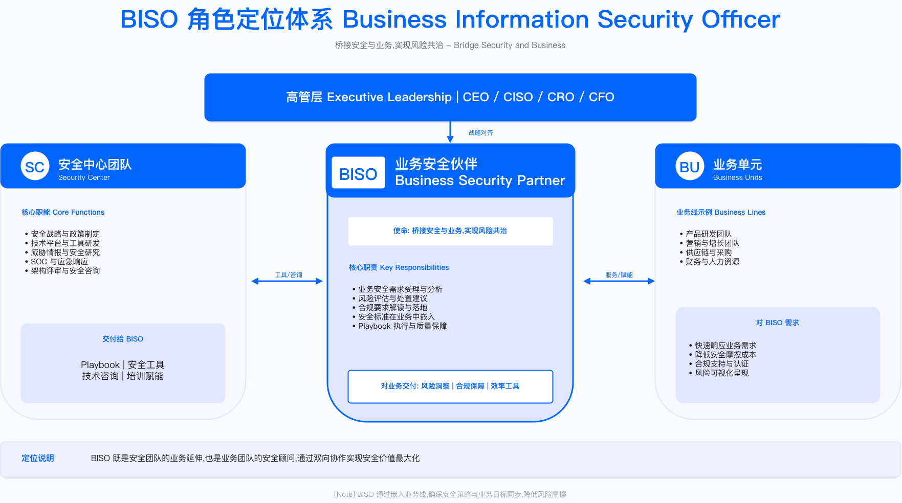

# 3.1　BISO 职责定位与使命

> 导读：本节回答两个根本问题——GSBP 和 BISO 究竟是什么关系，以及 BISO 如何在企业治理结构中找到自己的位置。"角色定义与核心职责"厘清职责边界与组织定位，"BISO 在企业治理结构中的定位"建立董事会参与框架与风险偏好授权机制，"使命陈述与价值主张"阐述如何用业务语言表达安全价值，"业务细分与利益相关方管理"提供系统化的相关方管理策略，"战略对齐行动路径"给出分阶段落地计划。如需深入了解组织架构设计，见 3.2；治理领导力的更宏观视角见 [第19章：安全领导力与组织卓越](../../第07部分_安全领导力与组织建设/第19章_安全领导力/)。

---

## 角色定义与核心职责

### 术语溯源：哪些是行业共识，哪些是本书定义

在展开职责划分之前有一个前提：BISO 这个角色没有权威标准定义。它不来自任何国际标准或监管框架，而是从金融业实践中自下而上长出来的岗位，各家机构的叫法、汇报线与职权范围差异很大。目前可引用的行业口径主要有四份，读者可据此判断本书的说法在多大程度上属于共识：

- FS-ISAC 的 Business Security Executives Forum 在《Business Information Security Officer (BISO) Program and Role》白皮书中，把 BISO 定义为"网络安全与业务之间的联络人"，核心职能归为业务侧网络安全问责、网络风险管理、咨询与顾问三类，并列举了五种汇报结构（直接向 CISO/CIO、向风险组织、向业务单元负责人、矩阵式双线，以及该文认为的理想形态：实线向 CISO、虚线向业务负责人，定位为"mini CISO"）[1]。
- Forrester 在 2022 年发布的 BISO Role Profile 中，把 BISO 描述为"代表 CISO 行事、同时作为业务单元领导班子成员"的双重身份，两项关键职责是向业务布道安全要求（business advocacy）与在 CISO 面前代表业务发声（business representation）；该报告同时指出，这一角色在金融与保险业已较为成熟，在科技、医疗、制造等行业仍属新兴[2]。
- IANS Research 则从从业者视角讨论了该角色的定位、汇报线选择与常见失效模式[3]。此外 Gartner 也提供了可直接改写的 BISO 岗位说明书模板，但该文档需订阅访问，本书不作为公开引用来源。

本书的取舍是：BISO 的定位、双线汇报与治理参与，与上述行业口径基本一致（尤其接近 FS-ISAC 所称的"理想形态"），可视为对现有实践的归纳；而 GSBP（Global Security Business Partner）这一层、GSBP 与 BISO 的分工方式、以及后文的 CL0-CL3 分级与配比公式，是本书为便于规模化落地而提出的作者定义，没有对应的行业标准，请不要当作通行术语对外使用。

顺带说明这套设计的思想来源：把职能专家嵌入业务线、并让其同时对职能条线和业务条线负责，这一组织范式来自人力资源领域的 HR Business Partner 模型——由密歇根大学的 Dave Ulrich 在 1997 年的《Human Resource Champions》中提出，主张 HR 从事务性职能转向战略业务伙伴，并按"战略伙伴、变革推动者、员工支持者、行政专家"四种角色重新组织[4]。安全领域的 BISO/GSBP 体系是这一范式的迁移，也因此继承了它的经典难题：双线汇报下的忠诚归属，以及"贴近业务"与"保持独立判断"之间的张力。

### GSBP 与 BISO 的职责边界

GSBP 和 BISO 都属于"安全业务伙伴"体系，但两者的定位差异常被低估。常见的困惑场景：产品上线评审该找 GSBP 还是 BISO？董事会安全态势汇报由谁负责？BISO 自身也时常面临身份困惑——究竟代表业务还是代表安全？

这种混乱有其结构性根源：职责边界不清晰时，业务方只能靠猜测判断该找谁，而两个角色都会陷入"什么都要管、什么都管不深"的困境。

GSBP 是战术执行者（tactical executor），深入日常业务节奏。作为业务方的单一安全接口，承接集团安全策略并将其本地化，支持需求受理、风险评估、上线放行等日常工作。GSBP 向 BISO 或安全中心 GSBP 团队负责人汇报，决策权限停留在日常风险评估、标准场景审批、需求优先级建议层面。

BISO 是战略协调者（strategic orchestrator），参与董事会治理与业务单元决策。代表业务单元参与企业安全治理委员会，对业务安全策略、预算、合规负责。BISO 采用双线汇报机制——专业线向 CSO/CISO 实线汇报，业务线向业务单元总经理虚线汇报——拥有重大风险例外审批、安全预算分配、战略对齐决策权限。

边界清晰化的实质转变：GSBP 让业务"找得到人、办得了事"，BISO 让高层"看得清风险、做得了决策"。这种分工不是初级-高级的单线递进，而是战术执行与战略协调的有机配合——GSBP 深入业务一线收集数据和反馈，BISO 基于这些输入参与董事会决策，形成"战术执行→战略调整→策略下发"的信息闭环。

适用边界：职责边界划分适用于中大型企业（业务规模需支撑至少 2 名 BISO 的工作量）。小型企业或单一业务线企业可由 1 人兼任两类职责，但汇报时需明确区分战术议题与战略议题，避免两类工作相互挤压。

关键约束：职责边界划分的有效性依赖三个前提条件——组织规模（需有足够业务复杂度支撑分工）、汇报关系清晰度（双重汇报机制需明确决策权归属）、高层对角色差异的认知（否则业务仍会混淆服务边界）。

常见误区：

- 将 GSBP 与 BISO 视为单纯的"初级-高级"晋升关系，忽视职责本质差异——两者是并行而非递进的角色设计
- 让 BISO 承担过多日常评审工作，导致无暇参与战略决策——应将日常需求下放给 GSBP 处理

验证方法：通过业务团队访谈确认是否清楚"产品上线找 GSBP、战略风险决策找 BISO"；检查 BISO 日历中战略会议与日常评审的时间占比（战略会议应占主导位置）。

### 组织定位：安全中心的业务前哨

GSBP/BISO 在企业安全组织中的位置决定其独立性与影响力，这一点比很多人意识到的更重要。将 BISO 虚线汇报给业务部门是常见的组织错误——这看起来能让 BISO 更贴近业务，实际上容易导致 BISO 被业务"捕获"。当业务压力足够大时，一个实线汇报给业务 VP 的 BISO 很难在批准第三方组件集成时说"不"。

正确的组织定位要求 GSBP/BISO 团队为安全中心直属团队，向 CSO/CISO 实线汇报。为保持业务对齐，建立虚线汇报关系（向业务单元总经理汇报业务进展），但最终决策权在安全中心。

这一设计体现在四个层面：

第一，GSBP/BISO 团队为安全中心直属团队。与 SOC、AppSec、GRC 等能力域平级，都直接向 CSO/CISO 汇报。这确保了两件事：策略一致性（所有安全策略由安全中心统一制定，不会出现各业务线各自解读）和资源供给（工具、平台、人力预算由安全中心协调，而非受制于业务部门的预算节奏）。

第二，业务前哨职能。GSBP/BISO 虽属安全中心，工作重心在业务线。就像总部派驻地方的"前哨站"，负责将总部安全策略翻译成业务语言并推动落地。安全中心发布新的 API 安全标准，GSBP 将其转化为具体的产品上线检查清单，嵌入业务的发布流程——这是"前哨翻译"的典型场景。

第三，双向闭环机制。GSBP/BISO 不仅向下推送策略，还向上反馈业务需求与风险信号。当 BISO 发现业务频繁遇到特定合规问题（如跨境数据传输），反馈给安全中心 GRC 团队后，GRC 团队可开发自动化评估工具提升效率，形成正向循环。这种双向机制是 BISO 区别于纯粹"安全传声筒"的核心价值。

第四，独立性与影响力的平衡。直属 CSO/CISO 保证决策独立性，BISO 在面临业务压力时有组织背书。虚线汇报关系（如每月向业务单元总经理汇报业务安全进展）则确保了解业务战略与优先级，避免安全工作与业务脱节。

关键约束：组织定位的有效性受制于 CSO/CISO 在企业中的话语权（若 CSO 汇报层级低，BISO 独立性难以保障）和业务单元对安全中心的认可度（若业务视安全为"外人"，虚线汇报将流于形式）。

→ *详见 [第19章：安全领导力与组织卓越](../../第07部分_安全领导力与组织建设/第19章_安全领导力/) 中的系统化组织设计*

常见误区：

- BISO 实线汇报给业务部门——这会导致风险评估受业务进度压力影响，丧失独立判断
- 安全中心不给 BISO 配置资源——BISO 沦为"传话筒"而非"前哨站"

验证方法：审查 BISO 的正式汇报关系（HR 系统中的实线/虚线设置）；检查 BISO 是否有独立的预算申请权限；访谈业务单元确认 BISO 在风险决策中是否能坚持独立判断。

---

## BISO 在企业治理结构中的定位

### 董事会层面参与机制

BISO 在企业治理结构中的真正价值，不在于日常需求评审或风险评估，而在于参与董事会层面的战略决策与风险治理。这是 BISO 与 GSBP 最关键的区别——GSBP 服务业务操作层（operational level），BISO 服务企业治理层（governance level）。

一个典型场景说明这种差异。董事会风险委员会季度会议上，董事们需要回答：当前面临的最大安全风险是什么？这些风险可能导致多少财务损失？安全投资是否足够？如果没有 BISO 的专业汇报，董事会只能听 CISO 一面之词，缺少业务视角的风险洞察。BISO 提供的"自下而上"的业务安全态势——哪些业务线风险敞口最大，哪些合规项目可能延期，哪些安全投资带来了可量化的业务价值——是这个信息链条中不可替代的一环。

BISO 参与董事会治理的框架体现在三个层级：

董事会层面：风险委员会接收 BISO 季度汇报（风险敞口、合规状态、重大事件）及安全投资 ROI 分析与预算建议；审计委员会依赖 BISO 协助内控合规检查（ISO 27001、SOC 2、内部审计），提供证据包与整改跟踪；战略委员会在数字化转型安全规划（云迁移、AI 应用）和并购安全尽调（M&A security due diligence）中需要 BISO 参与。

高管层面：CEO 在经营决策中的安全考量（新市场、新产品、新技术）需要 BISO 支持；CFO 依赖 BISO 提供安全投资 ROI 分析，协助财务审计中的 IT 内控评估（SOX 404 等）；COO 的业务连续性规划与运营流程安全合规需要 BISO 参与；CSO/CISO 与 BISO 双向汇报、战略协同，BISO 反馈业务需求与风险态势，直接影响集团安全策略的制定。

业务层面：业务单元负责人是 BISO 直接服务对象，BISO 嵌入业务规划、产品上线、运营活动全流程。

BISO 在董事会层面创造三类核心价值：风险可视化（将技术风险转化为财务影响的语言）、方案专业性（提供多个可选方案及 ROI 分析，而非单一的"必须修复"建议）、决策支持（帮助董事会做出平衡业务与风险的有据可查的决策）。

适用边界：董事会参与机制适用于设有正式治理委员会的企业。初创企业或非上市公司可简化为定期向创始人/CEO 汇报，但汇报内容框架相同——关键是建立定期汇报的节奏。

验证方法：检查 BISO 是否列入风险委员会/审计委员会的常规参会名单；审阅过去 4 个季度的董事会会议纪要，确认 BISO 汇报是否被记录。

### BISO 董事会治理职责

BISO 的治理职责覆盖五个维度，每个维度有明确的交付频率与产出：

| 职责维度 | 内容说明 | 交付频率 | 典型产出 |
|---------|---------|---------|---------|
| 风险汇报 | 向董事会风险委员会汇报业务线重大安全风险变化 | 季度 QBR | 董事会风险报告（1-2 页执行摘要） |
| 合规保证 | 协助董事会履行安全合规监督责任，提供合规证据 | 年度及按需 | 合规证据包（ISO 27001、SOC 2、GDPR 等） |
| 投资建议 | 为董事会提供业务安全投资的优先级建议和 ROI 分析 | 年度预算周期 | 安全投资 ROI 分析报告、预算提案 |
| 危机沟通 | 重大安全事件的董事会沟通和决策支持 | 按需（重大事件） | 事件简报（24 小时内）、根因分析（7 天内） |
| 战略对齐 | 确保业务安全策略与企业战略、董事会决议保持一致 | 季度复核 | 战略对齐检查清单、OKR 对齐报告 |

五个维度的关键权衡：季度 QBR 频率需要结合实际情况调整——过高会增加准备负担，过低则可能错过风险窗口期。建议与董事会日历同步，避免与财报季、重大商业决策节点冲突。

常见误区：

- 风险汇报过于技术化——董事会关心业务影响和财务损失，不关心漏洞数量和 CVE 编号
- 合规证据临时准备——应建立持续合规监控机制，审计时才能做到随取随用，而非"突击整理"

### 风险偏好与授权基准

风险偏好（risk appetite）是董事会授予 BISO 的决策权限边界。建立清晰的风险分级与上报机制，BISO 才能在面对业务方"这次能不能通融"时，有组织层面的明确依据，而不是依赖个人判断力承受压力。

| 风险类型 | 容忍度/红线 | 触发上报阈值 | 决策主体 | 响应 SLA |
|---------|------------|-------------|---------|---------|
| 财务损失 | 单次直接损失红线（由企业自行设定） | 超过阈值需提交风险偏好例外报告 | 董事会风险委员会 | 24 小时内 |
| 数据泄露 | PII/敏感数据泄露或跨境传输违规 | 发生即刻通知，限期内提交根因与补救计划 | CSO+BISO 联合上报 | 即刻+72 小时 |
| 法规违规 | 可能导致行政处罚或停业整顿 | 初步判定后限期内提交法律风险评估 | CLO+BISO+合规负责人 | 48 小时内 |
| 运营中断 | 核心业务停摆超过阈值或影响 GMV 超过阈值 | 触发危机委员会并启动应急授权链路 | CEO+BISO | 2 小时内 |
| 供应链风险 | 关键供应商（Tier 1）安全评估未通过 | 提交风险接受申请或更换供应商计划 | BISO+采购负责人 | 5 个工作日 |
| AI 伦理风险 | AI 系统存在歧视、偏见或可解释性问题 | 提交 AI 伦理评估报告与缓解方案 | BISO+AI 负责人+法务 | 10 个工作日 |

表格中未填写具体数字，因为这些阈值因企业规模、行业、监管环境差异巨大，需由企业风险委员会结合实际情况确定。照搬行业基准数字不仅没有意义，还可能制造错误的安全感。

授权落地建议包括四个关键机制：建立《风险偏好登记册》（记录董事会批准的风险偏好，明确可接受、需上报、禁止的风险等级）；QBR 复盘机制（在季度业务回顾中复盘风险偏好执行情况）；例外管理流程（针对超出风险偏好的情况，确保补偿控制和审计轨迹可追溯）；动态调整（随业务发展、监管环境变化年度更新）。

运行指标：风险偏好例外数量（月度）、例外平均关闭周期、上报 SLA 达成率。

### BISO 决策升级场景

以下五个场景展示安全与业务发生冲突时，BISO 如何判断升级路径、在坚守底线与灵活应对之间找到平衡点。每个场景的关键学习不在于结论，而在于决策过程中的思维框架。

场景一：大促前夕的高危漏洞修复冲突

双十一前 3 天，安全扫描发现核心交易系统存在高危 SQL 注入漏洞。修复需要代码变更并重新发布，业务方担心临时发布引入新问题，坚持大促后再修。业务方认为"大促期间系统稳定优先，漏洞被利用是小概率事件"；安全团队认为"高危漏洞必须立即修复"。

决策路径：GSBP 评估漏洞技术细节（该漏洞需内网访问且利用难度较高，实际风险可控）→ 上报 Regional BISO，联合 AppSec 进行风险量化 → Regional BISO 提出折中方案：暂不修复代码，但部署 WAF 规则作为临时缓解措施 → 业务方接受，约定大促后 48 小时内完成正式修复 → 记录风险接受决策，明确责任人与修复时限。

关键学习：安全与业务冲突时，BISO 的价值在于找到"既保护业务又控制风险"的折中方案，而非坚持非黑即白的立场。临时缓解措施（WAF 规则）配合明确的整改承诺，是这类场景的标准操作思路。

场景二：跨境数据传输合规争议

海外业务团队需将欧盟用户数据传输至国内（中国）数据中心进行 AI 模型训练，业务方认为已签署 SCC（Standard Contractual Clauses）即可合规。GSBP 认为仅 SCC 不足，需完成 TIA（Transfer Impact Assessment）；更关键的是，这是一个双向合规场景——数据出境要满足 GDPR，数据入境要满足中国 PIPL，二者必须并行评估，任何一侧不合规都会导致整链违规。

决策路径：GSBP 识别合规风险 → Regional BISO 联合 DPO（隐私官）进行初步法律风险评估 → 评估结论：中国未获欧盟"充分性认定"（因此不能依赖充分性决定；也无法适用 2023-07-10 通过、且仅覆盖已完成 DPF 认证的美国接收方的 EU-US Data Privacy Framework[5]），需依赖欧盟标准合同条款（Commission Implementing Decision (EU) 2021/914 项下的 SCC[6]）并按 EDPB 建议完成传输影响评估[7]，仅签 SCC 确实不足 → 同步评估中国侧入境义务：PIPL 项下的告知同意、单独同意、个人信息保护影响评估，以及《促进和规范数据跨境流动规定》（国家网信办 2024-03-22 公布并施行[8]）对入境后再出境的要求 → 升级至 Lead BISO，由 Lead BISO 与 CLO（首席法务官）联合决策 → 暂停数据传输，业务团队在 10 个工作日内完成 GDPR 侧 TIA 与 PIPL 侧合规评估；若任一侧结论为高风险，评估数据本地化方案。

关键学习：跨境数据传输涉及法规违规风险，BISO 的价值不在于强硬阻止，而在于主动引入正确的专业角色（法务与隐私官）共同决策，用专业判断替代权力对抗。跨境双向流动尤须避免只盯出境国、遗漏入境国义务的单侧盲区（法规时效性截至 2025 年，具体应以最新监管口径复核）。

场景三：紧急上线与安全评审时间冲突

产品团队需在竞品发布前抢先上线新功能，要求跳过常规 5 天安全评审。业务负责人表示"晚一天上线就损失市场先机"。

决策路径：GSBP 了解功能范围（该功能涉及用户认证模块变更，风险等级较高）→ 提出快速通道方案：24 小时内完成核心模块 focused review，非核心部分事后补评 → Regional BISO 协调 AppSec 加班完成紧急评审，发现 2 个中危问题 → 业务方接受修复后上线，整体延迟 36 小时 → 形成共识：建立"紧急上线快速通道"机制，明确触发条件与评审范围。

关键学习：面对"跳过安全"的要求，BISO 不应简单拒绝，而应提供"快速但不跳过"的替代方案。这个场景还产生了一个制度性成果——将紧急通道机制标准化，避免下次再临时协商。

场景四：第三方 SDK 集成的供应链风险

业务团队计划集成某第三方广告 SDK，该 SDK 市场占有率高但安全评估未通过（存在过度数据采集行为）。业务方认为"竞品都在用，不用就落后"。

决策路径：GSBP 完成技术评估，确认 SDK 确实采集设备指纹、通讯录等超出必要范围的数据 → Regional BISO 联合法务评估监管风险（PIPL 第 6 条数据最小化原则）→ 升级至 Lead BISO，召集业务负责人、法务、CSO 联合评审 → 拒绝集成该 SDK，同时协助评估 2-3 个合规替代方案 → 业务方最终选择合规替代 SDK，变现效果略低但规避监管风险。

关键学习：供应链安全决策需量化业务损失与监管风险两端。"拒绝"不应是终点，同时提供"替代方案"才是 BISO 的完整服务——只说不行，不给出路，是 BISO 被业务厌恶的根本原因之一。

场景五：安全控制措施影响用户体验

安全团队要求上线强制双因素认证（MFA），测试期间用户流失率上升 15%，业务方要求取消或降级该控制措施。

决策路径：GSBP 收集双方数据：用户流失 15% vs 近半年账户盗用投诉量 → Regional BISO 提出分级方案：高风险操作（大额支付、密码修改）强制 MFA，普通登录可选 → 协调产品团队优化 MFA 流程（记住设备 30 天、生物识别替代短信）→ 优化后再次灰度测试，用户流失率降至 3% → 分级 MFA 正式上线，季度复盘流失率与安全事件的平衡。

关键学习：安全控制与用户体验的冲突需要数据驱动决策。当 BISO 能够拿出"账户盗用投诉数量"的数据时，对话就从价值观争论变成了数字权衡，更容易达成各方都能接受的方案。

---

## 使命陈述与价值主张

### 使命陈述的战略意义

BISO 团队若无法清晰表达自身存在的价值，业务满意度往往较低，业务抱怨"安全团队就知道说 No"——而核心问题往往是：团队自己都说不清存在的价值是什么。

使命陈述的作用是将团队定位从"审批者"转变为"赋能者"。这不是一句口号，而是一个触发行为改变的锚点：GSBP 开始主动参加业务规划会议，BISO 开始用 ROI 语言与业务沟通——因为使命陈述明确了"这才是我们应该做的"。

优秀的使命陈述同时回答两个视角的问题：

- 安全团队视角：GSBP/BISO 让安全成为业务价值的一部分，而不是业务的障碍
- 业务视角：GSBP/BISO 是值得信赖的安全顾问，在产品、市场和运营全周期提供风险导航，让业务更快、更稳、更合规

综合使命陈述包含六个核心要素：

我们是谁：嵌入业务的安全伙伴（business-embedded security partners），连接企业安全战略与业务增长目标，确保安全成为业务竞争力的一部分。

我们的使命：让安全成为业务价值的一部分而非障碍；在产品、市场和运营全周期提供风险导航；将复杂安全控制翻译为业务语言，推动文化共建与能力提升。

我们的价值主张：风险降低（减少高风险例外，缩短风险暴露窗口）、效率提升（优化需求响应时间，加速产品上线节奏）、合规保障（提升审计一次通过率）、文化驱动（提高业务团队安全自助率）。

我们的服务范围：咨询与顾问、需求与评审、合规与证据、共创项目、事件与例外、培训与支持。（完整服务目录见 [3.7 附录模板 1](3.7_附录.md)）

我们的成功指标：业务满意度（VOC）、需求 SLA 达成率、业务安全风险敞口下降率（季度）、合规审计一次通过率。具体目标值由各企业根据基线设定。

联系我们：Confluence、Slack、Email 等多渠道接入，以及团队成员名单。

使命陈述落地的四个关键步骤：

第一步，获得 CXO 三方签字认可。将使命陈述草稿提交给 CSO、COO 和业务单元总经理审阅，每人提出修改意见后达成共识。这个过程往往比预期耗时，但换来的是：当业务与安全产生冲突时，业务领导会主动引用使命陈述作为协商基础——这种高层认可的价值远超任何口头承诺。

第二步，内网全员传播。发布在公司内网首页、Confluence 安全专区、新员工入职培训材料中。高覆盖传播确保每个员工知道"遇到安全问题找谁、期待什么服务"。

第三步，季度回顾与对齐。在 QBR 会议上，对照使命陈述检查实际工作："我们是否真的让安全成为业务价值？有哪些地方偏离了使命？"

第四步，可视化持续提醒。制作海报、桌牌、Slack 频道置顶。使命陈述若只发布一次而不持续强化，通常会在 3 个月后被遗忘。

适用边界：使命陈述适用于所有设立 BISO/GSBP 职能的企业；即使团队规模仅 1-2 人，明确的使命陈述仍有助于与业务建立共识。

常见误区：

- 使命陈述过于抽象——"赋能业务"等口号缺乏具体服务承诺，业务团队无感知
- 闭门造车——使命陈述未征求业务方意见，导致价值主张与业务痛点脱节

验证方法：随机访谈业务团队成员，询问"BISO 是做什么的"——若多数人能复述核心要点，说明传播有效。

### 价值主张的四个维度

风险降低是 BISO 创造的首要价值，但表达方式决定了是否被听见。不要说"我们修复了 200 个漏洞"，而要说"我们帮助业务避免可能导致业务中断的数据泄露风险"。

具体体现在三个方面：减少高风险例外数量（通过 GSBP 前置评估，将高危漏洞提前处理，避免"带病上线→紧急下线→业务中断"恶性循环）；缩短风险暴露窗口（建立风险例外跟踪看板，压缩高风险修复周期）；避免重大安全事件（通过供应链安全评估，提前发现第三方组件隐患）。

量化指标参考：高风险敞口季度下降率、风险例外平均关闭周期、重大安全事件数（目标零重大事件）。

效率提升关注业务最关心的"安全会不会拖慢业务"。BISO 的第二大价值是让安全更快、更便捷、更自动化。

具体体现：优化需求响应时间（标准化 Playbook 库，业务可自助查阅，简单需求快速响应）；加速产品上线节奏（并行评审方式，将安全评审与 UAT 测试同步进行，压缩上线周期）；减少返工成本（将 SDL 嵌入敏捷开发流程，需求阶段即识别安全需求，避免上线前发现高危漏洞导致紧急返工）。

量化指标参考：需求 SLA 达成率、产品上线评审周期（区分标准与复杂场景）、业务团队自助率。

合规保障是业务全球化的"通行证"，谈不上负担。BISO 的第三大价值是用合规换取市场准入和客户信任。

具体体现：提升审计一次通过率（持续合规监控平台，实时跟踪控制项执行状态，审计前自动生成证据包）；实现监管零罚款（合规自动化系统，关键操作自动触发合规评估）；加速全球市场准入（Trust Center 网站公开展示安全认证，缩短客户尽调周期）。

量化指标参考：合规审计一次通过率、监管罚款金额（零容忍目标）、合规证据自动化采集比例。

文化驱动认识到安全最终是人的问题。BISO 的第四大价值是让安全成为每个员工的本能反应，而不是被动应付的合规要求。

具体体现：提高业务团队安全自助率（知识库覆盖常见问题，GSBP 团队可专注于复杂问题）；传递安全文化（CTF 竞赛、攻防演练、案例分享会，提高员工参与率和主动上报意愿）；建立安全社区（Security Champions 项目，在每个业务团队培养安全冠军，成为 GSBP 的有效延伸）。

量化指标参考：业务团队自助率、安全意识培训覆盖率（含新员工和年度复训）、VOC 满意度（季度调研）。

---

## 业务细分与利益相关方管理

### 业务细分的战略价值

若只配置 1 名 BISO 覆盖所有业务线，通常的结果是：不同业务线抱怨 BISO 对其特定合规要求理解不深（电商、支付、跨境业务各有专业性），BISO 本人疲于应付各种咨询，无法深入任何业务。

业务细分的必要性有三个根本原因：不同业务线的风险特征差异巨大（电商关注反欺诈和用户隐私，支付关注 PCI DSS 和反洗钱，跨境关注数据本地化和海关监管）；一刀切的安全策略难以满足多样化需求；GSBP/BISO 只有真正理解业务的商业模式、技术架构、监管环境，才能给出切实可行的安全方案。

业务细分可按五个维度进行：

| 细分维度 | 划分依据 | 示例 |
|---------|---------|------|
| 业务单元（BU） | 按业务类型划分 | 电商平台、支付业务、跨境业务、商家服务、物流平台 |
| 市场区域 | 按地理位置划分 | 国内、北美、欧盟、APAC、拉美 |
| 产品类型 | 按客户类型划分 | B2C（消费者）、B2B（企业）、平台体系（第三方开发者） |
| 合规要求 | 按监管强度划分 | 强监管（金融支付）、中监管（跨境电商）、轻监管（内部工具） |
| 技术栈 | 按技术特征划分 | 云原生应用、传统单体应用、移动端、IoT、AI/ML |

五个维度可组合使用，通常以业务单元+市场区域为主，避免过度细分导致 BISO 资源碎片化。细分匹配原则：1 个 BISO 覆盖 1 个业务单元（小型企业可覆盖多个）、1 个 Senior GSBP 覆盖 1 个产品线或区域、1 个 GSBP 覆盖 1 个子产品线或专项。

常见误区：

- 过度细分导致 GSBP 数量膨胀——应先验证业务复杂度是否支撑细分
- 按组织架构而非业务特征细分——组织架构变动频繁，应以业务特征为主要依据

验证方法：检查每个 BISO/GSBP 的服务范围是否有明确文档记录；访谈业务团队确认是否清楚"我的安全对接人是谁"；统计各 BISO/GSBP 的工作负载是否均衡。

### 利益相关方的系统化管理

新任 BISO 常见难题：产品负责人投诉"BISO 从不参加产品规划会"，财务 BP 质疑"安全预算 ROI 不清晰"，隐私官抱怨"跨境数据评估反应太慢"。根源通常是没有系统化识别和管理利益相关方，导致重要决策节点缺席、关键诉求响应不及时。

九类核心利益相关方的管理策略：

| 利益相关方 | 关注点 | 安全诉求 | 推荐互动节奏 | GSBP/BISO 交付 |
|-----------|--------|---------|-------------|---------------|
| 业务单元总经理 | 业务增长、利润率、客户体验 | 不阻碍创新、重大风险有方案 | 月度经营会、季度 QBR | 业务化的风险概览、ROI 分析 |
| 产品负责人 | 产品路线图、上线节奏 | 上线审批效率、风险提前识别 | 产品例会、迭代评审 | 嵌入需求评审、"安全看板" |
| 研发负责人 | 技术债、稳定性、效率 | 需求可落地、开发成本可控 | 架构评审、技术双周会 | 翻译安全标准、推动自动化 |
| 运营负责人 | 活动执行、成本控制 | 反作弊、账号安全、投诉率 | 周例会、活动前复盘 | 活动安全清单、复盘报告 |
| 法务/合规 | 合同、政策、监管沟通 | 合规评估、证据留存 | 月度法规同步、合规评审会 | 协调合规评估、沉淀证据库 |
| 隐私官 | 隐私合规、数据主体权利 | GDPR/PIPL 合规、TIA 评估 | 双周隐私同步会 | 跨境数据评估、隐私设计评审 |
| 数据负责人 | 数据质量、数据资产 | 数据分级分类、访问控制 | 月度数据治理会 | 数据安全策略、敏感数据保护 |
| 财务 BP | 预算、成本控制、ROI | 投资合理性、成本可控 | 季度预算复核会 | 安全投资 ROI 分析、成本优化建议 |
| HR BP | 人才招聘、绩效、文化 | 培训、背景调查、离职管理 | 月度人才发展会 | 安全培训计划、背景调查流程 |

利益相关方权力-利益矩阵（power-interest matrix）将相关方分为四类：

- 高权力+高利益（manage closely）：业务单元总经理、CSO/CISO——密切管理、频繁沟通，节奏为月度经营会、季度 QBR、重大事件即时通报
- 高权力+低利益（keep satisfied）：产品负责人、研发负责人——关键节点参与，节奏为产品例会、架构评审
- 低权力+高利益（keep informed）：法务/合规、隐私官、数据负责人——定期同步，节奏为月度同步会、合规评审会
- 低权力+低利益（monitor）：一般员工、外部顾问——按需互动，节奏为培训活动、知识库更新

利益相关方地图维护建议：每季度更新、新成员入职第一周内熟悉地图、组织架构调整时立即更新、每半年评估关系健康度。

验证方法：检查 BISO 是否被邀请参加产品规划会、架构评审会等关键会议；对比利益相关方地图与实际沟通记录，识别遗漏节点。

---

## 战略对齐行动路径

### 启动阶段的关键任务（Month 1-2）

| 任务 | 产出 | 负责人 | 建议周期 |
|-----|------|--------|---------|
| 完成 GSBP/BISO 角色定位声明 | 1 页角色定义文档，明确 GSBP vs BISO 职责边界 | Lead BISO+CSO/CISO | 2 周 |
| 获得 CXO 三方签字确认 | CSO、COO、各业务单元领导签字的使命陈述 | Lead BISO | 4 周 |
| 绘制业务细分地图 | 业务细分图，明确每个 BISO/GSBP 服务范围 | Lead BISO+BISO 团队 | 2 周 |
| 绘制利益相关方矩阵 | 利益相关方地图（power-interest matrix） | 各 BISO/GSBP | 2 周 |
| 建立沟通节奏表 | 沟通节奏表（含会议类型、频率、参与人、议题模板） | 各 BISO/GSBP | 1 周 |

### 建设阶段的核心产出（Month 3-6）

| 任务 | 产出 | 负责人 | 建议周期 |
|-----|------|--------|---------|
| 定义业务价值指标 | 指标定义文档（含计算公式、数据来源、目标值） | Lead BISO+GRC 团队 | 4 周 |
| 发布标准化服务目录 | 服务目录（含服务类型、交付物、SLA、联系方式） | Lead BISO+BISO 团队 | 4 周 |
| 建立三方协作机制流程图 | 协作流程图（BISO←→安全中心←→业务线） | Lead BISO | 2 周 |
| 在内网发布使命陈述与服务目录 | 内网页面、Confluence/Wiki、Slack 频道置顶 | Lead BISO+IT 团队 | 1 周 |

### 优化阶段的持续改进（Month 7-12）

| 任务 | 产出 | 负责人 | 建议周期 |
|-----|------|--------|---------|
| 首次 VOC 满意度调研 | VOC 调研报告（满意度评分、改进建议） | Lead BISO | 2 周 |
| 首次 QBR 向董事会汇报 | 董事会风险报告（1-2 页执行摘要） | Lead BISO+CSO/CISO | 按季度节奏 |
| 优化业务细分与利益相关方地图 | 更新后的业务细分图与利益相关方地图 | Lead BISO+BISO 团队 | 季度复核 |

运行指标：行动路径执行进度（按月跟踪）、各阶段交付物完成率、VOC 基线建立与趋势变化。

---

## 本节核心要点

清晰的角色边界要求 GSBP 聚焦日常运营与项目交付，BISO 承担战略对齐与治理职责。独立的组织定位要求 GSBP/BISO 团队为安全中心直属团队，确保策略一致性与决策独立性。明确的治理职责要求 BISO 参与董事会风险委员会，汇报业务安全态势，支持高管决策。清晰的使命陈述要求用业务语言表达安全价值，获得 CXO 认可。系统化的利益相关方管理要求识别关键利益相关方，建立分级互动策略。

### 常见陷阱与应对策略

| 陷阱 | 表现 | 应对策略 |
|-----|------|---------|
| 被业务"捕获" | BISO 过度迁就业务需求、忽视风险底线 | 明确风险偏好红线，重大例外必须上报 CSO/董事会 |
| "安全警察"形象 | 业务团队视 BISO 为审批障碍、满意度低 | 强化服务意识，提供快速通道（fast track）、优化 SLA |
| 使命陈述空洞 | 过于抽象、业务团队无感知 | 用业务语言、量化指标、成功案例具体化价值主张 |
| 利益相关方不清晰 | 不知道该找谁沟通、错过关键决策节点 | 建立并定期更新利益相关方地图，纳入团队 Wiki |
| 指标不可度量 | 定义的指标无法采集数据或验证 | 与 GRC/数据团队协作，确保指标有明确数据来源 |

---

## 延伸阅读

标准与框架：

- ISO/IEC 27014:2020 — Information security, cybersecurity and privacy protection—Governance of information security
- SABSA White Paper — Business-Driven Security Architecture
- BRM Institute — Business Relationship Management Framework

相关章节：

- [3.2 BISO 组织架构设计](3.2_BISO组织架构设计.md)——深入探讨组织模型、汇报关系、团队规模规划
- [3.3 业务安全伙伴关系生命周期](3.3_业务安全伙伴关系生命周期.md)——学习如何建立、深化、维护与业务的伙伴关系
- [第2章：GRC 治理](../../第01部分_基础与战略治理/第02章_GRC治理/README.md)——理解 BISO 如何参与企业 GRC 治理

---

## 参考文献

| # | 来源 | 标题 | 日期 | 链接 |
| --- | --- | --- | --- | --- |
| [1] | FS-ISAC Business Security Executives Forum | Business Information Security Officer (BISO) Program and Role（角色定义、三类核心职能、五种汇报结构） | 2024 | <https://www.fsisac.com/hubfs/Knowledge/BISO_ProgramRoleWhitePaper-Final.pdf> |
| [2] | Forrester | Build Better Bridges: Introducing Forrester's BISO Role Profile | 2022-04-19 | <https://www.forrester.com/blogs/build-better-bridges-introducing-forresters-biso-role-profile> |
| [3] | IANS Research | The BISO Role: Where Business Meets Security | 2021-11-04 | <https://www.iansresearch.com/resources/all-blogs/post/security-blog/2021/11/04/the-biso-role-where-business-meets-security> |
| [4] | Dave Ulrich | Human Resource Champions: The Next Agenda for Adding Value and Delivering Results（HR Business Partner 模型与"战略伙伴／变革推动者／员工支持者／行政专家"四角色框架的出处） | 1997，Harvard Business School Press（ISBN 9780875847191） | <https://store.hbr.org/product/human-resource-champions-the-next-agenda-for-adding-value-and-delivering-results/7196> |
| [5] | 欧盟委员会 | Adequacy decision on the EU-US Data Privacy Framework（仅覆盖已完成 DPF 认证的美国接收方） | 2023-07-10 | <https://commission.europa.eu/law/law-topic/data-protection/international-dimension-data-protection/eu-us-data-transfers_en> |
| [6] | 欧盟委员会 | Commission Implementing Decision (EU) 2021/914 — Standard Contractual Clauses for transfers to third countries | 2021-06-04 | <https://eur-lex.europa.eu/eli/dec_impl/2021/914/oj> |
| [7] | EDPB（欧洲数据保护委员会） | Recommendations 01/2020 on measures that supplement transfer tools（Version 2.0，传输影响评估 TIA 的方法学依据） | 2021-06-18 通过 | <https://edpb.europa.eu/system/files/documents/2021-06/edpb_recommendations_202001vo.2.0_supplementarymeasurestransferstools_en.pdf> |
| [8] | 国家互联网信息办公室 | 《促进和规范数据跨境流动规定》 | 2024-03-22 公布并施行 | <https://www.cac.gov.cn/2024-03/22/c_1712776611775634.htm> |

说明：本章的 GSBP 层级设计、CL0-CL3 分级、团队规模测算公式、成熟度阶段划分及案例中的满意度评分、周期、百分比，均为作者在中大型企业的实践总结（示例口径，非行业基准），不存在对应的行业标准。

---

## 导航

[← 上一节：3.0 执行摘要](./3.0_执行摘要.md) | [返回章节目录](./README.md) | [下一节：3.2 BISO 组织架构设计 →](./3.2_BISO组织架构设计.md)

---

© 2025-2026 AISecOps Project. Licensed under CC BY-NC-SA 4.0
