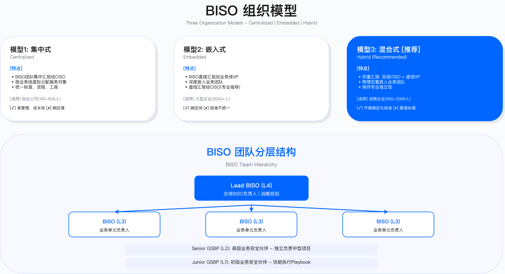
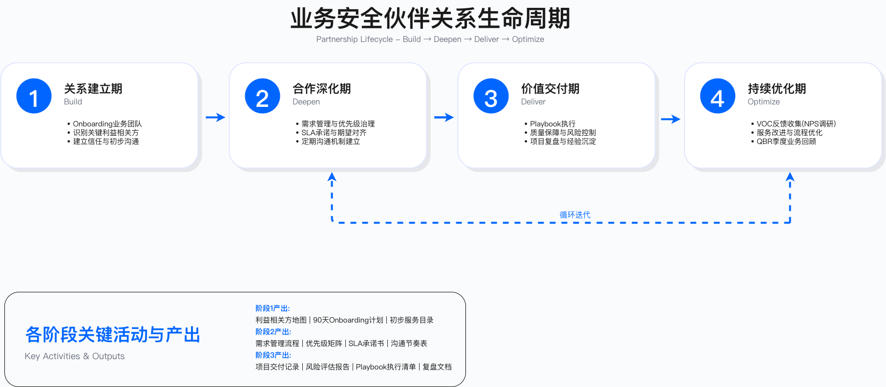

# 第3章　业务安全伙伴

BISO（Business Information Security Officer）模式代表安全职能从"技术专家"向"业务伙伴"的根本性转型。这种转型不是简单的角色更名，而是思维方式、工作方法、价值衡量的系统性重构。本章提供从战略定位到运营落地的完整框架。

---

## 章节定位

安全团队与业务部门之间的隔阂——目标冲突、节奏错配、语言不通——是企业数字化进程中普遍存在的结构性问题。BISO 模式的设计初衷，正是通过在两者之间建立专职桥梁角色，系统性地解决这一问题。

本章内容分为三个部分：战略基础（BISO 是谁、应如何定位）、业务共创（如何与业务建立有效的伙伴关系）、治理与运营（如何构建可持续运作的 BISO 体系）。

---

## 章节结构

### 模块一　战略基础

[3.0 执行摘要](3.0_执行摘要.md)：本章核心观点与关键结论概述，适合在阅读各节前建立整体认知框架。

[3.1 BISO 职责定位与使命](3.1_BISO职责定位与使命.md)：明确 GSBP 与 BISO 的职责边界，定义使命陈述与价值主张，绘制利益相关方地图，建立安全中心—BISO—业务线的三方协作机制。重点厘清"战术执行"与"战略协调"的本质分工。

[3.2 BISO 组织架构设计](3.2_BISO组织架构设计.md)：比较集中式、嵌入式、混合式三种组织模型的适用边界与权衡取舍，探讨汇报关系与双重汇报机制，设计从 Junior GSBP 到 Lead BISO 的四层角色分层，规划团队规模配比，建立全球 BISO 网络协作机制。

### 模块二　业务共创

[3.3 业务安全伙伴关系生命周期](3.3_业务安全伙伴关系生命周期.md)：基于 BRM（Business Relationship Management）方法论，覆盖洞察→定义→共创→交付→复盘五阶段模型，每阶段有明确目标、关键活动与验收标准。附关系健康度评估与修复机制。

[3.4 关键场景 Playbook](3.4_关键场景Playbook.md)：提供七个典型场景的标准化操作流程——产品上线安全评审、营销活动风险评估（含反作弊与隐私合规）、供应商接入安全评估（TPRM 全生命周期）、新兴技术安全评估（以 AI/ML 为例）、并购安全尽调、GSBP-BISO 与安全中心协作场景（事件响应、例外管理、合规审计、威胁情报）、组织 AI 资产治理（影子 AI 发现与 Agent 登记）。

### 模块三　治理与运营

[3.5 BISO 能力成长路径](3.5_BISO能力成长路径.md)：建立业务洞察、风险治理、安全技术、沟通影响四象限能力模型，设计 CL1 GSBP→CL4 Lead BISO 的技能演化路径，构建培训、认证、导师制、CoP 实践社区的赋能体系，设计平衡计分卡绩效机制。

[3.6 案例研究](3.6_案例研究.md)：四个脱敏实践案例——跨境电商 BISO 体系从零到一、金融科技全球 BISO 网络、SaaS 企业 SOC 2 快速响应、零售企业 BISO 从"合规官"向"业务伙伴"转型。每个案例提炼可复用的成功要素与失败教训。

[3.7 附录：模板与工具](3.7_附录.md)：六类实用模板（BISO 使命陈述与服务目录、利益相关方地图与沟通节奏表、需求管理与优先级矩阵、Playbook 标准模板、QBR 报告模板、BISO 能力评估矩阵），工具选型建议（需求管理、GRC 平台、知识管理、BI 报告），专业认证与学习资源。

---

## 核心术语

- GSBP（Global Security Business Partner）：嵌入业务线的安全 BP，聚焦日常运营支撑，是安全团队与业务部门之间的单一接口
- BISO（Business Information Security Officer）：面向业务单元的安全负责人，承担战略共担、治理与合规责任，采用双线汇报机制
- BRM（Business Relationship Management）：业务关系管理框架，为伙伴关系生命周期提供理论基础
- Playbook：安全场景操作手册，是标准化服务交付的核心工具
- QBR（Quarterly Business Review）：季度业务回顾，用于汇报指标与对齐战略
- VOC（Voice of Customer）：业务反馈收集机制，是 BISO 服务质量的核心衡量维度
- RACI：责任矩阵（Responsible, Accountable, Consulted, Informed），明确跨角色协作中的职责归属
- CoE（Center of Excellence）：卓越中心，混合式 BISO 模型中负责方法论、工具平台与培训体系的中央能力组

---

## 关键指标体系

BISO 服务质量的衡量需要三类指标的平衡组合，单一维度容易产生误导：

结果类指标关注安全成果：业务安全风险敞口变化率、重大安全事件数量、合规审计通过率、监管罚款情况。

过程类指标关注服务效率：需求 SLA 达成率、Playbook 执行率、风险例外关闭周期、供应链安全合规率。

体验类指标关注业务满意度：VOC 满意度评分、净推荐值（NPS）、业务团队自助率、培训覆盖率。

具体指标目标需根据组织实际情况和历史基线设定，避免采用无法验证的行业基准数据。

---

## 国际标准对齐

本章内容的设计参考以下国际标准与框架：

- ISO/IEC 27014（信息安全治理）：为治理结构设计提供指导
- NIST CSF 2.0（网络安全框架）：治理、识别、保护功能与实践内容对齐
- SABSA（业务驱动的安全架构）：支撑业务对齐策略
- BRM Institute Framework（业务关系管理）：为伙伴关系生命周期提供理论基础
- ISO 31000（风险管理原则）：指导风险评估与决策机制
- SFIA（技能框架）：为能力矩阵设计提供参考

---

## 章节关联

前导章节：
- [第1章：企业架构基础](../../第01部分_基础与战略治理/第01章_企业架构基础/)：建立企业架构三层体系，为 BISO 在业务架构中的定位提供基础
- [第2章：GRC 治理](../../第01部分_基础与战略治理/第02章_GRC治理/)：定义治理框架、风险管理、合规对齐机制，为 BISO 的治理职责提供方法论支撑

后续章节：
- [第4章：安全架构与工程](../../第02部分_技术架构与基础设施安全/第04章_安全架构与工程/)（见 4.3 威胁建模、4.4 安全架构模式）：安全架构设计原则与开发生命周期实践，为 BISO 进行架构评审提供技术基础
- [第19章：安全领导力与组织卓越](../../第07部分_安全领导力与组织建设/第19章_安全领导力/)：安全领导力与组织文化建设，为 BISO 的影响力提升与职业发展路径提供战略指导

---

## 核心转变

BISO 模式的核心价值体现在五个维度的系统性转变：

定位转变：从"安全警察"转向"业务伙伴"，从合规驱动向价值共创演进。BISO 不再是业务流程的审批者，而是业务创新的使能者——但这并不意味着放弃安全底线，而是找到更聪明的方式守护它。

架构演进：混合式 BISO 架构（嵌入业务 + 中央支持）平衡了专业性与业务对齐。纯集中式模型响应迟缓，纯嵌入式模型标准难以统一，混合式是大多数中大型组织的务实选择。

生命周期管理：遵循洞察→定义→共创→交付→复盘的五阶段迭代模型，每个阶段有明确目标与输出物，避免跳层推进导致的信任断裂。

服务标准化：Playbook 覆盖高频场景，实现服务交付的一致性与可复制性。标准化是为创新释放时间，而非束缚专业判断。

价值证明：用业务语言（上线速度、合规认证、客户赢单）而非技术术语证明安全贡献，建立数据驱动的价值叙事。

---

## 常见问题

GSBP 和 BISO 的核心区别是什么？

最关键的差异在于决策权限与治理层级。GSBP 是战术执行者，实线向 BISO 或安全中心 GSBP 团队负责人汇报，决策权限停留在日常风险评估和标准场景审批层面。BISO 是业务单元的安全负责人，作为战略协调者采用双重汇报机制（专业线向 CISO、业务线向业务 VP），拥有业务安全决策参与权——包括重大风险例外审批、安全投资建议、参与董事会汇报。详细分析见 [3.1](3.1_BISO职责定位与使命.md)。

如何确定 BISO 团队的规模？

本章提供两种互补的计算方法：基于业务规模的配置公式（自上而下）和基于服务负载的配置模型（自下而上）。建议同时使用，取交叉验证的结果。团队规模受业务规模、复杂度、服务模式等多因素影响，具体规划方法见 [3.2](3.2_BISO组织架构设计.md)。

BISO 应该向谁汇报？

混合式模型推荐双线汇报：专业线实线向 CISO（确保安全底线与方法论一致性），业务线虚线向业务 VP（确保优先级与资源对齐）。绩效权重通常以安全线为主，避免 BISO 被业务压力"捕获"。详细治理机制见 [3.2](3.2_BISO组织架构设计.md)。

如何快速建立与业务团队的信任？

信任不是宣布的，是赚取的。建议路径：利益相关方深度访谈（听业务讲，不是讲安全）→ 识别业务痛点中可快速解决的场景 → 24-48 小时内提供方案（不只是指出问题）→ 用成功案例改变刻板印象。详细实践方法见 [3.3](3.3_业务安全伙伴关系生命周期.md)。

---

## 贡献与反馈

本章内容基于主编的《安全 BP（GSBP）与 BISO 团队建设实践指南》企业实践总结。

---

## 导航

[← 上一章：第2章](../../第01部分_基础与战略治理/第02章_GRC治理/) | [返回 Part 目录](../) | [下一章：第4章 →](../../第02部分_技术架构与基础设施安全/第04章_安全架构与工程/)

---

© 2025-2026 AISecOps Project. Licensed under CC BY-NC-SA 4.0
