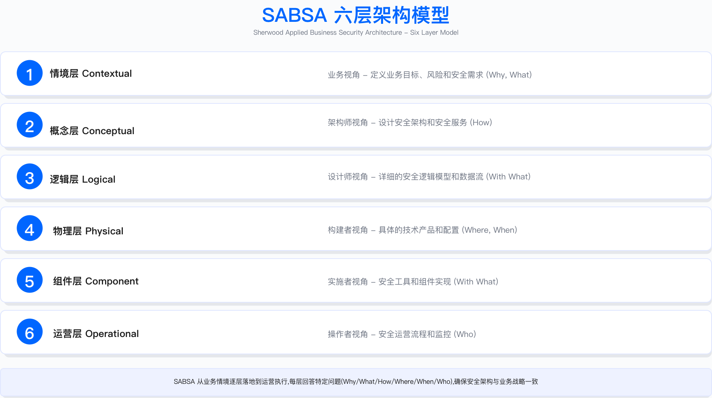
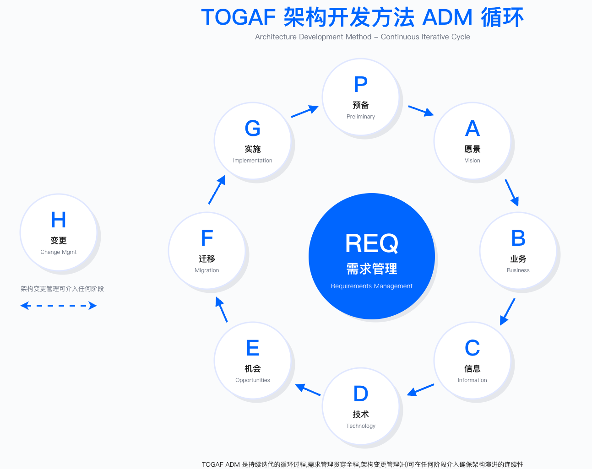
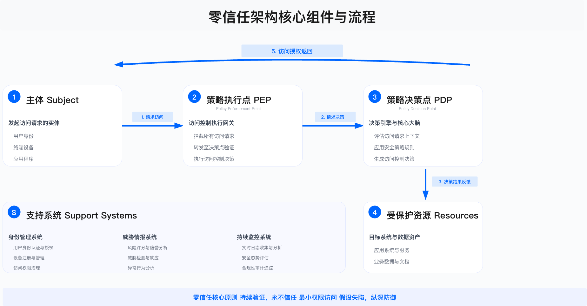
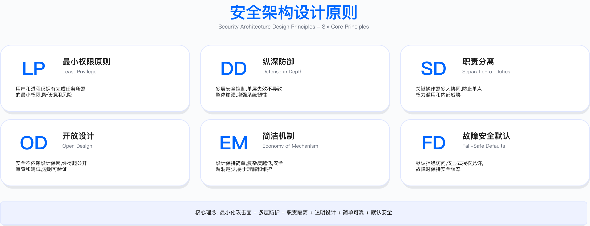

# 4.0　执行摘要

> 本节定位：建立从战略到技术实现的 security architecture engineering 体系，掌握主流架构框架（SABSA、TOGAF、zero trust）、威胁建模方法（STRIDE、PASTA）、安全架构模式与参考架构，为企业级安全架构设计、评审与演进提供系统化方法论。

---

## 安全架构工程的战略定位

安全架构从"技术文档"演变为"战略资产"，这一转变在云原生与零信任架构普及的过程中持续加速。企业面临的核心问题不再是"是否需要安全架构"，而是"如何通过架构设计实现安全左移、风险前置、成本可控"。

### 安全架构成为必需能力的驱动因素

三个关键变化使安全架构从可选能力升级为必需能力：

技术架构复杂度显著增加。 云原生架构（Kubernetes、Serverless、微服务）使系统组件数量从数十个增至数百甚至上千个。多云与混合云环境下，每个云平台有独立的安全模型（AWS IAM、Azure AD、GCP IAM），统一治理难度加大。API 经济使系统边界模糊化，企业通常需要管理数百个 API 端点。供应链依赖深度加剧，现代应用中开源组件占比普遍较高。

攻击面持续扩大。 传统网络边界防御模型效力下降，zero trust 成为架构转型的核心方向。容器逃逸、Kubernetes RBAC 配置错误、云存储桶公开暴露等新型攻击向量不断涌现。供应链攻击（如 SolarWinds、Log4Shell 事件）表明架构层面的缺陷可能影响大量下游企业。内部威胁风险上升，特权账户滥用与数据泄露成为高频安全事件类型。

架构缺陷的业务影响放大。 架构级漏洞的修复成本远高于设计阶段发现并解决的成本。云配置错误已成为数据泄露的主要原因之一。缺乏标准化架构评审流程的企业，安全评审周期往往较长，可能阻碍业务上线速度。

### 安全架构的演变方向

架构模式演变： 从"边界防御"向"永不信任、持续验证"的 zero trust 模式转变；architecture-as-code 通过代码管理架构（如 Terraform + OPA），实现架构合规自动化检查；软件物料清单（SBOM）在监管推动下逐步成为强制要求，架构需支持组件透明化。

业务价值体现： 通过架构模式标准化，安全评审周期可从数周缩短至数天；通过架构优化（如微隔离替代传统防火墙方案），可降低云安全相关成本；架构级控制映射（如对 ISO 27001、SOC 2 的控制要求）可加速合规认证进程；架构评审可识别技术债务，避免未来高昂的重构成本。

常见实施挑战： 架构文档与实际实施脱节，文档仅用于交差而非指导决策；采购多个架构相关工具（CSPM、CWPP、CNAPP）但缺乏集成，数据不互通；具备架构框架认证与实战经验的安全架构师供给不足；架构决策难以翻译为业务价值语言，导致投资优先级偏低。

---

## 章节核心目标

本章提供端到端的安全架构工程体系，帮助读者从战略规划到技术实现建立完整的架构能力。

战略清晰度（4.1）：理解 SABSA、TOGAF、Zachman、zero trust 等主流架构框架的适用场景与选择逻辑。掌握安全架构在企业架构中的定位，建立从业务战略到技术实现的递进关系。将架构投资与业务成果对齐，用业务语言（上线速度、合规准入、风险降低）阐述架构价值。

方法论深度（4.2、4.3）：掌握 STRIDE、PASTA、Attack Trees 等威胁建模方法，实现风险前置到设计阶段。应用最小权限、纵深防御、职责分离、安全默认等设计原则指导架构决策。建立架构评审流程（Security Design Review），实现质量门禁与决策记录（Architecture Decision Record）。

技术实践（4.4、4.7）：设计 zero trust 架构（身份、设备、网络、应用、数据五层）并制定实施路线图。构建多层防御架构（边界、网络、主机、应用、数据），实现纵深防护。实施微隔离（microsegmentation）与 SSE/SASE 架构，支持云优先战略。建立网络、云、应用、数据等领域的安全参考架构。

运营卓越（4.5、4.6、4.8）：建立架构评审委员会（architecture review board），制定评审流程与决策机制。实施技术选型框架（自建与购买决策、开源与商业选择），进行总拥有成本与投资回报量化分析。识别并量化技术债务，制定架构重构与现代化路线图。应用 policy-as-code（OPA、Kyverno）实现架构合规自动化检查。

---

## 核心概念与框架

### 1. 安全架构框架（4.1）

SABSA 框架：业务驱动的六层模型

SABSA (Sherwood Applied Business Security Architecture) 由 John Sherwood、Andrew Clark、David Lynas 提出，提供从业务到技术的完整映射[1]。该框架的核心价值在于将安全需求与业务目标直接关联，避免安全架构成为孤立的技术决策。

| 层级 | 核心问题 | 关键产出 | 安全架构师角色 |
|-----|---------|---------|--------------|
| 情境层 (Contextual) | 为什么需要安全？ | 业务风险评估、安全战略 | 理解业务目标与风险偏好 |
| 概念层 (Conceptual) | 需要什么安全能力？ | 安全服务目录、控制目标 | 定义安全服务与控制框架 |
| 逻辑层 (Logical) | 如何实现安全？ | 安全架构蓝图、逻辑设计 | 设计 zero trust、多层防御架构 |
| 物理层 (Physical) | 用什么技术实现？ | 技术选型、产品配置 | 选择 CSPM、CWPP、SIEM 等工具 |
| 组件层 (Component) | 具体产品如何配置？ | 配置标准、集成规范 | 定义配置基线与部署脚本 |
| 运营层 (Operational) | 运营得如何？ | 监控流程、度量指标 | 建立运营流程与持续改进机制 |

SABSA 适合需要将安全投资与业务成果直接关联的场景，尤其适合金融、医疗等强监管行业。对于技术驱动型初创企业或架构简单的小型组织，该框架可能过于重量级。完整实施 SABSA 需要组织具备业务架构团队与安全架构团队的协作能力；落地周期通常按季度计，需要持续的高管赞助。

常见误区：将 SABSA 仅作为文档框架而非决策框架使用；在缺乏业务层输入的情况下直接从技术层开始设计，导致安全架构与业务脱节。

TOGAF 安全架构：ADM 集成

TOGAF (The Open Group Architecture Framework) 通过架构开发方法 (ADM) 将安全集成到企业架构的各个阶段；当期版本为 2022 年 4 月发布的第 10 版[2]。TOGAF 与 SABSA 的分工很清晰：TOGAF 负责整体企业架构方法，SABSA 在安全域内提供业务可追溯性——两者组合比单独使用任何一个都更有实效。

阶段 A（架构愿景）：定义安全战略与利益相关方；阶段 B-D（BDAT 架构）：业务、数据、应用、技术四层架构的安全集成；阶段 E（机会与解决方案）：架构实施路线图与快速赢得项目；阶段 F-H（实施与治理）：架构实施、变更管理、架构合规。

零信任架构框架 (NIST SP 800-207)

zero trust 从"网络边界"转向"身份中心"。需先厘清出处：NIST SP 800-207（2020 年 8 月发布）官方定义的是七条 tenets（4.1.5 完整列出）[3]，"三原则"出自微软框架、"五原则"为业界通俗归纳。本书为便于实施，将其归纳为下述五条实施要点（属本书教学归纳，非 NIST 逐字定义）：永不信任持续验证（每次访问都需要身份验证与授权）；最小权限（默认拒绝，按需授权，及时回收）；假定攻陷（设计时假设攻击者已在内网，实施微隔离）；动态策略（基于上下文——身份、设备、位置、行为——动态决策）；全面监控（所有访问日志化、可审计、支持异常检测）。

零信任五层架构（层级划分与 CISA《Zero Trust Maturity Model》v2.0 的五大支柱——身份、设备、网络、应用与工作负载、数据——一致）[4]：

| 层级 | 控制目标 | 关键技术 | 验证方法 |
|-----|---------|---------|----------|
| 身份层 | 强认证、MFA、JIT 访问 | IAM、SSO、PAM | 审计 MFA 覆盖率、特权访问日志 |
| 设备层 | 设备可信、合规检查 | MDM、EDR、设备证书 | 检查托管设备比例、合规状态 |
| 网络层 | 微隔离、加密传输 | SDP、mTLS、ZTNA | 测试东西向流量加密比例 |
| 应用层 | API 安全、最小权限 | API Gateway、RBAC | 验证 API 认证覆盖、权限粒度 |
| 数据层 | 加密、DLP、标签化 | KMS、CASB、DLP | 检查敏感数据加密状态 |

框架选择决策逻辑（4.1.6 有详细对比矩阵）：业务驱动、需要战略对齐 → 选择 SABSA；已有企业架构团队、需要集成 → 选择 TOGAF；云优先、远程办公、SaaS 化转型 → 选择 zero trust；需要快速启动、控制清单驱动 → 选择 CSA CCM 或 NIST CSF。

### 2. 架构设计原则（4.2）

六大核心原则是所有架构决策的基础——不是检查清单，而是判断依据。

| 原则 | 定义 | 架构决策示例 | 常见违反场景 |
|-----|------|------------|------------|
| 最小权限 | 默认拒绝，按需授权，及时回收 | IAM 策略最小化、临时凭证、JIT 访问 | 使用通配符权限（`*:*`）、永久密钥 |
| 纵深防御 | 多层防护，单点失败不导致全局攻陷 | WAF + RASP + 代码审查 + 运行时监控 | 仅依赖边界防火墙 |
| 职责分离 | 关键操作需多人协作，避免单点权力 | 生产变更需双人审批、Root 账户分离 | 开发人员拥有生产环境 Root 权限 |
| 公开设计 | 安全不依赖算法保密，而是密钥管理 | 使用 AES-256 而非自研加密算法 | 通过混淆实现"安全" |
| 经济机制 | 设计简洁，复杂度是安全的敌人 | 使用托管服务而非自建复杂系统 | 过度设计导致无法维护 |
| 安全默认 | 默认配置是安全的，失败时安全关闭 | S3 桶默认私有、Fail-Close 策略 | 默认开放、需手动加固 |

验证方法：通过 IAM 策略审计工具检查权限范围；通过渗透测试验证纵深防御有效性；通过审计日志验证职责分离执行情况；通过配置基线扫描验证安全默认落地。

运行指标：IAM 策略中通配符使用数量（应趋近于零）；单点权限用户数量（应持续下降）；安全配置偏离基线的资源数量。

纵深防御 Web 应用七层防护示例：
1. 边界层：CDN + DDoS 防护
2. 网络层：VPC 隔离 + Security Groups + Network ACL
3. 负载均衡层：ALB + SSL/TLS 终结 + WAF 规则
4. 应用层：代码审查 (SAST) + 安全测试 (DAST) + RASP
5. 数据层：数据库加密 (TDE) + 字段级加密 + 备份加密
6. 身份层：MFA + SSO + 会话管理 + RBAC
7. 监控层：日志审计 + 异常检测 + SIEM

### 3. 威胁建模（4.3）

STRIDE 方法：六类威胁分析

STRIDE 由微软的 Loren Kohnfelder 与 Praerit Garg 于 1999 年在内部文档《The Threats To Our Products》中提出[5]，系统化识别六类威胁：

| 威胁类别 | 定义 | 示例攻击 | 缓解措施 |
|---------|------|---------|---------|
| Spoofing (欺骗) | 伪装身份 | 钓鱼邮件、会话劫持 | MFA、数字签名、证书验证 |
| Tampering (篡改) | 修改数据或代码 | SQL 注入、中间人攻击 | 输入验证、加密传输、完整性校验 |
| Repudiation (否认) | 否认操作 | 删除日志、无审计跟踪 | 审计日志、数字签名、不可否认性 |
| Information Disclosure (信息泄露) | 未授权访问数据 | 数据泄露、配置错误 | 加密、访问控制、最小权限 |
| Denial of Service (拒绝服务) | 系统不可用 | DDoS、资源耗尽 | 限流、弹性扩展、冗余设计 |
| Elevation of Privilege (特权提升) | 获取高权限 | 漏洞利用、配置错误 | 最小权限、输入验证、沙箱隔离 |

STRIDE 四步实施流程：绘制数据流图 (DFD) → 识别威胁（对每个数据流、存储、处理应用 STRIDE 检查表）→ 风险评级（使用 DREAD 或其他风险评估方法）→ 缓解方案（优先修复高风险威胁，对低风险威胁接受/转移/降低）。

适用边界：STRIDE 适用于中等复杂度的系统设计阶段威胁分析，对于高度复杂的分布式系统，可结合 PASTA 方法进行更深入的攻击模拟（见 4.3.2）。

常见误区：仅在项目初期进行一次威胁建模而不持续更新；威胁建模停留在文档层面，识别的威胁未纳入缺陷跟踪系统。

验证方法：通过红队测试验证威胁缓解措施有效性；检查识别的威胁是否有对应的控制措施；定期复审威胁模型与实际架构的一致性。

### 4. 安全架构模式（4.4）

零信任架构：端到端设计

传统边界防御与 zero trust 架构的核心差异（详见 4.4.1）：

| 维度 | 传统边界防御 | 零信任架构 |
|-----|------------|-----------|
| 信任模型 | 内网可信，外网不可信 | 永不信任，持续验证 |
| 访问控制 | 基于网络位置（IP/VLAN） | 基于身份 + 上下文（设备、位置、行为） |
| 网络架构 | 城堡 + 护城河（DMZ） | 微隔离 + 加密通信 |
| 横向移动 | 内网自由访问 | 最小权限 + 工作负载隔离 |
| 远程访问 | VPN（网络级访问） | ZTNA（应用级访问） |
| 监控 | 边界流量监控 | 全流量监控 + 行为分析 |

零信任实施路线图（按依赖关系排序，不给月份承诺——各阶段的实际时长取决于身份基础成熟度、装不了代理的资产比例与跨团队协调能力，网络与终端侧带排序判据的三年路线图见 15.12）：
- 阶段 1：身份基础——部署 SSO，MFA 全面覆盖；建立 PAM 系统管理特权账户；实施 JIT 访问，临时授权替代永久权限
- 阶段 2：接入面改造（人到应用）——用 ZTNA/SDP 替代网络级 VPN 接入，按应用授权而非按网段授权；这一层解决的是"用户能进哪个应用"，与阶段 3 的工作负载间隔离是两件事，不要合并排期
- 阶段 3：工作负载间隔离（东西向）——先做跨信任域的分段，再做工作负载级微隔离；部署东西向流量加密 (mTLS、Service Mesh)；云上以 Security Group 与 Kubernetes NetworkPolicy 落地
- 阶段 4：应用与数据——部署 API Gateway，统一认证授权；实施数据分类分级，敏感数据加密；部署 CASB/DLP，监控 SaaS 应用与数据流
- 阶段 5：持续验证——部署用户行为分析，实现异常检测；实施动态策略引擎，基于风险评分调整权限；建立持续合规监控，自动化架构验证

关键约束：zero trust 转型需要身份基础设施成熟度达到一定水平（至少完成统一身份平台建设）；组织文化需要接受"持续验证"理念，可能面临用户体验与安全性的权衡。

SSE/SASE 架构（4.4.4）：SASE 一词由 Gartner 在 2019 年 8 月的报告《The Future of Network Security Is in the Cloud》中提出，指把网络能力与网络安全能力融合为一项云交付服务[6]；SSE 为 Gartner 在 2021 年拆出的子集，即 SASE 中的安全侧。工程上常用的记法是 SASE = SSE + SD-WAN。SSE 四大组件：CASB（监控与控制 SaaS 应用访问）、SWG（URL 过滤、恶意软件防护、数据防泄露）、ZTNA（应用级访问替代 VPN）、FWaaS（云原生防火墙）。

### 5. 架构评审与验证（4.5）

架构评审委员会 (ARB) 运作机制

ARB 常设成员：CISO、首席架构师、安全架构负责人、技术 VP；按需成员：业务架构师、应用架构师、云架构师、GRC 负责人。建议每周例会，支持按需紧急评审。

五步评审流程：

| 阶段 | 时间 | 活动 | 产出物 |
|-----|------|------|--------|
| 1. 申请 | Day 1-2 | 提交架构文档、DFD、风险评估 | 评审申请单 |
| 2. 初审 | Day 3-4 | 安全架构师预审，识别高风险点 | 初审意见 |
| 3. 正式评审 | Day 5-7 | ARB 会议，威胁建模，决策 | 评审报告、ADR |
| 4. 跟踪 | Day 8-30 | 跟踪缓解措施实施进度 | 状态更新 |
| 5. 关闭 | Day 30+ | 验证缓解措施，关闭评审 | 关闭报告 |

架构决策记录（ADR）是架构治理的关键工件，它回答"为什么这样设计"，而不只是记录"设计了什么"。ADR 的价值在日后架构审计和变更决策时才真正体现。ADR 模板与示例见 4.5.3。

架构合规自动化：policy-as-code 通过 OPA Rego 策略实现架构验证的可编程化，从"人工审查"转向"代码验证"，极大地降低了人工审查的遗漏风险，也使合规状态可持续可观测。代码示例见 4.4.1。

架构度量指标：覆盖率（关键系统有架构文档的比例）；评审率（重大项目经过 ARB 评审的比例）；偏离率（实际实施与架构蓝图的一致性）；修复率（架构评审发现的高危风险修复率）。

### 6. 技术选型与决策（4.6）

选型评估四个核心维度：

| 维度 | 评估标准 | 评分方法 |
|-----|---------|---------|
| 安全性 | 安全能力、合规认证、漏洞响应 | SOC 2/ISO 27001 认证、CVE 响应速度 |
| 架构兼容性 | 技术栈兼容、扩展性、集成能力 | API 丰富度、云原生支持 |
| 成本 | TCO、ROI、许可模式 | 多年总成本、价值量化 |
| 易用性 | 易用性、文档、社区支持 | POC 验证、行业评价 |

自建与购买决策矩阵：

| 因素 | 倾向自建 | 倾向购买 |
|-----|---------|---------|
| 核心竞争力 | 是（如定制化风控引擎） | 否（如通用 SIEM） |
| 差异化需求 | 高（独特需求） | 低（通用功能） |
| 上线速度 | 可接受较长周期 | 需要快速上线 |
| 技术能力 | 团队充足 | 团队不足 |
| 供应商依赖 | 需要避免 | 可接受 |

### 7. 安全参考架构（4.7）

4.7 提供网络、云、应用、数据等领域的安全参考架构。参考架构给的是"经过验证的起点"，不是"规定答案"——直接从成熟参考架构开始，比从空白画布设计要节省大量时间，同时规避常见陷阱。

### 8. 架构演进与债务管理（4.8）

技术债务分类：

| 类型 | 定义 | 示例 |
|-----|------|------|
| 架构债务 | 架构设计缺陷 | 单体应用、紧耦合 |
| 安全债务 | 已知漏洞未修复 | Log4Shell、SQL 注入 |
| 合规债务 | 不满足法规要求 | GDPR、SOC 2 缺口 |
| 运营债务 | 手工流程、缺乏监控 | 无自动化、无告警 |

架构重构策略（详见 4.8.2）：绞杀者模式（Strangler Fig）适用于单体应用微服务化，逐步将功能迁移至新系统，风险可控、可回滚；渐进式重构适用于代码质量改进、技术栈升级，每次迭代重构一小部分；大爆炸重构适用于遗留系统完全废弃、平台迁移，风险较高，需充分测试。

---

## 关键成功要素

### 高管赞助与架构治理

成立架构评审委员会 (ARB)，由 CISO 或 CTO 担任主席。重大项目必须通过 ARB 评审。安全架构投入应在 IT 预算中有明确占比。

### 架构师能力建设

投资 SABSA、TOGAF、CISSP-ISSAP 等认证培训。保持持续学习，定期参加架构领域会议与交流。通过实战项目积累经验，每年主导多个架构设计项目。

### 工具与自动化

架构建模工具：ArchiMate、Draw.io、Lucidchart。policy-as-code：OPA、Kyverno 实现架构合规自动化。CSPM/CWPP：持续监控云架构合规性。威胁建模工具：Microsoft Threat Modeling Tool、IriusRisk。

### 持续演进与文档化

季度更新架构蓝图，保持与实际一致。所有重大架构决策记录在案 (ADR)，可追溯。建立架构模式库与参考架构知识库。年度架构健康检查，识别漂移与债务。

---

## 常见陷阱

| 陷阱 | 描述 | 避免方法 |
|-----|------|---------|
| 过度设计 | 追求理论完美，导致无法落地 | MVP 架构，渐进式优化 |
| 架构漂移 | 实际实施偏离架构蓝图 | 自动化合规检查（policy-as-code） |
| 文档过时 | 架构文档与实际不符 | architecture-as-code，自动生成 |
| 孤岛决策 | 安全架构与业务 / IT 架构脱节 | 嵌入企业架构治理流程 |
| 工具堆砌 | 采购多个工具但不集成 | 制定工具集成策略，统一平台 |
| 忽视遗留系统 | 仅关注新系统，忽视遗留风险 | 建立遗留系统风险清单，补偿控制 |

---

## 衡量成功

### 架构成熟度指标

- 架构覆盖率：关键系统有完整架构文档的比例
- 评审通过率：首次架构评审通过的比例
- 架构偏离率：实际实施与架构蓝图的一致性
- ADR 完整性：重大架构决策有 ADR 记录的比例

### 业务成果指标

- 上线速度：安全架构评审周期
- 安全事件：架构缺陷导致的高优先级事件数量
- 合规认证：架构支持的认证数量（SOC 2、ISO 27001、PCI DSS）
- 成本优化：通过架构优化节省的云成本

### 技术债务指标

- 债务总量：已识别但未修复的架构级缺陷
- 债务修复率：计划债务按时修复的比例
- 债务成本：技术债务的量化成本

---

## 实施路径建议

安全架构是持续演进的能力体系，而非一次性项目。

建立基线（0-3 个月）：绘制当前架构现状（as-is architecture）；识别架构债务与风险热点；建立架构评审委员会与评审流程；培训首批架构师。

定义目标（3-6 个月）：设计目标架构蓝图（to-be architecture）；选择架构框架（SABSA、TOGAF 或 zero trust）；制定架构演进路线图；建立架构原则库与安全模式库。

迭代实施（6-18 个月）：按优先级推进架构改进项目（zero trust、微隔离、云安全）；实施威胁建模，覆盖关键业务；部署 policy-as-code，自动化架构合规检查；建立参考架构（网络、云、应用、数据）。这里的月份是架构职能自身的建设节奏，不含被推进项目各自的实施周期——微隔离带进入与退出条件的五阶段路径见 [15.2.4](../../第05部分_身份网络与业务连续性/第15章_网络基础设施与终端安全/15.2_网络分段与微隔离工程.md)，把网络与终端侧全部工作合并排序的三年路线图见 15.12。

持续优化（18 个月以后）：架构成熟度定期评估（年度）；新技术架构集成（AI 安全、zero trust 深化）；架构最佳实践提炼与分享；建立架构师协作网络。

---

## 本节小结

本章围绕安全架构工程体系展开：

- 架构框架（4.1）：SABSA（业务驱动）、TOGAF（企业架构集成）、zero trust（现代化）三大框架，根据组织成熟度与业务场景选择。
- 设计原则（4.2）：最小权限、纵深防御、职责分离、安全默认等六大原则指导所有架构决策。
- 威胁建模（4.3）：STRIDE、PASTA 方法实现风险前置，设计阶段修复成本远低于生产阶段。
- 架构模式（4.4）：zero trust、微隔离、SSE/SASE 是云原生时代的核心架构模式。
- 评审治理（4.5）：ARB 架构评审委员会 + ADR 决策记录 + policy-as-code 自动化验证。
- 持续演进（4.8）：技术债务量化管理，架构重构策略（绞杀者、渐进式、大爆炸）。

安全架构的本质不是"堆砌安全产品"，而是"用精简的架构实现业务风险的有效控制，同时支持业务创新与快速迭代"。

---

## 参考文献

| # | 来源 | 标题 | 日期 | 链接 |
| --- | --- | --- | --- | --- |
| [1] | John Sherwood, Andrew Clark, David Lynas | Enterprise Security Architecture: A Business-Driven Approach（SABSA 六层模型原始专著）；框架维护方 The SABSA Institute | 2005（CMP Books / Routledge；ISBN 978-1578203185。**该书无官方在线全文，此处链接为框架维护方站点，不是原著本身**） | <https://sabsa.org/sabsa-executive-summary/> |
| [2] | The Open Group | The TOGAF® Standard, 10th Edition | 2022-04-25 发布 | <https://www.opengroup.org/open-group-announces-launch-togaf-standard-10th-edition> |
| [3] | NIST | SP 800-207《Zero Trust Architecture》：七条 tenets | 2020-08 | <https://csrc.nist.gov/pubs/sp/800/207/final> |
| [4] | CISA | Zero Trust Maturity Model, Version 2.0：身份、设备、网络、应用与工作负载、数据五大支柱 | 2023-04 | <https://www.cisa.gov/sites/default/files/2023-04/CISA_Zero_Trust_Maturity_Model_Version_2_508c.pdf> |
| [5] | Loren Kohnfelder, Praerit Garg（Microsoft） | The Threats To Our Products：STRIDE 原始文档（微软官网已下线，由 Adam Shostack 存档） | 1999-04 | <https://shostack.org/resources/early-threat-modeling> |
| [6] | Gartner（L. Orans, J. Skorupa, N. MacDonald） | The Future of Network Security Is in the Cloud：首次提出 secure access service edge (SASE) | 2019-08-30 | <https://www.gartner.com/en/documents/3956841> |

---

## 导航

[返回章节目录](./README.md) | [下一节：4.1 安全架构框架 →](./4.1_安全架构框架.md)

---

© 2025-2026 AISecOps Project. Licensed under CC BY-NC-SA 4.0
