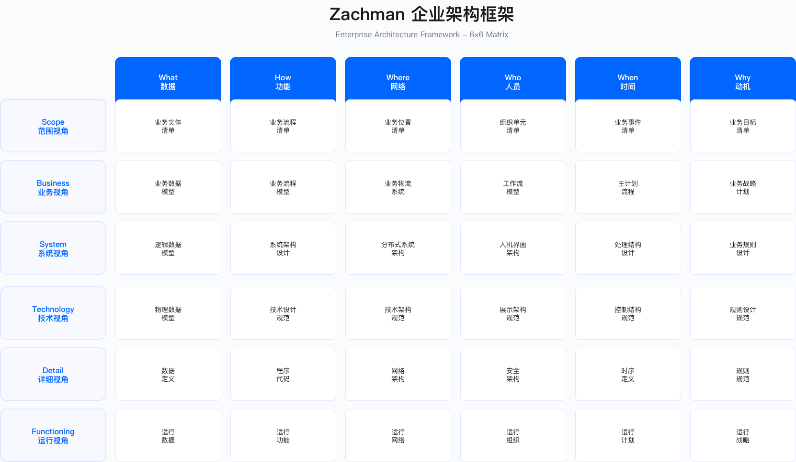

# 4.1　安全架构框架

> 本节目标：理解主流安全架构框架（SABSA、TOGAF、Zachman、ESA、零信任）的核心理念、适用边界与选择标准，为企业安全架构建设提供方法论基础。

---

## 4.1.1 SABSA 框架

### 框架定位与核心理念

SABSA（Sherwood Applied Business Security Architecture）是一个业务驱动的安全架构框架，核心主张是"安全架构必须从业务需求出发，而非从技术出发"。它通过多层视图模型建立从业务目标到技术控制的可追溯链路，使安全投资决策能够与业务成果直接关联。

三个核心维度构成 SABSA 的基础：安全架构设计必须基于对业务驱动因素的理解；分层模型确保战略意图到实施细节的一致性；所有架构决策都基于风险评估结果，而非主观判断。第三点常被忽视——许多团队在概念层就开始选产品，跳过了风险量化这一步，导致控制与威胁错位。

### SABSA 六层模型

> 层数说明：SABSA 官方模型为六层，本节按官方形态介绍[1]。1.4.6 出于组织本书章节的需要，把六层裁剪合并为四层（业务/架构/工程/运营），第6、8、10 章的"SABSA 四层架构映射"均指该裁剪版，**不是 SABSA 官方形态**。两处不矛盾，粒度不同。
>
> 命名说明：第六层在官方文献中的正式名称是「安全服务管理架构」（Security Service Management Architecture，对应 Service Manager's View），业内与百科条目常简称为 Operational 层。它在官方图示中通常以**纵向跨越前五层**的方式绘制——因为服务管理是贯穿全部层级的活动，而非叠在最底下的第六层。本节沿用通行简称，读者在对照官方教材时需注意这一差异。

SABSA 采用六层架构视图，每一层回答不同的架构问题：

*以下 SABSA、TOGAF、Zachman 三张图均为依据各框架公开资料重新绘制的示意图，非原图复制；SABSA® 为 SABSA Institute 注册商标，TOGAF® 与 ArchiMate® 为 The Open Group 注册商标，Zachman Framework 为 Zachman International 商标。*

情境层（Contextual Layer）回答"为什么需要安全"。这一层的输入是业务战略、风险偏好、监管要求，输出是业务安全需求文档与安全目标定义。情境层工作通常需要与业务高管、法务、审计等利益相关方深度协作——这也是 SABSA 项目中对组织能力要求最高的环节，往往需要数轮工作坊才能形成共识。

概念层（Conceptual Layer）回答"需要保护什么"。基于情境层识别的业务需求，概念层定义信息资产清单、安全服务目录、安全策略框架。关键产出是将抽象的业务需求转化为可操作的安全服务定义——"保护客户支付数据"转化为"PCI DSS 覆盖范围内的加密与访问控制服务"。

逻辑层（Logical Layer）回答"如何实现安全"。逻辑层设计安全控制框架、安全机制、逻辑架构。控制框架通常映射到 NIST CSF、ISO 27002 等成熟标准，避免从头设计。

物理层（Physical Layer）回答"谁在哪里何时实施"。物理层选择具体的安全产品、技术栈、网络拓扑、部署方案，需要平衡技术理想与现实约束（预算、时间、人员能力）。

组件层（Component Layer）回答"用什么工具"。组件层定义具体产品的配置标准、集成规范、部署脚本。

运营层（Operational Layer）回答"运营得如何"。运营层建立监控流程、度量指标体系、持续改进机制。

### SABSA 矩阵视图

SABSA 使用 6×6 矩阵（六层 × 六个维度）进行架构设计，六个维度分别是：Assets（资产，What）、Motivation（动机，Why）、Process（流程，How）、People（人员，Who）、Location（位置，Where）、Time（时间，When）[1]。这六个维度直接借自 Zachman 的六个疑问词（见 4.1.3），这也是 SABSA 与 Zachman 常被拿来对照的原因。

| 层级 | 资产 | 动机 | 流程 | 人员 | 位置 | 时间 |
|------|------|------|------|------|------|------|
| 情境层 | 业务资产 | 业务目标与风险 | 业务流程 | 组织结构 | 业务地点 | 业务时间线 |
| 概念层 | 信息资产 | 安全目标 | 安全服务 | 安全角色 | 信任域 | 安全生命周期 |
| 逻辑层 | 数据实体 | 安全原则 | 安全流程 | 用户与角色 | 逻辑边界 | 状态转换 |
| 物理层 | 应用与数据库 | 控制目标 | 技术架构 | 身份管理 | 网络拓扑 | 事件序列 |
| 组件层 | 产品与工具 | 标准与规范 | 配置与脚本 | 账户与权限 | 地址与协议 | 计划任务 |
| 运营层 | 监控对象 | SLA/OLA | 运营流程 | 运营团队 | 运营站点 | 运营窗口 |

矩阵视图的价值在于确保每一层的设计都覆盖了所有必要维度。实际应用中并非所有 36 个单元格都需要同等深度的设计——根据组织成熟度和项目范围裁剪是明智的，但裁剪决策本身需要显式记录，不能因为难以填写就悄悄跳过。

### SABSA 适用边界与关键约束

适用场景：金融机构的全面安全架构重构；跨国企业协调多国合规要求与全球统一标准；强监管行业需要向监管机构证明安全架构的可追溯性；大规模云迁移项目需要重新设计安全架构。

不适用场景：中小型企业或安全团队资源有限的组织；需要快速见效的项目；组织架构成熟度较低、高管参与度不足的企业——后两种情况强推 SABSA 会导致流程空转。

关键约束：

- 组织能力约束：SABSA 要求架构师具备跨业务与技术的复合能力，既能与高管对话业务目标，又精通技术细节。这类人才稀缺，培养周期长。
- 时间成本约束：完整的 SABSA 架构设计周期通常以月计，中型企业需要预留充足时间。项目初期产出缓慢，需要管理层耐心。
- 高管参与约束：情境层和概念层的设计需要业务高管深度参与。若高管仅将安全视为成本中心，SABSA 落地将面临持续阻力。

### 常见误区

误区一：将 SABSA 简化为"写安全策略文档"。SABSA 的核心价值在于业务对齐与可追溯性，而非文档本身。若仅产出一份策略文档而无法回答"这个控制为什么存在、它保护什么业务目标"，则失去了框架的核心价值。

误区二：期望 SABSA 提供现成的技术方案。SABSA 是方法论框架，不是技术参考架构——它告诉你"如何思考安全架构设计"，不提供"用什么产品、如何配置"的答案。技术选型仍需结合 4.6 的决策框架。

误区三：在组织准备度不足时强推 SABSA。若业务部门不理解安全的业务价值、高管不愿参与架构讨论，强行推行 SABSA 会导致大量无人阅读的文档，却未能改变安全决策方式。

### 验证方法

- 可追溯性测试：随机选取一个技术控制（如"生产数据库必须加密"），向上追溯能否找到对应的逻辑层安全机制、概念层安全服务、情境层业务需求。若链路断裂，说明设计不完整。
- 业务对齐测试：向业务负责人展示安全架构文档，询问"这份架构如何支持你的业务目标"。若业务负责人无法理解，说明情境层工作不到位。
- 变更影响测试：当业务需求变更时（如进入新市场），评估安全架构是否能快速识别受影响的层级并调整。

### 运行指标

- 架构覆盖率：已完成 SABSA 设计的项目/系统占比（按业务关键性加权）
- 可追溯性完整度：能够完整追溯至情境层的控制占总控制数的比例
- 业务对齐评分：业务利益相关方对安全架构支持业务目标程度的评分（定期调研）
- 架构偏离数量：实际实施与架构设计存在偏差的项目数量及严重程度

---

## 4.1.2 TOGAF 安全架构

### 框架定位

TOGAF（The Open Group Architecture Framework）是全球应用最广泛的企业架构框架。TOGAF 本身不是安全专用框架，而是通过架构开发方法（ADM）提供将安全集成到企业架构的标准化流程。

### TOGAF ADM 中的安全集成点

TOGAF ADM 是一个迭代循环，在预备阶段（Preliminary Phase）之后包含八个正式阶段（A-H），加上位于循环中心、贯穿始终的需求管理[2]。当期版本为 2022 年 4 月发布的《TOGAF® Standard, 10th Edition》，引用时应注明版次。安全架构的集成点如下：

阶段 A（架构愿景）：识别安全相关的业务驱动因素，定义安全目标与范围，识别安全利益相关者。这一阶段应明确安全架构在整体企业架构中的定位，避免安全团队事后补入导致返工。

阶段 B（业务架构）：分析业务流程中的安全控制点，定义角色与职责的安全考量，规划业务连续性与灾难恢复需求。

阶段 C（信息系统架构）：在数据架构中定义数据分类分级与保护要求（见 4.7.4）；在应用架构中定义应用安全控制与 API 安全。

阶段 D（技术架构）：设计网络安全架构、身份与访问管理、安全基础设施（防火墙、IDS/IPS、SIEM 等）。安全参考架构详见 4.7。

阶段 E-H（机会与解决方案、迁移规划、实施治理、架构变更管理）：安全解决方案选型与验证（参考 4.6 选型框架）、安全实施路线图、安全控制的持续监控与改进。

### TOGAF + SABSA 组合应用

实践中，许多企业采用"TOGAF 作为整体企业架构框架 + SABSA 作为安全架构专项补充"的组合模式。组合逻辑在于：TOGAF 提供企业架构设计的流程框架和治理机制，但在安全领域的深度不足；SABSA 专注于安全架构的业务驱动性和层次可追溯性，但缺少全流程方法论支撑。

典型的组合模式是在 TOGAF ADM 的每个阶段嵌入 SABSA 安全视图：阶段 A 同步完成 SABSA 情境层设计；阶段 B 同步完成概念层设计；阶段 C-D 同步完成逻辑层和物理层设计。

治理层面通常采用双层架构：在 TOGAF 架构委员会（Architecture Board）下设安全架构子委员会，由 CISO 或首席安全架构师担任主席。安全架构的重大决策先经安全架构子委员会评审，通过后再提交架构委员会批准。

| 维度 | TOGAF | SABSA | 组合策略 |
|------|-------|-------|----------|
| 范围 | 企业整体架构 | 安全架构专项 | TOGAF 定义整体框架，SABSA 深化安全层 |
| 方法 | ADM 循环（8 阶段迭代） | 六层模型（自上而下推导） | ADM 各阶段嵌入 SABSA 安全视图 |
| 产出 | 架构工件（愿景、原则、路线图） | 安全工件（威胁模型、控制框架） | 统一文档体系，安全工件作为架构工件附件 |
| 治理 | 架构委员会 | 安全架构委员会 | 双层治理，安全决策先经安全子委员会评审 |

### TOGAF 适用边界与常见误区

适用场景：已有企业架构团队和 TOGAF 实践基础的组织；需要将安全架构与业务架构、应用架构、技术架构统一治理的场景。

不适用场景：缺乏企业架构基础的组织（直接采用 SABSA 或 ESA 可能更合适）；仅需要设计单一领域安全架构（如云安全）的项目。

常见误区：将 TOGAF 视为安全框架而非企业架构框架；期望 TOGAF ADM 提供安全设计的具体指导（TOGAF 只提供流程框架，安全内容需要另行补充）；在没有企业架构团队支持的情况下单独推行 TOGAF 安全架构——缺少 EA 团队的背书，安全架构评审往往沦为形式。

---

## 4.1.3 Zachman 框架

### 框架定位

Zachman Framework 是最早的企业架构分类框架，其今天通用的形态是 6×6 矩阵。这里有一个常被引错的沿革：John Zachman 1987 年发表于《IBM Systems Journal》的原始论文只有 **3 列（What/How/Where）× 5 行、共 15 个单元格**[3]；1992 年 Sowa 与 Zachman 的后续论文才补入 Who/When/Why 三列，扩为 6 列 × 5 行 30 格[4]；6 行 6 列共 36 格的现行形态定型于 Zachman International 于 2011 年发布的 **Version 3.0**[5]。因此把"6×6 矩阵"直接系在 1987 年名下并不准确，引用时宜写明是哪一版。

Zachman 框架本质上是一个分类体系，而非方法论——它告诉你"企业架构应该包含哪些内容"，但不告诉你"如何设计这些内容"。这一定位区别于 SABSA 和 TOGAF，是理解 Zachman 价值的关键。

### Zachman 矩阵结构

按 Version 3.0 的官方命名，Zachman 矩阵的六行代表六种视角（Planner 规划者/识别，Owner 所有者/定义，Designer 设计者/表示，Builder 建造者/规格，Sub-Contractor 分包实施者/配置，Enterprise 运行中的企业/实例化），六列代表六个疑问词维度（What/数据、How/功能、Where/网络、Who/人员、When/时间、Why/动机）[5]。注意最后一行是"运行中的企业"而非"使用者"——这一行指的是已实例化并实际运转的系统本身。

在安全架构中，各维度的应用如下：

- What（数据）：数据分类分级、敏感数据清单、数据流分析——"哪些数据需要保护、保护到什么程度"
- How（功能）：安全功能需求、安全控制设计、安全流程——"需要哪些安全能力、如何实现"
- Where（网络）：网络安全区域、信任边界、数据中心与云位置——"安全边界在哪里、如何划分信任域"
- Who（人员）：身份管理、访问控制、角色与权限——"谁可以访问什么、如何验证身份"
- When（时间）：访问时间控制、安全事件时序、日志保留策略——"何时允许访问、记录保留多久"
- Why（动机）：安全目标、合规要求、风险管理策略——"为什么需要这些控制"

### Zachman 适用边界与约束

优势：提供全面系统的分类框架，确保架构设计不遗漏关键维度；与其他框架兼容性好，可作为 SABSA 或 TOGAF 的补充；适合大型复杂企业进行架构盘点。

局限：偏重分类，缺乏方法指导——知道"应该设计什么"但不知道"如何设计"；完整填充 36 个单元格需要大量工作，学习曲线陡峭；需要结合其他方法论（如 SABSA、TOGAF）使用才能发挥价值。

常见误区：试图完整填充所有 36 个单元格（应根据组织需求裁剪）；将 Zachman 作为独立的设计方法论使用，而非将其作为架构覆盖度检查工具。

---

## 4.1.4 企业安全架构（ESA）

### 框架定位

Enterprise Security Architecture（ESA）是将安全纳入企业架构治理的系统性方法。ESA 通常不指某一个具体的框架，而是指企业整合多种框架和方法后形成的安全架构实践体系——这既是 ESA 的灵活性优势，也是其标准化程度较低的原因。

### ESA 核心组件

ESA 通常包含五层，各层之间的关系是"战略决定目标→治理规范行为→能力支撑执行→实施落地控制→运营持续改进"的闭环：

战略层：定义安全愿景与使命、安全目标、风险偏好、投资策略。战略层与企业整体战略对齐，确保安全工作服务于业务目标。

治理层：建立安全政策、架构原则、标准与规范、架构评审机制（参考 4.5 的 ARB 结构）。治理层确保安全决策的一致性和可追溯性。

能力层：构建安全能力域，包括身份管理、数据保护、网络安全、应用安全、威胁检测、事件响应、合规管理等。能力层是 ESA 的核心，定义"组织需要具备哪些安全能力"。

实施层：选择安全产品、安全服务、安全流程、安全工具（参考 4.6 的选型决策框架）。实施层将能力层的抽象定义转化为具体的技术和流程。

运营层：执行监控告警、事件处理、度量报告、持续改进。运营层确保安全架构持续有效运行。

### ESA 设计原则

ESA 的设计应遵循：业务对齐（安全架构必须支持业务目标）、风险驱动（基于风险评估进行架构决策）、标准化与复用（建立标准模式与参考架构）、纵深防御（多层次、多维度的安全控制，见 4.2）、可演进性（架构能够适应业务与技术变化）、可度量性（架构效果可量化、可报告）。

### ESA 适用边界与约束

适用场景：需要整合多种框架和方法的企业；希望建立实用的安全架构体系但不需要完整 SABSA 或 TOGAF 的组织；中等规模企业的安全架构建设。

关键约束：ESA 没有标准化的方法论，不同组织的 ESA 实践差异较大；缺乏官方认证体系，人才评估标准不统一；需要根据组织实际情况进行大量定制——这使得跨组织的经验迁移比 SABSA 更困难。

---

## 4.1.5 零信任架构框架

### 核心原则

先厘清出处：NIST SP 800-207《Zero Trust Architecture》（Rose、Borchert、Mitchell、Connelly 著，2020 年 8 月发布）官方定义的是七条 tenets（原则）[6]，并非坊间常见的"三原则"或"五原则"——前者出自微软 Zero Trust 框架（显式验证 / 最小权限访问 / 假定失陷）[7]，后者为 CISA/业界的通俗归纳，署名时务必区分。NIST 的七条 tenets 原文要点为：(1) 所有数据源与计算服务均视为资源；(2) 无论网络位置，所有通信均需安全防护；(3) 对企业资源的访问按单次会话授予；(4) 访问由动态策略决定（含身份、设备状态、行为等可观测属性）；(5) 企业持续监测并度量所有资产的完整性与安全态势；(6) 所有资源认证与授权是动态的，且在访问前严格执行；(7) 企业尽可能收集资产、网络与通信的现状信息用于改进安全态势。

为便于工程落地，本书将上述 tenets 归纳为下述五条实施要点（属本书教学归纳，非 NIST 逐字定义），每条背后都有特定的威胁场景驱动：

Never Trust, Always Verify（永不信任，始终验证）：不因用户或设备处于内网而默认信任，每次访问都需要验证身份、设备状态、访问上下文。这条原则直接应对内部威胁和横向移动风险。

Assume Breach（假设违约）：假设攻击者已经在内网中，设计安全控制时重点考虑如何限制横向移动和数据泄露——而非仅阻止入侵。

Least Privilege Access（最小权限访问）：用户和服务只获得完成任务所需的最小权限，且权限应动态调整而非静态授予（参考 4.2 的最小权限原则）。

Microsegmentation（微隔离）：将网络划分为细粒度的安全区域，区域之间的通信都需要经过策略验证，有效阻断横向移动路径（具体实现见 4.4.3）。

Continuous Monitoring（持续监控与验证）：在整个会话期间持续评估风险并动态调整访问权限，而非一次认证后放行全程。

### 零信任架构逻辑组件

零信任架构的核心组件包括：

PEP（Policy Enforcement Point，策略执行点）：位于主体（用户、设备、工作负载）与资源之间，执行访问控制决策。PEP 可以是网关、代理、防火墙、微服务边车等形式——同一系统中可能存在多个 PEP，分布在不同访问路径上。

PDP（Policy Decision Point，策略决策点）：接收 PEP 的策略查询，基于策略引擎和信任评估结果做出授权决策。PDP 通常实现动态授权逻辑，是零信任架构的"大脑"。

策略引擎支撑系统：为 PDP 提供决策所需的信息，包括身份目录、设备清单、威胁情报、SIEM、风险评分引擎等。PDP 决策质量直接取决于这些数据源的新鲜度和准确度。

### 零信任成熟度模型

CISA 在《Zero Trust Maturity Model》Version 2.0（2023 年 4 月发布，为写作时的当期版本）中定义了四个成熟度阶段——Traditional、Initial、Advanced、Optimal——覆盖身份、设备、网络、应用与工作负载、数据五大支柱，以及可见性与分析、自动化与编排、治理三项横向能力[8]。演进路径从传统边界安全逐步走向全面零信任架构：

| 阶段 | 名称 | 特征 | 典型控制 |
|------|------|------|----------|
| 1 | Traditional（传统） | 基于边界的安全，VPN 访问，内网默认信任 | 网络分段、边界防火墙 |
| 2 | Initial（初始） | 部分零信任控制，MFA 部署，初步身份管理 | MFA、设备管理、基础 IAM |
| 3 | Advanced（高级） | 动态访问控制，微隔离，持续监控 | 条件访问、微隔离、CASB、UEBA |
| 4 | Optimal（优化） | 全面零信任，自动化响应，自适应信任 | 动态策略、行为分析、自动隔离、持续评估 |

成熟度模型的意义不在于追求"最高阶段"，而在于帮助组织识别当前位置、确定下一步目标。多数企业在第 2~3 阶段已能显著降低横向移动风险，盲目追求 Optimal 可能带来过高的复杂度和成本。

### 零信任实施路径

零信任架构的实施是一个多年转型项目，NIST SP 800-207 和 CISA 零信任成熟度模型推荐采用 Crawl-Walk-Run（"爬行→行走→奔跑"）的渐进路径：

第一阶段：身份与设备基础

核心目标是建立"身份即新边界"的基础能力：部署企业级 MFA 覆盖所有关键应用；建立设备清单与设备信任评分机制；实施设备合规检查（如要求访问敏感资源的设备必须安装 EDR、启用磁盘加密）。这一阶段通常能获得最快的安全收益，建议优先推进。

第二阶段：网络与应用

基于身份和设备信任基础，部署 ZTNA 替代传统 VPN 的"全网信任"模式；实施网络微隔离；加固 API 安全，部署 API 网关统一管理认证、授权、速率限制（参考 4.7.3 的 API 安全参考架构）。

第三阶段：数据与工作负载

将零信任原则扩展到数据层和云原生工作负载：完成数据分类与加密（参考 4.7.4）；实施工作负载身份，使用 SPIFFE/SPIRE 等框架为容器、微服务颁发身份；部署服务网格实现工作负载间的 mTLS 加密和细粒度授权。

第四阶段：自动化与优化

通过自动化和行为分析提升效率：部署 SOAR 平台自动编排安全响应流程；引入 UEBA 技术检测异常行为并自动触发风险响应；实现自适应访问控制，根据实时风险评分动态调整访问策略。

### 零信任适用边界与关键约束

适用场景：远程办公和混合办公成为常态的企业；云原生和多云环境；需要与大量第三方、供应商协作的企业；已经发生过因 VPN 或内网横向移动导致安全事件的组织。

不适用场景：OT（操作技术）环境需要特殊适配，不能直接套用 IT 侧的零信任方案；遗留系统可能无法支持现代认证协议；组织变革管理能力不足的企业。

关键约束：

- 技术栈约束：零信任需要对现有身份管理、网络架构、应用架构进行改造，遗留系统的兼容性是主要障碍。
- 用户体验约束：过于严格的验证策略可能影响员工生产力，需要在安全与体验之间寻找平衡。
- 成本约束：零信任工具链（ZTNA、微隔离、UEBA 等）的采购和运营成本较高，需要分阶段投入。
- 组织文化约束：零信任意味着"默认不信任"，与一些组织"信任员工"的文化可能产生摩擦，需要配合变更管理。

### 常见误区

误区一：认为零信任是一个产品。零信任是架构理念和设计原则，不是某个产品。任何声称"买了我们的产品就实现了零信任"的厂商都在误导——这一判断标准在评估 ZTNA 厂商时尤为重要。

误区二：试图一步到位实现全面零信任。零信任转型需要多年持续投入，"大爆炸"式实施风险极高。应从高价值资产和高风险场景开始，渐进推进（见上方四阶段路径）。

误区三：忽视用户体验导致绕过行为。如果零信任策略过于繁琐（如每次操作都需要多次认证），用户会寻找绕过方式（如共享账户、搭建跳板机），反而增加风险。用户体验设计应与安全策略设计并行进行。

### 验证方法

- 红队演练：模拟攻击者已获取一个普通用户凭据，验证能否横向移动到高价值资产。
- 策略覆盖测试：验证所有关键资源的访问是否都经过 PEP/PDP 的策略评估。
- 设备合规测试：使用非合规设备（如未安装 EDR）尝试访问敏感资源，验证是否被阻断。
- 会话劫持测试：在会话过程中模拟设备风险变化，验证系统是否能够动态调整权限。

### 运行指标

- MFA 覆盖率：启用 MFA 的用户/应用占比
- 设备合规率：满足合规策略的设备占比
- ZTNA 覆盖率：通过 ZTNA 而非 VPN 访问的应用占比
- 微隔离覆盖率：已实施微隔离的工作负载占比
- 策略拒绝率：被零信任策略拒绝的访问请求占比（过高可能说明策略过严或配置错误）
- 横向移动检测率：检测到的横向移动尝试数量及响应时间

---

## 4.1.6 框架对比与选择

### 框架对比矩阵

理解不同框架的定位差异是选择的前提：

| 维度 | SABSA | TOGAF | Zachman | ESA | 零信任 |
|------|-------|-------|---------|-----|--------|
| 定位 | 安全专用框架 | 企业架构框架 | 分类框架 | 安全架构方法 | 架构模式 |
| 适用场景 | 全面安全架构设计 | 企业整体架构 | 架构分类整理 | 企业安全能力建设 | 现代化安全架构 |
| 学习曲线 | 陡峭 | 中等 | 陡峭 | 中等 | 较缓 |
| 认证体系 | SABSA SCF/SCP | TOGAF 9 | 无官方认证 | 无 | 无 |
| 工具支持 | 有限 | 丰富 | 有限 | 中等 | 丰富 |

这些框架并非互斥选择：SABSA 和 TOGAF 可以组合使用（4.1.2）；零信任是架构模式，可以在任何框架指导下实施；ESA 是整合多种方法后的实践体系。

### 选择决策逻辑

框架选择应基于以下决策逻辑，而非凭借对某一框架的熟悉度：

- 需要全面架构转型：优先考虑 TOGAF 作为整体企业架构方法；若安全是关键关注点，采用 TOGAF + SABSA 组合。
- 主要聚焦安全架构：若从零开始建设，SABSA 提供了最完整的方法论；若已有一定基础，ESA 方法更为实用。
- 由现代化或云迁移驱动：零信任架构是首选，可直接采用现代架构模式（参考 4.7.5 的零信任参考架构）。
- 处于强监管行业：SABSA + ISO 27001 组合能够满足监管对安全架构可追溯性的要求。

### 选择建议

| 场景 | 推荐方案 | 资源要求 |
|------|---------|---------|
| 大型企业全面数字化转型 | TOGAF + SABSA 组合 | 高，需要专业架构师团队 |
| 中型企业安全架构建设 | ESA 方法 + 零信任架构模式 | 中，可借助外部顾问辅助 |
| 互联网企业云原生转型 | 零信任架构 + 云安全参考架构 | 中，直接采用现代架构模式 |
| 强监管行业（金融/医疗） | SABSA + ISO 27001 | 高，需要合规与架构双重能力 |

---

## 4.1.7 框架定制策略

### PEACE 评估维度

选择合适的安全架构框架需要系统评估企业的实际需求、能力与约束，可以从五个维度进行评估：

Purpose（目的）：解决什么问题（合规驱动、业务转型、安全现代化）？预期成果是什么（架构文档、实施路线图、治理体系）？时间紧迫度如何？

Environment（环境）：企业规模与复杂度？行业监管要求强度？技术债务程度？

Ability（能力）：现有架构成熟度？团队技能水平？组织准备度（高管支持、跨部门协作、变革意愿）？

Constraints（约束）：预算限制？资源可用性？技术约束（现有技术栈、供应商锁定）？

Expectations（期望）：利益相关者期望？成功标准？可接受的风险？

### 定制原则

保留核心，简化外围：保留框架的核心理念与关键流程，简化复杂的文档模板与工件，合并重复的评审环节。简化形式，而非简化实质。

分阶段采纳：不必一次性采纳框架全部内容。建议第一阶段采纳最关键的部分（如 SABSA 的情境层 + 概念层），第二阶段扩展至核心内容，第三阶段按需补充完整。

本地化适配：调整术语符合企业文化；映射到现有流程与工具；对齐企业已有的治理结构。

工具化支持：将框架固化到工具中（如架构评审 Checklist 导入项目管理系统）；自动化工件生成；集成到 DevOps 流程（参考 4.5 的架构评审流程）。

### 简化版 SABSA 示例

对于认为完整六层模型过于复杂的中型企业，可以考虑简化为三层模型：

战略层（合并情境层 + 概念层）：业务需求分析（简化版 SABSA 矩阵，仅填写关键维度）；风险评估（使用 ISO 27005 方法）；安全目标与策略。

设计层（合并逻辑层 + 物理层）：逻辑架构设计（使用标准安全参考架构模板，参考 4.7）；技术选型（参考 4.6 决策框架）；控制设计（映射到 NIST CSF）。

实施层（合并组件层 + 运营层）：产品部署（使用 Infrastructure as Code）；运营手册（集成到现有 ITSM 系统）；度量报告。

这种简化可以缩短实施周期，减少文档工作量，同时保留 SABSA 的核心价值（业务驱动、可追溯性）。

### 定制风险管理

过度简化导致失去框架价值：如果将 SABSA 简化为"写一份安全策略"，就失去了业务对齐与可追溯性的核心价值。定制应简化形式而非实质。

定制变成重新发明轮子：基于 TOGAF"定制"一套全新方法，实际上是重新创建了一个劣化版框架。定制应是裁剪与适配，而非重新设计。

为定制而定制：花费大量时间"定制"框架，实际上标准框架已经适用。应先尝试标准框架，确认不适用后再定制。

框架定制应经过：必要性评估（架构委员会评审）→影响分析→试点验证→正式采纳→定期复审的流程，避免随意变更。

---

## 4.1.8 框架落地实践

### 组织准备度评估（ADKAR 模型）

在启动框架落地前，需要评估组织的变革准备度。ADKAR 模型提供了五个维度的评估视角：

Awareness（意识）：高管是否理解架构框架的价值？业务部门是否认同安全架构的必要性？

Desire（意愿）：团队是否愿意投入时间学习新方法？是否存在抵触情绪？意愿不足时，强推流程只会制造阻力。

Knowledge（知识）：团队是否具备必要的架构知识？是否需要外部培训或咨询？

Ability（能力）：是否有足够时间执行？是否有工具与预算支持？

Reinforcement（强化）：是否有激励机制？是否有持续改进机制？

根据评估结果，可判断组织是否适合启动框架落地，以及需要先解决哪些准备工作。ADKAR 评分低的维度往往是落地失败的真正原因，而非技术问题。

### 三阶段实施路径

阶段 1：启动与规划

成立项目组（包含 PMO、架构、安全、业务代表）；制定项目章程（目标、范围、治理）；执行现状评估（现有架构文档盘点、利益相关者访谈、成熟度评估）；完成框架选择与定制；执行核心团队培训；选择试点项目。

阶段 2：试点实施

在试点项目上完整执行框架流程；并行建立治理机制（架构评审委员会、评审流程，参考 4.5 的 ARB 结构）；部署架构管理工具；定义度量指标并建立仪表板；试点结束后进行评审，决定是否全面推广。

阶段 3：全面推广

波次推广（先高优先级项目，后中低优先级）；试点团队成员担任"架构大使"辅导新项目；将架构评审纳入项目必经环节；与预算审批挂钩（无架构评审不批预算）——这一机制是让架构评审"长出牙齿"的关键手段。

### 落地常见挑战与应对

挑战一：业务部门参与度不足

症状：业务代表频繁缺席工作坊；业务需求描述模糊。

应对：获得高管授权要求业务参与；展示架构如何解决业务痛点；降低参与成本（缩短工作坊时间、提前发送材料、使用业务友好的术语）。

挑战二：架构与实施脱节

症状：架构文档精美，但实际系统不符合设计；开发团队抱怨架构"不接地气"。

应对：架构师"下沉"参与开发团队工作；架构设计必须包含"实施约束分析"；建立架构符合性验证机制（每个 Sprint 末检查、上线前审计、季度巡检）。

挑战三：框架过度工程化

症状：文档模板过长，无人填写完整；架构评审需要准备数周。

应对：分级管理（大型项目完整流程，小型项目简化流程）；提供"最小可行架构文档"模板；定期清理"僵尸文档"。

### 落地验证标准

框架落地的成功应体现在可观测的结果上，而非文档数量：

- 架构评审覆盖率达到预设目标
- 核心团队掌握框架方法（可通过评审质量而非考试判断）
- 业务部门参与度和满意度达到预期
- 形成标准化模板与工具链
- 架构成熟度较基线有所提升（参考 4.1.5 零信任成熟度模型的评估方式）

---

## 4.1.9 本节小结

### 核心要点

五种主流安全架构框架各有其适用场景和局限性，没有一种适合所有组织：

SABSA 是业务驱动的安全架构框架，六层模型确保从业务目标到技术实施的可追溯性，适合需要向董事会和监管机构证明安全投资合理性的大型企业。主要约束是对组织成熟度要求高、实施周期长、需要高管深度参与。

TOGAF 是通用企业架构框架，通过 ADM 循环提供架构设计的标准化流程，适合已有企业架构团队的组织。安全深度不足，通常与 SABSA 组合使用。

Zachman 是企业架构分类框架，6×6 矩阵提供全面的分类体系，但缺乏方法指导，最适合作为架构覆盖度检查工具与其他框架配合使用。

ESA 是整合多种方法后的安全架构实践体系，灵活务实，适合中等规模企业。主要约束是缺乏标准化方法和认证体系。

零信任 是现代安全架构模式，基于"永不信任、始终验证"原则，适合远程办公、云原生、多方协作的场景。零信任是长期转型项目，需要分阶段渐进实施，从身份与设备基础开始（4.4.1 提供了具体的 OPA 策略实现参考）。

框架选择应基于 PEACE 维度（目的、环境、能力、约束、期望）进行系统评估，框架定制应保留核心、简化外围、分阶段采纳、本地化适配。

### 常见陷阱

- 盲目追求"完美框架"：没有一个框架适合所有场景，应务实选择和定制
- 低估实施复杂度：SABSA、TOGAF 等框架学习曲线陡峭，需要长期投入和专业人才
- 忽视组织准备度：在 ADKAR 评分低的维度上强推框架会导致流程空转
- 一次性项目心态：安全架构是持续演进过程，不是一次性项目
- 过度定制失去框架价值：简化到失去核心逻辑，或重新发明轮子
- 架构与实施"两张皮"：架构文档精美但无人遵循，实际系统偏离设计

---

## 4.1.10 延伸阅读

### 标准与规范

- NIST SP 800-207: Zero Trust Architecture
- ISO/IEC 42010: Systems and software engineering — Architecture description
- SABSA Institute: https://sabsa.org
- The Open Group TOGAF: https://www.opengroup.org/togaf

### 书籍

- 《Zero Trust Networks》by Evan Gilman & Doug Barth
- 《Security Architecture: Design, Deployment & Operations》

### 认证

- SABSA Foundation/Practitioner (SABSA Institute)
- TOGAF Enterprise Architecture Foundation / Practitioner（The Open Group，对应 TOGAF 10；早期的 TOGAF 9 Foundation/Certified 仍在其认证组合中被承认，报名前建议核对当期认证目录）

---

## 参考文献

| # | 来源 | 标题 | 日期 | 链接 |
| --- | --- | --- | --- | --- |
| [1] | John Sherwood, Andrew Clark, David Lynas | Enterprise Security Architecture: A Business-Driven Approach（SABSA 六层 × 六维矩阵；第六层正式名为 Security Service Management Architecture）；框架维护方 The SABSA Institute | 2005（CMP Books / Routledge；ISBN 978-1578203185。**该书无官方在线全文，此处链接为框架维护方站点，不是原著本身**） | <https://sabsa.org/sabsa-executive-summary/> |
| [2] | The Open Group | The TOGAF® Standard, 10th Edition：ADM 由预备阶段 + 阶段 A–H + 位于中心的需求管理构成 | 2022-04-25 发布 | <https://www.opengroup.org/open-group-announces-launch-togaf-standard-10th-edition> |
| [3] | John A. Zachman | A Framework for Information Systems Architecture，*IBM Systems Journal* 26(3): 276-292（原始论文，3 列 × 5 行共 15 格） | 1987 | <https://www.zachman.com/ea-articles-reference/49-1987-ibm-systems-journal-a-framework-for-information-systems-architecture> |
| [4] | John F. Sowa, John A. Zachman | Extending and Formalizing the Framework for Information Systems Architecture，*IBM Systems Journal* 31(3): 590-616（增补 Who/When/Why 三列，扩为 6 列 × 5 行 30 格） | 1992 | <http://www.jfsowa.com/pubs/sowazach.pdf> |
| [5] | Zachman International | The Zachman Framework™ Version 3.0：6 行 × 6 列共 36 格；第六行为 Enterprise（运行中的企业/实例化）而非"使用者" | 2011 | <https://zachman-feac.com/the-zachman-framework-evolution> |
| [6] | NIST | SP 800-207《Zero Trust Architecture》（S. Rose, O. Borchert, S. Mitchell, S. Connelly）：定义零信任的七条 tenets | 2020-08 | <https://csrc.nist.gov/pubs/sp/800/207/final> |
| [7] | Microsoft | Zero Trust 指导原则：显式验证（verify explicitly）、最小权限访问（use least privilege access）、假定失陷（assume breach） | 现行版本 | <https://learn.microsoft.com/en-us/security/zero-trust/zero-trust-overview> |
| [8] | CISA | Zero Trust Maturity Model, Version 2.0：四阶段（Traditional/Initial/Advanced/Optimal）、五支柱、三项横向能力 | 2023-04 | <https://www.cisa.gov/sites/default/files/2023-04/CISA_Zero_Trust_Maturity_Model_Version_2_508c.pdf> |

---

## 导航

[← 上一节：4.0 执行摘要](./4.0_执行摘要.md) | [返回章节目录](./README.md) | [下一节：4.2 架构设计原则 →](./4.2_架构设计原则.md)

---

© 2025-2026 AISecOps Project. Licensed under CC BY-NC-SA 4.0
