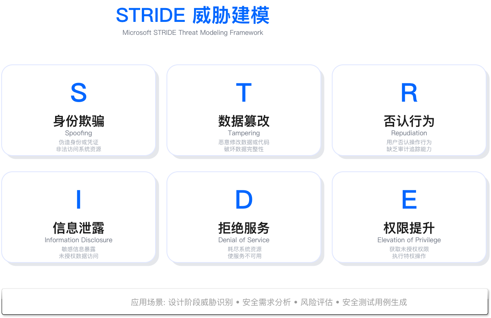
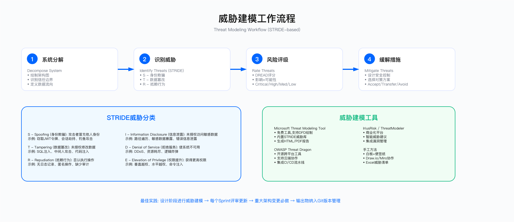

# 4.3　威胁建模

> 落点提示：本节给的是 STRIDE / DFD / 攻击树这套通用方法与它的适用边界。被建模对象是 ML 系统时不另换框架，而是把六类威胁映射到模型资产上（模型身份伪造、权重篡改与后门、决策不可追溯、训练数据提取与成员推断、对抗样本致拒绝服务、提示词注入提权），映射表与它对应的控制点见 [18.2 AI 安全架构设计与实施](../../第06部分_AI驱动的安全创新/第18章_AI系统安全/18.2_AI安全架构设计与实施.md)。

威胁建模是一种结构化的分析方法，用于在系统设计阶段识别、评估安全威胁，并据此设计缓解措施。本节阐述威胁建模的核心方法论（STRIDE、PASTA、攻击树），介绍风险评级框架与常用工具，通过实战案例说明如何将威胁建模嵌入安全架构设计流程，并讨论 AI 与 agentic 智能体如何辅助其中模式化的枚举与起草工作。

---

## 4.3.1 威胁建模的定位与价值

### 威胁建模在安全开发生命周期中的位置

威胁建模的核心作用是在系统设计阶段——即编写代码之前——识别可能的攻击路径与安全缺陷。这一方法的价值在于：设计阶段修复安全问题的成本远低于开发或生产阶段。威胁建模输出的内容包括威胁清单、数据流图（DFD）、攻击路径分析、缓解措施设计，以及剩余风险评估。

威胁建模并非一次性活动。当系统架构发生重大变更、集成新的第三方服务、监管要求变化或发生安全事件后，均需重新评估威胁模型。

适用边界：威胁建模适用于新系统设计、重大架构变更、高风险业务系统（涉及支付、PII、关键基础设施）。对于简单的配置变更或纯前端调整，通常不需要完整的威胁建模流程。

关键约束：
- 时间成本：完整的威胁建模工作坊通常需要半天至一天，需要协调架构师、开发负责人、产品经理、安全人员多方参与
- 能力依赖：威胁识别质量高度依赖参与者的安全知识与业务理解
- 工具局限：自动化工具可辅助生成威胁清单，但无法替代人工判断其适用性与优先级

### 威胁建模成熟度

组织的威胁建模能力可分为多个层次：

| 层次 | 特征 | 典型实践 |
|-----|------|---------|
| 无（Level 0） | 无威胁建模实践 | 依赖临时安全评审 |
| 临时（Level 1） | 部分项目进行威胁建模，无统一方法 | 使用简单的清单式检查 |
| 规范（Level 2） | 关键项目强制威胁建模，采用标准方法 | 使用 STRIDE 或 PASTA，有模板 |
| 优化（Level 3） | 全面集成到 SDLC，自动化工具支持 | 威胁库、自动化 DFD、CI/CD 集成 |
| 创新（Level 4） | 威胁情报联动，机器学习辅助 | 实时威胁更新，自动推荐缓解措施 |

多数组织处于 Level 1-2 阶段。达到 Level 3 需要建立标准化流程、模板与工具链；Level 4 需要与威胁情报平台深度集成。

---

## 4.3.2 STRIDE 方法

### STRIDE 概述

STRIDE 由微软的 Loren Kohnfelder 与 Praerit Garg 于 1999 年 4 月在内部文档《The Threats To Our Products》中提出（该文微软官网已下线，现由 Adam Shostack 存档）[1]，是应用最广泛的威胁分类方法。其名称来自六种威胁类型的首字母：Spoofing（身份伪装）、Tampering（数据篡改）、Repudiation（抵赖）、Information Disclosure（信息泄露）、Denial of Service（拒绝服务）、Elevation of Privilege（权限提升）。

STRIDE 的分类逻辑与安全属性直接对应：身份伪装违反认证、数据篡改违反完整性、抵赖违反不可否认性、信息泄露违反机密性、拒绝服务违反可用性、权限提升违反授权。这种对应关系让威胁分类与控制设计可以直接挂钩，是 STRIDE 被广泛采用的根本原因。



### STRIDE 威胁分类

| 威胁类型 | 定义 | 违反的安全属性 | 典型攻击示例 |
|---------|------|----------------|-------------|
| Spoofing（身份伪装） | 攻击者伪装成其他合法用户或系统的身份 | 认证 | 钓鱼攻击、会话劫持、中间人攻击 |
| Tampering（数据篡改） | 未经授权修改数据或代码 | 完整性 | SQL 注入、数据库篡改、传输数据篡改 |
| Repudiation（抵赖） | 否认已执行的操作且无法追溯 | 不可否认性 | 删除日志、否认操作、伪造时间戳 |
| Information Disclosure（信息泄露） | 敏感信息泄露给未授权方 | 机密性 | 未授权访问、数据泄露、侧信道攻击 |
| Denial of Service（拒绝服务） | 耗尽资源使服务不可用 | 可用性 | DDoS、资源耗尽、逻辑炸弹 |
| Elevation of Privilege（权限提升） | 获取超出授权范围的权限 | 授权 | 权限绕过、漏洞利用、配置错误导致的提权 |

### STRIDE 威胁建模流程

STRIDE 建模通常遵循四个步骤：

步骤 1：绘制数据流图（DFD）

数据流图是威胁建模的基础输入。需要识别四类元素：
- 外部实体（External Entity）：系统外部的人或系统，如用户、第三方服务
- 进程（Process）：处理数据的代码或服务
- 数据存储（Data Store）：持久化数据，如数据库、文件、缓存
- 数据流（Data Flow）：元素之间的数据传输

此外，需要明确标注信任边界（Trust Boundary）——安全控制级别发生变化的位置。信任边界是威胁分析的重点区域：跨越信任边界的数据流通常是攻击的高风险点。

步骤 2：识别威胁

对 DFD 中的每个元素应用 STRIDE 分类。常用策略包括：
- STRIDE-per-Element：对每个元素逐一检查六种威胁类型是否适用
- STRIDE-per-Interaction：聚焦于元素之间的交互（数据流），分析跨信任边界的威胁

这两个变体的系统化表述见 Adam Shostack 的《Threat Modeling: Designing for Security》（Wiley, 2014）[2]——原始的 STRIDE 文档只给出威胁分类，并未规定枚举策略，per-element 与 per-interaction 是后续实践中沉淀出来的用法。

并非所有威胁类型都适用于所有元素。例如，外部实体通常不涉及"权限提升"威胁；数据存储通常不涉及"身份伪装"威胁。

步骤 3：评估风险

使用 DREAD 或其他风险评级方法（见 4.3.5）对威胁进行优先级排序。评估维度通常包括影响程度、发生可能性、检测难度。

步骤 4：设计缓解措施

针对高优先级威胁设计安全控制措施，并记录决策理由（建议使用架构决策记录 ADR，见 4.5.3）。缓解措施需明确责任人与验收标准。

### STRIDE 实战案例：电商支付系统

以下案例说明如何对电商支付系统进行 STRIDE 威胁建模。

系统架构概述

系统包含三个主要信任边界：
1. 互联网（用户浏览器）↔ DMZ（API 网关）
2. DMZ ↔ 内网（应用服务）
3. 内网 ↔ 外部（第三方支付网关）

主要组件：Web 前端、API 网关、订单服务、支付服务、用户服务、数据库集群、第三方支付网关。

威胁分析摘要

| DFD 元素 | 威胁类型 | 威胁描述 | 缓解措施 |
|---------|---------|---------|---------|
| 用户 → Web 前端 | S（身份伪装） | 钓鱼攻击伪装用户 | 反钓鱼培训、邮件过滤、硬件 2FA |
| 用户 → Web 前端 | T（篡改） | 中间人攻击篡改数据 | 强制 HTTPS、HSTS、证书固定 |
| Web 前端 → API 网关 | S（身份伪装） | Token 伪造（含 alg:none、RS256→HS256 算法混淆） | JWT RS256 签名 + 显式锁定 alg 白名单、禁止 none、短期 Token、设备指纹 |
| API 网关 → 支付服务 | T（篡改） | 支付金额篡改 | 后端重新计算金额、数字签名验证 |
| 支付服务 → 数据库 | T（篡改） | SQL 注入修改数据 | 参数化查询、ORM、输入验证 |
| 支付服务审计日志 | R（抵赖） | 删除交易日志 | 日志写入不可变存储、独立日志数据库 |
| 支付服务 → 数据库 | I（信息泄露） | 数据库备份泄露 | 备份加密、访问控制、KMS 密钥管理 |
| 互联网 → API 网关 | D（拒绝服务） | API 滥用耗尽资源 | 限流、WAF、自动扩容 |
| API 网关 → 微服务 | E（权限提升） | 越权访问他人订单 | 强制访问控制检查、UUID 订单 ID |

缓解措施设计示例

针对"支付金额篡改"威胁，设计三重防护：
1. 前端仅允许选择预设套餐，不允许手动输入金额
2. 后端根据订单商品 ID 从数据库读取当前价格重新计算总金额，不信任前端提交的金额
3. 支付前二次校验，若计算金额与提交金额差异超过阈值则拒绝并告警

JWT 签名不等于验证做对了：上表把"JWT RS256 签名"列为 Token 伪造的核心缓解，但签名机制若配置不当会被经典手法直接绕过，必须在缓解层显式防住：

- 拒绝 `alg:none`：部分库允许 header 声明 `"alg":"none"` 表示"无签名"，若服务端未禁止，攻击者可去掉签名伪造任意 Claims。验证时必须显式拒绝 `none`。
- 锁定算法白名单，防 RS256→HS256 算法混淆：若服务端仅按 token header 里的 `alg` 选择验证方式，攻击者可把算法从 RS256 改为 HS256，并用公开的 RSA 公钥当作 HMAC 密钥重新签名——公钥人人可得，签名即被伪造。缓解是：在验证侧硬编码期望算法（如仅接受 RS256），令签名算法与验证密钥类型强绑定，绝不让 token 自述的 `alg` 决定验证逻辑。
- 校验 `kid` 来源：`kid` 用于选择验证密钥，若直接信任 token 提供的 `kid` 去拉取密钥（如 JWKS URL 注入），可能被指向攻击者控制的密钥。`kid` 只能在受信任的密钥集合内查表，不得据其发起外部请求。

验证方法：集成测试模拟篡改金额攻击，验证后端是否正确拒绝；渗透测试验证防护有效性；针对 JWT 单独增加"提交 `alg:none` token"与"用公钥做 HS256 签名的混淆 token"两类用例，验证均被拒绝。

运行指标：监控金额校验失败率（触发条件：差异超阈值的请求占比异常升高可能表明攻击尝试）。

### 常见误区

1. 信任边界划分错误：按组织归属而非安全风险划分。Web 前端运行在用户浏览器中，应视为不可信区域，与后端之间存在信任边界。
2. 威胁识别不完整：仅关注外部攻击，忽略内部威胁（如服务间调用的身份伪造）。
3. 缓解措施不具体：仅写"加强认证"而不明确技术方案与验收标准。
4. 一次性建模：建模后不再更新，导致威胁模型与实际系统脱节。

---

## 4.3.3 PASTA 方法

### PASTA 概述

PASTA（Process for Attack Simulation and Threat Analysis）是一种以风险为中心的威胁建模方法，强调业务影响与攻击模拟，由 Tony UcedaVélez 与 Marco M. Morana 在 2015 年出版的《Risk Centric Threat Modeling》中系统化[3]。PASTA 包含七个阶段，从业务目标定义延伸到技术威胁分析，输出可直接用于风险管理决策。

PASTA 的核心特点：从业务视角出发、关注攻击者视角、风险量化驱动决策。

适用边界：PASTA 适用于高风险系统（金融交易、医疗记录、关键基础设施），需要向董事会或高管汇报安全风险的场景，以及强监管行业（需要证明风险评估的严谨性）。对于快速迭代的一般业务系统，PASTA 的七阶段流程可能过于繁重。

关键约束：时间成本（完整 PASTA 流程通常需要数周）；团队要求（需要业务、安全、开发多方协作）；工具支持（相比 STRIDE，PASTA 的工具链不够成熟）。

### PASTA 七阶段模型

| 阶段 | 名称 | 主要活动 | 关键输出 |
|-----|------|---------|---------|
| 1 | 定义业务目标 | 识别业务功能与资产，确定业务影响评估标准，定义合规要求 | 业务影响分析（BIA）、合规矩阵 |
| 2 | 定义技术范围 | 绘制技术架构图，识别技术组件与依赖，确定威胁建模边界 | 架构图、组件清单、依赖关系 |
| 3 | 分解应用 | 识别入口点与数据流，识别信任边界与控制点，识别数据资产 | DFD、入口点清单、数据分类表 |
| 4 | 威胁分析 | 使用威胁情报与漏洞库，识别攻击向量，映射到 MITRE ATT&CK | 威胁清单、攻击场景、ATT&CK 映射 |
| 5 | 漏洞与弱点分析 | 代码扫描（SAST/DAST）、配置审查、已知漏洞检查（CVE） | 漏洞清单、弱点报告、修复优先级 |
| 6 | 攻击建模 | 构建攻击树，进行攻击路径模拟，评估可利用性 | 攻击树、攻击路径图、可利用性评分 |
| 7 | 风险与影响分析 | 风险评分（概率×影响），量化业务影响，提供缓解建议 | 风险评分表、缓解建议、残余风险 |

### PASTA 与 STRIDE 的对比与组合

| 对比维度 | PASTA | STRIDE |
|---------|-------|--------|
| 焦点 | 风险与业务影响 | 威胁分类 |
| 复杂度 | 高（7 阶段） | 中（6 类威胁） |
| 业务对齐 | 强（从业务目标开始） | 弱（主要技术视角） |
| 学习曲线 | 陡峭 | 平缓 |
| 工具支持 | 有限 | 丰富（Microsoft TMT 等） |
| 输出 | 风险评分 + 缓解建议 | 威胁清单 |
| 适用场景 | 高风险系统、强监管行业 | 通用系统、快速迭代项目 |

组合使用策略：对于关键系统，可结合两种方法的优势。使用 PASTA 前三阶段建立业务背景与 DFD，使用 STRIDE 进行快速威胁识别（利用其成熟的工具链），再使用 PASTA 后三阶段进行漏洞分析、攻击建模与风险量化。这种组合可兼顾深度与效率。

方法选择决策逻辑：
- 系统涉及财务、生命或关键基础设施 → PASTA（或 PASTA+STRIDE 组合）
- 需要业务影响量化 → PASTA
- 时间紧迫且团队主要是技术人员 → STRIDE
- 首次进行威胁建模 → STRIDE（学习曲线友好）

---

## 4.3.4 攻击树分析方法

### 攻击树概述

攻击树（Attack Trees）由 Bruce Schneier 在 1999 年 12 月《Dr. Dobb's Journal》的文章《Attack Trees: Modeling Security Threats》中提出[4]，是一种图形化方法，用树状结构表示攻击者达成目标的所有可能路径。

核心概念：
- 根节点：攻击者的最终目标
- 子节点：达成目标的子目标或方法
- 叶节点：具体的攻击步骤
- 逻辑关系：AND（必须全部完成）、OR（任一即可）

攻击树的价值在于：将复杂的攻击场景分解为可分析的组件，识别攻击者的多种路径选择，支持量化分析以指导防御资源分配。攻击树不是 STRIDE 的替代品——两者互补，STRIDE 擅长全面枚举威胁，攻击树擅长深度分析特定目标的攻击路径。

### 攻击树量化分析

可为每个叶节点分配属性进行量化分析：

| 属性 | 说明 |
|-----|------|
| 成本（Cost） | 攻击者需要的经济成本 |
| 难度（Difficulty） | 技术难度 |
| 可检测性（Detectability） | 被发现的概率 |
| 成功率（Success Rate） | 攻击成功概率 |

对于 AND 节点，总成本为各子节点成本之和，总成功率为各子节点成功率之积（均需成功）。对于 OR 节点，攻击者会选择成本最低或成功率最高的路径。

量化分析示例：以"通过钓鱼获取银行凭证"为例，假设攻击路径包括注册伪造域名、获取 SSL 证书、仿造银行页面、发送钓鱼邮件、窃取凭证、绕过 2FA 六个步骤（AND 关系）。

量化分析可揭示：总成本较低的攻击路径需要重点防御；成功率瓶颈在于钓鱼邮件点击率与 2FA 绕过难度；防御投入应聚焦于降低这些步骤的成功率。

适用边界：攻击树适用于分析特定攻击场景的详细路径，支持防御优先级决策。不适合用于全面覆盖系统所有威胁（此时应使用 STRIDE 或 PASTA）。

常见误区：
1. 攻击树过于抽象，缺乏具体攻击步骤
2. 量化参数缺乏依据，仅凭直觉估计
3. 忽略攻击者视角，仅从防御者角度构建

---

## 4.3.5 DREAD 风险评级

### DREAD 概述

DREAD 由 Microsoft 开发，用于对威胁进行优先级排序。其名称来自五个评估维度：Damage（破坏程度）、Reproducibility（可重现性）、Exploitability（可利用性）、Affected Users（影响用户数）、Discoverability（可发现性）。

### DREAD 五维度评分

| 维度 | 说明 | 评分标准（0-10） |
|-----|------|-----------------|
| Damage（破坏程度） | 破坏程度 | 0：无影响；5：个别用户数据泄露；10：完全系统崩溃或大规模数据泄露 |
| Reproducibility（可重现性） | 可重现性 | 0：几乎不可能；5：需要特定条件；10：任何时候都可重现 |
| Exploitability（可利用性） | 可利用性 | 0：需要高级技能与定制工具；5：需要熟练攻击者；10：脚本小子可利用 |
| Affected Users（影响用户数） | 影响用户数 | 0：无用户；5：部分用户；10：所有用户 |
| Discoverability（可发现性） | 可发现性 | 0：极难发现；5：需要一定努力；10：显而易见 |

计算公式：DREAD 风险值 =（D + R + E + A + D）÷ 5

风险等级划分（内部口径示例）：
- 8.0-10.0：严重（Critical）
- 6.0-7.9：高（High）
- 4.0-5.9：中（Medium）
- 2.0-3.9：低（Low）
- 0.0-1.9：极低（Minimal）

### DREAD 评估示例

威胁：登录页面 SQL 注入漏洞

| 维度 | 评分 | 理由 |
|-----|------|------|
| Damage | 10 | 可窃取整个数据库，包括用户密码、敏感数据 |
| Reproducibility | 9 | 任何时候都可重现，不需要特殊条件 |
| Exploitability | 8 | 使用 sqlmap 等工具即可自动化利用 |
| Affected Users | 10 | 影响所有用户数据 |
| Discoverability | 7 | 自动化扫描工具可发现 |

DREAD 风险值：（10 + 9 + 8 + 10 + 7）÷ 5 = 8.8（严重）

### DREAD 的局限性与替代方案

DREAD 的优点是简单易用，但存在主观性问题——不同评估者对同一威胁的评分可能差异较大；微软自身也早已不在其威胁建模方法中推荐 DREAD。DREAD 目前已非行业主流方法，CVSS（Common Vulnerability Scoring System）是更标准化的漏洞评分体系，由 FIRST 的 CVSS-SIG 维护，当期版本为 2023 年 11 月发布的 v4.0[5]。

DREAD 仍适用于威胁建模早期阶段的快速优先级排序；对于需要标准化评分的漏洞管理场景，应使用 CVSS。

验证方法：组织可通过"校准会议"减少 DREAD 的主观性——让多位评估者独立评分后讨论差异，形成一致的评分标准。

---

## 4.3.6 威胁建模工具

### 工具分类与选型

| 工具类别 | 代表工具 | 适用场景 | 优势 | 劣势 |
|---------|---------|---------|------|------|
| 图形化建模 | Microsoft TMT、IriusRisk | 初学者、可视化需求 | 易用、模板丰富 | 灵活性有限 |
| 代码驱动 | Threagile、pytm | DevSecOps、自动化 | 版本控制、CI/CD 集成 | 学习曲线陡峭 |
| 协作平台 | OWASP Threat Dragon、Cairis | 团队协作、知识管理 | 多人协作、知识库 | 部署复杂 |
| 商业平台 | ThreatModeler、SD Elements | 企业级、合规需求 | 功能全面、支持好 | 成本高 |

### Microsoft Threat Modeling Tool

Microsoft TMT 是免费的威胁建模工具，支持 STRIDE 方法。核心功能包括拖拽式 DFD 绘制、自动 STRIDE 威胁识别、威胁知识库、报告生成。

使用流程：
1. 创建新模型，选择模板（Web 应用、桌面应用、云服务等）
2. 绘制 DFD，添加外部实体、进程、数据存储、数据流，标注信任边界
3. 分析威胁，审查自动生成的 STRIDE 威胁列表，添加自定义威胁
4. 记录缓解措施，为每个威胁标记状态（未开始/已缓解/不适用）
5. 生成报告（HTML/Excel），可与 Azure DevOps 集成

适用边界：Microsoft TMT 适用于初次接触威胁建模的团队、使用 Microsoft 技术栈的项目。不适用于需要深度定制或与非 Microsoft 工具链集成的场景。

### Threagile（代码驱动威胁建模）

Threagile 基于 YAML 进行威胁建模，面向 DevSecOps 场景。通过代码定义架构、资产、信任边界，自动生成威胁报告。

优势：模型可纳入版本控制、支持 CI/CD 集成、适合 Infrastructure-as-Code 环境。

劣势：学习曲线较陡，需要熟悉 YAML 语法与 Threagile 模型定义。

常见误区：
1. 过度依赖工具自动生成的威胁，不进行人工审查与裁剪
2. 未将威胁模型纳入版本控制，导致与代码不同步

---

## 4.3.7 威胁建模实践流程

### 标准化威胁建模流程

企业级威胁建模通常包含六个步骤：

步骤 1：触发与准备

触发条件：新项目立项、重大架构变更、监管要求变化、安全事件后复盘。

准备工作：识别利益相关方（架构师、开发、产品、安全），收集文档（需求、架构图、数据流），安排工作坊，准备威胁建模模板与工具。

步骤 2：建模工作坊

参与者：架构师、开发负责人、产品经理、安全架构师。

议程：介绍系统 → 绘制 DFD → 识别威胁（使用 STRIDE）→ 评估风险（使用 DREAD）→ 讨论缓解措施 → 总结与行动项。

步骤 3：文档化

输出：威胁建模报告、威胁清单（纳入缺陷跟踪系统）、DFD 图、架构决策记录（ADR）。

归档：Git 仓库（版本控制）、Confluence（知识库）、GRC 平台（合规证据）。

步骤 4：实施缓解措施

将威胁转化为安全需求，分配责任人与截止日期，纳入 Sprint Backlog，跟踪实施进度。

步骤 5：验证

通过安全测试（SAST/DAST/渗透测试）验证缓解措施有效性。代码审查检查缓解措施实现。架构评审复审威胁模型。更新威胁模型，记录残余风险。

步骤 6：维护与迭代

触发条件：架构变更、新威胁情报、安全事件、定期复审。

维护活动：更新 DFD、重新评估风险、调整缓解措施。

运行指标：
- 威胁建模覆盖率：已建模项目 ÷ 重大项目总数
- 威胁缓解率：已缓解威胁 ÷ 已识别威胁
- 高风险威胁关闭周期：从识别到缓解的天数



### 实战案例：API 网关威胁建模

背景：微服务 API 网关（Kong），承载百万级用户，处理 PII 与支付信息，需满足 GDPR、PCI DSS 合规要求。

DFD 概述

系统包含四个信任边界：
1. 互联网 → CDN/负载均衡
2. 负载均衡 → API 网关（DMZ）
3. API 网关 → 内部微服务
4. 微服务 → 数据层

主要组件：移动端（iOS/Android）、Web SPA、Kong Gateway、微服务集群（用户服务、订单服务、支付服务、通知服务）、数据库（PostgreSQL、MongoDB、Redis、S3）。

STRIDE 威胁识别（摘要）

| DFD 元素 | 威胁类型 | 威胁描述 | DREAD 评分 | 缓解措施 |
|---------|---------|---------|-----------|---------|
| 移动端 → Kong | Spoofing | 伪造客户端绕过认证 | 7.5（高） | OAuth 2.0、Client Certificate Pinning、设备指纹 |
| Kong → 微服务 | Tampering | 篡改 JWT Claims（含 alg:none、算法混淆） | 8.2（严重） | RS256 签名、锁定 alg 白名单并禁止 none、验证 iss/aud/exp、密钥定期轮换 |
| Kong 日志 | Repudiation | 删除或篡改审计日志 | 6.5（高） | 日志写入 WORM 存储、集中日志、文件完整性监控 |
| Kong → 微服务 | Info Disclosure | 错误信息泄露内部架构 | 5.8（中） | 统一错误处理、移除堆栈跟踪、通用错误码 |
| 互联网 → Kong | DoS | DDoS 攻击导致服务不可用 | 7.8（高） | CDN + DDoS 防护、Rate Limiting、自动扩展 |
| Kong Plugin | EoP | 恶意 Plugin 提升权限 | 6.2（高） | Plugin 白名单、代码审查、最小权限运行 |

验证方法：
- JWT 伪造测试：尝试使用无效签名的 Token 访问 API，验证是否被拒绝；补充 `alg:none` 空签名与 RS256→HS256 算法混淆（用公钥当 HMAC 密钥）两类经典绕过用例，确认均被拒绝
- 限流绕过测试：高并发请求验证 Rate Limiting 是否生效
- 日志删除测试：验证应用层账户无法删除审计日志（WORM 保护）

---

## 4.3.8 AI 与 agentic 辅助威胁建模

前面几节的威胁建模，工作量的大头压在人身上：画 DFD 靠人读架构，逐元素套 STRIDE 靠人一个个过，写缓解措施靠人查经验。这几步里有相当一部分是模式化的——同样的架构形态对应同样的一批威胁，同样的威胁对应同样的一组标准缓解。凡是模式化的重复劳动，都是大模型能接手的地方。威胁建模因此成了 2025 年前后 agentic 能力落地最快的安全场景之一：它输入的是架构描述与代码，输出的是结构化的威胁清单，中间的推理链条清晰，且有 STRIDE、OWASP 这类现成框架给模型当脚手架。

### AI 能接手威胁建模的哪几步

把大模型接进威胁建模，通常落在四件事上：

从架构描述或代码库生成 DFD。给模型一段架构文字、一份 API 定义或一个代码仓库，让它识别外部实体、进程、数据存储、数据流，并推断信任边界的位置。这一步替代的是人对着架构图手工画 DFD 的过程。模型对代码里显式的调用关系、数据库读写、外部 HTTP 请求识别得不错，但信任边界的判定仍常出错——它容易漏掉"这个内部服务其实跑在用户可控环境里"这类需要业务理解的边界。

逐元素枚举 STRIDE 威胁。拿到 DFD 后，对每个元素、每条跨边界的数据流套六类威胁，生成"哪个元素可能被身份伪装、哪条流可能被篡改"的清单。这正是 4.3.2 里 STRIDE-per-Element 的机械化版本，模型做这种穷举比人快且不容易漏项。

起草缓解措施。对每条威胁给出标准防护建议——传输加密、参数化查询、限流、最小权限。模型对"这类威胁通常怎么防"回答得很流畅，因为这些是文档里反复出现的标准答案。

语义匹配威胁库。把生成的威胁往 OWASP Top 10、MITRE ATT&CK、CWE 或组织内部威胁库上映射，做去重与归类。语义匹配是大模型的强项，比关键词匹配的威胁库检索准得多。

行业里几个工具正沿这四步展开。STRIDE GPT 是开源项目，能对代码库做 agentic 分析、生成 DFD，并把识别出的威胁映射到 OWASP Agentic Top 10（针对智能体系统的威胁清单，需自证其对具体系统的适配度）。ThreatGPT 一类工具主打速度，厂商称一次建模约 30 秒、对比人工 40 多小时（厂商称，且这是理想条件下的对比，实际取决于系统复杂度与建模深度，需在自己环境验证）。IriusRisk、ThreatModeler 这类商业平台也陆续加了 AI 能力——自动生成威胁、推荐缓解、自然语言问答（厂商产品能力，效果需自证）。这些数字和能力都要当厂商口径看，落地前自己跑一遍对照才算数。

### agentic 威胁建模：编排多个专职智能体

单个大模型一把抓完整套威胁建模，和 11.4.6 讲的单体狩猎有同样的毛病：长程多步、每步需要不同专长，一路做下来容易中途丢目标、把前一步的错误带到底。更稳的做法是把流程拆给一组专职智能体，由编排器调度——这正是 17.2.4 讨论的多智能体编排在威胁建模域的落地。

```
              ┌──────────────────────────────┐
              │  编排器（持有建模目标+范围边界）  │
              │  调度各 agent、决定收敛或交人工  │
              └───┬───────┬───────┬───────┬────┘
      ┌───────────┘       │       │       └───────────┐
 ┌────▼─────┐   ┌────────▼──┐  ┌─▼────────┐   ┌───────▼────┐
 │读架构 agent│  │枚举威胁agent│ │查威胁库   │   │起草缓解agent│
 │读代码/架构 │→ │逐元素套    │→ │agent:映射 │→ │对每条威胁给 │
 │文档→识别   │  │STRIDE、每条│  │OWASP/    │   │标准缓解+验 │
 │DFD元素与   │  │跨界流枚举  │  │ATT&CK/   │   │收标准草稿  │
 │信任边界    │  │威胁        │  │内部威胁库 │   └─────┬──────┘
 └──────────┘   └───────────┘  └───────────┘         │
        ▲                    ┌─────────────────┐      │
        │  补边界/派生新威胁   │ 校验 agent：对高危 │◄─────┘
        └────────────────────│ 威胁做独立反证    │
                             └────────┬─────────┘
   （承 17.2.2 智能体记忆：已建模元素、          │ 站得住才留
    已排除威胁回流，避免重复枚举）               ▼
                                    人工复核 → 定优先级 / 拍板取舍
```

怎么读这张图：编排器是唯一持有建模范围和目标的角色，其余智能体各管一步。读架构 agent 把架构与代码翻成 DFD，枚举威胁 agent 逐元素套 STRIDE，查威胁库 agent 做语义映射与去重，起草缓解 agent 出防护草稿。关键的一环是独立的校验 agent：它专门对高危威胁做反证——这条威胁在当前架构下真的成立吗，前面某个 agent 是不是把一个不适用的模板威胁硬套上了。没有这道反证，读架构 agent 误判的一个信任边界，会被枚举 agent 落成一批威胁、被起草 agent 配上缓解，最后攒成一份看着齐整却站不住的报告。智能体记忆让已建模元素和已排除威胁回流下一轮，避免架构迭代时从头重枚举。

### 能力边界：擅长穷举，不擅长判断

这套东西的两面要说清楚，否则很容易把草稿当成品用。

AI 擅长的是穷举已知模式的威胁和套模板化的缓解。同样的架构形态它能不知疲倦地把该套的 STRIDE 一条不漏地套完，标准防护也答得又快又全——这些恰恰是人工建模最容易因为疲劳而漏项、因为赶时间而写得含糊的地方。

AI 不擅长的是创造性威胁和优先级判定。真正伤人的往往是业务逻辑威胁：优惠券叠加套现、订单状态机被绕、多租户下的越权，这些不在任何标准威胁库里，需要理解这个系统的业务规则才能看出来，模型基本抓不到。优先级更是模型的短板——哪条威胁值得现在就修、哪条可以接受为残余风险，取决于业务风险偏好、合规压力、修复成本的权衡，这是判断不是枚举。生成的威胁清单还常有两种毛病：一是冗余，把大量低价值或不适用的威胁也列上，人得花时间裁剪；二是漏，需要业务上下文的那些关键威胁往往漏掉。清单看着长，不等于覆盖全。

因此人在回路的红线，在威胁建模里划得很具体：高风险威胁能不能确认成立、清单怎么排优先级、缓解措施如何取舍——这三件事的责任始终在人，AI 只出草稿。这和 4.3.7 步骤 2 里"建模工作坊"的定位一致：AI 可以把工作坊之前的枚举和起草做掉，让人把时间集中花在判断上，但不能替人做决定。把 AI 生成的威胁清单直接当最终交付物，是这类工具最典型的误用——它跳过了唯一不可省的那一步。

需要划清的是，这里讲的是"用 AI 来做威胁建模"，不是"给 AI 系统做威胁建模"。智能体本身被攻击的机理——读架构 agent 被投喂污染的架构描述、编排链被提示注入劫持去泄露不该碰的代码——属于保护 AI 系统的范畴：agent 自身攻击面见 18.3，多智能体编排的通用防御机理见 17.2.4，本节不复述。落到威胁建模这件事上，一句话：AI 把穷举和起草的活接过去，把人解放到判断上，但判断这一步，交不出去。

---

## 4.3.9 本节小结

威胁建模的价值在于将安全问题前置到设计阶段，降低修复成本。

- STRIDE 是最常用的威胁分类方法，适合快速迭代的通用系统；
- PASTA 面向业务风险，适合高风险系统与强监管行业；
- 攻击树用于分析特定攻击场景的详细路径，支持量化分析与防御优先级决策；
- DREAD 提供简单的风险评级方法，但存在主观性问题；
- AI 与 agentic 智能体能接手 DFD 生成、STRIDE 枚举、缓解起草这些模式化工作，但威胁确认、优先级与取舍仍是人的责任。

威胁建模需要标准化流程与工具支持，并随系统演进持续更新。

### 常见陷阱

1. 一次性建模：建模后不再更新，威胁模型与实际系统脱节
2. 过度依赖工具：工具自动生成的威胁质量参差不齐，需人工审查
3. 缺乏业务上下文：纯技术视角建模，忽略业务影响与风险偏好
4. 威胁泛化：识别出大量威胁但不排序优先级，导致无从下手
5. 缓解措施不落地：威胁建模报告束之高阁，不纳入开发计划
6. 跳过验证：假设缓解措施有效，不通过测试验证
7. 孤岛式建模：安全团队闭门造车，不与架构、开发团队协作

### 验证方法

- 威胁覆盖验证：将渗透测试发现的漏洞与威胁模型对比，检查是否存在遗漏
- 缓解措施验证：通过安全测试（SAST/DAST/渗透测试）验证缓解措施有效性
- 模型一致性验证：定期对比威胁模型与实际系统架构，检查是否同步

---

## 4.3.10 延伸阅读

### 推荐书籍

- 《Threat Modeling: Designing for Security》（Adam Shostack）：威胁建模权威指南，详细讲解 STRIDE、攻击树等方法
- 《Threat Modeling: A Practical Guide for Development Teams》（Izar Tarandach & Matthew J. Coles）：面向开发团队的实用指南，强调工具与自动化

### 行业标准与框架

- NIST SP 800-154：Guide to Data-Centric System Threat Modeling
- MITRE ATT&CK：攻击技术知识库（威胁情报来源）
- OWASP Top 10：应用安全威胁参考
- CWE（Common Weakness Enumeration）：常见弱点枚举

### 在线资源

- Microsoft Threat Modeling Tool 文档：https://learn.microsoft.com/en-us/azure/security/develop/threat-modeling-tool
- OWASP Threat Dragon：https://owasp.org/www-project-threat-dragon/
- Threagile：https://threagile.io
- IriusRisk：https://www.iriusrisk.com

---

## 参考文献

| # | 来源 | 标题 | 日期 | 链接 |
| --- | --- | --- | --- | --- |
| [1] | Loren Kohnfelder, Praerit Garg（Microsoft） | The Threats To Our Products：STRIDE 六类威胁分类的原始文档（微软官网已下线，由 Adam Shostack 存档） | 1999-04 | <https://shostack.org/resources/early-threat-modeling> |
| [2] | Adam Shostack | Threat Modeling: Designing for Security，Wiley：系统化表述 STRIDE-per-Element 与 STRIDE-per-Interaction | 2014 | <https://www.wiley.com/en-us/Threat+Modeling:+Designing+for+Security-p-9781118809990> |
| [3] | Tony UcedaVélez, Marco M. Morana | Risk Centric Threat Modeling: Process for Attack Simulation and Threat Analysis，Wiley（PASTA 七阶段） | 2015 | <https://www.wiley.com/en-us/Risk+Centric+Threat+Modeling:+Process+for+Attack+Simulation+and+Threat+Analysis-p-9780470500965> |
| [4] | Bruce Schneier | Attack Trees: Modeling Security Threats，*Dr. Dobb's Journal* | 1999-12 | <https://www.schneier.com/academic/archives/1999/12/attack_trees.html> |
| [5] | FIRST (CVSS-SIG) | Common Vulnerability Scoring System v4.0 Specification Document | 2023-11 | <https://www.first.org/cvss/> |

---

## 导航

[← 上一节：4.2 架构设计原则](./4.2_架构设计原则.md) | [返回章节目录](./README.md) | [下一节：4.4 安全架构模式 →](./4.4_安全架构模式.md)

---

© 2025-2026 AISecOps Project. Licensed under CC BY-NC-SA 4.0
