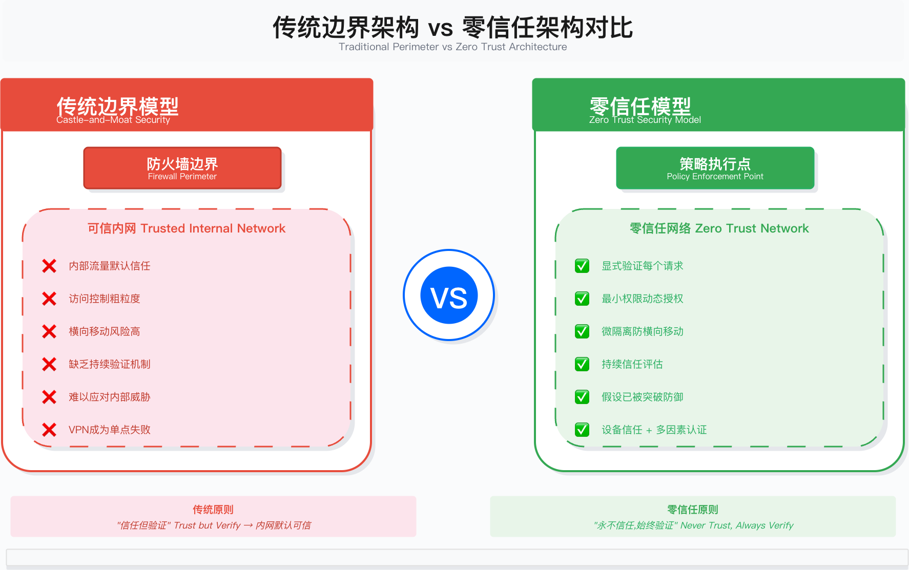
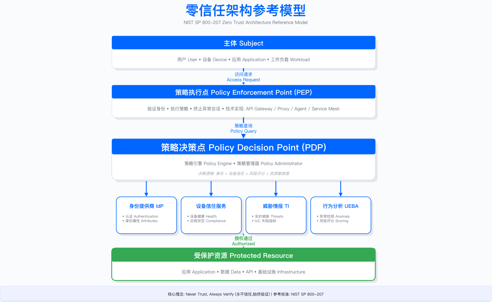
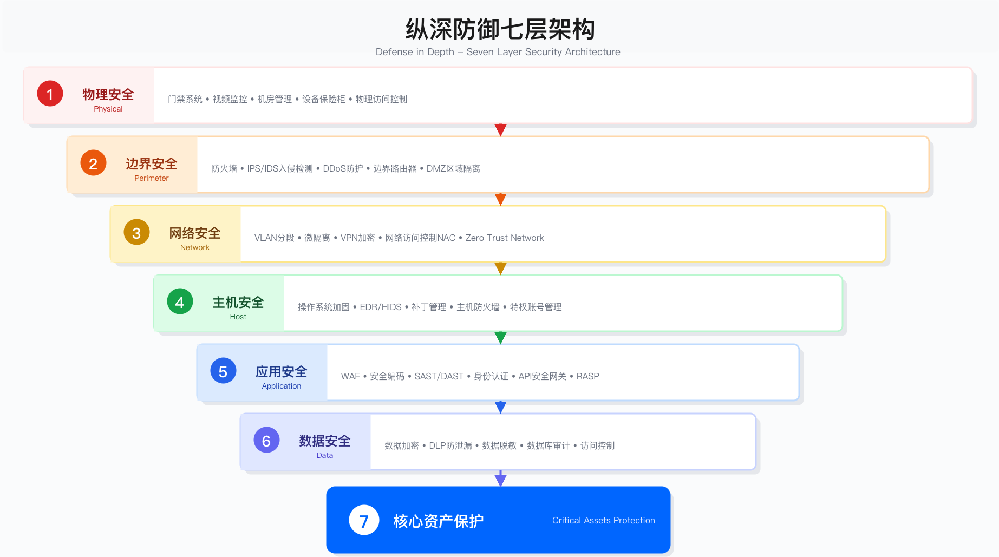
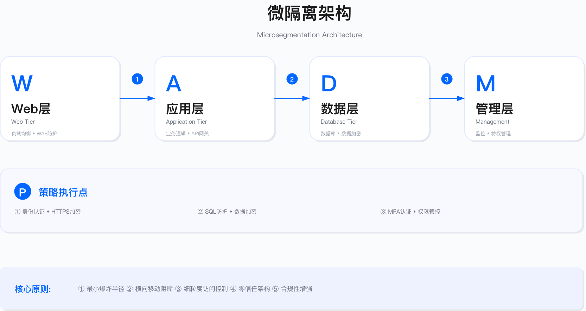
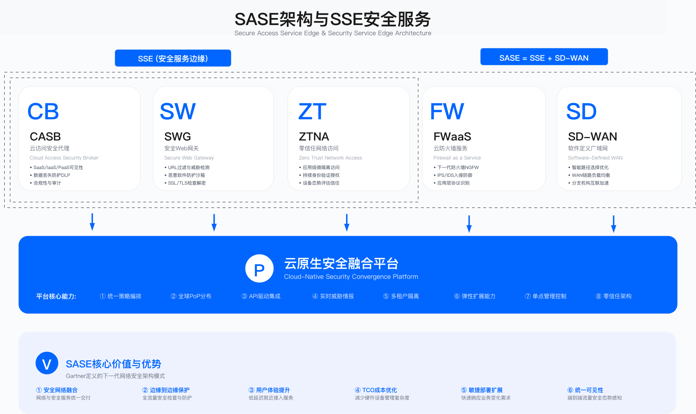

# 4.4　安全架构模式

本节阐述企业安全架构设计中的主流模式，包括零信任架构、纵深防御、微隔离、SASE/SSE 以及身份中心架构。每种模式均有其适用边界与工程约束，企业需根据业务形态、技术栈成熟度和组织能力选择合适的模式组合。

本节的边界：这里交付的是每种模式的结构、组件构成与适用边界——回答"这套架构长什么样、什么条件下不该用它"。实施排期、产品与厂商选型、运行指标不在本节范围内：它们与具体环境强绑定，写进模式描述会很快过期，也容易与工程章节的口径分叉。网络与终端侧的工程落地见 15.1（网络架构与信任域模型）、15.2（分段与微隔离）、15.9（远程接入与 SSE/SASE），跨领域的实施排序与三年路线图见 15.12。

---

## 4.4.1 零信任架构

### 架构理念与核心原则

零信任架构（Zero Trust Architecture, ZTA）基于"永不信任，始终验证"的原则，假设网络内外均不可信，对所有访问请求进行动态验证与授权。与传统边界模型（Castle-and-Moat）相比，零信任模型不再依赖网络位置作为信任依据，而是将信任建立在身份验证、设备状态、行为分析等多维因素的实时评估之上。

这个概念的源头常被误记。「零信任」由 Forrester 分析师 John Kindervag 于 2010 年提出，其中 2010 年 11 月 5 日的报告《Build Security Into Your Network's DNA: The Zero Trust Network Architecture》给出了最早的架构主张——"取消可信网络（通常指内网）与不可信网络的区分"，并引入分段网关与 MCAP 等构件[6]。NIST SP 800-207 是十年后（2020 年）的标准化产物，不是零信任的起点。



零信任领域有两套常被引用的原则表述，需先厘清出处：NIST SP 800-207《Zero Trust Architecture》（2020 年 8 月）官方定义的是七条 tenets（见 4.1.5 完整列出）[1]；而显式验证 / 最小权限访问 / 假设突破这三项，出自微软 Zero Trust 框架的归纳，并非 NIST 定义[2]——二者不可混用署名。微软三原则因表述精炼，常被用作工程实践入口，以下即以其展开：

显式验证（微软框架）：基于所有可用数据点进行验证，包括身份、设备、位置、行为等。技术实现通常涉及多因素认证（MFA）、设备信任评估、风险评分引擎。

最小权限访问（微软框架）：仅授予完成任务所需的最小权限，限制访问范围与时长。实现方式包括即时访问（JIT）、细粒度授权、会话时间限制。

假设突破（微软框架）：假设威胁已在内部存在，目标是最小化影响范围。技术手段包括微隔离、全流量加密、持续监控与威胁狩猎。



### 架构组件

策略执行点（PEP）：验证身份、执行策略、终止异常会话。技术实现包括 API 网关、反向代理、终端 Agent、Service Mesh。

策略决策点（PDP）：由策略引擎和策略管理器组成，决策逻辑综合身份属性、设备信任分数、风险评分、资源敏感度等因素。

支撑服务：身份提供商（IdP）提供认证与身份属性；设备信任服务验证设备健康与合规状态；威胁情报服务提供实时威胁信息与 IoC；行为分析（UEBA）进行异常检测与风险评分。

### 成熟度模型

参照 CISA《Zero Trust Maturity Model》Version 2.0（2023 年 4 月，为写作时的当期版本）的四个阶段[3]，零信任架构的演进路径如下：

| 阶段 | 名称 | 特征 | 典型实践 |
|-----|------|------|---------|
| 1 | Traditional（传统） | 基于边界的安全，内网默认信任 | VPN、防火墙、DMZ |
| 2 | Initial（初始） | 强化身份认证，初步引入零信任控制 | MFA、网络分段、基本日志、基础 IAM |
| 3 | Advanced（高级） | 细粒度访问控制，持续监控，微隔离 | ZTNA、策略引擎、UEBA、设备信任 |
| 4 | Optimal（优化） | 自动化响应，自适应信任，全栈加密 | 自动阻断、机器学习风险评分、持续评估、端到端加密 |

### 实施路径

零信任架构的实施是渐进式演进过程，而非一步到位的项目。Google BeyondCorp 模型提供了分阶段路径参考：

阶段 1：设备清单与信任。 建立完整的设备清单数据库（CMDB），通过自动化扫描和 Agent 部署实现设备发现，部署设备健康检查机制验证补丁状态、磁盘加密、EDR 运行情况。输出是设备信任分数，基于合规状态、安全软件运行情况、已知漏洞数量等因素综合计算。

阶段 2：访问代理。 部署反向代理作为所有内部应用的访问网关，集成身份提供商实现单点登录（SSO）。这一阶段将"基于网络位置的信任"转变为"基于身份的信任"。

阶段 3：动态访问控制。 部署风险评分引擎，基于用户身份、设备信任分数、访问位置、访问时间、资源敏感度、行为模式等多个维度实时计算访问风险。策略引擎根据分数动态调整授权策略——低风险场景直接放行，中风险场景要求额外 MFA 验证，高风险场景拒绝访问或限制为只读权限。

阶段 4：微隔离与加密。 在应用层部署微隔离策略，每个工作负载都有独立的安全策略，默认拒绝所有通信，仅显式允许必要的流量。部署端到端加密，全流量监控提供持续可见性。

### 策略实现示例

以下是基于 Open Policy Agent（OPA）的零信任访问控制策略示例。选择 OPA 而非硬编码逻辑，是因为策略需要随业务变化频繁调整，代码化的策略既支持版本控制，又可在不重新部署应用的情况下热更新。

先看安全前提（读代码前必读）：这是一段策略骨架，它的安全性完全建立在一个前提上——`input` 由可信的 PEP 生成，而非由被评估的主体自报。具体而言：token 的签名与 `exp` 校验必须由 PEP/网关用可信 JWKS 在调用本策略之前完成，只把校验结果（布尔值）传入；`device.id` 必须绑定设备证书或远程证明（attestation）而非客户端自报。若这些前提不成立，攻击者可以伪造过期时间、设备 ID 与风险分数，直接绕过下面所有判断——策略本身无法弥补不可信输入。此外，本骨架引用的 `data.zerotrust.risk_countries` 与 `data.zerotrust.compromised_device_list` 需由外部 `data` 文档提供，单独运行本片段需先注入这些数据。

```rego
# OPA Policy: 零信任访问控制
# 安全前提：input 由可信 PEP 生成；token 签名/exp 已由网关用可信 JWKS 校验；
#          device.id 已绑定设备证书/attestation，非客户端自报。
package zerotrust.access

import future.keywords.if
import future.keywords.in
import data.zerotrust.risk_countries          # 外部数据：高风险国家/地区列表
import data.zerotrust.compromised_device_list  # 外部数据：已知失陷设备列表

# 默认拒绝
default allow := false

# 允许条件: 身份验证 + 设备信任 + 风险可接受
allow if {
    authenticated
    device_trusted
    risk_acceptable
}

# 身份验证检查
# token_valid 由可信 PEP 完成签名与 exp 校验后传入布尔结果，不在业务策略内解析 token
authenticated if {
    input.identity.authenticated == true
    input.identity.mfa_verified == true
    input.identity.token_valid == true
}

# 设备信任检查（security_score 归一化为 0-100）
device_trusted if {
    input.device.managed == true
    input.device.encrypted == true
    input.device.security_score >= 80
    not device_compromised
}

# 风险评估：四项分量均归一化到 0-100，等权求和后取算术平均，最终 risk_score 亦为 0-100
risk_acceptable if {
    calculate_risk_score < 70
}

# 各输入分量约定取值范围（由可信 PEP 保证）：
#   identity.risk_level     ∈ [0,100]  身份风险，越高越危险
#   device.security_score   ∈ [0,100]  设备健康分，越高越安全
#   location_risk_value     ∈ [0,100]  位置风险，见下方分级
#   behavior.anomaly_score  ∈ [0,100]  行为异常分，越高越异常
calculate_risk_score := score if {
    identity_risk := input.identity.risk_level
    device_risk := 100 - input.device.security_score
    location_risk := location_risk_value
    behavior_risk := input.behavior.anomaly_score
    score := (identity_risk + device_risk + location_risk + behavior_risk) / 4
}

# 位置风险评估（0-100）
location_risk_value := 20 if {
    input.location.country in ["CN", "US", "EU"]
} else := 80 if {
    input.location.country in risk_countries
} else := 50

# 设备妥协检查（device.id 须已绑定设备证书/attestation）
device_compromised if {
    input.device.id in compromised_device_list
}
```

怎么读这段策略：这是一段需配合外部数据与可信 PEP 使用的策略骨架，不是可独立部署的完整实现。整个逻辑分为三道门，只有全部通过才允许访问。第一道门（`authenticated`）要求同时满足 MFA 已验证且 `token_valid` 为真——注意 token 的签名与过期校验不在本策略内完成，而是由网关用可信 JWKS 校验后把布尔结果传入，避免在业务策略里重复实现（且更易出错的）token 解析。第二道门（`device_trusted`）要求设备受管、启用加密且安全评分不低于 80 分。第三道门（`risk_acceptable`）运行 `calculate_risk_score`：四个分量全部归一化到 0-100 同一量纲，等权求和后除以 4 得到 0-100 的综合风险分，阈值 70 以下才放行——统一量纲是让阈值 70 具有确定语义的前提。`location_risk_value` 通过三路 `else` 链实现按国家/地区的风险分级，这是 Rego 惯用写法。

关键设计权衡：安全分数阈值 80 和风险分数上限 70 是可配置参数，应根据业务风险偏好调整，而非固定不变。过于严格的阈值会导致大量误拦截和用户投诉，过于宽松则失去零信任的保护意义。同样需要显式约定的是各输入分量的量纲：若 `risk_level`、`anomaly_score` 等量纲不一致（如一项是 0-1、另一项是 0-10），求和结果将失去可比性，阈值 70 也随之失去意义——这正是量纲归一化必须写进策略注释并由 PEP 强制保证的原因。

生产环境常见坑：`compromised_device_list` 与 `risk_countries` 来自外部 `data` 文档，生产部署时需考虑其更新机制。如果更新不及时，被入侵设备可能在被加入黑名单之前已完成恶意操作，需在架构设计阶段规划好列表的来源与刷新频率。更根本的坑是输入可信性：`device.id`、`token_valid` 若由主体自报而非由绑定设备证书的 PEP 生成，攻击者可直接伪造，使整套策略形同虚设——因此该策略的安全边界始终止于"input 是否由可信 PEP 产生"这一前提。

### 适用边界与约束

适用场景：远程办公占比高的企业；云原生架构或正在进行云迁移的组织；需要支持 BYOD 或合作伙伴访问的业务场景；已发生过横向移动攻击事件需要加固的环境。

不适用场景：大量遗留系统无法部署 Agent 的工业环境；低延迟要求极高且无法承受额外认证开销的实时系统；组织基础设施成熟度不足以支撑设备清单管理的阶段。

关键约束：设备清单完整性是基础，缺失资产清单将导致策略覆盖盲区；实施周期通常需要分阶段推进，激进的"大爆炸"式迁移风险高；用户体验与安全需平衡，过于严格的策略会导致用户绕过控制；遗留系统需要妥协方案，混合架构是现实选择。

常见误区：认为零信任可以替代所有传统安全控制，实际上纵深防御仍然必要；忽视设备清单建设，直接部署 ZTNA 导致覆盖不全；策略上线未经充分验证，误伤业务导致回滚；低估组织变革难度，用户抵制和例外请求消耗大量资源。

验证方法：红队测试验证横向移动是否被有效阻断；模拟凭证泄露场景验证动态访问控制是否生效；审计日志检查是否所有访问都经过 PEP/PDP；测试设备信任分数计算的准确性与一致性。

运行指标：设备信任分数覆盖率（已纳入信任评估的设备占总设备的比例）；ZTNA 接入覆盖率（通过 ZTNA 访问的应用占总应用的比例）；策略拒绝率（被策略拒绝的访问请求占总请求的比例，异常升高需排查）；误报率（用户申诉确认为误拦截的比例）。这四项量的是零信任架构模式自身有没有落到位——信任评估是否覆盖到设备、决策点是否真的落在访问路径上；远程接入侧的工程运行指标（网关补丁时效、按应用授权比例、降级演练达标）另有一套口径，定义与参考目标见 [15.9.7](../../第05部分_身份网络与业务连续性/第15章_网络基础设施与终端安全/15.9_远程接入与SASE演进.md)。其中 ZTNA 接入覆盖率按季度看趋势即可，不设 100% 目标，理由见 15.9.3 对协议覆盖缺口的说明。

---

## 4.4.2 多层防御架构

### 架构概述

多层防御（Defense in Depth）是一种综合安全策略，通过在不同层次部署多种安全控制，确保即使某一层被突破，其他层仍能提供保护。该策略源自军事防御理念，通过多道防线延缓攻击进程、增加攻击成本、提供检测窗口。



### 七层防御模型

- Layer 1：人员、流程与策略。安全意识培训、安全政策制定、应急响应流程、变更管理。这是防御体系的组织基础。
- Layer 2：物理安全。数据中心门禁、视频监控、生物识别、物理隔离。保护物理资产免受未授权物理访问。
- Layer 3：网络边界。防火墙、IDS/IPS、DDoS 防护、WAF、邮件网关。在网络入口点过滤恶意流量。
- Layer 4：内部网络。网络分段、VLAN、ACL、NAC、微隔离。限制横向移动，控制内部流量。
- Layer 5：主机/端点。系统加固、EDR/XDR、补丁管理、应用白名单、文件完整性监控（FIM）。保护终端和服务器。
- Layer 6：应用层。输入验证、WAF、API 网关、RASP、会话管理。在应用逻辑层防御攻击。
- Layer 7：数据层。加密（静态+传输）、DLP、权限控制、脱敏、备份。保护数据资产本身。

### 控制类型矩阵

每一层的安全控制可按功能分为三类：预防（Preventive）、检测（Detective）、响应（Responsive）。

| 层次 | 预防控制 | 检测控制 | 响应控制 |
|-----|---------|---------|---------|
| 人员流程 | 安全培训、背景调查 | 安全审计、违规报告 | 事件响应、纪律处分 |
| 物理安全 | 门禁、围栏、锁 | 视频监控、入侵检测 | 安保响应、隔离 |
| 网络边界 | 防火墙、WAF | IDS/IPS、流量分析 | 自动阻断、隔离 |
| 内部网络 | 网络分段、ACL | 异常流量检测、NetFlow | VLAN 隔离、封禁 |
| 主机端点 | 系统加固、白名单 | EDR、文件完整性监控 | 进程终止、隔离 |
| 应用层 | 输入验证、RBAC | 应用日志、异常检测 | 会话终止、降级 |
| 数据层 | 加密、权限控制 | DLP、访问审计 | 撤销权限、数据隔离 |

### 适用边界与约束

适用场景：高合规要求的行业（金融、医疗、政府）；需要满足多项监管审计要求的组织；已有分层安全投资需要整合优化的企业；需要对攻击链各环节均有检测能力的防御体系。

不适用场景：追求快速迭代的初创公司可能无法承担每层的运维成本；资源极度有限需要集中投入的场景；云原生无服务器架构中部分层次不适用。

关键约束：多层控制增加运维复杂度和告警疲劳风险；各层控制需要协调配置，避免冲突或重复；成本随层次增加而上升，需评估投入产出比；依赖各层控制的有效运行，单点失效需其他层补位。

常见误区：堆砌安全产品但缺乏整合，导致告警关联困难；过度依赖边界控制，内部网络防护薄弱；各层控制由不同团队管理缺乏协调，形成安全孤岛；检测能力与响应能力不匹配，发现威胁但无法及时处置。

验证方法：红队演练测试攻击链是否在多层被检测或阻断；模拟单层控制失效验证其他层是否有效补位；审计各层日志关联分析能力；演练响应流程验证跨层协调效率。

运行指标：各层检测率（每层安全控制检测到的威胁数量）；攻击阻断层级分布（攻击在哪一层被阻断的统计）；平均检测时间（MTTD）；平均响应时间（MTTR）。

---

## 4.4.3 微隔离架构

### 架构概述

微隔离（Micro-segmentation）是一种细粒度网络安全技术，将网络划分为多个小区域，为每个工作负载（虚拟机、容器、应用）定义独立的安全策略。与传统网络分段相比，微隔离将隔离粒度从"区域级"下沉到"工作负载级"，实现零信任网络的内网流量控制。

传统网络分段将服务器按功能划分为 DMZ、应用区、数据库区等区域，区域内流量默认信任，这导致横向移动风险较高。微隔离则为每个工作负载配置独立策略，默认拒绝所有流量，仅显式允许必要通信，策略随工作负载迁移。这一模式在 NIST SP 800-207 中被列为零信任的三类部署方式之一（"microsegmentation"，另两类是增强身份治理与网络基础设施/软件定义边界）[1]；NCCoE 于 2025 年 6 月定稿的 SP 1800-35《Implementing a Zero Trust Architecture》则给出了 19 套用商用产品搭建的参考实现，可用于对照自身方案[5]。



### 技术实现方式

下表按实现层次归纳四类微隔离技术路线，"代表产品"列仅为该路线的典型代表，不构成推荐排序；优劣势为作者的定性归纳（示例口径，非评测数据）。

| 技术类型 | 代表产品 | 实现方式 | 优势 | 劣势 |
|---------|---------|---------|------|------|
| 网络层 | Cisco ACI、VMware NSX | SDN、虚拟防火墙 | 性能好、可见性强 | 依赖网络基础设施 |
| 主机层 | Illumio、Guardicore | Host-based Agent | 跨平台、灵活 | Agent 开销 |
| 容器层 | Cilium、Calico | eBPF、CNI Plugin | 云原生、高性能 | 仅限容器环境 |
| Service Mesh | Istio、Linkerd | Sidecar Proxy | 应用感知、L7 控制 | 复杂度高、有延迟开销 |

### Kubernetes 微隔离示例

以 Kubernetes NetworkPolicy 为例，展示从"默认拒绝"到"按需放行"的微隔离策略设计思路。整套策略是渐进式的：第一张 policy 先关门，后三张 policy 再按最小路径开缝。这种顺序在部署时至关重要——如果先部署放行规则再部署默认拒绝，中间窗口期内会有短暂的无保护状态。

```yaml
# 默认拒绝所有入站流量
apiVersion: networking.k8s.io/v1
kind: NetworkPolicy
metadata:
  name: default-deny-ingress
  namespace: production
spec:
  podSelector: {}
  policyTypes:
  - Ingress

---
# 允许前端访问后端
apiVersion: networking.k8s.io/v1
kind: NetworkPolicy
metadata:
  name: allow-frontend-to-backend
  namespace: production
spec:
  podSelector:
    matchLabels:
      tier: backend
  policyTypes:
  - Ingress
  ingress:
  - from:
    - podSelector:
        matchLabels:
          tier: frontend
    ports:
    - protocol: TCP
      port: 8080

---
# 允许后端访问数据库
apiVersion: networking.k8s.io/v1
kind: NetworkPolicy
metadata:
  name: allow-backend-to-database
  namespace: production
spec:
  podSelector:
    matchLabels:
      tier: database
  policyTypes:
  - Ingress
  ingress:
  - from:
    - podSelector:
        matchLabels:
          tier: backend
    ports:
    - protocol: TCP
      port: 5432

---
# 允许 Prometheus 监控
apiVersion: networking.k8s.io/v1
kind: NetworkPolicy
metadata:
  name: allow-prometheus-scraping
  namespace: production
spec:
  podSelector: {}
  policyTypes:
  - Ingress
  ingress:
  - from:
    - namespaceSelector:
        matchLabels:
          name: monitoring
      podSelector:
        matchLabels:
          app: prometheus
    ports:
    - protocol: TCP
      port: 9090
```

怎么读这组配置：`podSelector: {}` 表示匹配命名空间中所有 Pod，是"全局默认"的写法；后续策略中的 `podSelector: {matchLabels: {tier: backend}}` 则是"精确目标"，仅对打了 `tier=backend` 标签的 Pod 生效。Prometheus 那条策略使用了 `namespaceSelector + podSelector` 的 AND 组合，要求来源同时满足"monitoring 命名空间"和"prometheus 标签"，比单独用其中一个更安全。

生产环境常见坑：新增微服务时如果忘记同步更新 NetworkPolicy，服务间调用会静默失败，排查时容易误以为是应用 bug 而非网络策略问题。建议在 CI/CD 流程中增加"NetworkPolicy 覆盖检查"步骤，对每个新 service 验证是否有对应的入站放行规则。

### 落地顺序（不在本节展开）

微隔离的推进顺序是"先看见、再建模、再阻断"，且**跨信任域的隔离要排在工作负载级微隔离之前**——收益按"该路径被实际利用的概率 × 被利用后的损失"排序时，办公网直连数据库这类跨域路径几乎总在最前面，用现有防火墙就能拦，成本低一个数量级。带进入与退出条件的五阶段路径、观察窗口长度与灰度粒度见 [15.2.4](../../第05部分_身份网络与业务连续性/第15章_网络基础设施与终端安全/15.2_网络分段与微隔离工程.md)，选型决策树与成本曲线见 15.2.1、15.2.2。

### 适用边界与约束

适用场景：已发生过横向移动攻击需要加固的环境；高敏感度应用需要隔离保护；容器化或虚拟化程度高的基础设施；需要满足合规要求（如 PCI DSS）的分段控制。

不适用场景：应用依赖关系极度复杂且无法梳理的遗留系统；网络基础设施不支持所需技术的环境；运维团队不具备策略管理能力的组织。

关键约束：流量可见性是前提，缺乏流量映射将导致策略设计盲目；标签管理的一致性和准确性直接影响策略有效性；Agent 部署可能带来性能开销和兼容性问题；策略变更需要严格的测试和回滚机制。

常见误区：未经流量分析直接编写策略，导致业务中断；策略过于宽松（大范围允许）失去隔离意义；部署后缺乏持续监控，策略随架构演进而失效；忽视策略版本管理，变更追溯困难。

验证方法：红队测试验证横向移动是否被有效阻断；注入异常流量验证策略是否触发告警或阻断；审计策略违规日志分析误报和漏报；验证策略随工作负载迁移的一致性。

运行指标：策略覆盖率不适合作为唯一考核项——考核覆盖率会让团队优先完成最容易的部分，把最难也最有价值的关键系统留到最后。指向价值的两项指标是**关键信任域间路径的阻断率**与**关键系统进入强制模式的比例**，完整的指标定义与参考目标见 15.2.7、15.2.8。

---

## 4.4.4 安全服务边缘（SSE / SASE）

### 架构概述

SASE（Secure Access Service Edge，安全访问服务边缘）将 SD-WAN、ZTNA、CASB、FWaaS、SWG 等网络与安全功能融合到云边缘，提供统一的网络与安全服务。这个词由 Gartner 在 2019 年 8 月 30 日的报告《The Future of Network Security Is in the Cloud》（Lawrence Orans、Joe Skorupa、Neil MacDonald 著）中首次提出[4]；SSE（Security Service Edge）则是 Gartner 在 2021 年从 SASE 中拆分出的安全组件子集，不包含 SD-WAN 的网络优化功能，Gartner 自 2022 年起为其单独发布魔力象限。因此「SASE = SSE + SD-WAN」是可以成立的工程记法，但要注意它是先有 SASE、后拆出 SSE，而非两者并列诞生。

SASE 的核心价值在于：将分散的安全控制点整合到云边缘统一交付；用户和分支机构就近接入全球分布式 PoP 节点，降低延迟；安全策略统一管理，简化运维复杂度。



### 核心组件

- ZTNA（零信任网络访问）：替代传统 VPN，提供应用级访问控制，身份驱动的授权决策。用户不再接入整个内网，而是仅能访问授权的特定应用。
- CASB（云访问安全代理）：提供 SaaS 应用的可见性与控制，执行 DLP 策略和合规检查，发现 Shadow IT。
- SWG（安全 Web 网关）：URL 过滤、恶意软件防护、TLS 流量检查。保护用户上网安全。
- FWaaS（防火墙即服务）：云端防火墙，提供 IDS/IPS 能力，集成威胁情报。
- DLP（数据泄露防护）：内容检查与敏感数据识别，跨渠道统一策略执行。
- RBI（远程浏览器隔离）：浏览器隔离执行，防护零日威胁，安全沙箱环境。

厂商能力对比与选型判据归 [15.9.4](../../第05部分_身份网络与业务连续性/第15章_网络基础设施与终端安全/15.9_远程接入与SASE演进.md)：这个市场的产品边界与并购关系变动频繁，写进架构模式章的厂商横评会很快过期；POC 方法见 4.6.4。

### 适用边界与约束

适用场景：全球化企业需要统一接入与安全策略；远程办公占比高需要替代传统 VPN；SaaS 使用广泛需要 CASB 和 DLP 控制；分支机构多且硬件维护成本高希望简化。

不适用场景：对数据主权有严格要求不允许流量经过第三方的场景；网络延迟敏感的特定应用（需评估 PoP 位置）；已有大量边界安全投资且短期无法迁移的环境。

关键约束：供应商锁定风险，迁移成本较高；流量绕行云边缘可能增加延迟（取决于 PoP 位置）；TLS 检查涉及隐私合规考量（部分国家法规限制）；定价模式通常按用户数或带宽计费，需评估 TCO。

常见误区：认为 SASE 可以替代所有本地安全控制；忽视遗留应用兼容性问题；低估迁移过程中的用户体验影响；未充分评估 PoP 覆盖与业务位置的匹配度。

验证方法：测量接入延迟与用户体验（对比传统 VPN）；验证策略执行一致性（跨地区、跨接入方式）；测试故障切换与 PoP 冗余；审计日志完整性与合规报告能力。

运行指标：接入延迟、策略执行成功率、威胁拦截量这几项取决于 PoP 选点、分流策略与实际订阅的组件，属于工程层的度量对象——接入点覆盖与实际性能要用真实用户位置实测（判据见 15.9.4），远程接入侧的运行关注指标清单见 15.9.7，本节不重复给出。架构模式层面只保留一条判断：VPN 替代率按季度看趋势，不设 100% 目标——非 HTTP 协议与部分运维通道的覆盖缺口决定了总有一批应用会留在一个最小且加固过的 VPN 上（见 15.9.3）。

---

## 4.4.5 身份中心架构

### 架构概述

身份中心架构（Identity-Centric Architecture）以身份为核心，所有访问控制、审计、风险评估均基于身份，而非网络位置或设备。其核心原则包括：身份是新的边界；任何访问均需身份验证；细粒度授权（ABAC/RBAC）；持续身份验证。

身份中心架构与零信任架构高度相关，可视为零信任在身份维度的深化实现。

### 身份技术栈

| 组件 | 功能 | 代表产品 |
|-----|------|---------|
| IdP（身份提供商） | 认证、SSO、MFA | Azure AD、Okta、Auth0、Keycloak |
| IGA（身份治理与管理） | 身份生命周期、权限审查 | SailPoint、Saviynt、One Identity |
| PAM（特权访问管理） | 特权账户管理、密码保险库 | CyberArk、BeyondTrust、Delinea |
| CIEM（云身份权限管理） | 云环境身份权限优化 | Wiz、Sonrai、Ermetic |
| FIDO2/WebAuthn | 无密码认证 | Yubico、Google Titan、Windows Hello |

### 条件访问策略示例

以下 Azure AD 条件访问策略配置展示了身份中心架构的核心控制逻辑：在敏感应用访问上叠加多个维度的风险判断，而非简单地"登录即放行"。

```json
{
  "displayName": "Require MFA for external users accessing sensitive apps",
  "state": "enabled",
  "conditions": {
    "users": {
      "includeUsers": ["All"],
      "excludeUsers": ["emergency-access-account"]
    },
    "applications": {
      "includeApplications": [
        "<app-object-id-guid>",
        "<app-object-id-guid>",
        "<app-object-id-guid>"
      ]
    },
    "locations": {
      "includeLocations": ["All"],
      "excludeLocations": ["Corporate-Network"]
    },
    "signInRiskLevels": ["medium", "high"],
    "deviceStates": {
      "includeStates": ["All"],
      "excludeStates": ["Compliant", "DomainJoined"]
    }
  },
  "grantControls": {
    "operator": "AND",
    "builtInControls": [
      "mfa",
      "compliantDevice"
    ]
  },
  "sessionControls": {
    "signInFrequency": {
      "value": 8,
      "type": "hours"
    },
    "persistentBrowser": {
      "mode": "never"
    }
  }
}
```

怎么读这段配置：`conditions` 定义触发条件，`grantControls` 定义满足条件后的授权要求，`sessionControls` 定义会话约束。`excludeUsers` 中的 `emergency-access-account` 是紧急访问账户（Break Glass Account），它必须排除在条件访问策略之外，否则一旦 IdP 或 MFA 系统故障，管理员将无法登录进行故障处理。`grantControls.operator: AND` 意味着 MFA 和合规设备两个条件必须同时满足，改为 OR 会显著降低安全效果。

关键设计权衡：`signInFrequency: 8 hours` 意味着用户每 8 小时需要重新认证一次。对于需要长时间连续工作的场景（如客服中心），这个配置会造成频繁打断。可以对不同风险级别的应用设置不同的重认证频率，而非全局统一。

### 适用边界与约束

适用场景：云原生 SaaS 公司无传统数据中心；已具备成熟 IdP 基础设施的组织；需要统一管理多云环境身份的场景；追求无密码体验提升安全与用户体验。

不适用场景：身份基础设施不成熟无法支撑细粒度授权；遗留应用不支持现代身份协议（SAML/OIDC）；用户群体无法适配 FIDO2 设备的场景。

关键约束：IdP 成为关键单点，需确保高可用和灾备；身份治理缺失将导致权限蔓延；条件访问策略复杂度随场景增加而上升；无密码认证需要设备支持和用户培训。

常见误区：实施身份中心架构但权限审查不到位，导致权限累积；IdP 配置错误导致大范围认证失败；过度依赖 MFA 但未考虑 MFA 疲劳攻击；紧急访问账户管理不当成为安全隐患。

验证方法：测试条件访问策略在各场景下的执行正确性；模拟 IdP 故障验证业务连续性；权限审计验证最小权限原则落地情况；红队测试验证 MFA 绕过和会话劫持防护。

运行指标：MFA 注册率；无密码认证采用率；权限审查完成率；条件访问触发率。

---

## 4.4.6 模式选择与组合策略

### 模式选择矩阵

| 业务场景 | 推荐模式 | 选择理由 |
|---------|---------|---------|
| 全球化企业，远程办公为主 | 零信任 + SASE | 支持灵活接入，统一策略 |
| 金融/医疗等高合规行业 | 纵深防御 + 微隔离 | 多层防护，满足审计要求 |
| 云原生 SaaS 公司 | 零信任 + 身份中心 | 无传统数据中心，身份驱动 |
| 制造业，OT/IT 融合 | 纵深防御 + 微隔离 | 物理隔离 + 网络分段 |
| 初创公司，快速增长 | 身份中心 + SASE | 轻量级，易扩展 |

### 组合策略：纵深防御 + 零信任

纵深防御与零信任并非互斥，而是互补。典型的融合架构如下：

- Layer 1：策略与流程（纵深防御）。制定零信任政策、安全培训、应急响应流程。
- Layer 2：边界防护（纵深防御）。DDoS 防护、WAF，在网络入口提供基础保护。
- Layer 3：零信任接入层。ZTNA Gateway 执行身份验证 + 设备信任 + 风险评估，无 VPN，应用级访问。
- Layer 4：微隔离（零信任内网）。服务间 mTLS，NetworkPolicy 强制隔离。
- Layer 5：工作负载安全（纵深防御）。运行时防护、RASP、EDR。
- Layer 6：数据保护（纵深防御 + 零信任）。加密、DLP、细粒度授权（ABAC）。

这种组合策略既保留了纵深防御的多层冗余优势，又通过零信任模式强化了身份驱动的访问控制和微隔离。

---

## 4.4.7 本节小结

零信任是现代架构基石。 "永不信任，始终验证"原则适用于云和远程办公环境，但实施需分阶段渐进。

纵深防御仍然重要。 多层控制提供冗余保护，适合高合规场景，各层需协调配合。

微隔离降低横向移动风险。 工作负载级别隔离是零信任的重要技术实现，流量可见性是前提。

SASE 融合网络与安全。 云边缘交付安全服务，适合全球化与分支机构场景，需评估供应商锁定风险。

身份是新的边界。 身份中心架构将访问控制从网络转移到身份，IdP 成为关键基础设施。

模式需要组合。 没有单一模式能解决所有问题，根据业务场景组合多种模式（见 4.4.6 矩阵）。

### 常见陷阱

盲目追求零信任而不考虑现有架构与投资，激进变革导致业务中断。

过度依赖单一模式，认为零信任可以替代所有传统安全控制。

忽视用户体验，安全控制过于严格导致用户绕过或抱怨。

缺少可见性，部署微隔离但不监控流量，无法发现异常。

供应商锁定，选择单一供应商 SASE 解决方案缺乏灵活性。

身份治理缺失，实施身份中心架构但权限审查不到位，导致权限蔓延。

---

## 4.4.8 延伸阅读

### 标准与规范

- NIST SP 800-207: Zero Trust Architecture
- CISA Zero Trust Maturity Model
- Forrester Zero Trust eXtended (ZTX) Ecosystem

### 技术资料

- Google BeyondCorp 系列论文
- Microsoft Zero Trust Deployment Guide
- Open Policy Agent 文档

### 相关章节

- 前置：[4.2 架构设计原则](./4.2_架构设计原则.md)（理解最小权限、纵深防御原则）
- 前置：[4.3 威胁建模](./4.3_威胁建模.md)（识别威胁指导模式选择）
- 后续：[4.7 安全参考架构](./4.7_安全参考架构.md)（模式在具体领域的应用）
- 相关：[第5章5.2 云身份与访问管理](../第05章_云安全架构/5.2_云身份与访问管理.md)（身份中心架构的详细实现）
- 落地：[15.2 网络分段与微隔离工程](../../第05部分_身份网络与业务连续性/第15章_网络基础设施与终端安全/15.2_网络分段与微隔离工程.md)（4.4.3 微隔离模式的工程实现：分段技术谱系、成本曲线、五阶段推进与烂尾根因）
- 落地：[15.9 远程接入与 SASE 演进](../../第05部分_身份网络与业务连续性/第15章_网络基础设施与终端安全/15.9_远程接入与SASE演进.md)（4.4.4 SSE/SASE 模式的工程实现：组件划分、选型判据、单点依赖与故障域）
- 落地：[15.1 企业网络安全架构](../../第05部分_身份网络与业务连续性/第15章_网络基础设施与终端安全/15.1_企业网络安全架构.md)（4.4.1 零信任网络在企业网络中的落点：信任域划分标准与跨域策略矩阵）

---

## 参考文献

| # | 来源 | 标题 | 日期 | 链接 |
| --- | --- | --- | --- | --- |
| [1] | NIST | SP 800-207《Zero Trust Architecture》：七条 tenets；3.1 节列出三类 ZTA 部署方式（增强身份治理、微隔离、网络基础设施与软件定义边界） | 2020-08 | <https://csrc.nist.gov/pubs/sp/800/207/final> |
| [2] | Microsoft | Zero Trust 指导原则：显式验证、最小权限访问、假定失陷 | 现行版本 | <https://learn.microsoft.com/en-us/security/zero-trust/zero-trust-overview> |
| [3] | CISA | Zero Trust Maturity Model, Version 2.0：Traditional/Initial/Advanced/Optimal 四阶段 | 2023-04 | <https://www.cisa.gov/sites/default/files/2023-04/CISA_Zero_Trust_Maturity_Model_Version_2_508c.pdf> |
| [4] | Gartner（L. Orans, J. Skorupa, N. MacDonald） | The Future of Network Security Is in the Cloud：首次提出 SASE；SSE 为 Gartner 2021 年拆出的安全子集，2022 年起单独发布魔力象限 | 2019-08-30 | <https://www.gartner.com/en/documents/3956841> |
| [5] | NIST NCCoE | SP 1800-35《Implementing a Zero Trust Architecture》：与 24 家合作方共建的 19 套 ZTA 参考实现 | 2025-06-10（终版） | <https://csrc.nist.gov/pubs/sp/1800/35/final> |
| [6] | John Kindervag（Forrester Research） | Build Security Into Your Network's DNA: The Zero Trust Network Architecture：零信任架构的最早主张（Forrester 原报告需订阅，此处为公开流传的存档件） | 2010-11-05 | <https://www.virtualstarmedia.com/downloads/Forrester_zero_trust_DNA.pdf> |

---

## 导航

[← 上一节：4.3 威胁建模](./4.3_威胁建模.md) | [返回章节目录](./README.md) | [下一节：4.5 架构评审与验证 →](./4.5_架构评审与验证.md)

---

© 2025-2026 AISecOps Project. Licensed under CC BY-NC-SA 4.0
