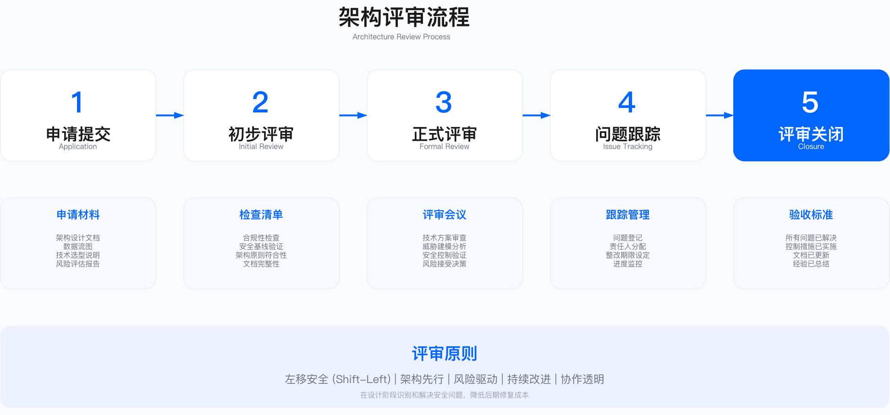

# 4.5　架构评审与验证

本节阐述安全架构评审流程、评审方法（包括安全设计评审 SDR、威胁分析、控制验证）、文档规范与评审委员会（ARB）运作机制，目标是确保架构设计质量与合规性可验证、可追溯。评审是高频、文书密集、判据可枚举的场景，本节末尾单列一节讲 AI 辅助评审能做什么、边界在哪，以及为什么最终决策权必须留在人手上。

---

## 4.5.1 安全架构评审流程

### 评审机制定义

安全架构评审（security architecture review，SAR）是一种结构化的审查机制，用于验证系统设计是否符合安全原则、满足合规要求、并将风险控制在可接受范围内。SAR 的核心价值在于将安全控制前置到设计阶段，避免开发后期或上线后发现架构性缺陷导致的高昂修复成本。

SAR 的适用边界需要明确：新系统设计、涉及敏感数据处理、暴露互联网接口、满足监管要求的场景属于强制触发范围；技术栈重大变更、第三方集成、跨境数据传输属于推荐触发范围；小规模功能迭代、配置优化、内部工具则可采用轻量评审或豁免机制。SAR 不适用于纯运维配置调整（如防火墙规则微调），此类场景应通过变更管理流程处理。

### 评审触发条件

| 触发类型 | 触发条件 | 紧急程度 | 评审深度 |
|---------|---------|---------|---------|
| 强制触发 | 新系统或重大架构变更、处理敏感数据、暴露互联网接口、监管要求 | 高 | 深度评审 |
| 推荐触发 | 技术栈重大变更、第三方集成、跨境数据传输 | 中 | 标准评审 |
| 可选触发 | 小规模功能迭代、配置优化、内部工具 | 低 | 轻量评审 |
| 周期触发 | 生产系统年度复审、关键系统季度复审 | 中 | 合规评审 |

触发条件的权衡在于：过于宽泛的强制触发会导致评审成为业务瓶颈，过于狭窄则会漏过高风险项目。建议根据组织风险偏好和安全架构师资源设定阈值，并定期根据评审积压情况调整。



### 五阶段评审流程

阶段一：申请与分级（Intake & Triage）

项目经理或架构师提交评审申请表与项目文档，安全架构办公室（SAO）进行初步评估，按风险分级（Critical/High/Medium/Low）分配评审团队。此阶段的关键约束是快速分流——延迟分级会导致评审积压。输出为评审计划与评审团队分配。

阶段二：文档审查（Document Review）

安全架构师异步审查架构文档、数据流图（DFD）、威胁模型（如有），检查文档完整性（架构图、数据流、控制清单），识别初步问题并准备评审问题清单。此阶段的常见误区是文档不完整——缺少 DFD 或信任边界标注会导致威胁分析无法有效执行。输出为初步审查报告与问题清单。

阶段三：正式评审会议（Review Meeting）

召开评审会议，参与者包括架构师、开发负责人、产品、安全、GRC、隐私等角色。会议内容包括问题讨论与澄清、风险评估与决策。此阶段的关键约束是会议效率——若问题清单未提前分发，会议将变成文档宣读而非决策讨论。输出为评审决策（通过/整改/例外）与行动项清单。

阶段四：整改跟踪（Remediation Tracking）

项目团队实施整改措施，SAO 跟踪整改进度，对关键问题进行复审，处理例外批准流程（如需要）。整改时限根据风险级别设定：Critical 级别需在较短周期内完成，High 级别次之，Medium 级别可有更长整改窗口。此阶段的常见误区是例外失控——批准后不跟踪，导致例外长期存在形成系统性风险。输出为整改证据与例外批准记录。

阶段五：关闭与归档（Closure & Archiving）

验证整改完成（测试、审计），评审正式关闭，文档归档（Confluence/Git/GRC 平台），更新经验积累（模式库、常见问题库）。此阶段的验证方法是检查整改证据是否与行动项一一对应，并通过自动化测试或人工审计确认控制已实施。输出为评审关闭报告与合规证据包。

### 风险分级标准

风险分级采用概率与影响二维矩阵，风险评分 = 概率 × 影响。分级标准决定审批权限：Critical 级别需 CEO/CISO 批准，High 级别需安全委员会批准，Medium 级别由安全架构师批准，Low 级别可由项目经理自主决策。

分级的关键约束在于：过于保守的分级会导致高层审批过载，过于激进则可能让高风险项目绕过应有的审批。验证方法是定期回顾已关闭评审的后续安全事件，评估分级准确性。

---

## 4.5.2 安全设计评审

### SDR 概述

安全设计评审（security design review，SDR）是在系统设计阶段进行的深度安全审查，关注架构设计、数据流、安全控制与威胁缓解。SDR 与 SAR 的区别在于：SAR 是流程框架，SDR 是技术评审方法。SDR 适用于需要深度技术分析的 Critical 和 High 级别项目，对于 Medium 和 Low 级别项目可采用简化版检查清单。

SDR 的适用边界包括：新产品或功能设计阶段（需求确定后、开发前）、架构重大变更（如云迁移、零信任改造）、集成第三方服务。SDR 不适用于已完成开发的系统（此时应采用渗透测试或代码审计），也不适用于纯配置变更。

### SDR 检查清单

SDR 检查清单覆盖五大维度。检查清单的价值在于提供结构化的审查框架，避免遗漏关键控制点——但检查清单不能替代威胁建模。清单验证"是否实施了控制"，威胁建模识别"应该实施哪些控制"，两者互补。

架构与设计：架构图完整性（系统上下文图、容器图、组件图、部署图）；数据流图（外部实体识别、进程/服务识别、数据存储识别、数据流与信任边界标注）；架构原则符合性（最小权限、纵深防御、职责分离、安全默认，见 4.2）；技术栈评估（使用批准的技术栈、开源组件风险评估、依赖项安全评估）。

身份与访问控制：认证机制（密码策略、MFA 强制启用范围、会话管理、防暴力破解）；授权机制（RBAC/ABAC 模型选择、细粒度权限设计、默认拒绝策略）；API 安全（OAuth 2.0/JWT 认证、Scope/Claims 授权、限流与配额）；特权访问（特权账户分离、JIT 访问、会话录制、审计日志）。

数据保护：数据分类（分类体系、敏感数据识别、数据流向映射、数据驻留要求）；加密（传输加密 TLS 1.2+、静态加密 AES-256、密钥管理 KMS/HSM）；数据最小化（保留策略、自动清理机制、脱敏/匿名化）；DLP 与监控。

网络安全：网络分段（信任边界定义、网络分区、防火墙规则、微隔离策略）；入侵防护（IDS/IPS 部署、WAF 规则配置、DDoS 防护）；安全通信（VPN/ZTNA 配置、Service Mesh mTLS、证书管理）。

应用安全：输入验证（白名单验证、参数化查询、输出编码）；会话管理（安全 Cookie 属性、CSRF Token、会话固定防护）；错误处理（统一错误处理、移除堆栈跟踪、通用错误消息）；安全 Headers（HSTS、CSP、X-Frame-Options）；依赖管理（SBOM、依赖漏洞扫描、许可证合规）。

### SDR 评审报告

被评审对象是 AI 系统时，本节流程不变、不新设关卡，只在检查清单上追加一组问题：训练与微调数据的来源和授权、模型的已知失效模式与适用边界、输出进入下游系统前的校验位置、agent 可调用工具的权限边界与回滚方式，以及下线条件。这组问题传统架构评审问不出来，因为它们指向的不是组件而是模型行为。追加项的完整清单、对应的模型卡必填字段与评审关卡的挂接方式见 [18.1 AI 安全治理框架](../../第06部分_AI驱动的安全创新/第18章_AI系统安全/18.1_AI安全治理框架.md)，威胁建模一侧的扩展见 [18.2](../../第06部分_AI驱动的安全创新/第18章_AI系统安全/18.2_AI安全架构设计与实施.md) 的 STRIDE-AI 映射。

SDR 评审报告应包含以下结构：项目信息（项目名称、评审日期、评审编号、风险级别）、评审团队（主评审员、评审员、项目团队）、系统概述、架构概览、发现问题（按严重程度分类：Critical/High/Medium/Observations）、合规性检查、评审决策（通过/有条件通过/不通过）、下一步行动、附件（威胁模型文档、数据流图、控制矩阵）。

SDR 报告的常见误区包括：问题描述过于笼统（如"缺少加密"而非"数据库连接未使用 TLS"）、未明确责任人与截止日期、建议措施不可执行（如"加强安全"而非"配置 Kong Rate Limiting 插件"）。验证方法是回顾已关闭评审，检查整改措施是否与问题一一对应且可验证。

---

## 4.5.3 架构决策记录（ADR）

### ADR 的价值与定位

架构决策记录（Architecture Decision Record，ADR）记录重大架构决策的背景、决策内容、理由、备选方案、影响与风险。这一实践与下文的模板结构，出自 Michael Nygard 2011 年 11 月的文章《Documenting Architecture Decisions》——他提出用一份份短小、带状态（proposed/accepted/deprecated/superseded）的记录代替大而无当的架构文档，字段为 Title、Status、Context、Decision、Consequences[1]。本节模板是在此基础上为安全场景补充了"合规性"与"复审周期"两项。ADR 的价值在于：

- 为后续维护人员提供决策上下文，避免"为什么这样设计"的知识流失
- 为技术债务评估提供依据，明确哪些决策可能需要重新审视
- 在架构评审中提供可追溯的决策证据

ADR 不同于架构文档——文档描述"是什么"，ADR 解释"为什么"。一个缺少 ADR 的架构，六个月后连原作者都可能忘记某个设计选择的原因。

### ADR 模板示例

```markdown
# ADR-001: 采用 OAuth 2.0 + PKCE 进行移动应用认证

## 状态
已批准（日期）

## 背景
移动应用需要安全认证机制，传统密码方式用户体验差且安全风险高。
移动端无法安全存储 Client Secret，Authorization Code Flow 存在授权码拦截风险。

## 决策
采用 OAuth 2.0 Authorization Code Flow with PKCE，替代用户名密码认证。

## 理由
- PKCE 防止授权码拦截攻击（移动应用无法安全存储 Client Secret）
- 行业标准（IETF RFC 7636），工具支持完善
- 支持 SSO，提升用户体验

## 替代方案
- 方案 A：用户名密码——被否决（安全风险高，无法防御凭证填充攻击）
- 方案 B：客户端证书——被否决（用户体验差，证书分发管理成本高）
- 方案 C：Implicit Flow——被否决（IETF 已废弃，存在 Token 泄露风险）

## 后果
- 需部署 OAuth 2.0 服务器（或使用 IdP 如 Okta/Azure AD）
- 开发周期增加（SDK 集成 + 测试）
- 长期收益：安全性提升 + 用户体验改善

## 合规性
满足 OWASP MASVS 控制类别 要求、PCI-DSS 8.2.1 要求

## 复审周期
每年复审一次，或在移动端认证协议有重大安全更新时复审
```

---

## 4.5.4 安全控制验证

### 控制验证方法

控制验证的目的是确认架构设计中规划的安全控制已正确实施且有效运行。控制验证方法应根据控制类型与生命周期阶段选择。

| 验证方法 | 适用控制类型 | 时机 | 典型工具 |
|---------|------------|------|---------|
| 代码审查 | 输入验证、加密实现、认证逻辑 | 设计与开发阶段 | GitHub PR、GitLab MR |
| 静态分析（SAST） | 代码漏洞、硬编码凭证、不安全配置 | CI/CD Pipeline | SonarQube、Checkmarx、Semgrep |
| 动态测试（DAST） | 运行时漏洞、配置错误 | 测试阶段 | OWASP ZAP、Burp Suite |
| 配置审查 | 安全基线、强化配置 | 部署前 | Chef InSpec、OpenSCAP |
| 渗透测试 | 综合安全验证 | 上线前、定期 | 人工渗透测试、自动化工具 |
| 红队演练 | 攻击链验证 | 生产环境（需授权隔离） | 红队工具包 |

控制验证的权衡在于：全面验证需要大量资源投入，选择性验证可能遗漏关键控制。建议根据风险级别确定验证深度：Critical 级别项目应进行全面验证（包括渗透测试），Medium 级别可采用 SAST/DAST + 配置审查，Low 级别可仅进行自动化扫描。

### 控制验证矩阵

控制验证矩阵将控制点与预期行为、验证方法、验证结果、证据关联，形成可追溯的验证记录。

认证与授权类控制：

| 控制点 | 预期行为 | 验证方法 |
|-------|---------|---------|
| JWT 签名验证 | 拒绝未签名或签名无效的 Token；额外覆盖拒绝 `alg:none` 与 RS256→HS256 算法混淆（用公钥当 HMAC 密钥） | 单元测试 |
| MFA 强制启用 | 管理员账户强制 MFA | 集成测试 |
| API Rate Limiting | 超过阈值返回 429 | 负载测试 |
| 权限提升防护 | 普通用户无法访问管理 API | 渗透测试 |

数据保护类控制：

| 控制点 | 预期行为 | 验证方法 |
|-------|---------|---------|
| 传输加密 | 所有连接使用 TLS 1.2+ | DAST |
| 静态加密 | 数据库数据加密存储 | 配置审查 |
| PII 脱敏 | 日志中不包含明文 PII | 日志审查 |
| 备份加密 | 备份文件加密 | 合规检查 |

控制验证的常见误区包括：验证覆盖不完整——仅验证新增控制而忽略已有控制的回归测试；验证证据不可追溯——测试报告未关联到具体控制点，无法在审计时证明合规；自动化不足——依赖人工验证导致验证周期过长或遗漏。

控制验证的运行指标：控制验证覆盖率（已验证控制数 ÷ 总控制数）；验证发现率（验证发现的问题数 ÷ 验证次数）；验证周期（从提交验证请求到完成验证的天数）。

---

## 4.5.5 架构文档规范

### 文档类型与用途

安全架构文档（SAD）：完整描述系统的安全设计，包括业务背景、安全目标、合规要求、威胁模型、安全架构设计（分层视图、身份与访问、数据保护）、安全控制矩阵、风险评估、运营安全（监控告警、事件响应、持续改进）。SAD 适用于 Critical 和 High 级别项目，是评审的核心输入文档。

架构决策记录（ADR）：记录重大架构决策的背景、决策内容、理由、备选方案、影响与风险。见 4.5.3。

安全控制文档（SCD）：针对特定系统或组件的控制实施细节，包括控制类型、实施状态、责任人、技术配置位置、测试方法、审计周期。SCD 适用于需要精细化控制管理的场景，如合规审计准备。

### 文档规范要点

文档规范的关键约束包括：文档与实现的同步——架构变更后文档未更新是最常见的问题，建议采用 architecture-as-code 方法减少文档维护负担；文档粒度的平衡——过于详细的文档维护成本高且容易过时，过于简略的文档无法支撑评审与审计。

文档规范的验证方法：在评审阶段检查文档完整性（使用检查清单确认必需章节是否存在）；在系统变更时触发文档更新流程；定期审计文档与实现的一致性。

文档规范的常见误区：文档模板过于复杂导致团队抵触——应根据项目规模提供分级模板；文档存储分散导致查找困难——应统一存储在 Confluence/Git/GRC 平台并建立索引。

---

## 4.5.6 评审委员会运作

### ARB 组织架构

架构评审委员会（architecture review board，ARB）是架构决策的最高治理机构，负责重大项目评审决策、例外批准、架构原则更新与流程改进。

ARB 采用三层结构：

决策层（ARB 委员会）：由 CISO（主席）、首席架构师、安全架构负责人、GRC 负责人、隐私官、关键业务代表组成，负责 Critical 和 High 级别项目的评审决策、例外批准、架构原则与政策更新。会议频率建议每两周一次。

运营层（安全架构办公室 SAO）：由评审协调员、文档管理员、跟踪专员组成，负责评审流程管理、文档归档、进度跟踪、例外管理。SAO 是 ARB 的日常运营支撑。

执行层（评审专家组）：由领域安全架构师（身份/网络/云/数据/应用）、威胁建模专家、安全工程师组成，负责技术评审执行、威胁分析、控制验证。

ARB 运作的关键约束：委员会成员的时间投入——高管时间有限，需确保会议高效；跨部门协作——评审需要安全、GRC、隐私、业务多方参与，协调成本较高；评审资源与业务需求的平衡——安全架构师人手不足时，评审可能成为业务瓶颈。

### ARB 会议流程

ARB 会议议程应结构化，避免会议时间浪费。典型议程：开场与议程确认 → 评审案例（按风险级别排序）→ 例外批准请求 → 整改进度回顾 → 政策与流程讨论 → 总结与行动项。

会议效率的关键在于：会前分发评审报告与问题清单，会上聚焦决策而非信息传递；每个评审案例限定时间，复杂问题可安排专题会议；会后及时发送会议纪要与行动项，明确责任人与截止日期。

ARB 运作的常见误区：评审会议变成技术讨论会——详细技术问题应在会前由评审专家组解决，ARB 会议聚焦决策；例外审批过于宽松——缺少补偿控制要求和复审机制；决策不透明——项目团队不清楚评审标准和决策依据，产生抵触情绪。

### 例外管理流程

例外是指无法满足安全控制要求但仍需上线的情况。例外管理的目的是：明确例外的风险、确保补偿控制到位、设定例外有效期、定期复审。

五步例外管理流程：

1. 例外申请：项目团队提交例外申请表，说明无法满足的控制、业务理由、请求的例外时限。
2. 风险评估：安全架构师评估例外风险（使用 DREAD 或类似方法），识别可行的补偿控制，量化残余风险。
3. 批准流程：根据风险级别确定审批权限——低风险例外由安全架构师批准，中风险例外由安全委员会批准，高风险或 Critical 例外由 CISO/CEO 批准。
4. 补偿控制实施：部署补偿控制（如加强监控、增加审计日志、缩短 token 有效期），配置相应的告警规则，设定定期复审周期。
5. 例外关闭：在例外有效期内实施永久控制，移除补偿控制，正式关闭例外。

例外管理的运行指标：例外总数、例外平均存续时间、逾期未关闭例外数、例外按期关闭率。

---

## 4.5.7 AI 辅助架构评审

前面六节讲的评审，负担几乎都压在人身上：安全架构师逐份读架构文档、对着 SDR 检查清单一条条核、翻 ADR 看决策有没有自相矛盾、把架构描述和基线控制比一比找偏差。这些活有个共同特征——高频、文书密集、判据可枚举。评审积压往往不是因为难，而是因为多：一个季度几十个项目排队等一份初审，架构师的时间被大量机械核对吃掉，真正需要人来权衡的难题反而排不上。凡是判据清晰、重复度高的核对，正是当前 LLM 能接手一部分的地方。要说清楚的是它接手的是哪一部分，以及在哪里必须停下交回给人。

### AI 能做的初审分流与一致性核对

把 AI 放进评审流程，落点是阶段一的分流和阶段二的文档审查（见 4.5.1 的五阶段），而不是阶段三的评审会议决策。几类活它做得住：

初审分流。项目提交的申请表和架构文档先过一遍 LLM，让它按已定的触发条件（4.5.1 那张触发表）判断该走深度评审、标准评审还是轻量评审，并粗筛出文档里缺失的必备件——没有数据流图、没标信任边界、没有威胁模型。这一步把明显不完整的申请挡在架构师排期之外，退回补齐，省下的是架构师"打开文档发现啥都没有"的那次无效读取。

检查清单自动核对。SDR 检查清单的五大维度（架构、身份、数据、网络、应用）里，相当一部分条目是"文档中是否描述了某控制"这类可判定问题：有没有写传输加密用 TLS 1.2+、有没有提 MFA 强制范围、错误处理有没有说移除堆栈跟踪。让 LLM 对着清单逐条在文档里找证据，标出"已描述/未描述/描述不清"，产出一份带原文出处的核对表。架构师不再从零核对，而是复核 AI 标红的条目。

ADR 一致性校验。一个项目往往有多份 ADR，时间跨度长，容易出现后面的决策悄悄推翻前面的、或两份 ADR 对同一问题给出冲突选型。LLM 擅长在长文本里找这类矛盾：ADR-003 说统一用 OAuth 2.0，ADR-007 的某方案却假设了 Session 认证——把这种前后不一致挑出来交人判断。

基线偏差比对。组织有基线控制集（批准的技术栈、加密标准、网络分段要求），把架构描述和基线逐条比对、列出偏差，是典型的规则可枚举任务。AI 生成偏差清单，每条注明架构里的说法和基线的要求，架构师据此决定是要求整改还是走例外流程（4.5.6 的例外管理）。

这几类的共性是：判据来自已有的清单、基线、历史 ADR，AI 做的是"比对与找不一致"，产出的是带出处的候选清单，不是结论。

### agentic 评审预审

单个 LLM 把整份架构从头核到尾，维度一多就容易顾此失彼——核着数据保护漏了网络分段，或者对合规条款一带而过。更贴合评审专家组分工（4.5.6 执行层按身份/网络/云/数据/应用分领域）的做法，是让多个专职智能体各审一个维度，各自对着自己维度的清单和基线跑，最后汇总成一份预审报告交 ARB。这是 17.2.4 讨论的多智能体编排在架构评审域的具体落地，机理不在此复述。

```
              架构文档 + DFD + ADR + 基线控制集
                          │
          ┌───────┬───────┼───────┬────────┐
          ▼       ▼       ▼       ▼        ▼
       ┌──────┐┌──────┐┌──────┐┌──────┐┌──────┐
       │身份  ││数据  ││网络  ││合规  ││ ...  │
       │agent ││agent ││agent ││agent ││      │
       └──┬───┘└──┬───┘└──┬───┘└──┬───┘└──┬───┘
          │       │       │       │       │
        各维度发现（带原文出处 + 基线条目引用）
          └───────┴───┬───┴───────┴───────┘
                      ▼
              ┌───────────────┐
              │  汇总 agent    │  去重、按维度归类、
              │ （预审报告）    │  标严重度、附证据链
              └───────┬───────┘
                      ▼
              预审报告 ──► ARB / 评审专家组（人做最终评审）
```

各维度 agent 的输入不止架构文档。要判准偏差，agent 得能拿到项目真实的上下文——用的是哪个云账号、实际的网络拓扑、依赖了哪些组件。一些厂商在往这个方向做：Wiz 的 AI 能力（厂商称，需自证）主打 code-to-cloud 上下文注入，即把代码仓库、IaC、云上实际配置的上下文喂给评审，让 AI 看到的不只是架构图上画的、而是云上真在跑的，从而发现"文档说做了分段、实际安全组全开"这类图实不符。一般的 AI 架构评审能力（各厂商称，需自证）也多围绕这条：把散落的上下文聚到一起供 LLM 比对。选型时对这类宣称要能自证——让厂商在你自己的一个真实项目上跑一遍，看它挑出的偏差有多少是真的、漏了多少人能一眼看到的。

### 能力边界：清单它在行，权衡它不行

AI 在架构评审里的两面必须都说清，否则很容易高估。

它在行的是有明确判据的核对：清单条目在不在、ADR 前后一不一致、架构描述和基线差在哪。这些任务答案相对客观，可以给出出处，错了也容易被人当场发现。

它不在行的是权衡取舍和新型风险判断。评审里真正难的部分——这个可用性与隔离的折衷该不该接受、这套非标架构在业务约束下的残余风险能不能容忍、某个隐含假设一旦不成立会塌到什么程度——都不是核对清单能覆盖的，需要人对业务、威胁、成本三头的综合判断。对没见过的架构范式，AI 缺少可比对的基线，容易要么放过要么误报；对文档里没写明、靠经验才能补出的隐含假设，它常常整段漏掉。多智能体还会放大这一点：一个维度 agent 的漏判或幻觉，会被汇总 agent 当成可信输入并入报告，错误沿链传播且越往后越像真的——这和 11.4.6 讲多智能体自主狩猎时的失效模式同源，验证与人工复核不能省。

一句话，AI 把"该核对的都核对到了"这件事做得更快更全，但"核对出的东西意味着什么、该怎么决策"仍然是人的活。

### 人在回路的红线

ARB 的最终评审决策权不下放，是这一节的硬约束。AI 与多智能体只做预审与分流，产出的是候选清单和预审报告；通过/整改/例外的评审决策（4.5.1 阶段三、4.5.6 的 ARB 会议与例外批准），必须由人做出。理由和红线的判据在 11.4.6 已经说明——动作的爆炸半径与可逆性：一份评审结论直接决定系统能否上线、例外能否批准，可逆性低、影响面大，正是必须由人做出决定的那类动作。

具体划线：AI 可自主执行文档初筛、清单核对、ADR 一致性检查、基线偏差比对，产出带出处的候选清单。以下不得自动，必须人工复核后决策：把某项偏差判定为可接受或必须整改、批准任何例外、给出项目的最终评审结论、把 AI 的发现直接升级为对项目团队的整改要求。预审报告是给 ARB 和评审专家组减负的输入，不是代替他们的判断。承接这条红线，评审记录里要能分清哪些结论来自 AI 预审、哪些经过人工复核确认——AI 标出的偏差若未经人复核就进了正式评审决策，一旦误报会污染整个评审的可信度。

引入 AI 辅助评审本身也要过评审：评审智能体消费架构文档、云上配置、代码仓库这些高敏上下文，它自己就是一个新的攻击面，被污染数据或提示注入后可能被诱导去检索、外泄不该碰的东西，其防御机理见 18.3。评审中的威胁分析仍以 4.3 的方法为准，AI 辅助评审常包含对既有威胁模型的复核——用 AI 检查威胁模型是否覆盖了架构里的新增数据流和信任边界，与 4.3 交叉使用，此处不复述威胁建模方法本身。

---

## 4.5.8 本节小结

### 核心实践要点

评审流程标准化是架构安全治理的基础。五阶段评审流程（申请分级、文档审查、正式评审、整改跟踪、关闭归档）确保评审的一致性与可追溯性。流程设计的关键在于平衡严谨性与效率——过于繁琐的流程会被绕过，过于简单的流程无法发现问题。

SDR 检查清单覆盖架构、身份、数据、网络、应用五大维度，但检查清单不能替代威胁建模（见 4.3）。检查清单验证"是否实施了控制"，威胁建模识别"应该实施哪些控制"，两者结合才能有效降低架构风险。

控制验证需要多种方法组合。代码审查、SAST/DAST、配置审查、渗透测试各有适用场景，应根据项目风险级别选择验证深度。验证结果需要可追溯——控制验证矩阵将控制点、预期行为、验证方法、验证结果、证据关联起来。

文档规范确保评审可执行、审计可支撑。SAD、ADR、SCD 三类文档覆盖架构设计、决策记录、控制细节。文档规范的挑战在于与实现的同步——建议采用 architecture-as-code 减少维护负担。

ARB 运作需要明确的分层结构与决策权限。决策层聚焦重大决策与例外批准，运营层负责流程管理，执行层执行技术评审。例外管理是 ARB 的关键职能，需要严格的风险评估、补偿控制与复审机制。

AI 可承接评审中高频、判据可枚举的核对工作——初审分流、SDR 清单核对、ADR 一致性校验、基线偏差比对，多个专职智能体分维度预审再汇总成预审报告。但它擅长的是清单核对与一致性检查，不擅长权衡取舍与新型架构风险判断。ARB 的最终评审决策权不下放，AI 只做预审与分流，通过/整改/例外仍由人决策（见 4.5.7）。

### 常见陷阱与规避

评审流于形式是最常见的陷阱。规避方法：使用结构化检查表、要求输出威胁模型与 ADR、定期审计评审质量。

文档不及时更新导致文档与实际脱节。规避方法：在系统变更时触发文档更新流程、采用 architecture-as-code、定期审计文档一致性。

例外失控导致系统性风险积累。规避方法：严格的例外审批流程、强制补偿控制、设定例外有效期、定期复审未关闭例外。

评审资源不足导致评审成为业务瓶颈。规避方法：根据风险级别分层评审（Critical 深度评审、Low 自动化检查）、培养更多安全架构师、引入自动化工具辅助评审。

验证不充分导致控制未真正有效。规避方法：将威胁模型中的高风险威胁纳入渗透测试范围、建立控制验证矩阵、上线后监控控制有效性。

### 验证方法与运行指标

验证方法：回顾已关闭评审的后续安全事件，评估评审是否遗漏关键风险；审计例外管理记录，检查例外是否按期关闭且补偿控制到位；定期抽查评审文档质量，确认检查清单完整性。

运行指标：架构评审覆盖率（已评审项目数 ÷ 重大项目总数）、评审问题发现率（评审发现问题数 ÷ 项目总数）、评审周期达成率（按时完成评审 ÷ 总评审数）、例外按期关闭率、高风险威胁缓解率。

---

## 4.5.9 延伸阅读

### 行业标准

NIST SP 800-160 Vol. 1 Rev. 1《Engineering Trustworthy Secure Systems》（2022 年 11 月修订）提供了安全评审的系统工程视角[2]。ISO/IEC 27034 Application Security 包含架构评审指南。TOGAF 提供了 architecture review process 的通用方法（对应 ADM 的架构治理与合规评审环节）。SABSA 提供了 security architecture review framework。另一条常被忽略的路线是卡内基梅隆大学 SEI 的 ATAM（Architecture Tradeoff Analysis Method）——它以质量属性场景驱动评审，专门用于把架构决策中相互冲突的质量目标（安全、性能、可用性）显式摆到台面上做权衡，与本节以清单为主的 SDR 形成互补[3]。

### 工具参考

评审管理工具：Jira、ServiceNow、Confluence。威胁建模工具：Microsoft Threat Modeling Tool、IriusRisk、Threagile（见 4.3.6）。文档协作工具：Confluence、Notion、GitBook。合规管理工具：OneTrust、Vanta、Drata。

### 相关章节

- 前置：4.2 架构设计原则（提供评审基准）
- 前置：4.3 威胁建模（提供评审中的威胁分析方法）
- 后续：4.6 技术选型与决策（评审中的技术评估）
- 相关：第11章安全运营（评审后的持续监控）

---

## 参考文献

| # | 来源 | 标题 | 日期 | 链接 |
| --- | --- | --- | --- | --- |
| [1] | Michael Nygard | Documenting Architecture Decisions：ADR 实践与 Title/Status/Context/Decision/Consequences 模板；状态取值 proposed / accepted / deprecated / superseded | 2011-11-15 | <https://cognitect.com/blog/2011/11/15/documenting-architecture-decisions.html> |
| [2] | NIST | SP 800-160 Vol. 1 Rev. 1《Engineering Trustworthy Secure Systems》 | 2022-11-16 | <https://csrc.nist.gov/pubs/sp/800/160/v1/r1/final> |
| [3] | R. Kazman, M. Klein, P. Clements（Carnegie Mellon University SEI） | ATAM: Method for Architecture Evaluation，CMU/SEI-2000-TR-004：以质量属性场景驱动的架构权衡评估方法 | 2000-08 | <https://www.sei.cmu.edu/library/atam-method-for-architecture-evaluation> |

---

## 导航

[← 上一节：4.4 安全架构模式](./4.4_安全架构模式.md) | [返回章节目录](./README.md) | [下一节：4.6 技术选型与决策 →](./4.6_技术选型与决策.md)

---

© 2025-2026 AISecOps Project. Licensed under CC BY-NC-SA 4.0
