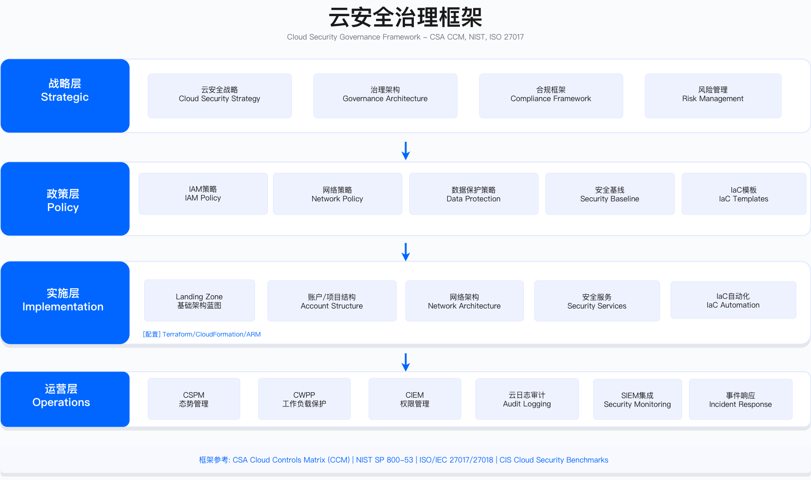

# 4.7　安全参考架构

> 本节目标：掌握网络、云、应用、数据、零信任五大领域的安全参考架构，理解架构模式、控制要点与实施约束，指导企业级安全架构设计与落地。

参考架构不是照抄的蓝图，而是把行业里反复验证过的控制结构固化下来，供在自身场景中裁剪使用。各节架构图回答的都是同一组问题：信任在哪里划界、流量在哪里被检查、控制点如何分层、责任如何切分。图中的具体产品名是同类能力的代表，核心是层与层之间的关系，以及每一层解决什么威胁。

---

## 4.7.1 网络安全参考架构

### 传统网络安全架构

传统网络安全架构以边界防御为核心思路，采用分层分区设计。该架构假设内网相对可信、外网不可信，通过边界设备（防火墙、IDS/IPS、VPN 网关）控制南北向流量，DMZ 层承载对外服务，内网层进一步划分应用区、数据区、管理区与用户区。

该模型至今仍是绝大多数企业网络的现实底色，也是理解零信任为什么出现的参照系。它的设计哲学可以概括为一句话：把网络切成同心圆，越靠内圈越可信，把最强的检查资源集中堆在最外圈的"城墙"上。下面这张图从上到下就是这道城墙由外向内的三道关卡。

```
三层网络安全架构

Internet
   │
   ▼
┌─────────────────────────────────────────────────────────────┐
│ 边界层 (Perimeter Layer)                                     │
│ ·边界防火墙(Stateful Firewall)                               │
│ ·IDS/IPS(入侵检测与防护)                                      │
│ ·DDoS 防护(流量清洗)                                         │
│ ·VPN 网关(远程接入)                                          │
└─────────────────┬───────────────────────────────────────────┘
                  │
                  ▼
┌─────────────────────────────────────────────────────────────┐
│ DMZ 层 (Demilitarized Zone)                                  │
│ ·Web 服务器                                                  │
│ ·反向代理(Nginx/Apache)                                      │
│ ·WAF(Web 应用防火墙)                                         │
│ ·堡垒机(Bastion Host)                                        │
│ ·邮件网关                                                    │
└─────────────────┬───────────────────────────────────────────┘
                  │
                  ▼
┌─────────────────────────────────────────────────────────────┐
│ 内网层 (Internal Network)                                    │
│                                                              │
│ ┌───────────────────┐  ┌────────────────────┐              │
│ │ 应用区 (App Zone) │  │ 数据区 (Data Zone) │              │
│ │ ·应用服务器        │  │ ·数据库服务器       │              │
│ │ ·中间件           │  │ ·文件服务器         │              │
│ │ ·API 服务         │  │ ·备份系统          │              │
│ └───────────────────┘  └────────────────────┘              │
│                                                              │
│ ┌───────────────────┐  ┌────────────────────┐              │
│ │ 管理区(Mgmt Zone) │  │ 用户区(User Zone)   │              │
│ │ ·监控系统          │  │ ·办公终端          │              │
│ │ ·日志服务器        │  │ ·打印机            │              │
│ │ ·AD/LDAP          │  │ ·会议系统          │              │
│ └───────────────────┘  └────────────────────┘              │
└─────────────────────────────────────────────────────────────┘
```

这张图有两个层次要分开看。纵向（边界层→DMZ→内网）是南北向流量的过滤链：外部请求先经过边界层的防火墙与 DDoS 清洗，再进入 DMZ 这个"半可信缓冲区"——DMZ 的定位很关键，它专门放置必须对外暴露的服务（Web、邮件、反向代理），一旦这些服务被攻破，攻击者拿到的只是 DMZ 的立足点而非直接的内网访问权。横向（内网层里的四个分区）则是内部资产的隔离：把数据库与办公终端放进不同区域，正是为了让用户区一台中招的办公机无法直接触达数据区。注意管理区（监控、日志、AD/LDAP）单独成区——身份目录与日志是攻击者最想染指的目标，把它们与业务流量隔开是这套模型少有的、和现代思路仍然一致的做法。

这套内网四分区是按**功能**切的：应用、数据、管理、用户各占一块，回答的是"东西放在哪里"。15.1.3 给出的是另一把尺子——按**被攻陷后的影响面**划分关键控制域、高敏数据域、业务生产域、办公终端域、非受管域五个信任域，并配一张 5×5 的跨域默认策略矩阵，回答的是"谁能到谁"。两把尺子不互斥：功能分区决定资产的落位，信任域决定跨区访问的默认值，同一个资产同时有一个分区归属和一个信任域标签。信任域模型更容易直接转成可执行策略，原因在划分依据上——备份系统、EDR 管理台、UEM 服务器按功能会被一并扔进管理区，按影响面却应当与域控同级，因为攻破其中任何一个都能反向控制其他域。已按四分区建成的环境不必推倒重来：在现有分区之上叠加信任域标签，用矩阵替代逐条工单审批即可，划分标准与矩阵见 [15.1](../../第05部分_身份网络与业务连续性/第15章_网络基础设施与终端安全/15.1_企业网络安全架构.md)。

适用边界：传统数据中心、工业控制网络（OT）、对稳定性要求高于敏捷性的场景。该架构假设内网可信度高于外网——对于已经大量采用 SaaS、远程办公、多云部署的企业，边界模型的有效性显著下降。

关键约束：边界设备成为单点瓶颈与单点故障源；横向移动检测能力弱；VPN 接入后用户获得较大内网访问权限，与 4.2 最小权限原则冲突——这是驱动零信任演进的核心矛盾。

这三条约束不是孤立的缺陷，而是"同心圆信任"这一根本假设的必然产物：既然只在城墙上设卡，城墙自然成为瓶颈；既然默认内网可信，城墙之内就缺乏检查手段，横向移动才难以察觉；既然 VPN 的语义是"接入内网"，一旦接入用户就自动获得了整个圈层的信任。把这三点连起来看，就能理解下一小节的零信任推翻的是"信任按网络位置授予"这一前提本身，而非对边界模型的修补。

### 现代网络安全架构（零信任）

零信任网络架构不再依赖网络边界划分信任域，而是将身份验证、设备信任评估、策略决策与策略执行解耦为独立层次。每次访问请求均需经过身份与信任评估层、策略决策层、策略执行层的验证，横向流量同样经过微隔离策略引擎校验（零信任原则详见 4.1.5，具体实现模式见 4.4.1）。

对照上一小节的城墙模型，这里最本质的变化是：信任不再来自"你在网络的哪个位置"，而来自"每一次请求发生时，你的身份、设备状态和风险是否都通过了校验"。把验证逻辑拆成独立层次的目的，是让身份、策略、执行三者各自演进、各自扩展——这既是设计上的优点，也带来了后面要谈的复杂度成本。


```
零信任网络架构

Internet
   │
   ▼
┌─────────────────────────────────────────────────────────────┐
│ 边缘服务层 (Edge Services)                                   │
│ ·CDN + DDoS 防护(Cloudflare/Akamai)                         │
│ ·全球负载均衡(GSLB)                                          │
│ ·Bot 防护                                                    │
└─────────────────┬───────────────────────────────────────────┘
                  │
                  ▼
┌─────────────────────────────────────────────────────────────┐
│ 身份与访问层 (Identity & Access Layer)                       │
│ ·身份提供商(IdP - Okta/Azure AD)                             │
│ ·零信任网关(ZTNA Gateway)                                    │
│ ·策略决策点(PDP - OPA/Styra)                                 │
│ ·设备信任评估                                                │
└─────────────────┬───────────────────────────────────────────┘
                  │
                  ▼
┌─────────────────────────────────────────────────────────────┐
│ 策略执行层 (Policy Enforcement Layer)                        │
│ ·API 网关(Kong/Apigee)                                       │
│ ·Service Mesh(Istio/Linkerd)                                │
│ ·策略执行点(PEP)                                             │
│ ·微隔离控制器                                                │
└─────────────────┬───────────────────────────────────────────┘
                  │
      ┌───────────┼───────────┐
      │           │           │
      ▼           ▼           ▼
┌──────────┐ ┌──────────┐ ┌──────────┐
│ 应用      │ │ 数据     │ │ 基础设施  │
│ Workload │ │ Workload │ │ Workload │
│          │ │          │ │          │
│ ·mTLS    │ │ ·加密    │ │ ·加固    │
│ ·日志    │ │ ·审计    │ │ ·监控    │
└──────────┘ └──────────┘ └──────────┘

横向流量全部经过微隔离策略引擎验证
```

读这张图的钥匙是分清 PDP（策略决策点） 与 PEP（策略执行点） 这一对概念。身份与访问层里的 PDP 负责"判断"——它汇集身份、设备信任、风险信号，回答"这次访问该不该放行、放行到什么程度"；策略执行层里的 PEP 负责"落实"——API 网关、Service Mesh 把 PDP 的裁决真正加到每一条请求上。决策与执行分离是零信任区别于传统防火墙的技术要害：防火墙把规则和执行焊死在一台设备里，而这里的判断逻辑可以集中演进，执行点可以贴着每个工作负载分散部署。图最下方"横向流量全部经过微隔离策略引擎验证"这一行是与城墙模型的分水岭——它意味着即便两个服务同处内网，彼此通信也要过策略引擎，"内网默认可信"被彻底取消。工作负载方框里的 mTLS、加密、加固则说明保护一直延伸到最里层，而非止步于网关。

适用边界：云原生环境、远程办公场景、多云/混合云架构、需要细粒度访问控制的高安全等级系统。对于仍以本地数据中心为主、应用改造能力有限的组织，零信任架构需要渐进式实施（参考 4.1.5 的四阶段路径）。

关键约束：需要统一身份基础设施（IdP），碎片化的身份系统是零信任实施的主要障碍；设备信任评估依赖终端管理能力；策略引擎的性能与可用性直接影响用户体验；初期部署成本与复杂度较高。

这里要特别点出"策略引擎的性能与可用性直接影响用户体验"这条约束的生产含义：当每一次访问都要过 PDP，PDP 就从一个旁路组件变成了业务链路上的关键路径。它一旦变慢，全公司的访问都跟着变慢；它一旦宕机，就要面对一个残酷的二选一——fail-open（放行以保业务）还是 fail-close（拒绝以保安全）。这个选择在 4.7.5 会再次出现，说明它是零信任落地绕不开的工程决策，而不是可以事后补上的细节。

常见误区：将零信任等同于部署 ZTNA 产品——零信任是架构理念而非单一产品；忽视遗留应用改造，无法接入身份层的应用仍保持传统访问模式，形成架构漏洞；过度依赖厂商方案而忽视内部策略定义能力建设。

### 网络分段策略

网络分段是控制横向移动的基础手段。无论传统架构还是零信任，"限制被攻破后的爆炸半径"这一目标是共通的，区别只在于用多细的粒度去切。下表把四种分段技术按粒度从粗到细排列，帮助你在成本、隔离强度、运维复杂度之间做取舍。

| 分段类型 | 目的 | 技术实现 | 适用场景 |
|---------|------|---------|---------|
| 物理分段 | 完全隔离 | 独立网络设备、物理隔离 | 关键基础设施、OT 网络 |
| VLAN 分段 | 二层隔离 | VLAN + ACL | 中小企业、园区网 |
| 子网分段 | 三层隔离 | 路由 + 防火墙 | 数据中心、云网络 |
| 微隔离 | 工作负载级隔离 | 主机代理（企业内部东西向的主流路线）、SDN、eBPF、Service Mesh | 企业内部东西向；容器环境用 NetworkPolicy / Service Mesh |

该表呈现了从粗粒度到细粒度的分段演进路径。表格的四行是一条隐含的权衡曲线，不是"越往下越好"的排名：往下走隔离粒度越细、越接近零信任"每个工作负载独立成域"的理想，但代价是对自动化运维能力的要求陡增——微隔离靠手工维护策略几乎不可行，需要由控制面把策略随工作负载动态下发。落地路线有两条：**企业内部的东西向隔离以主机代理式为主流**（策略跟着工作负载走，不依赖网络改造），容器环境则用 NetworkPolicy 或 Service Mesh（见 5.3.2）；把容器场景硬塞进主机代理体系通常得不偿失。工程选型与分阶段实施见 15.2。物理分段提供最强隔离但成本最高、灵活性最低；微隔离提供最细粒度控制但对运维自动化能力要求高。多数企业采用混合策略：关键系统物理隔离、一般业务系统 VLAN/子网分段、云原生工作负载微隔离。关键原则是：分段的粒度应与横向移动的潜在爆炸半径相匹配——数据区与用户区之间应有比应用服务之间更强的隔离。这条原则给了你一把标尺：不必对所有资产用最贵的分段，而是让隔离强度对齐资产被攻破后可能造成的损失。

验证方法：通过渗透测试验证分段有效性，从低敏感区域尝试横向移动至高敏感区域；使用网络流量分析工具检查是否存在绕过分段策略的异常流量；定期审计 ACL/防火墙规则的实际生效状态。

运行指标：横向移动尝试检测率；分段策略违规告警数量；规则审计覆盖率。

以上是分段的架构形态。本地与混合环境下的工程落地分在三处：信任域划分标准与跨域策略矩阵见 [15.1](../../第05部分_身份网络与业务连续性/第15章_网络基础设施与终端安全/15.1_企业网络安全架构.md)；分段技术选型、实施成本曲线与从观察到强制的推进路径见 [15.2](../../第05部分_身份网络与业务连续性/第15章_网络基础设施与终端安全/15.2_网络分段与微隔离工程.md)；南北向边界设备与流量检测见 [15.3](../../第05部分_身份网络与业务连续性/第15章_网络基础设施与终端安全/15.3_边界与流量防护.md)。

### 网络控制清单

以下控制清单作为架构评审与运营自检的参考基线，具体控制项需根据组织风险偏好与合规要求裁剪：

清单的价值在于把散落的控制点归成三大类，让评审时不至于漏项。这三类恰好对应"挡在外面（边界控制）—管住里面（内网控制）—看得清楚（监控与可见性）"的完整闭环：光有边界和内网控制而没有可见性，等于装了锁却没有监控录像，攻击一旦绕过前两类就再也无从察觉。用这份清单时应逐项打勾并标注"已实施/部分实施/未实施"，把空白项转成风险登记，而不是把它当成一次性的对照表。

```
网络安全控制矩阵

┌─────────────────────────────────────────────────────────────┐
│ 边界控制 (Perimeter Controls)                                │
├─────────────────────────────────────────────────────────────┤
│ □ 边界防火墙(下一代防火墙, NGFW)                              │
│ □ IDS/IPS(网络入侵检测与防护)                                │
│ □ DDoS 防护(Scrubbing Center + 本地防护)                    │
│ □ WAF(Web 应用防火墙, OWASP Top 10 规则)                     │
│ □ VPN/ZTNA(远程接入, 强认证 + MFA)                           │
│ □ 邮件网关(反垃圾邮件，反钓鱼，沙箱)                          │
└─────────────────────────────────────────────────────────────┘

┌─────────────────────────────────────────────────────────────┐
│ 内网控制 (Internal Network Controls)                         │
├─────────────────────────────────────────────────────────────┤
│ □ 网络分段(DMZ/App/Data/Mgmt 分离)                           │
│ □ 微隔离(工作负载级别策略)                                    │
│ □ NAC(网络准入控制, 802.1X)                                  │
│ □ 内网防火墙(区域间流量控制)                                  │
│ □ 横向移动检测(异常流量分析)                                  │
└─────────────────────────────────────────────────────────────┘

┌─────────────────────────────────────────────────────────────┐
│ 监控与可见性 (Monitoring & Visibility)                       │
├─────────────────────────────────────────────────────────────┤
│ □ NetFlow/sFlow 采集                                         │
│ □ 全流量分析(NTA - Network Traffic Analysis)                 │
│ □ DNS 监控(恶意域名检测)                                     │
│ □ 异常流量告警(基于行为基线)                                  │
│ □ 网络拓扑可视化                                              │
└─────────────────────────────────────────────────────────────┘
```

---

## 4.7.2 云安全参考架构

云安全架构的核心挑战在于跨账户/订阅的统一治理、共享责任模型下的控制边界划分、以及原生安全服务与第三方工具的集成。以下分别呈现 AWS、Azure、GCP 三大平台的参考架构，重点说明组织结构、网络隔离与安全服务集成。

三张平台图形态各异，但都在回答同样的三个问题，读图时不妨带着这条主线去对照：第一，账户/项目怎么分层（治理边界），第二，网络怎么隔离（爆炸半径控制），第三，安全服务如何统一挂载（可见性）。抓住这条主线，就会发现三家云只是用不同的原语实现了相同的架构意图，选型时真正比较的是原语的成熟度与你团队的熟悉度，而非孰优孰劣。



### AWS 安全参考架构

AWS 多账户架构通过 AWS Organizations 实现集中治理，Security OU 承载日志归档、安全工具与审计账户，Production/Stage/Dev OU 按环境隔离工作负载。每个生产账户内部采用 VPC 三层子网设计（Public/Private-App/Private-Data），通过 Security Group 实现应用级访问控制。

AWS 选择"多账户"而非"单账户多标签"作为隔离单位，背后的逻辑是把账户当成天然的爆炸半径边界——一个账户被攻破，权限默认不外溢到其他账户。下图分上下两段：上段是治理结构（谁管谁），下段是单个生产账户内部的网络分层（流量怎么走）。

```
AWS Multi-Account 安全架构

┌─────────────────────────────────────────────────────────────┐
│                  AWS Organizations                           │
│                   (组织根)                                    │
└─────────────────┬───────────────────────────────────────────┘
                  │
      ┌───────────┼───────────┬───────────┐
      │           │           │           │
      ▼           ▼           ▼           ▼
┌──────────┐ ┌──────────┐ ┌──────────┐ ┌──────────┐
│ Security │ │  Prod    │ │  Stage   │ │   Dev    │
│  OU      │ │   OU     │ │   OU     │ │   OU     │
└────┬─────┘ └────┬─────┘ └────┬─────┘ └────┬─────┘
     │            │            │            │
     ▼            ▼            ▼            ▼
┌─────────────────────────────────────────────────────────────┐
│ 安全账户 (Security Accounts)                                 │
│ ·Log Archive Account(集中日志)                               │
│ ·Security Tooling Account(安全工具)                          │
│ ·Audit Account(合规审计)                                     │
└─────────────────────────────────────────────────────────────┘

┌─────────────────────────────────────────────────────────────┐
│ 生产账户 (Production Accounts)                               │
│                                                              │
│ VPC (Virtual Private Cloud)                                 │
│ ┌───────────────────────────────────────────────────────┐  │
│ │ Public Subnet                                         │  │
│ │ ·ALB(Application Load Balancer)                       │  │
│ │ ·NAT Gateway                                          │  │
│ │ ·Bastion Host                                         │  │
│ └───────────────────────────────────────────────────────┘  │
│                                                              │
│ ┌───────────────────────────────────────────────────────┐  │
│ │ Private Subnet - App Tier                             │  │
│ │ ·EC2/ECS/EKS(应用工作负载)                             │  │
│ │ ·Security Group(应用级防火墙)                          │  │
│ │ ·WAF(Web 应用防火墙)                                   │  │
│ └───────────────────────────────────────────────────────┘  │
│                                                              │
│ ┌───────────────────────────────────────────────────────┐  │
│ │ Private Subnet - Data Tier                            │  │
│ │ ·RDS Multi-AZ(关系数据库)                              │  │
│ │ ·ElastiCache(缓存)                                     │  │
│ │ ·加密(静态加密 + 传输加密)                             │  │
│ └───────────────────────────────────────────────────────┘  │
└─────────────────────────────────────────────────────────────┘

┌─────────────────────────────────────────────────────────────┐
│ 安全服务 (Security Services)                                 │
│ ·GuardDuty(威胁检测)                                         │
│ ·Security Hub(安全态势管理)                                  │
│ ·Config(配置合规检查)                                        │
│ ·CloudTrail(API 审计日志)                                    │
│ ·Inspector(漏洞扫描)                                         │
│ ·Macie(数据安全与隐私)                                       │
│ ·Systems Manager(补丁管理)                                   │
└─────────────────────────────────────────────────────────────┘
```

治理段的关键在于把 Security OU 与业务 OU（Prod/Stage/Dev）平级并列：安全账户不隶属于任何业务环境，日志归档、安全工具、审计各自独立成账户。这样设计是为了让日志的写入方（业务账户）无权删改日志的存储方（Log Archive Account），从制度上切断"入侵者删日志灭迹"的路径。网络段则是上一节"子网分段"原则在 AWS 上的具体落地——Public/App/Data 三层子网对应外部接入、应用计算、数据存储，Data Tier 不直接对外，只能由 App Tier 访问，这正是把数据放在同心圆最内圈的做法。底部的安全服务是横切三个账户层的可见性平面，可理解为网络控制清单里"监控与可见性"那一类在云上的托管实现。

适用边界：AWS 单云或以 AWS 为主的多云环境。已签署 AWS Enterprise Agreement 且具备 IaC 能力的团队可充分利用 Control Tower 实现自动化 Landing Zone 部署。

关键约束：多账户架构增加了网络互联复杂度（Transit Gateway 成本与配置）；跨账户 IAM 信任关系需要严格管控；日志归档账户的 S3 Bucket 需启用 MFA Delete 与 Object Lock 防止篡改——这是满足合规要求"日志不可篡改"的关键配置，容易在初始部署时被遗漏。

最后一条约束是生产环境里反复踩到的坑，值得单独强调：图上把 Log Archive Account 单列出来只是"账户层面"的隔离，若不在存储桶上再叠加 MFA Delete 与 Object Lock，拿到该账户高权限的攻击者依然能删日志。换句话说，账户隔离与对象不可变是两道不同的门，缺一不可，而后者恰恰因为不影响日常功能，最容易在初始部署时被略过。

### Azure 安全参考架构

Azure Landing Zone 采用 Management Group 层级结构，Platform Management Group 承载网络中心（Connectivity）、身份（Identity）与管理（Management）订阅，Prod/Non-Prod Workloads Group 承载业务工作负载。网络架构采用 Hub-Spoke 模型，Azure Firewall 部署于中心 Hub VNet，各 Spoke VNet 通过 VNet Peering 接入。

Azure 的对应物是 Management Group + 订阅，思路与 AWS 一脉相承：用层级容器承载治理策略，用独立单位隔离工作负载。它的网络模型与 AWS 略有差异——采用 Hub-Spoke，把公共安全设施（防火墙、VPN、堡垒）集中在 Hub，业务网络作为 Spoke 挂接，读图时重点看这个"中心辐射"的拓扑。

```
Azure Landing Zone 安全架构

Management Group Hierarchy
┌─────────────────────────────────────────────────────────────┐
│                    Root Management Group                     │
└─────────────────┬───────────────────────────────────────────┘
                  │
      ┌───────────┼───────────┬───────────┐
      │           │           │           │
      ▼           ▼           ▼           ▼
┌──────────┐ ┌──────────┐ ┌──────────┐ ┌──────────┐
│Platform  │ │ Prod     │ │ Non-Prod │ │ Sandbox  │
│Management│ │Workloads │ │Workloads │ │          │
│ Group    │ │  Group   │ │  Group   │ │          │
└────┬─────┘ └────┬─────┘ └────┬─────┘ └──────────┘
     │            │            │
     ▼            ▼            ▼
┌─────────────────────────────────────────────────────────────┐
│ 平台订阅 (Platform Subscriptions)                            │
│ ·Connectivity(网络中心)                                      │
│ ·Identity(Azure AD，密钥管理)                                │
│ ·Management(监控，日志，自动化)                               │
└─────────────────────────────────────────────────────────────┘

┌─────────────────────────────────────────────────────────────┐
│ Hub-Spoke 网络架构                                           │
│                                                              │
│              Hub VNet (中心网络)                             │
│         ┌────────────────────────┐                          │
│         │ ·Azure Firewall         │                          │
│         │ ·VPN Gateway            │                          │
│         │ ·Bastion                │                          │
│         │ ·DDoS Protection        │                          │
│         └────────┬───────────────┘                          │
│                  │                                           │
│       ┌──────────┼──────────┐                               │
│       │          │          │                               │
│  Spoke VNet  Spoke VNet  Spoke VNet                         │
│  (Prod 1)    (Prod 2)    (Non-Prod)                         │
│    │            │            │                               │
│    └────────────┴────────────┘                               │
│         Workload Subnets                                     │
└─────────────────────────────────────────────────────────────┘

┌─────────────────────────────────────────────────────────────┐
│ 安全服务 (Security Services)                                 │
│ ·Defender for Cloud(CSPM + CWPP)                            │
│ ·Sentinel(SIEM)                                              │
│ ·Key Vault(密钥与证书管理)                                   │
│ ·Policy(策略即代码，合规强制)                                  │
│ ·Entra ID(身份与访问)                                        │
│ ·Purview(数据治理)                                           │
└─────────────────────────────────────────────────────────────┘
```

Hub-Spoke 的核心用意是共享设施集中、业务网络隔离：Azure Firewall、VPN Gateway 这类昂贵且需统一策略的组件只在 Hub 部署一份，各 Spoke 通过 VNet Peering 借用，既省成本又保证所有跨网流量都经过同一道检查。图上把平台订阅（Connectivity/Identity/Management）单独归入 Platform Management Group，与 AWS 的 Security OU 是同一思路——把网络、身份、管理这些"平台底座"从业务里剥离，让底座团队与业务团队各管一摊。这个集中式设计的另一面就在下方的约束里：所有 Spoke 流量都汇入 Hub，Hub 的防火墙就成了公共咽喉。

适用边界：Azure 单云或以 Azure 为主的混合云环境，已使用 Azure AD（Entra ID）作为企业身份提供商的组织。

关键约束：Hub-Spoke 模型中 Azure Firewall 成为流量瓶颈，需根据吞吐量需求选择 SKU；跨订阅的 Azure Policy 继承需要仔细规划避免策略冲突；Defender for Cloud 的定价模型按资源计费，需提前评估成本——尤其是在大规模 Kubernetes 环境中，节点数量快速增长时费用可能超出预算。

### GCP 安全参考架构

GCP 采用 Organization-Folders-Projects 三级结构，Shared VPC 模式将网络管理集中于 Host Project，Service Projects 共享网络资源但保持项目级隔离。VPC 内部通过 Firewall Rules 实现分段控制，默认策略为 Deny-All。

GCP 用 Folders 与 Projects 实现层级与隔离，网络上则走 Shared VPC：网络这一层集中在 Host Project 由一个团队掌管，各业务的 Service Project 共享同一张网但保留项目边界。读这张图时请特别留意防火墙那一段的最后一行——默认 Deny-All。

```
GCP Organization 安全架构

Organization
   │
   ├─ Folders
   │  ├─ Production
   │  ├─ Non-Production
   │  └─ Shared Services
   │
   └─ Projects
      ├─ prod-app-1
      ├─ prod-data-1
      └─ shared-security

VPC 网络架构(Shared VPC)
┌─────────────────────────────────────────────────────────────┐
│ Host Project (共享 VPC 主项目)                               │
│                                                              │
│ VPC Network                                                  │
│ ├─ Subnet: public (10.0.1.0/24)                             │
│ ├─ Subnet: app (10.0.2.0/24)                                │
│ └─ Subnet: data (10.0.3.0/24)                               │
│                                                              │
│ Firewall Rules                                               │
│ ├─ Allow-HTTP-HTTPS (Ingress)                               │
│ ├─ Allow-Internal (East-West)                               │
│ └─ Deny-All (Default)                                        │
└─────────────────────────────────────────────────────────────┘
        │         │         │
        ▼         ▼         ▼
┌──────────┐ ┌──────────┐ ┌──────────┐
│Service   │ │Service   │ │Service   │
│Project 1 │ │Project 2 │ │Project 3 │
│(Prod-App)│ │(Prod-DB) │ │(Stage)   │
└──────────┘ └──────────┘ └──────────┘

┌─────────────────────────────────────────────────────────────┐
│ 安全服务 (Security Services)                                 │
│ ·Security Command Center(CSPM + 威胁检测)                    │
│ ·Cloud Armor(DDoS + WAF)                                     │
│ ·IAM(身份与访问管理)                                         │
│ ·Cloud KMS(密钥管理)                                         │
│ ·VPC Service Controls(服务边界)                             │
│ ·Chronicle(SIEM,基于 Google 威胁情报)                        │
│ ·Binary Authorization(容器签名验证)                          │
└─────────────────────────────────────────────────────────────┘
```

Firewall Rules 的三行是这张图最见功力的地方，要按"规则叠加"的方式来读：先是一条兜底的 Deny-All 把一切默认拒绝，再用 Allow-HTTP-HTTPS 放行南北向入站、用 Allow-Internal 放行东西向内部通信。默认拒绝、显式放行是安全网络的黄金范式——它把"忘记配置"这一最常见的失误从"默认放行导致暴露"翻转为"默认拒绝导致不通"，后者会立刻被业务发现并修正，而前者往往要等被攻破才暴露。子网 public/app/data 与 AWS 的三层子网、Azure 的分层是同一套数据在最内圈的思路。三级结构里 shared-security 作为独立 Project 出现，再次呼应了前两家把安全工具从业务中剥离的模式。

适用边界：GCP 单云或以 GCP 为主的多云环境，数据分析与 AI/ML 工作负载较多的组织可充分利用 BigQuery、Vertex AI 与安全服务的原生集成。

关键约束：Shared VPC 模式下网络管理集中于 Host Project，需要明确定义网络团队与应用团队的职责边界；VPC Service Controls 的边界配置复杂，不当配置可能阻断合法服务调用；Chronicle 的定价与数据量相关，需提前评估日志摄取成本。

### 云安全控制基线

以下表格对比三大云平台在关键控制类别的原生服务选项，用于多云治理策略制定与工具选型参考（选型方法参考 4.6）：

前面三张图分别看的是各家"长什么样"，这张表则是把它们拉平到同一坐标系里横向对照。它的正确用法不是挑"哪家更强"，而是当你身处多云、要制定统一治理策略时，用它建立能力映射——同一控制类别在三家分别叫什么、由哪个服务承担，从而判断哪些能力可以用云原生服务覆盖、哪些跨云缺口需要第三方工具填补。

| 控制类别 | AWS 控制 | Azure 控制 | GCP 控制 |
|---------|---------|-----------|---------|
| 身份与访问 | IAM + SSO | Entra ID + RBAC | Cloud IAM + Workload Identity |
| 网络隔离 | VPC + Security Group | VNet + NSG | VPC + Firewall Rules |
| 数据加密 | KMS + S3 Encryption | Key Vault + Storage Encryption | Cloud KMS + Encryption |
| 日志审计 | CloudTrail + CloudWatch | Activity Log + Monitor | Cloud Logging + Audit Logs |
| 合规检查 | Config + Security Hub | Policy + Defender | Security Command Center |
| 威胁检测 | GuardDuty | Defender for Cloud | Event Threat Detection |
| 秘密管理 | Secrets Manager | Key Vault | Secret Manager |
| 漏洞扫描 | Inspector | Defender for Containers | Container Scanning |

横向读每一行，会发现三家在每个控制类别上都有对位服务，说明这八类控制是云安全的通用骨架，不因平台而缺失。但对位不等于等价——命名、配置模型、计费方式都不同，把 AWS 的运维习惯直接搬到 Azure 上往往会踩配置差异的坑。这也解释了紧接其后"忽视跨云统一可见性"的误区：正因为每家的日志审计、威胁检测各成一套，多云环境里若没有第三方 CSPM/SIEM 把它们归一，安全团队就得同时盯八套不同的控制台，可见性反而随平台数量下降。

常见误区：认为启用原生安全服务即可满足合规要求——各服务需要正确配置才能生效；忽视跨云统一可见性，多云环境需要第三方 CSPM/SIEM 实现统一视图；将云安全等同于云厂商责任，共享责任模型下客户仍需承担配置、数据、访问控制责任。

验证方法：使用云厂商提供的 Well-Architected Review 工具进行自评；通过第三方 CSPM 工具扫描配置合规性；定期进行云环境渗透测试验证控制有效性。

运行指标：CSPM 扫描发现的高风险配置项数量及修复周期；跨账户/订阅的策略合规率；安全服务覆盖率（如 GuardDuty 启用账户比例）。

---

## 4.7.3 应用安全参考架构

### Web 应用安全架构

现代 Web 应用安全架构采用纵深防御思路，从边缘到数据层逐层设置控制点。CDN 层承担 DDoS 防护与 TLS 卸载，WAF 层过滤 OWASP Top 10 攻击，API 网关层实现认证授权与限流，应用层实施输入验证、输出编码、会话管理等控制，数据层确保加密存储与访问控制。

本书中出现的 OWASP Top 10 一律指其当期版本 **OWASP Top 10:2025**[1]。这一版相比 2021 版有两处对架构设计影响较大的变化：新增 A03「Software Supply Chain Failures」（软件供应链失效，扩展自原 A06 脆弱与过时组件，对应本书第 7 章）与 A10「Mishandling of Exceptional Conditions」（异常条件处理不当），且 A02 升为「Security Misconfiguration」。配置 WAF 规则集与设计评审清单时应核对所用版本——不同版本的分类名与编号不通用。

纵深防御的设计前提是"没有任何单层防护是绝对可靠的"，因此把控制点像洋葱一样一层层叠起来，让攻击者即便攻破一层也还面对下一层。下图从上到下就是一次请求依次穿过的六层关卡，读图时要留意每一层各自拦截的是哪一类威胁——层与层之间是互补而非重复，这正是纵深防御与"堆同类设备"的区别。

```
现代 Web 应用安全架构

┌─────────────────────────────────────────────────────────────┐
│ 用户层 (User Layer)                                          │
│ ·浏览器(Chrome/Firefox/Safari)                               │
│ ·移动 App(iOS/Android)                                       │
└─────────────────┬───────────────────────────────────────────┘
                  │ HTTPS
                  ▼
┌─────────────────────────────────────────────────────────────┐
│ CDN + 边缘防护层 (CDN & Edge Protection)                     │
│ ·CDN(CloudFront/Cloudflare)                                  │
│ ·DDoS 防护                                                   │
│ ·Bot 检测                                                    │
│ ·TLS 卸载                                                    │
└─────────────────┬───────────────────────────────────────────┘
                  │
                  ▼
┌─────────────────────────────────────────────────────────────┐
│ WAF 层 (Web Application Firewall)                            │
│ ·OWASP Top 10 防护                                           │
│ ·自定义规则(业务逻辑防护)                                     │
│ ·限流                                                        │
│ ·地理封锁                                                    │
└─────────────────┬───────────────────────────────────────────┘
                  │
                  ▼
┌─────────────────────────────────────────────────────────────┐
│ API 网关层 (API Gateway)                                     │
│ ·认证与授权(OAuth 2.0/JWT)                                   │
│ ·API 限流与配额                                              │
│ ·请求/响应转换                                               │
│ ·API 版本管理                                                │
│ ·监控与日志                                                  │
└─────────────────┬───────────────────────────────────────────┘
                  │
      ┌───────────┼───────────┐
      │           │           │
      ▼           ▼           ▼
┌──────────┐ ┌──────────┐ ┌──────────┐
│ Frontend │ │ Backend  │ │Microservices│
│ (React)  │ │  API     │ │           │
└────┬─────┘ └────┬─────┘ └────┬─────┘
     │            │            │
     └────────────┴────────────┘
                  │
                  ▼
┌─────────────────────────────────────────────────────────────┐
│ 应用安全控制 (Application Security Controls)                 │
│ ·输入验证(白名单)                                            │
│ ·输出编码(防 XSS)                                            │
│ ·参数化查询(防 SQL 注入)                                     │
│ ·CSRF Token                                                  │
│ ·Content Security Policy                                     │
│ ·安全 Headers(HSTS/X-Frame-Options 等)                       │
│ ·会话管理(安全 Cookie，超时)                                 │
│ ·RASP(运行时应用自我保护)                                    │
└─────────────────────────────────────────────────────────────┘
                  │
                  ▼
┌─────────────────────────────────────────────────────────────┐
│ 数据层 (Data Layer)                                          │
│ ·加密存储(AES-256)                                           │
│ ·访问控制(最小权限)                                          │
│ ·审计日志                                                    │
│ ·数据脱敏(日志，错误信息)                                     │
└─────────────────────────────────────────────────────────────┘
```

顺着请求路径读，每一层的分工非常清晰：CDN 层挡的是容量型攻击（DDoS）与自动化流量（Bot），顺带卸载 TLS 减轻后端负担；WAF 层挡的是已知攻击模式（OWASP Top 10）与业务规则违规；API 网关层解决的是"你是谁、能调多少"（认证授权与限流）。真正的分水岭在"应用安全控制"这一层——前三层都是可以外挂、无须改代码的通用防护，而输入验证、输出编码、参数化查询这些必须写进应用代码本身，无法靠加设备替代。这也正是紧随其后"WAF 不能替代应用层安全编码"这条误区的技术根据：WAF 拦的是通用攻击特征，而业务逻辑漏洞（如越权访问某个订单）没有可供 WAF 识别的特征，只能靠这一层的代码内控制来防。最底部数据层的"数据脱敏（日志，错误信息）"看似不起眼，却与第三条误区"日志中打印敏感数据"直接对应——它提醒你敏感数据的暴露面不止在存储，还在日志和报错信息里。

适用边界：面向互联网的 Web 应用、移动应用后端、B2B API 服务。内部应用可简化边缘防护层，但应用层控制仍需完整实施——内部系统遭受来自内部攻击者的风险同样真实存在。

关键约束：多层防护增加了请求延迟，需权衡安全与性能；WAF 规则误报可能影响正常业务，需持续调优；RASP 对应用运行时有侵入性，需评估兼容性与性能影响。

常见误区：认为 WAF 可以替代应用层安全编码——WAF 只是补充控制，无法防御所有应用逻辑漏洞；忽视安全 Headers 配置，缺少 CSP、HSTS 等 Headers 会使应用暴露于客户端攻击；日志中打印敏感数据，错误处理与日志记录需进行数据脱敏（见 4.7.4）。

### API 安全参考架构

API 安全架构需要覆盖认证、授权、威胁防护、速率限制与监控五个层面。RESTful API 与 GraphQL API 的安全控制有所差异：GraphQL 需额外关注查询深度与复杂度限制，因为单个恶意查询可能触发深层嵌套计算，导致资源耗尽。

Web 架构关注的是从浏览器到数据的整条链路，而 API 架构把镜头拉近到网关这一个点，因为对以 API 为主的系统而言，安全控制高度集中在这一层。下图把 API 网关内部拆成五个顺序执行的子层——这个顺序不是随意排列，而是一条精心设计的过滤流水线。

```
API 安全架构(RESTful + GraphQL)

┌─────────────────────────────────────────────────────────────┐
│ API 客户端 (API Clients)                                     │
│ ·Web App ·Mobile App ·第三方集成 ·Internal Services         │
└─────────────────┬───────────────────────────────────────────┘
                  │
                  ▼
┌─────────────────────────────────────────────────────────────┐
│ API 安全网关 (API Security Gateway)                          │
│                                                              │
│ 1. 认证层 (Authentication)                                   │
│    ·OAuth 2.0 / OpenID Connect                              │
│    ·API Key / Client Credentials                            │
│    ·mTLS(Service-to-Service)                                │
│                                                              │
│ 2. 授权层 (Authorization)                                    │
│    ·基于 Scope 的授权                                        │
│    ·细粒度权限(OPA Policy，见 4.4.1 的策略示例)             │
│    ·资源级访问控制                                           │
│                                                              │
│ 3. 威胁防护层 (Threat Protection)                            │
│    ·SQL 注入检测                                             │
│    ·XSS 防护                                                │
│    ·异常请求检测(基于行为基线)                                │
│    ·Bot 检测                                                │
│                                                              │
│ 4. 速率限制层 (Rate Limiting)                                │
│    ·Per-User Limit                                           │
│    ·Per-API Limit                                            │
│    ·Burst Protection                                         │
│                                                              │
│ 5. 监控与日志层 (Monitoring & Logging)                       │
│    ·请求日志(请求/响应，延迟)                                 │
│    ·安全事件日志                                             │
│    ·API 分析(使用模式，错误率)                               │
└─────────────────┬───────────────────────────────────────────┘
                  │
                  ▼
┌─────────────────────────────────────────────────────────────┐
│ API 服务层 (API Services)                                    │
│                                                              │
│ RESTful API                GraphQL API                       │
│ ·资源导向              ·灵活查询                             │
│ ·标准 HTTP 方法        ·Schema 验证                          │
│ ·版本管理              ·查询深度限制                         │
│                        ·查询复杂度限制                       │
└─────────────────────────────────────────────────────────────┘
```

五个子层的编号顺序本身就是设计要点：先认证（你是谁）、再授权（你能做什么）、后威胁防护与限流、最后监控收尾。这个次序遵循"尽早拒绝"的原则——把开销最小、最能过滤掉非法流量的认证放在最前，未通过认证的请求根本没机会消耗后面各层的计算资源。授权层里标注的 OPA Policy（见 4.4.1）呼应了零信任图中的 PDP，说明"决策逻辑外置"的思路在 API 层同样适用。图的下半部把 RESTful 与 GraphQL 并列，是为了凸显二者控制点的差异：REST 的安全边界大致对齐 HTTP 方法与资源路径，而 GraphQL 因为允许客户端自由组合查询，多出了"查询深度限制"和"查询复杂度限制"两项——这两项正是防范前文所说"单个恶意查询触发深层嵌套计算导致资源耗尽"的直接手段，是 REST 架构里不存在的攻击面。

API 安全控制要点：使用 HTTPS（TLS 1.2+），验证所有输入（JSON Schema Validation），限制请求大小以防止 DoS，返回一致的错误码避免泄露内部信息，实施 CORS 策略，API 版本管理（v1/v2），监控与告警（异常流量、错误率激增）。

验证方法：使用 API 安全测试工具（如 OWASP ZAP、Burp Suite）进行自动化扫描；执行 API Fuzzing 测试输入验证有效性；模拟速率限制触发场景验证限流策略；审计 OAuth Token 生命周期与刷新机制。

运行指标：API 认证失败率（触发条件：短时间内同一来源多次认证失败）；速率限制触发次数；异常请求检测告警数量；API 错误率（4xx/5xx 响应比例）。

### 应用安全 SDLC

安全开发生命周期（SDL）将安全活动集成到软件开发各阶段，实现安全左移。威胁建模（4.3）在设计阶段前置，SAST/DAST 工具链在开发和测试阶段自动化执行，运营阶段的 RASP 提供运行时防护。

前两张图是运行时的"防御纵深"，这张图换了个维度——它是时间轴上的纵深。安全左移的核心主张是：漏洞发现得越早，修复代价越低，因此不能把安全都堆到上线前的测试与运营，而要沿开发生命周期从需求阶段就一路铺开。下图的七个阶段就是这条时间线，读图时关注每个阶段安全活动的形态变化——从需求设计阶段的"人的分析"，逐渐过渡到构建测试阶段的"工具自动化"，再到运营阶段的"运行时防护"。

```
安全开发生命周期(SDL)集成

需求阶段
├─ 安全需求收集
├─ 滥用案例(Abuse Cases)
└─ 合规要求识别

设计阶段
├─ 威胁建模(STRIDE，见 4.3)
├─ 安全架构评审(见 4.5)
└─ 第三方依赖评估

开发阶段
├─ 安全编码培训
├─ IDE 安全插件(实时检查)
├─ 代码审查(Peer Review)
└─ SAST(静态分析)

构建阶段
├─ SBOM 生成
├─ 依赖漏洞扫描(Snyk/Dependabot)
├─ 容器镜像扫描(Trivy)
└─ IaC 扫描(Checkov/tfsec)

测试阶段
├─ DAST(动态应用安全测试)
├─ IAST(交互式测试)
├─ 渗透测试
├─ Fuzzing(模糊测试)
└─ API 安全测试

部署阶段
├─ 安全基线检查
├─ 秘密扫描(防止密钥泄露)
├─ 配置验证
└─ 上线审批

运营阶段
├─ RASP(运行时防护)
├─ WAF 规则更新
├─ 漏洞管理
├─ 事件响应
└─ 安全监控
```

顺着七个阶段读下去，会看到安全活动的性质随开发推进而变化。需求与设计阶段的活动（安全需求收集、威胁建模）本质是"想清楚"，靠的是人的分析，此时改一个设计缺陷几乎零成本；到了开发与构建阶段，重心转向工具自动化（SAST、依赖扫描、镜像扫描、IaC 扫描），它们的共同特点是能嵌进 CI/CD 流水线、无须人工触发；测试阶段的 DAST/IAST/渗透测试则要在运行的应用上验证前面的假设；运营阶段的 RASP 与监控是最后一道，承认"总有漏网之鱼"因而在运行时兜底。把 4.3 的威胁建模放在设计阶段、把 4.5 的架构评审也挂在设计阶段，正是"左移"的具体体现——这两项前置活动决定了后面所有工具扫描的方向，若省略它们，后面再多的自动化也只是在盲目地扫。

适用边界：适用于自研应用、定制开发项目。采购的商业软件与 SaaS 服务需通过供应商安全评估（TPRM）替代内部 SDL——两者是针对不同来源代码的对等保障机制，并不互斥。

关键约束：SDL 活动增加开发周期，需在安全与交付速度间取得平衡；安全工具的误报需要持续调优，否则开发团队会忽略告警（"告警疲劳"是 SDL 工具失效的主要原因）；威胁建模需要安全专业知识，团队能力不足时可能流于形式。

这里"告警疲劳"这条约束值得多想一层：SDL 工具链的价值不在于扫出多少问题，而在于开发团队是否真的会去看、去修。一旦误报淹没了真问题，开发者会本能地把整个扫描当噪声屏蔽掉，于是工具形同虚设——这就是为什么调优（降低误报）往往比新增扫描器更能提升实际安全水位。

---

## 4.7.4 数据安全参考架构

### 数据生命周期安全架构

数据安全控制需贯穿创建、存储、使用、共享、归档、销毁全生命周期。各阶段控制强度与数据分类级别相关，高敏感数据需要更严格的控制（分类标准见下方数据分类矩阵）。

前面几节保护的是"通道"（网络、应用、API），数据安全换了个视角——它跟着数据本身走。数据不会静止在某一层，它会被创建、存储、使用、共享、归档、最终销毁，每一步暴露的风险都不同，因此控制必须贴着数据的生命周期走一遍，而不是只在某个环节设防。下图六个阶段就是数据的一生，读图时留意各阶段控制手段的针对性——每个阶段的控制都对准该阶段特有的暴露方式。

```
数据生命周期安全控制

┌─────────────────────────────────────────────────────────────┐
│ 1. 数据创建 (Data Creation)                                  │
│ ·数据分类打标(自动化)                                        │
│ ·数据质量检查                                                │
│ ·元数据管理                                                  │
└─────────────────┬───────────────────────────────────────────┘
                  │
                  ▼
┌─────────────────────────────────────────────────────────────┐
│ 2. 数据存储 (Data Storage)                                   │
│ ·静态加密(AES-256/AES-256-GCM)                               │
│ ·密钥管理(KMS/HSM)                                           │
│ ·访问控制(RBAC + ABAC)                                       │
│ ·备份加密                                                    │
│ ·多副本(跨区域)                                              │
└─────────────────┬───────────────────────────────────────────┘
                  │
                  ▼
┌─────────────────────────────────────────────────────────────┐
│ 3. 数据使用 (Data Use)                                       │
│ ·动态脱敏(Dynamic Data Masking)                              │
│ ·数据虚拟化(Data Virtualization)                             │
│ ·访问审计(所有查询记录)                                      │
│ ·异常访问检测(UEBA)                                          │
│ ·字段级加密(应用层加密)                                       │
└─────────────────┬───────────────────────────────────────────┘
                  │
                  ▼
┌─────────────────────────────────────────────────────────────┐
│ 4. 数据共享 (Data Sharing)                                   │
│ ·数据传输加密(TLS 1.3)                                       │
│ ·数据使用协议(DUA)                                           │
│ ·DLP 监控(防止未授权外传)                                    │
│ ·去标识化/匿名化                                             │
│ ·差分隐私(Differential Privacy)                              │
└─────────────────┬───────────────────────────────────────────┘
                  │
                  ▼
┌─────────────────────────────────────────────────────────────┐
│ 5. 数据归档 (Data Archival)                                  │
│ ·归档加密                                                    │
│ ·访问控制(更严格)                                            │
│ ·保留策略执行                                                │
│ ·合规证据保存                                                │
└─────────────────┬───────────────────────────────────────────┘
                  │
                  ▼
┌─────────────────────────────────────────────────────────────┐
│ 6. 数据销毁 (Data Destruction)                               │
│ ·安全擦除(多次覆写)                                          │
│ ·密钥销毁(KMS Key Deletion)                                  │
│ ·销毁证明                                                    │
│ ·审计日志                                                    │
└─────────────────────────────────────────────────────────────┘
```

逐阶段看，每一步的控制都在应对该阶段特有的风险。创建阶段的重心是"打标"——数据在诞生的一刻就被分类，因为分类是后续所有差异化控制的前提，标错了或漏标了，后面加密、访问控制都无从对齐。存储阶段是静态数据的防护，加密加访问控制是标配。使用阶段最微妙：数据必须被解密才能用，于是引入动态脱敏、字段级加密这类"让人看到部分、算得出结果，却拿不到原文"的手段，同时用访问审计与 UEBA 盯住"谁在异常地查数据"。共享阶段暴露面最大（数据要离开边界），所以叠加了 DLP、去标识化、差分隐私这类专门防外泄的控制。归档阶段访问控制标注"更严格"，是因为归档数据平时无人访问，任何访问都更值得怀疑。销毁阶段的巧思在"密钥销毁"——对加密数据而言，销毁密钥就等于让密文永久不可读，这比物理覆写在云环境中往往更彻底也更可验证。

适用边界：适用于结构化数据（数据库）与非结构化数据（文件、对象存储）。实时流式数据需要考虑传输层加密与处理过程中的内存保护。

关键约束：加密增加计算开销，需评估对查询性能的影响；密钥管理是数据安全的关键依赖，密钥丢失等于数据丢失——密钥管理策略（含密钥轮换、备份、访问控制）应与数据加密策略同等重视；跨区域数据复制需遵守数据驻留法规（如 GDPR 的数据本地化要求）。

"密钥丢失等于数据丢失"这条约束把上图销毁阶段"密钥销毁即数据不可读"的巧思翻转成了风险的另一面：密钥既是安全的支点，也是单点故障。你把数据加密得越牢，密钥就越是那把"唯一的钥匙"——它一旦意外丢失或误删，等价于数据被你自己"销毁"了。这就是为什么密钥的轮换、备份、访问控制必须和加密本身同等重视，否则就是把所有鸡蛋放进一个没有备份的篮子。

长生命周期数据的加密敏捷性：上图存储与归档阶段默认用 AES-256，这对对称加密是稳健选择；但涉及非对称密钥交换（如密钥分发、传输通道）的环节需正视"先窃后解"（harvest-now-decrypt-later）风险——攻击者今天截获密文、待量子能力成熟后再解密。对保密年限跨越十年以上的数据（医疗档案、合同、合规证据），迁移窗口取决于数据的保密期而非量子机何时到来。架构上应把算法外置为可替换配置，优先在这些长生命周期数据通道引入混合密钥交换（传统 ECDH + 后量子 ML-KEM），并建立加密资产清单。加密敏捷性与 PQC 迁移的原则展开见 4.2.6。

### 数据分类与控制矩阵

数据分类是差异化控制的基础。上图各阶段反复提到"控制强度与分类级别相关"，这张矩阵就是把那句话落到实处——它定义了四级分类以及每一级对应的具体控制要求，让"高敏感数据更严格保护"从原则变成可执行的对照表。

以下矩阵定义了四级分类及对应的控制要求，具体分类标准需根据组织业务特点与合规要求定制：

| 分类级别 | 定义 | 示例 | 加密 | 访问控制 | 审计 | 保留期 |
|---------|------|------|------|---------|------|--------|
| Public | 公开数据 | 市场材料、公开报告 | 可选 | 无限制 | 基本 | 长期 |
| Internal | 内部数据 | 内部文档、会议记录 | 推荐 | 员工可访问 | 标准 | 按业务需要 |
| Confidential | 机密数据 | 财务数据、合同 | 强制 | 业务需要 | 增强 | 按合规要求 |
| Restricted | 严格管控 | PII、PCI、PHI | 强制（字段级） | 最小权限 + 审批 | 全量 | 法规要求 |

该矩阵呈现了从 Public 到 Restricted 控制强度递增的逻辑。纵向读这张表，每一列（加密、访问控制、审计、保留期）都随分类级别单调收紧：加密从"可选"到"强制"再到"强制且字段级"，访问控制从"无限制"到"最小权限+审批"，审计从"基本"到"全量"。这种整齐的递增不是为了好看，而是给运营团队一份可直接查询的规则手册——拿到一份数据，先定级，再照表配齐四类控制即可，无须每次重新判断。实际应用中，组织需要建立数据分类发现机制（自动化扫描 + 人工确认）、分类标签管理流程、以及分类变更审批机制。这也暗示了表格背后最脆弱的一环：整套差异化控制的准确性完全取决于第一步的定级是否正确，定级错了，后面照表配置得再工整也是错的。

常见误区：分类标准过于复杂导致落地困难——建议初期采用简化分类（如三级），后续根据需要细化；依赖人工打标导致覆盖率低，应优先部署自动化数据发现与分类工具；分类与控制脱节，分类标签需与访问控制、加密策略、DLP 规则联动，否则分类只是贴标签游戏。

验证方法：抽样审计数据分类准确率；验证不同分类级别的访问控制策略是否正确生效；测试 DLP 规则对高敏感数据外传的阻断能力。

运行指标：数据分类覆盖率；高敏感数据异常访问告警数量；DLP 拦截事件数量与误报率。

### 数据防泄露（DLP）架构

企业 DLP 架构需覆盖网络、终端、邮件、云四个通道，由统一的策略引擎管理检测规则与响应动作：

DLP 要解决的问题很具体：敏感数据可以从多个出口离开企业，任何一个出口失守都算泄露。因此这张图的设计逻辑是"一套大脑、多个触手"——策略引擎集中定义"什么是敏感数据、发现后怎么办"，四个通道则是这套策略在不同出口的执行代理。读图时先看顶部的策略引擎，再看它如何统一辐射到下面四个通道。

```
企业 DLP 架构

┌─────────────────────────────────────────────────────────────┐
│ DLP 策略引擎 (DLP Policy Engine)                             │
│ ·数据分类策略                                                │
│ ·检测规则(正则，指纹，机器学习)                               │
│ ·响应动作(阻止，加密，水印，告警)                             │
└─────────────────┬───────────────────────────────────────────┘
                  │
      ┌───────────┼───────────┬───────────┐
      │           │           │           │
      ▼           ▼           ▼           ▼
┌──────────┐ ┌──────────┐ ┌──────────┐ ┌──────────┐
│Network   │ │Endpoint  │ │Email     │ │Cloud     │
│   DLP    │ │   DLP    │ │  DLP     │ │  DLP     │
│          │ │          │ │          │ │          │
│·网络流量 │ │·文件操作 │ │·邮件内容 │ │·SaaS 应用│
│ 检查     │ │·剪贴板   │ │·附件扫描 │ │(CASB)   │
│·HTTP/HTTPS│ │·USB      │ │·收发监控 │ │·API 监控│
│ 检查     │ │·打印     │ │          │ │          │
└──────────┘ └──────────┘ └──────────┘ └──────────┘
```

策略引擎里的三行揭示了 DLP 的完整决策链：先靠"数据分类策略"知道什么该管，再靠"检测规则（正则、指纹、机器学习）"在流量里把它认出来，最后靠"响应动作（阻止、加密、水印、告警）"决定认出来之后做什么。这条链的关键在响应动作的梯度——从最温和的"告警"到最强硬的"阻止"，中间还有加密、水印，这为下方约束提到的"仅告警不阻断"上线模式提供了技术支撑。下面四个通道覆盖的是数据外流的四个典型出口：Network 管的是走网络协议的外传，Endpoint 管的是终端上的物理外泄（USB、打印、剪贴板），Email 单列是因为邮件是最常见的无意外泄途径，Cloud（CASB）则对准了 SaaS 时代数据流向第三方云的暗道。四个通道用同一个策略引擎，正是为了避免"网络堵住了、终端却敞开"这种因规则不一致造成的漏洞。

适用边界：需要保护敏感数据外泄的组织，特别是受 GDPR、PIPL、PCI DSS 等法规约束的企业。纯内部开发环境（如代码仓库）可采用代码层面的秘密扫描替代通用 DLP。

关键约束：DLP 对加密流量的检查需要 SSL/TLS 解密，涉及隐私与合规问题（需要明确的员工告知与政策）；终端 DLP Agent 影响用户体验与系统性能；误报过高会导致安全团队疲劳与业务抵触——DLP 上线初期应采用"仅告警不阻断"模式，待规则稳定后再启用阻断。

最后一条约束里"仅告警不阻断"的建议值得展开：DLP 一旦误拦一封正常业务邮件或一次合法文件传输，造成的业务摩擦是立竿见影且会被投诉的，而误报在规则磨合初期几乎不可避免。因此先让引擎只观察、只告警，用一段真实流量把规则的误报磨低，再切到阻断模式，是把"业务抵触"这一 DLP 项目最常见的失败原因提前化解的务实路径——这与前面 4.7.3 提到的"告警疲劳"是同一类工程智慧：安全控制的成败，往往取决于它与业务日常的摩擦是否可控。

---

## 4.7.5 零信任参考架构

### 完整零信任架构

零信任架构将身份验证、设备信任评估、策略决策、策略执行、资源保护、持续监控组织为端到端的访问控制体系（零信任原则见 4.1.5，OPA 策略实现见 4.4.1）。下面这张全景图是本书对 NIST SP 800-207 逻辑组件模型的工程化展开[2]；若需要用商用产品拼装并验证一套可运行的 ZTA，可对照 NCCoE 于 2025 年 6 月定稿的 SP 1800-35，其中收录了与 24 家厂商共建的 19 套参考实现及其部署细节[3]。

4.7.1 已经从网络视角介绍过零信任，这里给出的是端到端全景——把身份、决策、执行、保护、监控串成一条完整的访问控制流水线。相比网络视角那张三层图，这张全景图多出了两端：上端的信任评估细节（身份、设备、风险三个来源如何汇聚）和下端的持续监控（放行之后并未结束）。读图的最佳方式是跟着一次访问请求"从上往下走一遍"，看它在每一层被检查什么、被加上什么约束。


```
零信任架构(ZTA)全景图

┌─────────────────────────────────────────────────────────────┐
│ 用户与设备 (Subjects)                                        │
│ ·员工(笔记本，手机) ·承包商 ·合作伙伴 ·IoT 设备              │
└─────────────────┬───────────────────────────────────────────┘
                  │
                  ▼
┌─────────────────────────────────────────────────────────────┐
│ 身份与信任评估层 (Identity & Trust Layer)                    │
│                                                              │
│ ┌────────────────┐  ┌────────────────┐  ┌────────────────┐│
│ │身份提供商(IdP) │  │设备信任服务    │  │风险评分引擎    ││
│ │·SSO            │  │·设备健康       │  │·行为分析       ││
│ │·MFA            │  │·合规检查       │  │·威胁情报       ││
│ │·生命周期       │  │·证书管理       │  │·风险量化       ││
│ └────────────────┘  └────────────────┘  └────────────────┘│
└─────────────────┬───────────────────────────────────────────┘
                  │
                  ▼
┌─────────────────────────────────────────────────────────────┐
│ 策略决策层 (Policy Decision Layer)                           │
│                                                              │
│ ┌────────────────────────────────────────────────────────┐ │
│ │          策略引擎 (Policy Engine)                       │ │
│ │                                                         │ │
│ │ 输入：用户身份与属性、设备信任分数、位置（IP/地理位置）  │ │
│ │       时间（工作/非工作时间）、资源敏感度、风险评分      │ │
│ │                                                         │ │
│ │ 决策逻辑：                                              │ │
│ │ IF (身份验证 AND 设备可信 AND 风险低)                    │ │
│ │    THEN 允许访问                                        │ │
│ │ ELSE IF (风险中)                                        │ │
│ │    THEN 要求额外验证(Step-up MFA)                       │ │
│ │ ELSE                                                    │ │
│ │    THEN 拒绝访问 + 告警                                 │ │
│ │                                                         │ │
│ │ 输出：允许/拒绝、访问范围限制、会话时长                  │ │
│ └────────────────────────────────────────────────────────┘ │
└─────────────────┬───────────────────────────────────────────┘
                  │
                  ▼
┌─────────────────────────────────────────────────────────────┐
│ 策略执行层 (Policy Enforcement Layer)                        │
│                                                              │
│ ┌──────────────┐ ┌──────────────┐ ┌──────────────┐        │
│ │ZTNA Gateway  │ │API Gateway   │ │Service Mesh  │        │
│ │·应用级访问   │ │·API 保护     │ │·mTLS         │        │
│ │·会话管理     │ │·限流         │ │·服务间授权   │        │
│ └──────────────┘ └──────────────┘ └──────────────┘        │
└─────────────────┬───────────────────────────────────────────┘
                  │
                  ▼
┌─────────────────────────────────────────────────────────────┐
│ 微隔离与保护层 (Micro-segmentation & Protection)             │
│ ·工作负载隔离(NetworkPolicy，见 4.4.3)                      │
│ ·最小权限网络访问                                            │
│ ·东西向流量检测                                              │
│ ·端到端加密                                                  │
└─────────────────┬───────────────────────────────────────────┘
                  │
                  ▼
┌─────────────────────────────────────────────────────────────┐
│ 资源层 (Resources)                                           │
│ ·应用(SaaS/内部应用)                                         │
│ ·数据(数据库/对象存储/文件)                                  │
│ ·基础设施(服务器/容器/Serverless)                            │
└─────────────────┬───────────────────────────────────────────┘
                  │
                  ▼
┌─────────────────────────────────────────────────────────────┐
│ 监控与分析层 (Monitoring & Analytics)                        │
│ ·全流量日志                                                  │
│ ·异常行为检测(UEBA)                                          │
│ ·威胁狩猎                                                    │
│ ·合规审计                                                    │
│ ·持续风险评估                                                │
└─────────────────────────────────────────────────────────────┘
```

整张图的重心在中间那段伪代码，它把抽象的"零信任"具体成了一次可执行的判断，值得逐段读。输入部分列出的六个信号（身份、设备信任分数、位置、时间、资源敏感度、风险评分）说明零信任的决策是多因子的——它不像传统访问控制那样只看"你是谁"，而是把设备状态、访问时间、资源敏感度都纳入同一次裁决。决策逻辑的三段式 IF/ELSE 是这张图最该记住的地方：它不是简单的"允许/拒绝"二元门，而是给"风险中"留了一条中间道路——不直接拒绝，而是要求 Step-up MFA（升级验证）。这个三态设计是零信任在安全性与可用性之间的关键折中：既不因一点风险就粗暴挡住用户，也不放任可疑访问，而是用"再证明一次身份"来化解不确定性。输出除了允许/拒绝，还有"访问范围限制、会话时长"，这体现了最小权限——即便放行，也只给这次访问所需的最小范围和有限时长，而非一次授权长期通行。

上下两端同样有讲究：图顶的身份与信任评估层把身份、设备、风险三个来源并列，正是决策逻辑那三个输入变量的供给方；图底的监控与分析层带着"持续风险评估"，意味着放行不是终点——它把运行时观测到的异常反馈回风险评分，形成"评估→决策→执行→再评估"的闭环。这正是零信任"持续验证"区别于传统"一次登录长期有效"的根本所在。

适用边界：需要细粒度访问控制、支持远程办公、多云部署的现代企业。对于仍以本地数据中心为主且应用改造能力有限的组织，需要采用渐进式实施策略——从覆盖远程访问场景的 ZTNA 开始，而非一步到位替换所有网络访问。

关键约束：依赖统一身份基础设施（IdP），碎片化的身份系统是零信任实施的主要障碍；设备信任评估需要终端管理能力（MDM/UEM）；策略引擎的性能与可用性直接影响用户访问体验，fail-open 与 fail-close 策略需要根据业务风险偏好明确配置；遗留应用可能无法接入零信任网关。

这里 fail-open 与 fail-close 的抉择正是 4.7.1 埋下的那个伏笔的正式登场。既然每次访问都要过策略引擎，引擎就成了业务链路上不可绕过的关键节点，那么当它自身故障时怎么办？fail-open 意味着"引擎挂了就放行"——保住了业务连续性，却在故障窗口内敞开了大门；fail-close 意味着"引擎挂了就拒绝"——守住了安全底线，却让业务停摆。没有普适的正确答案，只能按资源敏感度分别配置：对高敏感资源宁可 fail-close，对可用性优先的一般业务可容忍 fail-open。这正是"关键约束"要求"根据业务风险偏好明确配置"的原因，也是零信任落地时必须在设计阶段就想清楚、不能拖到故障发生时才临时决定的一环。

常见误区：认为部署 ZTNA 产品即实现零信任；忽视策略管理复杂度，细粒度策略带来管理负担，需要策略生命周期管理与自动化；过度依赖单一厂商，零信任需要多组件集成，应避免供应商锁定（参考 4.6.5 的锁定风险管理）。

验证方法：红队演练验证策略有效性，模拟凭据泄露、设备入侵场景；验证 Step-up MFA 触发逻辑；测试策略引擎故障时的 fail-open/fail-close 行为；审计策略变更记录（参考 4.5 的 ADR 机制记录重大策略决策）。

运行指标：策略评估延迟（P95）；MFA 挑战触发率；策略引擎可用性；异常访问阻断率。

### 零信任成熟度路径

零信任转型是渐进式过程，以下成熟度模型描述了从传统边界架构到完整零信任的演进阶段（与 4.1.5 的五级成熟度模型对应）：

全景图展示的是零信任的"终态"，但没人能一步到位建成它——上一节的约束里反复出现"渐进式实施""从 ZTNA 开始"，这张成熟度表就是把那条渐进路径分解成可对标的四个台阶。它的用法是先自评"我在哪一级"，再据此确定下一个现实的目标级，而不是拿终态（Optimal）当起点要求自己。

| 阶段 | 特征 | 关键实践 |
|-----|------|---------|
| Traditional | 基于边界、VPN 接入 | 防火墙、VPN、基本 MFA |
| Initial | 强化身份、部分微隔离 | SSO、强 MFA、网络分段、初步日志 |
| Advanced | 动态访问控制、细粒度授权 | ZTNA、设备信任、策略引擎、UEBA |
| Optimal | 全面零信任、自动化响应 | 微隔离、端到端加密、AI 风险评分、自动响应 |

四级的排布藏着一条清晰的能力积累顺序，对照全景图看尤其清楚：Traditional 还停留在 4.7.1 的边界模型；Initial 先把身份（SSO、强 MFA）立起来——因为身份是零信任的地基，没有统一身份，后面的动态决策就无从谈起；Advanced 才引入策略引擎、设备信任、UEBA，也就是全景图中间那套决策逻辑真正开始运转；Optimal 则把响应也自动化，达成"评估→决策→执行→再评估"的完整闭环。这个顺序不能跳级的原因在于每一级都是下一级的前提：策略引擎要吃身份和设备信任的数据，若 Initial 阶段的身份底座没打好，Advanced 阶段的策略引擎就是无米之炊。因此组织应根据当前成熟度水平确定目标阶段，优先解决最高风险领域（如远程访问、特权账户），避免追求一步到位。

---

## 4.7.6 参考架构应用指南与定制化

### 参考架构定制六步法

参考架构需要根据组织实际情况定制，不能照搬。前面五节给了你一套套现成的架构模板，但没有一套能原样套到你的组织上——现状不同、能力不同、预算不同。这套六步法就是把"如何把通用参考架构落到我的具体场景"这件事本身方法化，让定制过程可复现、可管理。下图的六步是一条从"看清现状"到"持续演进"的闭环流水线。

```
参考架构定制六步法

步骤 1: 评估现状 (Current State Assessment)
├─ 盘点现有架构
├─ 识别差距(与参考架构对比)
└─ 风险评估

步骤 2: 定义目标状态 (Target State Definition)
├─ 选择适用的参考架构
├─ 根据业务需求调整
└─ 定义成功标准

步骤 3: 差距分析 (Gap Analysis)
├─ 技术差距(缺少的组件)
├─ 流程差距(缺少的流程)
├─ 人员差距(技能不足)
└─ 预算差距(资源限制)

步骤 4: 制定路线图 (Roadmap Development)
├─ 分阶段实施(MVP → 完整)
├─ 优先级排序(高风险优先)
└─ 资源规划(预算，人力)

步骤 5: 实施与验证 (Implementation & Validation)
├─ POC 验证(参考 4.6.4)
├─ 灰度发布
├─ 测试与调优
└─ 文档更新

步骤 6: 持续优化 (Continuous Improvement)
├─ 监控关键指标
├─ 定期评审(季度/年度)
├─ 架构演进
└─ 知识积累
```

六步的内在逻辑是一条"先测量、后行动、再迭代"的链条。前三步（评估现状、定义目标、差距分析）都是"想清楚"的功课，共同回答"我在哪、要去哪、差多远"，注意步骤 3 把差距细分为技术、流程、人员、预算四类——这一步刻意提醒你，落地一套架构的障碍常常不在技术本身，而在流程缺失或人的技能不足，只盯技术差距会低估真实成本。步骤 4 的路线图把差距转成"分阶段、按风险优先级"的行动计划，与前文零信任"从 ZTNA 开始""高风险优先"的建议一脉相承。步骤 5 里的 POC 与灰度发布是把风险前置——先小范围验证再全量推开。步骤 6 的"持续优化"闭合了整个环：架构不是一次性交付物，威胁和最佳实践都在变，因此要定期评审、持续演进。这也正是紧随其后的约束所警示的：定制若做过头会脱离参考架构而享受不到后续更新，做不足又无法适配业务——六步法的价值就是给这个平衡点提供一套可操作的护栏。

关键约束：定制化过程需要平衡标准化与灵活性。过度定制导致与参考架构脱节，无法享受最佳实践更新；过于僵化则无法适配业务特点。建议保持核心控制框架与参考架构一致，在具体技术选型与实现方式上允许灵活调整。

### 行业定制示例

不同行业因监管要求与业务特点差异，需要对参考架构进行针对性定制。抽象的六步法需要一个具体样本才好理解"定制"到底改的是什么，下表以金融行业为例，把每个架构组件在监管压力下如何被"顶格加强"逐项列出，读表时重点看右列监管要求如何反向决定了中列的技术选择。

以金融行业为例：

| 参考架构组件 | 金融行业定制 | 监管要求 |
|------------|------------|---------|
| 身份认证 | 强制硬件 MFA（FIDO2） | PCI DSS v4.x 8.4 / 8.5 |
| 网络隔离 | 物理隔离核心系统 | 银保监会要求 |
| 数据加密 | 卡号做令牌化/字段级加密；**CVV 授权后一律不落盘** | PCI DSS v4.x 3.5.1（PAN 不可读）、3.3.x（SAD 禁止存储） |
| 审计日志 | 不可篡改存储 | SOX、银保监会 |
| 特权访问 | 双人授权、会话录制 | 内控要求 |
| 灾备 | 同城双活 + 异地灾备 | RTO/RPO 要求 |

该表呈现了监管要求如何驱动架构定制。这张表最该体会的是"监管要求"这一列的作用方向——它是从右往左读的：不是先选了技术再看合规，而是特定法规条款直接框定了某个组件必须做到什么强度。比如身份认证在通用架构里 MFA 即可，但 PCI DSS v4.x Req 8.4/8.5 把它顶到"强制硬件 FIDO2"；数据加密在通用架构里整库加密就够，Req 3.5.1 却要求存储的卡号（PAN）必须不可读，通常靠令牌化或字段级加密实现。**注意 CVV 属于敏感认证数据（SAD），Req 3.3.x 规定授权完成后不得以任何形式存储——加密也不行**，所以"对 CVV 做字段级加密"是常见但错误的架构写法，正确做法是授权后即丢弃。对照前面各节的通用做法，会发现金融定制几乎每一项都是把可选项拉到强制、把粗粒度拉到细粒度——这正是"监管是底线，行业定制在底线之上再加码"的直观体现。其他行业（医疗、制造、零售）同样需要根据行业特定法规（HIPAA、工业互联网安全、PCI DSS）进行类似分析：找出适用法规，逐条映射到架构组件，把通用控制升级到合规要求的强度。

常见误区：将行业参考架构等同于合规达标——参考架构提供控制框架，合规还需要流程、文档、审计证据；忽视业务特点只关注监管——监管是底线，业务风险评估可能识别出超出监管要求的控制需求。

---

## 4.7.7 本节小结

### 核心要点

网络安全架构从传统三层边界模型向零信任演进，微隔离降低横向移动风险，但需要根据组织成熟度渐进实施（路径见 4.1.5）。

云安全架构以多账户/订阅隔离为基础，Landing Zone 提供标准化部署模板，原生安全服务与第三方工具需协同集成——三大云平台原生服务差异显著，选型需结合 4.6 的决策框架。

应用安全架构采用纵深防御（CDN → WAF → API 网关 → App → Data），SDL 将安全活动集成到开发全生命周期（见 4.3 的威胁建模集成点）。

数据安全架构覆盖创建、存储、使用、共享、归档、销毁全周期，分类分级是差异化控制的基础——自动化分类与手工确认结合是提升覆盖率的关键。

零信任架构以身份为中心，动态信任评估与策略驱动，微隔离与持续验证是核心机制（OPA 策略实现见 4.4.1）。

参考架构定制需遵循评估现状、定义目标、差距分析、制定路线图、实施验证、持续优化的六步法。

### 常见陷阱

| 陷阱 | 避免方法 |
|------|---------|
| 生搬硬套参考架构，不考虑实际情况 | 进行充分的现状评估与差距分析，根据组织能力定制 |
| 过度设计，复杂度过高，实施困难 | 采用 MVP 方法，分阶段实施，优先解决高风险领域 |
| 忽视遗留系统，参考架构针对新系统 | 制定遗留系统安全加固策略（见 4.8.3），必要时采用补偿控制 |
| 文档与实际脱节 | 建立架构合规检查机制，使用 IaC/PaC 确保一致性 |
| 缺少监控验证，架构部署后不监控 | 定义运行指标，建立持续监控与告警机制 |
| 一次性项目，架构部署后不迭代 | 建立定期评审机制，持续跟踪威胁态势与最佳实践更新 |
| 技能不匹配，选择超出团队能力的架构 | 评估团队能力差距，制定培训计划或引入外部支持 |

这份陷阱清单可以当作本节的收束来读：它列的每一条几乎都能对应到前面某个约束或误区——"生搬硬套"对应六步法强调的现状评估，"过度设计"对应零信任的渐进实施，"忽视遗留系统"对应零信任约束里"遗留应用无法接入网关"，"缺少监控验证"对应各节反复出现的运行指标。换句话说，把前面各节的"关键约束/常见误区/运行指标"横向抽取出来，就得到了这张表。它的价值在于提醒你：参考架构的失败大多不是设计本身有问题，而是落地时忽略了这些工程性的护栏。

---

## 4.7.8 延伸阅读

### 参考架构文档

NIST SP 800-207 提供零信任架构的权威定义[2]，NIST SP 1800-35 则提供可落地的参考实现[3]；AWS Well-Architected Framework Security Pillar[4]、Azure Architecture Center Security Baseline、Google Cloud Architecture Framework Security Foundations 分别提供三大云平台的安全参考架构；CSA 的 Cloud Controls Matrix（CCM）提供跨平台通用的云安全控制清单，并附有到 ISO 27001、NIST 等框架的映射，适合直接用作参考架构的控制底稿[5]。

### 行业最佳实践

SABSA 提供业务驱动的安全架构方法论与领域参考架构模板（见 4.1.1）；TOGAF 提供企业架构框架与架构参考模型（见 4.1.2）；PCI SSC 提供支付安全架构指南；OWASP 提供应用安全架构指南与威胁建模资源（见 4.3）。

### 专业社区

OWASP 提供应用安全架构指南与威胁建模资源；CIS 提供安全配置基准（Benchmarks）；SANS 提供威胁情报与架构建议；Cloud Security Alliance 提供云安全最佳实践与工作组资源。

---

## 参考文献

| # | 来源 | 标题 | 日期 | 链接 |
| --- | --- | --- | --- | --- |
| [1] | OWASP Foundation | OWASP Top 10:2025（当期版本；新增 A03 Software Supply Chain Failures 与 A10 Mishandling of Exceptional Conditions） | 2025 | <https://owasp.org/Top10/2025/> |
| [2] | NIST | SP 800-207《Zero Trust Architecture》：PE/PA/PEP 逻辑组件模型与七条 tenets | 2020-08 | <https://csrc.nist.gov/pubs/sp/800/207/final> |
| [3] | NIST NCCoE | SP 1800-35《Implementing a Zero Trust Architecture》：与 24 家合作方共建的 19 套 ZTA 参考实现 | 2025-06-10（终版） | <https://csrc.nist.gov/pubs/sp/1800/35/final> |
| [4] | Amazon Web Services | AWS Well-Architected Framework — Security Pillar | 现行版本 | <https://docs.aws.amazon.com/wellarchitected/latest/security-pillar/welcome.html> |
| [5] | Cloud Security Alliance | Cloud Controls Matrix (CCM)：云安全控制清单及其到主流框架的映射 | 现行版本 | <https://cloudsecurityalliance.org/research/cloud-controls-matrix> |

---

## 导航

[← 上一节：4.6 技术选型与决策](./4.6_技术选型与决策.md) | [返回章节目录](./README.md) | [下一节：4.8 架构演进与债务管理 →](./4.8_架构演进与债务管理.md)

---

© 2025-2026 AISecOps Project. Licensed under CC BY-NC-SA 4.0
