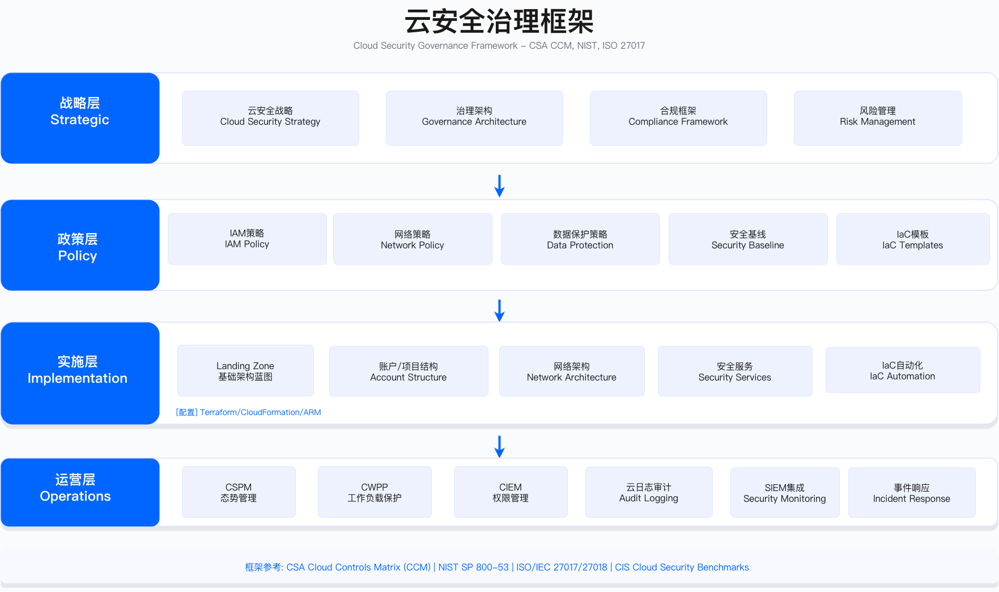
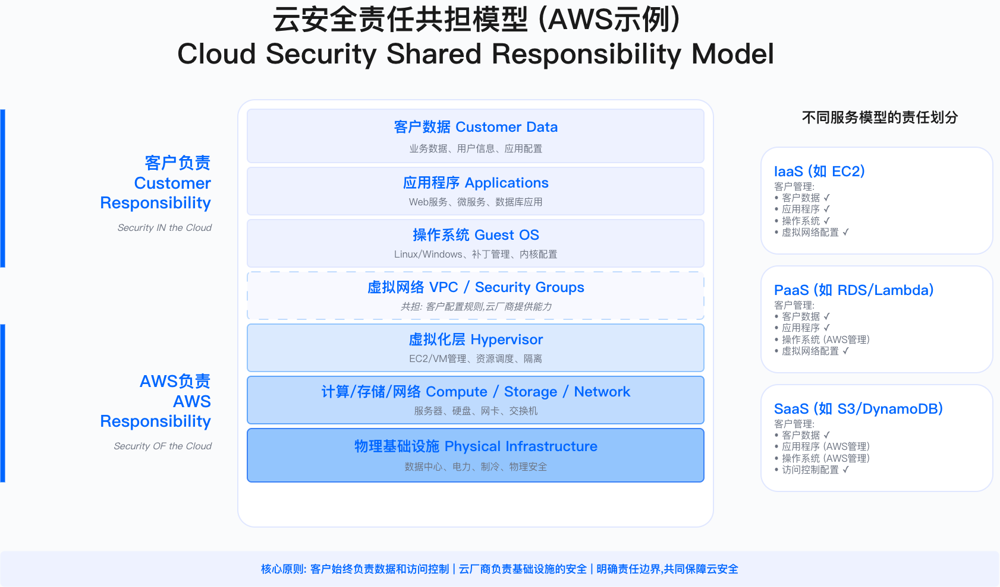

# 5.1　云安全战略

云安全战略制定的核心问题在于：如何在动态、复杂、责任共享的云环境中，建立可执行的治理框架与技术控制体系，平衡合规要求、业务灵活性与成本约束。本节从治理框架选择、多云架构模式、云原生安全理念、成熟度评估到战略落地路线图，提供从决策到实施的完整方法。

> 导读：5.1.1 解决"选哪个框架"的问题，给出三大主流框架（CSA CCM、NIST 800-53、ISO 27017/27018）的适用边界与决策模型；5.1.2 分析三种多云治理模式（统一/联邦/分布式）的权衡；5.1.3 阐述云原生安全的核心理念；5.1.4 提供 5 级成熟度评估模型；5.1.5 给出分阶段战略路线图。本节是第5章的战略层，技术实现细节见 5.2—5.8。

---

## 5.1.1 云安全治理框架：标准化控制与责任边界

### 云环境的治理挑战

云环境与传统 IT 环境的三个关键差异，决定了传统安全框架的不足：

动态性：云资源生命周期以分钟计，配置变更频繁。传统年度审计机制无法覆盖配置漂移风险。

复杂性：跨区域、跨账户、跨服务的依赖关系使得访问控制与数据流向难以追踪。某企业曾因微服务间 S3 存储桶复制至 GCP Cloud Storage 而违反数据驻留要求，直到审计才发现。

责任共享：云服务商负责"云的安全"（物理设施、虚拟化层），客户负责"云中的安全"（IAM 策略、数据加密、应用安全）。边界模糊导致配置错误频发——公开披露的 S3 数据泄露事件中，绝大多数源于客户配置错误而非平台漏洞。

治理框架的核心价值在于：

- 标准化控制库：定义云环境的具体控制点（从 IAM 策略语法到日志保留时长），每个控制有明确实施指南与验证方法
- 责任边界明确：通过共享责任模型，区分平台职责与客户职责，避免"以为云服务商会做"的假设
- 合规映射：将 GDPR、PIPL、PCI DSS 等法规要求，映射到云平台技术控制（如 GDPR Article 32"适当技术措施"映射到 KMS 加密 + IAM 最小权限）
- 成熟度基线：提供分级评估模型，量化当前能力与目标差距

### 三大主流框架对比



#### CSA Cloud Controls Matrix (CCM)：多云通用控制框架

适用边界：
- 同时使用 2 个以上公有云平台（AWS、Azure、GCP、阿里云等）
- 需要评估 SaaS 服务商安全能力（通过 CAIQ v4.1 问卷，共 283 题）[1]
- 寻求多框架合规（ISO 27001、NIST、PCI DSS）的统一实施路径

框架结构：
CCM v4.1（2026-01-27 发布，取代 v4.0）包含 207 个控制目标，分布在 17 个控制域[1]：

| 控制域代码 | 名称 | 云安全重点 |
|-----------|------|-----------|
| IAM | Identity & Access Management | 联邦身份、MFA、JIT 访问、权限审计 |
| DSP | Data Security & Privacy | 数据分类、加密、跨境传输、DLP |
| CEK | Cryptography, Encryption & Key | 密钥管理、加密算法、密钥轮换、HSM |
| IVS | Infrastructure & Virtualization | 虚拟机隔离、容器安全、Serverless 配置 |
| LOG | Logging & Monitoring | 日志集中、审计轨迹、不可篡改存储 |
| SEF | Security Incident Management | 云事件检测、响应流程、取证能力 |
| CCC | Change Control & Configuration | IaC、配置基线、漂移检测 |

关键约束：
- 207 个控制对中小团队（< 10 人）执行难度大，需优先级分级（P0 关键控制约 48 个，为本书按落地经验的建议分级，非 CSA 官方分级）
- CCM 本身不是认证标准，需配合 CSA STAR（Level 1 自评发布至 STAR 注册库、Level 2 第三方认证）或 ISO 27017 认证对外证明[2]。按 CSA 公布的过渡安排，STAR 注册库自 2026 年 3 月起同时接受 v4.0 与 v4.1 提交，2027 年 12 月后仅接受 v4.1[3]
- 框架更新周期 2-3 年，新技术（如 Confidential Computing）可能滞后

验证方法：
- 使用 CAIQ v4.1（共识评估问卷）自评，283 道问题覆盖全部 17 个控制域[1]
- 部署 CSPM 工具（如 Prisma Cloud、Wiz）自动检测控制符合性
- 季度抽样审计：每季度抽取 10% 控制进行证据审查（日志、配置快照、策略文档）

实施优先级（基于风险与合规压力）：

| 优先级 | 控制域 | 控制数量 | 实施时限 |
|--------|--------|---------|---------|
| P0 | IAM、DSP、CEK、LOG | 48 | 6 个月内 100% 覆盖 |
| P1 | SEF、CCC、IVS | 89 | 12 个月内 80% 覆盖 |
| P2 | 其他域 | 60 | 18 个月内 60% 覆盖 |

#### NIST SP 800-53：政府与高监管行业基线

适用边界：
- 为美国政府/国防部门提供云服务（FedRAMP 强制要求）
- 金融、医疗等受监管行业，需严格安全基线
- 企业内部高敏感系统（财务、人事、知识产权）

框架特征：
Revision 5 的控制目录分为 20 个控制族，含增强项共 1000 余条[4]。FedRAMP 在其之上裁剪出三档基线，Rev 5 基线的控制数量为[5]：

| 基线级别 | 控制数量（FedRAMP Rev 5） | 适用场景 | 审计要求 |
|---------|---------|---------|---------|
| Low | 156 | 低敏感公共信息（如公开网站） | 年度审计 |
| Moderate | 323 | 大部分企业系统（CRM、ERP） | 每 30 日持续监控 |
| High | 410 | 关键基础设施（支付、个人敏感信息） | 每 30 日持续监控 + 实时告警 |

FedRAMP 合规成本（供参考，具体依环境而定）：
- 授权周期：9-18 个月
- 认证成本：外部审计机构费用约 $200K-$500K
- 人力投入：安全团队需配置专职 FedRAMP 合规专员（1-2 FTE）
- 持续监控：每 30 日提交 POA&M（行动计划与里程碑），违规项需在 90 日内修复

关键约束：
- 完整控制目录对非政府企业过于繁重，建议仅用于高敏感系统
- FedRAMP 授权后，若云服务商平台变更（如 AWS 新区域），需重新评估部分控制
- 持续监控要求高：某企业配置 1 名专职人员维护 POA&M，每月工作量约 80 小时

验证方法：
- Low 基线：年度第三方审计（3PAO 评估）
- Moderate/High 基线：每 30 日提交安全状态报告，包含漏洞扫描结果、配置合规性、事件日志
- 关键控制（如 AC-2 访问控制、AU-2 审计日志）需自动化检测，手工复核每季度至少 1 次

#### ISO/IEC 27017 & 27018：国际信任证书

适用边界：
- 服务全球客户，尤其欧洲、中东、亚太市场
- 需减少客户重复审计（每次审计消耗团队 2-4 周，成本 $50K-$200K）
- SaaS 服务商需对外展示安全能力

ISO 27017 核心增强：该标准为 ISO/IEC 27002 中的 37 项控制补充了云场景实施指南，并另行给出 7 项 27002 中没有的云专属控制（共担角色与职责、合同终止时客户资产的移除与返还、客户虚拟环境的保护与隔离、虚拟机加固、云环境管理操作规程、客户侧监控能力、虚拟与物理网络的安全管理对齐）[6]。以下按责任主体拆解常见落地点，控制归属划分为本书为便于实施所作的整理：

云服务商（CSP）侧重点：
- 物理与虚拟资源隔离：证明不同客户虚拟机在 Hypervisor 层隔离
- 虚拟网络配置：VPC/VNet 隔离策略，安全组最小化原则
- 虚拟机镜像安全：基础镜像加固（CIS Benchmark），定期漏洞扫描

云服务客户（CSC）侧重点：
- 云服务采购流程：选择云服务商时需安全评估（CAIQ 问卷、SOC 2 报告）
- 云使用监督：季度审查云资源清单，识别影子 IT
- 数据返还与删除：服务终止后 30 日内删除所有客户数据（除非法律要求保留）

ISO 27018 隐私增强：
- 同意机制：云服务商不得将客户数据用于广告或数据挖掘，除非客户明确同意（可验证的同意记录）
- 透明度：必须披露数据存储位置（具体区域，如 AWS eu-west-1）、数据访问权限列表、第三方分包商
- 数据主体权利：支持 GDPR 数据主体访问请求（DSAR），提供 API 或界面导出个人数据

认证成本（供参考）：
- 认证周期：12-18 个月（含差距分析、控制实施、Stage 1/2 审计）
- 审计费用：BSI、DNV 等认证机构收费约 $30K-$80K（取决于组织规模）
- 内部投入：需配置 ISMS 文档管理员（0.5-1 FTE）、内部审计员（0.5 FTE）

关键约束：
- ISO 认证需持续维护：每年监督审计（1-2 天现场审核），3 年再认证（完整审核）
- 认证范围需明确：是单一云环境（如仅 AWS）还是所有云？范围变更需重新审核
- 证书有效性依赖审计机构：选择国际认可的认证机构（CNAS、UKAS 认可），否则客户可能不接受

验证方法：
- Stage 1 审计：文档审核（ISMS 手册、风险评估报告、控制 SOA）
- Stage 2 审计：现场审核（抽样测试控制有效性，如 IAM 策略配置、日志保留时长）
- 持续改进：监督审计发现不符合项需在 3 个月内关闭，否则证书暂停

### 框架选择决策模型

```
云安全框架选择决策树

Q1: 是否为美国政府/国防项目？
├─ 是 → NIST 800-53 + FedRAMP（强制要求）
└─ 否 → Q2

Q2: 是否需要国际认证减少客户审计？
├─ 是 → ISO 27017/27018（优先）
└─ 否 → Q3

Q3: 是否为多云环境（≥2 个云平台）？
├─ 是 → CSA CCM（通用框架）
└─ 否 → Q4

Q4: 是否为特定行业（金融/医疗）？
├─ 是 → 行业框架（PCI DSS/HIPAA）+ CSA CCM
└─ 否 → CSA CCM（起点）+ ISO 27017（中长期目标）
```

组合策略（推荐路径）：
- 起步阶段（0-12 个月）：CSA CCM 作为控制实施框架，优先 P0 控制（48 个）
- 体系建设（12-24 个月）：引入 CIS Benchmarks 作为技术基线，自动化检测（CIS 对 AWS、Azure、GCP、Kubernetes 等分别维护独立的 Benchmark，可免费下载并有配套的 CIS-CAT 检测工具）[7]
- 对外证明（24-36 个月）：ISO 27017/27018 认证，减少客户审计负担

### 实践案例：跨国电商 24 个月云安全转型

背景（已脱敏）：某全球电商企业，业务覆盖 23 个国家，云架构包括 AWS（78 个账户）、Azure（32 个订阅）、阿里云（15 个账户）。因 S3 配置错误导致欧盟客户数据泄露，面临 GDPR 罚款压力。本案例中的所有数量、比例与工期均来自作者参与的项目记录（示例口径，非行业基准），读者应以自身基线重新测算。

Month 1-3：现状评估
- 云资产可见性 62%（38% 的资源未被资产管理系统记录）
- CIS Benchmark 合规率 41%（853 个高风险配置问题）
- 身份管理割裂：三个云平台各自 IAM，离职员工账户遗留率 38%
- GDPR 数据驻留违规：25% 的欧盟客户数据存储在美国

框架选择：
- 核心框架：CSA CCM v4.1（207 控制 / 17 域，映射 GDPR、PIPL；v4.0 的 197 控制版本将于 2028-01-31 退役）
- 认证目标：ISO 27017/27018（国际信任）
- 技术基线：CIS Benchmarks（自动化检测）

Month 4-9：快速胜利项目

*项目 1：统一 IAM 与 MFA*
- 部署 Okta 作为中央 IdP，通过 SAML 2.0 联邦到 AWS/Azure/阿里云
- 实施时限：6 周（Week 1-2 Okta 部署，Week 3-4 云平台联邦配置，Week 5-6 用户迁移）
- 最大阻力：销售团队抱怨 MFA 影响效率（需高管介入说明安全风险）
- 验收标准：SSO 覆盖率 100%，MFA 强制率 100%，离职账户遗留率 0%

*项目 2：S3 Bucket 修复*
- 工具：Prowler（开源多云扫描工具）
- 发现：67 个公开 S3 Bucket，其中 12 个包含敏感数据
- 修复策略：立即关闭 Public Access（防止继续泄露）→逐一审查业务需求→确需公开的配置 CloudFront CDN + IAM 策略
- 时限：2 周完成

Month 10-18：体系化控制实施

CSA CCM 控制分三级优先级（以下分级为本书按落地经验的建议，非 CSA 官方分级）：
- P0 控制（48 个）：6 个月内 100% 覆盖
- P1 控制（89 个）：12 个月内 80% 覆盖
- P2 控制（60 个）：18 个月内 60% 覆盖

关键技术改造：数据驻留合规
- 问题：订单服务（AWS 美国）、支付服务（AWS 欧洲）、用户服务（阿里云中国）数据跨境传输
- 方案：按客户地域拆分数据库（EU 客户→AWS eu-west-1，CN 客户→阿里云 cn-beijing）
- 技术手段：DynamoDB Global Tables 本地化存储 + 跨区域复制（仅非 PII 元数据）
- 成本：4 个月改造（12 个微服务数据库迁移）

自动化合规检测：
- 工具：Prisma Cloud（多云 CSPM）
- 规则：350+ 条检测规则（CIS Benchmarks + PCI DSS + GDPR）
- 覆盖：125 个云账户，每日扫描
- 流程：违规问题自动创建 Jira Ticket→分配责任 BU→逾期升级 CISO

Month 19-24：ISO 27017/27018 认证
- Month 19-20：差距分析（15 个未覆盖控制，补充策略文档）
- Month 21-22：整改实施（虚拟机安全配置、云服务终止流程、供应链管理）
- Month 23：内部审计（外部预审，8 个不符合项，2 周修复）
- Month 24：正式审计（BSI 审计，Stage 1 文档审核通过，Stage 2 现场审核 2 个轻微发现项）

成果总结：
- 合规：ISO 27017/27018 认证通过，GDPR/PIPL 数据驻留合规率 100%
- 风险：高风险配置从 853 个降至 37 个（96% 降低），CIS 合规率 92%
- 效率：客户审计请求减少 80%（从月均 15 次降至 3 次）
- 成本：避免潜在 GDPR/PIPL 罚款，ISO 认证成本约 $300K，ROI 通过获取合规要求严格的客户项目回收

关键经验：
- 快速胜利建立信任：SSO/MFA 项目 6 周完成，获得董事会支持后续预算
- 框架组合优于单一框架：CSA CCM 提供战略框架，ISO 27017 认证建立外部信任，CIS Benchmarks 落地技术基线——三者分工明确，避免重复引入
- 数据驻留是跨国企业硬约束：4 个月数据架构改造不可避免
- 自动化是规模化基础：125 个账户人工管理不可能

---

## 5.1.2 多云安全架构模式：治理模式选择与权衡

### 多云环境的治理挑战

企业采用多云的常见驱动因素：
- 避免供应商锁定（不依赖单一云平台）
- Best-of-Breed 选型（AWS 计算、Azure AD 身份、GCP ML）
- 地理覆盖（AWS 全球 30+ 区域、阿里云深耕中国）
- M&A 整合（并购企业使用不同云平台）

多云带来的治理复杂性，集中体现在四个断层：

策略不一致：AWS Security Group、Azure NSG、GCP Firewall Rules 语法各异，如何保证"禁止 SSH 公开访问"在三个云平台等效实施？常见失败：某企业 AWS 配置禁止 0.0.0.0/0:22，但 Azure NSG 遗漏该规则，导致暴露。

可见性缺失：资产散布在 AWS Console、Azure Portal、GCP Console，无法回答"全球有多少云资源？哪些包含 PII？"。某企业审计时无法提供完整资产清单，合规审计延期 2 个月。

身份割裂：AWS IAM、Azure RBAC、GCP IAM 独立管理，员工离职时容易遗漏某个云平台的权限回收。某企业离职员工 AWS 账户已禁用，但 Azure 订阅 Owner 权限遗留 6 个月。

合规复杂：GDPR 审计时需证明欧盟数据未出境，但数据可能分布在 AWS eu-west-1、Azure West Europe、GCP europe-west1 三处，需要统一提供合规证据。

### 三种治理模式对比

#### 模式 1：统一治理 (Centralized Governance)

架构特征：
```
中央安全团队
├─ 统一策略制定（单一 Policy Hub）
├─ 集中日志与监控（Single SIEM）
├─ 统一身份管理（Federated SSO）
├─ 标准化工具（统一 CSPM/CWPP）
└─ 一致合规基线

所有云平台
├─ AWS Organization
├─ Azure Tenant
└─ GCP Organization
  ↓ 统一控制
中央安全工具栈
├─ IdP: Okta/Azure AD
├─ SIEM: Splunk/Sentinel
└─ CSPM: Prisma Cloud/Wiz
```

适用边界：
- 企业规模：< 5000 人
- 组织结构：集中式 IT 组织，无独立 BU
- 行业：强合规要求（金融、医疗、政府）
- 团队：安全团队能力强但人力有限（< 15 人）

核心优势：策略一致性强，工具标准化无重复采购，合规审计一次覆盖所有云，团队专注统一工具栈。

核心劣势：业务需求审批周期长（某企业平均 7 天），难以适应 BU 差异，中央团队容易成为瓶颈。

实施关键控制点：

| 控制域 | 实施方法 | 验证方式 |
|--------|---------|---------|
| 策略管理 | Policy as Code（OPA/Sentinel）统一定义 | 每日自动检测策略偏移 |
| 身份联邦 | Azure AD/Okta 作为中央 IdP，SAML 联邦到所有云 | 季度权限审计，孤立账户 0 个 |
| 日志汇聚 | 所有云日志→S3/Blob→SIEM | 日志完整性检查，丢失率 < 0.1% |
| 工具整合 | 多云 CSPM（Prisma/Wiz）单一界面 | 资产覆盖率 100% |

常见误区：
- 过度集中导致业务抱怨：某企业强制所有 BU 使用统一 CSPM，但 CSPM 不支持某 BU 自研 PaaS 平台，BU 私下采购"影子 IT"
- 中央团队技能瓶颈：5 人管理 3 个云平台，无法深入每个平台特性，配置质量下降

#### 模式 2：联邦治理 (Federated Governance)

架构特征：
```
中央安全治理委员会
├─ 制定框架（最小安全基线）
├─ 审计（季度合规检查）
└─ 重大例外批准

各 BU 自主运营
├─ BU1: AWS 专属团队（自选 CSPM、自主 Landing Zone）
├─ BU2: Azure 专属团队（独立运营）
└─ BU3: GCP 专属团队（自主工具栈）
```

适用边界：
- 企业规模：> 20000 人
- 组织结构：多业务单元/多品牌，强独立性
- 地理分布：跨国企业，地域法规差异大
- 技术能力：各 BU 有独立技术团队

核心优势：BU 能快速响应自身需求，允许不同工具栈，最大化 BU 自主性。

核心劣势：中央难以保证最低安全基线，BU 间重复采购，跨 BU 合规审计复杂，需要大量协调成本。

关键约束：最小安全基线的定义与执行力度是这种模式的核心难题。基线太严等于变相集中化，基线太松导致安全水位参差不齐。通常需要通过 SCP（AWS Service Control Policies）、Azure Policy Initiative、GCP Organization Policy 在组织层强制执行不可妥协的底线（如禁止关闭 CloudTrail、禁止 S3 公开访问），其余细节由 BU 自主决定。

#### 模式 3：分布式治理 (Distributed Governance)

架构特征：完全分散，各团队独立管理，无统一策略层。

适用场景：仅适合初创阶段（< 100 人）、快速试验产品、安全要求低的场景。云成本规模扩大或有合规要求后，应向统一或联邦治理迁移。

常见误区：这种模式不是"选择"，而是"尚未建立治理体系"的状态。长期停留会积累安全债务，事后迁移到统一治理成本极高。

### 治理模式选择决策

三种模式不存在绝对优劣，取决于组织规模、结构与合规要求：

| 维度 | 统一治理 | 联邦治理 | 分布式 |
|------|---------|---------|--------|
| 企业规模 | < 5000 人 | > 20000 人 | < 100 人 |
| 合规要求 | 强合规 | 多地区差异合规 | 低合规 |
| 策略一致性 | 高 | 中 | 低 |
| BU 灵活性 | 低 | 高 | 完全自由 |
| 运营成本 | 低 | 高（协调成本） | 低（短期） |
| 扩展性 | 中 | 高 | 低 |

混合路径：多数大型企业在实践中采用混合模式——核心安全控制（身份、日志、密钥管理）集中，BU 业务决策分权。

---

## 5.1.3 云原生安全理念

### 从外挂安全到内嵌安全

传统安全思路是"外挂"：应用构建完成后，在外层叠加防火墙、IDS/IPS、WAF。这种模式在云原生环境失效，原因在于云资源的生命周期远快于安全策略的审批周期——一个 Lambda 函数从部署到销毁可能只有 10 分钟，传统的"部署后安全审查"根本无法跟上节奏。

云原生安全的核心理念是"内嵌"（Shift Left + Shift Right）：

Shift Left（向左移动，前置安全）：将安全检查内嵌到开发与构建阶段。代码提交触发 SAST 扫描，容器镜像构建触发漏洞扫描，IaC 提交触发配置安全检查，合规规则作为代码版本化管理（Policy as Code）。安全缺陷在进入生产环境之前即被发现。这部分详见 5.7 DevSecOps 实践。

Shift Right（向右移动，运行时安全）：将安全监控延伸到生产运行阶段。应用运行时行为监控（Falco/eBPF），API 调用异常检测（CloudTrail + UEBA），容器逃逸检测，服务网格流量加密与可观测性。这部分详见 5.4 云工作负载保护与 5.8 云安全运营。

核心转变：从"边界防护"到"工作负载防护"。不依赖网络边界保护，而是为每个工作负载（VM、容器、函数）提供独立的安全控制（身份、加密、运行时检测）。

### 不可变基础设施原则

云原生安全的一个重要实践是不可变基础设施（Immutable Infrastructure）：服务器一旦部署不再被修改，任何变更通过重新部署新版本实现，旧版本销毁。

安全意义：
- 配置漂移消除：服务器状态始终与 IaC 代码一致，不存在"手工修改后与基线偏离"的问题
- 补丁管理简化：OS 补丁通过构建新 AMI/容器镜像实现，而非在线 patch
- 取证一致性：可疑事件发生后，可以对比当前镜像与已知干净镜像，快速识别篡改
- 攻击持久化困难：攻击者在实例上安装的后门，下次重新部署后自动清除

实施约束：不可变基础设施要求应用本身无状态化（状态存储在外部数据库或对象存储），遗留应用往往有本地状态（如日志文件、缓存），改造成本较高。

### 最小权限云原则

云环境的最小权限比传统环境更为关键，原因是 API 调用的破坏力与 IAM 权限直接绑定。实践中的三个具体原则：

工作负载身份：应用不再使用长期 API 密钥，而是使用云原生临时凭证（AWS Instance Profile/IAM Roles for Service Accounts、Azure Managed Identity、GCP Service Account with Workload Identity Federation）。临时凭证自动轮换，泄露后数小时内失效。

Just-in-Time 访问：人工特权访问通过 PAM 平台按需申请，审批后获得时限内的临时权限（通常 1-4 小时），到期自动撤销。永久 Admin 权限仅限 Break-Glass 场景。详见 5.2 云 IAM。

权限边界（Permission Boundary）：通过 AWS Permission Boundaries、Azure Privileged Identity Management 限制权限委托链，防止权限提升攻击（攻击者获得低权限凭证后通过链式调用提升至管理员）。



---

## 5.1.4 云安全成熟度模型

云安全成熟度分为 5 个级别，每个级别有明确特征与能力要求：

### 成熟度级别定义

M1 - 初始级（Reactive Security）：无云安全专职角色，安全完全依靠开发/运维团队兼顾，缺乏系统性框架。典型特征：无统一 IAM 策略，CloudTrail 未启用，S3 Bucket 存在公开访问，安全事件依赖外部举报或客户反映才知晓。

M2 - 基础级（Policy & Compliance Driven）：建立基础安全策略，开始自动化合规检测。典型特征：CloudTrail 启用，CIS Benchmark 扫描覆盖主要账户，MFA 覆盖管理员账户，基本安全组规则，但缺乏威胁检测能力与事件响应流程。

M3 - 管理级（Threat-Aware Operations）：具备威胁检测与响应能力，安全团队主动监控。典型特征：GuardDuty/Sentinel 启用，SIEM 集成，IR Playbook 建立，漏洞管理流程，MFA 覆盖全员，CSPM 持续监控。

M4 - 优化级（Proactive & Automated Defense）：安全控制高度自动化，具备主动防御能力。典型特征：DevSecOps 集成（安全门控 CI/CD），SOAR 自动化响应，UEBA 行为检测，零信任架构实施，Red Team 常态化，PAM 全覆盖，检测与研判环节已引入 AI 辅助（对应 5.8.8 的自主等级 L2）。

M5 - 领先级（Intelligence-Driven Security）：威胁情报驱动，具备对新型攻击面的自建防护与对外能力输出。典型特征：威胁情报平台，Red Team/Blue Team 协同演练，供应链安全，云安全能力输出（对外提供安全服务或发布研究），并且已把 AI 本身纳入防护范围——模型与 agent 作为云资产被纳管（见 5.8.8、18.7），而不只是把 AI 当检测工具用。

> 记号与口径提示：本节的 M1–M5 是**云安全成熟度**，与 5.8.8 的 **L0–L5 自主等级**是两把不同的尺子，不可互换。另需注意一个常见的过时判断：把"用上 AI/ML 检测"当作最高成熟度是 2021 年前后的框架惯性，在 2026 年 AI 辅助检测（L2）已是 M3–M4 的常规配置而非领先标志。真正拉开差距的不是有没有用 AI，而是**有没有能力管住 AI**——模型资产是否纳入盘点、agent 的权限是否走同一套 IAM 与审计、AI 引入的新攻击面是否被覆盖。

### 成熟度快速评估

评估维度与各级别能力要求：

| 维度 | M1 | M2 | M3 | M4 | M5 |
|------|----|----|----|----|-----|
| 身份管理 | 各云独立 IAM | SSO 启动 | SSO + MFA 全员 | JIT + CIEM | 零信任 + 行为分析 + 非人身份（含 agent）纳管 |
| 网络安全 | 无策略 | 基本 Security Group | WAF + DDoS 防护 | 微隔离 + ZTNA | 全加密 + 零信任网络 |
| 数据保护 | 无加密 | 关键数据加密 | BYOK + DLP | 自动分类 + 加密 | 数据主权全覆盖 + 训练/推理数据流纳管 |
| 检测能力 | 无 | 基础日志 | SIEM + GuardDuty | UEBA + ML 检测 | TI 驱动 + 对 AI 系统自身的检测覆盖 |
| 响应能力 | 无 | 手工处置 | IR Playbook | SOAR 自动化 + AI 辅助研判 | 按爆炸半径分级放权的 agent 处置（红线动作仍人工） |
| 合规 | 无框架 | 基础框架 | 合规自动化 | 持续合规 | 合规即代码 + AI 治理要求纳入（ISO/IEC 42001、EU AI Act） |

适用边界：成熟度模型适合自我评估与路线图规划，不适合直接对外声明。M3 是多数受监管企业的最低目标，M4-M5 需要较大的安全投入（团队规模、工具预算、时间）。

常见误区：
- 跳级实施：M1 企业试图直接实施 M4 能力（如部署 SOAR），缺少基础数据（日志完整性）和流程（IR Playbook），SOAR 无法有效运转
- 工具堆砌：通过购买高级工具声称达到 M4/M5，但人员能力、流程、数据基础未跟上，工具成为摆设
- 把成熟度等级与自主等级混用：宣称"我们云安全到 M5，所以 agent 可以放到 L5"——两者没有换算关系，自主等级的放权判据是动作的爆炸半径与可逆性（见 5.8.8），与组织整体成熟度无关
- 静态评估：成熟度不是线性进步，威胁环境变化可能使原本 M3 的能力重新降级（如引入新技术栈带来新攻击面）

运行指标（M3→M4 迁移的关键指标）：
- MTTD（平均检测时间）：目标 < 1 小时
- MTTR（平均响应时间）：目标 < 4 小时
- CIS Benchmark 合规率：目标 ≥ 90%
- 特权账户纳管率：目标 100%
- 自动化响应率：目标 ≥ 50%

---

## 5.1.5 战略落地路线图

### 分阶段实施框架

云安全战略落地分四个阶段，每个阶段有明确目标、关键活动与验收标准：

阶段 0（Month 0-3）：现状评估与快速止血

核心目标：建立可见性，消除高危风险。
- 云资产盘点（目标：可见性 > 90%）
- 高危配置修复（公开 S3、未启用 MFA 的管理员账户、无限制 Security Group）
- CloudTrail/Activity Log/Audit Logs 全面启用
- 建立 Landing Zone 规划方案

验收标准：无公开存储桶，管理员账户 100% MFA，CloudTrail 覆盖 100% 账户。

阶段 1（Month 3-9）：基础安全能力建设

核心目标：建立统一身份、基础检测、合规基线。
- 部署统一 IdP（SSO + MFA 全员）
- 部署 CSPM（持续配置合规检测）
- 部署 GuardDuty/Defender for Cloud（威胁检测）
- 实施 Landing Zone 标准化（IaC 化）
- 建立 IR Playbook（至少覆盖 5 个高频场景）

验收标准：SSO 覆盖率 > 95%，CSPM 资产覆盖率 > 95%，CIS 合规率 > 70%。

阶段 2（Month 9-18）：深度防御能力

核心目标：工作负载保护、数据保护、DevSecOps。
- 部署 CWPP/容器安全（5.4）
- 实施数据分类与加密（5.5）
- DevSecOps 集成 CI/CD（5.7）
- 建立云 SOC 基础（5.8）
- 启动 PAM 实施（5.2）

验收标准：容器镜像扫描覆盖率 100%，敏感数据加密覆盖率 100%，DevSecOps 门控覆盖主要代码仓库。

阶段 3（Month 18+）：高级能力与持续优化

核心目标：自动化响应、零信任、多云治理。
- SOAR 自动化响应（5.8）
- 零信任架构逐步推进（ZTNA + 微隔离）
- UEBA/ML 检测能力
- 多云统一治理（5.9）
- 常态化 Red Team 演练

验收标准：自动化响应率 > 50%，MTTD < 1 小时，MTTR < 4 小时。

### 路线图执行注意事项

先见性优先于后瞻性：最常见的错误是在工具选型上花过多时间（3-6 个月评估），而推迟了实际执行。完美方案的代价是延误了高危风险的修复。建议快速（< 4 周）选定主要工具，通过 Pilot 验证，快速迭代。

快速胜利建立信任：如 5.1.1 案例所示，6 周完成 SSO/MFA 项目是获得高层持续支持的关键。在争取更大预算前，需要先展示可度量的安全改善。

人员能力与工具匹配：一线团队采购 M4 级工具，工具能力无法发挥，反而增加运维负担。工具选型需匹配当前团队成熟度，随着能力成长逐步升级工具。

合规不是终点：通过 ISO 认证、SOC 2 报告不代表安全，只是证明了基础控制存在。真正的安全能力需要通过持续的 Red Team 测试、事件响应演练验证。

---

## 5.1.6 本节小结与延伸阅读

云安全战略不是一份文档，而是一套持续演进的治理体系。框架选择决定了工作的方向性（CSA CCM 多云通用，NIST 高合规，ISO 国际信任），但落地需要在技术控制、流程建设、人员能力三个维度同步推进。

治理模式的选择（统一/联邦/分布式）没有绝对优劣，关键是与组织结构、合规要求、团队能力相匹配，并随组织规模变化调整。

成熟度模型提供了自我定位工具，路线图规划需要从当前 L 级别出发，逐步迭代而非跳跃。

常见误区：
- 框架选择后"放置高阁"，未落地技术控制
- 过分依赖认证/合规，忽视实际检测与响应能力
- 工具堆砌不整合，告警泛滥导致团队疲劳
- 安全团队孤立，未与业务/开发团队建立协作机制

延伸阅读：
- CSA CCM v4.0：https://cloudsecurityalliance.org/research/cloud-controls-matrix/
- NIST SP 800-53 Rev.5：https://csrc.nist.gov/publications/detail/sp/800-53/rev-5/final
- ISO/IEC 27017:2015：https://www.iso.org/standard/43757.html
- ISO/IEC 27018:2019：https://www.iso.org/standard/76559.html
- Google Cloud Security Foundations Blueprint：https://cloud.google.com/architecture/security-foundations
- AWS Security Reference Architecture：https://docs.aws.amazon.com/prescriptive-guidance/latest/security-reference-architecture/welcome.html

相关章节：
- [1.4 企业安全架构框架（SABSA/TOGAF）](../../第01部分_基础与战略治理/第01章_企业架构基础/1.4_安全架构全景.md)
- [2.3 合规管理框架](../../第01部分_基础与战略治理/第02章_GRC治理/2.3_合规管理框架.md)
- [5.2 云身份与访问管理](./5.2_云身份与访问管理.md)（本节战略层的身份部分在此展开）

---

## 参考文献

| # | 来源 | 标题 | 日期 | 链接 |
| --- | --- | --- | --- | --- |
| [1] | Cloud Security Alliance | Cloud Controls Matrix and CAIQ v4.1（207 控制 / 17 域，CAIQ 283 题） | 2026-01-27 | <https://cloudsecurityalliance.org/artifacts/cloud-controls-matrix-v4-1> |
| [2] | Cloud Security Alliance | STAR Program（Level 1 自评 / Level 2 第三方认证） | 2026 访问 | <https://cloudsecurityalliance.org/star> |
| [3] | Cloud Security Alliance | CCM v4.1 Transition Timeline（v4.0.x 于 2028-01 withdrawn） | 2026-02-19 | <https://cloudsecurityalliance.org/blog/2026/02/19/ccm-v4-1-transition-timeline> |
| [4] | NIST | SP 800-53 Rev. 5: Security and Privacy Controls for Information Systems and Organizations（20 个控制族） | 2020-09（含 2023 勘误） | <https://csrc.nist.gov/pubs/sp/800/53/r5/upd1/final> |
| [5] | FedRAMP | Rev 5 Baselines（Low 156 / Moderate 323 / High 410） | 2023-05 起适用 | <https://www.fedramp.gov/rev5/baselines/> |
| [6] | Microsoft Compliance | ISO/IEC 27017:2015 Code of Practice（对 27002 的 37 项控制给出云实施指南，另有 7 项云专属新控制） | 2026 访问 | <https://learn.microsoft.com/en-us/compliance/regulatory/offering-iso-27017> |
| [7] | Center for Internet Security | CIS Benchmarks（AWS / Azure / GCP / Kubernetes 独立基准） | 2026 访问 | <https://www.cisecurity.org/cis-benchmarks> |

---

## 导航

[← 上一节：5.0 执行摘要](./5.0_执行摘要.md) | [返回章节目录](./README.md) | [下一节：5.2 云 IAM →](./5.2_云身份与访问管理.md)

---

© 2025-2026 AISecOps Project. Licensed under CC BY-NC-SA 4.0
