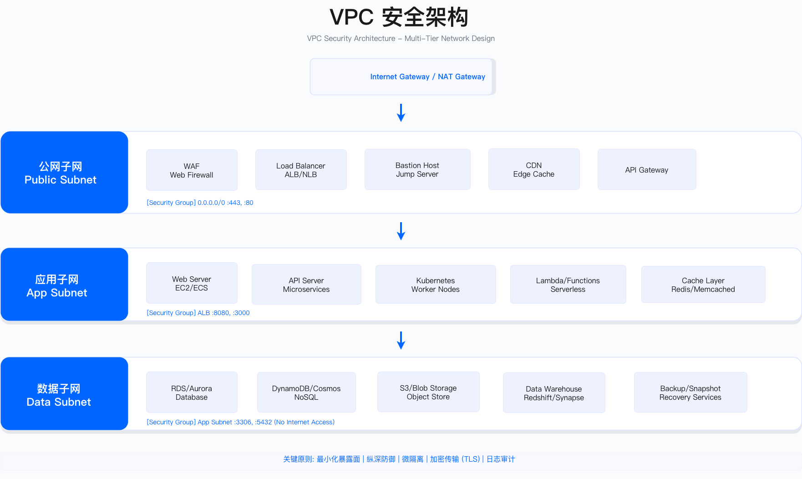

# 5.3　云网络安全

云环境网络威胁模型已从传统"边界防御"转变为"东西向零信任"，但多数组织仍在使用基于静态 IP 与 VLAN 的控制手段。本节从 VPC 架构设计、微隔离实现、DDoS 防护、WAF 规则调优、CDN 安全配置、SASE 架构演进六个维度，提供决策框架与工程验收标准。

> 导读：5.3.1 给出 3 层 VPC 设计与 CIDR 规划约束；5.3.2 展示 Security Group 与 K8s NetworkPolicy 的微隔离实现，代码块前后补充了选择依据与生产坑；5.3.3 分析 DDoS 防护分层策略；5.3.4 覆盖 WAF 规则调优；5.3.5 介绍 CDN 安全配置；5.3.6 分析 SASE 架构演进路径。网络安全是 5.2 IAM 的补充——IAM 控制"谁能做什么"，网络控制"从哪里能到哪里"，两者结合才构成完整的访问控制体系。

---

## 5.3.1 VPC 安全架构

### 问题背景：从"扁平网络"到"纵深防御"

云迁移早期常见做法是将所有资源放入单一子网，为开发便利性允许公网访问数据库。这种扁平架构在 Capital One 2019 年数据泄露事件中被证明存在致命缺陷：攻击者通过 Web 层 SSRF 漏洞访问 EC2 元数据服务获取 IAM 凭证，进而横向移动至 700 多个 S3 Bucket，整个攻击链未遇到任何网络层阻断[1]（该事件的身份侧成因见 5.2）。

某金融机构在 2018-2022 年积累了 205 个 VPC，其中 35 个 RDS 实例配置公网访问（占比 29%），CIDR 重叠导致 30 个 VPC 无法互联，Security Group 规则达到 8,500 条。网络故障排查平均耗时 4 小时，需登录多个 VPC 逐一查看 Flow Logs。以上数字来自作者参与的项目记录（示例口径，非行业基准）。这不是个例，而是缺乏规划的云网络架构的典型归宿。

### 3 层 VPC 设计

3 层设计的核心逻辑是按数据敏感度和攻击面分层，强制流量只能从外向内单向传递，任何绕过都是可检测的异常。

| 层级 | 子网类型 | 路由特征 | 典型资源 | 约束条件 |
|------|---------|---------|---------|---------|
| Public Layer | Public Subnet | Internet Gateway 出站 | ALB、NAT Gateway、Bastion | 仅放置无状态组件；Security Group 严格限制源 IP；强制 DDoS 防护 |
| Private Layer | Private Subnet | NAT Gateway 出站 | App Servers、ECS、Lambda | 禁止公网 IP；通过 Security Group 微隔离；必须启用 Flow Logs |
| Data Layer | Data Subnet | 无 Internet 路由 | RDS、ElastiCache、EFS | 永不配置公网访问；传输/静态双重加密；NACL 额外保护 |



*图：3 层 VPC 架构将暴露面限制在 Public Subnet，数据库层完全隔离。NAT Gateway 提供 Private/Data Subnet 的单向出站访问（如拉取系统更新），但外部无法主动连接到这两层。*

为什么选 3 层而非更多层？ 层级越多，路由表和 Security Group 规则越复杂，排错越困难。3 层在安全隔离与运维复杂度之间取得平衡——实践表明，4 层以上的设计在大多数组织中因运维困难而逐渐"退化"成 2 层甚至扁平架构。关键是坚持执行，而非追求纸面上的复杂度。

#### CIDR 规划约束

VPC CIDR 创建后无法修改，需在规划阶段考虑：

1. 全局视角分配：按 Region/环境分配不重叠网段（例如 us-east-1 为 10.0.0.0/16，eu-west-1 为 10.2.0.0/16）
2. 预留扩展空间：每个 VPC 预留至少 1 个 /24 用于未来新增子网或 VPN 互联
3. 避免 RFC1918 冲突：检查本地数据中心 CIDR，避免专线互联时冲突

典型生产坑：所有 VPC 使用 10.0.0.0/16，后期需要 VPC Peering 时发现无法互联，必须迁移工作负载（成本高、风险大）。这个错误在"快速上云"阶段极为常见，修复代价远超规划时的额外思考时间。

#### 跨 Region 互联决策

AWS Transit Gateway 与 Azure Virtual WAN 的选择依据：

| 场景 | 推荐方案 | 依据 |
|------|---------|------|
| 单 Region < 50 个 VPC | VPC Peering | 成本最低，无中心化故障点 |
| 单 Region > 50 个 VPC | Transit Gateway | 简化路由表管理，支持 5,000 VPCs |
| 全球多 Region 部署 | Azure Virtual WAN 或 TGW Peering | Virtual WAN 原生全球 Hub-Spoke，TGW 需跨区域 Peering |
| 需 SD-WAN 集成 | Azure Virtual WAN | 原生支持主流 SD-WAN 厂商 |

成本示例：100 个 VPC 场景下，Transit Gateway 约 $3,650/月（$50/连接×73 对+数据传输费），VPC Peering 无连接费用但管理复杂度高（需维护 4,950 个连接）。50 个 VPC 是经验性拐点，低于此用 Peering，高于此用 TGW，管理成本与费用成本之间的交叉点。

### 验证方法

- CIDR 冲突检测：使用 AWS VPC IPAM 或自研脚本扫描全账户 CIDR，标记重叠
- 公网暴露审计：AWS Config 规则 `rds-instance-public-access-check` 检测公网可达数据库
- 路径可达性测试：VPC Reachability Analyzer 验证 Private Subnet 无法直达 Internet

### 运行关注指标

- CIDR 利用率：已分配子网数 / 可用子网数，触发阈值 > 80% 需规划新 VPC
- 公网暴露资产数：目标 = 0（除 ALB/NAT Gateway/Bastion 外）
- 故障排查时长：baseline 4 小时 → 目标 < 30 分钟（通过 Flow Logs Insights 加速）

---

## 5.3.2 微隔离实现

### 问题背景：从 VLAN 到 Security Group 的范式转变

传统数据中心使用 VLAN 隔离（VLAN 10=Web 层、VLAN 20=App 层），通过防火墙控制跨 VLAN 流量。云环境中将 VLAN 1:1 映射为 Subnet，继续使用过度宽松规则（如"允许 10.0.0.0/8 访问 3306 端口"），导致某跨境电商企业 PCI DSS 审计失败：支付处理服务器与营销网站在同一 Subnet，Security Group 规则技术上允许营销网站访问支付数据库（虽无实际流量），违反 PCI DSS v4.x Req 1.3.1/1.4.1（限制 CDE 的入出站流量；1.2.1 在 v4.x 是"NSC 规则集的配置标准"，非流量限制条款）。

该企业 18 个月转型路径：
1. 现状摸底（第 1-3 月）：启用 VPC Flow Logs，分析发现 40% 的 Security Group 规则从未被使用，120 个应用实际只有 280 个依赖关系，但规则允许 1,200+ 个技术可达路径
2. 渐进收紧（第 4-9 月）：将 0.0.0.0/0 或 10.0.0.0/8 替换为 Security Group 引用（如"sg-web 访问 sg-app 的 8080 端口"），使用 AWS Network Firewall Count 模式测试 2 周，发现 12% 新规则过严（阻断夜间批处理）
3. K8s NetworkPolicy（第 10-18 月）：微服务应用迁移到 EKS，实施"默认拒绝+显式允许"，支付服务 NetworkPolicy 仅允许 3 个 Egress 目标

转型成果：Security Group 规则从 1,200 条降至 320 条（减少 73%），某次 Web 服务器被 Log4Shell 攻陷后，攻击者横向移动被 Security Group 阻断（0 次成功横向移动），PCI DSS 审计成本从 $120K/年降至 $60K/年。

### AWS Security Groups 核心特性

Security Group 在 AWS 中是最细粒度的网络隔离控制单元，理解其核心特性有助于正确设计规则：

- 有状态防火墙：允许入站自动允许响应出站，无需单独定义双向规则（与 NACL 的无状态设计不同）
- 实例级别：附加到 ENI（弹性网络接口），可做到实例级微隔离，比子网级 NACL 更细粒度
- 白名单模型：默认拒绝所有，需显式允许（最小权限原则）
- 动态引用：可引用其他 Security Group 作为源/目标，解耦 IP 地址依赖（当实例 IP 变化时规则自动生效）

3 层应用隔离 Terraform 示例，其关键设计决策如下：

```terraform
resource "aws_security_group" "alb" {
  name        = "sg-alb-prod"
  description = "ALB security group"
  vpc_id      = aws_vpc.main.id

  # 关键点：ALB 仅开放 443，HTTP 80 应在 ALB 层强制重定向到 HTTPS
  ingress {
    description = "HTTPS from Internet"
    from_port   = 443
    to_port     = 443
    protocol    = "tcp"
    cidr_blocks = ["0.0.0.0/0"]
  }

  egress {
    from_port   = 0
    to_port     = 0
    protocol    = "-1"
    cidr_blocks = ["0.0.0.0/0"]
  }
}

resource "aws_security_group" "app" {
  name        = "sg-app-prod"
  description = "Application server security group"
  vpc_id      = aws_vpc.main.id

  # 关键点：入站仅接受来自 ALB Security Group 的流量，而非 ALB 的 IP（IP 会变）
  ingress {
    description     = "HTTP from ALB"
    from_port       = 8080
    to_port         = 8080
    protocol        = "tcp"
    security_groups = [aws_security_group.alb.id]
  }

  # 关键点：self = true 允许同 SG 内的实例互访（微服务集群内部通信）
  ingress {
    description = "App to App"
    from_port   = 8080
    to_port     = 8080
    protocol    = "tcp"
    self        = true
  }

  # 关键点：出站规则明确指定目标 SG，而非 0.0.0.0/0
  egress {
    description     = "PostgreSQL to RDS"
    from_port       = 5432
    to_port         = 5432
    protocol        = "tcp"
    security_groups = [aws_security_group.database.id]
  }
}

resource "aws_security_group" "database" {
  name        = "sg-database-prod"
  description = "Database security group"
  vpc_id      = aws_vpc.main.id

  # 关键点：数据库层无出站规则——RDS 不应主动发起外部连接
  ingress {
    description     = "PostgreSQL from App"
    from_port       = 5432
    to_port         = 5432
    protocol        = "tcp"
    security_groups = [aws_security_group.app.id]
  }
}
```

生产常见坑：
- 用 CIDR 而非 Security Group 引用：当 App 实例 IP 变化时（Auto Scaling），需要手动更新规则，容易遗漏
- 数据库 SG 配置出站规则（0.0.0.0/0）：理由通常是"数据库需要下载更新"，但数据库不应有 Internet 路由，这是不必要的开放
- 忘记 NACL 的无状态特性：如果同时使用 NACL，需要单独允许响应流量（端口 1024-65535），否则导致间歇性连接超时

### Kubernetes NetworkPolicy 实现

K8s 默认所有 Pod 间通信无限制，需显式定义 NetworkPolicy 实现微隔离；且 NetworkPolicy 只有在集群使用了支持它的网络插件（如 Calico、Cilium）时才会真正生效，否则策略对象创建成功但不产生任何拦截效果[5]。在实施 NetworkPolicy 之前，必须先完成应用依赖关系图——盲目设置"默认拒绝"会导致合法流量被阻断，而这种问题在高并发场景下可能很难第一时间定位。

```yaml
apiVersion: networking.k8s.io/v1
kind: NetworkPolicy
metadata:
  name: frontend-network-policy
  namespace: production
spec:
  podSelector:
    matchLabels:
      app: frontend
      tier: web
  policyTypes:
  - Ingress
  - Egress
  ingress:
  # 关键点：来源限定到 ingress-nginx namespace，而非所有 namespace
  - from:
    - namespaceSelector:
        matchLabels:
          name: ingress-nginx
    ports:
    - protocol: TCP
      port: 8080
  egress:
  # 关键点：出站限定到特定 app+tier 标签的 Pod
  - to:
    - podSelector:
        matchLabels:
          app: backend
          tier: api
    ports:
    - protocol: TCP
      port: 8080
  # 关键点：DNS 必须单独放行，否则所有域名解析失败导致应用崩溃
  - to:
    - namespaceSelector:
        matchLabels:
          name: kube-system
    - podSelector:
        matchLabels:
          k8s-app: kube-dns
    ports:
    - protocol: UDP
      port: 53
```

关键约束：
- 需 CNI 插件支持（Calico/Cilium/Weave Net），AWS VPC CNI 不原生支持 NetworkPolicy——使用托管 K8s 前需确认 CNI 类型
- 默认拒绝策略会阻断未定义的合法流量，需先绘制应用依赖关系图（建议先用 Audit 模式运行 2 周）
- NetworkPolicy 不支持跨 Namespace 引用，需通过 namespaceSelector 间接实现（如上例的 DNS 放行）
- 遗漏 DNS 放行是最常见的错误：所有域名解析失败，应用无法连接任何服务，现象上与网络连接问题难以区分

适用边界：NetworkPolicy 适合微服务架构中 Pod 间流量需要精细控制的场景。单体应用或 Pod 数量少于 20 个的集群，Security Group + NACL 已足够，不必引入 NetworkPolicy 的复杂度。

### 验证方法

- 规则覆盖率：VPC Flow Logs 分析所有 Security Group 规则是否有实际流量，标记未使用规则
- 横向移动测试：红队从 Web 层 Pod 尝试访问数据库 Pod，验证 NetworkPolicy 阻断
- 合规证据：导出 Security Group/NetworkPolicy 配置文件，映射到 PCI DSS/NIST 控制点

### 运行关注指标

- Security Group 规则数：baseline 1,200 条 → 目标 < 500 条（行业经验值：平均每应用 < 5 条规则）
- 未使用规则占比：目标 < 10%（通过 Flow Logs Insights 查询）
- 横向移动阻断率：红队演练中阻断成功率目标 > 95%

---

## 5.3.3 DDoS 防护

### 问题背景：从"被动挨打"到"自动清洗"

以下案例的流量规模、成本与损失数字均来自作者调研（示例口径，非行业基准）。某月活 800 万手游公司在 2023 年黑色星期五遭受 500Gbps DDoS 攻击持续 48 小时。攻击开始时 ALB 响应时间从 200ms 飙升至 15 秒，Auto Scaling 扩容至 200 实例上限，EC2 成本从 $800/天飙升至 $12,000/天，但仍无法响应正常请求。企业使用 AWS Shield Standard（对所有 AWS 客户免费开启的基础防护），但该服务面向常见的 L3/L4 攻击（如 SYN Flood、UDP Reflection），L7 的 HTTP Flood 需配合 AWS WAF 才能拦截[2]。紧急订阅 Shield Advanced（AWS 官方定价为每月 3,000 美元、按 1 年期承诺，另计数据传输费）[2]后，因 WAF 规则配置错误，误报率达 80%（正常玩家流量被阻断），AWS DDoS Response Team 介入 24 小时后才逐步清洗攻击流量。

总损失：$280K 直接成本 + $1.2M 间接损失（玩家流失、活动收入、品牌声誉）。

关键教训：基础档防护主要覆盖 L3/L4，而应用层（L7）攻击需要 WAF 与速率限制才能应对；据作者调研估算，事后紧急采购与止损的总成本通常远高于提前订阅防护（本案例约为一个数量级，非通用倍数）；WAF 规则需 2-4 周调优期，无法开箱即用。预算决策者需要理解：DDoS 防护不是可以省的"保险费用"，而是高流量业务的必要基础设施投入。

### DDoS 攻击分层防护

| 层级 | 攻击类型 | 原理 | 防护方式 | 触发阈值示例 |
|------|---------|------|---------|-------------|
| L3/L4 | SYN Flood | TCP 三次握手耗尽连接 | SYN Cookie、Rate Limiting | > 10,000 SYN/sec |
| L3/L4 | UDP Flood | 大量 UDP 包耗尽带宽 | 流量清洗、黑洞路由 | > 50 Gbps |
| L7 | HTTP Flood | 大量 HTTP 请求 | WAF、JS 挑战、验证码 | > 10,000 req/sec |
| L7 | Slowloris | 慢速连接占用资源 | 连接超时、限制慢速 | 连接保持 > 30 秒 |
| L7 | DNS Amplification | 利用 DNS 服务器放大流量 | Anycast DNS、Rate Limiting | > 100,000 DNS/sec |

适用边界：不同规模企业的 DDoS 防护策略不同。月活 < 10 万的小型应用，AWS Shield Standard（免费）+ CloudFront 通常已足够。月活 > 100 万或电商/游戏类对可用性要求高的业务，应该部署 Shield Advanced + WAF + 专业 DDoS 缓解服务（如 Cloudflare Magic Transit）。金融级/电信级业务，需要考虑多层 BGP anycast 清洗中心。

关键约束：Shield Advanced 的 DDoS Response Team (DRT) 支持是被动响应，不是实时主动防护。攻击开始后联系 DRT 的响应时间通常 2-4 小时，期间业务已受影响。真正的防护依赖提前配置好的 WAF 规则，而非等待 DRT 介入。

### 云平台 DDoS 防护服务对比

| 特性 | AWS Shield Standard | AWS Shield Advanced | Azure DDoS Protection Basic | Azure DDoS Protection Standard | Cloudflare Magic Transit |
|------|---------------------|---------------------|-----------------------------|---------------------------------|--------------------------|
| 费用 | 免费 | $3,000/月 | 免费 | $2,944/月 | 按流量计费 |
| L3/L4 防护 | 基础 | 完整 | 基础 | 完整 | 完整 |
| L7 防护 | 无 | 通过 WAF | 无 | 通过 WAF | 完整 |
| DRT 支持 | 无 | 有 | 无 | 有 | 有 |
| 费用报销 | 无 | 攻击期间超额费用报销 | 无 | 攻击期间超额费用报销 | 无 |
| 多云支持 | 仅 AWS | 仅 AWS | 仅 Azure | 仅 Azure | 任意来源 IP |

费用报销是 Shield Advanced 和 Azure DDoS Standard 的重要隐性价值：攻击期间因防御产生的 Auto Scaling、数据传输等额外费用可申请报销，上文游戏公司案例中 $180K 的 EC2 超配费用即属此类。这部分通常不在初期评估中被考虑，但在大规模攻击场景下可能远超防护订阅费用。

### 验证方法

- 压测模拟：使用合规的压测工具（如 AWS Load Testing Solution）模拟流量压力，验证自动扩缩与告警有效性（注意：真实 DDoS 流量模拟需提前告知云服务商，否则可能触发实际缓解措施）
- 规则有效性：对已知攻击特征的流量样本测试 WAF 规则拦截率
- 告警响应测试：模拟攻击触发 CloudWatch 告警，验证 PagerDuty/Slack 通知链路

### 运行关注指标

- DDoS 攻击检测时间（MTTD）：目标 < 1 分钟（Shield Advanced 自动检测）
- 缓解时间（MTTR）：L3/L4 自动缓解目标 < 5 分钟，L7 人工干预目标 < 30 分钟
- 合法流量误拦截率（WAF 误报率）：目标 < 1%（高于此值影响业务，需调优规则）

---

## 5.3.4 WAF 规则调优

### WAF 的核心困境：安全性与误报率的权衡

WAF（Web Application Firewall）是保护 Web 应用的最后一道网络防线，拦截 OWASP Top 10 攻击（SQL 注入、XSS、CSRF、路径遍历等）。但 WAF 面临一个根本困境：规则越严格，误报率越高；误报率越高，运维团队越倾向于"暂时"放宽规则，最终导致防护形同虚设。

核心设计原则：WAF 规则不是"一次配置，永久有效"，而是需要持续调优的动态控制。初始部署建议从 Count 模式（仅记录，不阻断）开始，运行 2-4 周收集误报，再切换到 Block 模式。

### WAF 规则分层策略

WAF 规则按**来源与对业务的了解程度**分三层，编号沿用全书的防护层记号 D1–D3，与 6.0"措施 9"是同一套分层：

D1 托管规则（Managed Rules）——云平台或第三方提供的预置规则集（如 ModSecurity CRS、AWS Managed Rules），覆盖 OWASP Top 10 里有稳定特征的攻击：SQL 注入、XSS、RCE、路径遍历。开箱即用，代价是它不了解你的业务，对特定应用产生误报是常态。所有 WAF 部署的基础层。

D2 业务逻辑规则（Custom Rules）——基于业务特征的定制规则，如"支付接口请求参数必须包含有效 CSRF Token"、"登录接口不允许包含 SQL 特殊字符"、"单 IP 对登录接口 5 分钟内请求超过 N 次触发验证码挑战"。精度最高，代价是需要业务团队深度参与，且规则随业务变更而失效。**速率限制归在这一层，不单列成一层**——阈值本身就是业务知识（登录接口每分钟几次算异常，取决于该接口的真实用户行为），脱离业务谈"限流层"写不出可用的阈值；把它抬成独立一层，还会掩盖它对分布式低频攻击无效这个事实。

D3 行为与 AI 驱动规则——异常行为检测与 Bot 识别，用流量统计基线覆盖前两层写不出特征的部分：分布式低频撞库、参数遍历、伪装成正常浏览器的爬虫。它补的是前两层的盲区，不替代前两层；误报的处置成本也最高，应在 D1、D2 稳定后再启用。

三层的排列依据是规则从哪里来：D1 来自通用威胁知识，D2 来自业务知识，D3 来自流量统计。**这是全书 WAF 分层的唯一口径**，应用安全侧的对应表述见 6.0"措施 9：运行时监控与防护（WAF/RASP）"。

WAF JSON 规则示例（防止 SQL 注入）：

```json
{
  "Name": "SQLInjectionProtection",
  "Priority": 10,
  "Statement": {
    "OrStatement": {
      "Statements": [
        {
          "SqliMatchStatement": {
            "FieldToMatch": {"QueryString": {}},
            "TextTransformations": [
              {"Priority": 1, "Type": "URL_DECODE"},
              {"Priority": 2, "Type": "HTML_ENTITY_DECODE"}
            ]
          }
        },
        {
          "SqliMatchStatement": {
            "FieldToMatch": {"Body": {"OversizeHandling": "CONTINUE"}},
            "TextTransformations": [
              {"Priority": 1, "Type": "URL_DECODE"}
            ]
          }
        }
      ]
    }
  },
  "Action": {"Block": {}},
  "VisibilityConfig": {
    "SampledRequestsEnabled": true,
    "CloudWatchMetricsEnabled": true,
    "MetricName": "SQLInjectionProtection"
  }
}
```

注意 `TextTransformations` 的双重解码（URL_DECODE + HTML_ENTITY_DECODE）：攻击者常用双重编码绕过单次解码的 WAF 规则，例如将 `'` 编码为 `%2527`（`%25` 是 `%` 的 URL 编码，`27` 是 `'` 的十六进制）。没有 TextTransformations，WAF 看到的是编码后的字符串，不匹配 SQL 注入特征，攻击穿透成功。

### WAF 调优流程

调优分为三个阶段：

Phase 1（部署后第 1-2 周，Count 模式）：启用托管规则但设置为 Count 模式，分析 WAF 日志识别误报：哪些合法请求被标记、触发了哪些规则、来自哪些 URI 路径。对高误报路径（如 CMS 管理后台的 RichText 编辑器）添加例外（Rule Exclusion）。

Phase 2（第 3-4 周，混合模式）：将低误报规则（如 IP 信誉库、速率限制）切换到 Block 模式，高误报规则保持 Count 模式继续调优。这种渐进式切换降低对业务的影响风险。

Phase 3（第 5 周+，全面 Block 模式）：所有规则切换到 Block 模式，建立误报监控告警（当 WAF Block 率异常升高时触发告警，可能是新误报或真实攻击）。

常见误区：
- 直接将 AWS Managed Rules 设为 Block 模式而跳过调优阶段，导致大量合法流量被阻断
- 发现误报后永久禁用整个规则组而非添加细粒度例外，规避了风险同时也放弃了防护
- 只关注误报，忽视漏报（WAF Count 数量应该定期与渗透测试结果对比，验证攻击是否被检测到）

### 验证方法

- 功能测试：使用 OWASP WebScarab 或 Burp Suite 发送 SQL 注入、XSS 测试请求，验证 WAF 阻断
- 误报率计算：`误报率 = WAF Block 的合法请求数 / 总 WAF Block 请求数`，目标 < 1%
- 性能测试：验证启用 WAF 后延迟增加 < 5ms（WAF 通常在 2-3ms 内完成规则匹配）

### 运行关注指标

- WAF 规则覆盖率：生产环境 ALB/CloudFront 中启用 WAF 的比例，目标 100%
- 请求阻断率：每日 WAF Block 请求数 / 总请求数，基准值建立后，异常波动（±50%）触发告警
- 误报工单数：每月因 WAF 误报产生的业务报障工单数，目标逐月下降（调优的量化依据）

---

## 5.3.5 CDN 安全配置

CDN 不仅是性能加速工具，也是重要的安全边界。将流量引导到 CDN 边缘节点，可以吸收 DDoS 流量、隐藏源站 IP、终止 TLS 并集中管理证书、统一实施 WAF 规则。

### CDN 核心安全配置

隐藏源站 IP：CDN 后的源站应配置只接受来自 CDN IP 范围的请求，直接访问源站 IP 应被拒绝。AWS CloudFront 通过 Origin Access Control（OAC）实现 S3 的私有访问；EC2/ALB 源站需要配置 Security Group，只允许 CloudFront 的 IP 前缀列表（`pl-xxx`）入站。常见错误：配置了 CDN 但源站直接暴露在公网，攻击者绕过 CDN 直接攻击源站。

TLS 安全配置：CDN 边缘需要强制 TLS 1.2+（禁用 TLS 1.0/1.1），配置安全的密码套件（禁用 RC4、3DES），启用 HSTS（HTTP Strict Transport Security）强制浏览器使用 HTTPS。CloudFront Security Policy 的推荐配置是 `TLSv1.2_2021`，包含现代密码套件并禁用过时算法。

缓存策略与安全：不应缓存含认证信息的响应（如带有 Set-Cookie 的响应）。CDN 缓存层如果不区分已认证和未认证的响应，可能导致敏感响应被缓存并返回给其他用户（Web 缓存投毒）。缓存键（Cache Key）需要包含用户相关的 Header 或设置 Vary 头。

Geo-Blocking（地理封锁）：针对无业务需要的高风险地区，通过 CDN 层实施 Geo-Blocking，减少攻击面。适用于业务仅服务特定国家/地区的场景，但需注意合规（如不应单纯基于国籍阻断用户访问）。

常见误区：
- 在 CDN 上配置 WAF 但忘记在源站也配置限制：攻击者绕过 CDN 直接访问源站，WAF 形同虚设
- 缓存 API 响应时未区分用户会话：相同的 API 请求因缓存返回另一个用户的数据（数据隔离失败）
- CDN 证书到期未及时更新：HTTPS 失效导致浏览器警告，用户流失

适用边界：CDN 安全配置适合有公网访问需求的 Web 应用和 API。纯内部系统无需 CDN，但如果使用 CDN 加速，安全配置同样不可忽视。

### 运行关注指标

- 源站直接访问率：通过 CDN 绕过尝试次数，目标 = 0（所有生产流量必须经过 CDN）
- TLS 握手成功率：TLS 1.0/1.1 请求数，目标 = 0（确认旧协议已禁用）
- CDN 缓存命中率：影响性能但与安全无直接关系，过低可能说明缓存配置问题导致过多请求穿透到源站

---

## 5.3.6 SASE 架构演进

### 从传统网络安全到 SASE

SASE（Secure Access Service Edge，安全访问服务边缘）是 Gartner 在 2019 年 8 月的报告《The Future of Network Security Is in the Cloud》中提出的架构概念[3]，将网络能力（SD-WAN、WAN 优化）与安全能力（ZTNA、CASB、FWaaS、SWG）融合到云交付的服务中。驱动 SASE 采用的核心原因与驱动零信任的一致：远程办公普及、云应用迁移、传统 MPLS+VPN 架构的性能与成本问题。

SASE 并不是一个单一产品，而是一个架构框架。主流实现来自 Zscaler、Cloudflare One、Netskope、Palo Alto Prisma Access 等。每家厂商对 SASE 的覆盖范围不同，选型时需明确哪些能力必须在同一平台、哪些可以集成。

### SASE 核心组件

ZTNA（Zero Trust Network Access）：替代传统 VPN，基于身份和上下文（设备状态、用户角色）授权对特定应用的访问，而非对整个网络的访问。这一"按会话授予单个资源访问权"的原则对应 NIST SP 800-207 零信任架构的核心原则[4]。详见 5.2.4。

CASB（Cloud Access Security Broker）：作为用户与 SaaS 应用之间的代理，可见并控制 SaaS 使用（发现影子 IT）、实施 DLP 策略（阻止将敏感数据上传到未授权的 SaaS）、强制安全配置（如阻止 Google Drive 文件公开分享）。CASB 是企业在 SaaS 普及时代控制数据流向的关键工具。

FWaaS（Firewall as a Service）：云交付的防火墙，替代传统的本地防火墙设备，提供 L7 策略控制（按应用而非端口过滤）、URL 过滤、IDS/IPS 能力，覆盖分支机构和远程用户的出向流量。

SWG（Secure Web Gateway）：对用户的 Web 访问进行检测和过滤，阻断访问恶意网站、C2 服务器（Command & Control）、钓鱼网站，实施内容过滤策略（阻止访问非业务相关类别网站）。

### SASE 实施路径

SASE 走的是渐进式转型，不可能一次性迁移到位：

起步（0-12 个月）：部署 ZTNA 承接第一批应用接入（最高优先级，用户体验改善明显），同时部署 SWG 统一管控出向流量。这一年的目标是通道建成并跑通首批应用，而 VPN 的主体迁移通常要 12-24 个月、完全退役往往需数年（见 10.5.3 与 15.9.2）；把"替换 VPN"整体压进第一年，会让后面两个阶段的时间点跟着一起失真。

扩展（12-24 个月）：集成 CASB 解决 SaaS 管控盲点（影子 IT、数据外泄风险），部署 FWaaS 替换老化的分支机构防火墙。

整合（24 个月+）：将各组件整合到统一的 SASE 平台（减少产品碎片化），与 SIEM/SOAR 集成实现统一安全运营。

关键约束：
- SASE 厂商选型决策影响长期，迁移成本高，需要评估厂商稳定性、技术路线图、合规支持
- 全员 ZTNA 迁移需要 MDM 配合（设备合规检查），规模越大实施越复杂
- CASB 对加密流量的检测需要 SSL Inspection（中间人解密），可能与用户隐私预期冲突，需提前制定策略并告知员工

适用边界：**多数企业实际需要的是 SSE，而不是完整的 SASE**——完整 SASE 含 SD-WAN，它的目标用户是分支机构数量大、分支之间有大量东西向流量、且现有广域网成本高的企业。分支不多、应用大多已在云上的企业单独采购 SSE 即可，两者的采购金额可以差一个量级。判据与选型细节见 [15.9.4](../../第05部分_身份网络与业务连续性/第15章_网络基础设施与终端安全/15.9_远程接入与SASE演进.md)；本节不再给出按远程用户比例、分支数量之类的数字阈值——那类阈值没有可靠出处，且会把采购边界划在错误的位置。

### 运行关注指标

- ZTNA 迁移率：已迁移到 ZTNA 的内部应用数 / 原 VPN 访问应用数。**目标不设 100%**——非 HTTP 协议（部分老旧应用、运维协议）在多数 ZTNA 方案里覆盖不全，主体迁移通常需要 12–24 个月（见 10.5.3），而完全退役 VPN 往往要数年（见 15.9.2）。把 100% 写成目标会让最后那一小批系统长期挂在"未完成"上，掩盖真正的进度
- 影子 IT 发现数：CASB 每月新发现的未授权 SaaS 应用数，趋势下降表明管控有效
- SWG 恶意流量阻断数：每月阻断的恶意 URL 访问次数，持续统计作为威胁态势参考

本小节讲的是云侧视角下的 SASE 架构演进。企业远程接入的完整工程面——四套接入方式并存的现状收敛、VPN 加固、ZTNA 连接器部署位置与私有 DNS 解析、SSE 单点依赖与断网降级、第三方与承包商接入——见 [15.9](../../第05部分_身份网络与业务连续性/第15章_网络基础设施与终端安全/15.9_远程接入与SASE演进.md)。

---

## 5.3.7 本节小结

云网络安全的核心是从"边界防护"转向"工作负载防护"。VPC 3 层架构控制暴露面，Security Group 微隔离防止横向移动，DDoS 防护保障可用性，WAF 过滤应用层攻击，CDN 隐藏源站并统一边界控制，SASE 将网络与安全能力融合为云交付服务。

各层不是独立工作的：Security Group 限制了 VPC 层的横向移动，WAF 阻断了 CDN 层的应用攻击，ZTNA 取代了 VPN 的网络接入，CASB 控制了 SaaS 层的数据流向。任何一层的缺失都会被攻击者识别并利用。

常见误区：
- 认为 CloudFront/CDN 可以完全替代 WAF：CDN 提供 L3/L4 防护，WAF 提供 L7 应用层防护，两者互补
- Security Group 只配置入站规则，忽视出站规则：横向移动攻击往往利用过宽的出站规则
- WAF 调优期跳过 Count 模式：直接 Block 导致误报引发业务告警，运维团队被迫禁用规则
- SASE 试图一次完成迁移：应分阶段实施（ZTNA → SWG → CASB → FWaaS）

---

## 参考文献

| # | 来源 | 标题 | 日期 | 链接 |
| --- | --- | --- | --- | --- |
| [1] | MIT / Cybersecurity at MIT Sloan | A Case Study of the Capital One Data Breach（SSRF → EC2 元数据服务 → 700 余个存储桶） | 2020-01 | <https://cams.mit.edu/wp-content/uploads/capitalonedatapaper.pdf> |
| [2] | Amazon Web Services | AWS Shield Pricing（Shield Standard 免费；Shield Advanced 3,000 美元/月，1 年期承诺） | 2026 访问 | <https://aws.amazon.com/shield/pricing/> |
| [3] | Gartner | The Future of Network Security Is in the Cloud（首次提出 SASE） | 2019-08-30 | <https://www.gartner.com/en/documents/3957375> |
| [4] | NIST | SP 800-207: Zero Trust Architecture | 2020-08 | <https://csrc.nist.gov/pubs/sp/800/207/final> |
| [5] | Kubernetes | Network Policies（需网络插件支持才生效） | 2026 访问 | <https://kubernetes.io/docs/concepts/services-networking/network-policies/> |

---

## 导航

[← 上一节：5.2 云 IAM](./5.2_云身份与访问管理.md) | [返回章节目录](./README.md) | [下一节：5.4 云工作负载保护 →](./5.4_云工作负载保护.md)

---

© 2025-2026 AISecOps Project. Licensed under CC BY-NC-SA 4.0
