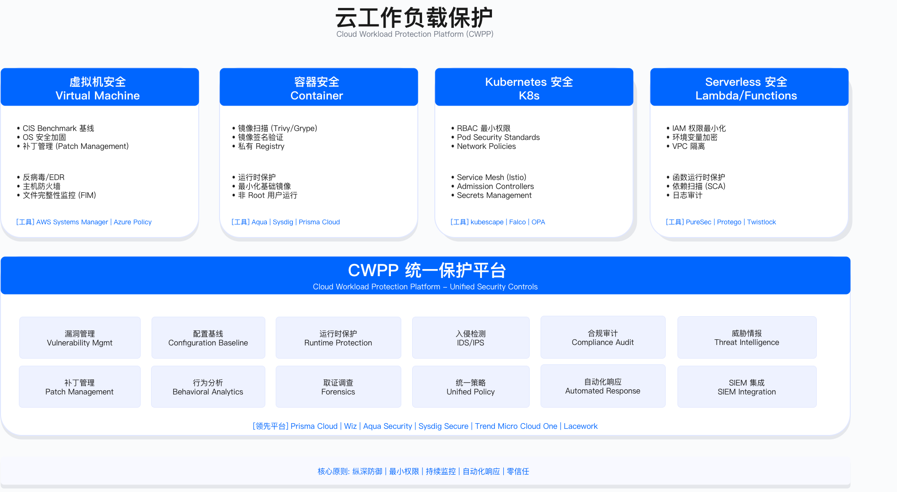

# 5.4　云工作负载保护

> 适用范围提示：本节覆盖虚拟机、容器与 Serverless 三类工作负载的保护基线。**训练集群与推理服务是第四类**，它们复用本节的镜像准入、运行时检测与最小权限原则，但另有三处本节不展开的差异：算力资源本身是攻击目标（算力盗用与训练任务抢占）、模型权重是需要验签才能加载的制品、推理端点的限流同时是抗拒绝服务与成本控制手段。这三处的配置形态见 [18.2 AI 安全架构设计与实施](../../第06部分_AI驱动的安全创新/第18章_AI系统安全/18.2_AI安全架构设计与实施.md) 的基础设施安全一节。

本节覆盖云工作负载从构建到运行的全栈安全控制——从 VM 安全基线与 Golden Image Factory，到容器镜像扫描与 CI/CD 集成，再到 Kubernetes RBAC/Pod Security/准入控制，以及 Serverless 最小权限设计与运行时威胁检测。与传统安全审计不同，云原生环境要求把安全控制嵌入 DevOps 流水线的每个环节：镜像扫描在 CI 阶段、准入控制在部署阶段、Falco eBPF 在运行时。

> 导读：5.4.1 讲解 CIS Benchmarks 与 EC2 Image Builder 自动化加固；5.4.2 构建容器安全全生命周期（Build → Ship → Run）；5.4.3 比较 Trivy/Grype/Snyk Container 镜像扫描工具并展示 CI/CD 集成；5.4.4 设计 Kubernetes RBAC、Pod Security Standards 与 OPA Gatekeeper/Kyverno 准入控制；5.4.5 展示 Serverless Lambda 最小权限 Terraform 配置；5.4.6 讲解 Falco eBPF 运行时检测规则；5.4.7 对比主流 CWPP 平台选型。工作负载保护依赖 5.2 IAM 控制面的权限边界，产生的告警汇聚到 5.8 云安全运营进行集中处置。

---

## 5.4.1 VM 安全基线：从手工加固到自动化合规

### CIS Benchmarks 概述

Center for Internet Security (CIS) 发布的安全配置基线覆盖主流操作系统与云平台，被 PCI DSS、HIPAA、NIST 等合规框架广泛引用[4]。CIS Benchmark 按平台分别维护（Amazon Linux、Ubuntu、AWS Foundations、Kubernetes 等各成一册），单册的配置检查项通常有数百条，覆盖文件系统、引导加载器、访问控制、网络、防火墙、SSH、审计、账户安全等控制类别；具体条目数量以所选版本的官方 PDF 为准，不同平台差异较大。

不同云平台、不同操作系统对同一条 CIS 基线的支持程度并不一致，因此需要先建立对 CIS 覆盖面的整体认知。下表把三大公有云对 CIS 镜像的支持情况并列，便于在选定操作系统前先确认"这条基线在目标平台上有没有官方镜像可用、支持到哪个版本"——这决定了能直接引用现成加固镜像，还是要自己维护加固脚本。

| 平台 | 支持镜像 | Benchmark 版本 | 级别 |
|------|---------|---------------|------|
| AWS | Amazon Linux 2/2023, RHEL, Ubuntu, Windows Server | v2.0+ | Level 1/2 |
| Azure | Ubuntu Server, RHEL, Windows Server, SLES | v1.5+ | Level 1/2 |
| GCP | Debian, Ubuntu, CentOS, Windows Server | v1.3+ | Level 1/2 |

表格最后一列的 Level 1/2 是选型时最容易被忽略却影响最大的一栏。它决定了加固强度与兼容性风险的平衡点：

Level 1 vs Level 2：Level 1 是基础安全配置，对性能和功能影响最小，适用于所有生产环境；Level 2 提供纵深防御但可能影响兼容性，适用于高安全要求环境，需充分测试后再推广。

CIS Benchmark 的数百项配置逐条手工执行既耗时又容易出错。EC2 Image Builder 将 CIS 加固固化到"黄金镜像"（Golden Image）流水线中——每次生成新的基础镜像时自动应用全部加固项，确保所有新建实例"生而安全"，而不依赖部署后的手工修复。

### AWS EC2 Image Builder 自动化加固

下面这份 Image Builder 配置回答的核心问题是：如何把"人工逐项加固"变成"流水线一次性固化"。选择 Image Builder 而非在启动脚本（user-data）里跑加固，是因为加固发生在镜像烘焙阶段而非实例启动阶段——加固结果被固化进 AMI，新实例开机即合规，既避免了每次启动重复执行加固的耗时，也避免了"启动脚本执行失败但实例照样上线"的窗口期。

这段配置由两段式骨架构成：`build` 阶段按"文件系统 → SSH → 审计日志"的顺序逐项落地 CIS 控制项，每个 step 对应一类加固（步骤 1 装工具、步骤 2 收紧文件系统、步骤 3 收紧 SSH、步骤 4 开审计）；`validate` 阶段则是整套配置的点睛之笔——它用 OpenSCAP 回扫，把"脚本跑过"和"确实合规"分开验证。

```yaml
# EC2 Image Builder 配置 - CIS Level 1 加固流水线
name: CIS-Hardened-Amazon-Linux-2023
description: CIS Level 1 hardened AMI with automated compliance checks
schemaVersion: 1.0

phases:
  - name: build
    steps:
      # 步骤 1：安装 CIS 加固组件（AWS 托管）
      - name: InstallCISHardening
        action: ExecuteBash
        inputs:
          commands:
            - |
              # 启用 AWS SSM Agent（用于后续配置管理和 Patch Manager）
              systemctl enable amazon-ssm-agent
              systemctl start amazon-ssm-agent

              # 安装 CIS-CAT Pro 扫描工具（需要 CIS 许可证）
              # 替代方案：使用开源 OpenSCAP
              yum install -y openscap-scanner scap-security-guide

      # 步骤 2：文件系统安全加固
      - name: FileSystemHardening
        action: ExecuteBash
        inputs:
          commands:
            - |
              # CIS 1.1: 禁用不必要的文件系统（防止内核漏洞利用）
              cat >> /etc/modprobe.d/cis-hardening.conf << EOF
              install cramfs /bin/true
              install freevxfs /bin/true
              install jffs2 /bin/true
              install hfs /bin/true
              install hfsplus /bin/true
              EOF

              # 配置 /tmp 挂载安全选项（nodev、nosuid、noexec 防止利用 /tmp 提权）
              cat >> /etc/fstab << EOF
              tmpfs /tmp tmpfs defaults,rw,nosuid,nodev,noexec,relatime 0 0
              EOF

      # 步骤 3：SSH 服务加固
      - name: SSHHardening
        action: ExecuteBash
        inputs:
          commands:
            - |
              cat > /etc/ssh/sshd_config << EOF
              # CIS 5.2: SSH 服务配置加固
              Protocol 2                          # 禁用 SSHv1（存在已知漏洞）
              PermitRootLogin no                  # 禁止 root 直接 SSH 登录
              PasswordAuthentication no           # 强制密钥认证
              PermitEmptyPasswords no             # 禁止空密码
              MaxAuthTries 3                      # 限制认证失败次数（防暴力破解）
              LoginGraceTime 60                   # 认证超时时间
              X11Forwarding no                    # 禁用 X11 转发（减少攻击面）
              AllowTcpForwarding no               # 禁用 TCP 隧道（除非必要）
              ClientAliveInterval 300             # 连接保活间隔
              ClientAliveCountMax 0               # 空闲超时断开
              EOF

              systemctl restart sshd

      # 步骤 4：审计日志配置（auditd）
      - name: AuditLogging
        action: ExecuteBash
        inputs:
          commands:
            - |
              # 安装并配置 auditd（记录敏感系统操作）
              yum install -y audit
              systemctl enable auditd

              cat > /etc/audit/rules.d/cis-hardening.rules << EOF
              # 监控特权提升（sudo、su）
              -a always,exit -F arch=b64 -S execve -F euid=0 -F auid>=1000 -F auid!=4294967295 -k privilege_escalation

              # 监控账户和组管理操作
              -w /etc/passwd -p wa -k identity
              -w /etc/group -p wa -k identity
              -w /etc/shadow -p wa -k identity

              # 监控 SSH 密钥文件变更
              -w /etc/ssh/sshd_config -p wa -k sshd

              # 监控网络配置变更
              -a always,exit -F arch=b64 -S sethostname -S setdomainname -k system-locale
              EOF

              service auditd restart

  - name: validate
    steps:
      # 验证步骤：运行 OpenSCAP 扫描，确认 CIS Level 1 通过率
      - name: ValidateCISCompliance
        action: ExecuteBash
        inputs:
          commands:
            - |
              # 运行 CIS Level 1 扫描（分数 < 80% 则构建失败）
              oscap xccdf eval \
                --profile xccdf_org.ssgproject.content_profile_cis_server_l1 \
                --results /tmp/cis-results.xml \
                /usr/share/xml/scap/ssg/content/ssg-amzn2023-ds.xml || true

              # 解析通过率（< 80% 退出码非 0 导致 Image Builder 构建失败）
              PASS_RATE=$(grep -o 'pass="[0-9]*"' /tmp/cis-results.xml | head -1 | grep -o '[0-9]*')
              TOTAL=$(grep -o 'total="[0-9]*"' /tmp/cis-results.xml | head -1 | grep -o '[0-9]*')
              echo "CIS Level 1 Pass Rate: ${PASS_RATE}/${TOTAL}"

              # 低于阈值则构建失败
              if [ $((PASS_RATE * 100 / TOTAL)) -lt 80 ]; then
                echo "ERROR: CIS compliance below 80% threshold"
                exit 1
              fi
```

这里 validate 阶段的意义在于：CIS 加固脚本执行不等于加固成效——某些配置项可能因系统环境差异而未生效。通过 OpenSCAP 扫描作为验收门禁，任何 CIS Level 1 通过率低于 80% 的镜像构建直接失败，不会进入镜像库。这将"合规验收"从人工审查变为自动化门禁。注意 `oscap` 命令后缀的 `|| true`：扫描本身即便返回非零退出码也不让 step 中断，真正的门禁判定交给后面手工解析通过率的 `if` 逻辑——这样才能先拿到分数、再决定是否 `exit 1`，而不是让扫描工具的退出码直接左右构建成败。

生产陷阱：
- `MaxAuthTries 3` 配合 `fail2ban` 时需注意：fail2ban 依赖 auth.log 解析 SSH 失败事件，若 auditd 未正确配置，fail2ban 可能检测不到暴力破解
- Image Builder 构建时间受 OpenSCAP 扫描耗时影响（典型 5-10 分钟），CI/CD 流水线需预留
- 禁用 `PasswordAuthentication` 前，必须先验证 EC2 Instance Connect 或 SSM Session Manager 的替代访问方式可用，否则紧急情况下可能失去实例访问途径

### 配置漂移检测与自动修复

黄金镜像解决了"生而安全"，但实例上线后配置仍会被人为改动、临时补丁、故障排查等操作悄悄改回不安全状态——这就是配置漂移。下面的代码回答的是"如何持续把实例拉回基线"：用 State Manager 做周期性检查、用 SSM Automation 做自动纠偏，形成"检测—修复"闭环，而不是等到下一次审计才发现问题。

这段 Python 由两个分工不同的函数构成：`create_drift_detection_association` 负责"何时查、查谁"——它用 tag 选中生产实例、用 cron 表达式设定检查节奏，属于调度层；`auto_remediate_drift` 负责"发现漂移后怎么改"——它按 `rule_name` 分派到具体修复动作。函数注释里那句"自动修复前必须在 staging 环境验证修复脚本的副作用"是关键约束：`sed` 就地改写 `sshd_config` 并 reload 是不可逆的批量操作，一旦修复脚本本身有误，会被同步推向所有匹配实例。

```python
import boto3

ssm = boto3.client('ssm')
config = boto3.client('config')

def create_drift_detection_association():
    """
    创建 SSM Association，定期对所有 EC2 实例运行 CIS 合规检查
    发现漂移时自动触发修复或告警
    """
    response = ssm.create_association(
        Name='AWS-RunInspectorAssessments',
        AssociationName='CIS-Compliance-Check',
        Targets=[{'Key': 'tag:Environment', 'Values': ['production']}],
        ScheduleExpression='cron(0 2 ? * MON *)',  # 每周一凌晨 2 点检查
        Parameters={
            'assessmentTemplateArn': ['arn:aws:inspector:us-east-1:...'],
        },
        ComplianceSeverity='HIGH'
    )
    return response

def auto_remediate_drift(finding: dict):
    """
    配置漂移自动修复：将发现的不合规配置推送到 SSM Automation 修复
    注意：自动修复前必须在 staging 环境验证修复脚本的副作用
    """
    instance_id = finding.get('InstanceId')
    rule_name = finding.get('RuleName')

    if rule_name == 'ssh-password-auth-enabled':
        # 自动修复：禁用 SSH 密码认证
        ssm.send_command(
            InstanceIds=[instance_id],
            DocumentName='AWS-RunShellScript',
            Parameters={
                'commands': [
                    'sed -i "s/^PasswordAuthentication yes/PasswordAuthentication no/" /etc/ssh/sshd_config',
                    'systemctl reload sshd'
                ]
            }
        )
```

这段代码的设计取舍在于：它选择用 tag（`tag:Environment=production`）而非枚举实例 ID 来圈定目标，这样新扩容的实例只要打上标签就自动纳入检查范围，无需改代码；代价是 tag 治理必须严格，漏打标签的实例会成为检测盲区。修复动作按 `rule_name` 精确分派而非"一刀切修复所有问题"，也是刻意为之——只有被验证过安全的规则才写进 `if` 分支，未覆盖的规则宁可告警交人工处理，避免自动修复捅出更大的娄子。

验证方法：
- 部署测试实例，手动修改 `/etc/ssh/sshd_config` 启用密码认证（制造漂移），验证 State Manager 在下次检查周期内自动修复并在 CloudTrail 留下审计记录
- 使用 AWS Config 规则 `ec2-instance-managed-by-ssm` 确认所有生产实例纳入管理

运行指标：
- CIS Level 1 通过率：目标 ≥90%（生产环境），通过 Security Hub 仪表板监控
- 配置漂移修复时效：发现到修复 ≤24 小时（P95）
- Golden Image 更新周期：每月至少一次（覆盖操作系统安全补丁）

---

## 5.4.2 容器安全生命周期：Build → Ship → Run

容器化加速了部署节奏，也放大了安全风险的传播速度：一个包含 Log4Shell 的基础镜像可以在数小时内扩散到数百个运行中的容器。容器安全的核心思路是在每个阶段建立控制门：Build 阶段消灭已知漏洞，Ship 阶段保证镜像完整性，Run 阶段检测异常行为。



### Build 阶段：安全基础镜像与最小化

Build 阶段的安全成效几乎全部由 Dockerfile 的写法决定——镜像里装了什么、以谁的身份运行、暴露了哪些端口，一旦烘焙进镜像就会被后续所有实例继承。以下通过"反模式"与"最佳实践"两份 Dockerfile 对照，揭示每个决策点如何影响攻击面：不安全写法（`latest` 标签、root 运行、多余端口）在功能上完全可用，只有并列对比才能清晰展示其代价。

不安全的 Dockerfile 与安全版本对比——差异决定了攻击面大小：

不安全的 Dockerfile（反模式）：

```dockerfile
# 问题 1: latest 标签无法锁定版本，每次构建可能引入新漏洞
FROM node:latest

# 问题 2: 以 root 用户运行（容器逃逸后等同于获得宿主机 root）
WORKDIR /app
COPY . .
RUN npm install

# 问题 3: 暴露不必要的端口（增加攻击面）
EXPOSE 22 8080 9090

# 问题 4: 没有健康检查（无法检测应用异常状态）
CMD ["node", "server.js"]
```

安全的 Dockerfile（最佳实践）：

```dockerfile
# ============ Build Stage ============
# 使用精确版本标签（包含 SHA256 哈希更安全）
FROM node:20.11.0-alpine3.19 AS builder

# 以非 root 用户执行构建（减少构建时漏洞利用风险）
USER node
WORKDIR /home/node/app

# 先复制 package.json（利用 Docker 层缓存加速构建，依赖未变则不重新安装）
COPY --chown=node:node package*.json ./
RUN npm ci --only=production  # ci 比 install 更严格（锁定版本、校验哈希）

COPY --chown=node:node . .
RUN npm run build

# ============ Runtime Stage ============
# 多阶段构建：只将必要文件复制到最终镜像，不包含编译工具、源代码、测试文件
FROM node:20.11.0-alpine3.19 AS runtime

# 安装安全更新（alpine 包管理器）
RUN apk update && apk upgrade --no-cache && \
    apk add --no-cache dumb-init  # dumb-init 作为 PID 1，正确处理信号和僵尸进程

# 创建专用非 root 用户（UID/GID 指定非 root 范围）
RUN addgroup -g 1001 -S nodejs && \
    adduser -S nodejs -u 1001 -G nodejs

WORKDIR /app

# 只复制生产运行所需文件
COPY --chown=nodejs:nodejs --from=builder /home/node/app/dist ./dist
COPY --chown=nodejs:nodejs --from=builder /home/node/app/node_modules ./node_modules

# 切换到非 root 用户（之后所有操作以此用户执行）
USER nodejs

# 只暴露必要端口（删除 22、9090 等调试端口）
EXPOSE 8080

# 健康检查（K8s liveness probe 依赖此）
HEALTHCHECK --interval=30s --timeout=3s --start-period=5s --retries=3 \
  CMD wget --quiet --tries=1 --spider http://localhost:8080/health || exit 1

# 使用 dumb-init 作为 PID 1（避免僵尸进程问题）
ENTRYPOINT ["dumb-init", "--"]
CMD ["node", "dist/server.js"]
```

这两份文件有四组一一对应的差异：`node:latest` 对 `node:20.11.0-alpine3.19`（可复现 vs 每次构建漂移）、隐式 root 对显式 `USER nodejs`（逃逸即宿主机 root vs 权限受限）、`EXPOSE 22 8080 9090` 对 `EXPOSE 8080`（三个入口 vs 一个入口）、无健康检查对 `HEALTHCHECK`（异常不可感知 vs 编排层可探活）。安全版本额外引入的多阶段结构（`AS builder` / `AS runtime`）是把"构建期需要、运行期不需要"的东西彻底隔离的手段。

多阶段构建的安全收益：最终镜像不包含 npm、编译器、源代码、测试文件，攻击者即使获得容器访问权限，能利用的工具和文件大幅减少。Alpine 基础镜像（~5MB vs Ubuntu ~72MB）进一步减少了潜在漏洞数量（更少的预装软件意味着更少的 CVE）。

需要提醒的生产权衡是：Alpine 使用 musl libc 而非 glibc，某些依赖原生扩展或 glibc 特性的应用（如部分 Node 原生模块、Python 科学计算库）在 Alpine 上可能编译失败或运行异常。因此"越小越安全"不是无条件成立的——上生产前要在 Alpine 基础镜像上完整跑一遍构建与集成测试，确认兼容后再享受它带来的攻击面收益。

---

## 5.4.3 容器镜像扫描：工具选型与 CI/CD 集成

### 主流扫描工具对比

到了 Ship 阶段，控制门从"怎么构建镜像"转向"这个镜像能不能放行"。镜像扫描工具就是这道门的把关者，但市面上工具众多、能力交叉，选错会导致要么误报淹没团队、要么与现有流水线格格不入。下表沿几个真正影响落地的维度横向对比，帮助在"开源 vs 商业""扫描深度 vs 集成体验"之间定位。

镜像扫描工具的核心差异在于：漏洞数据库的更新频率、误报率、与 CI/CD 系统的集成深度、SBOM（软件物料清单）生成能力。

| 维度 | Trivy | Grype | Snyk Container |
|------|-------|-------|----------------|
| 开源/商业 | 开源（Aqua Security） | 开源（Anchore） | 商业（含免费层） |
| 漏洞数据库 | trivy-db（日更） | grype-db（日更） | Snyk 专有数据库 |
| 误报率 | 低（较好的误报过滤） | 中 | 低（含可利用性评分） |
| 扫描目标 | 镜像、文件系统、IaC、代码 | 镜像、文件系统、SBOM | 镜像、代码、SaaS |
| SBOM 生成 | 支持（CycloneDX、SPDX） | 支持（SPDX） | 支持 |
| CI 集成 | GitHub Actions、GitLab、Jenkins | GitHub Actions、Jenkins | GitHub、GitLab、Bitbucket |
| 可利用性信息 | 有限 | 有限 | 丰富（含 PoC 标记） |
| 推荐场景 | 开源优先、多目标扫描 | 轻量快速扫描 | 开发者体验优先 |

这张表里没有"哪一列全绿"的赢家，每一列对应一种约束下的最优解——已有 Aqua 合同对应 Trivy 列，追求 IDE 内实时反馈对应 Snyk 列。最后一行"推荐场景"是三列各自的适配靶心，其余各行则是支撑这个靶心的证据。

选型判断：没有"最好"的工具——选型取决于约束。已有 Aqua 合同的企业自然倾向 Trivy；开发者体验优先（在 IDE 中实时扫描）倾向 Snyk；纯开源工具链倾向 Grype。建议选择一个工具用于 CI/CD 门禁（强制、自动），另一个用于深度分析（按需、人工），不要在同一 Pipeline 中串联多个扫描工具（增加流水线耗时，而且结果合并困难）。

### Trivy CI/CD 集成示例

选定工具后，真正决定它有没有价值的是它在流水线里的"位置"和"权力"——扫描放在推送前还是推送后、发现高危漏洞是拦住构建还是仅仅记录，这两个决策把"扫描"和"门禁"区分开来。下面这份 GitHub Actions 工作流示范的正是一个有拦截权的门禁：先构建但不推送、扫描通过才放行推送。

这份 YAML 的编排逻辑遵循四个关键步骤的先后顺序：`Build`（`push: false`，只构建不推送）→ `Run Trivy`（发现 CRITICAL/HIGH 即 `exit-code: '1'` 令工作流失败）→ `Upload SARIF`（`if: always()` 保证失败也能看到告警详情）→ `Push image`（只有前面全过才推送）。这条"构建—扫描—放行"的顺序是整个门禁的骨架，几个参数则是骨架上的控制旋钮。

```yaml
# GitHub Actions 工作流：容器镜像安全扫描门禁
name: Container Security Scan

on:
  push:
    branches: [main, develop]
  pull_request:
    branches: [main]

env:
  REGISTRY: ghcr.io
  IMAGE_NAME: ${{ github.repository }}
  # 扫描严重性阈值：CRITICAL 级别漏洞必须 0 个才能通过
  SEVERITY_THRESHOLD: CRITICAL,HIGH

jobs:
  build-and-scan:
    runs-on: ubuntu-latest
    permissions:
      contents: read
      packages: write
      security-events: write  # 上传 SARIF 结果到 GitHub Security 标签

    steps:
      - name: Checkout code
        uses: actions/checkout@v4

      - name: Build Docker image
        id: build
        uses: docker/build-push-action@v5
        with:
          context: .
          push: false  # 先构建不推送，扫描通过后才推送
          tags: ${{ env.REGISTRY }}/${{ env.IMAGE_NAME }}:${{ github.sha }}
          labels: |
            org.opencontainers.image.source=${{ github.repositoryUrl }}
            org.opencontainers.image.revision=${{ github.sha }}

      - name: Run Trivy vulnerability scanner
        uses: aquasecurity/trivy-action@0.28.0
        with:
          image-ref: ${{ env.REGISTRY }}/${{ env.IMAGE_NAME }}:${{ github.sha }}
          format: 'sarif'          # SARIF 格式供 GitHub Security 标签展示
          output: 'trivy-results.sarif'
          severity: ${{ env.SEVERITY_THRESHOLD }}
          exit-code: '1'           # CRITICAL/HIGH 漏洞存在时 exit 1，工作流失败
          ignore-unfixed: true     # 忽略尚无修复版本的漏洞（减少噪音，专注可修复项）
          pkg-types: 'os,library'  # 扫描 OS 包和应用依赖
          # 忽略列表：已审批的已知漏洞（需要安全团队审批记录）
          trivyignores: '.trivyignore'

      - name: Upload Trivy scan results to GitHub Security
        uses: github/codeql-action/upload-sarif@v3
        if: always()  # 即使扫描失败也上传结果（便于查看告警详情）
        with:
          sarif_file: 'trivy-results.sarif'

      - name: Generate SBOM
        # 扫描通过后生成软件物料清单（供应链安全要求）
        uses: aquasecurity/trivy-action@0.28.0
        if: github.ref == 'refs/heads/main'  # 只在主分支生成 SBOM
        with:
          image-ref: ${{ env.REGISTRY }}/${{ env.IMAGE_NAME }}:${{ github.sha }}
          format: 'cyclonedx'
          output: 'sbom.json'

      - name: Push image (only if scan passed)
        # 扫描通过后才推送镜像到仓库
        uses: docker/build-push-action@v5
        with:
          context: .
          push: true
          tags: ${{ env.REGISTRY }}/${{ env.IMAGE_NAME }}:${{ github.sha }}
```

`ignore-unfixed: true` 是实际运营中的关键权衡：没有修复版本的漏洞即使告警也无法修复，只会增加噪音导致团队忽略告警。聚焦"已有修复但未应用"的漏洞，才能产生可执行的行动项。`.trivyignore` 文件存储已审批的例外（如某个漏洞评估后风险可接受），需要配合审批工作流管理，防止随意豁免。这里还藏着一个容易被忽视的设计：`Upload SARIF` 步骤用 `if: always()` 而不是默认行为——因为一旦扫描步骤 `exit 1`，后续步骤默认会被跳过，那样安全团队反而看不到"到底是哪些漏洞导致失败"，`always()` 保证了失败时告警照样进入 GitHub Security 面板，把"拦截"和"可观测"两件事都兼顾到。

运行指标：
- P0/CRITICAL 漏洞修复时效：目标 24 小时内（从 CI 告警到镜像更新）
- 镜像扫描覆盖率：生产环境镜像 100% 扫描
- 平均漏洞修复周期（MTTR）：CRITICAL ≤24h，HIGH ≤72h，Medium ≤14 天

---

## 5.4.4 Kubernetes 安全：RBAC、Pod Security 与准入控制

### RBAC 最小权限设计

进入 Run 阶段，第一道控制面是"谁能对集群做什么"。Kubernetes 里横向移动的燃料往往就是过宽的 RBAC——攻陷一个 Pod 后，如果它绑定的 ServiceAccount 权限过大，攻击者就能顺着这条身份链读遍集群。因此 RBAC 设计的目标不是"配好权限"，而是"把每个身份的权限压到刚好够用"。

Kubernetes RBAC 的核心原则是：每个 ServiceAccount 只能做它需要做的事，不多一分。Capital One 案例（5.2）显示 SSRF 漏洞结合过宽的 IAM 权限导致大规模数据泄露——K8s RBAC 设计不当同样可以让攻击者横向移动到整个集群。

下面这组清单是一个完整的最小权限单元，由"三件套 + 一条云侧绑定"构成：`ServiceAccount` 是身份、`Role` 是这个身份在单一 Namespace 内能碰哪些资源、`RoleBinding` 把身份和权限缝合。真正体现"最小"的是 `Role` 里 `verbs` 只有 `get/list/watch`（纯只读，没有任何写操作），以及注释里明确点出的"不授权 secrets/nodes/namespaces"——被排除的权限和被授予的权限同样是设计意图。

```yaml
# ============ 只读服务账号：用于监控、审计类工作负载 ============
apiVersion: v1
kind: ServiceAccount
metadata:
  name: app-readonly-sa
  namespace: production
  annotations:
    # 绑定 AWS IAM Role（IRSA：Pod 级别的 IAM 权限，不共享 Node Role）
    eks.amazonaws.com/role-arn: arn:aws:iam::123456789012:role/app-readonly-role
---
apiVersion: rbac.authorization.k8s.io/v1
kind: Role  # Role 作用于单一 Namespace（vs ClusterRole 全集群）
metadata:
  name: app-readonly-role
  namespace: production
rules:
  # 只赋予业务需要的最小权限
  - apiGroups: [""]
    resources: ["pods", "services", "configmaps"]
    verbs: ["get", "list", "watch"]  # 只读：无 create/update/delete/patch
  - apiGroups: ["apps"]
    resources: ["deployments", "replicasets"]
    verbs: ["get", "list"]
  # 明确不授权：secrets（敏感配置）、nodes（节点信息）、namespaces（跨命名空间）
---
apiVersion: rbac.authorization.k8s.io/v1
kind: RoleBinding
metadata:
  name: app-readonly-binding
  namespace: production
subjects:
  - kind: ServiceAccount
    name: app-readonly-sa
    namespace: production
roleRef:
  kind: Role
  name: app-readonly-role
  apiGroup: rbac.authorization.k8s.io
```

这份配置还把 K8s 集群内权限和 AWS 云侧权限打通了——`ServiceAccount` 上的 `eks.amazonaws.com/role-arn` 注解正是 IRSA 的接入点。

IRSA（IAM Roles for Service Accounts）是 EKS 上的最佳实践：每个 Pod 获得独立的 IAM 身份（通过 ServiceAccount），而不是共享 Node 上的 EC2 Instance Role。这意味着即使某个 Pod 被攻陷，攻击者的 AWS 权限也仅限于该 ServiceAccount 绑定的 IAM Role，无法访问其他 Pod 的 AWS 资源。换句话说，RBAC 把集群内的横向移动关进 Namespace，IRSA 把云侧的横向移动关进单个 ServiceAccount——两者叠加才构成完整的权限边界。

常见误区：
- 使用 `ClusterRole` 而非 `Role`：ClusterRole 作用于全集群，比 Role（单 Namespace）权限大得多，应默认使用 Role
- `default` ServiceAccount 权限过宽：K8s 默认所有 Pod 使用 `default` SA，若未显式创建专用 SA，所有 Pod 共享 `default` SA 的权限，攻陷任意 Pod 即可利用这些权限

### Pod Security Standards 实施

RBAC 管的是"身份能调用哪些 API"，但攻击者一旦拿到容器内的 shell，很多危害（提权、写后门、逃逸）根本不经过 API Server。Pod Security Standards 补的正是这一层：它约束 Pod 自身的运行时安全属性（是否 root、能否提权、根文件系统是否可写）。之所以要引入 PSS，是因为老的 PodSecurityPolicy 已在新版本被移除，PSS 用更简单的 Namespace 标签接管了这个职责。

PodSecurityPolicy 自 Kubernetes 1.21 起弃用，并在 1.25 中被正式移除[1]；替代方案是 Pod Security Admission 控制器（同在 1.25 达到 Stable[2]），它按 Pod Security Standards 定义的 privileged / baseline / restricted 三档策略[3]，通过 Namespace 标签强制执行。

下面这份清单分两部分读：上半段是 Namespace 级别的"总开关"，`enforce/audit/warn` 三个标签对应三种执行力度——同时挂三个是给迁移留缓冲（生产用 enforce 硬拦、迁移期用 audit 只记录、测试环境用 warn 只提示），并非冗余；下半段是一个"通过体检"的 Pod 示范，逐条对上 `restricted` 标准的要求。看 Pod 时抓 `securityContext` 里那几行硬约束即可，它们是 restricted 级别的核心。

```yaml
# 在 Namespace 级别强制执行 Pod 安全基线
apiVersion: v1
kind: Namespace
metadata:
  name: production
  labels:
    # enforce: 违规 Pod 直接拒绝创建（生产环境推荐）
    pod-security.kubernetes.io/enforce: restricted
    pod-security.kubernetes.io/enforce-version: v1.29
    # audit: 记录违规但不阻止（迁移期间使用）
    pod-security.kubernetes.io/audit: restricted
    pod-security.kubernetes.io/audit-version: v1.29
    # warn: 生成警告但不阻止（测试环境使用）
    pod-security.kubernetes.io/warn: restricted
    pod-security.kubernetes.io/warn-version: v1.29
---
# 符合 restricted 标准的 Pod 配置示例
apiVersion: v1
kind: Pod
metadata:
  name: secure-app
  namespace: production
spec:
  securityContext:
    runAsNonRoot: true          # 容器不能以 root 用户运行
    runAsUser: 10001            # 指定非 root UID
    runAsGroup: 10001
    fsGroup: 10001              # 文件系统 Group ID
    seccompProfile:
      type: RuntimeDefault      # 启用 seccomp 过滤系统调用（默认 profile）
  containers:
    - name: app
      image: myapp:1.2.3
      securityContext:
        allowPrivilegeEscalation: false   # 禁止特权提升（防止 setuid 程序提升权限）
        readOnlyRootFilesystem: true      # 根文件系统只读（防止攻击者写入恶意文件）
        capabilities:
          drop: ["ALL"]         # 删除所有 Linux Capabilities
          add: ["NET_BIND_SERVICE"]  # 只添加必要的（绑定 <1024 端口）
      resources:
        limits:
          cpu: "500m"
          memory: "512Mi"
        requests:
          cpu: "100m"
          memory: "128Mi"
      volumeMounts:
        - name: tmp            # 应用需要写入时使用 tmpfs 挂载
          mountPath: /tmp
  volumes:
    - name: tmp
      emptyDir:
        medium: Memory         # 内存挂载（tmpfs），不写磁盘
```

`restricted` 级别是三个 PSS 级别（privileged/baseline/restricted）中限制最强的，适合生产环境。`readOnlyRootFilesystem: true` 意味着攻击者获得 shell 访问后无法在容器文件系统写入持久化文件（如 webshell、后门脚本），显著增加横向移动难度。这里的设计连锁值得点出：一旦根文件系统只读，应用自身合法的临时写入（如缓存、上传暂存）也会被拒绝——所以清单末尾用一个内存型 `emptyDir`（`medium: Memory`）把 `/tmp` 单独挂成可写的 tmpfs，既满足应用写入需求，又不给攻击者留下磁盘持久化的落脚点。这是"默认拒绝、按需开洞"的典型手法。

### OPA Gatekeeper 策略执行

RBAC 和 PSS 各自解决了"身份权限"和"Pod 安全属性"，但组织往往还有大量自定义合规诉求——比如"生产环境禁止 latest 标签""镜像必须来自可信仓库"。这些规则 PSS 覆盖不到，需要一个可编程的准入控制层。OPA Gatekeeper 就是把这类策略写成代码、在部署那一刻强制执行的机制。

OPA（Open Policy Agent）Gatekeeper 将安全策略以代码形式（Rego 语言）表达，通过 K8s Admission Webhook 在部署时强制执行。

Gatekeeper 的策略拆成两层：`ConstraintTemplate` 定义"规则逻辑"（用 Rego 写的 `violation` 块，命中即返回一条违规消息），`Constraint` 定义"规则适用范围"（作用到哪些资源类型、哪些 Namespace、命中后是拒绝还是仅审计）。模板里出现两个 `violation` 块不是重复——一个查 `containers`、一个查 `initContainers`，因为初始化容器同样可能偷偷用 latest 标签溜进来。落地时的关键是 `Constraint` 里的 `enforcementAction`，它决定这条策略是真拦（deny）还是先观察（dryrun）。

```yaml
# 定义约束模板（ConstraintTemplate）：禁止使用 latest 标签
apiVersion: templates.gatekeeper.sh/v1beta1
kind: ConstraintTemplate
metadata:
  name: k8snolatestimage
  annotations:
    description: "Prohibits images with 'latest' tag to enforce immutable deployments"
spec:
  crd:
    spec:
      names:
        kind: K8sNoLatestImage
  targets:
    - target: admission.k8s.gatekeeper.sh
      rego: |
        package k8snolatestimage

        violation[{"msg": msg}] {
          # 检查所有 containers
          container := input.review.object.spec.containers[_]
          # 判断是否使用 latest 标签（或无标签，默认 latest）
          endswith(container.image, ":latest")
          msg := sprintf("Container %v uses 'latest' tag which is not allowed in production. Use a specific version tag.", [container.name])
        }

        violation[{"msg": msg}] {
          # 检查 initContainers
          container := input.review.object.spec.initContainers[_]
          endswith(container.image, ":latest")
          msg := sprintf("initContainer %v uses 'latest' tag which is not allowed.", [container.name])
        }
---
# 实例化约束（Constraint）：应用到 production Namespace
apiVersion: constraints.gatekeeper.sh/v1beta1
kind: K8sNoLatestImage
metadata:
  name: no-latest-image-prod
spec:
  match:
    kinds:
      - apiGroups: [""]
        kinds: ["Pod"]
      - apiGroups: ["apps"]
        kinds: ["Deployment", "StatefulSet", "DaemonSet"]
    namespaces: ["production", "staging"]
  enforcementAction: deny  # deny（拒绝）/ warn（警告）/ dryrun（审计）
```

把"规则逻辑"和"适用范围"拆成模板与约束两层，是 Gatekeeper 刻意的设计取舍：同一个模板可以被多个约束以不同 `enforcementAction`、不同 Namespace 复用，让安全团队写一次 Rego、平台团队按环境分别实例化。代价则是学习曲线——写 Rego 需要理解它的声明式匹配语义，这也是下面 Kyverno 存在的理由。

OPA Gatekeeper 与 Kyverno 的选择：两者都能实现 K8s 准入控制策略，差异在于策略语言（Rego vs YAML/CEL）和学习曲线。Rego 功能强大但学习成本高，适合安全团队有编程能力的场景；Kyverno 使用 YAML 配置，适合 K8s 管理员快速上手。如果团队已在使用 OPA 做其他策略决策，Gatekeeper 可复用现有 Rego 知识；新团队从 Kyverno 起步更快。

下面这份 Kyverno 策略实现的是与上面 Gatekeeper 完全相同的"禁止 latest"目标，放在一起正是为了直观对照两种表达方式的取舍。它没有 Rego，判定逻辑就藏在 `validate.pattern` 里的一行 `image: "!*:latest"`——用通配符否定式表达"镜像名不得以 :latest 结尾"，把上面十几行 Rego 压成了一条声明式匹配。这就是 Kyverno 上手快的直接体现，代价是复杂逻辑（跨字段判断、外部数据查询）不如 Rego 灵活。

```yaml
# Kyverno 等效策略：禁止 latest 标签（YAML 风格，无需学习 Rego）
apiVersion: kyverno.io/v1
kind: ClusterPolicy
metadata:
  name: no-latest-tag
spec:
  validationFailureAction: Enforce   # Enforce（拒绝）/ Audit（审计）
  background: true                   # 对已有资源审计
  rules:
    - name: check-image-tag
      match:
        any:
          - resources:
              kinds: ["Pod"]
              namespaces: ["production", "staging"]
      validate:
        message: "Using latest tag is prohibited. Specify an exact image version."
        pattern:
          spec:
            containers:
              - image: "!*:latest"   # 排除 latest 标签（支持通配符）
            initContainers:
              - image: "!*:latest"
```

验证方法：
- 尝试在 production Namespace 部署使用 `nginx:latest` 的 Pod，验证被拒绝并返回明确错误信息
- 运行 `kubectl get constraints` 验证约束已应用，`kubectl describe k8snolatestimage no-latest-image-prod` 查看违规历史

---

## 5.4.5 Serverless 安全：Lambda 最小权限设计

Serverless 函数的安全挑战与 EC2 不同：函数存活时间短（毫秒到分钟），传统 EDR 来不及扫描；函数数量多（一个应用可能有 100+ Lambda），权限管理容易粗放；函数与 AWS 服务高度集成，IAM 权限设计错误后果严重。

### 最小权限 IAM 设计（Terraform）

正因为函数存活太短、传统运行时防护够不着，Serverless 的安全重心被迫前移到"权限设计"这一环——函数被攻陷时，攻击者能做什么完全取决于它那份 IAM 策略给了多少。下面这份 Terraform 用一个真实场景（处理上传文件、写 S3 + 记 DynamoDB）来示范"刚好够用"的权限该长什么样，选择 Terraform 而非控制台点选，是为了让最小权限以代码形式固化、可评审、可复用。

这份配置分三块读：`aws_lambda_function` 是函数本体（连带 VPC、X-Ray、死信队列等纵深配置）；`aws_iam_role` 是身份骨架（只声明"我是一个可被 Lambda 服务担任的角色"）；`aws_iam_role_policy` 才是权限的重头戏。读策略时不要逐条看动作名，而要盯每个 `Statement` 的 `Action` 与 `Resource` 的配比——真正的最小权限体现在"动作被砍到只剩必需的那几个"且"资源被收窄到具体 ARN 或路径前缀"这两点同时成立。

```hcl
# Lambda 函数：处理用户上传文件（写入 S3 + 记录 DynamoDB）
resource "aws_lambda_function" "file_processor" {
  filename         = "file_processor.zip"
  function_name    = "file-processor"
  role             = aws_iam_role.lambda_execution_role.arn
  handler          = "handler.process"
  runtime          = "python3.12"
  timeout          = 30
  memory_size      = 256

  environment {
    variables = {
      # 敏感配置通过 Parameter Store 而非环境变量直接传入
      DB_SECRET_ARN = aws_secretsmanager_secret.db_secret.arn
      BUCKET_NAME   = aws_s3_bucket.processed_files.bucket
    }
  }

  # VPC 配置：将 Lambda 放入私有子网，阻止公网直接访问
  vpc_config {
    subnet_ids         = var.private_subnet_ids
    security_group_ids = [aws_security_group.lambda_sg.id]
  }

  # 启用 X-Ray 追踪（用于性能分析和异常检测）
  tracing_config {
    mode = "Active"
  }

  # 死信队列：处理失败的事件保存到 SQS（便于调试和重放）
  dead_letter_config {
    target_arn = aws_sqs_queue.dlq.arn
  }
}

# IAM 执行角色：遵循最小权限原则
resource "aws_iam_role" "lambda_execution_role" {
  name = "file-processor-lambda-role"

  assume_role_policy = jsonencode({
    Version = "2012-10-17"
    Statement = [{
      Action    = "sts:AssumeRole"
      Effect    = "Allow"
      Principal = { Service = "lambda.amazonaws.com" }
    }]
  })
}

# 自定义策略：只授予必要权限
resource "aws_iam_role_policy" "lambda_policy" {
  name = "file-processor-policy"
  role = aws_iam_role.lambda_execution_role.id

  policy = jsonencode({
    Version = "2012-10-17"
    Statement = [
      # 只允许写入特定前缀（processed/），不允许读取或删除
      {
        Sid    = "S3WriteProcessedFiles"
        Effect = "Allow"
        Action = ["s3:PutObject"]  # 只有 PutObject，没有 GetObject/DeleteObject
        Resource = "arn:aws:s3:::${aws_s3_bucket.processed_files.bucket}/processed/*"
      },
      # 只允许写入特定 DynamoDB 表
      {
        Sid    = "DynamoDBWriteItems"
        Effect = "Allow"
        Action = [
          "dynamodb:PutItem",
          "dynamodb:UpdateItem"
          # 没有 DeleteItem、Scan、Query（不需要读取历史记录）
        ]
        Resource = aws_dynamodb_table.file_metadata.arn
      },
      # 读取 Secrets Manager（数据库密码）——不允许修改
      # 注意：IAM 策略无法原生表达"每日办公时段"这类周期性时间窗口。
      # aws:CurrentTime 只能做单点的 DateGreaterThan/DateLessThan 比较，
      # 用它拼不出跨天循环的时段限制；真要做时段管控，应在调用方逻辑或
      # SCP/权限边界层面实现，切勿用一条从某日起恒为 true 的条件冒充控制。
      {
        Sid    = "SecretsManagerRead"
        Effect = "Allow"
        Action = ["secretsmanager:GetSecretValue"]
        Resource = aws_secretsmanager_secret.db_secret.arn
      },
      # CloudWatch Logs（必须：Lambda 运行日志）
      {
        Sid    = "CloudWatchLogs"
        Effect = "Allow"
        Action = [
          "logs:CreateLogGroup",
          "logs:CreateLogStream",
          "logs:PutLogEvents"
        ]
        Resource = "arn:aws:logs:*:*:log-group:/aws/lambda/file-processor:*"
      },
      # VPC 网络接口（Lambda 在 VPC 内运行所需）
      {
        Sid    = "VPCNetworkInterface"
        Effect = "Allow"
        Action = [
          "ec2:CreateNetworkInterface",
          "ec2:DescribeNetworkInterfaces",
          "ec2:DeleteNetworkInterface"
        ]
        Resource = "*"  # VPC 操作暂不支持资源级别限制
      }
    ]
  })
}
```

注意策略中的资源限制粒度：S3 权限限制到特定 Bucket 下的特定路径前缀（`processed/*`），而非整个 Bucket；DynamoDB 限制到特定 Table ARN，而非 `*`；CloudWatch Logs 限制到特定 Lambda 的日志组。这些细粒度限制意味着即使该 Lambda 被攻陷，攻击者的 AWS 权限极为有限——无法读取其他 S3 Bucket、无法访问其他 DynamoDB Table、无法读取其他 Lambda 的日志。这里有一个必须诚实面对的例外：最后一条 `VPCNetworkInterface` 的 `Resource` 只能写 `*`，因为这类 EC2 网络接口操作暂不支持资源级限制。碰到这种"无法收窄资源"的动作，正确做法不是放弃最小权限，而是把宽泛的资源权限与其他动作隔离在单独 `Statement`、并结合条件键约束，明确知道哪一块是留有余量的、便于审计时重点关注。同样值得警惕的是时间维度的"纸面控制"：IAM 的 `aws:CurrentTime` 只能表达单点的先/后比较，拼不出"仅办公时段可读生产密钥"这类每日循环的时间窗——一条从某日起就恒为 `true` 的 `DateGreaterThan` 看着像限制，实则形同虚设，攻击者拿到该凭证后任意时间都能读取。要做时段管控，应落在调用方业务逻辑或 SCP 层面，别让注释描述的意图与策略的真实语义脱节。

### IMDSv2 强制启用（防 SSRF 攻击）

前面用 IAM 策略把"被攻陷后能干什么"压到最小，但还有一条更隐蔽的窃权路径绕过了这层设计——SSRF 直接去偷实例元数据服务里的临时凭证。这条链路不依赖函数被完全攻陷，只要应用里有一个能被诱导发出任意 URL 请求的漏洞就够了。下面先把这条攻击链摊开，再看 IMDSv2 如何从协议层把它掐断。

Serverless 中的 SSRF 攻击路径：应用接受用户输入的 URL → 发出 HTTP 请求 → 请求 `http://169.254.169.254/latest/meta-data/iam/security-credentials/` → 获取 EC2/Lambda 的临时 IAM 凭证 → 通过 AWS API 访问 S3/DynamoDB。

IMDSv2 通过引入 PUT 请求获取 Session Token 的机制（并对返回的令牌施加 TTL 与 PUT 方法要求），打断了这一攻击链[7]——AWS 发布 IMDSv2 时明确将其定位为对 SSRF、反向代理配置错误等一类攻击的纵深防御，Capital One 事件正是这条路径的典型（见 5.2）：

下面这段代码把"配置"和"验证"合在一起读最清楚：`aws_ec2_instance_metadata_defaults` 用 `http_tokens = "required"` 在账户级别强制只收 IMDSv2 请求；紧接着的三段 `curl` 是可复现的验证脚本——第一段模拟 SSRF 惯用的裸 GET 请求（预期被 401 拒绝），后两段演示合法访问必须先 PUT 换 Token、再带 Token 才能 GET。攻防的关键就在这一步之差。

```bash
# 强制所有 EC2 实例使用 IMDSv2（账户级别，Terraform 配置）
resource "aws_ec2_instance_metadata_defaults" "imdsv2_required" {
  http_tokens = "required"  # required: 只允许 IMDSv2; optional: 允许 v1
}

# 验证：尝试 IMDSv1 访问（预期：401 Unauthorized）
curl http://169.254.169.254/latest/meta-data/iam/security-credentials/
# 预期响应：401

# 正确的 IMDSv2 访问方式（需要两步）
TOKEN=$(curl -X PUT "http://169.254.169.254/latest/api/token" \
  -H "X-aws-ec2-metadata-token-ttl-seconds: 21600")
curl -H "X-aws-ec2-metadata-token: $TOKEN" \
  http://169.254.169.254/latest/meta-data/iam/security-credentials/
```

SSRF 攻击无法轻易伪造 `X-aws-ec2-metadata-token` 头（需要先成功发出 PUT 请求获取 Token，而 SSRF 通常只能发 GET 请求），从而打断攻击链。Lambda 函数本身默认使用 IMDSv2，但 EC2 上的应用需要明确配置。这也是为什么 `http_tokens = "required"` 要设在账户级默认值上而非逐实例配置——逐实例配置总会漏掉手工创建或旧模板拉起的实例，而账户级默认能保证新实例一律强制 IMDSv2，把"漏配"这个最常见的运营缺口从源头堵住。

验证方法：
- 使用 AWS Config 规则 `ec2-imdsv2-check` 扫描账户内所有 EC2 实例
- 部署 SSRF 测试用例：应用接受外部 URL 后发起请求，验证访问 169.254.169.254 的 IMDSv1 请求返回 401

---

## 5.4.6 运行时威胁检测：Falco eBPF 规则设计

### 为什么需要运行时检测

镜像扫描和准入控制解决"已知漏洞"和"配置合规"问题，但无法检测：攻击者利用 0-day 漏洞在运行时的行为、内部人员在授权容器内的恶意操作、供应链攻击中注入代码的运行时行为。Falco（CNCF 于 2024 年 2 月宣布毕业的运行时安全项目[5]）通过内核级监控解决这一盲区：在系统调用层面捕获异常行为，不依赖进程内插桩，难以被攻击者关闭或绕过。其驱动可选内核模块、传统 eBPF 探针与现代 eBPF 探针三种，各自的内核版本要求与开销不同，应对照官方驱动选择指南按节点内核版本决定[6]；性能开销取决于规则集规模与系统调用密度，据作者实践通常在个位数百分比量级，上线前应在本环境实测。

### Falco 规则：生产级别配置

下面这组规则是运行时检测落地时的骨架示范。这四条覆盖了容器攻击链上最具代表性的四个节点：Shell 执行（拿到立足点）、只读文件系统被写入（尝试持久化）、异常出站（外联 C2 或外传数据）、特权容器（逃逸入口）。四条规则共享同一套写法，可从其中一条推广到其余三条。

以第一条规则为例把 Falco 的语法结构拆清楚：`condition` 是触发条件（用布尔表达式描述"什么系统调用组合算异常"），`output` 是命中后打印的上下文（用 `%` 变量填入 Pod、用户、命令行等取证字段），`priority` 是告警级别，`tags` 里的 `T1059` 等则是 MITRE ATT&CK 编号。真正体现工程经验的是 `condition` 里那一长串 `and not ...` ——它们不是逻辑冗余，而是把已知的合法场景（kubectl 工具容器、调试用 busybox、父进程本就是 shell）逐一排除掉，这正是"低误报优先"原则在语法上的落地。

```yaml
# Falco 运行时检测规则 - 容器安全监控
# 规则设计原则：低误报优先（宁可漏报也不造成告警疲劳）

# ============ 规则 1：Shell 在容器内执行 ============
- rule: Shell Spawned in Container
  desc: >
    容器内执行 shell 命令通常是攻击者获得初始访问后的第一步操作。
    正常应用不需要在运行时启动 shell，此告警应视为高优先级事件。
  condition: >
    spawned_process
    and container
    and container.image.repository != "docker.io/bitnami/kubectl"  # 排除 kubectl 工具容器
    and container.image.repository != "busybox"                     # 排除调试容器
    and (proc.name in (shell_binaries) or proc.name = "bash" or proc.name = "sh")
    and not proc.pname in (shell_binaries)                          # 父进程也是 shell 时不二次告警
    and not user.name = "rancher"                                   # 排除特定管理账户
  output: >
    Shell executed in container
    (user=%user.name user_loginuid=%user.loginuid
     pod=%k8s.pod.name ns=%k8s.ns.name
     image=%container.image.repository:%container.image.tag
     cmd=%proc.cmdline parent=%proc.pname)
  priority: WARNING
  tags: [container, shell, T1059]  # MITRE ATT&CK 战术标签（便于 SIEM 关联）

# ============ 规则 2：容器内写入不可写文件系统 ============
- rule: Write to Non-Writable Filesystem
  desc: >
    若 Pod 配置了 readOnlyRootFilesystem: true，容器内任何写入根文件系统的操作
    都是异常行为。可能是攻击者尝试持久化 webshell 或修改应用配置。
  condition: >
    open_write
    and container
    and container_readonly_fs   # 仅对 readOnlyRootFilesystem=true 的容器生效
    and not fd.name startswith /proc   # 排除 procfs
    and not fd.name startswith /dev    # 排除设备文件
    and not fd.name startswith /sys    # 排除 sysfs
  output: >
    Write attempted to read-only filesystem
    (user=%user.name pod=%k8s.pod.name ns=%k8s.ns.name
     file=%fd.name image=%container.image.repository)
  priority: ERROR
  tags: [container, filesystem, T1222]

# ============ 规则 3：异常网络连接（出站） ============
# 本文件规则参考 The Falco Project 默认规则集（Apache License 2.0）编写并改写
- rule: Unexpected Outbound Connection
  desc: >
    容器建立非预期的出站连接可能是 C2（命令与控制）通信、数据泄露的迹象。
    需要结合业务网络访问白名单调整 except_connections 列表。
  condition: >
    outbound
    and container
    and not fd.sip in (allowed_outbound_ips)      # 白名单目的 IP（需按业务定制）
    and not fd.sip in (cluster_internal_ips)      # 集群内东西向流量
    and not container.image.repository startswith "istio"  # 排除 Istio sidecar
    and fd.is_server = false                      # 只检查客户端连接（出站）
  output: >
    Unexpected outbound connection from container
    (user=%user.name pod=%k8s.pod.name ns=%k8s.ns.name
     image=%container.image.repository
     dst=%fd.sip:%fd.sport proto=%fd.l4proto)
  priority: WARNING
  tags: [network, container, T1071]

# ============ 规则 4：特权容器检测 ============
- rule: Privileged Container Started
  desc: >
    特权容器（privileged: true）获得宿主机全部 Linux Capabilities，
    是容器逃逸的高风险入口。生产环境不应存在特权容器（除少数基础设施工具）。
  condition: >
    container_started
    and container.privileged = true
    and not container.image.repository in (
      "docker.io/calico/node",  # CNI 插件（网络组件）通常需要特权
      "docker.io/kindest/node"  # kind 测试环境节点
    )
  output: >
    Privileged container started
    (pod=%k8s.pod.name ns=%k8s.ns.name image=%container.image.repository
     user=%user.name)
  priority: CRITICAL
  tags: [container, privilege_escalation, T1611]
```

规则中 MITRE ATT&CK 战术标签（T1059、T1222、T1071、T1611）的意义：Falco 告警与 ATT&CK 战术的对应，让 SOC 分析师在 SIEM 中可以关联同一攻击链的多个告警（如"容器内执行 Shell + 异常出站连接"的组合，对应 ATT&CK Initial Access → Execution → C2 的攻击链），而不是独立处理每个告警。四条规则的 `priority` 也有梯度设计：Shell 执行和异常外联标 WARNING（需要结合上下文判断），写只读文件系统标 ERROR（几乎必然是异常），特权容器标 CRITICAL（高危且明确）——这个梯度直接决定了告警进入 SOC 后的处置优先级和响应时限。

生产陷阱：
- 规则误报是最大的运营挑战：过于严格的规则（如"任何新网络连接"）会产生海量误报，导致告警疲劳，团队开始忽略告警。建议从 `warn` 模式开始（只记录不告警），分析两周内的误报模式，调整 `except` 列表后再切换为告警模式
- Falco eBPF 模式需要内核 ≥4.14（推荐 5.8+），部分旧版 EKS 节点不支持，需要在升级内核版本和使用 Falco 内核模块（兼容性更好但需要编译）之间权衡
- **不要用目的端口做降噪**：规则 3 的白名单刻意只用目的 IP（`fd.sip`）而非端口（`fd.sport`）。把 443 加进豁免列表是最常见也最致命的降噪手法——现代 C2 几乎全部走 TLS 443（本书 12.2 的 APT29 画像即以"加密 C2 流量"为规避手法），豁免 53 则同时放行 DNS 隧道外传。端口降噪的代价是把规则要检的东西整个排除掉。正确的降噪维度是目的 IP 白名单 + 镜像白名单的组合
- **字段名写错会静默失效**：Falco 遇到不存在的字段（如把 `container.image.repository` 误写成 `image.repository`）会拒绝加载**整个规则文件**，同文件内其他规则一并失效。上线前必须跑 `falco --validate <rules.yaml>`，并在 CI 中把它设为门禁

---

## 5.4.7 CWPP 平台选型与自动化修复

### 主流 CWPP 平台对比

前面几节自建了从镜像扫描到运行时检测的各个控制点，但真实企业往往不愿把这些能力逐个自研、逐个运维。CWPP（云工作负载保护平台）的价值就是把这些散点整合成一个统一视图与统一告警面。下表沿几个决定运维负担与检测质量的维度横向对比主流平台，帮助在"自建拼装"与"平台采购"之间以及不同平台之间做判断。

云工作负载保护平台（CWPP）整合了镜像扫描、运行时保护、合规检查、漏洞管理等功能，提供统一的工作负载安全视图。

"部署模式"和"运行时检测技术"两行往往是决定成败的隐性主轴——它直接牵动运维团队要不要维护一堆 Agent。无代理方案省去 Agent 运维但运行时可见性受限，带 Agent 方案运行时看得更深但要承担 Agent 的部署与升级成本，这个取舍会一路传导到最后一行"适用场景"。

下表只列客观可核的架构维度（部署形态、覆盖范围、计费口径），不含"告警质量""误报率"这类主观评分——这类评价高度依赖具体环境的规则调优程度与工作负载画像，无法脱离场景比较，应在自己的 POC 中用同一批样本流量实测。表中信息随厂商版本演进变化较快，以官方文档为准。

| 维度 | Prisma Cloud（Palo Alto） | Wiz | Aqua Security | Lacework FortiCNAPP（Fortinet） |
|------|-------------|-----|---------------|---------|
| 部署模式 | 代理 + 无代理组合 | 以无代理（API 扫描）为主，运行时能力另配传感器 | 代理（Enforcer / MicroEnforcer） | 代理 + API |
| 容器/K8s 支持 | 支持 | 支持 | 支持（容器为其起家方向） | 支持 |
| Serverless 支持 | Lambda / Azure Functions / Google Cloud Functions | Lambda / Google Cloud Functions | Lambda | Lambda / Google Cloud Functions |
| 运行时检测技术 | eBPF + Agent | 无代理扫描侧重配置与漏洞，运行时可见性依赖额外传感器 | 内核层 Enforcer | eBPF |
| SBOM 与供应链 | 支持 | 支持 | 支持（含独立的供应链安全模块） | 支持 |
| 计费口径 | 按工作负载 / 模块 | 按云资产 | 按节点 / 容器 | 按 vCPU |
| 生态适配 | Palo Alto 产品线 | 与主流代码托管、CI 生态集成 | 容器与镜像仓库生态 | Fortinet 产品线（Lacework 已于 2024-08 被 Fortinet 完成收购） |

选型决策框架：
1. 运维团队规模决定复杂度上限：小团队（<5 人）倾向无代理方案，减少 Agent 维护；大团队可接受更复杂但运行时可见性更深的代理方案
2. 已有工具集成：已使用 Palo Alto Cortex XSOAR 做 SOAR 的，Prisma Cloud 集成成本最低；已有 GitHub Security 的，Wiz 或 Snyk 集成更顺畅
3. 核心需求优先：先明确"运行时威胁检测""供应链/镜像治理""配置合规"三者中哪一项是本组织的主要缺口，再用该缺口对应的真实场景做 POC——上表各列的能力边界会随版本变化，POC 结果比表格更可靠

### Python 自动化修复示例

无论买平台还是自建，"发现问题"之后总还有"修复问题"这一步，而云环境变化太快，人工修复往往赶不上问题产生的速度。下面这个框架示范如何把一部分修复自动化，但它的设计克制得恰到好处：不是"全自动修一切"，而是给自动修复划出安全边界——只自动处理低风险、可验证、可逆的问题，高风险操作留人工确认。

这段代码分三层读。第一层是类的入口方法 `remediate_security_group`：它带一个 `dry_run` 开关，`True` 时只检测不动手，这是所有自动修复动作的默认安全姿态。第二层是判定逻辑——它把"危险端口向 0.0.0.0/0 开放"拆成 `is_public` 和 `has_dangerous_port` 两个布尔条件，两者同时成立才动手撤销规则，避免误伤合法的公网服务。第三层是高影响操作 `isolate_compromised_instance`：注意它的执行顺序刻意把"先取证（`_collect_forensics`）、再改状态、最后通知 SOC"串起来——先固定证据再隔离，是事件响应的基本纪律。

```python
"""
云工作负载自动化修复框架
原则：自动修复需"可逆+低风险"——高风险操作（删除资源）应人工确认
"""

import boto3
import logging
from typing import Optional
from datetime import datetime, timezone

logger = logging.getLogger(__name__)

class WorkloadRemediator:
    """
    处理 CSPM/Security Hub 告警的自动化修复控制器
    设计原则：只自动修复低风险且可验证的配置问题
    """

    def __init__(self, region: str = 'us-east-1'):
        self.ec2 = boto3.client('ec2', region_name=region)
        self.ssm = boto3.client('ssm', region_name=region)
        self.securityhub = boto3.client('securityhub', region_name=region)
        self.sns = boto3.client('sns', region_name=region)

    def remediate_security_group(self, sg_id: str, dry_run: bool = True) -> dict:
        """
        自动撤销安全组的危险入站规则（0.0.0.0/0 开放高危端口）
        dry_run=True 时只检查不修改（建议先验证再启用 auto-remediation）
        """
        dangerous_ports = {22, 3389, 5900, 23, 21}  # SSH/RDP/VNC/Telnet/FTP
        result = {'sg_id': sg_id, 'revoked_rules': [], 'dry_run': dry_run}

        try:
            sg = self.ec2.describe_security_groups(GroupIds=[sg_id])
            rules = sg['SecurityGroups'][0]['IpPermissions']

            for rule in rules:
                from_port = rule.get('FromPort', 0)
                to_port = rule.get('ToPort', 65535)

                # 检查是否有危险端口向所有 IP 开放
                is_public = any(
                    ip.get('CidrIp') in ['0.0.0.0/0', '::/0']
                    for ip in rule.get('IpRanges', []) + rule.get('Ipv6Ranges', [])
                )
                has_dangerous_port = any(
                    p in range(from_port, to_port + 1) for p in dangerous_ports
                )

                if is_public and has_dangerous_port:
                    logger.warning(
                        f"危险规则发现: SG {sg_id} 开放端口 {from_port}-{to_port} 至 0.0.0.0/0"
                    )

                    if not dry_run:
                        # 实际执行撤销（只在 dry_run=False 且有明确授权时执行）
                        self.ec2.revoke_security_group_ingress(
                            GroupId=sg_id,
                            IpPermissions=[rule]
                        )
                        result['revoked_rules'].append({
                            'ports': f"{from_port}-{to_port}",
                            'cidr': '0.0.0.0/0',
                            'revoked_at': datetime.now(timezone.utc).isoformat()
                        })
                        logger.info(f"已撤销危险规则: SG {sg_id}, 端口 {from_port}-{to_port}")

        except Exception as e:
            logger.error(f"修复 SG {sg_id} 失败: {e}")
            result['error'] = str(e)

        return result

    def isolate_compromised_instance(self, instance_id: str, reason: str) -> dict:
        """
        隔离疑似被攻陷的 EC2 实例（IR Playbook：网络隔离步骤）
        这是高影响操作，调用前需要确保有正确的授权和通知机制
        """
        isolation_sg_id = self._get_or_create_isolation_sg()

        try:
            # 将实例移入隔离安全组（只允许 HTTPS 连接 SSM 用于调查）
            self.ec2.modify_instance_attribute(
                InstanceId=instance_id,
                Groups=[isolation_sg_id]
            )

            # 通过 SSM 采集关键取证信息（在修改实例状态前）
            self._collect_forensics(instance_id)

            # 发送告警到 SOC
            self.sns.publish(
                TopicArn='arn:aws:sns:us-east-1:123456789012:soc-alerts',
                Subject=f'[INCIDENT] EC2 {instance_id} 已隔离',
                Message=f'实例 {instance_id} 因以下原因被隔离:\n{reason}\n\n'
                        f'隔离时间: {datetime.now(timezone.utc).isoformat()}\n'
                        f'已应用隔离安全组: {isolation_sg_id}'
            )

            return {'status': 'isolated', 'instance_id': instance_id, 'isolation_sg': isolation_sg_id}

        except Exception as e:
            logger.error(f"隔离实例 {instance_id} 失败: {e}")
            return {'status': 'failed', 'error': str(e)}

    def _get_or_create_isolation_sg(self) -> str:
        """获取或创建隔离安全组（只允许 SSM/HTTPS 出站，拒绝所有入站）"""
        sg_name = 'incident-isolation-sg'
        try:
            sgs = self.ec2.describe_security_groups(
                Filters=[{'Name': 'group-name', 'Values': [sg_name]}]
            )
            if sgs['SecurityGroups']:
                return sgs['SecurityGroups'][0]['GroupId']
        except Exception:
            pass

        sg = self.ec2.create_security_group(
            GroupName=sg_name,
            Description='Isolation SG for incident response - no inbound, HTTPS outbound only'
        )
        return sg['GroupId']

    def _collect_forensics(self, instance_id: str):
        """通过 SSM 远程采集取证信息（进程列表、网络连接、最近修改文件）"""
        commands = [
            "ps auxf > /tmp/forensics-processes.txt",
            "netstat -antp > /tmp/forensics-connections.txt",
            "find / -newer /tmp -mtime -1 -type f 2>/dev/null > /tmp/forensics-recent-files.txt",
            "aws s3 cp /tmp/forensics-* s3://incident-forensics-bucket/$(hostname)/$(date +%Y%m%d%H%M%S)/"
        ]
        self.ssm.send_command(
            InstanceIds=[instance_id],
            DocumentName='AWS-RunShellScript',
            Parameters={'commands': commands}
        )
```

`dry_run=True` 参数是自动修复的重要安全机制：任何新规则上线前应先在 dry_run 模式运行 1-2 周，观察它会触发什么操作，评估是否有误操作风险，然后再切换为实际执行。高影响操作（如实例隔离）即使在自动触发路径上，也建议加入人工确认步骤（如发送审批请求到 Slack/PagerDuty，等待 SOC 确认后执行）。值得留意 `_collect_forensics` 里那句 `find ... -newer /tmp` ——它专门捞最近被改动过的文件，正是在隔离前抢救攻击痕迹；而所有取证结果先落到独立的 `incident-forensics-bucket` 再动实例，保证证据不会因实例被隔离或重建而丢失。这些细节体现了自动化修复必须服从"取证优先于处置"的响应原则，而非单纯图省事地一键关停。

---

## 5.4.8 案例研究

### 案例 1：金融企业 K8s 硬化（合规驱动）

背景：某金融机构的 K8s 集群需要通过 PCI DSS v4.0 合规审计，外部审计发现 40% 的 Pod 以 root 运行，60% 的 RBAC 权限超出最小需求。

挑战分析：金融机构的 K8s 合规问题根本原因是历史债务——开发团队早期以 root 运行容器更方便调试，RBAC 直接使用 ClusterAdmin 简化权限配置。现在要在不中断业务的前提下逐步收紧，需要既有技术方案又有迁移路径。

实施方案：
1. 部署 OPA Gatekeeper（audit 模式），生成不合规 Pod 清单（没有立即拒绝，只是审计）
2. 按业务系统优先级分批修复：核心交易系统优先，工具类系统滞后
3. 强制启用 PSS baseline 模式（第 1 个月），再升级到 restricted（第 3 个月）
4. RBAC 重构：按 "读取"/"写入"/"管理" 三个权限级别设计角色，替换 ClusterAdmin 引用

结果：
- 12 周完成全部 Pod 迁移
- root 运行容器比例：40% → 0%
- RBAC 策略数量减少 60%（合并冗余角色）
- 通过 PCI DSS v4.0 合规审计

### 案例 2：电商平台容器化安全转型

背景：某电商平台从虚拟机迁移到 K8s，在过渡期发现镜像中包含 7 个 CRITICAL 级别 CVE（来自旧版 OpenSSL）。

根本原因：迁移时直接将 VM 上的应用打包成容器，未经安全扫描，旧版 OpenSSL 随基础镜像带入。

解决方案：在 CI/CD Pipeline 中增加 Trivy 扫描门禁（CRITICAL 漏洞 exit 1），同时升级基础镜像（从 Ubuntu 20.04 → Ubuntu 22.04，OpenSSL 版本随之升级），建立镜像基线管理（维护内部 approved-base-images 白名单）。

关键学习：容器化迁移不是简单的"打包"，而是重新评估安全基线的机会。"先迁移后修复"的策略会让技术债务随镜像扩散，成本远高于"迁移时同步修复"。

### 案例 3：Serverless 函数 IAM 权限收紧

背景：安全审计发现 120 个 Lambda 函数中，80% 使用同一个附有 `AdministratorAccess` 的 IAM Role（开发初期图方便）。一旦某个 Lambda 被攻陷，攻击者获得全账户 AWS 权限。

修复方法：
1. 使用 AWS IAM Access Analyzer 分析每个 Lambda 实际访问过的 AWS API（基于 CloudTrail 历史）
2. 根据分析结果为每个 Lambda 生成最小权限策略（IAM Access Analyzer 提供策略建议功能）
3. 分批替换 Role：先替换低风险 Lambda（静态内容处理），再处理核心业务 Lambda

结果：120 个 Lambda 从共享 AdministratorAccess 迁移到 120 个最小权限 Role，过程中未出现业务中断。关键工具：`aws iam generate-policy` 命令基于 CloudTrail 记录自动生成最小权限策略，大幅减少人工分析工作量。

---

## 5.4.9 本节小结

常见误区：
- 认为"镜像扫描就够了"：扫描只能发现已知 CVE，运行时行为异常（如攻击者利用 0-day 或业务逻辑漏洞）需要 Falco 等运行时检测工具
- 先部署后安全：容器化迁移时跳过安全评估，"之后再补"的技术债往往在生产环境才暴露
- RBAC 使用 ClusterAdmin 图方便：权限过宽导致任何被攻陷的 Pod 都可以访问整个集群资源
- 不启用 PSS/PSP：没有准入控制策略，开发者可能无意中以 root 运行容器或挂载 hostPath，为容器逃逸创造条件

验证方法：
- 运行 `kubectl auth can-i --list --as=system:serviceaccount:production:app-sa` 验证 ServiceAccount 实际权限
- 使用 `kubescape scan framework nsa` 或 `kube-bench` 运行 K8s CIS Benchmark 扫描
- 使用 `trivy image <image>` 验证生产镜像 CRITICAL CVE 数量为 0

运行指标（参考基线）：
- 容器镜像 CRITICAL CVE 修复时效：目标 ≤24 小时（发现到新镜像上线）
- PSS restricted 合规率：生产 Namespace 100%
- Falco 告警 MTTR：目标 ≤4 小时（高优先级告警从产生到关闭）
- CWPP 覆盖率：生产环境工作负载 100%（无遗漏工作负载）

---

## 参考文献

| # | 来源 | 标题 | 日期 | 链接 |
| --- | --- | --- | --- | --- |
| [1] | Kubernetes | Kubernetes Removals and Major Changes In 1.25（PodSecurityPolicy 移除） | 2022-08-04 | <https://kubernetes.io/blog/2022/08/04/upcoming-changes-in-kubernetes-1-25/> |
| [2] | Kubernetes | Kubernetes v1.25: Pod Security Admission Controller in Stable | 2022-08-25 | <https://kubernetes.io/blog/2022/08/25/pod-security-admission-stable/> |
| [3] | Kubernetes | Pod Security Standards（privileged / baseline / restricted） | 2026 访问 | <https://kubernetes.io/docs/concepts/security/pod-security-standards/> |
| [4] | Center for Internet Security | CIS Benchmarks | 2026 访问 | <https://www.cisecurity.org/cis-benchmarks> |
| [5] | CNCF | Cloud Native Computing Foundation Announces Falco Graduation | 2024-02-29 | <https://www.cncf.io/announcements/2024/02/29/cloud-native-computing-foundation-announces-falco-graduation/> |
| [6] | The Falco Project | Choosing a Falco driver（内核模块 / legacy eBPF / modern eBPF 的内核要求） | 2026 访问 | <https://falco.org/blog/choosing-a-driver/> |
| [7] | Amazon Web Services | Use IMDSv2 — Instance metadata service version 2（EC2 用户指南） | 2026 访问 | <https://docs.aws.amazon.com/AWSEC2/latest/UserGuide/configuring-instance-metadata-service.html> |

---

## 导航

[← 上一节：5.3 云网络安全](./5.3_云网络安全.md) | [返回章节目录](./README.md) | [下一节：5.5 数据保护 →](./5.5_云数据保护.md)

---

© 2025-2026 AISecOps Project. Licensed under CC BY-NC-SA 4.0
