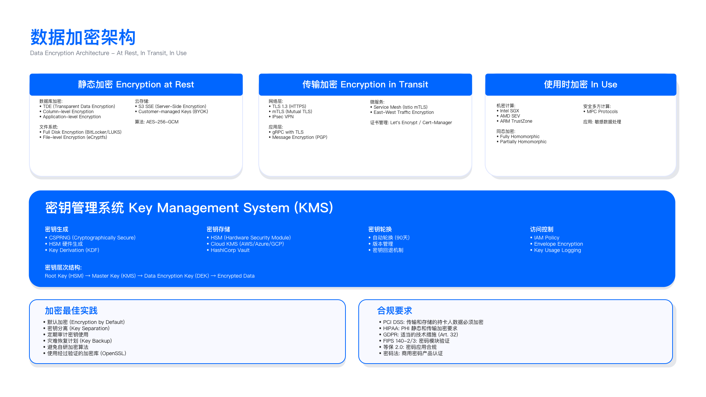

# 5.5　云数据保护

本节聚焦云环境数据保护的工程实现：从对象存储访问控制、多层加密策略设计，到密钥管理服务选型、BYOK/HYOK 实施，再到数据分类、DLP 部署与跨境驻留合规。内容覆盖 AWS/Azure/GCP 三大云平台的技术对比与配置实战，通过具体控制点设计、验证方法与运行指标，支撑企业构建可审计、可验收的云数据保护体系。

> 导读：5.5.1 给出三大云对象存储的安全配置基线（S3 BPA、强制加密、版本控制）；5.5.2 设计三层加密策略（at rest/in transit/in use）并展示密钥选择决策树；5.5.3 比较 KMS 服务选型，解释 BYOK/HYOK 的适用场景与权衡；5.5.4 介绍 Macie/DLP 数据发现与分类；5.5.5 覆盖跨境数据传输合规实现；5.5.6 展示云数据库安全配置实战。数据保护是 5.2 IAM（谁能访问数据）和 5.5（数据本身的保护）的结合——两者缺一不可。

---

## 5.5.1 云对象存储安全配置

### 三大云存储服务对比

对象存储是云上数据的第一站，也是历年泄露事件里出镜率最高的服务——大量事故并非黑客攻破了加密，而是存储桶被无意中配置成了公开可读。因此讨论对象存储安全，起点不是加密算法，而是"能否从架构上让配置错误不生效"。要做这件事，先得理解三大平台在访问控制模型上的差异：谁来判定一个请求是否被允许，判定的开关握在谁手里。

AWS S3、Azure Blob Storage 与 GCP Cloud Storage 均采用对象存储架构，但在访问控制、加密选项、合规特性上存在差异。选型时需综合考虑现有云平台生态、数据分类需求与合规约束。

| 维度 | AWS S3 | Azure Blob Storage | GCP Cloud Storage |
|------|--------|-------------------|-------------------|
| 访问控制 | IAM + Bucket Policy + ACL | RBAC + SAS Token | IAM + ACL |
| 默认加密 | SSE-S3 (AES-256) | SSE (AES-256) | 默认加密（Google 管理） |
| 客户密钥选项 | SSE-KMS/SSE-C | Customer Managed Key | Customer Managed Encryption Key |
| 版本控制 | 支持 | 支持 | 支持 |
| 对象不可变性 | Object Lock (WORM) | Immutable Blob Storage | Retention Policy |
| 访问日志 | Server Access Logging | Storage Analytics | Cloud Audit Logs |
| 公开访问阻止 | Block Public Access | Public Access Level 控制 | Uniform bucket-level access |



这张表有两条主线。第一条是访问控制的层数：S3 同时叠加了 IAM、Bucket Policy 与 ACL 三套机制，灵活但也意味着任意一层配错都可能开一道口子，"公开访问阻止"这类总开关正是为收敛这种复杂度而生；GCP 的 Uniform bucket-level access 干脆用统一的桶级权限取代对象级 ACL，用降低灵活性换取更少的出错面。第二条是"对象不可变性"这一列——它对应的是勒索软件与合规留存这两类需求，后文的 Object Lock 会专门展开。

选型约束：与云平台集成深度决定了很多选型的边际成本。若已大量使用 AWS Lambda/ECS，S3 与服务间的 IAM 策略集成成本最低；若核心业务在 Azure App Service，Blob Storage 的 RBAC 与 Azure AD 天然对接。金融行业需证明"客户独占密钥控制权"时，AWS SSE-C（客户提供密钥）或 Azure BYOK 可满足审计要求，但运维复杂度高于云管理密钥——这是典型的合规要求与运维成本的权衡。

### S3 安全配置基线

AWS S3 因市场份额高，配置错误导致的泄露事件频发。以下配置为企业级 S3 安全基线（基于 CIS AWS Foundations Benchmark v3.0），每项控制均可通过 CSPM 工具（如 AWS Security Hub/Prowler）自动检测。

这套基线的组织逻辑，是把"存储层"的三类主要风险各自对应到一项技术强制：意外公开对应 Block Public Access，明文传输与未加密落盘对应 Bucket Policy 的两条 Deny 语句，误删与勒索对应版本控制加对象锁定。下面逐项拆解时，可以留意它们共同的设计哲学——不依赖人"记得配对"，而是让错误配置在技术层面直接失效。

#### Block Public Access (BPA) — 阻止意外公开

控制目标：技术上消除 Bucket 被配置为公开访问的可能性，即使 Bucket Policy 或 ACL 配置错误也无法生效[6]。这是防御纵深的关键——不能依赖"没有人会配置成公开"的假设，需要技术手段强制阻止。补充一点当前形态：AWS 自 2023 年 4 月起对新建桶默认启用 Block Public Access 并默认禁用 ACL，但存量桶不会被自动改写，仍需按下文在账户级别兜底[6]。

为什么值得在账户级别启用，而不是逐桶设置？因为泄露往往发生在那些"临时建的、没人记得管"的桶上。把 BPA 提到账户级，等于给整个账户加了一道兜底闸：新桶一诞生就落在保护之下，无需依赖创建者的自觉。

```bash
# 在 AWS 账户级别启用 BPA（影响账户内所有 Bucket）
aws s3control put-public-access-block \
  --account-id 123456789012 \
  --public-access-block-configuration \
    BlockPublicAcls=true,IgnorePublicAcls=true,\
    BlockPublicPolicy=true,RestrictPublicBuckets=true
```

四个参数需要同时启用：`BlockPublicAcls` 阻止新的公开 ACL，`IgnorePublicAcls` 忽略已有的公开 ACL，`BlockPublicPolicy` 阻止允许公开访问的 Bucket Policy，`RestrictPublicBuckets` 即使有允许公开的 Policy 也限制访问为仅授权 AWS 账户访问。仅启用部分参数会留下绕过路径。理解这四项为何缺一不可，关键在于它们分别封堵了两条独立的公开通道（ACL 与 Policy），且每条通道都要同时处理"新配置"与"存量配置"——只挡新的不管旧的，历史遗留的公开桶依然敞着。

验证方法：
- 自动化验证：通过 AWS Config 规则 `s3-account-level-public-access-blocks` 持续监控，任何 BPA 被禁用立即告警
- 手动验证：尝试将测试 Bucket 的 Policy 设为 `"Principal": "*"`，验证操作被拒绝

常见误区：
- 误以为"仅在生产 Bucket 启用 BPA 即可"：开发/测试环境的配置错误同样可能泄露敏感数据（如包含真实客户数据的测试集）
- 误以为"有 Bucket Policy 就不需要 BPA"：Policy 可被人为修改或误配，BPA 提供技术强制层，是防御的保险机制

#### 强制加密与 HTTPS 传输

BPA 解决的是"谁能访问桶"，接下来这条策略解决的是"访问时数据是否被保护"。它用一份 Bucket Policy 同时应对两类风险——传输链路上的明文窃听与落盘时的未加密存储——之所以放在一起，是因为二者都属于"即便访问合法，数据也不该以裸露形态出现"的场景。

控制目标：拒绝未加密的对象上传，拒绝 HTTP 明文传输。两个 Statement 分别处理两种风险，需要同时配置：

```json
{
  "Version": "2012-10-17",
  "Statement": [
    {
      "Sid": "DenyInsecureTransport",
      "Effect": "Deny",
      "Principal": "*",
      "Action": "s3:*",
      "Resource": [
        "arn:aws:s3:::my-secure-bucket",
        "arn:aws:s3:::my-secure-bucket/*"
      ],
      "Condition": {
        "Bool": {"aws:SecureTransport": "false"}
      }
    },
    {
      "Sid": "DenyUnencryptedObjectUploads",
      "Effect": "Deny",
      "Principal": "*",
      "Action": "s3:PutObject",
      "Resource": "arn:aws:s3:::my-secure-bucket/*",
      "Condition": {
        "StringNotEquals": {
          "s3:x-amz-server-side-encryption": "aws:kms"
        }
      }
    }
  ]
}
```

这份策略的两条语句都用 `"Effect": "Deny"`，因为在 S3 权限模型里显式 Deny 优先于任何 Allow，这保证了它无法被别处的宽松授权绕过。`DenyInsecureTransport` 通过检查 `aws:SecureTransport` 条件阻断 HTTP 请求（HTTPS 时该值为 true），且 Resource 同时覆盖桶本身与桶内对象（两个 ARN），漏写其一会留下缺口。`DenyUnencryptedObjectUploads` 检查上传时的加密头——这里强制要求 `aws:kms` 加密，若场景允许 SSE-S3（较低安全要求），条件值需要改为 `["aws:kms", "AES256"]`，否则使用默认 SSE-S3 上传也会被拒绝。这是生产落地时最常踩的坑：策略上线后应用侧突然大面积上传 403，往往就是加密头要求与客户端实际发送的值不匹配。

验证方法：

```bash
# 测试 1：尝试 HTTP 上传（应失败）
curl -X PUT http://my-secure-bucket.s3.amazonaws.com/test.txt \
  -d "test data" --aws-sigv4 "aws:amz:us-east-1:s3"
# 预期：403 Forbidden

# 测试 2：尝试不加密上传（应失败）
aws s3 cp test.txt s3://my-secure-bucket/test.txt \
  --no-server-side-encryption
# 预期：Access Denied

# 测试 3：正确上传（应成功）
aws s3 cp test.txt s3://my-secure-bucket/test.txt \
  --server-side-encryption aws:kms
```

这三个测试的价值在于覆盖了策略的"两拒一放"：前两条验证 Deny 语句确实拦截了不安全路径，第三条验证合法路径没有被误伤。安全配置只做前两步是不够的——一份把所有上传都拒掉的策略同样"看起来很安全"，却会让业务停摆，第三条正是防止这种矫枉过正。

运行指标：
- 未加密对象数量：目标值 = 0（通过 S3 Inventory 日志的 `EncryptionStatus` 字段监控）
- HTTP 访问尝试次数：目标值 = 0（CloudTrail 中 `eventName=GetObject` 且 `tlsDetails.tlsVersion=null` 的记录数）

#### 版本控制与对象锁定

前两项控制防的是"外部风险"（公开、窃听），版本控制与对象锁定防的则是"数据本身被抹掉"——无论抹掉它的是勒索软件、误操作还是恶意内部人员。这类控制的特殊之处在于它的不可逆性：一旦开启就无法关闭，只能延长，所以它更像是一次"业务决策"而非"技术开关"。

适用场景：需防止勒索软件删除备份、需满足 SEC 17a-4 合规（金融行业 7 年数据保留）。

COMPLIANCE 模式与 GOVERNANCE 模式的选择是关键决策点：COMPLIANCE 模式下，对象在保留期内任何账户（包括 root）均无法删除，适合强合规场景（如 SEC 17a-4）；GOVERNANCE 模式允许拥有特定权限（`s3:BypassGovernanceRetention`）的账户删除，适合有合理例外需求的场景（如错误数据需要清理）。两种模式的分野本质是"绝对不可篡改"与"留一个受控后门"之间的取舍——合规审计看重前者，日常运维往往需要后者，选错的代价是要么灾难无法自救，要么留下了本不该有的删除路径。

```python
import boto3
s3 = boto3.client('s3')

# 启用版本控制 + MFA Delete（删除对象需 MFA 设备验证）
s3.put_bucket_versioning(
    Bucket='compliance-bucket',
    VersioningConfiguration={
        'Status': 'Enabled',
        'MFADelete': 'Enabled'
    },
    MFA='arn:aws:iam::123456789012:mfa/root-account-mfa-device 123456'
)

# 启用对象锁定（COMPLIANCE 模式：AWS 员工也无法删除）
s3.put_object_lock_configuration(
    Bucket='compliance-bucket',
    ObjectLockConfiguration={
        'ObjectLockEnabled': 'Enabled',
        'Rule': {
            'DefaultRetention': {
                'Mode': 'COMPLIANCE',  # 或 GOVERNANCE（允许特权用户覆盖）
                'Days': 2555           # 7 年
            }
        }
    }
)
```

这段代码分两步，防护逻辑是层层加码的。第一步 `put_bucket_versioning` 叠加了 `MFADelete`——版本控制让每次覆盖/删除都保留历史版本，而 MFA Delete 进一步要求删除版本时提供物理 MFA 设备的动态码，把"误删/被盗凭证批量删"的门槛拉到需要物理设备在场。注意 `MFA` 参数拼的是设备 ARN 加上当下的六位动态码，因此这个调用无法写进自动化脚本长期跑，这本身就是设计意图。第二步 `put_object_lock_configuration` 才是真正的 WORM 保险：`Days: 2555` 对应约 7 年，`Mode` 一旦落到 COMPLIANCE，保留期内连 root 都删不掉。

约束条件：
- 对象锁定启用后无法禁用，仅能延长保留期——启用前必须确认业务需求，不是可以轻易逆转的决策
- COMPLIANCE 模式下，对象在保留期内任何账户（包括 root）均无法删除，需谨慎评估业务需求（如数据更正场景）
- 对象锁定要求 Bucket 在创建时启用（不能对已有 Bucket 启用），需在 Bucket 创建阶段决策

上面第三条约束是生产中最容易被忽视的坑：因为对象锁定只能在建桶时开启，任何"上线后才想起要加 WORM"的桶都无法原地改造，只能新建桶再迁移数据。这意味着"是否需要不可变留存"必须在架构设计阶段就想清楚，而不能作为后期加固项。

验证方法：
- 上传测试对象后尝试删除，验证返回 `AccessDenied` 错误
- 模拟勒索软件攻击：使用高权限账户批量删除对象，验证版本历史完整

---

## 5.5.2 多层加密策略设计

云数据加密需覆盖三个阶段：静态存储（at rest）、网络传输（in transit）、内存处理（in use）。每层加密解决不同威胁：静态加密防物理介质失窃，传输加密防中间人攻击，使用中加密防内存 dump 泄露。三层加密不是可选项，而是企业级数据保护的基础要求。之所以要拆成三层分别讨论，是因为数据在生命周期里会反复在"落盘—传输—计算"三种状态间切换，只保护其中一态、放任另外两态，等于给保险箱装了门却不锁窗。

### 静态加密 (Encryption at Rest)

静态加密的实现门槛其实很低——云平台默认即已启用。真正的工程决策不在"要不要加密"，而在"密钥归谁管、密钥的使用能不能被审计"。同样是 AES-256，四种方式的区别几乎全在密钥的归属与可观测性上。

AWS SSE 加密方式对比的核心区分维度是"谁管密钥、能不能审计密钥使用"：

| 方式 | 密钥管理方 | CloudTrail 审计 | KMS API 费用 | 推荐场景 |
|------|-----------|---------------|-------------|---------|
| SSE-S3 | AWS | 无法审计密钥使用 | $0 | Internal/Public 非敏感数据 |
| SSE-KMS | AWS KMS | 完整审计 | $0.03/万次 | Restricted/Confidential 敏感数据（推荐） |
| SSE-C | 客户自行管理 | 无 KMS 记录 | $0 | 客户需完全控制密钥 |
| Client-Side | 客户端加密库 | 客户负责 | $0 | 极端敏感场景 + 自有 HSM |

这张表自上而下呈现一条清晰的"控制权与运维成本同步上升"的梯度：SSE-S3 完全托管、零成本、零心智负担，但密钥既不可见也不可控；到 SSE-C 与 Client-Side，密钥完全握在自己手里，代价是审计链断在了 KMS 之外、密钥丢了数据就永久不可读。中间的 SSE-KMS 之所以成为默认推荐，正是因为它在"可审计"和"低运维"之间找到了平衡点。

SSE-KMS 是多数企业的首选：它提供完整的 CloudTrail 审计（每次密钥使用都有记录，回答"谁在什么时候解密了什么数据"），密钥轮换可自动化（每年自动轮换或按需手动轮换），权限与 IAM 策略集成（通过 KMS Key Policy 控制谁能使用密钥）。额外费用（$0.03/万次 API 调用）在大多数场景下可接受。

决策框架：

```
数据分类 Restricted/Confidential？ ──是──> 需审计密钥访问？ ──是──> SSE-KMS
                                  │                   └──否──> SSE-C（BYOK 场景）
                                  └──否（Internal/Public）──> SSE-S3（成本优化）
```

这棵决策树把上表的取舍压缩成两个提问：先看数据敏感度决定"值不值得花钱管密钥"，再看是否需要审计决定"密钥交给谁管"。它刻意把成本考量放在最后一个分支（Internal/Public 走 SSE-S3），传达的判断是——不要给所有数据都套上最贵最重的方案，安全投入应该与数据价值匹配。

SSE-KMS 实施示例：

```python
import boto3
kms = boto3.client('kms')
s3 = boto3.client('s3')

# 创建客户管理的 KMS 密钥（CMK）
key_response = kms.create_key(
    Description='S3 Confidential data encryption key',
    KeyUsage='ENCRYPT_DECRYPT',
    Origin='AWS_KMS',       # 或 AWS_CLOUDHSM（FIPS 140-2 Level 3）
    MultiRegion=False,       # 多 Region 场景设为 True（但需考虑数据主权）
    Tags=[
        {'TagKey': 'DataClassification', 'TagValue': 'Confidential'},
        {'TagKey': 'Environment', 'TagValue': 'production'},
    ]
)
key_id = key_response['KeyMetadata']['KeyId']

# 配置密钥别名（便于引用）
kms.create_alias(
    AliasName='alias/s3-l2-data-key',
    TargetKeyId=key_id
)

# 配置密钥轮换（每年自动轮换）
kms.enable_key_rotation(KeyId=key_id)

# 将 KMS 密钥设置为 S3 Bucket 的默认加密密钥
s3.put_bucket_encryption(
    Bucket='secure-data-bucket',
    ServerSideEncryptionConfiguration={
        'Rules': [{
            'ApplyServerSideEncryptionByDefault': {
                'SSEAlgorithm': 'aws:kms',
                'KMSMasterKeyID': key_id
            },
            'BucketKeyEnabled': True  # 减少 KMS API 调用，降低成本
        }]
    }
)
```

这段代码的顺序即是一条"最小可用密钥生命周期"：建密钥 → 起别名 → 开轮换 → 绑到桶。几个字段体现了工程习惯：`Tags` 里打上数据分类与环境标签，是为了让后续用标签驱动的自动化策略（哪些密钥归哪类数据）能挂得上钩；`create_alias` 让应用引用稳定的别名而非会变的 key id，密钥轮换或替换时上层代码不必改动；`MultiRegion=False` 的注释点破了一个隐蔽的耦合——多区域密钥虽方便，却会与后文的数据驻留要求冲突，跨区可用的密钥正是驻留控制不想要的。

`BucketKeyEnabled: True` 值得注意：S3 Bucket Key 让每个 Object 的 Data Key 由一个临时的 Bucket Level Key 生成，而非直接调用 KMS，减少了 KMS API 调用次数（最高减少 99%），在高吞吐场景下显著降低 KMS 费用，同时保持了安全属性（Bucket Level Key 定期轮换）。这一项常被忽略，直到 KMS 账单在高频读写场景下失控才被想起——把它作为默认开启项，是低成本、无安全折损的优化。

### 传输加密 (Encryption in Transit)

传输加密在云上是"如何强制"的问题，"要不要"早已没有争议——TLS 客户端和服务端都支持，难点在于杜绝那些悄悄降级到明文或旧协议的连接。下面这段以 RDS 为例，展示如何把"必须走 TLS"从建议变成数据库层面的硬性拒绝。

传输加密的核心是强制 TLS 1.2+，禁用已知不安全的旧版本（TLS 1.0/1.1 已被 NIST 标记为不安全）和弱密码套件（RC4、3DES、NULL）。

```python
import boto3
rds = boto3.client('rds')

# 创建 RDS 参数组（强制 SSL 连接）
rds.create_db_parameter_group(
    DBParameterGroupName='mysql8-ssl-required',
    DBParameterGroupFamily='mysql8.0',
    Description='Enforce SSL connections'
)

# 强制所有连接使用 SSL（参数值 1 = 强制）
rds.modify_db_parameter_group(
    DBParameterGroupName='mysql8-ssl-required',
    Parameters=[{
        'ParameterName': 'require_secure_transport',
        'ParameterValue': '1',
        'ApplyMethod': 'immediate'
    }]
)

# 关键：仅修改参数组不会影响任何实例，必须把参数组关联到目标实例
rds.modify_db_instance(
    DBInstanceIdentifier='prod-mysql-instance',
    DBParameterGroupName='mysql8-ssl-required',
    ApplyImmediately=True
)
# 注意：更换实例的参数组后，require_secure_transport 属静态生效范畴，
# 需重启实例才会真正生效（rds.reboot_db_instance）
```

关键点在 `require_secure_transport` 这个参数值设为 `'1'`：它把"是否用 SSL"的决定权从客户端手里收回到数据库侧，任何不带 SSL 的连接会被服务端直接拒绝，而不是像默认配置那样"客户端愿意加密就加密"。这正是传输加密最容易出问题的地方——如果只在应用配置里写了"启用 SSL"，一旦某个客户端连接串漏配，数据就会明文流过网络而无人察觉；把强制点下沉到数据库参数组，才堵住了这条降级通道。生产落地时需注意两点：其一，仅创建或修改参数组不会作用于任何实例，必须用 `modify_db_instance` 把参数组关联到目标实例，且 `require_secure_transport` 属静态参数、需重启实例才真正生效；其二，一旦强制 SSL，若有存量的非 SSL 连接的应用，上线前必须先改造客户端，否则重启生效后会瞬间断连。

验证传输加密：

```bash
# 验证 S3 拒绝 HTTP 请求（预期：403）
curl -I http://my-bucket.s3.amazonaws.com/test-file.txt

# 验证 TLS 版本（预期：TLSv1.2 或 TLSv1.3）
openssl s_client -connect my-bucket.s3.amazonaws.com:443 \
  -tls1_1 2>&1 | grep "Protocol"

# 验证 RDS 需要 SSL（预期：ERROR 1045 or SSL required error without SSL）
mysql -h rds-endpoint.rds.amazonaws.com -u admin -p \
  --ssl-mode=DISABLED -e "SELECT 1"
```

这组验证的巧妙之处是"用不该成功的操作去证明防线有效"：第二条用 `-tls1_1` 主动尝试老协议握手，若被拒绝才说明旧版本确已禁用；第三条用 `--ssl-mode=DISABLED` 强行不带 SSL 连库，报错才是配置正确的信号。安全配置的验证常常是反直觉的——期望看到失败，看到成功反而说明防护没生效。

### 使用中加密 (Encryption in Use)

前两层加密之后，数据仍有一个短暂的裸露窗口：当它被解密送进内存参与计算的那一刻。绝大多数场景到这一步就止步了，因为防内存 dump 的代价很高、收益面很窄。但对极少数超高敏感数据，以及需要防范"连云厂商运维和自己的 root 都不可信"的威胁模型，才有必要动用使用中加密。

适用场景：需在内存中处理 Restricted 数据（如信用卡 CVV 解密），且需防御特权用户（root/云厂商员工）访问内存。

技术实现 — AWS Nitro Enclaves：

```python
# 在 Enclave 内执行 KMS 解密（母实例无法访问明文）
import socket
import json

def decrypt_in_enclave(ciphertext_blob):
    """通过 Enclave 解密数据"""
    # 连接 Enclave 的 vsock（CID=3 表示父 EC2 实例）
    sock = socket.socket(socket.AF_VSOCK, socket.SOCK_STREAM)
    sock.connect((3, 5000))

    request = {'action': 'decrypt', 'ciphertext': ciphertext_blob}
    sock.send(json.dumps(request).encode())
    response = json.loads(sock.recv(4096))

    return response['plaintext']  # 明文仅在 Enclave 内存中存在
```

Nitro Enclaves 的设计思路是将敏感计算逻辑隔离到一个独立的加密内存区域：父 EC2 实例通过 vsock（虚拟 socket）与 Enclave 通信，但无法直接访问 Enclave 的内存。KMS 在向 Enclave 颁发解密权限前会通过远程证明（attestation）验证 Enclave 的完整性——这段代码的关键正在于此：`sock.connect((3, 5000))` 中的 CID=3 是固定的父实例地址，Enclave 内的 plaintext 永远不会通过这个通道回传给父实例，只在 Enclave 内部用于后续加密计算后丢弃。换句话说，这段代码里 `return response['plaintext']` 拿到的明文之所以能成立，前提是调用方本身就跑在 Enclave 内——若把同样的代码放到父实例上运行，它根本拿不到解密权限，因为 attestation 无法通过。这层"代码在哪运行决定它能不能解密"的约束，正是使用中加密与前两层加密最本质的区别。

约束条件：
- Nitro Enclaves 需运行在特定 EC2 实例类型（如 m5.xlarge），成本高于普通实例约 20%
- 开发复杂度：需将应用拆分为 Enclave 内（解密逻辑）与 Enclave 外（业务逻辑）两部分

运行指标：
- Enclave 健康检查失败率：目标 < 0.1%（vsock 连接超时/Enclave 崩溃）
- 解密操作延迟：目标 < 50ms（vs 普通 KMS 解密 < 20ms，增加约 30ms 网络往返）

上面这组约束与指标共同刻画了使用中加密的真实代价：不仅是约 20% 的实例溢价，更是把应用架构一分为二的开发负担，以及每次解密多出的一次 vsock 往返延迟。这也解释了为什么它不该被无差别推广——只有当数据敏感度足以证明这些代价合理时才引入，否则前两层加密加严格的 IAM 已能覆盖绝大多数威胁。

---

## 5.5.3 密钥管理服务：BYOK/HYOK 实施

### KMS 服务选型

密钥管理是数据保护的核心——"加密了但密钥不受控制"在安全上等同于没有加密。既然前一节反复强调"密钥归谁管"，这一节就要正面回答：三大云的托管密钥服务各自把控制权让渡到什么程度，以及当托管仍不够时，BYOK 与 HYOK 如何把根信任逐步收回到企业手里。

三大云平台的 KMS 服务对比：

| 特性 | AWS KMS | Azure Key Vault | GCP Cloud KMS |
|------|---------|-----------------|---------------|
| 软件保护密钥 | 支持 | 支持 | 支持 |
| HSM 保护密钥 | 支持（AWS KMS HSM） | 支持（Managed HSM） | 支持（Cloud HSM） |
| FIPS 140-2 Level | Level 3 | Level 3 | Level 3 |
| 密钥自动轮换 | 支持（默认年度；2024-04 起可配置 90 天至 2560 天，并支持按需轮换）[1] | 支持（可配置周期） | 支持（可配置周期） |
| BYOK 支持 | 支持 | 支持 | 支持 |
| HYOK 支持 | 不支持 | 支持（DKE） | 不直接支持 |
| 多 Region 密钥 | 支持 | 支持 | 支持 |
| 审计日志 | CloudTrail | Azure Monitor | Cloud Audit Logs |
| 定价 | $1/密钥/月 + $0.03/万次调用 | $0.10/10K 操作 | $0.06/10K 操作 |

这张表里三大平台在软件密钥、HSM、FIPS 等级上几乎齐平，真正拉开差距的是"HYOK 支持"这一行——只有 Azure 通过 DKE 提供了原生的"密钥完全不交给云"的能力。因此，如果威胁模型里"云厂商本身不可信"是硬约束，选型会在这一行被直接锁定。轮换周期一栏曾长期是 AWS 的短板（自动轮换固定为年度），但 AWS 已于 2024 年 4 月放开该限制：自动轮换周期可在 90 天至 2560 天之间自定义，并新增了按需轮换 API[1]。因此"需要季度轮换就只能自建调度"这一旧结论已不再成立，三家平台在这一维度上现已基本齐平。

### BYOK（Bring Your Own Key）实施

BYOK 允许企业在本地 HSM 中生成密钥材料，然后将密钥导入云 KMS。密钥的"根"由企业控制（生成在企业设备上），云 KMS 仅使用密钥而不能导出密钥。与完全云管理的 CMK 相比，BYOK 的安全增益在于：密钥生成过程在企业控制下（审计可追溯），密钥材料不在云环境中生成（减少云平台生成密钥的信任要求）。需要看清的是，BYOK 收回的只是"生成环节"的信任——密钥导入后仍在云 KMS 内被使用，云平台在运行时依然接触到密钥的使用，只是从未参与它的诞生。真正把"使用环节"也收回来的是后面的 HYOK，理解这条边界能避免把 BYOK 当成"云完全碰不到密钥"的误解。

BYOK 实施案例：金融支付平台

某支付平台（年处理交易 $20 亿）在 PCI DSS 4.0 审计中被要求"证明加密密钥的绝对控制权"。评估后采用混合策略：

- Restricted 数据（支付卡 CVV/PIN，占比 0.5%）：HYOK，本地 CloudHSM 集群（3 节点 HA），密钥永不导出。
- Confidential 数据（交易记录，占比 20%）：BYOK，本地 HSM 生成密钥，导入 AWS KMS，设置 12 个月过期。
- Internal/Public 数据（占比 79.5%）：AWS 管理 CMK，成本优化。

这个混合策略是本节所有权衡的一次集中落地：它没有对全部数据一刀切上最高等级的 HYOK，而是按敏感度把三档方案分别对号入座——最敏感的 0.5% 用密钥永不出本地的 HYOK，中间层用可追溯生成的 BYOK，占绝大多数的低敏感数据交给云托管以控成本。这种分层印证了前文决策树的判断：安全强度应与数据价值匹配，把稀缺的密钥运维精力投在真正需要的地方。

BYOK 密钥导入流程——四个步骤构成一个闭环，核心是"密钥材料在传输中永远是加密的"：

```python
import boto3
from cryptography.hazmat.primitives.asymmetric import rsa
from cryptography.hazmat.backends import default_backend

kms = boto3.client('kms')

# 步骤 1：从 KMS 获取导入令牌（包含公钥）
import_token_resp = kms.get_parameters_for_import(
    KeyId='arn:aws:kms:us-east-1:123456789012:key/imported-key-id',
    WrappingAlgorithm='RSAES_OAEP_SHA_256',
    WrappingKeySpec='RSA_2048'
)
public_key = import_token_resp['PublicKey']
import_token = import_token_resp['ImportToken']

# 步骤 2：在本地 HSM 生成 256-bit AES 密钥（此处用软件模拟）
import os
key_material = os.urandom(32)  # 256-bit

# 步骤 3：用 KMS 公钥包装密钥材料
from cryptography.hazmat.primitives import serialization, hashes
from cryptography.hazmat.primitives.asymmetric import padding

kms_public_key = serialization.load_der_public_key(
    public_key, backend=default_backend()
)
wrapped_key = kms_public_key.encrypt(
    key_material,
    padding.OAEP(
        mgf=padding.MGF1(algorithm=hashes.SHA256()),
        algorithm=hashes.SHA256(),
        label=None
    )
)

# 步骤 4：导入密钥到 KMS（设置 12 个月过期）
from datetime import datetime, timedelta, timezone
kms.import_key_material(
    KeyId='arn:aws:kms:us-east-1:123456789012:key/imported-key-id',
    ImportToken=import_token,
    EncryptedKeyMaterial=wrapped_key,
    ExpirationModel='KEY_MATERIAL_EXPIRES',
    ValidTo=datetime.now(timezone.utc) + timedelta(days=365)  # 用带时区的 UTC 时间，避免本地时区歧义
)
```

这四步为什么这样设计？它要解决一个看似矛盾的问题：让云 KMS 拥有一把它自己没有参与生成的密钥，同时保证密钥在从企业到云的传输途中任何一方（包括 AWS）都无法窥见明文。方法是让 KMS 先交出一把一次性的 RSA 公钥（步骤 1 的导入令牌），企业用它把密钥材料封装成密文（步骤 3），只有 KMS 侧那把不可导出的 RSA 私钥能拆封（步骤 4）。`ExpirationModel='KEY_MATERIAL_EXPIRES'` 加上一年有效期，则把"客户控制密钥生命周期"这一条落到了实处——到期后 KMS 自动作废该密钥材料，形成可向审计员展示的生命周期证据。

步骤 3 是 BYOK 安全的关键：密钥材料在导入之前用 KMS 公钥加密，传输过程中 AWS 无法看到明文密钥材料（只有 KMS 私钥能解密，而 KMS 私钥在 HSM 内不可导出）。实际生产环境中，步骤 2 应在本地 HSM（如 Thales nShield、AWS CloudHSM）上执行，而非在普通服务器上使用 `os.urandom()`。这行 `os.urandom(32)` 是本例最大的"仅供演示"警示：在真实合规场景下，密钥若诞生于一台普通服务器的内存，就等于放弃了 BYOK 的全部意义——审计员要看的正是密钥在受控 HSM 内生成的物理证据。

验证方法：

```python
# 检查密钥来源与过期时间
key_metadata = kms.describe_key(
    KeyId='arn:aws:kms:us-east-1:123456789012:key/imported-key-id'
)
assert key_metadata['KeyMetadata']['Origin'] == 'EXTERNAL'
assert key_metadata['KeyMetadata']['ExpirationModel'] == 'KEY_MATERIAL_EXPIRES'
```

这两行断言检查的正是 BYOK 区别于普通 CMK 的两个指纹：`Origin == 'EXTERNAL'` 证明密钥材料是外部导入而非 KMS 自生，`ExpirationModel` 证明它带有客户设定的到期约束。审计时能用一次 `describe_key` 调用自动化地证明"这确实是一把 BYOK 密钥"，比人工翻配置截图可靠得多。

审计证明材料：
- 本地 HSM 密钥生成日志（时间戳 + 操作员身份）
- KMS ImportKeyMaterial CloudTrail 事件（证明密钥由客户导入）
- 密钥过期自动删除验证（证明客户控制密钥生命周期）

成本分析：
- BYOK 成本：KMS CMK $1/月 × 50 个区域密钥 + 本地 HSM $1K/月 = $1,050/月
- 避免的审计失败损失：若未通过 PCI DSS 审计，丧失支付卡处理资质，估计年收入损失 > $50M

### HYOK（Hold Your Own Key）实施

HYOK 比 BYOK 更进一步：密钥不仅由客户生成，还完全保管在客户控制的环境中（如本地 HSM 服务器），云平台无法访问密钥。加密/解密操作需要调用客户的密钥服务，云平台只保存加密后的数据。回到前面那条边界——BYOK 收回了"生成"，HYOK 则连"使用"也一并收回：每一次解密都得回到企业自己的密钥服务上完成，云端从头到尾只经手密文。控制权的这一次彻底交割，也把可用性与延迟的重担从云平台搬到了企业肩上，这正是它代价高昂的根源。

Azure 的 Double Key Encryption（DKE）是 HYOK 的典型实现：数据用两把密钥加密（Azure 管理的密钥 + 客户自持的密钥），解密需要两把密钥同时在场。Azure 有第一把密钥，客户有第二把密钥——任何一方单独都无法解密数据。这种"双钥同签"的结构，本质是把信任从"信任云平台"改成"云平台与客户互为制衡"，即便云平台被法律强制或内部人员滥权，只要拿不到客户手中的第二把钥匙，数据依然是不可读的密文。

适用边界：HYOK 适合对云服务商访问数据有顾虑的极高敏感场景（如主权数据、国家安全级别数据）。HYOK 的代价很高：
- 性能开销：每次加解密需要调用客户持有的密钥服务，增加网络延迟（典型额外延迟 20-50ms）
- 可用性依赖：客户密钥服务必须高可用，否则无法访问加密数据（依赖从云平台转移到客户密钥服务）
- 运维复杂度：本地 HSM 需要 24×7 运维，密钥备份、灾备需要单独设计

这三条代价里，最容易被低估的是"可用性依赖"的转移：采用 HYOK 后，数据能否被读取不再取决于云平台的高可用（那是云厂商用巨额投入保障的），而取决于企业自建的密钥服务是否在线。一旦这个自建服务宕机，被它加密的所有数据同时失联——这等于用云平台成熟的可用性，换来了一套需要从零构建并 24×7 值守的关键基础设施。

多数企业的数据保护需求通过 SSE-KMS + 客户管理密钥（CMK）即可满足，无需引入 HYOK 的额外复杂度。

### 密钥生命周期管理

选定了密钥方案只是起点。密钥像所有凭证一样有寿命，管理它的全生命周期——何时轮换、如何审计使用、何时安全销毁——才是密钥治理真正持续投入的部分。这一小节把三个阶段各自的要点与陷阱讲清楚。

密钥安全不仅在于生成和使用，还在于整个生命周期的管理：

密钥轮换：定期更换密钥材料，减少密钥泄露的暴露窗口。AWS KMS 的自动轮换默认一年一次，自 2024 年 4 月起可自定义为 90 天至 2560 天，并可通过 RotateKeyOnDemand 按需触发[1]（轮换后旧密钥材料保留，用于解密旧数据；新密钥用于新加密操作）。手动轮换适用于 BYOK 密钥（重新导入新的密钥材料）。建议轮换周期：Restricted 数据密钥 90 天，Confidential 数据密钥 180 天，根密钥 365 天。轮换周期按数据敏感度递减，逻辑与前文加密选型一致：越敏感的数据，越要缩短一把密钥"暴露在外"的时间窗，以限制单把密钥万一泄露时的爆炸半径。

密钥访问审计：每次 KMS API 调用（Encrypt、Decrypt、GenerateDataKey）都在 CloudTrail 中留下审计记录。定期审查审计日志，识别异常访问模式（如非工作时间大量解密操作、新 IP 来源访问密钥、访问量异常激增）。这正是当初选 SSE-KMS 而非 SSE-S3 所买到的能力兑现之处——没有这条完整的调用记录，"谁在什么时候解密了什么"就无从查起，异常检测也失去了数据基础。

密钥删除策略：AWS KMS 密钥删除有 7-30 天的等待期（防止误删），删除后无法恢复，加密数据将永久无法解密。在删除前，必须确认：所有使用该密钥加密的数据已迁移到新密钥，或数据已确认可以永久丢失。这个 7-30 天的等待期不是拖沓，而是刻意设计的"后悔窗口"——删密钥与删数据在后果上等价，且都不可逆，平台用一段强制冷静期来对冲这种一失足成千古恨的操作。

常见误区：
- 混淆密钥轮换与密钥版本：AWS KMS 自动轮换实际上是创建新版本的密钥材料（Key Material），旧版本保留用于解密旧数据——这是设计使然，不是风险，轮换后旧数据仍可被解密
- 将 KMS Key Policy 设置过宽（`"Principal": "*"`）：所有 AWS 账户都可以使用密钥，丧失访问控制，违背了使用 KMS 的初衷
- 忽视 KMS API 限速（Throttling）：高并发场景下 KMS API 限速（默认 5500-30000 次/秒，取决于区域），可能导致加密操作失败，需要设计重试机制或使用 Bucket Key 减少调用频率

上面三条误区里，前两条是概念/配置层面的，最后一条则是纯粹的生产运维坑：KMS 的调用配额在正常业务下感知不到，却会在流量尖峰或某个循环里误调解密时突然触顶，表现为看似无关的加密操作莫名失败。这也再次回指前文的 Bucket Key——它减少 KMS 调用频率的价值，在这里从"省钱"升级为"保可用"。

---

## 5.5.4 数据发现与分类：Macie 与 DLP

### 数据分类的必要性

"我们对所有数据加密"不等于"我们知道哪些数据需要保护"。没有数据分类，无法回答：哪个 S3 Bucket 包含 PII？哪个数据库有 PCI 持卡人数据？哪些文件包含医疗记录？数据分类是所有数据保护控制的前提。前几节的加密、密钥、驻留控制都建立在一个隐含前提上——已经清楚"哪块数据属于哪一档、该套用哪种保护"。当数据规模大到无法靠人工盘点时，这个前提就必须由自动化的发现与分类来兑现，这正是本节工具存在的理由。

### AWS Macie：自动化 PII 发现

Amazon Macie 是 AWS 的托管数据安全服务，使用机器学习自动发现和分类 S3 中的敏感数据。选它而非自建扫描脚本的动机很直接：敏感数据的形态（身份证、信用卡、SSN）繁多且易变，用托管服务加内置标识符能省去自己维护一大套正则与误报调优的长期负担。

```python
import boto3
macie = boto3.client('macie2')

# 启用 Macie（单次操作，之后持续扫描）
macie.enable_macie(
    findingPublishingFrequency='FIFTEEN_MINUTES',  # 发现报告频率
    status='ENABLED'
)

# 创建自定义敏感数据类型（示例：中国身份证号）
macie.create_custom_data_identifier(
    name='China-National-ID',
    description='Chinese National ID Number',
    # 中国身份证号格式：18位，最后一位可以是数字或X
    regex='[1-9]\\d{5}(18|19|20)\\d{2}(0[1-9]|1[012])(0[1-9]|[12]\\d|3[01])\\d{3}(\\d|X)',
    keywords=['身份证', 'ID号', 'Identity'],
    maximumMatchDistance=100  # 关键词与匹配结果的最大距离
)

# 创建分类任务（扫描特定 Bucket）
macie.create_classification_job(
    jobType='SCHEDULED',
    name='Daily-PII-Scan-Production',
    description='Daily scan for PII in production S3 buckets',
    scheduleFrequency={'dailySchedule': {}},
    s3JobDefinition={
        'bucketDefinitions': [
            {
                'accountId': '123456789012',
                'buckets': ['prod-user-data', 'prod-order-data', 'prod-payment-data']
            }
        ]
    }
)
```

这段代码分三步：开服务、教它认本地化的敏感类型、排一个定期扫描任务。中间那步自定义标识符是核心——`regex` 匹配 18 位身份证的结构，而 `keywords` 与 `maximumMatchDistance=100` 联合起来做的是"上下文降噪"：只有当匹配到的数字串附近 100 字符内出现"身份证"这类关键词时才更可能判为真阳性。这是把纯正则的高误报率往下压的关键设计——一串恰好符合格式的数字未必是身份证，但旁边写着"身份证"的那串多半是。

Macie 内置了上百种托管数据标识符（包括信用卡号、SSN、驾照号、护照号等，具体清单与数量以官方文档为准），并支持自定义正则表达式和关键词[2]。对于中国市场，需要自定义中文 PII 类型（如上例的身份证号），内置标识符主要覆盖西方国家的 PII 格式。这条本地化差距是国内落地时的第一个坑：直接开箱用 Macie 会漏掉身份证、手机号等最常见的中国 PII，必须像上例那样补齐自定义标识符，否则"扫过一遍"给出的低告警是虚假的安全感。

Macie 的发现结果按严重性分级（High/Medium/Low/Informational），并集成到 Security Hub 和 EventBridge，可自动触发工作流（如发现公开的 S3 包含 PII，自动发送告警并触发修复 Playbook）。这条集成链路把"发现"接到了"响应"上——分类的价值不止于生成一份报告，更在于让"公开桶里有 PII"这类高危组合能自动触发处置，而非躺在报告里等人来读。

适用边界：Macie 按 S3 桶清点与敏感数据发现的数据量分档收费，单价随月度用量阶梯下降，具体以官方定价页为准，不宜按固定单价估算[3]。对于数据量大（> 100TB）的企业，持续扫描成本较高，可以考虑采样扫描（按 Bucket 配置扫描比例）或周期性深度扫描（月度）加实时告警（新文件上传触发）的组合策略。

### GCP DLP：精细化 PII 脱敏

Macie 回答的是"敏感数据在哪里"，GCP DLP 则往前一步回答"识别之后怎么处理"。当业务既想用数据做分析、又不想让分析者接触真实 PII 时，单纯的发现与加密都不够——需要在保留数据可用性的前提下抹掉身份，这正是脱敏（去标识化）要解决的问题。

GCP Data Loss Prevention (DLP) API 提供更精细的 PII 处理能力，不仅可以发现 PII，还可以执行脱敏（去标识化）操作，适合需要在保留数据分析价值的同时降低隐私风险的场景：

```python
from google.cloud import dlp_v2
import json

dlp = dlp_v2.DlpServiceClient()

def inspect_and_deidentify_text(project_id: str, text_content: str) -> str:
    """
    检测文本中的 PII 并进行脱敏处理
    适用场景：日志文件脱敏、测试数据生成
    """
    parent = f"projects/{project_id}/locations/global"

    # 配置检测类型
    inspect_config = {
        "info_types": [
            {"name": "EMAIL_ADDRESS"},
            {"name": "PHONE_NUMBER"},
            {"name": "CREDIT_CARD_NUMBER"},
            {"name": "PERSON_NAME"},
            {"name": "CHINA_RESIDENT_ID_NUMBER"},  # 中国身份证号（GCP 原生支持）
        ],
        "min_likelihood": dlp_v2.Likelihood.LIKELY,
        "include_quote": True  # 在响应中包含匹配的原始文本（用于审计）
    }

    # 配置脱敏规则
    deidentify_config = {
        "info_type_transformations": {
            "transformations": [
                {
                    # 信用卡号：替换为 [CREDIT_CARD_NUMBER]
                    "info_types": [{"name": "CREDIT_CARD_NUMBER"}],
                    "primitive_transformation": {
                        "replace_with_info_type_config": {}  # 用类型名替换
                    }
                },
                {
                    # 邮箱：保留域名，脱敏用户名部分
                    "info_types": [{"name": "EMAIL_ADDRESS"}],
                    "primitive_transformation": {
                        "character_mask_config": {
                            "masking_character": "*",
                            "number_to_mask": 5,  # 从左侧遮盖 5 个字符
                            "reverse_order": False
                        }
                    }
                },
                {
                    # 身份证号：令牌化（可逆，用于保留关联关系的同时脱敏）
                    "info_types": [{"name": "CHINA_RESIDENT_ID_NUMBER"}],
                    "primitive_transformation": {
                        "crypto_deterministic_config": {
                            "crypto_key": {
                                "kms_wrapped": {
                                    "wrapped_key": b"...",  # KMS 加密的密钥
                                    "crypto_key_name": "projects/PROJECT_ID/locations/global/keyRings/dlp-keyring/cryptoKeys/dlp-key"
                                }
                            },
                            "surrogate_info_type": {"name": "CHINA_RESIDENT_ID_TOKEN"}
                        }
                    }
                }
            ]
        }
    }

    item = {"value": text_content}

    response = dlp.deidentify_content(
        request={
            "parent": parent,
            "inspect_config": inspect_config,
            "deidentify_config": deidentify_config,
            "item": item,
        }
    )

    return response.item.value
```

这段代码由两块配置拼成，`inspect_config` 负责"找到什么"（含 `min_likelihood` 这个置信度阈值，调高可减少误报但会漏掉模糊匹配），`deidentify_config` 负责"找到后怎么改"。后者针对不同数据类型选了三种不同的变换，这体现了设计取舍——变换的选择不是随意的，而是按"改完之后这份数据还要拿来做什么"来决定的。

这里三种脱敏方式各有用途：`replace_with_info_type_config` 用于不需要原始值的场景（如日志脱敏）；`character_mask_config` 用于保留部分信息便于展示（如邮件地址显示）；`crypto_deterministic_config` 用于需要保留数据关联关系的分析场景（相同的身份证号总是映射到相同的令牌，可以分析跨记录的行为而不暴露真实 ID）。第三种最容易被忽视也最有价值：它的"确定性"意味着同一个身份证每次都脱敏成同一个令牌，于是"同一个人在不同表里的记录"这层关联被保住了，分析师能统计用户行为，却始终看不到真实证件号。代价是这种可逆映射依赖 `kms_wrapped` 里那把密钥，密钥一旦泄露，脱敏就可被逆转，因此这里又回到了 5.5.3 的密钥治理——脱敏令牌的安全性最终锚定在它背后那把 KMS 密钥上。

### 跨云 DLP 策略统一

不同云平台的 DLP 工具（AWS Macie、Microsoft Purview/Information Protection、GCP DLP）各有侧重，多云环境需要建立统一的数据分类策略，通过各平台工具分别实施：

| 能力 | AWS Macie | Microsoft Purview | GCP DLP |
|------|-----------|---------------|---------|
| 对象存储扫描 | S3（原生） | Blob Storage（需配置） | Cloud Storage（原生） |
| 数据库扫描 | RDS（有限） | Azure SQL（原生） | BigQuery（原生） |
| 脱敏处理 | 不支持 | 有限支持 | 完整支持 |
| 自定义识别器 | 支持（正则 + 关键词） | 支持（训练分类器） | 支持（正则 + ML） |
| 实时 DLP | 不支持 | 支持（邮件/文件） | 支持 |
| 中文 PII | 需自定义 | 有限支持 | 原生支持 |

这张表印证了前两小节的分工：Macie 那一列"脱敏处理不支持"，正说明它是发现导向的工具；GCP DLP 在脱敏与中文 PII 两行都占优，与上面演示的确定性令牌化能力一致。对多云企业，实际含义是不要指望某一家工具通吃——扫描能力、脱敏能力、本地化支持散落在不同平台，统一的应当是分类标准与告警去向，而非工具本身。

统一策略建议：在各云平台部署原生 DLP 工具，通过统一的数据分类标准（8.2.1 的 Restricted/Confidential/Internal/Public 四级或自定义分级）保持跨云一致性，告警结果汇聚到 SIEM（5.8）进行统一处理。

---

## 5.5.5 跨境数据传输合规

### 数据主权的技术实现

跨境数据传输合规要求特定类别的数据（如 GDPR 管辖的欧盟 PII、PIPL 管辖的中国个人信息）在指定地理范围内存储和处理，不得未经授权传输到管辖范围外。法条依据分别是 GDPR 第五章（第 44 条确立跨境传输的一般原则，第 45 条为充分性认定）[4]，以及《个人信息保护法》第三章第二节（第 38 条列举出境的合法路径，第 40 条规定关键信息基础设施运营者与达量处理者的境内存储与安全评估义务）[5]。"合规"不是法律文件上的声明，需要技术手段强制执行。这也是为什么这一节要落到代码——法务写下的驻留承诺，最终要靠策略、密钥和审批工作流这三样技术控制才能兑现成"数据真的出不去"。

核心技术挑战：数据可能在不知情的情况下跨境——S3 跨区域复制、CloudFront 缓存、ETL 任务将欧盟数据写入美国区域的数据仓库、日志聚合将多地区日志发送到中央 SIEM。这份清单点出了合规最棘手的地方：越境往往不是显式的"传输"动作，而是藏在复制、缓存、聚合这些后台机制里悄悄发生的，人工审查几乎不可能穷尽，只能靠技术约束层层设卡。

### 跨境传输审批工作流

技术阻断解决"不该走的自动别走"，但总有需要人工判断的例外——某笔业务确有正当理由把 Restricted 数据传到境外。审批工作流填的就是这个空档：它不阻断，而是把每一次高敏感数据的跨境决策记录成可审计的证据链。

在技术控制之外，Restricted/Confidential 数据的跨境传输还需要明确的审批流程。以下工作流将审批记录持久化到 DynamoDB，为合规审计提供可追溯的证据链：

```python
import boto3
from datetime import datetime

def request_cross_border_transfer(
    data_classification, source_region, dest_region,
    business_justification, data_volume_gb, requester_email
):
    """提交跨境数据传输审批请求"""

    # 根据数据分类判断是否需要审批
    approval_required = data_classification in ['Restricted', 'Confidential']
    approvers = ['dpo@company.com', 'ciso@company.com'] if approval_required else []

    request = {
        'request_id': f"CBT-{datetime.now().strftime('%Y%m%d-%H%M%S')}",
        'requester': requester_email,
        'timestamp': datetime.now().isoformat(),
        'data_classification': data_classification,
        'source_region': source_region,
        'destination_region': dest_region,
        'justification': business_justification,
        'data_volume_gb': data_volume_gb,
        'approval_required': approval_required,
        'approvers': approvers,
        'status': 'PENDING' if approval_required else 'AUTO_APPROVED'
    }

    # 存储审批记录到 DynamoDB
    dynamodb = boto3.resource('dynamodb')
    table = dynamodb.Table('CrossBorderTransferRequests')
    table.put_item(Item=request)

    return request['request_id']
```

这段代码的设计权衡值得关注：Internal/Public 数据自动批准（`AUTO_APPROVED`）降低了业务摩擦，而 Restricted/Confidential 数据路由至 DPO+CISO 审批，确保高敏感数据的每次跨境都有人工判断。`request_id` 的时间戳格式便于按日期查询审批记录——在 GDPR 审计时，能快速提取特定时间段的跨境传输记录。这里还藏着一个容易被忽略的合规要点：无论是否需要人工审批，代码都把请求写入 DynamoDB（`put_item` 在分支之外无条件执行）——连自动批准的 Internal/Public 请求也留痕。审批工作流的核心产物其实是这条完整的、任何一次跨境都跑不掉的记录，而非"批不批"，因为审计员真正要的是"能证明每一次传输都被登记过"。

验证方法：
- 模拟 Restricted 数据跨境传输请求，验证工作流自动发送审批邮件至 DPO+CISO
- 验证 Internal 数据自动批准，无需人工审批

运行指标：
- 审批 SLA 达成率：目标 ≥ 95%（Restricted/Confidential 跨境请求在 48 小时内完成审批）
- 未授权跨境传输次数：目标 = 0（通过 VPC Flow Logs 监控跨区域流量，对比审批记录）

### 数据驻留策略实施

审批工作流管的是"人主动发起"的跨境，而下面这个类封堵的是"系统悄悄发生"的跨境——它把 S3 策略与区域锁定密钥两道控制合到一个执行器里，用"策略拦请求 + 密钥锁区域"的双重机制，让数据即便被复制出去也读不出来。

```python
import boto3
import json
from typing import List

class DataResidencyEnforcer:
    """
    云环境数据驻留合规控制器
    通过策略和监控双重机制防止数据跨境
    """
    
    def __init__(self, region: str, account_id: str):
        self.region = region
        self.account_id = account_id
        self.s3 = boto3.client('s3', region_name=region)
        self.kms = boto3.client('kms', region_name=region)
    
    def enforce_s3_residency(self, bucket_name: str, allowed_regions: List[str]):
        """
        通过 S3 Bucket Policy 阻止跨区域请求
        allowed_regions: 允许的 AWS 区域列表（如 ['eu-west-1', 'eu-central-1']）
        """
        
        policy = {
            "Version": "2012-10-17",
            "Statement": [
                {
                    "Sid": "DenyNonEUAccess",
                    "Effect": "Deny",
                    "Principal": "*",
                    "Action": ["s3:GetObject", "s3:PutObject"],
                    "Resource": f"arn:aws:s3:::{bucket_name}/*",
                    "Condition": {
                        "StringNotEquals": {
                            # 仅允许来自 EU VPC Endpoint 的请求
                            "aws:SourceVpc": self._get_eu_vpc_ids()
                        },
                        "NotIpAddress": {
                            # 允许企业内网（例外场景：内网迁移工具）
                            "aws:SourceIp": self._get_corporate_ip_ranges()
                        }
                    }
                },
                {
                    "Sid": "DenyCrossRegionReplication",
                    "Effect": "Deny",
                    "Principal": "*",
                    "Action": "s3:ReplicateObject",
                    "Resource": f"arn:aws:s3:::{bucket_name}/*"
                    # 无条件拒绝跨区域复制操作（比允许列表更安全）
                }
            ]
        }
        
        self.s3.put_bucket_policy(
            Bucket=bucket_name,
            Policy=json.dumps(policy)
        )
        
        print(f"数据驻留策略已应用到 {bucket_name}，限制访问来源到 EU VPC")
    
    def create_region_locked_kms_key(self, description: str) -> str:
        """
        创建区域锁定的 KMS 密钥
        区域密钥是数据驻留的技术保障：数据用区域密钥加密后，
        即使数据被复制到其他区域，也因密钥不可跨区域使用而无法解密
        """
        key_policy = {
            "Version": "2012-10-17",
            "Statement": [
                {
                    "Sid": "AllowLocalUseOnly",
                    "Effect": "Allow",
                    "Principal": {
                        "AWS": f"arn:aws:iam::{self.account_id}:root"
                    },
                    "Action": "kms:*",
                    "Resource": "*",
                    "Condition": {
                        "StringEquals": {
                            "aws:RequestedRegion": self.region  # 只允许本区域使用
                        }
                    }
                }
            ]
        }
        
        response = self.kms.create_key(
            Description=description,
            KeyUsage='ENCRYPT_DECRYPT',
            MultiRegion=False,  # 禁止多区域复制（关键：不创建 Multi-Region Key）
            Policy=json.dumps(key_policy),
            Tags=[
                {'TagKey': 'DataResidency', 'TagValue': self.region},
                {'TagKey': 'Compliance', 'TagValue': 'GDPR'}
            ]
        )
        
        key_id = response['KeyMetadata']['KeyId']
        print(f"区域锁定 KMS 密钥创建成功: {key_id}，只在 {self.region} 可用")
        return key_id
    
    def _get_eu_vpc_ids(self) -> List[str]:
        """返回 EU 区域 VPC ID 列表（实际场景从配置中心读取）"""
        return ['vpc-eu-west-1-prod', 'vpc-eu-central-1-prod']
    
    def _get_corporate_ip_ranges(self) -> List[str]:
        """返回企业内网 IP 范围（用于例外场景）"""
        return ['10.0.0.0/8', '172.16.0.0/12']
```

这个类把驻留控制拆成互补的两半，分别对应两种失效模式。`enforce_s3_residency` 里的两条 Deny 是"请求侧"防线——第一条按来源 VPC/IP 拦截非欧盟发起的读写，第二条则干脆无条件禁掉 `s3:ReplicateObject`，注释里点破了它的判断："比允许列表更安全"，因为跨区域复制这种操作本就不该有合法用例，与其列举允许的目标不如整条封死。但策略防线有个天然弱点：策略可能被误改或绕过。于是 `create_region_locked_kms_key` 补上"数据侧"防线——通过 `aws:RequestedRegion` 条件与 `MultiRegion=False`，把密钥死死钉在本区域，这样即便数据真的漏到别的区域，那里也没有对应密钥能解密它。

区域锁定的 KMS 密钥是实现数据驻留的技术保障核心：即使数据被意外复制到其他区域（如 S3 意外配置了跨区域复制），加密数据因缺少对应区域的密钥而无法解密。这种"密钥不可跨区域"的技术限制，比单纯依赖策略阻断更可靠——策略可能被误配，但密钥的区域绑定是 KMS 的硬约束。这也呼应了 5.5.2 中 `MultiRegion=False` 那处注释埋下的伏笔：当时点到多区域密钥"需考虑数据主权"，这里给出了答案——对有驻留要求的数据，多区域密钥恰恰是要主动避免的特性，方便性在这个场景下就是安全漏洞。

### 合规场景快速参考

不同法规对"驻留"和"传输"的要求并不一致，把它们并列成表，是为了让工程侧看清"同一套 KMS/VPC 技术积木，在不同合规框架下如何重新组合"。

| 法规 | 数据类型 | 驻留要求 | 传输条件 | 技术实现 |
|------|---------|---------|---------|---------|
| GDPR | EU PII | 优先 EU 区域 | SCC/BCR/充分性决定 | EU Region KMS + VPC Endpoint |
| PIPL | 中国个人信息 | 中国境内 | 数据出境安全评估 | 阿里云中国区域 + 独立密钥 |
| HIPAA | 美国 PHI | 无明确驻留要求 | BAA 协议 | 加密 + 访问控制 + 审计日志 |
| PCI DSS | CHD（持卡人数据） | CDE 范围隔离 | 加密传输 | 独立 VPC + KMS 加密 + 网络隔离 |

对照这张表能看出一个反直觉的分布：并非所有法规都要求"数据不出境"。HIPAA 一栏"无明确驻留要求"就说明，PHI 的合规重心落在加密、访问控制与 BAA 协议上，而非地理边界；PCI DSS 的关键词也落在"CDE 范围隔离"上，与国境无关。这提醒工程团队别把所有合规都套进"锁区域"的模板——先读清每部法规到底约束的是"数据在哪"还是"谁能碰、怎么传"，再选对应的技术积木。

常见误区：
- GDPR 不等于"数据必须存储在欧盟"：GDPR Article 46 允许在有适当保障措施（如 SCC）的情况下向第三国传输数据，但操作复杂度远高于直接驻留
- 将合规等同于技术控制：GDPR 合规需要法律文件（数据处理协议 DPA）+ 技术控制 + 流程管理，仅有技术控制不够
- 忽视日志数据的跨境风险：日志中可能包含 PII（如 IP 地址、用户 ID），集中化 SIEM 将日志汇聚可能构成跨境传输

验证方法：
- 数据流图审查：绘制数据流向图，识别所有跨境数据传输路径（包括备份、日志、缓存）
- 渗透测试模拟：尝试将数据上传到限制区域外的 S3（验证策略拦截有效性）
- 定期合规扫描：使用 CSPM 工具配置数据驻留检测规则，每日扫描

运行指标：
- 数据驻留违规告警数：目标 = 0（每次违规告警需在 24 小时内调查并关闭）
- 加密覆盖率：需驻留数据中已加密的比例，目标 100%
- KMS 密钥审计日志完整性：过去 90 天内 KMS 密钥调用日志无缺口，目标 100%

---

## 5.5.6 云数据库安全配置

### RDS 加密与 IAM 认证

前面几节的重心是对象存储，但结构化数据往往集中在数据库里，其价值密度更高、单点失守的后果更严重。数据库安全不能照搬对象存储那套控制——它有对象存储没有的两个攻击面：连接认证（谁能连上来）和存储加密（介质丢了怎么办），下面这段配置正是围绕这两点展开。

数据库是数据保护体系中的高价值目标：它集中存储结构化数据，且往往承载最核心的业务数据。对象存储的防护（BPA、SSE-KMS）解决的是"存储层"问题，数据库安全则需要额外关注连接认证和存储加密的组合——IAM 认证替代密码认证，消除了凭证泄露风险；`StorageEncrypted` 与 KMS Key 绑定，使物理介质窃取无法还原数据。

```python
import boto3
rds = boto3.client('rds')

# 创建加密 RDS 实例
response = rds.create_db_instance(
    DBInstanceIdentifier='secure-mysql-db',
    DBInstanceClass='db.t3.medium',
    Engine='mysql',
    EngineVersion='8.0.35',
    MasterUsername='admin',
    MasterUserPassword='SecureP@ssw0rd123!',
    AllocatedStorage=100,
    StorageEncrypted=True,
    KmsKeyId='arn:aws:kms:us-east-1:123456789012:key/<key-id>',

    # 网络隔离
    DBSubnetGroupName='private-db-subnet-group',
    PubliclyAccessible=False,

    # 启用 IAM 数据库认证
    EnableIAMDatabaseAuthentication=True,

    # 备份与监控
    BackupRetentionPeriod=30,
    EnableCloudwatchLogsExports=['error', 'slowquery'],
    DeletionProtection=True,
    MultiAZ=True
)
```

这个建库调用把多层控制压在了一次创建里，可按"存储—网络—认证—韧性"四组归类。`StorageEncrypted=True` 与 `KmsKeyId` 的组合是这段代码的安全核心：RDS 存储加密在实例创建时启用（事后无法修改），所有底层 EBS 卷和快照自动以指定 KMS Key 加密。这个"只能建库时开、事后改不了"的特性，与 5.5.1 对象锁定的约束如出一辙——都是必须在创建阶段就定死的不可逆决策，遗漏了就只能重建实例迁移数据。网络层的 `PubliclyAccessible=False` 加私有子网把库挡在公网之外，认证层的 `EnableIAMDatabaseAuthentication=True` 为下面的免密码连接铺路。`DeletionProtection=True` 防止手动误删除——这在生产环境是非可选项，曾有团队因缺少删除保护在运维操作中意外清空生产数据库。

IAM 认证连接示例——为什么用 IAM 认证替代密码：

密码认证存在凭证泄露风险（硬编码、日志、配置文件），而 IAM 认证令牌是临时的（15 分钟有效期），即使令牌泄露，攻击者窗口极短；同时 IAM 角色权限可以细粒度控制，比数据库用户密码更易于审计和轮换。

```python
import pymysql
import boto3

def connect_with_iam():
    rds_client = boto3.client('rds', region_name='us-east-1')

    # 生成 15 分钟有效的认证令牌
    auth_token = rds_client.generate_db_auth_token(
        DBHostname='secure-mysql-db.c123.us-east-1.rds.amazonaws.com',
        Port=3306,
        DBUsername='iam_db_user',
        Region='us-east-1'
    )

    # 使用令牌连接（强制 SSL）
    conn = pymysql.connect(
        host='secure-mysql-db.c123.us-east-1.rds.amazonaws.com',
        port=3306,
        user='iam_db_user',
        password=auth_token,
        database='production_db',
        ssl={'ssl': True}
    )
    return conn
```

这段代码的关键在于：`password` 字段填入的不是一个存在配置里的静态口令，而是 `generate_db_auth_token` 现场签发的临时令牌——它由 IAM 凭证动态换取，15 分钟即失效。这带来两个直接后果：其一，代码库、配置文件、日志里再也不会出现可长期复用的数据库密码，凭证泄露的爆炸半径被压到 15 分钟以内；其二，谁能连库这件事从"谁知道密码"变成了"谁拥有对应 IAM 权限"，权限的授予、审计与回收全部纳入 IAM 体系，与数据库自身的用户管理解耦。末尾 `ssl={'ssl': True}` 呼应了 5.5.2 的传输加密——令牌本身也是敏感凭证，必须走 TLS 传输，否则它会在网络上被截获。

验证方法：
- 检查 RDS 实例加密状态：`aws rds describe-db-instances --query 'DBInstances[*].[DBInstanceIdentifier,StorageEncrypted]'`
- 验证 IAM 认证：尝试用错误 IAM 角色连接，确认返回 Access Denied

运行指标：
- 数据库连接未加密比例：目标 = 0%（通过 RDS 性能洞察监控 SSL 连接占比）
- 根账户使用次数：目标 = 0 次/月（CloudTrail 事件 `eventName=ModifyDBInstance` 且 `userIdentity=root`）

常见误区：
- 误以为"RDS 在 Private Subnet 就不需要加密"：内部威胁（如恶意员工）仍可访问私有子网，静态加密防止物理介质窃取，IAM 认证防止凭证泄露
- 未配置删除保护即上生产：手动误操作 `aws rds delete-db-instance` 导致生产数据库被删除，恢复依赖备份且存在数据丢失窗口
- IAM 认证令牌未设置合理 TTL：默认 15 分钟令牌对短连接足够，但长连接应用需实现令牌刷新机制，否则连接断开后无法自动重连

最后这条令牌 TTL 的误区，恰是 IAM 认证从"演示能跑"到"生产可用"之间最典型的落差：15 分钟的短寿命是安全优点，却也意味着连接池里的长连接会在令牌过期后悄然失效，若应用没实现令牌刷新与断线重连，就会在运行一段时间后莫名报连接错误。安全机制的每一个优点几乎都对应一个需要工程配套的成本，这是本节反复出现的主题。

---

## 5.5.7 本节小结

云数据保护不是单点的技术控制，而是一套覆盖"发现→分类→保护→监控"的完整体系。对象存储安全基线（BPA、强制加密、版本锁定）解决的是"已知数据的已知风险"；数据发现与分类（Macie、DLP）解决的是"不知道哪里有敏感数据"的根本问题；加密策略（SSE-KMS、BYOK、HYOK）在密钥控制层面建立信任；跨境合规通过区域密钥和策略组合实现技术保障；数据库安全（RDS 加密 + IAM 认证 + 审计日志）则覆盖了结构化数据的最后一道防线。

常见误区：
- 部署了加密但密钥权限过宽（Key Policy 允许所有人使用），密钥保护形同虚设
- 以为 BYOK 比 CMK 显著更安全：对于多数企业，AWS KMS CMK 已足够安全，BYOK 主要满足合规审计要求，不是技术安全的必要提升
- 数据分类是"一次性项目"：随着业务演进，新数据类型持续产生，数据分类需要持续扫描而非一次评估
- 日志中的 PII 被忽视：CloudTrail、应用日志、VPC Flow Logs 中可能包含 IP、邮箱、用户 ID 等 PII，需要统一纳入数据保护策略

### 验证与运行

关键验证方法：

- S3 安全基线：CSPM 工具（AWS Security Hub/Prowler）持续扫描 BPA/加密/公开访问配置
- 加密有效性：S3 Inventory 报告 `EncryptionStatus` 字段，目标值：所有对象=KMS 加密
- DLP 检测能力：红队测试上传包含敏感数据的文件，验证 15 分钟内告警
- 跨境合规：VPC Flow Logs 跨区域流量与审批记录交叉验证，发现未授权传输

运行指标：
- 未加密对象数量：目标 = 0（每日 S3 Inventory 扫描）
- KMS 密钥轮换合规率：目标 = 100%（所有 CMK 启用自动轮换或手动轮换 ≤ 365 天）
- 敏感数据发现覆盖率：目标 ≥ 90%（Macie 扫描存储桶数 / 总存储桶数）
- 跨境审批 SLA 达成率：目标 ≥ 95%（48 小时内完成 Restricted/Confidential 数据审批）

### 实施约束

成本约束：
- KMS API 调用成本可能超出预期：每月 100M 次 Decrypt 操作 = $30K，需评估启用 Bucket Key（降低 99% 成本）
- Macie 扫描成本：首次全量扫描 500TB = $500K，增量扫描降至 $5K/月，需分阶段实施

技术约束：
- HYOK 性能瓶颈：CloudHSM 集群网络延迟 20-50ms，需通过信封加密（Envelope Encryption）优化
- 多云密钥管理复杂度：AWS KMS 与 Azure Key Vault 无原生互操作，需构建统一密钥治理平台

组织约束：
- 数据分类需业务方配合：DLP 工具仅能自动识别结构化敏感数据（如信用卡号），非结构化数据（如合同 PDF）需人工标注
- 跨境审批流程时效：Restricted 数据跨境需 DPO+CISO 双重审批，平均耗时 48-72 小时，需提前规划

### 延伸阅读

- AWS: [S3 Security Best Practices](https://docs.aws.amazon.com/AmazonS3/latest/userguide/security-best-practices.html)
- NIST SP 800-175B: Guidelines for Using Cryptographic Standards - Key Management
- CSA: Cloud Data Security Guidance
- GDPR: Data Protection Impact Assessment (DPIA) Template

---

## 参考文献

| # | 来源 | 标题 | 日期 | 链接 |
| --- | --- | --- | --- | --- |
| [1] | Amazon Web Services | AWS KMS announces more flexible automatic key rotation（90 天至 2560 天可配置 + 按需轮换） | 2024-04-12 | <https://aws.amazon.com/about-aws/whats-new/2024/04/aws-kms-automatic-key-rotation/> |
| [2] | Amazon Web Services | Using managed data identifiers in Amazon Macie | 2026 访问 | <https://docs.aws.amazon.com/macie/latest/user/managed-data-identifiers.html> |
| [3] | Amazon Web Services | Amazon Macie Pricing（分档计费） | 2026 访问 | <https://aws.amazon.com/macie/pricing/> |
| [4] | 欧盟 | Regulation (EU) 2016/679 (GDPR) Chapter V, Art. 44-45 | 2016-04-27 | <https://eur-lex.europa.eu/eli/reg/2016/679/oj> |
| [5] | 全国人民代表大会 | 中华人民共和国个人信息保护法（第 38、40 条） | 2021-08-20 通过 | <http://www.npc.gov.cn/npc/c2/c30834/202108/t20210820_313088.html> |
| [6] | Amazon Web Services | Blocking public access to your Amazon S3 storage（含 2023-04 起新建桶默认变更） | 2026 访问 | <https://docs.aws.amazon.com/AmazonS3/latest/userguide/access-control-block-public-access.html> |

---

## 导航

[← 上一节：5.4 云工作负载保护](./5.4_云工作负载保护.md) | [返回章节目录](./README.md) | [下一节：5.6 云原生安全工具链 →](./5.6_云原生安全工具链.md)

---

© 2025-2026 AISecOps Project. Licensed under CC BY-NC-SA 4.0
