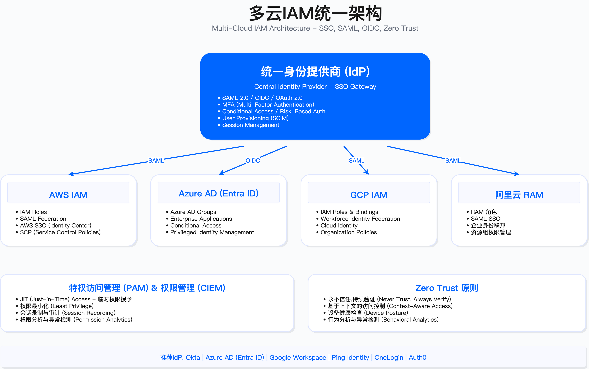

# 5.9　多云治理

多云环境带来的复杂性超出大部分企业最初预期。单一云平台的安全已足够复杂，涉及多个云服务商时，可见性碎片化、策略一致性、成本失控等问题会呈指数级增长。本节建立多云治理框架，覆盖统一管理平台选型、云成本优化与安全平衡、混合云架构设计、迁移安全与责任边界界定。

> 导读：多云治理是本章的综合章节，它把前面各节的技术能力（IAM 5.2、网络 5.3、运营 5.8）拉到跨云统一治理的视角。5.9.1 解决"看得全"的平台选型问题，5.9.2 处理 FinOps 与 SecOps 的张力，5.9.3 涉及混合云的身份与网络设计，5.9.4 系统化迁移安全流程，5.9.5 澄清责任边界常见误解，5.9.6 覆盖 GDPR/HIPAA/PCI DSS 在多云环境的落地要点。

---

## 5.9.1 多云统一管理平台

### 多云管理核心挑战

企业采用多云策略后，面临的核心问题不是技术能力不足，而是管理碎片化。典型场景中，AWS Console、Azure Portal、GCP Console 各自独立，无法统一视图查看资源分布与配置状态。配置漂移在跨云环境更难发现，单一云平台的扫描工具无法覆盖全局。

策略执行层面，每个云平台有独立的 IAM 体系、网络规则、安全策略，合规要求难以统一实施。审计日志分散在不同系统，事件关联分析需要手工整合。成本管理更为棘手，多个账单系统的成本分摊、资源浪费识别都需要额外工具支持。

人员能力方面，要求团队同时掌握 3 个以上云平台专业知识，认证成本高，人才市场稀缺。这些问题的根源不在于缺少工具，而在于缺少统一的治理框架与执行平台。

适用边界：多云管理平台适合运行 2 个及以上云环境的企业。单一云环境使用原生工具（如 AWS Security Hub、Azure Policy）成本更低且集成更好。混合云场景（本地数据中心 + 云）需要额外考虑跨环境网络互联与身份联邦。

关键约束：
- 平台部署与集成周期通常在 3-6 个月，需要跨团队协作（安全、云运维、FinOps、合规）
- 数据采集依赖云 API 权限，权限过小导致可见性不足，权限过大增加泄露风险
- 多数平台按云支出百分比或资源数量收费，年成本可能占云支出的 3%-5%
- 工具切换成本高，选型失误导致的替换成本包括策略重新配置、人员培训、历史数据迁移

### 平台选型决策

多云管理平台（Cloud Management Platform, CMP）主要有 4 类：以成本优化为核心的 FinOps 平台、全面管理平台、自动化编排平台与开源 IaC 管理平台。选型取决于组织优先级、技术成熟度与预算约束。

FinOps 驱动场景：CloudHealth（原 VMware，现随 VMware 并入 Broadcom）适合将成本优化作为首要目标的组织。平台强项在成本可见性、预算告警、优化建议，弱项在自动化编排能力。典型用户为 FinOps 团队主导的企业，每月需要向业务部门分摊云成本。

全面管理场景：Flexera One 覆盖多云（AWS、Azure、GCP、阿里云）加私有云，提供资产管理、成本优化、安全合规、自动化编排全栈能力。适合大型企业需要统一治理平台，但学习曲线陡峭，实施周期长（通常 6-9 个月）。

DevOps 自动化场景：Morpheus 强调自动化编排，支持 30+ 云平台，适合 DevOps 团队需要自助服务门户与工作流自动化的场景。成本管理与安全合规能力相对弱于前两者。

技术团队自建场景：Terraform Cloud（或开源 Terraform）适合技术能力强、预算有限、倾向开源的团队。核心能力在基础设施即代码（IaC）管理，成本优化与安全扫描需要集成第三方工具（如 Infracost、Checkov）。

常见误区：
- 认为部署 CMP 可以自动解决所有多云问题：实际上平台只提供数据与建议，需要人工制定策略与执行流程
- 低估集成复杂度：云 API 权限配置、自定义策略编写、现有工具集成都需要专业技能
- 忽略供应商锁定风险：平台迁移成本高，选型时需评估供应商稳定性与开放性

验证方法：
- 概念验证（PoC）阶段连接至少 1 个生产云账户，验证数据采集完整性、策略匹配度、报告准确性
- 评估误报率与可操作性：安全合规告警中，误报率超过 30% 会导致团队忽略告警
- 测试 API 调用频率与云账单影响：部分平台高频调用云 API 会增加云成本（如 AWS CloudTrail 数据事件费用）

运行指标：
- 平台纳管资产覆盖率 = 已纳管云资源数 / 实际云资源总数，目标 ≥95%
- 策略违规响应率 = 7 天内处置的违规项 / 违规项总数，目标 ≥80%
- 成本优化采纳率 = 已执行的优化建议金额 / 优化建议总金额，目标 ≥40%（部分建议不适用）

### 平台选型评分模型

选型时需要量化评估，核心维度为：优先级匹配度、综合能力得分、成本可接受性与易用性。

优先级匹配：如果组织优先级是成本优化，则该维度权重加倍；如果是自动化，则自动化能力加倍。不存在所有维度都满分的平台，需要根据实际需求权衡。

成本评估：平台成本通常与云支出规模挂钩。不同平台采用不同计费模式——按云支出百分比收费、按用户数或 workspace 数收费、或固定年费。选型时需综合评估平台功能覆盖范围与实际成本，部分平台不包含成本管理功能，需额外集成 Infracost 等工具。

成本与安全平衡示例：某金融企业初期选择免费开源方案（Terraform + Checkov + CloudCustodian），发现人工维护成本高（需专职工程师持续维护），后期切换至商业 CNAPP 平台，减少人工投入，实际总成本持平，但合规自动化程度显著提升。这一路径适用于云支出规模较大且安全合规要求严格的企业。

边界说明：评分模型适用于云支出规模较大的企业。低于一定阈值时，使用云原生工具（如 AWS Security Hub + AWS Cost Explorer）更经济。

---

## 5.9.2 云成本优化与安全

### FinOps 与 SecOps 协同框架

FinOps（Financial Operations）与 SecOps（Security Operations）存在天然张力：成本优化倾向减少资源使用，安全倾向增加防护层。协同需要建立共同语言与决策框架。下文的 Inform-Optimize-Operate 三阶段沿用 FinOps Foundation 的 FinOps Framework 术语[1]。

Inform（告知）阶段：建立成本可见性是前提。云支出仪表板需要按业务、项目、团队、环境（生产/测试）维度分解，实时展示成本趋势。成本分摊模型需与安全策略关联，例如标记哪些成本来自安全工具（WAF、GuardDuty、CloudTrail），避免被错误归类为可削减成本。预算与预测需要包含安全投入；据作者实践，为安全事件响应预留一笔独立于日常运营的应急预算是必要的，具体比例应结合本组织历史事件频次与云支出规模测算（示例口径，非行业基准）。

Optimize（优化）阶段：降低单位成本需要在不牺牲安全的前提下执行。Right-Sizing（调整实例规格）可以应用于非关键环境的安全工具，例如测试环境的 SIEM 可以使用较小规格。Reserved Instances 或 Savings Plans 适用于长期运行的安全基础设施（如 SIEM、CSPM）。Spot Instances 不适用于安全关键组件（如防火墙、入侵检测），但可用于批量日志处理、威胁情报更新等可中断工作负载。

Operate（运营）阶段：建立 FinOps 与 SecOps 跨职能团队，定期评审成本与安全权衡。成本 KPI 需要与安全指标关联，例如"每日志 GB 成本""每检测到的威胁成本"。自动化策略包括非生产环境定时启停（节省幅度取决于非生产环境在总支出中的占比与实际停机时长，应按自身账单测算），但需保留核心测试环境以避免测试不充分导致的安全漏洞流入生产环境。

适用边界：FinOps 框架适合云支出达到一定规模的企业。规模较小时，成本优化收益可能低于 FinOps 团队建设成本。框架假设企业已有基本的云成本可见性（如 AWS Cost Explorer、Azure Cost Management），若无，需先部署成本管理工具。

关键约束：
- 成本分摊模型准确性依赖资源标签覆盖率，标签缺失率超过 20% 会导致分摊不准确
- 优化建议执行需要跨团队审批，流程过长导致机会窗口丢失
- 自动化策略可能与业务需求冲突，例如定时关闭测试环境时恰好有紧急测试需求

### 成本异常检测

成本突增可能是攻击信号（如资源被挖矿、DDoS 攻击导致流量费用激增）或配置错误（如误删资源标签导致自动扩展失控）。检测需要建立基线与阈值。

统计方法：使用移动平均（MA）与标准差（σ）建立动态基线。30 天移动平均适合识别长期趋势，7 天移动平均适合识别短期异常。阈值设定为基线+2.5σ，覆盖 99% 正常波动，超出视为异常。严重异常定义为超出 4σ，需立即响应。

分组策略：按服务（EC2、S3、Lambda）、按项目、按环境分组检测。全局检测容易被大项目掩盖小项目异常。某个服务成本突增 200% 可能在全局只占 5%，全局检测无法触发告警。

告警分级：异常评分（Anomaly Score）= |（实际成本-基线成本）/标准差|。评分 2-4 为 WARNING 级别，邮件通知 FinOps 团队；评分 >4 为 CRITICAL 级别，触发 PagerDuty 通知安全与 FinOps 团队，并执行自动响应（如暂停可疑资源）。

常见误区：
- 阈值设置过敏感：标准差倍数 <2 导致误报率超过 50%，团队疲劳后忽略告警
- 忽略周期性波动：周末流量下降、月底批处理任务导致成本波动，需要基于星期几、月份的季节性调整
- 异常检测后未关联安全事件：成本异常与安全日志（CloudTrail、GuardDuty）未联动，错失攻击信号

验证方法：
- 注入测试：在测试环境故意创建大量资源（如启动 100 个 EC2 实例），验证检测器能否在 15 分钟内触发告警
- 历史回测：使用过去 3 个月数据，验证检测器能否识别已知的成本异常事件
- 误报率评估：运行 1 个月，统计误报率=误报数/（误报数+真实异常数），目标 ≤20%

运行指标：
- 异常检测覆盖率 = 已纳入检测的服务数 / 使用中服务总数，目标 100%
- 平均检测时间（MTTD）= 从异常发生到告警触发的时间，目标 ≤15 分钟
- 平均响应时间（MTTR）= 从告警触发到人工确认并执行响应的时间，目标 ≤60 分钟

### 预算告警配置

预算告警是成本治理的第一道防线。配置需要覆盖实际成本与预测成本 2 个维度。

实际成本告警：当月实际支出达到预算 80% 时触发通知，通知对象为 FinOps 团队与项目负责人。达到 100% 时升级为高优先级告警，通知高管与财务部门。告警需要包含成本分解（按服务、按项目），方便快速定位超支原因。

预测成本告警：基于当前消费速率预测月底成本。AWS Budget、Azure Budget 支持预测告警，当预测成本超过预算 100% 时提前触发告警。预测告警的价值在于提前干预，避免月底超支后无法挽回。

成本分摊标签：预算告警准确性依赖资源标签。标签需要包含 Environment（生产/测试）、Project、CostCenter、Owner。标签缺失的资源归入"Untagged"分组，单独设置预算，避免影响正常项目预算。

适用边界：预算告警适合有明确预算控制要求的企业。初创企业或快速增长阶段，预算波动大，预算告警可能频繁触发导致告警疲劳。此时更适合使用异常检测替代固定预算告警。

### 成本优化与安全平衡

成本优化措施可能削弱安全控制，需要建立决策框架明确哪些措施可接受、哪些不可接受。

可接受的优化措施：
- Spot Instances 用于无状态/可中断工作负载（如日志处理、威胁情报更新、批量扫描），成本节省 50%-90%，中断风险可通过重试机制吸收
- 非生产环境定时启停（如晚上 20:00 关闭测试环境，早上 8:00 启动），节省 40%-60% 成本，但需保留核心测试环境 24 小时运行以支持持续集成
- CloudTrail 日志存储分层（如 90 天内存储在 S3 Standard，90 天后迁移至 S3 Glacier），降低存储成本 70%-80%，合规留存要求仍然满足

不可接受的优化措施：
- 关闭 CloudTrail 审计日志：即使节省成本，也会失去安全事件可追溯性，违反合规要求（如 ISO 27001、SOC 2）
- 关闭 WAF 或 GuardDuty：节省成本边际（WAF 约 $5-50/月，GuardDuty 按流量收费约 $2-5/月/账户），但失去 Layer 7 防护与威胁检测能力，攻击导致的损失远超节省金额
- 共享 IAM 凭证以减少 PAM 许可证成本：违反最小权限原则与审计要求，无法满足合规审计（如 PCI DSS 要求唯一 ID）
- 设置 S3 Bucket 为 Public 以节省 VPC Endpoint 费用：数据泄露风险远超成本节省，绝对不可接受

决策原则：成本优化不能以牺牲安全为代价。优先优化架构效率（如 Right-Sizing、Reserved Instances、存储分层），而非削减安全工具。如果预算压力大，应优先砍测试环境资源，而非生产环境安全控制。

验证方法：
- 优化措施影响评估：每个优化措施需要产出影响分析文档，包含节省金额、安全影响、合规影响、回滚成本
- 安全基线回归测试：优化措施执行后，运行 CIS Benchmark、CSPM 扫描，验证安全基线未降级
- 红队测试：优化措施执行后，执行模拟攻击，验证检测能力未下降

运行指标：
- 成本优化采纳率 = 已执行优化建议金额 / 总优化建议金额，目标 ≥40%（部分建议因安全原因不采纳）
- 安全工具成本占比 = 安全工具总成本 / 云总支出，参考范围 5%-15%（过低可能防护不足，过高需评估工具冗余）
- 优化措施回滚次数 = 因安全/业务影响回滚的优化措施次数，目标 ≤5%

---

## 5.9.3 混合云安全架构

混合云是本地数据中心与公有云共存的架构模式，适用于遗留系统无法迁移、数据主权要求、特定合规约束的场景。架构复杂度显著高于单一云或多云。

### 混合云架构设计

典型混合云架构包含本地数据中心、专线连接层、公有云三部分。

本地数据中心层：保留遗留系统（如 AS/400 大型机、核心银行系统）、敏感数据（如 PII、PCI 数据）、强合规要求的工作负载（如金融交易系统需符合当地监管）。本地系统与云环境通过专线或 VPN 互联，需要建立统一安全策略。

混合连接层：使用 AWS Direct Connect、Azure ExpressRoute、GCP Cloud Interconnect 建立高速专线（通常 1Gbps-10Gbps）。专线绕过公网，降低延迟（从 100ms 降至 10ms 以内）与数据泄露风险。备份 VPN（IPSec）提供冗余，专线故障时自动切换至 VPN。连接层需要部署防火墙（如 Palo Alto、Fortinet）统一管控本地与云之间的流量。

公有云层：部署 Web 应用、API 网关、数据湖等适合云弹性的工作负载。云环境需要回调本地数据中心的核心系统，例如电商前端在 AWS，订单处理调用本地 ERP 系统。跨环境调用需要经过 API Gateway，实施速率限制、认证授权、日志审计。

网络拓扑：采用 Hub-Spoke 模式，本地数据中心作为 Hub，多个云 VPC 作为 Spoke。所有跨环境流量经过 Hub 防火墙，集中实施安全策略。Spoke 之间不直连，避免东西向流量失控。

适用边界：混合云适合有遗留系统且短期内无法迁移的企业，或有明确数据驻留要求的场景。初创企业或云原生企业无遗留系统，应优先考虑纯云架构，避免混合云复杂度。

关键约束：
- 专线部署周期 3-6 个月（需运营商施工），成本高（如 AWS Direct Connect 10Gbps 专线月费约 $2000-5000，加运营商线路费）
- 跨环境延迟影响应用性能，需要应用架构适配（如本地缓存、异步调用）
- 网络故障定位复杂，涉及本地网络、专线、云网络多方，需要建立联合运维机制

### 统一身份联邦

混合云环境下，用户需要访问本地系统（如本地 AD 域账户访问内部应用）与云资源（如 AWS IAM 访问 S3）。统一身份联邦通过中心化 IdP（Identity Provider）实现单点登录（SSO）。这部分与 5.2 的多云 IAM 设计紧密衔接——区别在于 5.2 聚焦纯云环境的 IAM 架构，本节处理本地 AD 与云平台的跨环境联邦。

架构模式：选择 Okta 或 Azure AD 作为中心 IdP，本地 AD 通过 AD Connect 或 Okta AD Agent 同步至 IdP，云平台（AWS、Azure、GCP）通过 SAML/OIDC 信任 IdP。用户登录 IdP 后，IdP 颁发 SAML 断言或 OIDC Token，用于访问云资源与本地应用。

实施步骤：
1. 部署 Identity Hub（Okta 或 Azure AD），配置 SAML/OIDC 连接，测试与应用集成
2. 本地 AD 联邦：部署 AD Connect（Azure AD）或 Okta AD Agent，配置用户同步（密码哈希同步或 Pass-through 认证），测试 SSO
3. AWS 联邦：配置 AWS SSO 或 IAM SAML Provider，映射 IdP Groups 至 AWS IAM Roles，测试跨账户访问
4. Azure 联邦：如使用 Azure AD 作为 IdP，原生集成；如使用 Okta，配置 Azure AD B2B，测试 Conditional Access 策略
5. 自动化用户生命周期管理：配置 SCIM（System for Cross-domain Identity Management）自动 provisioning/deprovisioning，离职员工账户自动禁用

权限映射：IdP Groups 映射至云 IAM Roles，例如 IdP 的"Cloud-Admins"组映射至 AWS 的"AdministratorAccess"角色，Azure 的"Contributor"角色。映射需要遵循最小权限原则，定期审计权限使用情况（如使用 AWS IAM Access Analyzer 检测未使用权限）。

适用边界：统一身份联邦适合有 100+ 用户需要访问多云资源的企业。小团队（如 <50 人）使用云原生 IAM（如 AWS IAM Users）成本更低。联邦假设 IdP 高可用，IdP 故障会导致所有云资源无法访问，需要建立应急访问机制（如 Break-Glass 账户）。

常见误区：
- 同步所有本地 AD 用户至 IdP：导致大量不活跃账户，增加攻击面，应仅同步需要云访问的用户
- 权限映射过于宽泛：例如将整个部门映射至管理员角色，违反最小权限原则
- 未测试 IdP 故障场景：IdP 单点故障导致业务中断，需要配置 Break-Glass 账户（直接存储在云 IAM，绕过 IdP）

验证方法：
- SSO 功能测试：用户使用 IdP 账户登录云控制台、CLI、API，验证权限正确
- 用户生命周期测试：新员工入职后，验证账户自动创建；离职后，验证账户自动禁用（目标 <1 小时）
- 故障切换测试：模拟 IdP 故障，使用 Break-Glass 账户登录，验证应急访问可用

运行指标：
- SSO 覆盖率 = 使用 SSO 登录的会话数 / 总登录会话数，目标 ≥95%
- 账户自动禁用及时性 = 离职当天禁用账户数 / 离职总人数，目标 100%
- Break-Glass 账户使用次数，目标 = 0（仅应急使用）

*图：多云 IAM 架构示意，展示中心 IdP（Okta/Azure AD）与本地 AD、AWS、Azure、GCP 的联邦集成关系。图中 Hub 为 IdP，Spoke 为各云平台，通过 SAML/OIDC 建立信任关系，实现单点登录与权限统一管理。*

---

## 5.9.4 云迁移安全

云迁移是高风险操作，涉及数据传输、应用停机、配置变更。缺少安全评估的迁移可能导致数据泄露、服务中断、合规违规。

### 6R 迁移策略

业界广泛采用的 6R 迁移策略框架包括 Rehost、Replatform、Refactor、Repurchase、Retire、Retain。每种策略有不同的安全考量与适用场景。

Rehost（Lift-and-Shift，直接迁移）：不修改应用，直接将虚拟机从本地迁移至云（如使用 AWS Application Migration Service、Azure Migrate）。优点是迁移快（通常 3-6 个月），缺点是保留原有安全缺陷（如未打补丁的操作系统、弱密码、开放端口），需要迁移后立即补充云安全控制（如 Security Group、CSPM 扫描）。适用于需要快速退出数据中心、遗留应用无法修改的场景。

Replatform（Lift-Tinker-Shift，小幅优化）：迁移时做小幅调整，例如数据库从自建 MySQL 迁移至 AWS RDS（托管数据库），引入云原生安全能力（如 RDS 自动备份、加密、补丁管理）。中间件升级至云托管服务（如从自建 Redis 迁移至 AWS ElastiCache），减少运维负担。迁移周期 6-9 个月，安全改进显著，但需要测试兼容性。

Refactor（Re-architect，重新架构）：重新设计为云原生架构，例如单体应用拆分为微服务，部署至 Kubernetes。这是植入安全最佳实践的最佳机会（如微服务间 mTLS、服务网格、零信任架构）。迁移周期 12-24 个月，成本高，但长期安全收益大。适用于核心应用现代化场景。

Repurchase（Drop-and-Shop，迁移至 SaaS）：替换为 SaaS 服务，例如自建 ERP 迁移至 SAP S/4HANA Cloud，自建 CRM 迁移至 Salesforce。安全责任转移至 SaaS 供应商，但需要评估供应商安全（如 SOC 2 报告、ISO 27001 认证、数据驻留位置）。迁移周期 6-12 个月，数据迁移是主要风险点（数据格式转换、历史数据完整性）。

Retire（淘汰）：淘汰不再需要的系统，减少攻击面。需要安全销毁数据（如使用 AWS S3 Object Lock 删除后无法恢复，或使用加密密钥销毁使数据不可读）。迁移周期 1-3 个月，风险在于确认系统确实无依赖（需要依赖分析工具）。

Retain（暂不迁移）：因强合规要求（如金融监管要求系统部署在特定区域）或技术约束（如大型机无法迁移）暂不迁移。需要加强边界防护（如 VPN、防火墙），定期重新评估迁移可行性。

适用边界：6R 策略适用于有明确迁移目标的企业。初创企业或云原生企业无遗留系统，直接在云上构建，不涉及迁移。选择策略需要应用评估（业务重要性、技术债务、修改难度），不存在一刀切的方案。

关键约束：
- Rehost 保留安全债务，需要预算迁移后的安全加固（如补丁管理、CSPM 扫描修复）
- Refactor 周期长，需要业务容忍 12-24 个月无新功能交付
- Repurchase 依赖 SaaS 供应商，供应商安全事件影响业务（如 2023 年 MOVEit 漏洞影响数百家企业）

### 迁移安全检查清单

迁移安全需要分 3 个阶段：迁移前（Pre-Migration）、迁移中（During Migration）、迁移后（Post-Migration）。每个阶段有不同的检查项。

迁移前（2-4 周）：
- 资产清点：应用清单（名称、版本、依赖关系）、数据清单（数据库、文件、对象存储、数据量）、网络拓扑（IP 段、VLAN、防火墙规则）、集成关系（API 调用、消息队列、文件传输）
- 安全评估：应用漏洞扫描（SAST/DAST，发现代码漏洞与配置错误）、基础设施漏洞扫描（如使用 Nessus 扫描服务器）、数据分类（识别 PII、PCI、PHI 等敏感数据，决定加密策略）、合规差距分析（评估目标云环境能否满足 GDPR、HIPAA、PCI DSS 要求）
- 云环境准备：创建 Landing Zone（如 AWS Control Tower、Azure Landing Zone，预配置账户结构、网络、IAM 策略）、设计 VPC/Subnet/Security Group（遵循最小权限原则）、配置 IAM 角色（迁移人员临时权限，迁移后回收）、启用日志与监控（CloudTrail、GuardDuty、Azure Sentinel）
- 迁移计划：规划迁移波次（先非生产环境验证，再生产环境迁移）、制定回滚计划（迁移失败时如何恢复原环境）、准备安全验证测试用例（如渗透测试脚本、合规扫描配置）、制定应急响应预案（迁移中发现安全事件如何处置）

迁移中（按波次执行）：
- 数据传输安全：使用加密通道（VPN、Direct Connect、ExpressRoute，禁止公网明文传输）、数据加密（AES-256，传输前加密）、完整性校验（MD5/SHA256 哈希，验证数据未篡改）、传输日志记录（审计谁在何时传输了什么数据）
- 访问控制：使用临时凭证（AWS STS、Azure Managed Identity，避免长期密钥泄露）、迁移人员权限最小化（仅授予迁移所需权限，禁止管理员权限）、强制 MFA、会话录制（如使用 SSH Bastion 记录迁移操作）
- 实时监控：监控迁移进度（数据传输量、剩余时间）、异常流量检测（如突然出现大量外向流量可能是数据窃取）、错误日志聚合（集中查看迁移错误）、安全事件监控（GuardDuty、Sentinel 告警）

迁移后（2-4 周）：
- 安全验证：漏洞扫描（在云环境重新扫描，验证无新漏洞引入）、渗透测试（模拟攻击，验证云防护有效）、配置审计（使用 CIS Benchmark、CSPM 工具扫描，确保符合安全基线）、合规验证（生成审计报告，证明符合 GDPR、HIPAA 等要求）
- 访问清理：删除迁移临时账号、回收迁移人员权限、轮换密钥（迁移中使用的临时密钥全部轮换）、断开遗留连接（如果已完全迁移，断开本地数据中心与云的专线，避免回退）
- 文档更新：更新架构图（反映云环境网络拓扑）、更新网络拓扑图、更新应急响应手册（云环境事件响应流程与本地不同）、更新知识库（记录迁移过程遇到的问题与解决方案）

常见误区：
- 跳过迁移前安全评估，迁移后才发现应用有严重漏洞，需要紧急修复
- 迁移中未加密数据传输，通过公网明文传输敏感数据，违反合规要求
- 迁移后未清理临时权限，迁移人员保留高权限，成为攻击入口

运行指标：
- 检查清单完成率 = 已完成检查项 / 总检查项，目标 100%
- 迁移安全事件数 = 迁移过程中发生的安全事件（数据泄露、未授权访问），目标 = 0
- 迁移后漏洞数 = 迁移后发现的新漏洞数，目标 ≤迁移前漏洞数（不应引入新漏洞）

---

## 5.9.5 云 SLA 与责任共担模型

云服务商与客户之间的责任边界常被误解，导致安全事件后责任不清。责任共担模型（Shared Responsibility Model）明确定义边界，三大云厂商均有官方表述——AWS 表述为"云本身的安全 / 云中的安全"[3]，Azure 按 IaaS/PaaS/SaaS 逐层给出责任归属矩阵[4]，Google Cloud 在共享责任之外还提出了"共同命运（shared fate）"[5]。

### 责任共担模型

云服务商（如 AWS、Azure、GCP）负责"云的安全"（Security OF the Cloud），客户负责"云中的安全"（Security IN the Cloud）。

云服务商责任（Security OF the Cloud）：
- 基础设施层：物理数据中心安全（门禁、监控、防火、防洪）、硬件生命周期管理（服务器、存储、网络设备采购、维护、报废）、虚拟化层安全（Hypervisor 漏洞修复、隔离机制）
- 网络层：区域间网络（Regions、Availability Zones 间网络）、边缘节点（Edge Locations、CDN 节点）
- 托管服务：RDS 数据库补丁、Lambda 运行时更新、S3 存储冗余

客户责任（Security IN the Cloud）：
- 数据层：数据分类、加密（静态加密、传输加密）、数据保留与删除策略
- 应用层：应用代码安全（漏洞修复、依赖管理）、应用配置（如 Web 服务器配置）
- 身份与访问：IAM 策略（用户、角色、权限）、MFA 配置、访问密钥管理
- 操作系统（IaaS）：EC2 实例操作系统补丁、防病毒软件、主机防火墙
- 网络配置：VPC 设计、Security Group 规则、Network ACL、子网划分

服务类型差异：
- IaaS（如 EC2、VM）：客户责任最大，需要管理操作系统、应用、数据、网络配置；云服务商仅负责硬件、虚拟化、物理安全
- PaaS（如 RDS、Azure SQL）：客户责任减少，操作系统补丁、数据库补丁由云服务商管理；客户负责应用、数据、访问控制
- SaaS（如 S3、Azure Blob）：客户责任最小，仅负责数据分类、访问控制、用户管理；云服务商负责应用、操作系统、基础设施
- FaaS（如 Lambda）：客户负责代码与 IAM 角色，运行时、扩展、基础设施由云服务商管理

*图：AWS 责任共担模型示意，上半部分为客户责任（客户数据、应用、操作系统、网络配置），下半部分为 AWS 责任（基础设施、计算、存储、数据库、网络硬件）。模型根据服务类型（IaaS、PaaS、SaaS）动态调整边界。*

适用边界：责任共担模型适用于所有云服务，但不同服务边界不同。使用前需要查阅云服务商文档，明确具体服务的责任边界。模型不涵盖第三方服务（如 Marketplace 应用），需要单独与第三方供应商签订协议。

关键约束：
- 责任边界非绝对：某些区域（如操作系统补丁）在 IaaS 由客户负责，在 PaaS 由云服务商负责，需要根据服务类型判断
- 合规责任不可转移：即使使用托管服务，客户仍需承担合规责任（如 GDPR 数据控制者责任），不能以"数据在云上"为由推卸责任

责任共担模型划的是企业与云服务商之间那条线。它划不到的是企业内部：混合互联链路的本地那一端由谁负责、两端策略是否对称、专线与 VPN 隧道两侧的允许范围是否一致，都落在模型之外，而这正是混合架构最常见的实际缺口。本地侧的对应处理见 [15.10](../../第05部分_身份网络与业务连续性/第15章_网络基础设施与终端安全/15.10_混合与本地数据中心安全.md)。

### 责任边界常见误区

误区 1：数据在云上，云服务商负责数据安全
- 错误认知：S3 Bucket 被配置为 Public 导致数据泄露，认为是 AWS 责任
- 正确理解：客户负责 S3 访问控制配置（Bucket Policy、ACL），AWS 仅保证 S3 服务可用性与存储冗余。数据泄露由配置错误导致，属于客户责任
- 缓解措施：启用 S3 Block Public Access（账户级别），CSPM 工具持续扫描 Public Bucket

误区 2：购买云服务，操作系统补丁由云服务商管理
- 错误认知：EC2 实例从不打补丁，认为 AWS 会自动处理
- 正确理解：IaaS 模式下，操作系统补丁是客户责任；PaaS 模式（如 RDS）才由云服务商负责。EC2 实例需要客户使用 AWS Systems Manager Patch Manager 或第三方工具管理补丁
- 缓解措施：部署自动化补丁管理（如 SSM Patch Manager），定期扫描未打补丁实例

误区 3：云原生应用自动安全
- 错误认知：使用 Lambda 就不需要考虑安全，因为"Serverless"
- 正确理解：代码注入（如通过事件参数注入恶意代码）、依赖漏洞（如使用有漏洞的 npm 包）、IAM 过度授权（如 Lambda 角色拥有 * 权限）仍是客户责任。Serverless 仅消除操作系统管理，不消除应用安全责任
- 缓解措施：Lambda 代码 SAST 扫描、依赖 SCA 扫描、IAM 权限最小化、运行时监控

### 填补责任空白

责任共担模型明确了云服务商与客户责任，但存在"责任空白"区域，无人主动覆盖。

- IAM 配置错误：云服务商提供 IAM 能力，但不检查配置是否安全（如过度授权）。客户需要部署 CIEM 工具（如 Microsoft Entra Permissions Management，即原 CloudKnox[2]；Tenable Cloud Security，即原 Ermetic）持续扫描过度权限、未使用权限，定期清理
- 网络配置错误：Security Group 规则由客户配置，云服务商不干预。Security Group 配置 0.0.0.0/0 开放所有端口是常见错误。需要 CSPM 工具（如 Prisma Cloud、Wiz）持续扫描，自动修复或告警
- 数据加密：云服务商提供加密能力（如 S3 SSE-KMS），但不强制启用。客户需要数据分类，自动应用加密策略（如所有包含 PII 的 S3 Bucket 强制加密）
- 日志监控：CloudTrail、GuardDuty 等日志工具需要客户主动启用并配置告警。未启用导致攻击不可见。需要集成 SIEM，建立检测规则，确保攻击可被发现
- 合规审计：云服务商通过 SOC 2、ISO 27001 等认证，证明其基础设施安全，但不证明客户配置安全。客户需要部署自动化合规工具（如 AWS Audit Manager、Azure Policy），生成合规报告
- 备份恢复：云服务商提供备份能力（如 AWS Backup），但不强制启用。客户需要制定备份策略（如 RTO/RPO 要求），自动化备份，定期执行恢复测试

---

## 5.9.6 多云合规

多云环境合规复杂度显著高于单一云。不同云平台、不同地理区域、不同法规（GDPR、HIPAA、PCI DSS）交织，需要建立统一合规框架。

### GDPR 多云实施

GDPR（General Data Protection Regulation，欧盟通用数据保护条例）是全球最严格的隐私法规之一，违规罚款最高达全球营收 4% 或 2000 万欧元（取较高者）。多云环境需要确保所有云平台符合 GDPR 要求。

数据驻留（Art. 44-50）：GDPR 要求欧盟用户数据不得传输至非充分性认定国家/地区，除非有适当保障措施（如标准合同条款 SCC）。云实施：使用 EU regions（AWS eu-west-1、eu-central-1，Azure West Europe、North Europe，GCP europe-west1、europe-west4），禁止数据复制至非 EU 区域。跨境数据传输需要签订 SCC，定期审计数据流向。

数据加密（Art. 32）：GDPR 要求适当的技术措施保护数据，加密是基本要求。云实施：启用 KMS（AWS KMS、Azure Key Vault、GCP Cloud KMS）管理密钥，强制 AES-256 加密，传输使用 TLS 1.3。密钥轮换周期 ≤90 天，密钥访问日志记录。

访问控制（Art. 32）：GDPR 要求限制数据访问，仅授权人员可访问。云实施：IAM 最小权限，强制 MFA，审计日志记录所有数据访问（CloudTrail、Azure Activity Log、GCP Audit Logs）。数据访问需要业务理由，定期审计访问权限。

被遗忘权（Art. 17）：GDPR 赋予用户被遗忘权，用户有权要求删除数据。云实施：S3 Object Lock（删除后无法恢复）+ Lifecycle Policy（自动删除过期数据），Azure Blob Immutable Storage，GCP Cloud Storage Retention Policy。删除需要在 30 天内完成，删除日志记录。

违规通知（Art. 33, 72h）：GDPR 要求数据泄露后 72 小时内通知监管机构。云实施：GuardDuty、Azure Sentinel、GCP Security Command Center 检测数据泄露，EventBridge、Logic Apps、Pub/Sub 触发自动通知，确保 72 小时内响应。

常见误区：
- 认为使用 EU regions 即符合 GDPR：数据驻留仅是 GDPR 要求之一，仍需满足加密、访问控制、被遗忘权等其他要求
- 认为云服务商 DPA 可豁免客户责任：DPA 明确云服务商为数据处理者，客户为数据控制者，客户仍需承担主要合规责任
- 未测试被遗忘权流程：用户请求删除数据时，发现删除流程未建立，无法在 30 天内完成

运行指标：
- GDPR 合规项覆盖率 = 已实施合规项数 / GDPR 要求总项数，目标 100%
- 数据泄露通知及时性 = 72 小时内通知的泄露事件数 / 泄露事件总数，目标 100%
- 被遗忘权响应及时性 = 30 天内完成删除请求数 / 删除请求总数，目标 100%

### HIPAA 多云合规

HIPAA（Health Insurance Portability and Accountability Act，健康保险流通与责任法案）是美国医疗行业隐私法规，要求保护 PHI（Protected Health Information，受保护健康信息）。云环境需要签订 BAA（Business Associate Agreement，业务伙伴协议），选择 HIPAA 合规服务。

技术保障措施（164.312）：包括访问控制（IAM RBAC、MFA）、审计控制（CloudTrail、Audit Logs）、完整性控制（S3 Versioning、Checksums）、传输安全（TLS 1.3、VPN）。云实施：启用审计日志，传输强制 TLS 1.3，静态加密 AES-256。

HIPAA 合规服务选择：
- AWS：100+ HIPAA Eligible Services（包括 EC2、S3、RDS 等），需签署 BAA。非 Eligible Services 不得处理 PHI
- Azure：大部分服务 HIPAA/HITECH 合规，BAA 自动覆盖，无需单独申请
- GCP：HIPAA 合规服务包括 Compute Engine、Cloud Storage 等，需签署 BAA

常见误区：
- 认为所有云服务均 HIPAA 合规：仅 Eligible Services 合规，使用非 Eligible Services 处理 PHI 违规
- 未签署 BAA：即使使用 Eligible Services，未签署 BAA 仍违规
- 忽略审计日志保留要求：HIPAA 要求审计日志保留至少 6 年，云服务商默认保留 90 天，需配置长期存储（如 S3 Glacier）

运行指标：
- HIPAA 合规服务使用率 = 使用 HIPAA Eligible Services 数 / 使用云服务总数，目标 100%（处理 PHI 的服务）
- BAA 覆盖率 = 已签署 BAA 的云账户数 / 处理 PHI 的云账户总数，目标 100%
- 审计日志保留合规率 = 保留 ≥6 年的日志数 / 总日志数，目标 100%

### PCI DSS 多云环境

PCI DSS（Payment Card Industry Data Security Standard，支付卡行业数据安全标准）要求保护 CHD（Cardholder Data，持卡人数据）。多云环境需要满足 12 项要求，范围界定（Scoping）是关键。

范围界定原则：仅处理 CHD 的账户/VPC 需要合规，通过网络隔离可减少合规范围。常见误区：认为整个云环境需要 PCI DSS 合规——实际上通过 Segmentation 可将合规范围最小化，显著降低合规成本。

关键要求云实施摘要：
- 要求 1（防火墙）：Security Groups/NSG/Firewall Rules 统一管理，禁止 0.0.0.0/0 开放关键端口
- 要求 3（保护存储的 CHD）：KMS 加密（AES-256），密钥每 90 天轮换，CHD 仅存储在加密数据库
- 要求 4（加密传输 CHD）：强制 TLS 1.3，禁用 TLS 1.0/1.1
- 要求 8（唯一 ID）：SSO 联邦身份（Okta、Azure AD），禁用共享账号，MFA 强制
- 要求 10（日志与监控）：统一 SIEM，保留至少 12 个月（PCI DSS 要求最少 3 个月，行业实践 12 个月）
- 要求 11（安全测试）：季度漏洞扫描（使用 ASV 扫描，如 Qualys、Rapid7），年度渗透测试

适用边界：PCI DSS 适用于存储、处理、传输 CHD 的所有组织。多云环境需要范围界定（Scoping），明确哪些云账户/资源处理 CHD，仅这些资源需要满足 PCI DSS。

运行指标：
- PCI DSS 12 项要求合规率 = 已满足要求数 / 12，目标 100%
- 季度扫描完成率 = 完成扫描季度数 / 4，目标 100%
- 年度渗透测试完成率 = 完成渗透测试年份数 / 年份总数，目标 100%

### 合规工具推荐

多云合规需要工具支持，自动化收集证据、生成报告、持续监控。

自动化合规工具（云原生）：
- AWS Audit Manager：支持 PCI DSS、HIPAA、GDPR 等框架，自动收集证据（CloudTrail、Config 日志），生成审计报告。按资源收费，成本约 $0.0025/资源评估/月
- Azure Policy：免费，支持 ISO 27001、PCI DSS 等内置策略，自动评估合规性，生成合规报告
- GCP Security Command Center：标准版免费，Premium 版 $50/project/月，支持 PCI DSS、ISO 27001，持续扫描配置

多云合规工具（第三方）：
- Prisma Cloud：支持 AWS、Azure、GCP、阿里云，覆盖 CIS、PCI DSS、HIPAA、GDPR 等框架
- Wiz：支持 AWS、Azure、GCP、OCI，全面合规框架，无代理部署
- Drata/Vanta：专注于 SOC 2、ISO 27001、HIPAA 合规，自动化证据收集

选型建议：
- 单一云环境优先使用云原生工具（成本低，集成好）
- 多云环境选择第三方工具（统一视图，减少工具碎片化）
- 预算有限选择开源工具（如 CloudCustodian + Steampipe），但需要自行维护

---

## 5.9.7 本节小结

多云治理的核心挑战是可见性碎片化、策略一致性与成本失控。解决需要建立统一管理平台、成本优化框架、混合云架构、迁移安全流程与合规自动化。

多云管理平台选型取决于优先级：FinOps 驱动选 CloudHealth，全面管理选 Flexera，DevOps 自动化选 Morpheus，技术团队强选 Terraform Cloud。选型需要平衡功能、成本、集成复杂度，避免供应商锁定。

FinOps 与 SecOps 协同通过 Inform-Optimize-Operate 框架实现。成本优化不能牺牲安全，禁止关闭审计日志、WAF、加密等安全控制。成本异常检测使用统计方法建立基线，告警分级响应。

混合云架构适合有遗留系统或数据驻留要求的企业。专线连接（Direct Connect/ExpressRoute）提供低延迟与高安全，统一身份联邦（Okta/Azure AD）实现 SSO，Hub-Spoke 网络拓扑集中管控流量。部署周期长（3-6 个月），成本高，需要评估业务必要性。

责任共担模型明确云服务商负责"云的安全"，客户负责"云中的安全"。IaaS 客户责任最大（操作系统、应用、数据），PaaS 减少操作系统管理，SaaS 仅管理数据与访问。填补责任空白需要部署 CIEM、CSPM、SIEM、合规工具。

常见误区：
- 过度依赖单一管理平台，供应商锁定风险高
- 盲目成本优化，关闭安全工具，后果严重
- 混合云网络设计不当，延迟高或带宽不足
- 迁移安全评估不足，迁移后才发现合规问题
- 误解责任边界，认为云服务商负责所有安全
- 数据跨境违规，未正确选择 Region
- 合规证据收集不足，审计时无法提供证明

下一步行动：
1. 评估多云管理需求，选择适合的 CMP 平台，执行 PoC 验证
2. 建立 FinOps 流程，部署成本异常检测，配置预算告警，定期优化
3. 如有本地系统，设计混合云架构，规划专线连接，实施统一身份联邦
4. 制定迁移计划，使用 6R 策略评估应用，分波次迁移，执行安全验证
5. 明确责任边界，绘制责任共担模型图，识别责任空白并部署工具填补
6. 部署 CSPM/合规工具，实现持续合规验证，自动化证据收集
7. 建立多云治理委员会，跨团队（安全、FinOps、架构、合规）定期评审

---

## 5.9.8 延伸阅读

多云管理：
- CloudHealth 官方文档：https://docs.cloudhealth.vmware.com/
- Flexera State of the Cloud Report（年度报告，包含多云采用趋势与成本优化实践）
- Gartner Magic Quadrant for Cloud Management Platforms

FinOps：
- FinOps Foundation：https://www.finops.org/（FinOps 框架、认证、案例研究）
- Cloud FinOps by J.R. Storment & Mike Fuller（O'Reilly，2019）
- AWS Cost Optimization Best Practices：https://aws.amazon.com/pricing/cost-optimization/

云迁移：
- AWS Migration Hub：https://aws.amazon.com/migration-hub/
- Azure Migrate：https://azure.microsoft.com/services/azure-migrate/
- Google Cloud Migration Center：https://cloud.google.com/migration-center

责任共担：
- AWS Shared Responsibility Model：https://aws.amazon.com/compliance/shared-responsibility-model/
- Azure Shared Responsibility Model：https://docs.microsoft.com/azure/security/fundamentals/shared-responsibility
- GCP Shared Responsibility Matrix：https://cloud.google.com/architecture/framework/security/shared-responsibility-shared-fate

合规：
- AWS Compliance Programs：https://aws.amazon.com/compliance/programs/
- Azure Compliance：https://docs.microsoft.com/azure/compliance/
- GCP Compliance：https://cloud.google.com/security/compliance
- Cloud Security Alliance（CSA）：https://cloudsecurityalliance.org/
- NIST SP 800-146：Cloud Computing Synopsis and Recommendations

相关章节：
- 前置：[5.8 云安全运营](./5.8_云安全运营.md)（日志审计、事件响应为多云治理提供可见性）
- 后续：[5.10 实战案例](./5.10_实战案例.md)（多云/混合云实际案例参考）
- 关联：[2.3 合规管理](../../第01部分_基础与战略治理/第02章_GRC治理/2.3_合规管理框架.md)（合规框架详解，GRC 流程）
- 关联：[4.6 技术选型与决策](../../第02部分_技术架构与基础设施安全/第04章_安全架构与工程/4.6_技术选型与决策.md)（供应商评估方法，选型框架）

---

## 参考文献

| # | 来源 | 标题 | 日期 | 链接 |
| --- | --- | --- | --- | --- |
| [1] | FinOps Foundation | FinOps Framework（Inform / Optimize / Operate 三阶段） | 2026 访问 | <https://www.finops.org/framework/> |
| [2] | Microsoft Security Blog | Microsoft acquires CloudKnox Security（后更名 Entra Permissions Management） | 2021-07-21 | <https://www.microsoft.com/en-us/security/blog/2021/07/21/microsoft-acquires-cloudknox-security-to-offer-unified-privileged-access-and-cloud-entitlement-management/> |
| [3] | Amazon Web Services | Shared Responsibility Model | 2026 访问 | <https://aws.amazon.com/compliance/shared-responsibility-model/> |
| [4] | Microsoft | Shared responsibility in the cloud | 2026 访问 | <https://learn.microsoft.com/en-us/azure/security/fundamentals/shared-responsibility> |
| [5] | Google Cloud | Shared responsibilities and shared fate on Google Cloud | 2026 访问 | <https://docs.cloud.google.com/architecture/framework/security/shared-responsibility-shared-fate> |

---

## 导航

[← 上一节：5.8 云安全运营](./5.8_云安全运营.md) | [返回章节目录](./README.md) | [下一节：5.10 实战案例 →](./5.10_实战案例.md)

---

© 2025-2026 AISecOps Project. Licensed under CC BY-NC-SA 4.0
