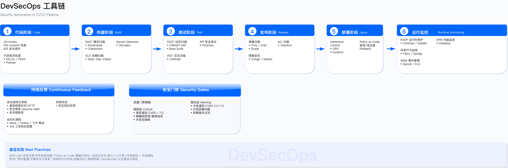
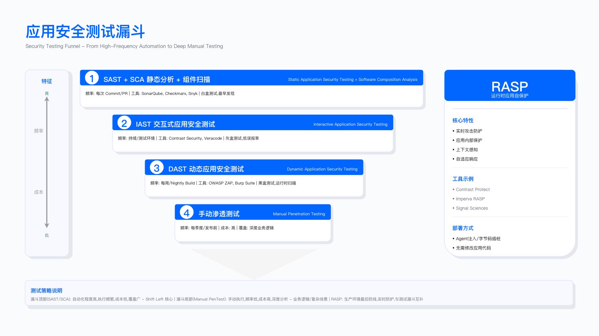
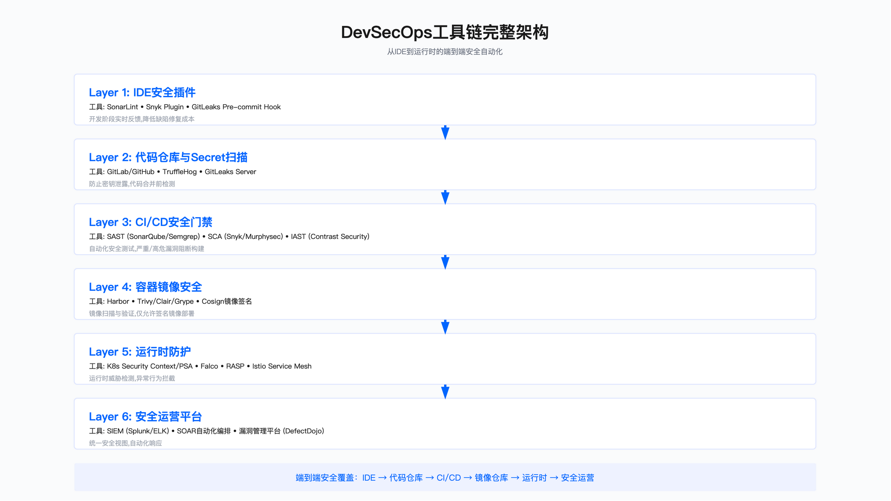
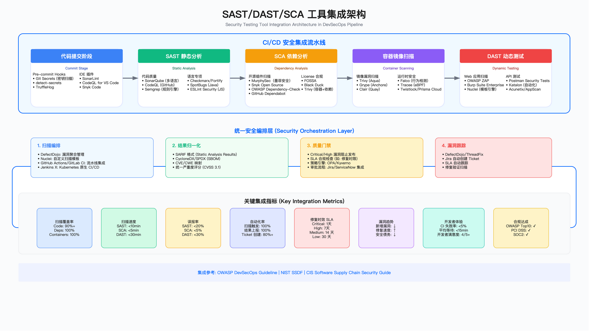

# 6.4　安全工程工具链

安全工程工具链的核心目标是将架构层面的安全控制点工程化落地，通过自动化手段实现从编码到运营各阶段的安全检测与防护。本节按照"输入—活动—产出—门禁—度量"结构组织，覆盖培训、设计评审、编码、测试、构建、发布、运营七个阶段，重点建设应用安全测试（AST）与策略即代码（Policy as Code）能力。

工具链建设需要正视几个基本约束：工具本身不解决流程问题，误报治理是长期工程，性能开销与安全收益需要显式权衡，以及任何工具都存在适用边界。本节不追求工具全覆盖，而是聚焦于各阶段的核心控制点与验收标准。

---

## 工具链集成架构

安全工程工具链的设计遵循"左移优先、分层防御、自动化门禁"原则。下图展示了从编码到运营各阶段的工具集成架构：



工具链按阶段划分为五层：

编码阶段聚焦代码提交前的风险发现，包括 IDE 实时扫描（如 SonarLint、Semgrep）、SAST 白盒扫描（如 SonarQube、Checkmarx、CodeQL）、SCA 组件扫描（如 MurphySec/墨菲安全、Snyk，开源如 Trivy、Grype、OSV-Scanner）以及密钥泄露检测（如 TruffleHog、GitLeaks、detect-secrets）。该阶段的门禁原则是高危阻断合并，中低危纳入技术债跟踪。

测试阶段提供多维度安全验证，包括 DAST 黑盒扫描（如 OWASP ZAP、Burp Suite、Nuclei）、IAST 交互式扫描（如 Contrast、DongTai/洞态）、API 安全测试（如 Akto、Postman Security）以及移动端安全扫描（如 MobSF）。测试阶段的价值在于发现运行时才暴露的配置与逻辑漏洞。

构建阶段关注制品安全与供应链完整性，主要活动包括容器镜像扫描、镜像签名验证、SBOM 生成以及 IaC 配置扫描。构建阶段的输出——签名制品与 SBOM——是后续发布阶段准入控制的前置条件。

发布阶段通过 admission 控制实现策略强制执行，包括基于 OPA 或 Kyverno 的准入策略、签名验证、配置基线检查以及变更审批流程。

运营阶段提供持续监控与实时防护，包括周期性 DAST 扫描、攻击面管理（ASM）、XDR 威胁检测、RASP 运行时保护以及容器运行时监控。



上图展示了安全测试的分层结构。底层的静态分析覆盖面广但精度有限，中层的动态测试验证运行时行为，顶层的交互式测试与运行时保护提供精准防护但部署成本较高。工具选型需要在覆盖面、精度与成本之间取得平衡。



*图：DevSecOps 工具链架构 - 展示从开发到运营各阶段的工具集成关系与数据流转*

---

## 6.4.1 应用安全培训

### 输入

安全培训的设计需要基于三类输入：角色画像（后端、前端、移动端、数据、运维、测试、架构、产品等）、历史缺陷画像（常见漏洞类型、易错模块、核心链路）以及年度目标（如漏测率、高危修复时效、SBOM 覆盖率等内部口径指标）。

### 活动

课程体系按层级组织：新员工必修课程涵盖安全意识、密码学基础、数据分级、基线制度与合规要求；年度必修课程聚焦 [OWASP Top 10:2025](https://owasp.org/Top10/2025/)、ASVS 5.0.0、API 与移动端安全、供应链安全（SCA/SBOM/签名）以及云与 Kubernetes 安全；岗位进阶课程则针对特定语言框架、API 设计安全、IaC 安全、CI/CD 安全与应急响应。

教学形式应兼顾效率与实操：微课控制在 15 分钟以内便于碎片化学习，每周一题保持安全意识，靶场实操提供动手机会，红蓝与桌面演练验证综合能力。

Security Champion 计划是培训体系落地的关键抓手：每个研发团队指定 1-2 名联络人，参与安全规则共创、设计评审与内部推广，通过季度评优与绩效挂钩建立正向激励。

### 产出

课程大纲与年度日历、题库与实验环境、学员画像与成长路径、Security Champion 名册与职责说明。

### 门禁

核心系统责任人需通过进阶认证方可担任上线审批人或例外审批人——这一约束将培训与权限直接挂钩，避免培训流于形式。

### 度量

培训效果的度量指标包括覆盖率、平均测评分、岗位进阶通过率、培训后缺陷占比变化、Security Champion 参与率、规则贡献数以及问题复发率。需要注意的是，这些指标的具体阈值应根据组织实际情况设定，避免为追求数字而牺牲培训质量。

### 适用边界与常见误区

培训体系适用于有一定规模的研发团队，对于外包团队或短期项目团队需要简化培训路径。常见误区包括：一是将培训等同于合规打卡，缺乏实操验证；二是培训内容与实际技术栈脱节，开发者无法直接应用；三是 Security Champion 机制缺乏激励或沦为额外负担。

验证培训有效性的方法包括：对比培训前后同类缺陷的发现率与复发率，抽样检查 Security Champion 实际参与评审的比例，以及通过靶场演练评估实操能力。

---

## 6.4.2 应用安全设计评审

### 输入

设计评审的输入包括 PRD/BRD、架构图与数据流图、数据分级与外联依赖清单、OpenAPI 或接口清单以及上线里程碑。

### 活动

轻量评审适用于大多数需求，检查点包括：数据分类与跨境约束、外联依赖（第三方服务与供应商）、认证鉴权与授权设计、日志与审计要求、误用与滥用场景、以及合规要求（如 GDPR、PCI DSS 等）。

威胁建模适用于高价值场景，触发条件包括：新核心业务、重大架构变更、涉及敏感数据的模块、支付与账户相关功能、以及跨境数据处理。方法上可采用 STRIDE、攻防树或用例驱动，输出缓解矩阵（控制措施—责任人—时限）。

在应用安全侧，可以用大模型给威胁建模提速：让它对着架构描述或接口清单草拟 STRIDE 条目、补充容易被人漏掉的滥用与误用场景，再由评审人筛掉不适用项、收敛到真正的关键风险。这里模型只承担机械化的枚举与起草，人负责判断和定稿——AI 起草、人审收敛的完整落地方法与工具见 4.3.8，此处不再展开。

安全需求即代码是将关键安全要求转化为可执行策略的实践，包括 Kubernetes admission 策略（Kyverno/OPA Gatekeeper）、IaC 扫描规则（Checkov/Terrascan）、API 网关策略以及 WAF 与限速策略，并将这些策略纳入 CI/CD 门禁。

### 产出

评审结论（通过、限条件通过、需补充材料、拒绝）、风险清单与缓解措施、门禁约束条目、审计证据。

### 门禁

未完成评审或未达成必需控制的需求不得进入开发或上线；涉及敏感数据或接口的需求须额外审批。

### 度量

评审覆盖率、评审 SLA 达成率、上线后返工率、问题复发率。

### 适用边界与常见误区

设计评审的适用边界需要根据变更影响范围动态调整：纯 UI 调整或配置变更可简化评审，而涉及数据流变化或外联依赖的变更必须完整评审。常见误区包括：一是评审沦为流程打卡而非实质性技术讨论；二是威胁建模范围过大导致无法聚焦关键风险；三是安全需求停留在文档层面而未转化为可执行策略。

验证评审有效性的方法包括：跟踪评审发现的风险是否在后续阶段得到缓解，分析上线后发现的漏洞中有多少本应在评审阶段识别。

---

## 6.4.3 编码阶段

编码阶段是安全左移的核心阵地，目标是在代码提交前发现并修复安全缺陷。

### 6.4.3.1 IDE 安全扫描

输入：IDE 插件与企业规则集（弱加密、危险函数、输入校验、敏感 API）。

活动：企业规则集应覆盖常见安全缺陷模式——弱加密算法（MD5、SHA-1、ECB、RC4）、危险函数（命令执行、反序列化）、输入校验缺失、敏感 API 误用。扫描结果应提供即时提示与替换建议（如 MD5 替换为 SHA-256、ECB 替换为 GCM、字符串拼接 SQL 替换为预编译语句），并提供代码片段修复示例。

产出：本地告警清单、修复 diff、提交前零高危确认。

门禁：提交前需确认无高危告警；重复被门禁拒绝的合并请求计入代码质量评分。

度量：IDE 规则命中率、提交前高危清零占比、平均修复时间、重复拒绝次数。

常见误区：IDE 扫描容易被开发者绕过（如禁用插件或忽略告警），需要与 CI 阶段扫描形成双重校验；规则集过于宽泛会导致告警疲劳，应聚焦高置信度规则。

### 6.4.3.2 SAST 白盒代码扫描

输入：代码库与语言配置、增量差异（MR/PR）。

活动：采用全量扫描与差异扫描结合的策略，按语言与框架维护规则集，通过模式白名单与 hash 基线进行误报抑制，支持多分支并行扫描。

产出：扫描报告、误报抑制与基线记录、阻断与工单 SLA。

门禁：高危阻断合并；中危告警并跟踪；达到阈值拒绝合并（例外需审批并附临时缓解措施）。

度量：扫描覆盖率、平均扫描时长、误报率、阻断率、修复时效、重复缺陷率。



#### SAST 调优实践

SAST 工具的误报率是制约其落地效果的关键因素。未经调优的 SAST 工具误报率往往偏高，导致开发者疲于处理无效告警，进而降低工具采纳度——这是 SAST 工具"半废弃"状态最常见的根因：工具本身没问题，是告警太多、开发者学会了忽略。有效的系统化调优可显著压降误报率，提升工具实际价值。

建立基线阶段：通过导出近期扫描结果并按规则分组统计，然后对高频告警进行抽样验证，识别出误报率较高的规则。典型的高噪音场景包括：测试代码中的字符串重复检测、非安全场景的伪随机数告警、DTO/Entity 类中的命名检查等。

禁用噪音规则阶段：对误报率明显偏高的规则进行禁用或设置白名单路径。这里需要一条量化的进入条件，否则"明显偏高"会退化成凭印象往丢弃表里加规则——加进去之后没人再看它，这条规则覆盖的那类漏洞就此从检测面上消失，而且不会有任何看板显示这件事发生过。可用的门槛是：该规则至少有 200 条已复核样本、真阳率低于 2%、两人签字、每 90 天按新样本重算一次（代码库在变，规则的误报率跟着变）。这套判据连同它的完整配置形态见 [17.4](../../第06部分_AI驱动的安全创新/第17章_AI驱动网络安全/17.4_AIforAppSec_AI应用安全.md) 的 SAST 分流配置；本节的白名单元数据要求（工单号、到期日、责任人）与它并用——前者管"这条规则该不该关"，后者管"关了之后谁负责什么时候开回来"。

以 SonarQube 为例，可通过配置文件指定特定规则在特定路径下不生效：

```properties
# SAST 误报抑制配置示例
sonar.issue.ignore.multicriteria=e1,e2,e3

# 禁用测试代码中的字符串重复检测
sonar.issue.ignore.multicriteria.e1.ruleKey=java:S1192
sonar.issue.ignore.multicriteria.e1.resourceKey=**/test/**/*.java

# 禁用非安全场景的伪随机数告警
sonar.issue.ignore.multicriteria.e2.ruleKey=java:S2245
sonar.issue.ignore.multicriteria.e2.resourceKey=**/test/**/*.java,**/simulation/**/*.java

# 排除第三方库代码
sonar.exclusions=**/vendor/**,**/node_modules/**,**/third_party/**
```

读这段配置的关键是理解 `multicriteria` 的组合逻辑：每个条目（`e1`、`e2`、`e3`）独立定义"哪条规则"在"哪些路径"下被抑制。`ruleKey` 是 SonarQube 的规则 ID，`resourceKey` 支持 Ant 风格的路径通配符。抑制不等于删除规则——规则仍会在其他路径上生效，只在指定路径上静默。这种精细化控制比"全局禁用某条规则"更安全，避免过度抑制引入漏报风险。

自定义规则开发阶段：针对企业特定安全需求开发定制检测规则。例如，检测硬编码云服务凭证的规则可以基于凭证格式特征（如 AWS Access Key 的 `AKIA` 前缀）进行模式匹配。自定义规则应明确标注严重等级、CWE 映射以及修复建议。

建立白名单机制：用于管理经审批的例外情况。白名单配置应包含必要的元数据——没有工单号、到期日期和责任人的白名单条目等同于永久豁免，会在代码库中积累成无人负责的安全债务：

```yaml
# 白名单条目须包含: 工单号、到期日期、责任人
whitelists:
  - rule_id: "java:S3329"
    file_pattern: "src/main/java/com/company/legacy/CryptoUtil.java"
    line_range: [42, 58]
    justification: "遗留系统使用 ECB 模式，重构计划已排期"
    ticket: "SEC-1247"
    approved_by: "security-lead@company.com"
    expiry_date: "2025-06-30"
```

`expiry_date` 字段是这个 YAML 结构最重要的安全工程设计：白名单给的是"有期限的豁免"，不是"永久豁免"。CI 系统应在到期前 2 周自动提醒负责人，到期后若不续期则自动恢复检查。`line_range` 将豁免范围精确到代码行，防止豁免范围随代码修改而悄然扩大。

持续度量与改进：核心指标包括误报率（通过抽样验证）、漏报率（通过渗透测试对比）、平均修复时间、规则覆盖 OWASP Top 10:2025 的程度以及开发者修复率。这些指标应定期采集并通过看板可视化，驱动持续优化。

调优成熟度参考可对照 OWASP SAMM 的 Security Testing 实践域。**SAMM 每个实践只有三档成熟度（Maturity 1/2/3），没有第四档**——评估报告里出现的 Level 0 是"该实践尚无任何活动"的打分值，不是模型定义的第四级。对应到 SAST 调优：Maturity 1 为引入工具并定期扫描；Maturity 2 为基于误报分析的规则调优与自定义规则开发；Maturity 3 为数据驱动的持续优化，把扫描结果反馈进规则集与开发流程。白名单管理不构成独立一级，它是 Maturity 2 的配套动作。

常见误区：一是期望工具开箱即用而忽视调优投入；二是过度禁用规则导致漏报风险；三是白名单缺乏到期清理机制导致技术债积累。

### 6.4.3.3 SCA 第三方组件风险扫描

输入：依赖清单与锁定文件、许可证策略。

活动：CVE 漏洞与许可证治理并重；维护替代组件清单与准入白名单；生成并归档 SBOM（SPDX 或 CycloneDX 格式）。

产出：SBOM、许可证合规报告、VEX（vulnerability exploitability exchange）、修复记录。

门禁：高危 CVE（如 CVSS 达到组织设定阈值）阻断入库；许可证违规拒绝；无 SBOM 拒绝。

度量：高危 CVE 清零率、许可证违规关闭时效、SBOM 覆盖率、VEX 回传时效。

常见误区：一是仅关注 CVE 评分而忽视实际可利用性；二是许可证合规检查滞后导致法律风险；三是 SBOM 生成后缺乏持续更新与消费。

### 6.4.3.4 敏感密钥扫描

输入：预提交钩子、CI 任务、企业特征字典（token/key/URL 模式）。

活动：预提交钩子与 CI 双重扫描形成纵深防御；维护企业专用的凭证模式字典；命中后触发自动吊销与轮换流程。

产出：命中与吊销/轮换记录、历史扫描与审计日志。

门禁：命中即阻断合并；无法吊销的情况进入应急流程。

度量：命中次数、平均吊销时间、复发率、历史泄露消项率。

常见误区：一是仅依赖正则匹配而遗漏变体格式；二是吊销流程缺乏自动化导致窗口期过长；三是历史提交中的泄露未被回溯清理。

### 6.4.3.5 AI 辅助修复与不确定性护栏

前面几节解决的是"如何又快又准地发现缺陷"，但发现只是开始。真正拖慢安全左移的往往不是扫描器跑得慢，而是缺陷发现后无人认领：SAST 报了一屏 XSS，开发者要读懂告警、定位到具体代码行、想清楚正确的转义方式、再写出修复补丁，这一整段人工链路才是修复时效的瓶颈。2025 年下半年到 2026 年，主流 AST 厂商陆续把大模型接到这条链路上，试图把"发现—修复"之间的人工成本压下来。这类能力值得单列一节，因为它引入了一个此前工具链没有的新变量：修复建议本身是非确定性的。

为什么这个变量重要？前面所有工具——SAST、SCA、DAST——的输出都是确定的：同一份代码扫两遍，结果一致，规则命中就是命中。而大模型生成的修复补丁不是。同一条告警让模型改两次，可能给出两版不同的补丁，甚至一版正确、一版引入新缺陷。这决定了 AI 修复能力在工具链里只能扮演"起草者"，不能扮演"审批者"——它可以出 PR，但不能自动 merge，更不能自动关闭发现。

#### 三家主流做法横评

当前三家有代表性的产品选择了不同的落点，理解它们的分野比记住任一家的功能列表更有价值。

GitHub Copilot Autofix 走的是 autofix 主线，把 CodeQL 的静态分析结果喂给代码生成模型（平台披露其修复生成使用其 GPT-5 系列代码模型，具体型号以官方最新披露为准、会随迭代更换），直接产出 PR 级的修复补丁，开发者在告警旁边就能看到"建议的改法"并一键采纳。GitHub 公开披露的口径是：在 2024 年 5 月至 7 月的公开 beta 期数据中，开发者用 Copilot Autofix 提交 PR 级告警修复的中位时长为 28 分钟，对照人工修复同类告警的 1.5 小时，整体约 3 倍提速；其中 XSS 为 22 分钟对照近 3 小时（约 7 倍），SQL 注入为 18 分钟对照 3.7 小时（约 12 倍）[1]。这些数字是平台披露口径，反映的是"从告警到修复合并"的端到端时长，不等于修复的正确率——提速和准确是两个维度，读这类数据时要分开看。

Snyk 的路线同样是 autofix，但技术演进路径不同。它最初以 DeepCode AI 提供修复建议，2026 年 4 月对外披露重构为 agentic 架构（对外称 Agent Fix），用动态 few-shot 加 agentic retry 的方式生成并自我校验补丁。厂商披露的"功能正确且安全的修复率"为 85.4%[2]。这里要特别区分两个来源：85.4% 是厂商自报口径；独立第三方 safeguard.sh 用 412 个真实 SAST 发现做过复测，得到的综合有效准确率为 76%（缺失净化类如 XSS/SQLi 为 87%，加密误用 73%，访问控制/授权 65%），且约 5.3% 的自动合并修复会引入新发现或破坏行为[3]。第三方复测口径与厂商宣称口径不一致，选型时应把两者并列看待，而不是只采信厂商数字。

Semgrep Assistant 长期是三家里唯一不做 autofix 的，定位是 AI triage（研判）：把新发现自动归入三类——真实需修、误报、需人工确认——并给出理由，不自动生成修复、也不自动关闭任何发现。**这条差异化在 2026 年 3 月已经消失**——Semgrep Autofix 进入公测，这家也开始生成修复了。这件事本身就是一条选型经验：以"某家不做某功能"作为依据，保质期通常只有一到两个季度，真正稳定的选型依据是"这个动作可不可逆、谁签字"，而不是"哪家现在有什么功能"。厂商称 Assistant 年内累计可自动 triage 约 60% 的新发现[4]（注意这是年度整体口径，不是某个单独能力上线带来的增量）；与安全研究员的一致率 96% 这个数字有明确的适用范围——它指的是"真阳性"判定上的一致率，而在"误报"判定上厂商自报的一致率只有 41%，这是刻意偏保守（宁可多留给人看，也不漏判真问题）的结果[5]。引用这个 96% 时不应省略口径，否则会被误读为"整体判准率 96%"。Semgrep 这么选是刻意为之，与能力无关：它把 AI 用在"减少人工要看的量"上，而把"改不改、关不关"这两个不可逆动作牢牢留给人。

下表把三家的分野并列，横评维度是"AI 被授予多大的处置权"，与功能多少无关：

| 维度 | GitHub Copilot Autofix | Snyk Agent Fix | Semgrep Assistant |
|------|------------------------|----------------|-------------------|
| AI 落点 | 静态分析结果 + 生成模型出补丁 | agentic 生成 + 自校验补丁 | AI triage（研判分类）|
| 是否 autofix | 是，PR 级修复建议 | 是，agentic 修复 | 否，只研判不改代码 |
| 是否自动关闭发现 | 否，人工审 merge | 否，人工审 merge | 否，明确拒绝自动关闭 |
| 效果数据（口径提醒）| beta 期中位 28 分钟 vs 人工 1.5 小时、整体提速约 3 倍（平台披露）[1] | 厂商称 85.4%[2]；第三方 safeguard.sh 用 412 例复测得 76%、回归率 5.3%[3] | 自动 triage 约 60% 新发现[4]、真阳性一致率 96%／误报一致率 41%（厂商称）[5] |
| 适用场景 | GitHub 生态、CodeQL 已覆盖的模式化漏洞 | 需 autofix 且看重补丁自校验的团队 | 高误报压力、坚持人工把关关闭权的团队 |

读这张表的关键在最后两行。三家在"是否自动关闭发现"上罕见地一致——都是否。这不是巧合：即便走 autofix 主线的 Copilot 和 Snyk，也只把 AI 的权限停在"提交 PR"，最终 merge 与关闭发现仍是人工动作。分野真正发生在"要不要让 AI 碰修复代码"：Copilot 和 Snyk 认为让 AI 起草补丁能省下最贵的那段人工，Semgrep 认为在误报压力大的场景里，先把研判做准、再让人专注改真问题更划算。

#### 不确定性护栏怎么落地

理解了非确定性这个前提，工程上的护栏设计就有了明确依据。核心原则是把 AI 的动作限定在可逆的一侧：

```
                  ┌──────────────┐
   扫描器发现  →  │  AI 起草修复  │  （非确定性，可重试、可丢弃）
                  └──────┬───────┘
                         │  生成 PR / 修复建议
                         ▼
                  ┌──────────────┐
                  │   人工审查    │  （确定性把关点）
                  └──────┬───────┘
              ┌──────────┴──────────┐
        merge PR                  拒绝 / 打回重生成
              │                        │
              ▼                        ▼
        发现由人关闭            发现保持 open，不被 AI 静默关闭
```

这张图要读的是那条不可跨越的边界：AI 停在"起草修复"和"生成 PR"，所有把发现从 open 改成 closed 的动作都落在人工审查之后。之所以这样切，是因为 merge 一个坏补丁和关闭一个真实发现都是难以回滚的——前者把缺陷代码合进主干，后者让一个真漏洞从跟踪列表里消失。而"重新生成一版补丁"是零代价的，非确定性带来的波动只要挡在人工审查之前，就不会污染代码库和发现台账。

落到 CI/CD 配置上，护栏可以固化为几条硬约束：AI 生成的修复必须以 PR 形式提交，禁止直接推送到保护分支；PR 必须经过至少一名人工评审才能合并；无论修复是否被采纳，原始发现的关闭权只属于人，工具链层面不给 AI 授予 close 权限。这与本章前面 SAST 白名单必须带工单号和到期日、RASP 必须走观测→告警→阻断阶梯，是同一种设计思想的延续——凡是不可逆的动作，都要有一个确定性的人工确认点兜底。

但要说清楚一件事：**人工评审是合入的必要条件，不是充分条件。** 让评审独自兜底会失效，原因不在评审者不认真，而在这类补丁的失效形态恰好绕开了评审能看见的东西——功能测试全绿、崩溃不再复现、diff 读起来也合理，但修掉的不是原定那个漏洞。[17.4 AI for AppSec](../../第06部分_AI驱动的安全创新/第17章_AI驱动网络安全/17.4_AIforAppSec_AI应用安全.md) 给出了这条能力悬崖的公开测量口径，并据此把合入闸门拆成五关（原 PoC 不再复现、PoC 变体仍不复现、回归测试全绿且不许改测试、diff 范围可人读、人工评审），外加三类语义检查。本节的护栏是"AI 只出 PR、人来 merge"的组织约束，那五关是同一件事的技术判据，两者叠加才构成完整门槛。

还有一条本节没写、但落地时必须先做的动作：**分流先于调优**。业务逻辑缺陷、授权模型改动、协议级密码学选择这三类不该进入自动补丁通道，模型在那里生成的不是差一点的补丁。排除清单与理由同见 17.4。

需要说明的是，AI 修复代码本身也可能被攻击（如提示注入诱导模型生成后门补丁），这类针对 AI 应用自身的攻防机理不在本章展开，见 18.3。本节只关注它在应用安全工具链里的落地方式与护栏。

#### 选型判断

三条实用建议。其一，如果团队已经在 GitHub 生态内、缺陷又以 XSS/SQLi 这类模式化漏洞为主，Copilot Autofix 的端到端提速收益最直接；其二，如果看重修复补丁的自校验能力、且能接受把厂商数字与第三方复测并列评估，Snyk Agent Fix 的 agentic 路线值得试点；其三，如果当前最大的痛点是误报淹没、且组织对"自动关闭发现"高度警惕，Semgrep 只研判不 autofix 的克制反而是优点。但无论选哪家，都不要把 AI 修复准确率的厂商宣称值直接写进验收标准——先在自己的代码库上用一批真实历史发现做小规模复测，用自测出的准确率和误改率作为放量依据。

生产落地时还有两个常被忽视的坑。一是把 autofix 的提速数字误当成质量指标去考核，团队会倾向于快速采纳补丁而放松审查，反而把坏补丁放进主干；正确的度量是"AI 起草的修复中经人工审查后被采纳的比例"和"采纳后回退率"，而非单纯的修复速度。二是让 AI 修复覆盖了发现的关闭动作却疏于审计，一旦某天工具误配置放开了自动关闭权限，真实漏洞会被静默清出台账而无人察觉；关闭发现这一动作应始终留有人工操作记录与审计日志。

---

## 6.4.4 测试阶段

测试阶段通过多维度验证发现编码阶段遗漏的安全缺陷，重点覆盖运行时才暴露的配置与逻辑漏洞。

### 6.4.4.1 DAST Web 黑盒漏洞扫描

输入：目标 URL 与环境、账户与角色、爬虫配置、登录保持策略。

活动：认证爬取确保覆盖登录后页面；差异扫描聚焦新增与变更路径；优先检测高危入侵点（注入、命令执行、认证绕过）。

DAST 的核心价值在于它以真实攻击者的视角工作——不看代码，只看应用的实际暴露面。这使它能发现 SAST 难以检测的问题：错误的安全配置（如测试环境误开的 debug 接口）、运行时才生效的认证绕过逻辑、以及依赖外部服务状态才能触发的漏洞。代价是它看不到内部代码结构，对于需要特定前置条件或复杂业务状态才能触发的漏洞往往无能为力。

产出：扫描报告、复测结论、阻断或例外记录、趋势图。

门禁：注入、命令执行、认证绕过类漏洞必须阻断；核心站点发布前需达到零高危。

度量：页面与接口覆盖率、误报率、扫描时长、阻断率、复测通过率。

常见误区：一是爬虫覆盖不足导致盲区；二是扫描账户权限过低遗漏授权相关漏洞；三是扫描频率过高影响测试环境稳定性。

### 6.4.4.2 移动端安全扫描

输入：APK/IPA 与符号表、服务端环境、MASVS 基线。

活动：静态分析检查加固与反调试、证书绑定、明文存储、隐私权限；动态分析验证通信安全、接口鉴权、WebView 与 JS 桥接风险。

产出：MASVS 对齐矩阵、静态与动态报告、加固与 pinning 证据、隐私权限审核结论。

门禁：明文敏感存储、未绑定证书、严重调试绕过必须阻断。

度量：MASVS 达标率、漏洞数量与等级、隐私违规关闭时效。

常见误区：一是仅做静态分析而忽视动态行为；二是测试环境与生产环境配置不一致；三是隐私权限审核流于形式。

### 6.4.4.3 API 接口安全扫描

输入：OpenAPI/GraphQL schema、鉴权配置（OAuth2/JWT/cookie）、速率限制策略。

活动：schema 驱动用例生成；带鉴权的 DAST 与 API fuzz；schema 一致性检查；逻辑滥用用例设计。

产出：OpenAPI/schema 文档、网关策略、鉴权与限速证据。

门禁：敏感接口必须具备鉴权与限速；schema 偏差需修正或走例外流程。

度量：鉴权覆盖率、schema 对齐率、逻辑漏洞比例、限速命中率。

常见误区：一是 schema 与实现不同步导致测试盲区；二是仅测试正向场景而忽视边界与异常；三是限速配置未考虑业务峰值。

### 6.4.4.4 IAST 交互式安全扫描

输入：被测环境、探针/agent 配置、典型业务流脚本。

活动：灰盒检测方式：注入探针，运行典型业务流，跟踪污点数据流，定位到代码行与调用栈。

IAST 的工作原理值得理解：它在应用进程内部插桩（instrumentation），在数据从用户输入进入应用的那一刻开始标记（污点标记），并追踪这个数据流经代码的路径，直到它被使用——如果"用户输入"在未经校验的情况下出现在 SQL 查询的参数位置，IAST 会立即标记为 SQL 注入漏洞，并提供完整的调用栈。这种方式的误报率远低于 SAST（因为是在真实执行路径上检测），定位精度也远高于 DAST（因为知道代码位置）。代价是需要在测试环境中运行业务流，且探针引入的性能开销不可忽视。

产出：漏洞与代码关联、调用栈、真实可达性证据。

门禁：高危确认即阻断；性能开销需设预算与阈值（通过灰度评估）。

度量：定位精度、误报率、覆盖业务流数量、性能开销（P95 延迟变化）。

常见误区：一是探针部署覆盖不全导致检测盲区；二是业务流脚本未覆盖关键路径；三是性能预算设置过松影响用户体验。

---

## 6.4.5 构建阶段

构建阶段关注制品安全与供应链完整性，确保进入后续阶段的制品可信可追溯。

### 6.4.5.1 容器镜像扫描

输入：Dockerfile 与基础镜像策略、镜像仓库策略。

活动：维护基础镜像白名单并推行最小化原则；移除编译工具链与 shell 等非必要组件；执行 CVE 扫描；SBOM 随镜像产出并签名。

容器镜像安全的关键设计决策是"Distroless 或最小化镜像"策略：移除 shell（`/bin/sh`、`/bin/bash`）、包管理器（`apt`、`yum`）、调试工具（`curl`、`wget`、`netstat`）等非运行必需组件，攻击者拿到代码执行后可用的现成工具大幅减少，安装后门、横向移动、建立 C2 的成本都被抬高。收益是实在的：镜像体积显著缩小，扫描器报出的 CVE 数量大幅下降（这一条要理解为"噪声变少"，被移除的组件本来也不参与运行）。

**但它抬高的是成本，不是画出的边界。** 镜像里没有 shell 不等于没有可用的执行原语：语言运行时镜像自带 Python 或 Node 解释器，本身就是完整的执行环境；`gcr.io/distroless/base` 里带着 OpenSSL，已有公开研究演示用 `openssl enc` 读写任意文件、再加载恶意 engine 达成任意代码执行；攻击者也可以自带静态编译的载荷，或者走 memfd 内存执行完全不落盘。运维侧还有两个自己开的口子：`:debug` 变体直接内置 busybox shell，而 `kubectl debug` 的临时容器能往同一命名空间里注入一个带 shell 的容器。

所以正确的定位是：**Distroless 是抬高攻击成本的加固措施，属于纵深防御的一层，不能替代运行时检测、出网管控与最小权限。** 把它当成"容器内无法执行命令"的保证来设计后续控制，会在这一层被绕过时发现后面什么都没有。

产出：镜像风险报告、签名与 SBOM 工件、替代基础镜像建议。

门禁：高危 CVE 达到阈值阻断；未签名或无 SBOM 禁止入库；admission 强制验签与基线检查。

度量：白名单采用率、CVE 清零率、签名覆盖率、SBOM 覆盖率。

常见误区：一是基础镜像更新滞后导致已知漏洞残留；二是多阶段构建未正确清理中间层；三是签名密钥管理不当导致信任链断裂。

---

## 6.4.6 发布阶段

发布阶段通过准入控制确保只有满足安全基线的制品才能进入生产环境。

### 6.4.6.1 运行前评估

输入：待发布制品、变更单、风险评估、回滚预案。

活动：发布前评估包括 CVE 状态、配置基线、Kubernetes 策略、签名验签；输出风险评分与放行建议；审批流程要求双人审批；采用金丝雀或蓝绿部署策略。

产出：发布审批记录、评估报告、回滚与复测记录。

门禁：无签名、未通过评估、无回滚预案的制品不得发布；核心业务须遵守变更冻结窗口。

度量：审批时效、发布失败回滚率、发布后高危缺陷数、变更事故率。

常见误区：一是审批流于形式而未实质检查；二是回滚预案未经演练验证；三是变更冻结窗口执行不严格。

---

## 6.4.7 运营阶段

运营阶段提供持续监控与实时防护，应对生产环境的动态风险。

### 6.4.7.1 Web 黑盒漏洞扫描（持续）

输入：全站 URL、登录策略、多角色账户、变更订阅。

活动：周期全量扫描与变更增量扫描结合；多角色登录态覆盖；输出差异报告；对关键路径设置更高扫描频率。

产出：漏洞报告与复测结论、趋势图。

门禁：在逃高危须清零（或记录例外并附缓解措施）；复测通过方可关闭。

度量：覆盖率、在逃高危趋势、复测通过率。

### 6.4.7.2 ASM 攻击面扫描

输入：域名、DNS 记录、证书透明度日志、云资产 API、外部情报。

活动：资产发现（域名、子域名、证书、云资产）、指纹识别、暴露面收敛；错误配置与过期证书闭环处理。

产出：资产台账、暴露面报告、关闭证明。

门禁：未备案资产、过期证书、弱配置必须整改；高危暴露面限时关闭。

度量：影子资产消除率、证书过期提前告警关闭时效、暴露面减少趋势。

### 6.4.7.3 XDR 威胁检测与响应

输入：EDR/XDR 代理、告警规则、白名单与基线。

活动：建立行为基线；检测容器逃逸、加密劫持等威胁；与 SOAR 剧本联动（隔离、封禁、吊销密钥、回滚）。

产出：告警案例、处置记录、根因分析与改进行动。

门禁：关键主机未部署代理或策略仅为"监测"模式的不允许上线。

度量：MTTD（平均检测时间）、MTTR（平均响应时间）、自动化处置覆盖率、误报与漏报率。

### 6.4.7.4 容器运行时扫描

输入：运行时策略、命名空间级别分级（生产、预发、开发）。

活动：阻断高危行为——执行 shell、写敏感目录、高危系统调用、可疑网络连接；按命名空间与工作负载分级策略。

产出：拦截日志、策略命中报告、例外审批记录（短期）。

门禁：生产命名空间强制阻断策略；例外需审批并设置到期自动恢复。

度量：策略命中率、误报率、例外按期消项率。

---

## 6.4.8 IaC 安全

### 输入

Terraform/CloudFormation/ARM 模板、Kubernetes YAML/Helm Chart、基线策略集（CIS Benchmark、Kyverno、OPA）。

### 活动

静态扫描针对基础设施代码执行合规检查，工具包括 Checkov、Terrascan、KubeLinter 等。

Admission 强制通过 OPA Gatekeeper 或 Kyverno 实现准入控制，关键策略包括：非特权容器、只读根文件系统、资源限额、网络策略、镜像签名验签。

策略即代码的实践要点：策略存储于版本控制仓库；变更经过评审流程；支持灰度发布与回滚；策略须有单元测试（正向与反向用例）。

策略测试的"正反用例"值得重点说明：正向用例（compliant case）验证"符合策略的配置能顺利通过"，防止策略过于严格误阻合法工作负载；反向用例（non-compliant case）验证"违反策略的配置被正确拒绝"，防止策略实现有漏洞导致形同虚设。两类用例缺一不可——只有正向用例的策略可能"拦不住坏人"，只有反向用例的策略可能"拦了好人"。

### 产出

扫描报告、阻断记录、策略库、合规证明。

### 门禁

不合规策略拒绝合并与部署；关键策略不可绕过。

### 度量

策略覆盖率、阻断率、误报率、策略变更评审通过率。

### 常见误区

一是策略过于严格导致正常业务受阻，需要设置合理的例外机制；二是策略缺乏版本管理导致回滚困难；三是策略单元测试覆盖不足导致误阻断。

---

## 6.4.9 运行时保护（RASP）

### 输入

目标系统与语言栈、性能预算、优先保护清单（高价值业务）。

### 活动

部署策略：高价值系统优先；按语言集成探针（Java、.NET、Node 等）；灰度发布逐步放量。

防护能力：注入、反序列化、命令执行、XXE、路径穿越、越权检测与阻断；采用告警→降级→阻断的阶梯策略。

RASP 的阶梯部署策略（观测→告警→阻断）是工程上的重要权衡。直接从"观测"跳到"阻断"存在两个风险：一是误报导致合法请求被拦截，引发业务中断；二是阻断规则与业务逻辑冲突，难以快速定位原因。阶梯策略将风险前置到低代价阶段——观测阶段积累数据，告警阶段人工确认误报率，阻断阶段才对已验证的规则开启强制拦截。这一"渐进信任"的设计思想在工具链中普遍适用：没有经过充分验证的规则不应直接阻断。

性能管理：评估 TPS、延迟、CPU、内存影响；优化白名单与规则；遇性能异常自动降级为"告警"模式。

### 产出

实时防护日志、阻断证据、回放数据、性能评估报告。

### 门禁

生产启用仅限优先系统；阻断策略逐步从观测→告警→阻断演进；提供紧急回退机制。

### 度量

拦截次数、误报率、P95 延迟影响、对在野漏洞拦截有效性。

### 适用边界与常见误区

RASP 适用于无法快速修复漏洞但需要即时防护的场景，不适用于性能敏感的高频交易系统（需评估开销后决策）。常见误区包括：一是将 RASP 作为修复漏洞的替代而非补充；二是阻断策略过激导致业务中断；三是探针版本升级滞后导致兼容性问题。

验证 RASP 有效性的方法包括：使用已知漏洞 payload 进行验证测试，对比启用前后的攻击拦截率，监控误阻断导致的业务影响。

---

## 本节小结

本节构建了覆盖 SDL 全生命周期的安全工程工具链体系，从 IDE 到运行时形成自动化安全防护闭环。

工具链按阶段可归纳为：培训与评审提供人员能力与设计保障；编码阶段通过 IDE 扫描、SAST、SCA、密钥扫描实现左移，并借助 AI 辅助修复压缩"发现到修复"的人工链路；测试阶段通过 DAST、移动端扫描、API 测试、IAST 提供多维验证；构建与发布阶段通过容器扫描、制品签名、SBOM、admission 控制确保制品可信；运营阶段通过持续扫描、ASM、XDR、RASP、容器运行时监控提供持续防护。

工具链建设的关键约束包括：渐进式部署（观测→告警→阻断）降低业务风险；工具整合避免数据孤岛；性能平衡确保用户体验；误报治理是长期工程而非一次性任务；引入 AI 辅助修复时须为其非确定性设置人工护栏——AI 可起草 PR，但合并与关闭发现的权限只属于人。

运行指标的设定应基于组织实际情况，常见关注点包括：培训覆盖率与评审覆盖率、SBOM 覆盖率与签名覆盖率、提交前高危清零占比、MTTD 与 MTTR、变更事故率与回滚时长。具体阈值应根据基线数据逐步收紧，而非盲目设定。

---

## 参考文献

| # | 来源 | 标题 | 日期 | 链接 |
| --- | --- | --- | --- | --- |
| [1] | GitHub Blog | Found means fixed: Secure code more than three times faster with Copilot Autofix | 2024-08（2025-01 更新） | <https://github.blog/news-insights/product-news/secure-code-more-than-three-times-faster-with-copilot-autofix/> |
| [2] | Snyk | New Agentic Architecture for Snyk Agent Fix（厂商披露 85.4% functional & secure fix rate） | 2026-04 | <https://snyk.io/blog/snyk-agent-fix-agentic-architecture/> |
| [3] | Safeguard | Snyk Agent Fix Autofix Field Test 2026（412 例独立复测，综合准确率 76%） | 2026-04 | <https://safeguard.sh/resources/blog/snyk-agent-fix-autofix-field-test-2026> |
| [4] | Semgrep | Our AI Assistant is handling 60% of incoming triage work | 2025 | <https://semgrep.dev/blog/2025/semgrep-is-confidently-handling-60-of-all-triage-for-users-without-reducing-coverage/> |
| [5] | Semgrep | How we built an AppSec AI that security researchers agree with 96% of the time（真阳性一致率 96%、误报一致率 41%） | 2025-01 | <https://semgrep.dev/blog/2025/building-an-appsec-ai-that-security-researchers-agree-with-96-of-the-time/> |

---

## 导航

[← 上一节：6.3 SDL 十项关键措施](./6.3_SDL落地十项关键措施.md) | [返回章节目录](./README.md) | [下一节：6.5 应用安全运营与服务交付 →](./6.5_应用安全运营与服务交付.md)

---

© 2025-2026 AISecOps Project. Licensed under CC BY-NC-SA 4.0
