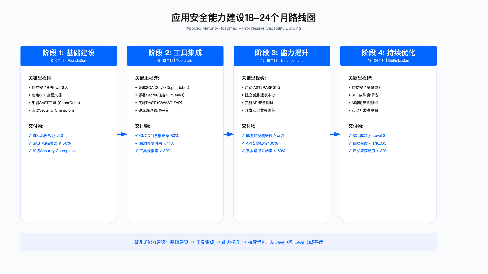

# 6.7　实施路线图与持续改进

应用安全能力建设是渐进式工程，需要从组织现状出发，明确能力差距，分阶段推进工具部署、流程嵌入与人才培养。本节提供从现状评估到持续改进的全生命周期管理方法。核心内容包括：四层架构模型回顾、核心能力域评估方法、分阶段实施规划的目标与里程碑，以及基于 PDCA 循环的持续改进机制。

---

## 6.7.1 架构分层模型回顾

应用安全体系按"业务需求→架构逻辑→工程技术→运营服务"四层组织。这一分层源自 SABSA 架构方法论（参见 4.1），其核心价值在于将安全需求从业务目标逐层分解为可实施的技术控制与运营活动。



业务需求层承载安全战略与业务目标的对齐。该层需要回答：组织的风险承受度边界是什么、哪些合规要求必须满足、安全投资如何与业务价值挂钩。BISO 机制和安全指标治理是该层的典型实践。

架构逻辑层将业务需求转化为架构模式与设计原则。核心产出包括：SDL 生命周期模型的流程定义、威胁建模方法论的选择与适配、零信任架构在应用层的设计要求。架构逻辑层的质量决定了后续工程实施的一致性——架构层未明确的决策，往往在工程层以不一致的方式被各团队各自填充，最终形成安全基线碎片化的问题。

工程技术层负责工具链部署与自动化能力建设。AST 工具集成、DevSecOps 流水线、Policy as Code 是该层的核心组成。工程技术层的成败取决于工具与研发流程的融合程度，而非工具本身的功能丰富度。

运营服务层提供持续运营所需的服务交付能力。漏洞全生命周期管理、安全事件响应、指标度量与持续改进构成运营闭环。该层需要建立服务目录与 SLA，使安全能力以服务形式交付给业务团队——这是从"安全作为审批者"转变为"安全作为服务提供者"的关键。

适用边界：四层架构模型适用于具备一定研发规模（通常数十人以上研发团队）的组织。对于小型团队，可合并架构逻辑层与工程技术层，简化治理开销。

常见误区：
- 跳过业务需求层直接进入工具部署，导致安全措施与业务优先级脱节
- 过度关注工程技术层而忽视运营服务层，工具部署后缺乏持续运营

---

## 6.7.2 核心能力域评估

制定实施路线图之前，需对当前能力状态进行评估。以下五个核心能力域覆盖了应用安全体系的主要方面。

### 能力域概览

| 能力域 | 核心组成 | 评估关注点 |
|--------|----------|-----------|
| 跨职能 SDL 流程 | 从需求到运营的全链路职责分工、门禁与度量 | 流程覆盖率、门禁执行率、各阶段交付物完整性 |
| Privacy by Design | 隐私原则到工作流的映射、审批门禁与证据采集 | 隐私评审覆盖率、证据链完整性、与安全策略的协同程度 |
| 安全能力平台化 | 身份、数据、API、运行时保护等能力的服务化封装 | 服务接入率、自助化程度、审计日志覆盖 |
| 供应链安全闭环 | SBOM、VEX、SLSA 贯穿构建、制品与运行时 | SBOM 覆盖率、签名验证执行率、漏洞响应闭环时效 |
| 人才与文化机制 | 岗位梯队、培训体系、协同文化与激励制度 | 关键岗位填充率、培训完成率、安全文化认知度 |

评估时应针对每个能力域设定具体检查项，区分"已具备""部分具备""尚未具备"三个状态。评估结果用于确定各能力域的建设优先级，而非追求全面覆盖。五个能力域的建设不必并行，通常按照"流程先行→工具跟进→运营收口"的顺序推进效果更好。

### 关键成果物清单

能力建设需要产出可验收的成果物：

流程与规范类：跨职能 SDL 流程手册、Privacy by Design 实施指南、安全策略即代码规范、供应链安全管理规范。

平台与工具类：安全能力服务平台、DevSecOps 工具链、SBOM 生成与管理系统、安全指标看板。

治理与运营类：服务目录与 SLA 定义、漏洞全生命周期管理流程、事件响应与情报协同机制、安全预算与投资评估模型。

验证方法：对于流程类成果物，通过抽样审计检查执行记录；对于平台类成果物，通过功能验收测试确认能力可用性；对于治理类成果物，通过运营指标趋势验证机制有效性。注意区分"交付了文档"与"流程真实运行"，前者可在验收时呈现，后者需要运营数据佐证。

---

## 6.7.3 分阶段实施规划

应用安全能力建设通常需要经历多个阶段，每个阶段有不同的目标重心。以下三阶段规划框架可根据自身起点和资源约束调整周期与目标。

### 阶段规划框架

| 阶段 | 典型周期 | 核心目标 | 关键里程碑 |
|------|----------|----------|-----------|
| 基础建设期 | 首个半年 | 建立基础能力，实现关键流程覆盖 | SDL 流程嵌入核心项目、基础 AST 工具部署、安全指标看板上线 |
| 规模推广期 | 第二个半年至一年半 | 扩大覆盖范围，深化平台能力 | 安全能力平台覆盖主流业务线、SBOM 管理系统上线、运营指标体系建立 |
| 持续优化期 | 一年半以后 | 能力成熟化，追求运营卓越 | 安全服务自助化、全球化运营协同、AI 辅助安全能力试点 |

关键约束：
- 资源约束：基础建设期至少需要专职安全人员（架构师、工程师、运营各一人），规模推广期需扩充团队
- 组织约束：SDL 流程嵌入需要研发团队配合，流程变更需获得研发管理层支持
- 技术约束：工具部署需与现有 CI/CD 系统兼容，平台化建设依赖基础设施成熟度

### 基础建设期

基础建设期的核心任务是建立最小可用的安全能力基座，实现对关键项目的覆盖。

第 1-2 月：组织与流程准备

组织层面：明确安全团队组成与职责分工，建立安全 BP 角色与业务对接机制，设立安全决策委员会或类似治理机构。流程层面：完成跨职能 SDL 流程设计，确定各阶段交付物、审批门禁与度量指标。

第 3-4 月：工具部署与试点

部署 SAST、SCA、DAST 核心工具，完成与 CI/CD 系统的基础集成。选择 2-3 个试点项目实施 SDL 全流程，验证流程可行性并收集反馈。搭建安全指标看板，实现基础度量可视化。

这里有一个常被忽视的时序问题：工具部署后不应立即开启阻断模式。原因在于，新工具在未经调优的状态下误报率通常较高，若直接阻断构建，研发团队会在早期形成强烈的负面体验，后续推广阻力将成倍增加。建议前 4-6 周先以"告警模式"运行（作者调研估算的经验窗口，非行业基准），同步收集误报反馈并优化规则，待误报率降至可接受水平后再开启阻断。

第 5-6 月：推广与固化

基于试点经验优化流程与工具配置，将 SDL 流程推广至更多项目。发布安全开发规范，完成研发团队基础培训。输出阶段总结报告，识别下一阶段优化方向。

验收标准：试点项目 SDL 全流程执行完成、核心 AST 工具集成到主流流水线、安全指标看板可展示基础度量数据。

### 规模推广期

规模推广期的核心任务是扩大能力覆盖范围，建立平台化服务能力。

平台化建设：将安全能力封装为服务，支持业务团队自助接入。能力服务平台需包含身份验证、数据保护、API 安全、运行时保护等模块，并具备自动审计能力，记录服务调用与安全事件。

平台化的核心价值不在于"又多了一个平台"，而在于将安全能力的接入成本从"需要安全团队专人对接"降低为"开发者自助完成"。这要求平台具备清晰的文档、合理的默认配置，以及能解决常见接入问题的 FAQ。

供应链安全：部署 SBOM 生成与管理系统，实现软件物料清单的自动化生成与存储。将制品签名集成到构建流程，逐步提升签名覆盖率。集成 VEX（Vulnerability Exploitability eXchange）信息，为漏洞响应提供可利用性上下文（参见 6.3 和 6.4 中的供应链安全工具链详解）。

运营闭环：打通漏洞、事件、例外的数据流，建立完整的运营指标体系。建立威胁情报与事件响应的联动机制。建立季度安全运营复盘机制，持续识别改进机会。

验收标准：安全能力平台覆盖主流业务线、SBOM 管理系统上线并覆盖核心制品、运营指标体系建立并定期产出报告。

### 持续优化期

持续优化期的核心任务是提升能力成熟度，实现运营卓越。

服务自助化：实现安全能力的 API 化接口，支持开发者自助发起安全扫描、查询漏洞状态、申请例外审批。自动化安全评审流程，降低人工介入需求。

运营协同：对于全球化组织，建立 Follow-the-Sun 模式的安全运营，实现跨时区事件响应协同（参见 6.6 全球协同部分）。定期开展攻防演练，验证检测与响应能力。

技术创新：将 AI/LLM 安全评估纳入产品创新流程。试点 AI 辅助代码审查与漏洞修复建议。关注量子安全算法迁移等前沿技术演进。

验收标准：安全服务自助化接口上线、攻防演练常态化开展、AI 辅助安全能力完成试点评估。

---

## 6.7.4 持续改进机制

应用安全体系需要持续演进以适应业务变化和威胁演变。PDCA（Plan-Do-Check-Act）循环是持续改进的基础框架。

### PDCA 循环实践

Plan（计划）：基于成熟度评估结果识别差距，制定季度或年度改进目标（OKR）。目标需具体可衡量，与业务优先级对齐。制定改进路线图，明确资源需求与预算。

Do（执行）：按计划推进 SDL 流程落地、工具部署与集成、培训与赋能活动。执行过程中记录进展与问题。

Check（检查）：定期（月度或季度）分析安全指标，评估目标达成情况。开展能力成熟度评估，对比基线识别进展。对安全事件进行复盘，提取根因与改进点。

Act（改进）：基于检查结果调整流程、升级工具、补强能力短板。将改进措施纳入下一周期计划，形成闭环。

PDCA 循环容易在 Check 阶段失效：团队产出指标数据后，若缺乏对指标趋势的分析和会议机制，数据就只是数据，不会自动驱动改进。建议建立季度安全运营复盘会议制度，将 Check 阶段的分析结论直接转化为下季度 Plan 的输入。

### 运行指标体系

指标体系是数据驱动治理的基础。以下核心指标应根据自身情况设定目标阈值：

| 维度 | 核心指标 | 说明 |
|------|----------|------|
| 流程成熟度 | SDL 流程覆盖率、门禁通过率 | 衡量流程执行深度与质量 |
| 工具效能 | 误报率、漏洞修复周期、自动化率 | 衡量工具实际价值产出 |
| 运营质量 | SLA 达成率、MTTR、事件响应时间 | 衡量服务交付能力 |
| 供应链安全 | SBOM 覆盖率、签名制品比例 | 衡量供应链管控深度 |
| 安全投资 | 事故成本趋势、例外债务 | 衡量安全投入效果 |

指标使用方法：
- 为每个指标设定基线值（当前状态）和目标值（期望状态）
- 定义指标采集方式与频率
- 设定预警阈值，当指标超出阈值时触发评审

常见误区：
- 指标过多导致关注点分散，核心指标应精简聚焦
- 只关注数值达标而忽视趋势分析；改进方向应基于趋势判断，而非某个时间点的快照值
- 指标口径未统一，导致跨团队对比失去意义

### 知识沉淀与人才循环

知识沉淀：将安全事件、攻防演练、Privacy by Design 案例沉淀为知识库，作为培训素材和流程模板的输入。定期萃取最佳实践，通过内部分享促进经验传播。

人才发展循环：结合能力评估建立个人发展计划，通过培训、项目实践、认证考试等方式提升能力（详见 6.6 能力培养体系）。建立继任计划，确保关键岗位的能力连续性。

---

## 6.7.5 CI/CD 安全集成实践

安全工具与 CI/CD 流水线的集成是工程技术层的核心工作。

### 流水线安全注入点

CI/CD 流水线中的安全控制可分布在以下阶段：

Pre-Commit 阶段：执行轻量级检查，包括敏感信息扫描（API 密钥、密码）、代码格式化、基础代码规范检查。此阶段检查应在数秒内完成，避免影响开发体验。延迟过高会导致开发者绕过 hook。

CI Build 阶段：执行静态分析，包括 SAST 扫描、SCA 依赖扫描、许可证合规检查。此阶段需设定质量门禁，根据漏洞严重程度决定是否阻断构建。SAST 扫描超时应有熔断机制，防止因工具故障导致所有构建卡死。

CI Artifact 阶段：制品生成时执行安全加固，包括容器镜像构建与扫描、镜像签名、SBOM 生成。签名与 SBOM 是供应链安全的基础，应在此阶段一次性完成，避免后续补全的成本（参见 6.4 供应链安全工具链）。

CD Deploy 阶段：部署前后执行动态测试与监控，包括 DAST 扫描、IAST 监控、API 安全测试。部署到生产环境前需通过安全审批，高风险变更需人工审核。

适用边界：完整的流水线安全集成适用于持续交付频率较高的项目。对于发布频率较低的项目，可简化 Pre-Commit 和 DAST 阶段的检查。

关键约束：
- 性能约束：安全扫描不应显著延长构建时间，SAST/SCA 扫描超时应有熔断机制
- 误报约束：工具误报过高会导致开发团队绕过检查，需持续优化规则配置

### 策略即代码实践

策略即代码（Policy as Code）将安全策略编码为可执行规则，实现自动化执行与审计。以下是两个典型场景的示例。

OPA 在 Kubernetes 准入控制场景的策略示例：

```rego
# Kubernetes 准入控制策略
package kubernetes.admission

# 禁止使用 latest 标签
deny[msg] {
    input.request.kind.kind == "Pod"
    container := input.request.object.spec.containers[_]
    endswith(container.image, ":latest")
    msg := sprintf("禁止使用 :latest 标签: %v", [container.image])
}

# 强制资源限制
deny[msg] {
    input.request.kind.kind == "Pod"
    container := input.request.object.spec.containers[_]
    not container.resources.limits.memory
    msg := sprintf("容器 %v 必须设置内存限制", [container.name])
}

# 强制非 root 用户运行
deny[msg] {
    input.request.kind.kind == "Pod"
    container := input.request.object.spec.containers[_]
    not container.securityContext.runAsNonRoot
    msg := sprintf("容器 %v 必须以非 root 用户运行", [container.name])
}
```

上述三条规则对应三类常见的容器安全风险：`:latest` 标签使镜像版本不可追踪，无资源限制会导致单个容器消耗节点所有资源，以 root 用户运行会在容器逃逸时直接获得宿主机权限。策略作为代码存储在版本控制系统中，每次修改都有完整的变更历史——相比人工 checklist，审计者可以直接查看策略变更记录，而非依赖执行记录的完整性。

Terraform Sentinel 在云资源安全场景的策略示例：

```hcl
# AWS 资源安全策略
import "tfplan/v2" as tfplan

# S3 桶必须加密
s3_encrypted = rule {
    all tfplan.resource_changes as _, rc {
        rc.type is "aws_s3_bucket" implies
        rc.change.after.server_side_encryption_configuration[0].rule[0].apply_server_side_encryption_by_default[0].sse_algorithm is not null
    }
}

# RDS 必须启用备份且保留期大于 7 天
rds_backup_enabled = rule {
    all tfplan.resource_changes as _, rc {
        rc.type is "aws_db_instance" implies
        rc.change.after.backup_retention_period > 7
    }
}
```

Sentinel 策略在 `terraform plan` 阶段执行，意味着错误配置在部署前就被拦截，而非在审计中事后发现。7 天备份保留期是 RDS 默认值（0 天），这条规则防止了开发者在创建实例时忘记开启备份的常见问题。

验证方法：通过准入控制的拒绝日志验证策略执行；通过策略单元测试验证规则逻辑正确性；通过周期性审计验证策略覆盖完整性。正向测试（合规配置通过）和负向测试（违规配置被拒绝）都需要覆盖，单独依赖正向测试会漏掉策略逻辑错误的场景。

---

## 6.7.6 外部对标与生态协作

应用安全能力建设需要参照行业标准进行对标，并通过生态协作获取外部输入。

### 标准对标

定期对标 OWASP SAMM、BSIMM、NIST SSDF 等框架，识别自身能力与行业基准的差距（参见 6.1 关于三大框架的选用建议）。对标频率建议为年度一次，结果作为改进规划的输入。

SLSA（Supply-chain Levels for Software Artifacts）提供供应链安全的分级标准[1]，组织可根据自身需求选择目标级别并制定达成路径。其 Build 轨道定义 L0-L3 四档：L1 要求构建过程有出处（provenance）但易伪造，L2 要求出处由托管构建平台签名，L3 要求构建平台具备防篡改加固[1]。L1 是门槛，L2-L3 是大多数有客户供应链安全要求的组织的实际目标范围（参见 6.8 案例二 SLSA L3 落地路径）。

### 生态协作

与行业组织、安全厂商、审计伙伴建立协作关系，获取最新威胁情报、最佳实践与技术支持。参与开源社区贡献，既是能力输出也是人才培养途径。

漏洞奖励计划（Bug Bounty）是引入外部安全测试能力的有效方式，可作为内部安全测试的补充。适用于已具备基础内部测试能力且准备好快速响应外部报告的组织——在漏洞响应流程尚未成熟时过早开启 Bug Bounty，可能因响应不及时损害安全信誉。

---

## 本节小结

应用安全体系建设的核心逻辑：评估现状→确定优先级→分阶段推进→持续改进闭环。

四层架构：业务需求→架构逻辑→工程技术→运营服务，每层有不同的核心产出与责任主体，不可跳层直接进入工具部署。

五个能力域：SDL 流程、Privacy by Design、平台化、供应链安全、人才文化，评估时区分"已具备/部分具备/尚未具备"，优先聚焦差距最大且业务影响最高的域。

三阶段路径：基础建设期（最小可用能力）、规模推广期（覆盖与平台化）、持续优化期（运营卓越），每阶段有明确验收标准，验收通过后再进阶。

持续改进：PDCA 循环驱动能力演进，需要季度复盘会议制度配合，防止 Check 阶段的指标数据无人消费；指标设计应精简聚焦，同时覆盖过程类与结果类指标。

工程实践：CI/CD 安全集成遵循"告警先行、渐进阻断"原则；Policy as Code 将人工 checklist 转化为系统级强制，并带来可审计的变更历史。

---

## 参考文献

| # | 来源 | 标题 | 日期 | 链接 |
| --- | --- | --- | --- | --- |
| [1] | OpenSSF / SLSA | SLSA Specification — Build Track Levels L0-L3（当前版本 v1.2） | 2025 | <https://slsa.dev/spec/> |

---

## 导航

[← 上一节：6.6 团队建设与能力发展](./6.6_团队建设与能力发展.md) | [返回章节目录](./README.md) | [下一节：6.8 案例研究 →](./6.8_案例研究与总结.md)

---

© 2025-2026 AISecOps Project. Licensed under CC BY-NC-SA 4.0
