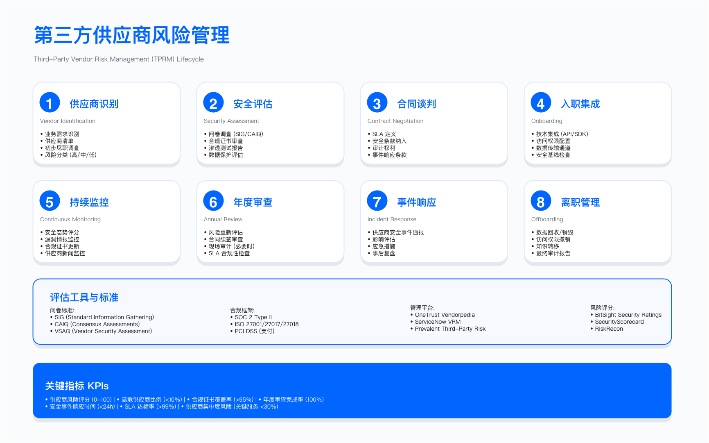
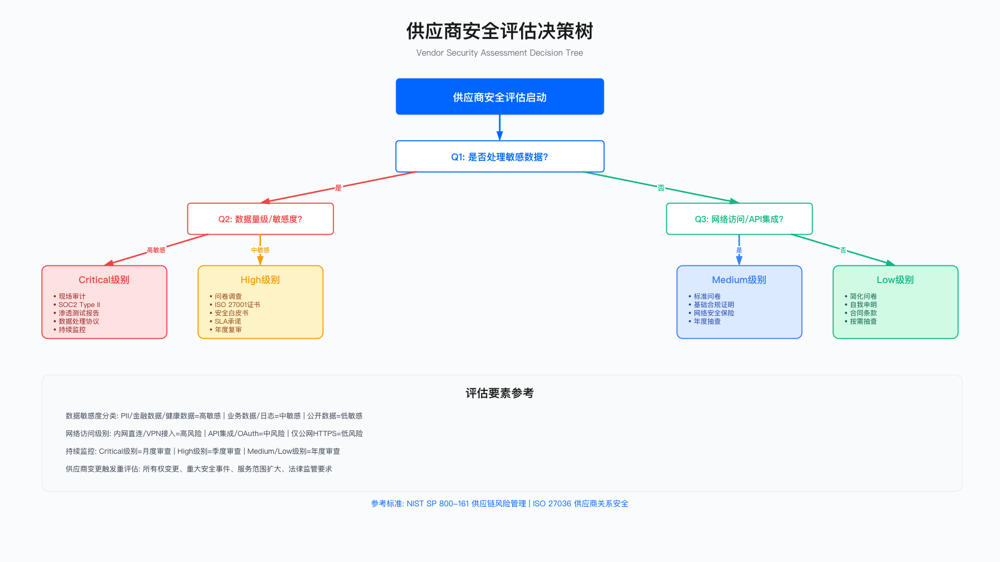

# 7.6　供应商与第三方安全管理

> 与第9章的分工：本节从**安全风险**视角评估供应商——四维风险评估、准入门槛、生命周期管理、合同安全条款、持续监控。同一供应商的**个人数据处理合规**（DPA 条款、子处理者管理、国际传输机制、泄露通知时效）见 9.7，那里按隐私维度对同一批供应商重新加权。

> 导读：第三方风险管理（TPRM）的核心逻辑是：你无法直接控制供应商的安全实践，但可以通过准入审查（7.6.2）、合同机制（7.6.5）和持续监控（7.6.4）建立间接影响。本节先在 7.6.1 定义风险评分模型作为后续决策的基础，再按供应商生命周期展开五个阶段的控制（7.6.3）。SBOM 要求与开源供应商的风险叠加分析见 7.3。

供应商安全事件往往是企业面临的最难控制的风险之一：攻击者通过受信任的第三方渠道进入，而企业的内部防御对此几乎毫无感知。SolarWinds 事件（7.2.1）中，大量组织通过受信任的软件供应商渠道遭到入侵，攻击范围之广是直接攻击无法企及的。这说明第三方风险管理不是合规形式，而是真实的威胁向量管理。

---

## 7.6.1 第三方风险评估框架

### 四维风险模型

评估第三方风险需要综合考量四个维度（以下四维划分与权重为本书归纳的实践模型，非任何标准的官方分类；其上位方法论可对照 NIST SP 800-161r1《系统与组织的网络供应链风险管理实践》[1] 与 ISO/IEC 27036 供应商关系信息安全系列标准[2]）。单一维度的评估往往低估或高估实际风险：

数据敏感性：供应商能否访问个人数据、金融数据、知识产权等敏感信息？数据主权要求（如 GDPR 的数据本地化规定）是否适用？泄露后的监管处罚与业务影响分别有多大？

系统访问权限：供应商是否有直接系统访问权限（如数据库读写、生产部署权限）？远程访问是否经过 MFA 与会话录制保护？特权访问的最小化程度如何？

业务关键性：供应商的可用性直接影响业务连续性的程度？替代方案的切换成本与时间如何？供应商是否有合理的 BC/DR 计划？

攻击面暴露：供应商与企业内网的网络连接深度？API 集成点数量？供应商本身成为攻击者目标的可能性（行业知名度、历史漏洞记录）？



### 风险量化模型

为什么要把这四个维度压成一个数字？TPRM 面对的第一个现实问题是供应商数量远超安全团队的评估容量——你不可能对每一家都做同等深度的尽调。评分模型的作用不是给出"精确的风险真值"，而是做分诊（triage）：把有限的深度评估资源，投向真正需要的少数供应商。它是一个决策入口，不是决策终点。

这里的关键设计取舍在于权重的分配，而不是数学公式本身。代码把四个维度枚举化为 1–4 的等级，再乘以固定权重求和——这种线性加权模型的好处是透明、可解释、可审计：任何人都能追问"为什么这家供应商是 HIGH"，并得到一个可以逐项拆开的答案。代价是它假设各维度相互独立、且线性可叠加，这在极端情形下会失真（后文"适用边界"会点明）。作者选择透明性优先于精确性，因为分诊阶段的错误分级可以在后续深度评估中被纠正，而一个黑箱评分反而会掩盖分级依据、削弱对结果的信任。

以下 Python 代码实现了这个加权风险评分模型，权重设计反映了不同维度的相对影响程度：

```python
from dataclasses import dataclass
from enum import Enum

class DataSensitivity(Enum):
    """数据敏感性等级——决定泄露后的监管与业务后果"""
    PUBLIC = 1
    INTERNAL = 2
    CONFIDENTIAL = 3
    RESTRICTED = 4  # 含个人数据、金融数据、知识产权

class SystemAccess(Enum):
    """系统访问权限等级——决定被攻击时的爆炸半径"""
    NONE = 1
    READ_ONLY = 2
    LIMITED_WRITE = 3
    FULL_ACCESS = 4  # 包含生产环境写权限

class BusinessCriticality(Enum):
    """业务关键性等级——决定供应商故障的业务影响"""
    LOW = 1
    MEDIUM = 2
    HIGH = 3
    CRITICAL = 4  # 替代方案不可用或切换周期超过 72 小时

@dataclass
class VendorRiskProfile:
    vendor_name: str
    data_sensitivity: DataSensitivity
    system_access: SystemAccess
    business_criticality: BusinessCriticality
    attack_surface_score: int  # 1-10，基于网络连接深度与历史安全记录

    def calculate_risk_score(self) -> float:
        """
        加权风险评分：
        - 数据敏感性权重 0.35：数据泄露的监管后果通常最重
        - 系统访问权重 0.30：决定攻击者可达的范围
        - 业务关键性权重 0.25：影响风险的可接受程度
        - 攻击面权重 0.10：综合考量网络暴露与历史记录
        """
        weights = {
            'data': 0.35,
            'access': 0.30,
            'criticality': 0.25,
            'attack_surface': 0.10
        }
        
        normalized_attack_surface = self.attack_surface_score / 10.0 * 4
        
        score = (
            self.data_sensitivity.value * weights['data'] +
            self.system_access.value * weights['access'] +
            self.business_criticality.value * weights['criticality'] +
            normalized_attack_surface * weights['attack_surface']
        )
        
        return round(score, 2)

    def get_risk_level(self) -> str:
        score = self.calculate_risk_score()
        if score >= 3.5:
            return "CRITICAL"   # 需要执行层审批，季度评审
        elif score >= 2.5:
            return "HIGH"       # 需要安全团队参与，半年评审
        elif score >= 1.5:
            return "MEDIUM"     # 标准 TPRM 流程，年度评审
        else:
            return "LOW"        # 基础合同保障，两年评审

# 使用示例
vendor = VendorRiskProfile(
    vendor_name="CloudDB Provider",
    data_sensitivity=DataSensitivity.CONFIDENTIAL,
    system_access=SystemAccess.FULL_ACCESS,
    business_criticality=BusinessCriticality.CRITICAL,
    attack_surface_score=5
)
print(f"风险评分: {vendor.calculate_risk_score()}")  # 3.45
print(f"风险等级: {vendor.get_risk_level()}")         # HIGH
```

这段代码里，三个 `Enum` 是模型的骨架，它们把主观判断"锚定"成一个封闭的枚举集合，强制评估者做离散选择而非模糊描述——这本身就是一种控制，避免了"看起来中等偏上"这类无法比较的表述。真正的评分逻辑集中在 `calculate_risk_score`：注意 `normalized_attack_surface` 这一行，攻击面用的是 1–10 打分而非 1–4 等级，所以先除以 10 再乘 4，把它拉回与其他三个维度相同的量纲，否则一个满分 10 的攻击面会在加权和里被不成比例地放大。`get_risk_level` 则是把连续分数切成四档标签，每个 `elif` 分支的注释把分数直接绑定到组织流程（审批层级与评审频率）——这是全段代码的落点：评分的终点落在"谁来批、多久看一次"上，不在数字本身。示例里 CONFIDENTIAL + FULL_ACCESS + CRITICAL + 攻击面 5 算出 3.45，落在 2.5–3.5 区间，因而被判为 HIGH 而非 CRITICAL，正好演示了阈值边界的判定——注意这个例子离 3.5 的 CRITICAL 门槛只差 0.05，稍高一点的攻击面就会翻档，这本身也说明了线性加权在阈值附近的敏感性。

生产环境常见坑有三个。其一，枚举等级是主观录入的，两个评估者对同一家供应商可能填出不同的 `SystemAccess`，评分的一致性取决于是否有明确的分级判据（否则模型只是把主观性藏进了小数点）。其二，线性加权会掩盖"一票否决"型风险：某维度已经达到不可接受的极端（如 RESTRICTED 数据 + FULL_ACCESS），但其他维度偏低，加权后总分可能仍落在 MEDIUM，从而躲过应有的审查——真实体系通常需要在加权之外叠加硬性门槛。其三，`attack_surface_score` 依赖"网络连接深度与历史安全记录"，这些数据往往陈旧或缺失，容易被默认填成中间值，让攻击面维度形同虚设。

适用边界：此评分模型适用于初始风险分级，不能替代深度安全评估。CRITICAL 和 HIGH 等级的供应商需要额外的问卷调查（7.6.3）、合同条款（7.6.5）和持续监控（7.6.4）。

---

## 7.6.2 供应商安全准入评估

### TPRM 工具能力对比

准入评估的第一步是选对工具，而工具的选择取决于所处的供应商关系阶段和要回答的问题。下表把主流 TPRM 工具按"能力形态"而非"品牌"归类，呈现每一类工具的视角局限——每一类都只能看到风险的一个切面：

| 工具类别 | 代表产品 | 主要能力 | 适用场景 |
|---------|---------|---------|---------|
| 评级服务 | SecurityScorecard, BitSight | 持续外部监控、风险评分 | 大量供应商的持续监控 |
| 问卷平台 | OneTrust, ProcessUnity | 结构化评估、工作流管理 | 深度尽职调查 |
| 威胁情报 | RiskRecon, Recorded Future | 实时威胁情报、事件关联 | 关键供应商的主动监控 |
| 开源工具 | OpenSSF Scorecard | 开源项目安全评分 | 开源依赖评估（配合 7.3） |

这张表"适用场景"一列纵向贯穿着一条隐含的分工线——评级服务解决"覆盖广度"（一次盯住成百上千家），问卷平台解决"评估深度"（对少数关键供应商钻到内部控制），威胁情报解决"时效性"（在事件发生的当下告警），开源工具则接手代码依赖这一传统 TPRM 覆盖不到的维度（因此表里明确指向 7.3）。这四类不是竞争关系而是互补层，选型的常见错误是拿一类工具去干另一类的活，比如指望外部评级去替代内部尽调。

正因为如此，外部评级服务（如 SecurityScorecard）提供的是外部可见视角——仅基于公开信息和被动扫描，无法评估供应商内部控制的质量。因此，外部评级应与问卷调查结合使用，而非互相替代。生产环境里还要提防评级服务的两类偏差：它对大企业的公开资产覆盖好、对小供应商可能几乎无数据；而分数的波动有时源于评级方的资产归属误判（把不属于该供应商的 IP 算了进去），因此评级适合看趋势和异常，不宜作为单点门禁。

### 评估问卷框架

外部工具看不到的部分，要靠问卷补齐。对于 HIGH 和 CRITICAL 风险供应商，结构化问卷是核心评估工具。若不想从零设计问卷，可直接采用行业通行的 Shared Assessments SIG 问卷作为基线再按自身场景裁剪[3]，其优点是供应商往往已有现成答案库，可显著降低往返沟通成本。问卷围绕安全能力的六个域组织，不是把问题堆在一起，每个域都对应企业最关心的一类后果——下表的"权重建议"一列，本质上是把 7.6.1 里"数据敏感性权重最高"的判断延续到了问卷层面：

| 评估域 | 关键问题示例 | 权重建议 |
|-------|------------|---------|
| 信息安全治理 | 是否有 CISO 或等效职位？安全预算占比？ | 15% |
| 访问控制 | MFA 覆盖率？特权账户审计频率？ | 20% |
| 数据保护 | 加密算法版本？密钥管理方案？数据本地化能力？ | 25% |
| 事件响应 | IR 计划文档化？历史事件记录？通知 SLA？ | 20% |
| 供应链安全 | 自身的第四方（供应商的供应商）管理？SBOM 能力？ | 10% |
| 合规认证 | ISO/IEC 27001 / SOC 2 Type II / PCI DSS 认证状态？最近一次审计时间？报告的适用期间与范围（scope）是否覆盖本次采购的服务？ | 10% |

这张表的权重里，数据保护（25%）与访问控制（20%）占了近半，这与 7.6.1 中"数据泄露监管后果最重、系统访问决定爆炸半径"的权重排序前后呼应——问卷的分数结构应当反映风险模型的价值排序，否则会出现"评分高但恰好在最在意的维度薄弱"的错配。"供应链安全"域专门问第四方能力：这一行是全表最容易被忽略却又最能暴露级联风险的一项，它把评估从"你的供应商"推进到"你的供应商的供应商"，与本章供应链主题直接相扣。设计问卷时的一个实际取舍是问题的可验证性——"是否有 CISO"这类事实性问题好核对，而"安全文化如何"这类主观题几乎无法从回答中辨真伪，因此表里的示例都偏向可取证的具体项。

生产环境里问卷最大的坑是自评失真：问卷由供应商自己填写，回答趋于乐观，且没有证据支撑时无从辨别。因此对 HIGH/CRITICAL 供应商，问卷答案应与认证报告、外部评级三方交叉印证，而不能单独采信——这正是下面"常见误区"要强调的。

常见误区：过度依赖合规认证作为安全评估依据。ISO 27001 和 SOC 2 认证表明供应商通过了特定控制框架的审计，但认证时间点之间可能发生变化，且认证范围可能不覆盖与你业务相关的系统。应要求查看认证报告全文（而非仅凭证书）并关注发现项与补救情况。

---

## 7.6.3 供应商生命周期安全管理

### 五阶段生命周期

准入评估只是一次快照，而风险是连续的。为什么要用"生命周期"这个框架来组织控制？因为供应商安全管理最常见的失效模式，正是把评估当成一次性动作——准入时严格审查，签约后就再不过问。生命周期视角的价值在于，它把控制点分散到供应商关系的每一个阶段，让"持续"这件事有明确的挂靠位置，而不是一句口号。

供应商关系的安全管理需覆盖完整生命周期——仅在准入阶段做评估是常见的失效模式。供应商的安全状况会随时间变化，特别是在其经历并购、人员更替或快速扩张时。

阅读下面五个阶段时，抓住一条主线：每个阶段都以一个明确的输出物收尾。这个设计不是形式化——每阶段的"输出"是下一阶段的"输入"，正是这些交付物把松散的活动串成可审计的链条（例如阶段一的"风险等级分类"直接决定阶段二的评估深度）。

阶段一：识别与分级
- 收集候选供应商基本信息
- 执行 7.6.1 风险评分
- 确定评估深度（基础/标准/深度）
- 输出：供应商风险等级分类



阶段二：尽职调查评估
- 发送并收回安全问卷
- 检查第三方认证报告（SOC 2 Type II、ISO 27001 等）
- 对 CRITICAL 供应商执行现场或远程技术评估
- 输出：评估报告与风险清单

阶段三：合同谈判与入驻
- 将安全要求写入合同（见 7.6.5 条款模板）
- 配置最小化访问权限（遵循最小权限原则）
- 建立安全联系人与上报渠道
- 输出：已签署合同与访问权限清单

阶段四：持续监控
- 依据风险等级设定复评周期（见 7.6.4）
- 订阅供应商的安全公告
- 使用外部评级服务进行持续外部监控
- 关注供应商的重大变更（并购、关键人员离职）
- 输出：持续监控报告与异常告警

阶段五：退出管理
- 提前规划替代方案（防止被迫在应急状态下迁移）
- 确认供应商删除所有数据（30 天内，见 7.6.5）
- 撤销所有访问权限
- 执行离场安全检查（确认无残留访问路径）
- 输出：供应商退出确认记录

这五个阶段里，最容易被组织忽略的是首尾两端。阶段一常被跳过，导致所有供应商被一视同仁地投入同一套流程，资源错配；而阶段五的退出管理几乎是 TPRM 的"事故高发区"——合同到期或供应商更换时，撤权和删数据这两步若无正式流程，就会留下"离职员工式"的残留访问路径和无人负责的历史数据。阶段五特意强调"提前规划替代方案"，就是因为一旦拖到应急状态下被迫迁移，安全要求往往第一个被牺牲。

### 分级复评周期

生命周期的阶段四（持续监控）需要一个具体的节奏，这个节奏必须与供应商风险等级匹配——对所有供应商用同一复评频率，要么浪费资源盯着低风险方，要么让高风险方在两次评审之间失控。下表把 7.6.1 的四档风险等级映射到三种时间维度：

| 风险等级 | 全面复评周期 | 持续监控 | 触发即时复评的条件 |
|---------|-----------|---------|----------------|
| CRITICAL | 季度 | 实时 | 任何安全事件、并购、认证到期 |
| HIGH | 半年 | 月度 | 重大事件、关键人员变更 |
| MEDIUM | 年度 | 季度 | 重大事件 |
| LOW | 两年 | 年度 | 重大事件 |

这张表真正重要的是三列的组合逻辑，而不只是"全面复评周期"一列。全面复评是重量级、低频的深度检查；持续监控是轻量级、高频的信号采集；而最右列"触发即时复评的条件"是打破固定周期的旁路——它承认风险不会守时发生。注意 CRITICAL 行把触发条件列得最宽（"任何安全事件"），越往下越收窄到"重大事件"，这体现了一个取舍：对关键供应商宁可误报、频繁复评，对低风险供应商则容忍更迟的响应以节省资源。生产环境里的常见坑是只落实了"全面复评周期"这一列（因为它好排期），却把持续监控和即时触发条件停留在纸面——结果是一家 CRITICAL 供应商在季度复评的间隙里发生了事件，而无人被告警。

---

## 7.6.4 第三方风险持续监控

### 监控指标体系

为什么定期复评还不够，要额外搭一套持续监控？因为两次评审之间是最长的盲区，而攻击者不会配合你的评审日历。持续监控的价值恰恰在于填补这段空窗——它不追求深度，而追求及时性和多源覆盖。这里的核心设计原则是"信号来源多样化"：任何单一数据源都有系统性盲区（外部扫描看不到内部控制，供应商自报会隐瞒，业务团队不懂安全），因此下面把信号刻意拆成三类互不重叠的来源。

持续监控的价值在于在两次定期评审之间捕获供应商安全状况的变化。依赖单一数据源容易产生盲区。

外部信号（通过评级服务、威胁情报获取）：
- 供应商暴露的漏洞资产变化
- 暗网中供应商凭证泄露迹象
- 供应商关联 IP 的恶意活动记录
- 外部安全评级的显著下降（超过 15 分）

合同履行信号（通过合同要求供应商主动报告）：
- 安全事件通知（合同要求 24 小时内通知）
- 合规认证续期状态
- 重大架构变更通知

业务关系信号（通过内部业务团队收集）：
- 并购事件（可能改变供应商的安全控制责任方）
- 关键安全人员变更（CISO、安全团队负责人）
- 供应商业务规模的快速变化（可能影响资源投入）

这三类信号的区分标准是"信号从谁那里来、靠什么机制拿到"。外部信号不需要供应商配合就能获取（评级服务、暗网监控主动扫描），因此最客观但最表层；合同履行信号依赖供应商主动上报，能触及内部事件但完全取决于对方是否诚实履约（所以它必须以 7.6.5 的合同条款为强制力后盾，否则毫无约束）；业务关系信号来自组织自己的业务团队，是最容易被安全团队遗漏的一类——并购和人员变更这类"非技术"事件，往往是供应商安全责任方悄然改变的第一信号，而它们从不会出现在任何安全扫描里。三类叠加才能覆盖"外部看得见的""供应商愿意说的""只有内部才知道的"三个层面。生产环境里最典型的坑是只建了外部信号（因为买个评级服务最省事），结果对供应商的并购、关键人离职一无所知，直到出事才发现安全责任方早已换人。

### 事件响应协作

监控发现了信号，还要有能立刻协同的通道——否则告警只是让你更早知道坏消息而已。当供应商发生安全事件时，响应速度直接影响损失范围。下列准备工作的共同点是：它们都必须在平时就位，事发时没有时间临时建立。关键准备工作：

- 在合同中明确事件通知 SLA（24 小时内通知，无论是否已确认影响范围）
- 建立与供应商安全团队的直接联系渠道（不依赖商务渠道）
- 制定供应商事件的内部响应剧本，明确隔离、评估、切换的决策链
- 定期（年度）与关键供应商进行联合桌面演练

这四条里，"不依赖商务渠道"是最容易被低估的一条：事发时若只能通过销售或采购对接，信息会在层层转达中失真和延迟。而"联合桌面演练"则是验证前三条是否真正可用的唯一手段——很多组织合同里写了 24 小时 SLA、也留了联系人，直到真出事才发现联系人早已离职、剧本从未被走通过。

---

## 7.6.5 合同安全条款

### 核心合同条款模板

前面反复提到"用合同作为杠杆"，这里给出它的具体形态。为什么合同条款在 TPRM 里如此关键？因为它是你唯一能对供应商内部行为施加强制力的机制——你无法登录对方系统去检查，但可以在合同里约定对方必须告知、必须接受审计、必须删除数据。合同把"信任"转化为"可执行的义务"。以下三条条款并非随意挑选，它们恰好对应供应商关系中三个最关键、也最容易失控的时刻：出事时（通知）、平时验证时（审计）、离场时（删数据）。

合同是在无法直接控制供应商安全实践时的重要杠杆。以下条款覆盖三个关键领域：

事件通知条款（核心要求：快速知情权）

```
第X条 安全事件通知

供应商在发现以下情况时，应在发现后二十四（24）小时内以书面
方式通知甲方：

(a) 可能影响甲方数据或系统的安全漏洞或事件；
(b) 未经授权访问处理甲方数据的系统；
(c) 影响向甲方提供服务能力的重大安全事件。

通知应包含：事件性质描述、已知或可能受影响的数据范围、
已采取或计划采取的补救措施，以及供应商安全联系人信息。

供应商不得以调查未完成为由延迟初始通知。
```

这条条款的分量落在最后一句——"不得以调查未完成为由延迟初始通知"。这一句针对的是供应商拖延通报的最常见借口："我们还在调查，等确认了再通知你"。它把通知义务与调查进度解耦，确保甲方在损失可控的窗口期内就能知情并启动自己的响应（呼应 7.6.4 的"无论是否已确认影响范围"）。三条触发情形 (a)(b)(c) 从"数据/系统受影响"到"未授权访问"再到"服务能力受损"，覆盖了从数据泄露到服务中断的谱系，避免供应商用"这不算安全事件"来规避通报。生产环境里这条最容易被谈判掉的是那"24 小时"——供应商常想改成"确认后 72 小时"或"合理时间内"，一旦松动，快速知情权就名存实亡。

审计权利条款（核心要求：验证权，非仅信任权）

```
第X条 安全审计权利

甲方有权在合理提前通知（不少于十（10）个工作日）的情况下，
每年最多进行一（1）次安全评估，包括：

(a) 要求供应商提供最新的安全评估报告；
(b) 要求供应商提供 ISO 27001 / SOC 2 Type II 认证报告全文；
(c) 在供应商配合下进行安全问卷调查。

当发生重大安全事件时，甲方可在不提前通知的情况下要求额外评估。
```

这条条款的立意在小标题里已点破——把关系从"仅信任"升级为"可验证"。条款做了一个双向的取舍设计：正常情况下给供应商留足边界（提前 10 个工作日、每年最多 1 次），换取对方接受审计权的意愿；但最后一句留了一个应急旁路——"发生重大安全事件时可不提前通知要求额外评估"，这与 7.6.3 复评表里"触发即时复评"的逻辑是同一根线。(b) 项特意要求"认证报告全文"而非证书，直接对应 7.6.2 "常见误区"里"应要求查看认证报告全文而非仅凭证书"的判断——条款是那条误区的落地机制。生产环境里的坑是频次和范围被谈得过窄（每年 1 次、只看报告不许实测），导致审计权停留在"看文件"层面，无法验证控制的实际运行状态。

数据删除条款（核心要求：退出时的数据清洁）

```
第X条 合同终止后的数据处理

合同终止或到期后三十（30）日内，供应商应：

(a) 将甲方数据的完整副本以甲方可读格式返还；
(b) 安全删除或销毁供应商系统中存储的所有甲方数据副本，
    包括备份和存档；
(c) 提供书面确认，证明数据已按本条要求处理。

供应商应保留符合相关法规要求的最短必要保留期，该期限届满后
应立即按本条款处理剩余数据。
```

这条条款的三步 (a)(b)(c) 是有严格顺序的——先返还（拿回己方数据，避免因删除而丢失）、再删除（含备份和存档，这是全条最容易被打折扣的地方）、最后书面确认（把删除从"承诺"变成"有据可查的义务"）。(b) 特意点名"包括备份和存档"，是因为供应商往往删了主库却留着快照和冷备份，形成看不见的残留数据。末段的"法规最短保留期"是一个必要的现实妥协：某些数据受法规约束不能立即删，条款用"期满后立即处理剩余数据"来兜住这个例外，避免供应商以合规为借口无限期留存。这条直接对应 7.6.3 阶段五的"确认供应商删除所有数据（30 天内）"，是退出管理能否闭环的合同支点。生产环境里最大的坑是拿不到 (c) 的书面确认——没有确认，就无从证明数据真的被删，退出流程永远悬着。

### 合同执行的常见误区

误区一：将安全要求写入合同即完成控制。合同条款只有在被执行时才有价值。关键补充：建立年度合同履行审查，验证供应商实际符合合同要求。

误区二：所有供应商使用相同合同模板。LOW 风险供应商的合同谈判成本与 CRITICAL 供应商相同会浪费资源；而对 CRITICAL 供应商使用基础条款则会留下重大漏洞。应按风险等级匹配合同条款的严格程度。

---

## 7.6.6 TPRM 成熟度路线图

### 三级成熟度模型

前面各节给的是"应该做什么"，但没有一个组织能一步到位建成完整的 TPRM 体系。成熟度模型回答的是"按什么顺序建、现在处在哪一级"——它把散落在 7.6.1 到 7.6.5 的各项能力，沿一条从无到有、从手动到自动的演进轴排列，让团队能定位现状并规划下一步。下表六个能力维度正好对应前面五节讨论过的主题（分级、评估、合同、监控、事件响应、退出），每一行读作一条独立的能力成长曲线：

| 能力维度 | 初始级（M1） | 管理级（M2） | 优化级（M3） |
|---------|------------|------------|------------|
| 识别与分级 | 无统一供应商台账 | 有台账，手动更新 | 自动化台账，实时同步 |
| 评估流程 | 无标准化流程 | 有问卷，执行不一致 | 自动化工作流，风险驱动深度 |
| 合同管理 | 基础服务协议 | 含安全附件，覆盖率 >60% | 全覆盖，定期审查条款有效性 |
| 持续监控 | 仅年度复评 | 分级复评周期 | 实时外部监控 + 事件关联 |
| 事件响应 | 被动响应 | 有联合响应流程 | 年度联合演练，<4h 响应 SLA |
| 退出管理 | 无正式流程 | 有数据删除确认 | 替代方案预置，<30d 完整迁移 |

这张表横向一行是单项能力的进阶路径，纵向一列则是每一级的共性特征——M1 普遍是"缺失或临时应对"，M2 的关键词是"有流程但靠人力、执行不齐"，M3 的关键词是"自动化 + 数据驱动"。其中有两处细节：其一，"评估流程"从 M2 到 M3 的跃迁是"风险驱动深度"，这正是 7.6.1 评分模型的用途落地——用分级去驱动评估深度，而非对所有供应商一视同仁；其二，多数维度的 M1→M2 靠的是"建立流程与文档"，M2→M3 靠的是"自动化与实时化"，这暗示了投入的性质从"人力和制度"转向"工具和集成"。生产环境里最常见的误区是跨级跳跃——试图直接上 M3 的自动化工具，却连 M1 的供应商台账都不完整，结果是自动化跑在残缺的数据上，反而制造虚假的安全感。

实施路线建议：
- 第一年：建立供应商台账，实施分级评估，对 CRITICAL 供应商完成全面尽职调查，在新合同中加入核心安全条款
- 第二年：自动化评估工作流，部署外部评级服务，对存量 HIGH 供应商完善合同条款，建立持续监控报告
- 第三年：全供应商覆盖，联合演练机制，第四方风险（供应商的供应商）扩展评估

这条三年路线的排序本身就是它的论点：第一年优先覆盖 CRITICAL 供应商而非追求全量，是因为风险集中在少数关键方，先把最危险的堵上性价比最高；把"全供应商覆盖"和"第四方风险"放到第三年，是承认它们成本高、依赖前两年打下的台账与自动化基础。换句话说，路线图刻意抵制"一开始就求全"的冲动，与上面成熟度表"忌跨级跳跃"的告诫是同一个道理。

验证方法：用 TPRM 工具的覆盖率报告验证台账完整性；通过模拟供应商事件测试联合响应流程；检查过去 12 个月的合同审计记录验证条款执行率。

运行指标：
- 供应商台账覆盖率（已评估供应商/已识别供应商）
- 高风险供应商按期复评率
- 供应商事件平均响应时间
- 合同安全条款覆盖率（含关键条款的合同/总合同数）

---

## 参考文献

| # | 来源 | 标题 | 日期 | 链接 |
| --- | --- | --- | --- | --- |
| [1] | NIST | SP 800-161r1: Cybersecurity Supply Chain Risk Management Practices for Systems and Organizations | 2022-05 | <https://csrc.nist.gov/pubs/sp/800/161/r1/final> |
| [2] | ISO/IEC | ISO/IEC 27036-1:2021 — Cybersecurity — Supplier relationships — Part 1: Overview and concepts | 2021 | <https://www.iso.org/standard/82905.html> |
| [3] | Shared Assessments | What is the SIG? Standardized Information Gathering Questionnaire（第三方评估问卷业界基线） | 2026 访问 | <https://sharedassessments.org/about-sig/> |

---

## 导航

[← 上一节：7.5 容器镜像供应链安全](./7.5_容器镜像供应链安全.md) | [返回章节目录](./README.md) | [下一节：7.7 硬件供应链安全 →](./7.7_硬件供应链安全.md)

---

© 2025-2026 AISecOps Project. Licensed under CC BY-NC-SA 4.0
