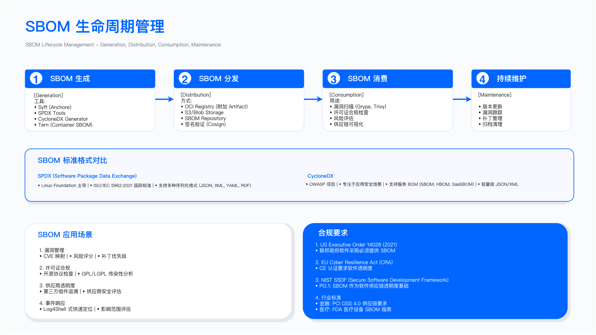
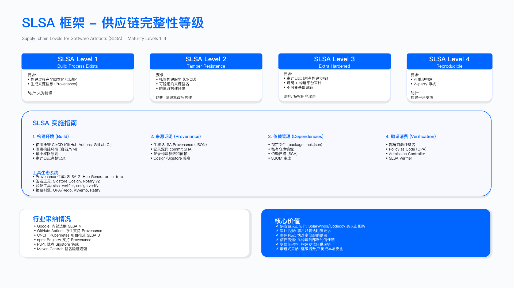
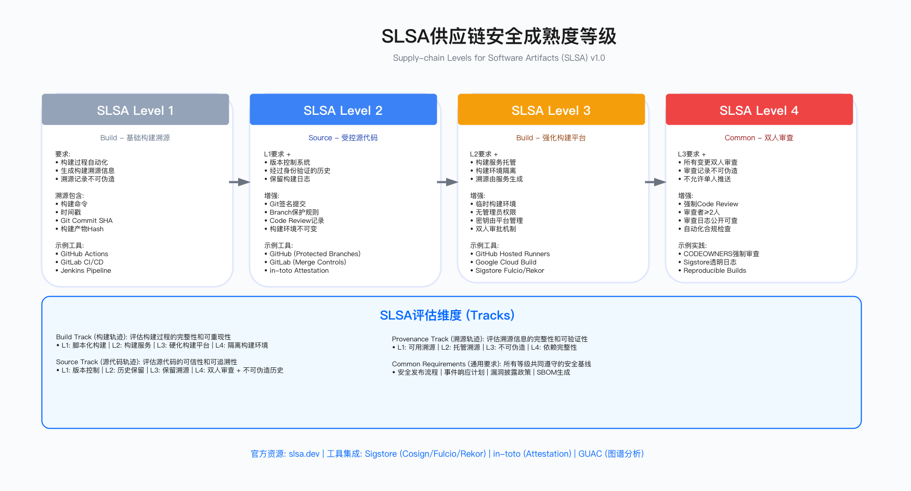

# 7.9　供应链安全合规

> 导读：供应链合规的核心张力在于：法规要求持续演进，而工程实施需要稳定的投入方向。本节提供一个实用的决策框架：7.9.1 先确定哪些法规对你的组织有约束力，7.9.2–7.9.4 分别深入 EO 14028/NIST SSDF/SLSA 三个最有工程影响的框架，7.9.5 覆盖欧盟 CRA（2027 年全面适用，现在应开始准备），7.9.6 覆盖供应商关系维度的 ISO 27036。7.9.7 提供统一的优先级路线图。SBOM 的技术实现细节见 7.3；SLSA 在 CI/CD 流水线中的落地见 7.4。

供应链安全已从工程最佳实践演变为法规要求。这一转变的背景是：SolarWinds 事件（7.2.1）之后，各国政府意识到软件供应链是系统性风险，需要通过监管而非仅靠市场激励来推动改善。对企业而言，合规要求既是约束（需要投入资源满足），也是护城河（合规能力可转化为客户信任和市场准入）。

---

## 7.9.1 全球供应链安全监管要求

### 主要法规覆盖矩阵

| 法规/标准 | 颁布机构 | 生效时间 | 适用范围 | 核心要求 |
|----------|---------|---------|---------|---------|
| EO 14028（**强制机制已解除**） | 美国白宫 | 2021-05-12 发布；落地备忘录 M-22-18 / M-23-16 于 **2026-01-23 被 OMB 以 M-26-05 撤销**[2] | 向联邦政府销售软件的供应商 | 原要求 SBOM 提交、NIST SSDF 自证、漏洞披露计划；现 SSDF 自证改为**可选**、SBOM 改为**各机构自行裁量** |
| NIST SSDF (SP 800-218) | NIST | v1.1，2022 年 2 月[3] | 所有软件开发组织 | 4 大实践组、19 项实践、42 个任务 |
| SLSA | OpenSSF 社区 | **现行 v1.2（2025-11-24）**[1] | 软件制品供应链 | Build track L1-L3 构建完整性等级；v1.2 新增 Source track |
| EU Cyber Resilience Act（Regulation (EU) 2024/2847） | 欧盟 | 2024-12-10 生效；**2026-09-11 起适用漏洞与严重事件报告义务**；2027-12-11 主要义务全面适用[4] | 在欧盟销售的数字产品 | 安全设计、CE 标识、支持期（原则上不短于产品预期使用寿命、且一般不少于 5 年）、漏洞管理、24h/72h/14d 三级报告 |
| NIS2 Directive（Directive (EU) 2022/2555） | 欧盟 | 指令 2022-12 通过、2023-01-16 生效；**2024-10-17 为成员国转化截止日**[7]（截至 2026 年仍有多国未完成，实际义务以各国转化法为准） | 关键基础设施运营者 | 供应链风险管理、事件报告 |
| FDA 医疗器械网络安全 | 美国 FDA | 2023 年 3 月 | 医疗设备制造商 | SBOM 提交、安全更新计划 |
| ISO/IEC 27036 | ISO/IEC | 持续维护 | 全球供应商关系 | 供应商选择、合同安全条款、持续监控 |

### 适用性判断

强制合规场景（必须满足，否则失去市场准入或面临处罚）：在欧盟销售数字产品（CRA——**报告义务 2026-09-11 已生效**，主要义务 2027-12-11）；提供医疗设备（FDA）；处理支付卡数据（PCI DSS）；运营关键基础设施（NIS2 各成员国转化法、中国网络安全法与关基条例）。

**美国联邦采购的状态已在 2026 年反转**：EO 14028 本身未废止，但其落地强制机制——OMB M-22-18 与 M-23-16 所要求的 SSDF 自证、CISA 统一自证表格与集中存证库——已被 2026 年 1 月 23 日发布的 M-26-05 全部撤销[2]，SSDF 自证改为可选、SBOM 改为各机构按风险自行裁量。这意味着"不交 SBOM 就丢联邦市场准入"这个说法在今天已不成立。**SBOM 今天真正的驱动力是商业合同要求与 EU CRA，不再是美国联邦强制**——这一点对制定投入优先级影响很大：把 SBOM 项目挂在"联邦合规"上会失去预算合法性，挂在"欧盟市场准入 + 大客户采购门槛"上才站得住。

建议合规场景（非强制但影响竞争力）：为大型企业提供 SaaS 服务——企业客户在采购审查时越来越普遍地要求 SBOM 和 SOC 2 Type II；开源软件项目寻求采用 SLSA 认证增强信任；参与政府采购投标。

豁免条件：纯内部使用软件本就不在联邦软件采购范围内；开源个人项目不受商业产品合规要求约束（但大型开源基金会项目如 Kubernetes 已主动采用 SLSA）；开源软件本身不受 CRA 约束，但基于开源软件的商业产品受约束。

---

## 7.9.2 美国 EO 14028：从强制合规到风险化实践

> **状态提示（2026-07 核）**：本节原以"联邦强制合规"为框架组织。2026 年 1 月 23 日，OMB 以 M-26-05 撤销了 M-22-18 与 M-23-16[2]，SSDF 自证由强制改为可选、SBOM 提交改为各机构自行裁量，CISA 的统一自证表格与集中存证库同步取消；FAR Case 2023-002 前途未定。EO 14028 本身未废止，其技术要求（NTIA SBOM 最小元素、SSDF 实践组）依然是业界公认的良好实践，且被 EU CRA 与大量商业合同实质继承。
>
> 因此本节的正确读法是：**把下面的内容当作"业界事实标准的技术规格"来读，而不是当作"不做就没法卖给联邦政府的强制清单"**。技术内容仍然有效，合规驱动力已经换了来源。

### SBOM 最小元素（NTIA Minimum Elements）

美国国家电信和信息管理局（NTIA）于 2021 年 7 月 12 日发布的《The Minimum Elements For a Software Bill of Materials》定义了 SBOM 必须包含的七个最低数据字段，以及自动化支持与实践流程两类附加要求[5]。这曾是 EO 14028 合规的技术基础，在联邦强制机制解除后，它依然是大多数企业客户评估 SBOM 质量的事实参考框架。需要跟进的一点是：CISA 已在 2025 年 8 月发布《2025 Minimum Elements for a Software Bill of Materials》并公开征求意见，对字段集与实践要求做了扩充[6]，制定内部 SBOM 规范时应同时对照这两份文件。

以下为 NTIA 2021 版的七个数据字段：

| 字段 | 说明 | 实现示例 |
|-----|------|---------|
| 供应商名称 | 提供组件的实体 | `org.apache.logging.log4j` |
| 组件名称 | 软件单元标识 | `log4j-core` |
| 版本标识符 | 区分不同版本 | `2.17.1` |
| 唯一标识符 | 跨系统唯一识别 | `pkg:maven/org.apache.logging.log4j/log4j-core@2.17.1` |
| 依赖关系 | 上下游组件关联 | 记录直接依赖与传递依赖的关系图 |
| SBOM 创建者 | 生成 SBOM 的实体 | `Tool: Syft-0.95.0` |
| 时间戳 | SBOM 生成时间 | ISO 8601 格式：`2025-01-15T10:30:00Z` |

自动化支持要求：SBOM 必须使用机器可读格式，NTIA 2021 版明确列出 SPDX、CycloneDX 与 SWID 标签三种可接受格式[5]，便于自动化漏洞关联和合规审计。手动维护的电子表格不满足该要求。



### CI/CD 集成示例

以下 Jenkins Pipeline 示例展示 EO 14028 合规的 SBOM 生成、验证、签名、发布完整流程。注意 `cyclonedx-cli validate` 步骤——这是在 SBOM 发布前自动验证格式合规性的关键控制，防止生成了格式错误的 SBOM 后才在下游消费时发现问题：

```groovy
pipeline {
    agent any
    stages {
        stage('Build') {
            steps {
                sh './mvnw clean package'
            }
        }
        stage('Generate SBOM') {
            steps {
                sh '''
                    # 使用 Syft 生成 CycloneDX 格式 SBOM（包含直接依赖和传递依赖）
                    syft scan dir:target/ -o cyclonedx-json > sbom.cdx.json
                    
                    # 立即验证 SBOM 格式合规性（包含所有 NTIA 必需字段）
                    # 在此阶段发现问题比下游消费时发现成本低得多
                    cyclonedx-cli validate --input-file sbom.cdx.json
                '''
            }
        }
        stage('Sign SBOM') {
            steps {
                // 密钥通过 Credentials 管理，不硬编码在流水线中
                withCredentials([file(credentialsId: 'cosign-key', variable: 'COSIGN_KEY')]) {
                    sh 'cosign sign-blob --yes --output-signature sbom.sig --key ${COSIGN_KEY} sbom.cdx.json > sbom.cdx.json.sig'
                }
            }
        }
        stage('Upload to Dependency-Track') {
            steps {
                sh '''
                    curl -X POST "${DEPENDENCY_TRACK_URL}/api/v1/bom" \
                        -H "X-Api-Key: ${DT_API_KEY}" \
                        -H "Content-Type: multipart/form-data" \
                        -F "project=${PROJECT_UUID}" \
                        -F "bom=@sbom.cdx.json"
                '''
            }
        }
        stage('Archive Artifacts') {
            steps {
                archiveArtifacts artifacts: 'sbom.cdx.json, sbom.cdx.json.sig'
            }
        }
    }
}
```

### VEX 文档

VEX（Vulnerability Exploitability eXchange）是 SBOM 的重要补充——当 SBOM 关联分析发现漏洞时，VEX 用于声明该漏洞在特定产品中的可利用性状态，避免供应商需要回应大量"已知但不可利用"的漏洞告警：

- `not_affected`：漏洞存在于组件中，但在当前产品配置中不可利用（如易受攻击的代码路径未被使用）
- `affected`：确认受影响，正在修复
- `fixed`：已在指定版本修复
- `under_investigation`：正在评估中

常见误区：仅生成直接依赖 SBOM 而忽略传递依赖——Log4Shell 事件中许多组织发现，Log4j 以传递依赖形式存在，不在他们的直接依赖清单中。NTIA 要求包含完整依赖树，工具（Syft、Trivy、Grype）默认已支持传递依赖分析，但需要确认配置正确。

---

## 7.9.3 NIST SSDF (SP 800-218) 实施指南

### 四大实践组架构

NIST 安全软件开发框架（SSDF）的设计逻辑：从左到右代表"防御纵深"——PO（组织准备）是基础，PS（保护软件资产）是过程控制，PW（生产安全软件）是技术实践，RV（响应漏洞）是闭环机制。四个实践组缺一不可：只有 PW 而没有 RV，意味着发现漏洞后没有有序的处置流程；只有 PO 而没有 PW，意味着有政策但缺乏技术落地。

PO（Prepare the Organization，准备组织）：定义安全需求、建立角色与责任、支持工具链、可重复流程、人员培训。目标：组织级安全开发能力基线。

PS（Protect the Software，保护软件）：保护代码仓库、提供安全的软件组件供应链、归档完整性证明。目标：软件在开发与构建过程中的完整性与可追溯性。

PW（Produce Well-Secured Software，生产安全软件）：安全设计、安全构建环境、安全分发、响应客户反馈。目标：从设计到发布全程的安全控制。

RV（Respond to Vulnerabilities，响应漏洞）：识别漏洞、评估优先级、修复、根因分析。目标：快速有序地响应新发现的漏洞。

### 关键实践深度解析

PS.1（保护代码仓库）：这是 2023 年 CircleCI 供应链事件的核心教训——攻击者通过访问 CI 系统窃取了存储在其中的客户密钥。关键控制：所有账户启用 MFA；配置分支保护（要求代码审查、禁止强制推送）；要求签名提交（`git commit -S`）；审计所有对构建系统的访问。

PS.2（提供安全组件）：仅使用可信来源组件（官方包管理器仓库，或经安全审查的内部镜像）；验证组件签名；SCA 工具持续扫描；维护批准组件白名单。内部镜像仓库（npm 私有 registry、JFrog Artifactory 等）在此处发挥双重作用：作为代理缓存和安全审查门禁。

PW.1（设计时考虑安全）：在架构设计阶段进行威胁建模（STRIDE 方法）、识别信任边界、评估攻击面。对供应链安全而言，信任边界的识别特别重要：哪些组件来自外部？哪些是内部构建？每个边界需要什么验证？

RV.2（漏洞优先级排序）：综合 CVSS、EPSS（见 7.8.2）、是否存在公开 PoC、资产关键性计算优先级。建议时间线：P0（已在野利用）24 小时；P1（CRITICAL）7 天；P2（HIGH）30 天；P3（MEDIUM）90 天。

### SSDF 合规自证明

组织可通过自证明文档向客户或监管机构证明 SSDF 合规性，无需第三方认证。文档应包含 22 项实践的实施状态（已实施/部分实施/未实施）、每项实践的实施方式说明、支持证据清单（SBOM 样本、SLSA 证明、渗透测试报告），以及签署人与日期。

自证明与第三方认证的关系：自证明是合规承诺的正式声明，部分联邦合同要求提供。SOC 2 Type II 审计可覆盖 SSDF 的部分实践，但不完全对应。

---

## 7.9.4 SLSA 供应链等级认证

### 等级要求与防御价值

本节按现行的 SLSA v1.2（2025-11-24 发布）校准[1]——Build track 仍为 L1/L2/L3 三级，对应递进的构建完整性保证；早期四级模型的 Level 4（可重现构建）自 v1.0 起已从正式等级移除，作为超出 Build track 的补充控制处理。关键是理解每个等级能防御什么、不能防御什么：



SLSA Build L1（文档化构建）：要求生成构建证明（provenance），记录构建基本信息。能防御：完全无法溯源的构建。不能防御：开发者手动篡改构建产物。

SLSA Build L2（托管构建）：要求使用托管构建服务（GitHub Actions、GitLab CI、Google Cloud Build）自动生成不可篡改的证明。能防御：开发者手动篡改构建产物。不能防御：构建环境本身被入侵（SolarWinds 模式）。

SLSA Build L3（强化构建）：要求临时隔离的构建环境（每次构建后销毁）、所有外部依赖通过哈希验证、证明由构建服务密钥而非触发者密钥签名。能防御：构建环境持久化攻击（SolarWinds 模式）。这是当前 Build track 的最高等级，也是大多数有实际威胁模型的企业的目标等级。

补充控制（超出 Build track）——可重现构建：要求两个独立构建环境使用相同输入生成字节级相同的制品。能防御：单一构建环境中的隐蔽篡改。技术难度极高（需要解决编译器非确定性、时间戳嵌入等），目前主要在 Linux 内核等高价值项目中实践。SLSA 自 v1.0 起已将其从正式等级移除、列为未来 track 的候选控制，可在达成 Build L3 后作为补充控制叠加。

### 实施路径与约束

达成 Build L2（1-2 个月）：迁移到 GitHub Actions 或 GitLab CI，使用官方 SLSA 生成器。主要约束：需要信任托管服务提供商，构建环境配置灵活性受限。

达成 Build L3（3-6 个月）：容器化临时构建环境；锁定所有依赖版本与哈希（npm package-lock.json、go.sum、Maven checksum）；Cosign 签名（配合 HSM/KMS 密钥）；构建环境审计。主要约束：需要额外基础设施，构建时间增加（每次验证依赖哈希），依赖锁定可能延迟安全补丁更新（需要显式更新锁文件）。

常见误区：认为可重现构建等补充控制是所有项目必需——大多数项目达成 Build L2 或 L3 已足够，且实施可重现构建的工程复杂度远超收益。应根据实际威胁模型选择合适等级，而非追求最高分。



### 验证方法

使用 `slsa-verifier` 工具验证制品的 SLSA 证明有效性；检查证明中的 `builder.id` 是否为受信任的构建服务；验证证明签名与制品摘要匹配；审计构建日志确认构建环境隔离配置。

---

## 7.9.5 欧盟 Cyber Resilience Act 合规准备

### CRA 核心义务

CRA 于 2024 年 10 月由欧盟理事会通过，2024 年 11 月在《欧盟公报》发布，2024-12-10 生效；报告义务自 2026-09-11 适用，主要义务自 2027-12-11 全面适用[4]。支持期要求意味着你今天发布的产品就已经需要按 CRA 设计，因为它将在 2027 年后继续销售。

安全设计与默认配置：产品必须采用安全设计原则（security by design），所有默认凭证必须唯一（禁止出厂相同密码）、禁用不必要服务、支持自动安全更新、传输和静态数据加密。

漏洞管理：建立公开的漏洞披露政策（安全联系方式、`security.txt` 文件）；定义漏洞响应 SLA（严重漏洞 24 小时内响应）；实施协调披露计划（与安全研究人员协作，修复后再公开）。

5 年安全支持期限：从产品首次投放市场计算，期间提供安全更新。这对商业模式有重大影响——需要在产品定价中覆盖长期维护成本，特别是对硬件嵌入式软件（IoT 设备等）。

CE 标识与合格评定：根据产品风险等级（Class I/II/Critical）选择自我评估或第三方评估，获得 EU 符合性声明。

事件报告：主动被利用的漏洞需在 24 小时内向 ENISA 报告；严重安全事件 72 小时内报告。

### 产品分类

| 风险等级 | 产品类型 | 评估方式 |
|---------|---------|---------|
| Class I（普通） | 智能家居设备、一般商用软件、非关键 IoT | 自我评估，编制技术文档 |
| Class II（重要） | 工业控制系统、企业防火墙、操作系统 | 第三方通知机构审查 |
| Critical（关键） | 关键基础设施组件 | EU 认证机构认证，持续监督 |

重要澄清：开源软件本身不受 CRA 约束，但基于开源软件的商业产品受约束。如果你将 OpenSSL 打包进商业产品销售，OpenSSL 本身不需合规，但你的产品需要。这意味着使用开源组件的商业产品需要承担其供应链安全责任。

### 适用边界与常见误区

误区一：认为开源项目豁免适用于所有基于开源的产品。仅个人开源项目豁免，商业化产品需合规。

误区二：忽视 5 年支持期限的商业影响。许多 IoT 产品制造商的商业模式是"卖出即完成"，CRA 要求根本性的商业模式转变。

误区三：把 CRA 当成 2027 年才需要处理的事。事实上报告义务已自 2026-09-11 起适用[4]，产品设计与漏洞处置流程的改造周期又通常以季度计，拖到临近 2027-12-11 才启动，几乎必然赶不上。

---

## 7.9.6 ISO/IEC 27036 供应商关系安全

### 标准覆盖范围

ISO 27036 系列标准规范供应商关系中的信息安全要求。与 EO 14028、SLSA 等以技术供应链为焦点的框架不同，ISO 27036 覆盖整个供应商关系生命周期的治理。

- ISO 27036-2（要求）：供应商选择、合同安全条款、持续监控、事件管理的具体要求。
- ISO 27036-3（ICT 供应链安全指南）：硬件、软件与服务供应链的详细控制，包括 SBOM 管理、制品验证、供应链审计。
- ISO 27036-4（云服务安全指南）：针对云服务提供商的特殊要求，包括数据驻留、加密密钥管理、审计日志访问。

### 供应商风险评估框架

ISO 27036 要求对供应商进行多维度风险评估，综合考量安全控制、数据保护、供应链透明度、事件响应能力、合规认证、财务稳定性、地理风险。评估结果驱动不同的管理策略：

| 风险等级 | 综合评分（1-5）| 管理策略 |
|---------|-------------|---------|
| 低风险 | ≥ 4.5 | 标准流程，年度安全审查 |
| 中风险 | 3.5-4.5 | 持续监控，半年度审查，要求 SBOM 与漏洞通知 |
| 高风险 | 2.5-3.5 | 现场安全审计，要求 ISO 27001 或 SOC 2 Type II，季度审查 |
| 严重风险 | < 2.5 | 不建议使用；如必须使用需高管批准，寻找替代供应商 |

此处的评估框架与 7.6 的 TPRM 框架互为补充——7.6 侧重第三方软件供应商的风险管理，ISO 27036 提供更广泛的供应商关系安全标准，两者结合形成完整的供应商安全治理体系。

常见误区：仅依赖供应商安全问卷而不验证实际控制。问卷回答可能不准确，需要通过审计报告（SOC 2 Type II 报告全文，不只是证书）或实地验证来核实。此外，将风险评估视为一次性准入活动——供应商风险持续变化（并购、人员更替、安全事件），需要定期重新评估。

---

## 7.9.7 合规实施路线图

### 成熟度分级

基于不同组织的合规需求和资源约束，建议分四个等级推进：

基础级（0-3 个月优先项）：
- 自动化 SBOM 生成（任何格式），集成到 CI/CD
- 基础 SCA 漏洞扫描
- 代码仓库分支保护和 MFA
- 书面安全开发政策和事件响应计划

中级（3-6 个月）：
- SBOM 能力建设：NTIA 最小元素合规（含传递依赖）、SBOM 签名与 API 访问（原 EO 14028 规格，现由商业合同与 CRA 驱动）
- NIST SSDF PO 和 PS 实践组
- 达成 SLSA Build L2
- 建立供应商风险评估流程（参考 7.6）

高级（6-12 个月）：
- NIST SSDF PW 和 RV 实践组
- 达成 SLSA Build L3（有 CI/CD 安全事件压力的组织应优先）
- SOC 2 Type II 认证（适合 SaaS 企业）
- 建立漏洞披露计划
- 开始 EU CRA 合规差距分析（适用于欧盟市场）

专家级（12 个月以上）：
- 在 Build L3 之上叠加双人审查、可重现构建等补充控制（仅适用于高价值关键系统）
- ISO 27001 认证
- FedRAMP 认证（适用于美国联邦政府业务）
- 可重现构建

### 实施优先级原则

原则一：自动化优先于手动。手动维护的合规证据（如手动更新的电子表格）在审计时可信度低，且随时间会失去时效性。自动化生成的 SBOM、自动化扫描报告比手动文档更有说服力。

原则二：基础控制优于高级认证。SBOM 生成覆盖率 96% 但格式完全合规，远比追求可重现构建等补充控制但基础 SBOM 覆盖率不足更有价值。

原则三：合规转化为工程能力。合规要求框架（SSDF、SLSA）设计时参考了最佳实践，遵循这些框架的副产品是工程能力的提升（更快的漏洞响应、更好的构建可追溯性），而非纯粹的合规成本。

### 运行指标

合规覆盖指标：
- SBOM 覆盖率：已生成 SBOM 的服务/总服务数（目标 ≥ 95%）
- SLSA Level 达成率：达到目标等级的关键系统比例
- 合规控制失效事件数：季度内合规控制失效导致的事件数（目标 0）

质量指标：
- SBOM 格式合规率：通过 NTIA 最小元素检查的 SBOM 比例（目标 100%）
- 审计发现整改及时率：审计发现问题在规定时间内关闭的比例（目标 ≥ 95%）
- 漏洞修复时间（按 P0/P1/P2/P3 分类统计）

---

## 本节小结

供应链安全合规的核心建议：不要为合规而合规，而是将合规要求融入工程流程。自动化 SBOM 生成、SLSA 证明、制品签名——这些不只是合规证据，更是真实的供应链安全能力。通过系统化实施合规框架，可以将合规能力转化为竞争优势：SBOM 可增强客户信任、SLSA 证明可简化客户安全审查流程、SOC 2 认证可加速企业销售。

---

## 参考文献

| # | 来源 | 标题 | 日期 | 链接 |
| --- | --- | --- | --- | --- |
| [1] | SLSA / OpenSSF | Announcing SLSA v1.2（Build track 仍为 L1-L3，新增 Source track） | 2025-11-24 | <https://slsa.dev/blog/2025/11/announce-slsa-v1.2> |
| [2] | 美国管理与预算办公室（OMB） | M-26-05: Adopting a Risk-based Approach to Software and Hardware Security（撤销 M-22-18、M-23-16） | 2026-01-23 | <https://www.whitehouse.gov/wp-content/uploads/2026/01/M-26-05-Adopting-a-Risk-based-Approach-to-Software-and-Hardware-Security.pdf> |
| [3] | NIST | SP 800-218: Secure Software Development Framework (SSDF) Version 1.1（19 项实践 / 42 个任务） | 2022-02 | <https://csrc.nist.gov/pubs/sp/800/218/final> |
| [4] | 欧盟委员会 | Cyber Resilience Act（Regulation (EU) 2024/2847）：2024-12-10 生效、2026-09-11 报告义务、2027-12-11 主要义务 | 2024-12-10 生效 | <https://digital-strategy.ec.europa.eu/en/policies/cyber-resilience-act> |
| [5] | NTIA | The Minimum Elements For a Software Bill of Materials (SBOM) | 2021-07-12 | <https://www.ntia.gov/report/2021/minimum-elements-software-bill-materials-sbom> |
| [6] | CISA | 2025 Minimum Elements for a Software Bill of Materials (SBOM)（公开征求意见稿） | 2025-08 | <https://www.cisa.gov/resources-tools/resources/2025-minimum-elements-software-bill-materials-sbom> |
| [7] | 欧盟 | Directive (EU) 2022/2555 (NIS2)（2024-10-17 为成员国转化截止日） | 2022-12-14 | <https://eur-lex.europa.eu/eli/dir/2022/2555/oj> |

---

## 导航

[← 上一节：7.8 供应链风险检测与响应](./7.8_供应链风险检测与响应.md) | [返回章节目录](./README.md) | [下一节：7.10 案例研究 →](./7.10_案例研究.md)

---

© 2025-2026 AISecOps Project. Licensed under CC BY-NC-SA 4.0
