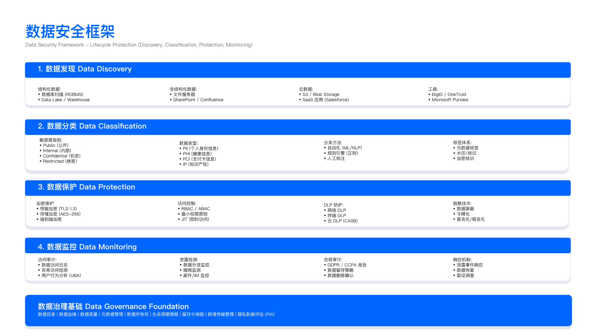
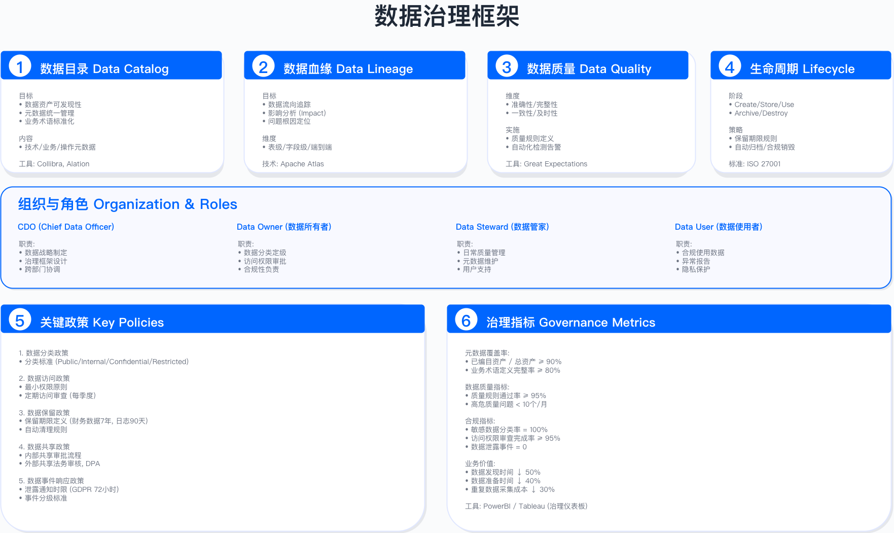

# 8.1　数据安全战略

> 导读：本节解决三个关键问题：治理框架如何分层、成熟度如何评估、战略目标如何与业务对齐。建议安全架构师重点阅读 8.1.1 的协同接口表——那里定义的是跨域协作失败的根本原因，而非仅是职责划分。组织架构设计见 8.1.4，KPI 体系见 8.1.5。

企业数据资产的泄露、篡改或丢失可导致监管处罚、诉讼赔偿、业务中断与客户流失。建立系统化的数据安全战略，是将数据保护从被动响应转变为主动治理的决策基础。

本节阐述数据安全治理框架、成熟度评估模型、战略目标与组织架构设计，为构建企业级数据安全体系提供决策路径。

---

## 8.1.1 数据安全治理框架

### 治理框架的五层结构

数据安全治理需要战略层、组织层、流程层、技术层与文化层协同运作。缺失任何一层都会导致控制点失效或执行成本失控。

战略层：明确数据保护的风险偏好与容忍度。定义风险偏好时需回答：对于哪些类型的数据泄露，企业愿意承担残余风险而非无限投入资源。典型决策包括：公开数据不加密，内部数据传输加密，机密数据静态与传输双重加密。

组织层：建立数据所有权与责任矩阵。数据所有者由业务部门负责人担任，定义数据分类与访问规则；数据保管人由 IT 或安全团队担任，实施技术控制；数据使用者是所有员工，遵守访问策略。若角色定义不清，常见误区是安全团队制定的分类标准无法获得业务认可，或业务部门批准的访问权限绕过技术控制。

流程层：规范数据生命周期中的关键决策点。数据分类流程需明确：由谁触发分类评估、由谁审批、多久复核一次。数据访问审批流程需定义：临时访问的有效期、高风险访问的审批层级、批量数据导出的额外验证。流程设计失败的典型表现是审批时间过长导致业务绕过流程。

技术层：实施自动化控制措施。技术工具需与流程对接：数据分类结果自动触发加密策略，访问审批记录自动同步到 IAM 系统，DLP 拦截事件自动创建工单。技术栈孤立运行会导致人工协调成本高且易出错。

文化层：培养全员数据保护意识与问责机制。缺乏文化支撑的控制措施易被规避：员工用私人邮箱传输敏感文档以绕过 DLP，或将加密密钥写入代码注释中。

### 与其他安全域的协同接口

数据安全治理不是独立工作流，需与以下安全域建立明确的输入输出关系：

| 协同域 | 输入（来自该域） | 输出（提供给该域） | 协同失败表现 |
|--------|---------------|----------------|-------------|
| GRC（第2章） | 风险评估方法、合规控制库 | 数据资产风险登记、审计证据 | 风险评估未覆盖数据资产导致合规审计发现 |
| 云安全（第5章） | 云服务商责任边界、KMS 集成接口 | 云数据分类要求、密钥管理策略 | 云数据未按本地标准分类导致跨境传输违规 |
| 应用安全（第6章） | 应用层访问日志、API 调用链 | 数据访问授权规则、敏感字段清单 | 应用直接访问数据库绕过 IAM 导致审计缺失 |
| 隐私合规（第9章） | 个人数据定义、DPIA 评估结果 | 个人数据处理活动清单、同意管理接口 | DPIA 识别的高风险未转化为技术控制 |
| 信息保护（第10章） | DLP 拦截告警、泄露事件线索 | DLP 策略规则、敏感数据特征库 | DLP 规则未同步数据分类变更导致误报 |

协同失败的根本原因通常是缺乏统一的数据资产清单与元数据标准。建议由安全风险管理委员会（Security Risk Management Committee）下设的数据安全专题工作组统筹协调，GRC 团队维护跨域控制映射矩阵。

---

## 8.1.2 数据安全成熟度模型

### 成熟度评估的标准依据

本节成熟度模型基于以下可验证标准：
- CMMI（Capability Maturity Model Integration）：5 级成熟度框架，由卡内基梅隆大学软件工程研究所发布
- GB/T 36073-2025：中国国家标准《数据管理能力成熟度评估模型》（DCMM），定义 5 级 9 域评估框架，2026-07-01 起实施并全部代替 2018 版[1]
- NIST Cybersecurity Framework 2.0：以 GOVERN 等六大职能与实施层级（Tier 1-4）刻画治理成熟度[2]
- ISO/IEC 27001:2022：信息安全管理体系与 PDCA 持续改进原则[3]

### 五级成熟度定义与量化门槛

下表为成熟度评估的参考框架，量化指标为示例口径，实际评估需结合行业基准与企业风险偏好设定：

| 成熟度级别 | 特征描述 | 关键能力 | 验收指标（示例口径） |
|------------|----------|----------|-------------------|
| M1 初始级 | 数据资产管理缺失，安全控制零散分布，无专职团队，被动响应事件 | 部分敏感数据加密，基本账号密码访问控制，手工审计 | 数据盘点覆盖率低于 30%，无集中密钥管理，审计依赖人工抽查 |
| M2 受管理级 | 建立基本数据分类标准，定义安全政策与流程，关键系统部署技术控制 | 数据分类分级体系，集中密钥管理（KMS），基础 DLP 部署（邮件 / 端点），定期访问审计 | 数据盘点覆盖率 30-60%，加密覆盖核心数据库，DLP 覆盖邮件与端点 |
| M3 稳健级 | 全面数据资产清单，标准化流程，技术控制平台化，跨部门协同机制 | DSPM 平台，多渠道 DLP（网络 / 端点 / 云），自动化数据分类，UEBA 异常检测 | 数据盘点覆盖率 60-85%，DLP 覆盖 3 个以上渠道，自动分类准确率高于 75% |
| M4 量化管理级 | 数据安全与业务价值融合，主动风险量化，AI 驱动自动化决策 | AI 智能分类（准确率高于 90%），策略即代码，自动化事件响应（SOAR），数据血缘分析 | 数据盘点覆盖率 85-95%，DLP 误报率低于 10%，自动化响应率高于 40% |
| M5 优化级 | 行业领先实践，预测性数据安全，零信任架构全面落地，参与标准制定 | AI 威胁预测，隐私增强技术（PETs），数据安全即服务（DSaaS），供应商赋能 | 数据盘点覆盖率高于 95%，DLP 误报率低于 5%，零信任访问覆盖所有敏感数据 |

说明：
- 上述量化指标为成熟度评估的参考口径，非强制阈值
- 不同行业与监管环境对各级别的要求存在差异（见本节后续行业基准部分）
- 评估应综合多个维度，单一指标达标不代表整体成熟度达标

### DCMM 能力域评估映射

版本提示：DCMM 已换版。GB/T 36073-2025 于 2025-12-31 发布、2026-07-01 实施，全部代替 GB/T 36073-2018[1]。新版把能力域从 8 个扩到 9 个：新增"数据资产"域，"数据应用"更名为"数据应用流通"，并增加权属管理、价值评估、资产运营、外部数据管理等能力项；五级成熟度（初始级／受管理级／稳健级／量化管理级／优化级）保持不变。下表已按 2025 版的 9 个能力域重排，仍在用 2018 版做过评估的组织需按新版重新对标。

| DCMM 能力域（GB/T 36073-2025） | 本章覆盖章节 | 核心评估点 | 验证方法 |
|-----------|------------|-----------|---------|
| 数据战略 | 8.1 数据安全战略 | 数据安全战略规划、组织架构、投资决策 | 检查战略文档、组织架构图、预算分配记录 |
| 数据治理 | 8.1 治理框架+8.2 分类 | 数据资产清单、分类分级、元数据管理 | 抽查数据资产清单覆盖率、分类标准一致性 |
| 数据架构 | 8.3 生命周期 | 数据生命周期设计、存储架构、共享架构 | 审查数据流图、存储架构文档、跨境传输路径 |
| 数据资产（2025 版新增） | 8.2 资产发现与清单 | 数据资产权属、价值评估、资产运营、外部数据管理的安全约束 | 核查资产台账的权属字段、外部数据引入的合规审批记录 |
| 数据标准 | 8.2 分类标准 | 数据分类标准、敏感数据定义标准 | 检查分类标准文档、敏感数据识别规则库 |
| 数据质量 | 跨章节 | 数据完整性、准确性校验（加密验证） | 验证数据完整性校验机制、加密数据解密测试 |
| 数据安全 | 8.4-8.7 全覆盖 | 加密、访问控制、DLP、监控审计 | 测试加密有效性、审计日志完整性、DLP 拦截率 |
| 数据生存周期 | 8.3 全覆盖 | 创建、存储、使用、共享、归档、销毁安全 | 抽查生命周期各阶段的控制措施有效性 |
| 数据应用流通（原"数据应用"） | 8.8 跨境+业务场景 | 数据共享、数据服务、跨境传输与流通交易的安全应用 | 审查数据共享审批记录、跨境传输合规证明 |

DCMM 认证说明：
- DCMM 由中国电子信息行业联合会授权的第三方机构评估认证
- 达到 DCMM L3（稳健级）是部分行业（如金融、电信）的监管要求
- 标准文本未公开各能力域的评分权重。9 个能力域等权时数据安全域约占 11%，考虑到金融、电信等受监管行业的评估实践中安全域通常被加权，本章按"不低于等权、上限约四分之一"作为规划口径（作者估算，非标准规定），实际权重以评估机构当期执行细则为准

### 成熟度自评工具

企业可使用以下评估维度快速自评当前水平：

| 评估维度 | M1 | M2 | M3 | M4 | M5 |
|---------|---------|---------|---------|---------|---------|
| 1. 战略与治理 | 无明确战略文档 | 有战略文档，未定期更新 | 战略与业务目标对齐 | 战略量化风险偏好 | 战略驱动行业实践 |
| 2. 组织与职责 | 无专职团队 | 有兼职负责人 | 有专职团队与 RACI 矩阵 | 跨域协同机制成熟 | 生态化组织模式 |
| 3. 数据资产管理 | 无资产清单 | 部分核心数据盘点 | 全面资产清单与元数据 | 实时资产发现与更新 | 数据血缘全覆盖 |
| 4. 分类分级 | 无分类标准 | 有分类标准，未执行 | 分类标准全面执行 | 自动化分类（准确率>75%） | AI 分类（准确率>90%） |
| 5. 加密与密钥 | 部分数据加密 | 核心数据加密 | 集中密钥管理 | 密钥自动轮换 | 量子安全密码体系 |
| 6. 访问控制 | 基本账号密码 | RBAC 基础实施 | ABAC 动态授权 | 零信任访问架构 | 自适应访问控制 |
| 7. DLP | 无 DLP 系统 | 单渠道 DLP（邮件） | 多渠道 DLP（3+） | DLP 误报率<10% | DLP 误报率<5% |
| 8. 监控与审计 | 手工审计 | 基础审计日志 | 集中日志与 SIEM 集成 | UEBA 异常检测 | AI 预测性监控 |
| 9. 事件响应 | 被动响应 | 有应急预案 | 标准化响应流程 | SOAR 自动化编排 | AI 自主响应 |
| 10. 跨境与合规 | 无跨境管控 | 手工跨境审批 | 自动化合规检查 | 多法规协同遵从 | 全球化治理体系 |

自评结果解读：
- 多数维度处于 M1-2：建议优先完成数据盘点与分类标准制定
- 多数维度处于 M2-3：可并行推进技术控制平台化与流程自动化
- 多数维度处于 M3-4：重点优化 AI 驱动能力与零信任架构
- 部分维度显著落后：识别短板，制定针对性改进路线图

---

## 8.1.3 数据安全目标与原则

### 数据安全的战略目标

数据安全战略需服务于以下业务目标，而非单纯技术指标：

1. 风险控制：将数据泄露、篡改、丢失等尾部风险转化为可量化、可管理的常规成本。关键决策点是定义风险容忍度，例如：接受低敏感度数据泄露的一定误报率，但零容忍高敏感度数据未加密。

2. 合规遵从：满足适用的数据保护法规与行业标准。不同法规的合规成本差异显著：GDPR 强制要求数据泄露 72 小时内通知，PIPL 要求关键信息基础设施运营者数据出境安全评估。需根据业务覆盖地域识别适用法规并评估合规路径。

3. 业务支持：在保护数据的同时支持数据驱动的业务决策。典型约束是数据脱敏对分析准确性的影响，需与业务部门协商可接受的脱敏强度与查询性能下降幅度。

4. 信任构建：通过透明的数据保护措施增强客户、合作伙伴与监管机构的信任。量化指标包括：客户隐私政策阅读率、第三方安全认证通过率、监管审计发现数量。

5. 成本优化：通过自动化与风险优先级管理提升数据安全投资回报率（ROSI）。计算方法参见本节末数据安全投资部分。

### 数据安全的核心原则

下表列出数据安全的核心原则及其适用边界、约束条件与验证方法：

| 原则 | 适用边界 | 关键约束 | 验证方法 |
|------|---------|---------|---------|
| 全生命周期防护 | 覆盖数据创建、存储、使用、共享、归档、销毁全过程 | 归档数据的加密密钥需长期保留，销毁需验证不可恢复 | 抽查归档数据的密钥可用性，验证销毁数据无法通过取证工具恢复 |
| 分类分级保护 | 根据数据敏感度与业务影响实施差异化保护策略 | 分类标准过细导致执行成本高，过粗导致过度保护或保护不足 | 抽查员工对分类标准的理解一致性，验证分类结果触发的控制措施差异 |
| 最小权限访问 | 用户仅能访问完成工作所需的最小数据集 | 业务场景变化频繁时权限复核周期需缩短，否则积累过期权限 | 定期审计高权限账号的访问日志，检测未使用权限占比 |
| 默认安全 | 系统默认配置应是安全的，安全是基线而非选项 | 默认加密可能影响系统性能，需在测试环境验证可接受 | 新系统上线前检查默认配置是否启用加密、审计、访问控制 |
| 纵深防御 | 多层防护，单点失效不导致整体失败 | 防护层数过多增加运维复杂度与延迟，需权衡 | 红队测试单层防护绕过后是否仍能检测或阻断攻击 |
| 零信任 | 永不信任，持续验证，内外网一视同仁 | 零信任架构部署成本高，建议优先覆盖高敏感数据 | 验证每次数据访问是否进行身份验证、授权决策、审计记录 |
| 隐私设计 | 在系统设计之初嵌入隐私与数据保护要求 | DPIA 评估可能识别高风险导致项目延期或重新设计 | 检查新系统设计文档是否包含 DPIA 评估结果与控制措施 |
| 可观测与可追溯 | 数据访问、使用、流动全程可见、可审计、可追溯 | 审计日志数据量大，需设计合理的日志保留期与归档策略 | 抽查敏感数据访问事件，验证日志记录完整性与查询时效 |
| 自动化优先 | 通过策略即代码、自动化编排降低人为错误 | 自动化策略错误配置可能导致大规模影响，需灰度发布 | 测试环境验证自动化策略，监控误报率与业务影响 |
| 持续改进 | 基于威胁情报、事件复盘、指标度量持续优化 | 持续改进需投入资源进行复盘与评估，避免流于形式 | 季度回顾安全事件根因，验证改进措施有效性 |

---

### CIA-A 模型：在 CIA 之上补一条"可用性之外的可问责性"

信息保护战略框架基于经典的 CIA 三要素扩展为 CIA-A 模型，增加可审计性（Accountability）作为第四支柱。这一扩展并非学术追求——在内部威胁、监管合规、法律取证等场景中，"谁在何时访问了什么"的可追溯能力与保密性同等重要，有时甚至是合规强制要求。

保密性（Confidentiality）防止信息未授权披露。实现路径：数据分类分级体系、最小权限访问控制、敏感数据加密（静态与传输）、DLP 防泄露、第三方访问风险管理。关键技术涵盖加密算法（AES-256/TLS）、访问控制模型（RBAC/ABAC）、DLP、IRM/DRM、CASB。运行关注指标包括数据泄露事件数、加密覆盖率、DLP 阻止事件数。

完整性（Integrity）确保信息准确性与未被篡改。实现路径：变更审计与版本控制、文件完整性监控（FIM）、数字签名、未授权修改防护、勒索软件防范。关键技术包括版本控制系统、PKI 数字签名、FIM 工具、数据库审计、备份与恢复机制。运行关注指标包括未授权修改事件数、完整性验证覆盖率、恢复时间目标（RTO）。

可用性（Availability）确保授权用户可及时访问信息。实现路径：高可用架构、定期备份与恢复测试、DDoS/勒索软件防范、容量规划、灾难恢复计划。关键技术包括负载均衡与自动扩展、备份解决方案、DDoS 防护、CDN、灾备站点。运行关注指标包括系统可用性（SLA 达标率）、平均恢复时间（MTTR）、恢复点目标（RPO）。

可审计性（Accountability）确保操作可追溯与审计。实现路径：全面审计日志记录、UEBA、特权访问监控、合规报告自动化、取证能力建设。关键技术包括 SIEM、UEBA、PAM、日志管理平台、取证工具。运行关注指标包括关键系统日志覆盖率、审计响应时间、合规审计通过率。

### 零信任在数据侧的落法

零信任理念应用于信息保护的核心原则是"对数据的每次访问都验证"，由三项信条支撑：

显式验证（Verify Explicitly）：基于所有可用数据点进行验证，包括多因素认证、设备合规性检查、位置与时间上下文、行为分析、风险评分。关键是"所有可用数据点"——不是只验证用户名密码，而是把设备状态、网络环境、访问时间等信号综合进决策。

最小权限访问（Least Privilege Access）：实施即时访问（JIT）与适度访问（JEA），采用动态权限（基于风险调整）、定期权限审查、自动权限回收机制。"权限膨胀"是零信任落地的最大阻力——员工换岗后旧权限不撤销，久而久之形成庞大的过度授权积累。

假设入侵（Assume Breach）：以最小化影响为目标设计控制，包括微隔离、端到端加密、异常检测与响应、最小数据暴露、快速遏制能力。这一原则改变的不只是技术架构，更是安全思维：不再问"如何阻止攻击者进来"，而是问"攻击者进来之后能做什么"。

零信任信息保护的实施分为五层：身份层（SSO/MFA/条件访问）、设备层（MDM/端点 DLP/设备信任评估）、应用层（CASB/SWG/应用隔离）、数据层（分类/IRM/DLP/加密）、网络层（ZTNA/SDP/微隔离）。数据中心化控制流程为：分类 → 保护 → 监控 → 响应。

> 上面两段原属第10章 10.1.2。第8章与第10章按威胁模型重新划界后，战略层的目标模型统一收在本节，第10章不再重复战略框架，专注"已授权者带不走"这一面的落地。

## 8.1.4 数据安全组织架构

### 组织模式选择

数据安全组织架构需根据企业规模、业务复杂度、监管要求选择：

模式一：集中式

适用场景：中小型企业、单一业务线、监管环境相对简单

优点：决策高效、资源集中、标准统一
缺点：与业务距离远、响应速度慢、难以适配区域差异

模式二：分布式

适用场景：大型企业、多业务线、区域监管差异显著

优点：贴近业务、快速响应、区域适配
缺点：标准不一致、资源分散、跨域协同困难

模式三：混合式（推荐）

适用场景：全球化企业、多云多区域、复杂监管环境

核心特点：
- 中央 CoE（Center of Excellence）：制定全球统一的数据安全策略、标准、技术平台选型
- 区域执行团队：负责区域法规适配、业务支持、运营实施
- 虚线汇报：与数据治理（CDO）、隐私（DPO）、GRC 团队保持协作，避免重复建设
- 矩阵协同：与业务安全伙伴（BISO）、SOC、云安全等团队建立定期例会机制

常见误区：
- 中央 CoE 制定的全球标准未考虑区域法规差异，导致区域团队无法执行
- 区域团队自行采购技术工具，导致数据孤岛与审计盲区
- 虚线汇报机制未明确决策权，导致跨域冲突时无法快速决策

### 关键角色与职责（RACI）

下表定义数据安全治理中的关键角色及其职责边界、决策权限与验收标准：

| 角色 | 职责边界 | 决策权限 | 验收标准 |
|------|---------|---------|---------|
| 安全风险管理委员会（数据安全专题，GRC 主导） | 审批数据安全战略、政策、重大投资，监督风险与合规状态 | 批准跨境数据传输、重大风险例外 | 季度审查数据安全 KRI，审批年度预算 |
| 数据安全负责人 | 制定数据安全战略与路线图，统筹团队与预算 | 制定分类标准、技术平台选型 | 向 CISO 汇报数据安全状态，达成年度 KPI |
| 数据所有者 | 定义数据分类与访问规则，批准访问申请 | 批准业务用户的数据访问申请 | 数据分类准确性，访问权限合理性 |
| 数据保管人 | 实施技术控制（加密、访问控制、审计） | 配置加密策略、DLP 规则 | 技术控制有效性，平台可用性 |
| 数据使用者 | 遵守数据安全政策，报告安全事件 | 无决策权 | 完成数据安全培训，零违规事件 |
| 数据治理团队（CDO） | 维护数据目录与数据血缘，制定数据质量标准 | 定义数据元数据标准 | 数据目录覆盖率，数据血缘准确性 |
| 隐私团队（DPO） | 个人数据保护，DPIA 评估，DSR 管理 | 批准个人数据处理活动 | DPIA 完成率，DSR 响应时效 |
| GRC 团队 | 数据安全控制库管理，审计与证据收集 | 审计发现分级与跟踪 | 审计发现整改及时率，控制有效性 |

说明：
- 不单独设立数据安全委员会，统一由 GRC 主导的安全风险管理委员会处理，避免治理结构重叠
- 数据所有者由业务部门负责人担任，而非技术团队，确保数据分类与业务价值对齐
- 数据保管人由 IT 或安全团队担任，负责技术实施但不决定业务访问规则

### 数据安全团队规模参考

下表为不同规模企业的团队配置参考，实际配置需考虑业务复杂度、监管要求、现有自动化水平：

| 企业规模 | 数据规模 | 推荐团队规模 | 角色配置 |
|----------|----------|--------------|----------|
| 初创企业（< 500 人） | < 10TB | 1-2 人（可兼职） | 数据安全工程师（兼职），依赖 IT / 安全团队支持 |
| 中型企业（500-5000 人） | 10-100TB | 3-8 人 | 数据安全负责人（1），数据分类专家（1-2），DLP 工程师（1-2），监控分析师（1-2），密钥管理工程师（1） |
| 大型企业（5000-20000 人） | 100TB-1PB | 8-20 人 | 数据安全负责人（1），数据治理架构师（1-2），DSPM 工程师（2-3），DLP 团队（3-5），加密与密钥管理（2-3），监控与审计（2-3），跨境合规专员（1-2） |
| 超大型企业（> 20000 人） | > 1PB | 20-50 人+ | 中央 CoE（8-12 人），区域团队（每区域 3-8 人），专项团队：DSPM / 数据发现（3-5），DLP 运营（5-8），密钥管理（3-5），数据审计与取证（2-4），跨境与合规（3-5），自动化与平台工程（3-5） |

---

## 8.1.5 数据安全指标体系（KPI/KRI）

### 战略层指标（面向 CISO / 董事会）

下表定义战略层指标及其触发条件，阈值为示例口径，实际目标需根据行业基准与企业风险偏好设定：

| 指标 | 定义 | 触发条件 / 阈值表达方式 | 数据来源 |
|------|------|---------------------|---------|
| 数据资产覆盖率 | 已分类数据资产数量 ÷ 总数据资产数量 | 低于 85% 触发盘点专项，目标 95% 以上 | DSPM 平台 / 数据目录 |
| 高风险数据资产数 | 分类为机密且控制措施不足的资产数量 | 持续下降趋势，新增高风险资产需在 30 天内整改 | DSPM 平台 / 风险评估 |
| 数据泄露事件数 | 年度 P1 / P2 级数据泄露事件数量 | P1 级事件零容忍，P2 级事件年度不超过 3 起 | SIEM / 事件管理系统 |
| 合规罚款风险 | Σ（潜在罚款金额 × 发生概率） | 同比下降，高风险项需在季度内整改 | GRC 平台 / FAIR 量化模型 |

### 运营层指标（面向数据安全团队）

| 指标 | 定义 | 触发条件 / 阈值表达方式 | 数据来源 |
|------|------|---------------------|---------|
| 敏感数据加密覆盖率 | 加密保护的敏感数据 ÷ 总敏感数据 | 低于 80% 触发整改，目标 90% 以上 | KMS 平台 / DSPM |
| DLP 策略命中率 | 触发 DLP 策略的数据传输次数 ÷ 总数据传输次数 | 正常区间 2-5%，低于 1% 需检查规则覆盖度，高于 10% 需检查误报 | DLP 平台 |
| DLP 误报率 | 误报告警数 ÷ 总告警数 | 高于 15% 需调优规则，目标低于 10% | DLP 平台 / SIEM |
| 访问权限复核及时率 | 按期完成的权限复核数 ÷ 计划复核数 | 低于 90% 触发升级，目标 95% 以上 | IAM 系统 / GRC |
| 数据访问审计覆盖率 | 有审计日志的敏感数据访问 ÷ 总敏感数据访问 | 低于 95% 触发审计盲区检查，目标 98% 以上 | DAM / SIEM |
| 平均检测时间（MTTD） | 数据安全事件从发生到被检测的平均时间 | 高于 1 小时需优化检测规则，目标 15 分钟内 | SIEM / SOAR |
| 平均响应时间（MTTR） | 数据安全事件从检测到遏制的平均时间 | 高于 8 小时需优化响应流程，目标 4 小时内 | SOAR / 事件管理 |

### 合规层指标（面向 GRC / 隐私团队）

| 指标 | 定义 | 触发条件 / 阈值表达方式 | 数据来源 |
|------|------|---------------------|---------|
| 跨境数据审批 SLA | 按 SLA 完成的跨境审批数 ÷ 总跨境审批数 | 低于 90% 触发流程优化，目标 95% 以上 | 跨境审批系统 |
| DPIA 完成率 | 完成 DPIA 的新系统数 ÷ 需 DPIA 的总系统数 | 低于 100% 为合规风险，强制要求 100% | 隐私管理平台 / GRC |
| 审计发现整改及时率 | 按期关闭的审计发现数 ÷ 总审计发现数 | 低于 85% 触发升级，目标 90% 以上 | GRC 平台 / 审计系统 |
| DSR 响应及时率 | 按法规时限完成的 DSR 数 ÷ 总 DSR 数 | 低于 90% 为合规风险，目标 95% 以上 | 隐私管理平台 |

---

## 8.1.6 数据安全路线图

下述路线图时间划分为示例口径，实际进度需根据组织规模、数据复杂度、资源投入调整。

### 阶段一：夯实基础（0-6 个月）

目标：建立治理框架、完成核心数据资产盘点、部署基础技术控制

| 里程碑 | 关键交付物 | 验收标准 |
|--------|-----------|----------|
| M1：治理框架建立 | 数据安全政策，组织架构，启动安全风险管理委员会（数据安全专题） | 安全风险管理委员会召开首次数据安全专题会议，政策发布并完成全员培训 |
| M2：数据资产盘点 | 数据资产清单，数据分类标准，敏感数据识别 | 核心系统数据盘点覆盖率达到 60% 以上 |
| M3：基础控制部署 | 静态加密启用，传输加密 TLS，基础访问控制 | 高敏感数据加密覆盖率达到 50% 以上 |
| M4：监控审计上线 | 日志集中化，基础审计规则，SIEM 集成 | 关键数据访问审计覆盖率达到 70% 以上 |

### 阶段二：能力构建（7-12 个月）

目标：部署 DSPM、DLP 等平台，实现多渠道防护，建立自动化响应能力

| 里程碑 | 关键交付物 | 验收标准 |
|--------|-----------|----------|
| M5：DSPM 部署 | 数据发现平台，数据血缘分析，风险评分 | 数据资产覆盖率达到 85% 以上，自动分类准确率达到 80% 以上 |
| M6：DLP 全渠道覆盖 | 邮件 DLP，端点 DLP，云 DLP，网络 DLP | DLP 策略覆盖率达到 90% 以上，误报率降至 15% 以下 |
| M7：密钥管理平台 | 集中 KMS，密钥轮换，HSM 集成 | 密钥集中管理率达到 80% 以上 |
| M8：UEBA 与自动化 | 用户行为基线，异常检测规则，SOAR 集成 | 异常行为检测覆盖率达到 70% 以上，自动化响应率达到 30% 以上 |

### 阶段三：优化提升（13-24 个月）

目标：实现智能化、自动化，建立零信任数据访问，达到行业领先水平

| 里程碑 | 关键交付物 | 验收标准 |
|--------|-----------|----------|
| M9：零信任数据访问 | ZTNA 架构，动态访问控制，JIT 访问 | 高敏感数据 100% 实施零信任访问 |
| M10：AI 驱动数据安全 | AI 数据分类，智能 DLP，预测性风险 | AI 分类准确率达到 95% 以上，DLP 误报率降至 5% 以下 |
| M11：隐私增强技术 | 同态加密，联邦学习，差分隐私 | PETs 应用于至少 3 个业务场景 |
| M12：对外认证与支持 | ISO 27701 认证，行业白皮书，客户支持 | 通过 ISO 认证，客户满意度达到 90% 以上 |

---

## 8.1.7 数据安全投资优先级

### 投资决策原则

使用风险发生概率、业务影响、合规紧迫性三维评估模型确定投资优先级：

P1（立即投资）：高风险、高影响、强制合规要求
- 高敏感数据加密（避免数据泄露罚款与诉讼）
- DLP 基础能力（满足 PCI DSS、HIPAA 等合规要求）
- 跨境合规审批（满足 GDPR、PIPL 数据出境要求）
- 日志审计（满足 ISO 27001、SOC 2 审计要求）

P2（短期投资，6-12 个月）：中高风险、中高影响、非强制但推荐
- DSPM 部署（提升数据发现覆盖率与分类准确性）
- UEBA 异常检测（检测内部威胁与账号滥用）
- 数据血缘分析（支持 DPIA 与数据影响评估）
- 自动化 SOAR（降低响应时间与人工成本）

P3（中期投资，12-24 个月）：中低风险、中影响、优化改进
- 高级 DLP 功能（如 OCR 图片识别、加密文件检测）
- 数据脱敏平台（支持生产数据用于测试环境）
- DAM 数据库审计（细粒度数据库访问监控）
- 供应商风险评估（第三方数据处理安全评估）

P4（长期投资，24 个月以上）：低风险、前瞻性技术、研究探索
- 同态加密（加密状态下计算，性能与成本约束）
- 隐私计算（联邦学习、多方安全计算）
- 区块链存证（不可篡改审计日志）
- 量子安全密码（应对未来量子计算威胁）

### 投资规模参考

下表为不同规模企业的预算占比与成本结构参考：

| 企业规模 | 数据安全预算占 IT 预算比例 | 典型成本结构 |
|----------|--------------------------|-------------|
| 初创企业 | 3-5% | 工具平台 40%，人员成本 50%，外部服务 10% |
| 中型企业 | 5-8% | 工具平台 45%，人员成本 40%，外部服务 10%，培训 5% |
| 大型企业 | 8-12% | 工具平台 45%，人员成本 40%，外部服务 8%，培训与应急 7% |
| 超大型企业 | 10-15% | 工具平台 40%，人员成本 45%，外部服务 5%，培训与应急 10% |

说明：
- 上述比例为行业经验参考，非强制标准
- 受监管行业（金融、医疗）的预算占比通常高于平均水平
- 云原生企业的工具平台成本占比可能更高，因依赖 SaaS 服务

---

## 8.1.8 关键成功要素与常见误区

### 成功要素

1. 高层承诺：CISO / CIO / CDO 的明确支持与预算保障。验证方法：检查数据安全战略是否获得高管签字批准，预算是否单独列支。

2. 跨部门协同：与 GRC、隐私、IT、业务的深度协作机制。验证方法：检查是否建立定期例会机制，是否有明确的 RACI 矩阵。

3. 数据资产清晰：准确的数据盘点与分类是一切控制的基础。验证方法：抽查数据资产清单覆盖率，验证分类标准一致性。

4. 技术平台支持：DSPM、DLP、KMS 等平台工具的有效使用。验证方法：检查工具部署覆盖率，验证误报率与响应时效。

5. 自动化优先：通过策略即代码、SOAR 降低人为错误。验证方法：检查自动化执行率，验证人工干预频率。

6. 持续度量改进：基于 KPI / KRI 的数据驱动决策与迭代优化。验证方法：检查指标定期回顾机制，验证改进措施闭环。

7. 文化与培训：全员数据安全意识与责任感。验证方法：检查培训完成率，验证安全事件中的人为因素占比。

### 常见误区

| 误区 | 表现 | 为何失败 | 验证方法 |
|------|------|---------|---------|
| 数据资产盲区 | 未覆盖遗留系统、影子 IT、第三方数据 | 无法保护未知数据，导致泄露时才发现 | 部署 DSPM 自动发现，季度人工盘点复核 |
| 过度控制阻碍业务 | DLP 全拦截模式，加密影响查询性能 | 业务抵触导致绕过控制或要求豁免 | 试点验证，灰度发布，与业务共同制定 SLA |
| 跨境法规不合规 | 未识别数据接收国的本地化要求 | 罚款、业务中断、数据被扣押 | 建立跨境审批流程，法律顾问前置评估 |
| 密钥管理失控 | 密钥与数据存储在同一系统，未轮换 | 密钥泄露导致加密失效，历史数据全部暴露 | 集中 KMS，密钥轮换，HSM 保护，双人管理 |
| 内部人员威胁 | 特权用户无监控，离职流程未收回权限 | 特权滥用、离职带走数据 | PAM 特权管理，UEBA 监控，离职流程自动化 |
| 技术债务积累 | 遗留系统加密改造成本高，无限期延后 | 遗留系统成为攻击突破口 | 优先覆盖新系统，遗留系统网络隔离或虚拟补丁 |
| 预算不足 | 关键控制无法实施，依赖人工弥补 | 人工操作错误率高，无法扩展 | ROI 量化，分阶段投资，云原生降本 |

---

## 8.1.9 行业基准与成熟度对比

下述行业基准数据综合自公开的行业调查报告，仅供参考对标，不构成硬性标准。

### 成熟度分布（参考数据）

| 成熟度级别 | 全球企业占比 | 金融行业 | 科技行业 | 制造业 | 零售业 |
|------------|------------|----------|----------|---------|---------|
| M1（初始级） | 约 18% | 约 8% | 约 12% | 约 25% | 约 28% |
| M2（受管理级） | 约 35% | 约 25% | 约 30% | 约 42% | 约 38% |
| M3（稳健级） | 约 30% | 约 40% | 约 35% | 约 22% | 约 25% |
| M4（量化管理级） | 约 12% | 约 20% | 约 18% | 约 8% | 约 7% |
| M5（优化级） | 约 5% | 约 7% | 约 5% | 约 3% | 约 2% |

数据来源说明：上述比例综合自行业调研与实践经验，具体数值可能因调查方法与样本差异而变化。

### 关键指标行业基准（参考数据）

| 指标 | P25（25 分位） | P50（中位数） | P75（75 分位） | P90（领先） |
|------|------------|------------|------------|----------|
| 数据资产盘点覆盖率 | 约 35% | 约 65% | 约 85% | 高于 95% |
| 自动化分类准确率 | 约 60% | 约 75% | 约 85% | 高于 90% |
| 静态加密覆盖率（敏感数据） | 约 45% | 约 70% | 约 88% | 高于 95% |
| DLP 误报率 | 高于 30% | 15-20% | 8-12% | 低于 5% |
| 数据泄露 MTTD（平均检测时间） | 高于 30 天 | 15-30 天 | 7-14 天 | 低于 48 小时 |
| 数据泄露 MTTR（平均响应时间） | 高于 7 天 | 3-7 天 | 1-3 天 | 低于 8 小时 |

说明：达到 P50（中位数）可视为行业平均水平；达到 P75 可视为行业前 25%；达到 P90 可视为行业领先实践。

### 行业特定要求

| 行业 | 监管要求最低等级 | 推荐目标等级 | 关键驱动因素 |
|------|----------------|-------------|-------------|
| 金融服务 | M3 | M4 | PCI DSS，SOX，各国金融监管 |
| 医疗健康 | M3 | M4 | HIPAA，HITECH，患者隐私保护 |
| 电信运营商 | M3 | M4 | 网络安全法，数据本地化 |
| 互联网/科技 | M2 | M3-4 | 用户信任，品牌声誉 |
| 制造业 | M2 | M3 | 知识产权保护，供应链安全 |
| 零售/电商 | M2 | M3 | PCI DSS，客户数据保护 |

说明：上述要求为综合多个监管标准后的参考建议，具体要求需以适用法规为准。

---

## 参考文献

| # | 来源 | 标题 | 日期 | 链接 |
| --- | --- | --- | --- | --- |
| [1] | 全国标准信息公共服务平台（SAMR） | GB/T 36073-2025《数据管理能力成熟度评估模型》（DCMM，全部代替 GB/T 36073-2018） | 2025-12-31 发布 / 2026-07-01 实施 | <https://std.samr.gov.cn/gb/search/gbDetailed?id=473EBB99D6AB455EE06397BE0A0ABB9A> |
| [2] | NIST | The NIST Cybersecurity Framework (CSF) 2.0, NIST CSWP 29 | 2024-02-26 | <https://doi.org/10.6028/NIST.CSWP.29> |
| [3] | ISO | ISO/IEC 27001:2022 Information security management systems — Requirements | 2022-10 | <https://www.iso.org/standard/27001> |

---

## 导航

[← 上一节：执行摘要](./8.0_执行摘要.md) | [返回章节目录](./README.md) | [下一节：8.2 数据分类与标记 →](./8.2_数据分类与标记.md)

---

© 2025-2026 AISecOps Project. Licensed under CC BY-NC-SA 4.0
