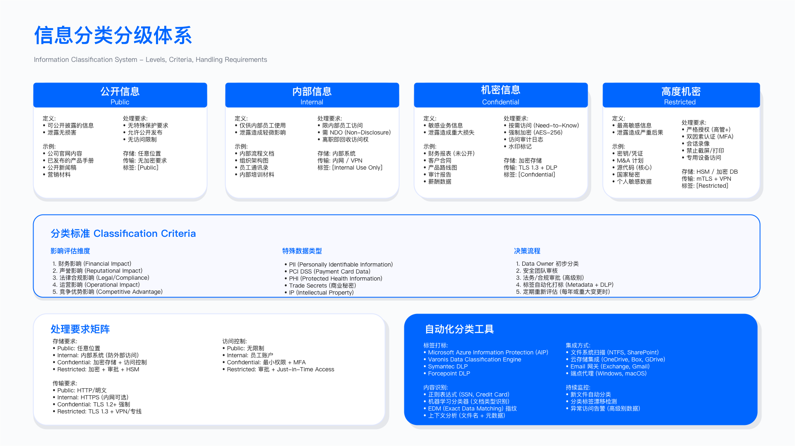

# 8.2　数据分类与标记

> 与第10章的分工：本节讲**分类引擎**——分级模型、正则与指纹、ML 分类器、标签落地的技术实现，它是全书所有数据侧控制共用的地基。用户侧的行为面（在 Office/Outlook 里手动打标签、打错标签的培训与合规审计、标签在衍生文档间的传播）见 10.1。


> 导读：分类分级是整个数据安全体系的元数据基础——后续所有加密策略、DLP 规则、访问控制的"靶心"，都取决于分类结果的准确性。本节重点在 8.2.2 的四种自动发现技术（正则/ML/指纹/血缘各有适用边界，组合使用才有效），以及 8.2.3 的自动标签引擎设计。数据资产清单 YAML 示例在 8.2.4，合规映射表在 8.2.5。

数据分类分级是数据安全治理的前提。未经分类的数据无法实施差异化保护，容易陷入"一刀切"误区——要么过度投资导致业务阻塞，要么保护不足埋下合规风险。本节阐述数据分类标准设计、敏感数据发现技术、自动化标记实施与数据资产清单管理。

---

## 8.2.1 数据分类标准设计

### 分类维度选择

分类标准的第一个设计决策，是"用什么维度给数据打分"。很多企业只按敏感度一个维度分类，结果把两类本质不同的问题混为一谈：一份可用性要求极高的核心业务库，泄露风险其实不高，但一旦不可用会直接中断业务；反过来，一份低频访问的历史归档，泄露后果严重却对运营影响微弱。用单一维度衡量，前者会被低估、后者会被错配保护资源。下表把四个正交的维度拆开，每个维度都直接对应一类可执行的决策输出，避免相互掩盖。

| 分类维度 | 评估标准 | 决策输出 |
|----------|----------|----------|
| 敏感度 | 泄露对隐私与安全的影响 | 是否包含 PII、商业机密、知识产权 |
| 业务影响 | 丢失或不可用对运营的影响 | RTO/RPO 要求、业务中断成本 |
| 合规性 | 是否受法规强制约束 | GDPR/PIPL/HIPAA/PCI DSS 适用性 |
| 恢复目标 | 数据恢复的紧急程度 | 备份频率、归档策略 |

这套分类标准的判定规则不是"逐条打分求平均"，而是"取最严约束"。同一份数据在敏感度维度可能只算中等，但只要合规性维度命中 PCI DSS，整体就被拉到强制加密的档位。设计分类标准时容易踩的坑，是把这四个维度压缩成一个综合分——加权平均会稀释掉强约束，让本该被合规红线锁定的数据滑到较低等级。

### 四级分类标准

企业为什么定四级而不是三级或六级？这是一个执行成本与表达能力之间的权衡。级数太少，无法在同一体系里同时表达"公开财报"和"支付卡数据"这种跨度极大的差异，只能靠额外的例外规则打补丁；级数太多，一线员工在打标时无法准确区分相邻两级（比如"较机密"和"机密"的边界模糊），标错率反而上升。四级是多数框架收敛出的平衡点。

基于 ISO/IEC 27001:2022 Annex A 的信息分类与标记控制项（A.5.12 信息分类、A.5.13 信息标记；2013 版对应的 A.8.2 编号已在 2022 版重排）[1] 与 NIST SP 800-60 Vol.1 Rev.1 的信息类型—影响级别映射方法[2]，推荐采用四级分类体系。超过五级会增加执行复杂度，低于三级则无法覆盖合规差异。下面四级从高到低排列，请注意观察一条隐含规律：控制强度并非线性递增，它在 Restricted 与 Confidential 之间陡然拉开——Restricted 引入了 DLP 强制阻断、双人审批、禁止跨境这些会直接影响业务流的硬控制，而 Confidential 及以下仍以监控告警为主。这条"硬控制分界线"划在哪里，是分类标准落地时最需要与业务反复磨合的地方。

#### Level 4: Restricted（限制级）

定义：最高敏感度，泄露将导致严重法律责任、财务损失或声誉损害。

数据示例：
- 支付卡主账号（PAN）、CVV、PIN 码
- 社保号、护照号、生物特征数据
- 未公开并购信息、董事会机密文件
- 源代码（核心业务逻辑）、密码 hash

强制控制（示例配置，需根据法规与业务调整）：
- 静态加密、传输加密、使用中加密（条件允许）
- MFA + 特权访问管理（PAM）
- DLP 强制阻断外发
- 完整审计日志（保留期限参考：PCI DSS v4.0.1 Req 10.5.1 要求审计日志至少保留 12 个月、其中最近 3 个月可立即检索[3]；GDPR 第 30 条只要求控制者/处理者维护处理活动记录并应监管机构要求提供，本身未规定具体保留年限，3 年是本书按常见诉讼时效给出的示例口径，非法规要求）
- 禁止跨境传输（除非通过审批流程与合规机制）

访问控制：双人审批 + 业务需要原则 + 定期权限复核（建议 ≤ 90 天）

Restricted 这一级的控制清单里，真正会引发业务摩擦的是"DLP 强制阻断"和"禁止跨境"——它们把安全从"事后追责"变成"事前拦截"，这也是下面三条常见误区的根源：把控制拉满是容易的，难的是精准地只对真正的 Restricted 数据拉满。

常见误区：
1. 将所有包含个人信息的数据均标为 Restricted，导致业务流程无法正常运行（如客服查询客户姓名被阻断）
2. 未区分"原始数据"与"脱敏数据"，脱敏后仍沿用原分类等级
3. 跨境传输审批流程未明确响应时限，紧急业务需求被阻塞

#### Level 3: Confidential（机密级）

定义：高敏感度，仅限内部授权人员访问，泄露将对企业造成显著负面影响。

数据示例：
- 员工薪资、绩效考核记录
- 客户联系方式（非支付信息）
- 未公开财务报表、产品路线图
- 商业合同、供应商协议

强制控制（示例配置）：
- 静态加密与传输加密
- RBAC 访问控制 + MFA
- DLP 监控与告警（不强制阻断，允许业务审批后放行）
- 审计日志保留（建议 ≥ 1 年，参考 SOX 404 要求）
- 跨境传输需隐私影响评估（DPIA）

访问控制：内部员工 + 业务需要 + 定期权限复核（建议 ≤ 180 天）

对比 Restricted 可以看清这一级的设计意图：加密仍然强制，但 DLP 从"阻断"退回"告警放行"，权限复核周期从 90 天放宽到 180 天。这是刻意为之——机密级数据的日常流转量远大于限制级，如果同样硬阻断，业务几乎无法运转。但退让也带来了下面的典型失效：告警若无人跟进、密钥若与数据同库，控制就退化为纸面上的存在。

这两个周期是**复核频率的下限，不是全量审阅战役的排期**。按 90 天跑一次覆盖全部权限的审阅，得到的通常是完成率接近满分、撤销率不足 2 个百分点的报表，这个组合读出来的信息是审阅没有真正发生，而这样一份报表还会被审计接受，反而制造虚假的安全感。可行的做法是把 Restricted 与 Confidential 数据的访问权限抽出来做**微认证**：由变更事件（转岗、项目结束、90 天无活动）与短周期共同触发，条目量小、每条附使用数据与风险标签，常态运行；覆盖全部权限的战役每年一次，用于产生合规证据并发现微认证的盲区。两种形态的目的、参数与失败形态见 [14.5](../../第05部分_身份网络与业务连续性/第14章_企业身份与访问管理/14.5_访问审阅与权限认证.md)。

常见误区：
1. DLP 策略仅设置"告警"无人处理，等同未部署
2. 加密密钥与加密数据存储在同一系统，未实现物理隔离
3. 跨境传输评估流于形式，未真实评估接收国政府访问风险（Schrems II 判决要求）

#### Level 2: Internal（内部级）

定义：内部使用数据，不对外公开，泄露影响有限。

数据示例：
- 内部流程文档、项目计划
- 非敏感业务数据、培训材料
- 内部邮件通讯（非机密内容）

强制控制（示例配置）：
- 传输加密（TLS 1.2+）
- 基础访问控制（AD/LDAP 认证）
- 定期审计抽查
- DLP 提示（用户教育，不阻断）

访问控制：所有内部员工

到内部级，加密已不再是静态强制项，DLP 也退到"提示"层——这一级的安全重心从"防泄露"转向"防篡改与防越权残留"，下面三条误区正是围绕这个重心：完整性、离职权限回收、云端访问日志，都是容易被"反正不算敏感"的心态忽略的盲区。

常见误区：
1. 忽略"内部数据"的完整性保护，未实现版本控制与变更审计
2. 未限制离职员工访问，权限回收滞后
3. 内部数据在公有云存储时未启用访问日志

#### Level 1: Public（公开级）

定义：可公开发布，无保密要求。

数据示例：
- 营销材料、产品白皮书
- 已发布财报、官网公开信息
- 公开新闻稿

强制控制（示例配置）：
- 完整性保护（防篡改，数字签名）
- 版本控制
- 发布审批流程

访问控制：无限制

公开级最容易被误解为"不需要任何控制"，但它的控制目标恰恰与其他三级相反——要防的是内容被篡改、被错误发布或无法召回，而非防止别人看到。数字签名和发布审批在这里用来保证"对外呈现的信息是权威且可控的"，与保密无关。这也是下面三条误区的共同主题。

常见误区：
1. 公开数据未进行完整性校验，被恶意篡改后未及时发现
2. 公开数据的撤回流程缺失，已发布错误信息无法召回
3. 未区分"计划公开"与"已公开"，导致预发布文件被提前泄露

### 个人数据的叠加分类

前面的四级体系是一套"通用坐标系"，但它无法单独回答隐私合规的问题：一个 IP 地址在通用体系里可能只算内部数据，可在 GDPR/PIPL 语境下它是准标识符，组合后能重识别自然人。因此隐私分类是叠加在通用分类之上的第二套标签，不做替换——同一份数据要同时携带"通用级别"和"隐私类别"两个维度。下表左侧是隐私法规视角的类别划分，右侧的"对应通用级别"正是把这套隐私坐标系映射回四级体系的桥梁。

针对个人数据，需叠加 GDPR/PIPL 分类规则。单一通用分类无法满足隐私合规要求。详细的隐私合规处理要求参见 [9.3 个人数据处理合规](../../第03部分_数据安全与隐私/第09章_隐私合规/9.3_个人数据处理合规.md)。

| 类别 | 定义 | 示例 | 对应通用级别 | 隐私分类映射 |
|------|------|------|--------------|-------------|
| 特殊类别个人数据<br>(GDPR Art.9 / PIPL Art.28) | 敏感个人信息 | 种族、政治观点、宗教信仰<br>健康数据、生物特征<br>性取向、基因数据<br>14 岁以下儿童数据 | Restricted | 敏感数据 |
| 一般个人数据（直接标识符） | 单独可识别自然人 | 姓名、身份证号、电话、邮箱<br>护照号、社保号 | Confidential | 直接标识符 |
| 一般个人数据（准标识符） | 组合后可识别 | IP 地址、设备 ID、cookie<br>地理位置、订单记录<br>邮编 + 年龄 + 性别 | Internal - Confidential | 准标识符 |
| 匿名化数据 | 不可逆去标识化 | 聚合统计数据<br>k-匿名化处理后数据集 | Internal 或 Public | 非个人数据 |

这张表里最需要警惕的是"准标识符"和"匿名化数据"两行。准标识符单看无害，但它对应的通用级别是一个区间（Internal - Confidential）而非固定值——这意味着分类必须结合"能否与其他数据关联"来判定，是自动化工具最容易出错的地方。而匿名化数据能否真正降到 Public，取决于去标识化是否不可逆，这不是打个标签就成立的断言，而需要下面的验证方法来实证。

验证方法：
- 委托第三方审计机构验证匿名化不可逆性（防止重识别攻击）
- 使用 k-匿名性、l-多样性、t-接近度等指标量化匿名化效果
- 定期测试是否可通过外部数据源关联还原身份

### 行业特定数据分类

通用四级加隐私叠加，仍不足以覆盖所有场景——不同行业受不同的强制监管框架约束，同一类数据在不同行业的"底线分类"会被法规直接钉死。下表的价值在于给出各行业的"分类下限"：无论企业内部如何评估，金融的持卡人数据、医疗的诊疗信息在对应监管下就必须是 Restricted，没有下调空间。"附加控制"一列则是通用四级之外、行业专属追加的要求。

| 行业 | 特定数据类型 | 监管要求 | 推荐分类 | 附加控制 |
|------|--------------|----------|----------|----------|
| 金融 | 信用卡号（PAN）、CVV、PIN | PCI DSS | Restricted | 强制分段存储、定期轮换密钥 |
| 医疗 | 电子健康记录、诊疗信息 | HIPAA PHI | Restricted | 最小必要披露、去标识化 |
| 电商 | 支付信息、交易记录、用户画像 | GDPR/CCPA/PIPL | Confidential - Restricted | 数据最小化、目的限制 |
| 制造 | 工业控制数据、CAD 图纸 | CMMC、ISO 27001 | Confidential | 供应链访问控制 |

真正的落地难点不在单一行业内，而在跨行业和跨组织的边界上——多元化集团、供应链协作场景下，两套按各自行业标准建立的分类体系相遇时会直接冲突，下面三条正是这类边界问题的集中体现。

行业分类的常见问题：
1. 多行业企业采用不同分类标准，导致跨部门数据共享冲突
2. 行业标准更新后未及时同步分类规则（如 PCI DSS v4.0.1 要求（v4.0 已于 2024-12-31 退役；51 项未来日期要求自 2025-03-31 起已强制））
3. 第三方供应商按自身行业标准分类，与企业标准不一致

---

## 8.2.2 敏感数据自动发现技术

有了分类标准，下一个问题是：面对企业里成百上千个数据源、PB 级的存量数据，靠人工逐个判定分类根本不可能。因此需要自动发现技术——但没有任何单一技术能覆盖全部场景。下面四种技术的分工，本质上是从四个不同角度回答"这份数据是什么"：正则看格式，ML 看语义，指纹看来源，血缘看流转。

四种技术各有不同的适用场景和局限性，生产环境中通常需要组合使用——正则匹配覆盖结构化已知格式，ML 分类处理非结构化内容，指纹匹配追踪已知敏感数据集的扩散，血缘分析自动继承上游分类。哪种技术主导取决于数据环境特征。

在展开四种技术之前，先看它们共同面对的现实约束。这些约束不是某一种技术的缺陷，而是所有扫描类方案都绕不开的物理限制——它们直接决定了"能不能全量扫、多久扫一次、扫得全不全"，也是选型时必须先想清楚的前提。

### 数据发现面临的约束

| 约束条件 | 技术影响 | 缓解措施 |
|----------|----------|----------|
| 扫描性能 | 全量扫描影响生产环境 | 非高峰时段扫描、采样扫描、增量扫描 |
| 数据规模 | PB 级数据扫描耗时数周 | 优先扫描高风险数据源、并行扫描 |
| 数据盲区 | 影子 IT、个人设备、第三方系统 | 网络流量分析、CASB 发现云服务 |
| 动态变化 | 每日新增数据未及时分类 | 持续发现模式、数据管道集成 |

这张表里"数据盲区"一行最容易被低估：前三行讲的都是"已知数据源扫不动"，而盲区讲的是"根本不知道数据源存在"——影子 IT 和第三方系统里的敏感数据，任何内部扫描器都触及不到。这也解释了为什么成熟方案要靠网络流量分析和 CASB 从旁路发现，而非只依赖对已知资产的扫描。

### 技术一：基于规则的模式匹配

为什么选这个方案：正则匹配是计算成本最低的发现方法，对结构化、格式固定的 PII（信用卡号、身份证号、SSN）检出率高，误报率可通过校验算法（如 Luhn）大幅降低。适合作为第一道过滤层。

关键设计权衡：正则表达式需要覆盖格式变体（带分隔符/不带分隔符/不同间距），过于宽松则误报高，过于严格则漏报多。Luhn 算法（模 10 校验）由 IBM 研究员 Hans Peter Luhn 提出并获美国专利 US 2,950,048[4]，现由 ISO/IEC 7812-1 规定为发卡行标识号与主账号（PAN）的校验位算法[5]——正因为它是卡号的强制构造规则，任意 16 位数字串通过 Luhn 的概率仅约 1/10，把它作为正则之后的第二层验证可以滤掉绝大部分巧合匹配（具体降幅取决于语料，本书不给出统一的误报率基准）。

```python
# 示例: 信用卡号检测 (Luhn 算法验证)
import re

def luhn_check(card_number):
    """Luhn 算法校验信用卡号有效性"""
    def digits_of(n):
        return [int(d) for d in str(n)]

    digits = digits_of(card_number.replace('-', '').replace(' ', ''))
    odd_digits = digits[-1::-2]
    even_digits = digits[-2::-2]
    checksum = sum(odd_digits)
    for d in even_digits:
        checksum += sum(digits_of(d*2))
    return checksum % 10 == 0

def detect_credit_card(text):
    """检测文本中的信用卡号"""
    # Visa: 4xxx-xxxx-xxxx-xxxx (16 位)
    # MasterCard: 5xxx-xxxx-xxxx-xxxx
    # Amex: 37xx-xxxxxx-xxxxx (15 位)

    patterns = [
        r'\b4[0-9]{3}[-\s]?[0-9]{4}[-\s]?[0-9]{4}[-\s]?[0-9]{4}\b',  # Visa
        r'\b5[1-5][0-9]{2}[-\s]?[0-9]{4}[-\s]?[0-9]{4}[-\s]?[0-9]{4}\b',  # MC
        r'\b3[47][0-9]{2}[-\s]?[0-9]{6}[-\s]?[0-9]{5}\b'  # Amex
    ]

    for pattern in patterns:
        matches = re.findall(pattern, text)
        for match in matches:
            if luhn_check(match):
                return True, "Credit Card Detected"
    return False, None

# 中国身份证号检测 (18 位，最后一位校验位)
def detect_china_id(text):
    """检测中国居民身份证号"""
    pattern = r'\b[1-9]\d{5}(18|19|20)\d{2}(0[1-9]|1[0-2])(0[1-9]|[12]\d|3[01])\d{3}[\dXx]\b'
    if re.search(pattern, text):
        return True, "China ID Card"
    return False, None
```

怎么读这段代码：`luhn_check` 是核心校验逻辑——从右向左，奇数位直接加，偶数位乘以 2 再各位相加，总和对 10 取模为 0 则有效。`detect_credit_card` 先用正则过滤格式，再通过 Luhn 排除格式匹配但数字无效的误报。身份证 18 位正则内嵌了年份范围（18/19/20）和月份范围约束，减少纯数字巧合匹配——需要说明的是，GB 11643-1999《公民身份号码》规定 18 位号码的第 18 位是按 ISO 7064:1983 MOD 11-2 计算的校验码[6]，因此中国身份证同样存在与 Luhn 等价的"精校"手段，生产实现应补上这一步而不是只靠正则。这里的双层结构——正则粗筛、算法精校——是模式匹配类检测的通用范式：正则负责"长得像"，校验算法负责"确实是"，两层缺一不可。

生产环境常见坑：
- 测试数据（如 4111-1111-1111-1111）也能通过 Luhn 校验，会产生误报——需结合上下文（如文件名含"test"、"demo"）排除
- 日志文件中的信用卡号通常已部分掩码（如 `****-****-****-1234`），正则无法匹配需要额外规则

常见检测模式库：信用卡号（PAN）、身份证号、护照号、SSN、银行账号、邮箱地址、电话号码、API 密钥、JWT Token、密码 hash

局限性：
1. 无法识别上下文语义（如"银行账号示例"与"真实银行账号"）
2. 格式变体难以覆盖（如信用卡号带空格、带短横线、无分隔符）
3. 非结构化数据检测效果差（PDF、图片中的文本）

上面的三条局限性是为了精确划定正则的适用边界，不为否定它：它擅长"格式固定、上下文无关"的检测，一旦需要理解语义或处理非结构化内容，就必须交棒给下一种技术。下面的验证方法和运行指标，则给出了如何量化正则检测质量、以及运维时该盯哪些数字的具体抓手。

验证方法：使用已知敏感数据样本测试检测规则准确率（true positive rate），计算误报率（false positive rate），目标建议 ≤ 10%；定期更新规则库（如新增支付渠道的卡号格式）。

运行指标：模式匹配命中率、规则更新频率（建议每季度复核）、误报率（需人工复核的比例）。

### 技术二：机器学习数据分类

为什么选这个方案：正则匹配对格式固定的 PII 有效，但无法识别"这封邮件讨论的是否是竞争对手收购计划"这类语义敏感内容。ML/NLP 模型通过理解上下文，能处理非结构化文档、邮件、代码注释中的敏感信息，是正则匹配的互补而非替代。

关键设计权衡：准确率和资源消耗是核心矛盾。BERT 类模型准确率高但推理慢（单条文本 50-200ms），适合异步批量扫描；轻量级模型（fastText、TF-IDF+SVM）推理快但准确率低，适合实时拦截场景。训练数据质量决定模型上限——缺乏中文标注数据时，需要人工标注或使用合成数据增强。

```python
# 示例: 使用 NLP 模型识别 PII
from transformers import pipeline

# 加载预训练的 NER (命名实体识别) 模型
classifier = pipeline("ner", model="dslim/bert-base-NER")

text = "我的名字是张三，手机号 13800138000，住在北京市朝阳区"

entities = classifier(text)
# 输出示例:
# [
#   {'entity': 'B-PER', 'word': '张三'},
#   {'entity': 'B-LOC', 'word': '北京市'},
#   {'entity': 'B-LOC', 'word': '朝阳区'}
# ]

# 识别到 PII: 姓名、地理位置
```

怎么读这段代码：`pipeline("ner")` 封装了分词→编码→分类的完整流程，输出的 `entity` 字段遵循 BIO 标注规范（B- 表示实体开始，I- 表示实体内部）。注意这里的模型是英文训练的 `bert-base-NER`，中文场景需替换为中文 NER 模型（如 `shibing624/bert4ner-base-chinese`）。这段示例代码只有几行，但它掩盖了 ML 方案真正的成本——不在调用侧，而在模型选型和训练数据准备上，这正是下面"关键设计权衡"和"局限性"反复强调的重点。

生产环境常见坑：
- 预训练模型的实体类别（PER/LOC/ORG）与业务敏感数据类别（信用卡/合同/内部文档）不完全对齐，通常需要fine-tuning
- 长文本需要截断（BERT 最大 512 tokens），文档中间的敏感信息可能被截断遗漏

可用的模型能力分三类，选型按能力类别走，不按具体产品和版本走：

- 小型判别式模型（编码器架构）：做命名实体识别这类结构化抽取。延迟毫秒级、可本地部署、单条推理成本接近于零，是全量扫描的主力。
- 通用大模型：做只有结合上下文才能判断的场景，例如同一串数字出现在合同里是金额、出现在客服记录里是账号，或者整份文档的密级判定。
- OCR 与视觉模型：从扫描件、截图、图纸中提取文本，提取结果再交给前两类做判定。

选型判据有三条：数据出境与驻留约束（受监管数据不能出域时，可私有化部署是硬前提，云端 API 再准也不在候选内）、单条推理成本、推理延迟（实时外发拦截管道要求毫秒级，离线批量扫描可放宽到秒级）。其中成本一条最容易被低估——数据分类打标是高频、低单价的任务，一次全量扫描动辄上亿条，用最贵的模型跑全量在成本上通常不成立。可行的结构是小模型跑全量、大模型只跑小模型判不了的灰区，与 17.4 中 SAST 告警分流的分层思路一致。具体模型和版本迭代很快，本书不点名，按上述三条判据在当期可选项里比一次即可。

局限性：
1. 需要大量标注数据训练模型（至少数千样本）
2. 模型推理成本高（GPU 资源消耗）
3. 模型可解释性差，难以向审计人员说明分类依据

第 3 条局限性——可解释性差——在合规场景下的分量往往超过前两条：正则可以把"命中了哪条规则"清楚地摆给审计人员看，而 ML 只能给出一个置信度分数，很难解释"为什么把这份文档判为机密"。这也是为什么许多企业即便部署了 ML，仍保留正则作为可审计的兜底层。下面的验证方法用 precision/recall 双指标而非单一准确率来评估，正是因为敏感数据检测里"漏报"和"误报"的代价并不对称。

验证方法：使用标注数据集验证模型准确率（precision）与召回率（recall），A/B 测试比较规则引擎与机器学习模型的检测效果；人工抽查机器学习分类结果，计算误判率。

运行指标：模型准确率（目标建议 ≥ 85%）、模型推理延迟（扫描 1GB 数据耗时）、模型再训练频率（数据分布变化后）。

### 技术三：指纹匹配

为什么选这个方案：正则和 ML 都是"特征匹配"——识别数据长什么样。指纹匹配解决另一个问题：追踪一份已知敏感数据集（如 500 万条客户记录导出文件）是否出现在不应该出现的地方。这对内部威胁检测和数据泄露溯源至关重要，是 DLP 精确数据匹配（EDM）的核心技术。

关键设计权衡：SHA-256 对整条记录做哈希，一旦数据有任何修改（加空格、改大小写）就失配。生产系统更常用 ssdeep（模糊哈希）或分块哈希——将文档切分为小块分别哈希，即使部分内容被修改也能检测到相似性。

```python
import hashlib

# 步骤 1: 对已知敏感数据 (如客户数据库) 生成指纹
sensitive_db = ["张三", "13800138000", "zhangsan@example.com"]
fingerprints = {hashlib.sha256(data.encode()).hexdigest() for data in sensitive_db}

# 步骤 2: 扫描文件系统，计算 hash 并比对
def scan_file(filepath):
    """扫描文件中的敏感数据指纹"""
    with open(filepath, 'r', encoding='utf-8') as f:
        content = f.read()
        tokens = content.split()  # 简化示例，实际需更复杂分词
        for token in tokens:
            token_hash = hashlib.sha256(token.encode()).hexdigest()
            if token_hash in fingerprints:
                return True, f"Sensitive data found: {token}"
    return False, None
```

怎么读这段代码：`fingerprints` 是一个 set，查找时间复杂度 O(1)，支持大规模指纹库的高效匹配。实际生产中指纹库可能包含数千万条记录，需要用 Bloom Filter 或数据库索引代替内存 set。`content.split()` 是简化处理——真实系统需要考虑 CSV 字段边界、换行符、引号等格式细节。它与前两种技术有一个根本区别：这里不做任何"这像不像敏感数据"的判断，只做"这个 hash 在不在已知指纹库里"的精确比对，所以它的准确性完全取决于指纹库是否与真实敏感数据保持同步——这正是它最强也最脆弱的地方。

生产环境常见坑：
- 指纹库必须与生产数据保持同步——若客户数据库每日更新，指纹库也需每日重新生成；滞后的指纹库会导致新增记录检测盲区
- 大型指纹库的内存占用：百万量级记录的 SHA-256 哈希集合可能消耗数百 MB 内存，需根据实际规模评估部署资源

局限性：
1. 数据轻微变化（如增加空格、大小写转换）导致 hash 失配
2. 指纹库维护成本高（数据更新需重新生成指纹）
3. 无法检测数据的派生形式（如聚合统计结果）

第 3 条局限性——无法检测派生形式——恰好是下一种技术（血缘分析）的用武之地：当一份 Restricted 客户表被聚合成统计报表后，内容变了、指纹也失配了，但敏感度并未消失，只有追踪数据流转的血缘分析才能捕捉到这种"改头换面"的传播。

验证方法：使用脱敏数据测试指纹库匹配效率（检索 1 亿条记录耗时）；测试 hash 碰撞率；验证指纹库更新延迟（生产数据变更后指纹同步时长）。

运行指标：指纹库覆盖率（已指纹化的敏感数据源占比）、匹配成功率（真实匹配 / 总匹配次数）、指纹库更新频率（建议每日增量更新）。

### 技术四：数据血缘分析

为什么选这个方案：前三种技术都是对数据内容的分析，血缘分析解决"上游数据已分类、下游派生数据自动继承"的问题。一张从 Confidential 客户表 ETL 出来的报表，内容上可能没有明显的 PII 特征，但它仍然继承了上游的敏感度。血缘分析可以自动发现这类分类缺失的下游资产。

关键设计权衡：血缘追踪的粒度是列级还是表级。表级血缘实现简单，但一张混合了 Restricted 和 Public 字段的表，整体标记为 Restricted 会产生过度保护。列级血缘精度高，但跨系统（数据库→ETL→对象存储→BI 工具）的列映射追踪极复杂，需要专用的数据目录工具（Apache Atlas、OpenLineage）。

```
CRM 生产库 (Confidential)
  ↓ ETL 任务
数据仓库事实表 (继承 Confidential)
  ↓ BI 查询
Excel 报表 (继承 Confidential)
  ↓ 邮件发送
告警: Confidential 数据通过邮件外发
```

这段流程里每一个箭头都代表一次数据流动，血缘系统需要在每个节点注册元数据并维护链路关系。整条链路上的分类标签是"向下继承"的——源头的 Confidential 一路传递到最末端的 Excel 报表，即便报表本身看不出敏感特征。最后一步"邮件发送"能触发 DLP 告警，依赖于 DLP 系统能读取血缘系统中的分类标签——这需要两个系统之间有 API 集成，而非人工同步。这个"跨系统 API 集成"是整条链路能否闭环的关键，也是下面"生产坑"里断链问题的对照面。

生产环境常见坑：
- 血缘断链是最常见问题：数据从数据库导出为 CSV，再手工上传到 SharePoint，这段"手工搬运"过程血缘系统无法自动追踪，产生盲区

局限性：血缘关系建立依赖数据平台的日志和 API 支持，无日志的遗留系统需要人工注册。

验证方法：人工验证血缘关系准确性（抽查 10% 数据流）；测试血缘断链检测（ETL 任务变更后血缘更新延迟）；验证跨系统血缘追踪能力（数据从数据库 → 对象存储 → SaaS）。

运行指标：血缘覆盖率（已建立血缘关系的数据资产占比）、血缘断链率（无法追溯上游的数据占比）、血缘更新延迟（ETL 变更后血缘刷新时长）。

### DSPM 平台选型考量

上面四种技术很少由企业从零自建，而是通过 DSPM（数据安全态势管理）平台集成落地。选型的难点在于：各家平台在四种技术上的能力并不均衡，且往往绑定特定的云生态。下表把主流平台的核心能力与关键约束并列——注意"关键约束"一列的价值往往高于"核心能力"，因为能力差异可以靠 PoC 补齐，而部署约束（如本地化、多云支持）一旦不匹配就是硬伤。

| 工具/平台 | 核心能力 | 适用场景 | 关键约束 |
|-----------|----------|----------|----------|
| BigID | 多云数据发现、ML 分类、GDPR 合规 | 大型企业、全球合规 | 本地化部署选项有限 |
| Varonis | 非结构化数据保护、权限分析 | 文件服务器密集型企业 | 云原生支持较弱 |
| Microsoft Purview | Azure/M365 原生集成、自动标签 | 微软生态重度用户 | 多云环境需额外连接器 |
| Securiti | 隐私 + 数据安全一体化 | 跨境电商、隐私优先 | 价格较高 |

下面四个决策点里，第 1 点（本地化部署）在受 PIPL 约束的场景下往往是一票否决项——若平台必须把数据传出境才能分类，它再强大也无法用于关键数据处理。这也解释了为什么选型不能只看功能对比表，必须落到 PoC 实测。

选型决策点：
1. 是否支持本地化部署（PIPL 关键数据处理要求）
2. 多云支持能力（AWS/Azure/GCP/阿里云）
3. 机器学习模型准确率（要求供应商提供 PoC 测试）
4. 与现有 DLP/SIEM/SOAR 集成能力

验证方法：要求供应商提供 PoC 环境，使用脱敏生产数据测试分类准确率；验证 DSPM 平台对本地化部署的支持程度（如数据是否出境）；测试与现有安全工具的集成能力（API 调用延迟、数据格式兼容性）。

---

## 8.2.3 数据标记与标签管理

发现只是识别出"这份数据是什么"，真正让分类结果产生保护效果的，是把分类信息作为标签固化到数据资产上，让下游的加密、DLP、访问控制系统能读取标签并自动执行相应控制。标签是分类与控制之间的传动带——分类结果如果不落成机器可读的标签，就永远停留在报告里，无法驱动任何实际的安全动作。

### 标签体系设计

标签不止"敏感度"一种。一份完整可治理的数据资产，需要同时回答"它有多敏感、归谁负责、受哪些法规约束、存在哪里、该留多久"。下表把这些问题拆成五类标签，每一类都配了独立的实施方式和验证方法——注意最后一列"验证方法"的存在本身就是设计要点：标签一旦打上就容易被默认"永远正确"，而实际上标签会随数据变化而失真，没有对应的验证手段，标签体系会逐渐腐化。

| 标签类型 | 用途 | 实施方式 | 验证方法 |
|----------|------|----------|----------|
| 分类标签 | 指示敏感度 | 数据库元数据、文件扩展属性 | 抽查标签与实际数据一致性 |
| 所有者标签 | 标识责任人 | RACI 矩阵、数据目录 | 验证所有者邮箱有效性 |
| 合规标签 | 关联法规 | 自动或手工标注 | 审计标签与法规适用性匹配 |
| 地理标签 | 数据驻留位置 | 基于存储位置自动打标 | 验证实际物理位置与标签一致 |
| 保留标签 | 保留期限 | ILM 策略自动化 | 测试到期自动删除是否触发 |

这五类标签里，"保留标签"和"地理标签"是最容易被自动化系统直接消费的——保留标签驱动 ILM 到期删除，地理标签驱动数据驻留合规检查。它们的验证方法都强调"实测触发"而非"核对记录"，因为这类标签一旦与实际行为脱节（如到期未删、标签写着本地实则出境），后果直接是合规违规。

### 技术实施方案

为什么需要多种实施方案：不同存储介质有不同的元数据机制。数据库有 COMMENT 和专用标签表，文件系统有 xattr，云对象存储有原生标签 API。统一的标签体系需要在各介质上实现，同时保持语义一致。关键是让 DLP 和加密系统能自动读取标签并触发相应控制——没有这个自动化连接，标签就只是信息展示，而非安全控制。

#### 方案一：数据库元数据标签

```sql
-- 使用 COMMENT 存储分类信息
COMMENT ON COLUMN customers.credit_card IS
  'Classification:Restricted;Compliance:PCI-DSS;Encryption:Required';

-- 或使用专门的标签表
CREATE TABLE data_classification_labels (
  table_name VARCHAR(100),
  column_name VARCHAR(100),
  classification VARCHAR(50),
  compliance_tags TEXT[],
  owner VARCHAR(100),
  last_reviewed DATE
);

INSERT INTO data_classification_labels VALUES
  ('customers', 'credit_card', 'Restricted', ARRAY['PCI-DSS'], 'Finance', '2025-01-01');
```

怎么读这段 SQL：两种方案各有取舍。COMMENT 方式简单，但字段是自由文本，难以程序化解析；专用标签表方式结构化，支持 JOIN 查询和自动化处理，但增加了数据库对象管理成本。`TEXT[]` 类型支持多个合规标签的数组存储，比逗号分隔字符串更易查询（支持 `@>` 操作符进行包含查询）。选哪种取决于下游怎么消费标签：若只是给人看，COMMENT 够用；若要让 DLP/加密系统程序化读取并自动触发控制，专用标签表几乎是必选，因为解析自由文本 COMMENT 既脆弱又难维护。

生产坑：当 DBA 用 `ALTER TABLE ... RENAME COLUMN` 重命名列时，标签表中的 `column_name` 不会自动更新——需要在 DDL 变更流程中加入标签同步步骤，否则标签失效但无人察觉。这是专用标签表方案的固有代价：它把标签从数据对象里"抽离"出来独立存储，换来了可查询性，也换来了与源对象脱钩的风险。

验证方法：定期扫描数据库 COMMENT 字段，检查标签完整性；验证标签格式一致性（如统一使用 `Key:Value` 格式）；测试标签是否可被 DLP/加密系统读取。

运行指标：标签覆盖率（已标记列 / 总列数）、标签准确率（人工抽查验证）、标签过期率（超过复核周期未更新的标签占比）。

#### 方案二：文件系统扩展属性

对于文件系统里的非结构化数据，没有数据库那样的元数据表，标签需要挂在文件本身上。Linux 的扩展属性（xattr）提供了这个机制——它把键值对直接附着在 inode 上，与文件内容分离但随文件一起管理。下面的命令展示了最基本的设置与读取。

```bash
# 设置标签
setfattr -n user.classification -v "Confidential" /path/to/file.xlsx
setfattr -n user.owner -v "HR-Department" /path/to/file.xlsx

# 读取标签
getfattr -d /path/to/file.xlsx
```

怎么读这段命令：`setfattr -n user.classification` 里的 `user.` 前缀是 xattr 的命名空间约定——普通用户只能操作 `user.*` 命名空间的属性，这决定了自定义分类标签必须放在这个前缀下。`getfattr -d` 的 `-d` 参数一次性 dump 出该文件所有扩展属性，是审计时快速核对标签的常用方式。这套机制的优雅之处在于标签跟着文件走，但它的脆弱性也正来自于此——一旦文件离开支持 xattr 的文件系统，标签就可能悄无声息地丢失。

验证方法：测试文件复制后标签是否保留；验证跨文件系统移动时标签是否丢失；检查不同操作系统对扩展属性的支持程度。

生产坑：xattr 在 Linux ext4/XFS 上正常工作，但通过 SMB/NFS 挂载的网络文件系统可能不支持或不同步 xattr，导致远程访问时标签丢失。这意味着 xattr 方案在纯 Linux 本地存储上可靠，一旦进入混合的企业文件共享环境（Windows 客户端、网络挂载盘），就不能把它当作唯一的标签载体，必须辅以数据目录做集中记录。

运行指标：标签持久性（文件操作后标签保留率）、标签同步延迟（设置标签到 DLP 系统读取的时长）。

#### 方案三：云存储对象标签

云对象存储（如 S3）提供了原生的标签 API，比 xattr 更适合大规模自动化——标签由存储服务统一管理，可直接被生命周期策略、访问控制策略消费。下面的代码展示两种典型用法：上传时即打标，以及对存量对象批量补标。

```python
import boto3

s3 = boto3.client('s3')

# 上传文件并打标签
s3.put_object(
    Bucket='my-bucket',
    Key='financial-report-2025.pdf',
    Body=file_content,
    Tagging='Classification=Confidential&Owner=Finance&Compliance=SOX'
)

# 批量扫描并打标签（示例：集成 DSPM 分类结果）
def auto_label_s3_objects(bucket, dspm_client):
    """自动为 S3 对象打标签"""
    objects = s3.list_objects_v2(Bucket=bucket)
    for obj in objects.get('Contents', []):
        # 调用 DSPM 分类接口 (需实际实现)
        classification = dspm_client.classify(
            bucket=bucket,
            key=obj['Key']
        )

        s3.put_object_tagging(
            Bucket=bucket,
            Key=obj['Key'],
            Tagging={'TagSet': [
                {'Key': 'Classification', 'Value': classification},
                {'Key': 'AutoLabeled', 'Value': 'true'},
                {'Key': 'LabeledDate', 'Value': '2025-10-21'}
            ]}
        )
```

怎么读这段代码：`put_object` 上传时直接附加标签是最佳实践——避免"已上传但未打标"的时间窗口。`auto_label_s3_objects` 是对存量对象的批量补标函数，`dspm_client.classify()` 是对外部 DSPM API 的调用占位，实际需要替换为真实 SDK 调用。这段代码把 8.2.2 的发现能力和标签落地串了起来：DSPM 负责判定分类，这段代码负责把判定结果写回对象标签，形成"发现→标记"的闭环。注意打标时额外写入了 `AutoLabeled=true`，这是一个刻意留下的审计线索——用来区分机器自动标注和人工确认的标签。S3 每个对象最多支持 10 个标签，标签键和值有 128/256 字符限制，设计标签 schema 时需考虑这些边界。

生产坑：S3 标签用于生命周期策略时，策略是异步生效的（最长 24 小时延迟），不能依赖标签实现实时访问控制——实时控制需结合 S3 Bucket Policy 和 IAM 条件表达式。这是标签的一个根本性质：它擅长驱动"最终一致"的治理动作（归档、删除、盘点），但不适合承担"即时拦截"的职责，实时访问控制必须由策略引擎在请求路径上同步判定。

验证方法：测试标签是否可用于生命周期策略（如自动归档）；验证标签变更是否触发 CloudTrail 审计日志；检查跨区域复制时标签是否同步。

### 自动化标签引擎

为什么要构建规则引擎而非简单 if/else：随着业务增长，分类规则会从 5 条增长到 50 条，且规则之间存在优先级和冲突关系。规则引擎将"分类逻辑"与"控制触发"解耦，使安全团队可以在不修改代码的情况下调整分类策略，同时保证每次分类决策都有可追溯的规则依据（重要的审计需求）。

```python
class AutoLabelEngine:
    """自动化数据标签引擎"""

    def __init__(self, dspm_client, policy_rules, kms_client, dlp_client, audit_client):
        self.dspm = dspm_client
        self.rules = policy_rules
        # 下游控制系统客户端，供 trigger_controls 调用（加密/阻断/审计）
        self.kms = kms_client
        self.dlp = dlp_client
        self.audit = audit_client

    def apply_rules(self, features):
        """应用分类规则（优先级从高到低，首次匹配即返回）"""
        # 规则 1: 检测到信用卡号 → Restricted
        if 'credit_card' in features.get('detected_patterns', []):
            return 'Restricted'

        # 规则 2: PII + 健康数据 → Restricted
        if 'pii' in features and 'health_data' in features:
            return 'Restricted'

        # 规则 3: PII 但无特殊类别 → Confidential
        if 'pii' in features:
            return 'Confidential'

        # 规则 4: 内部使用无敏感信息 → Internal
        if features.get('access_scope') == 'internal':
            return 'Internal'

        return 'Public'

    def trigger_controls(self, asset, classification):
        """触发下游安全控制"""
        if classification == 'Restricted':
            self.kms.encrypt(asset)
            self.dlp.block_external_share(asset)
            self.audit.enable_full_logging(asset)
        elif classification == 'Confidential':
            self.kms.encrypt(asset)
            self.dlp.monitor(asset)
```

怎么读这段代码：这个引擎清晰地分成两半，恰好对应 8.2.1 的分类标准和各级控制。`apply_rules` 采用"首次匹配返回"策略，规则按优先级从高到低排列——信用卡号检测是最高优先级，一旦命中直接返回 Restricted，不继续评估其他规则；这个顺序不能随意打乱，若把"PII → Confidential"排在"信用卡 → Restricted"之前，含卡号的数据会被误降级。`features` 字典是 DSPM 扫描结果的标准化表示，由上游各检测技术（正则/ML/指纹）输出并合并——这就是为什么四种发现技术需要统一到一个 features 结构里。`trigger_controls` 是副作用函数，它把分类结果翻译成 8.2.1 中 Restricted/Confidential 各自的强制控制清单（加密、阻断、审计），调用外部系统（KMS/DLP/审计）——这些调用应该是幂等的，支持重试。

生产坑：自动标签引擎上线初期应运行在"建议模式"（只记录分类建议，不实际触发控制），人工审核 2-4 周后确认准确率可接受，再切换到"执行模式"。过早切换执行模式可能导致大量数据被误分类并触发不必要的加密或访问阻断。这个"先建议后执行"的灰度节奏，本质上是给 `trigger_controls` 的副作用加了一道人工闸门——因为一旦切到执行模式，误判就不再是报表上的数字，而是真实的业务阻断。

常见误区：
1. 自动标签未建立人工复核机制，误标数据直接触发错误控制
2. 标签规则与 DLP 策略不一致，导致控制失效
3. 标签变更未记录审计日志，无法追溯分类决策依据

---

## 8.2.4　数据资产发现与清单管理

分类分级的前提是"知道自己有什么"。这一节把两件事合在一起讲：**怎么把资产找出来**（发现），以及**怎么让找出来的东西保持准确**（清单）。两者分开做是资产治理失效最常见的形态——发现做成一次性项目，清单建完无人核验，半年后没人再信它。

### 为什么资产总是不全

信息保护的前提是"知道要保护什么"。资产识别不完整是信息泄露的主要根因之一。多数组织存在以下盲区：结构化数据集中于已知数据库，但非结构化数据散落于文件共享、协作平台、员工端点；云端数据因 SaaS 快速采购而缺乏统一视图；知识产权（源代码、设计文档、算法模型）往往游离于传统数据治理体系之外。

### 资产发现的维度与方法

资产发现应覆盖四类数据源。结构化数据包括关系型与非关系型数据库、数据仓库、CRM/ERP/HR 等业务系统，可通过数据库扫描器、API 连接器、ETL 工具元数据获取。非结构化数据涵盖文件共享平台、邮件系统、协作工具、本地文件服务器与员工端点，需借助内容发现工具、文件爬虫与 eDiscovery 工具。云端数据包括对象存储、SaaS 应用、云数据库与云原生服务，依赖 CASB 与 CSPM 工具。知识产权资产涉及源代码仓库、设计文件、专利文档、研发笔记与算法模型，需结合 Git 扫描器、专利管理系统与模型注册表。


*图 8.7：信息资产分类与发现——结构化、非结构化、云端、知识产权四类数据源及其对应发现手段*

前面的发现与标记解决了单份数据的分类问题，但企业需要一个全局视图来回答"我到底有哪些数据资产、每个的分类和风险如何"。数据资产清单就是这个中央账本——它把散落在各系统的分类结果、所有权、合规标签、风险评分汇总成可治理、可审计的记录。没有这份清单，分类工作就是无数个孤立的局部动作，无法支撑管理层的资源分配和合规问责。

### 数据资产清单要素

下表列出一条完整资产记录应包含的要素。这些要素可分成三组来理解：身份类（标识、类型、位置）回答"这是什么、在哪里"；责任类（所有者、保管人）回答"归谁管"——注意所有者和保管人被刻意分开，前者是业务上对数据负责的人，后者是技术上运维数据的人，两者混同是治理失效的常见起点；风控类（分类、合规标签、敏感字段、风险评分）回答"有多危险、该管到什么程度"。每个要素都配了独立的验证方法，因为清单最大的敌人是"填了但不准"——一份无人核验的清单很快就会与现实脱节。

| 要素 | 说明 | 验证方法 |
|------|------|----------|
| 资产标识 | 全局唯一 ID | 检查 ID 冲突与命名规范 |
| 资产类型 | 数据库/文件/API/流数据 | 验证类型与实际技术栈一致 |
| 位置 | 物理/逻辑位置 | 核对实际部署位置 |
| 所有者 | 数据所有者 | 确认所有者邮箱有效 |
| 保管人 | 技术负责人 | 验证保管人职责认知 |
| 分类 | 敏感度分类 | 抽查分类与数据内容一致性 |
| 合规标签 | 关联法规 | 审计法规适用性 |
| 敏感列/字段 | 包含敏感信息的字段 | 扫描验证敏感字段完整性 |
| 访问模式 | 访问频率/用户数 | 与实际日志比对 |
| 保留期限 | 数据保留策略 | 测试到期自动删除 |
| 风险评分 | DSPM 计算的风险分数 | 验证评分算法合理性 |

### 数据资产清单示例

下面的 YAML 展示了一个完整的数据资产记录格式。`risk_score` 字段由 DSPM 平台自动计算，`sensitivity`（90）反映数据包含支付卡信息，`exposure`（75）反映网络可达性，`compliance_gap`（20）表示仍有整改项未完成。`remediation` 列表驱动安全团队的工作优先级，比单纯的风险分数更具可操作性。

```yaml
# data_inventory.yaml
assets:
  - id: asset-db-crm-prod-001
    name: "CRM Production Database - Customers Table"
    type: PostgreSQL
    location:
      cloud: AWS
      region: us-east-1
      vpc: vpc-prod-001
      endpoint: crm-db.abc123.us-east-1.rds.amazonaws.com

    owner:
      name: "Sales VP"
      email: "sales-vp@company.com"
      department: "Sales"

    custodian:
      team: "Database Administration"
      email: "dba-team@company.com"

    classification: Confidential
    compliance_tags:
      - GDPR
      - PIPL
      - CCPA

    sensitive_columns:
      - column: email
        type: Email Address
        classification: Confidential
        masked: true
      - column: phone
        type: Phone Number
        classification: Confidential
        masked: true
      - column: credit_card
        type: Payment Card
        classification: Restricted
        encrypted: true
        pci_dss: true

    access_control:
      authentication: MFA
      authorization: RBAC
      privileged_access: PAM

    data_volume:
      rows: 5000000
      size_gb: 50
      growth_rate: "10% per month"

    retention_policy:
      duration: "7 years"
      regulation: "SOX, GLBA"
      delete_date: "2032-12-31"

    last_reviewed: "2025-09-01"
    next_review: "2026-03-01"

    risk_score:
      overall: 85
      sensitivity: 90
      exposure: 75
      compliance_gap: 20

    remediation:
      - action: "Enable column-level encryption for credit_card"
        priority: High
        due_date: "2025-11-30"
        assigned_to: "Security Engineering"
```

这条记录最值得注意的设计，是表级分类与列级分类的并存。整表 `classification` 是 Confidential，但 `sensitive_columns` 里的 `credit_card` 单独标为 Restricted——这正是 8.2.2 讨论过的列级血缘精度问题的具象化：如果只按整表标记，含卡号的字段会被 Confidential 级控制覆盖，达不到 PCI DSS 要求的加密强度。因此列级的 `encrypted: true` 和 `pci_dss: true` 是必须的补充。另一处关键是 `risk_score` 的分解结构——它不给一个孤立的 85 分，而是拆成敏感度、暴露面、合规缺口三个可归因的子分，这样安全团队看到高分时能立即知道"该修哪一块"，而 `remediation` 列表把这个判断进一步落成带负责人和截止日期的具体动作。这份 YAML 的价值不在于字段多，而在于它让风险从一个抽象分数变成了可执行的整改清单。

### 数据资产清单维护流程

清单建起来只是开始，真正的挑战是让它持续反映现实——数据每天在增删、权限每天在变动、合规要求每年在更新。因此维护不是一次性任务，而是一组不同频率、不同责任方的常态化活动。下表按频率组织这些活动，请注意频率的设定逻辑：变化越快、风险越高的对象，检查频率越高——增量发现是每日（因为新增数据随时可能是敏感的），权限审计是季度（过期权限是横向移动的温床），而合规对账是年度（法规变更周期较长）。每项活动都配了可量化的验收标准，避免维护流于"走过场"。

| 维护活动 | 频率 | 负责方 | 验收标准 |
|----------|------|--------|----------|
| 全量扫描 | 季度 | DSPM 平台 | 新增资产检出率 ≥ 95% |
| 增量发现 | 每日 | DSPM 平台 | 发现延迟 ≤ 24 小时 |
| 分类审查 | 半年度 | 数据所有者 | 审查完成率 ≥ 95% |
| 权限审计 | 季度 | IAM/Security | 过期权限清理率 100% |
| 合规对账 | 年度 | GRC/Privacy | 合规缺口整改完成率 ≥ 90% |

表中"分类审查"由数据所有者负责，这也是整个流程里最容易失效的一环——业务方往往把审查当作签字形式，而非真正重新评估数据敏感度。下面三条常见失败原因，本质上都指向同一个根因：维护活动有流程、有验收标准，却缺乏让责任方真正投入的动力。

常见失败原因：
1. 数据所有者未真实参与审查，仅形式化签字
2. 增量发现延迟过高，新增敏感数据未及时纳入保护
3. 权限审计发现问题但未跟进整改

---

### 资产风险优先级排序

资产优先级应基于风险评分确定。评分因素包括：敏感度（公开/内部/机密/高度机密对应不同分值）、业务影响（低/中/高/关键）、已有保护措施（加密、DLP、访问控制可降低风险分）、合规要求（涉及 GDPR/PIPL/PCI DSS 等法规的资产增加分值）、访问范围（授权用户数超过阈值增加风险）。根据综合评分将资产划分为 P0（关键）、P1（高）、P2（中）、P3（低）四个优先级，指导保护措施的实施顺序。


### 适用边界与关键约束

资产发现适用于已建立基础 IT 资产管理的组织。对于大规模分布式环境（跨多地域、多云、多业务单元），需分阶段推进，首轮聚焦前 100 个高价值资产。

几个常被低估的约束：数据发现工具的扫描性能对生产环境有影响，需设计非高峰时段扫描策略；非结构化数据的分类准确率受训练数据质量影响；云端影子 IT 难以通过传统扫描发现，CASB 是必要补充而非可选项。

### 常见误区

一次性盘点思维是最常见的问题：将资产发现视为一次性项目而非持续运营活动，忽略数据生命周期中的动态变化——新系统上线、数据迁移、用户行为变化都会产生新资产或改变已知资产的属性。

技术工具依赖同样值得警惕：过度依赖自动化工具而忽视业务部门访谈，导致工具扫描覆盖但业务语义缺失，无法准确判断资产的业务关键性。一个数据库扫描器能发现表，但无法告诉你"这张表里的数据如果泄露，会让销售总监丢饭碗"。

此外，资产清单往往集中于服务端，遗漏端点数据——员工笔记本、移动设备上的敏感数据副本，是高频泄露路径却常被忽视。

> 本节由原第10章 10.1.1（信息资产识别与盘点）与本章原 8.2.5（数据资产清单管理）合并而成。两处原本各写了一份"资产记录应包含哪些字段"，此处只保留带验证方法的那一份。

## 8.2.5 数据分类治理与合规

技术能发现和标记数据，但决定"某类数据到底该定几级""业务嫌分类过高时听谁的"这些问题，靠的是治理机制而非工具。分类治理要解决的核心矛盾，是安全诉求与业务效率的持续拉扯——没有清晰的决策权分配和争议裁决路径，分类标准要么被业务架空，要么僵化到阻碍运营。下面的三层架构，正是把这个矛盾拆解到不同层级来消化。

### 分类治理架构

这套架构按"决策—执行—落地"三层划分，权责逐层下沉：决策层管标准和裁决，执行层管规则和运营，落地层管具体数据的确认。请注意这不是简单的上下级汇报关系，而是刻意的权责分离——制定规则的（执行层）不是最终确认数据分类的（落地层），最终确认的（数据所有者）也不是裁决争议的（决策层）。这种分离让分类决策形成制衡，避免任何单一角色既当运动员又当裁判员。

决策层：安全风险管理委员会（GRC 主导）
- 审批分类标准变更
- 裁决分类争议
- 监督分类 KPI

执行层：数据分类工作组
- 制定分类规则
- 运营 DSPM 平台
- 培训数据所有者
- 处理分类申诉

落地层：数据所有者
- 确认数据分类
- 审批访问申请
- 定期分类审查

### 分类争议处理

治理架构建好后，最考验其有效性的就是争议处理——业务几乎必然会觉得某些数据"分得太高、卡了流程"。关键是给争议一条结构化的出口，而非压制争议：把主观的"我觉得太严了"转化为客观的风险量化评估，再由决策层依据评估结果裁决。下表按争议类型给出三条差异化路径，每条都以一个可量化的验收标准收口，防止争议悬而不决。

| 争议场景 | 处理路径 | 验收标准 |
|----------|----------|----------|
| 业务认为分类过高 | 风险量化评估 → GRC 决策 → 补偿控制 + 时限 | 决策周期 ≤ 10 工作日 |
| 技术实施困难 | 技术优化方案 → 分阶段实施 → 临时例外（≤ 6 个月） | 例外到期自动复审 |
| 跨境场景冲突 | 跨境影响评估 → 脱敏传输 → 合规机制（SCC/BCR） | 合规机制签署完成 |

三条路径有一个共同设计：走的都是"评估 → 附条件放行"，而非简单的"批准/驳回"。业务觉得分类过高，不直接下调，而是通过补偿控制在降低摩擦的同时保住安全底线；技术难以实施，不无限期豁免，而是给一个带自动复审的临时例外。这种"附条件"思路在下面的例外申请流程里体现得最完整——例外不是终点，"到期自动触发复审"才是让例外不至于沦为永久后门的关键闸门。

例外申请流程：
```
业务提出例外申请
  ↓
数据分类工作组初审
  ↓
风险量化评估（FAIR）
  ↓
GRC 审批（补偿控制 + 时限）
  ↓
记录例外
  ↓
到期自动触发复审
```

这条链路的设计重心全在末端两步。"记录例外"确保每个偏离标准的决定都留痕可审计，"到期自动触发复审"则用自动化机制堵死"临时例外变永久豁免"这个治理黑洞——如果复审依赖人工记得去做，例外几乎必然会被遗忘。中段的"风险量化评估（FAIR）"是把业务的主观诉求转成客观依据的环节，它让 GRC 的审批建立在可比较的风险数值上，而不是拍脑袋。

验证方法：审计例外申请是否包含风险评估报告；检查例外到期是否自动触发复审；验证补偿控制是否实际部署。

### 数据分类合规映射

治理和争议处理是内部机制，而合规映射则是把内部分类体系与外部法规强制要求对齐的"接口表"。它的作用是双向的：一方面告诉安全团队"哪条法规要求什么级别的保护"，另一方面在审计时提供"我们的分类如何满足法规"的举证依据。下表把四部主要法规逐一映射到具体的分类要求、对应控制和验证方法——注意最后一列"验证方法"往往指向外部审计（QSA、第三方），因为合规的成立与否最终不由企业自证，而需第三方背书。

| 法规 | 数据分类要求 | 对应控制 | 验证方法 |
|------|--------------|----------|----------|
| GDPR Art.32 | 数据按风险分类保护 | Restricted/Confidential 需加密 + 访问控制 | 审计加密覆盖率 |
| PIPL Art.51 | 个人信息分类分级保护 | 敏感个人信息 → Restricted | 验证儿童数据单独同意 |
| PCI DSS Req 3 | 持卡人数据保护 | PAN/CVV → Restricted，强制加密 | 委托 QSA 审计 |
| HIPAA | PHI 保护 | 电子健康记录 → Restricted | 验证访问日志保留 3 年 |

这张表是把 8.2.1 的分类等级"反向锚定"到法规的关键——它验证了四级体系能逐条对应到 GDPR、PIPL、PCI DSS、HIPAA 的强制要求，不是拍脑袋的产物。当审计人员问"你们为什么把持卡人数据定为 Restricted"，答案是"PCI DSS Req 3 要求如此"，而非"我们觉得它敏感"——这正是合规映射表存在的意义。

---

## 8.2.6 数据分类运行指标

治理和控制是否真正落地，最终要靠可度量的指标来验证——否则"我们做了分类"永远只是一句无法证伪的声明。下表定义了覆盖分类全生命周期的核心指标，它们回答的问题各不相同：覆盖率回答"扫全了没"，准确率回答"分对了没"，及时率回答"审查跟上了没"，高风险资产数和盲区发现率则回答"风险在收敛还是扩大"。请特别注意"触发条件"一列——每个指标都绑定了一个明确的行动阈值，这让指标从"仪表盘上的数字"变成"驱动响应的信号"，是指标体系能真正闭环的前提。

关于"自动分类准确率"有一条必须配套的纪律：**它是趋势指标，单独用它做发布门禁会漏掉最贵的那类退化。** 真实样本集里 Internal 与 Public 通常占八九成，Restricted 只占百分之几，混在一起算，Restricted 的召回从 0.95 掉到 0.75 也只让总准确率动一个百分点。所以表里补了"分级召回下限"这一行，评测必须按分级分层做、每级单独设门槛，且两端要求刻意不对称——Restricted 卡召回（宁可多报），Internal/Public 卡精确率（多报会把人工复核队列淹掉）。各级的具体下限取值、漏标代价权重与可直接运行的回归评测脚本见 [17.6 AI for DataSec](../../第06部分_AI驱动的安全创新/第17章_AI驱动网络安全/17.6_AIforDataSec_AI数据安全.md)。

| 指标 | 计算方法 | 目标值（示例） | 触发条件 |
|------|----------|----------------|----------|
| 数据资产覆盖率 | 已分类资产 ÷ 总资产 | ≥ 95% | < 90% 触发告警 |
| 自动分类准确率 | 机器学习正确分类 ÷ 人工验证样本 | ≥ 90% | < 85% 需重新训练模型 |
| 分级召回下限 | 各分级单独统计的召回率 | Restricted ≥ 98% | 任一分级跌破下限即拦截发布 |
| 分类审查及时率 | 按期完成审查 ÷ 计划审查 | ≥ 95% | < 90% 上报管理层 |
| 高风险资产数 | risk score ≥ 80 的资产数 | 环比下降 | 环比上升触发复盘 |
| 分类争议解决时长 | 争议提出到 GRC 决策的平均时长 | ≤ 10 工作日 | > 15 工作日升级 |
| 数据盲区发现率 | 新发现未分类资产 ÷ 总资产 | ≤ 5%（每季度） | > 10% 需扩大扫描范围 |

这几个指标里，"覆盖率"和"准确率"必须成对看——这是下面第一条常见误区的核心：覆盖率再高，如果准确率不达标，只是把大量数据错误地分了类，反而制造出"已保护"的虚假安全感。而"数据盲区发现率"是个反直觉的指标：它的目标值虽低，但持续维持在低位反而可能是坏信号（意味着扫描范围本身就没覆盖到盲区），因此它需要和覆盖率交叉验证才有意义。指标之所以能发挥预警作用，前提是阈值设得足够敏感——这正是第三条误区警示的：阈值过宽松的指标，等于没有指标。

指标采集来源：
- DSPM 平台：覆盖率、准确率、风险评分
- data governance 系统：审查及时率
- GRC 系统：争议解决时长

常见误区：
1. 仅关注覆盖率指标，忽略准确率导致误分类
2. 指标未与绩效挂钩，数据所有者缺乏审查动力
3. 指标阈值设置过宽松，失去预警作用

---


*图：数据安全框架概览，展示分类分级在数据安全体系中的基础地位*

---

## 参考文献

| # | 来源 | 标题 | 日期 | 链接 |
| --- | --- | --- | --- | --- |
| [1] | ISO | ISO/IEC 27001:2022 Annex A（A.5.12 信息分类、A.5.13 信息标记） | 2022-10 | <https://www.iso.org/standard/27001> |
| [2] | NIST | SP 800-60 Vol. 1 Rev. 1, Guide for Mapping Types of Information and Information Systems to Security Categories | 2008-08 | <https://doi.org/10.6028/NIST.SP.800-60v1r1> |
| [3] | PCI Security Standards Council | PCI DSS v4.0.1, Requirement 10.5.1（审计日志保留 12 个月） | 2024-06 | <https://www.pcisecuritystandards.org/document_library/> |
| [4] | USPTO / Google Patents | H. P. Luhn, "Computer for Verifying Numbers", US Patent 2,950,048 | 申请 1954-01-06 / 授权 1960-08-23 | <https://patents.google.com/patent/US2950048A/en> |
| [5] | ISO | ISO/IEC 7812-1:2017 Identification cards — Identification of issuers — Part 1: Numbering system | 2017-01 | <https://www.iso.org/standard/70484.html> |
| [6] | 中华人民共和国国家标准 | GB 11643-1999《公民身份号码》（18 位号码校验码采用 ISO 7064:1983 MOD 11-2） | 1999-01-19 发布 / 1999-07-01 实施 | <https://openstd.samr.gov.cn/bzgk/gb/newGbInfo?hcno=080D6FBF2BB468F9007657F26D60013E> |

---

## 导航

[← 上一节：8.1 数据安全战略](./8.1_数据安全战略.md) | [返回章节目录](./README.md) | [下一节：8.3 数据生命周期安全 →](./8.3_数据生命周期安全.md)

---

© 2025-2026 AISecOps Project. Licensed under CC BY-NC-SA 4.0
