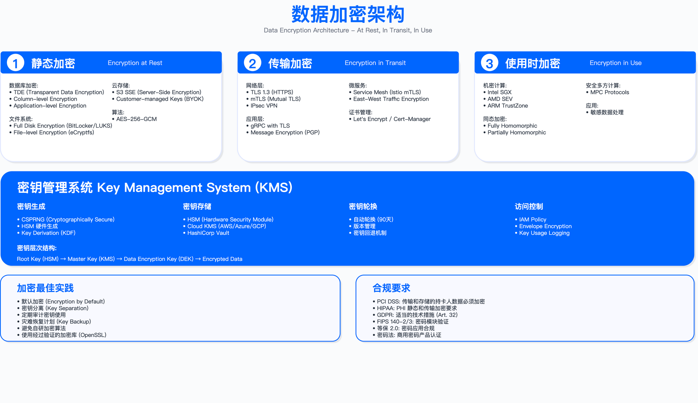

# 8.4　数据加密体系

## Data Encryption System

> 导读：加密是数据保护最后的技术屏障——访问控制失效、网络边界被突破后，加密决定数据是否仍然保密。本节按三层防护顺序展开：8.4.2 静态加密（数据在磁盘上），8.4.3 传输加密（数据在网络中），8.4.4 使用中加密（数据在计算时），8.4.5 将三者的密钥汇总到密钥管理体系。每层都有代码示例和具体的选型理由。若你正在评估云环境的加密方案，从 8.4.2 的 S3EncryptionManager 和 8.4.5 的 EnvelopeEncryption 读起。

加密是数据保护的核心技术控制，在访问控制失效、网络边界被突破的场景下仍能保障数据机密性。本节阐述静态加密、传输加密、使用中加密的技术实现，以及密钥管理体系的设计与运行要求。

---

## 8.4.1 加密体系架构

### 三层加密防护模型

企业数据加密需覆盖数据在传输、存储、计算三个状态下的保护需求。三层防护模型将加密控制嵌入数据流动的不同阶段，避免单点防护失效导致数据暴露。之所以要按"状态"而非"位置"划分，是因为同一份数据在生命周期中会反复切换状态——它在网络上流动、落到磁盘、又被读进内存参与计算，任何一个状态缺了加密都会成为攻击者的突破口。下面这张模型图正是把这三种状态与各自的目标、技术、威胁一一对应，方便按状态逐项自查。



图 8.2：数据加密架构 - 传输加密、静态加密、使用中加密三层防护体系

```
┌──────────────────────────────────────────────────────────┐
│ 企业数据加密三层防护模型                                  │
│ (Data Encryption Defense-in-Depth Model)                 │
├──────────────────────────────────────────────────────────┤
│                                                            │
│ [第一层] 传输加密 (Encryption in Transit)                │
│ ├─ 目标：保护数据在网络传输过程中不被窃听/篡改          │
│ ├─ 技术：TLS 1.3、mTLS、IPSec VPN、WireGuard            │
│ ├─ 适用：HTTPS、API 调用、数据库连接、跨区域同步        │
│ └─ 威胁：中间人攻击 (MITM)、网络监听、流量劫持          │
│                                                            │
│ [第二层] 静态加密 (Encryption at Rest)                   │
│ ├─ 目标：保护存储介质上的数据(磁盘、备份、归档)        │
│ ├─ 技术：AES-256、database TDE、文件系统加密、云加密   │
│ ├─ 适用：数据库、文件存储、对象存储、备份、日志        │
│ └─ 威胁：存储介质盗窃、备份泄露、云存储错误配置        │
│                                                            │
│ [第三层] 使用中加密 (Encryption in Use)                  │
│ ├─ 目标：在数据处理/计算过程中保持加密状态              │
│ ├─ 技术：同态加密 (HE)、安全多方计算 (MPC)、可信执行环境│
│ ├─ 适用：云 AI 训练、多方数据协作、敏感数据分析          │
│ └─ 威胁：内存 dump、进程劫持、恶意管理员                │
│                                                            │
│ [核心支撑] 密钥管理 (Key Management)                      │
│ ├─ KMS：密钥生成、存储、轮换、销毁                      │
│ ├─ HSM：硬件安全模块，防物理攻击                        │
│ ├─ 密钥层级：根密钥 (KEK) → 数据密钥 (DEK)               │
│ └─ 访问控制：RBAC + 审计 + 双人管理                     │
│                                                            │
└──────────────────────────────────────────────────────────┘
```

三层之上还托着一个"核心支撑"——密钥管理。三层加密的强度最终都归结到密钥能否被妥善生成、存储、轮换、销毁，密钥一旦泄露，再强的算法也失去意义。图中把 KEK→DEK 的密钥层级、HSM 的物理防护、双人管理的访问控制单独列出，正是说明加密方案的重心往往不在"选哪种算法"，而在"密钥怎么管"。

### 加密决策矩阵

上面的模型回答了"有哪几层防护"，但落到具体系统还要回答"这份数据到底需要哪几层、每层用多强"。这不该凭感觉决定，而应由数据分类等级驱动——分类越高，加密要求越严、密钥轮换越频繁。下面这张决策矩阵就是把"数据分类"这个输入映射到四类加密决策的查询表，供架构评审时逐行对照。表中给出的是典型配置，实际部署需结合业务延迟容忍度与合规要求调整。

| 数据分类     | 静态加密                   | 传输加密                   | 使用中加密               | 密钥管理              |
| ------------ | -------------------------- | -------------------------- | ------------------------ | --------------------- |
| Restricted   | 必需 AES-256               | 必需 TLS 1.3 + mTLS        | 推荐 同态加密/TEE        | HSM 90 天轮换         |
| Confidential | 必需 AES-256               | 必需 TLS 1.2+              | 通常不需要               | KMS 180 天轮换        |
| Internal     | 推荐 AES-256               | 必需 TLS 1.2+              | 不需要                   | KMS 年度轮换          |
| Public       | 不需要（完整性保护）       | 推荐 TLS 1.2+              | 不需要                   | -                     |

表的纵向从上往下是"要求递减"的过程，横向从左往右对应数据从"静止—流动—计算"再到"密钥托底"的四个决策维度。有两条设计取舍值得留意。其一，只有 Restricted 级别才把"使用中加密"从"通常不需要"提升为"推荐"——因为同态加密、TEE 这类使用中加密开销大（见 8.4.4），只在数据连内存明文都不能暴露的极端场景才值得付出代价，对多数数据是过度设计。其二，密钥管理一列随分类升级从"KMS 年度轮换"逐步收紧到"HSM 90 天轮换"——轮换越频繁，单把密钥被泄露后可用的时间窗越短，但轮换本身有成本（下方"约束条件"中的密钥轮换停机即由此而来），所以不是越短越好，而是与数据敏感度匹配。Public 行"不需要（完整性保护）"这一格是常见盲点：公开数据虽不怕被读，仍怕被篡改，所以放弃机密性但保留完整性校验。

约束条件：

- 性能影响：字段级加密会导致数据库查询无法使用索引，需在加密粒度与查询性能间权衡。
- 密钥轮换停机：密钥轮换过程中需重新加密数据，若未设计在线轮换机制，可能需要业务停机窗口。
- 合规强制性：金融行业 (PCI DSS)、医疗行业 (HIPAA) 对加密算法与密钥长度有强制要求，不可降级。

验证方法：

- 使用流量抓包工具（如 Wireshark）验证 TLS 版本与密码套件配置是否符合预期。
- 对加密存储执行物理介质提取测试，验证未持有密钥时数据不可读。
- 红队模拟内存 dump 攻击，测试密钥是否在内存中明文存储。

运行指标：

- 加密覆盖率：已加密数据占全部敏感数据的百分比（按数据分类等级统计）。
- 密钥轮换达标率：按计划完成轮换的密钥占比。
- 加密性能影响：加密后数据库查询延迟增量（P50/P95/P99 分位值）。

---

## 8.4.2 静态加密 (Encryption at Rest)

### 数据库透明数据加密 (TDE - Transparent Data Encryption)

TDE 在数据写入磁盘时自动加密，读取时自动解密，对应用层透明。适用于需要保护整个数据库或表空间的场景，但无法实现字段级访问控制。

#### PostgreSQL TDE 实现

为什么 PostgreSQL 需要用 pgcrypto 而不是原生 TDE？ PostgreSQL 社区版不内置 TDE，字段级加密通过 pgcrypto 扩展在数据库函数层实现。这种做法的优势是可以精确控制哪些字段加密、哪些角色可以解密——粒度比整盘 TDE 细得多；代价是加密字段无法使用 B-tree 索引（范围查询性能下降），且 KMS 集成需要在数据库函数层处理，增加了维护复杂度。

```sql
-- PostgreSQL 透明数据加密配置

-- 1. 创建加密密钥(使用pgcrypto扩展)
CREATE EXTENSION IF NOT EXISTS pgcrypto;

-- 2. 创建密钥表(存储在 HSM 或 KMS)
CREATE TABLE encryption_keys (
    key_id SERIAL PRIMARY KEY,
    key_name VARCHAR(100) UNIQUE,
    encrypted_key BYTEA, -- 使用 KEK 加密的 DEK
    created_at TIMESTAMP DEFAULT NOW(),
    rotated_at TIMESTAMP,
    status VARCHAR(20) DEFAULT 'Active'
);

-- 3. 创建加密表
CREATE TABLE customer_sensitive (
    id SERIAL PRIMARY KEY,
    user_id INT,
    -- 加密列使用BYTEA类型存储
    email_encrypted BYTEA,
    credit_card_encrypted BYTEA,
    created_at TIMESTAMP DEFAULT NOW()
);

-- 4. 插入数据时加密
-- 使用 pgcrypto 的 pgp_sym_encrypt（OpenPGP CFB 模式，非 AEAD）
-- 注意：函数参数使用 p_ 前缀，避免与 encryption_keys 表的 key_name 列同名而产生"参数遮蔽"
CREATE OR REPLACE FUNCTION encrypt_col(plaintext TEXT, p_key_name TEXT)
RETURNS BYTEA AS $$
DECLARE
    encryption_key BYTEA;
BEGIN
    -- 从 KMS 获取 DEK（简化示例，生产环境应调用 KMS API 如 AWS KMS、HashiCorp Vault）
    -- WHERE 子句用表别名 ek 限定列名，参数用 p_key_name，杜绝标识符歧义
    SELECT decrypt(ek.encrypted_key, 'KEK_from_HSM') INTO encryption_key
    FROM encryption_keys ek
    WHERE ek.key_name = p_key_name AND ek.status = 'Active';

    -- pgp_sym_encrypt 使用 OpenPGP CFB 模式（非 GCM、非 AEAD），不提供密文完整性/认证保护
    RETURN pgp_sym_encrypt(plaintext, encryption_key::TEXT);
END;
$$ LANGUAGE plpgsql SECURITY DEFINER;

-- 插入加密数据
INSERT INTO customer_sensitive (user_id, email_encrypted, credit_card_encrypted)
VALUES (
    123,
    encrypt_col('user@example.com', 'customer_data_key'),
    encrypt_col('4111111111111111', 'payment_data_key')
);

-- 5. 查询数据时解密
CREATE OR REPLACE FUNCTION decrypt_col(ciphertext BYTEA, p_key_name TEXT)
RETURNS TEXT AS $$
DECLARE
    encryption_key BYTEA;
BEGIN
    SELECT decrypt(ek.encrypted_key, 'KEK_from_HSM') INTO encryption_key
    FROM encryption_keys ek
    WHERE ek.key_name = p_key_name AND ek.status = 'Active';

    RETURN pgp_sym_decrypt(ciphertext, encryption_key::TEXT);
END;
$$ LANGUAGE plpgsql SECURITY DEFINER;

-- 查询解密数据（需授权）
SELECT
    id,
    user_id,
    decrypt_col(email_encrypted, 'customer_data_key') AS email,
    CASE
        WHEN current_user IN ('admin', 'compliance_officer')
        THEN decrypt_col(credit_card_encrypted, 'payment_data_key')
        ELSE '****-****-****-' || RIGHT(decrypt_col(credit_card_encrypted, 'payment_data_key'), 4)
    END AS credit_card
FROM customer_sensitive
WHERE user_id = 123;
```

怎么读这段代码： 两个关键点——（1）`SECURITY DEFINER`：加密/解密函数以函数定义者的权限执行，普通用户调用 `decrypt_col` 时实际上用的是 DBA 权限读取密钥表，这样普通用户无需直接访问 `encryption_keys` 表；（2）`CASE WHEN current_user`：解密时在 SQL 层做访问控制，非授权角色看到的是末四位脱敏结果，这把访问控制和展示逻辑放在一个查询里，适合 BI 报表场景。

生产常见坑：`'KEK_from_HSM'` 硬编码在函数体里是这个示例最大的问题。生产环境中 KEK 必须从外部 KMS（AWS KMS、HashiCorp Vault）动态获取，不能写死在数据库函数中。此外，`encryption_keys` 表中的 `encrypted_key` 字段存的是 DEK 密文，但若数据库备份未对 `encryption_keys` 表单独加密（或用不同密钥），备份泄露时密文和密钥同时暴露，加密形同虚设。

还有两个极易踩中的陷阱，本示例已在代码中预先规避：

- PL/pgSQL 参数遮蔽（parameter shadowing）：若函数参数直接命名为 `key_name`，它会与 `encryption_keys` 表的 `key_name` 列同名。此时 `WHERE key_name = key_name` 两侧标识符都被解析为列名，条件退化为恒真（`key_name = key_name` 除 NULL 外永远成立），`SELECT ... INTO` 会取回任意一行密钥——所有数据可能被同一把错误的 DEK 加密，或解密时静默失败。这是 PostgreSQL 的经典陷阱，且不会报错。规避方法：给参数加 `p_` 前缀（`p_key_name`），并在 WHERE 中用表别名限定列（`ek.key_name = p_key_name`），本示例两者都做了。
- `pgp_sym_encrypt` 不是 AES-256-GCM，也不是 AEAD：pgcrypto 的 `pgp_sym_encrypt` 走的是 OpenPGP CFB 模式，不提供认证加密（AEAD）。这意味着密文可被篡改而不被察觉——你没有获得 GCM/AEAD 那样的完整性保护。同时，把 BYTEA 密钥 `::TEXT` 强转为口令传入，语义上是"口令加密"而非"原始 256 位密钥加密"，与真正的 AES-256 密钥加密不等价。若确实需要 AEAD，应改用 `pgsodium`（libsodium 的 AEAD 原语）、或用 `encrypt_iv` + 独立 HMAC 组合、或把加解密上移到应用层用 AES-256-GCM 实现。本示例保留 `pgp_sym_encrypt` 仅为演示 pgcrypto 的字段级加密形态，切勿把它当作提供防篡改保护的方案。

适用边界：

- 适用于需要保护整个表或特定字段的场景，不适用于需要频繁范围查询或模糊查询的字段（因加密后无法使用索引）。
- 需要应用层或数据库函数参与加解密，不是完全透明的 TDE。

常见误区：

1. 加密函数未使用 SECURITY DEFINER，导致普通用户可以直接调用解密函数绕过访问控制。
2. 密钥直接硬编码在函数中，而非从 KMS 动态获取，导致密钥泄露风险。

#### MySQL TDE 配置

MySQL Enterprise 版本原生支持 TDE，通过 keyring 插件管理密钥。与前面 PostgreSQL 用 pgcrypto 在函数层做字段级加密不同，MySQL TDE 是真正意义上的"透明"表空间加密：加密发生在存储引擎写盘时，应用层完全无感，不需要改一行 SQL 也不需要手动调用加解密函数。代价是粒度粗——它保护的是整张表的表空间文件，无法像 pgcrypto 那样对单个字段做差异化的访问控制。选型时的分界线很清晰：只想防"磁盘/备份文件被整体拿走"用 TDE 足够且省事；需要"不同角色看到不同字段"则回到字段级方案。

```sql
-- MySQL Enterprise TDE (需 Enterprise 版本)

-- 1. 安装 keyring 插件
INSTALL PLUGIN keyring_file SONAME 'keyring_file.so';

-- 2. 配置 my.cnf
/*
[mysqld]
early-plugin-load=keyring_file.so
keyring_file_data=/var/lib/mysql-keyring/keyring
*/

-- 3. 创建加密表
CREATE TABLE customer_pii (
    id INT PRIMARY KEY AUTO_INCREMENT,
    email VARCHAR(255),
    ssn VARCHAR(11),
    created_at TIMESTAMP DEFAULT CURRENT_TIMESTAMP
) ENCRYPTION='Y';  -- 启用加密

-- 4. 加密现有表
ALTER TABLE existing_table ENCRYPTION='Y';

-- 5. 验证加密状态
SELECT
    TABLE_SCHEMA,
    TABLE_NAME,
    CREATE_OPTIONS
FROM information_schema.TABLES
WHERE CREATE_OPTIONS LIKE '%ENCRYPTION%';
```

怎么读这段配置： 核心是两处。第一处是 `my.cnf` 里的 `early-plugin-load=keyring_file.so`——keyring 插件必须在其他插件加载之前启动，否则 InnoDB 初始化时拿不到密钥、加密表无法打开，这也是它写成 `early-plugin-load` 而非普通 `plugin-load` 的原因。第二处是建表时的 `ENCRYPTION='Y'`：加密开关做成了表级属性，既能在建表时开启，也能对既有表用 `ALTER TABLE ... ENCRYPTION='Y'` 追加。最后那条查询 `information_schema.TABLES` 的意义在于——TDE 是透明的，肉眼看不出某张表是否加密，只能通过 `CREATE_OPTIONS` 反查，因此它是合规自查时确认"该加的表都加了"的手段。

生产常见坑： 示例用的 `keyring_file` 插件把密钥明文存在本地文件（`keyring_file_data` 指向的路径）里，一旦这个文件与数据文件一起被拷走，加密等于没做。生产环境应换用 `keyring_okv`、`keyring_aws` 或 HashiCorp Vault 等外部 keyring，让密钥与数据物理分离——这与前面 PostgreSQL 一节强调的"KEK 不能和密文同处一地"是同一个道理。

约束条件：

- MySQL TDE 仅 Enterprise 版本支持，社区版需通过文件系统加密或应用层加密实现。
- 加密后表空间文件大小会增加（通常 5%-10%），需预留存储空间。

### 文件系统加密

#### Linux LUKS 全盘加密

LUKS (Linux Unified Key Setup) 提供块设备级加密，适用于保护服务器本地磁盘或虚拟机磁盘镜像。

为什么选择 LUKS 而非应用层加密？ 块设备级加密对所有上层软件（数据库、文件系统、应用）完全透明，不需要修改任何代码。适合"整机保密"场景（如物理服务器退役、磁盘维修外送），但粒度粗——拿到密钥就能读取整个磁盘，无法实现字段级或文件级的细粒度访问控制。

```bash
# 使用 LUKS (Linux Unified Key Setup) 加密磁盘

# 1. 创建加密分区
cryptsetup luksFormat /dev/sdb1
# 输入密码: ********

# 2. 打开加密分区
cryptsetup luksOpen /dev/sdb1 encrypted_data

# 3. 创建文件系统
mkfs.ext4 /dev/mapper/encrypted_data

# 4. 挂载
mkdir /mnt/secure_data
mount /dev/mapper/encrypted_data /mnt/secure_data

# 5. 查看加密状态
cryptsetup status encrypted_data
# Output:
# /dev/mapper/encrypted_data is active and is in use.
# type: LUKS2
# cipher: aes-xts-plain64
# keysize: 512 bits

# 6. 添加备份密钥槽（防止主密钥丢失）
cryptsetup luksAddKey /dev/sdb1

# 7. 卸载与关闭
umount /mnt/secure_data
cryptsetup luksClose encrypted_data
```

怎么读这段命令序列： 步骤 6 的 `luksAddKey` 是关键——LUKS 支持最多 8 个密钥槽（keyslot），添加备份密钥槽（如托管给 KMS 或备份到 HSM）可以在主密钥丢失时恢复访问。生产环境中至少应有 2 个活跃密钥槽（一个运营密钥、一个紧急恢复密钥）。

生产常见坑： LUKS 密码存储在磁盘头部（header），若磁盘头损坏（如电源故障写入损坏），即使密钥完好也无法解密。建议定期备份 LUKS header：`cryptsetup luksHeaderBackup /dev/sdb1 --header-backup-file /backup/sdb1.header`，并将 header 备份存放在与数据盘分离的位置。

验证方法：

- 使用 `cryptsetup luksDump /dev/sdb1` 查看密钥槽配置与加密算法。
- 模拟磁盘盗窃场景：将加密磁盘挂载到未授权系统，验证无法读取数据。

#### 云存储加密配置

云对象存储（如 AWS S3）提供服务端加密 (SSE) 与客户端加密 (CSE) 两种模式。SSE 由云提供商管理密钥，CSE 由用户控制密钥，两者的信任模型不同，适合不同的合规场景。

SSE 与 CSE 的根本区别在于信任边界： SSE 意味着你信任云提供商不会滥用密钥（适合大多数企业）；CSE 意味着你不信任云提供商，数据在离开本地前已加密，云端只保存密文（适合主权数据、金融监管数据等高敏感场景）。SSE-KMS 是折中方案——密钥在 AWS KMS 管理，但你控制密钥策略并能审计每次密钥使用。

```python
# AWS S3 服务端加密 (SSE) 配置

import boto3
import json

s3 = boto3.client('s3')
kms = boto3.client('kms')

class S3EncryptionManager:
    """S3加密管理"""

    def create_encrypted_bucket(self, bucket_name, classification):
        """创建加密存储桶"""

        # 创建存储桶
        s3.create_bucket(Bucket=bucket_name)

        # 根据数据分类选择加密方式
        if classification == 'Restricted':
            # 方式 1: SSE-KMS（客户管理密钥 CMK）
            # 创建 KMS 密钥
            key_response = kms.create_key(
                Description=f'Encryption key for {bucket_name}',
                KeyUsage='ENCRYPT_DECRYPT',
                Origin='AWS_KMS',
                MultiRegion=False,
                Tags=[
                    {'TagKey': 'Classification', 'TagValue': 'Restricted'},
                    {'TagKey': 'Bucket', 'TagValue': bucket_name}
                ]
            )
            kms_key_id = key_response['KeyMetadata']['KeyId']

            # 配置存储桶默认加密
            s3.put_bucket_encryption(
                Bucket=bucket_name,
                ServerSideEncryptionConfiguration={
                    'Rules': [{
                        'ApplyServerSideEncryptionByDefault': {
                            'SSEAlgorithm': 'aws:kms',
                            'KMSMasterKeyID': kms_key_id
                        },
                        'BucketKeyEnabled': True  # 减少 KMS API 调用
                    }]
                }
            )

            # 配置 KMS 密钥策略（限制访问）
            key_policy = {
                "Version": "2012-10-17",
                "Statement": [
                    {
                        "Sid": "Enable IAM User Permissions",
                        "Effect": "Allow",
                        "Principal": {"AWS": "arn:aws:iam::123456789:root"},
                        "Action": "kms:*",
                        "Resource": "*"
                    },
                    {
                        "Sid": "Allow use of the key for S3",
                        "Effect": "Allow",
                        "Principal": {"Service": "s3.amazonaws.com"},
                        "Action": ["kms:Decrypt", "kms:GenerateDataKey"],
                        "Resource": "*",
                        "Condition": {
                            "StringEquals": {
                                "kms:ViaService": f"s3.us-east-1.amazonaws.com"
                            }
                        }
                    }
                ]
            }
            kms.put_key_policy(
                KeyId=kms_key_id,
                PolicyName='default',
                Policy=json.dumps(key_policy)
            )

        elif classification in ['Confidential', 'Internal']:
            # 方式 2: SSE-S3（AWS 管理密钥）
            s3.put_bucket_encryption(
                Bucket=bucket_name,
                ServerSideEncryptionConfiguration={
                    'Rules': [{
                        'ApplyServerSideEncryptionByDefault': {
                            'SSEAlgorithm': 'AES256'
                        }
                    }]
                }
            )

        # 配置存储桶策略：拒绝未加密上传
        bucket_policy = {
            "Version": "2012-10-17",
            "Statement": [{
                "Sid": "DenyUnencryptedObjectUploads",
                "Effect": "Deny",
                "Principal": "*",
                "Action": "s3:PutObject",
                "Resource": f"arn:aws:s3:::{bucket_name}/*",
                "Condition": {
                    "StringNotEquals": {
                        "s3:x-amz-server-side-encryption": ["AES256", "aws:kms"]
                    }
                }
            }]
        }
        s3.put_bucket_policy(
            Bucket=bucket_name,
            Policy=json.dumps(bucket_policy)
        )

        return {
            'bucket': bucket_name,
            'encryption': 'Enabled',
            'kms_key': kms_key_id if classification == 'Restricted' else None
        }

    def upload_encrypted_object(self, bucket, key, file_path, classification):
        """上传加密对象"""

        extra_args = {}

        if classification == 'Restricted':
            # 客户端加密 (CSE) + 服务端加密 (SSE-KMS) 双重保护
            # 注意：这里简化示例，生产环境应使用 AWS Encryption SDK
            extra_args = {
                'ServerSideEncryption': 'aws:kms',
                'SSEKMSKeyId': 'arn:aws:kms:region:account:key/xxx'
            }
        else:
            extra_args = {
                'ServerSideEncryption': 'AES256'
            }

        s3.upload_file(
            file_path,
            bucket,
            key,
            ExtraArgs=extra_args
        )

        return {'bucket': bucket, 'key': key, 'encrypted': True}

# 使用示例
manager = S3EncryptionManager()
manager.create_encrypted_bucket('customer-data-restricted', 'Restricted')
manager.upload_encrypted_object('customer-data-restricted', 'data/customer_pii.csv', '/local/file.csv', 'Restricted')
```

怎么读这段代码： 两个设计决策值得关注——（1）`BucketKeyEnabled: True`：启用 S3 Bucket Key 后，每个 S3 请求不再单独调用 KMS API，而是在 S3 层缓存一个短期密钥，大幅减少 KMS API 调用次数（节省成本，也降低 KMS 限速风险）；（2）`DenyUnencryptedObjectUploads` 存储桶策略：这是防止旧版 SDK 或配置错误绕过加密的兜底控制——即使默认加密配置存在，若不加这条拒绝策略，显式指定不加密的上传请求仍会成功。

生产常见坑： SSE-KMS 密钥策略中的 `kms:ViaService` 条件限制该密钥只能通过指定 S3 端点使用。不加此条件，任何获得 IAM 权限的人都可以用该密钥解密任意 KMS 加密数据，而不仅限于 S3 对象。这一条件是防止密钥被滥用于其他服务的关键。

适用边界：

- SSE-S3 适用于不需要审计密钥使用记录的场景，密钥由 AWS 全托管。
- SSE-KMS 适用于需要审计密钥访问、控制密钥权限、满足合规要求的场景。
- CSE 适用于对云提供商不完全信任的场景，密钥完全由客户控制。

常见误区：

1. 启用存储桶默认加密后未配置拒绝未加密上传的策略，导致旧版 SDK 或错误配置仍可上传明文对象。
2. SSE-KMS 密钥策略未限制 `kms:ViaService` 条件，导致任意服务可使用该密钥。

---

## 8.4.3 传输加密 (Encryption in Transit)

### TLS 1.3 深度配置

TLS 1.3 相比 TLS 1.2 移除了不安全的密码套件（如 RC4、3DES），简化握手流程，减少往返延迟。协议规范见 RFC 8446[1]；TLS 1.0/1.1 已由 RFC 8996（BCP 195）正式废弃[2]。企业应强制使用 TLS 1.3，或在过渡期内最低使用 TLS 1.2。

#### 现代密码套件选择

为什么密码套件的排列顺序是"最强优先"？ 服务端在 `SSLHonorCipherOrder` 开启时会优先选择列表中靠前的套件。TLS 1.3 中套件数量已从 TLS 1.2 的数十个缩减到 5 个（RFC 8446 附录 B.4 定义，全部为 AEAD 套件）[1]，所以 TLS 1.3 不需要担心套件顺序；TLS 1.2 则需要明确禁用弱套件（RC4、3DES、CBC 模式），并将 ECDHE+GCM 套件放在最前。

```
推荐密码套件（按优先级排序）:

1. TLS 1.3（最优先）
   - TLS_AES_256_GCM_SHA384
   - TLS_CHACHA20_POLY1305_SHA256
   - TLS_AES_128_GCM_SHA256

2. TLS 1.2（兼容性）
   - ECDHE-RSA-AES256-GCM-SHA384
   - ECDHE-RSA-AES128-GCM-SHA256
   - ECDHE-RSA-CHACHA20-POLY1305

禁用套件（不安全）:
   - RC4（已破解）
   - 3DES（密钥长度不足）
   - MD5/SHA1（哈希碰撞）
   - Export 级别密码（弱密码）
```

这份清单其实是三组"分层白名单+一组黑名单"。第一组 TLS 1.3 套件可以整组照抄——TLS 1.3 已在协议层剔除了所有不安全组合，任选其一都安全；第二组 TLS 1.2 套件是给尚未升级的老客户端留的兼容通道，共同特征是 `ECDHE`（前向保密，即便长期私钥泄露也无法解密历史流量）加 `GCM`/`POLY1305`（认证加密）；第三组黑名单则给出了逐条禁用的理由，它们不是"过时"而是"已不安全"（RC4、SHA1 已被实际攻破，3DES 密钥有效长度不足）。落到下面 Apache 配置里，这份清单就是 `SSLProtocol` 与 `SSLCipherSuite` 两行指令的取值来源。

#### Apache HTTPD TLS 配置

```apache
# Apache 2.4 强化 TLS 配置

<VirtualHost *:443>
    ServerName secure.example.com

    # 1. 证书配置
    SSLEngine on
    SSLCertificateFile /path/to/fullchain.pem
    SSLCertificateKeyFile /path/to/privkey.pem
    SSLCertificateChainFile /path/to/chain.pem

    # 2. 协议版本
    SSLProtocol -all +TLSv1.3 +TLSv1.2

    # 3. 密码套件
    SSLCipherSuite TLS_AES_256_GCM_SHA384:TLS_CHACHA20_POLY1305_SHA256:ECDHE-RSA-AES256-GCM-SHA384
    SSLHonorCipherOrder on

    # 4. OCSP Stapling
    SSLUseStapling on
    SSLStaplingCache "shmcb:logs/ssl_stapling(32768)"

    # 5. Session Cache
    SSLSessionCache "shmcb:logs/ssl_scache(512000)"
    SSLSessionCacheTimeout 300

    # 6. HSTS
    Header always set Strict-Transport-Security "max-age=63072000; includeSubDomains; preload"

    # 7. 禁用不安全功能
    SSLCompression off
    SSLOptions +StrictRequire

    # 8. 日志
    CustomLog logs/ssl_access_log combined
    ErrorLog logs/ssl_error_log
    LogLevel warn

    # 9. 客户端证书验证（mTLS，可选）
    # SSLVerifyClient require
    # SSLVerifyDepth 2
    # SSLCACertificateFile /path/to/ca-bundle.crt
</VirtualHost>
```

怎么读这配置： 四个关键指令——（1）`SSLProtocol -all +TLSv1.3 +TLSv1.2`：`-all` 先禁用所有版本，再显式开启 1.3 和 1.2，比逐一禁用旧版本更安全（不会因为新增协议版本而意外启用）；（2）`SSLCompression off`：禁用 TLS 压缩防止 CRIME 攻击；（3）`SSLUseStapling on`：OCSP Stapling 让服务器主动提供证书吊销状态，避免客户端实时查询 CA 造成的延迟和隐私泄露；（4）HSTS 的 `max-age=63072000`（2年）配合 `preload`，将域名提交到浏览器 preload 列表，即使第一次访问也强制 HTTPS。

生产常见坑：`preload` 指令不可轻易使用——一旦域名进入浏览器 preload 列表，撤销需要数月。在主域名或通配符域名启用前，必须确认所有子域名已部署 HTTPS，否则任何仍在使用 HTTP 的子服务都会对用户不可访问。

验证方法：

- 使用 `openssl s_client -connect secure.example.com:443 -tls1_3` 验证 TLS 1.3 支持。
- 使用 SSL Labs 扫描服务器 TLS 配置评分（目标 A+）。
- 使用 testssl.sh 开源工具全面检查 TLS 配置漏洞。

### 双向 TLS (mTLS - Mutual TLS)

mTLS 要求客户端与服务端互相验证证书，适用于服务间通信、API 认证、零信任架构。

为什么服务间通信选 mTLS 而非 API Token？ API Token 是共享密钥，泄露后任何人都能伪造请求，且难以绑定到特定服务实例。mTLS 证书由 PKI 颁发，每个服务拥有唯一密钥对，证书泄露影响范围仅限于该服务，且短有效期证书（24 小时）进一步缩短攻击窗口。服务网格（如 Istio）可以自动管理 mTLS 证书，大幅降低运营成本。

```python
# Python mTLS 服务端配置

import ssl
from flask import Flask, request

app = Flask(__name__)

def create_mtls_context():
    """创建 mTLS 上下文"""

    # 创建 SSL 上下文
    context = ssl.create_default_context(ssl.Purpose.CLIENT_AUTH)

    # 加载服务端证书
    context.load_cert_chain(
        certfile='/path/to/server.crt',
        keyfile='/path/to/server.key'
    )

    # 加载 CA 证书（用于验证客户端证书）
    context.load_verify_locations(cafile='/path/to/ca.crt')

    # 要求客户端提供证书
    context.verify_mode = ssl.CERT_REQUIRED

    # 设置协议版本
    context.minimum_version = ssl.TLSVersion.TLSv1_3

    # 设置密码套件
    context.set_ciphers('TLS_AES_256_GCM_SHA384:TLS_CHACHA20_POLY1305_SHA256')

    return context

@app.route('/api/sensitive-data')
def sensitive_api():
    """受 mTLS 保护的 API"""

    # 获取客户端证书信息
    # 注意：SSL_CLIENT_* 变量由前置 Apache/Nginx 反向代理注入——需在反代终止 mTLS
    # 并把证书字段透传到后端（如 Nginx 的 proxy_set_header + $ssl_client_s_dn）。
    # Werkzeug 内置开发服务器不提供这些变量，此处直接读取会得到 None，
    # 仅用于演示；生产必须由反代终止 mTLS 或改用 WSGI 服务器暴露对端证书。
    client_cert = request.environ.get('SSL_CLIENT_CERT')
    client_cn = request.environ.get('SSL_CLIENT_S_DN_CN')

    # 验证客户端身份
    if client_cn not in ['service-a', 'service-b', 'authorized-client']:
        return {'error': 'Unauthorized client'}, 403

    # 返回敏感数据
    return {'data': 'sensitive information', 'client': client_cn}

if __name__ == '__main__':
    context = create_mtls_context()
    app.run(host='0.0.0.0', port=8443, ssl_context=context)
```

```python
# Python mTLS 客户端

import requests

# 使用客户端证书
response = requests.get(
    'https://secure-api.example.com/api/sensitive-data',
    cert=('/path/to/client.crt', '/path/to/client.key'),
    verify='/path/to/ca.crt'  # 验证服务端证书
)

print(response.json())
```

怎么读这段代码： 服务端的核心是 `context.verify_mode = ssl.CERT_REQUIRED`——Python ssl 模块的默认值是 `CERT_NONE`，即完全不验证客户端证书。漏掉这一行，整个 mTLS 配置退化为单向 TLS。`sensitive_api` 中的 `client_cn` 白名单检查是应用层的第二道防线——即使 CA 签发了有效证书，也只有明确列出的服务标识才能访问。

生产常见坑： 证书 CN（Common Name）白名单是脆弱的管理方式——服务增多后白名单膨胀且难以审计。生产环境推荐用 SPIFFE ID（`spiffe://cluster.local/ns/default/sa/service-a`）替代 CN，配合 SPIRE 自动颁发和轮换证书，实现服务身份的标准化管理。

适用边界：

- 适用于服务间通信、微服务网格、零信任架构，不适用于面向公众的 Web 服务（用户设备难以预装客户端证书）。

常见误区：

1. 未设置 `verify_mode = ssl.CERT_REQUIRED`，导致客户端证书验证可选而非强制。
2. CA 证书包含过多受信任根证书，导致未授权的客户端证书也能通过验证。

---

## 8.4.4 使用中加密 (Encryption in Use)

### 同态加密 (Homomorphic Encryption)

同态加密允许在加密数据上直接进行计算而无需解密，适用于云计算、多方协作场景。目前全同态加密 (FHE) 性能开销仍较大，工程实践以部分同态加密为主。

为什么同态加密在工程实践中仍是小众选择？ 根本原因是性能。全同态加密相对明文计算的开销通常在三到六个数量级之间，密文体积也会膨胀一到两个数量级——具体倍数强依赖于方案（BFV/BGV/CKKS）、参数（多项式模数次数、模数链长度）与是否需要自举，本书给出的"100-1000 倍"仅是低计算深度场景的示例口径，不能当作通用基准。下文代码使用的 Microsoft SEAL 是微软研究院发布的 MIT 许可开源同态加密库，支持 BFV、BGV、CKKS 三种方案[3]；Google FHE Transpiler 等项目也在持续优化。当前最适合的场景是：计算复杂度低（如简单求和、计数）、数据不能离开加密状态（如跨机构联合分析）、延迟容忍度高。若场景允许，安全多方计算（MPC）通常比 FHE 性能好一个量级。

```python
# 使用 Microsoft SEAL 库的同态加密示例

from seal import *

class HomomorphicEncryption:
    """同态加密示例"""

    def __init__(self):
        # 创建加密参数
        parms = EncryptionParameters(scheme_type.bfv)
        poly_modulus_degree = 4096
        parms.set_poly_modulus_degree(poly_modulus_degree)
        parms.set_coeff_modulus(CoeffModulus.BFVDefault(poly_modulus_degree))
        # BatchEncoder 需要一个支持 batching 的素数明文模数（plain_modulus ≡ 1 mod 2n），
        # 由 PlainModulus.Batching 生成；不能像旧 API 那样随意设为 512
        parms.set_plain_modulus(PlainModulus.Batching(poly_modulus_degree, 20))

        # 创建上下文
        self.context = SEALContext(parms)

        # 生成密钥
        keygen = KeyGenerator(self.context)
        self.public_key = keygen.create_public_key()
        self.secret_key = keygen.secret_key()

        # 创建加密器和解密器
        self.encryptor = Encryptor(self.context, self.public_key)
        self.decryptor = Decryptor(self.context, self.secret_key)
        self.evaluator = Evaluator(self.context)
        # 现代 BFV 用 BatchEncoder（SEAL 3.x 起旧的 IntegerEncoder 已移除）。
        # BatchEncoder 把一个整数向量打包进明文的多个 slot，slot 数 = poly_modulus_degree
        self.encoder = BatchEncoder(self.context)

    def compute_encrypted_sum(self, value1, value2):
        """在加密数据上执行加法"""

        # 编码明文：把单个值放进 batch 向量的第 0 个 slot，其余置 0
        slot_count = self.encoder.slot_count()
        plain1 = self.encoder.encode([value1] + [0] * (slot_count - 1))
        plain2 = self.encoder.encode([value2] + [0] * (slot_count - 1))

        # 加密
        encrypted1 = Ciphertext()
        encrypted2 = Ciphertext()
        self.encryptor.encrypt(plain1, encrypted1)
        self.encryptor.encrypt(plain2, encrypted2)

        print(f"原始值: {value1} + {value2}")
        print(f"密文 1 大小: {encrypted1.size()} bytes")

        # 在加密数据上执行加法（无需解密！）
        encrypted_result = Ciphertext()
        self.evaluator.add(encrypted1, encrypted2, encrypted_result)

        # 解密结果
        plain_result = Plaintext()
        self.decryptor.decrypt(encrypted_result, plain_result)
        # 解码得到整个 slot 向量，取第 0 个 slot 即为求和结果
        result = self.encoder.decode(plain_result)[0]

        print(f"同态计算结果: {result}")
        return result

# 使用场景：云端计算工资总和，无需云提供商看到个人工资
he = HomomorphicEncryption()
# 工资数据加密后上传到云
total_salary = he.compute_encrypted_sum(50000, 80000)
print(f"总工资（解密后）: {total_salary}")  # 130000
```

怎么读这段代码： BFV（Brakerski-Fan-Vercauteren）方案适合整数运算，参数 `poly_modulus_degree=4096` 决定安全级别（128 位安全）和计算深度。关键角色分离：`public_key` 用于加密（可公开，让数据提供方加密数据），`secret_key` 用于解密（持有者才能看到结果），`evaluator` 在密文上执行计算（不需要任何密钥）。云服务提供计算能力，但持有的只是 `evaluator`——这是同态加密的核心价值。

生产常见坑： 明文模数由 `PlainModulus.Batching(poly_modulus_degree, 20)` 生成，是一个满足 batching 条件（`plain_modulus ≡ 1 mod 2n`）的素数，其位宽（这里传入的 20 位）决定了明文空间的上限——约为 2^20，即百万量级。计算结果一旦超过这个上限就会在模数下回绕（类似整数溢出），且不会报错。在工资求和场景中，若参与求和的数值总和可能突破约百万的上限，需要把位宽调大（如改为 30 位或更高），同时相应调整 `poly_modulus_degree` 等参数以维持安全性与批处理容量的平衡。位宽（即明文空间上限）选择错误是同态加密工程实现中最常见的隐患。

适用边界：

- 适用于云端数据分析、多方协作计算，不适用于需要低延迟的实时计算场景（同态加密性能开销较大）。

约束条件：

- 全同态加密性能开销大（比明文计算慢 100-1000 倍），工程实践需结合业务延迟容忍度评估可行性。
- 密文膨胀：加密后数据体积增加（通常 10-100 倍），需预留存储与网络带宽。

### 可信执行环境 (TEE - Trusted Execution Environment)

TEE 通过硬件隔离技术在 CPU 内创建安全区域（Enclave），数据在该区域内计算时即使操作系统被攻破也无法被窃取。

TEE 与同态加密的核心区别： 同态加密在数学层面保证安全，无需信任计算环境；TEE 在硬件层面提供隔离，在 Enclave 内数据是明文处理的，安全性依赖 CPU 厂商（Intel、AMD、ARM）的硬件实现。TEE 性能接近原生计算，适合计算密集型场景；同态加密性能开销大，但不依赖特定硬件。

```c
// Intel SGX Enclave 示例 (简化)

/* enclave.edl - Enclave 接口定义 */
enclave {
    trusted {
        /* 在安全区域内执行的函数 */
        public int process_sensitive_data([in, size=len] uint8_t* encrypted_data, size_t len);
    };

    untrusted {
        /* 调用外部函数 */
        void log_message([in, string] const char* msg);
    };
};

/* enclave.c - Enclave 实现 */
#include "enclave_t.h"
#include <string.h>

int process_sensitive_data(uint8_t* encrypted_data, size_t len) {
    // 在 SGX Enclave 内部，数据在内存中是加密的
    // 即使操作系统或 hypervisor 被攻破，也无法读取

    uint8_t decrypted_data[1024];

    // 1. 解密数据（仅在 Enclave 内可见）
    decrypt_aes256(encrypted_data, len, decrypted_data);

    // 2. 处理敏感数据
    int sum = 0;
    for (size_t i = 0; i < len; i++) {
        sum += decrypted_data[i];
    }

    // 3. 清除内存痕迹
    memset(decrypted_data, 0, sizeof(decrypted_data));

    // 4. 记录日志（不包含敏感信息）
    log_message("Sensitive data processed successfully");

    return sum;
}
```

怎么读这段代码：`.edl` 接口定义文件把 Enclave 内外的边界明确化——`trusted` 块是在 Enclave 内运行的函数（受保护），`untrusted` 块是 Enclave 调用外部的接口（不受保护，日志只能写非敏感信息）。步骤 3 的 `memset` 在 C 编译器优化下可能被移除（编译器认为"写完就消失"的内存访问是死代码）。生产实现应使用 `memset_s`（C11）或 `SecureZeroMemory`（Windows），这两者有平台保证不会被优化掉。

适用边界：

- 适用于云环境中对云提供商不完全信任的场景（如在 AWS/Azure 上处理监管数据），不适用于对性能要求极高的场景（TEE 有上下文切换开销）。

验证方法：

- 使用远程认证（Remote Attestation）验证代码运行在真实 TEE 环境中，而非模拟环境。
- 红队模拟内存 dump 攻击，验证 Enclave 内数据是否加密（应只能看到密文）。

---

## 8.4.5 密钥管理体系 (KMS)

### 密钥层级架构

密钥管理采用层级结构：根密钥 (Root Key) 保护密钥加密密钥 (KEK)，KEK 保护数据加密密钥 (DEK)，DEK 直接加密数据。层级设计的核心价值是"频繁使用的密钥不长期存活"——DEK 用得最多，轮换最频繁；根密钥极少使用，存在 HSM 中，降低暴露面。

```
┌────────────────────────────────────────────────────────┐
│ 密钥管理层级 (Key Hierarchy)                            │
├────────────────────────────────────────────────────────┤
│                                                          │
│ [Level 1] 根密钥 (Root Key / Master Key)               │
│ ├─ 存储：HSM 硬件安全模块（防物理攻击）                   │
│ ├─ 用途：仅用于加密/解密 KEK                             │
│ ├─ 生命周期：长期（3-5 年），极少轮换                     │
│ └─ 访问：双人授权，审计记录                             │
│ ↓ 加密                                                  │
│ [Level 2] 密钥加密密钥 (KEK - Key Encryption Key)      │
│ ├─ 存储：加密后存储在 KMS 数据库                         │
│ ├─ 用途：加密/解密 DEK                                   │
│ ├─ 生命周期：1-2 年，定期轮换                           │
│ └─ 访问：服务账号，自动化轮换                           │
│ ↓ 加密                                                  │
│ [Level 3] 数据加密密钥 (DEK - Data Encryption Key)     │
│ ├─ 存储：加密后与数据一起存储（Envelope Encryption）    │
│ ├─ 用途：直接加密/解密数据                             │
│ ├─ 生命周期：90-180 天，自动轮换                        │
│ └─ 访问：应用服务，按需获取                             │
│ ↓ 加密                                                  │
│ [Level 4] 数据 (Encrypted Data)                         │
│ └─ 存储：数据库、文件系统、对象存储                     │
│                                                          │
└────────────────────────────────────────────────────────┘
```

图中每一层的"↓ 加密"箭头都表示上层密钥加密下层密钥，形成一条自上而下的信任链。有三个维度随层级下降而系统性变化，正好体现了层级设计的取舍。其一是存储介质——根密钥锁在 HSM 里不出硬件，KEK 加密后进 KMS 数据库，DEK 干脆和数据放在一起，越往下防护越轻，因为越往下暴露的密钥保护的资产越少。其二是生命周期——根密钥 3-5 年几乎不动，DEK 却 90-180 天就轮换，这正是"频繁使用的密钥不长期存活"的落地：用得最多、暴露面最大的 DEK 轮换最勤，反之根密钥极少露面便可长期稳定。其三是访问控制——顶层要双人授权加审计，底层则交给应用服务按需自动获取，把最严的人工管控留给最关键的密钥。"越往下越频繁、越往上越受控"是贯穿整张图的主轴。

这张层级图有一个它自己回答不了的问题：**图里的每一层都活在生产环境的信任链上**。根密钥在 HSM 里，但激活 HSM 的管理卡口令可能存在企业密码管理器中；KEK 由 KMS 管理，而 KMS 的访问控制依赖企业目录服务。域失守或密码管理器被加密时，整条链一起不可用，被这些密钥保护的备份也就一起打不开。灾难恢复场景需要的是一条**不依赖任何企业系统**的恢复密钥通路——恢复主密钥与日常 KEK 分离、用门限分片跨部门跨地域保管、每年演练一次重建流程并记录实测耗时。四种典型死循环形态与这套设计的完整取舍见 [16.3.5](../../第05部分_身份网络与业务连续性/第16章_业务连续性与灾难恢复/16.3_备份与恢复体系工程.md)。

### 信封加密 (Envelope Encryption)

信封加密是密钥层级在代码层面的具体实现：用 DEK 加密业务数据，用 KMS 中的 KEK 加密 DEK，将 DEK 密文与数据一起存储。解密时先向 KMS 请求解密 DEK，再用 DEK 解密数据。

为什么不直接用 KMS 加密所有数据？ 直接调用 KMS 加密每个数据对象意味着每次读写都需要一次 KMS API 调用，KMS 有吞吐限制（AWS KMS 每账号每秒 5500-30000 次请求），高并发场景很快触碰配额。信封加密将 KMS 调用从"每次数据访问"降低为"每次 DEK 解密"，而 DEK 可以在内存中缓存（加密后）短暂复用，大幅减少 KMS 依赖。

```python
# 信封加密实现

import os
from cryptography.hazmat.primitives.ciphers import Cipher, algorithms, modes
from cryptography.hazmat.backends import default_backend
import boto3
import base64

class EnvelopeEncryption:
    """信封加密实现"""

    def __init__(self, kms_key_id):
        self.kms = boto3.client('kms')
        self.kms_key_id = kms_key_id

    def encrypt_data(self, plaintext_data):
        """加密数据"""

        # 步骤 1：调用 KMS 生成数据密钥 DEK
        response = self.kms.generate_data_key(
            KeyId=self.kms_key_id,
            KeySpec='AES_256'  # 生成 256 位 AES 密钥
        )

        # DEK 明文（仅在内存中，用完立即销毁）
        dek_plaintext = response['Plaintext']

        # DEK 密文（使用 KEK 加密，安全存储）
        dek_ciphertext = response['CiphertextBlob']

        # 步骤 2：使用 DEK 加密数据 (AES-256-GCM)
        iv = os.urandom(12)  # GCM 模式 IV
        cipher = Cipher(
            algorithms.AES(dek_plaintext),
            modes.GCM(iv),
            backend=default_backend()
        )
        encryptor = cipher.encryptor()
        ciphertext = encryptor.update(plaintext_data) + encryptor.finalize()

        # 步骤 3：清除内存中的 DEK 明文
        dek_plaintext = None

        # 返回：加密数据 + 加密的 DEK + IV + Tag
        return {
            'ciphertext': base64.b64encode(ciphertext).decode('utf-8'),
            'encrypted_dek': base64.b64encode(dek_ciphertext).decode('utf-8'),
            'iv': base64.b64encode(iv).decode('utf-8'),
            'tag': base64.b64encode(encryptor.tag).decode('utf-8')
        }

    def decrypt_data(self, encrypted_data):
        """解密数据"""

        # 步骤 1：调用 KMS 解密 DEK
        dek_ciphertext = base64.b64decode(encrypted_data['encrypted_dek'])
        response = self.kms.decrypt(CiphertextBlob=dek_ciphertext)
        dek_plaintext = response['Plaintext']

        # 步骤 2：使用 DEK 解密数据
        ciphertext = base64.b64decode(encrypted_data['ciphertext'])
        iv = base64.b64decode(encrypted_data['iv'])
        tag = base64.b64decode(encrypted_data['tag'])

        cipher = Cipher(
            algorithms.AES(dek_plaintext),
            modes.GCM(iv, tag),
            backend=default_backend()
        )
        decryptor = cipher.decryptor()
        plaintext = decryptor.update(ciphertext) + decryptor.finalize()

        # 步骤 3：清除 DEK 明文
        dek_plaintext = None

        return plaintext

# 使用示例（注意：kms_key_id 需替换为实际 KMS 密钥 ARN）
envelope = EnvelopeEncryption(kms_key_id='arn:aws:kms:us-east-1:123456:key/xxx')

# 加密
plaintext = b"Sensitive customer data"
encrypted = envelope.encrypt_data(plaintext)
print(f"Encrypted DEK: {encrypted['encrypted_dek'][:50]}...")

# 解密
decrypted = envelope.decrypt_data(encrypted)
print(f"Decrypted: {decrypted.decode('utf-8')}")
```

怎么读这段代码：`generate_data_key` 是整个流程的关键——它返回两个东西：DEK 明文（立刻用来加密数据，用完设为 None）和 DEK 密文（用 KEK 加密过，可以安全存储）。GCM 模式的 `tag` 是认证标签，解密时传入 `modes.GCM(iv, tag)` 可以验证密文是否被篡改——这是 GCM（Galois/Counter Mode）相比 CBC 模式的核心优势，提供认证加密（AEAD）。

生产常见坑：`dek_plaintext = None` 并不能保证 Python 立即释放内存——Python 有垃圾回收机制，对象可能在内存中残留。对于极高安全要求的场景，需要用 `ctypes` 或 C 扩展显式覆写内存。另一个常见问题是 GCM 的 IV 重用：同一 DEK 下 IV 绝不能重复（否则 GCM 加密完全失去安全性），`os.urandom(12)` 每次生成随机 IV 是正确做法，不要使用计数器 IV 除非你有严格的单调性保证。

验证方法：

- 验证 DEK 明文是否在加密/解密操作后立即清除，避免内存泄露。
- 验证加密数据与 DEK 密文分离存储，避免同时泄露导致数据破解。

### 密钥轮换策略

密钥轮换周期基于风险容忍度与合规要求设定。高敏感数据密钥轮换周期更短，但需权衡轮换成本与业务连续性。

| 密钥类型 | 轮换频率    | 轮换方式                 | 回退策略                      |
| -------- | ----------- | ------------------------ | ----------------------------- |
| Root Key | 3-5 年      | 手动，双人授权           | 保留旧密钥 6 个月             |
| KEK      | 1-2 年      | 自动化，审批流程         | 保留旧密钥 1 年               |
| DEK      | 90-180 天   | 全自动                   | 保留旧密钥直到数据 re-encrypt |
| API 密钥 | 季度        | 自动 + 手动触发          | 双密钥并行期 7 天             |
| 证书     | 90 天（建议，跟随 CA/Browser 论坛短周期趋势） | 自动续期（Let's Encrypt） | 提前 30 天续期                |

这张表真正的重点在最后一列"回退策略"，而非轮换频率。轮换的难点从来不是"生成新密钥"，而是"新旧交替期间不能让任何数据解密失败"——密钥一换，用旧密钥加密的历史数据、正在传输的报文、缓存里的密文都还得靠旧密钥才能读。所以每种密钥都必须保留旧密钥一段时间：DEK 的回退策略写着"保留旧密钥直到数据 re-encrypt"，点明了 DEK 轮换本质是一个"换密钥+后台重新加密存量数据"的双阶段过程，重加密没跑完就不能销毁旧 DEK；API 密钥和证书则用"双密钥并行期""提前续期"来制造一段新旧都有效的过渡窗口。这一列和下方"常见误区"正相对照：两个误区正好是回退策略没做好的两种后果——不重新加密旧数据、以及不保留旧密钥导致解密失败。轮换频率一列则与前面的密钥层级图一致：越靠近数据（DEK）轮换越勤，越靠近信任根（Root Key）越稳定。

常见误区：

1. 密钥轮换后未重新加密旧数据，导致旧数据仍使用已泄露风险的旧密钥。
2. 密钥轮换过程中未保留旧密钥，导致正在传输或缓存的数据解密失败（需设置并行过渡期）。

运行指标：

- 密钥轮换达标率：按计划完成轮换的密钥占比（目标 100%）。
- 密钥使用审计完整性：KMS API 调用日志保留期限与完整性校验通过率。

---

## 8.4.6 加密算法选择

前面各节讨论的是"在哪里加密、密钥怎么管"，本节回到最底层的一个问题：具体用哪个算法。好消息是，这个选择空间其实很小——绝大多数场景都能落到少数几个业界共识的推荐算法上，工程师真正要做的不是"挑最强的"，而是"避开已被淘汰的，并按用途选对类别"。下面三张表分别对应三类不同用途的算法：对称加密（一把密钥同时加解密，用于大批量数据）、非对称加密（公私钥分离，用于密钥交换与签名）、哈希（单向摘要，用于完整性与口令存储）。三张表用途互斥、不可混用，选型第一步永远是先确定"我要解决的是哪一类问题"。

### 对称加密算法对比

| 算法              | 密钥长度             | 安全性 | 性能            | 推荐场景       |
| ----------------- | -------------------- | ------ | --------------- | -------------- |
| AES-256-GCM       | 256 位               | 高     | 快（硬件加速）   | 首选：数据加密 |
| ChaCha20-Poly1305 | 256 位               | 高     | 快（移动设备优） | 移动应用、IoT  |
| AES-128-GCM       | 128 位               | 中     | 更快            | 性能优先场景   |
| 3DES              | 168 位（有效 112 位） | 低     | 慢              | 已弃用         |
| RC4               | 可变                 | 已破解 | -               | 禁止使用       |

这张表可分成"能用"和"别用"两半。上三行都安全，区别只在权衡——AES-256-GCM 是默认首选，因为现代 CPU 有 AES-NI 硬件加速；ChaCha20-Poly1305 在没有硬件加速的移动/IoT 设备上反而更快，是首选的替补；AES-128-GCM 用更短密钥换更高吞吐，适合明确以性能为先且分类不高的数据。注意这三个安全选项无一例外都带 GCM 或 POLY1305 后缀——它们提供认证加密（AEAD），加密的同时保证密文未被篡改，这正是它们能替代裸 AES-CBC 的原因，也呼应了 8.4.5 信封加密里选 GCM 的理由。下两行则是明确的黑名单：3DES 因有效密钥长度不足被标"已弃用"，RC4 已被实际破解，二者不应出现在任何新系统中。

### 非对称加密算法对比

| 算法      | 密钥长度 | 安全性 | 用途               | 推荐        |
| --------- | -------- | ------ | ------------------ | ----------- |
| RSA-4096  | 4096 位  | 高     | 密钥交换、数字签名 | 推荐        |
| RSA-2048  | 2048 位  | 中     | 密钥交换、数字签名 | 最低标准    |
| ECC P-256 | 256 位   | 高     | 密钥交换、签名     | 推荐（移动） |
| Ed25519   | 256 位   | 高     | 数字签名           | 推荐        |
| RSA-1024  | 1024 位  | 低     | -                  | 已弃用      |

这张表的第一个"陷阱"是密钥长度不能跨算法家族横比。按 NIST SP 800-57 Part 1 Rev.5 表 2 的等价强度对照[4]，ECC P-256 和 Ed25519 的 256 位提供 **128 位安全强度**，与 **RSA-3072** 相当；P-384 对应 192 位强度，与 RSA-7680 相当。注意该表并未列出 RSA-4096——它的强度介于 128 位与 192 位之间（业界常见插值估算约 140-150 位，属外推而非标准值），所以真要在强度上超过 RSA-4096，就得直接跳到 P-384 一级的曲线。也就是说椭圆曲线达到同等强度所需的密钥远短于 RSA——大约是 1:12 的量级差——这带来更小的密钥、更快的运算，正是移动端和证书体系逐渐转向 ECC/Ed25519 的原因。切忌看到"256 位 vs 4096 位"就直接比大小，也切忌把"ECC 256 ≈ RSA 4096"这类流传很广的说法当成对照表使用。第二个要点是"用途"一列：非对称算法几乎不用来加密大块数据（太慢），实际职责是密钥交换（在 TLS 握手中协商出对称密钥，再交给上表的 AES 干活）和数字签名。RSA-2048 被标注为"最低标准"而非"推荐"，意味着它是可接受的下限而非目标值；RSA-1024 则已弃用。选型脉络很清晰：签名优先 Ed25519，需要与既有 PKI 兼容时用 RSA-2048 及以上，移动/证书场景倾向 ECC。最后需要指出的是，表中所有算法都不抗量子——Shor 算法同时威胁 RSA 的大整数分解与椭圆曲线离散对数，"换成 ECC 就更抗量子"是错误理解。抗量子的迁移目标是 NIST 于 2024 年 8 月发布的 FIPS 203（ML-KEM）、FIPS 204（ML-DSA）与 FIPS 205（SLH-DSA）[5]，长生命周期数据（归档、医疗、国防）应优先规划"先存后解"（harvest now, decrypt later）风险下的混合密钥交换过渡方案。

### 哈希算法选择

| 算法    | 输出长度 | 碰撞抗性 | 用途                       | 推荐         |
| ------- | -------- | -------- | -------------------------- | ------------ |
| SHA-256 | 256 位   | 高       | 完整性校验、数字签名       | 推荐         |
| SHA-512 | 512 位   | 高       | 高安全场景                 | 推荐         |
| SHA-3   | 可变     | 高       | 下一代标准                 | 推荐         |
| bcrypt  | 60 chars | 高       | 密码 hash（慢哈希，自适应） | 密码存储首选 |
| SHA-1   | 160 位   | 已破解   | -                          | 禁止使用     |
| MD5     | 128 位   | 已破解   | -                          | 禁止使用     |

哈希表里最容易踩的坑，是把"通用哈希"和"口令哈希"当成一回事。SHA-256/512/3 是快哈希，为完整性校验和数字签名而生——越快越好；但正因为快，它们绝不能直接用来存用户口令，攻击者拿到库后可以每秒尝试上亿次。口令存储要用的是 bcrypt 这类慢哈希，它故意设计得计算缓慢且可随硬件进步调高成本（自适应），把暴力破解的代价拉到不可承受——这就是它单独列出、用途写明"密码存储首选"的原因。表末的 SHA-1 和 MD5 是必须记住的红线：二者的碰撞已被实际构造出来，任何依赖抗碰撞性的场景（签名、证书、完整性）都禁止使用，遗留系统中出现它们应作为高危项处理。选型口诀：验完整性用 SHA-2/3，存口令用 bcrypt，见到 MD5/SHA-1 就替换。

验证方法：

- 使用 `openssl speed` 命令测试不同算法在目标硬件上的性能。
- 参考 NIST、BSI 等机构发布的算法推荐清单，确保算法合规。

---

## 参考文献

| # | 来源 | 标题 | 日期 | 链接 |
| --- | --- | --- | --- | --- |
| [1] | IETF | RFC 8446, The Transport Layer Security (TLS) Protocol Version 1.3（附录 B.4 定义 5 个 AEAD 密码套件） | 2018-08 | <https://www.rfc-editor.org/rfc/rfc8446.html> |
| [2] | IETF | RFC 8996 (BCP 195), Deprecating TLS 1.0 and TLS 1.1 | 2021-03 | <https://www.rfc-editor.org/rfc/rfc8996.html> |
| [3] | Microsoft Research | Microsoft SEAL（MIT 许可开源同态加密库，支持 BFV / BGV / CKKS） | v4.3（持续维护） | <https://github.com/microsoft/SEAL> |
| [4] | NIST | SP 800-57 Part 1 Rev. 5, Recommendation for Key Management: Part 1 – General（表 2 等价安全强度对照） | 2020-05-04 | <https://doi.org/10.6028/NIST.SP.800-57pt1r5> |
| [5] | NIST | FIPS 203 (ML-KEM)、FIPS 204 (ML-DSA)、FIPS 205 (SLH-DSA)：后量子密码标准 | 2024-08-13 | <https://csrc.nist.gov/projects/post-quantum-cryptography> |

---

## 导航

[← 上一节：8.3 数据生命周期安全](./8.3_数据生命周期安全.md) | [返回章节目录](./README.md) | [下一节：8.5 数据访问控制 →](./8.5_数据访问控制.md)

---

© 2025-2026 AISecOps Project. Licensed under CC BY-NC-SA 4.0
