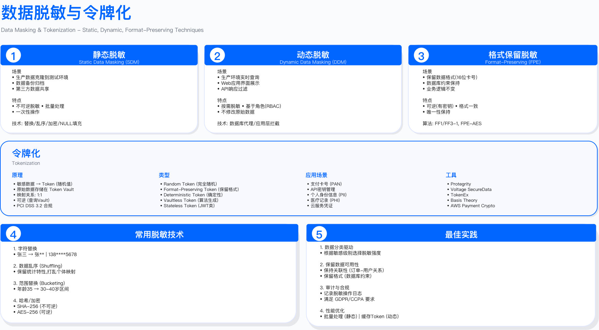
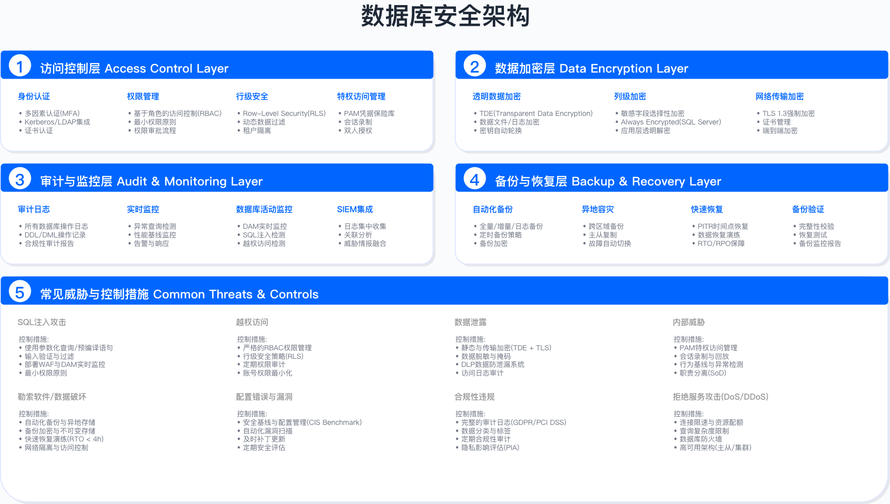

# 8.5　数据访问控制

## Data Access Control

> 导读：本节解决一个加密之后仍然存在的问题——授权用户可能过度访问、越权读取或滥用特权账号。8.5.1 梳理四代访问控制模型的演进脉络和选型依据；8.5.2-8.5.3 深入 RBAC 与 ABAC 的代码实现；8.5.4 展示如何将 ABAC 嵌入零信任数据网关；8.5.5-8.5.6 覆盖特权账号管理（PAM）与 JIT 临时授权；8.5.7 处理 RAG 与 AI 助手带来的新问题——当读取数据的是 AI 而非人，最小权限该在哪一层执行。若你的组织正处于"RBAC 角色爆炸"阶段，从 8.5.3 的 ABAC 引擎读起；若关注特权账号风险，直接跳到 8.5.5；若正在上线企业 AI 助手或 RAG，直接读 8.5.7。

访问控制是数据安全的核心防线。数据加密解决存储安全，访问控制解决使用安全——谁能读写数据、在什么条件下访问、如何验证其权限。即使数据库启用全盘加密，若访问控制策略配置不当，授权用户仍可能过度访问、越权读取敏感数据或滥用特权账号。本节从访问控制模型的演进出发，阐述 RBAC、ABAC、ReBAC 等策略引擎设计，零信任数据访问架构，特权访问管理（PAM）与 JIT（Just-in-Time）临时授权机制，以及数据脱敏与动态授权技术的工程实践。

---

## 8.5.1 访问控制模型演进

### 四代模型的决策边界

访问控制模型的演进反映了企业对授权粒度、动态性与可审计性的需求变化。选择何种模型取决于组织结构稳定性、数据敏感度分布、合规审计要求与系统复杂度容忍度。

每一代模型都在解决前一代的痛点、同时引入新的成本。这张演进图不是编年史陈列，而是一条"授权决策权归属"的迁移轨迹：从 DAC 把决策权交给数据所有者，到 MAC 把决策权收归系统，再到 RBAC 用角色这个中间层解耦用户与权限，最后到 ABAC 让决策依赖运行时属性组合。每一代的"失效场景"一栏正是这条演进的驱动力——正是这些失效倒逼了下一代的出现。DAC 的权限扩散催生了 MAC 的集中强制，MAC 的僵硬催生了 RBAC 的角色灵活性，RBAC 的角色爆炸又催生了 ABAC 的动态属性。

```
┌──────────────────────────────────────────────────────────────┐
│           访问控制模型演进史                                  │
│     (Evolution of Access Control Models)                    │
├──────────────────────────────────────────────────────────────┤
│                                                              │
│  第一代：DAC (Discretionary Access Control)                 │
│  自主访问控制（1970s）                                       │
│  ├─ 特点：数据所有者自主决定谁可以访问                       │
│  ├─ 示例：Unix 文件权限 (rwx)、Windows ACL                  │
│  ├─ 适用边界：小型团队、数据所有权明确、信任边界内           │
│  └─ 失效场景：权限扩散、难以集中撤销、误配置后无法追溯       │
│                                                              │
│  第二代：MAC (Mandatory Access Control)                     │
│  强制访问控制（1980s）                                       │
│  ├─ 特点：系统强制执行安全策略，用户无法修改                 │
│  ├─ 示例：SELinux、军事分级系统 (Top Secret/Secret/Confidential)│
│  ├─ 适用边界：强制合规要求、固定安全等级、政府/军事环境     │
│  └─ 失效场景：商业环境灵活性不足、管理成本高、用户体验差   │
│                                                              │
│  第三代：RBAC (Role-Based Access Control)                   │
│  基于角色的访问控制（1990s）- 当前主流                      │
│  ├─ 特点：权限分配给角色，用户获得角色                       │
│  ├─ 示例：数据库角色、应用权限组                             │
│  ├─ 适用边界：组织结构清晰、人员流动频繁、审计需求强         │
│  └─ 失效场景：角色爆炸、静态授权无法适应动态业务             │
│                                                              │
│  第四代：ABAC (Attribute-Based Access Control)              │
│  基于属性的访问控制（2000s）- 下一代标准                    │
│  ├─ 特点：基于主体/资源/环境属性的动态决策                   │
│  ├─ 示例：XACML、云 IAM 策略、零信任架构                     │
│  ├─ 适用边界：细粒度控制、动态业务场景、多租户环境           │
│  └─ 失效场景：策略复杂度高、性能开销大、调试困难             │
│                                                              │
│  新兴：ReBAC (Relationship-Based Access Control)            │
│  基于关系的访问控制（2010s）                                 │
│  ├─ 特点：基于实体间关系图（如社交网络）                     │
│  ├─ 示例：Google Zanzibar、SpiceDB                          │
│  ├─ 适用边界：复杂关系依赖、实时权限计算、协作平台           │
│  └─ 应用：Google Drive 共享、GitHub 组织权限                │
│                                                              │
└──────────────────────────────────────────────────────────────┘
```

需要澄清的一点是：新一代模型不会淘汰旧一代。ReBAC 被列为"新兴"而非"第五代主流"，正因为它解决的是关系密集型场景（谁分享给了谁、谁属于哪个组织的哪个仓库），并不覆盖 RBAC/ABAC 的全部职能。真实系统往往是多代混用——数据库层用 DAC/RBAC 做粗粒度隔离，应用层用 ABAC 做动态条件，协作平台再叠一层 ReBAC 算共享关系。所以下面的选型要回答的是"以哪个模型为主干、再叠加哪些补充"，而非"选一个模型"。

### 模型选择决策树

选择访问控制模型需要从业务场景反推技术约束。以下决策树基于组织结构稳定性与动态授权需求：

```
需要细粒度动态控制？
  ├─ 是 → ABAC（首选）
  │       └─ 若存在复杂关系依赖 → 结合 ReBAC
  │
  └─ 否
      ├─ 组织结构清晰且稳定？
      │   ├─ 是 → RBAC（主流选择）
      │   │       └─ 关键数据 → 结合 ABAC 动态条件
      │   │
      │   └─ 否 → 简化场景 → DAC（小型系统）
      │           └─ 若有强制合规 → MAC（政府/军事）
```

这棵树的两个分叉点值得单独点出。第一个是"是否需要细粒度动态控制"——一旦答案为是，几乎必然走向 ABAC，因为静态角色无法表达"随时间、设备、位置变化"的条件。第二个是"组织结构是否清晰稳定"——它决定了 RBAC 能否落地：角色的价值来自稳定的职能映射，若组织频繁重组、职责边界模糊，硬套 RBAC 只会制造大量短命角色。树末端的 DAC 与 MAC 并非"过时选项"，而是各自守着明确的适用带：DAC 适合信任边界内的小系统，MAC 适合合规强制、安全等级固定的政府/军事环境。下面三条量化约束，正是把这棵定性决策树落到工程判断上的锚点。

关键约束：

- RBAC 角色爆炸阈值：当角色数量超过用户数量一定比例（内部经验值 50%）时，需考虑拆分或转向 ABAC
- ABAC 性能开销：属性评估增加授权延迟（典型场景 10-50ms），需在低延迟场景缓存决策
- ReBAC 计算复杂度：关系图深度查询可能导致数据库压力，需设置最大递归深度（内部实践 3-5 层）

验证方法：

- 使用历史权限变更日志模拟 RBAC/ABAC 策略，测算角色数量与策略复杂度
- 在测试环境压测 ABAC 决策引擎，测量 P99 延迟是否满足业务 SLA
- 红队测试权限提升路径，如通过角色继承链获取非预期权限

---

## 8.5.2 RBAC 基于角色的访问控制

### RBAC 核心设计原则

RBAC 将用户与权限解耦，通过角色作为中间层简化权限管理。其参考模型（Core / Hierarchical / Constrained RBAC 四级）由 NIST 提出并形成美国国家标准 INCITS 359[1]；其核心是职责分离（Separation of Duty, SoD）——防止单一用户拥有冲突权限（如同时拥有创建订单与审批订单权限），对应 Constrained RBAC 中的静态/动态 SoD 约束。

下面这条链路图看似简单，却是 RBAC 全部收益的来源。关键在于中间那个"角色"节点：它把原本 N 个用户直连 M 个权限的 N×M 关系，拆成 N 个"用户→角色"与 M 个"角色→权限"两段。人员流动时只需改"用户→角色"这一段（入职分配角色、离职撤销角色），权限调整时只需改"角色→权限"这一段，两者互不牵连。这也解释了为什么审计能清晰回答"权限来自哪个角色"——链路本身就是一条可追溯的授权路径。

```
用户 (User) ─ 分配 → 角色 (Role) ─ 授予 → 权限 (Permission) ─ 作用于 → 资源 (Resource)

示例:
  Alice ───→ "财务经理" ───→ "查看财报" ───→ financial_reports 表
  Bob   ───→ "数据分析师" ───→ "读取客户数据" ───→ customers 表 (仅脱敏列)
```

图中 Bob 那一行的"仅脱敏列"提示了一个 RBAC 的固有边界：角色能表达"能不能读某张表"，但表达不了"读到的是明文还是脱敏值"这类依赖上下文的细粒度差异——那需要行级安全或 ABAC 补足（见 8.5.2 末尾的 RLS 配置与 8.5.3）。

适用边界：

- 组织结构稳定：角色与部门/职能对应关系在半年周期内变更频率较低（内部阈值 <20%）
- 权限粒度可接受：能用有限数量角色（内部经验 10-50 个）覆盖绝大部分用户（内部目标 >80%）
- 审计友好：需要清晰回答"谁有权限"与"权限来自哪个角色"

常见失败原因：

1. 角色设计过细导致角色爆炸（如为每个部门每个职级单独建角色），管理成本超过 DAC
2. 缺少角色继承机制，导致权限重复配置与同步困难
3. 静态角色无法适应临时授权需求（如项目临时成员），引入大量"特殊角色"

### 层级 RBAC 实现

为什么要在 Python 层面实现 RBAC 引擎，而不是只用数据库角色？ 数据库原生角色在表粒度上工作良好，但业务层面的访问控制逻辑（如"经理能审批下属的申请但不能审批自己的"）需要应用层实现。Python 引擎提供统一的授权决策点（PDP），并能在一个地方生成所有授权的审计日志，而不是让日志分散在数据库、API、前端各处。

```python
# RBAC 系统实现

from typing import Set, Dict, List
from dataclasses import dataclass
from enum import Enum

class Permission(Enum):
    """权限枚举"""
    READ = "read"
    WRITE = "write"
    DELETE = "delete"
    ADMIN = "admin"

@dataclass
class Role:
    """角色定义"""
    name: str
    permissions: Set[Permission]
    parent_role: 'Role' = None  # 支持角色继承
    description: str = ""

class RBACEngine:
    """RBAC引擎"""

    def __init__(self):
        self.roles: Dict[str, Role] = {}
        self.user_roles: Dict[str, Set[str]] = {}  # user_id -> role_names
        self.resource_permissions: Dict[str, Set[Permission]] = {}

    def create_role(self, name: str, permissions: Set[Permission],
                   parent_role: str = None, description: str = ""):
        """创建角色"""
        parent = self.roles.get(parent_role) if parent_role else None

        # 继承父角色权限
        if parent:
            permissions = permissions.union(parent.permissions)

        role = Role(name, permissions, parent, description)
        self.roles[name] = role
        return role

    def assign_role(self, user_id: str, role_name: str):
        """分配角色给用户"""
        if role_name not in self.roles:
            raise ValueError(f"角色不存在: {role_name}")

        if user_id not in self.user_roles:
            self.user_roles[user_id] = set()

        self.user_roles[user_id].add(role_name)
        # 审计日志: 记录谁在何时分配了角色
        self._audit_log("ROLE_ASSIGNED", {
            'user_id': user_id,
            'role': role_name,
            'granted_by': 'admin'  # 实际需从上下文获取
        })

    def revoke_role(self, user_id: str, role_name: str):
        """撤销用户角色"""
        if user_id in self.user_roles:
            self.user_roles[user_id].discard(role_name)
            self._audit_log("ROLE_REVOKED", {
                'user_id': user_id,
                'role': role_name
            })

    def check_permission(self, user_id: str, resource: str,
                        required_permission: Permission) -> bool:
        """检查用户是否有权限访问资源"""

        # 获取用户所有角色
        user_role_names = self.user_roles.get(user_id, set())
        if not user_role_names:
            return False

        # 聚合所有角色的权限
        user_permissions = set()
        for role_name in user_role_names:
            role = self.roles[role_name]
            user_permissions.update(role.permissions)

        # 检查是否有 ADMIN 权限 (超级权限)
        if Permission.ADMIN in user_permissions:
            return True

        # 检查是否有所需权限
        return required_permission in user_permissions

    def get_user_permissions(self, user_id: str) -> Set[Permission]:
        """获取用户所有权限"""
        user_role_names = self.user_roles.get(user_id, set())
        permissions = set()
        for role_name in user_role_names:
            permissions.update(self.roles[role_name].permissions)
        return permissions

    def _audit_log(self, event_type: str, details: Dict):
        """审计日志占位符"""
        # 实际实现需发送到SIEM或审计日志系统
        pass

# 使用示例
rbac = RBACEngine()

# 创建角色层级
rbac.create_role("员工", {Permission.READ}, description="基础员工")
rbac.create_role("经理", {Permission.READ, Permission.WRITE},
                parent_role="员工", description="部门经理")
rbac.create_role("管理员", {Permission.ADMIN}, description="系统管理员")

# 分配角色
rbac.assign_role("alice", "经理")
rbac.assign_role("bob", "员工")
rbac.assign_role("charlie", "管理员")

# 权限检查
print(rbac.check_permission("alice", "customer_data", Permission.WRITE))  # True
print(rbac.check_permission("bob", "customer_data", Permission.WRITE))    # False
print(rbac.check_permission("charlie", "customer_data", Permission.DELETE)) # True (ADMIN)
```

怎么读这段代码： 两个设计点值得关注——（1）`create_role` 中的权限继承 `permissions.union(parent.permissions)`：子角色自动拥有父角色的所有权限，不需要重复声明，修改父角色权限会自动传播；（2）`Permission.ADMIN` 超级权限：拥有 ADMIN 的用户绕过具体权限检查，直接放行。这项设计有利也有弊——ADMIN 角色分配必须严格控制（建议只有系统管理员账号持有，且账号使用 JIT 访问，见 8.5.6）。

生产常见坑：`_audit_log` 是占位符——这是最容易被遗漏的部分。权限变更日志是合规审计的基础（SOX/PCI DSS 要求所有权限变更都有记录），"实际需发送到SIEM"这条注释不能仅停留在注释。建议在系统上线前用集成测试验证：每次 `assign_role` 和 `revoke_role` 调用都能在 SIEM 中找到对应记录。

验证方法：

- 角色继承链测试：验证子角色继承父角色所有权限，且权限变更能正确传播
- 职责分离检查：测试互斥角色（如「审批员」与「申请员」）不能同时分配给同一用户
- 权限回收验证：撤销角色后，用户立即失去相关权限（需在 1 分钟内生效）

运行指标：

- 角色使用率：每个角色的用户数量，识别僵尸角色（无用户或仅少量用户的角色）
- 权限变更频率：角色权限调整次数，过高表明角色设计不稳定
- 审计日志完整性：角色分配/撤销操作的日志覆盖率（合规要求 100%）

### 数据库 RBAC 实施

数据库层 RBAC 与应用层 RBAC 需协同设计，避免双重授权管理。优先在数据库层实施粗粒度控制（如表级读写权限），在应用层实施细粒度控制（如行级/字段级权限）。

```sql
-- PostgreSQL RBAC 配置

-- 1. 创建角色
CREATE ROLE data_analyst;
CREATE ROLE data_engineer;
CREATE ROLE finance_manager;
CREATE ROLE dba_admin;

-- 2. 授予权限
-- 数据分析师: 只读访问
GRANT CONNECT ON DATABASE company_db TO data_analyst;
GRANT USAGE ON SCHEMA public TO data_analyst;
GRANT SELECT ON ALL TABLES IN SCHEMA public TO data_analyst;
-- 未来新表自动授权
ALTER DEFAULT PRIVILEGES IN SCHEMA public
GRANT SELECT ON TABLES TO data_analyst;

-- 数据工程师: 读写访问（除敏感表）
GRANT SELECT, INSERT, UPDATE ON ALL TABLES IN SCHEMA public TO data_engineer;
-- 撤销敏感表权限
REVOKE ALL ON TABLE salary, credit_cards FROM data_engineer;

-- 财务经理: 仅访问财务表
GRANT SELECT, INSERT, UPDATE ON TABLE financial_reports, invoices TO finance_manager;

-- DBA 管理员: 所有权限
GRANT ALL PRIVILEGES ON DATABASE company_db TO dba_admin;

-- 3. 创建用户并分配角色
CREATE USER alice WITH PASSWORD 'secure_password';
GRANT data_analyst TO alice;

CREATE USER bob WITH PASSWORD 'secure_password';
GRANT data_engineer TO bob;

-- 4. 查看用户权限
SELECT
    grantee,
    table_schema,
    table_name,
    privilege_type
FROM information_schema.role_table_grants
WHERE grantee = 'data_analyst';

-- 5. 行级安全策略（RLS）配合 RBAC
ALTER TABLE sales_data ENABLE ROW LEVEL SECURITY;

-- 策略: 分析师只能看到本部门数据
CREATE POLICY analyst_department_isolation ON sales_data
    FOR SELECT
    TO data_analyst
    USING (department = current_setting('app.user_department'));

-- 设置会话变量（需在应用层连接时设置）
SET app.user_department = 'Marketing';

-- 策略: 经理可以看到所有数据
CREATE POLICY manager_full_access ON sales_data
    FOR ALL
    TO finance_manager
    USING (true);
```

怎么读这段 SQL：`ALTER DEFAULT PRIVILEGES` 是容易被忽视但极其重要的一行——不加这条，新建的表默认不继承 `data_analyst` 的 SELECT 权限，数据工程师每次建新表后都需要手动执行 GRANT，遗漏时会导致分析师访问失败。RLS 策略中的 `current_setting('app.user_department')` 依赖应用层在建立连接后立即执行 `SET app.user_department = X`，若使用连接池（所有连接共享同一数据库用户），需确保连接池在每次借出连接时都重新设置会话变量，否则不同用户可能读到前一个用户的部门数据。

关键约束：

- 行级安全（RLS）性能开销：每个 SELECT 查询增加 WHERE 条件，需在查询计划中验证索引命中率
- 会话变量可靠性：需在连接池层强制设置 `app.user_department`，避免应用层遗漏导致权限绕过
- 默认权限机制：新表创建后需自动继承角色权限，避免遗漏授权导致访问被拒

验证方法：

- 使用不同角色连接数据库，验证 SELECT/INSERT/UPDATE/DELETE 操作的预期拒绝
- 测试 RLS 策略：修改会话变量，验证返回数据集的正确隔离
- 审计权限漂移：定期导出角色权限快照，对比基线检测未授权变更

---

## 8.5.3 ABAC 基于属性的访问控制

### ABAC 决策引擎架构

ABAC 通过评估主体属性、资源属性与环境属性的组合条件决策授权。这一"主体—客体—操作—环境"四类属性的划分及 PEP/PDP/PAP/PIP 的组件分工，出自 NIST SP 800-162[2]。相比 RBAC 的静态角色，ABAC 支持"工作时间内访问"、"MFA 验证后访问"等动态条件，但策略复杂度与调试难度显著增加。



*图 8.4: 数据脱敏与令牌化技术 - ABAC 决策中动态脱敏的应用场景*

```
┌────────────────────────────────────────────────────┐
│              ABAC 决策引擎架构                      │
├────────────────────────────────────────────────────┤
│                                                    │
│  主体属性（Subject Attributes）                    │
│  ├─ 身份：user_id, role, department               │
│  ├─ 安全等级：clearance_level, employment_type    │
│  └─ 状态：mfa_verified, device_trusted            │
│                    ↓                               │
│  资源属性（Resource Attributes）                   │
│  ├─ 分类：classification, sensitivity_score       │
│  ├─ 所有权：owner, department, compliance_tags    │
│  └─ 状态：encryption_enabled, backup_status       │
│                    ↓                               │
│  环境属性（Environment Attributes）                │
│  ├─ 时间：current_time, business_hours            │
│  ├─ 位置：ip_address, geo_location, network_zone  │
│  └─ 设备：device_type, os_version, security_posture│
│                    ↓                               │
│  策略引擎（Policy Decision Point - PDP）           │
│  ├─ 加载策略规则（XACML/JSON）                     │
│  ├─ 评估属性匹配度                                 │
│  ├─ 计算最终决策（Allow/Deny）                     │
│  └─ 生成审计日志                                   │
│                    ↓                               │
│  策略执行点（Policy Enforcement Point - PEP）      │
│  └─ 执行 Allow/Deny 决策                           │
│                                                    │
└────────────────────────────────────────────────────┘
```

图中自上而下的三层属性（主体/资源/环境）是 ABAC 的"输入变量"，PDP 与 PEP 是 XACML 标准里刻意分开的两个角色。把二者分离并非过度设计——PDP 负责"算出该不该放行"，PEP 负责"在数据通路上真正拦截或放行"，两者解耦意味着同一套策略可以被多个执行点（数据库网关、API 网关、文件服务）复用，也让策略的修改不必触碰散布各处的执行代码。对比 RBAC 只需查"用户有没有这个角色"，ABAC 每次决策都要把这三层属性喂进 PDP 现场求值，这正是它更灵活、也更慢、更难调试的根源——图中 8.5.1 提到的"典型场景 10-50ms 延迟"就落在这条 PDP 求值路径上。

需要补充说明的是，本节代码实现只对应图中 PDP 这一环（策略加载、属性评估、决策计算），PEP 的落地强依赖具体数据通路（在哪一层拦截查询、如何回写脱敏结果），因此正文以 PDP 为主展开。

适用边界：

- 动态业务场景：授权条件频繁变化（如「项目成员仅在项目活跃期有权限」）
- 细粒度控制需求：需要基于数据敏感度、用户安全等级等多维度决策
- 零信任架构：每次访问都需重新评估上下文（如设备信任度、地理位置）

常见失败原因：

1. 策略冲突未定义优先级（如 Allow 策略与 Deny 策略同时匹配），导致授权不确定
2. 属性数据源不可靠（如用户部门字段未及时同步），导致错误拒绝或授权
3. 性能优化不足（如每次访问查询 LDAP 获取用户属性），导致延迟超标

### ABAC 策略引擎实现

为什么选择函数组合而非 DSL（领域专用语言）来表达 ABAC 策略？ DSL（如 XACML XML）对非开发人员更友好，但调试困难、性能开销大。函数组合方式让每个条件都是可单独测试的 Python 函数，IDE 支持类型检查和断点调试。代价是策略不能被非技术人员直接编辑——适合以工程师为主导的安全团队；若需要业务团队自助配置策略，应评估 OPA（Open Policy Agent）等外部 PDP。

```python
# ABAC 策略引擎

from typing import Dict, Any, List, Callable
from dataclasses import dataclass
from datetime import datetime, time
import ipaddress

@dataclass
class AccessRequest:
    """访问请求"""
    subject: Dict[str, Any]      # 主体属性
    resource: Dict[str, Any]     # 资源属性
    action: str                  # 操作 (read/write/delete)
    environment: Dict[str, Any]  # 环境属性

class ABACPolicy:
    """ABAC 策略定义"""

    def __init__(self, name: str, conditions: List[Callable], effect: str = "Allow"):
        self.name = name
        self.conditions = conditions
        self.effect = effect  # Allow 或 Deny

    def evaluate(self, request: AccessRequest) -> bool:
        """评估策略是否匹配"""
        return all(condition(request) for condition in self.conditions)

class ABACEngine:
    """ABAC 引擎"""

    def __init__(self):
        self.policies: List[ABACPolicy] = []
        self.default_decision = "Deny"  # 默认拒绝

    def add_policy(self, policy: ABACPolicy):
        """添加策略"""
        self.policies.append(policy)

    def evaluate(self, request: AccessRequest) -> Dict[str, Any]:
        """评估访问请求"""

        matched_policies = []

        # 评估所有策略
        for policy in self.policies:
            if policy.evaluate(request):
                matched_policies.append(policy)

                # 遇到 Deny 策略立即拒绝（Deny 优先原则）
                if policy.effect == "Deny":
                    return {
                        'decision': 'Deny',
                        'reason': f'Matched deny policy: {policy.name}',
                        'matched_policies': [policy.name]
                    }

        # 至少匹配一个 Allow 策略才允许
        if matched_policies:
            return {
                'decision': 'Allow',
                'matched_policies': [p.name for p in matched_policies]
            }

        # 默认拒绝
        return {
            'decision': 'Deny',
            'reason': 'No matching allow policy',
            'matched_policies': []
        }

# 定义策略条件函数
def clearance_level_sufficient(request: AccessRequest) -> bool:
    """条件：用户安全等级 >= 数据分类等级"""
    clearance_map = {'Public': 0, 'Internal': 1, 'Confidential': 2, 'Restricted': 3}
    user_clearance = clearance_map.get(request.subject.get('clearance_level'), 0)
    data_classification = clearance_map.get(request.resource.get('classification'), 0)
    return user_clearance >= data_classification

def mfa_required_for_confidential(request: AccessRequest) -> bool:
    """条件：访问 Confidential 数据需 MFA"""
    if request.resource.get('classification') in ['Confidential', 'Restricted']:
        return request.subject.get('mfa_verified', False)
    return True

def business_hours_only(request: AccessRequest) -> bool:
    """条件：仅工作时间访问"""
    current_time = request.environment.get('current_time')
    if isinstance(current_time, datetime):
        hour = current_time.hour
        return 9 <= hour <= 18
    return True

def internal_network_only(request: AccessRequest) -> bool:
    """条件：仅内网 IP 访问"""
    ip = request.environment.get('ip_address')
    if ip:
        ip_obj = ipaddress.ip_address(ip)
        return ip_obj.is_private
    return False

def department_match(request: AccessRequest) -> bool:
    """条件：用户部门与数据所属部门匹配"""
    return request.subject.get('department') == request.resource.get('owner_department')

def contractor_restriction(request: AccessRequest) -> bool:
    """条件：外包人员禁止访问 Restricted 数据"""
    if request.subject.get('employment_type') == 'Contractor':
        return request.resource.get('classification') != 'Restricted'
    return True

def read_only_for_analysts(request: AccessRequest) -> bool:
    """条件：分析师只能读取"""
    if request.subject.get('role') == 'Analyst':
        return request.action == 'read'
    return True

# 使用示例
abac = ABACEngine()

# 策略 1: 基础访问控制
policy_basic = ABACPolicy(
    name="Basic Access Control",
    conditions=[
        clearance_level_sufficient,
        mfa_required_for_confidential,
        contractor_restriction
    ],
    effect="Allow"
)
abac.add_policy(policy_basic)

# 策略 2: 工作时间限制 (Restricted 数据)
def restricted_business_hours(request: AccessRequest) -> bool:
    if request.resource.get('classification') == 'Restricted':
        return business_hours_only(request)
    return True

policy_time_restricted = ABACPolicy(
    name="Restricted Data - Business Hours Only",
    conditions=[restricted_business_hours],
    effect="Allow"
)
abac.add_policy(policy_time_restricted)

# 策略 3: 部门隔离 (Confidential 数据)
def confidential_department_match(request: AccessRequest) -> bool:
    if request.resource.get('classification') == 'Confidential':
        return department_match(request)
    return True

policy_department = ABACPolicy(
    name="Confidential Data - Department Isolation",
    conditions=[confidential_department_match],
    effect="Allow"
)
abac.add_policy(policy_department)

# 测试访问请求
request1 = AccessRequest(
    subject={
        'user_id': 'alice',
        'role': 'Manager',
        'department': 'Finance',
        'clearance_level': 'Confidential',
        'mfa_verified': True,
        'employment_type': 'Full-time'
    },
    resource={
        'data_id': 'financial_report_2025',
        'classification': 'Confidential',
        'owner_department': 'Finance'
    },
    action='read',
    environment={
        'current_time': datetime.now(),
        'ip_address': '192.168.1.100',
        'device_trusted': True
    }
)

result = abac.evaluate(request1)
print(f"决策：{result['decision']}")
print(f"匹配策略：{result.get('matched_policies', [])}")
```

怎么读这段代码： 策略引擎的核心逻辑在 `evaluate` 方法——"遇到 Deny 立即返回"（Deny-override）是 XACML 标准定义的组合算法之一，也是最常用的安全默认。`matched_policies` 列表记录了匹配的策略名称，这是调试的关键——当用户报告"为什么我没有权限"时，可以从这个列表快速定位是哪条策略拒绝了请求。条件函数的 `return True`（当条件不适用时）是"不限制"语义，而非"允许"语义——策略的整体决定由所有条件的 AND 结果决定。

生产常见坑：`all(condition(request) for condition in self.conditions)` 使用了短路求值——第一个返回 False 的条件会终止评估。这对性能有利，但调试时只会看到第一个失败条件。建议在日志中记录每个条件的独立结果，而非仅记录最终 AND 结果，方便追踪拒绝原因。

关键约束：

- 属性数据源延迟：ABAC 依赖实时属性（如用户部门、设备信任度），需在 100ms 内完成查询
- 策略复杂度上限：单条策略条件数建议 ≤5 个，避免调试困难与性能衰减
- 决策缓存时效：低风险场景可缓存决策结果（如 5-15 分钟），高风险场景需实时计算

验证方法：

- 策略冲突测试：创建 Allow 与 Deny 策略都匹配的请求，验证 Deny 优先生效
- 属性缺失测试：提交缺少关键属性（如 `clearance_level`）的请求，验证默认拒绝
- 性能基准测试：模拟高频授权请求（如 1000 次/秒），测量 P99 延迟是否满足业务 SLA（参考阈值 50ms）

运行指标：

- 策略匹配分布：各策略的触发频率，识别冗余或未使用策略
- 默认拒绝率：无策略匹配导致拒绝的比例，过高表明策略覆盖度不足
- 属性查询延迟：从 LDAP/数据库获取属性的 P99 延迟

### XACML 策略示例

前面的 Python 函数组合实现把策略"焊死"在了代码里，只有本团队的工程师能读能改。当授权需求跨越组织边界——比如策略要由安全治理团队集中定义、再下发给多个异构系统执行，或者需要与外部厂商的 PDP 产品互操作——就需要一种与实现语言无关的、可序列化传输的策略表达。XACML（eXtensible Access Control Markup Language）正是为此而生的 OASIS 标准（现行版本 XACML 3.0）[3]：它把策略、规则、组合算法都表达为结构化 XML，任何符合标准的引擎都能加载并求值同一份策略。

代价也很直白——XML 极其冗长，人手编写和阅读都痛苦，调试尤其困难。所以它的适用带很清晰：值得为"跨系统互操作性"和"策略与代码解耦"付出这份冗长时才选它；若策略只在单一服务内部使用、且改动由开发者主导，前面的函数组合方式反而更轻。以下示例展示 Confidential 数据的 MFA 与部门隔离策略，可与前面 Python 引擎的等价逻辑对照阅读。

```xml
<!-- XACML (eXtensible Access Control Markup Language) 策略 -->

<Policy PolicyId="ConfidentialDataAccessPolicy"
        RuleCombiningAlgId="urn:oasis:names:tc:xacml:3.0:rule-combining-algorithm:deny-overrides">

    <Description>访问Confidential数据的策略</Description>

    <Target>
        <AnyOf>
            <AllOf>
                <Match MatchId="urn:oasis:names:tc:xacml:1.0:function:string-equal">
                    <AttributeValue DataType="http://www.w3.org/2001/XMLSchema#string">
                        Confidential
                    </AttributeValue>
                    <AttributeDesignator
                        AttributeId="resource:classification"
                        Category="urn:oasis:names:tc:xacml:3.0:attribute-category:resource"
                        DataType="http://www.w3.org/2001/XMLSchema#string"
                        MustBePresent="true"/>
                </Match>
            </AllOf>
        </AnyOf>
    </Target>

    <Rule RuleId="MFARequired" Effect="Deny">
        <Description>Confidential 数据需要 MFA</Description>
        <Condition>
            <Apply FunctionId="urn:oasis:names:tc:xacml:1.0:function:not">
                <Apply FunctionId="urn:oasis:names:tc:xacml:1.0:function:boolean-equal">
                    <AttributeDesignator
                        AttributeId="subject:mfa_verified"
                        Category="urn:oasis:names:tc:xacml:1.0:subject-category:access-subject"
                        DataType="http://www.w3.org/2001/XMLSchema#boolean"
                        MustBePresent="true"/>
                    <AttributeValue DataType="http://www.w3.org/2001/XMLSchema#boolean">
                        true
                    </AttributeValue>
                </Apply>
            </Apply>
        </Condition>
    </Rule>

    <Rule RuleId="DepartmentMatch" Effect="Permit">
        <Description>用户部门与数据所属部门匹配</Description>
        <Condition>
            <Apply FunctionId="urn:oasis:names:tc:xacml:1.0:function:string-equal">
                <AttributeDesignator
                    AttributeId="subject:department"
                    Category="urn:oasis:names:tc:xacml:1.0:subject-category:access-subject"
                    DataType="http://www.w3.org/2001/XMLSchema#string"
                    MustBePresent="true"/>
                <AttributeDesignator
                    AttributeId="resource:owner_department"
                    Category="urn:oasis:names:tc:xacml:3.0:attribute-category:resource"
                    DataType="http://www.w3.org/2001/XMLSchema#string"
                    MustBePresent="true"/>
            </Apply>
        </Condition>
    </Rule>

</Policy>
```

怎么读这段 XML：`PolicyId` 级别的 `RuleCombiningAlgId` 指定规则组合算法——`deny-overrides` 意味着任何 Deny 规则优先于所有 Permit 规则，与上面 Python 引擎的逻辑一致。`MustBePresent="true"` 在属性缺失时触发 INDETERMINATE 决策（既非 Allow 也非 Deny），在 `deny-overrides` 算法下 INDETERMINATE 会被当作 Deny 处理——这是安全默认行为，确保缺少 MFA 信息的请求被拒绝而非放行。

关键约束：

- XACML 策略调试复杂：XML 嵌套结构难以阅读，建议使用策略管理工具可视化编辑
- 策略版本管理：需维护策略变更历史，支持回滚与差异对比
- 性能开销：XACML 解析与评估引入额外延迟，需在负载测试中验证

---

## 8.5.4 零信任数据访问 (ZTDA)

### 零信任架构原则

零信任架构（Zero Trust Architecture, ZTA）假设网络边界已失效，每次访问都需验证身份、设备、上下文。NIST SP 800-207 给出了 ZTA 的权威定义与七条基本原则，并把策略引擎（PE）、策略管理器（PA）、策略执行点（PEP）确立为参考架构的核心组件[4]。数据访问层的零信任包含持续验证、最小权限、微隔离与行为分析。

下面这组对比图的价值，在于把零信任从一句口号还原成对传统安全假设的一次颠覆。传统边界安全的隐含前提是"进了内网就是可信的"，防火墙一旦被绕过或内部账号被盗，攻击者就能在内网自由横向移动。零信任删掉的正是这个前提——它不再区分"信任区/不信任区"，而是把每一次数据访问都当作来自不可信网络来对待。图中列出的五条原则不是并列的检查项，而是同一立场的五个侧面："假设突破"是心态，"显式验证"和"持续监控"是手段，"最小权限"和"微隔离"是即使被突破也要把爆炸半径压到最小的兜底。理解了这五条，才能看懂 8.5.4 后面那个数据访问网关为什么要把令牌、设备、行为、策略、风险层层串联——它就是这五条原则在数据访问链路上的一次具体落地。

```
传统边界安全：
  内网（信任区）←防火墙→ 外网（不信任区）
  问题：内网横向移动、内部威胁

零信任架构：
  永不信任，持续验证
  ├─ 原则 1：假设突破（Assume Breach）
  ├─ 原则 2：最小权限（Least Privilege）
  ├─ 原则 3：显式验证（Verify Explicitly）
  ├─ 原则 4：微隔离（Micro-Segmentation）
  └─ 原则 5：持续监控（Continuous Monitoring）
```

适用边界：

- 高价值数据保护：财务/客户/知识产权等核心资产
- 远程办公场景：员工设备不在企业网络内，需持续验证设备信任度
- 合规强制要求：如 PCI DSS 要求对持卡人数据的每次访问都需验证

常见失败原因：

1. 设备信任评分不准确（如仅检查操作系统版本，未检测越狱/root），导致信任决策错误
2. 短期令牌过期后业务中断（如 15 分钟令牌在长时间报表查询中过期），需设计令牌续期机制
3. 行为分析误报导致正常用户被频繁要求重新 MFA，用户体验下降

### 零信任数据访问架构

`ZeroTrustDataGateway` 将身份验证、设备信任、行为分析、ABAC 策略和实时风险评分整合为单一访问决策链。相比分散在各系统的独立检查，统一网关确保所有检查都在同一上下文中顺序执行，避免检查之间的状态不一致。

```python
# 零信任数据访问网关

import jwt
from datetime import datetime, timedelta, timezone
from typing import Dict, Any

class ZeroTrustDataGateway:
    """零信任数据访问网关"""

    def __init__(self, abac_engine, mfa_service, device_trust_service):
        self.abac = abac_engine
        self.mfa = mfa_service
        self.device_trust = device_trust_service
        self.session_store = {}

    def authenticate_user(self, username: str, password: str,
                         mfa_code: str, device_id: str) -> Dict[str, Any]:
        """多因素认证"""

        # 步骤 1：验证用户名密码
        if not self.verify_credentials(username, password):
            return {'success': False, 'error': 'Invalid credentials'}

        # 步骤 2：验证 MFA
        if not self.mfa.verify(username, mfa_code):
            return {'success': False, 'error': 'Invalid MFA code'}

        # 步骤 3：验证设备信任度
        device_trust_score = self.device_trust.evaluate(device_id)
        if device_trust_score < 70:
            return {'success': False, 'error': 'Untrusted device'}

        # 步骤 4：生成短期访问令牌（15 分钟）
        token = self.generate_access_token(username, device_id, expires_in=900)

        return {
            'success': True,
            'access_token': token,
            'expires_in': 900,
            'device_trust_score': device_trust_score
        }

    def access_data(self, access_token: str, resource_id: str,
                   action: str, context: Dict[str, Any]) -> Dict[str, Any]:
        """访问数据（零信任检查）"""

        # 检查 1：验证令牌
        try:
            claims = jwt.decode(access_token, 'secret_key', algorithms=['HS256'])
        except jwt.ExpiredSignatureError:
            return {'decision': 'Deny', 'reason': 'Token expired'}
        except jwt.InvalidTokenError:
            return {'decision': 'Deny', 'reason': 'Invalid token'}

        # 检查 2：设备持续验证
        device_id = claims['device_id']
        current_trust = self.device_trust.evaluate(device_id)
        if current_trust < 70:
            return {'decision': 'Deny', 'reason': 'Device trust degraded'}

        # 检查 3：行为分析（UEBA）
        behavior_score = self.analyze_user_behavior(
            claims['sub'], resource_id, action, context
        )
        if behavior_score < 50:
            # 异常行为，要求重新 MFA
            return {
                'decision': 'Deny',
                'reason': 'Anomalous behavior detected',
                'required_action': 'Re-authenticate with MFA'
            }

        # 检查 4：ABAC 策略评估
        request = AccessRequest(
            subject={
                'user_id': claims['sub'],
                'role': self.get_user_role(claims['sub']),
                'department': self.get_user_department(claims['sub']),
                'clearance_level': self.get_user_clearance(claims['sub']),
                'mfa_verified': True,
                'device_trusted': current_trust >= 70
            },
            resource=self.get_resource_attributes(resource_id),
            action=action,
            environment={
                'current_time': datetime.now(),
                'ip_address': context.get('ip_address'),
                'geo_location': context.get('geo_location')
            }
        )

        abac_result = self.abac.evaluate(request)

        if abac_result['decision'] == 'Deny':
            return abac_result

        # 检查 5：实时风险评分
        risk_score = self.calculate_access_risk(claims, resource_id, context)
        if risk_score > 80:
            # 高风险访问，记录并发送告警
            self.log_high_risk_access(claims['sub'], resource_id, risk_score)
            self.send_alert_to_soc(claims['sub'], resource_id, risk_score)

            # 可选：要求额外验证或仅允许受限访问
            return {
                'decision': 'Allow',
                'restrictions': 'Read-only, masked data',
                'risk_score': risk_score,
                'audit_enhanced': True
            }

        # 检查 6：数据脱敏决策
        masking_level = self.determine_masking_level(
            claims['sub'], resource_id, risk_score
        )

        return {
            'decision': 'Allow',
            'masking_level': masking_level,
            'risk_score': risk_score,
            'session_id': self.create_session(claims['sub'], resource_id)
        }

    def calculate_access_risk(self, claims: Dict, resource_id: str,
                             context: Dict) -> int:
        """计算访问风险分数（0-100）"""
        risk = 0

        # 因素 1：资源敏感度
        resource = self.get_resource_attributes(resource_id)
        classification_risk = {
            'Public': 0, 'Internal': 20, 'Confidential': 50, 'Restricted': 80
        }
        risk += classification_risk.get(resource.get('classification'), 0)

        # 因素 2：非工作时间访问
        if not (9 <= datetime.now().hour <= 18):
            risk += 20

        # 因素 3：异常地理位置
        if context.get('geo_location') != claims.get('usual_location'):
            risk += 30

        # 因素 4：大量数据访问
        recent_access_count = self.get_recent_access_count(claims['sub'])
        if recent_access_count > 100:  # 1 小时内访问超过 100 次
            risk += 25

        return min(risk, 100)

    def analyze_user_behavior(self, user_id: str, resource_id: str,
                             action: str, context: Dict) -> int:
        """用户行为分析（UEBA）"""
        # 简化示例，实际需使用 ML 模型

        # 获取用户历史行为基线
        baseline = self.get_user_baseline(user_id)

        score = 100  # 初始正常分数

        # 检测 1：访问频率异常
        current_rate = self.get_access_rate(user_id)
        if current_rate > baseline['avg_access_rate'] * 3:
            score -= 30

        # 检测 2：访问时间异常
        if not baseline['usual_hours'].get(datetime.now().hour):
            score -= 20

        # 检测 3：访问资源异常（从未访问过此类资源）
        resource_type = self.get_resource_type(resource_id)
        if resource_type not in baseline['usual_resources']:
            score -= 25

        # 检测 4：批量下载行为
        if action == 'bulk_export':
            score -= 35

        return max(score, 0)

    def generate_access_token(self, username: str, device_id: str,
                             expires_in: int = 900) -> str:
        """生成短期访问令牌"""
        payload = {
            'sub': username,
            'device_id': device_id,
            'iat': datetime.now(timezone.utc),
            'exp': datetime.now(timezone.utc) + timedelta(seconds=expires_in)
        }
        return jwt.encode(payload, 'secret_key', algorithm='HS256')

    # 占位符方法(实际需实现)
    def verify_credentials(self, username: str, password: str) -> bool: pass
    def get_user_role(self, user_id: str) -> str: pass
    def get_user_department(self, user_id: str) -> str: pass
    def get_user_clearance(self, user_id: str) -> str: pass
    def get_resource_attributes(self, resource_id: str) -> Dict: pass
    def log_high_risk_access(self, user_id: str, resource_id: str, risk_score: int): pass
    def send_alert_to_soc(self, user_id: str, resource_id: str, risk_score: int): pass
    def determine_masking_level(self, user_id: str, resource_id: str, risk_score: int) -> str: pass
    def create_session(self, user_id: str, resource_id: str) -> str: pass
    def get_recent_access_count(self, user_id: str) -> int: pass
    def get_user_baseline(self, user_id: str) -> Dict: pass
    def get_access_rate(self, user_id: str) -> float: pass
    def get_resource_type(self, resource_id: str) -> str: pass
```

怎么读这段代码：`access_data` 的六步检查顺序经过设计——先验令牌（最快，失败立即返回），再验设备（需一次远程调用），再行为分析（需查历史数据），最后 ABAC 策略（最复杂，需多属性查询）。这种排序将最耗时的检查放在最后，令牌失效的请求不会触发 ABAC 评估，降低整体延迟。检查 5 的高风险访问处理有意设计为"允许但限制"而非"拒绝"——在 Restricted 数据访问时强制返回脱敏版本，平衡安全性与业务连续性。

生产常见坑：`jwt.encode(payload, 'secret_key', ...)` 中的 `'secret_key'` 是示例值——生产环境必须从 KMS 或 HSM 获取密钥，且应使用 RS256（非对称算法）而非 HS256（对称算法）。HS256 要求验证方持有同一密钥，多服务验证令牌时密钥需分发给所有服务，增加泄露面；RS256 只需分发公钥，私钥仅在颁发服务持有。

关键约束：

- 令牌生命周期权衡：短期令牌（典型值 15 分钟）提高安全性，但增加重新认证频率，需设计无感续期机制
- 行为基线冷启动：新员工无历史行为数据，需在前期（如 30 天）使用宽松阈值避免误拦截
- 实时风险评分延迟：需在较短时间（参考值 50ms）内完成计算，避免影响数据访问性能

验证方法：

- 设备信任降级测试：模拟设备越狱/root，验证信任度下降至阈值以下时拒绝访问
- 异常行为触发测试：在非工作时间批量下载数据，验证行为分析触发重新 MFA
- 令牌过期处理：验证令牌过期后立即拒绝访问，且提示用户重新认证

运行指标：

- 设备信任度分布：各信任度区间的设备数量，识别高风险设备
- 行为异常检测率：每日触发异常行为告警的访问次数
- 高风险访问占比：风险分数 >80 的访问占总访问量的比例

---

## 8.5.5 特权访问管理 (PAM)

### PAM 核心功能

特权账号（如 root、sa、admin）拥有系统最高权限，一旦泄露或滥用将导致灾难性后果。PAM 通过密码保险库、即时提升（JIT）、会话录屏与自动轮换密码控制特权账号使用。



*图 8.5: 数据库安全架构 - PAM 在数据库访问控制中的应用*

```
┌────────────────────────────────────────────────────┐
│          特权访问管理 (PAM) 架构                    │
├────────────────────────────────────────────────────┤
│                                                    │
│  [1] 特权账号发现与管理                            │
│  ├─ 自动发现：扫描系统识别特权账号                 │
│  ├─ 账号清单：数据库 admin、root、域管理员         │
│  └─ 去常驻化：个人特权不常驻，用时申请、到期回收   │
│                                                    │
│  [2] 密码保险库（Vault）                           │
│  ├─ 集中存储：所有特权凭证加密存储                 │
│  ├─ 自动轮换：定期自动更换密码                     │
│  └─ Check-out/Check-in：临时提取凭证              │
│                                                    │
│  [3] 即时特权提升（JIT）                           │
│  ├─ 默认无特权：用户正常权限运行                   │
│  ├─ 按需申请：需要时申请临时特权                   │
│  ├─ 时限控制：特权在 N 小时后自动撤销              │
│  └─ 审批流程：高风险操作需双重审批                 │
│                                                    │
│  [4] 会话管理与记录                                │
│  ├─ 会话代理：通过 PAM 连接目标系统                │
│  ├─ 结构化优先：命令、SQL、文件传输全量留存        │
│  ├─ 视频补充：仅图形会话录制，短期留存             │
│  └─ 异常告警：危险命令告警，阻断仅限不可逆操作     │
│                                                    │
│  [5] 审计与合规                                    │
│  ├─ 完整日志：谁/何时/访问了什么/做了什么          │
│  ├─ 合规报告：SOX/PCI DSS/HIPAA 审计               │
│  └─ 取证支持：事件调查证据链                       │
│                                                    │
└────────────────────────────────────────────────────┘
```

这五个模块不是五个可以随意取舍的功能清单，而是一条环环相扣的控制链，任何一环缺失都会让特权账号回到"裸奔"状态。模块 [1] 发现与纳管是前提——没被纳管的特权账号等于给攻击者留了绕过 PAM 的后门，所以"自动发现"必须持续运行而非一次性扫描。模块 [2] 保险库解决"凭证放哪"，模块 [3] JIT 解决"何时给"，二者配合把"长期持有高权限"这一最大风险源直接消除：默认无特权、用时申请、到点回收。模块 [4] 会话记录是"给了之后怎么盯"，把每一次特权操作都变成可检索的证据。模块 [5] 审计与合规则是前四个模块的产出汇聚点——正因为前面每一步都在打点，才能在事后拼出"谁在何时用哪个账号做了什么"的完整证据链，满足 SOX/PCI DSS 的审计要求。后面的代码实现正是沿着这条链展开：注册纳管、Check-out 取证、命令执行时记录与告警、Check-in 时轮换密码。

模块 [1] 与模块 [4] 各有一处需要就地说清，否则容易照着做成一套成本很高而取证价值有限的方案。

**模块 [1] 的"去常驻"不等于"改用共享账号"。**把个人管理员账号取消、换成几个由保险库托管的共享特权账号，是 PAM 的经典形态，它解决的是"凭证放哪"，但共享账号本身会成为绕过路径——事件当天有人想不起申请流程，就会去用那个"以防万一"留着的共享账号。更稳的方向是让个人身份保持具名、只是不常驻特权：用时申请、到期自动回收，Tier 0 系统进一步做到账号本身也是临时的。这条演进路径分几档、每档的典型时长与边际收益见 [14.6.4](../../第05部分_身份网络与业务连续性/第14章_企业身份与访问管理/14.6_特权访问管理.md)。

**模块 [4] 的默认形态应当是结构化记录，而不是全程视频。**命令行文本、执行的 SQL、传输的文件名可检索、可告警，体积比视频小两三个数量级；视频只在图形界面操作时才补得上信息，而且没有人会主动看录像。同理，"检测到危险命令立即断开"听起来很好，实际误伤代价高且容易被绕过（命令可以拼接、编码、写进脚本），更合适的定位是告警，把实时阻断留给极少数不可逆操作。三种录制形态的成本量级、检索要求与合规告知义务见 [14.6.5](../../第05部分_身份网络与业务连续性/第14章_企业身份与访问管理/14.6_特权访问管理.md)。

适用边界：

- 强合规要求：SOX 法案、PCI DSS 要求特权账号的严格审计
- 高价值系统：生产数据库、核心服务器、云管理控制台
- 外包场景：需临时授权外部供应商访问系统，且访问结束后立即撤销

常见失败原因：

1. 特权账号未完全纳管（如开发环境的 admin 账号被遗漏），导致绕过 PAM 的访问路径
2. 密码轮换未与应用集成，导致轮换后应用连接数据库失败
3. 会话记录不可检索——只能按用户与时间查找，无法按命令关键字、目标主机或文件传输行为检索，取证时价值有限；图形界面操作缺少对应的关键帧或视频补充，则会在数据库管理工具这类点击式操作上留下空白

### PAM 实施示例

为什么 PAM 使用 Check-out/Check-in 模型而不是长期共享凭证？ 共享特权账号（如所有 DBA 共用同一个 root 密码）的问题是"出了问题不知道是谁干的"。Check-out 模型将每次使用绑定到具体的申请人和会话，即使多人共用同一个特权账号，审计日志也能精确定位到每次操作的责任人。密码在每次 Check-in 后自动轮换，使共享账号的凭证永远只有最后一次使用者短暂知晓。

```python
# 特权访问管理系统

from datetime import datetime, timedelta, timezone
from typing import Dict, Optional
import secrets
import string
import threading

class PrivilegedAccount:
    """特权账号"""
    def __init__(self, account_id: str, system: str, username: str,
                 account_type: str):
        self.account_id = account_id
        self.system = system  # 目标系统 (数据库/服务器)
        self.username = username
        self.account_type = account_type  # root/admin/dba
        self.password_last_rotated = None
        self.checked_out_by = None
        self.checked_out_at = None

class PAMSystem:
    """PAM 系统"""

    def __init__(self):
        self.accounts: Dict[str, PrivilegedAccount] = {}
        self.password_vault = {}  # 加密存储
        self.access_sessions = {}
        self.pending_requests = {}  # 待审批请求
        self.audit_log = []
        # 保护 check-out 的临界区，消除 TOCTOU 竞态。
        # 说明：进程内锁仅在单进程多线程下有效；分布式/多副本 PAM
        # 必须改用数据库行级锁或分布式锁（见"生产常见坑"）。
        self._checkout_lock = threading.Lock()

    def _try_checkout(self, account: PrivilegedAccount, requester_id: str) -> bool:
        """原子占用特权账号：check 与 set 在同一临界区内完成。

        返回 True 表示占用成功；False 表示已被他人占用。
        这是 Check-out TOCTOU 竞态的修复点——绝不能把"检查是否为空"
        和"赋值占用"拆成两步（先 if account.checked_out_by 再赋值）。
        """
        with self._checkout_lock:
            if account.checked_out_by is not None:
                return False
            account.checked_out_by = requester_id
            account.checked_out_at = datetime.now()
            return True

    def register_privileged_account(self, system: str, username: str,
                                    account_type: str, initial_password: str):
        """注册特权账号"""
        account_id = f"{system}_{username}"

        account = PrivilegedAccount(account_id, system, username, account_type)
        self.accounts[account_id] = account

        # 加密存储密码
        self.password_vault[account_id] = self.encrypt_password(initial_password)

        self.audit("ACCOUNT_REGISTERED", {
            'account_id': account_id,
            'system': system,
            'username': username
        })

    def request_access(self, requester_id: str, account_id: str,
                      justification: str, duration_hours: int = 1) -> Dict:
        """申请特权访问"""

        if account_id not in self.accounts:
            return {'approved': False, 'reason': '账号不存在'}

        account = self.accounts[account_id]

        # 风险评估
        risk_score = self.assess_access_risk(requester_id, account, justification)

        # 高风险：进入待审批状态，绝不下发凭证、绝不 Check-out。
        # 这是"审批旁路"的修复点——待审批 ≠ 已批准，此路径必须提前返回。
        if risk_score > 70:
            request_id = secrets.token_urlsafe(16)
            self.pending_requests[request_id] = {
                'request_id': request_id,
                'requester_id': requester_id,
                'account_id': account_id,
                'justification': justification,
                'duration_hours': duration_hours,
                'risk_score': risk_score,
                'requested_at': datetime.now(),
                'approver': self.get_approver(requester_id),
                'status': 'PendingApproval'
            }
            self.audit("ACCESS_PENDING_APPROVAL", {
                'request_id': request_id,
                'requester': requester_id,
                'account': account_id,
                'risk_score': risk_score
            })
            # 实际需向审批人发送通知
            return {
                'approved': False,
                'status': 'PendingApproval',
                'request_id': request_id,
                'reason': f'高风险请求（risk_score={risk_score}）需审批，'
                          f'审批通过后由 approve_access 发放凭证'
            }

        # 低风险：自动批准，直接发放凭证
        return self._grant_access(requester_id, account, risk_score,
                                  justification, duration_hours)

    def _grant_access(self, requester_id: str, account: PrivilegedAccount,
                      risk_score: int, justification: str,
                      duration_hours: int) -> Dict:
        """真正发放访问凭证：原子占用账号 → 建会话 → 返回凭证。

        仅供 request_access（低风险）与 approve_access（审批通过）调用。
        """
        # 原子 Check-out：check 与 set 合并到一个临界区，消除 TOCTOU
        if not self._try_checkout(account, requester_id):
            return {
                'approved': False,
                'reason': f'账号正在被使用: {account.checked_out_by}'
            }

        session_id = secrets.token_urlsafe(16)
        expires_at = datetime.now() + timedelta(hours=duration_hours)

        self.access_sessions[session_id] = {
            'session_id': session_id,
            'requester_id': requester_id,
            'account_id': account.account_id,
            'started_at': datetime.now(),
            'expires_at': expires_at,
            'justification': justification,
            'risk_score': risk_score,
            'approved': True,
            'commands': [],
            'recording_path': f'/recordings/{session_id}.rec'
        }

        self.audit("ACCESS_GRANTED", {
            'session_id': session_id,
            'requester': requester_id,
            'account': account.account_id,
            'duration': duration_hours,
            'risk_score': risk_score
        })

        temp_password = self.get_password(account.account_id)

        return {
            'approved': True,
            'session_id': session_id,
            'credentials': {
                'system': account.system,
                'username': account.username,
                'password': temp_password  # 实际应通过安全通道传输
            },
            'expires_at': expires_at,
            'instructions': '所有操作将被录屏与审计'
        }

    def approve_access(self, request_id: str, approver_id: str) -> Dict:
        """审批通过后发放凭证（独立接口，与申请解耦）。

        只有走到这里，高风险请求才会真正 Check-out 并拿到凭证。
        """
        request = self.pending_requests.get(request_id)
        if not request or request['status'] != 'PendingApproval':
            return {'approved': False, 'reason': '审批请求不存在或状态非法'}

        # 生产环境应校验 approver_id 是否为该请求的合法审批人、
        # 是否满足"申请人 ≠ 审批人"的职责分离要求
        request['status'] = 'Approved'
        request['approved_by'] = approver_id
        request['approved_at'] = datetime.now()
        self.audit("ACCESS_APPROVED", {
            'request_id': request_id,
            'approver': approver_id,
            'requester': request['requester_id']
        })

        account = self.accounts[request['account_id']]
        return self._grant_access(
            request['requester_id'], account, request['risk_score'],
            request['justification'], request['duration_hours']
        )

    def execute_privileged_command(self, session_id: str, command: str) -> Dict:
        """执行特权命令（通过 PAM 代理）"""

        if session_id not in self.access_sessions:
            return {'success': False, 'error': '会话不存在'}

        session = self.access_sessions[session_id]

        # 检查会话是否过期
        if datetime.now() > session['expires_at']:
            return {'success': False, 'error': '会话已过期'}

        # 危险命令检测
        dangerous_patterns = ['DROP DATABASE', 'DELETE FROM', 'TRUNCATE', 'rm -rf']
        if any(pattern in command.upper() for pattern in dangerous_patterns):
            self.audit("DANGEROUS_COMMAND_ATTEMPTED", {
                'session_id': session_id,
                'command': command,
                'blocked': True
            })

            self.send_alert_to_soc({
                'severity': 'HIGH',
                'type': 'Dangerous Privileged Command',
                'user': session['requester_id'],
                'command': command
            })

            return {
                'success': False,
                'error': '危险命令已被阻止',
                'security_alert': True
            }

        # 记录命令
        session['commands'].append({
            'timestamp': datetime.now(),
            'command': command
        })

        self.audit("PRIVILEGED_COMMAND_EXECUTED", {
            'session_id': session_id,
            'command': command
        })

        result = self.execute_on_target_system(session['account_id'], command)

        return {'success': True, 'output': result}

    def end_session(self, session_id: str):
        """结束特权会话（Check-in）"""

        if session_id not in self.access_sessions:
            return

        session = self.access_sessions[session_id]
        account_id = session['account_id']
        account = self.accounts[account_id]

        # 释放账号
        account.checked_out_by = None
        account.checked_out_at = None

        # 自动轮换密码（高安全等级）
        if account.account_type in ['root', 'sa']:
            new_password = self.rotate_password(account_id)

        self.audit("SESSION_ENDED", {
            'session_id': session_id,
            'duration': (datetime.now() - session['started_at']).seconds,
            'commands_executed': len(session['commands'])
        })

        self.finalize_session_recording(session_id)

        del self.access_sessions[session_id]

    def rotate_password(self, account_id: str) -> str:
        """自动轮换密码"""
        new_password = self.generate_strong_password()
        self.update_system_password(account_id, new_password)
        self.password_vault[account_id] = self.encrypt_password(new_password)
        self.accounts[account_id].password_last_rotated = datetime.now()
        self.audit("PASSWORD_ROTATED", {'account_id': account_id})
        return new_password

    def generate_strong_password(self, length: int = 32) -> str:
        """生成强密码"""
        alphabet = string.ascii_letters + string.digits + string.punctuation
        password = ''.join(secrets.choice(alphabet) for _ in range(length))
        return password

    def audit(self, event_type: str, details: Dict):
        """审计日志"""
        log_entry = {
            'timestamp': datetime.now().isoformat(),
            'event_type': event_type,
            'details': details
        }
        self.audit_log.append(log_entry)
        # 实际应发送到SIEM

    def get_audit_report(self, start_date: datetime, end_date: datetime) -> list:
        """生成审计报告"""
        return [
            log for log in self.audit_log
            if start_date <= datetime.fromisoformat(log['timestamp']) <= end_date
        ]

    # 占位符方法
    def encrypt_password(self, password: str) -> str: pass
    def get_password(self, account_id: str) -> str: pass
    def assess_access_risk(self, requester_id: str, account: PrivilegedAccount, justification: str) -> int: pass
    def get_approver(self, requester_id: str) -> str: pass
    def send_alert_to_soc(self, alert: Dict): pass
    def execute_on_target_system(self, account_id: str, command: str) -> str: pass
    def finalize_session_recording(self, session_id: str): pass
    def update_system_password(self, account_id: str, new_password: str): pass
```

怎么读这段代码： 三个关键流程——（1）`request_access` 中的风险分级审批：低风险由 `_grant_access` 自动批准并直接发放凭证，高风险则提前返回 `PendingApproval`——不 Check-out、不返回 credentials，必须等 `approve_access` 被独立触发后才真正发放凭证。这条"申请与审批解耦"的边界是关键：绝不能在同一次调用里既判定"需审批"又把明文口令交出去，否则审批就只是一个元数据标记而形同虚设；（2）`execute_privileged_command` 中的危险命令黑名单：所有通过 PAM 代理的命令都经过检测，攻击者即使拿到凭证也无法通过 PAM 执行高危操作；（3）`end_session` 中 `root/sa` 账号的密码自动轮换：会话结束后凭证立即失效，彻底消除凭证共享风险。

生产常见坑（一）·审批旁路： 特权访问最隐蔽的缺陷是"判定需审批却仍下发凭证"。安全铁律是：`approved` 为 `False` 时绝不返回 `credentials`，也绝不 Check-out 账号。本例通过让高风险路径提前 `return {'approved': False, 'status': 'PendingApproval'}`、把凭证发放集中到 `_grant_access` 并只由审批后的 `approve_access` 调用来兜住这条底线。生产还应校验"申请人 ≠ 审批人"的职责分离。

生产常见坑（二）·Check-out 竞态（TOCTOU）： "先 `if account.checked_out_by` 检查、再赋值占用"是两步非原子操作，多请求并发时可同时通过检查并抢占同一账号，导致真实越权。本例用 `_try_checkout` 把 check 与 set 合进一个锁临界区解决。注意进程内 `threading.Lock` 只在单进程多线程下有效：分布式/多副本 PAM 必须改用数据库行级锁或条件更新（`UPDATE ... SET checked_out_by=:u WHERE checked_out_by IS NULL` 并检查影响行数），或用 Redis/etcd 等分布式锁实现跨节点的原子占用。

生产常见坑（三）·危险命令绕过： 危险命令检测基于关键词匹配容易被绕过——攻击者可以用 `$(echo "DROP"|tr 'A-Z' 'a-z') DATABASE` 或 base64 编码绕过 `DROP DATABASE` 检测。生产环境应结合命令语法解析（而非字符串匹配）和行为分析，例如检测"会话内首次出现的 DDL 命令"而非依赖固定黑名单。

关键约束：

- 密码轮换窗口：轮换期间可能导致应用连接失败，需设计双密码并行期（如轮换后旧密码保留一定时长）
- 会话记录存储：结构化的命令与元数据体积小，应全量长留；视频占用大（如 4K 录屏每小时约 10GB），按图形会话按需录制并短期留存（如 90 天），超期后仅在有事件关联时导出归档。若合规要求视频长期保留（例如 5 年），需在项目预算中单列并明确热冷分层，量级估算见 [14.6.5](../../第05部分_身份网络与业务连续性/第14章_企业身份与访问管理/14.6_特权访问管理.md)
- 危险命令检测局限：基于关键词匹配易绕过（如用 base64 编码），需结合行为分析

验证方法：

- 并发访问测试：多个用户同时申请同一特权账号，验证仅首个用户获取且其他用户收到「账号占用」提示
- 密码轮换回归测试：轮换后验证应用仍能正常连接数据库，且旧密码失效
- 危险命令阻断测试：尝试执行 `DROP DATABASE` 等命令，验证被拒绝且 SOC 收到告警

运行指标：

- 特权账号使用频率：各特权账号的 check-out 次数，识别高频使用账号
- 会话时长分布：大部分会话应在短时间（如 1-2 小时）内结束，超长会话需人工审查
- 密码轮换合规性：应在每次会话结束或定期（如 30 天）轮换，监控未轮换账号

---

## 8.5.6 JIT 访问与数据脱敏

### JIT 访问架构

Just-in-Time（JIT）访问要求用户在需要时临时申请权限，访问结束后自动撤销。相比长期授权，JIT 降低权限滥用窗口，符合最小权限原则。

JIT 与 PAM 的分工： PAM 管理的是共享的高权限系统账号（root、sa），JIT 管理的是用户自身 IAM 角色的临时提权。PAM 解决"多人共用一个管理员账号时如何追责"，JIT 解决"用户平时无权限、需要时如何快速获得并自动归还"。两者互补，高安全场景同时使用。

```python
# JIT 访问管理

class JITAccessManager:
    """Just-in-Time 访问管理"""

    def __init__(self):
        self.temporary_grants = {}

    def request_jit_access(self, user_id: str, resource_id: str,
                          reason: str, duration_minutes: int = 30):
        """申请 JIT 访问"""

        # 1. 验证请求合理性
        if duration_minutes > 240:  # 最长时限（内部策略 4 小时）
            return {'approved': False, 'reason': '请求时长超过上限'}

        # 2. 风险评估
        risk_score = self.evaluate_jit_risk(user_id, resource_id, reason)

        # 3. 自动审批逻辑
        if risk_score < 50:
            # 低风险自动批准
            approval = {'approved': True, 'auto_approved': True}
        elif risk_score < 80:
            # 中风险需要上级审批
            approval = self.request_manager_approval(user_id, resource_id, reason)
        else:
            # 高风险需要双重审批
            approval = self.request_dual_approval(user_id, resource_id, reason)

        if not approval['approved']:
            return approval

        # 4. 授予临时权限
        grant_id = self.grant_temporary_access(
            user_id, resource_id, duration_minutes
        )

        # 5. 设置自动撤销
        self.schedule_auto_revocation(grant_id, duration_minutes)

        return {
            'approved': True,
            'grant_id': grant_id,
            'expires_at': datetime.now() + timedelta(minutes=duration_minutes),
            'risk_score': risk_score
        }

    def grant_temporary_access(self, user_id: str, resource_id: str,
                              duration_minutes: int) -> str:
        """授予临时访问权限"""

        grant_id = secrets.token_urlsafe(16)
        expires_at = datetime.now() + timedelta(minutes=duration_minutes)

        self.temporary_grants[grant_id] = {
            'user_id': user_id,
            'resource_id': resource_id,
            'granted_at': datetime.now(),
            'expires_at': expires_at,
            'revoked': False
        }

        # 在IAM系统中创建临时角色
        self.create_temporary_iam_role(user_id, resource_id, expires_at)

        self.log_jit_grant(user_id, resource_id, duration_minutes)

        return grant_id

    def schedule_auto_revocation(self, grant_id: str, duration_minutes: int):
        """调度自动撤销

        ⚠️ 反面示例，切勿用于生产 ⚠️
        下面用 daemon 线程 + sleep 实现到期撤销，存在致命缺陷：
        进程一旦重启（部署/崩溃/扩缩容），后台线程随之消失，撤销任务丢失，
        权限将永不回收——这是真实的权限泄漏。此写法仅为演示"到期撤销"这一
        逻辑意图，不可照抄。
        生产必须改用以下任一持久化方案：
          - 持久化任务队列：Celery/RQ 的 ETA/countdown 任务（存于 broker，重启不丢）；
          - 云原生 TTL：AWS STS AssumeRole 的 DurationSeconds（见下方 grant_jit_s3_access），
            由平台强制过期，无需应用侧调度；
          - 数据库到期扫描：worker 周期性扫描 expires_at 到期的 grant 并撤销。
        """
        import threading

        def revoke_after_delay():
            import time
            time.sleep(duration_minutes * 60)
            self.revoke_jit_access(grant_id, auto_revoked=True)

        thread = threading.Thread(target=revoke_after_delay, daemon=True)
        thread.start()

    def revoke_jit_access(self, grant_id: str, auto_revoked: bool = False):
        """撤销 JIT 访问"""

        if grant_id not in self.temporary_grants:
            return

        grant = self.temporary_grants[grant_id]

        if grant['revoked']:
            return

        self.remove_temporary_iam_role(grant['user_id'], grant['resource_id'])

        grant['revoked'] = True
        grant['revoked_at'] = datetime.now()
        grant['auto_revoked'] = auto_revoked

        self.log_jit_revocation(grant_id, auto_revoked)

    # 占位符方法
    def evaluate_jit_risk(self, user_id: str, resource_id: str, reason: str) -> int: pass
    def request_manager_approval(self, user_id: str, resource_id: str, reason: str) -> Dict: pass
    def request_dual_approval(self, user_id: str, resource_id: str, reason: str) -> Dict: pass
    def create_temporary_iam_role(self, user_id: str, resource_id: str, expires_at: datetime): pass
    def log_jit_grant(self, user_id: str, resource_id: str, duration_minutes: int): pass
    def remove_temporary_iam_role(self, user_id: str, resource_id: str): pass
    def log_jit_revocation(self, grant_id: str, auto_revoked: bool): pass
```

上面这套自建 JIT 管理器展示了完整的申请-审批-授予-撤销逻辑，但它把"到点撤销"押在了应用自己维护的定时任务上——这正是它最脆弱的一环。在云环境里，有一种更可靠的实现方式：把"过期"这件事交给云平台强制执行，而不是自己去调度撤销。下面的 AWS 示例正是这一思路的落地。

为什么在云上优先用 STS AssumeRole 而非自建撤销逻辑？ AWS STS 颁发的临时凭证内置了不可篡改的过期时间（`DurationSeconds`），到期后由 AWS 平台自动拒绝，应用无需运行任何后台任务去"回收"权限。这把上面自建方案里最易出错的"调度撤销"环节整个消除了。代价是权限模型被限定在 IAM 的表达能力内，且最短/最长有效期受 STS 约束；跨云或非云资源仍需回退到自建的临时角色方案。示例中还叠加了一层内联 `Policy`——它在假定角色的既有权限之上再做一次收窄，把这次会话的权限精确限制到指定 bucket 的只读操作，体现的正是 8.5.4 反复强调的最小权限原则。

```python
# AWS 示例：JIT 访问 IAM 角色
import boto3
import json

def grant_jit_s3_access(user_arn: str, bucket_name: str, duration_hours: int = 1):
    """授予 JIT S3 访问权限"""

    sts = boto3.client('sts')

    # 生成临时凭证
    response = sts.assume_role(
        RoleArn='arn:aws:iam::123456789:role/JIT-S3-Access-Role',
        RoleSessionName=f'jit-session-{secrets.token_hex(8)}',
        DurationSeconds=duration_hours * 3600,
        Policy=json.dumps({
            "Version": "2012-10-17",
            "Statement": [{
                "Effect": "Allow",
                "Action": ["s3:GetObject", "s3:ListBucket"],
                "Resource": [
                    f"arn:aws:s3:::{bucket_name}",
                    f"arn:aws:s3:::{bucket_name}/*"
                ]
            }]
        })
    )

    credentials = response['Credentials']

    return {
        'access_key_id': credentials['AccessKeyId'],
        'secret_access_key': credentials['SecretAccessKey'],
        'session_token': credentials['SessionToken'],
        'expiration': credentials['Expiration']
    }
```

怎么读这段代码：`schedule_auto_revocation` 用 `threading.Thread` 实现定时撤销——这是示例代码的最大局限。Python 进程重启后后台线程消失，定时撤销任务丢失，权限永远不会被撤销。代码里那句"⚠️ 反面示例，切勿用于生产 ⚠️"点明了这一点，注释随后给出的三条持久化方案（Celery/RQ 持久化任务队列、AWS STS 云原生 TTL、数据库到期扫描）才是生产要求，不是可选项。AWS 的 `grant_jit_s3_access` 函数使用 STS AssumeRole 方案——临时凭证有内置过期时间，由 AWS 平台强制执行，不依赖应用层的定时任务，是云环境 JIT 的首选实现。

生产常见坑：`reason` 字段在 `evaluate_jit_risk` 中参与风险评估，但 `reason` 是用户自由输入的文字——用户可以填写"日常工作需要"来降低风险评分获得自动审批。生产环境应结合结构化的申请类型（从预定义列表选择）、申请人历史行为（频繁申请相同资源是异常信号）和资源敏感度（Restricted 资源强制双重审批，不受风险评分影响）。

适用边界：

- 临时项目团队：项目成员仅在项目周期内需要访问数据
- 故障排查场景：运维人员临时需要访问生产环境日志
- 合规要求：需证明「用户仅在必要时拥有最小权限」

常见失败原因：

1. 自动撤销依赖定时任务，任务队列故障导致权限未撤销
2. 临时角色创建延迟，用户在权限生效前尝试访问导致拒绝
3. 审批流程设计不合理，中风险请求需要审批但审批人响应慢导致业务阻塞

验证方法：

- 时效性测试：申请 1 分钟临时权限，验证 1 分钟后访问被拒绝
- 审批流程测试：提交需审批的请求，验证审批前无权限、审批后立即生效
- 并发撤销测试：同时撤销 100 个临时权限，验证 IAM 系统无性能瓶颈

运行指标：

- JIT 请求量：每日/每周的临时权限申请次数
- 自动审批率：无需人工审批的请求占比，过低表明风险评估过严格
- 平均权限时长：大部分应在较短时间（如 30-120 分钟），超长时长需审查

---

## 8.5.7 AI 应用的权限感知访问控制

### RAG 与 AI 助手改写了访问控制的执行位置

前面 8.5.1 到 8.5.6 讨论的访问控制，都默认同一条链路：人直接向数据库、文件系统或 API 发起请求，鉴权发生在这次请求上。检索增强生成（RAG）与企业 AI 助手把这条链路改了。用户不再直接查数据，而是向 AI 提问，由 AI 去检索企业知识库、把命中的片段拼进上下文、再生成回答。数据的实际读取方从"用户"变成了"AI 应用的检索器"，而检索器往往用一个高权限服务账号去访问底层数据源。

这就在访问控制上撕开一个盲区：如果权限检查只做在最外层——比如前端是否给用户展示某个文档入口——而向量库在检索时不携带发起提问的用户身份，AI 就会把该用户本无权查看的内容一并检索出来、拼进上下文，再以回答的形式返回。2025 年针对 Microsoft Copilot 的 EchoLeak（CVE-2025-32711）零点击数据外泄，暴露的正是这条被绕过的链路。因此数据安全团队要回答的新问题是：当读取数据的是 AI 而非人，最小权限该在哪一层执行。

答案是检索层。权限必须在向量检索这一步就生效，让检索器只能取回提问用户按源系统 ACL 有权访问的片段，而不是等 AI 生成答案后再在输出侧做过滤。

```
错误模式（UI/输出层过滤）：
  用户提问 → 检索器(高权限账号)取回全部命中片段 → 拼进 LLM 上下文
           → 生成答案 → 输出侧尝试过滤无权内容
  失效点：无权内容已进入上下文，可经改写/摘要/推断泄漏；
          提示注入可诱导模型把上下文原样外传（攻击机理见第18章）

正确模式（检索层继承源 ACL）：
  用户提问 → 解析用户主体(用户+所属组) → 向量检索时按 ACL 元数据过滤
           → 只取回用户有权访问的片段 → 拼进 LLM 上下文 → 生成答案
  关键：无权内容从不进入上下文，从源头消除泄漏面
```

### 权限感知检索器实现

为什么权限要在检索层执行，而不是等 AI 生成答案后再过滤输出？ 一旦无权内容进入 LLM 上下文，它就可能以改写、摘要、跨片段推断等形式出现在回答里，输出侧的关键词或分类过滤无法可靠拦截这些变形；更进一步，针对上下文的提示注入可以诱导模型把其中内容直接外传。事后过滤是在和模型的生成能力赛跑，注定漏。唯一可靠的位置是让检索本身只返回用户有权访问的片段——无权内容从不进入上下文，也就没有后续的泄露面。这要求向量库在写入时就把每个片段的源 ACL 作为元数据一并存储，在检索时按发起用户的主体集合做过滤。

```python
# 权限感知 RAG 检索器：ACL 在检索层生效

from typing import List, Dict, Any

class PermissionAwareRetriever:
    """检索时继承源系统 ACL 的向量检索器"""

    def __init__(self, vector_store, identity_service, source_authz):
        self.vector_store = vector_store        # 支持元数据过滤的向量库
        self.identity = identity_service        # 解析用户所属组/角色
        self.source_authz = source_authz        # 源系统实时鉴权（late-binding）

    def ingest(self, doc_id: str, chunks: List[str], source_acl: List[str]):
        """写入时把源文档 ACL 作为片段元数据一并存储"""
        for idx, chunk in enumerate(chunks):
            self.vector_store.add(
                text=chunk,
                metadata={
                    'doc_id': doc_id,
                    'allowed_principals': source_acl,  # 有权访问的主体列表
                    'acl_version': self._acl_version(doc_id)
                }
            )

    def retrieve(self, user_id: str, query: str, top_k: int = 8) -> List[Dict[str, Any]]:
        """按发起用户的主体集合过滤检索结果"""

        # 步骤 1：解析用户主体（用户 + 所属组 + 角色），而非只用 user_id
        principals = self.identity.resolve_principals(user_id)

        # 步骤 2：向量检索时下推 ACL 过滤，向量库只返回主体命中的片段
        #        过滤必须在检索引擎内执行，不能取回全量后在应用层裁剪
        # 语义是"数组包含任一"：当片段的 allowed_principals 与用户
        # principals 有交集时命中。注意不能用 $in——$in 是"标量 ∈ 集合"，
        # 这里两侧都是列表，需用各库的 any-of/数组包含算子：
        #   Pinecone/Qdrant → $containsAny；Weaviate → ContainsAny（各库语法不同）
        candidates = self.vector_store.search(
            query=query,
            top_k=top_k,
            metadata_filter={'allowed_principals': {'$containsAny': principals}}
        )

        # 步骤 3：late-binding 复核——用源系统当前 ACL 再鉴权一次，
        #        拦截"向量库元数据快照过期、源权限已收紧"的窗口
        allowed = []
        for c in candidates:
            if self.source_authz.can_read(user_id, c.metadata['doc_id']):
                allowed.append(c)

        return allowed
```

怎么读这段代码： 三个步骤对应三条独立的防线。步骤 1 用 `resolve_principals` 把用户展开成"用户+所属组+角色"的主体集合，这是必须的——源系统 ACL 通常授权给组而非个人，只用 `user_id` 过滤会把按组授权的文档全部漏掉或全部放行。步骤 2 的 `metadata_filter` 是核心：过滤条件必须下推到向量库的检索引擎内执行，让引擎只返回命中主体的片段；若先无过滤地取回 top_k、再在应用层裁剪，无权片段已经离开了存储、进了进程内存，等于没防。这里的语义是"数组包含任一"——片段的 `allowed_principals`（列表）与用户 `principals`（列表）有交集即命中，两侧都是列表，不能用 `$in`（`$in` 表示"标量 ∈ 集合"），要用各向量库的 any-of/数组包含算子（Pinecone/Qdrant 的 `$containsAny`、Weaviate 的 `ContainsAny`，具体算子名随库而异）。步骤 3 的 late-binding 复核解决元数据时效问题，见下。

生产常见坑： 向量库里的 `allowed_principals` 是写入那一刻的 ACL 快照。源文档权限随后收紧（用户离组、文档改为受限）时，若不同步更新，用户仍能检索到本已无权的旧内容——这是权限感知 RAG 最常见的漏洞。两种缓解手段应叠加：一是订阅源系统的权限变更事件、近实时刷新向量库元数据（`acl_version` 字段用于识别陈旧片段）；二是像步骤 3 那样在检索后对候选做一次源系统实时鉴权复核（late-binding authorization），把陈旧快照挡在返回之前。只做其一都不足够——事件同步有延迟窗口，实时复核有性能成本，生产环境按数据敏感度分档取舍。

### 与行业做法与攻击侧的衔接

2026 年前后，权限感知检索已成为企业 AI 数据治理的明确要求，可对照几处公开实践定位。检索侧，Glean 一类企业检索平台强调其连接器在检索层继承各源系统的原生权限、对用户不可见无权内容，把鉴权位置锚定在检索而非展示。治理侧，Microsoft Purview 的数据安全态势管理（DSPM）把 Copilot、Copilot Studio 创建的 agent 当作数据安全的一等实体，为其分配风险等级并检测数据过度共享，思路正是把"AI 应用作为数据读取方"纳入既有的访问治理。标准侧，OWASP LLM Top 10（2025 版）将"敏感信息披露"提升至第 2 位，并把权限感知的向量与嵌入存储列为对应控制。这些做法的共识与本节一致：当读取方是 AI，最小权限的执行点要前移到检索层。

需要划清的边界是：本节只解决数据访问控制侧的落地——让检索继承 ACL、让无权内容不进上下文。而无权内容一旦进入上下文后如何被提示注入诱导外传、EchoLeak 这类零点击外泄的攻击链细节与防御设计，属于"守护 AI 系统本身"的范畴，归第18章 LLM 威胁与防护展开（见 [18.3](../../第06部分_AI驱动的安全创新/第18章_AI系统安全/18.3_LLM威胁与防护.md)）。企业级 DSPM-for-AI 的完整治理案例见本章 [8.9](./8.9_数据安全实战案例.md)。

关键约束：

- 主体解析时效：`resolve_principals` 依赖身份目录的组成员关系，需保证其与源系统 ACL 用同一套主体标识，否则过滤条件对不上
- 元数据同步延迟：源 ACL 变更到向量库刷新之间存在窗口，高敏数据应以 late-binding 实时复核兜底，不能只靠事件同步
- 检索性能：ACL 元数据过滤与 late-binding 复核都增加检索延迟，需在向量库侧为 `allowed_principals` 建索引，并对复核结果做短时缓存

验证方法：

- 越权检索测试：用无权用户对已知受限文档提问，验证检索结果与最终回答均不含该文档任何片段
- ACL 变更时效测试：将某文档移出用户可访问范围后，验证在同步窗口内 late-binding 复核仍能拦截
- 组授权测试：验证按组授权的文档对组内用户可检索、对移出组的用户即时不可检索

运行指标：

- 检索层拦截率：因 ACL 过滤或 late-binding 复核被挡下的片段占候选总量的比例，持续为零可能意味着过滤未真正生效
- 元数据陈旧率：向量库中 `acl_version` 落后于源系统的片段占比，反映同步管道健康度
- 复核额外延迟：late-binding 鉴权引入的 P99 延迟，用于权衡实时复核的覆盖范围

---

## 参考文献

| # | 来源 | 标题 | 日期 | 链接 |
| --- | --- | --- | --- | --- |
| [1] | NIST / INCITS | D. F. Ferraiolo, R. Sandhu, S. Gavrila, D. R. Kuhn, R. Chandramouli, "Proposed NIST Standard for Role-Based Access Control", ACM TISSEC 4(3): 224-274；后形成美国国家标准 INCITS 359 | 2001-08 | <https://dl.acm.org/doi/10.1145/501978.501980> |
| [2] | NIST | SP 800-162, Guide to Attribute Based Access Control (ABAC) Definition and Considerations | 2014-01（2019-02 更新） | <https://doi.org/10.6028/NIST.SP.800-162> |
| [3] | OASIS | eXtensible Access Control Markup Language (XACML) Version 3.0（OASIS Standard） | 2013-01-22 | <https://docs.oasis-open.org/xacml/3.0/xacml-3.0-core-spec-os-en.html> |
| [4] | NIST | SP 800-207, Zero Trust Architecture（Rose, Borchert, Mitchell, Connelly） | 2020-08 | <https://doi.org/10.6028/NIST.SP.800-207> |

---

## 导航

[← 上一节：8.4 数据加密体系](./8.4_数据加密体系.md) | [返回章节目录](./README.md) | [下一节：8.6 数据丢失防护（DLP） →](./8.6_数据丢失防护.md)

---

© 2025-2026 AISecOps Project. Licensed under CC BY-NC-SA 4.0
