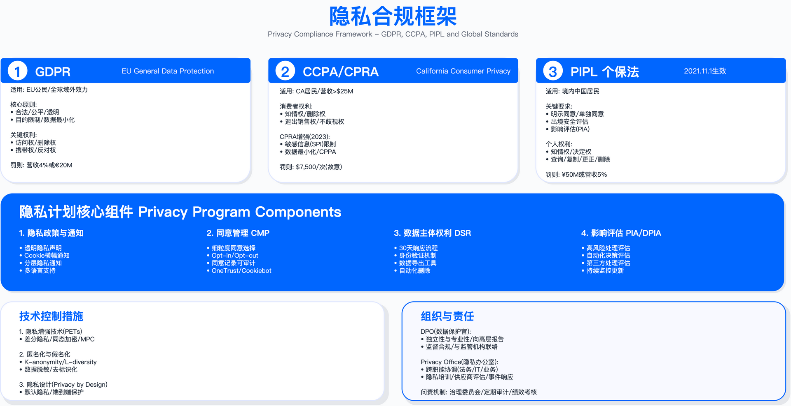

# 9.2　隐私治理框架

> 导读：治理框架解决的是"谁负责、谁决策、流程怎么跑"的问题。在此之前，9.1 已经确立了法规要求；在此之后，9.3 将处理具体的数据处理合法基础。本节的核心价值在于：将外部法规要求转化为内部组织能力，使隐私合规从"项目"变成"常态"。

---

## 概述

隐私治理与"项目式合规"的根本区别在于时间维度。项目式合规以法规生效为终点，治理则以生效为起点——将隐私保护嵌入文化、架构、决策和日常运营，形成持续运转的机制。

这种转变需要三个条件同时具备：组织架构清晰（谁负责）、流程制度完善（怎么做）、文化意识到位（为什么做）。三者缺一，都会使治理停留在表面。

适用边界：本节内容适用于需满足 GDPR、PIPL、CCPA 等法规要求的企业，尤其是跨国运营、处理大规模个人数据或涉及特殊类别数据的组织。对于仅在单一司法辖区运营且数据处理规模较小的企业，可根据实际情况简化组织架构，但核心流程（ROPA、培训）仍需建立。

---

## 9.2.1 隐私治理组织架构

### 三层治理模型

隐私治理通常采用"战略层 - 管理层 - 执行层"三级结构，实现决策权与执行责任的分层授权。

战略层由安全风险管理委员会（隐私专题，GRC 主导）承担，主席通常为 CISO 或 GRC 负责人，成员包括 CPO/DPO、法务、HR、CMO 等关键职能负责人。该层级职责是设定隐私战略方向、批准重大投资、审批高风险项目 DPIA，会议频率通常为季度。

管理层由数据保护官（DPO）或首席隐私官（CPO）领导，下设隐私运营、隐私法务、隐私工程、区域隐私官等职能团队。负责隐私计划的日常执行、监督合规状态、与监管机构沟通，工作节奏通常为月度。

执行层由隐私拥护者网络（privacy champions network）构成，即各业务单元、产品线、地区指定的隐私联络人。负责嵌入式隐私咨询、DPIA 执行协助、DSR 处理、培训传播等日常工作。

三层协同的关键在于职责边界清晰：战略层提供资源与决策授权，管理层制定标准与监督执行，执行层将隐私要求嵌入业务流程。三层之间沟通不畅或边界模糊，是治理流于形式的最主要原因。

关键约束：
- 组织架构设计需与企业现有治理结构匹配，避免为隐私单独设立与现有 GRC 体系割裂的委员会
- 隐私拥护者网络规模需与业务单元数量、数据处理复杂度匹配，过小则覆盖不足，过大则协调成本过高

常见误区：
1. 将隐私治理完全委托给法务部门，忽视技术实现与业务流程的参与，导致合规要求无法落地
2. 隐私拥护者仅作为"兼职角色"挂名，未分配实际工作时间，导致执行层形同虚设

---

### 数据保护官（DPO）角色详解

#### 强制任命情形

GDPR 第 37 条[1]规定了三类强制任命 DPO 的情形（对"核心活动""大规模""定期与系统性监控"三个关键词的解释见 WP29/EDPB 的 DPO 指南 WP243 rev.01[2]）：公共机构（政府部门、公立医院、公立大学，除法院行使司法职能外）；核心活动涉及大规模系统监控（如行为追踪广告平台、智能安防监控）；核心活动涉及大规模处理特殊类别数据（如医疗保健、基因检测、生物识别）。

对于一般 SaaS、电商、制造业等企业，GDPR 未强制要求任命 DPO，但实践中多数受 GDPR 约束的企业仍选择任命，作为监管沟通窗口和内部合规保障。

验证方法：判断是否需强制任命 DPO，需评估以下条件——是否属于公共机构；核心业务活动是否涉及对数据主体的定期、系统监控；是否大规模处理 Article 9 定义的特殊类别数据或 Article 10 定义的犯罪数据。任一条件满足即触发强制任命。

#### DPO 资质要求

DPO 需具备数据保护法律和实践的专业知识，理解企业业务模式和技术架构，具备风险评估与隐私影响分析能力。专业认证方面，IAPP 提供 CIPP/E（欧洲隐私法）、CIPM（隐私项目管理）、CIPT（隐私技术）三项认证，可作为能力验证参考。

#### DPO 独立性要求（Article 38）

独立性是 DPO 制度的核心设计，体现在四个层面：

汇报线：DPO 应直接向最高管理层（CEO、CISO 或总法律顾问）汇报，避免中间层级干预。

决策独立：DPO 不接受关于其职责执行的指示，管理层不能强制要求其改变专业意见。

职位保护：DPO 不因履行职责被解雇或处罚。

利益冲突规避：DPO 不能兼任决定数据处理目的和方式的角色。

利益冲突的典型场景包括：DPO 兼任 CMO/市场 VP（营销目标与隐私保护冲突）、兼任 CTO/产品 VP（产品创新速度与隐私审查冲突）、兼任 IT 安全主管（安全监控与数据最小化原则冲突）。EDPB Guidelines 认为法务总监兼任 DPO 原则上可行，但需证明其能独立行使 DPO 职责。

对于无法保障内部 DPO 独立性的企业，可采用"DPO 功能外包"模式，委托外部律所或咨询公司担任 DPO；或设立独立的 CPO 岗位直接向 CEO 汇报。

#### DPO 核心职责

监督合规：监督 GDPR/PIPL/CCPA 等法规的合规状态，审查 ROPA 完整性，监督 DPIA 执行质量，定期向管理层和安全风险管理委员会报告，准备监管审计材料。

咨询与建议：参与新产品/服务设计审查（privacy by design），就隐私影响向业务团队提供建议，指导隐私政策与 cookie 政策更新，评估第三方供应商隐私风险。

监管机构联络：担任监管机构（DPA）的联系点，代表企业与 DPA 沟通，协助监管调查和信息请求响应，提交强制通知（数据泄露通知、DPIA 咨询）。

内部培训与意识提升：制定年度隐私培训计划，组织全员基础培训和隐私拥护者深度培训，开展隐私意识活动。

运行指标：
- ROPA 覆盖率（已记录处理活动数 / 实际处理活动数）
- DPIA 完成率（高风险项目 DPIA 完成数 / 高风险项目总数）
- DSR 响应时效达标率（法定期限内响应数 / DSR 总数）
- 隐私培训完成率（已完成培训员工数 / 应培训员工数）

---

### 安全风险管理委员会（隐私专题）运作

隐私治理统一由 GRC 主导的安全风险管理委员会处理，不单独设立隐私委员会，以避免组织碎片化和决策分散。

#### 委员会构成与会议机制

| 角色 | 成员 |
|------|------|
| 主席 | CISO 或 GRC 负责人 |
| 投票成员 | CEO、CFO、CTO、首席法务官、CPO/DPO、CHRO、CMO |
| 顾问成员 | 外部隐私律师、区域隐私负责人、安全架构师 |

会议频率：定期会议每季度召开一次。以下情形触发特别会议：重大隐私事件、新法规生效、高风险产品上线、监管机构正式调查通知、并购活动涉及大规模数据传输。

#### 季度会议标准议程

常设议题：
- 隐私合规仪表板回顾（DPO 主持）：ROPA 完成度、DPIA 完成率、DSR 响应时效、培训完成率、隐私事件趋势
- 监管变化与影响评估（法务主持）：最新法规更新、对业务的影响评估、需采取的行动项
- 高风险项目审批（产品/工程主持）：DPIA 报告审查、风险缓解计划评估、批准决策

季度轮换议题：
- Q1：年度隐私战略与预算审批、年度培训计划审批
- Q2：供应商隐私审计结果、cookie 合规状态
- Q3：年中合规自评估、隐私工程能力建设评估
- Q4：年度回顾与下年度规划、第三方审计准备

#### 问题升级标准

以下情形需强制升级至委员会决策：高风险 DPIA（风险评分超过预设阈值，如新增大规模生物识别功能）；首次向新国家传输个人数据；达到需向监管机构报告级别的隐私事件；收到 DPA 调查通知；隐私项目预算超支超过预设比例；业务请求偏离隐私政策的例外申请。

DPO 可自行决策的事项：常规 DSR 处理、隐私政策文字修订（非实质变更）、低风险供应商 DPA 签署、员工隐私咨询答复。

验证方法：定期审计委员会决策记录，验证高风险事项是否按标准升级；抽查 DPO 自行决策事项，确认未越权处理应升级事项。

---

## 9.2.2 处理活动记录（ROPA）

### ROPA 法规要求与豁免

GDPR 第 30 条[1]要求控制者和处理者维护处理活动记录。强制适用对象：员工 250 人以上的企业；或处理活动非偶然且可能导致数据主体风险；或包含特殊类别数据（第 9 条）或犯罪数据（第 10 条）。需要注意第 30 条第 5 款的豁免是三个条件的"或"关系而非"且"关系——只要触发其中任何一项，250 人以下的企业同样须建立 ROPA[3]。

豁免仅适用于员工少于 250 人且仅进行偶发低风险处理的企业，实际场景中很少适用。几乎所有企业都应维护 ROPA，作为合规基石和监管审计的首要文档。

#### 控制者 ROPA 必须包含的内容

GDPR 要求控制者 ROPA 包含以下七项：

1. 控制者及 DPO 联系方式（公司名称、地址、DPO 邮箱）
2. 处理目的（为什么收集和使用数据）
3. 数据主体和数据类别（谁的数据、什么数据）
4. 接收方类别（谁能访问数据，含第三国接收方）
5. 第三国传输（目的地国家及保障措施，如 SCC/BCR/充分性认定）
6. 删除时限（数据保留期）
7. 技术和组织措施（安全措施概述）

#### 处理者 ROPA 必须包含的内容

处理者 ROPA 需包含：处理者及 DPO 联系方式；代表哪些控制者处理（客户列表）；处理活动类别（提供的服务类型）；第三国传输（目的地国家及保障措施）；技术和组织措施（安全措施概述）。

---

### ROPA 条目结构化模板

以客户关系管理（CRM）系统为例，展示 ROPA 条目的完整结构。

基础信息：ROPA 编号、处理活动名称、最后更新日期、审查者。

控制者信息：公司名称、地址、欧盟代表（如适用）、DPO 联系方式。

处理目的与合法基础：列明每项处理目的、描述、对应的合法基础及说明。例如，客户关系管理基于"合同履行"，营销通信基于"同意"。

数据主体与数据类别：列明涉及的数据主体类别（如现有客户、潜在客户、前客户）；列明个人数据类别（身份识别数据、商业数据、技术数据等）并标注是否属于特殊类别数据。

接收方：分内部接收方（如销售团队、市场团队、客户成功团队）和外部处理者。外部处理者需记录：供应商名称、服务类型、位置、DPA 签署状态、SCC 版本（如适用）。

第三国传输：记录目的地国家、接收方、保障措施、传输影响评估（TIA）完成状态、补充措施。

保留期限：需具体化，不能使用"根据业务需要"等模糊表述。例如：活跃客户数据保留至合同期间加法定保留期；非活跃客户数据在最后互动后特定期限删除或匿名化；营销同意记录在撤回后保留一定期限用于举证；日志保留特定天数。

技术和组织措施：技术措施包括加密（传输中、静态）、访问控制（RBAC、最小权限）、认证（SSO、MFA）、日志、备份；组织措施包括员工培训、保密协议、供应商管理、事件响应流程。

DPIA 评估：记录是否需要 DPIA 及理由。

数据主体权利程序：记录各权利的实现方式和响应渠道。

批准与审查：记录批准人、批准日期、下次审查日期、审查触发条件。

---

### ROPA 维护流程

#### 创建新 ROPA 条目流程

业务发起：产品或工程团队提交"处理活动申报表"，说明新增或变更的数据处理活动。

信息收集：通过标准化问卷收集信息，问题涵盖：为什么需要这些数据、收集哪些个人数据、从哪里收集、涉及哪类人群、合法基础是什么、数据会分享给谁、是否跨境传输、保留多久。

DPO 审查：完整性检查（七项必填是否齐全）、合法基础验证、跨境传输保障措施确认、DPIA 需求判断。

批准与记录：DPO 签署后录入 ROPA 系统，通知业务团队。

#### ROPA 完整性检查清单

必填项检查（七项）：
- [ ] 控制者及 DPO 联系方式已填写
- [ ] 处理目的明确且具体
- [ ] 数据主体和数据类别已列明
- [ ] 接收方完整（内部和外部）
- [ ] 保留期限具体化
- [ ] 安全措施已概述
- [ ] 跨境传输保障措施已记录（如适用）

深度检查（五项）：
- [ ] 跨境传输是否有 SCC/BCR/充分性认定
- [ ] 是否需要 DPIA（大规模处理、特殊类别数据、系统监控）
- [ ] 保留期限是否符合"存储期限限制"原则
- [ ] 合法基础是否有文档支持
- [ ] 子处理者是否签署 DPA

#### 季度 ROPA 审查机制

审查目标：覆盖率目标为所有处理活动均有 ROPA 记录；时效性目标为无超过审查周期未更新的记录；准确性目标为记录信息与实际处理一致（通过抽样验证）。

审查输出：过期记录需由业务负责人在规定期限内更新；不完整记录由 DPO 跟进补齐；高风险活动（DPIA 评分超阈值）提交委员会审批。

常见误区：
1. 保留期限使用模糊表述（如"根据业务需要"、"合理期限"），无法满足 GDPR 存储期限限制原则
2. 跨境传输仅依赖 SCC 签署，未完成传输影响评估（TIA），不符合 Schrems II 判决后的要求
3. ROPA 仅在系统上线时创建，后续处理活动变更未触发更新

验证方法：季度抽取一定比例的 ROPA 条目，与实际系统配置和数据流进行比对，验证记录准确性；检查子处理者 DPA 有效期，识别过期未续签的情况。

---

## 9.2.3 隐私培训与意识提升

### 分层培训矩阵

隐私培训根据受众角色和职责深度分层设计，形成覆盖全员的培训体系。

#### Tier 1：全员基础培训

目标受众：所有员工

频率：年度必修，新员工入职时完成

形式：在线课程配合测验

核心主题：隐私基础（什么是个人数据）、主流法规核心原则（GDPR/PIPL/CCPA）、员工的隐私责任、如何识别隐私风险、数据泄露报告流程、真实案例分析。

评估：测验需达到设定的正确率阈值方可通过。

运行指标：新员工培训完成率、年度复训完成率。

#### Tier 2：隐私拥护者深度培训

目标受众：各业务单元、产品线、地区的隐私联络人

频率：季度培训配合按需专题

形式：现场研讨会或虚拟培训

核心主题：ROPA 编制实操、DPIA 执行步骤、DSR 处理流程、供应商隐私审查、privacy by design 原则、案例分析与小组讨论。

实操练习：模拟 DPIA 评估（小组完成真实场景）。

#### Tier 3：高风险角色专项培训

针对特定角色设计专项培训内容：

| 角色 | 重点培训内容 |
|------|------------|
| 产品经理 | privacy by design 实践、功能设计中的隐私考虑、DPIA 触发条件、用户同意收集方式、暗黑模式（dark patterns）规避 |
| 工程师 | 安全编码与数据泄露防护、最小权限原则实施、数据匿名化技术、日志记录的隐私风险、第三方 SDK 隐私评估 |
| 数据科学家 | differential privacy、federated learning、模型解释性与 GDPR Article 22 自动化决策要求、训练数据中的 PII 检测、合成数据生成 |
| 市场团队 | 营销同意管理、CCPA opt-out 要求、第三方营销工具隐私审查、cookie 合规、客户数据分段的隐私边界 |
| HR 团队 | 员工数据特殊保护、招聘中的隐私合规、绩效数据保留、员工监控的合法性、离职员工数据处理 |

#### Tier 4：高管简报

目标受众：CEO、CFO、CTO、董事会

频率：年度常规简报，重大事件时专题简报

形式：仪表板配合执行摘要

核心主题：全球隐私监管趋势、重大处罚案例与启示、公司隐私合规状态（关键指标）、隐私投资价值、隐私作为竞争优势的案例。

---

### 培训效果度量体系

培训效果度量应覆盖从参与到行为改变的完整链条。

#### 参与度指标（领先指标）

跟踪培训完成率、平均完成时间、中途退出率。完成率未达标时，可通过自动提醒、经理问责等方式改进；退出率过高时，需优化课程设计、增加互动性。

#### 知识保留指标（中间指标）

通过即时后测、培训后三个月和六个月的保留测试评估知识掌握与遗忘曲线。若保留测试得分下降明显，可引入间隔重复（spaced repetition）机制强化记忆。

#### 行为改变指标（滞后指标）

核心改进证据包括：DSR 响应时间变化（培训前后对比）、privacy by design 采纳率（新产品 DPIA 覆盖率变化）、员工主动风险报告数量变化（正向指标，数量增加表示意识提升）。

#### 合规成果指标（业务成果）

内部审计隐私问题发现数量变化、重复违规率变化。这些指标反映培训对实际合规状态的影响。

验证方法：通过对照组设计评估培训效果——对部分员工提前培训，比较其与未培训员工在知识测试和行为指标上的差异。

---

### 培训创新实践

#### 游戏化机制

引入积分系统激励参与：完成模块、测验满分、帮助同事、识别实际隐私风险等行为均可获得积分。设置徽章体系标识不同能力等级。可设置部门内竞争排行榜，定期表彰表现优异者。

挑战活动示例：隐私侦探活动（识别日常工作中的隐私风险并报告）、DPIA 马拉松（限时完成模拟 DPIA）。

#### 微学习（microlearning）

每周短时长视频配合情景题，主题选取真实案例，如 cookie 横幅设计错误案例、营销邮件退订要求、员工数据最小化实例。微学习的优势在于持续强化，符合成人学习规律中的间隔重复效应。

关键约束：
- 游戏化机制的激励设计需与企业文化匹配，避免过度竞争导致负面效果
- 微学习内容需保持更新频率，使用过时案例将降低培训可信度

---

## 9.2.4 隐私治理成熟度模型

### 五级成熟度框架

| 级别 | 特征 | 典型场景 |
|------|------|---------|
| M1 被动合规 | 无专职 DPO，仅在监管压力下响应，无 ROPA | 初创企业或非欧盟市场企业 |
| M2 项目式合规 | 任命兼职 DPO，建立基础 ROPA，为法规生效进行突击准备 | 首次进入欧盟市场的中小企业 |
| M3 持续合规 | 专职 DPO 团队，完整 ROPA 与 DPIA 流程，季度审查机制 | 成熟的欧美市场主体企业 |
| M4 主动管理 | 建立隐私拥护者网络，privacy by design 嵌入产品开发，部署自动化工具 | 大型科技公司 |
| M5 隐私领先 | 将隐私作为竞争优势，投入 PETs 研发，参与行业标准制定 | Apple、Signal、DuckDuckGo |

多数企业应以 M3 持续合规为初期目标，在此基础上逐步演进。

### 成熟度自评问卷

1. 是否任命独立 DPO 并提供充足资源
2. 是否维护完整的 ROPA（覆盖绝大多数处理活动）
3. 高风险项目是否强制执行 DPIA
4. 是否有正式的安全风险管理委员会（隐私专题）
5. 全员隐私培训完成率是否达到目标水平
6. DSR 平均响应时间是否在法定期限内
7. 是否部署自动化隐私工具（CMP/DSR/DPIA）
8. 隐私政策是否定期审查更新
9. 是否进行定期第三方隐私审计
10. privacy by design 是否嵌入产品开发流程

较少肯定回答（0-2）对应 M1；部分肯定（3-4）对应 M2；过半肯定（5-6）对应 M3；较多肯定（7-8）对应 M4；绝大多数或全部对应 M5。

---

## 本节小结

隐私治理是持续的组织能力建设，而非一次性合规项目。

组织维度：三层治理架构实现决策与执行分层；DPO 独立性是制度保障的核心；跨部门协作（法务、IT、产品、市场）是治理有效运转的前提，不能仅依赖 DPO 一人之责。

流程维度：ROPA 是合规基石，需覆盖所有处理活动并保持更新；问题升级机制确保高风险事项得到委员会层面的决策。

文化维度：分层培训体系覆盖全员基础、拥护者深度、高风险角色专项、高管简报四个层次；效果度量从参与度、知识保留、行为改变到合规成果形成完整链条。

需规避的常见陷阱：
1. 形式主义：ROPA 记录不完整或过期，DPIA 走过场不深入评估风险
2. 孤岛作战：DPO 与业务团队脱节，成为"合规警察"而非业务顾问
3. 工具迷信：购买 GRC 平台但无流程支撑，工具利用率低
4. 培训无效：仅进行形式化培训，无效果度量，员工行为无实质改变

---

## 延伸阅读

监管指南：
- EDPB: Guidelines on Data Protection Officers (DPOs) - WP243 rev.01
- EDPB: Guidelines on Records of Processing Activities - Article 30
- ICO: Accountability and governance toolkit

行业框架：
- ISO/IEC 27701:2025（2019 版已被取代；新版由 27001 扩展标准改为独立可认证的管理体系标准） - Privacy Information Management System
- NIST Privacy Framework: Core Functions (Identify-Govern-Control-Communicate-Protect)
- AICPA SOC 2: Privacy criteria

专业认证：
- IAPP CIPM: Certified Information Privacy Manager
- IAPP CIPP/E: Certified Information Privacy Professional/Europe
- ISACA CDPSE: Certified Data Privacy Solutions Engineer

---

## 参考文献

| # | 来源 | 标题 | 日期 | 链接 |
| --- | --- | --- | --- | --- |
| [1] | EUR-Lex（欧盟官方公报） | Regulation (EU) 2016/679（GDPR）——第 30 条（处理活动记录）、第 37 至 39 条（DPO 的指定、地位与任务） | 2016-04-27 | <https://eur-lex.europa.eu/eli/reg/2016/679/oj> |
| [2] | 第 29 条工作组（WP29，经 EDPB 背书） | WP 243 rev.01, Guidelines on Data Protection Officers ('DPOs')（2016-12-13 通过，2017-04-05 最后修订） | 2017-04-05 | <https://ec.europa.eu/newsroom/article29/items/612048> |
| [3] | 第 29 条工作组（WP29） | Position paper on the derogations from the obligation to maintain records of processing activities pursuant to Article 30(5) GDPR | 2018-04-19 | <https://www.edpb.europa.eu/our-work-tools/our-documents/guidelines/position-paper-derogations-obligation-maintain-records_en> |

---

## 导航

[← 上一节：9.1 全球隐私法规体系](./9.1_全球隐私法规体系.md) | [返回章节目录](./README.md) | [下一节：9.3 个人数据处理合规 →](./9.3_个人数据处理合规.md)

---

© 2025-2026 AISecOps Project. Licensed under CC BY-NC-SA 4.0
