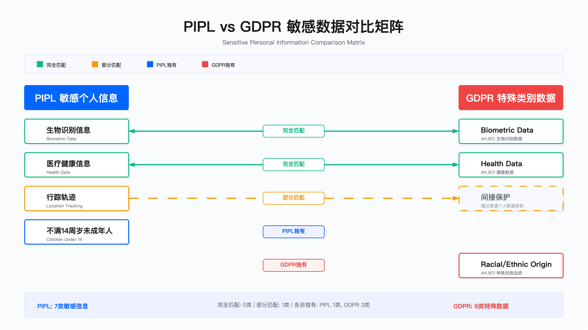

# 9.3　个人数据处理合规

> 导读：处理合规的难点不在于记住条文，而在于将法规要求转化为工程决策。9.1 给出了法规地图，9.2 建立了治理组织，本节解决的是具体数据处理活动的合规判断：哪些数据受约束、以哪种合法基础处理、什么情况必须做影响评估、特殊类别数据有哪些额外门槛。9.4 接续处理数据主体权利的实现。

---

## 概述

个人数据处理合规构成隐私法规的核心要求。企业需完成四项关键工作：准确识别个人数据并建立分类体系、为每类处理活动选择合法基础、对高风险处理活动执行数据保护影响评估（DPIA）、对特殊类别数据和儿童数据采取增强保护措施。本节从工程落地视角，阐述各环节的决策要点、约束条件与验证方法。

这四项工作有一条隐含的依赖链：识别与分类是前提，只有先知道"手里有哪些个人数据、属于什么风险等级"，后续三步才有对象；合法基础决定了这批数据被允许怎么用；DPIA 是对高风险用法的把关；特殊类别与儿童数据则是在通用规则之上叠加的额外门槛。

---

## 9.3.1 个人数据的识别与分类

### 全球法规对"个人数据"的定义差异

识别工作的第一道坎，是不同法规连"什么算个人数据"都没有统一答案。这不是学术分歧，而是直接决定数据发现工具要扫多宽——把定义定窄了会漏报，定宽了又会把大量非目标字段拖进合规流程、抬高成本。下表横向对比三大法规的边界，"关键范围扩展"一列标出各法规相对彼此多出来的覆盖面：

| 法规 | 核心定义 | 关键范围扩展 | 独特要求 |
|------|---------|-------------|---------|
| GDPR | 已识别或可识别自然人相关的任何信息 | 在线标识符纳入保护范围（IP 地址、Cookie、设备 ID、RFID 标签） | 可识别性判断需考虑"合理可能使用的手段" |
| PIPL | 以电子或其他方式记录的与已识别或可识别自然人有关的各种信息 | 明确排除匿名化数据 | 敏感信息范围更广，含行踪轨迹、未满 14 周岁信息 |
| CCPA/CPRA | 直接或间接识别、关联、描述、能够与特定消费者或家庭关联的信息 | 家庭级数据（household data）受保护 | 包含推断数据（性格、倾向、行为） |

三者的关键差异在于覆盖范围的侧重：GDPR 采用最宽泛的定义（含在线标识符），对技术团队的数据发现覆盖度要求最高；CCPA 将保护范围扩展至家庭级别与推断数据，增加了数据分类的复杂度；PIPL 则将未满 14 周岁信息直接归入敏感类别，触发更严格的处理要求。

对多法域运营的企业而言，这张表的实操含义是：数据发现工具的检测范围应当以最宽的定义为准取并集，而不是按单一法规裁剪。否则一旦业务扩展到新法域，先前"合规"的分类结果会立刻出现缺口——比如按 CCPA 忽略了推断数据，进入欧盟场景时这些字段仍需按 GDPR 纳管。

### 个人数据分类框架

识别出个人数据之后，紧接着要回答"它有多敏感"。分类的价值在于让保护措施与风险等级挂钩——不可能对所有个人数据都上最高强度的保护，否则成本不可承受；分级正是为了把有限的加密、访问控制、审计资源投到最该保护的地方。企业通常采用三层分类体系，将识别难度与风险等级对应起来。该分类与 [8.2 数据分类与标记](../第08章_数据安全/8.2_数据分类与标记.md) 中的四级通用分类体系对齐，确保隐私合规要求与数据安全保护措施一致——这条对齐关系不是形式上的，它决定了同一份数据在"隐私侧"和"安全侧"不会给出互相矛盾的保护指令：

| 分类层级 | 定义 | 典型示例 | 风险等级 | 保护要求 | 对应通用分级 |
|---------|------|---------|---------|---------|-------------|
| 直接标识符 | 单独即可识别个人 | 姓名、邮箱、电话、身份证号、护照号、社保号 | 高 | 加密存储、严格访问控制、审计日志 | Confidential |
| 准标识符 | 组合后可识别 | 邮编 + 年龄 + 性别、IP 地址 + 时间戳、设备 ID + 位置 | 中 | 假名化/匿名化处理、限制组合查询 | Internal - Confidential |
| 敏感数据（特殊类别）<br>GDPR Art.9 / PIPL Art.28 | 可能造成歧视或重大伤害 | 健康信息、生物识别、种族、宗教、性取向、工会、基因、14 岁以下儿童数据 | 极高 | 单独同意、最小化处理、DPIA、加密、访问限制 | Restricted |

三层中，直接标识符和敏感数据的判断相对直观，最容易出错的是中间的"准标识符"。它是唯一一个"单看字段无法定级、必须结合上下文才能判断"的层级：邮编、年龄、性别单独看都不敏感，一旦组合就可能定位到具体个人。这一层的保护要求（假名化、限制组合查询）本质上是在阻断"组合可识别"这条路径，而非保护单个字段本身。



适用边界：该三层分类适用于结构化数据库与半结构化文档的初始分类；对于非结构化数据（如邮件正文、即时通讯记录），需结合内容识别技术进行动态分类。

关键约束：
- 准标识符的"可识别性"判断依赖上下文——同一字段组合在不同数据集中的可识别性不同
- 分类标准需与数据发现工具的检测规则对齐，否则产生系统性漏报或误报

常见误区：
1. 将分类视为一次性工作，忽略数据生命周期中的动态再分类（如用户画像数据随时间积累可能升级为敏感数据）
2. 仅依赖列名启发式分类，忽略字段内容的实际语义（如"备注"字段可能存储身份证号）

这两个误区之所以值得单列，是因为它们对应的是分类落地时两类系统性失效：前者是"时间维度"的失效——分类正确但没跟上数据演变；后者是"空间维度"的失效——扫描逻辑只看结构不看内容，结果把藏在自由文本里的敏感数据整批漏掉。二者都是方法论选择不当带来的必然结果，不属个案疏漏。

### 自动化 PII 识别技术实践

明确了分类标准，下一个工程问题是"用什么手段把 PII 从海量数据里自动找出来"。没有任何单一技术能同时做到快、准、廉且覆盖所有数据形态，因此实践中总是多种方法组合。下表列出常见技术的对比，各方法的优势往往正对应着另一种方法的短板，这是它们能互补的原因：

| 技术方法 | 实现方式 | 优势 | 局限性 | 成本 |
|---------|---------|------|--------|------|
| 正则表达式匹配 | 模式库匹配（邮箱、电话、身份证） | 速度快、准确率高、无需训练 | 仅限格式化数据、易产生误报 | 低 |
| NER 命名实体识别 | 机器学习模型识别人名、地点 | 可识别自然语言中的 PII | 需要训练数据、中文支持待优化 | 中 |
| 数据库扫描 | 基于列名/数据特征启发式 | 覆盖结构化数据 | 依赖命名规范、假阳性率高 | 低 |
| 内容指纹 | 数据指纹 + 敏感词库 | 可发现重复敏感文档 | 无法识别未见过的模式 | 低 |
| 上下文分析 | AI 理解语义上下文 | 准确率较高、语言无关 | 计算成本高、延迟大 | 高 |

实践中，正则表达式适合处理格式化字段（邮箱、电话、身份证号），NER 适合扫描非结构化文本，两者组合覆盖大多数场景。上下文分析成本高，通常只用于高价值数据资产的精细扫描。

这五种方法构成清晰的成本—能力权衡曲线：越往下，方法越能理解语义，但计算成本和延迟也越高。合理的部署策略是分层——用低成本的正则和数据库扫描做全量粗筛，NER 处理自由文本，把昂贵的上下文分析留给最需要精确判断的高价值资产。把上下文分析无差别地铺到全量数据上，是一种典型的成本失控做法。

验证方法：
- 使用已标注的测试数据集评估各技术的准确率与召回率
- 对误报案例进行分类分析，识别规则调优方向
- 定期抽样人工复审，验证自动化分类结果的可靠性

运行指标：
- PII 发现覆盖率：已扫描数据源占生产数据源总数的比例
- 分类准确率：人工复审样本中分类正确的比例
- 误报率：标记为敏感但实际非敏感的记录占比

准确率与召回率的取舍在合规语境下并不对称：漏掉一条敏感数据（低召回）意味着合规缺口，而误报（低准确率）只是增加人工复审负担。因此上述指标不能孤立看单点数值，覆盖率与召回反映"有没有漏"，误报率反映人工复审的实际负荷——真实的调优是在这两端之间找平衡，而非单纯追求某一个数字好看。

### 个人数据识别决策树

前面的表格分别回答了"定义""分级""用什么工具"，落到一条具体数据元素上，还需要一个结构化的判断顺序。下面这棵决策树从"是否与自然人相关"这个最粗的过滤开始，逐层收窄，最终把每个数据元素归到"非个人数据 / 直接标识符 / 准标识符 / 普通个人数据 / 敏感数据"之一：

```
┌─ 数据元素 ────────────────────────────────────────┐
│                                                   │
├─ 问题 1: 是否与自然人相关？                       │
│   ├─ 否 → 非个人数据（如公司名称）                 │
│   └─ 是 → 继续                                    │
│                                                   │
├─ 问题 2: 是否单独可识别个人？                     │
│   ├─ 是 → 直接标识符（高风险）                     │
│   └─ 否 → 继续                                    │
│                                                   │
├─ 问题 3: 是否与其他数据组合后可识别？              │
│   ├─ 是 → 准标识符（中风险）                       │
│   └─ 否 → 继续                                    │
│                                                   │
├─ 问题 4: 是否已不可逆匿名化？                     │
│   ├─ 是 → 非个人数据（GDPR Recital 26）            │
│   │       注意：PIPL 要求"无法识别且不能复原"       │
│   └─ 否 → 个人数据                                │
│                                                   │
└─ 问题 5（若为个人数据）: 是否属于特殊类别？        │
    ├─ 健康 / 生物识别 / 种族 / 宗教 / 性取向等      │
    │   → 敏感数据（极高风险，GDPR Art.9 禁止原则）   │
    └─ 否 → 普通个人数据                            │
```

其中问题 4 最需要谨慎。"匿名化"是个门槛极高的判定——它要求不可逆，一旦满足就把数据整体移出个人数据范畴、豁免后续所有义务，因此也最容易被误判：把仅仅"假名化"（可通过密钥还原）的数据错认为"匿名化"，是实践中把敏感数据当普通数据处理的常见起点。GDPR 与 PIPL 在此处措辞存在细微差别（PIPL 要求"无法识别且不能复原"），这条边界须按具体法规的严格标准判断，不能凭直觉。

---

## 9.3.2 合法基础的选择

### GDPR 六项合法基础对比

识别与分类回答了"这是什么数据"，合法基础回答的是"凭什么处理它"。GDPR 的一条根本原则是：任何个人数据处理都必须挂靠至少一项合法基础，没有基础的处理即为违法。因此选基础不是可有可无的法律形式，而是每个处理活动上线前的准入门槛——而且这个选择会一路传导到系统设计。下表列出六项基础及其适用场景与实施要求：

| 合法基础 | 适用场景 | 实施要求 | 风险等级 |
|---------|---------|---------|---------|
| (a) 同意 | 营销邮件、非必要 Cookie、第三方分享 | 自由给予、具体、知情、明确表示、可撤回 | 高 |
| (b) 合同履行 | 电商订单、SaaS 账户、物流配送 | 处理对合同履行必要，或签约前准备 | 中 |
| (c) 法律义务 | 税务申报、反洗钱、劳动法合规 | 需 EU/成员国法律明确要求 | 低 |
| (d) 生命利益 | 医疗急救、灾难救援 | 仅当无法通过其他方式保护生命 | 低 |
| (e) 公共任务 | 政府服务、公共卫生 | 需法律授权公共职能 | 低 |
| (f) 合法利益 | 网络安全、欺诈检测、直接营销（现有客户） | 三步测试：目的正当 + 必要 + 平衡测试（LIA） | 中-高 |

选择原则：同意基础提供最高灵活性但管理成本高（需证明有效同意、处理撤回）；合同履行基础最稳定但适用范围狭窄；合法利益基础最灵活但易被挑战，需准备完整的 LIA 文档。

选择哪个基础不只是法律判断，也决定了系统的工程设计。表中"风险等级"一列本质上是"工程负担"的代理指标——同意基础风险最高，是因为它要求系统必须实现同意记录、撤回机制、按目的拆分等一整套机制；合同履行和法律义务风险低，是因为处理事实本身即构成正当性，系统几乎不需要额外的同意管理基建。法律团队选基础的那一刻，也在替工程团队决定了要建多少东西。一个常见的隐性成本陷阱是：因为营销场景默认想到"同意"，就给本可用合法利益覆盖的现有客户营销也套上了同意机制，白白背上了记录与撤回的负担。

### 合法基础选择常见错误

真正的风险集中在"选错或滥用"。下表归纳监管执法中反复出现的四类错误模式，以及对应的监管定性逻辑与纠正方向：

| 错误行为 | 监管机构观点 | 正确做法 |
|---------|-------------|---------|
| "同意墙" | 将同意作为访问服务的条件 → 同意非"自由给予" | 提供"拒绝后仍可使用"选项，或切换到合法利益 |
| 超范围同意 | 一次同意覆盖多个目的 → 违反"具体性"要求 | 按目的分开请求同意（如：营销邮件/数据分析/第三方分享） |
| 合同履行滥用 | 将非必要处理伪装成"合同履行" | 仅用于订单处理/交付等核心合同功能 |
| 合法利益未做 LIA | 声称合法利益但无法提供平衡测试文档 | 为每个合法利益用例准备 LIA 文档 |

这四条错误可以归到两个根因上：前两条都源于对"同意"要件的偷工减料——把"自由给予"和"具体"这两个法定属性当成可以绕过的形式（EDPB 关于同意的指南对这两项要件、以及"同意墙"为何通常无效有专门论述[3]），结果同意在法律上无效；后两条则源于对基础的"张冠李戴"——要么用合同履行给非必要处理背书，要么口头声称合法利益却不做支撑它的评估文档。工程上尤其要警惕"合法利益未做 LIA"：它不会在功能上暴露任何问题，系统照常运行，直到监管质询到来才发现根本拿不出证明文件，是最隐蔽的一类合规负债。

关键约束：
- 合法基础一旦选定，后续变更需重新告知数据主体
- 敏感数据处理不能仅依赖 Article 6 合法基础，还需满足 Article 9(2) 例外条件

第二条约束尤为关键：Article 6 的六项基础对普通个人数据是充分的，但一旦触及特殊类别数据，还须同时满足 9.3.4 讨论的 Article 9(2) 例外条件——两层基础缺一不可，仅凭合同履行等 Article 6 基础处理健康数据即构成违规。

### 合法利益评估（LIA）框架

六项基础里，合法利益（f）是唯一一项"灵活但自证成本最高"的选择。它没有同意那样明确的用户动作作为凭据，也不像合同履行那样有客观事实支撑，正当性完全依赖企业自己的论证。GDPR 为此规定了三步测试作为论证结构。下面的流程图展示了这三步的递进关系——顺序不可颠倒：先确认目的合法（否则后面无从谈起），再确认处理是实现该目的的必要手段（能用侵入性更小的方式就不该用当前方式），最后才做企业利益与个人权利的平衡：

```
┌─ Step 1: 目的测试 ──────────────────────────────┐
│ 问题：处理目的是否合法且足够明确？               │
│ 合法示例：网络安全监控/欺诈检测/直接营销         │
│ 不合法示例：非法活动/误导性营销                  │
└─────────────────────────────────────────────────┘
                        ↓
┌─ Step 2: 必要性测试 ────────────────────────────┐
│ 问题：处理是否是实现目的的必要手段？             │
│ 检查要点：                                       │
│   • 是否有侵入性更小的替代方案？                 │
│   • 数据是否最小化？                             │
│   • 保留期限是否合理？                           │
└─────────────────────────────────────────────────┘
                        ↓
┌─ Step 3: 平衡测试 ──────────────────────────────┐
│ 问题：企业利益是否超过个人权利/自由？            │
│ 考虑因素：                                       │
│   • 数据主体的合理期望                           │
│   • 数据的性质和敏感性                           │
│   • 处理的方式和影响                             │
│   • 数据主体与控制者的关系                       │
│   • 是否提供了 opt-out 机制                      │
└─────────────────────────────────────────────────┘
```

三步中，前两步相对客观，真正的判断重心落在 Step 3 的平衡测试上。它列出的五个考虑因素，核心都围绕"数据主体的合理期望"展开——用户在什么关系下、就什么性质的数据、是否被预告过——企业利益越是超出用户的合理预期，天平就越难倒向企业。"是否提供 opt-out 机制"也是平衡测试的考虑因素之一：通过赋予用户反对权，企业可以把原本失衡的天平重新拉回可接受区间。

LIA 文档必填要素：

三步测试是判断逻辑，LIA 文档则是把这套逻辑固化成可被监管审查的证据。下表逐项列出文档必须回答的问题，并以欺诈检测场景为示例说明各项的论证方式：

| 必填要素 | 说明 | 示例 |
|---------|------|------|
| 处理目的 | 企业寻求实现的具体利益 | "检测和预防信用卡欺诈" |
| 处理方式 | 收集哪些数据、如何使用、保留多久 | "分析近 90 天交易模式、设备指纹、IP 地理位置" |
| 合理期望 | 数据主体是否预期此用途 | "用户注册时告知反欺诈措施，符合合理期望" |
| 替代方案 | 是否考虑了其他实现方式 | "评估了基于同意的方案，但欺诈分子会拒绝同意" |
| 数据主体影响 | 对个人权利的潜在影响 | "误报可能导致交易被拒，已设人工复审" |
| 保障措施 | 减轻影响的技术/组织措施 | "假名化处理 + 访问限制 + 人工复审权" |
| opt-out 机制 | 是否提供反对权 | "用户可反对，但账户可能被限制（告知后果）" |
| 平衡结论 | 为何企业利益超过个人权利 | "保护所有用户免受欺诈的公共利益 > 个人便利性影响" |

示例列里藏着一个值得注意的论证技巧："替代方案"一栏用"欺诈分子会拒绝同意"来说明为何不改用同意基础——这正是合法利益区别于同意的典型场景：当处理目的本身会被目标对象规避时，同意机制反而失效，合法利益才是恰当选择。这类论证要把"为什么非用合法利益不可"讲清楚，不能写成套话，它正是文档能否顶住质询的关键。

适用边界：合法利益适用于网络安全日志分析、现有客户直接营销；不适用于儿童数据的任何营销、敏感数据处理、从购买名单获取的新客户营销。

验证方法：
- 法务审查 LIA 文档的完整性与逻辑自洽性
- 模拟监管质询场景，测试 LIA 文档能否回答典型问题
- 定期复审 LIA 结论是否因业务变化而失效

三条验证方法里，"定期复审"最容易被忽视却最关键：LIA 的平衡结论是基于评估当时的业务事实做出的，一旦数据用途扩展、保留期延长或用户关系改变，原先成立的平衡可能已经失效，而文档却还停留在旧结论上。合法利益不是"一次论证、永久有效"的基础，这也是它比同意、合同履行更需要持续维护的原因。

---

## 9.3.3 数据保护影响评估（DPIA）

### DPIA 触发条件

合法基础解决了"能不能处理"，DPIA 解决的是"高风险处理在做之前要不要先做一次系统性风险自查"。DPIA 成本不低，因此法规并不要求所有处理都做——关键在于准确判断"何时必须做"。这里存在两套判断标准：GDPR 第 35 条给出的三类强制情形[1]，以及 WP29 的 DPIA 指南 WP248 rev.01（已由 EDPB 背书）列出的九项参考标准——该指南的口径是：命中其中两项通常即应视为高风险处理[2]。先看强制情形，读表时抓住三类的共性——它们都指向"规模大 + 影响重"这个组合：

| 触发情形 | GDPR 原文要点 | 典型场景 |
|---------|---------------|---------|
| 系统性大规模评估 | 基于自动化处理（含 profiling）的系统性和广泛评估，并作为对个人产生法律效力或类似重大影响的决策依据 | 信用评分系统、保险自动定价、招聘算法筛选、贷款审批 AI |
| 大规模特殊类别数据 | 大规模处理 Article 9 特殊类别或 Article 10 犯罪数据 | 医疗健康平台、基因检测服务、员工健康监测、背景调查系统 |
| 大规模系统监控 | 大规模系统性监控公共可访问区域 | 城市级视频监控 + 人脸识别、商场客流追踪、智能楼宇全方位监控 |

三类强制情形恰好对应三种典型的高风险处理形态：自动化决策（算法替人做出有法律效力的判断）、敏感数据的规模化处理、公共空间的系统性监控。它们的共同特征是"个体一旦受损，损害往往不可逆或难以救济"——被算法误判拒贷、健康数据泄露、行踪被持续监控，都不是事后道歉能弥补的。这也解释了为什么法规选择在这些场景强制前置评估，而非事后追责。

EDPB 额外触发标准（9 项）——符合 2 项或更多强烈建议执行 DPIA：

三类强制情形是硬门槛，但现实中大量处理活动处于模糊地带——既不完全落入强制情形，又明显有风险。EDPB 的九项标准正是为这片灰色地带提供的量化判据：符合两项及以上就强烈建议执行。这九项标准更宜当作一份"风险信号清单"——处理活动命中的信号越多，越应该把 DPIA 当作默认动作而非可选项：

| 标准 | 说明 |
|------|------|
| 评估 / 评分 | profiling 和预测 |
| 自动化决策 + 法律 / 重大影响 | 无人工干预的决策 |
| 系统性监控 | 持续 / 定期监控 |
| 敏感数据 | Article 9 或 10 数据 |
| 大规模处理 | 大量数据主体 |
| 数据集匹配 / 组合 | 来自不同来源 |
| 弱势群体数据 | 儿童、员工、精神病患者、难民 |
| 创新技术 | AI、区块链、IoT、人脸识别 |
| 阻止权利行使 | 阻止访问服务 / 合同 |

常见误区：
1. 推荐系统（如内容推荐）通常不触发 DPIA（无法律效力），但若用于儿童仍建议执行
2. 单个摄像头通常不触发 DPIA，需满足"系统性 + 大规模 + 公共区域"才触发
3. "大规模"无具体数字定义，需综合考虑数据主体数量、数据量、持续时间、地理范围

这三个误区共同指向一个判断陷阱：触发条件不能机械套用，而要看"要素是否叠加"。推荐系统本身不触发，叠加"儿童"这个弱势群体因素后风险质变；单个摄像头不触发，但"系统性 + 大规模 + 公共"三要素齐备就触发。第三条尤其提醒工程团队不要指望一个明确的数字阈值来自动判定——"大规模"是多维度的综合判断，把它做成一条简单的记录数比较逻辑，几乎必然误判。

### DPIA 执行流程

判定需要做 DPIA 之后，接下来是"怎么做"。DPIA 不是填一张表，而是一套有先后依赖的流程：前一阶段的产出是后一阶段的输入。下面的八阶段流程图把这条链条完整铺开，读的时候重点抓阶段间的依赖箭头——阶段 2 描述出的数据流图是阶段 4 识别风险的地图，阶段 5 设计的缓解措施直接决定阶段 6 剩余风险的高低，任何中间环节被简化都会让后续判断建立在残缺信息上：

```
┌─ 阶段 1: 启动 ─────────────────────────────────┐
│ 1.1 判断是否需要 DPIA（触发条件检查）             │
│ 1.2 任命 DPIA 团队（项目负责人 + DPO + 技术专家） │
│ 1.3 确定处理活动范围                             │
└────────────────────┬────────────────────────────┘
                     ↓
┌─ 阶段 2: 描述 ─────────────────────────────────┐
│ 2.1 详细描述处理活动                             │
│     • 性质（what）：收集哪些数据                  │
│     • 范围（scope）：多少人、哪些类别             │
│     • 背景（context）：与数据主体关系、合理期望   │
│     • 目的（purpose）：为什么需要                 │
│     • 方式（how）：技术架构、自动化程度           │
│ 2.2 绘制数据流图（收集 → 存储 → 使用 → 共享 → 删除）│
│ 2.3 识别涉及的处理者和第三方                     │
└────────────────────┬────────────────────────────┘
                     ↓
┌─ 阶段 3: 合规性评估 ───────────────────────────┐
│ 3.1 合法基础确认（Article 6 或 9）               │
│ 3.2 数据最小化检查                               │
│ 3.3 目的限制检查                                 │
│ 3.4 保留期限明确                                 │
│ 3.5 准确性保障                                   │
│ 3.6 咨询数据主体或其代表（如适用）               │
└────────────────────┬────────────────────────────┘
                     ↓
┌─ 阶段 4: 风险识别与评估 ───────────────────────┐
│ 4.1 识别对个人的风险                             │
│     风险类型：未授权访问/数据泄露、算法偏见/歧视、│
│     功能蠕变（目的外使用）、身份盗窃、声誉损害、 │
│     经济损失、物理伤害                           │
│ 4.2 评估可能性（likelihood）                     │
│ 4.3 评估严重性（severity）                       │
│ 4.4 计算总风险（likelihood × severity）          │
└────────────────────┬────────────────────────────┘
                     ↓
┌─ 阶段 5: 缓解措施 ─────────────────────────────┐
│ 5.1 技术措施                                     │
│     • 加密（传输/静态）                          │
│     • 访问控制：RBAC、MFA、最小权限              │
│     • 匿名化/假名化                              │
│     • 审计日志（不可篡改）                       │
│     • 定期渗透测试、漏洞扫描                     │
│ 5.2 组织措施                                     │
│     • 员工培训（年度隐私培训）                   │
│     • DPA 与供应商签署                           │
│     • 事件响应计划                               │
│     • 定期合规审计                               │
│     • 透明隐私政策                               │
│ 5.3 privacy by design                            │
│     • 默认最严隐私设置                           │
│     • 数据最小化                                 │
│     • 用户控制（隐私仪表板）                     │
│     • 可撤销同意机制                             │
└────────────────────┬────────────────────────────┘
                     ↓
┌─ 阶段 6: 剩余风险评估 ─────────────────────────┐
│ 6.1 重新评估实施缓解措施后的剩余风险             │
│ 6.2 风险接受决策                                 │
│     • low：可接受，DPO 批准即可                  │
│     • medium：需 DPO 审批 + 条件监控             │
│     • high/critical：需安全风险管理委员会批准，  │
│       考虑是否继续                               │
└────────────────────┬────────────────────────────┘
                     ↓
┌─ 阶段 7: DPO 咨询与批准 ────────────────────────┐
│ 7.1 DPO 提供建议（GDPR Art.35(2) 强制要求）      │
│ 7.2 决策：approved/approved with conditions/     │
│     rejected                                     │
│ 7.3 记录批准人和日期                             │
└────────────────────┬────────────────────────────┘
                     ↓
┌─ 阶段 8: 定期审查 ─────────────────────────────┐
│ 8.1 设定下次审查日期                             │
│ 8.2 审查触发条件                                 │
│     • 技术变更                                   │
│     • 处理目的变更                               │
│     • 新的数据源                                 │
│     • 数据泄露事件                               │
│     • 法规更新                                   │
└─────────────────────────────────────────────────┘
```

流程图里有两处最能体现 DPIA "评估—处理—再评估"的闭环思想。一是阶段 4 用"可能性 × 严重性"给出初始风险，阶段 5 引入缓解措施，阶段 6 再重新评估得到剩余风险——这个"评估初值、施加控制、评估残值"的两拍结构，正是 DPIA 区别于一次性风险清单的地方：它衡量的是"在你打算采取的措施之下，还剩多大"，而非风险有多大。二是阶段 8 把 DPIA 明确定义为一个可被重新触发的活动而非终点，其列出的触发条件（技术变更、目的变更、新数据源、泄露事件、法规更新）本质上都是"当初评估所依据的前提发生了变化"。工程团队最常见的疏忽，就是把 DPIA 当作上线前的一次性交付物归档了事，却没把这些触发条件接入变更管理流程。

### DPIA 风险矩阵

阶段 4 和阶段 6 都要给风险定级，靠的就是这张风险矩阵。它把抽象的"可能性 × 严重性"落成一张可直接查表的二维网格：纵轴是可能性、横轴是严重性，交叉格给出最终等级，下方再把每个等级映射到具体的处理决策。读法很直接——在矩阵里定位到对应格子，再到下方决策清单查该等级要走什么审批：

```
严重性（severity） →
          │  低   │  中   │  高   │ 极高  │
──────────┼───────┼───────┼───────┼───────┤
 极高     │  中   │  高   │ 极高  │不可接受│
──────────┼───────┼───────┼───────┼───────┤
 高       │  中   │  高   │ 极高  │ 极高  │
──────────┼───────┼───────┼───────┼───────┤
 中       │  低   │  中   │  高   │ 极高  │
──────────┼───────┼───────┼───────┼───────┤
 低       │  低   │  低   │  中   │  高   │
    ↑
可能性（likelihood）

风险处理决策：
- 低：接受，常规监控
- 中：DPO 批准，季度审查
- 高：安全风险管理委员会批准，实施额外缓解措施，月度监控
- 极高/不可接受：项目重新设计或终止
```

这张矩阵在设计上有一处刻意的不对称值得注意：它并非简单地让高可能性和高严重性对称加权，而是让"严重性极高"这一列即便在可能性较低时也快速爬升到"极高"甚至"不可接受"。这体现了隐私风险评估的一条价值取向——对个人可能造成严重不可逆伤害的处理，哪怕发生概率不高，也不能因为"大概率不会出事"就放行。最右下角的"不可接受"格是全矩阵最具约束力的结论：它意味着项目在当前设计下根本不应推进，必须重新设计或终止。DPIA 真正的价值正系于此——评估结果能否真正带入产品决策、拦下不该做的处理，而不是评完存档、项目照旧上线。矩阵下方"极高/不可接受 → 项目重新设计或终止"这一行，就是把这个约束写死在流程里。

验证方法：
- 对已完成的 DPIA 进行第三方审计，验证风险识别的完整性
- 在项目上线后跟踪实际风险事件，与 DPIA 预测进行对比
- 定期复审 DPIA 结论，评估缓解措施的持续有效性

运行指标：
- DPIA 完成时效：从触发到批准的平均时长
- DPIA 审查触发率：因变更触发增量审查的 DPIA 占比
- 剩余风险接受率：按风险等级统计的接受决策分布

这几个指标里，"DPIA 审查触发率"和"剩余风险接受率"最能反映流程是不是流于形式。前者如果长期为零，多半是阶段 8 的审查触发条件根本没被接进变更流程，而非业务真的没变化；后者若高风险项的接受率异常偏高，则可能暗示矩阵右下角的约束在实践中被"绕过"了。指标的意义不在数值本身，而在于它们能不能暴露出评估与决策之间的脱节。

---

## 9.3.4 特殊类别数据的处理

### GDPR Article 9 特殊类别数据

前三小节讨论的是普通个人数据的通用规则，从这里开始进入"叠加门槛"——特殊类别数据。它们之所以被单独拎出来，是因为一旦泄露或被滥用，直接后果往往是歧视或对个人的重大伤害。GDPR Article 9 采取的是"原则禁止、例外允许"的立法逻辑：默认不得处理，只有满足特定例外才放行。下表列出被禁止的八类数据，读的时候把注意力放在"监管关注点"一列——它点明了每一类真正被担心的滥用方向，也是判断某个处理是否触碰红线的落脚点：

| 特殊类别 | 定义要点 | 典型场景 | 监管关注点 |
|---------|---------|---------|-----------|
| 种族或民族出身 | 直接声明或推断 | 人口统计、多元化报告 | 禁止用于歧视性定价/招聘 |
| 政治观点 | 政党成员、政治捐款、投票倾向 | 政治竞选、社交媒体分析 | 防范政治操纵风险 |
| 宗教或哲学信仰 | 宗教身份、无神论 | 宗教组织会员管理 | 需明确同意，严格限制范围 |
| 工会成员身份 | 工会注册、劳工组织 | 工会活动 | 雇主不得用于就业歧视 |
| 基因数据 | DNA 测序、基因检测 | 亲子鉴定、疾病风险评估 | 保险/就业歧视风险极高 |
| 生物识别数据（用于唯一识别） | 指纹、虹膜、人脸、声纹 | 生物识别门禁、设备解锁 | 仅"用于唯一识别"时才属特殊类别 |
| 健康数据 | 疾病史、处方、心理健康、残疾 | 医疗服务、健康保险、可穿戴设备 | 范围最广，包括推断的健康信息 |
| 性生活或性取向 | 性偏好、性活动 | 约会 app、LGBTQ+ 社区 | 高度敏感，易被用于歧视 |

这张表里有两处"定义要点"特别需要工程团队警觉。一是多类数据都标注了"推断"——种族、健康都不限于用户明确填写的字段，从其他数据推断出来的同样受管，这意味着数据分类不能只扫"看起来敏感"的显式字段。二是生物识别一行独有的限定"用于唯一识别"，它是全表唯一一个"同样的数据，用途不同则定性不同"的类别，这条限定正是下文生物识别决策树要展开的核心判据。健康数据被标为"范围最广"也值得留意——它把推断的健康信息也纳入，是实践中边界最容易被低估的一类。

### Article 9(2) 十项例外条件

Article 9 的禁止不是绝对的，Article 9(2) 给出十项例外作为合规通道。需要特别强调的是：这里的例外是叠加在 9.3.2 的 Article 6 基础之上的第二层门槛，而非替代——处理特殊类别数据，既要有 Article 6 的合法基础，又要落入 Article 9(2) 的某项例外。下表按例外类型列出适用门槛，读的时候关注"适用门槛"一列，那是每项例外能否用得上的实际卡点：

| 例外条件 | 适用门槛 | 典型应用 |
|---------|---------|---------|
| (a) 明确同意 | 比一般同意更高标准 | 基因检测服务、健康 app |
| (b) 就业/社会保障法律义务 | 需成员国劳动法/社保法要求 | 职业健康检查、残疾就业配额 |
| (c) 保护生命利益 | 数据主体无法给予同意 | 医疗急救（昏迷患者） |
| (d) 非营利机构合法活动 | 宗教/工会/政党/基金会 | 成员数据管理 |
| (e) 数据主体明显公开 | 数据主体主动公开 | 政客公开政治观点 |
| (f) 法律诉讼/司法职能 | 法院/仲裁程序 | 健康记录作诉讼证据 |
| (g) 重大公共利益 | 需 EU/成员国法律授权 | 传染病追踪 |
| (h) 医疗保健/社会照料 | 专业人员或法律保密义务 | 医院治疗、健康保险理赔 |
| (i) 公共卫生 | 疫情防控、药品监测 | 疫苗接种记录、传染病监测 |
| (j) 公共利益存档/研究/统计 | 历史研究、科学研究 | 医学研究（需伦理审批） |

对大多数商业产品而言，十项例外里真正常用的其实只有 (a) 明确同意一项——其余多数绑定了法律授权、专业机构身份或紧急情形，普通企业够不到门槛。这也是为什么表中把 (a) 的门槛标为"比一般同意更高标准"，并配了下面的实务注意事项：正因为商业场景高度依赖它，它的要件就成了最容易踩坑的地方。

实务注意事项：
- "明确同意"需满足：不能 pre-ticked、需明确提及特殊类别、需独立于其他同意
- "就业法"需具体法律依据，不能仅"一般劳动法"
- "数据主体明显公开"需真正"明显公开"（如社交媒体公开帖），谨慎使用

这三条注意事项各自封堵了一个常见的取巧路径："明确同意"防的是把敏感数据同意混进普通勾选框里蒙混过关；"就业法"防的是拿一句笼统的"劳动法要求"当挡箭牌；"明显公开"防的是把用户在某个受限场景下透露的信息当成"已公开"来自由使用。三者的共同点是——例外条件的字面成立不等于实质成立，监管看的是要件是否真正被满足。

### 生物识别数据合规实践

在八类特殊数据里，生物识别是工程实践中最容易误判的一类，原因就在上文表格标注的那条限定：只有"用于唯一识别自然人"时才属于 Article 9。同样的人脸技术，用途不同定性天差地别——识别具体某人是特殊类别数据，只做匿名统计则不是。这个"用途决定定性"的判断没法靠字段名或数据格式来做，只能顺着一套判断逻辑走。下面的决策树就把这套逻辑铺开：它从问题 1"是否用于唯一识别"这个决定性分叉开始，只有走"是"分支的处理，才需要继续往下经过例外选择、DPIA、安全措施、地方法规、公共场所授权这一整串门槛：

```
┌─ 生物识别技术 ───────────────────────────────────┐
│                                                  │
├─ 问题 1: 是否用于"唯一识别"自然人？              │
│                                                  │
│   属 Article 9（用于唯一识别）：                 │
│   • 人脸识别门禁（识别具体员工）                 │
│   • 指纹解锁手机（识别设备主人）                 │
│   • 虹膜扫描支付（识别账户持有人）               │
│                                                  │
│   不属 Article 9（非唯一识别）：                 │
│   • 人脸检测统计客流量（不识别个人）             │
│   • 年龄估算（18+ 验证，无身份关联）             │
│   • 情绪识别（分析表情，不识别身份）             │
│                                                  │
├─ 若"是" → 继续评估合规要求                      │
│                                                  │
├─ 问题 2: 选择哪种 Article 9(2) 例外？           │
│   常见选择：                                     │
│   • (a) 明确同意：用户主动注册                   │
│   • (b) 就业法：员工考勤（需本地劳动法支持）     │
│   • (c) 生命利益：医院紧急识别昏迷患者           │
│                                                  │
├─ 问题 3: DPIA 是否已执行？                      │
│   必须执行（Article 35 强制）                    │
│                                                  │
├─ 问题 4: 安全措施是否充分？                     │
│   必需措施：                                     │
│   • 模板保护（不存储原始生物特征）               │
│   • 加密存储                                     │
│   • 活体检测（防照片欺骗）                       │
│   • 数据分离（生物特征与身份信息分库）           │
│                                                  │
├─ 问题 5: 是否符合地方额外法规？                 │
│   特殊地区：                                     │
│   • 美国伊利诺伊州 BIPA：需书面同意 + 保留限制   │
│   • 欧盟 AI Act：实时远程生物识别 = 高风险 AI 系统│
│   • 中国 PIPL：生物识别需单独同意                │
│                                                  │
└─ 问题 6: 公共场所使用需特别授权                 │
   欧洲多国 DPA 高度限制公共场所实时人脸识别       │
   需法律明确授权（如执法 / 国家安全）             │
```

这棵树的读法有两个关键点。其一，问题 1 是唯一的"总闸"——它对同一技术给出了正反两组示例，正例都关联到具体个体，反例都停在群体或属性层面（客流、年龄段、表情），把这条界线看准，就避免了给纯统计用途的人脸检测套上门禁级别的合规负担。其二，从问题 2 往下的所有门槛（例外、DPIA、安全措施、地方法规、公共场所授权）是"累积而非择一"的——它们不是备选项，而是一层层都要过。问题 4 的四项安全措施尤其体现了生物识别的特殊性："模板保护、不存储原始生物特征"这一条针对的正是生物特征"一旦泄露无法像密码那样重置"的不可撤销性；问题 5 提醒同一套技术在不同法域还有叠加的地方性要求（BIPA 的书面同意、AI Act 的高风险认定、PIPL 的单独同意），跨区部署时必须逐一核对。

生物识别合规要点：
- 合规示范模式：本地处理（不上传云端）+ 用户主动设置 + 透明告知 + 用户可随时关闭
- 高风险模式：大规模抓取公开照片建人脸数据库，未获明确同意
- 公共场所生物识别需明显标识；情绪识别也可能违反 GDPR（profiling）

这里的"合规示范模式"与"高风险模式"是一组鲜明的对照：前者的每一个要素——本地处理、主动设置、透明告知、可关闭——都对应着把控制权留在用户手里，风险因此可控；后者则集齐了"未经同意 + 大规模 + 建库"三个最刺激监管神经的因素。最后一条把情绪识别也点了出来：它虽然在决策树里被划为"非唯一识别"、不属 Article 9，却可能因构成 profiling 而触碰 GDPR 的其他条款——这提醒我们，"不属特殊类别"绝不等于"完全无约束"。

---

## 9.3.5 儿童数据保护

### 全球儿童数据保护年龄门槛

儿童数据是本节最后一层叠加门槛。它的特殊之处在于：法规默认儿童无法有效地为自己的数据处理做出同意，因此把同意权转移给父母/监护人，并普遍要求更高的默认隐私保护。第一个绕不开的工程问题是"多大算儿童"——而各法规给出的门槛并不一致。下表横向对比主要法规的年龄线，读的时候注意 CCPA 那行的"分段"设计，它不是单一门槛而是两级：

| 法规 | 年龄门槛 | 特殊要求 |
|------|---------|---------|
| GDPR | 16 岁（成员国可降至 13 岁） | 信息社会服务（ISS，如社交媒体）需父母同意；各国实际年龄差异大 |
| PIPL | 14 岁 | 未满 14 周岁信息属敏感个人信息；需父母/监护人同意；需制定专门儿童个人信息保护规则 |
| CCPA/CPRA | 13 岁（+ 16 岁分段） | 13 岁以下需父母同意；13-16 岁需儿童自己 opt-in 同意 |
| COPPA（美国） | 13 岁 | 针对 13 岁以下儿童的服务；需"可验证的父母同意"（VPC） |

GDPR 各成员国实际年龄门槛差异：
- 13 岁：比利时、丹麦、爱沙尼亚、芬兰、拉脱维亚、马耳他、葡萄牙、瑞典
- 14 岁：奥地利、保加利亚、塞浦路斯、意大利、立陶宛、西班牙
- 15 岁：捷克、法国、希腊、斯洛文尼亚
- 16 岁：克罗地亚、德国、匈牙利、爱尔兰、卢森堡、荷兰、波兰、罗马尼亚、斯洛伐克

面向欧洲的社交 app 需在注册流程中适配多个不同年龄标准，或采用保守策略（统一按 16 岁）。

上表加上这份成员国清单，暴露出一个纯技术团队容易低估的复杂度：GDPR 名义上给了 16 岁的门槛，但把降幅授权给了各成员国，结果同一个欧盟内部就散落着 13 到 16 四档不同的实际年龄线。这意味着"按 GDPR 合规"根本给不出一个确定的数字，只能靠一张按国家逐一映射的表。文末点出的两种应对——按国精细适配，或干脆统一按最高的 16 岁保守处理——正是工程上的经典权衡：前者体验更好但维护成本高、易出错，后者实现简单但会把部分本可服务的青少年用户挡在门外。

### 年龄验证技术选择

确定了年龄门槛，随之而来的是一个几乎无解的两难：怎么验证用户年龄。验证得越严（比如查政府 ID），越能挡住谎报年龄的儿童，却也越是把所有用户的敏感证件都收进系统、抬高隐私风险和流失率；验证得越松（比如自报出生日期），越不侵犯隐私，也越容易被随手绕过。下表把常见方法沿这条张力轴排开，读的时候把"准确性""隐私风险""用户体验"三列并排看——几乎每一种方法都是在这三者间做取舍，没有全赢的选项：

| 方法 | 实现方式 | 准确性 | 用户体验 | 隐私风险 | 适用场景 |
|------|---------|-------|---------|---------|---------|
| 中性年龄门 | 注册时要求出生日期 | 低（易虚报） | 好 | 低 | 低风险服务 |
| AI 年龄估算 | 面部分析估算年龄 | 中 | 差（需拍照） | 高（面部数据） | 存在合法性质疑，慎用 |
| 第三方验证 | 身份证/驾照扫描 + AI 验证 | 高 | 差 | 高（政府 ID） | 高风险服务（约会 app/在线赌博） |
| 信用卡验证 | 输入信用卡（18+ 假设） | 中 | 中 | 中 | 付费服务 |
| 行为信号推断 | 设备型号/使用时间/内容偏好 | 低（不精确） | 好（无感） | 中 | 辅助手段，不可单独依赖 |

关键约束：
- AI 年龄估算存在误差，且面部数据本身构成敏感信息，多国 DPA 质疑其合法性
- 第三方 ID 验证用户体验差，显著影响转化率
- 行为信号推断准确度不足以作为合规依据

这张表最值得读出来的一条规律是："准确性"和"隐私风险"几乎总是同向变动——越准的方法（第三方 ID、AI 估算）恰恰是隐私风险越高的方法，因为高准确性依赖采集更强身份关联的数据（政府证件、面部特征）。这就把年龄验证推入一个尴尬处境：为了保护儿童而验证年龄，验证手段本身却可能对全体用户造成新的隐私侵害。关键约束里明确点出 AI 年龄估算"面部数据本身构成敏感信息、多国 DPA 质疑其合法性"，正是这一悖论的集中体现。因此表中的"适用场景"一列其实是在按风险等级配药——低风险服务用最轻的年龄门即可，只有约会、赌博这类高风险服务才值得动用侵入性最强的手段。而行为信号推断被明确标注"不可单独依赖"，是因为它的准确度撑不起合规举证，充其量只能作为辅助信号。

### 父母同意机制

当用户被识别为低于年龄门槛，法规要求的就不再是用户自己同意，而是"可验证的父母同意"（VPC）。这里的核心难点在"可验证"三个字——系统必须有办法确认给出同意的确实是父母、而非儿童自己冒充。美国 COPPA 是这方面要求较严格的法规之一，其 FTC 批准的几种 VPC 方法各有取舍。下表把它们列开，读的时候把"优点"和"缺点"对照看，会发现和年龄验证同样的张力：可信度高的方法往往体验差或成本高：

| VPC 方法 | 流程 | 优点 | 缺点 |
|---------|------|------|------|
| 签署同意书 | 父母打印/签名/扫描或邮寄 | FTC 明确认可 | 用户体验差，需人工审核 |
| 信用卡验证 | 收取小额验证费后退款 | 自动化，成本低 | 部分父母无信用卡 |
| 视频通话 | 工作人员视频验证身份 + 口头同意 | 可信度高 | 排期困难，成本高 |
| 政府 ID 验证 | 上传驾照/护照 + 自拍，AI 验证 | 高准确性，自动化 | 隐私顾虑（存储敏感 ID） |
| 知识问答 | 回答信用记录问题 | 无需上传文件 | 仅限美国，排除无信用记录者 |

梯度策略建议：
- 免费服务：信用卡验证（主）+ 邮寄同意书（备选）
- 付费服务：政府 ID 验证（用户已支付，接受度相对较高）
- 高风险服务：视频通话 + 政府 ID（双重验证）

这份梯度策略的逻辑值得点透：它按服务的风险与用户已付出的成本来匹配验证强度，不给所有服务套同一种 VPC。免费服务的用户对繁琐验证最不耐受，所以选自动化、成本低的信用卡验证打头，只在必要时回退到同意书；付费服务的用户既然已经掏钱，对上传政府 ID 的接受度自然更高，可用性阻力小；高风险服务则不惜叠加视频通话与 ID 双重验证，因为此处一旦放进未成年人，后果远比多流失几个用户严重。这正是把"验证强度"当成一个可按场景调节的旋钮，而非一刀切。

### 英国适龄设计规范（UK Age Appropriate Design Code）

前面几张表解决的是"怎么把儿童挡在门外或拿到父母同意"，但对确实要服务儿童的产品，合规的重心转向"进来之后怎么对待他们"。英国 AADC 正是这类系统性法规的代表，它不满足于年龄门和同意，而是把"儿童最佳利益优先于商业利益"这条价值主张贯彻到产品设计的每个环节。下表列出其核心原则，读的时候把每条原则和右侧的"实施示例"对照——AADC 的特点就是每条抽象原则都要落到具体的默认设置或功能开关上：

| 核心原则 | 要求 | 实施示例 |
|---------|------|---------|
| 儿童最佳利益 | 设计时优先考虑儿童福祉 > 商业利益 | 为低龄用户默认私密账号 |
| DPIA 强制 | 针对儿童用户必须执行 DPIA | 儿童类产品执行专项 DPIA |
| 适龄设计 | 根据年龄段差异化设计 | 分级内容过滤 |
| 透明度 | 使用儿童能理解的简明语言 | 隐私政策视频版（低龄） |
| 禁止利用儿童数据 | 禁止个性化广告/nudging 分享更多数据 | 禁止儿童内容个性化广告 |
| 默认高隐私 | 默认：最严隐私 + 地理位置关闭 + 仅好友可见 | 青少年用户默认仅好友可见 |
| profiling 禁止 | 默认关闭，除非符合儿童最佳利益 | 低龄用户关闭个性化推荐 |
| nudging 禁止 | 不得诱导延长使用/提供更多数据 | 移除"你朋友都分享了位置"提示 |

这八条原则里，反复出现的关键词是"默认"——默认私密账号、默认高隐私、默认关闭 profiling。这是 AADC 方法论的核心，并非巧合：它把保护建立在系统的默认状态上，而不是指望儿童或家长去主动调整设置。这背后是对"暗模式（dark pattern）"的正面回应——"nudging 禁止"和它给的示例（移除"你朋友都分享了位置"这类诱导提示）直接针对的就是那些利用心理弱点诱导用户放弃隐私的界面设计。对工程团队而言，AADC 的合规检查点几乎都落在默认配置和 UI 文案上，而非后端逻辑，这一点在实现时容易被忽视。

### 儿童数据保护实施检查清单

前面的原则和方法散落在多张表里，落地时需要一份可逐条核对的清单，把它们收拢成上线前的验收项。下表就是这样一份检查清单，读法很直接——左列是每一项必须做到的合规动作，右列是对应"拿什么来证明做到了"。它的价值不在于列出新知识，而在于把本小节讨论过的所有要求转成可审计的证据要求：

| 检查项 | 证据/措施 |
|--------|----------|
| 是否明确定义目标用户年龄 | 服务条款/营销材料/实际用户画像 |
| 是否实施了年龄门（age gate） | 技术实现方式 + 绕过防护 |
| 是否获得父母同意（低于门槛） | VPC 方法选择 + 同意记录留存 |
| 是否执行儿童专项 DPIA | DPIA 报告 + DPO 签字 |
| 是否默认高隐私设置 | 地理位置/账号可见性/数据收集 |
| 是否禁止个性化广告 | 广告投放策略 + 年龄判断逻辑 |
| 是否提供父母控制工具 | 家长 dashboard/内容过滤/使用时长限制 |
| 是否使用儿童友好语言 | 隐私政策/同意表单可读性测试 |
| 是否禁止 nudging 技术 | UI 设计审查 + 暗模式检测 |
| 数据保留期限是否最短 | 儿童数据保留政策 |
| 是否提供一键删除所有数据 | DSR 自动化实现 |
| 是否制定儿童数据泄露响应计划 | 通知父母的流程 |

这份清单的"证据"列是它最实用的部分——它把每项要求从"说做了"提升到"能证明做了"。"年龄门"要给出的不只是实现方式，还有"绕过防护"，因为一个可被随手绕过的年龄门在合规上形同虚设；"父母同意"要留存记录，因为 VPC 的价值全在于事后可追溯；连"儿童友好语言"这种看似主观的项，也落到"可读性测试"这个可执行的验证手段上。可以把这张表直接当作儿童向产品上线前的合规验收表来用，逐条勾对，缺证据即视为未通过。

---

## 本节小结

个人数据处理合规涉及识别、合法基础、影响评估与特殊保护四个核心环节。

数据识别：GDPR 采用最宽泛的定义（含在线标识符），PIPL 排除匿名化数据但将行踪轨迹纳入敏感类别，CCPA 将保护范围扩展至家庭级别。自动化识别通常组合使用正则表达式（格式化数据）、NER 模型（非结构化）与上下文分析（AI），各技术在准确率与性能间存在权衡。

合法基础：六项基础中同意基础灵活但管理成本高，合同履行基础稳定但范围狭窄，合法利益基础最灵活但需准备完整 LIA 文档。常见错误包括同意墙、超范围同意、合同履行滥用、合法利益未做 LIA。

DPIA 执行：触发条件包括 AI 评分 + 法律效力、大规模特殊类别数据、公共场所系统监控。八步流程从启动到定期审查，风险矩阵指导接受决策。

特殊类别数据：八类数据原则禁止处理，十项例外提供合规路径。生物识别数据的关键判断标准是"是否用于唯一识别"。

儿童保护：年龄门槛因法规而异（GDPR 13-16 岁、PIPL 14 岁、COPPA 13 岁）。UK AADC 的核心原则为默认高隐私、禁止 nudging、禁止个性化广告。

贯穿五个环节，有一条共同的工程主线：合规判断的本质是把散落在法条里的规则，转化成系统里可执行、可验证的默认配置与判断逻辑——分类标准要对齐数据发现工具、合法基础要对齐同意与撤回机制、DPIA 结论要真正拦下不该上线的处理、特殊类别与儿童保护要落到默认设置上。表格与决策树在这里的角色，始终是把"该不该、怎么做、做到什么程度"讲清楚的判断脚手架，而非可以照抄的模板。

---

## 参考文献

| # | 来源 | 标题 | 日期 | 链接 |
| --- | --- | --- | --- | --- |
| [1] | EUR-Lex（欧盟官方公报） | Regulation (EU) 2016/679（GDPR）——第 5 条（处理原则）、第 6 条（合法基础）、第 9 与 10 条（特殊类别与犯罪数据）、第 35 条（DPIA） | 2016-04-27 | <https://eur-lex.europa.eu/eli/reg/2016/679/oj> |
| [2] | 第 29 条工作组（WP29，经 EDPB 背书） | WP 248 rev.01, Guidelines on Data Protection Impact Assessment (DPIA)（九项参考标准；"命中其中两项通常即应作 DPIA"） | 2017-10（rev.01） | <https://ec.europa.eu/newsroom/article29/items/611236> |
| [3] | EDPB | Guidelines 05/2020 on consent under Regulation 2016/679, version 1.1 | 2020-05-04 | <https://www.edpb.europa.eu/system/files/documents/files/file1/edpb_guidelines_202005_consent_en.pdf> |

---

## 导航

[← 上一节：9.2 隐私治理框架](./9.2_隐私治理框架.md) | [返回章节目录](./README.md) | [下一节：9.4 数据主体权利管理 →](./9.4_数据主体权利管理.md)

---

© 2025-2026 AISecOps Project. Licensed under CC BY-NC-SA 4.0
