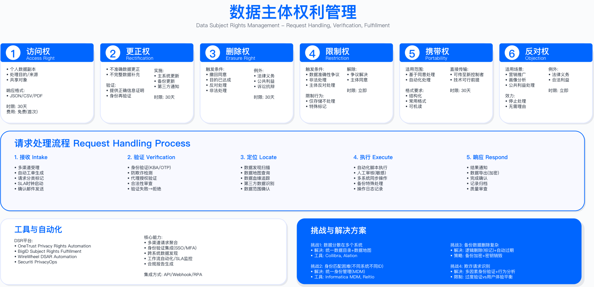

# 9.4　数据主体权利管理

> 导读：法规赋予个人的权利，最终落地为企业的响应能力。9.3 解决了"以什么合法基础处理数据"，本节解决的是"数据主体要求访问、删除、导出时，如何在法定时限内完成响应"。涉及法律解读、系统设计和运营管理三个维度；9.4.5 与 9.4.6 进一步讨论 AI 辅助与多智能体自主编排如何落到 DSAR 自动化。9.5 将接续讨论隐私工程实践。

---

## 概述

GDPR 第三章（第 12 至 22 条）规定了 8 项数据主体权利，企业必须在规定时限内响应请求：第 12 条第 3 款要求自收到请求起「一个月内」提供信息，请求复杂或数量过多时可再延长「两个月」，且须在首月内告知延期及理由[1]。随着隐私意识的提升与监管执法力度加强，DSR 请求处理已成为隐私合规运营的核心工作之一，对企业的数据治理能力、系统集成度与响应效率提出了较高要求。

本节聚焦 GDPR 框架下的数据主体权利体系，阐述各项权利的法律要求、技术实现方案、运营流程设计，并讨论 DSR 自动化处理系统的架构与成熟度演进路径。

---

## 9.4.1 GDPR 八项数据主体权利详解

### 权利体系概览

GDPR 赋予数据主体的 8 项权利分布在条例第 13 至 22 条，涵盖从数据收集前的知情权到数据处理后的删除权、可移植权等完整生命周期。各项权利的技术实现难度差异较大：知情权与更正权可通过标准化的隐私政策与自助服务实现；访问权与可移植权需要跨系统的数据聚合与格式化导出能力；删除权涉及复杂的例外评估与跨系统协调；自动化决策权则对算法可解释性提出要求。

| 权利 | GDPR 条款 | 响应时限 | 实施要点 |
|------|-----------|----------|----------|
| 知情权 | Art.13-14 | 收集时 | 隐私政策需易于访问，间接获取数据需在 1 个月内告知来源 |
| 访问权 | Art.15 | 1 个月 | 需跨系统聚合数据，提供机器可读格式，包含处理目的与接收方信息 |
| 更正权 | Art.16 | 1 个月 | 可通过自助服务实现，需同步更新下游系统 |
| 删除权 | Art.17 | 1 个月 | 需评估 5 项例外情形，涉及备份系统与第三方通知 |
| 限制处理权 | Art.18 | 1 个月 | 需支持数据状态标记，限制期间仅允许存储 |
| 可移植权 | Art.20 | 1 个月 | 仅适用于用户提供的数据，需结构化机器可读格式 |
| 反对权 | Art.21 | 立即（直接营销） | 直接营销场景无例外，必须立即停止 |
| 自动化决策权 | Art.22 | 不适用 | 需提供人工干预机制与算法逻辑说明 |

响应时限的 1 个月可在请求复杂或数量过多时延长至 2 个月，但须在首月内通知数据主体延期原因；直接营销反对权是绝对权利，不存在例外情形。



---

### 1. 知情权（Right to be Informed）

法律要求（GDPR Art.13-14）

知情权要求数据控制者在收集个人数据时，向数据主体提供关于数据处理活动的透明信息。告知内容包括：数据控制者身份与联系方式、处理目的与合法基础、数据接收方类别、数据保留期限、数据主体享有的权利等。当数据并非直接从数据主体处收集（如从第三方购买）时，需在合理期限内（最迟 1 个月）告知数据来源。

适用边界：知情权适用于所有涉及个人数据收集的场景，包括网站注册、App 使用、线下活动报名、第三方数据采购等。对于完全匿名化的数据处理，知情权不适用。

实施要点

不同场景下的告知方式存在差异：网站注册场景应在表单上方或旁边提供隐私政策链接，确保用户在提交数据前可便捷访问；App 首次打开时应通过引导页或弹窗告知，并确保用户后续可在设置中随时查看；Cookie 收集需通过同意横幅告知，禁止使用预勾选框。

常见误区

- 将隐私政策链接隐藏在页面底部小字中，不符合"易于访问"的要求
- 仅在用户注册时展示一次隐私政策，后续无法再次查看，未能满足"随时可访问"的透明度要求
- 从第三方获取数据后未主动通知数据主体数据来源，违反 Art.14 的间接收集告知义务

验证方法：通过用户体验测试验证隐私政策的可访问性，测试能否在 3 次点击内找到完整的隐私政策；检查隐私政策是否包含 Art.13/14 要求的全部信息要素；使用浏览器开发者工具检查 Cookie 同意横幅是否存在预勾选。

---

### 2. 访问权（Right of Access）

法律要求（GDPR 第 15 条[1]；访问权的范围、副本提供方式与限制，另见 EDPB 关于访问权的指南 01/2022[2]）

数据主体有权确认其个人数据是否正在被处理，如果是，有权获取以下信息的副本：处理目的、数据类别、数据接收方或接收方类别、数据保留期限、数据主体享有的其他权利、数据来源（非直接收集时）、自动化决策的逻辑与后果。

适用边界：访问权适用于数据控制者持有的所有个人数据，包括结构化数据（如 CRM 记录）、非结构化数据（如客服通话记录）以及日志数据中的个人标识符。访问请求中涉及的第三方个人数据应进行脱敏处理，不得因此损害他人的权利和自由。

关键约束

数据分散是首要挑战：用户数据通常分布在 CRM、订单系统、日志平台、分析工具、第三方供应商等多个系统中，需要建立完整的数据清单（Data Inventory）并实现自动化数据聚合。格式统一是第二项约束：不同系统的数据格式差异较大，需定义统一的导出格式（如 JSON 或 CSV）并附加元数据说明。安全风险需重点关注：批量访问请求可能被用于数据收集攻击或社会工程攻击，需实施身份验证、速率限制与风险评分机制。

常见误区

- 仅提供部分系统的数据，遗漏日志系统、备份系统或第三方供应商持有的数据
- 以"技术复杂"为由拒绝提供算法 profiling 的逻辑说明，违反 Art.15(1)(h) 的要求
- 未对导出数据进行第三方个人数据脱敏，可能侵犯他人隐私

验证方法：定期执行内部访问权请求测试（可由 DPO 或隐私团队模拟），验证数据聚合的完整性与响应时效；审计数据导出日志，确认是否覆盖所有已知数据源；通过红队测试验证身份验证机制的有效性。

运行指标：访问请求响应时间（目标：在法定 1 个月内完成）、数据源覆盖率（已纳入自动化导出的数据系统占比）、自动化处理率（无需人工介入的请求占比）。

---

### 3. 删除权（Right to Erasure/被遗忘权）

法律要求（GDPR Art.17）

数据主体有权要求删除其个人数据，当满足以下情形之一时：数据不再为收集目的所必需；数据主体撤回同意且无其他合法基础；数据主体行使反对权且无优先的合法理由；数据被非法处理；为履行法律义务需要删除；数据涉及信息社会服务中的儿童。

五项例外情形（Art.17(3)）

GDPR 明确规定了可拒绝删除请求的 5 项例外情形，企业在处理删除请求时必须逐项评估：

1. 言论和信息自由：新闻报道、学术研究、艺术或文学创作中必需的数据。评估时需平衡公共知情权与个人隐私权。
2. 法律义务：税务、审计、反洗钱等法规要求保留的数据。这是最常见的拒绝理由，需明确具体的法律依据与保留期限。
3. 公共卫生：传染病追踪、疫苗接种记录等公共卫生必需的数据，需有政府授权。
4. 存档/研究/统计：科学研究或历史档案必需的数据，需已进行假名化处理并获得伦理委员会批准。
5. 法律诉求：建立、行使或辩护法律诉求所必需的数据。需有合理依据证明诉讼的可能性，不能泛泛主张。

适用边界：删除权适用于所有个人数据的处理场景，但受上述例外情形限制。已完全匿名化的数据（无法重新识别到个人），删除权不适用。需注意：假名化数据仍属于个人数据，删除权仍然适用。

关键约束

删除权是所有数据主体权利中技术复杂度最高的。主系统数据的删除相对直接，备份系统则要区分两类副本分别处理，笼统地说"备份会在下一个周期被覆盖"在现代备份架构下已经不成立。

**可轮转副本**（日常增量与全量、可被生命周期策略回收的归档）确实可以随保留期到期自然消失，这类副本上的处理方式是登记删除请求、等待过期，并确保期间若发生恢复不会把已删除数据重新引入生产。

**不可变副本**（WORM/对象锁定）不会被覆盖，也不允许提前销毁。合规模式下锁定期内任何身份都无法删除或缩短保留期，包括账号根用户与云厂商自身（实现层次与真实绕过方式见 [16.3.2](../../第05部分_身份网络与业务连续性/第16章_业务连续性与灾难恢复/16.3_备份与恢复体系工程.md)）。而这类副本恰恰是本书推荐的防勒索必备项，因此"删不掉"是设计使然而非能力缺陷。对它可行的方案只有一条：把删除请求写入一份**独立于备份系统的删除登记表**，任何一次从不可变副本恢复出来的数据，在投入生产使用前必须先重放该登记表、再次执行删除，并把这一步写进恢复放行清单而不是留给操作者记忆。

由此产生一条对外答复的纪律：向数据主体承诺的完成时间必须按**最长的那份不可变副本保留期**计算，而不是按日常备份周期。这也反过来约束备份侧——不可变副本的保留期取值同时是一个隐私合规参数，取得越长，删除权的实际兑现时间越晚，这个取舍应当由 DPO 与韧性负责人共同确认，而不是在备份控制台上单方面设定。日志数据的删除需评估是否影响安全审计与故障排查能力。第三方数据的删除需根据数据处理协议（DPA）向供应商发起子请求，并跟踪执行状态。已公开披露的数据需通知接收方执行删除（Art.17(2)）。

还有一类副本这两分法都盖不住：**已经被训练进模型参数的数据**。到 2026 年没有公认方法能从已训练模型中精确删除单条训练数据的影响，EDPB、英国 ICO 与国家网信办均未把机器遗忘（machine unlearning）算法认定为满足删除权的手段。可被审计接受的是一套等效措施——原始数据立即物理删除、在下一次重训时把该主体排除、全程向数据主体透明告知时间承诺，必要时以差分隐私的隐私预算佐证"影响已最小化"。这套措施的完整实现、它依赖的数据血缘前提，以及它为什么不能单独满足 Art.17，见 [18.5 AI 数据安全与隐私](../../第06部分_AI驱动的安全创新/第18章_AI系统安全/18.5_AI数据安全与隐私.md)。需要强调的是，重训窗口只是承诺时间里的一段，对外答复的完成时间仍按本节上面那条纪律计算。

常见误区

- 对所有删除请求一律执行，未评估例外情形，导致删除了法律要求保留的数据（如税务记录）
- 仅执行"软删除"（标记删除状态）而非物理删除，数据仍可被恢复或访问
- 未通知第三方接收方执行删除，导致数据在供应商系统中继续存在
- 以"备份系统无法删除"为由完全拒绝删除请求，而非按副本类型分别采用"到期自然过期"与"登记 + 恢复时重放删除"的做法
- 反过来，笼统承诺"备份会在下个周期被覆盖"，而组织实际持有合规模式锁定的长期副本——这类承诺在监管问询时无法兑现，比坦白说明保留期更被动

删除权决策流程

处理删除请求需遵循结构化的评估流程：首先验证请求者身份；其次逐项检查 5 项例外情形，确定可删除与暂不可删除的数据范围；然后评估删除范围（主系统/备份/日志/第三方）；执行删除或匿名化操作；通知相关第三方；最后向数据主体确认处理结果并记录审计日志。

对于因例外情形暂不可删除的数据，应向数据主体说明具体的法律依据、保留期限以及期满后可再次申请删除的权利。

验证方法：通过内部测试验证删除流程的完整性，提交测试删除请求，验证主系统数据是否被物理删除、备份系统是否记录删除请求、第三方是否收到删除通知。更强的一项是在一次恢复演练中真实检验删除登记表的重放——从不可变副本恢复一个曾提交过删除请求的账户，确认恢复后的数据里该账户已被再次清除；这一步不做，删除登记表就只是一份没人执行的清单。审计例外情形评估记录，确认拒绝理由是否有具体法律依据支撑。

运行指标：删除请求响应时间、例外情形适用率（应保持稳定，异常波动需调查原因）、第三方删除确认率、删除后数据残留检测（定期检查已删除用户数据是否从任何系统中彻底清除）。

---

### 4. 数据可移植权（Right to Portability）

法律要求（GDPR Art.20）

数据主体有权以"结构化、常用、机器可读"的格式接收其提供给控制者的个人数据，并有权将数据传输给另一控制者。

适用条件

可移植权的适用范围受到三项条件限制：

- 仅适用于"数据主体提供的数据"，包括用户主动输入的数据（如姓名、地址、帖子内容）以及系统观察到的用户行为数据（如浏览历史、购买记录）；推断数据（如信用评分、兴趣标签）与衍生数据（如市场细分结果）不在可移植范围内。
- 仅适用于基于同意（Art.6(1)(a)）或合同（Art.6(1)(b)）的处理，不适用于基于合法利益的处理。
- 仅适用于自动化方式的处理。

关键约束

格式选择需平衡通用性与完整性：JSON 格式具有良好的可读性与跨平台兼容性，但对于复杂数据结构可能丢失语义信息；行业特定格式（如金融领域的 ISO 20022）可保留完整语义，但需要接收方具备相应解析能力。直接传输功能（数据主体要求将数据直接传输至另一控制者）在技术上可行时应予支持，但不得因此影响原控制者的数据安全。

常见误区

- 将推断数据（如信用评分、健康风险评估）纳入可移植范围，超出了法律要求
- 以 PDF 或图片格式提供数据，不符合"机器可读"要求
- 在执行可移植请求时自动删除用户数据，混淆了可移植权与删除权——可移植请求不等同于删除请求，用户数据应继续保留除非另行请求删除

验证方法：验证导出数据格式是否符合结构化、机器可读要求；测试导出数据是否可被目标系统成功导入（需与行业常见服务进行互操作性测试）；确认推断数据与衍生数据未被错误纳入导出范围。

---

### 5. 反对权（Right to Object）

法律要求（GDPR Art.21）

数据主体有权随时反对基于合法利益（Art.6(1)(f)）或公共任务（Art.6(1)(e)）的数据处理。收到反对请求后，除非控制者能证明存在优先于数据主体利益的合法理由，否则必须停止处理。

对于直接营销目的的处理，数据主体的反对权是绝对的，不存在任何例外，收到反对请求后必须立即停止，不得以任何理由拒绝或延迟。

关键约束

直接营销反对的"立即生效"要求对系统实时性提出挑战。理想状态下，从用户点击退订到所有营销系统停止发送应在数分钟内完成。需建立跨系统的同步机制，确保反对状态实时传播至邮件营销平台、短信网关、电话呼叫中心、广告投放平台等。此外，需维护"营销黑名单"（Suppression List），即使用户后续重新注册，也需尊重其之前的反对意愿，除非用户明确撤销反对。

常见误区

- 告知用户"您的退订请求将在 X 个工作日内处理"，违反"立即生效"要求
- 仅在邮件渠道执行退订，未同步至短信、电话、定向广告等其他营销渠道
- 未通知第三方营销服务提供商或数据经纪商停止营销，导致用户继续收到第三方营销内容
- 用户重新注册后自动恢复营销订阅，未检查营销黑名单记录

验证方法：执行端到端测试，从用户界面提交营销反对请求，测量所有营销渠道停止发送的实际时间；验证营销黑名单机制是否正常工作（模拟用户重新注册后检查是否仍受退订保护）；审计第三方营销供应商的同步机制。

运行指标：营销反对请求的端到端处理时间（从提交到所有渠道停止）、营销黑名单命中率、第三方同步成功率。

---

### 6. 自动化决策权（Rights re Automated Decision-Making）

法律要求（GDPR Art.22）

数据主体有权不受仅基于自动化处理（包括 profiling）的决策约束，当该决策对其产生法律效力或类似重大影响时。

触发条件

Art.22 的适用需同时满足三个要素：决策仅基于自动化处理，无有意义的人工干预；涉及 profiling（自动评估个人特征，如行为偏好、信用状况、工作表现等）；决策对数据主体产生法律效力（如影响合同权利）或类似重大影响（如信贷审批、招聘录用、保险承保等）。

三个要素缺一则不触发 Art.22。算法推荐商品通常不构成"重大影响"，因此不触发该条款；有人工审核的信贷决策（即使人工仅在极少数情况下推翻算法结果）通常不构成"仅基于自动化处理"。

三项例外

即使满足上述触发条件，以下情形可继续进行自动化决策：签订或履行合同所必需（如在线即时信贷审批）；欧盟或成员国法律明确授权；数据主体明确同意。即使适用例外，控制者仍须实施适当保障措施，包括：确保数据主体获得人工干预的权利、表达观点的权利、质疑决策的权利，以及关于算法逻辑与决策后果的有意义信息。

关键约束

"有意义的人工干预"是争议焦点。根据 EDPB《自动化个人决策与用户画像指南》（2018 年 5 月 25 日通过），人工审核者必须具有推翻算法决策的权限，且在实践中确实存在推翻案例；若人工仅是"橡皮图章"式的形式审批，则不构成有意义的干预。

荷兰数据保护局（Autoriteit Persoonsgegevens）2025 年 3 月发布的《有意义的人工干预》咨询文件，将有意义性分解为四个维度：人员、技术与设计、流程、治理。

算法逻辑的"有意义信息"需要平衡商业秘密保护与数据主体知情权，通常需要说明影响决策的主要因素，而非披露完整的算法代码或模型权重。

常见误区

- 在招聘筛选中使用算法自动拒绝候选人简历，无人工复审，违反 Art.22
- 声称存在人工复审，但人工审核者实际上无权限或无能力推翻算法决策，不构成有意义的干预
- 以"算法是商业秘密"为由完全拒绝提供决策逻辑信息，违反透明度要求

验证方法：审计自动化决策系统的流程设计，确认是否存在人工干预节点及其权限配置；统计人工推翻算法决策的实际比例（若长期为零，需评估人工干预是否形同虚设）；测试算法解释功能是否能向数据主体提供可理解的决策因素说明。

运行指标：人工干预率（人工审核并实际做出决策的案例占比）、人工推翻率（人工决策与算法建议不一致的比例）、算法解释请求量与响应时效。

---

## 9.4.2 DSR 自动化处理系统

### 处理流程架构

企业级 DSR 处理通常分为六个阶段：请求接收、身份验证、请求分类与路由、数据处理、响应用户、审计与改进。

阶段一：请求接收

DSR 请求可通过多种渠道提交：专用的 web 门户（推荐的首选渠道，便于结构化收集请求信息）、电子邮件（如 privacy@company.com）、客服电话、线下渠道等。无论通过何种渠道提交，系统应立即生成工单号，并向请求者发送确认回执，告知预计响应时间。

阶段二：身份验证

身份验证是 DSR 处理的关键控制点，需在用户体验与安全风险之间取得平衡。验证过严会导致合法请求被拒绝，验证过松则可能被利用于身份盗用或数据收集攻击。建议采用风险自适应验证策略：根据请求类型、账户活跃度、设备特征、地理位置等因素评估风险等级，对低风险请求采用简化验证（如邮件 OTP），对高风险请求要求追加验证（如身份证件上传、知识问答、视频通话）。

删除请求的风险等级通常高于访问请求，因其不可逆性，错误删除的数据难以恢复。休眠账户、异常地理位置、新设备等特征会提升风险评分。

阶段三：请求分类与路由

根据请求类型与复杂度，将请求路由至不同的处理路径。访问权、更正权、可移植权等请求可通过自动化系统处理，仅在异常情况下升级至人工。删除权请求需人工评估例外情形后方可执行。涉及自动化决策权、复杂例外情形或大批量数据的请求应由隐私专家或 DPO 介入评估。

阶段四：数据处理

涉及数据发现（扫描所有相关系统定位用户数据）、合规评估（检查例外情形与业务限制）、执行操作（导出/删除/更正/限制）以及第三方协调（通知供应商执行子请求）。

数据发现依赖完整的数据清单（Data Inventory）与数据映射（Data Mapping）。若企业缺乏这些基础设施，DSR 处理将严重依赖人工，难以在时限内完成。

阶段五：响应用户

响应内容应包括：请求处理结果（批准/部分批准/拒绝）、具体操作说明（已导出/已删除/已更正的数据范围）、拒绝原因与法律依据（如适用）、后续权利说明（如申诉渠道、监管机构投诉途径）。响应应使用清晰、易理解的语言，避免过度使用法律术语。

阶段六：审计与改进

所有 DSR 请求及其处理过程需完整记录，以备监管机构审查。记录内容包括：请求详情、身份验证结果、处理决策及依据、执行操作、响应内容、时间戳等。建议保留记录至少 6 年（参考一般诉讼时效）。定期分析 DSR 数据，识别流程瓶颈与自动化机会。

---

### 身份验证风险决策

DSR 身份验证面临两难困境：验证要求过低可能导致身份盗用者获取或删除他人数据；验证要求过高则增加合法请求者的负担，甚至构成变相拒绝。

风险评估因素

风险评分应综合考虑以下因素：请求类型（删除请求风险高于访问请求）、账户状态（休眠账户风险高于活跃账户）、设备特征（新设备或已知恶意设备风险较高）、地理位置（异常国家或与账户注册地不符风险较高）、行为模式（批量请求或异常时间请求风险较高）。

验证策略分级

| 风险等级 | 特征 | 验证方式 |
|---------|------|---------|
| 低风险 | 已登录、活跃账户、常用设备 | 邮件 OTP 或已登录会话验证 |
| 中风险 | 陌生设备、轻微异常特征 | 知识问答（注册日期、最近订单号） |
| 高风险 | 休眠账户、异常地理位置 | 政府颁发身份证件上传 + 人工复核 |
| 极高风险 | 批量请求、多重异常指标 | 视频通话验证 |

常见攻击场景与防护

| 攻击场景 | 防护措施 |
|---------|---------|
| 竞争对手通过批量访问请求获取业务情报 | 速率限制、请求原因记录 |
| 攻击者冒充用户提交删除请求破坏其账户 | 多因素验证、延迟执行期 |
| 钓鱼攻击者伪造 DSR 相关邮件诱导用户泄露凭证 | 官方域名验证、用户安全意识培训 |

---

### DSR 自动化成熟度模型

企业的 DSR 处理能力通常经历以下演进阶段：

| 成熟度 | 特征 | 局限性 |
|-------|------|--------|
| M1 人工处理 | 通过邮件接收请求，人工查询各系统收集数据，人工编写响应邮件 | 响应时间长，容易遗漏数据源，难以扩展 |
| M2 工单系统 | 建立专用 DSR 工单系统追踪请求状态，但数据收集与处理仍依赖人工 | 解决了追踪问题，未解决效率问题 |
| M3 部分自动化 | 访问权与可移植权请求通过自动化工具聚合数据并生成导出包，删除权与复杂请求仍需人工 | 覆盖了最高频的请求类型 |
| M4 高度自动化 | 大多数请求类型实现端到端自动化处理，仅复杂案例或高风险请求需人工介入 | 需要完整数据清单与跨系统 API 集成 |
| M5 智能自动化 | 引入机器学习辅助请求分类、例外情形判断、风险评估等决策环节，具备预测性能力 | 投入大，适合高请求量的大型组织 |

适用边界：并非所有企业都需要达到 M5。成熟度目标应与 DSR 请求量、数据系统复杂度、合规风险等级相匹配。请求量较小的企业可在 M2-3 满足合规要求；处理大量消费者数据的企业应以 M4 为目标。

---

## 9.4.3 DSR 运营指标与 SLA 管理

### 关键绩效指标

响应时间指标

核心指标是 SLA 合规率，在法定时限（GDPR 要求 1 个月，可延长至 2 个月）内完成响应的请求占比。目标值应设定为接近 100%，任何超期都可能构成违规。此外应分请求类型追踪平均响应时间。

处理效率指标

- 自动化处理率：无需人工介入即可完成的请求占比，反映系统成熟度
- 人均处理量：DSR 团队每人每月处理的请求数量，反映团队效率
- 单请求成本：处理每个请求的平均人工与系统成本，反映运营效率
- 一次性解决率：无需与请求者二次沟通即可完成的请求占比，反映服务质量

质量指标

- 数据完整性：访问权响应中导出数据包是否包含所有系统中的用户数据
- 处理准确性：无处理错误（如错误删除、遗漏数据源）的请求占比
- 用户满意度：请求完成后的简短调查评分
- 申诉率：请求者对处理结果不满并提出申诉的比例

### DSR 工单系统功能要求

基于 GDPR Art.30 的记录保存要求与运营最佳实践，DSR 工单系统应具备以下核心功能模块：

- 请求管理模块：记录工单号、请求者身份、请求类型、提交渠道、提交时间、请求内容描述；支持多渠道请求统一入口，自动生成确认回执
- 身份验证模块：记录验证方法、验证结果、验证时间、风险评分、验证尝试次数；支持多级验证策略配置
- 处理跟踪模块：记录处理人员、处理开始时间、处理结束时间、处理结果、涉及的数据系统清单、第三方通知记录；支持工作流自动化与任务分配
- 决策记录模块：记录批准/拒绝决策、决策依据、适用的法律条款、例外情形评估记录、DPO 意见（如适用）——这是监管审查的核心内容
- 沟通记录模块：记录与请求者的所有通信，包括确认回执、补充信息请求、最终响应等
- SLA 监控模块：自动计算响应截止时间，对即将超期的工单发出预警，记录延期原因与延期通知

### 响应模板标准化

访问权批准响应应包含：确认已完成处理、数据包内容清单（按数据类别列明）、数据格式说明、安全下载链接（设置有效期）、各类数据的保留期限说明、后续权利告知、联系方式。

删除权部分拒绝响应应包含：确认已处理部分请求、已删除的数据范围、暂不可删除的数据范围及具体法律依据、预计可删除的时间（如法定保留期满后）、请求者享有的后续权利（如向监管机构投诉）、联系方式。

响应语言应清晰易懂，避免过度使用法律术语；涉及法律依据时应引用具体条款编号；应告知请求者享有的后续权利。

---

## 9.4.4 DSR 合规挑战与最佳实践

### 常见合规陷阱

过度收费：GDPR 原则上要求免费响应 DSR 请求。仅当请求"明显无理由或过分"（如反复提交相同请求）时，方可收取合理费用或拒绝处理。对首次访问请求收费构成违规。

要求提供理由：数据主体无义务解释其请求原因。控制者可询问原因以便更好地理解请求范围（如"您希望访问哪些类型的数据"），但不得以未提供理由为由拒绝处理。

滥用延期：延长响应期限（从 1 个月延至 2 个月）需有充分理由，如请求复杂或请求数量过多。延期决定必须在首月内通知请求者，并说明延期原因。不得将延期作为常规做法。

数据不完整：访问权响应需覆盖控制者持有的所有个人数据，包括主业务系统、日志系统、备份系统、分析系统以及供应商系统中的数据。遗漏数据源构成不完整响应。

格式不可读：可移植权响应需采用"结构化、常用、机器可读"格式。提供 PDF 扫描件或非结构化文本不符合要求。推荐使用 JSON、CSV 或 XML 格式，并附加数据结构说明。

变相拒绝：设置过高的身份验证门槛（如要求公证身份证件）可能构成变相拒绝。验证要求应与请求风险相称，不得故意设置障碍。

### 最佳实践

建立自助服务门户

自助服务门户可显著提升用户体验与处理效率。推荐功能包括：实时数据查看（允许用户在线查看其账户信息与活动历史）、一键数据导出（简化访问权与可移植权请求）、在线信息更正（自助实现更正权）、营销偏好管理（简化反对权行使）、请求状态跟踪（提高透明度）。

建立清晰的组织分工

DSR 处理涉及多个职能部门的协作：DPO 负责监督与质量保证，对复杂案例提供决策指导；DSR 团队负责日常运营，包括请求处理、用户沟通、工单管理；IT 团队负责数据发现工具维护、系统集成、自动化开发；法务团队负责例外情形评估、拒绝理由审核、监管沟通支持；业务部门配合提供特定系统的数据导出与删除操作支持。

建立持续改进机制

建议按季度开展 DSR 运营审查：请求量趋势分析（识别异常波动）、SLA 合规率回顾、自动化率变化、用户投诉与申诉案例复盘、新系统或新数据源的 DSR 覆盖评估、DPO 工单抽样审查、响应模板更新需求、团队培训需求。

---

## 9.4.5 AI 驱动的 DSAR 自动化实战

9.4.2 描述的六阶段流程，长期以来卡在三个人力密集的环节：请求意图的判读、跨系统的数据发现、访问包里第三方个人数据的脱敏。这三处恰好是 AI 能真正减负的地方——不是把 AI 当成噱头贴上去，而是它们本质上都是分类与抽取问题。本节讨论如何把 AI 落到这三个环节，以及落地时最容易踩的坑。

需要先说清楚一条边界：DSAR 处理的对象本身就是个人数据，把请求正文、导出内容送进模型意味着个人数据流入了一个新的处理者。因此这里所有 AI 环节都要回答一个前置问题——模型部署在哪、数据是否出域、是否构成新的处理目的。这条约束贯穿下面每一个环节，其攻防机理见 18.3。

### 环节一：意图受理——自然语言请求的分类与范围抽取

现实中的 DSAR 很少以规整的表单进入。用户发一封邮件写"把你们存的关于我的东西都删了，另外我想看看你们拿我数据干了什么"——这一句话同时触发了删除权（Art.17）与访问权（Art.15），且删除范围含糊。传统做法靠人工读信、判类、建工单，是 SLA 时钟空转最严重的一段。

AI 在这里做两件事：把自由文本分类到 8 项权利中的一项或多项，并抽取出请求范围（时间段、数据类别、指定系统）。OneTrust、Transcend、Securiti 等隐私运营平台近一年都在 DSR 入口叠加了这类 NLU/LLM 分类能力，把邮件、门户工单、甚至客服对话统一归一化为结构化请求对象（厂商演示口径，实际准确率随语料与语言而变，需自行验证）。

```python
class DSARIntentRouter:
    """把自由文本 DSAR 归一化为结构化请求。分类只做建议，不做终决。"""

    RIGHTS = ["access", "erasure", "rectification", "portability",
              "restriction", "objection", "automated_decision"]

    def route(self, raw_text: str, locale: str) -> dict:
        # 1. 分类：一封信可能命中多项权利，返回带置信度的多标签
        labels = self.classifier.predict(raw_text, locale)  # [(right, score)]
        # 2. 抽取范围：时间段 / 数据类别 / 指定系统，抽不到就置空待澄清
        scope = self.extractor.extract(raw_text, locale)
        # 3. 高影响权利强制转人工：删除不可逆，绝不让模型自动执行
        needs_human = any(r in ("erasure", "automated_decision")
                          for r, s in labels if s >= self.threshold)
        return {"labels": labels, "scope": scope,
                "auto_eligible": not needs_human}
```

怎么读这段代码：分类器输出的是"建议 + 置信度"，不是判决。删除权和自动化决策权一旦命中，无论置信度多高都强制转人工——因为删除不可逆，而 Art.22 本就要求有意义的人工干预。AI 在这里压缩的是访问权、可移植权这类高频且可逆请求的判读时间，而不是替人做法律决定。

生产常见坑：分类阈值调得过于激进，会把一封同时含删除意图的信错判为"仅访问"，导致漏履行删除义务——这是实打实的违规。稳妥的做法是宁可多召回（一封信命中多项就都建工单，由人工合并），也不要漏召回。

### 环节二：跨系统数据发现——从"清单驱动"到"清单 + 发现双轨"

9.4.2 反复强调数据发现依赖完整的数据清单。但真实企业的清单永远滞后于数据的实际扩散：新上的 SaaS、临时导出的分析表、员工建的影子数据集，都不在清单里。仅靠人工维护的清单去做 DSAR 数据发现，漏源几乎是必然，而漏源等于不完整响应。

AI 驱动的数据发现在这里补的是召回。以数据主体标识（邮箱、手机号、用户 ID 及其派生指纹）为种子，用分类模型扫描结构化与非结构化存储，找出可能关联到该主体的数据位置——包括清单里没登记的。这与第8章的数据自动分类分级是同一套底座能力：8 章解决"这块数据是不是敏感、属于谁"，DSAR 复用它来解决"这个人的数据都散在哪"。Securiti、OneTrust 的数据智能模块主打的正是这种以 PII 图谱驱动的主体数据发现（厂商称可覆盖数百类系统连接器，实际覆盖度取决于连接器是否适配你的技术栈）。

关键是摆正定位：AI 发现是对数据清单的补充与交叉校验，不是替代。正确的架构是双轨——清单给出已知必查的权威源，AI 发现负责在清单之外捞出遗漏，两者的差集本身就是清单治理的输入。

```
DSAR 数据发现（双轨）
┌─────────────────────────────────────────────┐
│  主体标识（邮箱/手机/UID + 派生指纹）           │
└───────────────┬─────────────────┬────────────┘
                │                 │
        ┌───────▼──────┐   ┌──────▼────────┐
        │ 清单驱动查询   │   │ AI 发现扫描     │
        │（权威已知源）  │   │（结构化+非结构化）│
        └───────┬──────┘   └──────┬────────┘
                │                 │
        ┌───────▼─────────────────▼────────┐
        │ 合并 + 去重 + 人工确认发现的新数据源 │
        │  → 差集回填数据清单（治理循环）      │
        └──────────────────────────────────┘
```

生产常见坑：把 AI 发现的召回率当成 100% 来用，停掉清单维护，反而更危险——模型对没见过的数据结构、加密字段、跨语言字段会漏，召回不足时你却以为已经全查了。发现能力用于扩大覆盖，不能用于制造"已全覆盖"的错觉。

### 环节三：自动脱敏——访问包里的第三方个人数据

访问权响应有一条硬约束（见 9.4.1 访问权）：导出的数据不得因此损害他人的权利和自由，涉及的第三方个人数据必须脱敏。人工逐条脱敏客服记录、聊天日志、工单往来里夹带的他人姓名、电话、身份证号，既慢又易漏。

用 NER/PII 检测模型在导出包生成前做一遍自动识别与遮蔽，是这一环的标准做法。但这里的错误代价是不对称的：漏检一个第三方身份证号（假阴性）意味着一次数据泄露，而误遮蔽用户自己的数据（假阳性）只是体验受损。因此策略要向"宁可多遮"倾斜，并对高敏字段保留人工抽检。

```python
def redact_export(export_bundle: dict, subject_id: str) -> dict:
    for record in export_bundle["records"]:
        entities = pii_detector.detect(record["content"])  # 识别 PII 实体
        for ent in entities:
            # 只保留数据主体本人的 PII，其余第三方实体一律遮蔽
            if not belongs_to_subject(ent, subject_id):
                record["content"] = mask(record["content"], ent)
        # 高敏类型（身份证/银行卡/健康）无论归属，进人工抽检队列
        if any(e.type in HIGH_SENSITIVITY for e in entities):
            queue_for_sampling_review(record)
    return export_bundle
```

怎么读这段代码：脱敏的判据是"是否属于数据主体本人"，不是"是不是 PII"——本人的 PII 恰恰是访问权要交付的内容，不能遮。真正要遮的是夹在其中的第三方 PII。高敏类型无条件进抽检队列，是因为这类假阴性一旦发生就是重大事件，不能只靠模型兜底。

生产常见坑：把自动脱敏当成终态直接投递，不设抽检。PII 检测模型对变体格式（中间加空格的手机号、拆分书写的身份证号、非母语姓名）召回有限，纯自动脱敏必然有漏网。抽检比例应与数据敏感度挂钩，高敏导出接近全检。

### 落地边界与度量

这三个环节可以显著压缩 DSAR 的人工工时，但都不改变一条底线：法律责任在企业，不在模型。可逆、低敏、高频的判断（访问权分类、数据源召回、常规脱敏）适合交给 AI 加速；不可逆或高影响的决定（删除执行、例外情形认定、Art.22 相关决策）必须保留有意义的人工干预。把这条线画错，AI 带来的就是系统性合规风险，谈不上效率。

关键约束：所有 AI 环节的模型部署与数据流向必须先过隐私评估——DSAR 处理引入 AI，等于在隐私流程内部又新增了一个个人数据处理者，其自身也要满足最小化、目的限定与安全要求（机理见 18.3）。

验证方法：对意图分类做定期回放测试，用历史已人工确认的 DSAR 作为标注集，重点看漏召回（该触发的权利没触发）；对数据发现做"种子注入"测试，预先在若干非清单系统植入测试主体数据，检验发现能否捞出；对自动脱敏做红队式对抗，构造变体格式的第三方 PII，测量假阴性。

运行指标：意图分类的漏召回率（优先于总体准确率）、数据发现相对清单的新增源命中数（衡量补召回价值）、自动脱敏的假阴性率与高敏抽检覆盖率、以及引入 AI 后端到端 SLA 合规率的变化。

---

## 9.4.6 多智能体自主 DSAR 编排

9.4.5 讲的三点辅助，本质是"人主导、AI 打下手"：AI 在意图受理、跨系统发现、访问包脱敏各自减负，串起整条流程的仍是人——人接住分类建议、人核对发现结果、人把脱敏后的包投出去。三个单点之间的衔接、SLA 时钟的看管、跨系统的调度，全压在运营人员身上。当 DSAR 请求量上来、涉及的系统越来越多，这种"人当胶水"的模式就成了新的瓶颈。

再往前一步，是把整条 DSAR 循环交给一组各司其职的智能体自主跑，人只在关键处审批。这与 11.4.6 的多智能体自主狩猎、17.3 的自主调查是同一种自主性，区别只在对象：狩猎处理没有告警的潜伏威胁，研判处理已触发的告警，DSAR 处理的是一条带法定时限的合规请求。三者能拆成多智能体的共同理由是任务形态相同——DSAR 的六阶段（受理、验证、分类路由、数据处理、响应、审计）是典型的长程、多步、每步需要不同专长的任务：判意图靠法律与语义理解，找数据靠数据模型知识，脱敏靠 PII 识别经验。让一个大模型从头一把抓，容易在中途丢失原始请求边界，把某一步的错误一路带到结尾。拆成专职智能体加一个编排器，各步能分别用最合适的提示与工具、分别评估与替换——单体与多体的取舍原则见 17.2.4，本节只讲 DSAR 该怎么分工。

一套可自主运行的 DSAR 智能体团队，通常这样分工：

```
              ┌──────────────────────────────┐
              │ 编排器（持有 SLA 时限预算+调度权）│
              │ 派工、盯截止、决定收敛或转人工闸门 │
              └──┬───────┬────────┬───────┬────┘
     ┌───────────┘       │        │       └──────────┐
┌────▼──────┐  ┌─────────▼─┐  ┌───▼────────┐  ┌──────▼─────┐
│受理/分类   │  │跨系统发现   │  │ 脱敏 agent  │  │ 校验 agent  │
│自由文本→   │→│清单+AI 双轨→│→│访问包内第三方│  │独立复核发现  │
│权利标签+   │  │定位主体数据 │  │PII 识别遮蔽 │  │完整性与脱敏 │
│范围抽取    │  │(受范围约束) │  │             │  │结果         │
└───────────┘  └───────────┘  └────────────┘  └─────┬──────┘
      ▲                                               │
      │  澄清不足/收敛      ┌────────────────────┐     │ 过关才进闸门
      └───────────────────│ 人工闸门：删除执行、   │◄────┘
                          │ 例外认定、Art.22 判定 │
   记忆：工单状态、已查源、  └─────────┬──────────┘
   已认定例外，回流下一步            ▼
                          审批通过 → 执行删除/投递响应/记审计
```

怎么读这张图：编排器是唯一持有 SLA 时限预算和跨系统调度权的角色，其余智能体只负责自己那一步。DSAR 循环由此自主迭代——受理/分类 agent 把邮件归一化为带权利标签的结构化请求，跨系统发现 agent 用清单加 AI 双轨定位主体数据，脱敏 agent 遮蔽访问包里的第三方 PII，校验 agent 对发现完整性和脱敏结果做独立复核，编排器盯着法定时限决定是继续澄清、收敛还是把请求推到人工闸门。9.4.5 已经把三个环节内部的机理讲清楚（分类只做建议、发现要双轨、脱敏向多遮倾斜），这里不复述，只讲它们被编排成自主循环后多出来的两件事：独立校验与人工闸门。

关键的一环是独立的校验 agent。它专门对上游产物做反证：发现 agent 说"这个人的数据只在这五个系统"，校验 agent 要独立核对是否有遗漏源；脱敏 agent 说"第三方 PII 都遮了"，校验 agent 要独立抽验是否有漏网。之所以必须独立、不能让发现或脱敏 agent 自己复核，是因为自证拦不住自己的错误——一个漏了源的发现 agent，让它自查还是会漏。这与 11.4.6 里验证 agent 必须独立于分析 agent 是同一条原则。

人工闸门锁死不可逆动作，这一点直接承接 9.4.5。9.4.5 的 `needs_human` 标志和"删除强制转人工"正是现成的闸门锚点：受理/分类 agent 一旦判出删除权或自动化决策权，无论置信度多高都不进自动执行路径，而是落到人工闸门。多智能体化之后闸门的位置不变，只是从"单点代码里的一个判断"上升为"编排器调度的一道强制关卡"。以下动作智能体可自主执行：归一化请求、双轨发现、生成脱敏后的访问包、跑受范围约束的数据聚合。以下动作必须人工审批，不得自动：删除执行（不可逆，错删难恢复）、删除权 5 项例外情形的认定（涉及法律判断）、Art.22 自动化决策相关的判定（法律本就要求有意义的人工干预）。判据和研判、狩猎一致：动作的爆炸半径与可逆性。

能力边界必须交代清楚：多智能体既提效，也放大错误。9.4.5 单点辅助时，分类 agent 的一个误判止于一步，由接手的人当场发现；多智能体自主运行时，一封信被错判为"仅访问、不含删除"，这个误判会被发现 agent 当成访问范围去捞数据、被脱敏 agent 按访问包处理、被响应 agent 投递出去——删除义务就这么被整条链悄悄漏掉，且越往后越像一次正常的访问响应。错误沿链传播，这正是校验 agent 与人工闸门不可省的原因。成本也更高：一次自主 DSAR 是多个智能体的多轮模型调用与跨系统查询，费用远高于人工按模板处理一条常规访问请求；因此值得上多智能体的，是高频、高复杂度、跨系统多的场景，简单的自助导出请求用 9.4.2 的门户就够了。此外还有一层：DSAR 处理的对象本身就是个人数据，把请求正文、导出内容送进一组自主智能体，等于在隐私流程内部新增了多个个人数据处理者，其自身的最小化、目的限定与安全要求，以及被提示注入诱导去越权检索、外泄的风险，机理见 18.3。

关键约束
- 编排器必须持有 SLA 时限的硬预算与跨系统检索范围的硬上限，防止自主循环拖过法定时限或触碰越权数据源
- 删除执行、例外情形认定、Art.22 相关判定这三类不可逆或高影响动作强制人工审批，智能体不得自动跨过（承 9.4.5 的 `needs_human` 闸门）
- 校验 agent 必须独立于发现 agent 与脱敏 agent，否则复核形同自证，拦不住沿链传播的漏源与漏遮

验证方法
- 端到端注入测试：构造同时含删除与访问意图的模糊请求，看智能体团队能否不漏权利、不漏源、不漏遮地跑完，并在删除处正确停在人工闸门
- 错误传播测试：故意给受理/分类 agent 一个错误标签（如把含删除意图的信标成仅访问），检验校验 agent 与人工闸门能否在下游拦下，统计错误沿链传播率
- 成本核账：对照人工处理，核算单次自主 DSAR 的模型调用与查询成本，判断哪类请求值得上智能体、哪类留给自助门户

运行指标
- 自主完成占比（无需人工干预即跑完的请求占比）与每条请求的人工介入点数
- 端到端 SLA 合规率（引入自主编排后是否真的提升，而非因多轮调用反而拖慢）
- 错误沿链传播率（上游误判被下游当真的比例，应持续压低），以及删除请求命中人工闸门的召回率（应为 100%，漏一条即违规）

---

## 本节小结

数据主体权利管理是隐私合规运营的核心工作，涉及法律解读、流程设计、技术实现与运营管理的综合能力。

GDPR 八项权利的实施要点：知情权强调透明度与易访问性；访问权需要跨系统数据聚合能力；删除权是技术复杂度最高的权利，需严格评估例外情形；可移植权仅适用于用户提供的数据；直接营销反对权是绝对权利，必须立即执行；自动化决策权要求提供有意义的人工干预与算法解释。

DSR 自动化系统：成熟的 DSR 处理需要端到端的自动化支持，包括请求接收、身份验证、数据发现、执行操作、用户响应等环节。身份验证应采用风险自适应策略，在安全与体验之间取得平衡。AI 可在意图受理、跨系统数据发现、访问包脱敏三处显著减负，但可逆、低敏、高频的判断才适合交给模型加速，删除执行与例外情形认定等不可逆决定必须保留有意义的人工干预。当请求量与系统复杂度上升到人力难以充当衔接胶水时，可将三个单点辅助升级为编排器加专职智能体的多智能体自主编排，由独立校验 agent 反证发现与脱敏结果、人工闸门锁死删除执行与例外认定；但多智能体在提效的同时也会放大并沿链传播错误，成本更高，只适合高频、跨系统多的场景。

运营管理：需建立量化的绩效指标体系监控合规状态；响应模板标准化可提升效率与一致性；持续改进机制确保能力持续演进。

---

## 参考文献

| # | 来源 | 标题 | 日期 | 链接 |
| --- | --- | --- | --- | --- |
| [1] | EUR-Lex（欧盟官方公报） | Regulation (EU) 2016/679（GDPR）第三章——第 12 至 22 条（数据主体权利与响应时限） | 2016-04-27 | <https://eur-lex.europa.eu/eli/reg/2016/679/oj> |
| [2] | EDPB | Guidelines 01/2022 on data subject rights — Right of access, Version 2.0（2023-03-28 通过） | 2023-03-28 | <https://www.edpb.europa.eu/system/files/2023-04/edpb_guidelines_202201_data_subject_rights_access_v2_en.pdf> |

---

## 导航

[← 上一节：9.3 个人数据处理合规](./9.3_个人数据处理合规.md) | [返回章节目录](./README.md) | [下一节：9.5 隐私工程实践 →](./9.5_隐私工程实践.md)

---

© 2025-2026 AISecOps Project. Licensed under CC BY-NC-SA 4.0
