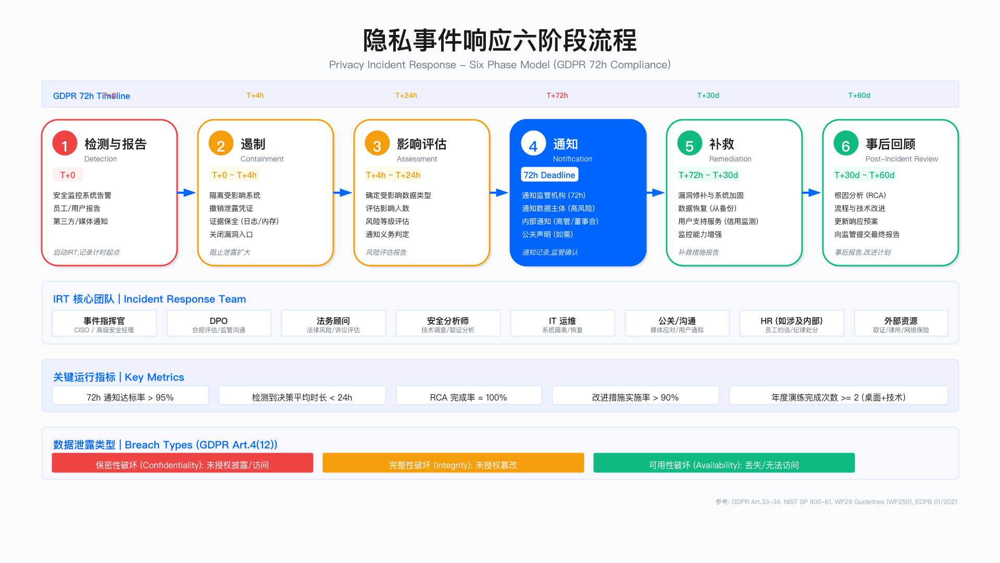

# 9.8　隐私事件响应

> 导读：72 小时不是 GDPR 留给技术团队调查的时间，而是留给控制者完成风险判断并向监管机构通知的最长窗口。本节从事件分类判断出发，逐步展开通知决策框架、六阶段响应流程、取证保全要求、用户支持分级与演练体系，最后落到自主隐私泄露响应 agent 如何在护栏约束下压缩跨法域研判时间——理解每个阶段产出与时间节点是合规响应的关键。9.7 介绍了供应商数据泄露的通知时效要求，供应商事件触发后续响应流程的入口在本节 9.8.3。

---

## 概述

GDPR 第 33 条要求数据控制者在意识到数据泄露后的 72 小时内通知监管机构；若泄露可能对数据主体权利和自由构成高风险，还需"不得延误地"通知数据主体本人（第 34 条）[1]。这两条规定的核心挑战不在于"是否通知"，而在于"多快完成风险评估并作出决策"。隐私事件响应能力直接影响企业的合规风险敞口与声誉损失程度。

本节聚焦隐私事件的识别分类、通知决策机制、响应流程设计、取证保全、补救措施与事后改进的工程实践。

适用边界：本节内容适用于受 GDPR、PIPL、CCPA 等隐私法规约束的数据控制者与处理者；对于仅处理匿名化数据或不涉及个人数据的组织，部分流程可简化。

关键约束：隐私事件响应涉及法务、技术、公关、人力等多部门协作，决策时效性要求高（72 小时硬性约束）；响应成本与数据量、敏感度、受影响人数正相关；取证保全需平衡调查需求与业务连续性。



---

## 9.8.1 隐私事件定义与分类

### 数据泄露的三种类型

根据 GDPR 第 4 条第 12 项及 WP29 的泄露通知指南 WP250 rev.01[2]（EDPB 另于 2022 年发布了针对非欧盟控制者的补充指南 9/2022[3]），个人数据泄露（Personal Data Breach）分为保密性、完整性、可用性三类。理解这一分类是事件发生时快速判断性质与通知义务的前提——很多组织在勒索软件事件中误判为"纯技术事件"，实际上可用性破坏同样可触发通知义务。

保密性破坏（Confidentiality Breach）：未授权或意外披露、访问个人数据。典型场景包括外部攻击者入侵数据库并导出数据、员工误将包含客户信息的邮件发送至错误收件人、未加密的移动设备丢失、Web 应用漏洞导致数据暴露。保密性破坏通常被视为最高风险类型，原因在于数据可能已被攻击者获取并用于后续滥用（身份盗用、网络钓鱼、暗网出售）。

完整性破坏（Integrity Breach）：未授权或意外更改个人数据。典型场景包括勒索软件加密数据库、员工误操作修改关键记录、系统故障导致数据损坏。完整性破坏的风险取决于数据篡改是否可被检测与恢复——若医疗记录被篡改且难以察觉，后果可能比保密性破坏更严重。

可用性破坏（Availability Breach）：意外或未授权丢失、销毁个人数据或无法访问。典型场景包括勒索软件阻止访问、硬件故障且无备份、误删数据库、DDoS 攻击导致服务中断。若存在完整备份且可快速恢复，可用性破坏的风险等级可显著降低。

### 事件来源分类

隐私事件的来源可归纳为四类：外部恶意攻击（黑客入侵、钓鱼攻击、勒索软件、供应链攻击）、内部意外错误（邮件发错、配置错误、误删除、权限设置失误）、内部恶意行为（离职员工窃取数据、权限滥用）、系统与流程故障（硬件故障、软件缺陷、云服务中断）。

不同来源的事件在检测难度、响应策略、修复成本上存在差异：外部恶意攻击通常检测周期长、修复成本高且可能涉及执法配合；内部意外错误发现较快但需评估是否存在系统性流程缺陷；内部恶意行为需协调 HR 与法务介入，可能涉及纪律处分或诉讼；系统故障的响应侧重业务连续性恢复。

常见误区：

1. 将所有安全事件等同于隐私事件——仅涉及个人数据的安全事件才触发 GDPR 通知义务。系统入侵但未访问个人数据的情况不构成隐私事件（但仍需内部记录，作为后续证明的依据）。
2. 仅关注保密性破坏——勒索软件导致的可用性破坏同样属于 GDPR 定义的数据泄露，若无法及时恢复数据，可能触发通知义务。

---

## 9.8.2 72 小时通知要求与决策框架

### 通知义务判定逻辑

GDPR 第 33 条与第 34 条规定了两层通知义务。判定是否需要通知的核心问题是：该泄露是否对数据主体的权利和自由构成风险？

第一层：是否通知监管机构（第 33 条）

若泄露对数据主体权利和自由构成风险（除非风险可忽略不计），数据控制者须在意识到泄露后 72 小时内通知主管监管机构。若超过 72 小时，须附上延迟原因说明。

例外情形：若数据已采用加密等技术措施保护，且密钥未泄露，使数据对未授权方不可读，可能豁免通知义务。但该豁免需经过审慎评估——仅声称"有加密"而不能证明密钥安全，不足以主张豁免。

第二层：是否通知数据主体（第 34 条）

若泄露可能对数据主体权利和自由构成高风险，控制者须不得无故延迟地通知受影响的数据主体。通知须使用清晰明了的语言，说明泄露性质、可能后果、已采取措施及数据主体可采取的自我保护措施。

例外情形：若事后采取的补救措施已消除高风险，或直接通知需付出不成比例的努力（可改用公开声明），可豁免直接通知。

### 风险评估方法

EDPB 指南（01/2021）建议从以下维度评估泄露风险——各维度相互叠加，单一维度低风险不代表综合风险低：

| 评估维度 | 低风险 | 中风险 | 高风险 |
|---------|-------|-------|-------|
| 数据敏感度 | 一般联系信息 | 财务或位置数据 | GDPR 第 9 条特殊类别数据（健康、生物识别、宗教、性取向等） |
| 数据量与受影响人数 | 少量数据 | 中等规模 | 大规模 |
| 泄露性质 | 可用性破坏且有备份 | 完整性破坏 | 保密性破坏且数据已外泄 |
| 受影响群体脆弱性 | 一般成年人 | 老年人或员工 | 儿童、难民、患者等弱势群体 |
| 可能后果 | 骚扰电话 | 财务损失或信用风险 | 身份盗用、歧视、人身安全威胁 |

风险评估应形成书面记录，作为通知决策的依据。即使最终判定无需通知，GDPR 第 33(5) 条仍要求控制者记录所有数据泄露事件及其评估过程。

### 计时起点的认定

"意识到"（awareness）的认定是 72 小时计时的关键。根据 WP29 指南及相关判例，计时起点包括：

- 内部发现：安全团队或任何员工意识到泄露发生的时刻
- 第三方通知：收到供应商、客户或安全研究人员通知的时刻
- 媒体曝光：即使企业尚未察觉，媒体报道可作为"应当意识到"的依据

企业不得以"调查尚未完成"为由延迟通知。GDPR 第 33(4) 条允许分阶段通知：可先提交初步通知（泄露性质与初步评估），后续补充详细信息。这一机制的设计用意正是避免"等待完整信息"导致超时。

验证方法：

1. 模拟事件测试：从检测告警到完成风险评估并作出通知决策的端到端时间是否可在 24 小时内完成
2. 检查事件日志：是否记录了"意识到"时刻的明确时间戳
3. 审计历史事件：过往事件的通知时效是否符合 72 小时要求

运行指标：
- 从事件检测到通知决策的平均时长
- 72 小时通知达标率
- 分阶段通知的使用频率（反映复杂事件占比）

---

## 9.8.3 事件响应流程设计

### 六阶段响应模型

基于 NIST SP 800-61 框架并结合 GDPR 通知要求，隐私事件响应分为六个阶段。各阶段的关键设计考量如下：

阶段一：检测与报告（T+0）

触发来源包括安全监控系统告警、员工或用户报告、第三方通知、媒体曝光。此阶段的关键动作：初步判定是否涉及个人数据——若涉及，立即记录 GDPR 计时起点，激活事件响应团队（IRT）并启动隐私事件响应流程。未记录计时起点是后续证明时效合规的最大障碍。

阶段二：遏制（T+0 至 T+4h）

目标是阻止泄露扩大。典型措施：隔离受影响系统、撤销泄露的凭证、关闭漏洞入口。关键权衡：在采取遏制措施前，必须完成必要的证据保全（日志快照、内存转储）。过早关机会导致内存中的攻击者痕迹永久丢失，给后续根因分析造成障碍。

阶段三：影响评估（T+4h 至 T+24h）

确定泄露范围与风险等级。需回答的核心问题：哪些数据字段受影响、涉及多少数据主体、泄露性质（保密性/完整性/可用性）、攻击载体与根因初判、数据主体可能遭受的后果。此阶段产出：风险评估报告、通知义务判定文档。

阶段四：通知（T+24h 至 T+72h）

根据评估结果执行通知义务。监管机构通知须在 72 小时内完成，使用监管机构提供的标准模板（如 ICO 在线表单）。通知内容包括：泄露性质、数据类别、受影响人数、DPO 联系方式、可能后果、已采取措施。数据主体通知（若适用）应使用清晰语言，说明事件性质、个人可采取的保护措施、企业提供的支持服务（如信用监测）。

阶段五：补救（T+72h 至 T+30d）

实施技术与流程修复：漏洞修补与系统加固、从备份恢复数据、为受影响用户提供支持服务、增强监控能力。此阶段产出：补救措施报告（需向监管机构更新）。

"从备份恢复数据"这一步在勒索场景下不是一个动作而是一整套判定：恢复到哪个时间点、重建还是清洗、凭据是否需要大重置、以及在什么条件下才允许开始恢复。恢复放行门与恢复期再感染的防线见 [16.5.7](../../第05部分_身份网络与业务连续性/第16章_业务连续性与灾难恢复/16.5_勒索软件端到端处置.md)，多条报告义务的并行倒计时与起算点差异见 16.5.10——它与本节的 72 小时窗口是同一个计时器上的不同刻度，事件当天须由同一个团队统一出口。

阶段六：事后回顾（T+30d 至 T+60d）

完成根因分析（RCA），识别流程与技术改进点。产出：事后报告、改进措施清单、预算申请（若需）、向监管机构提交最终报告。

适用边界：上述时间节点为参考值，实际节奏需根据事件复杂度调整。小规模事件可压缩流程，大规模事件可能需延长评估与补救周期。

### 事件响应团队组成

有效的隐私事件响应需要跨职能团队协作。各角色的职责边界需提前明确，避免在高压状态下发生职责重叠或空白：

| 角色 | 主要职责 | 关键约束 |
|-----|---------|---------|
| 事件指挥官（CISO 或高级安全经理） | 整体协调、决策升级、向高管汇报 | 需具备最终决策权，避免委员会式决策 |
| 数据保护官（DPO） | 合规评估、起草监管机构通知、与监管机构沟通 | 独立性须得到保障，判断不受业务压力影响 |
| 法务顾问 | 法律风险评估、审核对外通信、保全律师-客户特权 | 评估诉讼风险，但不主导技术决策 |
| 安全分析师 | 技术调查、取证分析、实施遏制措施 | 取证规程须符合证据链要求 |
| IT 运维 | 系统隔离、备份恢复、业务连续性保障 | 恢复操作前须完成证据保全 |
| 公关/沟通 | 媒体应对、用户通知内容起草、社交媒体监控 | 通知内容须与法务和 DPO 对齐 |
| 人力资源（涉及内部人员时） | 员工约谈、纪律措施、离职流程 | 协调法务确保合规 |

根据事件规模，可能需引入外部资源：取证公司（独立调查与证据保全）、专业律所（重大合规风险）、危机公关公司（品牌声誉管理）、网络保险公司（理赔协调）。外部供应商联系清单应提前建立并定期验证，事件发生后临时寻找供应商会造成不可接受的延误。

常见误区：

1. DPO 未参与事件响应团队，导致合规判断滞后或缺失
2. 事件指挥官职责不清，多部门同时决策导致响应混乱
3. 未预先建立外部资源联系清单，事件发生时临时寻找供应商延误响应

验证方法：

1. 桌面演练：模拟事件场景，验证 IRT 成员是否了解各自职责与协作流程
2. 联系清单测试：定期确认外部供应商联系方式有效性
3. 升级路径测试：验证高风险事件能否在设定时间内升级至高管层

---

## 9.8.4 事件取证与根因分析

### 证据收集与保全

数字取证是事件响应的关键环节，既服务于根因分析，也为可能的法律程序提供支撑。证据收集应遵循 NIST SP 800-86 及 ISO 27037 标准。

系统日志包括应用访问日志、Web 服务器日志、数据库审计日志、防火墙与 IDS/IPS 日志、云平台日志（如 AWS CloudTrail、Azure Activity Log）。保存要求：至少覆盖事件前后 30 天，保持原始格式，使用哈希值（SHA256）验证完整性。

网络流量：若攻击仍在进行或刚结束，应捕获相关网络流量（PCAP 包、NetFlow 记录）。在欧盟地区，捕获网络流量可能涉及员工隐私，需 DPO 事先评估合规性。

内存转储：受影响系统的 RAM 镜像可能包含攻击者未写入磁盘的恶意代码或凭证。关机后内存数据永久丢失，必须在遏制（关机/隔离）前优先采集。

磁盘镜像：完整磁盘镜像用于深度取证分析。原始磁盘应隔离封存，分析在镜像副本上进行，避免破坏原始证据。

证据链（Chain of Custody）是证据在法律程序中可采信的前提。记录内容包括：采集时间、采集人员、哈希值、存储位置、所有访问记录。证据链断裂可能导致证据在诉讼中不被采纳，即使技术内容完全真实。

关键约束：
- 取证活动可能影响业务连续性（如隔离服务器），需经事件指挥官授权
- 取证范围需在调查需求与成本之间权衡
- 跨境取证可能涉及数据出境合规问题，需 DPO 评估

### 根因分析方法

根因分析（RCA）旨在识别事件发生的深层原因，而非仅停留在表面症状。常用方法包括：

5 Whys 方法：通过连续追问"为什么"，逐层深入到根本原因。典型分析路径：为什么发生泄露（漏洞被利用）→ 为什么漏洞未修补（补丁未应用）→ 为什么补丁未应用（通知未收到）→ 为什么通知未收到（分发机制失效）→ 为什么分发机制失效（缺乏自动化监控）。

鱼骨图（Fishbone/Ishikawa）分析：从人员、技术、流程、监控四个维度系统分析原因，适用于复杂事件。

根因分析的产出应包括三个层面：技术层面原因（漏洞、配置错误）、流程层面原因（补丁管理流程缺失）、组织层面原因（安全投入不足、职责不清）。仅输出技术层面结论的 RCA 通常无法防止同类事件再次发生。

常见误区：

1. RCA 仅停留在技术层面，未追溯到流程与组织问题
2. RCA 沦为追责工具而非改进工具，导致团队隐瞒信息、分析失真
3. 改进措施缺乏跟踪机制，同类事件重复发生

验证方法：审计历史事件的 RCA 报告，检查改进措施是否实施、是否有效防止同类事件再次发生。

---

## 9.8.5 用户支持与补救措施

### 分级支持方案

根据泄露数据的敏感度与可能后果，为受影响数据主体提供分级支持。支持措施的设计需平衡用户保护需求与成本约束：

| 风险级别 | 典型数据类型 | 支持措施 | 服务期限 |
|---------|-----------|---------|---------|
| 高风险 | 身份证号、护照号、支付卡信息（含CVV） | 信用监测服务、身份盗窃保险、身份恢复专家支持、信用冻结指导、专属支持热线 | 12-24 个月 |
| 中风险 | 财务数据（不含CVV）、健康数据 | 信用监测服务、强制密码重置、MFA 启用指导、工作时间支持热线 | 6-12 个月 |
| 较低风险 | 姓名、邮箱、电话号码 | 透明通知、安全建议指南、密码重置建议、邮件或在线支持 | 按需提供 |

支持方案的具体内容需根据当地法规要求、行业惯例、保险覆盖情况确定。网络保险通常可覆盖部分用户支持成本，在规划支持方案时应提前与保险公司沟通覆盖范围。

### 用户通知内容要素

GDPR 第 34 条规定的通知应包含：数据保护官联系方式、泄露可能后果的描述、控制者已采取或拟采取的补救措施、数据主体可采取的自我保护建议。

有效的用户通知应具备以下特征：

- 清晰明确：使用非技术语言说明发生了什么，避免"安全事件"等模糊措辞
- 具体可行：提供数据主体可立即采取的保护步骤（如"请立即修改您的密码"而非"建议加强账户安全"）
- 支持渠道：提供专属联系方式而非通用客服，避免受影响用户无法获得有效支持
- 投诉权利：告知数据主体向监管机构投诉的权利（GDPR 第 77 条）

适用边界：通知方式需根据受影响人数选择。小规模泄露可采用个人化邮件；大规模泄露可能需结合邮件通知与网站公告，后者需在显著位置展示且持续一定时间。

验证方法：
1. 用户调研：通知发出后收集用户反馈，评估通知是否清晰易懂
2. 支持热线指标：监测热线等待时间、问题解决率
3. 服务注册率：跟踪提供的支持服务（如信用监测）的实际使用率

---

## 9.8.6 监管机构沟通

### 沟通原则与策略

与监管机构的沟通应遵循以下原则：

透明主动：诚实披露已知信息，承认不足之处，不最小化事件影响。GDPR 执法实践显示，监管机构通常对坦诚合作的企业给予更宽容的处理，而对企图掩盖或拖延的行为给予更严厉的处罚。

及时更新：发现新信息后主动补充通知，而非被动等待监管机构询问。建议建立定期更新机制（如每两周一次简报），即使无重大进展也简要汇报调查进展。

证据支撑：通知与汇报应附有支撑文档（风险评估记录、遏制措施清单、改进计划）。口头承诺在监管机构眼中的权重远低于书面证据。

### GDPR 第 33(3) 条通知要素

监管机构通知须包含以下内容（可分阶段补充）：

1. 泄露性质：保密性/完整性/可用性破坏的类型、涉及的数据类别、受影响数据主体的大致数量、受影响记录的大致数量

2. DPO 联系方式：姓名、邮箱、电话

3. 可能后果：描述泄露对数据主体权利和自由的可能影响（如身份盗用风险、财务损失风险）

4. 已采取及拟采取的措施：遏制措施、补救措施、用户保护措施

多数监管机构提供在线提交表单（如 ICO 在线表单、CNIL 门户）。建议提前熟悉相关监管机构的通知渠道与模板要求，而非等到事件发生时临时摸索。

### 监管调查应对

若监管机构启动调查，需准备的文档按时序要求如下：

| 文档类型 | 具体内容 | 提供时限 |
|---------|---------|---------|
| 政策文件 | 数据保护政策、事件响应计划、访问控制政策 | 应在调查前已完备 |
| 流程记录 | 事件响应时间线、决策会议纪要、通知记录 | 调查启动后 7 天内 |
| 技术证据 | 系统日志、漏洞扫描报告、渗透测试报告 | 调查启动后 14 天内 |
| 改进计划 | 根因分析报告、补救措施清单、预算投入承诺 | 补救阶段完成后 |
| 外部报告 | 取证公司报告、外部审计报告（如有） | 按监管机构要求 |

关键约束：监管调查可能持续数月至数年，需保持持续的沟通与文档更新能力。调查期间的额外信息请求可能打断正常业务节奏，需提前规划资源。

---

## 9.8.7 事件响应演练

### 演练类型与频率

定期演练是验证响应能力的关键手段——理论上完备的流程在真实事件中往往因人员不熟悉或工具失效而崩溃，演练的价值正在于提前暴露这些差距：

| 演练类型 | 建议频率 | 参与人员 | 目标 |
|---------|---------|---------|------|
| 桌面演练（Tabletop） | 每半年一次 | IRT 核心成员 | 测试流程理解、决策能力、团队协作 |
| 技术演练（Technical） | 每年一次 | 安全与 IT 团队 | 测试技术能力与工具有效性 |
| 全面演练（Full-Scale） | 每 2-3 年一次 | 全 IRT + 高管层 | 模拟全流程，含监管通知与媒体应对 |

### 桌面演练场景示例

场景一：勒索软件攻击

周一上午，IT 运维发现服务器文件被加密，勒索信要求支付比特币。初步评估显示客户数据库服务器受影响，最新备份为 48 小时前。（这类桌面演练若要与韧性侧的演练合并进行，注入设计、观察员分工与"演练何时该被叫停"的判据见 [16.7](../../第05部分_身份网络与业务连续性/第16章_业务连续性与灾难恢复/16.7_演练体系设计.md)；本节只关注其中的通知决策一段。）

讨论要点：是否构成 GDPR 数据泄露（可用性破坏是，保密性需评估攻击者是否已窃取数据）、是否支付赎金（需权衡业务影响与执法机构建议）、如何确定通知义务（需评估攻击者是否已外泄数据）、恢复策略选择（备份恢复 vs 等待解密工具）。

场景二：内部人员数据窃取

DLP 系统告警显示，即将离职的销售经理批量导出客户数据并上传至个人云存储。

讨论要点：立即措施（撤销访问权限、保全证据、HR 约谈）、是否构成 GDPR 数据泄露（未授权访问与窃取，是）、是否通知客户（取决于数据是否已被进一步传播）、法律行动选择（民事诉讼、刑事报案）。

### 演练产出与改进

每次演练后应产出：演练记录（场景、讨论内容、决策）、识别的流程差距清单、改进措施与责任人、下次演练计划。

验证方法：跟踪演练识别的改进措施的实施情况，评估改进是否有效（在后续演练中验证相同场景是否有更好表现）。

运行指标：
- 年度演练完成次数
- 演练识别的差距数量
- 差距修复完成率
- 演练后改进措施的平均实施周期

---

## 9.8.8 自主隐私泄露响应 agent 与治理护栏

前面七节讲的通知决策、六阶段流程、监管沟通，有一段公认的瓶颈：从"意识到泄露"到"作出通知决策"这 72 小时里，最耗人力的不是技术遏制，而是跨法域的义务研判。一次涉及多国用户的泄露，法务要逐条比对 GDPR、PIPL、CCPA、各州数据泄露通知法的口径差异——谁必须通知、通知给谁、时限几天、门槛如何界定——再把结论落成一份份格式各异的监管申报。这段研判本质上是"给定事实，映射到适用条款"的检索与归类问题，恰好是 AI 能真正减负的地方，而不是把 AI 当噱头贴上去。

需要先说清一条边界：这里的减负对象是研判的检索与草拟，不是义务的最终认定。通知义务判定关系到法律责任的成立与否，判错的代价是漏报或误报，二者都是实打实的违规。所以本节讨论的 agent 从设计上就定位为"把人工研判从数小时压到数十分钟的辅助层"，而非"自动通知机器"。

### 一个自主响应 agent 的工作流

2025 年 3 月，OneTrust 发布了 Privacy Breach Response Agent，配合 Microsoft Security Copilot 运行，被其称为首个面向隐私泄露的自主 agent（厂商口径，能力边界与准确率需按自身语料验证）。它把前面几节里靠人跑的研判链条串成一条可自主推进的工作流：

```
自主隐私泄露响应 agent（辅助层，非终决）
┌──────────────────────────────────────────────┐
│  泄露事实输入（数据类别 / 受影响人数 / 法域分布） │
└───────────────┬──────────────────────────────┘
                │
        ┌───────▼────────┐
        │ 1. 自动评估泄露  │  性质、范围、敏感度分级
        └───────┬────────┘
                │
        ┌───────▼────────┐
        │ 2. 映射适用法规  │  GDPR/PIPL/CCPA/各州法…
        └───────┬────────┘
                │
        ┌───────▼────────┐
        │ 3. 识别通知义务  │  各法域：是否通知/对象/时限
        └───────┬────────┘
                │
        ┌───────▼────────┐
        │ 4. 生成审批流程  │  草拟申报 → 交人工审批 → 提交
        └───────┬────────┘
                │
        ┌───────▼────────────────────┐
        │  人工审批红线：义务认定与提交由人拍板 │
        └────────────────────────────┘
```

四步里，前三步是 AI 的主场：把泄露事实归一化分级、检索比对各法域条款、按法域列出通知义务清单，这些都是可逆、可复核的检索归类工作，AI 做得比人快且不会因疲劳跳过某个法域。第四步是分界线——agent 生成的是待审批的申报草稿与建议的义务清单，最终"要不要报、按哪条报、报给谁"由 DPO 与法务定夺。这与 9.8.2 讲的判定逻辑一致：72 小时通知决策"基于风险评估而非事件调查完成"，AI 压缩的是评估的检索时间，而非替人承担法律义务的认定。

它减负的正是 9.8.6 里那份跨法域申报的准备工作：过去要人工逐一熟悉 ICO 在线表单、CNIL 门户各自的要素要求，agent 可以按识别出的法域预填对应模板的字段，人工只需复核与补正。

### 给了自主权，就必须同时给护栏

自主能力与护栏约束是一体两面。一个能读取泄露事实、检索法规、生成对外申报草稿的 agent，本身就是个新的、且接触高敏事实的处理者——它读的是尚未通知的泄露详情，这些正是最不该外流的信息。所以谈它的能力时必须同时谈约束它的护栏，二者不能拆开讲。

OneTrust 对这个 agent 公布的几条护栏（厂商称）值得作为设计参照：不拿客户数据训练模型，避免泄露事实沉淀进模型权重被后续调用带出；限制 agent 的 API 权限，使其只能触达研判所需的最小数据面，而非整个隐私运营平台；默认关闭，需客户显式启用（opt-in）才生效，而不是随平台升级悄悄接管响应流程。这三条对应三类风险：训练数据回流、权限过宽、能力默认开启导致的失控。

把这三条护栏和第四步的人工审批红线放在一起看，就是一套完整的"给自主权但设边界"的结构：能力上放开检索与草拟，数据上限权、不训练，启用上默认关，认定上留人工。缺任何一条，自主 agent 都会从"加速器"滑向"系统性合规风险源"——它对没见过的法域组合、新出台的地方性法规会漏判，而漏判一个法域的通知义务，和人工漏判的后果没有区别，只是错得更快、更隐蔽。agent 自身被攻击（如通过污染的泄露事实输入诱导其误判义务或外泄草稿）的通用机理见 18.3，本节不复述。

与 9.4.5 的 DSAR 自动化对照，可以看出同一条底线在两处的重复：可逆、低敏、高频的判断适合交给 AI 加速，不可逆或涉及法律义务成立的决定必须保留有意义的人工干预。DSAR 里这条线画在"删除执行"上，泄露响应里画在"通知义务认定与提交"上——落点不同，原则相同。

关键约束：agent 接触的是未通知的泄露详情，属于本组织最敏感的事实之一，其部署位置、数据是否出域、是否用于训练必须先过隐私评估；义务的最终认定与对外提交须保留 DPO 与法务的人工审批，不得因追求 72 小时时效而让 agent 越过这道红线。

验证方法：用历史已人工结案的跨法域泄露作为标注集，回放测试 agent 的义务识别，重点看漏判（某法域该通知而未列出）而非总体准确率；对护栏做对抗测试，构造诱导性泄露事实输入，检验其是否会绕过人工审批直接生成提交动作、或在草稿中带出不应外泄的内部信息；定期核对其 API 权限是否仍限定在最小数据面。

运行指标：法域义务识别的漏判率（优先于总体准确率）、从泄露事实录入到生成待审批申报草稿的时长（衡量对 72 小时窗口的压缩）、人工审批环节对 agent 草稿的修正率（过高说明研判质量不足，过低需警惕人工流于形式）、以及引入 agent 后 72 小时通知达标率的变化。

---

## 本节要点

隐私事件响应的核心挑战是时效性——在信息不完整的情况下快速作出合规决策。

通知义务判定：72 小时计时从"意识到"泄露开始，通知决策基于风险评估而非事件调查完成。GDPR 允许分阶段通知，这一机制正是为应对信息不完整场景而设计。

六阶段响应流程：检测 → 遏制 → 评估 → 通知 → 补救 → 回顾。各阶段有明确产出与时间节点，其中最关键的约束是遏制前须完成证据保全。

团队与协作：跨职能 IRT 是有效响应的基础，DPO 在合规判断中发挥关键作用，事件指挥官需具备最终决策权。

取证与根因分析：证据链完整性是法律程序的前提；根因分析应追溯至流程与组织层面，而非止步于技术原因。

用户支持分级：根据数据敏感度与风险等级提供差异化支持，通知内容须清晰具体可行。

监管沟通：透明主动是核心原则，书面证据的权重远高于口头承诺；改进措施的承诺与执行可影响最终处罚结果。

演练验证：定期桌面演练是发现流程差距的有效手段，演练产出须跟踪闭环。

自主响应 agent：AI 可把跨法域通知义务研判从"逐条比对法规"压缩到"复核预填草稿"，自动评估泄露、映射法规、识别义务、生成审批流程；但义务的最终认定与对外提交必须留人工审批，且须配套护栏——不拿泄露数据训练模型、最小化 API 权限、默认关闭需显式启用。给自主权与设边界是一体两面。

---

## 参考文献

| # | 来源 | 标题 | 日期 | 链接 |
| --- | --- | --- | --- | --- |
| [1] | EUR-Lex（欧盟官方公报） | Regulation (EU) 2016/679（GDPR）第 33 条（72 小时内向监管机构通知）、第 34 条（向数据主体通知）、第 4 条第 12 项（泄露定义） | 2016-04-27 | <https://eur-lex.europa.eu/eli/reg/2016/679/oj> |
| [2] | 第 29 条工作组（WP29，经 EDPB 背书） | WP 250 rev.01, Guidelines on Personal data breach notification under Regulation 2016/679（保密性 / 完整性 / 可用性三类泄露） | 2018-02-06（rev.01） | <https://ec.europa.eu/newsroom/article29/items/612052> |
| [3] | EDPB | Guidelines 9/2022 on personal data breach notification under GDPR, Version 2.0（针对非欧盟设立控制者的通知义务作了修订） | 2023-03-28 | <https://www.edpb.europa.eu/system/files/2023-04/edpb_guidelines_202209_personal_data_breach_notification_v2.0_en.pdf> |

---

## 导航

[← 上一节：9.7 供应商与第三方管理](./9.7_供应商与第三方管理.md) | [返回章节目录](./README.md) | [下一节：9.9 隐私合规实战案例 →](./9.9_隐私合规实战案例.md)

---

© 2025-2026 AISecOps Project. Licensed under CC BY-NC-SA 4.0
