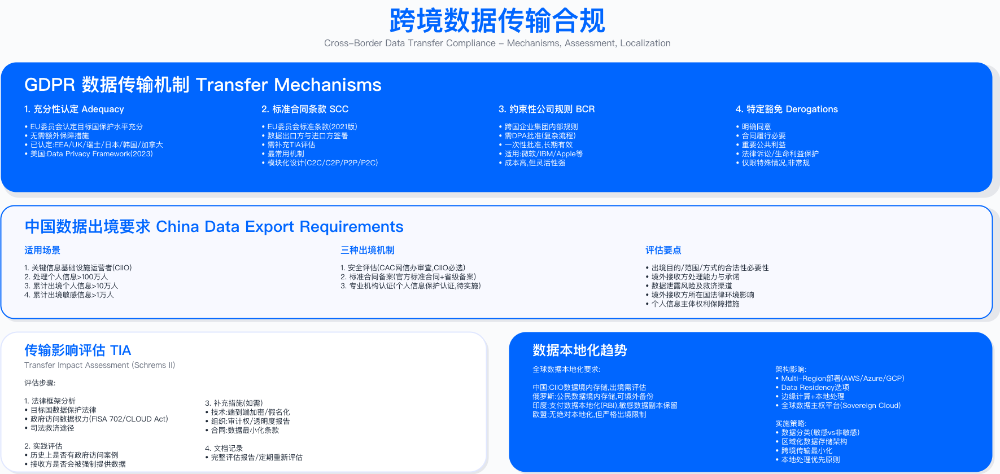

# 9.9　隐私合规实战案例

> 导读：前八节构建了隐私合规的完整理论框架；本节用四个典型案例还原决策现场。案例 1（全球 SaaS 平台 GDPR 改造）覆盖 9.4 DSR 自动化与 9.6 Cookie 同意的工程落地；案例 2（中国电商 PIPL 实践）聚焦 9.1 法规特有要求与数据本地化；案例 3（医疗科技双合规）展示两套法规并行时的统一控制设计；案例 4（Cookie 墙策略演进）是 9.6 核心合规判断在实际产品决策中的检验。每个案例均从约束条件出发分析决策路径，而非简单展示最优解。

---

## 概述

隐私合规的难点不在于理解法规条文，而在于在资源约束、业务压力、技术债务并存的真实环境中作出合规决策。本节四个案例均基于典型企业场景构建，从问题背景、约束条件、决策点、控制设计、验证方法、运行指标六个维度展开，呈现可参照的实施路径。

适用边界：本节案例适用于已完成隐私合规差距分析、具备基础数据治理能力的中大型企业。对于数据量较小或尚未建立数据资产清单的组织，建议先完成 9.1-9.3 的基础工作，再参考本节工程实践。案例中涉及的预算、人力配置为示例口径，实际落地需根据组织规模与数据复杂度调整。


---

## 9.9.1 案例一：全球 SaaS 平台的 GDPR 合规改造

### 项目背景

企业画像（化名）：
- 公司类型：B2B 项目管理工具（SaaS 模式）
- 用户规模：企业客户数万级，终端用户数百万级
- 数据中心：美国（主）+ 欧洲（副）
- 合规周期：GDPR 生效前启动，历时约 12 个月
- 团队配置：核心团队含 DPO、隐私工程师、法务、产品经理，另有工程师资源参与

启动背景：GDPR 生效后，对欧盟数据主体的处理行为将面临严格监管。该企业大部分流量来自欧盟，预估年 DSR 量将达数千级——手工处理无法在 30 天内完成响应，自动化系统的建设因此被列为高优先级。

### 差距分析阶段

差距分析是合规改造的起点。该企业从数据流映射、处理活动记录、同意管理、DSR 能力、供应商管理五个维度识别合规缺口：

| 评估维度 | 发现结果 | 风险判定依据 |
|---------|---------|-------------|
| 数据流映射 | 多个系统未纳入统一管理，跨境数据流缺乏记录 | GDPR 第 30 条要求控制者维护 ROPA |
| ROPA 状态 | 无处理活动记录，数据保留策略不明确 | GDPR 第 30 条强制要求 |
| 同意管理 | Cookie 预勾选，同意记录分散，无撤回机制 | GDPR 第 7 条要求可撤回的自由同意 |
| DSR 能力 | 手工处理，响应周期超过法定时限 | GDPR 第 12 条要求 30 天内响应 |
| 供应商管理 | 部分供应商缺乏 DPA，美国供应商无 SCC | GDPR 第 28 条要求签署书面 DPA |

已具备基础：传输加密（TLS）、静态加密、ISO 27001 认证、基于角色的访问控制——这些技术基础为合规改造提供了安全底座，避免了从零建立安全控制的额外工作量。

关键约束：
- DSR 请求量预估与实际偏差将直接影响自动化系统的容量规划
- Cookie 同意机制改造将影响营销数据采集能力
- 供应商 DPA 签署需跨部门协调，周期难以压缩

### 设计与实施阶段

#### 工作流 1：Cookie 同意管理

问题背景：原有 Cookie 部署采用预勾选模式，不符合 GDPR 第 7 条"自由给予的同意"要求（参见 9.6 对预勾选无效性的分析）。

控制设计：
- 选用成熟 CMP 产品（如 Cookiebot），避免自研带来的合规风险和维护负担
- 集成范围覆盖 Web 与移动端，移动端各平台需独立适配
- 同意记录持久化存储，满足 GDPR 第 5(2) 条问责制要求
- 第三方脚本通过 GTM 条件触发，仅在用户同意后加载，而非 CMP 弹窗展示后即加载

常见误区：
1. 移动端 CMP 集成复杂度被系统性低估——iOS 和 Android 各有独立技术栈，实际工作量通常超出预期 30%-50%
2. 营销团队对同意率下降存在抵触，需通过 A/B 测试提供数据支撑决策（同意率下降是合规的必要代价，而非设计失误）

验证方法：
- 使用浏览器开发者工具验证 Cookie 阻止逻辑（拒绝同意后，非必要 Cookie 不应写入）
- 模拟用户撤回同意流程，验证同意数据库更新与脚本阻止联动
- 监控同意率变化，评估对业务数据采集的实际影响

运行指标：
- 同意率分布（接受全部 / 部分 / 拒绝）
- CMP 服务在线率
- 第三方脚本阻止成功率

#### 工作流 2：DSR 自动化系统

问题背景：手工处理 DSR 请求无法满足 30 天响应要求，且随着用户量增长，人工成本将持续上升。自动化投资的核心价值不仅在于合规，更在于边际成本的降低。

控制设计：

| 组件 | 功能定位 | 关键技术点 |
|------|---------|---------|
| 前端门户 | 用户自助提交请求，进度跟踪 | 身份验证（OTP + 安全问题），平衡安全与体验 |
| 后端 API | 工单管理，权限控制，SLA 监控 | 30 天时限自动提醒，防止超时 |
| 数据发现 | 自动扫描多个系统，识别级联关系 | 需处理数据冲突与依赖关系 |
| 导出引擎 | 生成机器可读与人类可读格式 | JSON + PDF，满足 GDPR 第 20 条可移植要求 |
| 删除编排 | 级联删除，审计日志 | 不可篡改日志，支持恢复窗口（处理误删场景） |

常见误区：
1. DSR 请求量预估偏差较大——实际量可能显著超出预期，需预留水平扩展能力，而非按预估量精确配置
2. 身份验证过于严格导致用户体验差，过于宽松则面临欺诈风险；两者之间的平衡点需结合业务场景测试确定

验证方法：
- 使用测试账号模拟完整 DSR 流程（提交 → 验证 → 处理 → 交付）
- 验证删除操作的级联完整性（关联数据是否同步删除，孤立记录是否清理）
- 红队测试身份验证绕过路径

运行指标：
- DSR 响应时效达标率（30 天内完成占比）
- 自动发现率（无需人工干预的请求占比）
- 删除成功率（级联删除完整性）


#### 工作流 3：供应商合规管理

问题背景：存在多个数据处理者，部分缺乏 DPA，部分美国供应商未签署 SCC（参见 9.7 对 DPA 必备条款的分析）。

控制设计：
- 按供应商类型分类管理（云基础设施、SaaS 工具、营销工具、分析工具），分类后可批量处理同类型供应商
- 大型供应商（如主流云平台）通常有标准 DPA，可快速签署
- 小型供应商可能缺乏 DPO 或法务资源，需评估替换可行性或接受更高监督成本
- 公开子处理者清单，满足 GDPR 第 28(3) 条要求

常见误区：
1. 仅关注签署 DPA，忽略供应商实际技术能力（如是否支持数据删除 API）——合同义务无法弥补技术能力的缺失
2. 供应商更换涉及数据迁移，时间成本被普遍低估，建议预留两倍于预估的切换周期

验证方法：
- 建立供应商合规矩阵，逐项跟踪 DPA / SCC 签署状态
- 定期审计供应商的数据处理实践（可结合问卷或现场审计）

运行指标：
- DPA 签署完成率
- 供应商合规问题数量与整改周期

#### 工作流 4：EU 数据本地化

问题背景：部分欧盟用户数据存储于美国数据中心，跨境传输依赖 SCC，但 Schrems II 判决（C-311/18，2020-07-16）要求对 SCC 传输进行传输影响评估（参见 9.7.5）[6]。数据本地化可从根本上消除这一合规风险。

控制设计：
- 基于用户地理位置（IP 检测）路由至对应数据中心
- 数据库按区域分片，应用层路由读写请求
- 跨区域查询禁用，审计日志记录异常访问

关键约束：
- 数据迁移需零停机，采用蓝绿部署策略
- 基础设施成本因区域重复部署而增加
- 数据一致性验证需在迁移后独立进行

验证方法：
- 数据迁移后进行完整性校验（校验和比对）
- 验证区域路由逻辑（欧盟 IP 不应访问美国数据中心）

### 验证与上线阶段

外部审计：委托第三方审计机构进行技术控制、流程文档、策略审查。审计发现的问题需在上线前完成整改，避免带着已知合规缺口上线。

上线监控：设立 War Room 机制，上线后持续监控关键指标。首周重点关注：DSR 请求峰值是否超出系统容量、CMP 运行状态、用户投诉量。

### 经验教训

成功因素：
- 高管支持，将隐私合规作为战略优先级而非合规部门独立任务
- 充足周期（12 个月），避免仓促上线导致的质量问题和后期补救成本
- 跨职能协作，工程、法务、产品联合推进，避免各自为政
- 自动化优先，DSR 系统的投资回报显著高于持续的人工处理成本

挑战与遗憾：
- DSR 请求量预估偏差导致上线初期人工资源临时补位
- Cookie 同意率下降对营销数据采集产生了预期之外的影响，营销团队准备不足
- 移动端 CMP 集成周期超出预期，成为关键路径上的延误因素
- 小型供应商 DPA 签署困难，部分供应商最终被替换
- 客服团队培训不足导致初期投诉处理质量参差不齐

长期影响（定性评估）：
- 隐私合规成为企业对外的信任凭证，在 B2B 销售中具有实际说服力
- GDPR 合规框架可复用于 CCPA、LGPD 等后续法规，降低边际合规成本
- 年度合规运营成本固化为预算常态项
- 产品开发流程增加隐私设计审查环节（Privacy Review Gate）

---

## 9.9.2 案例二：中国电商的 PIPL 合规实践

### 项目背景

企业画像（化名）：
- 公司类型：大型跨境电商平台
- 用户规模：注册用户亿级，日活千万级
- 业务范围：中国（主）+ 东南亚（跨境）
- 合规周期：PIPL 生效前启动，历时约 6 个月（紧迫）
- CIIO 认定：被认定为关键信息基础设施运营者

启动背景：PIPL 于 2021 年 11 月生效，被认定为 CIIO 的企业须满足数据本地化要求，跨境传输须通过网信办安全评估。6 个月的改造窗口远短于通常建议的 12 个月，优先级取舍成为核心决策。

### PIPL 特有要求应对

PIPL 与 GDPR 存在多项差异（参见 9.1.2 对两套法规的对比分析），需针对性设计控制措施，而非直接复用 GDPR 合规方案：

| PIPL 特有要求 | 与 GDPR 对比 | 控制设计 |
|-------------|-------------|---------|
| 单独同意（第 14/23 条） | GDPR 允许一揽子同意 | 人脸支付、精确地理位置等场景需独立授权弹窗 |
| 数据本地化（第 40 条） | GDPR 无本地化条款，第五章走充分性认定 / SCC / BCR | 仅约束两类主体：CIIO，以及处理量达网信部门规定数量的处理者。不属于这两类的按《促进和规范数据跨境流动规定》分档：<10 万人免申报，10 万–100 万人走标准合同或认证，≥100 万人或 ≥1 万人敏感走安全评估。先判主体是否适用，再谈架构 |
| 死者权利（第 49 条） | GDPR 无此规定 | 建立死者账户处理流程与家属申请机制 |
| 自动化决策拒绝（第 24 条） | GDPR 有类似规定但 PIPL 更严 | 提供关闭个性化推荐的功能选项 |
| 处理规则公开（第 20 条） | GDPR 有类似要求 | 隐私政策增加处理目的、方式、期限的明确说明 |

### CIIO 数据本地化实施

问题背景：被认定 CIIO 后，所有中国用户数据必须存储境内。原有架构部分数据存储于境外数据中心，改造涉及大规模数据迁移。

控制设计：

```
数据本地化架构改造

改造前（跨境混合）：
  中国用户 → 部分数据存境外
  东南亚用户 → 存境外

改造后（严格隔离）：
  中国用户 → 全部存境内数据中心
    - 用户画像、订单数据、支付记录、物流信息
    - 跨境传输场景：仅海外购订单必要字段
    - 需签署标准合同 + 完成影响评估

  东南亚用户 → 继续存境外
    - PIPL 不管辖，但参照合规基准管理
```

迁移执行要点：
- 数据量大，分批执行，优先迁移高敏感数据
- 使用云平台数据迁移服务 + 自研校验脚本，双重验证
- 应用层采用双写过渡，验证数据一致性后再切换读流量
- 迁移完成后抽样人工核对，补充技术校验的盲区

网信办安全评估：触发条件为 CIIO + 数据出境。申报材料包括数据清单、技术方案、影响评估、法律意见等。审批周期通常达数月，是整体改造的关键路径，需提前启动。

关键约束：
- 境内云服务成本通常高于境外，需预算对齐
- 网信办评估审批周期不可控，需预留充足缓冲时间
- 跨境传输场景需持续报告，不得一次性申报后不再更新

### 组织架构调整

PIPL 第 52 条规定 CIIO 必须设立"个人信息保护负责人"，这一岗位与 GDPR 的 DPO 在职能上相近，但在法律地位和备案要求上存在差异：

| 角色 | 职责 | 任职要求 |
|------|------|---------|
| 个人信息保护负责人 | 监督合规、处理投诉、与网信办联络 | 法律背景 + 技术理解，向网信办备案 |
| 隐私工程师 | 技术方案实施、同意管理系统、DSR 自动化 | 开发经验 + 安全背景 |
| 隐私法务 | 政策起草、供应商合同、监管沟通 | 律师资格 + 隐私法经验 |

### DSR 处理与监管互动

中国口径的 DSR 时限需要先澄清一个常见误读：**PIPL 本身并未规定以天计的响应期限**——第 45 条要求处理者对查阅、复制请求"及时提供"，第 50 条要求建立便捷的申请受理和处理机制并在拒绝时说明理由，均无具体天数[1]。业界通行的"15 个工作日"来自《App 违法违规收集使用个人信息行为认定方法》（网信办、工信部、公安部、市场监管总局，2019-11-28）：更正、删除个人信息或注销账号的请求，"承诺时限不得超过 15 个工作日，无承诺时限的，以 15 个工作日为限"[2]。本例按这一口径设定内部 SLA。

| 指标 | GDPR 参考 | 本例采用的中国口径 | 差异原因 |
|------|---------|---------|---------|
| 法定/监管期限 | 一个月，可再延长两个月（GDPR 第 12 条第 3 款）[3] | 15 个工作日（依《认定方法》第六项）[2] | 中国口径来自部门规范性文件而非 PIPL 条文，且以工作日计 |
| 身份验证复杂度 | 中等 | 较高 | 中国用户验证场景涉及手机号+姓名+订单号等多因素 |
| 自动化覆盖率 | 较高 | 相对较低 | 数据分散程度更高，人工兜底需求更大 |

监管互动经验：
- 主动汇报：PIPL 生效前主动向网信办提交合规计划，建立沟通渠道，有助于形成正面印象
- 小型泄露处理：参考 GDPR 72 小时通知时限，及时向监管报告，而非等待法规明确要求
- 专项整治应对：配合工信部 App 专项检查，快速整改并提交详细报告，避免被列入问题清单

常见误区：
1. 15 个工作日的响应时限被低估，系统分散导致数据汇总困难，响应窗口实际更短
2. 身份验证设计不当，欺诈风险与用户体验难以平衡，需多轮迭代

### 业务影响评估

运营影响（定性描述）：
- 新功能上线须增加隐私设计审查环节，影响产品迭代节奏
- 精准营销能力受限（用户可撤回授权同意）
- 部分境外分析工具停用或替换为合规替代品
- 合规成本客观上形成新进入者的壁垒

验证方法：
- 定期审计数据本地化落实情况（抽样检查数据存储位置）
- 监控 DSR 响应时效达标率
- 跟踪监管机构反馈与专项检查结果

---

## 9.9.3 案例三：医疗科技公司 HIPAA+GDPR 双合规

### 项目背景

企业画像（化名）：
- 公司类型：数字健康平台（远程医疗 + 电子病历）
- 业务范围：美国（主）+ 欧盟（扩张）
- 合规要求：HIPAA（美国医疗隐私）+ GDPR（欧盟）
- 核心挑战：医疗数据同时属于 GDPR 特殊类别数据（第 9 条，参见 9.3.3）和 HIPAA PHI（受保护健康信息）

### 双法规协同框架

当企业同时受 HIPAA 和 GDPR 管辖时，需建立统一的合规策略。核心设计原则是以更严格的要求为基准——这一选择通常带来更高的合规成本，但可显著降低管理复杂度：

| 维度 | HIPAA | GDPR | 统一策略 |
|------|-------|------|---------|
| 适用范围 | PHI | 健康数据（特殊类别） | 健康数据全覆盖 |
| 法律基础 | 隐含同意（治疗/支付/运营） | 明确同意或医疗诊断必要 | 明确同意（超越 HIPAA 要求） |
| 加密要求 | 建议（addressable） | 要求（第 32 条） | 强制加密（GDPR 优先） |
| 数据保留 | 最少 6 年 | 原则最小化 | 6 年（HIPAA 优先） |
| 患者权利 | 访问 + 修正 | 8 项权利 | GDPR 8 项权利（范围更广） |
| 泄露通知 | 60 天（HHS OCR） | 72 小时（DPA） | 72 小时双通知（GDPR 优先） |
| 跨境传输 | 无限制 | 需 SCC/BCR | SCC（欧洲患者数据） |



### 技术架构设计

数据隔离策略：

```
双区域物理隔离架构

美国患者（HIPAA）：
  - 数据中心：使用支持 HIPAA 的云服务（需 BAA）
  - 协议：Business Associate Agreement（BAA）
  - 加密：传输加密（TLS 1.2+）+ 静态加密（AES-256）
  - 审计：日志保留满足 HIPAA 6 年要求

欧盟患者（GDPR）：
  - 数据中心：欧盟区域
  - 协议：DPA + 标准合同条款（SCC）
  - 数据本地化：100%（不跨境至美国）
  - 额外要求：假名化、撤回同意机制、DPIA、数据可移植（FHIR 格式）
```

专项技术控制：

| 控制类型 | HIPAA 要求 | GDPR 要求 | 实施方案 |
|---------|-----------|---------|---------|
| 视频问诊加密 | 传输加密 | 端到端加密（第 32 条） | 自研方案支持 E2EE |
| 去标识化 | Safe Harbor 方法 | 假名化（第 4 条） | HIPAA Safe Harbor + 专家确定法双轨并行 |
| 访问日志 | 审计控制（Required） | 审计日志（第 32 条） | 集中日志平台，长期保留 |
| 灾备 | 无明确要求 | 恢复能力（第 32(1)(c) 条） | 多可用区 + 跨区域备份 |

视频问诊平台自研原因：主流视频会议产品可能不签署 BAA 或未取得 GDPR 认证；自研虽成本较高，但可完全控制合规性，避免依赖第三方的持续合规风险。

### 患者权利处理差异

GDPR 的权利范围超越 HIPAA，须针对欧盟患者分别实现：

| 权利 | HIPAA | GDPR | 实施方案 |
|------|-------|------|---------|
| 访问权 | 30 天提供副本 | 30 天（可延 60 天） | 患者门户即时下载，超越最低要求 |
| 更正权 | 允许修正错误 | 更正权（第 16 条） | 医生审核 → 批准 → 历史版本保留 |
| 删除权 | 无（医疗记录须保留） | 有（第 17 条，但医疗例外） | HIPAA 6 年保留义务优先，期满后可删除 |
| 可移植权 | 无 | 有（第 20 条） | 采用 HL7 FHIR 格式导出，满足医疗数据互操作性要求 |

删除权的处理体现了双法规并行时的典型权衡：GDPR 原则上支持删除权，但明确了医疗必要性例外；HIPAA 6 年保留义务进一步固化了这一限制。最终方案是"HIPAA 保留期内不删除，期满后响应 GDPR 删除请求"，两套法规均无违反。

### 供应商 BAA+DPA 管理

医疗场景的供应商管理需同时管理 BAA（HIPAA）和 DPA（GDPR），两套协议的管理不应割裂：

| 供应商类型 | BAA 需求 | DPA 需求 | 关键说明 |
|-----------|---------|---------|------|
| 云基础设施 | 需要 | 需要 | 标准协议通常可用，但须核查具体服务覆盖范围 |
| SMS 通知服务 | 视数据类型 | 需要 | 若仅传输预约时间（非 PHI），BAA 可简化 |
| 支付服务 | 不需要 | 需要 | 不接触健康数据，仅需 DPA |
| 医疗 CRM | 需要 | 需要 | 须同时持有双认证 |

常见误区：
1. 认为云平台已有 BAA 即满足所有要求，忽略具体服务的覆盖范围——BAA 通常有明确的服务清单，超出清单的服务不受保障
2. DPA 与 BAA 分开管理，导致同一供应商出现合规盲区（如 BAA 签署但 DPA 缺失）

### 泄露事件处理

事件场景（示例）：第三方邮件服务配置错误，导致部分患者收到他人的预约提醒。泄露数据：姓名 + 预约时间 + 医生姓名（无诊断信息）。

双法规响应对比：

| 步骤 | HIPAA 要求 | GDPR 要求 | 实际执行 |
|------|-----------|---------|---------|
| 遏制 | 立即 | 立即 | 立即停止发送 |
| 评估 | 确定是否构成 PHI 泄露 | 风险评估（第 33 条） | 评估为中等风险 |
| 通知监管 | 小规模可年度汇总报告 | 72 小时 | 72 小时内通知相关 DPA（GDPR 优先） |
| 通知个人 | 60 天内书面通知 | 高风险时不得无故延迟 | 及时邮件通知（兼顾两项要求） |

补救措施：更换邮件服务商；增加发送前收件人验证机制；全员培训（重点是配置变更的审批流程）；建立配置变更审计制度。

### 合规认证的商业价值

认证组合对于医疗行业不仅是合规凭证，更是销售周期的加速器：

| 认证 | 说明 | 商业价值 |
|------|------|---------|
| HITRUST CSF | HIPAA 最高合规标准 | 医院客户通常将其列为准入要求 |
| ISO 27001 | 信息安全管理体系 | 国际认可度高，适用于欧盟客户 |
| ISO 27701 | 隐私信息管理（对齐 GDPR） | GDPR 合规能力的第三方背书 |
| SOC 2 Type II | 服务组织控制报告 | 保险公司和支付方的常见要求 |

商业影响（定性描述）：认证可缩短企业客户的尽职调查周期，具备完整认证组合的供应商通常比未认证供应商获得更快的采购审批；网络保险费率也可能因认证而降低。

---

## 9.9.4 案例四：Cookie 墙争议与 CMP 优化

### Cookie 墙法律演变

Cookie 墙是指用户必须接受 Cookie 才能访问网站的机制。其合规性从 GDPR 生效初期的模糊态度，逐步演变为监管机构的明确反对立场：

| 时间节点 | 事件 | 监管态度 |
|---------|------|---------|
| GDPR 生效初期 | 法规无明确禁止 | 模糊，各 DPA 态度不一 |
| 2019-10-01 | Planet49 判决（欧盟法院 C-673/17） | 预勾选无效，需主动同意[4] |
| 2020-05-04 | EDPB Guidelines 05/2020 on consent | Cookie 墙不符合"自由同意"要求[5] |
| 后续 | 多个 DPA 执法行动 | 明确反对立场，执法处罚落地 |

法律核心逻辑：Cookie 墙导致用户在"接受 Cookie"与"无法访问网站"之间二选一，违反 GDPR 第 4(11) 条"自由给予的同意"要求（参见 9.6.1 对同意有效性要件的分析）。基于强制的同意无效，等同于无同意处理，构成违法。

### 策略演进路径

某欧洲媒体公司的 Cookie 策略经历了三个阶段，每个阶段都是对监管压力与商业利益权衡的不同解答：

阶段 1：Cookie 墙强制

```
用户访问网站
    ↓
[接受 Cookie 并继续] 或 [离开网站]
    ↓
绝大多数用户被迫接受
```

结果：同意率虚高（被迫接受，非真实同意）；用户投诉增加；收到监管警告，法律风险迫使改变。

阶段 2：软墙策略

```
用户访问网站
    ↓
[接受 Cookie（个性化广告）] 或 [拒绝 Cookie（更多通用广告）]
    ↓
拒绝用户承受更差体验作为"代价"
```

结果：同意率有所下降，拒绝用户体验较差（广告过载），法律风险仍存在——"过度激励"同意同样违反自由同意原则。

阶段 3：付费墙混合

```
用户访问网站
    ↓
选项 1：接受 Cookie，免费阅读（个性化广告收入支撑）
选项 2：拒绝 Cookie + 付费订阅（无广告）
选项 3：拒绝 Cookie + 有限免费（每月限制文章数）
```

结果：提供了真实选择（不强制 Cookie）；付费替代方案符合 EDPB 指南要求（但需注意：定价过高仍可能被认定为变相强制）。

### CMP 技术与 UX 优化

A/B 测试揭示了同意率与合规性之间的关键权衡——某些提升同意率的手段本身就是违规行为：

| 测试变量 | 发现 | 合规结论 |
|---------|------|---------|
| 仅"接受"按钮 vs "接受 + 拒绝" | 增加拒绝按钮导致同意率显著下降 | 合规必需，须接受同意率损失 |
| Cookie 墙 vs 自由选择 | 自由选择导致同意率下降，但法律风险大幅降低 | 风险降低的价值高于同意率 |
| 按钮颜色差异（绿色接受 + 灰色拒绝） | 可提升同意率 | EDPB 明确禁止的暗黑模式，不可采用 |
| 法律术语 vs 白话语言 | 白话语言可提升同意率且改善理解度 | 合规且用户友好，应优先采用 |

技术性能优化：CMP 本身的性能问题常被忽视，但直接影响用户体验与留存：

| 问题 | 影响 | 解决方案 |
|------|------|---------|
| CMP 脚本阻塞首屏渲染 | 页面加载延迟，Core Web Vitals 评分下降 | 异步加载 + 服务器端渲染 |
| ITP 限制导致同意记录丢失 | 重复弹窗，用户体验差 | 服务器端同意记录替代客户端 Cookie 存储 |
| 第三方脚本过多 | 加载时间延长 | 整合至 GTM，条件触发（仅同意后加载） |

应该做 vs 不应该做：

| 应该做 | 不应该做 |
|-------|---------|
| 拒绝按钮与接受按钮同等显著 | Cookie 墙：强制"接受或离开" |
| 付费替代方案（价格合理） | 暗黑模式：差异化按钮颜色/大小设计 |
| 细粒度分类开关 | 预勾选：自动勾选 Cookie 类别 |
| 白话语言描述 Cookie 用途 | 过度激励：软墙"惩罚"拒绝用户 |
| 性能优先（CMP 加载控制在合理范围） | 隐藏拒绝：需多次点击才能找到拒绝选项 |

常见误区：
1. CMP 选型仅关注合规功能，忽略加载性能对 Core Web Vitals 的影响——CMP 本身可能成为 SEO 的负面因素
2. 同意记录仅存储客户端，Safari ITP 限制导致记录被清除，用户频繁看到重复弹窗

验证方法：
- 使用浏览器开发者工具验证 Cookie 阻止逻辑（拒绝同意后，非必要 Cookie 不应被写入）
- 模拟拒绝同意后的完整用户路径，验证体验是否可接受
- 监控 Core Web Vitals 指标在 CMP 上线前后的变化

运行指标：
- 同意率分布（按地域、设备类型分层）
- CMP 脚本加载时间（目标：低于首屏渲染时间的 20%）
- 重复弹窗率（服务器端存储有效性指标）
- 用户投诉数量（同意质量的间接指标）

---

## 本节总结

### 跨案例经验提炼

四个案例的共同规律比各自的具体方案更有普适价值：

战略层面：
- 高管支持是合规项目成功的前提——合规不只是法律问题，更是资源分配的优先级问题
- 充足周期（建议 12 个月以上）可显著降低仓促上线的后续修复成本
- 预留 20%-30% 的预算缓冲，应对预估偏差（DSR 量、迁移复杂度、供应商签约周期）
- 跨职能协作避免组织孤岛——隐私合规项目失败的首要原因是部门间协调失效

技术层面：
- DSR 自动化的投资回报通常高于持续的人工处理成本，优先级应高于其他技术建设
- 数据本地化在敏感行业（医疗、金融）优于复杂的跨境传输合规方案
- 选用成熟 CMP 产品，避免自研带来的合规风险（法规变化时的维护成本）
- 双法规场景以更严格要求为基准，可显著简化合规管理复杂度

法律层面：
- 主动与监管机构沟通可建立信任，在执法决定时获得更宽容的处理
- 事件处理的透明度有助于维护用户信任，弥补合规失误的声誉影响
- Cookie 墙高法律风险，付费订阅替代方案是当前监管接受的商业模式
- 供应商 DPA 签署需预留充足时间，小型供应商的响应速度通常远低于预期

### 各行业实施参考

| 行业 | 优先建设项 | 参考案例 |
|------|-----------|---------|
| SaaS / 科技 | DSR 自动化、CMP 同意管理、供应商 DPA | 案例 1 |
| 电商 | 分场景同意管理、数据本地化、15 个工作日 DSR 响应 | 案例 2 |
| 医疗健康 | HIPAA+GDPR 双合规框架、BAA+DPA 联合管理、HL7 FHIR 可移植性 | 案例 3 |
| 媒体 / 出版 | Cookie 策略合规化、付费墙替代方案、CMP 性能优化 | 案例 4 |

验证方法：
- 定期审计合规措施落实情况（按季度或年度）
- 模拟 DSR 请求端到端测试响应流程时效
- 红队测试身份验证与数据删除机制的完整性
- 持续监控关键运行指标，设置告警阈值

运行指标（综合）：
- DSR 响应时效达标率（GDPR：一个月，可延长两个月[3]；中国：按《认定方法》口径 15 个工作日[2]）
- Cookie 同意率分布（按地域、设备类型）
- 供应商合规问题数量与平均整改周期
- 监管机构通知次数与最终处罚结果

---

## 参考文献

| # | 来源 | 标题 | 日期 | 链接 |
| --- | --- | --- | --- | --- |
| [1] | 中国人大网 | 《中华人民共和国个人信息保护法》第 45、47、50 条（查阅复制"及时提供"、删除权、权利行使机制；均未规定以天计的响应期限） | 2021-08-20 | <http://www.npc.gov.cn/npc/c2/c30834/202108/t20210820_313088.html> |
| [2] | 国家网信办、工信部、公安部、市场监管总局 | 《App 违法违规收集使用个人信息行为认定方法》（更正、删除、注销请求"承诺时限不得超过 15 个工作日，无承诺时限的，以 15 个工作日为限"） | 2019-11-28 | <https://www.cac.gov.cn/2019-12/27/c_1578986455686625.htm> |
| [3] | EUR-Lex（欧盟官方公报） | Regulation (EU) 2016/679（GDPR）第 12 条第 3 款：一个月内响应，可再延长两个月 | 2016-04-27 | <https://eur-lex.europa.eu/eli/reg/2016/679/oj> |
| [4] | 欧盟法院（CJEU） | Case C-673/17（Planet49）：预先勾选的复选框不构成有效同意 | 2019-10-01 | <https://curia.europa.eu/juris/liste.jsf?num=C-673/17> |
| [5] | EDPB | Guidelines 05/2020 on consent under Regulation 2016/679, version 1.1（Cookie 墙与"自由给予的同意"） | 2020-05-04 | <https://www.edpb.europa.eu/system/files/documents/files/file1/edpb_guidelines_202005_consent_en.pdf> |
| [6] | 欧盟法院（CJEU） | Case C-311/18（Schrems II）：使用 SCC 传输须开展传输影响评估 | 2020-07-16 | <https://curia.europa.eu/juris/liste.jsf?num=C-311/18> |

---

## 导航

[← 上一节：9.8 隐私事件响应](./9.8_隐私事件响应.md) | [返回章节目录](./README.md) | [下一节：第10章 信息保护 →](../../第03部分_数据安全与隐私/第10章_信息保护与内部风险/10.0_执行摘要.md)

---

© 2025-2026 AISecOps Project. Licensed under CC BY-NC-SA 4.0
