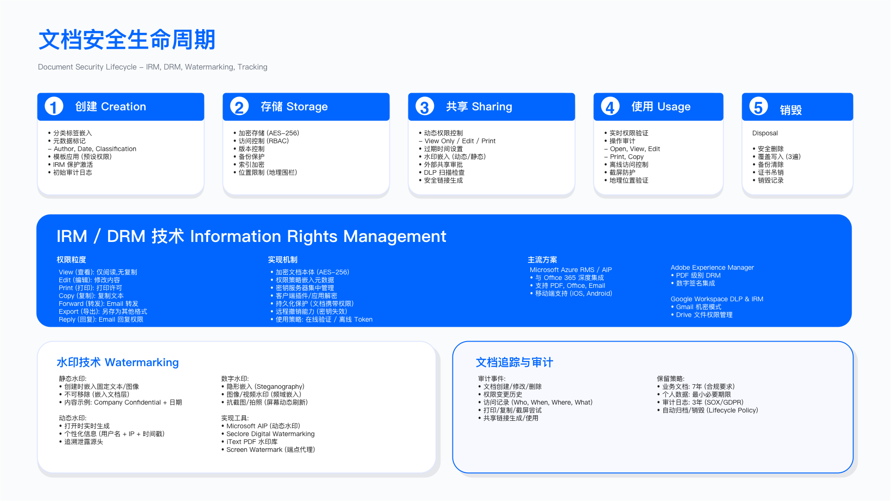

# 10.1　文档标签与用户合规

> 前置依赖：分级模型、检测规则、ML 分类器与标签的技术实现见 **8.2 数据分类与标记**，本节不重复。分级名称以 8.2.1 为准（Public / Internal / Confidential / **Restricted**）。
>
> 本节聚焦分类分级的**用户面**——同一套分级标准，在系统侧是引擎问题，在用户侧是行为问题。引擎判错了可以改规则，用户打错了标签只能靠培训、默认值设计和事后审计去纠。这一面在多数企业里恰恰是分类项目失败的地方：引擎上线了，用户不用；或者用户用了，全部选"内部"。

## 10.1.1　标签技术实现

### 问题背景

分类框架确定了信息的敏感等级，但需要通过标签技术将分类结果"具体化"为：用户可见的标识、系统可读的元数据、以及可追踪的水印。标签是分类策略执行的技术载体——没有可被系统读取的元数据标签，DLP 和 IRM 无法基于分类级别自动执行策略。

### 标签类型

标签技术可分为三类，各司其职：

视觉标签在文档页眉、页脚或正文中显示分类级别，使人类读者一目了然。视觉标签的设计需考虑颜色编码（公开级绿色、内部级蓝色、机密级橙色、限制级（Restricted）红色）、文字内容（中英文双语显示分类级别与处理提示）、以及位置与字体（确保不影响文档正常阅读）。视觉标签面向人类，不能被系统自动读取用于策略执行。

元数据标签将分类信息写入文件的元数据字段，供 DLP、IRM 等系统读取与执行策略。技术实现包括 Windows 文件系统的 NTFS 扩展属性（Alternate Data Streams）、Linux/macOS 的扩展属性（xattr）、以及云存储的对象标签（如 S3 Object Tags、Azure Blob Metadata）。元数据标签是策略自动化执行的基础——只有元数据标签，DLP 才能"认出"机密文档并执行阻止策略。

动态水印在高敏感文档中嵌入包含访问者身份、访问时间、文档标识的水印，用于泄露追踪。水印可为可见（对角线文字）或不可见（隐写），位置可为对角线居中、页角或随机分布。动态水印在 10.8.3 案例中发挥了关键的法律取证作用。

### 标签应用流程

标签应用应与文档创建、分类流程集成：

1. 用户创建文档并选择分类级别（或系统自动分类）
2. 系统根据分类级别自动应用对应的视觉标签模板
3. 系统将分类元数据写入文件属性
4. 若为限制级（Restricted），系统生成动态水印嵌入文档

标签应用的技术集成点包括：Office 插件（Word/Excel/PowerPoint）、邮件客户端插件（Outlook）、文档管理系统（SharePoint）、云存储服务。集成深度决定了标签流程对用户的透明度——深度集成的标签应用几乎无感知，浅层集成则需要用户多余的操作步骤。

### 适用边界

标签技术适用于结构化的办公文档（Word、Excel、PowerPoint、PDF）、支持元数据写入的文件系统与存储服务、以及具备文档处理插件集成能力的办公环境。

标签技术受限于无法嵌入元数据的文件格式（如纯图片、部分压缩格式）、用户可绕过标签（截图、手动删除元数据）、以及跨组织协作时标签可能不被对方系统识别。

### 关键约束

用户体验是首要约束：标签应用流程若过于繁琐，员工可能绕过或随意选择分类，需要将分类选择集成到正常工作流程中，尽量减少额外操作步骤。微软 Office 内置的敏感度标签选择器是较好的范例：用户在 Office 功能区即可一键选择，无需切换到其他工具。

跨平台兼容性同样是挑战：元数据标签在不同操作系统、不同应用间的兼容性需要验证——Windows 上写入的 NTFS 扩展属性在 macOS 上可能无法读取。

标签防篡改亦需考量：普通用户不应能够修改高敏感文档的分类标签，需要通过权限控制或数字签名防止标签被篡改。

### 常见误区

仅依赖视觉标签：视觉标签仅供人类识别，无法被自动化系统执行策略。若仅有视觉标签而无元数据标签，DLP 系统无法基于分类级别执行拦截策略——看起来"有标签"，实际上系统无法识别。

忽视标签生命周期：未建立标签复审与更新机制，文档分类可能随时间变化。一份"机密"的产品路线图，在产品正式发布后应当降级，否则会人为增加合法业务的摩擦。

### 验证方法

验证方法包括三个层面：标签完整性检查扫描文档库，验证机密及以上级别文档是否同时具备视觉标签与元数据标签；标签一致性验证对比文档的视觉标签与元数据标签，检测不一致情况；标签传播测试验证从机密文档复制内容到新文档时，标签传播规则是否生效。

### 运行指标

核心运行指标包括标签覆盖率（已应用标签的文档占已分类文档的比例）、标签一致性率（视觉标签与元数据标签一致的文档比例）、以及标签传播有效率（衍生文档正确继承源文档分类的比例）。

---

## 10.1.2　用户培训与合规审计

### 问题背景

信息分类体系的有效性最终取决于用户的执行。无论自动化技术多么成熟，仍有大量场景需要用户主动判断与选择分类级别。培训确保用户理解分类框架与操作方法；审计验证分类体系的实际执行效果。两者缺一不可——有培训无审计，无法验证效果；有审计无培训，发现问题无法改进。

### 培训体系设计

培训体系应分层设计，覆盖不同角色的差异化需求：

全员基础培训为所有员工入职及年度必修，内容包括信息分类的必要性（结合真实泄露案例说明后果）、四级分类框架的定义与示例、分类决策树的使用方法、标签工具的实际操作（邮件客户端、Office 插件）、以及外部分享的审批流程。

角色专项培训针对特定角色进行深化：高管层聚焦高度机密信息处理规范、并购信息保护、媒体询问应对；人力资源与财务部门聚焦 PII 与财务数据保护、薪资信息保密；法务部门聚焦诉讼材料保护、律师-客户特权、取证链保全；销售与市场部门聚焦客户数据外部分享规范、演示材料分类。

持续强化机制确保培训不是一次性活动：定期分享分类最佳实践与常见错误、结合钓鱼演练测试员工分类意识、建立分类正确率激励机制。

### 合规审计框架

审计框架应覆盖分类体系的各关键环节：

分类覆盖率审计：验证活跃文档中已分类的比例。审计方法为定期抽样文档库，统计未分类文档数量与来源。

分类准确率审计：验证分类结果的正确性。审计方法为抽取样本文档，由专家复核分类是否准确。

标签一致性审计：验证标签是否正确应用。审计方法为扫描文档属性，检查标签是否存在、格式是否正确、与分类级别是否匹配。

过度分类/分类不足审计：识别分类偏差模式。过度分类（将低敏感信息标为高敏感级别）影响业务效率；分类不足（将高敏感信息标为低敏感级别）产生安全风险。两类偏差的成因不同——过度分类通常来自"不确定时选高"的过度谨慎，分类不足通常来自培训不足或流程绕过。

审计发现应分级处理：关键发现（如高度机密文档未加密）限期整改并验证；高级发现（如机密文档无标签）30 日内整改；中级发现（如分类不准确）纳入培训改进；低级发现（如标签格式不符）列入优化清单。

### 适用边界

培训与审计适用于所有实施信息分类的组织，但培训方式应根据组织规模与员工分布调整。小型组织可采用现场培训；大型或分布式组织需依赖在线学习平台（LMS）；高流动性行业需增加入职培训频次。

### 关键约束

培训资源是首要约束，培训设计、课件制作、考核系统均需资源投入；员工时间是另一个现实约束，培训占用员工工作时间，需控制单次培训时长（建议不超过 30 分钟）；审计人力亦需考量，人工复核需要信息安全专家参与，大规模审计需要抽样策略而非全量检查。

### 常见误区

"培训即合规"：认为完成培训即意味着员工会正确执行。培训是必要条件但非充分条件——如果培训内容脱离实际工具操作，员工即使"通过了测试"也不知道实际怎么操作。

审计形式化：审计仅走流程、不追踪整改，发现的问题在下一次审计时依然存在。审计的价值在于推动改进形成闭环，而非产出一份静态的审计报告。

### 验证方法

验证方法包括三个层面：培训有效性验证对比培训前后的分类准确率，评估培训效果；审计流程验证验证审计发现是否得到跟踪与闭环；用户满意度调研收集用户对分类工具与流程的反馈，识别体验痛点。

### 运行指标

核心运行指标包括培训完成率（完成必修培训的员工比例）、培训测验通过率（首次测验通过的比例，持续偏低时需重新评估课程设计）、分类准确率趋势（逐期审计的分类准确率变化，持续下降时需排查原因）、以及审计发现闭环率（审计发现得到整改并验证的比例）。

---

## 10.1.3　标签在衍生文档间的传播

*图 10.1：文档安全生命周期——创建、存储、共享、归档、销毁五个阶段的标签继承与控制衔接*

标签最容易失效的时刻不是打标签那一刻，而是文档被复制、摘录、汇总之后。一份 Restricted 的报表被摘出三张表贴进周报，周报默认继承的是创建者的默认密级——这就是降密泄露最常见的形态，而它不触发任何 DLP 规则，因为周报本身的标签是合法的。

传播规则的基本原则是**取最高**：多源聚合的文档，密级取所有来源中的最高级；派生文档默认继承母文档密级，降密必须经数据所有者显式审批并留痕。工程上这条原则难在"知道来源是谁"——纯客户端的复制粘贴无法追踪，因此可落地的做法通常是三层：文档级（Office/WPS 插件在另存为、复制内容时继承标签，Microsoft Purview 敏感度标签即属此类[1]）、平台级（协作平台在文档引用、嵌入时传递标签）、以及事后兜底（DLP 与 IRM 对无标签但内容命中高密级特征的文档做补标与告警）。

> 三层里只有第三层是对抗性的。前两层依赖客户端配合，绕过成本极低；它们的价值是覆盖绝大多数无意场景（作者实测中约九成以上，示例口径，非行业基准），不要指望它们防住有意的降密。

---

## 本节小结

分类分级有两个面：引擎面和用户面。8.2 解决引擎面——规则怎么写、分类器怎么训、标签怎么落。本节解决用户面——标签在用户手里怎么用对、用错了怎么发现、在文档流转中怎么不丢。

把两面分开的实际收益是：引擎的精确率和用户的正确率是两个独立的指标，混在一起看会掩盖真正的问题。引擎精确率 95%、用户正确率 40% 的组织，和引擎 70%、用户 90% 的组织，需要做的事完全不同——前者要投培训与默认值设计，后者要投规则调优。

## 参考文献

| # | 来源 | 标题 | 日期 | 链接 |
| --- | --- | --- | --- | --- |
| [1] | Microsoft Learn | Learn about sensitivity labels — 标签在 Office 应用与协作平台中的继承与传播行为 | 2026 | <https://learn.microsoft.com/en-us/purview/sensitivity-labels> |

---

## 导航

[8.1 数据安全战略](../第08章_数据安全/8.1_数据安全战略.md) | [返回章节目录](./README.md) | [下一节：10.2 信息权限管理（IRM/DRM） →](./10.2_信息权限管理.md)

---

© 2025-2026 AISecOps Project. Licensed under CC BY-NC-SA 4.0
