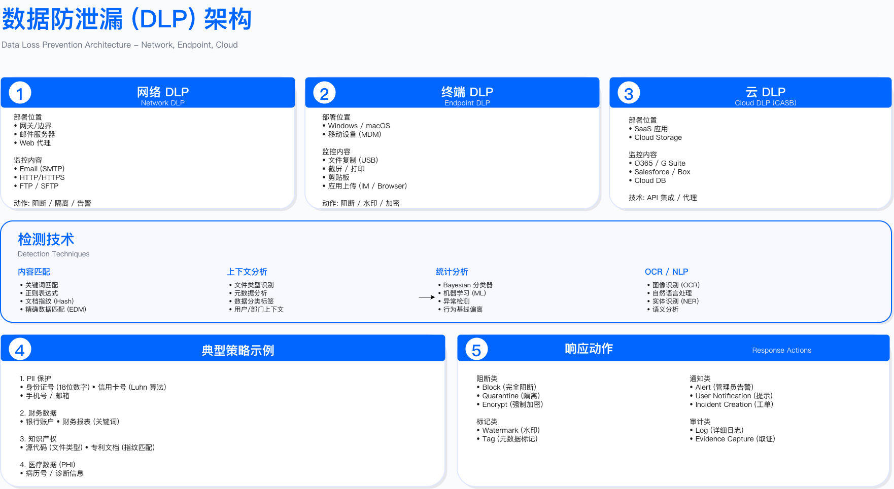

# 10.3　数据丢失防护（DLP）

> 本节是全书 DLP 的**唯一完整落点**。第8章 8.6 只保留与分类引擎的接口说明。
>
> 归属理由：按第8章与本章的划界口径，DLP 拦截的对象是**已获授权的内部人员**——员工把源码打包外发、把客户名单误发给外部收件人、离职前批量下载。它的难点从来不是"能不能检出敏感内容"（那是 8.2 分类引擎的能力，本节直接复用），而是"如何在不误伤正常业务的前提下判别外发意图"，这是人的行为面的问题。因此 DLP 整体归本章，架构、检测技术、策略调优、运营流程一并在此，不再跨章切开。

## 10.3.1　DLP 架构与部署模式

### DLP 系统分层架构

DLP 系统由管理控制台、检测引擎、策略决策引擎、执行代理四层组成。管理控制台负责策略配置与事件管理；检测引擎（Inspection and Content Engine, ICE）融合正则表达式、指纹匹配、NLP 等技术识别敏感内容；策略决策引擎（Policy Decision Engine, PDE）基于规则与上下文评估风险并选择动作（阻断/告警/加密/审批）；执行代理分布在网络、端点、云、应用各层。


*图 8.3：DLP 多渠道防护架构 - 网络/端点/云/应用四层防护体系*

架构设计决策点：

1. 集中式 vs 分布式管理：全球化企业需考虑数据本地化（如 PIPL 要求中国用户数据处理在境内），可能需部署区域 DLP 控制台并与总部联邦集成
2. 检测引擎性能边界：网络 DLP 吞吐量通常为 1-10 Gbps（取决于 SSL 检测启用比例），超过此值需横向扩展或采用旁路镜像模式
3. 策略决策实时性：端点 DLP 需支持离线决策（缓存策略至本地），否则网络中断时无法执行控制

### 常见误区

1. 部署所有 DLP 渠道就能完全防止泄露：攻击者可通过物理拍照、OCR 截图、隐写术等手段绕过 DLP，需配合物理安全与 UEBA 异常检测（详见 8.7 数据安全监控与审计）
2. DLP 策略上线即开启阻断模式：初期应采用"监控告警"模式运行 4-8 周，建立基线并调优误报率后再切换阻断
3. 仅依赖关键词匹配检测敏感数据：关键词易被同义词替换或拼写变体绕过，需结合正则表达式校验（如信用卡 Luhn 算法）与文档指纹技术

### 验证方法

1. 红队绕过测试：尝试通过加密压缩包、图片隐写、分段传输等手段绕过 DLP，验证检测覆盖度
2. 误报率基线测试：选择 500-1000 个真实业务场景（如合法邮件附件、正常 USB 拷贝），测量误报占比
3. 性能压力测试：模拟峰值流量（如网络 DLP 需测试 80% 设计容量时的延迟与丢包率）

### 运行指标

- 检测覆盖率：已保护的数据通道占总通道数的比例（目标 > 90%）
- 策略准确率：真阳性 / (真阳性 + 假阳性)，作者调研估算的可用区间为 85-95%（作者口径，未见权威机构发布过该项行业基准）
- 平均检测延迟：从数据传输开始到 DLP 决策完成的时长（网络 DLP 目标 < 50ms，端点 DLP 目标 < 2s）
- 代理在线率：端点 DLP 客户端保持连接的设备占比（目标 > 95%）

---

## 10.3.2　多渠道 DLP 部署

### 1. 网络 DLP (Network DLP / N-DLP)

部署位置：互联网出口、内部网络边界（如数据中心到办公网）、云 VPC 出口

检测协议：HTTP/HTTPS（需 SSL 解密）、SMTP/POP3/IMAP、FTP/SFTP、WebDAV、即时通讯协议

部署模式决策：

| 模式 | 优点 | 缺点 | 适用场景 | 性能影响 |
|------|------|------|----------|----------|
| 串联(Inline) | 可实时阻断违规传输 | 单点故障风险、增加约 10-50ms 延迟（作者实测示例口径）| 金融/医疗等高安全要求环境 | 需设计容量 1.5-2 倍峰值流量 |
| 旁路镜像(Monitor) | 零故障影响、无延迟 | 仅告警无法阻断、依赖镜像端口性能 | 初期评估阶段、监管要求仅审计的场景 | 镜像端口需支持全流量复制 |

TLS/SSL 解密挑战：

1. 中间人证书部署：需在所有客户端（含移动设备）安装企业根证书，BYOD 设备可能拒绝安装
2. 证书固定（Certificate Pinning）绕过：移动应用硬编码证书指纹时，DLP 无法解密流量，需与应用开发团队协调豁免企业证书
3. 隐私合规要求：欧盟部分国家要求雇主明确告知员工 HTTPS 解密范围，中国劳动法要求监控需写入劳动合同

典型配置示例：

```yaml
network_dlp_config:
  deployment_mode: inline  # 或 monitor
  ssl_inspection:
    enabled: true
    exclude_domains:  # 排除敏感域名(如银行/医疗门户)
      - "*.bank.com"
      - "*.healthcare-portal.com"
    certificate:
      ca_cert: "/path/to/enterprise-ca.crt"
      private_key: "/path/to/enterprise-ca.key"
  performance:
    throughput_gbps: 10  # 设计容量
    max_concurrent_connections: 500000
    bypass_on_failure: true  # 故障时自动旁路，避免业务中断
```

怎么读这份配置：`exclude_domains` 是合规和可用性的关键。银行、医疗门户通常使用证书固定，强行解密会导致连接失败；同时，部分行业法规禁止解密此类站点的流量（如医生在医院门户查阅患者信息）。`bypass_on_failure: true` 是高可用设计——串联模式下 DLP 设备故障会切断所有流量，旁路保证业务连续性，代价是故障期间 DLP 失效，需在安全日志中记录旁路事件并告警。

常见误区：

1. 所有 HTTPS 流量均解密检测：医疗/金融门户流量解密可能违反行业法规，需建立豁免清单
2. 旁路模式下认为可完全阻断：旁路仅能告警，若需阻断必须切换至串联模式

验证方法：

- 使用 Wireshark 抓包验证 SSL 解密是否生效（检查证书颁发者是否为企业 CA）
- 测试故障切换：断开 DLP 设备电源，验证流量是否自动旁路

运行指标：

- 可检测流量占比：经解密或本身为明文的流量 / 总流量。这个数字要按实际值披露，不设统一目标——分级解密下，员工访问金融、医疗、政务、求职类站点属于隐私红线不解密，证书固定的应用与移动端进豁免清单，服务器出网则应尽量解密，各类流量的占比因业务构成差异很大。汇报检测类控制的有效性时必须同时给出这个占比，否则数字是误导性的（分级策略与三条落地纪律见 [15.3.8](../../第05部分_身份网络与业务连续性/第15章_网络基础设施与终端安全/15.3_边界与流量防护.md)）
- 旁路模式触发次数：DLP 设备故障导致的自动旁路事件（目标每月 < 1 次）

---

### 2. 端点 DLP (Endpoint DLP / E-DLP)

部署位置：员工笔记本、台式机、移动设备

检测对象：文件操作（复制/移动/上传）、剪贴板、打印、USB/外接存储、截图、应用上传

端点代理设计决策：

```yaml
endpoint_dlp_agent:
  channels:
    file_operations:
      monitored_actions: [copy, move, upload, email_attach]
      monitored_apps: [outlook.exe, chrome.exe, slack.exe, wechat.exe]
    removable_media:
      default_action: block  # 或 allow, encrypt_only
      approved_devices:  # USB 设备白名单(通过 VID/PID 识别)
        - "VID_0951&PID_1666"  # 企业采购的加密 U 盘
    clipboard:
      max_copy_size_kb: 1024  # 限制单次复制大小，防止大规模数据导出
      block_cross_app: true  # 禁止从敏感应用复制到外部应用
    screen_capture:
      ocr_detection: true  # 对截图进行 OCR 识别敏感内容
      watermark_enforcement: true  # 强制添加用户身份水印
  offline_mode:
    local_policy_cache: true  # 缓存策略至本地，离线时可决策
    defer_decisions: true  # 离线时延迟决策，联网后同步
    max_offline_hours: 72  # 超过 72 小时未联网则阻断所有敏感操作
```

怎么读这份配置：`max_offline_hours: 72` 是离线场景的关键设计——出差员工 72 小时不联网属于正常情况（长途飞行+时差），超出后阻断敏感操作可以接受；若设为 24 小时，周末出差的员工周一上班时会发现所有敏感文件操作被拦截，产生大量投诉。`block_cross_app: true` 防止用户从 Salesforce 复制客户数据粘贴到个人邮件——这是比上传附件更难检测的泄露路径，剪贴板控制是端点 DLP 的核心价值之一。

`removable_media` 这一段需要与终端侧的外设管控划清分工，否则两边都以为对方管住了。分界线是：**外设管控回答"这个设备能不能接"，DLP 回答"这些数据能不能出去"**。上面的 VID/PID 白名单属于前者，只做它，用户可以往获批的设备里拷任何东西；只做内容检测，用户可以换一个未受管的设备绕过。两者要配合，且**设备侧的覆盖必须按设备类别铺开而不只是大容量存储类**——手机以 MTP 协议连接电脑传文件、USB 转以太网适配器接入未受管网络，这两类都不在"可移动存储"的策略范围内，是"禁用 U 盘"执行多年后仍被绕过的典型路径。设备类别分级表与一个执行了两年才被发现的失效案例见 [15.5.9](../../第05部分_身份网络与业务连续性/第15章_网络基础设施与终端安全/15.5_终端安全管理.md)。

AI 增强的异常检测示例（UEBA 集成）：

端点 DLP 结合用户行为分析（UEBA）可检测异常数据导出。某用户平时每天导出 1 次文件、平均大小 10MB；若某天导出 20 次、总计 100MB，综合分数计算如下：

- 导出频率异常（20 次 vs 基线 1 次）：权重 40%
- 文件大小异常（100MB vs 基线 10MB）：权重 30%
- 非工作时间操作：权重 20%
- 首次访问敏感目录：权重 10%

综合分数 ≥ 70 分则阻断并要求经理审批，40-70 分则允许但增强审计，< 40 分正常放行。

常见误区：

1. 端点 DLP 可监控所有应用：部分应用（如虚拟机内操作、加密容器）对 DLP 代理不可见，需配合应用层 DLP
2. 离线设备失去保护：若未设计本地策略缓存，员工可通过禁用网络绕过 DLP
3. USB 白名单仅依赖设备 ID：攻击者可伪造 VID/PID，需配合硬件加密 U 盘（内置证书验证）

验证方法：

- 测试离线场景：断开网络后尝试复制敏感文件，验证本地策略是否生效
- 红队测试：尝试通过虚拟机、加密容器、远程桌面等方式绕过端点 DLP

运行指标：

- 代理部署覆盖率：已安装 DLP 代理的设备占比（目标 > 95%）
- 离线设备占比：超过 72 小时未联网的设备数（目标 < 5%）
- 平均 CPU 占用率：端点 DLP 代理消耗的 CPU 资源（作者调研估算 2-5%，超过 5% 需优化；各厂商代理差异大，应以自己环境实测为准）

---

### 3. 云 DLP (Cloud DLP)

部署模式：

1. CASB 代理模式：流量经过云访问安全代理（Cloud Access Security Broker）中间层，支持实时阻断
2. API 扫描模式：定期调用 SaaS API 扫描已存储数据，无法实时阻断但对性能无影响
3. 原生 DLP：使用云服务商内置 DLP（如 Google Cloud DLP API、Microsoft Purview DLP）

模式选择决策矩阵：

| 模式 | 实时阻断 | 性能影响 | 部署复杂度 | 适用场景 |
|------|----------|----------|----------|----------|
| CASB 代理 | 是 | 可能增加 50-200ms 延迟 | 高（需配置所有 SaaS 流量） | 需实时阻断（如禁止上传敏感文件至个人云盘） |
| API 扫描 | 否（仅事后告警） | 无 | 低（OAuth 授权即可） | 定期审计（如扫描 Google Drive 中的历史文件） |
| 原生 DLP | 部分支持 | 无 | 中（需配置云平台策略） | 单一云平台环境（如纯 GCP 或纯 Azure） |

Google Cloud DLP API 集成：

Google Cloud DLP API 支持定义信息类型（InfoTypes）检测敏感数据，包括信用卡、邮箱、电话、SSN、护照号、中国身份证等。可配置最小置信度（Likelihood）阈值，结果可保存至 BigQuery 或发送至 Pub/Sub 触发自动化响应。

典型配置包括：

- 信息类型选择：根据业务需求选择 CREDIT_CARD_NUMBER、PERSON_NAME、CHINA_RESIDENT_ID_NUMBER 等
- 置信度阈值：POSSIBLE（低）/ LIKELY（中）/ VERY_LIKELY（高），建议选择 LIKELY 以平衡准确率与召回率
- 结果存储：保存至 BigQuery 供 BI 分析，或发送至 Pub/Sub 触发 SOAR 响应

常见误区：

1. CASB 代理模式可覆盖所有 SaaS 应用：部分应用使用私有协议或证书固定，CASB 无法代理
2. API 扫描模式可实时阻断上传：API 模式仅能事后扫描，若需实时阻断必须采用代理模式
3. 云原生 DLP 可跨云平台使用：Google Cloud DLP API 仅能扫描 GCP 资源，跨云场景需第三方 DLP

验证方法：

- 上传包含测试敏感数据的文件至 SaaS 应用，验证 DLP 检测时效（代理模式应实时阻断，API 模式通常 15-60 分钟内检测）
- 检查 CASB 代理证书是否被 SaaS 应用信任

运行指标：

- SaaS 应用覆盖率：已集成 DLP 的 SaaS 应用占企业使用总数的比例（建议优先覆盖前 5 大应用）
- API 扫描频率：每日/每周/每月扫描一次（需平衡成本与风险）
- 云 DLP 成本：按扫描数据量计费，通常为 0.10-0.20 USD/GB（需评估 ROI）

---

### 4. 应用层 DLP (Database & Application DLP)

部署位置：数据库审计网关、应用服务器中间件

典型控制策略：

```yaml
database_dlp_policy:
  policies:
    - name: "阻止大规模数据导出"
      condition: "SELECT COUNT > 1000 AND classification = 'RESTRICTED'"
      action: block
      alert: true
    - name: "敏感字段查询需 MFA"
      condition: "column IN ('ssn', 'credit_card')"
      action: require_step_up_auth  # 要求二次认证(如 YubiKey)
      mfa_type: hardware_token
    - name: "审计所有 DBA 操作"
      condition: "user_role = 'dba' AND table IN sensitive_tables"
      action: allow
      log_query_result: true  # 记录查询结果(非仅 SQL 语句)
      notify_security_team: true
```

怎么读这份配置：`log_query_result: true` 是应用层 DLP 中最有价值也最敏感的配置——记录 DBA 查询返回的实际数据行，而不仅是 SQL 语句。仅记录 SQL 无法重建"查询返回了哪些客户数据"，在合规审计和取证场景中价值有限。代价是日志体积大增，且日志本身成为高价值攻击目标（日志里有查询到的真实数据）。**这里有一处反直觉：不要因为"数据最敏感"就对 Restricted 表默认打开这个开关。** 打开它等于为最敏感的那批数据额外制造一份副本，落在一个通常比原库监控更弱、权限更宽（安全团队、审计、SIEM 管道都能读）的地方——你为了看清泄露，先自己造了一个新的泄露面。合理的启用方式是按需而非按级：默认只记 SQL 与返回行数、命中的列名、结果集哈希，这些足以回答"谁在什么时候取走了多少条哪些字段"；只有在特定调查期间、对特定账号或特定表，才由双人审批临时打开全量结果记录，并给这批日志设定远短于常规审计日志的留存期（天级到周级，取证完成即删）。留存期这一点尤其重要：把含真实客户数据的查询结果按审计日志的 7 年口径保存，既没有法规要求，也与数据最小化原则直接冲突，还意味着七年间任何一次日志系统失陷都会把这批数据一次性交出去。日志本身同样需要加密存储与独立的访问控制，且其访问记录要进另一套审计。

常见误区：

1. 数据库审计仅记录 SQL 语句：真实泄露场景需要查询结果，仅记录 SQL 无法复现数据暴露范围
2. 应用层 DLP 可替代数据库访问控制：DLP 是检测与告警手段，仍需依赖 RBAC/ABAC 限制访问权限

验证方法：

- 测试大规模导出：尝试执行 `SELECT * FROM users LIMIT 2000`，验证是否触发阻断
- 验证 MFA 强制：查询敏感字段（如 SSN）时，系统是否要求插入硬件令牌

运行指标：

- 敏感表覆盖率：已配置 DLP 策略的敏感表占比（目标 100%）
- DBA 操作审计完整性：高权限账号操作日志保留时长（建议 ≥7 年，符合审计要求）

---

## 10.3.3　DLP 策略设计与内容检测技术

### 策略设计框架

完整的 DLP 策略包含六个维度：

```
策略 = 数据分类（WHAT） + 通道/场景（WHERE） + 用户/角色（WHO） +
       检测技术（HOW） + 动作（ACTION） + 例外（EXCEPTION）
```

策略示例（阻止 Restricted 数据通过个人邮箱外发）：

```yaml
policies:
  - name: "阻止 Restricted 数据通过个人邮箱外发"
    id: "POL-001"
    priority: 1  # 数字越小优先级越高

    # WHAT: 数据范围
    data_criteria:
      classification: [RESTRICTED, CONFIDENTIAL]
      labels: [PII, PHI, PCI]
      content_patterns:
        - pattern_id: credit_card
          min_matches: 1  # 出现 1 个信用卡号即触发
        - pattern_id: china_id_card
          min_matches: 3  # 至少 3 个身份证号(避免误报测试数据)
      file_types: [docx, xlsx, pdf, csv, txt]
      min_file_size_kb: 1  # 忽略小于 1KB 的文件

    # WHERE: 应用通道
    channels:
      - type: email
        direction: outbound
        destinations:
          exclude_domains: [company.com, partner-company.com]  # 内部与合作伙伴例外
          include_patterns: ["*@gmail.com", "*@outlook.com", "*@qq.com"]

    # WHO: 用户/角色
    users:
      include_groups: [employees, contractors]
      exclude_groups: [executives]  # 高管例外(需单独审批流程)

    # HOW: 检测技术组合(加权评分)
    detection_methods:
      - type: keyword
        weight: 0.2
      - type: regex
        weight: 0.3
      - type: document_fingerprint
        weight: 0.3
      - type: ml_classifier
        model: confidential_doc_classifier_v2
        weight: 0.4
    threshold: 0.6  # 综合得分 > 0.6 才触发（与 detection_methods 平级）

    # ACTION: 执行动作
    actions:
      primary: block
      secondary:
        - type: alert
          recipients: [dlp-team@company.com, user_manager]
          severity: high
        - type: user_notification
          message: "根据数据安全策略 POL-001，您的操作已被阻止。如有疑问请联系安全团队。"

    # EXCEPTION: 例外审批流程
    exceptions:
      allow_business_justification: true
      approval_workflow:
        approvers: [data_owner, security_officer]
        auto_expire_hours: 24  # 审批 24 小时后自动失效
      audit_retention_days: 2555        # 常规审计日志（SQL、账号、行数）保留 7 年
      result_log_retention_days: 14     # 查询结果集日志只留 14 天，且取证完成即删。
                                        # 这两个数字必须分开：结果集里是真实客户数据，
                                        # 按 7 年存等于给自己造一个七年不失效的泄露面，
                                        # 而且没有任何法规要求审计日志包含结果集。
```

怎么读这份配置： 三个设计决策值得关注——（1）`china_id_card min_matches: 3` 而非 1：单个身份证号可能是测试数据或示例文档，3 个以上才接近真实数据集，大幅降低误报率；（2）`detection_methods` 的加权评分：关键词权重最低（0.2），ML 分类器权重最高（0.4），这是 DLP 成熟度的体现——单一检测技术容易被绕过，加权融合更稳健；（3）`exclude_groups: [executives]`：**这一条是配置里最该被挑战的。** 高管群体同时具备三个属性——最高的数据访问权限、最高的被钓鱼与被冒充价值、最低的被质询意愿，从风险角度看这恰恰是最需要覆盖的人群，而不是最该豁免的。真实项目里这条豁免几乎总是因为推行阻力而产生，不是因为风险评估。如果确实推不动，也不要用"整组豁免检测"这种形式：可以改成"检测照常、但不阻断只告警"，或"告警不进普通 SOC 队列、直连 CISO 与法务"，前者保留了可见性，后者解决的是真正的顾虑（高管不想让日常运营人员看到自己的邮件）。彻底关掉检测则意味着一旦这批账号被接管，你在攻击者外传数据时没有任何信号。

策略设计常见误区：

1. 所有敏感数据采用相同动作（全阻断）：应建立分级响应，如 Restricted 级别阻断，Confidential 级别仅告警 + 审计
2. 检测阈值设置过低：如"出现 1 个邮箱地址即触发"，导致业务邮件被误报
3. 例外流程缺少自动过期：审批通过的例外若永久有效，可能被滥用

---

### 内容检测技术栈

#### 1. 正则表达式（Regex）+ 校验算法

正则表达式是检测结构化敏感数据（信用卡号、身份证、AWS 密钥）的基础层，单独使用误报率高，需结合校验算法（Luhn、MOD11-2）和上下文验证。

信用卡检测（Luhn 算法校验）： 支付卡号的结构（发卡行标识号 IIN、个人账号标识、校验位）与 Luhn 校验位算法由 ISO/IEC 7812-1 规定[1]，各卡组织在此框架下有各自的 IIN 段（如 Visa 以 4 开头 13-16 位，Mastercard 以 51-55 开头 16 位）。单纯正则匹配容易误报（如连续 16 位数字的订单号），叠加 Luhn 校验后误报可显著下降——按作者在中型企业环境的实测（示例口径，非行业基准），可由约 30% 降至 5% 以下，实际幅度取决于业务数据里长数字串的分布。

中国身份证检测（校验码验证）： 18 位公民身份号码的结构与校验码算法由国家标准 GB 11643-1999 规定[2]，最后一位校验码通过前 17 位按 ISO 7064:1983.MOD 11-2 算法计算。检测时需验证：格式（6 位地区码 + 8 位出生日期 + 3 位顺序码 + 1 位校验码）、出生日期合法性、校验码正确性。

AWS Access Key 的上下文验证： AWS Access Key 格式为 `AKIA` 开头 20 位字符，但可能与随机字符串重合。需检查上下文 100 字符内是否包含 "aws"/"amazon"/"secret"/"key" 等关键词，提升准确率。

示例正则模式库：

```python
REGEX_PATTERNS = {
    "credit_card": {
        "pattern": r"\b(?:4[0-9]{12}(?:[0-9]{3})?|5[1-5][0-9]{14}|3[47][0-9]{13})\b",
        "validator": "luhn_check",  # 需调用 Luhn 算法验证
        "confidence": 0.9  # 校验通过后置信度 90%
    },
    "china_id_card": {
        "pattern": r"\b[1-9]\d{5}(18|19|20)\d{2}(0[1-9]|1[0-2])(0[1-9]|[12]\d|3[01])\d{3}[0-9Xx]\b",
        "validator": "china_id_checksum",
        "confidence": 0.9
    },
    "aws_access_key": {
        "pattern": r"\b(AKIA[0-9A-Z]{16})\b",
        "context_required": True,  # 需上下文验证
        "context_keywords": ["aws", "amazon", "secret", "key"],
        "confidence": 0.7  # 上下文匹配后置信度 70%
    }
}
```

怎么读这段代码：`confidence` 字段是每种模式的置信度上限——即使模式匹配且校验通过，也只贡献 0.7-0.9 的置信度分数，而非直接触发阻断。这使得单一正则匹配无法单独超过 0.6 的综合阈值（结合前述策略的加权评分），只有多种检测技术同时命中才触发。这是 DLP 减少误报的核心设计：从"任意一条规则命中即告警"进化为"多层证据加权评分超阈值才行动"。

常见误区：

1. 正则表达式覆盖所有变体：电话号码格式多样（+86-138-xxxx-xxxx、13812345678、138 1234 5678），需维护多个模式
2. 忽略国际化差异：日期格式（美国 MM/DD/YYYY vs 中国 YYYY-MM-DD），身份证号格式各国不同

验证方法：

- 使用已知敏感数据集测试召回率：准备 1000 个真实信用卡号，检测是否全部命中
- 使用正常业务数据测试精确率：扫描 10000 封业务邮件，统计误报数量

---

#### 2. 文档指纹（Document Fingerprinting）

文档指纹用于检测已知敏感文档的传播，支持三种匹配模式——精确匹配（SHA-256[3]，文件内容完全相同）、模糊匹配（SSDEEP，相似度 > 80%）、部分匹配（分块哈希，匹配块 > 50%）。

为什么需要三种匹配模式而非只用 SHA-256？ SHA-256 精确匹配对攻击者来说只是一个字符的修改就能绕过。SSDEEP 基于上下文触发分片哈希（Context Triggered Piecewise Hashing，由 Jesse Kornblum 于 2006 年 DFRWS 会议提出）[4]，即使文档 20% 的内容被修改（如改写部分段落），仍能以 80%+ 相似度命中（相似度阈值与内容改动比例的对应关系需在自己的语料上标定，此处为示例口径）。分块哈希则应对"从大文档中截取部分内容"的场景——将文件分割为 4KB 块，匹配块占比 > 50% 即触发，适合检测财报片段被插入 PPT 的情况。

典型应用场景：

- 注册所有敏感源代码文件，检测是否通过邮件/云盘外发
- 注册财务报表模板，检测修改后的版本
- 注册客户数据库导出文件，检测片段泄露

常见误区：

1. 仅使用 SHA-256 精确匹配：攻击者可通过修改一个字符绕过，需结合模糊哈希
2. 未定期更新指纹库：新产生的敏感文档（如本季度财报）需及时注册

验证方法：

- 测试模糊匹配：修改已注册文档的部分内容（如改动 10% 文字），验证是否仍能检测
- 测试分块匹配：截取文档前 50% 内容，验证是否触发告警

---

#### 3. 机器学习分类器

机器学习分类器可基于文档内容特征判断敏感级别，无需预定义关键词，适合检测企业特有的非结构化敏感文档。典型特征包括：

- PII 密度：人名/邮箱/电话等个人信息出现频率
- 金融术语密度："revenue"/"profit"/"EBITDA"/"acquisition" 等词汇占比
- 技术内容检测：代码模式（如 `def function()`、`class ClassName`、`SELECT * FROM`）
- 法律语言检测："confidential"/"proprietary"/"NDA" 等法律术语

分类决策示例（经验阈值，需根据组织调整）：

```python
if pii_density > 0.7 or financial_terms > 0.8:
    return "RESTRICTED"  # 高敏感
elif technical_content > 0.6 or legal_terms > 0.5:
    return "CONFIDENTIAL"  # 中敏感
elif max(pii_density, financial_terms, technical_content, legal_terms) > 0.3:
    return "INTERNAL"  # 内部
else:
    return "PUBLIC"  # 公开
```

怎么读这段代码： 阈值（0.7、0.8、0.6、0.5）不是从论文推导出来的固定值，而是组织通过标注数据集训练后得到的经验值。不同组织的敏感文档语言风格差异很大——一家法律公司的"CONFIDENTIAL"文档和一家科技公司的差异可能巨大。这也是为什么要在企业数据上微调（fine-tuning）而非直接使用通用 BERT 模型：通用模型的"金融术语密度"阈值可能与组织实际分布相差数倍。

常见误区：

1. 使用通用预训练模型直接分类：BERT 等模型需在企业数据上微调才能准确识别企业特有敏感信息
2. 忽略模型漂移：业务术语变化（如新产品代号）可能导致模型准确率下降，需定期重新训练

验证方法：

- 准备已标注的测试集（500-1000 个文档，人工标注敏感级别），计算模型准确率/召回率/F1 分数
- A/B 测试：对比机器学习分类器与传统正则表达式的误报率差异

---

#### 4. 图像 OCR + DLP

员工可能通过截图绕过文本 DLP，需对图像进行 OCR 提取文本后应用 DLP 规则。

技术要点：

- 多语言支持：Tesseract OCR 支持 100 + 语言，需配置 `lang='eng+chi_sim'` 同时识别英文与简体中文
- 二维码检测：使用 pyzbar 库检测图像中的二维码，防止通过二维码传输敏感链接
- 性能优化：OCR 处理耗时较长（通常 1-5 秒/图），需异步处理避免阻塞用户操作

常见误区：

1. OCR 准确率 100%：手写文字、低分辨率图像、复杂背景均会降低识别率，需设置置信度阈值（如 > 70% 才触发）
2. 未检测隐写术：攻击者可将敏感数据隐藏在图像像素中，OCR 无法检测，需配合隐写分析工具

验证方法：

- 测试各类图像：截图、手机拍照、扫描件，验证 OCR 识别率
- 红队测试：使用隐写术工具（如 Steghide）隐藏数据，验证是否被检测

---

## 10.3.4　DLP 策略调优与误报处理

### 误报优化策略

DLP 初期部署误报率通常为 20-40%（作者调研估算，非公开行业基准），需通过以下方法持续优化至 10% 以下：

1. 记录误报并分类分析

每个误报事件应记录：策略 ID 与触发规则、用户反馈（为何认为是误报）、事件上下文（发送时间/收件人/文件类型）。通过聚类分析识别高频误报模式，如"包含 10 个邮箱地址的通讯录文件被误报为 PII 泄露"。

2. 自动调整检测阈值

收集历史事件的检测得分分布：

- 真阳性事件得分：[0.75, 0.82, 0.91, 0.88, ...]
- 假阳性事件得分：[0.55, 0.62, 0.58, 0.65, ...]

找到最优阈值使 F1 分数最大化，如从 0.6 调整至 0.7 可将误报率从 20% 降至 12%（示例数据）。

3. 建立例外规则库

对高频误报模式添加例外，如：

- 发送至 IR 团队邮箱（security-incidents@company.com）的事件报告邮件豁免（判据是收件人，由邮件系统而非发件人决定，外泄者改不了）

**反面例子：不要用"邮件主题包含 `[Public]`"这类判据豁免检测。** 例外规则的第一条准入标准是判据不能由被检测方自己控制——主题行是发件人随手就能填的，一个想把客户名单发出去的人只要在主题里加上 `[Public]` 就绕过了整套 DLP。这与 18.2 里"命中白名单就放行"是同一类错误的两次出现：**豁免的判据握在谁手里，这个豁免就是谁的后门。** 判断一条例外规则安不安全，只需要问一句"要触发这条豁免，外泄者需要做什么"——如果答案是"打几个字"，这条规则就不能上。可用的判据要么来自系统侧且发件人改不了（收件人域名、经认证的自动化服务账号、文档管理系统盖的可验证标签），要么本身带密码学绑定（企业 IRM 的加密标签）。

常见误区：

1. 无限制添加例外规则：过多例外导致 DLP 形同虚设，建议例外规则数量 < 策略总数的 20%
2. 仅依赖自动调优：阈值调整需结合业务场景，如财务部门季度末导出量正常增加，不应视为异常

验证方法：

- 每月评估策略准确率：真阳性 / (真阳性 + 假阳性)，目标 > 90%
- 用户满意度调查：抽样询问被 DLP 阻断的用户，是否认为阻断合理

运行指标：

- 误报率：假阳性 / (真阳性 + 假阳性)，作者调研估算的稳态区间为 5-15%（初期可容忍 20%；该区间为作者口径，非公开行业基准）
- 例外规则占比：例外规则数 / 策略总数，建议 < 20%
- 策略调优频率：每月至少审查一次高误报策略

---

### 性能优化

网络 DLP 性能瓶颈：

1. SSL 解密开销：占总处理时间的 60-80%，可通过硬件加速卡（如 Intel QAT）显著提升吞吐（占比与加速倍数均为作者实测示例口径，随流量构成与硬件型号变化，须自行压测）
2. 正则表达式匹配：复杂正则（如多个 OR 条件）可能导致回溯爆炸，需优化为确定性有限自动机（DFA）
3. 高并发连接：超过设计容量时，需增加 DLP 设备或启用旁路

端点 DLP 性能优化：

1. 减少扫描频率：仅在文件修改时扫描，而非定时全盘扫描
2. 智能文件类型过滤：跳过二进制可执行文件（.exe/.dll），仅扫描文档类型（.docx/.xlsx/.pdf）
3. 提升策略缓存命中率：本地缓存策略 24 小时，减少与控制台的通信

性能监控指标（示例数据）：

```yaml
dlp_performance_metrics:
  network_dlp:
    throughput_mbps: 8500  # 当前吞吐量
    capacity_mbps: 10000  # 设计容量
    utilization: 0.85  # 利用率(目标 < 80%)
    avg_latency_ms: 12  # 平均延迟(目标 < 20ms)
    p99_latency_ms: 45  # 99 分位延迟(目标 < 50ms)
  endpoint_dlp:
    avg_cpu_usage: 3.2  # CPU 占用率 %(目标 < 5%)
    avg_memory_mb: 180  # 内存占用(目标 < 200MB)
    cache_hit_rate: 0.75  # 策略缓存命中率(目标 > 70%)
  cloud_dlp:
    api_calls_per_day: 1200000
    avg_scan_time_ms: 850  # 平均扫描时长
    cost_per_gb: 0.15  # 扫描成本 USD/GB
```

性能优化决策树：

- 若网络 DLP 利用率 > 80%：增加设备或对非关键流量（如内网互访）启用旁路
- 若 P99 延迟 > 50ms：优化 SSL 检测规则，排除可信域名（如 *.microsoft.com）
- 若端点 DLP CPU 占用 > 5%：减少扫描频率或升级代理版本
- 若云 DLP 成本 > 0.2 USD/GB：采用分层扫描（新文件全扫描，旧文件仅增量扫描）

常见误区：

1. 性能问题总是硬件不足：可能是策略配置不当（如正则表达式过于复杂），需先优化策略
2. 旁路所有非关键流量：过度旁路可能遗漏泄露通道，需评估风险

验证方法：

- 压力测试：使用 iperf 或 Apache Bench 模拟峰值流量，测量网络 DLP 延迟与丢包率
- 端点性能监控：使用 Prometheus + Grafana 监控 DLP 代理 CPU/内存，设置告警阈值

---

### 误报治理的运营视角

> 以下内容来自本章原 10.4.3（重编号前），与上一小节的"误报优化策略"分别从**规则侧**和**运营侧**看同一件事：前者调的是检测逻辑，后者管的是例外清单、反馈闭环与工单流转。两者不能互相替代——只调规则会让例外清单失控，只管运营会让误报率停在检测能力的天花板上。


审计模式基线：新策略先以审计模式运行，收集误报数据后调优阈值。审计期时长应根据策略风险等级设定——低风险策略（如阻止可执行附件）可缩短，高风险策略（如源代码检测）需延长观察期，确保覆盖业务周期中的季节性波动。

置信度评分：采用多因素置信度评分而非单一条件触发。评分因素包括：模式匹配得分、上下文关键词得分、文件类型得分、用户历史行为得分。设定阈值区间：高分阻止、中分告警、低分仅审计。置信度阈值需根据业务部门容忍度调整——财务部门可接受更严格阈值，销售部门需放松。

白名单管理：为常见误报场景（测试数据、示例邮箱、模板文本）建立白名单。白名单的风险在于无限增长，需定期审查（建议每季度）清理过时条目。替代方案是用例外审批流程代替永久白名单——用户每次通过审批，而非永久免于检查，这样既减少了摩擦又保留了控制。

上下文分析：增加上下文分析可显著降低误报。常见上下文因素包括：文件名包含"draft""sample"则降低严重性、发件人即文档创建者则属合法分享、非工作时间发送则提高风险等级。

用户反馈循环：建立用户标记误报的机制，用于规则调优。用户反馈的局限在于：用户可能为绕过检测而滥用误报标记，需结合人工审核——高频反馈的策略需要专项分析，而不是自动接受。

### 常见误报场景与解决方案

测试信用卡号：开发/测试环境使用测试卡号（如 4111-1111-1111-1111）触发告警。

解决方案是加入 Luhn 校验——真实卡号的最后一位是校验位，符合特定算法；测试卡号通常不符合此校验：

```python
def luhn_check(card_number):
    """
    Luhn 算法：验证信用卡号有效性
    算法逻辑：从右到左，奇数位数字不变，偶数位数字翻倍（>9则减9），全部相加，
    结果模10为0则合法。测试卡号（如4111-1111-1111-1111）刻意满足此校验，
    但多数随机16位数字不满足，因此能过滤大量误报。
    """
    digits = [int(d) for d in card_number if d.isdigit()]
    # 长度校验不能省。少了这一行，空串和任何不含数字的字符串都会返回 True——
    # 因为空列表的校验和是 0，而 0 % 10 == 0。ISO/IEC 7812-1 下卡号是 8-19 位，
    # 支付卡实际落在 12-19 位，超出这个范围的一律不是卡号。
    if not 12 <= len(digits) <= 19:
        return False
    # 从右往左，奇数位（倒数第1、3、5...）直接求和
    # 偶数位（倒数第2、4、6...）翻倍后，若>9则减9（等价于各位相加）
    checksum = sum(digits[-1::-2]) + sum(sum(divmod(2*d, 10)) for d in digits[-2::-2])
    return checksum % 10 == 0
```

这段代码有两处值得注意。**一是那行长度校验必须留着。** 去掉它，`luhn_check("")` 与 `luhn_check("无数字的任意文本")` 都会返回 `True`——空数字列表的校验和是 0，而 0 模 10 等于 0。作为独立函数被复用时，这是一条把任意字符串判成合法卡号的通路；即便只跟在正则后面用，`"18"` 这种两位数也照样通过。**校验类函数的空输入必须显式处理，不能靠"上游不会传空"的假设**，因为上游总有一天会变。

**二是 Luhn 过滤不掉测试卡号。** `4111-1111-1111-1111` 恰恰满足 Luhn 校验——各卡组织公布的测试卡号本来就是按真实规则构造的，否则支付系统的测试流程走不通。所以 Luhn 的作用是滤掉随机长数字串（订单号、流水号、时间戳拼接），不是区分真卡和测试卡。要压掉测试卡号的误报得靠另外两条：维护各卡组织公布的测试卡号清单直接排除，以及结合上下文判断（来自 QA/开发部门、命中测试环境域名的走审计而非阻止）。

内部员工名单分享：HR 分享员工名单被标记为 PII 泄露。解决方案：EDM + 上下文（HR 部门 + 内部收件人 + 主题包含"部署""系统"则审计而非阻止）。

加密文件：加密附件无法检测内容，但可能是数据窃取。解决方案：区分公司 IRM 加密（可追踪，允许）与未知密码 ZIP（要求审批），监控大量加密文件外发行为——数量和频率异常比单次事件更有价值。

大规模数据集：BI 报告包含数千行数据触发阈值。解决方案：提高计数阈值，或根据用户角色 / 部门动态调整阈值（如 BI 团队阈值乘以系数），而非一刀切地阻止所有大文件。

### 适用边界

误报优化策略的选择取决于组织 DLP 运营成熟度：初期部署阶段重点依赖审计模式基线与白名单；中期运营阶段引入置信度评分与上下文分析；成熟运营阶段可考虑用户反馈循环与机器学习调优（仅适合大规模用户组织，小规模数据不足以支撑有效的机器学习优化）。

### 关键约束

白名单膨胀问题：白名单无限增长将削弱 DLP 有效性，需建立审查与清理机制——没有人主动清理的白名单只会越来越长。置信度调优复杂度：不同策略需不同权重配置，调优工作量大，需要专职人员持续投入。用户反馈质量：用户可能滥用误报标记，需人工复核。

### 常见误区

追求零漏报：过度追求召回率导致误报率失控。白名单无限扩展：每个误报都加白名单，最终白名单条目过多失去意义——相当于把所有东西都豁免了。忽视审计期：未经充分审计期验证即推广策略。

### 验证方法

通过 A/B 测试对比不同阈值配置的误报率与检出率；按误报原因分类统计（测试数据、模板文本、合法业务）以识别主要优化方向；通过用户满意度调查定期收集用户对 DLP 影响的反馈。

### 运行指标

误报率趋势（按周或月统计误报率变化）；白名单条目数（监控白名单膨胀速度，需控制在可管理范围）；用户投诉数（追踪 DLP 相关投诉量，阈值可按用户规模设定）。

---

## 10.3.5　DLP 运营流程

### 事件分级

DLP 事件响应需要业务判断与技术判断结合，多数事件涉及用户意图判断（恶意 / 疏忽 / 合法需求），需 HR/法务参与高风险事件。事件分级不宜超过 4 个级别，过多级别导致分析师困惑，过少级别无法区分优先级。

Critical（紧急）：高度机密数据、大量记录（千条以上）、外部目的地、恶意意图指标。SLA：1 小时响应。升级至 CISO、法务、HR。恶意意图指标包括：非工作时间大量下载、使用个人云盘、访问与岗位无关的数据、已提交辞职（离职前高风险期）、绕过安全控制。

High（高）：机密数据、中量记录（百至千条）、外部目的地、可能意外。SLA：4 小时响应。升级至安全经理。典型场景包括：员工错发客户名单、未走审批流程分享数据、离职员工下载过往工作成果。处理方式：联系用户确认意图，合法则通过，违规则警告。

Medium（中）：内部数据、小量记录（百条以下）、内部目的地、明显意外。SLA：24 小时响应。分析师处理。处理哲学：教育优先，惩罚最后。发送提醒邮件并记录，不上报管理层（除非重复违规）。

Low（低）：审计模式捕获、测试数据、已批准例外。SLA：每周审查。无需升级。价值在于趋势分析，识别新兴风险模式——这些数据是优化 Critical/High 策略的原材料。

### 响应工作流

检测：DLP 引擎检测并生成告警。

分级：初步分级应在数分钟内完成。多数事件可通过规则自动分级，部分复杂事件（涉及上下文判断）需人工复核。High 及以上级别必须人工确认。

调查：核心问题包括——谁发送 / 上传了数据？数据类型和数量？目的地（内部 / 外部 / 云）？意图（恶意 / 疏忽 / 合法）？是否实际传输成功（已阻止 vs 已外发）？数据来源包括 DLP 日志、邮件日志、端点日志、必要时的用户访谈。

用户访谈应遵循以下原则：假设善意（"我们需要了解业务需求"）、询问业务背景（"客户要求提供这些数据？"）、提供解决方案（"下次请通过安全共享平台"）。避免指责、威胁或使用技术术语——目标是教育与合规，而非惩罚（除非明显恶意）。

遏制：已阻止的事件无需额外操作。审计模式捕获的事件需手动删除已外发的邮件/文件，通知收件人。持续事件需撤销 IRM 权限、隔离端点。

遏制的挑战在于：若数据已通过加密通道（如个人 Webmail）外发，DLP 仅能检测无法阻止，后续响应选项有限（联系服务提供商成功率低、可能需数据泄露通知与监管报告）。这正是为什么 DLP 阻止模式（SSL 解密 + 端点控制）比"检测后响应"模式重要——亡羊补牢永远不如未雨绸缪。

补救：首次违规通常采用一对一培训；重复违规需 HR 介入；技术层面根据误报反馈调优策略。纪律处分的执行需通过 HR 流程，安全团队无权直接处罚员工。典型结果分布：首次疏忽为警告 + 培训（绝大多数），重复疏忽为书面警告，明显恶意为终止雇佣 + 法律诉讼（极少数）。

文档记录：在工单系统记录完整调查过程，保全日志与截图（法律诉讼可能需要）。证据链要求包括：时间戳精确、操作人员身份、数据哈希（证明未修改）、存储安全（加密 + 访问控制）。证据链不完整可能导致法律诉讼中证据被排除——这是 10.8.2 案例中的重要教训。

### 适用边界

DLP 事件响应流程适用于所有 DLP 告警的处理。对于高频低风险事件（Low 级别），可简化流程以避免分析师疲劳；对于低频高风险事件（Critical 级别），需确保流程严格执行，不能因忙乱而跳过步骤。

### 关键约束

人力配比方面，DLP 运营需要持续的分析师投入，人力不足将导致事件积压——积压的告警等同于没有告警；跨部门协作方面，高风险事件需 HR / 法务参与，协调机制需提前建立而非临时组建；响应时效方面，Critical 事件的 1 小时 SLA 要求快速响应能力，需要 on-call 机制覆盖非工作时间。

### 常见误区

仅依赖技术判断，忽视业务上下文，将合法业务需求误判为违规。过度执法，对疏忽行为采用惩罚性措施，导致用户抵制并形成"对抗"而非"合作"的文化。证据保全不完整，事件发生后未及时保全日志，影响后续调查与诉讼。

### 验证方法

定期进行 DLP 事件响应桌面演练，验证跨部门协调机制；统计各级别事件的实际响应时间是否达标以评估 SLA 达成率；定期审查未关闭事件，识别流程瓶颈。

### 运行指标

事件量（每日或每周 DLP 事件数，可按用户规模标准化）；响应时效（各级别事件的平均响应时间与 SLA 达成率）；事件积压（未关闭事件数量，阈值可根据分析师人力设定）；处置分布（各类处置结果占比，帮助识别策略调优方向）。

---

## 10.3.6　DLP 与 IRM 协同

### 边界防护与文档保护的互补

DLP 与 IRM 是互补关系，各有盲区：DLP 阻止未授权传输，但无法保护已授权分享的数据；IRM 保护文档，但无法阻止未授权的批量外传。两者协同可实现全覆盖——DLP 拦截恶意泄露，IRM 保护合法共享后的数据安全。

### 集成场景

自动保护：DLP 检测到机密文档外发时，自动应用 IRM 保护（如仅查看、限时过期）。实施挑战包括：用户感知"被监控"、大文件加密延迟、IRM 保护文档在移动设备的兼容性。建议仅对高度机密数据启用自动 IRM，其他级别提示用户手动选择——过度自动化会引发用户抵触。

条件发送：若检测到机密数据且收件人为外部，要求用户应用 IRM 保护或阻止发送。用户体验权衡：增加操作步骤可能导致用户抵制，可通过默认模板、AI 推荐模板、用户教育缓解。

审计关联：关联 DLP 事件与 IRM 访问日志，实现完整数据流动路径可见（从创建到外发到查看）。审计关联的价值包括：事后调查"谁查看了泄露的数据"、满足 GDPR 等法规对数据处理活动记录的要求。实现需 SIEM / SOAR 整合 DLP 与 IRM 日志（见 10.7.4）。

### 成熟度演进

DLP 与 IRM 集成是渐进过程，不应试图一步到位。典型演进路径：初级阶段仅部署邮件 DLP，无 IRM，无集成；中级阶段部署网络与端点 DLP，手动 IRM，部分策略联动；高级阶段实现全覆盖 DLP，自动 IRM，深度集成（SIEM 关联）；领先阶段实现智能 DLP，动态 IRM，统一平台。从初级迭代至中级通常需要数年，期望一年内达到高级是不现实的计划。

### 适用边界

DLP 与 IRM 集成适用于对数据保护有较高要求的组织。对于仅需基本 DLP 审计能力的场景，可暂不考虑 IRM 集成。

### 关键约束

用户体验影响方面，自动 IRM 增加用户操作复杂度；兼容性问题方面，IRM 保护文档在非原生应用中可能无法正常打开；集成复杂度方面，DLP 与 IRM 来自不同厂商时集成难度较大——在评估 DLP 选型时，与 IRM 方案的厂商兼容性是重要考量因素。

### 常见误区

对所有数据启用自动 IRM，导致用户体验下降，应仅对高度机密数据启用。忽视离线场景，IRM 权限验证依赖网络，离线场景需特殊处理。日志未关联，DLP 与 IRM 日志独立存储，无法关联分析，失去了集成的核心价值。

### 验证方法

端到端测试验证 DLP 检测触发 IRM 自动保护的完整流程；兼容性测试验证 IRM 保护文档在主要客户端（桌面、移动、Web）的打开体验；审计关联测试验证 SIEM 中 DLP 事件与 IRM 访问日志的关联查询。

### 运行指标

自动 IRM 应用率（DLP 触发自动 IRM 保护的事件占比）；IRM 权限撤销响应时间（从申请到撤销生效的时长）；审计日志关联完整率（DLP 事件成功关联 IRM 日志的占比）。

---

## 10.3.7　从静态策略到风险分驱动

前面五个小节讨论的 DLP，隐含一个假设：策略是"人人一套"的。同一条"外发客户 PII 需阻止"的规则，作用在实习生身上和作用在即将离职的资深销售身上，强度完全相同。这个假设在过去是无奈之举——DLP 引擎无法知道谁风险更高，只能对所有人一视同仁。代价是双向的：对绝大多数低风险员工，策略偏严带来了不必要的摩擦；对少数高风险员工，同一套策略又偏松，拦不住蓄意的分批外带。

风险分驱动的自适应策略试图打破这个假设。它的基本思路是：不再给所有用户套用同一强度的 DLP，而是先由行为分析持续计算每个用户的风险分，再让 DLP（以及条件访问）的强度随风险分实时浮动——风险高的用户自动套更严的策略，风险低的用户少受打扰。这把 10.3.3 里"按部门调整置信度阈值"的粗粒度做法，推进到了"按个人实时风险分"的细粒度。

### Adaptive Protection 的运作方式

微软 Purview 的 Adaptive Protection（自适应保护，厂商称于 2025 年初正式发布 GA）是这一思路的一个成型实现。它把内部风险管理（IRM，此处指 Insider Risk Management，与 10.2 的信息权限管理 IRM 不是同一回事，读者留意缩写撞车）的机器学习风险评分接到 DLP 与条件访问的策略引擎上。厂商称，IRM 会依据用户的数据操作行为——异常下载、外发尝试、访问与岗位无关的数据、离职信号等——把用户动态归入不同风险等级（如低、中、高三档），DLP 策略再按等级切换执行动作：低风险用户仅审计或提示，中风险用户走阻止加覆盖，高风险用户直接阻止且不允许覆盖，同时条件访问可对高风险用户收紧会话（如强制重新认证、限制下载）。

```
                    ┌─────────────────────┐
   用户数据操作 ──▶ │ 内部风险管理（IRM） │
   （下载/外发/     │  ML 持续风险评分     │
    访问模式/       └──────────┬──────────┘
    离职信号）                 │ 风险等级（低/中/高）
                              ▼
              ┌───────────────────────────────┐
              │      自适应策略引擎            │
              ├───────────────┬───────────────┤
              │ 低风险 → 审计/提示            │
              │ 中风险 → 阻止 + 允许覆盖      │
              │ 高风险 → 阻止 + 禁止覆盖      │
              │          + 条件访问收紧       │
              └───────────────────────────────┘
```

这套机制解决的是 10.3.3 遗留的一个矛盾：静态策略要在"够严拦住坏人"和"够松不烦好人"之间选一个点，无论选哪都错。自适应策略让这个点随人浮动——对同一份客户名单外发，系统对低风险员工只记录、对高风险员工直接拦，两端都不必迁就中间。运营上还有一个副产品：分析师的注意力被自动导向了风险分高的少数人，而不是平摊在所有告警上，这与 10.3.4 事件分级想达到的效果一致，只是把分级的依据从"事件特征"前移到了"人的风险分"。

### 风险分误判的两面

风险分驱动不是没有代价的自动化，它把 10.4.2 里 UEBA 的全部难点一并继承了过来，而且后果更直接——因为风险分不再只是给分析师看的参考，而是实时改变了用户能不能发出一封邮件。

误判的方向有两种，都要正视。风险分偏高（假阳性）时，一个只是月末批量导出报表的财务人员，可能因为"异常大量数据访问"被抬进高风险档，于是他正常的外发被禁止且不允许覆盖，业务当场受阻。这正是 10.3.3 反复强调的"误报导致用户绕过 DLP"，只不过在自适应模式下，误报的触发者从静态规则变成了风险模型，用户更难理解自己"为什么今天突然发不出去了"——"模型说你风险高"比"你命中了某条规则"更难解释，也更容易激起抵触。风险分偏低（假阴性）时，一个刻意分批小量、行为克制的恶意内部人员可能长期停留在低风险档，享受最宽松的策略，恰好绕过了本该收紧的控制。

因此，把 DLP 强度交给风险分之前，有几条约束需要落地：高风险档的"禁止覆盖"动作应先在审计模式下观察风险分分布，确认没有大批正常用户被误抬（方法同 10.3.3 的审计期基线）；风险分的构成要对分析师透明，能回溯"这个用户为什么被判高风险"，否则无法处理申诉；对可预测的业务周期（月末、季末、BI 团队的常态大流量）要在风险模型里显式排除，而不是让它们反复把人推高——这与 10.4.2 处理季节性波动的原则是同一条。厂商称提供了模型可解释性与阈值调节能力，但风险分的实际准确率高度依赖组织自身的行为数据质量与调优投入，不宜把 GA 能力等同于开箱即用的可靠性。

### inline DLP：检查点前移到 prompt

自适应之外，生成式 AI 的普及给 DLP 带来了一个新的检查点位置。传统 DLP 的执行点在数据"离开"组织时——邮件外发、Web 上传、USB 拷贝。但当员工把一段包含客户 PII 的文本粘进企业内部的 AI 助手时，数据并没有"外发"到公网，它只是被送进了模型。若模型是外部托管的，这段 PII 就随 prompt 离开了组织边界；即便模型在内部，PII 也可能被记入对话历史或用于后续处理。传统 DLP 的执行点全部在这个动作之后，拦不住它。

inline DLP 的做法是把检查点前移到 prompt 送达模型之前。厂商称，微软 Copilot Studio 支持在用户输入抵达模型前做 inline 检测，识别其中的 PII 并拦截或脱敏，再决定是否放行。它的定位与 10.3.2 的内容检测是同一套能力（正则、分类器、EDM），只是执行位置从"网络出口/端点"挪到了"AI 应用的输入通道"。对信息保护运营而言，这意味着 DLP 的覆盖面要新增一类通道——AI 应用的 prompt 入口，并把它纳入 10.3.1 的覆盖率统计，否则会留下一个和当年"只管网络不管端点"同构的盲区。

需要划清的是：这里讨论的是 DLP 如何在 AI 使用场景中拦住敏感数据的外流，属于信息保护域内的运营问题。AI agent 自身被 prompt 注入、被越权调用等被攻击的通用机理，不在本节展开（机理见 18.3）。inline DLP 也不是万能的——它检测的是 prompt 文本，对通过工具调用、检索增强等间接路径进入模型上下文的敏感数据，检测覆盖要单独评估；且它继承了 10.3.2 所有内容检测技术的固有误报特性，中文场景下的分类准确率尤其需要单独验证。

### 关键约束

风险模型依赖度方面，自适应策略的效果完全取决于底层风险评分的质量，风险模型不成熟时，自适应只是把静态策略的误报以更难解释的形式转嫁给用户；解释性要求方面，风险分驱动的拦截必须可回溯、可申诉，否则用户抵触会比静态规则时代更强；通道覆盖方面，inline DLP 要求把 AI 应用的 prompt 入口纳入 DLP 覆盖范围，遗漏它等于在生成式 AI 时代重演"只管网络不管端点"的旧误区。

### 验证方法

在审计模式下运行自适应策略，统计各风险档的用户分布，验证是否有大批正常用户被误抬进高风险档；用已知的红队场景（分批小量外带）验证低风险档是否存在明显漏检；对 inline DLP，用包含 PII 的测试 prompt 验证拦截与脱敏是否生效，并单独测试中文 PII 的检出率。

### 运行指标

风险档分布（各风险等级的用户占比及随时间的漂移，用于发现模型是否整体偏移）；自适应拦截申诉率（因风险分拦截而发起申诉的比例，过高说明误判偏多或解释性不足）；prompt 拦截命中率（inline DLP 在 AI 输入通道拦截敏感数据的次数，及其中的误报占比）。

---

## 10.3.8　DLP 与安全体系集成

### 与 DSPM（数据安全态势管理）集成

DSPM 负责数据资产发现与分类，DLP 负责策略执行。两者集成实现：

1. 自动同步数据分类：DSPM 识别新的敏感数据表后，自动推送分类标签至 DLP，触发相应策略
2. 上下文丰富事件：DLP 检测到泄露事件后，从 DSPM 查询数据所有者/业务关键性/合规框架标签，辅助事件响应决策

集成架构：

```
DSPM 数据资产清单 → API 同步 → DLP 策略引擎
  ↓                              ↓
数据分类标签                  应用匹配策略
  ↓                              ↓
DLP 事件 → 查询 DSPM → 丰富上下文（数据所有者/合规标签）
```

常见误区：

1. DSPM 分类与 DLP 分类不一致：需建立统一的分类标准（参见 8.2 数据分类分级）
2. 仅单向同步（DSPM → DLP）：DLP 检测到的影子数据也应反馈给 DSPM 更新资产清单

---

### 与 SIEM/SOAR 集成

DLP → SIEM 事件转发：

将 DLP 事件转换为 CEF（Common Event Format）格式发送至 SIEM 进行关联分析。典型字段包括：用户身份（suser）、源 IP（src）、文件哈希（fileHash）、检测策略 ID（signature_id）、风险评分（cn1: RiskScore）、数据分类级别（cs1: DataClassification）。

SOAR 自动化响应剧本（高风险事件）：

1. 隔离用户账号：禁用 AD 账号，阻止进一步操作
2. 断开活跃会话：调用 VPN/SSO API 强制登出
3. 隔离终端设备：调用 EDR API 将设备网络隔离
4. 创建工单：在 ServiceNow 创建 P1 级安全事件
5. 通知相关方：发送邮件至用户经理/CISO/法务
6. 触发取证：收集用户活动日志/终端内存镜像/网络数据包

常见误区：

1. 所有 DLP 事件均发送 SIEM：低风险事件会淹没 SIEM，建议仅发送 Confidential 及以上级别
2. 自动化响应无人工确认：高影响操作（如禁用账号）应先发送告警，由 SOC 分析师确认后再执行

验证方法：

- 触发测试 DLP 事件，验证 SIEM 是否收到 CEF 格式日志
- 模拟高风险事件，验证 SOAR 剧本是否在预期时间内完成（如 5 分钟内禁用账号）

运行指标：

- 事件转发延迟：DLP 检测到事件到 SIEM 接收的时长（目标 < 30 秒）
- SOAR 剧本成功率：自动化响应成功完成的事件占比（目标 > 95%）

---

## 10.3.9　DLP 实施路线图

### 阶段一：评估与试点（参考周期 1-3 个月）

目标：评估现有数据泄露风险、选择 DLP 技术栈、完成 POC 验证

核心活动：

1. 数据流动分析：绘制数据流图，识别高风险通道，统计敏感数据存储位置
2. 技术选型：评估多渠道覆盖、检测准确率（POC 测试）、性能影响、集成能力、TCO。候选产品示例：Symantec DLP、Forcepoint DLP、Digital Guardian、Microsoft Purview DLP
3. POC 试点：选择 2 个部门约 200 用户，运行 4 周。成功标准：检测到至少 5 个真实数据泄露风险、误报率 < 15%、用户投诉 < 5 件

常见失败原因：

1. 跳过数据分类直接部署 DLP：无分类标签时，DLP 仅能依赖关键词匹配，误报率极高
2. POC 仅测试演示环境：真实业务数据的复杂度远超演示数据，需使用生产数据（脱敏后）测试
3. 未评估业务影响：DLP 阻断可能影响关键业务流程（如财务月结），需提前与业务部门沟通

---

### 阶段二：生产部署（参考周期 3-6 个月）

网络 DLP 部署：

1. 以 Monitor 模式部署至互联网出口（仅告警不阻断）
2. 配置 SSL 检测证书，完成客户端部署
3. 建立基线策略（仅检测 Restricted 级别数据）
4. 运行 4 周后，若误报率 < 10%，切换至 Inline 模式启用阻断

端点 DLP 部署：

1. 分阶段推送代理：管理层 → 高风险部门（财务/研发/HR） → 全员
2. 初期仅监控文件操作，4 周后启用 USB 阻断
3. 建立 USB 白名单（企业采购的加密 U 盘）

云 DLP 部署：

1. 集成前 3 大 SaaS 应用（按使用频率，如 O365/Salesforce/Box）
2. 启用自动数据分类（调用云平台 DLP API）

初始策略（从严格到宽松逐步放开）：

- 阻止 Restricted 数据通过任何外部通道传输
- 监控 Confidential 数据传输（仅告警，不阻断）
- 审计特权用户（DBA/系统管理员）的所有数据操作

常见失败原因：

1. 直接启用阻断模式：未经基线运行，误报导致业务投诉激增
2. 全员同时部署端点 DLP：IT 支持团队无法应对大量咨询，建议分批部署
3. 忽略移动设备：BYOD 设备可能成为泄露盲区，需配合 MDM 管理

---

### 阶段三：优化与扩展（参考周期 6-12 个月）

策略调优：

- 分析 6 个月误报数据，调整检测阈值（如从 0.6 提升至 0.7）
- 添加例外规则（基于高频误报模式）
- 启用机器学习分类器（需先在测试集验证准确率 > 85%）

高级功能：

- 部署文档指纹系统（注册 1000 + 敏感文档）
- 集成 UEBA 异常检测（识别异常数据导出行为）
- 启用 SOAR 自动化响应（高风险事件自动隔离账号）

成熟度目标：

- 误报率降至 < 10%
- 端点覆盖率 > 95%
- 云 DLP 覆盖 Top 10 SaaS 应用
- MTTR (Mean Time To Respond) 降至 < 30 分钟

---

## 10.3.10　关键成功因素

### 1. 高层支持与治理

DLP 治理委员会结构：

```yaml
steering_committee:  # 指导委员会
  chair: CISO
  members: [CIO, Chief Privacy Officer, General Counsel, CHRO]
  responsibilities:
    - 批准 DLP 策略与例外规则
    - 裁决高影响争议案例(如高管豁免申请)
    - 审查季度 DLP 有效性报告
  meeting_frequency: Quarterly

working_group:  # 工作组
  lead: Data Security Manager
  members: [DLP Engineers, BISO, Compliance, IT Ops]
  responsibilities:
    - 策略设计与日常调优
    - 事件调查与根因分析
    - DLP 系统技术运营
  meeting_frequency: Bi-weekly
```

常见误区：

1. DLP 仅由安全团队主导：缺少业务部门参与，导致策略与业务场景脱节
2. 治理委员会流于形式：未建立明确的争议升级机制，员工投诉无处申诉

---

### 2. 平衡安全与生产力

DLP 应采用分级管控，避免"一刀切"阻断影响业务：

```yaml
tier_1_critical:  # 一级管控(最严格)
  data_types: [Customer PII, Financial Records, Trade Secrets]
  control: 严格阻断
  user_override: false  # 不允许用户覆盖
  approval_required: true
  approvers: [Data Owner, Security Officer]
  max_approval_time: 4 hours  # 审批超时自动拒绝

tier_2_sensitive:  # 二级管控(中等)
  data_types: [Internal Documents, Employee Data]
  control: 软阻断(允许业务理由覆盖)
  user_override: true
  max_override_per_month: 3  # 每月最多自助覆盖 3 次
  audit_retention: 2 years

tier_3_general:  # 三级管控(宽松)
  data_types: [Internal Communications]
  control: 仅监控告警
  user_notification: false  # 不通知用户被监控
  aggregated_reporting: true  # 仅生成聚合报告，不记录单次操作
```

常见误区：

1. 所有数据采用相同管控强度：导致低敏感数据传输也被阻断，影响业务效率
2. 审批流程过长：如审批需 24 小时，可能错过业务窗口期，建议 < 4 小时

验证方法：

- 用户满意度调查：抽样询问 100 名用户，DLP 是否影响日常工作（目标满意度 > 7/10 分）
- 业务影响评估：统计因 DLP 阻断导致的业务延误事件（目标每月 < 5 件）

---

## 10.3.11　DLP 效果度量

### DLP KPI 仪表板

有效性指标（示例数据）：

```yaml
effectiveness:
  incidents_detected: 1250  # 月度检测事件数
  true_incidents: 1100  # 真实事件(排除误报)
  false_positives: 150
  precision: 0.88  # 准确率 88%
  incidents_blocked: 450  # 成功阻断事件数
  data_leakage_prevented_gb: 18.7  # 防止泄漏数据量

coverage:
  endpoints_protected: 12500
  total_endpoints: 13000
  coverage_rate: 0.96  # 端点覆盖率 96%
  cloud_apps_integrated: 8
  network_egress_coverage: 1.0  # 网络出口覆盖率 100%

operational:
  mean_time_to_detect_mtd: "3 minutes"
  mean_time_to_respond_mttr: "25 minutes"
  avg_investigation_time: "45 minutes"
  policy_violation_rate: 0.025  # 每用户每月违规率 2.5%
  user_satisfaction_score: 7.8  # 用户满意度(10 分制)

compliance:
  gdpr_compliance_score: 0.95
  audit_readiness: Green
  policy_coverage_of_regulations: 1.0
  incident_disclosure_compliance: 1.0
```

常见误区：

1. 仅报告检测事件数：应同时报告阻断成功率、误报率、业务影响等综合指标
2. 案例描述包含真实姓名/部门：需完全脱敏，仅保留场景类型

---

## 适用边界与约束总结

关键约束再提示：

- 成本：商业 DLP 产品年度 TCO 通常为每用户 50-150 USD，中小企业需评估 ROI
- 性能：网络 DLP 可能增加约 10-50ms 延迟，端点 DLP 占用约 2-5% CPU（均为作者实测示例口径，非行业基准）
- 误报管理：需持续投入人力调优（建议配置 1 名全职 DLP 工程师 / 5000 用户）
- 隐私合规：HTTPS 解密需符合当地法律，部分国家禁止监控个人通信

常见误区：

1. 无数据分类基础直接部署 DLP：导致策略无法精准匹配，误报率 > 40%
2. 仅部署技术控制未配套流程：如无审批例外流程，员工可能绕过 DLP
3. 缺少持续调优：DLP 初期误报率高，若未在 3 个月内降至 < 15%，项目可能失败

验收标准：

- 端点覆盖率 > 90%，网络覆盖所有出口，云覆盖 Top 5 SaaS 应用
- 误报率 < 15%（初期），< 10%（6 个月后）
- MTTR < 30 分钟
- 用户满意度 > 7/10 分

---

## 参考文献

| # | 来源 | 标题 | 日期 | 链接 |
| --- | --- | --- | --- | --- |
| [1] | ISO/IEC | ISO/IEC 7812-1:2017 — Identification cards — Identification of issuers — Part 1: Numbering system（IIN 结构与 Luhn 校验位） | 2017-01 | <https://www.iso.org/standard/70484.html> |
| [2] | 国家质量技术监督局 | GB 11643-1999《公民身份号码》（18 位号码结构与 ISO 7064:1983.MOD 11-2 校验码） | 1999-07 | <https://openstd.samr.gov.cn/bzgk/gb/newGbInfo?hcno=080D6FBF2BB468F9007657F26D60013E> |
| [3] | NIST | FIPS PUB 180-4: Secure Hash Standard (SHS)（SHA-256 规范） | 2015-08 | <https://csrc.nist.gov/pubs/fips/180-4/upd1/final> |
| [4] | J. Kornblum | Identifying almost identical files using context triggered piecewise hashing, Digital Investigation 3(S), DFRWS 2006（ssdeep/CTPH） | 2006-09 | <https://www.sciencedirect.com/science/article/pii/S1742287606000764> |

---

## 导航

[← 上一节：10.2 信息权限管理](./10.2_信息权限管理.md)　|　[返回章节目录](./README.md)　|　[下一节：10.4 内部威胁防护 →](./10.4_内部风险防护.md)

---

© 2025-2026 AISecOps Project. Licensed under CC BY-NC-SA 4.0
