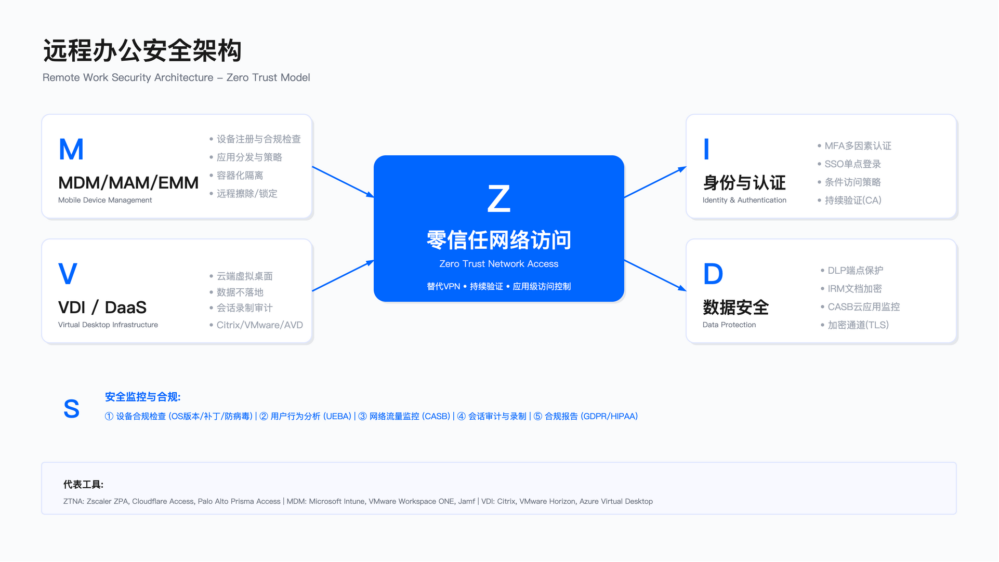

# 10.5　移动与远程办公安全

## 概述

> 导读：本节讨论安全边界从办公室扩展到员工家庭、咖啡店、机场后的系统性应对。这不只是技术问题——正确的设备策略选择（10.5.1）决定了后续所有技术控制的可行性，因为对个人设备强推 MDM 会触发政治阻力，再好的技术也无法落地。10.5.2 的 MAM 容器化方案解决 BYOD 场景下的数据隔离；10.5.3 的 ZTNA 从架构上修复 VPN 过度授权的根本缺陷；10.5.4 的虚拟桌面处理数据绝不能落地端点的场景；10.5.5 坦诚面对企业几乎无法控制的家庭网络——并说明为什么 ZTNA 是应对这一残余风险的最实际出口。

混合办公模式已成为多数企业的常态。这一转变从根本上改变了安全边界的定义：员工通过家庭网络、公共 Wi-Fi 等不受控网络访问企业资源，个人设备大量接入企业系统，传统 VPN 架构暴露出它从设计之初就存在的结构性缺陷——"连上了就信任整个网络"。

---

## 10.5.1 设备管理策略选择

### 策略类型与适用场景

移动设备管理策略主要分为四类，每类在安全性、用户体验、管理成本之间有不同权衡。没有普遍最优解——错误不是选了哪种策略，而是把一种策略强加给所有场景。

BYOD（Bring Your Own Device） 允许员工使用个人设备访问公司资源。优势在于员工满意度高、无设备采购成本、用户对设备操作熟悉。主要风险在于安全边界模糊：员工对监控的抵触心理可能导致政策落地率低，设备多样性（iOS/Android 不同版本、厂商定制）增加支持复杂度。适用于初创公司、灵活文化的组织，以及临时人员、承包商需要快速接入但不宜配发设备的场景。

COPE（Corporate-Owned, Personally Enabled） 由公司提供设备，同时允许员工一定程度的个人使用。优势在于安全可控、统一管理、离职时数据擦除无争议。主要约束是设备采购与维护成本较高，且员工可能需要同时携带个人设备。适用于金融、医疗、政府等高合规要求行业——在这些行业里，"对设备有完全控制能力"是审计检查表上的明确要求。

CYOD（Choose Your Own Device） 提供设备选择清单，员工从预批准型号中选购，公司提供全额或部分补贴。在安全性（预批准设备、统一配置）与灵活性（用户选择）之间取得平衡，适用于中大型企业。

COBO（Corporate-Owned, Business Only） 公司设备仅限工作用途。安全性最高，但用户体验最差。远程办公场景下 COBO 政策执行面临挑战：没有了办公室物理环境的监督，"禁止个人使用"在实践中很难界定和执行。

### 混合策略设计

多数企业不应也无需在四种策略中选一种全员统一执行，而应针对不同角色实施差异化：

- 高管与核心岗位（R&D、财务）：COPE，确保安全可控
- 知识工作者（销售、市场）：CYOD，平衡安全与体验
- 承包商与临时人员：BYOD + MAM，降低成本，数据不落地个人应用
- 生产线员工：共享设备，集中管理

### 关键约束

三年 TCO 评估——BYOD 表面上节省设备采购成本，但需计入 MDM/MAM 许可费、多样化设备的支持成本以及潜在安全事件的损失。用单一采购成本做比较会得出错误结论。

合规要求的强制性——金融、医疗等受监管行业通常要求对数据处理设备具有完全控制能力，COPE 或 COBO 更易满足审计要求。BYOD 场景下需额外证明数据隔离与擦除能力，这是可以做到的，但举证负担会更重。

退出机制必须前置设计——未在政策制定阶段明确"员工离职时如何擦除数据、归还设备"，等到离职纠纷发生时再处理代价极高，是这类项目最常见的漏洞之一。

常见误区：一刀切策略——对所有员工统一执行，忽视角色差异，导致某些岗位安全过度（生产力受损）而另一些岗位安全不足（风险未覆盖）；低估支持复杂度——BYOD 设备的 OS 版本碎片化显著增加 IT 支持工单量，这笔成本在规划阶段往往被低估。

验证方法：在试点群体中测试策略的技术可行性与用户接受度；模拟离职场景验证数据擦除流程的完整性；审计设备合规率，识别未注册或不合规设备。

运行指标：

| 指标 | 说明 |
|-----|------|
| 设备注册率 | 应注册设备中已完成注册的比例 |
| 设备合规率 | 符合安全基线的设备占注册设备的比例 |
| 用户申诉率 | 因策略限制导致的 IT 工单数量 |

---

## 10.5.2 MDM/MAM 技术栈

### MDM 与 MAM 的定位差异

MDM 与 MAM 代表两种不同的管理粒度，选择错误会导致技术上可行但政治上无法落地。

MDM（移动设备管理） 在设备层面实施管理，包括设备注册、策略强制执行（密码强度、加密、越狱检测）、远程操作（锁定、擦除、定位）、合规报告。MDM 要求在设备上安装管理配置文件，对个人设备侵入性较高——员工担忧的是"公司能看到我手机里的照片吗"，这种担忧即使在技术上是错误的，也会实质性地阻碍 BYOD 场景下的 MDM 推广。

MAM（移动应用管理） 仅管理企业应用及其数据，不触及个人数据与应用。核心能力包括：应用容器化（企业数据隔离）、应用内策略（禁止复制粘贴到非受管应用、离线访问限制）、选择性擦除（仅删除企业应用数据）。MAM 是 BYOD 场景下的首选方案——"我们只管理 Outlook 和 Teams，不碰你的相册"是员工可以接受的界限。

核心约束：MAM 侵入性低但保障有限——它无法控制设备层面的安全，如强制全盘加密、检测越狱。如果员工在越狱设备上运行企业邮件，MAM 容器保护仍然存在，但设备本身已不可信。这需要结合条件访问策略弥补（见下文）。

### 技术实现要点

设备注册：企业设备可通过零接触注册（Apple DEP、Android Zero-Touch、Windows Autopilot）实现开箱即用。远程办公场景下，员工自行注册设备的支持时长显著高于现场配置——需准备详细的视频指导与远程协助流程，并预留足够的 helpdesk 资源在推行初期消化支持需求。

策略执行：典型策略包括密码复杂度要求、设备加密强制、越狱/Root 检测、应用白名单、Wi-Fi 配置推送。注意：Wi-Fi 配置策略主要在办公室有效，远程办公场景下越狱检测的执行力度也因缺乏物理监督而下降——这需要在策略设计时诚实评估执行边界。

选择性擦除：BYOD 场景下的擦除操作需特别谨慎。全盘擦除会删除员工私人数据，可能引发法务风险；MAM 的选择性擦除仅删除企业应用容器内的数据，擦除边界清晰，是 BYOD 场景下的推荐方案。建议在 MDM 注册协议中明确说明哪些数据可被远程删除，并要求员工签字确认。

### 条件访问与零信任集成

MAM/MDM 应与身份提供者（IdP）集成，实现基于设备状态的条件访问：

- 设备未注册 → 拒绝访问敏感应用，或仅允许 Web 访问（无下载、无附件）
- 操作系统版本低于最低要求 → 提示更新，否则降级权限
- 检测到越狱 → 阻止访问敏感应用（而非全部拒绝，避免员工绕过）
- 异常位置登录 → 触发强 MFA 验证

条件访问的设计原则：分级限制而非二元阻断。"越狱设备不能访问敏感应用，但仍可访问企业通讯工具"比"越狱设备全面封禁"更实际——全面封禁会促使员工寻找绕过方法。

常见误区：MDM 强推 BYOD 场景——忽视员工对监控的抵触情绪，政策执行率低甚至出现员工集体抵制；擦除边界不清——系统能力上可以做选择性擦除，但未在政策和操作规程中明确，出现问题时举证困难；忽视离线场景——员工关闭 Wi-Fi 可以绕过部分 DLP 检测，需要在端点层面而非网络层面落地关键控制。

验证方法：红队测试越狱检测的有效性（使用已知越狱工具验证检测能力）；模拟离职流程验证选择性擦除的准确性（确认只删企业数据）；测试条件访问策略在边界场景下的行为（网络切换、设备状态变更时的会话处理）。

运行指标：

| 指标 | 说明 |
|-----|------|
| MDM/MAM 客户端在线率 | 管理覆盖范围的基础指标 |
| 条件访问策略触发次数与原因分布 | 反映策略有效性与常见触发场景 |
| 选择性擦除成功率 | 衡量数据清理能力 |

---

## 10.5.3 零信任网络访问（ZTNA）

### VPN 架构的结构性缺陷

理解 ZTNA 为何重要，必须先清楚 VPN 的问题到底出在哪里——不是实现质量问题，而是架构设计问题。

过度授权是最根本的缺陷：VPN 连接成功后，用户获得对整个内网的访问权限，远超实际业务需要。销售人员需要访问 CRM，但 VPN 给了他访问财务系统的网络路径。攻击者获取 VPN 凭证后，面对的是一张无隔离的内网——横向移动的阻力极小。

性能瓶颈源于回传架构：所有流量经 VPN 网关，规模化远程办公时带宽瓶颈与延迟问题明显，用户体验下降导致员工主动绕过 VPN（"VPN 太慢了，我直接连"），形成安全黑洞。

单点攻击面：VPN 网关本身是暴露在公网的关键资产。Pulse Secure CVE-2021-22893（认证绕过，CVSS 3.1 基准分 10.0）[1]、Fortinet CVE-2018-13379（路径遍历，CVSS 3.x 基准分 9.8）[2] 等漏洞曾被 APT 组织大规模利用，网关被攻破即等于内网直接暴露（漏洞详情可通过 NIST NVD 数据库 https://nvd.nist.gov 查询）。

这三个问题不是靠"更好的 VPN 产品"解决的——它们是"先通过网络层认证、再给予网络访问"这一设计范式的内在局限。

### ZTNA 架构原理

ZTNA 基于"永不信任、始终验证"原则（其参考架构与七项基本原则见 NIST SP 800-207）[3]：

应用级访问：授权粒度从"网络"降到"应用"，用户只能访问被明确授权的具体应用，无法触及其他内网资源。即使凭证被盗，攻击者看到的也只是授权给这个账户的几个应用入口，横向移动空间极小。

身份中心：访问决策基于用户身份、设备状态（是否合规、是否越狱）、位置（可信网络/不可信网络）、风险评分等多维度因素，而非简单的网络位置。"你在内网"不再是信任的依据。

持续验证：ZTNA 在整个会话期间持续评估设备与用户状态，检测到风险变化（如设备合规状态变化、异常行为）即可终止会话。VPN 的模式是"一次认证、持续信任"，这在会话存活数小时的情况下会积累大量风险敞口。

直连架构：通过边缘节点或应用连接器，用户流量直接到达应用，不经过中心网关，延迟显著低于 VPN 回传。

### 部署模式选择

Agent 模式：在用户设备安装客户端，支持所有类型应用（Web、TCP、UDP）。适用于企业管控设备，提供完整的设备状态评估能力。设备状态信息（系统补丁状态、EDR 运行状态、磁盘加密状态）可用于动态调整访问权限。

Agentless 模式：通过浏览器直接访问，无需安装客户端。适用于承包商、临时访问场景，部署阻力小。局限：仅支持 Web 应用，无法保护 SSH、RDP、数据库连接等非 HTTP 协议——这意味着运维人员、DBA 通常仍需要另外处理。

### VPN 到 ZTNA 的迁移策略

渐进式迁移是实践中经过验证的路径，全量切换往往导致业务中断：

1. 试点阶段：选择少量低风险应用和自愿用户，验证 ZTNA 技术可行性与用户体验
2. 扩展阶段：将更多应用迁移至 ZTNA，VPN 保留作为回退，双轨并行
3. 主体迁移：覆盖大部分用户与应用，VPN 使用量自然萎缩
4. 最小化 VPN：把无法迁移的遗留系统收拢到一个范围明确、持续加固的最小 VPN 上（某些老旧应用的协议兼容问题会长期存在）

前三个阶段（试点到主体迁移）通常以年计而非以季度计（**这里不给具体月数区间——公开数据里没有可引用的迁移周期基准，任何一个"12 至 24 个月"式的数字都是拍出来的；真实周期由遗留系统数量和跨团队协调成本决定，两家规模相近的公司可以差三倍**）。核心阻力来自遗留系统兼容性而非用户接受度——用户普遍感知 ZTNA 比 VPN 更快更稳定。但**"完全退役 VPN"通常是数年工程**，而且对相当一部分组织不会真正完成：依赖服务端主动连接的胖客户端、被动模式文件传输、部分工业软件的通信模型与 ZTNA"客户端发起"的假设不兼容，这类应用是 VPN 无法退役的真正原因。按"12 至 24 个月完成退役"排期，结果通常是 VPN 既没退役也没加固，长期停在最差状态。

因此第 4 阶段的正确目标应当定为**冻结加最小化**而非关停：明确宣布某日之后不再为 VPN 新增应用与新增用户组，把它变成只出不进的存量系统，同时按最高等级维护它的补丁与多因素认证。VPN 加固清单、按协议分类的应用迁移矩阵、以及连接器、私有 DNS、分流、协议覆盖这四个高频坑，见 [15.9.2 与 15.9.3](../../第05部分_身份网络与业务连续性/第15章_网络基础设施与终端安全/15.9_远程接入与SASE演进.md)。

常见误区：急于退役 VPN——未完成应用覆盖即关闭 VPN，引发业务中断，迫使快速回退，损失信任；条件访问策略过严——上线初期 MFA 触发频率过高，用户投诉大量涌入，被迫降低策略强度，最终形同虚设；忽视协议覆盖——Agentless 模式仅支持 Web，对 SSH/RDP 的遗留需求没有方案，运维人员仍走 VPN，形成持续的例外漏洞。

验证方法：红队测试 ZTNA 环境下的横向移动能力（应无法访问未授权资源）；验证 Agentless 模式下的协议覆盖度与盲区；测试网络切换场景下的会话连续性（从 Wi-Fi 切换到 4G 时会话是否中断）。

运行指标：

| 指标 | 说明 |
|-----|------|
| ZTNA 覆盖的应用占比 | 迁移进度的主要衡量指标 |
| 访问延迟（ZTNA vs VPN） | 性能收益的量化证据，也是推进迁移的内部说服材料 |
| 条件访问阻断率与误阻断率 | 策略精准度，误阻断率过高需优先调优 |

本小节从信息保护角度说明 ZTNA 为什么能修复 VPN 的过度授权，并给出与设备策略绑定的迁移阶段划分。ZTNA 自身的工程细节——连接器部署位置与故障域、私有 DNS 解析、分流策略、非 HTTP 协议的覆盖缺口、应用迁移的分批逻辑，以及 SSE 服务不可用时的降级预案——见 [15.9](../../第05部分_身份网络与业务连续性/第15章_网络基础设施与终端安全/15.9_远程接入与SASE演进.md)。两节的分工是：**本节定阶段与设备侧前提，15.9 定每个阶段的进入与退出条件**；周期数字以 15.9 的口径为准，因为它是按协议覆盖与遗留系统实测推出来的。

---

## 10.5.4 虚拟桌面（VDI/DaaS）

### 方案定位

虚拟桌面将计算环境集中托管，终端仅显示画面，数据不落地端点。这是数据"绝对不能离开受控环境"场景下的解决方案，而不是通用的远程办公方案——这一定位必须在规划阶段讲清楚，否则后续"为什么不能全员推广"的问题会反复出现。

VDI在本地数据中心托管虚拟桌面。数据主权可控，已有基础设施可复用。前期资本投入高，运维复杂度高，广域网延迟影响体验。适用于大型企业、有数据本地化要求的行业（如政府、金融）。

DaaS由云服务商托管虚拟桌面。弹性扩展，快速部署，运维外包。长期订阅成本、依赖云连接、跨区域延迟是主要约束。适用于中小企业、临时项目、全球分布团队。

典型适用场景：

- 承包商访问敏感数据：临时人员通过虚拟桌面处理数据，项目结束即删除环境，无遗留数据清理问题
- BYOD 高敏感操作：个人设备用户通过虚拟桌面访问财务、HR 系统，数据不落地个人设备
- 离岸开发：代码在 VDI 环境内编译运行，不通过网络传输到开发者本地，保护知识产权
- 并购尽职调查：隔离环境访问对方数据，交易失败可瞬间切断，无数据留存风险

### 安全收益与固有局限

安全收益：端点丢失不影响数据安全（数据集中存储）；可即时撤销访问权限，无遗留数据清理问题；可实现会话录制满足审计要求；统一安全基线，降低端点差异带来的风险。

固有局限：无法完全防止屏幕截图与拍照——用户拿出另一台手机对着屏幕拍，任何技术都拦不住；完全依赖网络，离线无法工作；图形密集型应用（CAD、视频编辑）需要 GPU 加速，DaaS 成本会显著上升。

延迟控制是用户体验的关键变量。可接受延迟通常在 100ms 以内，超过 200ms 用户开始明显感知卡顿（具体阈值因应用类型而异：文字处理容忍度较高，实时交互类要求更严格）。跨地域访问通过边缘节点部署可改善延迟，但增加运维复杂度。

常见误区：将虚拟桌面作为通用方案推广——强制全员使用会显著影响生产力；忽视网络依赖——未评估员工家庭网络质量就大规模推行，网络中断即工作中断；低估成本——DaaS 的带宽、存储、GPU 实例、管理许可费用累加后常超过预期。

验证方法：在不同网络条件下测试用户体验（延迟、带宽限制场景）；验证会话超时与强制重认证机制；测试外设兼容性（打印机、USB、多显示器）与典型故障场景。

运行指标：会话平均延迟、会话断开率、用户满意度评分，三者综合反映方案的实际交付质量。

---

## 10.5.5 家庭网络风险

### 风险类别与现实边界

远程办公将企业安全边界延伸至员工家庭网络，而家庭网络的安全状态通常不受企业控制——这一现实必须直面，而不是试图"把家庭网络管起来"。

路由器安全：家用路由器普遍存在默认密码未修改、固件长期未更新、使用过时加密协议等问题。被入侵的路由器可用于中间人攻击、DNS 劫持、流量监控。

IoT 设备风险：智能摄像头、音箱、恒温器等 IoT 设备安全更新不及时，可能成为攻击者进入家庭网络的跳板，进而影响同一网络中的工作设备。这条攻击链是真实存在的，并不是理论威胁。

家庭成员设备：家庭成员下载的恶意软件可能感染整个家庭网络，工作设备在同一 LAN 中面临横向攻击风险。

公共网络：员工在咖啡店、酒店使用公共 Wi-Fi 时，面临假冒热点、流量窃听等风险，且员工往往在赶时间时最不愿意先连 VPN。

### 缓解策略

端点防护强化：EDR 覆盖远程设备，检测网络层威胁；强制 VPN/ZTNA，将流量加密后送出家庭网络——这是最实际的家庭网络风险缓解手段；配置主机防火墙，限制非必要网络通信。端点防护比家庭网络防护更可控，应优先投入。

企业路由器计划：向高敏感岗位员工提供预配置的安全路由器，配置 WPA3 加密、自动固件更新、访客网络隔离。此方案成本与物流复杂度较高（设备采购、快递、远程配置支持），通常仅覆盖高管、财务等关键岗位——不是一个可规模化的方案。

ZTNA 是结构性应对：ZTNA 架构下，即使家庭网络被入侵，攻击者仍需通过身份验证与设备状态检查才能访问企业资源。这是为什么 10.5.3 的 ZTNA 迁移对远程办公安全有超出"网络访问"本身的价值——它实质上将企业安全控制点从"网络边界"前移到"用户身份与设备状态"，家庭网络的不安全性变成了一个相对次要的变量。

用户教育：培训内容应包括路由器密码修改与固件更新、公共 Wi-Fi 风险意识、VPN 使用规范。培训的主要价值在于降低可预防的疏忽风险，对于有意规避安全控制的行为效果有限——不应过度依赖培训替代技术控制。

适用边界：企业无法完全控制员工家庭网络，且强行控制会触碰员工隐私边界。对于无法通过技术手段缓解的残余风险，网络安全保险是合理的风险转移工具（见 10.7.4 风险转移策略）。

常见误区：试图完全控制家庭网络——成本高昂，涉及员工隐私，难以规模化，且员工抵制会使政策形同虚设；依赖用户自觉——安全培训效果随时间显著衰减，不能替代技术控制；忽视隐私边界——企业监控延伸至家庭网络的非工作设备，会引发严重的员工关系问题。

验证方法：通过 EDR 告警分析识别家庭网络环境特有的威胁模式；模拟公共 Wi-Fi 攻击场景验证 VPN/ZTNA 强制策略的有效性；进行安全意识培训效果的周期性评估（模拟钓鱼测试通过率变化趋势）。

运行指标：

| 指标 | 说明 |
|-----|------|
| 远程设备 EDR 告警数量与类型分布 | 反映威胁态势 |
| VPN/ZTNA 使用率（对比直连率） | 衡量策略执行情况，直连率是重要的风险指标 |
| 安全培训完成率与模拟钓鱼通过率 | 衡量安全意识水平，对比培训前后趋势 |

---

## 本节小结

移动与远程办公安全的核心挑战是：安全控制必须在企业无法完全控制的环境中有效运行。正确的姿态不是把安全控制点建在网络边界上——那个边界已经不存在了——而是把控制点前移到用户身份、设备状态、应用访问授权上。

关键决策建议：

- 设备策略按角色风险分级，BYOD + MAM 用于控制成本，COPE 用于高合规要求岗位
- BYOD 场景坚持 MAM 而非 MDM，避免政治阻力导致覆盖率低
- ZTNA 是 VPN 的演进方向，采用渐进迁移，12 至 24 个月完成
- 虚拟桌面仅用于数据不可落地端点的高敏感场景，不作通用方案
- 家庭网络风险通过端点防护与 ZTNA 架构化解决，不试图控制家庭网络本身

实施优先级：基础防护阶段（MAM/条件访问/EDR 远程覆盖）→ 架构演进阶段（ZTNA 替代 VPN）→ 成熟运营阶段（统一 SASE 平台、持续风险评估）。

---

## 参考文献

| # | 来源 | 标题 | 日期 | 链接 |
| --- | --- | --- | --- | --- |
| [1] | NIST NVD | CVE-2021-22893（Pulse Connect Secure 认证绕过，CVSS 3.1 基准分 10.0） | 2021-04 | <https://nvd.nist.gov/vuln/detail/CVE-2021-22893> |
| [2] | NIST NVD | CVE-2018-13379（Fortinet FortiOS SSL VPN 路径遍历，CVSS 3.x 基准分 9.8） | 2019-06 | <https://nvd.nist.gov/vuln/detail/CVE-2018-13379> |
| [3] | NIST | SP 800-207: Zero Trust Architecture（ZTNA 参考架构） | 2020-08 | <https://csrc.nist.gov/pubs/sp/800/207/final> |

---

## 导航

[← 上一节：10.4 内部威胁防护](./10.4_内部风险防护.md) | [返回章节目录](./README.md) | [下一节：10.6 知识产权保护 →](./10.6_知识产权保护.md)

---

© 2025-2026 AISecOps Project. Licensed under CC BY-NC-SA 4.0
