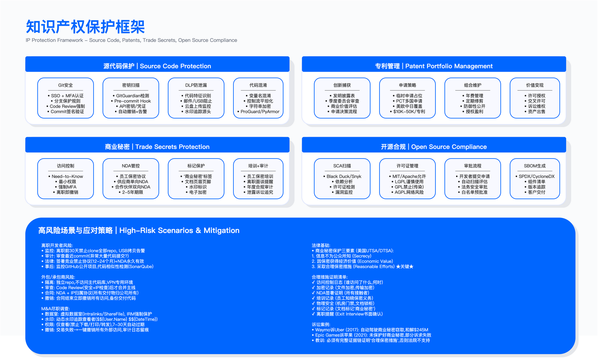

# 10.6　知识产权保护

> 前置依赖：开源许可证合规的技术实施（SCA 工具选型、SBOM、许可证风险分级、CVE 工单闭环）见 7.3，本节 10.6.4 只从知识产权与法务举证的视角补充，不重复技术实现。

## 概述

> 导读：本节讨论的知识产权保护与前几节的数据保护有本质区别——保护对象从"数据"变成了"竞争优势本身"。10.6.1 的源代码保护是大多数技术企业最紧迫的场景，密钥泄露和离职开发者是两个最高频风险点；10.6.2 的专利与商业秘密选择是法律策略决策，技术可逆向性是关键判断变量；10.6.3 的 NDA 管理看似行政事务，但"合理保密措施"的举证完整性直接决定诉讼中能否赢（"采取相应保密措施"正是《反不正当竞争法》对商业秘密的法定要件之一，见该法 2025 年修订后的第十条[1]）；10.6.4 的开源合规是被低估的风险——GPL 传染性触发才发现，代价可能是被迫开源商业核心代码。

知识产权构成企业核心竞争力的重要组成部分，涵盖源代码、算法、专利、商业秘密等关键资产。知识产权保护的核心挑战在于：技术措施需与法律框架协同——技术手段提供预防和证据，法律手段提供追诉能力——两者缺一不可，单靠任何一方都无法完整应对。

*图 10.7：知识产权保护框架——源代码、专利、商业秘密、品牌四维度综合防护体系*

---

## 10.6.1 源代码保护

源代码是软件企业最核心的 IP 资产，也是最难保护的：每个有权访问代码仓库的开发者都有能力在几分钟内克隆整个代码库到本地。保护的核心逻辑不是阻止技术能力，而是建立检测、威慑和追溯机制，同时配合法律约束提高窃取代价。

### Git 安全控制

Git 仓库的安全控制从四个维度构建：

身份认证：强制启用 SSO（单点登录）与 MFA（多因素认证），禁止使用本地账号直接访问代码仓库。SSO 的核心价值不只是单点登录的便利，而是在员工离职时能通过一个操作（禁用 SSO 账户）切断所有系统访问——这在离职风险管理中是关键控制点。

授权粒度：遵循最小权限原则，开发者仅访问其负责的仓库，跨团队访问需要审批。从"所有工程师可访问所有仓库"的开放文化调整到最小权限，往往面临工程师文化的阻力（"我信任我的同事"）——这需要管理层支持，并通过案例说明这属于系统性风险控制，与信不信任同事无关。

分支保护：主分支（main/master）的合并必须经过代码审查（Code Review）且 CI 流水线通过。分支保护会增加代码合并的等待时间，这是显性的效率成本，应在项目启动时坦诚告知工程团队，而不是上线后遭遇抵制。

审计日志：记录所有 git 操作（clone、push、pull、fork），保留期限应满足合规与取证需求。审计日志在日常运营中看起来"没用"，但在安全事件调查中往往是唯一的证据来源——"那时候没开日志"是最常见的追溯失败原因。

验证方法：定期执行权限审计，确认无过度授权账号；对主分支进行 force push 测试，验证保护规则是否有效；抽查审计日志，验证关键操作是否有完整记录。

### 密钥泄露检测

API 密钥、云服务凭证、数据库密码等敏感信息意外提交至代码仓库，是频率极高的安全事故。一旦进入 git 历史，即使后续删除，在 git reflog 或公开仓库的任何历史快照中仍然存在——清理代价远超预防代价。

检测应部署在两个阶段：pre-commit hook（本地检查，在提交前拦截）和 CI 流水线（服务端检查，作为兜底）。仅有服务端检测意味着敏感信息已进入 git 历史才被发现，pre-commit 才是真正的预防。

工具选项：GitGuardian、TruffleHog、GitHub Secret Scanning（内置于 GitHub）等。检测到敏感信息后的响应流程：阻止 push 操作 → 自动撤销已泄露的凭证 → 通知开发者修复 → 审计影响范围。

常见误区：检测规则过于宽泛——将测试环境的模拟凭证（如 `test_api_key_12345`）标记为泄露，产生大量误报，开发者开始忽略告警。规则调优应区分"形态上是凭证"和"实际有效的凭证"。

运行指标：密钥泄露事件数（按严重等级分层：生产凭证 vs 测试凭证）、平均修复时间（从检测到凭证撤销的时长）。

### 代码签名

代码签名用于验证提交的完整性与来源，防止供应链攻击中的恶意代码注入。开发者使用私钥对 commit 进行 GPG 签名，CI 系统在构建前验证签名有效性。

适用边界：代码签名对发布分支和核心库价值最大；频繁提交的开发分支可仅要求合并至主分支时签名，避免过高的操作摩擦。

关键约束：私钥管理增加开发者操作复杂度；若私钥丢失，需建立密钥轮换与吊销流程；强制签名会在初期产生较多支持工单（开发者环境配置问题）。

### 代码泄露防护

代码泄露防护需覆盖多种外发渠道：邮件、USB 设备、云盘、即时通讯工具、外部代码平台。DLP 系统可通过识别代码特征（函数签名、专有库引用、特定注释格式）检测代码外发行为。

DLP 规则设计需考虑开发者的合法需求：在 Stack Overflow 分享代码片段解决问题、向面试者展示技术能力、在开源社区贡献无关代码——这些都是可能触发告警但属于合法行为的场景，需要明确的例外处理流程，而非简单阻断。

代码水印（在注释或字符串中嵌入开发者标识）适合作为泄露后追溯工具，而非预防工具——水印易被刻意删除，但要证明水印存在需要事先记录原始文件，这对法律追诉有价值。

离职开发者风险管理：离职通知提交当日应限制高风险操作（clone 大量仓库、批量下载）；审查离职前的异常 commit 行为；确保竞业禁止协议覆盖关键岗位（需符合当地劳动法规——各国和地区的可执行性差异显著）；离职后可通过工具监控公开代码平台（GitHub/GitLab）是否出现相似代码。

第三方开发者管理：外包或承包商应使用独立隔离的仓库（不访问主代码库）；代码合并前需经过安全与 IP 审查；签署 NDA 与 IP 归属协议（见 10.6.3）；合同终止后立即撤销所有访问权限。

### 代码混淆与加固

代码混淆通过增加逆向工程难度保护核心算法。常见技术包括：名称混淆（变量/函数名替换为无意义字符）、控制流混淆（插入无用分支干扰逻辑分析）、字符串加密、反调试检测。

适用边界：主要适用于客户端代码（Web 前端、移动 App）、核心算法推理逻辑、软件授权检查模块。服务端代码通常无需混淆，因其不直接暴露给外部。

所有混淆技术均可被逆向——混淆提高的是逆向的时间成本，而非绝对安全屏障。对于真正需要保密的核心算法，商业秘密（见 10.6.2）与服务端部署（算法运行在服务器，客户端只能看到 API 接口）比客户端混淆更有效。

常见误区：对所有代码一律混淆，增加维护复杂度——混淆后的代码难以调试，生产环境问题排查成本显著上升。正确做法是仅对核心算法混淆，非核心代码保持可读性。

---

## 10.6.2 专利与商业秘密管理

专利与商业秘密是保护技术创新的两种法律途径，选择哪种取决于技术特性和商业策略——这是法律策略问题，安全团队应与法律顾问协作，而非单独决策。

### 专利与商业秘密的选择框架

专利通过公开技术细节换取法定独占权。优势在于保护力度强、可通过授权获得收益、构成竞争壁垒；劣势在于技术细节公开后竞争对手可学习、申请成本较高（专利律师费 + 申请费）、保护范围受地域限制（美国专利在中国无效，需单独申请）。

商业秘密通过保密获取竞争优势，无需公开、无期限限制（只要保密成功）、无地域限制。中国法下商业秘密的构成要件与侵权认定见《反不正当竞争法》第十条[1]（该法 2025 年 6 月 27 日修订通过、2025 年 10 月 15 日起施行，商业秘密条款由原第九条移至第十条，四类侵权行为的实质内容与 2019 年修正版一致——引用旧条号会指向已被替换的条文）；美国联邦层面的对应依据是 2016 年《商业秘密保护法》（DTSA）[2]。劣势在于一旦泄露即失去法律保护、侵权举证困难（需证明对方获取了你的秘密，而非独立开发）、竞争对手独立开发相同技术属于合法行为。

决策核心问题：

- 技术是否容易被竞争对手逆向工程？若容易（如硬件设计、化学配方），申请专利在对方能独立复制之前先确立权利；若难以逆向（如软件算法、制造工艺），商业秘密保护期可以无限长
- 技术生命周期是否超过专利保护期？若软件算法的价值期限本来就只有五年，花时间申请专利得不偿失
- 是否计划通过授权获得收益？授权商业模式需要专利——商业秘密无法授权给他人使用

### 商业秘密保护的法律要求

商业秘密获得法律保护需满足三项要件：秘密性（信息不为公众所知）、价值性（因保密而具有经济价值）、合理努力（权利人采取了合理保密措施）。

"合理保密措施"在诉讼中是关键举证点，通常需要以下证据：限制访问（仅 need-to-know 人员）、签署保密协议（所有接触者签署 NDA）、物理安全（锁定机房）、数字安全（加密、DLP、审计）、文档标记（标注"商业秘密——禁止披露"）、员工培训记录、离职面谈记录。

常见误区：仅依赖技术措施——系统有加密、有 DLP，但没有 NDA 签署记录、没有员工培训记录、没有文档标记，在法庭上难以证明"合理努力"；笼统标记"商业秘密"——将所有内部信息都贴上"商业秘密"标签，会稀释真正核心秘密的保护力度（法院可能认为你并未认真对待真正的秘密），且增加员工合规负担。

### 专利组合管理

创新识别：建立发明披露流程（Invention Disclosure Form），鼓励工程师提交，由专利委员会评估商业价值，决定申请专利、作为商业秘密保护还是防御性公开（公开发表以阻止他人申请相同内容的专利）。防御性公开是一种低成本选项，适合不想申请专利但也不想被竞争对手专利封锁的技术。

申请策略：先提交临时申请（Provisional Application）可快速占位（12 个月内转为正式申请）；对于国际市场，PCT 申请允许在规定期限内选择进入具体国家，而无需在初始阶段承担全部申请成本。

组合维护与修剪：专利维持需要持续支付年费，成本随年份增加。应定期审查组合，放弃非核心专利以节省成本——"沉默专利"不只是浪费年费，还会分散专利维护的管理注意力。

变现路径：授权（收取专利费）、交叉许可（与其他专利持有人互换权利以避免诉讼）、专利出售（转让所有权），以及防御性用途（应对竞争对手的专利攻击时作为谈判筹码）。

---

## 10.6.3 保密协议（NDA）管理

NDA 是知识产权保护的法律基础，也是最容易在流程执行中出现漏洞的环节——很多组织有模板，但没有系统性跟踪哪些合作方签了、哪些没签、哪些已经到期。

### NDA 类型

双向 NDA：双方互相交换机密信息，双方均承担保密义务，适用于商业合作谈判（双方都在分享）。

单向 NDA：仅一方披露信息，接收方承担保密义务，适用于供应商、外包开发商、顾问场景。这是最常见的形式。

员工保密协议：入职时签署，覆盖员工接触的所有公司信息。保密义务通常延续至离职后若干年，商业秘密条款可约定永久——但永久约束的可执行性因司法辖区而异，需要法律顾问确认。

### NDA 关键条款

机密信息定义：宜采用宽泛定义配合具体示例——"包括但不限于以下类型信息：技术规格、财务数据、客户名单……"既覆盖未来可能的信息类型，又提供明确的判断指引。定义过窄会在实际争议中留下漏洞。

排除条款：标准排除包括已公开信息、接收方先前已知信息、独立开发信息、法律强制披露（但需提前通知披露方以争取异议机会）。这些排除条款是被告方的常用抗辩——协议起草时应明确要求举证责任在接收方。

保密义务：不得向第三方披露、仅用于约定目的、采取合理保密措施（与"合理努力"要件对应）、禁止逆向工程（适用于软件场景应明确写入）。

救济条款：因机密信息泄露的损失难以量化，通常约定可申请禁令救济（不只是金钱赔偿），且不设违约金上限。禁令救济的实际意义在于：泄露一旦发生，金钱赔偿往往无法弥补竞争损失，阻止进一步使用才是核心目的。

### NDA 生命周期管理

签署阶段：使用法务批准的标准模板减少逐案谈判成本；非标准修改条款需法务审查，不能让业务团队自行接受；采用电子签名加速流程并保留时间戳。

集中跟踪：建立合同登记系统，维护每份 NDA 的元数据（对方公司、签署日期、到期日、续约提醒、信息类型）。合同存储在文件柜里但无法快速检索"某供应商是否签了 NDA"，在审计或诉讼时是致命的管理漏洞。

到期管理：到期前 90 天提醒，决策续约或终止；到期后确认机密信息已按协议要求返还或销毁——"销毁证明"应作为标准文件存档。

合规审计应定期检查：所有外部合作方是否已签署 NDA；员工是否了解 NDA 义务（培训记录）；发现泄露时的诉讼启动流程是否已演练。

运行指标：NDA 覆盖率（已签署 NDA 的外部合作方占比，不应低于 100%）、到期前续约完成率、到期后材料返还确认率。

---

## 10.6.4　开源许可证的知识产权视角

> 开源合规的技术实施——SCA 工具选型、SBOM 生成与消费、许可证风险分级、CVE 工单闭环、审批工作流——见 **7.3 开源组件治理**，本节不重复。

从知识产权的角度只需要补一件事：**开源许可证风险的落点不是安全，是资产**。SCA 扫出一个 AGPL 依赖，安全团队关心的是它有没有 CVE，法务关心的是它会不会让公司的闭源代码被迫开源。后者的处置路径完全不同——不是打补丁，而是替换组件、隔离进程边界、或者购买商业授权。

因此在知识产权治理里，开源合规需要一条独立于漏洞管理的审批线：高传染性许可证（GPL / AGPL / SSPL）的引入必须经法务会签，而不是由研发在 SCA 门禁上点"接受风险"就过。这条线在多数企业是缺的——SCA 平台把许可证风险和漏洞风险放在同一个队列里，由同一批人处置，结果是法务从来不知道公司引入了什么。

## 本节小结

知识产权保护的有效性取决于技术、法律、流程三层协同——任何一层单独运作都不够：

- 源代码保护：Git 安全控制 + 密钥检测 + 离职风险管理，三者缺一
- 专利/商业秘密：技术可逆向性决定策略选择，"合理保密措施"证据链是诉讼的关键
- NDA 管理：模板不够，需要集中跟踪和到期管理确保覆盖无盲区
- 开源合规：GPL 传染性是真实风险，SBOM 和持续监控是防线

关键决策原则：源代码保护强度需与开发效率平衡，不能因安全控制影响工程速度；开源合规不能依赖工程师的个人意识，必须工具化自动检测。

---

## 参考文献

| # | 来源 | 标题 | 日期 | 链接 |
| --- | --- | --- | --- | --- |
| [1] | 全国人民代表大会常务委员会 | 《中华人民共和国反不正当竞争法》第十条（商业秘密的定义与保密措施要件） | 2025 修订，2025-10-15 施行 | <http://www.npc.gov.cn/npc/c2/c30834/202506/t20250627_446247.html> |
| [2] | 美国国会 | Defend Trade Secrets Act of 2016 (DTSA), Pub. L. 114-153 | 2016-05 | <https://www.congress.gov/bill/114th-congress/senate-bill/1890> |

---

## 导航

[← 上一节：10.5 移动与远程办公安全](./10.5_移动与远程办公安全.md) | [返回章节目录](./README.md) | [下一节：10.7 信息保护运营 →](./10.7_信息保护运营.md)

---

© 2025-2026 AISecOps Project. Licensed under CC BY-NC-SA 4.0
